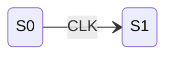

# 822电子技术基础 - 电路图解析

> 📁 详细代码实现见 [code.md](code.md)

## 技能概述

本技能提供822电子技术基础的电路图智能解析功能：

1. **电路图识别**：使用MCP工具识别电路结构
2. **元件参数提取**：提取电阻、电容、晶体管、运放等参数
3. **电路拓扑分析**：分析连接关系、信号流向
4. **静态分析输出**：计算直流工作点
5. **动态分析输出**：计算增益、输入输出电阻
6. **康华光符号体系强制**：严格使用指定教材符号

---

## 触发条件

### 触发此技能当：

**电路图分析**：
- "电路图"、"分析电路"、"帮我看看这个电路"
- "静态分析"、"动态分析"
- "计算工作点"、"计算增益"

**上传电路图**：
- 用户上传电路图截图
- 用户描述电路结构

### 不触发此技能当：
- 解题步骤/SOP → 使用 kaoyan-electronics-sop
- 查询知识点结构 → 使用 kaoyan-electronics-structure
- 配置/状态检查 → 使用 kaoyan-electronics-core

---

## 支持的输入方式

1. **电路图截图**：上传电路图图片
2. **文字描述**：用文字描述电路结构

---

## 处理流程

```
【电路图截图/文字描述】
      ↓
【MCP工具识别】
  - understand_technical_diagram（识别电路结构）
  - extract_text_from_screenshot（提取元件参数）
      ↓
【提取元件信息】
  - 电阻、电容、晶体管、运放等
      ↓
【分析电路拓扑】
  - 连接关系、信号流向
      ↓
【选择对应SOP】
  - 根据电路类型选择标准流程
      ↓
【生成结构化笔记】
  - 静态分析 + 动态分析
```

---

## 模电电路分析标准流程

### 1. 静态分析

计算直流工作点：

**BJT电路**：$I_{BQ}$、$I_{CQ}$、$U_{CEQ}$

**FET电路**：$I_D$、$U_{GS}$、$U_{DS}$

### 2. 动态分析

画微变等效电路：

- 计算增益 $A_u = \frac{U_o}{U_i}$
- 计算输入电阻 $R_i$
- 计算输出电阻 $R_o$

### 3. 频率响应

分析$f_L$、$f_H$、$BW$

---

## 数电电路分析标准流程

### 1. 组合逻辑

- 写逻辑表达式
- 卡诺图化简
- 画逻辑图
- 功能扩展

### 2. 时序逻辑

- 写驱动方程
- 写状态方程
- 画状态转换图
- 分析自启动

---

## 输出格式标准

### 模电电路分析输出

```markdown
# [电路类型]分析

## 电路识别
- 类型：[电路类型]
- 元件：[元件列表及参数]

## 静态分析
$$
I_{BQ} = \frac{V_{CC} - U_{BEQ}}{R_b} = ...
$$

## 动态分析
$$
A_u = -\frac{\beta R'_L}{r_{be}} = ...
$$

## 结论
[结论与要点]
```

### 数电电路分析输出

```markdown
# [电路类型]分析

## 电路识别
- 类型：[电路类型]
- 触发器类型/数量：[...]

## 驱动方程
$$
J_1 = f_1(X, Q), \quad K_1 = g_1(X, Q)
$$

## 状态转换表
| $X$ | $Q_2^n Q_1^n$ | $Q_2^{n+1} Q_1^{n+1}$ | $Y$ |
|-----|--------------|---------------------|-----|
| 0 | 00 | ... | ... |

## 状态转换图


## 结论
[功能描述]
```

---

## 康华光符号体系

> ⚠️ **重要**: 所有输出必须使用康华光《电子技术基础》（第7版）符号体系

### 静态工作点符号

| 符号 | 含义 | LaTeX |
|------|------|-------|
| $I_{BQ}$ | 基极静态电流 | `I_{BQ}` |
| $I_{CQ}$ | 集电极静态电流 | `I_{CQ}` |
| $U_{CEQ}$ | 集射极静态电压 | `U_{CEQ}` |

### 动态参数符号

| 符号 | 含义 | LaTeX |
|------|------|-------|
| $r_{be}$ | BJT输入电阻 | `r_{be}` |
| $g_m$ | 场效应管跨导 | `g_m` |

---

## MCP工具集成

| 工具 | 用途 |
|------|------|
| `understand_technical_diagram` | 识别电路结构 |
| `extract_text_from_screenshot` | 提取元件参数 |

---

## 验证标准

1. ✅ 能够识别电路图结构
2. ✅ 能够提取元件参数
3. ✅ 能够正确选择SOP
4. ✅ 能够输出康华光符号体系格式
5. ✅ 静态分析和动态分析完整

---

## 技能集成

### 依赖技能

| 技能 | 用途 |
|------|------|
| kaoyan-electronics-sop | 选择对应SOP模板 |
| kaoyan-electronics-core | 错误记录 |
| kaoyan-electronics-structure | 知识点关联 |

---

## 📁 模块文档

| 模块 | 文件 | 内容 |
|------|------|------|
| 代码实现 | [code.md](code.md) | 电路识别、参数提取、分析器选择、输出生成、符号转换 |

---

*创建日期: 2026-03-12*
*最后更新: 2026-03-27 (v1.1.0 模块化重构)*
