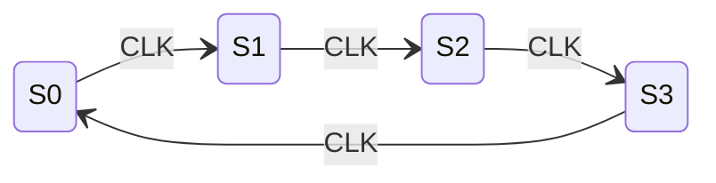

# 822电子技术基础 - SOP模板库

> 📁 详细代码实现见 [code.md](code.md)

## 技能概述

本技能提供822电子技术基础的标准化解题流程（SOP），��含：

1. **模电SOP（8个）**：共射放大、共集/共基、负反馈判断、差分放大、运算电路、功率放大、波形产生、稳压电源
2. **数电SOP（9个）**：逻辑化简、组合逻辑分析/设计、时序逻辑分析/设计、计数器分析/设计、移位寄存器、ADC/DAC
3. **康华光符号体系**：严格遵循指定教材符号
4. **LaTeX电子符号标准**：标准化公式输出
5. **Mermaid波形图**：时序图、状态图生成

---

## 触发条件

### 触发此技能当：

**解题步骤相关**：
- "怎么做"、"解题步骤"、"SOP"
- "反馈类型判断"、"计数器设计"
- "卡诺图化简"、"时序逻辑分析"

**模电题型**：
- "共射放大"、"负反馈"、"运算电路"
- "差分放大"、"功率放大"、"波形产生"
- "稳压电源"

**数电题型**：
- "逻辑化简"、"组合逻辑"、"时序逻辑"
- "计数器"、"移位寄存器"、"ADC"、"DAC"

### 不触发此技能当：
- 分析电路图 → 使用 kaoyan-electronics-circuit
- 查询知识点结构 → 使用 kaoyan-electronics-structure
- 配置/状态检查 → 使用 kaoyan-electronics-core

---

## SOP快速索引

| SOP编号 | 名称 | 类型 | 触发关键词 |
|---------|------|------|------------|
| SOP1 | 共射放��电路分析 | 模电 | 共射、放大电路、$A_u$ |
| SOP2 | 共集/共基分析 | 模电 | 射极跟随器、共基 |
| SOP3 | 负反馈类型判断 | 模电 | 反馈类型、深度负反馈 |
| SOP4 | 差分放大电路分析 | 模电 | 差分、共模抑制比 |
| SOP5 | 运算电路分析 | 模电 | 运放、虚短虚断 |
| SOP6 | 功率放大电路分析 | 模电 | 功放、效率、OCL |
| SOP7 | 波形产生电路分析 | 模电 | 振荡器、起振条件 |
| SOP8 | 稳压电源分析 | 模电 | 稳压电源、整流滤波 |
| SOP9 | 逻辑函数化简 | 数电 | 卡诺图、化简 |
| SOP10 | 组合逻辑电路分析 | 数电 | 分析组合逻辑 |
| SOP11 | 组合逻辑电路设计 | 数电 | 设计组合逻辑 |
| SOP12 | 时序逻辑电路分析 | 数电 | 分析时序逻辑 |
| SOP13 | 时序逻辑电路设计 | 数电 | 设计时序逻辑 |
| SOP14 | 计数器分析 | 数电 | 分析计数器 |
| SOP15 | 计数器设计 | 数电 | 设计计数器 |
| SOP16 | 移位寄存器应用 | 数电 | 移位寄存器 |
| SOP17 | ADC/DAC转换器 | 数电 | ADC、DAC、转换器 |

> 📁 完整SOP模板库见：`/kaoyan-electronics/scripts/templates/sop_library.md`

---

## SOP 示例

### SOP1: 共射放大电路分析

```markdown
## 步骤1: 计算静态工作点Q（康华光符号体系）

### 基极回路方程
$$
I_{BQ} = \frac{V_{CC} - U_{BEQ}}{R_b}
$$

### 集电极电流
$$
I_{CQ} = \beta I_{BQ}
$$

### 管压降
$$
U_{CEQ} = V_{CC} - I_{CQ} R_c
$$

## 答题检查清单
- [ ] 静态工作点使用Q下标（$I_{BQ}, I_{CQ}, U_{CEQ}$）
- [ ] $r_{be}$计算正确
- [ ] 增益负号表示反相
```

### SOP3: 负反馈类型判断

```markdown
## 步骤1: 判断输出取样方式（电压/电流）
- 短路输出端（$R_L=0$）
- 若反馈信号消失 → **电压反馈**
- 若反馈信号仍存在 → **电流反馈**

## 步骤2: 判断输入比较方式（串联/并联）
- 反馈信号与输入信号串联 → **串联反馈**
- 反馈信号与输入信号并联 → **并联反馈**

## 记忆口诀
电压反馈看输出：短路负载反馈无
电流反馈看输出：短路负载反馈留
```

### SOP5: 运算电路分析（关键步骤）

```markdown
## ⚠️ 步骤0: 工作区判断（必做！）

1. **存在负反馈** → 线性区 → **可使用虚短虚断**
2. **开环或正反馈** → 非线性区 → **禁止使用虚短**

| 电路类型 | 工作区 | 能用虚短？ |
|----------|--------|-----------|
| 反相比例放大 | 线性 | ✓ |
| **单限比较器** | **非线性** | **✗** |
```

---

## 康华光教材符号体系

> ⚠️ **重要**: 本技能严格遵循康华光《电子技术基础》（第7版）符号体系

### 符号对照表

| 物理量 | 康华光符号 | 说明 |
|--------|-----------|------|
| 基极静态电流 | $I_{BQ}$ | 下标Q表示静态 |
| 集电极静态电流 | $I_{CQ}$ | 下标Q表示静态 |
| BJT输入电阻 | $r_{be}$ | 小写r表示动态电阻 |
| 夹断电压 | $U_{GS(off)}$ | FET参数 |
| 开启电压 | $U_{GS(th)}$ | MOSFET参数 |

### 与其他教材的区别

| 康华光 | 其他教材 | 说明 |
|--------|----------|------|
| $r_{be}$ | $h_{ie}$ | BJT输入电阻 |
| $U_{GS(off)}$ | $U_P$ | 夹断电压 |
| $I_{BQ}$ | $I_B$ | 静态基极电流 |

> 📁 完整LaTeX指南见：`/kaoyan-electronics/scripts/templates/latex_guide_electronics.md`

---

## Mermaid波形图生成

> 📁 完整Mermaid指南见：`/kaoyan-electronics/scripts/templates/mermaid_guide_electronics.md`

### 计数器时序图示例



---

## 使用方法

1. **选择SOP**：根据题目类型选择对应SOP
2. **按步骤执行**：严格按照SOP步骤执行
3. **检查清单**：使用检查清单验证完整性
4. **灵活调整**：根据具体题目灵活调整SOP

---

## 验证标准

1. ✅ 能够正确选择对应SOP
2. ✅ 能够按步骤引导解题
3. ✅ 能够生成康华光符号体系的输出
4. ✅ 能够生成LaTeX格式公式
5. ✅ 能够生成Mermaid波形图

---

## 技能集成

### 依赖技能

| 技能 | 用途 |
|------|------|
| kaoyan-electronics-core | 错误记录、个性化提醒 |
| kaoyan-electronics-circuit | 电路分析结果 |
| kaoyan-electronics-structure | 知识点关联 |

### 数据文件

| 文件 | 用途 |
|------|------|
| `/kaoyan-electronics/scripts/templates/sop_library.md` | 完整SOP模板库 |
| `/kaoyan-electronics/scripts/templates/latex_guide_electronics.md` | LaTeX符号指南 |
| `/kaoyan-electronics/scripts/templates/mermaid_guide_electronics.md` | Mermaid波形图指南 |

---

## 📁 模块文档

| 模块 | 文件 | 内容 |
|------|------|------|
| 代码实现 | [code.md](code.md) | SOP选择器、符号转换、LaTeX生成、Mermaid生成、检查清单 |

---

*创建日期: 2026-03-12*
*最后更新: 2026-03-27 (v1.1.0 模块化重构)*
