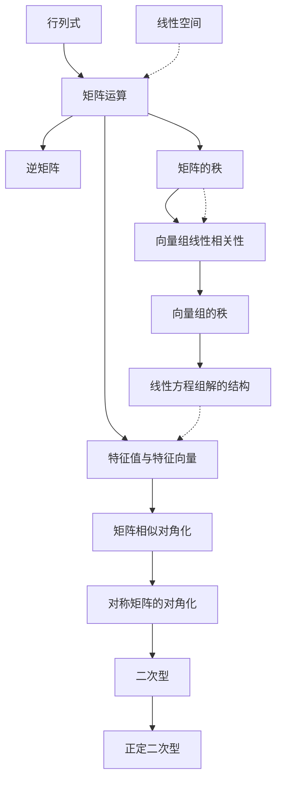

# 线性代数 - 知识图谱

> [!info] 模块信息
> - **模块**: 线性代数
> - **考试类型**: 数学二
> - **预计学习时长**: 40-50小时
> - **考试频率**: ⭐⭐⭐⭐⭐ (必考，约占22-23%)
> - **特点**: 概念多、联系紧密、计算量大

---

## 📚 知识点导航

### 1. 基础工具：行列式与矩阵

| 知识点 | 难度 | 重要程度 | 状态 | 笔记链接 |
|--------|------|----------|------|----------|
| 行列式 | ⭐⭐⭐ | ⭐⭐⭐⭐ | 🔴 待学 | [[行列式]] |
| 矩阵运算 | ⭐⭐ | ⭐⭐⭐⭐⭐ | 🔴 待学 | [[矩阵运算]] |
| 逆矩阵 | ⭐⭐⭐ | ⭐⭐⭐⭐⭐ | 🔴 待学 | [[逆矩阵]] |
| 矩阵的秩 | ⭐⭐⭐⭐ | ⭐⭐⭐⭐⭐ | 🔴 待学 | [[矩阵的秩]] |

### 2. 向量组理论

| 知识点 | 难度 | 重要程度 | 状态 | 笔记链接 |
|--------|------|----------|------|----------|
| 向量组线性相关性 | ⭐⭐⭐⭐ | ⭐⭐⭐⭐⭐ | 🔴 待学 | [[向量组线性相关性]] |
| 向量组的秩 | ⭐⭐⭐⭐ | ⭐⭐⭐⭐⭐ | 🔴 待学 | [[向量组的秩]] |

### 3. 线性方程组（核心重点）

| 知识点 | 难度 | 重要程度 | 状态 | 笔记链接 |
|--------|------|----------|------|----------|
| 线性方程组解的结构 | ⭐⭐⭐⭐⭐ | ⭐⭐⭐⭐⭐ | 🔴 待学 | [[线性方程组解的结构]] |

### 4. 特征值与特征向量（核心重点）

| 知识点 | 难度 | 重要程度 | 状态 | 笔记链接 |
|--------|------|----------|------|----------|
| 特征值与特征向量 | ⭐⭐⭐⭐ | ⭐⭐⭐⭐⭐ | 🔴 待学 | [[特征值与特征向量]] |
| 矩阵相似对角化 | ⭐⭐⭐⭐⭐ | ⭐⭐⭐⭐⭐ | 🔴 待学 | [[矩阵相似对角化]] |
| 对称矩阵的对角化 | ⭐⭐⭐⭐ | ⭐⭐⭐⭐⭐ | 🔴 待学 | [[对称矩阵的对角化]] |

### 5. 二次型

| 知识点 | 难度 | 重要程度 | 状态 | 笔记链接 |
|--------|------|----------|------|----------|
| 二次型 | ⭐⭐⭐⭐ | ⭐⭐⭐⭐ | 🔴 待学 | [[二次型]] |
| 正定二次型 | ⭐⭐⭐⭐⭐ | ⭐⭐⭐⭐⭐ | 🔴 待学 | [[正定二次型]] |

### 6. 拓展知识（了解）

| 知识点 | 难度 | 重要程度 | 状态 | 笔记链接 |
|--------|------|----------|------|----------|
| 线性空间 | ⭐⭐⭐⭐⭐ | ⭐⭐ | 🔴 待学 | [[线性空间]] |

---

## 🎯 学习路线

```
阶段1: 基础工具 (8-10小时)
  行列式 → 矩阵运算 → 逆矩阵 → 矩阵的秩
       ↓
阶段2: 向量理论 (8-10小时)
  向量组线性相关性 → 向量组的秩
       ↓
阶段3: 线性方程组 (8-10小时) 【核心重点】
  解的判定 → 解的结构 → 基础解系 → 通解表示
       ↓
阶段4: 特征值理论 (10-12小时) 【核心重点】
  特征值与特征向量 → 相似对角化 → 实对称矩阵对角化
       ↓
阶段5: 二次型 (6-8小时)
  二次型概念 → 标准形 → 规范形 → 正定性判定
       ↓
阶段6: 综合提高 (4-6小时)
  综合计算题 → 证明题 → 真题演练
```

---

## 🔗 知识点关联图



---

## ⚠️ 跨章节提醒

> [!warning] 知识点之间的强关联
> - **矩阵的秩** 是贯穿全书的红线，几乎所有章节都涉及
> - **线性方程组** 与向量组理论本质相同（行视角 vs 列视角）
> - **特征值** 问题最终会转化为解线性方程组或行列式计算
> - **二次型** 是对称矩阵对角化的直接应用
> - **秩的等式**、**相似对角化条件** 是证明题热点

---

## 📊 考情分析

### 数二考点分布（近5年平均）
| 考点 | 题型 | 出现频率 | 平均分值 |
|------|------|----------|----------|
| 线性方程组 | 选择/填空/解答 | 每年必考 | 10-15分 |
| 特征值与特征向量 | 选择/填空/解答 | 每年必考 | 10-15分 |
| 二次型（含正定） | 解答题 | 高频（大题） | 10-11分 |
| 矩阵的秩 | 选择/填空 | 每年必考 | 4-8分 |
| 向量组线性相关性 | 选择/解答 | 高频 | 8-11分 |
| 相似对角化 | 解答题 | 高频 | 10-11分 |
| 行列式计算 | 选择/填空 | 中高频 | 4分 |
| 逆矩阵 | 选择/填空 | 中频 | 4分 |

### 重点提醒
1. ⭐⭐⭐⭐⭐ **线性方程组**：每年必考大题，必须熟练掌握
2. ⭐⭐⭐⭐⭐ **特征值与对角化**：计算量大，容易出错
3. ⭐⭐⭐⭐⭐ **二次型正定性**：证明题热点，判别法要记牢
4. ⭐⭐⭐⭐⭐ **秩的等式证明**：技巧性强，需总结
5. ⭐⭐⭐⭐ **向量组相关性**：选择题常见，概念要清晰

---

## 📝 学习建议

### 计算能力
1. **行列式计算**：熟练掌握展开法、性质化简、初等变换
2. **矩阵运算**：乘法、逆矩阵、秩的计算要又快又准
3. **特征值计算**：三阶矩阵的特征多项式、特征方程求解
4. **正交变换**：施密特正交化、单位化要熟练

### 概念理解
1. **秩**：是核心概念，理解其本质（行列式非零的最大阶数）
2. **线性相关/无关**：等价条件多，要系统总结
3. **相似对角化**：理解几何意义（线性变换的简化）
4. **正定性**：多种判别法，要知道何时用哪种

### 证明技巧
1. **秩的等式**：利用矩阵分解、分块矩阵、线性方程组
2. **特征值问题**：利用定义、相似性质、对角化条件
3. **正定性**：利用定义、特征值、主子式、合同标准形

### 常见陷阱
1. **矩阵乘法不满足交换律**：$AB \neq BA$
2. **行列式乘法**：$|AB| = |A||B|$，但 $|A+B| \neq |A|+|B|$
3. **伴随矩阵**：$AA^* = A^*A = |A|E$
4. **秩的不等式**：$r(A+B) \leq r(A) + r(B)$

---

## 🔢 重要公式速查

### 行列式
$$|kA| = k^n|A| \quad (A为n阶)$$
$$|A^*| = |A|^{n-1}$$
$$|A^{-1}| = \frac{1}{|A|}$$

### 矩阵
$$(AB)^T = B^T A^T$$
$$(AB)^{-1} = B^{-1} A^{-1}$$
$$(A^*)^{-1} = (A^{-1})^*$$
$$r(A^*) = \begin{cases} n, & r(A)=n \\ 1, & r(A)=n-1 \\ 0, & r(A)<n-1 \end{cases}$$

### 特征值
$$\sum \lambda_i = \text{tr}(A) = \sum a_{ii}$$
$$\prod \lambda_i = |A|$$
$$A \sim \Lambda \Leftrightarrow \text{有} n \text{个线性无关的特征向量}$$

---

*最后更新: 2026-02-27*
