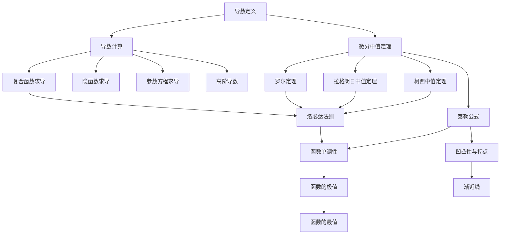

# 一元函数微分学 - 知识图谱

> [!info] 模块信息
> - **模块**: 高等数学 - 一元函数微分学
> - **考试类型**: 数学二
> - **预计学习时长**: 20-25小时
> - **考试频率**: ⭐⭐⭐⭐⭐ (核心核心，必考大题)

---

## 📚 知识点导航

### 1. 导数与微分

| 知识点 | 难度 | 重要程度 | 状态 | 笔记链接 |
|--------|------|----------|------|----------|
| 导数定义 | ⭐⭐ | ⭐⭐⭐⭐⭐ | 🔴 待学 | [[导数定义]] |
| 导数的几何意义 | ⭐⭐ | ⭐⭐⭐⭐ | 🔴 待学 | [[导数的几何意义]] |
| 函数的可导性与连续性 | ⭐⭐⭐ | ⭐⭐⭐⭐ | 🔴 待学 | [[函数的可导性与连续性]] |
| 导数的基本公式 | ⭐⭐ | ⭐⭐⭐⭐⭐ | 🔴 待学 | [[导数的基本公式]] |
| 导数的四则运算 | ⭐⭐ | ⭐⭐⭐⭐⭐ | 🔴 待学 | [[导数的四则运算]] |
| 复合函数求导 | ⭐⭐⭐ | ⭐⭐⭐⭐⭐ | 🔴 待学 | [[复合函数求导]] |
| 隐函数求导 | ⭐⭐⭐ | ⭐⭐⭐⭐ | 🔴 待学 | [[隐函数求导]] |
| 反函数求导 | ⭐⭐⭐ | ⭐⭐⭐ | 🔴 待学 | [[反函数求导]] |
| 参数方程求导 | ⭐⭐⭐ | ⭐⭐⭐⭐ | 🔴 待学 | [[参数方程求导]] |
| 高阶导数 | ⭐⭐⭐⭐ | ⭐⭐⭐⭐ | 🔴 待学 | [[高阶导数]] |
| 微分 | ⭐⭐ | ⭐⭐⭐ | 🔴 待学 | [[微分]] |

### 2. 微分中值定理

| 知识点 | 难度 | 重要程度 | 状态 | 笔记链接 |
|--------|------|----------|------|----------|
| 罗尔定理 | ⭐⭐⭐ | ⭐⭐⭐⭐⭐ | 🔴 待学 | [[罗尔定理]] |
| 拉格朗日中值定理 | ⭐⭐⭐ | ⭐⭐⭐⭐⭐ | 🔴 待学 | [[拉格朗日中值定理]] |
| 柯西中值定理 | ⭐⭐⭐⭐ | ⭐⭐⭐⭐ | 🔴 待学 | [[柯西中值定理]] |
| 泰勒公式 | ⭐⭐⭐⭐⭐ | ⭐⭐⭐⭐⭐ | 🔴 待学 | [[泰勒公式]] |
| 洛必达法则 | ⭐⭐⭐ | ⭐⭐⭐⭐⭐ | 🔴 待学 | [[洛必达法则]] |

### 3. 导数应用

| 知识点 | 难度 | 重要程度 | 状态 | 笔记链接 |
|--------|------|----------|------|----------|
| 函数单调性 | ⭐⭐ | ⭐⭐⭐⭐ | 🔴 待学 | [[函数单调性]] |
| 函数的极值 | ⭐⭐⭐ | ⭐⭐⭐⭐⭐ | 🔴 待学 | [[函数的极值]] |
| 函数的最值 | ⭐⭐⭐ | ⭐⭐⭐⭐⭐ | 🔴 待学 | [[函数的最值]] |
| 曲线的凹凸性 | ⭐⭐⭐ | ⭐⭐⭐⭐ | 🔴 待学 | [[曲线的凹凸性]] |
| 曲线的拐点 | ⭐⭐⭐ | ⭐⭐⭐⭐ | 🔴 待学 | [[曲线的拐点]] |
| 曲线的渐近线 | ⭐⭐⭐ | ⭐⭐⭐⭐⭐ | 🔴 待学 | [[曲线的渐近线]] |
| 函数图形的描绘 | ⭐⭐⭐⭐ | ⭐⭐⭐ | 🔴 待学 | [[函数图形的描绘]] |
| 曲率 | ⭐⭐⭐ | ⭐⭐ | 🔴 待学 | [[曲率]] |

---

## 🎯 学习路线

```
阶段1: 导数计算基础 (8-10小时)
  导数定义 → 基本公式 → 四则运算 → 复合函数
       ↓
  隐函数 → 反函数 → 参数方程 → 高阶导数
       ↓
阶段2: 中值定理 (6-8小时)
  罗尔 → 拉格朗日 → 柯西 → 泰勒公式 ⭐
       ↓
  洛必达法则
       ↓
阶段3: 导数应用 (6-7小时)
  单调性 → 极值 → 最值 → 凹凸性 → 拐点 → 渐近线
```

---

## 🔗 知识点关联图



---

## ⚠️ 跨章节提醒

> [!warning] 与前后章节的关联
> - **极限与连续** 是导数定义的前置知识
> - **不定积分** 是导数的逆运算
> - **定积分** 应用中需要用导数求最值
> - **微分方程** 本质上是导数方程

---

## 📊 考情分析

### 数二考点分布
| 考点 | 题型 | 出现频率 |
|------|------|----------|
| 导数计算 | 选择/填空/解答 | 每年必考 |
| 中值定理证明 | 解答题 | 高频（大题） |
| 函数性质（单调、极值、凹凸） | 解答题 | 每年必考 |
| 不等式证明 | 解答题 | 高频 |
| 方程根的讨论 | 解答题 | 中高频 |
| 洛必达法则 | 选择/填空/解答 | 每年必考 |
| 泰勒公式 | 解答题 | 高频 |
| 渐近线 | 选择/填空 | 高频 |

### 重点提醒
1. ⭐⭐⭐⭐⭐ **复合函数求导**：基础中的基础
2. ⭐⭐⭐⭐⭐ **洛必达法则**：极限计算利器
3. ⭐⭐⭐⭐⭐ **中值定理证明**：证明题核心
4. ⭐⭐⭐⭐⭐ **泰勒公式**：高阶精度工具
5. ⭐⭐⭐⭐⭐ **函数性质综合**：单调、极值、凹凸、渐近线

---

## 📝 学习建议

1. **计算能力第一**：熟练掌握各种求导方法，这是后续应用的基础
2. **理解中值定理**：罗尔、拉格朗日是核心，泰勒公式要会用
3. **综合应用**：能用导数分析函数的所有性质
4. **证明题训练**：中值定理证明是数二难点和重点

---

*最后更新: 2026-02-27*
