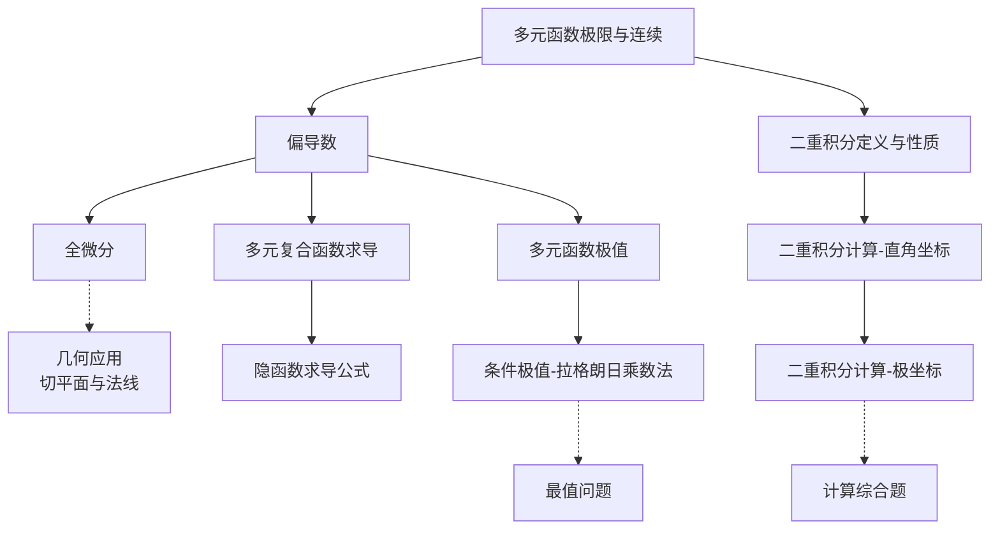

# 多元函数微积分 - 知识图谱

> [!info] 模块信息
> - **模块**: 高等数学 - 多元函数微积分
> - **考试类型**: 数学二
> - **预计学习时长**: 15-18小时
> - **考试频率**: ⭐⭐⭐⭐⭐ (核心考点，必考)

---

## 📚 知识点导航

### 1. 多元函数微分学

| 知识点 | 难度 | 重要程度 | 状态 | 笔记链接 |
|--------|------|----------|------|----------|
| 多元函数极限与连续 | ⭐⭐⭐ | ⭐⭐⭐ | 🔴 待学 | [[多元函数极限与连续]] |
| 偏导数 | ⭐⭐⭐ | ⭐⭐⭐⭐⭐ | 🔴 待学 | [[偏导数]] |
| 全微分 | ⭐⭐⭐⭐ | ⭐⭐⭐⭐ | 🔴 待学 | [[全微分]] |
| 多元复合函数求导 | ⭐⭐⭐⭐⭐ | ⭐⭐⭐⭐⭐ | 🔴 待学 | [[多元复合函数求导]] |
| 隐函数求导公式 | ⭐⭐⭐⭐ | ⭐⭐⭐⭐⭐ | 🔴 待学 | [[隐函数求导公式]] |
| 多元函数极值 | ⭐⭐⭐⭐ | ⭐⭐⭐⭐ | 🔴 待学 | [[多元函数极值]] |
| 条件极值-拉格朗日乘数法 | ⭐⭐⭐⭐⭐ | ⭐⭐⭐⭐⭐ | 🔴 待学 | [[条件极值-拉格朗日乘数法]] |

### 2. 多元函数积分学（二重积分）

| 知识点 | 难度 | 重要程度 | 状态 | 笔记链接 |
|--------|------|----------|------|----------|
| 二重积分定义与性质 | ⭐⭐ | ⭐⭐⭐⭐ | 🔴 待学 | [[二重积分定义与性质]] |
| 二重积分计算-直角坐标 | ⭐⭐⭐⭐ | ⭐⭐⭐⭐⭐ | 🔴 待学 | [[二重积分计算-直角坐标]] |
| 二重积分计算-极坐标 | ⭐⭐⭐⭐⭐ | ⭐⭐⭐⭐⭐ | 🔴 待学 | [[二重积分计算-极坐标]] |

---

## 🎯 学习路线

```
阶段1: 基础概念 (2-3小时)
  多元函数极限与连续 → 偏导数 → 全微分
       ↓
阶段2: 求导方法 (5-6小时)
  多元复合函数求导 (重点!) → 隐函数求导公式
       ↓
阶段3: 极值问题 (3-4小时)
  无条件极值 → 条件极值(拉格朗日乘数法，重点!)
       ↓
阶段4: 二重积分 (5-6小时)
  定义与性质 → 直角坐标计算 → 极坐标计算(重点!)
       ↓
阶段5: 综合应用 (2-3小时)
  微积分综合题 → 应用题
```

---

## 🔗 知识点关联图



---

## ⚠️ 跨章节提醒

> [!warning] 与一元微积分的对比
> - **偏导数** 是一元导数的推广，但有本质区别
> - **全微分** 类似于一元微分，但需注意可微性条件
> - **二重积分** 是定积分的推广，注意积分次序交换
>
> [!warning] 与后续章节的关联
> - **多元复合函数求导** 是难点，需要大量练习
> - **拉格朗日乘数法** 是条件极值的通用方法
> - **极坐标变换** 是二重积分的重点技巧

---

## 📊 考情分析

### 数二考点分布
| 考点 | 题型 | 出现频率 |
|------|------|----------|
| 偏导数计算 | 选择/填空/解答 | 每年必考 |
| 复合函数求导 | 解答题 | 高频 |
| 隐函数求导 | 选择/填空/解答 | 高频 |
| 极值与最值 | 解答题 | 中高频 |
| 二重积分计算 | 选择/填空/解答 | 每年必考 |
| 交换积分次序 | 选择/填空 | 中高频 |
| 极坐标计算二重积分 | 解答题 | 高频 |

### 重点提醒
1. ⭐⭐⭐⭐⭐ **复合函数求导**：难点中的难点，必须熟练掌握链式法则
2. ⭐⭐⭐⭐⭐ **二重积分计算**：每年必考，直角坐标+极坐标都要熟练
3. ⭐⭐⭐⭐⭐ **拉格朗日乘数法**：条件极值的标准方法
4. ⭐⭐⭐⭐ **隐函数求导**：方程确定的隐函数求导
5. ⭐⭐⭐⭐ **交换积分次序**：考察对积分区域的理解

### 数二特点
- **不考**：三重积分、曲线积分、曲面积分
- **重点**：二重积分计算（特别是极坐标）
- **难点**：多元复合函数求导的链式法则
- **常考**：偏导数计算、极值问题、二重积分

---

## 📝 学习建议

1. **对比学习**：时刻与一元函数对比，理解异同点
2. **几何直观**：建立多元函数的几何图像（曲面、等高线）
3. **链式法则**：画出变量关系图，避免遗漏
4. **积分区域**：画图！画图！画图！重要的事情说三遍
5. **坐标选择**：圆域、扇域优先考虑极坐标

### 学习顺序建议
```
先学：偏导数定义与计算 → 全微分概念
重点：复合函数求导（链式法则）+ 隐函数求导
应用：极值问题（无条件 + 条件）
积分：二重积分（直角坐标 → 极坐标）
```

---

## 🔑 关键概念对比

| 概念 | 一元函数 | 二元函数 |
|------|----------|----------|
| 导数 | $f'(x)$ | $\frac{\partial f}{\partial x}, \frac{\partial f}{\partial y}$ |
| 可导 | $f'(x_0)$ 存在 | 两个偏导数都存在 |
| 可微 | $f'(x_0)$ 存在 | $\Delta z = A\Delta x + B\Delta y + o(\rho)$ |
| 极值点 | $f'(x) = 0$ | $\frac{\partial f}{\partial x} = \frac{\partial f}{\partial y} = 0$ |
| 积分 | $\int_a^b f(x)dx$ | $\iint_D f(x,y)d\sigma$ |

---

*最后更新: 2026-02-27*
