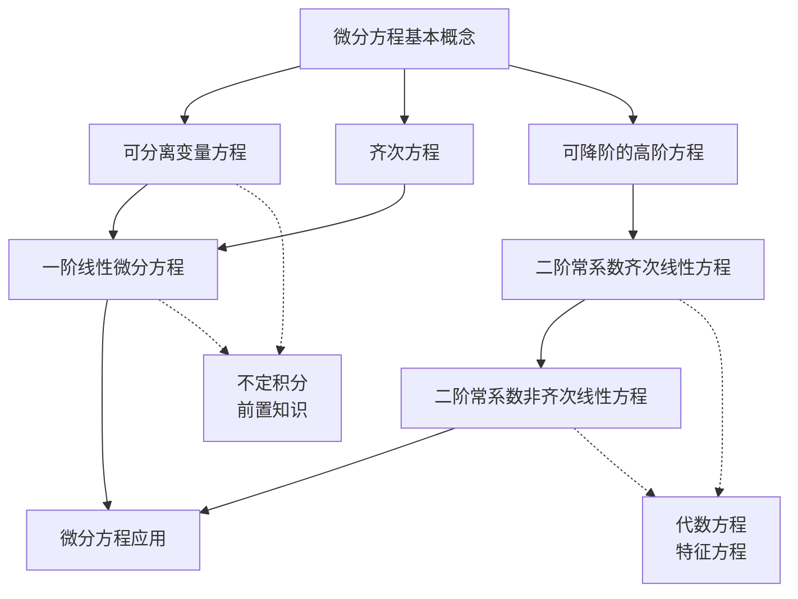

# 常微分方程 - 知识图谱

> [!info] 模块信息
> - **模块**: 高等数学 - 常微分方程
> - **考试类型**: 数学二
> - **预计学习时长**: 10-12小时
> - **考试频率**: ⭐⭐⭐⭐ (必考，通常1道解答题)

---

## 📚 知识点导航

### 1. 基础概念

| 知识点 | 难度 | 重要程度 | 状态 | 笔记链接 |
|--------|------|----------|------|----------|
| 微分方程基本概念 | ⭐⭐ | ⭐⭐⭐⭐ | 🔴 待学 | [[微分方程基本概念]] |

### 2. 一阶微分方程

| 知识点 | 难度 | 重要程度 | 状态 | 笔记链接 |
|--------|------|----------|------|----------|
| 可分离变量方程 | ⭐⭐ | ⭐⭐⭐⭐⭐ | 🔴 待学 | [[可分离变量方程]] |
| 齐次方程 | ⭐⭐⭐ | ⭐⭐⭐⭐ | 🔴 待学 | [[齐次方程]] |
| 一阶线性微分方程 | ⭐⭐⭐ | ⭐⭐⭐⭐⭐ | 🔴 待学 | [[一阶线性微分方程]] |

### 3. 高阶微分方程

| 知识点 | 难度 | 重要程度 | 状态 | 笔记链接 |
|--------|------|----------|------|----------|
| 可降阶的高阶方程 | ⭐⭐⭐ | ⭐⭐⭐⭐ | 🔴 待学 | [[可降阶的高阶方程]] |
| 二阶常系数齐次线性方程 | ⭐⭐⭐ | ⭐⭐⭐⭐⭐ | 🔴 待学 | [[二阶常系数齐次线性方程]] |
| 二阶常系数非齐次线性方程 | ⭐⭐⭐⭐ | ⭐⭐⭐⭐⭐ | 🔴 待学 | [[二阶常系数非齐次线性方程]] |

### 4. 应用

| 知识点 | 难度 | 重要程度 | 状态 | 笔记链接 |
|--------|------|----------|------|----------|
| 微分方程应用 | ⭐⭐⭐⭐ | ⭐⭐⭐⭐ | 🔴 待学 | [[微分方程应用]] |

---

## 🎯 学习路线

```
阶段1: 基础概念 (1小时)
  微分方程基本概念
       ↓
阶段2: 一阶方程 (3-4小时)
  可分离变量 → 齐次方程 → 一阶线性方程 (重点!)
       ↓
阶段3: 高阶方程 (4-5小时)
  可降阶 → 二阶常系数齐次 → 二阶常系数非齐次 (重点!)
       ↓
阶段4: 综合应用 (2-3小时)
  几何应用 → 物理应用 → 综合题
```

---

## 🔗 知识点关联图



---

## ⚠️ 跨章节提醒

> [!warning] 与前后章节的关联
> - **不定积分** 是求解微分方程的基础工具
> - **导数运算**（尤其是复合函数求导）在验证解时很重要
> - **定积分** 在应用题中用于计算总量
> - **线性代数** 中的行列式、特征值概念与特征方程有关

---

## 📊 考情分析

### 数二考点分布
| 考点 | 题型 | 出现频率 | 难度 |
|------|------|----------|------|
| 一阶线性方程 | 解答题 | 高频 | 中等 |
| 二阶常系数齐次方程 | 解答题 | 高频 | 中等 |
| 二阶常系数非齐次方程 | 解答题 | 高频 | 中偏难 |
| 可降阶方程 | 解答题 | 中频 | 中等 |
| 几何/物理应用 | 解答题 | 中频 | 较难 |
| 基本概念 | 选择/填空 | 低频 | 较易 |

### 重点提醒
1. ⭐⭐⭐⭐⭐ **一阶线性方程**：常数变易法必须熟练
2. ⭐⭐⭐⭐⭐ **二阶常系数齐次**：特征方程法是核心
3. ⭐⭐⭐⭐⭐ **二阶常系数非齐次**：待定系数法要掌握
4. ⭐⭐⭐⭐ **可分离变量**：最基础的求解方法
5. ⭐⭐⭐⭐ **应用题**：几何应用（切线、面积）和物理应用（运动、冷却）

### 典型考题类型
- **直接求解型**：给出方程，求通解或特解
- **反问题**：已知解的形式，反求方程中的参数
- **应用题**：几何或物理背景建立微分方程
- **综合题**：结合变限积分、极限等知识

---

## 📝 学习建议

1. **掌握基本解法**：分离变量、常数变易法、特征方程法
2. **重视初始条件**：确定特解时不要忘记代入初值
3. **注意解的结构**：齐次+特解=非齐次通解
4. **多验证**：求出解后务必代入原方程验证
5. **总结题型**：可降阶的三种类型要记牢

---

## 🔑 核心公式速查

### 一阶方程
- **可分离变量**：$\int \frac{dy}{g(y)} = \int f(x)dx$
- **一阶线性**：$y = e^{-\int P(x)dx}\left[\int Q(x)e^{\int P(x)dx}dx + C\right]$

### 二阶常系数齐次
- **特征方程**：$r^2 + pr + q = 0$
  - $r_1 \neq r_2$：$y = C_1e^{r_1x} + C_2e^{r_2x}$
  - $r_1 = r_2 = r$：$y = (C_1 + C_2x)e^{rx}$
  - $r = \alpha \pm i\beta$：$y = e^{\alpha x}(C_1\cos\beta x + C_2\sin\beta x)$

### 二阶常系数非齐次
- **特解形式**：
  - $f(x) = P_m(x)e^{\lambda x}$
  - $f(x) = e^{\lambda x}[P_l(x)\cos\omega x + P_n(x)\sin\omega x]$

---

*最后更新: 2026-02-27*
