# 10 >>>

# 数模与模数转换器

# 引言

随着数字技术，特别是计算机技术的飞速发展与普及，在现代控制、通信及检测领域中，信号的处理无不广泛地采用了计算机技术。由于自然界中的物理量，如压力、温度、位移、液位等都是模拟量，如要用数字技术处理这些模拟信号，则往往需要一种能在模拟信号与数字信号之间起转换作用的电路——模数转换器和数模转换器。

能将模拟信号转换成数字信号的电路称为模数转换器（Analog to Digital Converter，简称ADC或A/D转换器）；反之，能把数字信号转换为模拟信号的电路称为数模转换器（Digital to Analog Converter，简称为DAC或D/A转换器）。A/D和D/A转换器是现代计算机系统中不可缺少的基本组成部分。

A/D 转换器和 D/A 转换器在工业控制系统中的作用如图 10.0 所示。

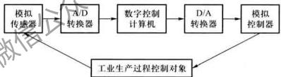

flowchart

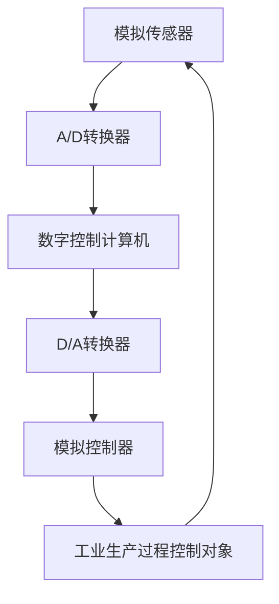

图 10.0 A/D 转换器与 D/A 转换器在工业控制系统中的作用

本章主要介绍几种常用 D/A 与 A/D 转换器的电路结构、工作原理及其应用。

# 10.1 D/A 转换器

# 10.1.1 D/A 转换器的输入/输出特性及其结构框图

# 1. D/A 转换器的输入/输出特性

D/A 转换器输入数字量 D 与输出模拟量 A 之间的转换关系式为

$$
A = K D \tag {10.1.1}
$$

式中 K 为比例系数, 它是一个常数。D 为 n 位二进制数, 可写成

$$
D = \sum_ {0} ^ {n - 1} d _ {i} 2 ^ {i} \tag {10.1.2}
$$

式中 $d_{i}$ 为第 i 位的二进制码。

理想的3位D/A转换器的输入/输出特性如图10.1.1所示。图中 $V_{LSB}$ 为输入数字量中最低有效位(LSB) $d_{0}$ 变化所引起的输出电压的变化值。图10.1.1表明，D/A转换器输出为阶梯波信号。

# 2. D/A 转换器的结构框图

n 位 D/A 转换器的一般结构框图如图 10.1.2 所示。数字量以串行或并行方式输入并存储于数码寄存器中,寄存器的输出驱动对应的数位上的电子开关,将相应数位的权值送入求和电路。求和电路将各位的权值相加得到与数字量对应的模拟量。

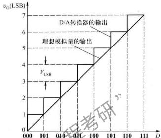

line

| D    | v_LSB |
| ---- | ----- |
| 000  | 1     |
| 001  | 2     |
| 010  | 3     |
| 011  | 4     |
| 100  | 5     |
| 101  | 6     |
| 110  | 7     |
| 111  | 7     |

图 10.1.1 理想 D/A 转换器的输入/输出特性

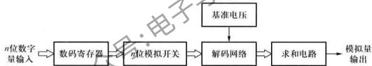

flowchart

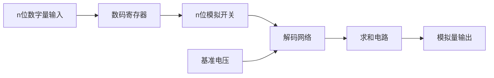

图10.1.2 $n$ 位D/A转换器一般方框图

根据解码网络结构的不同，D/A转换器有多种类型。如有电阻网络型（如倒T形电阻网络D/A转换器、T形电阻网络D/A转换器）、电容网络型（如权电容网络D/A转换器）和电阻电容混合型及晶体管混合型等。这些D/A转换器按数字量的输入方式的不同又分为并行输入D/A转换器和串行输入D/A转换器两种。

# 10.1.2 D/A 转换器的基本原理

任何一个二进制数 $D_{n-1}D_{n-2}\cdots D_{1}D_{0}$ 可以按下式转换为十进制数，

$$
(N) _ {B} = D _ {n} \times 2 ^ {n} + D _ {n - 1} \times 2 ^ {n - 1} + \dots + D _ {1} \times 2 ^ {1} + D _ {0} \times 2 ^ {0}
$$

式中 $2^{n}, 2^{-1}, \cdots, 2^{1}, 2^{0}$ 为各数位的权。上式表明，要实现数模转换，首先要将输入二进制数中为1的每一位代码按其权的大小，转换成模拟量，然后将这些模拟量相加，相加所得的总量就是与数字量成正比的模拟量。根据这个思路，可得4位D/A转换器的原理电路如图10.1.3所示。电路由寄存器、基准电压、电子开关、权电阻网络、求和电路等组成。

寄存器输出的4位二进制码 $D_{3}\sim D_{0}$ 分别控制着开关 $\mathrm{S}_3\sim \mathrm{S}_0$ ，当 $D_{i} = 1(i = 0,1,2,3)$ 时，开关

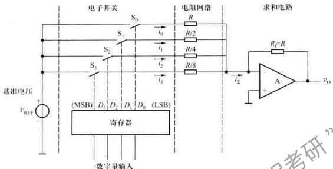

text_image

电子开关
S0
电阻网络
求和电路
基准电压
VREF +
-
(SMSB) D1 D2 D3 D4 (LSB)
寄存器
数字量输入
R1
R/2
R/4
R/8
i0
i1
i2
i3
i2
A
vO
RF=R
+

图 10.1.3 D/A 转换器原理电路

$S_{i}$ 与基准电压 $+V_{REF}$ 接通，电流 $i_{i}$ 流入求和电路；当 $D_{i}=0$ 开关断开， $i_{i}=0$ 。

根据运算放大器在线性运用条件下，虚短、虚断的特点，可得

$$
\begin{array}{l} v _ {0} = - i \sum R _ {1} \\ = - R _ {i} \left(i _ {3} + i _ {2} + i _ {1} + i _ {0}\right) \tag {10.1.3} \\ \end{array}
$$

若令 $R_{1}=R$ ，可得 $i_{3}=\frac{8V_{REF}D_{3}}{R}$ ， $i_{2}=\frac{4V_{REF}D_{2}}{R}$ ， $i_{1}=\frac{2V_{REF}D_{1}}{R}$ ， $i_{0}=\frac{V_{REF}D_{0}}{R}$

将它们代入式(10.1.3)则得

$$
\begin{array}{l} v _ {H} = - V _ {\text {REF}} \left(D _ {3} 2 ^ {3} + D _ {2} 2 ^ {2} + D _ {1} 2 ^ {1} + D _ {0} 2 ^ {0}\right) \\ = - V _ {\mathrm{REF}} \sum_ {i = 0} ^ {3} D _ {i} \cdot 2 ^ {i} \tag {10.1.4} \\ \end{array}
$$

结果表明,电路实现了数模转换。

上述分析表明，电阻网络中的各支路电流 $i_{\mathrm{f}} = \frac{2^{5}V_{\mathrm{REF}}}{R}$ 为二进制数各位的权值； $D_{\mathrm{f}}$ 控制 $S_{\mathrm{f}}$ ，以决定相应支路的权值电流 $i_{\mathrm{f}}$ 是否流入电流求和网络；而求和电路则将总电流转换为模拟电压 $v_{0}$ 输出，电路实现设计初衷。由于这种电路中每一位电阻的阻值与这一位的“权”相对应，位权越大，对应的阻值越小，所以，该电路也称为权电阻网络D/A转换电路。

# 10.1.3 倒 T 形电阻网络 D/A 转换器

在单片集成 D/A 转换器中, 使用最多的是倒 T 形电阻网络 D/A 转换器。下面我们以 4 位 D/A 转换器为例说明其工作原理。

# 1.4 位倒 T 形电阻网络 D/A 转换器

4 位倒 T 形电阻网络 D/A 转换器的原理图如图 10.1.4 所示。电路因电阻解码网络呈倒 T形而得名。图中，模拟开关 $S_{i}$ 由输入数码 $D_{i}$ 控制，当 $D_{i}=0, S_{i}$ 接地；当 $D_{i}=1, S_{i}$ 接运算放大器反相端，倒 T 形的电阻解码网络与运算放大器 A 组成求和电路。

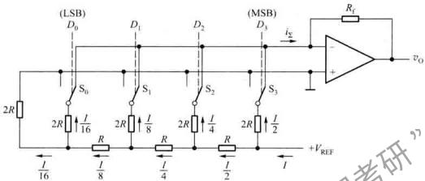

text_image

(LSB)
D0
2R
I/16
S0
2R
I/16
R
I/8
S1
2R
I/8
R
I/4
S2
2R
I/4
R
I/2
S3
2R
I/2
+VREF
I
iS
(MSB)
D1
D2
D3
Rs
vo
+
-

图 10.1.4 4 位倒 T 形电阻网络 D/A 转换器

运放工作在线性运用状态，其反相端虚地。这样，无论模拟开关 $S_{i}$ 置于何种位置，与 $S_{i}$ 相连的2R电阻总是接“地”，所以，流经每条2R电阻支路上的电流与开关状态无关。

分析图 10.1.4 所示电路可发现，从每个节点向左看，每个二端网络的等效电阻均为 R，与开关相连的 2R 电阻上的电流从高位到低位按 2 的负整数幂递减。如基准电压源提供的总电流为 $I(I = V_{\mathrm{REF}} / R)$ ，则流过各开关支路（从右到左）的电流分别为 I/2、I/4、I/8、和 I/16。

于是，可得总电流

$$
\begin{array}{l} i _ {\sum} = \frac {V _ {\mathrm{REF}}}{R} \left(\frac {D _ {0}}{2 ^ {4}} + \frac {D _ {1}}{2 ^ {3}} + \frac {D _ {2}}{2 ^ {2}} + \frac {D _ {3}}{2 ^ {1}}\right) \\ = \frac {V _ {\mathrm{REF}}}{2 ^ {4} \times R} \sum_ {i = 0} ^ {3} (D _ {i} \cdot 2 ^ {i}) \tag {10.1.5} \\ \end{array}
$$

输出电压

$$
v _ {0} = - i \sum R _ {i} = - \frac {R _ {1}}{R} \cdot \frac {V _ {\mathrm{REF}}}{2 ^ {4}} \sum_ {i = 0} ^ {3} (D _ {i} \cdot 2 ^ {i}) \tag {10.1.6}
$$

如将输入数字量扩展到 n 位, 可得 n 位倒 T 形电阻网络 D/A 转换器输出模拟量与输入数字量之间的一般关系式为

$$
v _ {0} = - \frac {V _ {\mathrm{REF}}}{2 ^ {n}} \cdot \frac {R _ {\mathrm{f}}}{R} \left[ \sum_ {i = 0} ^ {n - 1} (D _ {i} \cdot 2 ^ {i}) \right] \tag {10.1.7}
$$

若将式中 $\frac{V_{\mathrm{REF}}}{2^n}\cdot \frac{R_f}{R}$ 用 $K$ 表示，方括号内的 $n$ 位二进制数用 $N_{B}$ 表示，则式(10.1.7)可改写为

$$
v _ {\mathrm{O}} = - K N _ {\mathrm{B}} \tag {10.1.8}
$$

上式表明，对应每一个二进制数 $N_{\mathrm{B}}$ ，在图10.1.4电路的输出端都能得到与之成正比的模拟

电压。

由式(10.1.7)可见,要提高D/A转换器的转换精度,电路参数的选择要注意以下几点:

（1）基准电压 $V_{REF}$ 的精度和稳定性对 D/A 转换器的精度影响很大，在对精度要求较高的情况下，基准电压可采用带隙基准电压源；  
(2) 倒 T 形电阻网络中 R 和 2R 电阻比值的精度要高；  
（3）每个模拟开关的开关电压降要相等。为实现电流从高位到低位按2的整数倍递减，模拟开关的导通电阻也相应地按2的整数倍递增；  
(4) 运放的零点漂移要小。

由于在倒 T 形电阻网络 D/A 转换器中, 各支路电流是同时直接流入运算放大器的输入端, 它们之间不存在传输上的时间差, 所以, 该电路不仅具有较高的转换速度, 而且在动态过程中输出端可能出现的尖脉冲也大为减小。

例 10.1.1 在图 10.1.4 所示 4 位倒 T 形电阻网络 D/A 转换器中 $R_{0}=R, V_{REF}=10\ V$ ，试分别求出当 $D_{3}D_{2}D_{1}D_{0}$ 分别为 1000、0100、0010、0001 时输出电压 $v_{0}$ 的值。

解：根据式 $(10.1.6)$ 可得

$$
\begin{array}{l} D _ {3} D _ {2} D _ {1} D _ {0} = 1 0 0 0 \text {   时,   } v _ {0} = - \frac {V _ {\mathrm{REF}}}{2 ^ {4}} \times 2 ^ {3} = - \frac {V _ {\mathrm{REF}}}{2} = - \frac {1 0 \mathrm{V}}{2} = - 5 \mathrm{A} \\ D _ {3} D _ {2} D _ {1} D _ {0} = \mathbf {0 1 0 0} \text {   时,   } v _ {0} = - \frac {V _ {\mathrm{REF}}}{2 ^ {4}} \times 2 ^ {2} = - \frac {V _ {\mathrm{REF}}}{4} = - \frac {1 0 \mathrm{V}}{4} = - 2. 5 \mathrm{V} \\ D _ {3} D _ {2} D _ {1} D _ {0} = \mathbf {0 0 1 0} \text {时,} v _ {\mathrm{o}} = - \frac {V _ {\mathrm{REF}}}{2 ^ {4}} \times 2 ^ {4} = - \frac {V _ {\mathrm{REF}}}{8} = - \frac {1 0 \mathrm{V}}{8} = - 1. 2 5 \mathrm{V} \\ D _ {3} D _ {2} D _ {1} D _ {0} = 0 0 0 1 \text {   时,   } v _ {0} = - \frac {V _ {\mathrm{REF}}}{2 ^ {4}} \times 2 ^ {0} = - \frac {V _ {\mathrm{REF}}}{1 6} = - \frac {1 0 \mathrm{V}}{1 6} = - 0. 6 2 5 \mathrm{V} \\ \end{array}
$$

# 2. 集成 D/A 转换器

单片集成I/A转换器产品的种类繁多，性能指标各异。AD公司生产的AD7533是10位CMOS电流开关型D/A转换器，属于电流输出型D/A转换器，它的结构简单，通用性好。用该器件组成的D/A转换电路如图10.1.5所示，图中点画线部分为AD7533的内部电路。

AD7533芯片内只有倒T形电阻网络、CMOS电流开关和反馈电阻 $(R = 10\mathrm{k}\Omega)$ 。用AD7533组成D/A转换器时，必须外接运算放大器，其反馈电阻可采用片内电阻 $(10\mathrm{k}\Omega)$ 或外加电阻。

图 10.1.5 中电子开关 $S_{i}$ 的实际电路如图 10.1.6 所示。它是由 9 个 MOS 管组成的 CMOS 模拟开关电路。图中 $T_{1} \sim T_{3}$ 组成电平转移电路，使输入信号能与 TTL 电平兼容。 $T_{4}$ 、 $T_{5}$ 及 $T_{6}$ 、 $T_{7}$ 组成两个反相器分别作为模拟开关管 $T_{8}$ 、 $T_{9}$ 的驱动电路， $T_{8}$ 、 $T_{9}$ 构成单刀双掷开关。

当 $D_{i}=1$ 时， $T_{1}$ 输出低电平， $T_{4}$ 、 $T_{5}$ 反相器输出高电平，而 $T_{6}$ 、 $T_{7}$ 反相器输出低电平，从而使 $T_{8}$ 截止、 $T_{9}$ 导通，2R 电阻经 $T_{9}$ 接至运放反相输入端，权电流流入运放。

当 $D_{i} = 0$ 时， $\mathrm{T}_{1}$ 输出高电平， $\mathrm{T}_{4},\mathrm{T}_{5}$ 反相器输出的低电平使 $\mathrm{T}_{9}$ 截止， $\mathrm{T}_{6},\mathrm{T}_{7}$ 反相器输出的高电平使 $\mathrm{T}_{8}$ 导通，这样 $2R$ 电阻经 $\mathrm{T}_{8}$ 接地。CMOS模拟开关导通电阻较大，通过工艺设计可控制其大小并计入电阻网络。该电路具有使用简便、功耗低、转换速度较快、温度系数小、通用性强等优点。

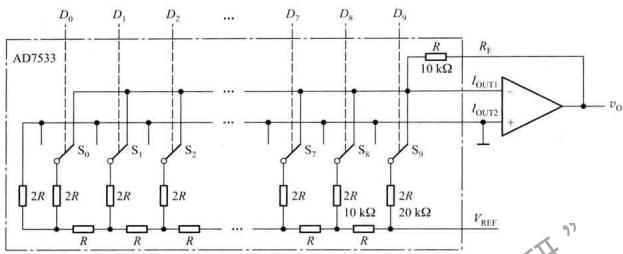

text_image

AD7533
D0 D1 D2 ... D7 D8 D9
S0 S1 S2 ... S7 S8 S9
2R 2R 2R 2R 2R 2R 2R 2R 2R 2R 2R
R R R R ... R R R
R 10 kΩ
RF
IOUT1
IOUT2
+
vo
VREF

图 10.1.5 AD7533 内部电路

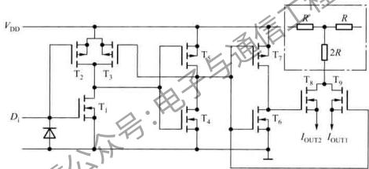

text_image

VDD
T2 T3
D1
T1
T4
T7
T8 T9
IOUT2 IOUT1
R
2R

图 10.1.6 CMOS 模拟开关电路

# 10.1.4 权电流型 D/A 转换器

# 1.4 位权电流 D/A 转换器

由于实际的倒T形电阻网络D/A转换器中的模拟开关存在导通电阻和导通电压，这会引起求和电流的误差，从而影响D/A转换器的转换精度。如要提高D/A转换器的精度，可采用权电流型D/A转换器。4位权电流D/A转换器的原理电路如图10.1.7所示。图中，用一组恒流源代替了图10.1.4中倒T形电阻网络，恒流源从高位到低位的电流大小依次为 $\frac{I}{2},\frac{I}{4},\frac{I}{8},\frac{I}{16}$

图 10.1.7 中，当 $D_{i}=0$ 时，开关 $S_{i}$ 接地； $D_{i}=1$ 时，开关 $S_{i}$ 与运放的反相端相联，相应的权电流流入求和电路。分析该电路可得

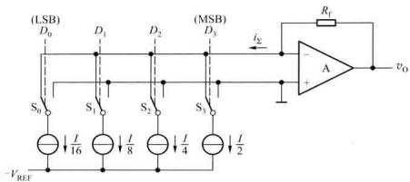

text_image

(LSB)
D0
S0
I/16
VREF
D1
S1
I/8
D2
S2
I/4
D3
MSB
iE
A
vo
Rf

图 10.1.7 权电流 D/A 转换器的原理电路

$$
\begin{array}{l} v _ {0} = - i \sum R _ {1} = - R _ {1} \left(\frac {I}{2} D _ {3} + \frac {I}{4} D _ {2} + \frac {I}{8} D _ {1} + \frac {I}{1 6} D _ {0}\right) \\ = \frac {I}{2 ^ {4}} \cdot R _ {1} (D _ {3} \cdot 2 ^ {3} + D _ {2} \cdot 2 ^ {2} + D _ {1} \cdot 2 ^ {1} + D _ {0} \cdot 2 ^ {0}) \\ = \frac {I}{2 ^ {4}} \cdot R _ {\mathrm{f}} \sum_ {i = 0} ^ {3} D _ {i} \cdot 2 ^ {i} \tag {10.1.9} \\ \end{array}
$$

由于权电流 D/A 转换器中,各支路上的权电流的大小不受开关导通电阻和电压的影响,所以该电路的转换精度较高。

# 2. 实际的权电流 D/A 转换器

实际的权电流 D/A 转换器电路如图 10.1.8 所示, 图中具有电流负反馈的 BJT 组成恒流源电路。

运放 $A_{2}$ 、 $R_{1}$ 、T、R 和 $V_{REF}$ 组成基准电流 $I_{REF}$ 产生电路。 $A_{2}$ 的输出端经 $T_{i}$ 的 cb 结组成电压并联负反馈电路，以稳定其输出电压 ( $T_{i}$ 的基极电压)。基准电流 $I_{REF}$ 由基准电压 $V_{REF}$ 和电阻 $R_{1}$ 确定。由于 $T_{i}$ 和 $T_{2}$ 具有相同的 $V_{BE}$ ，而发射极回路的电阻相差一倍，所以它们的发射极电流也相差一倍，于是有一

$$
I _ {\mathrm{REF}} = \frac {V _ {\mathrm{REF}}}{R _ {1}} = 2 I _ {\mathrm{E3}} \tag {10.1.10}
$$

图中 $T_{3} \sim T_{0}$ 的基极电压相同，只要这些三极管的发射结压降 $V_{BE}$ 相等，则它们的发射极 $e_{3} \sim e_{0}$ 就是等电位，这样，从左到右流过 2R 电阻上的电流就分别为 $\frac{I}{2}$ 、 $\frac{I}{4}$ 、 $\frac{I}{8}$ 和 $\frac{I}{16}$ 。

为了保证每个BJT的发射结电压相等，电路中 $\mathrm{T}_{3}\sim \mathrm{T}_{0}$ 采用了多发射极BJT，其发射极个数分别是8、4、2、1（即发射极面积之比为 $8:4:2:1$ ）。这样，在各BJT的电流比值也为 $8:4:2:1$ 的情况下， $\mathrm{T}_{3}\sim \mathrm{T}_{0}$ 的射极电流的密度相等，它们的发射结电压 $V_{\mathrm{BE}}$ 也就相同，倒T形电阻网络每个 $2R$ 电阻的电流值就与图10.1.7完全相同。

于是可得输出电压为

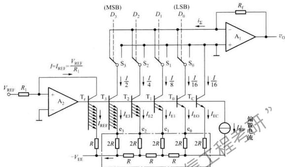

text_image

(MSB)
D3
D2
D1
(DSB)
D0
i2
Rf
A1
+
vo
VREF
R1
I=IRIE=VREF/R1
A2
Tr
T3
T2
T1
T0
Tc
I/2
I/4
I/8
I/16
I/16
IE3
IE2
IE1
IE0
IEC
R
2R
2R
2R
2R
2R
2R
-VEE
R
R
R
R
偏置电流

图 10.1.8 实际的权电流 D/A 转换器电路

$$
v _ {0} = i _ {\text {上}} R _ {1} = \frac {R _ {1} V _ {\mathrm{REF}}}{2 ^ {4} R _ {1}} (D _ {2} \cdot 2 ^ {3} + D _ {2} \cdot 2 ^ {2} + D _ {1} \cdot 2 ^ {1} + D _ {0} \cdot 2 ^ {0})
$$

可推得 n 位权电流 D/A 转换器的输出电压

$$
v _ {0} = \frac {V _ {\mathrm{REF}}}{R _ {1}} \cdot \frac {R _ {i}}{2 ^ {n}} \sum_ {i = 0} ^ {n - 1} D _ {i} \cdot 2 ^ {i} \tag {10.1.11}
$$

式(10.1.11)表明,输出电压仅与基准电压 $V_{REF}$ 和电阻 $R_{1}$ 有关,而与BJT、R、2R电阻无关。由于电路对BJT参数及R、2R取值的要求降低,这对电路集成十分有利。

在权电流 D/A 转换器中，一般都采用了高速电子开关，电路具有较高的转换速度。

# 10.1.5 权电容网络 D/A 转换器

在 MOS 集成电路中,电容不仅容易制作,而且可通过控制电容的尺寸,严格保持各电容容量之间的比例关系,制作出具有精确比例关系的不同电容。采用 MOS 工艺制造 D/A 转换器时,权电容网络 D/A 转换器是一种常采用的设计方案。

权电容网络 D/A 转换器是一种分压式 D/A 转换器，主要利用电容分压的原理工作。4 位权电容网络 D/A 转换的原理如图 10.1.9 所示，图中，模拟开关 $S_{3} \sim S_{0}$ 分别由数字信号 $D_{3} \sim D_{0}$ 控制，当 $D_{r}=1$ 时， $S_{r}$ 接参考电压 $V_{REF}$ ；当 $D_{r}=0$ 时， $S_{r}$ 接地。图中 $C_{0}^{\prime}=2^{9}C_{X}$ ，与各模拟开关相连接的电容容量依次按 2°递减，即 $C_{3}=2^{3}C_{X}, C_{2}=2^{2}C_{X}, C_{1}=2^{1}C_{X}, C_{0}=2^{9}C_{X}$ 。

每次转换的开始前，首先令所有开关（包括 $S_{3} \sim S_{0}$ 和 $S_{D}$ ）接地，使所有电容充分放电完，然后断开 $S_{D}$ 。在上述过程结束后，再将 4 位数据并行输入到 $D_{3} \sim D_{0}$ 端。

例如， $D_{3}D_{2}D_{1}D_{0}=0100$ ，则只有 $S_{2}$ 接 $V_{REF}$ ， $S_{3}$ 、 $S_{1}$ 和 $S_{0}$ 接地，图10.1.9的等效电路如图10.1.10所示。

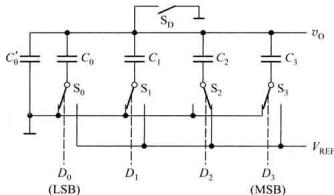

text_image

C'0
S0
D0
(LSB)
C0
S1
D1
C1
S2
D2
C2
S3
D3
VREF
Vref
C3
v0
S0
S1
S2
S3
MSB

图 10.1.9 4 位权电容网络 D/A 转换器

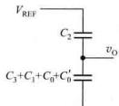

chemical

Circuit diagram of a capacitor with labeled components and voltage reference

图 10.1.10 图 10.1.9 输入为 0100 时的等效电路

$C_{2}$ 与 $(C_{3}+C_{1}+C_{0}+C_{0}^{\prime})$ 构成一个电容分压器， $V_{REF}$ 对串联电路快速充电的结果，使输出电压按串联电容的容量分压，输出电压为

$$
\begin{array}{l} v _ {0} = \frac {D _ {2} C _ {2}}{C _ {3} + C _ {2} + C _ {1} + C _ {0} + C _ {0} ^ {\prime}} V _ {\text {RcE}} \\ = \frac {D _ {2} C _ {2}}{C _ {1}} V _ {(0)} \tag {10.1.12} \\ \end{array}
$$

式中， $C_{1}=C_{3}+C_{2}+C_{1}+C_{0}+C_{0}^{\prime}$

同理,可写出输入为任意数字量时的输出模拟电压的一般表达式

$$
\begin{array}{l} v _ {0} = \frac {D _ {3} C _ {3} + D _ {2} C _ {2} + D _ {1} C _ {1} + D _ {0} C _ {0}}{C _ {1}} V _ {\mathrm{REF}} \\ = \frac {C _ {X} (D _ {3} 2 ^ {3} + D _ {2} 2 ^ {2} + D _ {1} 2 ^ {1} + D _ {0} 2 ^ {0}) V _ {\mathrm{REF}}}{2 ^ {4} C _ {X}} \\ = \frac {V _ {\mathrm{REF}}}{2 ^ {4}} (D _ {3} 2 ^ {3} + D _ {2} 2 ^ {2} + D _ {1} 2 ^ {1} + D _ {0} 2 ^ {0}) \tag {10.1.13} \\ \end{array}
$$

式 $(10.1.14)$ 表明,电路实现了数模转换。

n 位权电容网络 D/A 转换的一般化表达式

$$
v _ {0} = \frac {\boldsymbol {V} _ {\mathrm{REF}}}{2 ^ {n}} \sum_ {i = 0} ^ {n - 1} \boldsymbol {D} _ {i} \cdot 2 ^ {i} \tag {10.1.14}
$$

从上述推导可以看出,权电容网络 D/A 转换器有如下特点。

（1）输出电压精度与各电容的容量无关，而只与它们的容量比值相关。电路对电容容量的大小要求不高。所以，在 CMOS 集成电路集成技术的支持下，容易制造出高精度的 D/A 转换器。  
（2）它的输出电压 $v_{0}$ 稳态值不受模拟开关内阻和参考电源 $V_{REF}$ 内阻的影响，因而降低了对开关电路和参考电源的要求。

(3) 由于电容能隔离直流, 因此权电容网络 D/A 转换器在静态时无功率损耗。

权电容网络 D/A 转换器在使用中也有一定的局限性，随转换分辨率的提高，权电容容量的比值将成倍增大，因此对电容尺寸精度的要求也成倍提高，高位权电容不仅会占用很大芯片面积，影响集成度，而且会增加电容充放电时间，降低电路的转换速度。

# 10.1.6 D/A 转换器的输出方式

在前面介绍的 D/A 转换器的讨论中, 输入的是无符号的二进制数, 即二进制数的每一位都是数值码。根据电路形式或参考电压的极性不同, 输出电压或为 0 V 到正的满度值, 或为 0 V 到负的满度值, D/A 转换器处于单极性输出方式。

采用单极性输出方式时,数字输入量采用自然二进制码,8位D/A转换器单极性输出时,输入数字量与输出模拟量之间的关系如表10.1.1所示。

表 10.1.1 8 位 D/A 转换器在单极性输出时的输入/输出关系

<table><tr><td colspan="8">数字量</td><td rowspan="2">模拟量</td></tr><tr><td colspan="4">MSB</td><td colspan="4">LSB</td></tr><tr><td>1</td><td>1</td><td>1</td><td>1</td><td>1</td><td>1</td><td>1</td><td>1</td><td> $\pm {V}_{\mathrm{{REF}}}\left( \frac{255}{256}\right)$ </td></tr><tr><td></td><td></td><td></td><td> $\vdots$ </td><td></td><td></td><td></td><td></td><td> $\vdots$ </td></tr><tr><td>1</td><td>0</td><td>0</td><td>0</td><td>0</td><td>0</td><td>0</td><td>1</td><td> $\pm {V}_{\mathrm{{REF}}}\left( \frac{129}{256}\right)$ </td></tr><tr><td>1</td><td>0</td><td>0</td><td>0</td><td>0</td><td>0</td><td>0</td><td>0</td><td> $\pm {V}_{\mathrm{{REF}}}\left( \frac{128}{256}\right)$ </td></tr><tr><td>0</td><td>1</td><td>L</td><td>1</td><td>1</td><td>1</td><td>1</td><td>1</td><td> $\pm {V}_{\mathrm{{REF}}}\left( \frac{127}{256}\right)$ </td></tr><tr><td></td><td></td><td></td><td> $\vdots$ </td><td></td><td></td><td></td><td></td><td> $\vdots$ </td></tr><tr><td>0</td><td>0</td><td>0</td><td>0</td><td>0</td><td>0</td><td>0</td><td>1</td><td> $\pm {V}_{\mathrm{{REF}}}\left( \frac{1}{256}\right)$ </td></tr><tr><td>0</td><td>0</td><td>0</td><td>0</td><td>0</td><td>0</td><td>0</td><td>0</td><td> $\pm {V}_{\mathrm{{REF}}}\left( \frac{0}{256}\right)$ </td></tr></table>

实际上，D/A转换器输入的都是有符号数，这就要求D/A转换器按符号的不同，输出为正、负极性的模拟电压，工作于双极性方式。采用双极性输出时常用的编码有2的补码、偏移二进制码和符号-数值码(符号位加数值码)等。表10.1.2以8位为例列出了2的补码、偏移二进制码与模拟量之间的对应关系。

表 10.1.2 常用双极性编码

<table><tr><td rowspan="2"></td><td colspan="8">2 的补码</td><td colspan="8">偏移二进制码</td><td>模拟量</td></tr><tr><td> ${D}_{7}$ </td><td> ${D}_{6}$ </td><td> ${D}_{5}$ </td><td> ${D}_{4}$ </td><td> ${D}_{3}$ </td><td> ${D}_{2}$ </td><td> ${D}_{1}$ </td><td> ${D}_{0}$ </td><td> ${D}_{7}$ </td><td> ${D}_{6}$ </td><td> ${D}_{5}$ </td><td> ${D}_{4}$ </td><td> ${D}_{3}$ </td><td> ${D}_{2}$ </td><td> ${D}_{1}$ </td><td> ${D}_{0}$ </td><td> ${v}_{0}/{V}_{1,n}$ </td></tr><tr><td rowspan="9"></td><td>0</td><td>1</td><td>1</td><td>1</td><td>1</td><td>1</td><td>1</td><td>1</td><td>1</td><td>1</td><td>1</td><td>1</td><td>1</td><td>1</td><td>1</td><td>1</td><td>127</td></tr><tr><td>0</td><td>1</td><td>1</td><td>1</td><td>1</td><td>1</td><td>1</td><td>0</td><td>1</td><td>1</td><td>1</td><td>1</td><td>1</td><td>1</td><td>1</td><td>0</td><td>126</td></tr><tr><td></td><td></td><td></td><td> $\vdots$ </td><td></td><td></td><td></td><td></td><td></td><td></td><td></td><td> $\vdots$ </td><td></td><td></td><td></td><td></td><td> $\vdots$ </td></tr><tr><td>0</td><td>0</td><td>0</td><td>0</td><td>0</td><td>0</td><td>0</td><td>1</td><td>1</td><td>0</td><td>0</td><td>0</td><td>0</td><td>0</td><td>0</td><td>1</td><td>1</td></tr><tr><td>0</td><td>0</td><td>0</td><td>0</td><td>0</td><td>0</td><td>0</td><td>0</td><td>1</td><td>0</td><td>0</td><td>0</td><td>0</td><td>0</td><td>0</td><td>0</td><td>0</td></tr><tr><td>1</td><td>1</td><td>1</td><td>1</td><td>1</td><td>1</td><td>1</td><td>1</td><td>0</td><td>1</td><td>1</td><td>1</td><td>1</td><td>1</td><td>1</td><td>1</td><td>-1</td></tr><tr><td></td><td></td><td></td><td> $\vdots$ </td><td></td><td></td><td></td><td></td><td></td><td></td><td></td><td> $\vdots$ </td><td></td><td></td><td></td><td></td><td> $\vdots$ </td></tr><tr><td>1</td><td>0</td><td>0</td><td>0</td><td>0</td><td>0</td><td>0</td><td>1</td><td>0</td><td>0</td><td>0</td><td>0</td><td>0</td><td>0</td><td>0</td><td>1</td><td>-127</td></tr><tr><td>1</td><td>0</td><td>0</td><td>0</td><td>0</td><td>0</td><td>0</td><td>0</td><td>0</td><td>0</td><td>0</td><td>0</td><td>0</td><td>0</td><td>0</td><td>0</td><td>-128</td></tr></table>

表中 $V_{LSB}=V_{REF}/256$

2 的补码的最高位为符号位。符号位为 0 表示“+”号；为 1 表示“-”号，其他位为数值位。对于正数，其补码的数值部分为该二进制数的绝对值；对于负数，其补码的数值部分为该二进制数的绝对值每位取反、末位加 1，零的补码各位都是 0。

下面以输入为8位2的补码为例，说明双极性输出D/A转换器的工作原理。

将表10.1.1和表10.1.2中偏移二进制码相比较可发现，对于相同的编码，偏移二进制码D/A转换器与单极性D/A转换器的输出电压拉偏了 $\left(\frac{128}{256} V_{\mathrm{REF}}\right)\mathrm{V}$ 。如输入11111111，偏移二进制码D/A转换器的输出电压为 $+\left(\frac{127}{256} V_{\mathrm{REF}}\right)\mathrm{V}$ ，而单极性二进制码输出电压为 $+\left(\frac{255}{256} V_{\mathrm{REF}}\right)\mathrm{V}$ ；又如，输入10000000时，偏移二进制码输出电压为 $0\mathrm{V}$ ，而在单极性二进制码的输出电压为 $-\left(\frac{128}{256} V_{\mathrm{REF}}\right)\mathrm{V}$ 。根据上述两种编码的输入、输出之间的对应关系，要得到输入为偏移二进制码的双极性D/A转换输出电压，只需将单极性8位D/A转换器的输出电压减去 $\left(\frac{128}{256} V_{\mathrm{REF}}\right)\mathrm{V}$ 即可。

比较表 10.1.2 中 2 的补码与偏移二进制码可以发现，偏移二进制码和 2 的补码的区别仅只是符号位相反。如要实现输入为 2 的补码 D/A 转换，只需将偏移二进制码 D/A 转换器的高位求反即可。

采用2的补码输入的8位双极性输出D/A转换电路，如图10.1.11所示。图中，最高位取反，由D/A转换器输出的模拟量 $v_{1}$ 经 $A_{2}$ 组成的第二个求和放大器减去 $\left(\frac{128}{256}V_{\mathrm{REF}}\right)\mathrm{V}$ 后得到极性

正确的输出电压 $v_{0}$

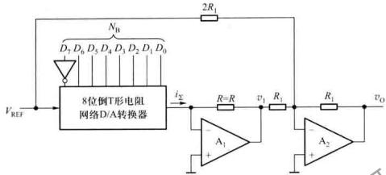

flowchart

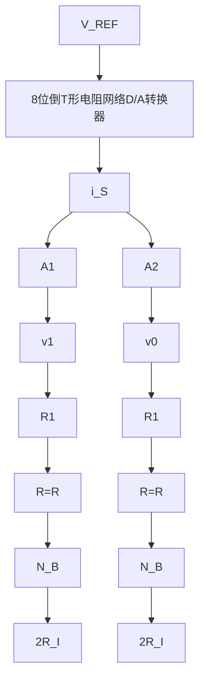

图 10.1.11 具有双极性输出的 D/A 转换器

分析电路可得

$$
\begin{array}{l} v _ {0} = - v _ {1} - \frac {1}{2} V _ {\text {REF}} \\ = \left(\frac {N _ {\mathrm{B}} V _ {\mathrm{REF}}}{2 ^ {8}} + \frac {V _ {\mathrm{REF}}}{2}\right) - \frac {V _ {\mathrm{REF}}}{2} \\ = V _ {\mathrm{REF}} \cdot \frac {N _ {\mathrm{B}}}{2 5 6} \tag {10.1.15} \\ \end{array}
$$

电路输入2的补码 $N_{B}$ 与 $v_{0}$ 之间满足表10.1.2所示的对应关系。

# 10.1.7 D/A 转换器的主要技术指标

# 1. 分辨率

分辨率是 D/A 转换器对输入微小量变化敏感程度的表征。其定义为 D/A 转换器输出模拟电压可能被分离的等级数，n 位 D/A 转换器输出模拟量最多有 $2^{8}$ 个不同值，例如 8 位 D/A 转换器输出电压能被分离的等级数为 $2^{8}$ 个。输入数字量位数愈多，输出电压可分离的等级愈多，即分辨率愈高。所以，实际应用中，往往用输入数字量的位数表示 D/A 转换器的分辨率。

另外,分辨率也可以用 D/A 转换器最小输出电压(输入数码仅最低有效位为 1,其余各位均为 0)与最大输出电压(输入数码全为 1)之比给出。

n 位 D/A 转换器的分辨率表示为

$$
\mathrm{分辨率} = \frac {V _ {\mathrm{LSB}}}{V _ {\mathrm{m}}} = \frac {1}{2 ^ {n} - 1} \tag {10.1.16}
$$

式中， $V_{LSB}$ 为最小输出电压， $V_{m}$ 为最大输出电压。当 $V_{m}$ 一定，D/A 转换器的位数 n 越大， $V_{LSB}$ 愈小，即说明该转换器分辨能力愈高。它表示 D/A 转换器在理论上可以达到的精度。如 8 位 D/A 转换器的分辨率可以表示为

$$
\frac {1}{2 ^ {8} - 1} = \frac {1}{2 5 6 - 1} \approx 0. 0 0 3 9
$$

例 10.1.2 已知 10 位 D/A 转换器满刻度输出电压 $V_{m}=10\ V$ 。

(1) 求输入最低位 $D_{0}$ 对应的输出电压增量 $V_{LSB}$ ;  
（2）如要求分辨的最小电压为 $5 \, \text{mV} (V_{\text{LSB}} = 5 \, \text{mV})$ ，试问至少应选用多少位的 D/A 转换器。

解：（1）根据式(10.1.16)可知，分辨率= $\frac{1}{2^{n}-1}=\frac{V_{LSB}}{V_{m}}$

将 $n=10, V_{m}=10\ V$ 代入上式得

$$
V _ {\mathrm{LSB}} = \frac {1}{2 ^ {n} - 1} \times V _ {\mathrm{m}} = \frac {1}{2 ^ {1 0} - 1} \times 1 0 \mathrm{V} = 0. 0 1 \mathrm{V}
$$

(2) 将 $V_{LSB}=5mV, V_{m}=10V$ 代入式(10.1.16)中可得

$\frac{1}{2^{n}-1}=\frac{0.005}{10\ V}V$ 由此得 $n\approx11$

由以上分析可知,在题意给定条件下应选择11位D/A转换器

# 2. 转换精度

由于 D/A 转换器中受到电路元件参数误差、基准电压不稳和运算放大器的零漂等因素的影响，D/A 转换器实际输出的模拟量与理想值之间存在误差。这些误差的最大值定义为转换精度。转换误差有比例系数误差、失调误差和非线性误差等。

# (1) 比例系数误差

比例系数误差是指实际转换特性曲线的斜率与理想特性曲线斜率的偏差。如 n 位倒 T 形电阻网络 D/A 转换器，当 $V_{REF}$ 偏离标准值 $\Delta V_{REF}$ 时，就会在输出端产生误差电压 $\Delta v_{0}$ 。由式 (10.1.7) 可知

$$
\Delta v _ {0} = \frac {\Delta V _ {\mathrm{REF}}}{2 ^ {n}} \cdot \frac {R _ {1}}{R} \sum_ {i = 0} ^ {n - 1} D _ {i} \cdot 2 ^ {i} \tag {10.1.17}
$$

由 $\Delta V_{REF}$ 引起的误差属于比例系数误差。3 位 D/A 转换器的比例系数误差如图 10.1.12 所示。

# (2) 失调误差

该误差为模拟量的实际起始数值与理想起始数值之差，由运算放大器的零点漂移所引起，它使输出电压的转移特性曲线发生平移，3位D/A转换器的失调误差如图10.1.13所示。

# (3) 非线性误差

这是一种没有一定变化规律的误差，一般用在满刻度范围内，偏离理想的转移特性的最大值来表示。引起非线性误差的原因较多，如电路中的各模拟开关存在不同的导通电压和导通电阻、电阻网络中电阻的误差等都会导致非线性误差。因此，要获得高精度的D/A转换器，不仅应选择位数较多的高分辨率的D/A转换器，而且电路中还需要选用高稳定度的 $V_{REF}$ 和低零漂的运算放大器等器件与之配合才能达到要求。

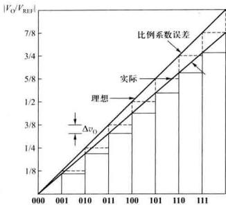

line

| x    | V_O / V_REF |
| ---- | ----------- |
| 000  | 1/8         |
| 001  | 1/4         |
| 010  | 3/8         |
| 011  | 5/8         |
| 100  | 7/8         |
| 101  | 7/8         |
| 110  | 7/8         |
| 111  | 7/8         |

图 10.1.12 3 位 D/A 转换器的比例系数误差

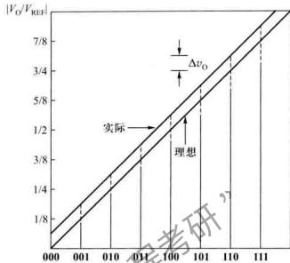

line

| x    | V_O / V_REI |
| ---- | ----------- |
| 000  | 0           |
| 001  | 1/8         |
| 010  | 3/8         |
| 014  | 5/8         |
| 100  | 7/8         |
| 101  | 7/8         |
| 110  | 7/8         |
| 111  | 7/8         |

图 10.1.13 3 位 DxA 转换器的失调误差

# 3. 转换速度

当 D/A 转换器输入的数字量发生变化时, 输出的模拟量并不能立即达到所对应的量值, 它要延迟一段时间。通常我们用建立时间和转换速率两个参数来描述 D/A 转换器的转换速度。

（1）建立时间 指输入数字量变化时，输出电压达到规定误差范围所需的时间。一般用 D/A 转换器输入的数字量 $N_{B}$ 从全 0 变为全 1\* 时，输出电压达到规定的误差范围 ( $\pm$ LSB/2) 时所需时间表示。  
(2) 转换速率 指大信号工作状态下, 模拟输出电压的最大变化率。通常以 V/μs 为单位表示。该参数与运放的摆率 SR 类似。

# 4. 温度系数

这是指在输入不变的情况下,输出模拟电压随温度变化产生的变化量。一般用满刻度输出条件下温度每升高1℃,输出电压变化的百分数作为温度系数。

# 10.1.8 D/A转换器的应用

在实践中，D/A 转换器应用很广，它不仅作为数字系统和模拟系统之间的接口电路（如作为微机系统的接口电路），而且还可用于数字量对模拟信号进行处理。下面我们以数字式可编程增益放大电路和波形产生电路为例说明它的应用。

# (1) 数字式可编程增益放大电路

数字式可编程增益控制电路如图10.1.14所示，AD7533与运放接成普通的反相比例放大电路形式。电路中AD7533内部的反馈电阻 $R$ 为反相比例放大电路的输入电阻，而由数字量控制的倒T形电阻网络是它的反馈电阻。当输入数字量变化时，倒T形电阻网络的等效电阻随之改变。这样，在输入电阻一定的情况下，随着电阻网络的等效电阻变化，反相比例放大器的增益也

就随之改变。

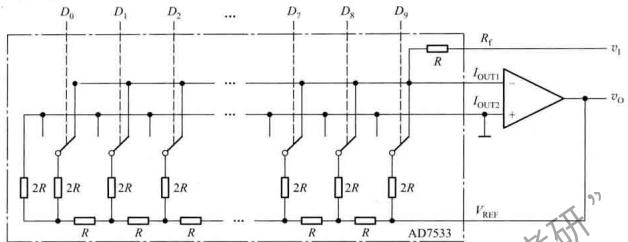

text_image

D0 D1 D2 ... D7 D8 D9
2R 2R 2R 2R ... R R R 2R
AD7533
VREF
RF
IOUT1
IOUT2 +
vo
v1
y7

图 10.1.14 数字式可编程增益控制电路

根据运放虚地原理,可以得到

$$
\frac {v _ {1}}{R} = \frac {- v _ {0}}{2 ^ {1 0} R} (D _ {0} 2 ^ {0} + D _ {1} 2 ^ {1} + \dots + D _ {9} 2 ^ {n})
$$

所以 $A_{\mathrm{v}} = \frac{v_{0}}{v_{1}} = \frac{-2^{10}}{D_{0}2^{0} + D_{1}2^{1} + \cdots D_{9}2^{9}}$

如将 AD7533 芯片中的反馈电阻作为反相运放的反馈电阻, 数控 AD7533 的倒 T 形电阻网络连接成运放的输入电阻, 读者不难推断出电路为数字式可编程衰减器。

# (2) 脉冲波产生电路

由 AD7533、运算放大器及 4 位同步二进制计数器 74LVC163（同步清零）组成的波形产生电路如图 10.1.15（a）所示。图中 74LVC163 采用反馈清零法，组成模 10 计数器，D/A 转换器的高位 $D_{4} \sim D_{9}$ 均为0，低4位输入是计数器的输出。在 $CP$ 作用下， $Q_{3} Q_{2} Q_{1} Q_{0}$ 输出分别为0000\~1001。根据式(10.1.7)计算输出电压的值，可画出 $v_{0}$ 的波形如图10.1.15(b)所示，输出波形是有10个阶梯的阶梯波。如改变计数器的模，则改变波形的阶梯数；如采用可逆计数器，经滤波后，在电路的输出端可得到三角波输出。

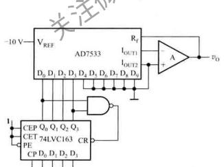

text_image

-10 V
VREF
AD7533
D0 D1 D2 D3 D4 D5 D6 D7 D8
Rf
IOUT1
IOUT2
A
+
-
vo
CEP Q0 Q1 Q2 Q3
CET 74LVC163
PE
CP D0 D1 D2 D3
CR

(a)

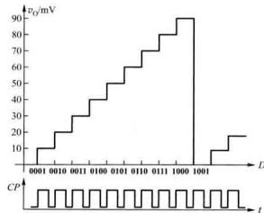

line

| t | v_i (mV) |
|---|---|
| 0001 | 10 |
| 0002 | 15 |
| 0003 | 20 |
| 0004 | 25 |
| 0005 | 30 |
| 0006 | 35 |
| 0007 | 40 |
| 0008 | 45 |
| 0009 | 50 |
| 0010 | 55 |
| 0011 | 60 |
| 0012 | 65 |
| 0013 | 70 |
| 0014 | 75 |
| 0015 | 80 |
| 0016 | 85 |
| 0017 | 90 |
| 0018 | 95 |
| 0019 | 10 |
| 0020 | 15 |
| 0021 | 20 |
| 0022 | 25 |
| 0023 | 30 |
| 0024 | 35 |
| 0025 | 40 |
| 0026 | 45 |
| 0027 | 50 |
| 0028 | 55 |
| 0029 | 60 |
| 0030 | 65 |
| 0031 | 70 |
| 0032 | 75 |
| 0033 | 80 |
| 0034 | 85 |
| 0035 | 90 |
| 1999 | 15 |
| 2001 | 20 |
| 2199 | 25 |
| 2299 | 30 |
| 2399 | 35 |
| 2499 | 40 |
| 2599 | 45 |
| 2699 | 50 |
| 2799 | 55 |
| 2899 | 60 |
| 2999 | 65 |
| 3099 | 70 |
| 3199 | 75 |
| 3299 | 80 |
| 3399 | 85 |
| 3499 | 90 |
The chart displays a step function of voltage over time. The x-axis represents time (t) and the y-axis represents voltage (v_i, mV). The data is presented in a single column format with 'CP' as the base of the plot. The values for 'v_i' are explicitly labeled on the graph. There is no additional data series present in this image. The label 'CP' appears at the bottom left of the plot.

(b)   
图 10.1.15 波形产生电路  
(a) 电路 (b) 工作波形

# 复习思考题

10.1.1 为使倒 T 形电阻网络 D/A 转换器有足够的精度，在电路器件及参数选择上应注意些什么问题？

10.1.2 已知某 D/A 转换器满刻度输出电压为 10 V, 试问如要求分辨的最小电压是 1 mV, 应采用多少位的 D/A 转换器?

# 10.2 A/D 转换器

A/D 转换器要将时间和幅值都连续的模拟量,转换为时间、幅值都离散的数字量,一般要经过取样、保持和量化、编码几个过程,下面分别予以讨论。

# 10.2.1 A/D 转换的一般工作过程

# 1. 取样与保持

取样电路将输入模拟量转换为在时间上离散的模拟量。取样过程示意图如图10.2.1(a)、(b)所示。图10.2.1(a)中，取样信号 $S(t)$ 控制取样过程， $S(t)$ 高电平期间，开关导通，输出信号 $v_{0}(t)$ 等于输入信号 $t(q,t)$ ，而在 $S(t)$ 的低电平期间，开关关闭，输出信号 $v_{0}(t)=0$ 。电路工作波形如图10.2.1(b)所示。从图10.2.1(b)可见，取样信号 $S(t)$ 的频率愈高，所取信号经低通滤波器后，愈能真实地复现输入信号。合理的取样频率由取样定理确定。

取样定理: 设取样信号 $S(t)$ 的频率为 $f_{s}$ ，输入模拟信号 $v_{1}(t)$ 的最高频率分量的频率为 $f_{imax}$ ，则 $f_{s}$ 与 $f_{imax}$ 必须满足下面的关系

$$
f _ {\mathrm{s}} \geqslant 2 f _ {\mathrm{imax}} \tag {10.2.1}
$$

一般取 $f_{s}=3\sim5f_{max}$ 。

将取样所得信号转换为数字信号往往需要一定的时间，为了给后续的量化编码电路提供一个稳定值，取样电路的输出还须保持一段时间。一般取样与保持过程都是同时完成的。取样-保持电路的原理图及输出波形分别如图10.2.2(a)、(b)所示。取样-保持电路由输入放大器 $A_{1}$ 、输出放大器 $A_{2}$ ，保持电容 $C_{H}$ 和开关驱动电路组成。电路中要求 $A_{V1}\cdot A_{V2}=1$ ，且 $A_{1}$ 具有较高的输入阻抗，以减小对输入信号源的影响。 $A_{2}$ 选用有较高输入阻抗和低输出阻抗的运放，这样不仅 $C_{H}$ 上所存电荷不易泄漏，而且电路还具有较高的带负载能力。

$t_{0}\sim t_{1}$ 时段，开关S闭合，电路处于取样阶段，电容器 $C_{H}$ 充电，由于 $A_{V1}\cdot A_{V2}=1$ ，因此 $v_{0}=v_{1}$ ;

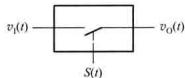

text_image

v₁(t) —— □ —— vₒ(t)
      S(t)

(a)

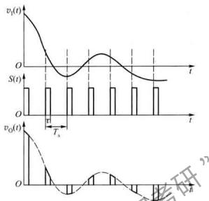  
(b)   
图 10.2.1 取样过程  
(a) 取样电路示意图 (b) 各信号波形图

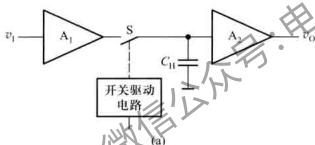

text_image

v₁ A₁ S A₂ v₀
开关驱动电路
(a)

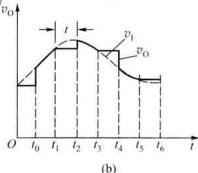

line

| t    | v0     |
| ---- | ------ |
| t0   | 0      |
| t1   | v1     |
| t2   | v1     |
| t3   | v1     |
| t4   | v0     |
| t5   | v0     |
| t6   | v0     |

图 10.2.2 取样-保持电路  
(a) 原理图 (b) 波形图

$t_{1}\sim t_{2}$ 时段为保持阶段，此期间S断开，若 $A_{2}$ 的输入阻抗足够大，且S为较理想的开关，可认为 $C_{10}$ 几乎没有放电回路，输出电压保持 $v_{0}$ 不变。

# 2. 量化与编码

以上分析结果表明，经取样和保持电路后的输出信号，在数值上还是连续变化的模拟量，至此，只实现了对输入信号在时间上的离散。要转换成数字量，还要实现数值上的离散，将取样电压表示为一最小数量单位的整数倍，这一转换过程称为量化。量化所取的最小数量单位称为量化单位，用 $\Delta$ 表示。量化单位 $\Delta$ 是数字信号最低有效位为 1 时，所对应的模拟量，即 1LSB。由于取样电压是连续的，它的值不一定都能被 $\Delta$ 整除，所以，在量化过程中，不可避免地存在误差，此误差称为量化误差，用 $\varepsilon$ 表示。 $\varepsilon$ 属于原理误差，它是无法消除的。A/D 转换器的位数越多，

1LSB所对应的 $\Delta$ 值越小，量化误差的绝对值也越小。

量化的方法，一般有舍尾取整法和四舍五入法两种。舍尾取整的处理方法是：如输入电压 $v_{1}$ 在两个相邻的量化值之间时，在 $(n-1)\Delta < v_{1} < n\Delta$ 时，取 $v_{1}$ 的量化值为 $(n-1)\Delta$ 。四舍五入的处理方法是：当 $v_{1}$ 的尾数不足 $\Delta/2$ 时，舍去尾数取整数；当 $v_{1}$ 的尾数大于或等于 $\Delta/2$ 时，则其量化单位在原数上加一个 $\Delta$ 。

例如要将 $0\sim 1\mathrm{V}$ 的模拟电压转换为3位二进制码，取 $\Delta = (1 / 8)\mathrm{V}$ ，采用舍尾取整法，凡数值在 $0\mathrm{V}\sim (1 / 8)\mathrm{V}$ 之间的模拟量，都当作 $0\Delta$ ，并用二进制码000表示；凡数值在 $(1 / 8)\mathrm{V}\sim (2 / 8)\mathrm{V}$ 之间的模拟量，都当作 $1\Delta$ ，并用二进制码001表示。

而采用四舍五入量化的方式，则取量化单位 $\Delta = (2 / 15)\mathrm{V}$ ，凡数值在 $0\mathrm{V}\sim (1 / 15)\mathrm{V}$ 之间的模拟电压都当作 $\Delta$ ，并用二进制数000表示；而数值在 $(1 / 15)\mathrm{V}\sim (3 / 15)\mathrm{V}$ 之间的模拟电压都当作 $1\Delta$ ，用二进制数001表示。不难看出，舍尾取整的量化方法，最大量化误差 $\varepsilon_{\max} = 1\mathrm{LSB}$ ，而四舍五入量化方法 $\varepsilon_{\max} = \mathrm{LSB} / 2$ ，由于后者量化误差小，为大多数A、D转换器所采用。

按上述两种方法划分量化电平的示意图分别如图10.2.3(a)、(b)所示。

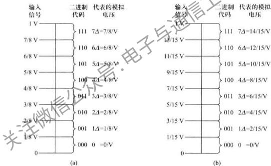

text_image

输入信号
1 V
7/8 V
6/8 V
5/8 V
4/8 V
3/8 V
2/8 V
1/8 V
0
(a)
二进制代码
111 7Δ=7/8/V
110 6Δ=6/8/V
101 5Δ=5/8/V
100 4Δ=4/8/V
011 3Δ=3/8/V
010 2Δ=2/8/V
001 1Δ=1/8/V
000 0 =0/V
输入信号
1 V
13/15 V
11/15 V
9/15 V
7/15 V
5/15 V
3/15 V
1/15 V
0
(b)
二进制代码
111 7Δ=14/15/V
110 6Δ=12/15/V
101 5Δ=10/15/V
100 4Δ=8/15/V
011 3Δ=6/15/V
010 2Δ=4/15/V
001 1Δ=2/15/V
000 0 =0/V

图 10.2.3 划分量化电平的两种方法  
(a) 舍尾取整法 (b) 四舍五入法

将量化后的结果用二进制码或其他代码表示出来的过程称为编码。经编码输出的代码就是A/D转换器的转换结果。

A/D 转换器按其工作原理的不同分为直接 A/D 转换器和间接 A/D 转换器两种。直接 A/D 转换器将模拟信号直接转换为数字信号，这类 A/D 转换器具有较快的转换速度，典型电路有并行比较型 A/D 转换器，逐次比较型 A/D 转换器。而间接 A/D 转换器则是先将模拟信号转换成某一中间量(时间或频率)，然后再将中间量转换为数字量输出。此类 A/D 转换器的速度较慢，典型电路有双积分型 A/D 转换器、电压频率转换型 A/D 转换器等。

# 10.2.2 并行比较型 A/D 转换器

3 位并行比较型 A/D 转换器原理电路如图 10.2.4 所示。它由电阻分压器、电压比较器、寄存器及优先编码器组成。优先编码器输入信号 $I_{7}$ 的优先级最高， $I_{1}$ 最低。分压器将基准电压分为 $(1/15) V_{\mathrm{REF}}, (3/15) V_{\mathrm{REF}}, \cdots, (13/15) V_{\mathrm{REF}}$ 不同电压值，分别作为比较器 $C_{1} \sim C_{7}$ 的参考电压。输入电压为 $v_{1}$ 的大小决定各比较器的输出状态，例如，当 $0 \leqslant v_{1} < (1/15) V_{\mathrm{REF}}$ 时， $C_{7} \sim C_{1}$ 的输出状态都为 0；当 $(3/15) V_{\mathrm{REF}} \leqslant v_{1} < (5/15) V_{\mathrm{REF}}$ 时，比较器 $C_{6}$ 和 $C_{7}$ 的输出 $C_{06} = C_{07} = 1$ ，其余各比较器的状态均为 0。比较器的输出状态由 D 触发器存储，经优先编码器编码后得到数字量输出。

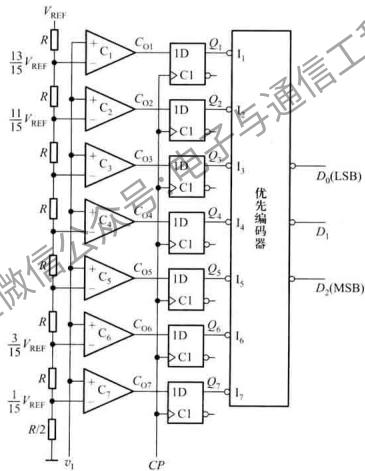

flowchart

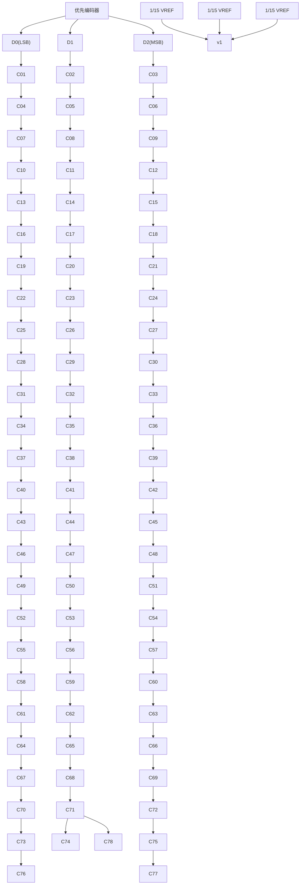

图 10.2.4 3 位并行 A/D 转换器

设 $v_{1}$ 变化范围是 $0 \sim V_{REF}$ ，输出 3 位数字量为 $D_{2}D_{1}D_{0}$ ，3 位并行比较型 A/D 转换器的输入、输出关系如表 10.2.1 所示。

表 10.2.1 3 位并行 A/D 转换器输入与输出关系对照表

<table><tr><td rowspan="2">模拟输入</td><td colspan="7">比较器输出状态</td><td colspan="3">数字输出</td></tr><tr><td> ${C}_{01}$ </td><td> ${C}_{02}$ </td><td> ${C}_{03}$ </td><td> ${C}_{04}$ </td><td> ${C}_{05}$ </td><td> ${C}_{06}$ </td><td> ${C}_{07}$ </td><td> ${D}_{2}$ </td><td> ${D}_{1}$ </td><td> ${D}_{0}$ </td></tr><tr><td> $0 \leq  {v}_{1} < {V}_{\mathrm{{REF}}}/{15}$ </td><td>0</td><td>0</td><td>0</td><td>0</td><td>0</td><td>0</td><td>0</td><td>0</td><td>0</td><td>0</td></tr><tr><td> ${V}_{\mathrm{{REF}}}/{15} \leq  {v}_{1} < 3{V}_{\mathrm{{REF}}}/{15}$ </td><td>0</td><td>0</td><td>0</td><td>0</td><td>0</td><td>0</td><td>1</td><td>0</td><td>0</td><td>1</td></tr><tr><td> $3{V}_{\mathrm{{REF}}}/{15} \leq  {v}_{1} < 5{V}_{\mathrm{{REF}}}/{15}$ </td><td>0</td><td>0</td><td>0</td><td>0</td><td>0</td><td>1</td><td>1</td><td>0</td><td>1</td><td>0</td></tr><tr><td> $5{V}_{\mathrm{{REF}}}/{15} \leq  {v}_{1} < 7{V}_{\mathrm{{REF}}}/{15}$ </td><td>0</td><td>0</td><td>0</td><td>0</td><td>1</td><td>1</td><td>1</td><td>0</td><td>1</td><td>1</td></tr><tr><td> $7{V}_{\mathrm{{REF}}}/{15} \leq  {v}_{1} < 9{V}_{\mathrm{{REF}}}/{15}$ </td><td>0</td><td>0</td><td>0</td><td>1</td><td>1</td><td>1</td><td>1</td><td>1</td><td>0</td><td>0</td></tr><tr><td> $9{V}_{\mathrm{{REF}}}/{15} \leq  {v}_{1} < {11}{V}_{\mathrm{{REF}}}/{15}$ </td><td>0</td><td>0</td><td>1</td><td>1</td><td>1</td><td>1</td><td>1</td><td>1</td><td>0</td><td>1</td></tr><tr><td> ${11}{V}_{\mathrm{{REF}}}/{15} \leq  {v}_{1} < {13}{V}_{\mathrm{{REF}}}/{15}$ </td><td>0</td><td>1</td><td>1</td><td>1</td><td>1</td><td>1</td><td>1</td><td>1</td><td>1</td><td>0</td></tr><tr><td> ${13}{V}_{\mathrm{{REF}}}/{15} \leq  {v}_{1} < {V}_{\mathrm{{REF}}}$ </td><td>1</td><td>1</td><td>1</td><td>1</td><td>1</td><td>1</td><td>1</td><td>1</td><td>1</td><td>1</td></tr></table>

在并行 A/D 转换器中，输入电压 $v_{1}$ 同时加到所有比较器的输入端，从 $v_{1}$ 加入，到稳定输出数字量，所经历的时间为比较器、D 触发器和编码器延迟时间的总和。如不考虑各器件的延迟，可认为输出数字量是与 $v_{1}$ 输入时刻同时获得的。所以并行 A/D 转换器具有最短的转换时间。但也可以看到，随着分辨率的提高，元件数目几乎按几何级数增加，如一个 n 位的转换器，就要用到 $2^{n}-1$ 个比较器和触发器。随着位数的增加，电路复杂程度急剧增加。分辨率很高的并行 A/D 转换器，对集成电路工艺指标要求是很高的。

例 10.2.1 在图 10.2.4 中，已知 $V_{REF}=6\ V$ ，输入模拟电压 $v_{I}=3.4\ V$ ，试确定 3 位并行比较型 A/D 转换器的输出数码。

解：根据并行比较型 $\overline{A} / D$ 转换器的工作原理可知，输入到比较器 $C_1 \sim C_7$ 的参考电压分别为 $(1/15)V_{\mathrm{REF}} = 3.43 \times 15)V_{\mathrm{REF}}$ 。将 $V_{\mathrm{REF}} = 6\mathrm{V}$ 代入，求得图10.2.1中（7/15） $V_{\mathrm{REF}} = 2.8\mathrm{V}$ 、 $(9/15)V_{\mathrm{REF}} = 3.6\mathrm{V}$ 。

输入模拟电压 $v_{1}=3.4\ V$ ，即 $(7/15)V_{\mathrm{REF}}<v_{1}<(9/15)V_{\mathrm{REF}}$ ，对照表 10.2.1，可知输出数码为 100。

# 10.2.3 逐次比较型 A/D 转换器

# 1. 转换原理

直接 A/D 转换器中，逐次比较型 A/D 转换器是采用较多的一种。它的转换过程与用天平称物重相似。天平称重过程是，从最重的砝码开始试放，与被称物体进行比较，若物体重于砝码，则该砝码保留，否则移去。再加上第二个次重砝码…照此进行，一直加到最小一个砝码。将所有留下的砝码重量相加，就得到物体重量。仿照这一思路，逐次比较型 A/D 转换器，就是将输入模拟信号与不同的权值电压做多次比较，使转换所得的数量在数值上逐次逼近输入模拟量。

8 位逐次比较型 A/D 转换器框图如图 10.2.5 所示。它由控制逻辑电路、数据寄存器、移位寄存器、D/A 转换器及电压比较器组成。

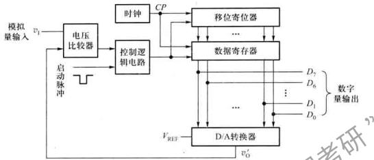

flowchart

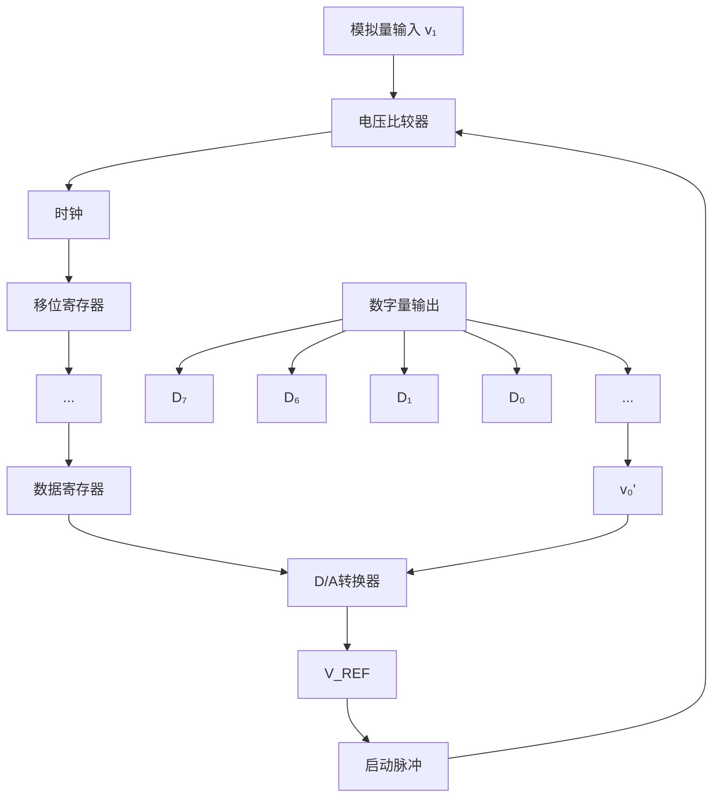

图 10.2.5 逐次比较型 A/D 转换器框图

电路启动后，第一个 CP 将移位寄存器置为 10000000，该数字经数据寄存器送入 D/A 转换器。输入模拟电压 $v_{1}$ 首先与 10000000 所对应的模拟电压 $V_{REF}/2$ 相比较 [根据式 (10.1.7) 计算可得]，如 $v_{1} \geqslant V_{REF}/2$ ，比较器输出为 1，若 $v_{1} < V_{REF}/2$ ，则为 0，此结果存于数据寄存器的 $D_{7}$ 位；第二个 CP 使移位寄存器为 01000000。如最高位已在 1，数据寄存器将 11000000 送入 D/A 转换器，其输出电压 $v_{0}' = \frac{3}{4} V_{REF}, v_{1}$ 再与 $\frac{3}{4} V_{REF}$ 相比较，如 $v_{1} \geqslant \frac{3}{4} V_{REF}$ 则次高位 ( $D_{6}$ ) 存 1，否则 $D_{6} = 0$ ；如最高位为 0，数据寄存器将 01000000 送入 D/A 转换器，其输出电压 $v_{0}' = V_{REF}/4, v_{1}$ 与 $v_{0}'$ 比较，如 $v_{1} \geqslant V_{REF}/4$ ，则数据寄存器的 $D_{7}$ 位存 V，否则存 $0 \cdots$ 。以此类推，经逐次比较得到输出数字量。

设图 10.2.5 所示电路为 8 位逐次比较型 A/D 转换器，输入模拟量 $v_{1}=6.84\ V$ ，D/A 转换器的基准电压 $V_{REF}=-10\ V$ 。

根据逐次比较 D/A 转换器的工作原理, 可画出在转换过程中 CP、启动脉冲、 $D_{7} \sim D_{0}$ 及 D/A 转换器输出电压 $v_{0}^{\prime}$ 的波形, 如图 10.2.6 所示。

由图 10.2.6 可见，启动脉冲低电平到来后转换开始。第一个 CP，数据寄存器将 $D_{7} \sim D_{0} = 10000000$ 送入 D/A 转换器，其输出电压 $v_{0}^{\prime} = 5 \, V, v_{1}^{\prime}$ 与 $v_{0}^{\prime}$ 比较， $v_{1} > v_{0}^{\prime}, D_{7}$ 在下个 CP 到来时存 1；第二个 CP 到来时，寄存器输出 $D_{7} \sim D_{0} = 11000000, v_{0}^{\prime}$ 为 $7.5 \, V, v_{1}$ 再与 $7.5 \, V$ ，比较，因为 $v_{1} < 7.5 \, V$ ，所以 $D_{6}$ 在下个 CP 到来时存 0；输入第三个 CP 时， $D_{7} \sim D_{0} = 10100000, v_{0}^{\prime} = 6.25 \, V; v_{1}$ 再与 $v_{0}^{\prime}$ 比较，…如此重复比较下去，经 8 个时钟周期，转换结束。由 $v_{0}^{\prime}$ 的波形可见，在转换过程中，输出数字量对应的模拟电压 $v_{0}^{\prime}$ 近次逼近 $v_{1}$ 值，最后的转换结果 $D_{7} \sim D_{0} = 10101111$ 。该数字量所对应的模拟电压为 6.8359375 V，与实际输入的模拟电压 6.84 V 的相对误差仅为 0.06%。

# 2. 转换电路

4位逐次比较型A/D转换器的逻辑电路如图10.2.7所示。图中，移位寄存器可进行并入/并出或串入/串出操作，F为其并行置数端，高电平有效，S为高位串行输入端。5个D触发器组成数据寄存器，输出数字量为 $D_{3}\sim D_{0}=Q_{4}\sim Q_{1}$ 。

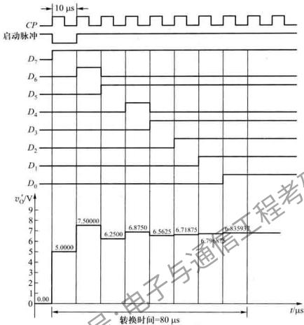

other

| Time (μs) | Voltage (V) |
|-----------|-------------|
| 0.00      | 5.0000      |
| 80        | 7.5000      |
| 160       | 6.2500      |
| 240       | 6.8750      |
| 320       | 6.5625      |
| 400       | 6.71875     |
| 480       | 6.79675     |
| 560       | 6.8359     |

图 10.2.6 八位逐次比较型 A/D 转换器波形图

在启动脉冲上升沿 $FF_{0} \sim FF_{4}$ 被清零， $Q_{5}$ 置 1, $G_{2}$ 门开启，时钟 CP 脉冲进入移位寄存器。

在第一个 CP 脉冲作用下，移位寄存器被置数 $Q_{A}Q_{B}Q_{C}Q_{D}Q_{E}=01111$ 。 $Q_{A}$ 的低电平使数据寄存器的最高位置 1，即 $Q_{A}Q_{2}Q_{1}=1000$ 。D/A 转换器将数字量 1000 转换为模拟电压 $v_{o}^{\prime}$ 送入比较器 C 与输入模拟电压 $v_{i}$ 较整，若输入电压 $v_{i}>v_{o}^{\prime}$ ，则比较器 C 输出 $v_{c}$ 为 1，否则为 0。比较结果送 $FF_{a}\sim FF_{1}$ 的数据输入端 $D_{4}\sim D_{1}$ 。

第二个 CP 脉冲到来后，移位寄存器的 $Q_{A}$ 变 1，同时最高位向低位移动一位。 $Q_{3}$ 由 0 变 1，这个正跳变作为有效触发信号加到 $FF_{4}$ 的 CP 端，使第一次比较的结果保存于 $Q_{4}$ 。此时，由于其他触发器无脉冲正跳沿，它们保持原状态不变。 $Q_{1}$ 变 1 后建立了新的 D/A 转换器的数据，输入电压再与此时的 $v_{0}^{\prime}$ 相比较，比较结果在第三个时钟脉冲作用下存于 $Q_{3}\cdots\cdots$ 。如此进行，直到 $Q_{E}$ 由 1 变 0，使 $Q_{5}$ 由 1 变 0 后将 $G_{2}$ 封锁，转换完毕。于是电路的输出端 $D_{3}D_{2}D_{1}D_{0}$ 得到与输入电压 $v_{1}$ 成正比的数字量。

由以上分析可见，逐次比较型 A/D 转换器完成一次转换所需时间与其位数 n 和时钟脉冲频

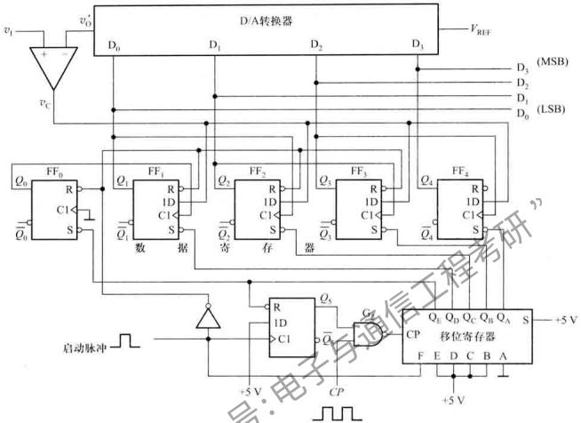

flowchart

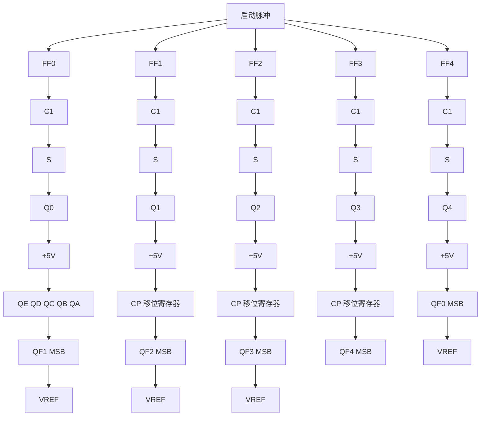

图 10.2.7 4位逐次比较型 A/D 转换器的逻辑电路

率有关,位数越少,时钟频率越高,转换所需时间越短。这种 A/D 转换器具有转换速度快、精度高的特点。

# 10.2.4 双积分式 A/D 转换器

双积分式 A/D 转换器是一种间接 A/D 转换器。它采用对输入模拟电压和参考电压分别进行两次积分，将输入电压平均值变换成与之成正比的时间间隔，然后利用时钟脉冲和计数器测出此时间间隔，进而在输出端得到与模拟量相应的数字量。由于该转换电路是对输入电压的平均值进行变换，所以它具有很强的抗工频干扰能力，在数字测量中得到广泛应用。

双积分式 A/D 转换器的原理电路如图 10.2.8 所示，它由积分器（由集成运放 A 组成），过零比较器（C），时钟脉冲控制门（G）和计数器（ $FF_{0} \sim FF_{n-1}$ ）等几部分组成。

下面以输入正极性的直流电压 $v_{1}(v_{1}<V_{\mathrm{REF}})$ 为例，说明电路的基本工作原理。

电路的工作过程分为以下几个阶段进行。

(1) 准备阶段

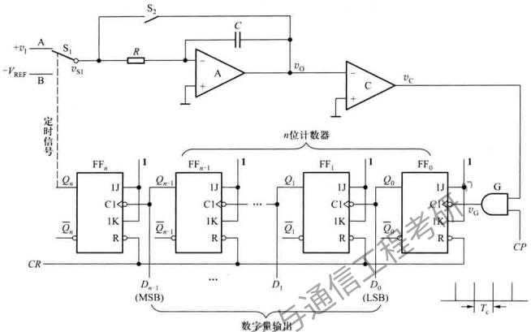

flowchart

```mermaid
graph TD
    A["定时信号"] --> B["FF_n"]
    B --> C["FF_{n-1}"]
    C --> D["FF_0"]
    D --> E["比较器"]
    E --> F["Q_n"]
    F --> G["Q_n"]
    G --> H["Q_n"]
    H --> I["Q_n"]
    I --> J["Q_n"]
    J --> K["Q_n"]
    K --> L["Q_n"]
    L --> M["Q_n"]
    M --> N["Q_n"]
    N --> O["Q_n"]
    O --> P["Q_n"]
    P --> Q["Q_n"]
    Q --> R["Q_n"]
    R --> S["Q_n"]
    S --> T["Q_n"]
    T --> U["Q_n"]
    U --> V["Q_n"]
    V --> W["Q_n"]
    W --> X["Q_n"]
    X --> Y["Q_n"]
    Y --> Z["Q_n"]
    Z --> AA["Q_n"]
    AA --> AB["Q_n"]
    AB --> AC["Q_n"]
    AC --> AD["Q_n"]
    AD --> AE["Q_n"]
    AE --> AF["Q_n"]
    AF --> AG["Q_n"]
    AG --> AH["Q_n"]
    AH --> AI["Q_n"]
    AI --> AJ["Q_n"]
    AJ --> AK["Q_n"]
    AK --> AL["Q_n"]
    AL --> AM["Q_n"]
    AM --> AN["Q_n"]
    AN --> AO["Q_n"]
    AO --> AP["Q_n"]
    AP --> AQ["Q_n"]
    AQ --> AR["Q_n"]
    AR --> AS["Q_n"]
    AS --> AT["Q_n"]
    AT --> AU["Q_n"]
    AU --> AV["Q_n"]
    AV --> AW["Q_n"]
    AW --> AX["Q_n"]
    AX --> AY["Q_n"]
    AY --> AZ["Q_n"]
    AZ --> BA["Q_n"]
    BA --> BB["Q_n"]
    BB --> BC["Q_n"]
    BC --> BD["Q_n"]
    BD --> BE["Q_n"]
    BE --> BF["Q_n"]
    BF --> BG["Q_n"]
    BG --> BH["Q_n"]
    BH --> BI["Q_n"]
    BI --> BJ["Q_n"]
    BJ --> BK["Q_n"]
    BK --> BL["Q_n"]
    BL --> BM["Q_n"]
    BM --> BN["Q_n"]
    BN --> BO["Q_n"]
    BO --> BP["Q_n"]
    BP --> BQ["Q_n"]
    BQ --> BR["Q_n"]
    BR --> BS["Q_n"]
    BS --> BT["Q_n"]
    BT --> BU["Q_n"]
    BU --> BV["Q_n"]
    BV --> BW["Q_n"]
    BW --> BX["Q_n"]
    BX --> BY["Q_n"]
    BY --> BZ["Q_n"]
    BZ --> CA["Q_n"]
    CA --> CB["Q_n"]
    CB --> CC["Q_n"]
    CC --> CD["Q_n"]
    CD --> CE["Q_n"]
    CE --> CF["Q_n"]
    CF --> CG["Q_n"]
    CG --> CH["Q_n"]
    CH --> CI["Q_n"]
    CI --> CJ["Q_n"]
    CJ --> CK["Q_n"]
```

图 10.2.8 双积分 A/D 转换器

转换开始前，CR信号将计数器清零，开关 $S_{2}$ 闭合，使积分电容完全放电完毕。启动脉冲到来时转换开始， $S_{2}$ 断开，同时 $S_{1}$ 与 $v_{1}$ 接通。

# (2) 第一次积分阶段

设 t=0 时，被测电压 $v_{i}$ 加到积分器的输入端，电路进入第一次积分阶段，积分器的输出电压以与 $v_{i}$ 大小成正化的斜率从 0 V 开始下降，其波形如图 10.2.9(c) 的①段。积分器的输出电压 $v_{0}$ 为

$$
v _ {0} = - \frac {1}{\tau} \int_ {0} ^ {t} v _ {1} \mathrm{d} t \tag {10.2.2}
$$

式中， $\tau = RC$ 。由于此时 $v_0 < 0$ ，比较器输出为高电平，所以，时钟控制门G被打开，计数器在 $CP$ 作用下从0开始计数。经 $2^n$ 个时钟脉冲后，计数器输出的进位脉冲使 $Q_{n} = 1$ ，开关 $\mathrm{S}_1$ 由A点转接到B点，第一次积分结束。第一次积分时间为

$$
t = T _ {1} = 2 ^ {n} T _ {\mathrm{c}} \tag {10.2.3}
$$

令 $V_{1}$ 为输入电压在 $T_{1}$ 时间间隔内的平均值，则由式(10.2.2)可得第一次积分结束时积分器的输出电压为 $v_{p}$

$$
v _ {\mathrm{p}} = - \frac {T _ {1}}{\tau} V _ {1} = - \frac {2 ^ {n} T _ {c}}{\tau} V _ {1} \tag {10.2.4}
$$

# (3) 第二次积分阶段

当 $t=t_{1}$ 时， $S_{1}$ 转接到 B 点将与 $v_{1}$ 极性相反的基准电压 $-V_{REF}$ 加到积分器的输入端，积分器进入第二次积分阶段， $v_{0}$ 以 $v_{p}$ 为初始值向反方向积分。当 $t=t_{2}$ 时，积分器输出电压 $v_{0}=0$ ，比较器的输出电压 $v_{C}=0$ ，时钟脉冲控制门 G 被关闭，计数停止。在第二次积分阶段结束后，控制电路又使开关 $S_{2}$ 闭合，电容 C 放电，电路为下一次转换做好准备。第二次积分阶段结束时 $v_{0}$ 的表达式可写为

$$
v _ {0} (t _ {2}) = v _ {\mathrm{p}} - \frac {1}{\tau} \int_ {t _ {1}} ^ {t _ {2}} (- V _ {\mathrm{REF}}) \mathrm{d} t = 0 \tag {10.2.5}
$$

设 $T_{2} = t_{2} - t_{1}$ ，于是有

$$
\frac {V _ {\mathrm{REF}} T _ {2}}{\tau} = \frac {2 ^ {n} T _ {\mathrm{c}}}{\tau} V _ {1}
$$

设在此期间计数器所累计的时钟脉冲个数为 $\lambda$ ，则

$$
T _ {2} = \lambda T _ {\mathrm{c}} \tag {10.2.6}
$$

$$
T _ {2} = \frac {2 ^ {n} T _ {\mathrm{e}}}{V _ {\mathrm{REF}}} V _ {1} \tag {10.2.7}
$$

可见, $T_{2}$ 与 $V_{1}$ 成正比,也就是说电路已经将输入电压的平均值转换成了中间变量时间间隔 $T_{2}$ 。

$$
\lambda = \frac {T _ {2}}{T _ {\mathrm{c}}} = \frac {2 ^ {n}}{V _ {\mathrm{REF}}} V _ {1} \tag {10.2.8}
$$

式（10.2.8）表明，在计数器中所计的数 $\lambda(\lambda=Q_{\mathrm{eq}}-\cdots Q_{1}Q_{0})$ 与在取样时间 $T_{1}$ 内输入电压的平均值 $V_{1}$ 成正比。只要 $V_{1}<V_{REF}$ ， $T_{2}$ 期间计数器不会产生溢出问题，转换器就能正常地将输入模拟电压转换为数字量，并从计数器的输出读取转换的结果。如果取 $V_{REF}=2^{\circ}V$ ，则 $\lambda=V_{1}$ ，计数器所计的数在数值上就等于被测电压。

电路的工作波形如图 10.2.9 所示。

由于双积分 A/D 转换器在 $T_{1}$ 时间内取的是输入电压的平均值，因此具有很强的抗工频干扰的能力。特别是对周期等于 $T_{1}$ 整数倍的对称干扰信号（即在 $T_{1}$ 期间平均值为零的干扰信号），理论上有无穷大的抑制能力。在工业系统中经常碰到的是工频干扰近似于对称干扰，若选定 $T_{1}$ 是等于工频周期的倍数，如 20 ms 或 40 ms 等，即使工频干扰幅度大于被测直流信号，仍能得到良好的测量结果。另一方面，由于在转换过程中，前后两次积分所采用的同一积分器。因此，在两次积分期间（一般在几十至数百毫秒之间），R、C 和脉冲源等元器件参数的变化对转换精度的影响均可以忽略。

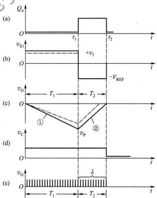

line

| Panel | Time (t) | Value |
|-------|----------|-------|
| (a)   | t₁       | +v₁   |
| (b)   | t₂       | -V_REF |
| (c)   | T₁       | v₀    |
| (c)   | T₂       | vₚ    |
| (d)   | t        | v_C   |
| (e)   | t₁       | v_G   |
| (e)   | t₂       | λ     |

图 10.2.9 双积分 A/D 转换器的工作波形

# 10.2.5 A/D 转换器的主要技术指标

A/D 转换器的主要技术指标有转换精度、转换速度等。选择 A/D 转换器时除考虑这两项技术指标外，还应注意满足其输入电压的范围、输出数字的编码、工作温度范围和电压稳定度等方面的要求。

# 1. 分辨率

A/D转换器的分辨率用输出二进制(或十进制)数的位数表示。它说明A/D转换器对输入信号的分辨能力。从理论上讲，n位输出的A/D转换器能区分2个输入模拟电压信号的不同等级，能区分输入电压的最小值为满量程输入的1/2°。在最大输入电压一定时，输出位数越多，量化单位越小，分辨率越高。例如A/D转换器输出为8位二进制数，输入信号最大值为5V，那么这个转换器应能区分出输入信号的最小电压为19.53mV。

# 2. 转换时间

转换时间是指 A/D 转换器从转换控制信号到来开始，到输出端得到稳定的数字信号所经过的时间。A/D 转换器的转换时间与转换电路的类型有关。不同类型的转换器转换速度相差甚远。其中并行比较 A/D 转换器的转换速度最高，逐次比较型 A/D 转换器次之，间接 A/D 转换器的速度最慢。在实际应用中应从系统数据总的位数、精度要求、输入模拟信号的范围及输入信号极性等方面综合考虑 A/D 转换器的选用。

# 10.2.6 集成 A/D 转换器及其应用

# 1. 集成 A/D 转换器 ADC0809

在单片集成 A/D 转换器中，逐次比较型使用较多，下面我们以 ADC0809 介绍集成 A/D 转换器及其应用。ADC0809 是 AD 公司采用 CMOS 工艺生产的一种 8 位逐次比较型 A/D 转换器。其内部结构框图如图 10.2.10 所示。ADC0809 的转换时间为 100 μs，输入电压范围为 0 \~ 5 V，片内有 8 通道模拟开关，可接入 8 个模拟量输入。由于芯片内有输出数据寄存器，输出的数字量可直接与在计算机 CPU $^{①}$ 的数据总线相接，而无需附加接口电路。

IN0 \~ IN7:8 路模拟信号输入端；

$D_{7}\cdots D_{0}:8$ 位数字信号输出端；

CLOCK: 时钟信号输入端;

ADDA、ADDB、ADDC：地址码输入端，不同的地址码选择不同通道的模拟量输入；

ALE: 地址码锁存输入端, 当输入地址码稳定后, ALE 的上升沿将地址信号锁存于地址锁存器内;

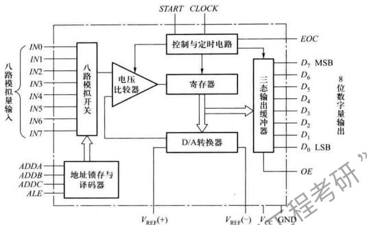

flowchart

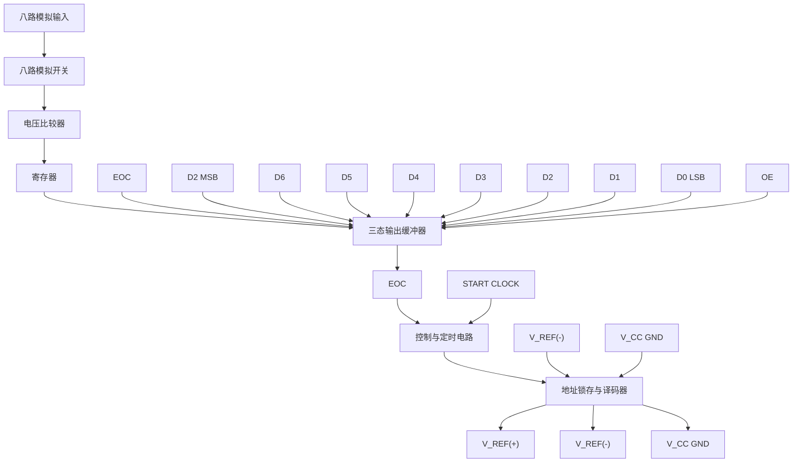

10.2.10 ADC0809 内部结构框图

$V_{\mathrm{REF}}(+)$ 、 $V_{\mathrm{REF}}(-)$ ：分别为参考电压的正、负输入端。一般情况下 $V_{\mathrm{REF}}(+)$ 接 $V_{\mathrm{CC}}$ ， $V_{\mathrm{REF}}(-)$ 接GND；

START: 启动信号输入端。该信号的上升沿到来时片内寄存器被复位, 在其下降沿开始 A/D 转换;

EOC: 转换结束信号输出端。当 A/D 转换结束时 EOC 变为高电平，并将转换结果送入三态输出缓冲器，EOC 可以作为向 CPU 发出的中断请求信号。

OE: 输出允许控制输入端。当 OE=1 时，三态输出缓冲器的数据送到数据总线。

在使用时应注意以下几点：

# (1) 转换时序

ADC0809 控制信号的时序图如图 10.2.11 所示,该图描述了各信号之间时序关系。

ALE信号在地址信号有效后加入，在其上升沿将地址信号锁存于地址锁存与译码器，选择输入通道，在通道信号有效后经 $t_1$ 时间，在START的下降沿电路开始A/D转换。经 $t_c$ 时间转换结束，EOC的高电平将结果存于三态输出缓冲器，当OE的高电平到来后的 $t_c$ 时间，数字信号送出。

# (2) 参考电压的调节

在使用 A/D 转换器时，为保证其转换精度，要求输入电压满量程使用。如输入电压动态范围较小则可调节参考电压 $V_{REF}$ 以保证小信号输入时 ADC0809 芯片 8 位的转换精度。

# (3) 接地

模数、数模转换电路中要特别注意地线的正确连接，否则会产生严重的干扰，影响转换结果的准确性。A/D、D/A 及取样保持芯片上都提供了独立的模拟地（AGND）和数字地（DGND）的引脚。在线路设计中，必须将所有器件的模拟地和数字地分别相连，然后将模拟地与数字地仅在一点上相连接。地线的正确连接方法如图 10.2.12 所示。

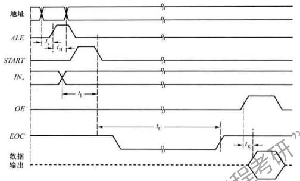

text_image

地址
ALE
START
INa
OE
EOC
数据
输出

图 10.2.11 ADC0809 控制信号的定时图

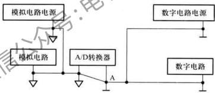

flowchart

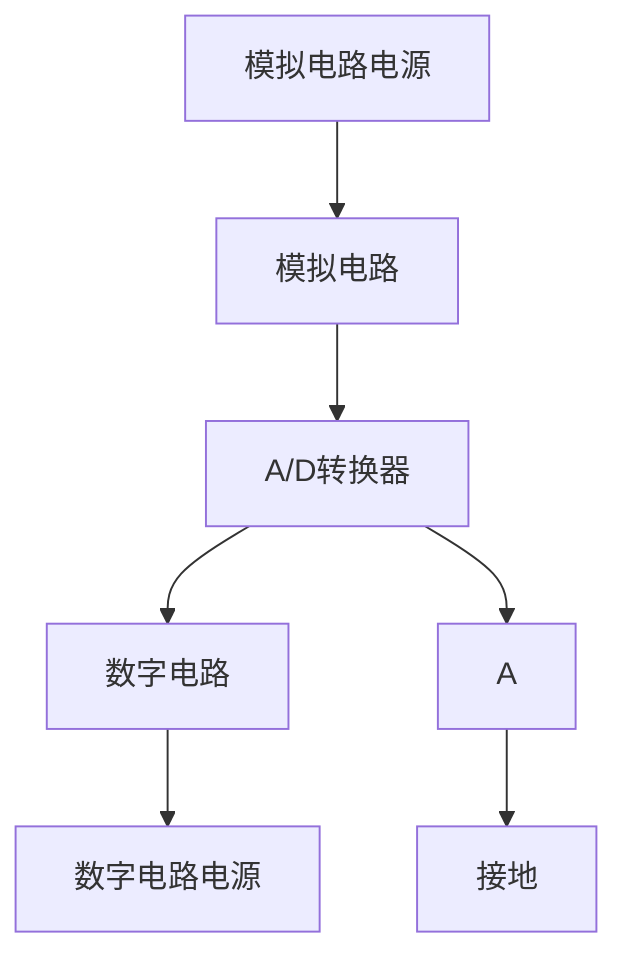

图 10.2.12 正确的地线连接

# 2. ADC0809 的典型应用

下面以数据采集系统为例介绍 ADC0809 的典型应用。

在现代过程控制及各种智能仪器和仪表中，为采集被控（被测）对象数据达到由计算机进行实时控制、检测的目的，常用微处理器和A/D转换器组成数据采集系统。单通道微机化数据采集系统的示意图如图10.2.13所示。

系统由微处理器、存储器和 A/D 转换器组成，系统信号采用总线传送方式，它们之间的信号通过数据总线（DBUS）和控制总线（CBUS）连接。

现以程序查询方式为例说明 ADC0809 在数据采集系统中的应用。采集数据时，微处理器先执行一条传送指令，在该指令执行过程中微处理器在控制总线上产生写信号，其低电平信号启动

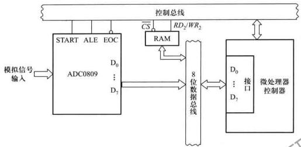

flowchart

图 10.2.13 单通道微机化数据采集系统示意图

A/D转换器工作，ADC0809经 $100\mu \mathrm{s}$ 后将输入模拟信号转换为数字信号存于输出锁存器，EOC信号经反相器产生中断请求信号INTR，通知微处理器取数。当微处理器响应中断请求转入数据采集子程序后，立即执行输入指令，指令产生读信号给ADC0809，将数据取出并存入存储器中。整个数据采集过程中，由微处理器有序地执行若干指令完成。

# 复习思考题

10.2.1 实现模数转换一般要经过哪四个过程？按工作原理不同分类，A/D转换器可分为哪两种？  
10.2.2 在图 10.2.4 所示并行比较 A/D 转换电路中，若输入电压 $v_{i}$ 为负电压，试问电路能否正常进行 A/D 转换？为什么？如不能正常工作需要如何改进电路？  
10.2.3 已知在图10.2.4所示并行A/D转换器中 $V_{\mathrm{REF}} = 10\mathrm{V}, v_{1} = 9\mathrm{V}$ ，试问输出数字量 $D_{2}D_{1}D_{0} = ?$   
10.2.4 在图 10.2.7 所示逐次比较型 A/D 转换器中, 完成一次 A/D 转换所需时间为多少? 转换时间与哪些因素有关?  
10.2.5 试问双积分 A/D 转换器输出数字量与下述哪些参数有关？a）积分时间常数；b）时钟脉冲频率；c）输入信号电压；d）计数器位数；e）运放的零漂；f） $|V_{REF}|$ 。  
10.2.6 比较并行比较型 A/D 转换器、逐次比较型 A/D 转换器、双积分式 A/D 转换器的优、缺点，试问应如何根据实际系统要求合理选用？

# 小结

\- 倒T形电阻网络D/A转换器具有如下特点：电阻网络仅有 $R$ 和 $2R$ 两种阻值；各 $2R$ 支路电流 $I_{\mathrm{i}}$ 与相应 $D_{\mathrm{i}}$ 数码状态无关，是一定值；由于支路电流流向运放反相端时不存在传输时间，因而具有较高的转换速度。

- 不同结构的 A/D 转换器有各自的特点，在要求转换速度高的场合，可选用并行 A/D 转换器；在要求精度高的情况，可以采用双积分 A/D 转换器，当然也可选用高分辨率的其他形式 A/D 转换器，但成本会增加。由于逐次比较型 A/D 转换器在一定程度上兼顾了以上两种转换器的优点，因此得到普遍应用。  
- A/D转换器和D/A转换器的主要技术参数是转换精度和转换速度。目前，A/D与D/A转换器正向着高速度、高分辨率和易于与微型计算机接口方向发展。

# 习题

# 10.1 D/A 转换器

10.1.1 10位倒T形电阻网络D/A转换器如图题10.1.1所示。

(1) 试求输出电压的取值范围；  
(2) 若要求电路输入数字量为 200H 时输出电压 $V_{u}=5V$ ，试问 $V_{REF}$ 应取何值？

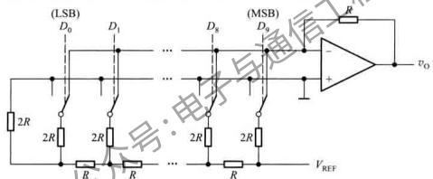

text_image

(LSB)
D0 D1 ... (MSB)
2R 2R 2R 2R R
R R R ... R +
vo
VREF

图题10.1.1

10.1.2 在图10.1.7中所示4位权电流D/A转换器中，已知 $V_{REF} = 6\mathrm{V}, R_1 = 48\mathrm{k}\Omega$ ，当输入 $D_3D_2D_1D_0 = 1100$ 时， $r_{0} = 1.5\mathrm{V}$ ，试确定 $R_{1}$ 的值。  
10.1.3 在图 10.1.4 所示的倒 T 形电阻网络 D/A 转换器中，设 $R_{f}=R$ ，外接参考电压 $V_{REF}=-10\ V$ ，为保证

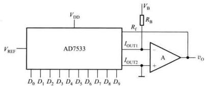

text_image

VDD
VREF
AD7533
Rf
IOUT1
IOUT2
A
Vo
Vb
RB

图题10.1.4

$V_{REF}$ 偏离标准值所引起的误差小于 LSB/2，试计算 $V_{REF}$ 的相对稳定度应取多少？

10.1.4 由 AD7533 组成双极性输出 D/A 转换器如图题 10.1.4 所示。

(1) 根据电路写出输出电压 $v_{0}$ 的表达式；  
(2) 试问实现输入为 2 的补码时的双极性输出电路中, $V_{B}$ 、 $R_{B}$ 、 $V_{REF}$ 和片内的 R 应满足什么关系?

10.1.5 可编程放大器(数控可变增益放大器)电路如图题10.1.5所示。

(1) 推导电路电压放大倍数 $A_{v}=v_{0}/v_{1}$ 的表达式；  
(2) 当输入编码为(001H)和(3FF)时,电压放大倍数A,分别为多少?  
(3) 试问当输入编码为(000H)时,运放 $A_{1}$ 处于什么状态?

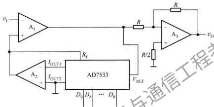

text_image

v₁
A₁
+
R
R/2
A₃
+
vₒ
A₂
+
IOUT1
IOUT2
AD7533
D₀ D₈ ... D₀
VREF

图题 10.1.5

10.1.6 试用 D/A 转换器 AD7533 和计数器 74161 组成如图题 10.1.6 所示的阶梯波形发生器, 要求画出完整的逻辑图。

# 10.2 A/D 转换器

10.2.1 在图 10.2.4 所示并行比较型 A/D 转换器中， $V_{REF} = 7 \, V$ ，试问电路的最小量化单位 $\Delta$ 等于多少？当 $v_{1} = 2.4 \, V$ 时，输出数字量 $D_{2}D_{1}D_{0} = ?$

10.2.2 在图 10.2.5 所示逐次比较 A/D 转换器中, 若 n=10, 已知时钟频率为 1 MHz, 则完成一次转换所需时间是多少? 如要求完成一次转换的时间小于 100 μs, 问时钟频率应选多大?

10.2.3 在图 10.2.7 逐次比较 A/D 转换器中，设 $V_{REF} = 10$ V, $v_{1} = 8.26$ V，试画出在时钟脉冲作用下， $v_{0}^{\prime}$ 的波形并写出转换结果。

10.2.4 计数型 A/D 转换器如图题 10.2.4 所示。试分析其工作原理。

10.2.5 某双积分 A/D 转换器中，计数器为十进制计数器，其最大计数容量为 $(3000)_{\mathrm{D}}$ 。已知计数时钟频率 $f_{CV}=30\ kHz$ ，积分器中 $R=100\ k\Omega, C=1\ \mu F$ ，输入电压 $v_{1}$ 的变化范围为 $0\sim5\ V$ ，试求：

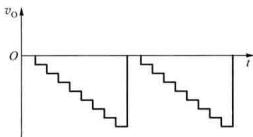

text_image

v₀
O
t

图题 10.1.6

(1) 第一次积分时间 $T_{1}$ ;  
(2) 求积分器的最大输出电压 $\left|V_{max}\right|$ ;  
(3) 当 $V_{REF}=10\ V$ ，第二次积分计数器计数值 $\lambda=(2500)_{10}$ 时，输入电压的平均值 $v_{1}$ 为多少？

10.2.6 在图 10.2.8 所示双积分 A/D 转换器中，设时钟脉冲频率为 $f_{CP}$ ，其分辨率为 n 位，写出最低的取样

频率表达式。

10.2.7 在双积分 A/D 转换器中输入电压 $v_{1}$ 和参考电压 $V_{REF}$ 在极性和数值上应满足什么关系？如 $\left|v_{1}\right| > \left|V_{REF}\right|$ ，电路能完成模数转换吗？为什么？

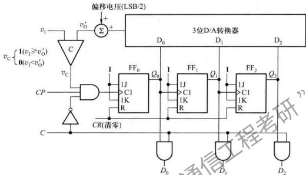

flowchart

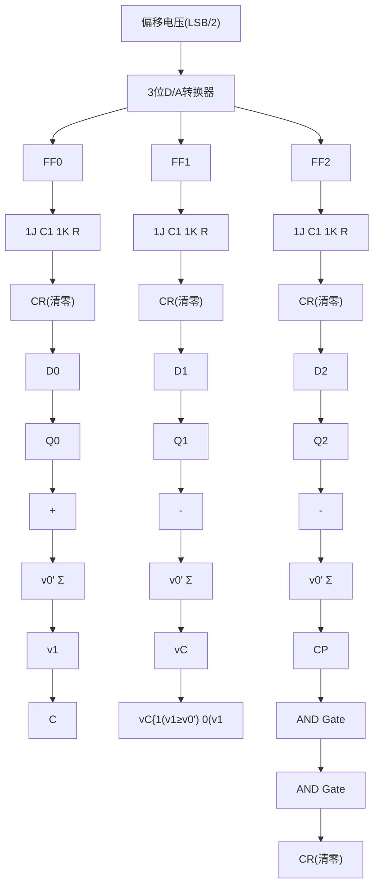

图题 10.2.4

10.2.8 在应用A/D转换过程中应注意哪些主要问题？如某人用满度值为 $10\mathrm{V}$ 的8位A/D转换器对输入信号幅值为 $0.5\mathrm{V}$ 的电压进行模数转换，你认为这样使用正确吗？为什么？