# 7 >>>

# 半导体存储器

# 引言

半导体存储器用来存储大量的二值数据,它是计算机等大型数字系统中不可缺少的组成部分,同时也广泛用于小型便携的数码产品中,如数码相机、手机、MP3播放器等。按照集成度划分,半导体存储器属于大规模集成电路。

本章介绍半导体存储器的基本结构和工作原理，以及各类存储器的特点。用户实际使用时更需要关注存储器的读写控制时序（定时图）和容量扩展等内容，本章对此也作了介绍。

# 7.1 只读存储器

目前，半导体存储器基本上可以分为两大类，即只读存储器（Read-Only memory, ROM）和随机存取存储器（Random Access Memory, RAM，又称为读写存储器）。RAM中的“随机”是指存储器的内容可以以任何顺序存取，而不管前一次存取的是哪一个位置。两者最主要的差别是，正常工作时，即可从RAM中读出数据，也可向RAM中写入数据，而ROM只能读出数据。断电以后，RAM中所存的数据将全部丢失，即具有易失性；而ROM中的数据可以长久保存。

RAM 又可分为静态 RAM（Static Random Access Memory, SRAM）和动态 RAM（Dynamic Random Access Memory, DRAM）。SRAM 中的存储单元相当于一个锁存器，有 0、1 两个稳态；DRAM 则是利用电容器存储电荷来保存 0 或 1 的，因此需要定时对其进行刷新，否则随着时间推移，电容器中存储的电荷将逐渐消散。

根据是否允许用户对 ROM 写入数据, 又可将 ROM 分为固定 ROM(或掩模 ROM) 和可编程 ROM(Programmable Read-Only Memory, PROM)。PROM 又可分为一次可编程 ROM(PROM), 光可擦除可编程 ROM(Erasable Programmable Read-Only Memory, EPROM), 电可擦除可编程 ROM(Electrical Erasable Programmable Read-Only Memory, E²PROM) 和快闪存储器 (Flash Memory)。

RAM 一般用在需要频繁读写数据的场合,如计算机系统中的数据缓存。ROM 常用于存放系统程序、数据表、字符代码等不易变化的数据。 $E^{2}$ PROM 和 Flash Memory 则广泛用于各种存储卡中，例如公交车的 IC 卡，数码相机中的存储卡，移动存储卡（USB 存储卡，也称 U 盘）等。

# 7.1.1 ROM 的基本结构

ROM 是一种永久性数据存储器, 其中的数据一般由专用的装置写入, 数据一旦写入, 不能随意改写, 在切断电源之后, 数据也不会消失。

存储器由存储阵列、地址译码器和输出控制电路三部分组成，其结构如图7.1.1所示。

存储阵列由许多存储单元组成,每个存储单元存放1位二值数据。通常存储单元排列成矩阵形式,且按一定位数进行编组,每次读出一组数据,这里的组称为字。一个字中所含的位数称为字长。为了区别各个不同的字,给每个字赋予一个编号,称为地址。构成字的存储单元也称为地址单元。地址译码器将输入的地址代码译成相应的地址信号,从存储矩阵中选出相应的存储单元,并将其中的数据送到输出控制电路。地址单元的个数N与二进制地址码的位数n满足关系式 $N=2^{n}$ 。

输出控制电路一般都包含三态缓冲器,以便与系统的数据总线连接。当有数据读出时,可以有足够的能力驱动数据总线;没有数据输出时,输出高阻态不会对数据总线产生影响。

图 7.1.2 是一个 ROM 的结构示意图, 其中存储阵列由字线和位线交叉处的二极管构成。该存储器有 4 个地址单元 (4 个字), 字长为 4 位。

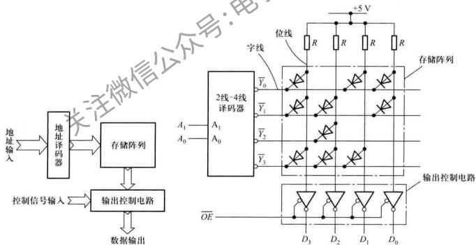

<details>
<summary>flowchart</summary>

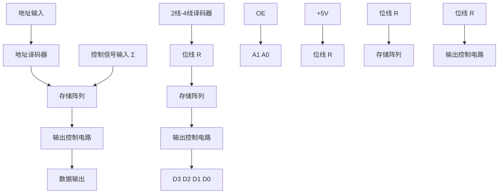
</details>

图 7.1.1 ROM 的基本结构框图  
图 7.1.2 ROM 结构示意图

读操作时，如果给定的地址码为 $A_{1}A_{0} = 01$ ，译码器的 $\overline{Y}_0\sim \overline{Y}_3$ 中只有 $\overline{Y}_1$ 为低电平，则 $\overline{Y}_1$ 字线与所有位线交叉处的二极管导通，使相应的位线变为低电平，而交叉处没有二极管的位线仍保持高电平。此时，若输出使能控制信号 $\overline{OE} = 0$ ，则位线电平经缓冲器反相输出，使 $D_{3}D_{2}D_{1}D_{0} = 1101$ 。因此，ROM属于组合电路，给定一组输入（地址），便可得到一组输出（内容）。该ROM的4个地址内所存储的数据如表7.1.1所示。

表 7.1.1 图 7.1.2 ROM 存储的内容

<table><tr><td>输出使能控制  $\overline{OE}$ </td><td>地址  ${A}_{1}{A}_{0}$ </td><td>内容  ${D}_{3}{D}_{2}{D}_{1}{D}_{0}$ </td></tr><tr><td>0</td><td>0 0</td><td>1 0 1 1</td></tr><tr><td>0</td><td>0 1</td><td>1 1 0 1</td></tr><tr><td>0</td><td>1 0</td><td>0 1 0 0</td></tr><tr><td>0</td><td>1 1</td><td>1 1 1 0</td></tr><tr><td>1</td><td>××</td><td>高阻</td></tr></table>

以上分析可知, 字线与位线交叉处相当于一个存储单元, 此处若有二极管存在, 则存储单元存有 1 值, 否则为 0 值。

在实际应用中，常以字数和字长的乘积表示存储器的容量（也称为密度），存储器的容量越大，意味着能存储的数据越多。例如，一个容量为 $256 \times 4$ 位的存储器，有256个字，字长为4位，总共有1024个存储单元。存储容量较大时，字数通常采用K、M或G为单位。其中 $1\mathrm{K} = 2^{10} = 1024, 1\mathrm{M} = 2^{20} = 1024\mathrm{K}, 1\mathrm{G} = 2^{\mathrm{H}} = 1024\mathrm{M}$ 。图7.1.2所示ROM的容量为 $2^3 \times 4$ 位。

# 7.1.2 二维译码与存储阵列

如果采用图7.1.2中的译码方式构造一个 $2^{8}\times1$ 位的ROM，则需要一个8线-256线译码电路。若采用一级门电路译码，则该译码电路至少需要256个8输入与非门和16个反相缓冲器，电路非常庞大。在实际的ROM中，常采用行译码和列译码的二维译码结构来减小译码电路的规模，如图7.1.3所示。

4线-16线译码器为行译码器，它需要16个4输入与门和8个反相缓冲器。该译码电路输出高电平有效。16线-1线数据选择器构成列译码器，需要16个5输入与门、一个16输入或门和8个反相缓冲器①。可见采用二维译码结构，译码电路的规模大大减小了。

图7.1.3中的存储阵列由行线和列线交叉处的MOS管②构成。当给定的地址码为 $A_{7}A_{6}A_{5}A_{4}A_{3}$ $A_{2}A_{1}A_{0} = 00010001$ 时， $A_{7}A_{6}A_{5}A_{4}$ 经译码器译码，输出 $Y_{1}$ 行线为高电平，则栅极与 $Y_{1}$ 相连的MOS管导通，使 $I_1$ 、 $I_{14}$ 的位线变为低电平；而交叉处未连接 MOS 管的位线仍保持高电平，如 $I_0$ 、 $I_{15}$ 的位线仍为高电平。而此时地址码的低 4 位 $A_1A_2A_1A_0 = 0001$ ，数据选择器选择 $I_1$ 位线输出，即 $D_0 = I_1 = 0$ 。如果 $Y_1$ 行线和 $I_1$ 位线交叉处没有 MOS 管， $D_0 = I_1 = 1$ 。一般数据选择器的输出 $D_0$ 还需经反相输出缓冲器再输出。由此看出，4 线-16 线译码器实现行的选择，16 线-1 线数据选择器实现列的选择，从而完成行和列的译码。ROM 通过行和列交叉点上是否连有 MOS 管来存储 0 和 1。

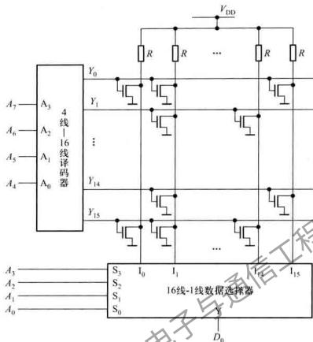

<details>
<summary>flowchart</summary>

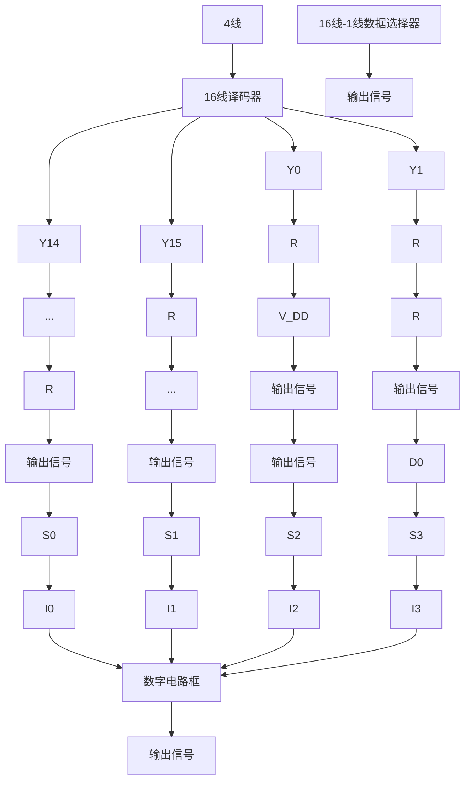
</details>

图 7.1.3 用 MOS 管构成存储单元的 ROM 结构示意图

# 7.1.3 可编程 ROM

由图 7.1.2 和图 7.1.3 看出，存储阵列可用二极管构成，也可用 MOS 管或 BJT 管构成。这类 ROM 也称为固定 ROM 或掩模 ROM，器件制造商根据用户提供的 ROM 存储内容，在制造时，利用掩模技术把数据写入存储器中（构建存储阵列中字线与位线交叉处二极管的有、无），一旦 ROM 制成，其存储的数据也就固定不变了。

另外，存储阵列也可采用4.5.1节介绍的带金属熔丝的二极管、SIMOS管、Flotox MOS管和快闪叠栅MOS管等，制成各种可编程ROM。一次可编程存储器PROM的存储阵列由带金属熔丝的二极管构成。出厂时，PROM存储内容全为1（或者全为0），用户可以根据要写入的数据，利用编程软件生成编程数据（也称为熔丝图），再通过通用或专用的编程器，根据熔丝图将某些单元的熔丝烧断，来改写存储的内容。由于熔丝烧断后不能恢复，因此PROM只能改写一次。

光可擦除可编程存储器 EPROM 的存储阵列由 SIMOS 管构成, 其数据写入需要通用或专用的编程器。EPROM 芯片的封装外壳装有透明的石英盖板, 用紫外线或 X 射线照射 15\~20 min, 便可擦除其全部内容。擦除后可重新写入数据。如今大多数 PROM 实际上是不装透明石英盖板的 EPROM, 因而无法擦除, 只能写入一次, 也称 OTP (One Time Programmable) EPROM。

电可擦除可编程存储器 $\mathrm{E}^2\mathrm{PROM}$ 和快闪存储器阵列分别由FlotoxMOS管和快闪叠栅MOS管构成。 $\mathrm{E}^2\mathrm{PROM}$ 既具有ROM的非易失性，又具有写入功能。改写过程就是电擦除过程（在线擦除，即不需要将芯片从电路系统中取出。可重复擦写1万次以上），改写以字为单位进行。目前，大多数 $\mathrm{E}^2\mathrm{PROM}$ 芯片内部都备有升压电路。因此，只需提供单电源供电，便可进行读、擦除/写操作，这为数字系统的设计和在线调试提供了极大方便。与EPROM相比， $\mathrm{E}^2\mathrm{PROM}$ 的存储单元电路复杂，所以集成度低。

快闪存储器的擦除和写入是分开进行的，通过在快闪叠栅MOS管的栅极加正电压完成擦除操作，而在MOS管的栅极加高的正电压完成写入操作。因此写入前，首先要进行擦除。由于快闪存储器的存储单元结构简单（只需要一个快闪叠栅MOS管），所以集成度较 $\mathrm{E}^2$ PROM高。

上述可编程 ROM 的发展,实际上已经改变了 ROM 最初只读存储器的含义,而既有读功能,又有写功能。特别是快闪存储器具有的大容量、可读写、非易失性特点,使之广泛应用于各种数码产品中。为便于比较,将几种 ROM 性能列于表 7.1.2 中。

表 7.1.2 几种 ROM 性能比较

<table><tr><td></td><td>快闪存储器。</td><td>ROM</td><td>EPROM</td><td> $E^{2}$ PROM</td></tr><tr><td>非易失性</td><td>是</td><td>是</td><td>是</td><td>是</td></tr><tr><td>高密度</td><td>是</td><td>是</td><td>是</td><td>否</td></tr><tr><td>单管存储单元</td><td>是</td><td>是</td><td>是</td><td>否</td></tr><tr><td>在系统可变</td><td>是</td><td>否</td><td>否</td><td>是</td></tr></table>

由前面所述ROM的结构看出，地址码的输入和数据的输出都是并行的。实际上，还有串行输入输出的ROM，其地址为串行输入，数据也是串行输出的（PROM也有数据输入）。而且经常是地址和数据分时共用同一个引脚。由于串行结构大大减少了芯片的引脚数，所以其体积可以做得很小。目前，该结构的存储器已在便携设备中得到广泛应用，如日常生活中的各种IC卡就属于这种结构。

# 7.1.4 ROM 读操作实例

下面通过一个 PROM 芯片例子 AT27C010, 了解 ROM 的具体使用。

# 1. PROM 芯片 AT27C010 简介

该芯片是美国 Atmel 公司①生产的 128K×8 位的 OTP EPROM。在读工作方式下，采用 5V 电源，读出时间最短为 45 ns，静态时工作电流小于 10 μA。图 7.1.4 是它的框图和引脚图。图中 $V_{\text{CC}}$ 是读操作时的工作电压， $V_{\text{PP}}$ 是数据写入时的编程电压（编程写入时， $V_{\text{PP}} = 13 \, \text{V}$ ）， $\overline{OE}$ 是输出使能信号， $\overline{PGM}$ 是编程选通信号。为便于控制还加有片选信号 $\overline{CE}$ 。NC 为空脚。AT27C010 的工作模式如表 7.1.3 所示。

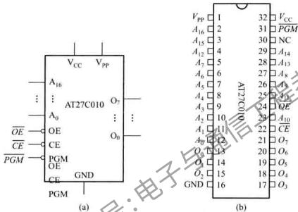

<details>
<summary>text_image</summary>

VCC VPP
A16
AT27C010 O2
A15
A14
A13
A12
A11
A10
A9
CE
PGM
OE
CE
CE GND
CE
PGM
(a)
VPP 1 32 VCC
A16 2 31 PGM
A15 3 30 NC
A12 4 29 A14
A11 5 28 A13
A6 6 27 A8
A5 7 26 A9
A4 8 25 A10
A3 9 24 OE
A2 10 23 A11
A1 11 22 CE
AP 12 21 O7
O4 13 20 O6
O3 14 19 O5
O2 15 18 O4
GND 16 17 O3
AT27C010
(b)
</details>

图 7.1.4 J28K×8 位的 OTP EPROM AT27C010  
(a) AT27C010 框图  
(b) AT27C010 双列直插式封装的引脚图

表7.1.3 工作模式

<table><tr><td>工作模式</td><td> $\overline{CE}$ </td><td> $\overline{OE}$ </td><td> $\overline{PGM}$ </td><td> ${A}_{16} \sim {A}_{0}$ </td><td> ${V}_{PP}$ </td><td> ${O}_{2} \sim {O}_{0}$ </td></tr><tr><td>读</td><td>0</td><td>0</td><td>×</td><td> ${A}_{i}$ </td><td>×</td><td>数据输出</td></tr><tr><td>输出无效</td><td>×</td><td>1</td><td>×</td><td>×</td><td>×</td><td>高阻</td></tr><tr><td>等待</td><td>1</td><td>×</td><td>×</td><td> ${A}_{i}$ </td><td>×</td><td>高阻</td></tr><tr><td>快速编程</td><td>0</td><td>1</td><td>0</td><td> ${A}_{i}$ </td><td> ${V}_{PP}$ </td><td>数据输入</td></tr><tr><td>编程校验</td><td>0</td><td>0</td><td>1</td><td> ${A}_{i}$ </td><td> ${V}_{PP}$ </td><td>数据输出</td></tr></table>

# 2. 读操作及定时图

为了保证存储器准确无误地工作,加到存储器的地址和控制信号必须遵守规定的时序要求,AT27C010 的读时序如图 7.1.5 所示,阴影部分表示不确定状态。

读出过程操作如下：

(1) 欲读取单元的地址加到存储器的地址输入端；  
(2) 加入有效的片选信号 $\overline{CE}$   
(3) 使输出使能信号 OE 有效, 经过一定延时后, 有效数据出现在数据线上;  
（4）让片选信号 $\overline{CE}$ 或输出使能信号 OE 无效，经过一定延时后，数据线呈高阻态，本次读出结束。

图7.1.5中 $t_{\mathrm{AA}}$ 为地址存取时间，表示从地址信号加到存储器上到数据输出端有稳定的数据输出所需要的时间。此前必须保证 $\overline{CE}$ 和 $\overline{OE}$ 已经为0。 $t_{\mathrm{CE}}$ 为片选存取时间，表示在地址输入端已经有稳定地址和输出使能信号 $\overline{OE}$ 有效的条件下，从片选信号 $\overline{CE}$ 有效到数据稳定输出所需时间。 $t_{\mathrm{OE}}$ 为输出使能时间，表示在地址输入端已经有稳定地址和片选信号 $\overline{CE}$ 有效的条件下，从输出使能信号 $\overline{OE}$ 有效到数据稳定输出所需时间。显然在进行读操作时，只有在地址、 $\overline{CE}$ 和 $\overline{OE}$ 均有效，且延迟时间均满足 $t_{\mathrm{AA}}, t_{\mathrm{CE}}$ 和 $t_{\mathrm{OE}}$ 以后，被读单元的内容才能稳定地出现在数据输出端。而当地址失效后，数据输出端上的数据保持 $t_{\mathrm{OE}}$ 后才失效。 $\overline{CE}$ 或 $\overline{OE}$ 失效后，经延迟 $t_{\mathrm{OE}}$ （输出失效时间）后数据端呈高阻态。

AT27C010 延迟时间的一组典型值为： $t_{AAmax}=45\ ns, t_{CEmax}=45\ ns, t_{OEmax}=20\ ns, t_{OZmax}=20\ ns, t_{OHmin}=7\ ns$ 。

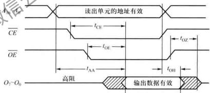

<details>
<summary>text_image</summary>

读出单元的地址有效
CE
OE
t_CE
t_OE
t_AA
t_OZ
t_OH
高阻
输出数据有效
O₂-O₀
</details>

图 7.1.5 AT27C010 的读操作定时图

由于 PROM 的数据写入均由专用或通用编程器完成,一般无需用户直接对其引脚进行操作,所以此处不再介绍数据写入时序,若有需要,可参阅制造商的产品数据手册。

# 7.1.5 ROM 应用举例

ROM 常用于存放系统的运行程序或固定不变的数据。此外，由于 ROM 是一种组合逻辑电路，因此可以用它来实现各种组合逻辑函数，特别是多输入、多输出的逻辑函数。设计实现时，只需列出真值表，逻辑函数的输入作为地址，输出作为存储内容，将内容按地址写入 ROM 即可。下面举例说明 ROM 的简单应用。

用 ROM 实现二进制码与格雷码相互转换的电路如图 7.1.6 所示。该电路需要用 ROM 的 5 根地址线和 4 根数据线。连接地址线最高位的 C 为转换方向控制位，待转换的代码由 $I_{3}I_{2}I_{1}I_{0}$ 输入，转换后的代码由 $O_{3}O_{2}O_{1}O_{0}$ 输出。当 C=0 时，实现二进制码到格雷码的转换；而当 C=1 时，实现格雷码到二进制码的转换。ROM 中的内容如表 7.1.4 所示（两种码的关系参见 1.4.2 节）。该 ROM 的容量至少为 $2^{5}\times4$ 位。

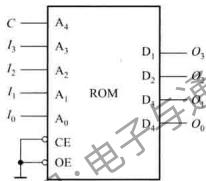

<details>
<summary>text_image</summary>

C
I₃
I₂
I₁
I₀
A₄
A₃
A₂
A₁
A₀
CE
OE
ROM
D₁ — O₃
D₂ — O₄
D₃ — O₅
D₄ — O₀
电子元件
</details>

图 7.1.6 用 ROM 实现二进制码与格雷码相互转换

表 7.1.4 ROM 中的内容

<table><tr><td> $C$   $\left( {A}_{4}\right)$ </td><td> ${I}_{2} \pm  {I}_{1}{I}_{0}$   $\left( {{A}_{3}{A}_{2}{A}_{1}{A}_{0}}\right)$  二进制码</td><td> ${O}_{3}{O}_{2}{O}_{1}{O}_{0}$   $\left( {{D}_{3}{D}_{2}{D}_{1}{D}_{0}}\right)$  格雷码</td><td> $C$   $\left( {A}_{4}\right)$ </td><td> ${I}_{3}{I}_{2}{I}_{1}{I}_{0}$   $\left( {{A}_{3}{A}_{2}{A}_{1}{A}_{0}}\right)$  格雷码</td><td> ${O}_{3}{O}_{2}{O}_{1}{O}_{0}$   $\left( {{D}_{3}{D}_{2}{D}_{1}{D}_{0}}\right)$  二进制码</td></tr><tr><td>0</td><td>0 0 0 0</td><td>0 0 0 0</td><td>1</td><td>0 0 0 0</td><td>0 0 0 0</td></tr><tr><td>0</td><td>0 0 0 1</td><td>0 0 0 1</td><td>1</td><td>0 0 0 1</td><td>0 0 0 1</td></tr><tr><td>0</td><td>0 0 1 0</td><td>0 0 1 1</td><td>1</td><td>0 0 1 0</td><td>0 0 1 1</td></tr><tr><td>0</td><td>0 0 1 1</td><td>0 0 1 0</td><td>1</td><td>0 0 1 1</td><td>0 0 1 0</td></tr><tr><td>0</td><td>0 1 0 0</td><td>0 1 1 0</td><td>1</td><td>0 1 0 0</td><td>0 1 1 1</td></tr><tr><td>0</td><td>0 1 0 1</td><td>0 1 1 1</td><td>1</td><td>0 1 0 1</td><td>0 1 1 0</td></tr><tr><td>0</td><td>0 1 1 0</td><td>0 1 0 1</td><td>1</td><td>0 1 1 0</td><td>0 1 0 0</td></tr><tr><td> $C$   $\left( {A}_{4}\right)$ </td><td> ${I}_{3}{I}_{2}{I}_{1}{I}_{0}$   $\left( {{A}_{3}{A}_{2}{A}_{1}{A}_{0}}\right)$  二进制码</td><td> ${O}_{3}{O}_{2}{O}_{1}{O}_{0}$   $\left( {{D}_{3}{D}_{2}{D}_{1}{D}_{0}}\right)$  格雷码</td><td> $C$   $\left( {A}_{4}\right)$ </td><td> ${I}_{3}{I}_{2}{I}_{1}{I}_{0}$   $\left( {{A}_{3}{A}_{2}{A}_{1}{A}_{0}}\right)$  格雷码</td><td> ${O}_{3}{O}_{2}{O}_{1}{O}_{0}$   $\left( {{D}_{3}{D}_{2}{D}_{1}{D}_{0}}\right)$  二进制码</td></tr><tr><td>0</td><td>0111</td><td>0100</td><td>1</td><td>0111</td><td>0101</td></tr><tr><td>0</td><td>1000</td><td>1100</td><td>1</td><td>1000</td><td>1111</td></tr><tr><td>0</td><td>1001</td><td>1101</td><td>1</td><td>1001</td><td>1110</td></tr><tr><td>0</td><td>1010</td><td>1111</td><td>1</td><td>1010</td><td>1100</td></tr><tr><td>0</td><td>1011</td><td>1110</td><td>1</td><td>1011</td><td>1101</td></tr><tr><td>0</td><td>1100</td><td>1010</td><td>1</td><td>1100</td><td>1000</td></tr><tr><td>0</td><td>1101</td><td>1011</td><td>1</td><td>1101</td><td>1001</td></tr><tr><td>0</td><td>1110</td><td>1001</td><td>1</td><td>1110</td><td>1011</td></tr><tr><td>0</td><td>1111</td><td>1000</td><td>1</td><td>1111</td><td>1010</td></tr></table>

另外，还可以用 ROM 实现两个 4 位二进制数的乘法运算。两个 4 位二进制数分别作为地址的高 4 位和低 4 位，他们的积需要 8 位。这样选用容量为 $2^{8} \times 8$ 位的 ROM 便可实现该乘法运算，读者可以试着自行确定 ROM 中的内容。

随着集成电路技术的发展,ROM的价格已变得相对低廉,加之用它实现逻辑函数非常简单易行,所以在某些情况下,用该法实现逻辑函数不失为一种有效的方法。实际上,8.2节的现场可编程向阵列就是借鉴这种方法实现逻辑函数的。

# 复习思考题

7.1.1 什么是存储器的数据非易失性？  
7.1.2 在存储器的结构中，什么叫“字”？什么叫“字长”？如何标注存储器的容量？  
7.1.3 一个存储容量为 $256 \times 8$ 位的 ROM，其地址码应为多少位？  
7.1.4 哪几种 ROM 具有多次擦除重写功能？哪种 ROM 的擦除过程就是数据写入过程？  
7.1.5 用 ROM 实现无符号 16 位二进制数的加/减运算,要求有加/减模式控制、低位的进位输入以及进位输出。问:该 ROM 需要有多少根地址线?多少根数据线?其存储容量为多少?

# 7.2 随机存取存储器

RAM 是另一大类存储器, 它与 ROM 的最大区别就是数据易失性, 一旦失去电源供电, 所存储的数据立即丢失。最大优点是可以随时快速地从其中任一指定地址读出 (取出) 或写入 (存入) 数据。RAM 又分为静态 RAM(SRAM) 和动态 RAM(DRAM)。下面首先介绍 SRAM。

# 7.2.1 SRAM

# 1. SRAM 的基本结构及输入输出

静态 RAM 常称为 SRAM, 它的基本结构与 ROM 类似, 由存储阵列、地址译码器和输入/输出控制电路三部分组成。SRAM 的一般结构框图如图 7.2.1 所示。

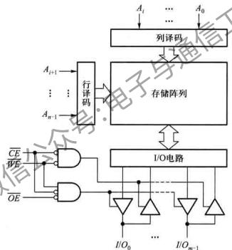

<details>
<summary>flowchart</summary>

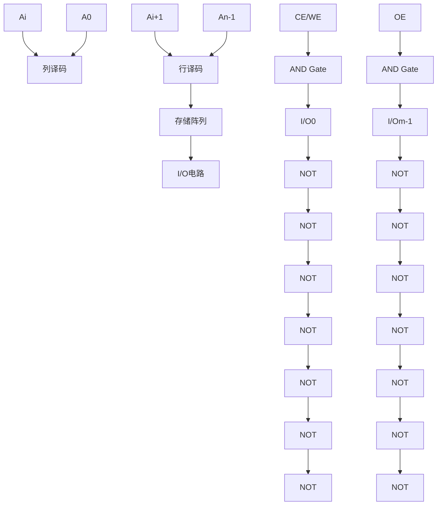
</details>

图 7.2.1 SRAM 的结构框图

其中 $A_0 \sim A_{n-1}$ 是 $n$ 根地址线， $I/O_0 \sim I/O_{m-1}$ 是 $m$ 根双向数据线，其容量为 $2^n \times m$ 位。 $\overline{OE}$ 为输出使能信号， $\overline{WE}$ 是写使能信号， $\overline{CE}$ 为片选信号。只有在 $\overline{CE} = 0$ 时，RAM才能进行正常读写操作，否则，三态缓冲器均为高阻，SRAM不工作。为降低功耗，一般SRAM中都设计有电源控制电路（图中未画），当片选信号 $\overline{CE}$ 无效时，将降低SRAM内部的工作电压，使其处于微功耗状态。I/O电路主要包含数据输入驱动电路和读出放大器，以使SRAM的内外电平能更好地匹配。SRAM的工作模式如表7.2.1所示。

表 7.2.1 SRAM 的工作模式

<table><tr><td>工作模式</td><td> $\overline{CE}$ </td><td> $\overline{WE}$ </td><td> $\overline{OE}$ </td><td> $I/{O}_{0} \sim 1/{O}_{m - 1}$ </td></tr><tr><td>保持 (微功耗)</td><td>1</td><td>✘</td><td>✘</td><td>高阻</td></tr><tr><td>读</td><td>0</td><td>1</td><td>0</td><td>数据输出</td></tr><tr><td>写</td><td>0</td><td>0</td><td>✘</td><td>数据输入</td></tr><tr><td>输出无效</td><td>0</td><td>1</td><td>1</td><td>高阻</td></tr></table>

# 2. SRAM 存储单元

SRAM与ROM最主要的差别是存储单元。SRAM的存储单元是由锁存器构成的，因此它属于时序逻辑电路。图7.2.2画出了存储阵列中第 $j$ 列、第 $i$ 行的存储单元结构示意图。虚线框中为六管SRAM存储单元，其中NMOS管 $\mathrm{T}_1\sim \mathrm{T}_4$ 构成一个RS锁存器用来存储1位二值数据。 $X_{i}$ 为行译码器的输出， $Y_{j}$ 为列译码器的输出。 $\mathrm{T_5},\mathrm{T_6}$ 为本单元控制门，由行选择线 $X_{i}$ 控制。 $X_{i} = 1$ $\mathrm{T}_{5},\mathrm{T}_{6}$ 导通，锁存器与位线接通； $X_{i} = 0,\mathrm{T}_{5},\mathrm{T}_{6}$ 截止，锁存器与位线隔离。 $\mathrm{T}_7,\mathrm{T}_8$ 为一列存储单元公用的控制门，用于控制位线与数据线的连接状态，由列选择线 $Y_{j}$ 控制。显然，当行选择线和列选择线均为高电平时， $\mathrm{T_5}\sim \mathrm{T_8}$ 都导通，锁存器的输出才与数据线接通，该单元才能通过数据线传送数据。因此，存储单元能够进行读/写操作的条件是，与它相连的行、列选择线均须呈高电平。

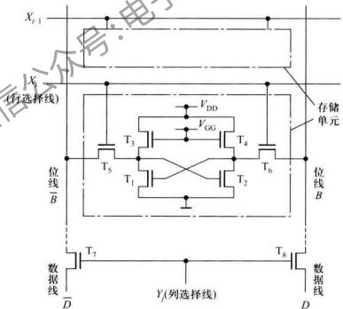

<details>
<summary>text_image</summary>

X_{i-1}
(X
(行选择线)
T_3
V_DD
V_GG
存储单元
T_4
T_5
T_6
位线
B
位线
B
数据线
D
Y(列选择线)
T_7
T_8
数据线
D
</details>

图 7.2.2 第 j 列、第 i 行的存储单元结构示意图

由此可见，SRAM 中数据由锁存器记忆，只要不断电，数据就能永久保存。

# 3. 读写操作及定时图

SRAM 工作时有读和写两种操作,他们是分时进行的,下面根据表 7.2.1 的工作模式分别加以介绍。

读操作时，有效地址要加到地址输入端，片选信号 $\overline{CE}$ 为低电平，写使能信号 $\overline{WE}$ 为高电平，输出使能信号 $\overline{OE}$ 为低电平，SRAM中的数据被送到数据线上。由于实际的逻辑电路都存在延时，所以从给定输入信号到数据输出需要一定的时间。SRAM典型的读操作定时图如图7.2.3所示。图中左侧是由地址控制的读操作， $\overline{CE}$ 和 $\overline{OE}$ 始终保持低电平，此时数据的输出只与地址有关。右侧是 $\overline{CE}$ 控制的读操作，此前地址已经有效或与 $\overline{CE}$ 同时有效。图中定时参数的含义见表7.2.2①，并给出了Cypress公司生产的SRAM产品CY7C1062DV33的参数值。只有在满足相关参数最低要求时，才能顺利完成读操作。器件制造商在数据手册中会提供这些参数的具体数值。

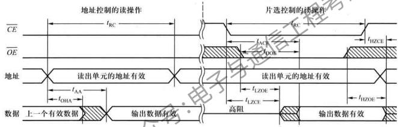

<details>
<summary>text_image</summary>

CE
OE
地址控制的读操作
tRC
片选控制的读操作
RC
tAC
tDOB
tHZCE
地址
读出单元的地址有效
tAA
tOHA
读出单元的地址有效
tLZOE
tLZCE
tHZOE
数据上一个有效数据
输出数据有效
高阻
输出数据有效
</details>

图 7.2.3 SRAM 典型的读操作定时图 ( $\overline{WE}=1$ )

表 7.2.2 读操作定时参数含义

<table><tr><td rowspan="2">参数</td><td rowspan="2">说明</td><td colspan="2">CY7C1062DV33 参数值样例 (单位:ns)</td></tr><tr><td>最小值</td><td>最大值</td></tr><tr><td> ${t}_{\mathrm{{RC}}}$ </td><td>读周期。连续进行两次读操作所需要的最小时间间隔</td><td>10</td><td></td></tr><tr><td> ${t}_{\mathrm{{AA}}}$ </td><td>地址存取时间。从地址有效到数据稳定输出的延迟时间</td><td></td><td>10</td></tr><tr><td> ${t}_{\text{OHA }}$ </td><td>输出保持时间。地址变化后,输出数据仍然保持有效的时间</td><td>3</td><td></td></tr><tr><td> ${t}_{\text{ACE }}$ </td><td>片选存取时间。片选信号有效到数据稳定输出的延迟时间</td><td></td><td>10</td></tr><tr><td> ${t}_{\mathrm{{DOE}}}$ </td><td>输出使能时间。输出使能信号有效到数据稳定输出的延迟时间,通常  ${t}_{\mathrm{{DOE}}} < {t}_{\mathrm{{ACE}}}$ </td><td></td><td>5</td></tr><tr><td> ${t}_{\text{LZOE }}$ </td><td>输出使能高阻维持时间。输出使能有效后,输出仍维持高阻的时间</td><td>1</td><td></td></tr><tr><td> ${t}_{\text{LZCE }}$ </td><td>片选高阻维持时间。片选有效后,输出仍维持高阻的时间</td><td>2</td><td></td></tr><tr><td> ${t}_{\text{HZCE }}$ </td><td>片选保持时间。片选无效后,输出数据仍保持有效的时间,通常 ${t}_{\text{HZCE}} < {t}_{\text{LZCE }}$ </td><td></td><td>5</td></tr><tr><td> ${t}_{\text{HZOE }}$ </td><td>输出使能保持时间。输出使能无效后,输出数据仍保持有效的时间,通常  ${t}_{\text{HZOE}} < {t}_{\text{LZOE }}$ </td><td></td><td>5</td></tr></table>

写操作时,有效地址要加到地址输入端,片选信号 $\overline{CE}$ 有效,写使能信号 $\overline{WE}$ 有效时,数据线上的数据被写入SRAM中。SRAM典型的写操作定时图如图7.2.4所示。图中左侧为 $\overline{CE}$ 控制写入时的情况;右侧为 $\overline{WE}$ 控制写入时的情况。定时参数的含义如表7.2.3所示。同样,在满足参数最低要求时才能正确完成写操作。

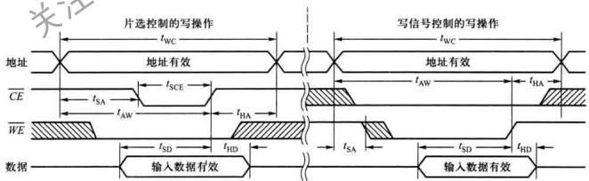

<details>
<summary>text_image</summary>

片选控制的写操作
写信号控制的写操作
地址
tWC
tWC
地址有效
地址有效
CE
tSA
tSCE
tAW
tHA
WE
tSD
tHD
tSA
tSD
tHD
数据
输入数据有效
输入数据有效
</details>

图 7.2.4 SRAM 典型的写操作定时图 ( $OE=1$ )

表 7.2.3 写操作定时参数含义

<table><tr><td rowspan="2">参数</td><td rowspan="2">说明</td><td colspan="2">CY7C1062DV33 参数值样例 (单位:ns)</td></tr><tr><td>最小值</td><td>最大值</td></tr><tr><td> ${t}_{\mathrm{{WC}}}$ </td><td>写周期</td><td>10</td><td></td></tr><tr><td> ${t}_{\mathrm{S}\mathrm{A}}$ </td><td>地址建立时间。反映在写控制信号有效前, 地址必须稳定一段时间</td><td>0</td><td></td></tr><tr><td> ${t}_{\mathrm{{AW}}}$ </td><td>写结束前地址保持时间</td><td>7</td><td></td></tr><tr><td> ${t}_{\text{SCE }}$ </td><td>片选持续时间</td><td>7</td><td></td></tr><tr><td> ${t}_{\mathrm{{SD}}}$ </td><td>写结束前数据建立时间。反映在写信号失效前, 数据线上的数据 应保持稳定的时间</td><td>5.5</td><td></td></tr><tr><td> ${t}_{\mathrm{{HA}}}$ </td><td>写结束后地址维持时间</td><td>0</td><td></td></tr><tr><td> ${t}_{\mathrm{{HD}}}$ </td><td>写结束后数据维持时间</td><td>0</td><td></td></tr></table>

大多数 SRAM 的读周期和写周期是相等的,根据器件工作速度不同其时长也不同,一般为几纳秒到几十纳秒。

截止到2010年10月，Cypress公司已有容量达64Mbit的产品提供，存取时间最短10 ns。

另外，一种称作先进先出(First-in First-gut, FIFO)的SRAM也得到广泛应用。所谓先进先出是指先存入的数据也先被读出，不能随机存取。意味着FIFO的读写地址是按一定顺序变化的。为了实现先进先出的读写功能，FIFO在结构设计上与普通SRAM有较大差别，它的数据写入端口和数据读出端口是分开的，并且没有地址输入端口。读写数据的地址由FIFO内部的读地址指针计数器和写地址指针计数器来确定。写操作时，写控制信号有效，输入端口的数据写入到由写指针指向的地址单元中，然后写指针计数器加1。读操作与此类似。该存储器必须先写入数据后，才能读出数据。当FIFO中的数据被读完后，表示“空”状态的输出信号有效。若写入FIFO中的数据没有被及时读出，可能会出现被写“满”的情况，此时表示“满”状态的输出信号有效。“空”和“满”状态信号为用户控制FIFO的读写提供了方便。

FIFO SRAM 多用来做数据缓冲器,特别适合用于需要长时间、不间断、高速数据采集的缓冲器。

还有一种不同于FIFO的双口(Dual-Port)SRAM。这种存储器有两套完全独立完整的地址、数据和控制端口，共用同一个存储阵列。两个端口都能进行读写操作，不像FIFO那样数据只能一个口进一个口出，而且能根据各自端口的地址随机存取。当出现两个端口同时访问相同的地址单元时，SRAM内部仲裁电路将根据两个端口先后访问的微小时差，决定先完成哪个端口的访问，并输出状态信号告知另一端口将延迟其访问。双口SRAM为数据缓存提供了更便利的条件。

与 ROM 类似, SRAM 也有串行结构。由于串行 SRAM 芯片减少了引脚数, 所以可以做得非常小, 通常用在速度要求不高, 而体积要求非常小的系统中。

# 7.2.2 同步 SRAM

# 1. 同步 SRAM 的基本结构及工作原理简介

随着各种数据密集型应用(如互联网中的交换机、路由器、服务器，以及通信领域的无线基站和测试设备等)对速度要求的不断提高，RAM和其他大规模及超大规模集成电路(如Intel的奔腾处理器)一样，近些年也得到快速发展，同步SRAM(Synchronous SRAM,SSRAM)是在SRAM基础上发展起来的一种更适合高速存取的RAM。同步SRAM与SRAM最主要的差别是，前者的读写操作是在时钟脉冲节拍控制下完成的。因此，同步SRAM最明显的标志是有时钟脉冲输入端。为便于区别，上节介绍的SRAM也称为异步SRAM(Asynchronous SBAM,ASRAM)。

同步SRAM的基本结构如图7.2.5所示。为了能更好地实现同步操作，与SRAM相比，同步SRAM在结构上最大的不同是在电路内部增加了包括地址、数据、读写控制等各种输入信号的寄存器。除输出使能控制信号 $\overline{OE}$ 外，所有输入均在时钟脉冲 $CP$ 的上升沿被取样，存入寄存器。

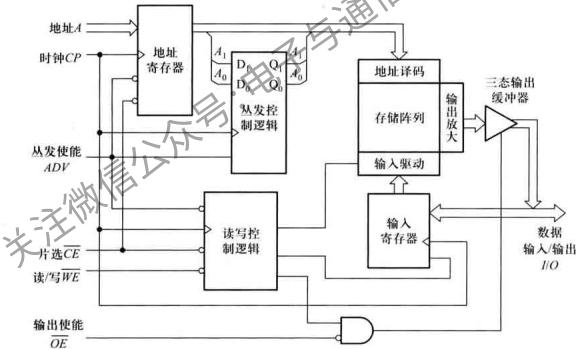

<details>
<summary>flowchart</summary>

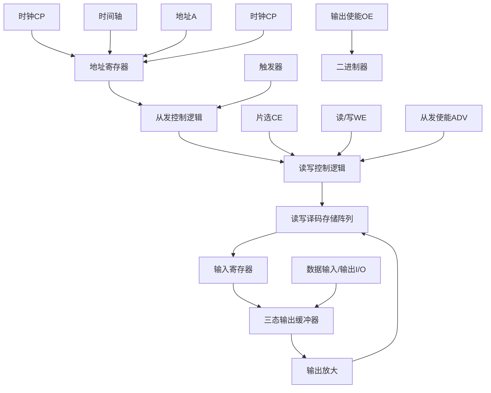
</details>

图 7.2.5 同步 SRAM 的基本结构

由图 7.2.3 和图 7.2.4 异步 SRAM 的读写定时图看到,相关信号的定时参数必须满足一定要求才能正确实现读写操作。特别是在高速存取的应用场合,必须精心设计异步 SRAM 的地址、数据和读写控制等信号的时序。而同步 SRAM 是在时钟脉冲控制下完成读写操作的。在时钟有效沿到来时,地址、数据、控制等信号被锁存到同步 SRAM 内部的寄存器中,读写过程的延时等待均被限制在时钟作用间隔内。这种工作方式使其应用变得非常简便，用户只要围绕时钟的有效沿设计所有的输入信号即可。另外，可以对芯片内部的各种时延进行优化设计，使得同步SRAM的读写速度高于异步SRAM。

同步SRAM具有的另一个特点是丛发(Burst，也译为突发)读写操作模式①。在该工作模式下，只要外部给定读写存储单元的首地址，在时钟脉冲作用下，由内部地址计数器提供首地址后的一组连续地址，就可以连续读写接下来的若干个地址单元，而不再需要外部输入地址。同步SRAM的这种丛发模式，在连续读/写多个字时，可以减少外部地址总线的占用时间，提高读写效率。根据内部地址计数器的位数不同，丛发读写的字数可以是2、4、8个字不等。

图7.2.5中的丛发控制逻辑电路中包含一个2位的二进制地址计数器（也称为丛发计数器），丛发模式下可以连续读写4个字。外部地址码的最低2位 $A_{1}A_{0}$ 经过该电路后再送至地址译码电路。ADV是丛发使能控制信号。同步SRAM的读写工作模式如表7.2、4所示。

表 7.2.4 同步 SRAM 的读写工作模式

<table><tr><td>工作模式</td><td> ${CP}$ </td><td> ${ADV}$ </td><td> $\overline{CE}$ </td><td> $\overline{WE}$ </td><td> ${OE}$ </td><td>I/O</td></tr><tr><td>一般读</td><td>↑</td><td>0</td><td>0</td><td>1</td><td>0</td><td>数据输出</td></tr><tr><td>一般写</td><td>↑</td><td>0</td><td>0</td><td>0</td><td>×</td><td>数据输入</td></tr><tr><td>从发读</td><td>↑</td><td>1</td><td>0</td><td>1</td><td>0</td><td>数据输出</td></tr><tr><td>从发写</td><td>↑</td><td>1</td><td>0</td><td>0</td><td>×</td><td>数据输入</td></tr></table>

当 $ADV = 1$ 时，地址寄存器不接收外部新地址而保持上一次存入的地址，在 $CP$ 下一个上升沿到来时，丛发计数器在上一个 $A - A_{1}$ 基础上加1产生下一个地址，并在其他控制信号作用下进行读/写。如果保持 $ADV \neq L$ 则2位丛发计数器可以连续生成4个不同的地址。如果超过4个 $CP$ 周期仍保持 $ADV = 1$ （不读入新的外部地址），则按丛发计数器循环产生的地址进行读/写操作。

读操作时控制信号和地址输入在 CP 的上升沿被取样并存入相应寄存器，地址寄存器的输出和丛发计数器产生的 $A_{1}A_{0}$ 一并送入地址译码电路译码，同时，在读写控制逻辑电路和输出使能 OE 的共同作用下，在下一个 CP 有效沿到来前，存储阵列中的数据被送到 I/O 数据线上输出，也就是说，I/O 线上的数据是前一个 CP 沿作用的结果。在下一个 CP 有效沿作用后，丛发计数器产生 $A_{1}A_{0}$ 的下一个地址，相应单元的数据被送到 I/O 数据线上，以此类推。

当在 CP 的上升沿取样到 WE=0 时为写操作，在接下来的 CP 上升沿才将 I/O 数据线上的数据锁存到输入寄存器中，并由读写控制逻辑电路控制输入驱动电路，将输入寄存器中的数据写入存储阵列。地址的生成与读操作相同。写操作时，读写控制逻辑电路将自动屏蔽输出使能信号

OE,使三态输出缓冲器呈现高阻态。

当 $ADV = 0$ 时，为一般模式读写，此时 $A_{1}A_{0}$ 不受丛发控制逻辑电路影响，直接送至地址译码电路，同步SRAM按外部给定的地址进行读/写。

目前,同步 SRAM 已广泛应用于各种同步工作的数字系统中,特别是与处理器一同工作的系统。如个人电脑中的超高速缓冲存储器(Cache)。

# 2. 其他同步 SRAM

高速、高密度、低功耗早已成为 RAM 发展的永恒主题。在同步 SRAM 之后，各大 RAM 厂商又先后开发出双倍数据传输率（Double Data Rate, DDR）SRAM 和四倍数据传输率（Quad Data Rate, QDR）SRAM。

上述同步SRAM只在时钟的上升沿传输数据，并且共用读/写数据总线、读和写只能分时进行。这种同步SRAM也称为单倍数据传输率(Single Data Rate, SDR)同步SRAM。DDR同步SRAM是在同步SRAM基础上经过改进，在每个时钟周期的上升沿和下降沿各传输一次数据，这样数据传输效率提高了一倍，但是读写仍不能同时进行。

QDR 同步 SRAM 进一步改进了结构,为读和写操作分别提供独立的接口,不但在每个时钟周期的上升沿和下降沿共传输两次数据,而且每次读写能够同时进行,避免了数据总线的争抢,使数据传输效率比同步 SRAM 提高了两倍。

对 DDR 和 QDR 某些性能进行改善后的产品称为 DDR Ⅱ和 QDR Ⅱ同步 SRAM。目前，Cypress 公司采用 0.065 μm 工艺技术生产的同步 SRAM 最高容量已达 144 MBit，最高时钟工作频率达到 550 MHz。

表 7.2.5 中列出了几种 SRAM 产品的几个主要指标。

表 7.2.5 几种 SRAM 产品的主要指标

<table><tr><td>型号</td><td>类型</td><td>容量 (密度)</td><td>字×位</td><td>存取时间 ns</td><td>时钟频率  $\mathrm{{MHz}}$ </td><td>工作 电压</td><td>工作 电流</td><td>厂家</td></tr><tr><td>M68AF031A</td><td>SRAM</td><td>256 KBit</td><td> ${32}\mathrm{\;K} \times  8$ </td><td>55</td><td>-</td><td>5V</td><td>50mA</td><td>STMicroelectronics</td></tr><tr><td>K6X0808C1D</td><td>SRAM</td><td>256 KBit</td><td> ${32}\mathrm{\;K} \times  8$ </td><td>55</td><td>-</td><td>5V</td><td>25mA</td><td>Samsung</td></tr><tr><td>CY7C1062DV33</td><td>SRAM</td><td>16 MBit</td><td> ${512}\mathrm{\;K} \times  {32}$ </td><td>10</td><td>-</td><td>3.3V</td><td>150mA</td><td>Cypress</td></tr><tr><td>IDT71V3556</td><td>SSRAM</td><td>4.5 MBit</td><td> ${128}\mathrm{\;K} \times  {36}$ </td><td>5</td><td>200</td><td>3.3V</td><td>400mA</td><td>IDT</td></tr><tr><td>μPD4481181GF-A65</td><td>SSRAM</td><td>8MBit</td><td> ${512}\mathrm{\;K} \times  {16}$ </td><td>6.5</td><td>133</td><td>3.3V</td><td>250mA</td><td>NEC</td></tr><tr><td>CY7C1308CV25</td><td>DDR</td><td>9MBit</td><td> ${256}\mathrm{\;K} \times  {36}$ </td><td>6</td><td>167</td><td>2.5V</td><td>650mA</td><td>Cypress</td></tr><tr><td>μPD44164185F5-E40</td><td>DDR II</td><td>18 MBit</td><td> $1\mathrm{M} \times  {18}$ </td><td>4</td><td>250</td><td>1.8V</td><td>650mA</td><td>NEC</td></tr><tr><td>CY7C1513V18</td><td>QDR II</td><td>72MBit</td><td> $4\mathrm{M} \times  {18}$ </td><td>4</td><td>250</td><td>1.8V</td><td></td><td>Cypress</td></tr></table>

注：对于 DDR、DDR Ⅱ 和 QDR Ⅱ，工作电压指核心工作电压。

# 7.2.3 DRAM

# 1. DRAM 存储单元

图 7.2.2 所示的 SRAM 存储单元由 6 个 MOS 管构成, 所用的管子数目多、功耗大, 集成度受到限制, 动态 RAM 克服了这些缺点。动态 RAM 也称为 DRAM, 其存储单元由一个 MOS 管和一个容量较小的电容器构成，如图7.2.6中虚线框内所示。它利用电容器的电荷存储效应来存储数据0或1。当电容C充有电荷、呈现高电压时，相当于存有1值，反之为0值。MOS管T相当于一个开关，当行选择线为高电平时，T导通，C与位线连通，反之则断开。由于电路中漏电流的存在，电容器上存储的数据（电荷）不能长久保存，因此必须定期给电容补充电荷，以免存储数据丢失，这种操作称为刷新(Refresh)或再生。

写操作时,行选线 X 为高电平,T 导通,电容器 C 与位线 B 连通。同时读写控制信号 $\overline{WE}$ 为低电平，输入缓冲器被选通，数据 $D_{1}$ 经缓冲器和位线写入存储单元（外部输入/输出引脚上的数据经列选通电路送至 $D_{1}$ 。图中未画列选通电路）。如果 $D_{1}$ 为1，则向电容器充电，反之电容器放电。未选通的缓冲器呈高阻态。

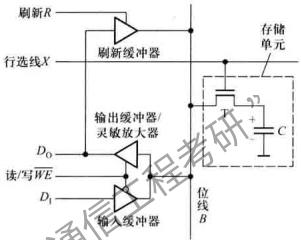

<details>
<summary>text_image</summary>

刷新R
行选线X
刷新缓冲器
输出缓冲器/
灵敏放大器
读/写WE
D0
D1
输入缓冲器
位线B
存储单元
F
+
C
</details>

图7.2.6 动态存储单元及基本操作原理

读操作时，行选线 $X$ 为高电平，导通，电容器 $C$ 与位线 $B$ 连通。此时读写控制 $\overline{WE}$ 为高电平，输出缓冲器/灵敏放大器被选通， $C$ 中存储的数据通过位线和缓冲器由 $D_0$ 输出（ $D_0$ 再经列选通电路送至最终的输出引脚）。由于读出时会消耗 $C$ 中的电荷，存储的数据被破坏，故每次读出后，必须及时对读再单元刷新，即此时刷新控制 $R$ 也为高电平，则读出的数据又经刷新缓冲器和位线对电容器 $C$ 进行刷新。

除了读、写操作可以对存储单元进行刷新外，刷新操作也可以通过只选通行选择线来实现。例如，当行选线 $X$ 为高电平，且 $\overline{WE}$ 亦为高电平时， $C$ 上的数据经T到达位线 $B$ ，然后经输出缓冲器和刷新缓冲器对存储单元刷新，此时的刷新是整行刷新。由于未进行列选通，所以 $D_0$ 的数据不会送至最终的输出引脚。实际上，刷新操作时输出缓冲器和刷新缓冲器环路构成一正反馈，如果位线为高电平，则将位线电平拉向更高；反之则使位线电平降得更低。

由于存储单元电容的容量很小,所以在位线容性负载较大时,C中存储的电荷(C存有1时)可能还未将位线拉至高电平时便耗尽了,由此出现读出错误。为避免出现这种情况,通常在读之前先将位线电平预置为高、低电平的中间值。这样,T导通时,根据电容C存储的0还是1,会将位线拉向低电平或高电平。位线电平的这种变化经灵敏放大器放大,可以准确得到C所存储的逻辑值。

# 2. DRAM 的基本结构和操作时序

由于DRAM的集成度很高，存储容量大，因此需要较多的地址线。为减少引线数目，DRAM大都采用行、列地址分时送入的方法。例如，对于一个1M字的存储器，有 $2^{20}$ 个地址，即有20根地址线。采用行、列地址分时送入时，只需要10根地址线。DRAM的基本结构如图7.2.7所示，其内部设有行、列两个地址寄存器。行、列地址分别由行地址选通信号RAS（Row Address Strobe）和列地址选通信号CAS（Column Address Strobe）控制，送入各自的寄存器。此外，DRAM内部还设有刷新计数器和刷新控制及定时电路，由此可以自动产生行地址进行刷新。

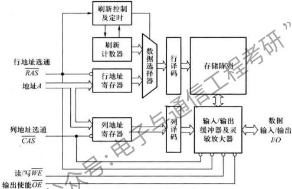

<details>
<summary>flowchart</summary>

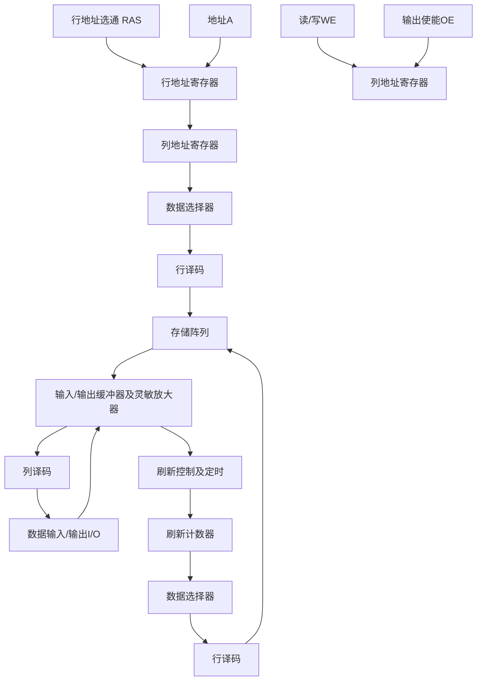
</details>

图 7.2.7 DRAM 的基本结构

DRAM的操作方式比SRAM要复杂些，这里只举出几种典型操作。

读/写操作

读/写操作时,首先 RAS 和 CAS 先后变为低电平,将行和列地址分别送入相应地址寄存器。然后在读/写控制信号 $\overline{WE}$ 作用下完成读/写操作。读操作时,输出使能 $\overline{OE}$ 应为低电平。操作时序如图 7.2.8(a) 所示。

页模式操作

所谓“页”是指同一行的所有列构成的存储单元。页模式下的读/写操作与一般读/写操作的差别在于不改变行地址，而只改变列地址。但行地址选择 $\overline{RAS}$ 必须始终保持低电平。页模式可以显著提高读写速度，其读操作时序如图7.2.8(b)所示。

RAS 只刷新操作

该操作只刷新行地址指定行的所有存储单元，不进行任何实际的读/写操作。在整个操作周期 $\overline{CAS}$ 要保持高电平,其时序如图7.2.8(c)所示。该操作一次只刷新一行,且需要外部地址计数器提供刷新地址。

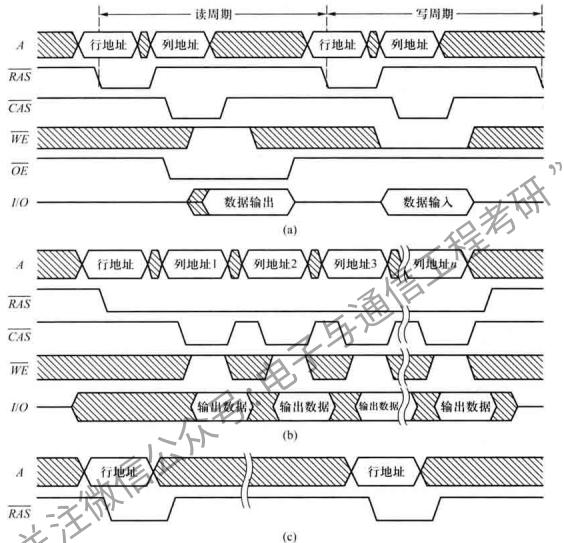

<details>
<summary>text_image</summary>

读周期
写周期
A 行地址 列地址 行地址 列地址
RAS
CAS
WE
OE
I/O 数据输出 数据输入
(a)
A 行地址 列地址1 列地址2 列地址3 列地址B
RAS
CAS
WE
I/O 输出数据 输出数据 输出数据
(b)
A 行地址 行地址
RAS
(c)
</details>

图 7.2.8 DRAM 操作定时图  
(a) 读/写操作 (b) 页模式读操作( $\overline{OE}=0$ ) (c) RAS 只刷新操作( $\overline{CAS}=\overline{WE}=1$ )

CAS 先于 RAS 有效的刷新操作

执行该操作时，CAS首先变为低电平，然后RAS变为低电平。此时，DRAM内部的刷新控制及定时电路，控制刷新计数器连续生成刷新地址进行刷新操作。

一般的 DRAM 每行刷新的间隔时间为 $15.6 \mu s$ （目前也有 $7.8 \mu s$ 的），典型的刷新操作时间小于 $100 ns$ 。刷新时间只占刷新周期的 0.64%，所以 DRAM 用于读/写操作的时间实际上超过 99%。

与 SRAM 的发展类似, DRAM 也有同步 DRAM (Synchronous DRAM, SDRAM), DDR 同步

DRAM 和 QDR 同步 DRAM。由于 DRAM 的存储单元结构简单, 其集成度远高于 SRAM, 所以同等容量情况下, DRAM 更廉价。

目前，改进型 DDRⅡ（二代）和 DDRⅢ（三代）同步 DRAM 已成为个人电脑的主流内存。

# 7.2.4 存储容量的扩展

目前，尽管各种容量的存储器产品已经很丰富，且最大容量已达1GBit以上，用户能够方便地选择满足需要的芯片。但是，只用单个芯片不能满足存储容量要求的情况仍然存在。个人电脑中的内存条就是一个典型的例子，它由焊在一块印刷电路板上的多个芯片组成。此时，便涉及存储容量的扩展问题。

扩展存储容量的方法可以通过增加字长(位数)或字数来实现。

# 1. 字长(位数)的扩展

通常 RAM 芯片的字长为 1 位、4 位、8 位、16 位和 32 位等。当实际存储器系统的字长超过 RAM 芯片的字长时，需要对 RAM 实行位扩展。

位扩展可以利用芯片的并联方式实现，即将RAM的地址线、读/写控制线和片选信号对应地并联在一起，而各个芯片的数据输入/输出端作为字的各个位线。如图7.2.9所示，用4个4K×4位RAM芯片可以扩展成4K×16位的存储系统。

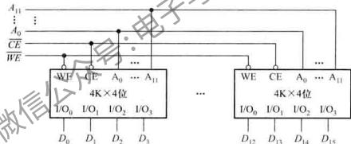

<details>
<summary>flowchart</summary>

```mermaid
graph TD
    subgraph_Memory_Units["4K×4位"]
        A0["A0"] -->|A11| WE1["WE"]
        CE1["CE"] -->|A0| WE2["WE"]
        WE1 -->|A11| WE3["WE"]
        CE2["CE"] -->|A0| WE3
        WE2 -->|A11| WE4["WE"]
    end
    subgraph_Control_Units["4K×4位"]
        WE1 -->|A11| WE5["WE"]
        CE1 -->|A0| WE5
        WE2 -->|A11| WE5
        WE3 -->|A11| WE5
        WE4 -->|A11| WE5
        WE5 -->|A11| WE6["WE"]
    end
    A0 -.->|...| WE6
    CE1 -.->|...| WE6
    WE2 -.->|...| WE6
    WE3 -.->|...| WE6
    WE4 -.->|...| WE6
    CE1 -.->|...| CE6
    CE2 -.->|...| CE6
    CE3 -.->|...| CE6
    CE4 -.->|...| CE6
    CE5 -.->|...| CE6
    CE6 -.->|...| CE6
    D0["D0"] --> WE1
    D1["D1"] --> WE2
    D2["D2"] --> WE3
    D3["D3"] --> WE4
    D0 -.->|...| WE5
    D1 -.->|...| WE5
    D2 -.->|...| WE5
    D3 -.->|...| WE5
    D0 -.->|...| WE6
    D1 -.->|...| WE6
    D2 -.->|...| WE6
    D3 -.->|...| WE6
    D0 -.->|...| WE7
    D1 -.->|...| WE7
    D2 -.->|...| WE7
    D3 -.->|...| WE7
    D0 -.->|...| WE8
    D1 -.->|...| WE8
    D2 -.->|...| WE8
    D3 -.->|...| WE8
    D0 -.->|...| WE9
    D1 -.->|...| WE9
    D2 -.->|...| WE9
    D3 -.->|...| WE9
    D0 -.->|...| WE10
    D1 -.->|...| WE10
    D2 -.->|...| WE10
    D3 -.->|...| WE10
    D0 -.->|...| WE11
    D1 -.->|...| WE11
    D2 -.->|...| WE11
    D3 -.->|...| WE11
    D0 -.->|...| WE12
    D1 -.->|...| WE12
    D2 -.->|...| WE12
    D3 -.->|...| WE12
    D0 -.->|...| WE13
    D1 -.->|...| WE13
    D2 -.->|...| WE13
    D3 -.->|...| WE13
    D0 -.->|...| WE14
    D1 -.->|...| WE14
    D2 -.->|...| WE14
    D3 -.->|...| WE14
    D0 -.->|...| WE15
    D1 -.->|...| WE15
    D2 -.->|...| WE15
    D3 -.->|...| WE15
```
</details>

图 7.2.9 用 4K×4 位 RAM 芯片构成 4K×16 位的存储器系统

# 2. 字数的扩展

字数的扩展可以利用外加译码器控制存储器芯片的片选使能输入端来实现。例如，利用2线-4线译码器将4个 $8\mathrm{K}\times 8$ 位的RAM芯片扩展为 $32\mathrm{K}\times 8$ 位的存储器系统。扩展方式如图7.2.10所示。图中，存储器扩展所要增加的地址线 $A_{14}, A_{13}$ 与译码器的输入相连，译码器的输出 $Y_0\sim Y_3$ 分别接至4片RAM的片选信号控制端 $CE$ 。这样，当输入一个地址码 $(A_{14} - A_0)$ 时，只有一片RAM被选中，从而实现了字的扩展。

实际应用中,常将两种方法相互结合,以达到同时扩展字和位的要求。可见,无论需要多大容量的存储器系统,均可利用容量有限的存储器芯片,通过位数和字数的扩展来构成。

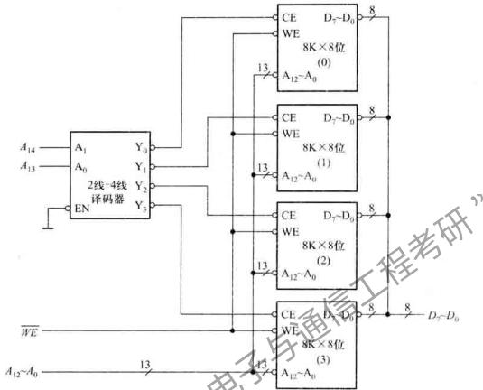

<details>
<summary>flowchart</summary>

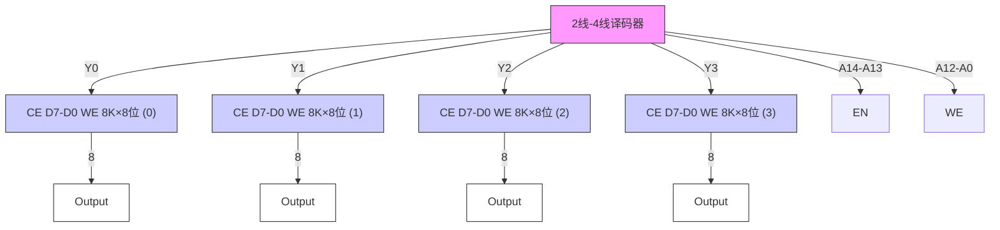
</details>

图 7.2.10 用 $8K \times 8$ 位 RAM 芯片构成 $32K \times 8$ 位的存储器系统

# 7.2.5 RAM应用举例

4.4节中的例4.6已经介绍了七段显示器构成的4位动态显示电路的工作原理。实际上，目前应用更多的是LED点阵显示屏。这里结合LED阵列动态显示电路，介绍RAM在其中的应用。

一种LED阵列动态显示原理电路如图7.2.11所示。显示屏由 $8\times 32$ 个LED构成，行线和列线电平控制交叉点上LED的“亮”和“灭”。行线的电平由RAM中读出的数据经三态驱动器控制，而列线的电平由5线-32线译码器控制。二进制计数器的输出一方面控制译码器，进行自左而右的逐列扫描；另一方面为RAM提供地址，将数据读出。三态缓冲器用于RAM内容更新时的数据输入。正常显示时，数据选择器将计数器输出提供给RAM作为地址。更新RAM内容时，将外部地址提供给RAM。

当更新控制信号 NEW=1 时，电路处于动态显示工作状态。此时，三态缓冲器输出高阻，三态驱动器工作，RAM 处于读操作状态。数据选择器 S=1，使 $Y_{4} \sim Y_{0} = B_{4} \sim B_{0}$ ，即将计数器的输出作为 RAM 的地址，RAM 输出的 8 位数据经三态驱动器驱动显示屏的 8 根行线。与此同时，计数器的输出 $Q_{4} \sim Q_{0}$ 也通过译码器使显示屏的 1 根列线为低电平，这样，高电平行线与该低电平列线交叉点上的LED被点亮，而低电平行线与该列线交叉点上的LED则不亮，从而控制1列LED的显示。例如，图7.2.11的显示屏要显示“CALL”时，计数器输出 $Q_{4}\sim Q_{0}=00000$ 时，使译码器 $\overline{Y}_{0}=0$ ，同时通过数据选择器使RAM地址也为00000，该地址单元的数据00111000分别控制 $\overline{Y}_{0}$ 列 $O_{7},O_{6},O_{2},O_{1},O_{0}$ 行的LED为“灭”状态； $O_{5},O_{4},O_{3}$ 行的LED为“亮”状态。类似地，在下一个CP到来时，计数器加1使 $Q_{4}\sim Q_{0}=00001$ ，则 $\overline{Y}_{1}=0$ ，同时RAM中00001地址单元的数据00111110控制 $\overline{Y}_{1}$ 列的显示，即该列的 $O_{5},O_{4},O_{3},O_{2},O_{1}$ 行“亮”。以此类推，在CP作用下，显示屏自左向右进行逐列扫描。完成一屏扫描后，在下一个CP到来时，计数器输出 $Q_{4}\sim Q_{0}$ 由11111变为00000，开始下一屏扫描，如此循环往复。

由上述LED阵列动态显示原理可知，显示屏上要显示的字符，以点阵方式存储在RAM中，每个点占用1个存储单元。需要发光的点存为1，不发光的点存为0。因此，8行 $\times 32$ 列的显示阵列需要 $32\times 8$ 位RAM存放一屏的数据。根据显示字符形状确定RAM中需要存储的点阵数据。如要显示“CALL”时，RAM中的点阵数据应如表7.2.6所示。如果向RAM中写入不同的点阵数据，则可显示不同的字符。

表 7.2.6 显示“CALL”时 RAM 中的点阵数据

<table><tr><td>地址  ${A}_{4}{A}_{3}{A}_{2}{A}_{1}{A}_{0}$ </td><td>内容  ${D}_{7}{D}_{6}{D}_{5}{D}_{4}{D}_{3}{D}_{2}{D}_{1}{D}_{0}$ </td><td>地址  ${A}_{4}{A}_{3}{A}_{2}{A}_{1}{A}_{0}$ </td><td>内容  ${D}_{7}{D}_{6}{D}_{5}{D}_{4}{D}_{3}{D}_{2}{D}_{1}{D}_{0}$ </td></tr><tr><td>0 0 0 0 0</td><td>0 0 1 1 1 0 0 0</td><td>1 0 0 0 0</td><td>1 1 1 1 1 1 1 0</td></tr><tr><td>0 0 0 0 1</td><td>0 1 1 1 1 1 0 0</td><td>1 0 0 0 1</td><td>1 1 1 1 1 1 1 0</td></tr><tr><td>0 0 0 1 0</td><td>1 1 0 0 0 1 1 0</td><td>1 0 0 1 0</td><td>1 0 0 0 0 0 0 0</td></tr><tr><td>0 0 0 1 1</td><td>1 0 0 0 0 0 1 0</td><td>1 0 0 1 1</td><td>1 0 0 0 0 0 0 0</td></tr><tr><td>0 0 1 0 0</td><td>1 0 0 0 0 0 1 0</td><td>1 0 1 0 0</td><td>1 0 0 0 0 0 0 0</td></tr><tr><td>0 0 1 0 1</td><td>1 1 0 0 0 1 1 0</td><td>1 0 1 0 1</td><td>1 0 0 0 0 0 0 0</td></tr><tr><td>0 0 1 1 0</td><td>0 1 0 0 0 1 0 0</td><td>1 0 1 1 0</td><td>1 0 0 0 0 0 0 0</td></tr><tr><td>0 0 1 1 1</td><td>0 0 0 0 0 0 0 0</td><td>1 0 1 1 1</td><td>0 0 0 0 0 0 0 0</td></tr><tr><td>0 1 0 0 0</td><td>1 1 1 1 0 0 0 0</td><td>1 1 0 0 0</td><td>1 1 1 1 1 1 1 0</td></tr><tr><td>0 1 0 0 1</td><td>1 1 1 1 1 0 0 0</td><td>1 1 0 0 1</td><td>1 1 1 1 1 1 1 0</td></tr><tr><td>0 1 0 1 0</td><td>0 0 1 0 1 1 0 0</td><td>1 1 0 1 0</td><td>1 0 0 0 0 0 0 0</td></tr><tr><td>0 1 0 1 1</td><td>0 0 1 0 0 1 1 0</td><td>1 1 0 1 1</td><td>1 0 0 0 0 0 0 0</td></tr><tr><td>0 1 1 0 0</td><td>0 0 1 0 1 1 0 0</td><td>1 1 1 0 0</td><td>1 0 0 0 0 0 0 0</td></tr><tr><td>0 1 1 0 1</td><td>1 1 1 1 1 0 0 0</td><td>1 1 1 0 1</td><td>1 0 0 0 0 0 0 0</td></tr><tr><td>0 1 1 1 0</td><td>1 1 1 1 0 0 0 0</td><td>1 1 1 1 0</td><td>1 0 0 0 0 0 0 0</td></tr><tr><td>0 1 1 1 1</td><td>0 0 0 0 0 0 0 0</td><td>1 1 1 1 1</td><td>0 0 0 0 0 0 0 0</td></tr></table>

当 $\overline{NEW} = 0$ 时，电路处于RAM内容更新状态。此时，更新数据经三态缓冲器送至RAM的数据端口，三态驱动器为高阻，RAM处于写操作状态。数据选择器 $S = 0$ ，使 $Y_{4}\sim Y_{0} = A_{4}\sim A_{0}$ ，即RAM的地址 $A_{3}\sim A_{0}$ 来自外部更新地址，从而将新数据写入RAM中。只要能保证更新内容在一个CP周期内全部写入RAM中，就不会对动态显示造成影响（图7.2.11中未给出更新控制电路）。实际上，如果采用双口RAM代替图7.2.11中的RAM，就可以省去三态缓冲器和数据选择器，并且显示内容的更新和显示屏的动态显示也可以各自独立工作而互不相关。

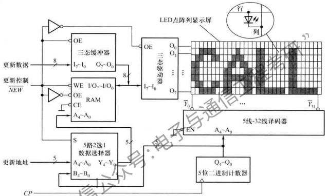

<details>
<summary>flowchart</summary>

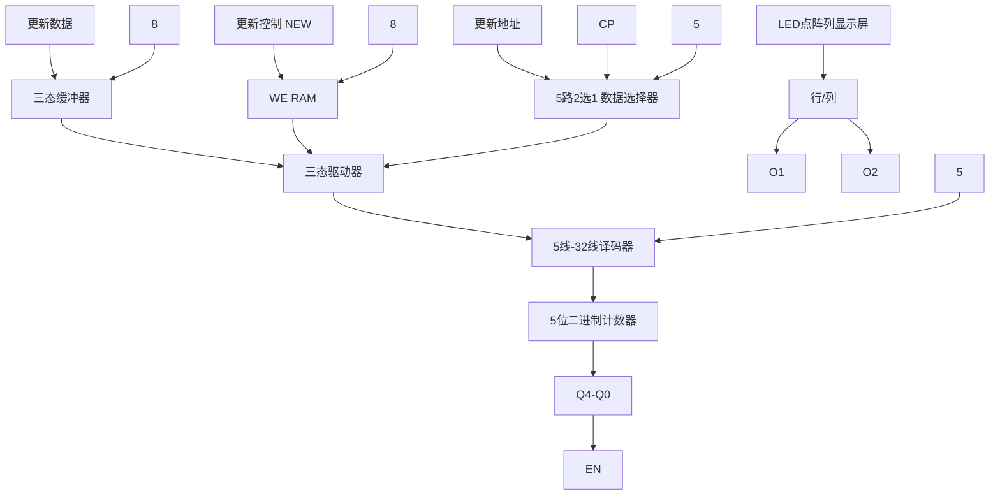
</details>

图 7.2.11 8×32 LED 点阵列动态显示原理

若动态显示扫描频率为 31.25 Hz, 即扫描周期为 32 ms, 则扫描 32 列显示屏时每列持续时间为 1 ms。即要求 CP 脉冲的周期为 1 ms。更新显示内容时, 只要在 1 ms 内完成 RAM 中 32 个地址单元点阵数据的写入即可。

除了可以显示字符外，LED 点阵显示器还可以显示各种图案。只要向 RAM 中写入图案的点阵数据，LED 阵列便可显示出希望的图案。

# 复习思考题

7.2.1 DRAM 中存储的数据如果不进行周期性的刷新, 其数据将会丢失; 而 SRAM 中存储的数据无需刷新, 只要电源不断电就可以永久保存, 为什么?  
7.2.2 一般情况下,DRAM 的集成度比 SRAM 的集成度高,为什么?  
7.2.3 同步 SRAM 与异步 SRAM 的主要差别是什么？它有什么优点？

7.2.4 同步 SRAM 中丛发模式读/写操作的特点是什么？

7.2.5 用容量为 $16K \times 1$ 位存储器芯片构成一个 $32K \times 8$ 位的存储系统, 需要多少根地址线? 多少根数据线? 多少个 $16K \times 1$ 位的存储器芯片?

# 小结

\- 半导体存储器是现代数字系统特别是计算机中的重要组成部分，它可分为 ROM 和 RAM 两大类，属于 MOS 工艺制成的大规模集成电路。

\- ROM是一种非易失性的存储器，它存储的是固定数据，一般只能被读出。根据数据写入方式的不同，ROM又可以分为固定ROM和可编程ROM。可编程ROM又可以细分为PROM、EPROM、 $\mathbf{E}^2$ PROM和快闪存储器等。特别是 $\mathrm{E}^2$ PROM和快闪存储器可以进行电擦写，已兼有了RAM的特性。

\- RAM 是一种时序逻辑电路，具有记忆功能。它存储的数据随电离断电而消失，因此是一种易失性的读写存储器。它包含有 SRAM 和 DRAM 两种类型，前者用触发器记忆数据，后者靠 MOS 管栅极电容存储数据。因此，在不停电的情况下，SRAM 的数据可以长久保持，而 DRAM 则必须定期刷新。

\- 无论是SRAM还是DRAM，目前都有在时钟脉冲作用下工作的同步RAM（SSRAM和SDRAM），而且同步RAM已成为主流存储器。在此基础上发展起来的DDR、DDRⅡ和QDR等RAM也已愈来愈多地应用于计算机内存、显存和通信设备中。

# 习题

# 7.1 只读存储器

7.1.1 指出下列存储系统各具有多少个存储单元，至少需要几根地址线和数据线。

(1) $64K \times 1$

(2) $256K \times 4$

(3) $1M \times 1$

(4) 128K×8

7.1.2 设存储器的起始地址为全0，试指出下列存储系统的最高地址的十六进制地址码为多少？

(1) $2K \times 1$

(2) 16K×4

(3) 256K×32

7.1.3 试确定用 ROM 实现下列逻辑函数时所需的容量: (1) 实现两个 3 位二进制数相乘的乘法器; (2) 将 8 位二进制数转换成十进制数(用 BCD 码表示)的转换电路。

7.1.4 用一片 $128 \times 8$ 位的 ROM 实现各种码制之间的转换。要求用从第 0 个地址单元（全 0 地址码）开始的前 16 个地址单元中的 10 个，实现 8421BCD 码到余 3 码的转换；用从第 17 个地址单元开始接下来的 16 个单元中的 10 个，实现余 3 码到 8421BCD 码的转换。试求：（1）列出 ROM 的地址与内容对应关系的真值表；（2）确定输入变量和输出变量与 ROM 地址线和数据线的对应关系；（3）简要说明将 8421BCD 码的 0101 转换成余 3 码和将余 3 码的 1001 转换成 8421BCD 码的过程。

7.1.5 利用 ROM 构成的任意波形发生器如图题 7.1.5 所示, 改变 ROM 的内容, 即可改变输出波形。当 ROM 的内容如表题 7.1.5 所示时, 画出输出端随 CP 变化的波形。

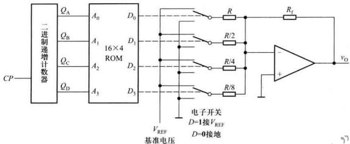

<details>
<summary>text_image</summary>

二进制递增计数器
CP
QA
QB
QC
QD
A0
A1
A2
A3
16×4 ROM
D0
D1
D2
D3
R
R/2
R/4
R/8
电子开关
D=1接VREF
D=0接地
VREF
基准电压
vo
</details>

图题7.1.5

表题7.1.5

<table><tr><td> ${A}_{3}{A}_{2}{A}_{1}{A}_{0}$ </td><td> ${D}_{3}{D}_{2}{D}_{1}{D}_{0}$ </td><td> ${A}_{3}{A}_{2}{A}_{1}{A}_{0}$ </td><td> ${D}_{3}{D}_{2}{D}_{1}{D}_{0}$ </td></tr><tr><td>0 0 0 0</td><td>0 1 0 0</td><td>1 0 0 0</td><td>0 1 0 0</td></tr><tr><td>0 0 0 1</td><td>0 1 0 1</td><td>1 0 0 1</td><td>0 0 1 1</td></tr><tr><td>0 0 1 0</td><td>0 1 1 0</td><td>1 0 1 0</td><td>0 0 1 0</td></tr><tr><td>0 0 1 1</td><td>0 1 1 1</td><td>1 0 1 1</td><td>0 0 0 1</td></tr><tr><td>0 1 0 0</td><td>1 0 0 0</td><td>1 1 0 0</td><td>0 0 0 0</td></tr><tr><td>0 1 0 1</td><td>0 1 1 1</td><td>1 1 0 1</td><td>0 0 0 1</td></tr><tr><td>0 1 1 0</td><td>0 1 1 0</td><td>1 1 1 0</td><td>0 0 1 0</td></tr><tr><td>0 1 1 1</td><td>0 1 0 1</td><td>1 1 1 1</td><td>0 0 1 1</td></tr></table>

# 7.2 随机存取存储器

7.2.1 一个 GMOS 存储单元如图题 7.2.1 所示，试分析其工作原理。

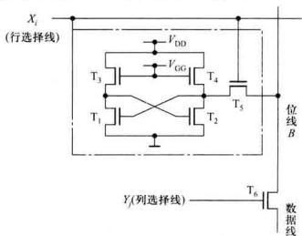

<details>
<summary>text_image</summary>

Xi
(行选择线)
VDD
VG0
T3
T4
T1
T2
T5
位线B
Yj(列选择线)
T6
数据线
</details>

图题7.2.1

7.2.2 设同步 SRAM 工作在丛发模式下, 若数据写入的首地址为 0094H, 间接下来的 3 个数据将被写入的存储单元的地址分别是多少?  
7.2.3 一个有4096位的DRAM,如果存储矩阵为 $64\times64$ 结构形式,且每个存储单元刷新时间为100 ns,则存储单元全部刷新一遍最快需要多长时间?如果刷新每行的最长间隔时间为 $15.6\ \mu s$ ,则该DRAM的刷新周期最长为多少?刷新操作所用时间占刷新周期的百分比是多少?  
7.2.4 一个有1M×1位的DRAM，采用地址分时送入的方法，芯片应具有几根地址线？  
7.2.5 试用具有片选使能 CE、输出使能 OE、读/写控制 WE、容量为 $8K \times 8$ 位的 SRAM 芯片，设计一个 $16K \times 16$ 位的存储器系统，试画出其逻辑图。  
7.2.6 在图7.2.11的LED点阵列字符动态显示电路中，(1)若人的视觉暂留时间为 $0.05\mathrm{s}$ ，在满足LED阵列图像稳定不闪烁的情况下，试计算 $CP$ 脉冲的最低工作频率。(2)若要在显示屏上显示“HELP”，试确定RAM中存放的点阵数据。(3)若LED阵列改为16行 $\times 128$ 列，则需要RAM的位数为多少？容量是多少？