# 脉冲波形的变换与产生

# 引言

在数字电路中,常常需要各种脉冲波形,例如时序电路中的时钟脉冲、控制过程中的定时信号等。这些脉冲波形的获取,通常有两种方法:一种是用脉冲信号产生电路直接产生;另一种则是将已有信号通过波形变换电路获得。

本章首先介绍用门电路组成的单稳态触发器、施密特触发器、多谐振荡器及其集成电路，然后讨论555定时器和用它构成的波形变换、产生电路。

# 9.1 单稳态触发器

前面介绍的触发器，有0、1两个稳定状态，因此，这种电路也被称为双稳态电路。一个双稳态电路可以保存一位三值信息。本章介绍的单稳态触发器与双稳态电路不同，它只有一个稳定状态，并具有如下的工作特点：

(1) 没有触发脉冲作用时,电路处于一种稳定状态。  
(2) 在触发脉冲作用下,电路会由稳态翻转到暂稳态。暂稳态是一种不能长久保持的状态。  
(3)由于电路中 RC 延时环节的作用,电路的暂稳态在维持一段时间后,会自动返回到稳态。暂稳态持续时间由 RC 延时环节参数值决定。

单稳态触发器被广泛地应用于脉冲的变换、延时和定时等。

# 9.1.1 用门电路组成的单稳态触发器

# 1. 电路组成及工作原理

单稳态触发器可由逻辑门和 RC 电路组成。根据 RC 电路连接方式不同，单稳态触发器分为微分型单稳态触发器和积分型单稳态触发器两种。本章只讨论微分型单稳态触发器。

用不同的 CMOS 门组成的微分型单稳态触发器如图 9.1.1(a)、(b) 所示。两电路中的 RC 电路，均按微分电路的方式连接在 $G_{1}$ 门的输出端和 $G_{2}$ 门的输入端。图 9.1.1 中两电路表明，采用的逻辑门不同，单稳态触发器的触发信号和输出脉冲也不一样。

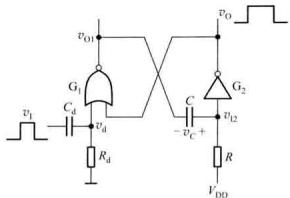

<details>
<summary>text_image</summary>

v_O
G_1
C_d
v_d
R_d
v_t
C
- v_C +
V_DD
v_O
G_2
v_{12}
R
</details>

(a)

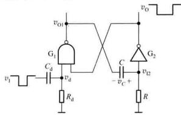

<details>
<summary>text_image</summary>

vI
G1
Cd
vd
Rd
voi
vo
G2
C
- vc +
vi2
R
</details>

(b)   
图 9.1.1 CMOS 门电路组成的微分型单稳态触发器  
(a) 用或非门和非门构成的微分型单稳态触发器 (b) 用与非门和非门构成的微分型单稳态触发器

下面以如图 9.1.1(a) 所示的微分型单稳态触发器为例,说明单稳态触发器的工作原理。

为了便于讨论,本章中将 CMOS 门电路的电压传输特性理想化,且设定 CMOS 门的阈值电压 $V_{TH} \approx \frac{V_{DD}}{2}$ , 输出高电平 $V_{OH} \approx V_{DD}$ , 输出低电平 $V_{OL} \approx 0$ V。

(1) 没有触发信号时,电路处于一种稳定状态

无触发信号作用时， $v_{1}$ 为低电平。由于 $G_{2}$ 的输入端经电阻 R 接 $V_{DD}$ ，故 $v_{0}=V_{01}$ ；这样， $G_{1}$ 门两输入端均为 0， $v_{01}=V_{011}$ ，电容器 C 两端的电压接近 0 V，电路处于一种稳定状态。只要没有正脉冲触发，电路就一直保持这一稳态不变。

(2) 外加触发信号, 电路由稳态翻转至暂稳态

输入触发脉冲，在 $R_{0}$ 和 $C_{d}$ 组成的微分电路的输出端得到很窄的正、负脉冲 $v_{d}$ 。当 $v_{d}$ 上升到 $G_{1}$ 门的阈值电压 $T_{\mathrm{in}}$ 时，在电路中产生如下正反馈过程：

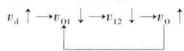

这一正反馈过程使 $v_{01}$ 迅速地从高电平跳变为低电平。由于电容C两端的电压不能突变， $v_{E2}$ 也同时跳变为低电平，并使 $v_{0}$ 跳变为高电平，电路进入暂稳态。此时，即使 $v_{d}$ 返回到低电平， $v_{0}$ 仍将维持高电平。由于电容C的存在，电路的这种状态是不能长久保持的，所以将电路此时的状态称之为暂稳态。暂稳态时 $v_{01}\approx0,v_{0}\approx V_{00}$ 。

(3) 暂稳态期间电容器 C 充电, 电路自动从暂稳态返回至稳态。

进入暂稳态后，电源 $V_{DD}$ 经电阻 R 和 $G_{1}$ 门导通的工作管对电容 C 充电， $v_{12}$ 按指数规律升高，当 $v_{12}$ 达到 $G_{2}$ 门的阈值电压 $V_{TH}$ 时，电路又产生下述正反馈过程：

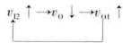

假如此时触发脉冲已消失，即 $v_{d}$ 返回到低电平，上述正反馈过程使 $v_{01}, v_{12}$ 迅速跳变到高电平，输出返回到 $v_{0} \approx 0 \, V$ 的状态。此后，电容通过电阻 R 和 $G_{2}$ 门的输入保护电路放电，使电容 C 上的电压最终恢复到稳定状态时的初始值，电路从暂稳态自动返回到稳态。

根据上述电路工作过程分析,可画出电路工作时各点电压波形如图9.1.2所示。

# 2. 主要参数的计算

# (1) 输出脉冲宽度 $t_{w}$

由图 9.1.2 可见, 触发信号作用后, 输出脉冲宽度 $t_{w}$ 就是暂稳态维持时间, 也就是 RC 电路在充电过程中, 使 $v_{12}$ 从 0 V 上升到 $V_{TH}$ 所需时间。

根据 RC 电路过渡过程的分析, 可求输出脉冲宽度

$$
t _ {\mathrm{w}} = R C \ln \frac {v _ {C} (\infty) - v _ {C} (0)}{v _ {C} (\infty) - V _ {\mathrm{TH}}} \tag {9.1.1}
$$

式中 $v_{c}(0)$ 是电容的起始电压值, $v_{c}(\infty)$ 是电容的充电的终了电压值。

电容在充电过程中， $v_{c}(0)=0;v_{c}(\infty)=V_{DD},\tau=RG,$ $V_{TH}=V_{DD}/2$ 。将这些值代入式(9.1.1)

得 $t_{w}=RC\ln\frac{V_{DD}-0}{V_{DD}-V_{TH}}=RC\ln2=0.69RC$ (9.1.2)

可取近似值 $t_{w} \approx 0.7RC$ (9.1.3)

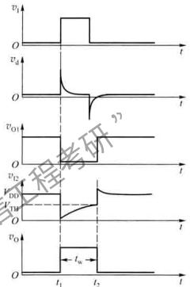

<details>
<summary>line</summary>

| Time | v_i | v_d | v_o1 | v_o2 |
|------|-----|-----|------|------|
| t1   | 0   | 0   | 0    | 0    |
| t2   | 0   | 0   | 0    | 0    |
</details>

图 9.1.2 微分型单稳态触发器中各点的电压波形图

# (2) 恢复时间 $t_{w}$

暂稳态结束后，还要经过一段恢复时间，让电容 C 上的电荷释放完，才能使电路完全恢复到触发前的起始状态。恢复时间一般认为要经过放电时间常数的 3～5 倍，RC 电路才基本达到稳态。

# (3) 最高工作频率 $f_{max}$

设触发信号 $v_{1}$ 的周期为 T，为了使单稳态电路能正常工作，应满足 $T > (t_{\mathrm{w}} + t_{\mathrm{re}})$ 的条件，因此，单稳态触发器的最高工作频率为

$$
f _ {\max} = \frac {1}{T _ {\min}} <   \frac {1}{t _ {\mathrm{w}} + t _ {\mathrm{re}}} \tag {9.1.4}
$$

# 9.1.2 集成单稳态触发器

用逻辑门组成的单稳态触发器虽然电路结构简单，但它存在触发方式单一、输出脉宽稳定性差，调节范围小等缺点。为提高单稳态触发器的性能指标，现已制成单片的集成电路。如74LS122和74121等TTL产品和74HC123、MC14098、MC14528等CMOS产品。集成单稳态触发器，根据电路工作特性不同分为可重复触发和不可重复触发两种，其工作波形分别如图9.1.3

(a)、(b) 所示。

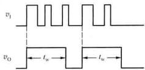

<details>
<summary>text_image</summary>

v₁
v₀ ← t_w ← → t_w
</details>

(a)

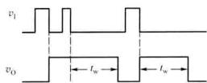

<details>
<summary>text_image</summary>

v₁
v₀ ← t_w → ← t_w →
</details>

(b)   
图 9.1.3 两种集成单稳态触发器的工作波形  
(a) 前沿触发的不可重复触发单稳 (b) 后沿的触发可重复触发单稳

不可重复触发单稳态触发器，在暂稳态期间，如有触发脉冲加入，电路的输出脉宽不受其影响，仍由电路中的 $R$ 、 $C$ 参数值确定。而可重复触发单稳态电路在暂稳态期间，如有触发脉冲加入，电路会被输入脉冲重复触发，暂稳态将延长，暂稳态在最后一个脉冲的触发沿，再延时 $t$ 。时间后返回到稳态。其输出脉宽根据触发脉冲的输入情况的不同而改变。

# 1. 不可重复触发的集成单稳态触发器

TTL 集成器件 74121 是一种不可重复触发的集成单稳态触发器，其内部逻辑图如图 9.1.4 所示。电路由触发信号控制电路、微分型单稳态触发器和输出缓冲器三部分组成。

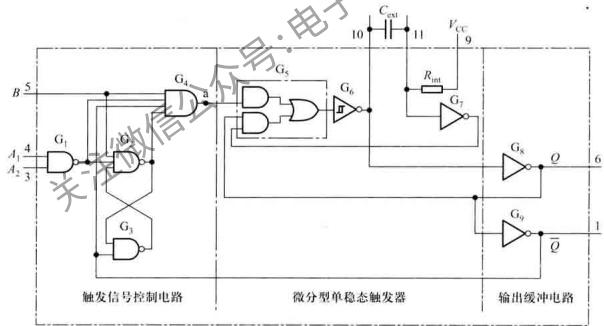

<details>
<summary>flowchart</summary>

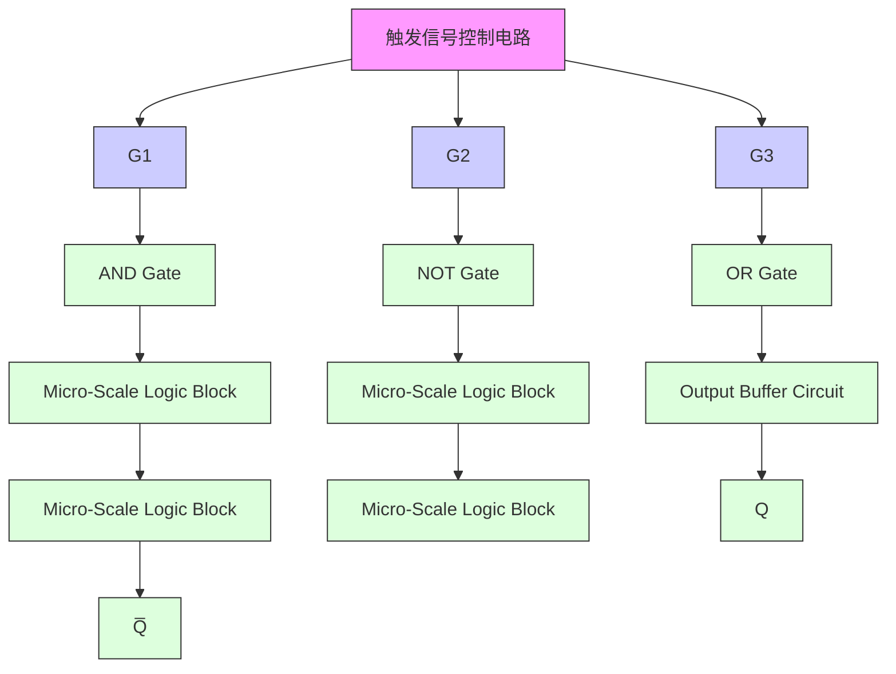
</details>

图 9.1.4 单稳态触发器 74121 逻辑图

单稳态触发器74121在使用时，要在芯片的10、11引脚之间外接电容 $C_{ext}$ （如采用电解电容，电容C的正极端接10脚）。根据输出脉宽的要求，定时电阻R可选择外接电阻 $R_{ext}$ 或芯片内部电阻 $R_{\mathrm{ini}}(2\mathrm{k}\Omega)$ 。单稳态触发器采用内、外部电阻的电路连接如图9.1.5(a)、(b)所示。

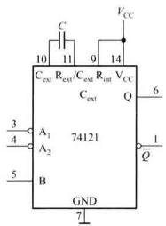

<details>
<summary>text_image</summary>

C
10 11 14 VCC
Cext Rext/Cext Rext VCC
Cext Q 6
3 A1 74121
4 A2
5 B
GND
7
1 Q̅
</details>

(a)

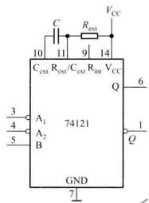

<details>
<summary>text_image</summary>

C
Rext
VCC
10 11 9 14
Cext Rext/Cext Rint VCC
Q 6
3 A1 74121
4 A2
5 B
GND
7
1 Q
</details>

(b)   
图 9.1.5 74121 定时电容、电阻的连接  
(a) 使用内接电阻 $R_{int}$ 的电路连接 (b) 使用外部电阻 $R_{ext}$ 的电路连接

# (1) 工作原理

如将图9.1.4中，具有施密特特性的非门 $G_{6}$ 与 $G_{5}$ 门合起来，看成是一个或非门，它与 $G_{7}$ 非门、电阻 $R_{int}$ 及电容 $C_{ext}$ 组成微分型单稳态触发器，其工作原理与9.1.1节所介绍的微分型单稳态触发器基本相同。电路只有一个稳态Q=0，Q=1。当 $G_{4}$ 门输出端a点有正脉冲触发时，电路进入暂态Q=1，Q=0。电路输出脉冲的宽度由 $R_{int}$ 和 $C_{ext}$ 大小决定。

$G_{1}$ 、 $G_{2}$ 、 $G_{3}$ 和 $G_{4}$ 组成的触发信号控制电路，不仅实现了输入信号触发沿可选择，而且还使电路具有不可重复触发特性。如当 $A_{1}$ 、 $A_{2}$ 当中至少有一个接低电平，且触发信号从B端输入，电路选择上升沿触发。此时，由于 $G_{4}$ 门的其他三个输入端均为高电平，当B端输入信号的上升沿到来时，a点也随之跳变为高电平，在正脉冲触发下，单稳态电路进入暂态，Q=1， $\overline{Q}=0$ 。 $\overline{Q}$ 的低电平使触发信号控制电路中SR锁存器的 $G_{2}$ 门输出为低电平，于是 $G_{4}$ 门被封锁，此时即使有触发信号输入，也不会有触发信号到达a点。只有电路在返回稳态后，触发信号才能使电路再次被触发。由以上分析可知，电路具有边沿触发的性质，且属于不可重复触发的单稳态触发器。

与9.1.1节所述电路相同，电路的输出脉冲宽度为

$$
t _ {\mathrm{w}} \approx 0. 7 R C \tag {9.1.5}
$$

如需要采用下降沿触发,则可将 B 输入端接高电平,触发脉冲从 $A_{1}$ 或 $A_{2}$ 输入。电路的工作状态与电路选择上升沿触发时完全相同。

# (2) 逻辑功能

74121 的功能如表 9.1.1 所示。

表 9.1.1 74121 功能表

<table><tr><td colspan="3">输入</td><td colspan="2">输出</td></tr><tr><td> ${A}_{1}$ </td><td> ${A}_{2}$ </td><td>B</td><td>Q</td><td> $\overline{Q}$ </td></tr><tr><td>L</td><td>×</td><td>H</td><td>L</td><td>H</td></tr><tr><td>×</td><td>L</td><td>H</td><td>L</td><td>H</td></tr><tr><td>×</td><td>×</td><td>L</td><td>L</td><td>H</td></tr><tr><td>H</td><td>H</td><td>×</td><td>L</td><td>H</td></tr><tr><td>H</td><td>↓</td><td>H</td><td>几</td><td>√</td></tr><tr><td>↓</td><td>H</td><td>H</td><td>几</td><td>√</td></tr><tr><td>↓</td><td>↓</td><td>H</td><td>几</td><td>√</td></tr><tr><td>L</td><td>×</td><td>↑</td><td>几</td><td>√</td></tr><tr><td>×</td><td>L</td><td>↑</td><td>几</td><td>√</td></tr></table>

由功能表可见,在下述情况下,电路有正脉冲输出:

① 若 $A_{1}$ 、 $A_{2}$ 两个输入中有一个或两个为低电平，B 产生由 0 到 1 的正跳变时；  
② 若 B 为高电平, $A_{1}$ , $A_{2}$ 中有一个或两个产生由 1 到 0 的负跳变时。

# (3) 工作波形

根据 74121 的功能表, 可画出图 9.1.5(a) 的工作波形如图 9.1.6 所示。

# 2. 可重复触发集成单稳态触发器

下面我们以常用 CMOS 集成器件 MC14528 为例, 简述可重复触发单稳态触发器的工作原理。该器件的逻辑图如图9.1.7所示，图中 $R_{ext}$ 和 $C_{ext}$ 为外接电阻和电容。

MC14528 功能表如表 9.1.2 所示, 工作波形如图 9.1.8 所示。

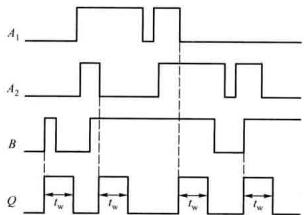

<details>
<summary>text_image</summary>

A₁
A₂
B
Q
Iw
Iw
Iw
Iw
</details>

图 9.1.6 74121 集成单稳态触发器的工作波形

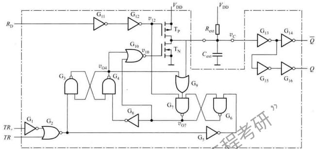

<details>
<summary>flowchart</summary>

```mermaid
graph TD
    RD --> G11
    G11 --> G12
    G12 --> v12
    v12 --> Tp
    Tp --> VDD
    VDD --> VDD
    VDD --> Rex
    Rex --> vC
    vC --> G13
    G13 --> G14
    G14 --> Q
    G14 --> Cex
    Cex --> G9
    G9 --> G7
    G7 --> v07
    v07 --> G6
    G6 --> G5
    G5 --> G6
    G6 --> G8
    G8 --> G4
    G4 --> v04
    v04 --> G3
    G3 --> G1
    G1 --> G2
    G2 --> TR
    TR --> G1
    G1 --> G3
    G3 --> G4
    G4 --> G8
    G8 --> G7
    G7 --> v07
    v07 --> G6
    G6 --> G5
    G5 --> G6
    G5 --> G7
    G7 --> Q
    G7 --> Q̅
```
</details>

图 9.1.7 集成单稳态触发器 MC14528 逻辑图

表 9.1.2 MC14525 功能表

<table><tr><td colspan="3">输入</td><td colspan="2">输出</td><td rowspan="2">功能</td></tr><tr><td> ${\bar{R}}_{\mathrm{D}}$ </td><td> $T{R}_{\mathrm{s}}$ </td><td> ${TR}$ </td><td>Q</td><td> $\overline{Q}$ </td></tr><tr><td>L</td><td>✘</td><td>✘</td><td>L</td><td>H</td><td>清除</td></tr><tr><td>✘</td><td>H</td><td>✘</td><td>L</td><td>H</td><td>禁止</td></tr><tr><td>✘</td><td>✘</td><td>L</td><td>L</td><td>H</td><td>禁止</td></tr><tr><td>H</td><td></td><td>↑</td><td></td><td></td><td>单稳</td></tr><tr><td>H</td><td>↓</td><td>L</td><td></td><td></td><td>单稳</td></tr></table>

下面以图 9.1.8 所示工作情况为例,说明电路的工作原理。

在 $t < t_1$ 期间，没有触发信号输入 $(TR_{\mathrm{z}} = 1, TR_{\mathrm{r}} = 0)$ ，电路工作在稳定状态。 $\mathbf{G}_4$ 门的输出 $v_{04}$ 一定是高电平。这是因为，在接通电源瞬间，电容 $C_{ext}$ 上的电压是低电平，如果 $v_{04}$ 不是高电平，而是低电平，那么， $G_9$ 门的输出也为低电平，这样， $G_7$ 门的输出 $v_{07}$ 为高电平、 $G_8$ 门输出为低电平。所以， $v_{04}$ 只能是高电平。 $v_{04}$ 的高电平使 $\mathbf{G}_5$ 、 $G_7$ 门组成的基本SR锁存器的输出端 $v_{07}$ 为低电平， $G_8$ 门的输出为高电平。 $v_{04}$ 的高电平状态将保持不变。

由于 $G_{10}$ 门的输出为低电平， $G_{12}$ 的输出高电平，使 $T_{X}$ 、 $T_{Y}$ 同时截止，电源 $V_{DD}$ 经 $R_{ext}$ 对 $C_{ext}$ 充电，达到稳态时 $v_{c}=V_{DD}, Q=0, \overline{Q}=1$ 。

在 $t_{1}$ 时刻 $TR_{-}$ 端输入的正触发脉冲，使 $G_{3}$ 、 $G_{4}$ 门组成的基本 SR 锁存器的输出 $v_{04}$ 转换为低电平， $G_{10}$ 门输出高电平， $T_{N}$ 导通， $C_{ext}$ 放电。当 $v_{C}$ 下降到 $G_{13}$ 门的阈值电压 $V_{TH13}$ 时，Q=1， $\overline{Q}=0$ 电

路进入暂态。此后， $v_{c}$ 进一步下降，当 $v_{c}$ 降至 $G_{9}$ 门的阈值电压 $V_{TH13}$ 时 $(V_{TH13}>V_{TH9})$ ， $G_{9}$ 门输出为低电平，此电平经 $G_{7}$ 、 $G_{8}$ 使 $v_{04}$ 为高电平。于是， $T_{N}$ 截止，电容 $C_{ext}$ 又重新开始充电， $v_{c}$ 上升至 $V_{TH13}$ 时，电路自动返回到 Q=0， $\overline{Q}=1$ 的稳态。由图 9.1.8 可知，输出脉宽 $t_{w}$ 等于 $v_{c}$ 由 $V_{TH13}$ 放电降至 $V_{TH9}$ 的时间与 $v_{c}$ 由 $V_{TH9}$ 充电升至 $V_{TH13}$ 两个时间之和。为获得较宽的输出脉冲，一般都将 $V_{TH13}$ 设计得较高而将 $V_{TH9}$ 设计得较低。

在 $t_3$ 时刻，电路再一次被触发，与上述分析相同，电路进入暂态， $C_{ext}$ 放电，当 $v_C$ 降至 $\mathrm{G}_9$ 门的阈值电压 $V_{\mathrm{TH9}}$ 时，电容 $C_{ext}$ 又重新开始充电，当 $C_{ext}$ 还没有充电到 $V_{\mathrm{TH13}}$ ，电路在 $\iota_4$ 时刻被再次触发，使 $\nu_{01}$ 转换为低电平， $G_{10}$ 门输出高电平， $\mathrm{T_N}$ 导通， $C_{ext}$ 又重新放电，当 $\nu_{C}$ 降至 $G_{9}$ 门的阈值电压 $V_{\mathrm{TH13}}$ ， $T_{01}$ 门的输出转换为低电平， $\nu_{04}$ 为高电平。于是， $T_{N}$ 截止，电容 $C_{ext}$ 又重新开始充电， $\nu_{C}$ 上升至 $V_{\mathrm{TH13}}$ 时，电路才自动返回到 $Q = 0$ ， $\overline{Q} = 1$ 的稳态。所以，电路为可重复触发集成单稳态触发器。

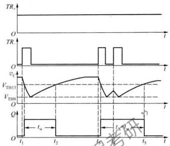

<details>
<summary>line</summary>

| Time | TR (VTH13) | TR (VTH9) | Q (t1) | Q (t2) | Q (t5) |
|------|------------|-----------|--------|--------|--------|
| t1   | Low        | Low       | -      | -      | -      |
| t2   | High       | High      | -      | -      | -      |
| t3   | Medium     | Medium    | -      | -      | -      |
| t4   | Low        | Low       | -      | -      | -      |
| t5   | High       | High      | Low    | Low    | Low    |
</details>

图 9.1.8 MC14528 可重复触发单稳态电路工作波形

# 9.1.3 单稳态触发器的应用

# 1. 定时

分析图 9.1.9 定时电路可知,电路只有在单稳态触发器的输出高电平期间( $t_{w}$ 时间内), $v_{A}$ 信号才有可能通过与门。单稳态触发器的 RC 的取值不同，与门的开启时间则不同，通过与门的脉冲个数也就随之改变。

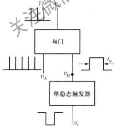

<details>
<summary>flowchart</summary>

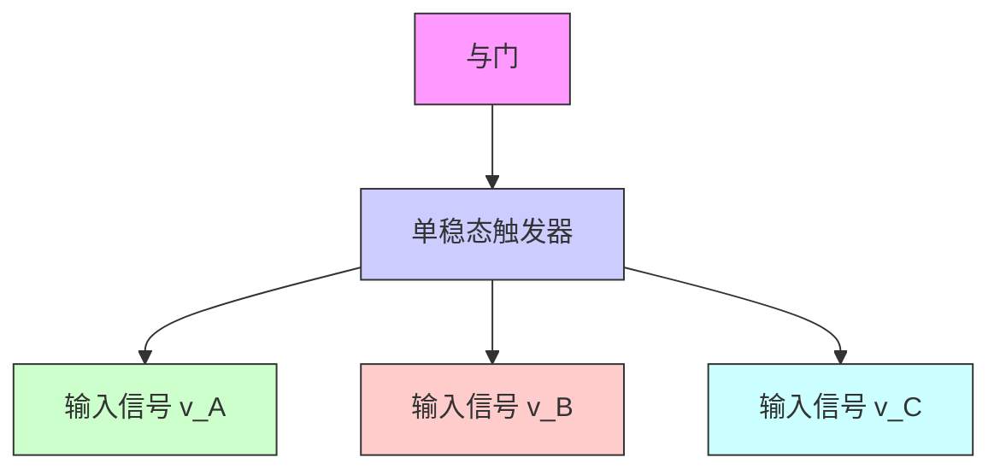
</details>

(a)

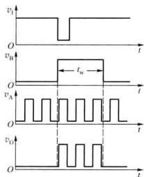

<details>
<summary>line</summary>

| Time | v_I | v_B | v_A | v_O |
|------|-----|-----|-----|-----|
| 0    | 0   | 0   | 0   | 0   |
| t_w  | 1   | 1   | 1   | 1   |
| t    | 0   | 0   | 0   | 0   |
| t    | 0   | 0   | 0   | 0   |
</details>

(b)   
图 9.1.9 单稳态触发器作定时电路的应用  
(a) 逻辑框图 (b) 波形图

# 2. 延时

单稳态触发器的另一用途是实现脉冲的延时。用两片74121组成的脉冲延时电路和工作波形分别如图9.1.10(a)、(b)所示。从波形图可以看出， $v_{0}$ 脉冲的上升沿，相对输入信号 $v_{i}$ 的上升沿延迟了 $t_{w1}$ 时间。

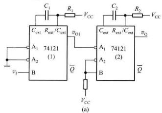

<details>
<summary>text_image</summary>

Cext Rext/Cext vD1
A1 74121 (1)
A2 B
v1
Cext Rext/Cext vQ
A1 74121 (2)
A2 B
VCC
R1
C2
R2
VCC
VCC
Q
VCC
(a)
</details>

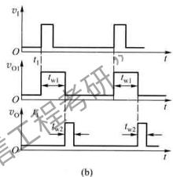

<details>
<summary>text_image</summary>

v1
O
t1
v01
t1
t
O
v0
t
t2
t2
t2
(b)
</details>

图 9.1.10 用 74121 组成的延时电路及工作波形  
(a) 延时电路 (b) 工作波形

# 3. 噪声消除电路

由单稳态触发器组成的噪声消除电路及工作波形分别如图9.1.11（a）、（b）所示，有用的信号一般都有一定的脉冲宽度，而噪声多表现为尖脉冲。从分析结果可见，只要合理地选择R、C的值，使单稳态电路的输出脉宽大于噪声宽度而小于信号的脉宽，即可消除噪声。

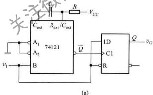

<details>
<summary>text_image</summary>

Cext
Rext/Cext
A1
A2
74121
B
v1
Q
VCC
1D
C1
R
vo
(a)
</details>

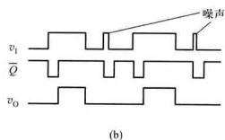

<details>
<summary>text_image</summary>

v₁
Q̅
v₀
(b)
噪声
</details>

图 9.1.11 噪声消除电路  
(a) 逻辑图 (b) 波形图

# 复习思考题

9.1.1 与双稳态触发器相比较，单稳态触发器在电路的基本组成和工作原理方面有什么不同？  
9.1.2 用与非门和用或非门组成的微分型单稳态触发器，它们的触发脉冲和输出脉冲有何区别？  
9.1.3 图 9.1.1 所示的单稳态触发器的输出脉宽与电路中哪些参数有关？  
9.1.4 集成单稳态触发器分为哪两类？它们的区别是什么？  
9.1.5 用集成单稳态触发器74121产生输出脉宽为3ms的脉冲信号，如选 $R=2\ k\Omega$ （内部电阻），试问外接电容 $C_{ext}$ 应取何值？

# 9.2 施密特触发器

施密特触发器常用于波形变换、幅度鉴别等。施密特触发器具有以下工作特点：

（1）电路属于电平触发，对于缓慢变化的信号仍然适用。当输入信号达到某一电压值时，输出电压会发生跳变。但输入信号在增加过程和减小过程中，使输出状态跳变时，所对应的输入电平不相同。  
(2) 由于电路内部的正反馈的作用, 当电路输出状态变换时, 输出电压波形的边沿很陡直。

根据输入、输出相位关系的不同，施密特触发器分为同相输出和反相输出两种类型。它们的电压传输特性曲线及逻辑符号分别如图9.2.d（a）、（b）所示。由于电路的电压传输特性曲线类似于铁磁材料的磁滞回线，磁滞曲线就成为了施密特触发器的符号标志。

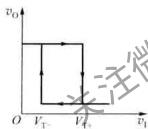

<details>
<summary>text_image</summary>

v₀
O Vₜ Vₜ
v₁
半注债
</details>

(a)

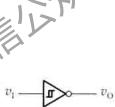

<details>
<summary>text_image</summary>

v₁—[¬]○—vₒ
</details>

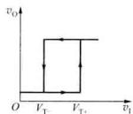

<details>
<summary>text_image</summary>

v₀
O Vₜ - Vₜ + v₁
</details>

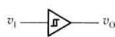  
(b)   
图 9.2.1 施密特电路的传输特性  
(a) 反相输出施密特电路的传输特性及逻辑符号 (b) 同相输出施密特电路的传输特性及逻辑符号

# 9.2.1 用门电路组成的施密特触发器

# 1. 电路组成

用 CMOS 门电路组成的施密特触发器如图 9.2.2 所示。电路中两个 CMOS 反相器串接，分压电阻 $R_{1}$ 、 $R_{2}$ 将输出端的电压反馈到 $G_{1}$ 门的输入端，并对电路产生影响。

# 2. 工作原理

设 CMOS 反相器的阈值电压 $V_{TH} \approx \frac{V_{DD}}{2}$ ，电路中 $R_{1} < R_{2}$ 。

从图 9.2.2 可见, $G_{1}$ 门的输入电平 $v_{11}$ 决定着电路的输出状态。根据叠加原理有

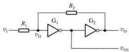

<details>
<summary>text_image</summary>

R₂
v₁ —— R₁ —— v₁₁ —— G₁ —— G₂ —— vₒ
          |
          vₒ₁
</details>

图 9.2.2 CMOS 反相器组成的施密特触发器

$$
v _ {1 1} = \frac {R _ {2}}{R _ {1} + R _ {2}} \cdot v _ {1} + \frac {R _ {1}}{R _ {1} + R _ {2}} \cdot v _ {0} \tag {9.2.1}
$$

设输入信号 $v_{1}$ 为三角波。

当 $v_{1}=0\ V$ 时， $v_{H}\approx0\ V$ ， $G_{1}$ 门截止， $G_{2}$ 门导通， $v_{01}=V_{0H}\approx V_{DD}$ ， $v_{0}=V_{0L}\approx0\ V$

$v_{1}$ 从0 V电压逐渐增加，只要 $v_{II}<V_{TH}$ ，电路保持 $v_{0}\approx0\ V$ 不变。当 $v_{1}$ 上升到 $v_{II}=V_{TH}$ 时， $G_{1}$ 门进入其电压传输特性转折区，随着 $v_{II}$ 的增加在电路中产生如下正反馈过程：

$$
v _ {1} \uparrow \longrightarrow v _ {\mathrm{H}} \uparrow \longrightarrow v _ {0 1} \downarrow \longrightarrow v _ {0} \uparrow
$$

这样，电路的输出状态很快从低电平跳变为高电平， $v_{0}=V_{DD}$ 。

我们把在输入信号在上升过程中,使电路的输出电平发生跳变时所对应的输入电压称为正向阈值电压,用 $V_{T+}$ 表示。

即由式(9.2.1)得

$$
\boldsymbol {v} _ {\mathrm{H}} ^ {\circledast} = \boldsymbol {V} _ {\mathrm{TH}} = \frac {\boldsymbol {R} _ {2}}{\boldsymbol {R} _ {1} + \boldsymbol {R} _ {2}} \boldsymbol {V} _ {\mathrm{T+}} \tag {9.2.2}
$$

$$
V _ {\mathrm{T+}} = \left(1 + \frac {R _ {1}}{R _ {2}}\right) V _ {\mathrm{TH}} \tag {9.2.3}
$$

如果 $v_{H}$ 继续上升，电路在 $v_{H} > V_{TH}$ 后，输出状态维持 $v_{0} \approx V_{DD}$ 不变。

如果 $v_{1}$ 从高电平开始逐渐下降，当降至 $v_{H}=V_{TH}$ 时， $G_{1}$ 门又进入其电压传输特性转折区，随着 $v_{1}$ 的下降，电路产生如下的正反馈过程：

$$
v _ {1} \downarrow \longrightarrow v _ {1 1} \downarrow \longrightarrow v _ {0 1} \uparrow \longrightarrow v _ {0} \downarrow
$$

电路迅速从高电平跳变为低电平, $v_{0}\approx0\ V$ 。

我们将输入信号在下降过程中，使输出电平发生跳变时所对应的输入电平称为负向阈值电压，用 $V_{T-}$ 表示。根据式(9.2.1)有

$$
\boldsymbol {v} _ {\mathrm{H}} \approx V _ {\mathrm{TH}} = \frac {\boldsymbol {R} _ {2}}{\boldsymbol {R} _ {1} + \boldsymbol {R} _ {2}} V _ {\mathrm{T-}} + \frac {\boldsymbol {R} _ {1}}{\boldsymbol {R} _ {1} + \boldsymbol {R} _ {2}} V _ {\mathrm{DD}}
$$

将 $V_{DD}=2V_{TH}$ 代入可得

$$
V _ {\mathrm{T-}} \approx \left(1 - \frac {R _ {1}}{R _ {2}}\right) V _ {\mathrm{TH}} \tag {9.2.4}
$$

定义正向阈值电压 $V_{T+}$ 与负向阈值电压 $V_{T-}$ 之差为回差电压，记作 $\Delta V_{T}$ 。由式(9.2.3)和式(9.2.4)可求得

$$
\Delta V _ {\mathrm{T}} = V _ {\mathrm{T+}} - V _ {\mathrm{T-}} \approx 2 \frac {R _ {1}}{R _ {2}} V _ {\mathrm{TH}} = \frac {R _ {1}}{R _ {2}} V _ {\mathrm{DD}} \tag {9.2.5}
$$

式(9.2.5)表明,电路的回差电压与 $R_{1}/R_{2}$ 成正比,改变 $R_{1}$ 、 $R_{2}$ 的比值即可调节回差电压的大小。

# 3. 工作波形及电压传输特性

根据以上分析，可画出电路的工作波形如图9.2.3(a)所示。以 $v_{0}$ 作为电路的输出端和以 $v_{01}$ 作为输出端时，电路的电压传输特性分别如图9.2.3(b)、(c)所示。图9.2.3(b)、(c)表明，如以 $v_{0}$ 作为电路的输出端时，电路为同相输出施密特触发器；如以 $v_{01}$ 作为输出端时，电路则为反相输出施密特触发器，

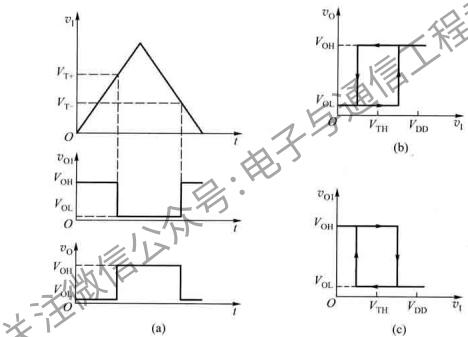  
图 9.2.3 施密特触发器工作波形及传输特性  
(a) 电路的工作波形 (b) $v_{0}$ 输出的传输特性 (c) $v_{01}$ 输出的传输特性

例 9.2.1 在图 9.2.2 所示的电路中, 电源电压 $V_{DD} = 10 \, V$ , $G_{1}$ , $G_{2}$ 选用 CC4069 反相器, 其负载电流最大允许值 $I_{\mathrm{OH(max)}} = 1.3 \, \mathrm{mA}$ , 门的阈值电压 $V_{TH} \approx \frac{1}{2} V_{DD} = 5 \, V$ , 且 $R_{1}/R_{2} = 0.5$ 。

(1) 求电路 $V_{T+}$ 、 $V_{T-}$ 和 $\Delta V_{T}$ 的值；  
(2) 试计算 $R_{1}$ 、 $R_{2}$ 值。

解：（1）求 $V_{\mathrm{T + }}$ 、 $V_{\mathrm{T - }}$ 和 $\Delta V_{\mathrm{T}}$

由式 $(9.2.3)$ 、式 $(9.2.4)$ 和式 $(9.2.5)$ 可求出

$$
V _ {\mathrm{T} *} = \left(1 + \frac {R _ {1}}{R _ {2}}\right) V _ {\mathrm{TII}} = 1. 5 \times 5 \mathrm{V} = 7. 5 \mathrm{V}
$$

$$
V _ {\mathrm{T-}} = \left(1 - \frac {R _ {1}}{R _ {2}}\right) V _ {\mathrm{TII}} = (1 - 0. 5) \times 5 \mathrm{V} = 2. 5 \mathrm{V}
$$

$$
\Delta V _ {\mathrm{T}} = V _ {\mathrm{T+}} - V _ {\mathrm{T-}} = 5 \mathrm{V}
$$

(2) 计算 $R_{1}$ 、 $R_{2}$ 值

为保证反相器 $G_{2}$ 输出高电平时的负载电流不超过最大允许值 $I_{\mathrm{OH(max)}}$ ，应使

$$
\frac {V _ {\mathrm{OH}} - V _ {\mathrm{TII}}}{R _ {2}} <   I _ {\mathrm{OH(max)}}
$$

考虑到 $V_{OH} \approx V_{DD} = 10 \, V$ ，故由上式可得

$$
R _ {2} > \frac {1 0 \mathrm{V} - 5 \mathrm{V}}{1 . 3 \mathrm{mA}} = 3. 8 5 \mathrm{k} \Omega
$$

当选 $R_{2}=15\ k\Omega$ 时，则 $R_{1}=\frac{1}{2}R_{2}=7.5\ k\Omega$ 。

# 9.2.2 集成施密特触发器

目前，无论是CMOS还是TTL电路，都有单片的集成施密特触发器产品，它们性能稳定，应用十分广泛。下面以CMOS集成施密特触发器CC40106为例介绍其工作原理。图9.2.4(a)、(b)分别为CC40106的电路图和逻辑符号。集成施密特触发器CC40106的内部电路由施密特电路、整形电路和输出电路三部分组成，核心部分是施密特电路。图中 $\mathrm{T}_{\mathrm{P4}}$ 、 $\mathrm{T}_{\mathrm{N4}}$ 和 $\mathrm{T}_{\mathrm{P5}}$ 、 $\mathrm{T}_{\mathrm{N5}}$ 组成两个首尾相连的反相器构成整形级，在 $v_{01}$ 上升和下降过程中，利用两级反相器的正反馈作用，可使输出波形的上升沿和下降沿变得很陡直。输出级为 $\mathrm{T}_{\mathrm{P6}}$ 和 $\mathrm{T}_{\mathrm{N6}}$ 组成的反相器，它不仅能起到与负载隔离的作用，而只可提高电路的带负载能力。

下面我们着重讨论图9.2.4中施密特电路的工作原理。施密特电路由P沟道MOS管 $T_{P1}\sim T_{P3}$ 、N沟道MOS管 $T_{X1}\sim T_{X3}$ 组成，设P沟道MOS管的开启电压为 $V_{TP}$ ，N沟道MOS管开启电压为 $V_{TN}$ 。

电路的输入信号 $v_{1}$ 为三角波。当 $v_{1}=0$ 时， $T_{P1}$ 、 $T_{P2}$ 导通， $T_{N1}$ 、 $T_{N2}$ 截止，电路中 $v_{01}$ 为高电平 $(V_{DD})$ ， $v_{01}$ 的高电平使 $T_{P3}$ 截止， $T_{N3}$ 导通，电路为源极跟随器，此时， $T_{N1}$ 源极的电位 $v_{S(TN1)}$ 较高，此时 $v_{0}=V_{OH}$ 。

$v_{1}$ 电位逐渐升高，当 $v_{1}>V_{TN}$ 时， $T_{N2}$ 导通，由于 $T_{N1}$ 的源极电压较大，即使 $v_{1}>V_{DD}/2$ ， $T_{N1}$ 仍不能导通。随着 $v_{1}$ 继续升高， $T_{P1}$ 、 $T_{P2}$ 的栅源电压的绝对值减小，至使 $T_{P1}$ 、 $T_{P2}$ 趋于截止。随着 $T_{P1}$ 、 $T_{P2}$ 的截止，其内阻急剧增大，从而使得 $v_{01}$ 和 $v_{\mathrm{S(TN1)}}$ 开始下降。当 $v_{1}-v_{\mathrm{S(TN1)}}\geqslant V_{TN}$ 时， $T_{N1}$ 开始导通，并引起如下正反馈过程：

$$
\begin{array}{r l}&v _ {\mathrm{O1}} \downarrow \rightarrow v _ {\mathrm{S(TN1)}} \downarrow \rightarrow v _ {\mathrm{GS(TN1)}} \uparrow \rightarrow R _ {\mathrm{ONI}} (\mathrm{T} _ {\mathrm{NI}} \text {导通电阻}) \downarrow\\&\uparrow\end{array}
$$

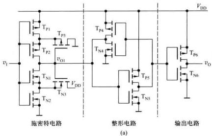

<details>
<summary>text_image</summary>

v₁
Tₚ₁
Tₚ₃
Tₚ₂
Tₚ₁
Tₚ₂
Tₙ₁
Tₙ₂
Tₙ₃
V̇_DD
V̇_DD
Tₚ₄
Tₙ₄
Tₚ₅
Tₙ₅
Tₚ₆
Tₙ₆
vₒ
(a)
输出电路
</details>

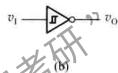  
图 9.2.4 集成施密特触发器 CC40106 内部电路及其逻辑符号  
(a) 电路图 (b) 逻辑符号

于是， $T_{N1}$ 迅速导通， $v_{01}$ 随之下降，致使 $T_{P3}$ 很快导通，进而使 $T_{P1}$ $T_{P2}$ 截止， $v_{01}$ 下降为低电平。 $v_{1}$ 继续升高，最终使 $T_{P1}$ 也完全截止，输出电压 $v_{0}$ 从高电平跳变为低电平。在 $V_{DD} >> V_{TN} + |V_{TP}|$ 的条件下，电路的正向阈值电压 $V_{T+}$ 远大于 $\frac{1}{2} V_{DD}$ 。

同理，当 $v_{1}$ 逐渐下降的过程中，与 $v_{1}$ 上升过程类似，电路也会出现一个急剧变化的工作过程，使电路转换为 $v_{01}$ 高电平， $v_{0}=V_{00}$ 的状态。在 $v_{1}$ 下降过程中的负向阈值电压 $V_{T-}$ 也远低于 $\frac{1}{2}V_{DD}$ 。

由上述分析可知,电路在 $v_{1}$ 上升和下降过程分别有不同的两个阈值电压,电路为反相输出的施密特触发器。

值得指出的是，由于集成电路内部器件参数差异较大，电路的 $V_{\mathrm{T+}}$ 和 $V_{\mathrm{T-}}$ 的数值有较大的差异，不同的 $V_{DD}$ 有不同的 $V_{T+}, V_{T-}$ 值，即使 $V_{DD}$ 相同，不同的器件也有不同的 $V_{T+}$ 和 $V_{T-}$ 值。

# 9.2.3 施密特触发器的应用

施密特触发器的应用较广,择其典型应用列举如下:

# 1. 波形变换

施密特触发器常用于波形变换，如将正弦波、三角波等变换成矩形波等。将幅值大于 $V_{T*}$ 的正弦波输入到施密特触发器的输入端，根据施密特触发器的电压传输特性，可画出输出电压波形，如图9.2.5所示。结果表明，通过电路在状态变化过程中的正反馈作用，施密特触发器可将输入变化缓慢的周期信号变换成了与其同频率、边缘陡直的矩形波。调节施密特触发器的 $V_{T+}$ 或 $V_{T-}$ ，可改变 $v_{0}$ 的脉宽。

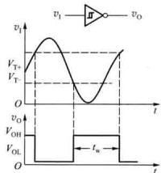

<details>
<summary>line</summary>

| Time | Output Voltage (V_I) | Output Voltage (V_T) |
|------|------------------------|------------------------|
| 0    | 0                      | 0                      |
| t_0  | v_I                    | v_T                    |
| t_1  | v_O                    | v_T                    |
| t_2  | v_I                    | v_T                    |
| t_3  | v_O                    | v_T                    |
| t_4  | v_I                    | v_T                    |
| t_5  | v_O                    | v_T                    |
| t_6  | v_I                    | v_T                    |
| t_7  | v_O                    | v_T                    |
| t_8  | v_I                    | v_T                    |
| t_9  | v_O                    | v_T                    |
| t_10 | v_I                    | v_T                    |
| t_11 | v_O                    | v_T                    |
| t_12 | v_I                    | v_T                    |
| t_13 | v_O                    | v_T                    |
| t_14 | v_I                    | v_T                    |
| t_15 | v_O                    | v_T                    |
| t_16 | v_I                    | v_T                    |
| t_17 | v_O                    | v_T                    |
| t_18 | v_I                    | v_T                    |
| t_19 | v_O                    | v_T                    |
| t_20 | v_I                    | v_T                    |
| t_21 | v_O                    | v_T                    |
| t_22 | v_I                    | v_T                    |
| t_23 | v_O                    | v_T                    |
| t_24 | v_I                    | v_T                    |
| t_25 | v_O                    | v_T                    |
| t_26 | v_I                    | v_T                    |
| t_27 | v_O                    | v_T                    |
| t_28 | v_I                    | v_T                    |
| t_29 | v_O                    | v_T                    |
| t_30 | v_I                    | v_T                    |
| t_31 | v_O                    | v_T                    |
| t_32 | v_I                    | v_T                    |
| t_33 | v_O                    | v_T                    |
| t_34 | v_I                    | v_T                    |
| t_35 | v_O                    | v_T                    |
| t_36 | v_I                    | v_T                    |
| t_37 | v_O                    | v_T                    |
| t_38 | v_I                    | v_T                    |
| t_39 | v_O                    | v_T                    |
| t_40 | v_I                    | v_T                    |
| t_41 | v_O                    | v_T                    |
| t_42 | v_I                    | v_T                    |
| t_43 | v_O                    | v_T                    |
| t_44 | v_I                    | v_T                    |
| t_45 | v_O                    | v_T                    |
| t_46 | v_I                    | v_T                    |
| t_47 | v_O                    | v_T                    |
| t_48 | v_I                    | v_T                    |
| t_49 | v_O                    | v_T                    |
| t_50 | v_I                    | v_T                    |
| t_51 | v_O                    | v_T                    |
| t_52 | v_I                    | v_T                    |
| t_53 | v_O                    | v_T                    |
| t_54 | v_I                    | v_T                    |
| t_55 | v_O                    | v_T                    |
| t_56 | v_I                    | v_T                    |
| t_57 | v_O                    | v_T                    |
| t_58 | v_I                    | v_T                    |
| t_59 | v_O                    | v_T                    |
| t_60 | v_I                    | v_T                    |
| t_61 | v_O                    | v_T                    |
| t_62 | v_I                    | v_T                    |
| t_63 | v_O                    | v_T                    |
| t_64 | v_I                    | v_T                    |
| t_65 | v_O                    | v_T                    |
| t_66 | v_I                    | v_T                    |
| t_67 | v_O                    | v_T                    |
| t_68 | v_I                    | v_T                    |
| t_69 | v_O                    | v_T                    |
| t_70 | v_I                    | v_T                    |
| t_71 | v_O                    | v_T                    |
| t_72 | v_I                    | v_T                    |
| t_73 | v_O                    | v_T                    |
| t_74 | v_I                    | v_T                    |
| t_75 | v_O                    | v_T                    |
| t_76 | v_I                    | v_T                    |
| t_77 | v_O                    | v_T                    |
| t_78 | v_I                    | v_T                    |
| t_79 | v_O                    | v_T                    |
| t_80 | v_I                    | v_T                    |
| t_81 | v_O                    | v_T                    |
| t_82 | v_I                    | v_T                    |
| t_83 | v_O                    | v_T                    |
| t_84 | v_I                    | v_T                    |
| t_85 | v_O                    | v_T                    |
| t_86 | v_I                    | v_T                    |
| t_87 | v_O                    | v_T                    |
| t_88 | v_I                    | v_T                    |
| t_89 | v_O                    | v_T                    |
| t_90 | v_I                    | v_T                    |
| t_91 | v_O                    | v_T                    |
| t_92 | v_I                    | v_T                    |
| t_93 | v_O                    | v_T                    |
| t_94 | v_I                    | v_T                    |
| t_95 | v_O                    | v_T                    |
| t_96 | v_I                    | v_T                    |
| t_97 | v_O                    | v_T                    |
| t_98 | vs_t                   | vs_t                   |
| 0    | 0                      | 0                      |
| 1    | 0                      = V_I                | 0                      |
| 2    | 0                      = V_T                | 0                      |
| 3    | 0                      = V_R                | 0                      |
| 4    | 0                      = V_S                | 0                      |
| 5    | 0                      = V_S                | 0                      |
| 6    | 0                      = V_S                | 0                      |
| 7    | 0                      = V_S                | 0                      |
| 8    | 0                      = V_S                | 0                      |
| 9    | 0                      = V_S                | 0                      |
| 10   | 0                      = V_S                | 0                      |
| 11   | 0                      = V_S                | 0                      |
| 12   | 0                      = V_S                | 0                      |
| 13   | 0                      = V_S                | 0                      |
| 14   | 0                      = V_S                | 0                      |
| 15   | 0                      = V_S                | 0                      |
| 16   | 0                      = V_S                | 0                      |
| 17   | 0                      = V_S                | 0                      |
| 18   | 0                      = V_S                | 0                      |
| 19   | 0                      = V_S                | 0                      |
| 20   | 0                      = V_S                | 0                      |
| 21   | 0                      = V_S                | 0                      |
| 22   | 0                      = V_S                | 0                      |
| 23   | 0                      = V_S                | 0                      |
| 24   | 0                      = V_S                | 0                      |
| 25   | 0                      = V_S                | 0                      |
| 26   | 0                      = V_S                | 0                      |
| 27   | 0                      = V_S                | 0                      |
| 28   | 0                      = V_S                | 0                      |
| 29   | 0                      = V_S                | 0                      |
| 30   | 0                      = V_S                | 0                      |
| 31   | 0                      = V_S                | 0                      |
| 32   | 0                      = V_S                | 0                      |
| 33   | 0                      = V_S                | 0                      |
| 34   | 0                      = V_S                | 0                      |
| 35   | 0                      = V_S                | 0                      |
| 36   | 0                      = V_S                | 0                      |
| 37   | 0                      = V_S                | 0                      |
| 38   | 0                      = V_S                | 0                      |
| 39   | 0                      = V_S                | 0                      |
| 40   | 0                      = V_S                | 0                      |
| 41   | 0                      = V_S                | 0                      |
| 42   | 0                      = V_S                | 0                      |
| 43   | 0                      = V_S                | 0                      |
| 44   | 0                      = V_S                | 0                      |
| 45   | 0                      = V_S                | 0                      |
| 46   | 0                      = V_S                | 0                      |
| 47   | 0                      = V_S                | 0                      |
| 48   | 0                      = V_S                | 0                      |
| 49   | 0                      = V_S                | 0                      |
| 50   | 0                      = V_S                | 0                      |
| ... (t/w) (t)      )       / (t)          / (t)         / (t)         / (t)         / (t)         / (t)         / (t)         / (t)         / (t)         / (t)         / (t)         / (t)         / (t)         / (t)         / (t)         / (t)         / (t)         / (t)         / (t)         / (t)         / (t)         / (t)        / (t)         / (t)         / (t)         / (t)         / (t)         / (t)         / (t)         / (t)         / (t)         / (t)         / (t)         / (t)         / (t)         / (t)         / (t)         / (t)         / (t)         / (t)         / (t)         / (t)     / (t)         / (t)         / (t)         / (t)         / (t)         / (t)         / (t)         / (t)         / (t)         / (t)         / (t)         / (t)         / (t)         / (t)         / (t)         / (t)         / (t)         / (t)         / (t)         / (t)       / (t)         / (t)         / (t)         / (t)         / (t)         / (t)         / (t)         / (t)         / (t)         / (t)         / (t)         / (t)         / (t)         / (t)        / (t)         / (t)        / (t)         / (t)        / (t)         / (t)        / (t)        / (t)        / (t)        / (t)        / (t)        / (t)
</details>

图 9.2.5 用施密特触发器实现波形变换

# 2. 波形的整形与抗干扰

在工程实际中，常遇到信号在传输过程中发生畸变的现象。如当传输线上电容较大，矩形波在传输过程中，其上升沿和下降沿都会明显地被延缓，其波形如图9.2.6（a）所示。又如传输线较长，且接收端的阻抗与传输线的阻抗也不匹配，则在波形的上升沿和下降沿将产生阻尼振荡，如图9.2.6（b）所示中的输入信号。

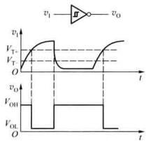

<details>
<summary>line</summary>

| t     | v_I   | v_O   |
|-------|-------|-------|
| 0     | 0     | 0     |
| T/T   | Peak  | 0     |
| T/T   | Low   | 0     |
| T/T   | High  | 0     |
| T/T   | Low   | 1     |
| T/T   | High  | 0     |
| V_OH  | 0     | 0     |
| V_OL  | 0     | 1     |
| O     | 0     | 0     |
| t     | 0     | 0     |
</details>

(a)

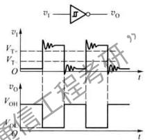

<details>
<summary>text_image</summary>

vI
V_T
V_T
O
t
vO
V_OH
t
vO
v_I
π
v_O
q7
</details>

(b)   
图 9.2.6 用施密特触发器实现脉冲波形的整形  
(a) 改善上升沿和下降沿 (b) 消除振荡影响

对上述信号波形在传输过程中产生的畸变,均可采用施密特触发器整形。图9.2.6（a）、（b）所示施密特触发器工作波形说明,只要回差电压选择合适,就可达到理想的整形效果。

施密特触发器还可用于消除干扰。用施密特触发器消除干扰时，回差电压的选择很重要。例如要消除图9.2.7（a）所示矩形波的顶部干扰，如回差电压取小了，顶部干扰无法消除，输出波形如图9.2.7（b）所示。适当调大回差电压，才能消除顶部干扰，得到如图9.2.7（c）所示的理想波形。

# 3. 幅度鉴别

施密特触发器属电平触发方式，即其输出状态与输入信号 $v_{1}$ 的幅值有关。利用这一工作特点，可将它作为幅度鉴别电路。例如，在施密特触发器输入端输入一串幅度不等的脉冲，分析电路可得如图9.2.8所示输入、输出波形。图9.2.8表明，只有幅度大于 $V_{r}$ 。

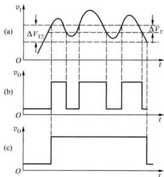

<details>
<summary>line</summary>

| Panel | Time (t) | Signal Value |
|-------|----------|--------------|
| (a)   | 0        | v₀           |
| (a)   | 1        | ΔVₜ₂         |
| (a)   | 2        | v₀           |
| (a)   | 3        | ΔVₜ₁         |
| (b)   | 0        | v₀           |
| (b)   | 1        | ΔVₜ₂         |
| (b)   | 2        | v₀           |
| (b)   | 3        | ΔVₜ₁         |
| (c)   | 0        | v₀           |
| (c)   | 1        | ΔVₜ₂         |
| (c)   | 2        | v₀           |
| (c)   | 3        | ΔVₜ₁         |
</details>

图 9.2.7 利用回差电压抗干扰  
(a) 具有顶部干扰的输入信号  
(b) 回差电压取值为 $\Delta V_{T1}$ 时的输出波形  
(c) 回差电压取值为 $\Delta V_{T2}$ 时的输出波形

的那些脉冲才会使施密特触发器翻转， $v_{0}$ 有脉冲输出；而对于幅度小于 $V_{T+}$ 的脉冲，施密特触发器不翻转， $v_{0}$ 就没有脉冲输出。

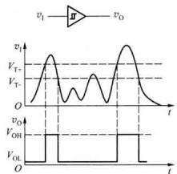  
图 9.2.8 用施密特触发器进行幅度鉴别

# 复习思考题

9.2.1 施密特触发器具有怎样的工作特点？试画出其电压传输特性曲线。  
9.2.2 如果改变图 9.2.2 中 $R_{1}$ 的取值，对电路的传输特性有何影响？  
9.2.3 为消除图 9.2.7a 中的顶部干扰，应如何正确选择施密特触发器的正、负向阈值电压？

# 9.3 多谐振荡器

多谐振荡器是一种由激振荡电路，它在接通电源后，不需要外加触发信号，电路就能自行产生一定频率和一定幅值的矩形波。由于矩形波含有丰富的谐波分量，所以将它称之为多谐振荡器。多谐振荡器在工作过程中没有稳定状态，故又被称为无稳态电路。

多谐振荡器的电路形式有多种,但它们都具有如下共同的结构特点:

电路由开关器件和反馈延时环节组成。开关器件可以是逻辑门、电压比较器、定时器等，其作用是产生脉冲信号的高、低电平。反馈延时环节一般由 RC 电路组成，其作用是将输出电压延时后，再反馈到开关器件的输入端，以改变输出状态，得到矩形波。

# 9.3.1 门电路组成的多谐振荡器

# 1. 电路组成及工作原理

由 CMOS 门电路和 RC 电路组成的多谐振荡器及其原理图分别如图 9.3.1(a)、(b) 所示。图 9.3.1(b) 中的 $D_{1}$ 、 $D_{2}$ 、 $D_{3}$ 、 $D_{4}$ 均为保护二极管。

(1) 第一暂稳态及电路自动翻转的过程

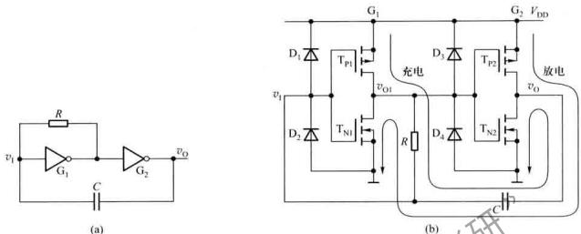  
图 9.3.1 多谐振荡器及其原理图  
(a) 由 CMOS 门电路组成的多谐振荡器 (b) 多谐振荡器原理图

假定在 t=0 时接通电源，电容 C 尚未充电，电路初始状态为第一暂稳态， $v_{01}=V_{011}$ ， $v_{1}=v_{0}=V_{01}$ 。此时，电源经 $G_{1}$ 门的 $T_{p1}$ 管、R 和 $G_{2}$ 门的 $T_{N2}$ 管给电容 C 充电，如图 9.3.1(b) 所示。随着充电时间的增加， $v_{1}$ 的值不断上升，当 $v_{1}$ 达到 $V_{m1}$ 时，电路发生下述正反馈过程：

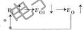

这一正反馈过程使 $v_{01}=V_{01}$ ， $v_{0}=V_{01}$ ，电路转入第二暂稳态。

# (2) 第二暂稳态及电路自动翻转的过程

在电路进入第二阶段态瞬间， $v_{0}$ 产生从 0 V 至 $V_{DD}$ 的上跳，由于电容两端电压不能突变，则 $v_{1}$ 也出现相同幅偏的上跳，保护二极管的钳位作用，使得 $v_{1}$ 仅上跳至 $V_{DD} + V_{DF}$ ， $V_{DF}$ 为二极管正向导通压降。随后，电容 C 通过 $G_{2}$ 门的 $T_{P2}$ 、电阻 R 和 $G_{1}$ 门的 $T_{N1}$ 放电，使 $v_{1}$ 下降，当 $v_{1}$ 降至 $V_{TH}$ 后，电路又产生如下正反馈过程：

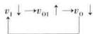

于是， $v_{01}=V_{0H},v_{0}=V_{OL}$ ，电路又返回到第一暂稳态， $v_{01}=V_{0H},v_{0}=V_{OL}$ 。此后，电路重复上述过程。如此周而复始，电路不断从一个暂稳态翻转到另一个暂稳态，于是，在 $G_{2}$ 门的输出端得到方波信号。电路工作波形图如图9.3.2所示。

由上述分析可见,多谐振荡器的两个暂稳态的转换过程是通过电容 C 充放电作用来实现的。电容的充、放电作用又集中体现在图中 $v_{1}$ 的变化上。

# 2. 振荡周期的计算

多谐振荡器的振荡周期与两个暂稳态时间有关，而两个暂稳态时间又分别由电容的充、放电时间决定。设电路的第一暂稳态和第二暂稳态时间分别为 $T_{1}$ 、 $T_{2}$ ，根据以上分析所得电路状态转换时 $v_{1}$ 的几个特征值, 可以计算电路的振荡周期。

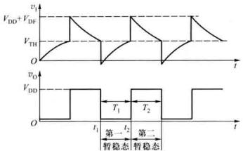

<details>
<summary>line</summary>

| Time (t) | V_DD (Top) | V_DD (Bottom) |
|----------|------------|--------------|
| t1       | V_DD       | V_DD         |
| t2       | V_DD       | V_DD         |
| t3       | V_DD       | V_DD         |
</details>

图 9.3.2 多谐振荡器波形图

# (1) $T_{1}$ 的计算

将图 9.3.2 中的 $t_{1}$ 作为第一暂稳态起点， $T_{1}=t_{2}-t_{1}, v_{1}(0^{+})=-V_{\mathrm{HF}}\approx0\;\mathrm{V}, v_{1}(\infty)=V_{\mathrm{DD}}, \tau=RC$ ，根据 RC 电路过渡过程的分析可知， $v_{1}$ 由 0 V 变化到 $V_{TH}$ 所需要的时间即为 $T_{1}$ ，

$$
T _ {\mathrm{t}} = R C \ln \frac {V _ {\mathrm{DD}}}{V _ {\mathrm{DD}} - V _ {\mathrm{TH}}} \tag {9.3.1}
$$

# (2) $T_{2}$ 的计算

同理，将 $t_{2}$ 作为第二暂稳态时间起点有

$$
v _ {1} \left(0 ^ {+}\right) = V _ {\mathrm{DD}} + V _ {\mathrm{DF}} \approx V _ {\mathrm{DD}}, v _ {1} (\infty) = 0 \mathrm{V}, \tau = R C
$$

由此可求出

$$
T _ {2} = R C \ln \frac {V _ {\mathrm{DD}}}{V _ {\mathrm{TH}}} \tag {9.3.2}
$$

所以

$$
T = T _ {1} + T _ {2} = R C \ln \left[ \frac {V _ {\mathrm{DD}} ^ {2}}{\left(V _ {\mathrm{DD}} - V _ {\mathrm{TH}}\right) \cdot V _ {\mathrm{TH}}} \right] \tag {9.3.3}
$$

将 $V_{TH}=\frac{V_{DD}}{2}$ 代入上式, 得

$$
T = R C \ln 4 \approx 1. 4 R C \tag {9.3.4}
$$

# 9.3.2 用施密特触发器构成多谐振荡器

由于施密特触发器有 $V_{T_{x}}$ 和 $V_{T_{z}}$ 两个不同的阈值电压，如能使其输入电压在 $V_{T_{x}}$ 和 $V_{T_{z}}$ 之间反复变化，就可以在输出端得到矩形波。将施密特触发器的输出端经 RC 积分电路接回其输入端，利用 RC 电路充、放电过程改变输入电压，即可用施密特触发器构成多谐振荡器。用施密特触发器构成的多谐振荡器如图 9.3.3 所示。

# (1) 工作原理

设在电源接通瞬间，电容器 C 的初始电压为零，输出电压 $v_{0}$ 为高电平。 $v_{0}$ 通过电阻 R 对电容器 C 充电，当 $v_{C}$ 达到 $V_{Tc}$ 时，施密特触发器翻转， $v_{0}$ 由高电平跳变为低电平。此后，电容器 C 又开始放电， $v_{C}$ 下降，当它下降到 $V_{Tc}$ 时，电路又发生翻转， $v_{0}$ 又由低电平跳变为高电平，C 又被重新充电。如此周而复始，在电路的输出端，就得到了矩形波。 $v_{C}$ 和 $v_{0}$ 的波形如图 9.3.4 所示。

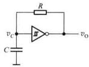

<details>
<summary>text_image</summary>

R
v_C
C
v_O
</details>

图 9.3.3 用施密特触发器构成的多谐振荡器

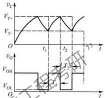

<details>
<summary>line</summary>

| Time | V_T+ (V_T) | V_T- (V_T) | V_OH (V_OH) | V_OL (V_OL) |
|------|------------|------------|-------------|-------------|
| t1   | 0          | 0          | 0           | 0           |
| t2   | 0          | 0          | 0           | 0           |
</details>

图 9.3.4 图 9.3.3 所示电路的电压波形

# (2) 振荡周期的计算

设在图9.3.3中采用CMOS施密特触发器CC40106，已知 $V_{\mathrm{OH}} \approx V_{\mathrm{DD}}, V_{\mathrm{OL}} \approx 0\mathrm{V}$ ，则图9.3.4中的输出电压 $v_{0}$ 的周期 $T = T_{1} + T_{2}$ ，计算如下：

① $T_{1}$ 的计算

以图9.3.4中 $t_1$ 作为时间起点，则有

$$
v _ {1} \left(0 ^ {+}\right) = V _ {\mathrm{T-}}, v _ {1} (\infty) = V _ {\mathrm{DD}}, v _ {1} \left(T _ {1}\right) = V _ {\mathrm{T+}}, \tau = R C
$$

根据 RC 电路暂态过渡过程公式, 可求出

$$
T _ {1} = R C \ln \frac {V _ {\mathrm{DD}} - V _ {\mathrm{T-}}}{V _ {\mathrm{DD}} - V _ {\mathrm{T+}}} \tag {9.3.5}
$$

② $T_{2}$ 的计算

以图 9.3.4 中 $t_{2}$ 作为时间起点，则有

$$
v _ {1} \left(0 ^ {+}\right) = V _ {\tau +}, v _ {1} \left(T _ {2}\right) = V _ {\tau -}, v _ {1} (\infty) = 0, \tau = R C
$$

利用 RC 电路暂态过程公式, 可求出

$$
T _ {2} = R C \ln \frac {V _ {\mathrm{T+}}}{V _ {\mathrm{T-}}} \tag {9.3.6}
$$

③ 振荡周期 T 的计算

$$
\begin{array}{l} T = T _ {1} + T _ {2} = R C \left(\ln \frac {V _ {\mathrm{DD}} - V _ {\mathrm{T-}}}{V _ {\mathrm{DD}} - V _ {\mathrm{T+}}} + \ln \frac {V _ {\mathrm{T+}}}{V _ {\mathrm{T-}}}\right) \\ = R C \ln \left(\frac {V _ {\mathrm{DD}} - V _ {\mathrm{T-}}}{V _ {\mathrm{DD}} - V _ {\mathrm{T+}}} \cdot \frac {V _ {\mathrm{T+}}}{V _ {\mathrm{T-}}}\right) \tag {9.3.7} \\ \end{array}
$$

例 9.3.1 在图 9.3.3 中已知 $R = 10 \, k\Omega, C = 0.022 \, \mu F$ ，CMOS 施密特触发器的 $V_{DD} = 5 \, V, V_{OH} \approx 5 \, V, V_{OE} = 0 \, V, V_{Tx} = 2.75 \, V, V_{T-} = 1.67 \, V$ ，试计算输出波形的高电平持续时间 $t_{pH}$ 、低电平持续时间 $t_{pL}$ 和占空比 q。

解：电路的输出波形如图9.3.4所示。 $t_\mathrm{pH}, t_\mathrm{pL}$ 实际上就是图9.3.4中的 $T_1$ 和 $T_2$ ，由式(9.3.5)和式(9.3.6)可分别求出

$$
\begin{array}{l} t _ {\mathrm{pH}} = T _ {1} = R C \ln \frac {V _ {\mathrm{DD}} - V _ {\mathrm{T-}}}{V _ {\mathrm{DD}} - V _ {\mathrm{T+}}} \\ = 1 0 \mathrm{k} \Omega \times 0. 0 2 2 \mu \mathrm{F} \cdot \ln \frac {5 - 1 . 6 7}{5 - 2 . 7 5} \\ = 8 6. 2 \mu \mathrm{s} \\ t _ {\mathrm{pL}} = T _ {2} = R C \ln \frac {V _ {\mathrm{T+}}}{V _ {\mathrm{T-}}} \\ = 1 0 \mathrm{k} \Omega \times 0. 0 2 2 \mu \mathrm{F} \cdot \ln \frac {2 . 7 5}{1 . 6 7} \approx 1 1 0 \mu \\ \end{array}
$$

占空比 $q$ 为

$$
q = \frac {t _ {\mathrm{pH}}}{t _ {\mathrm{pH}} + t _ {\mathrm{pL}}} = \frac {86.2}{86.2 + 110} = 0.439 = 43.9
$$

# 9.3.3 石英晶体多谐振荡器

在现代数字系统中，往往要求多谐振荡器的振荡频率具有很高的稳定性，否则，就会导致系统不能可靠地工作。式(9.3.3)表明，用门电路组成的多谐振荡器的振荡频率不仅与时间常数RC有关，而且还与门电路的阈值电压 $V_{TH}$ 有关。当电源电压波动，温度变化（引起门电路的阈值电压 $V_{TH}$ 变化）时，电路振荡频率稳定性会变得很差，用门电路组成的多谐振荡器很难适应现代数字系统的要求。在对振荡频率稳定性要求很高的电子设备中，只能采用由石英晶体组成的石英晶体振荡器。石英晶体振荡器的振荡频率不仅频率稳定度极高，而且频率范围也很宽，它的频率范围可从几百赫兹到几百兆赫兹。

石英晶体的电路符号及其阻抗频率特性分别如图9.3.5(a)、(b)所示。石英晶体阻抗频率特性表明，它的选频特性非常好，将它接入多谐振荡器的正反馈环路中后，只有频率为 $f_{c}$ 的电压信号容易通过，在电路中形成正反馈，而其他频率信号都被石英晶体衰减，电路的振荡频率就是 $f_{c}$ 。而 $f_{c}$ 仅与石英晶体的结晶方向和外尺寸有关，而与电路中的电阻、电容无关。石英晶体振荡器的频率稳定度极高，其频率稳定度 $\Delta f_{c}/f_{c}$ 可达 $10^{-10}\sim10^{-11}$ 。

一种典型的石英晶体振荡电路如图9.3.6所示，图中，电阻 $R_{1}$ 和 $R_{2}$ 的作用是使反相器 $G_{1}$ 、 $G_{2}$ 工作在电压特性曲线的转折区，有利于电路起振。如采用TTL门电路， $R_{1}$ 和 $R_{2}$ 通常取值为0.5\~2 kΩ之间；如采用CMOS门电路，其阻值则在5\~100 MΩ之间。电容 $C_{1}$ 、 $C_{2}$ 为两个反相器之间的耦合电容，电容 $C_{1}$ 的大小选择应使其在频率为 $f_{s}$ 时的容抗可以忽略不计，这样，可保证

$G_{1}$ 和 $G_{2}$ 之间形成正反馈环路。

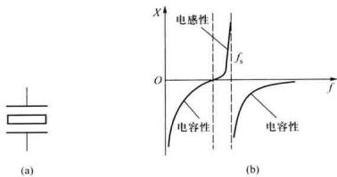

图 9.3.5 石英晶体的电路符号及阻抗频率特性  
(a) 电路符号 (b) 阻抗频率特性  
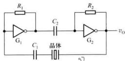

<details>
<summary>text_image</summary>

R₁
G₁
C₂
C₁
晶体
R₂
G₂
vₒ
</details>

图 9.3.6 石英晶体振荡器

为了改善输出波形,增强带负载的能力,通常在振荡器的输出端再加一级反相器。图9.3.7(a)所示双相时钟产生电路可作为一个应用实例,其工作波形如图9.3.7(b)所示。

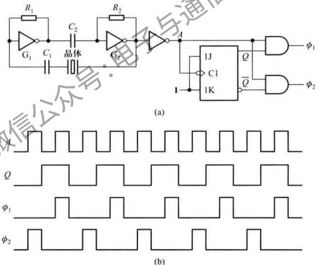  
图 9.3.7 双相时钟发生器  
(a) 逻辑图 (b) 波形图

# 复习思考题

9.3.1 简述多谐振荡器的工作特点，并说明改变电路的哪些参数可以调节振荡频率。

9.3.2 你能用两片74121组成多谐振荡器吗？试画出电路图。  
9.3.3 石英晶体振荡器有什么工作特点？其振荡频率等于什么？

# 9.4 555 定时器及其应用

555 定时器是一种模、数混合的中规模集成电路，它使用方便、灵活，应用极为广泛。用它可很方便地组成脉冲的产生、整形、延时和定时电路。

定时器有双极型和 CMOS 两种类型的产品, 它们的结构及工作原理基本相同, 没有本质的区别。一般说来, 双极型定时器的驱动能力较强, 电源电压范围为 5\~16 V。而 CMOS 定时器的电源电压范围为 3\~18 V, 它具有低功耗、输入阻抗高等优点。

# 9.4.1 555 定时器

# 1. 电路结构

555 定时器的电路结构如图 9.4.1 所示。它由分压器、电压比较器 $C_{1}$ 和 $C_{2}$ 、简单 SR 锁存器、放电三极管 T 以及缓冲器 G 组成。阈值输入端 $v_{11}$ 是比较器 $C_{1}$ 的信号输入端，触发输入端 $v_{12}$ 是比较器 $C_{2}$ 的信号输入端。

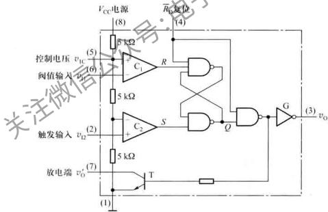

<details>
<summary>text_image</summary>

VCC电源
(8)
控制电压 v1c (5)
阀值输入 v1b (6)
触发输入 v12 (2)
放电端 vo' (7)
(1)
5 kΩ
C1
R
5 kΩ
C2
S
Q
G
(3) vo
R0复位
(4)
(1)
</details>

图 9.4.1 555 定时器的电路结构

当控制电压端(5)悬空时(此时,一般该端接上0.01 $\mu$ F左右的滤波电容),三个5 kΩ的电阻串联组成的分压器,为比较器 $C_{1}$ 、 $C_{2}$ 分别提供 $\frac{2}{3}V_{cc}$ 和 $\frac{1}{3}V_{cc}$ 的基准电压。如控制电压端(5)外接电压 $v_{1c}$ ，则比较器 $C_{1}$ 、 $C_{2}$ 的基准电压就变为 $v_{1c}$ 和 $v_{1c}/2$ 。

比较器 $C_{1}$ 和 $C_{2}$ 的输出控制 SR 锁存器和放电三极管 T 的状态。

放电三极管 T 为外接电路提供放电通路,定时器在使用时,T 的集电极(7 脚)一般都要外接一个上拉电阻。

$\overline{R}_{D}$ 为直接复位输入端，当 $\overline{R}_{D}$ 为低电平时，不管其他输入端的状态如何，输出端 $v_{D}$ 即为低电平。

当 $v_{11} > \frac{2V_{cc}}{3}$ ， $v_{12} > \frac{V_{cc}}{3}$ 时，比较器 $C_{1}$ 输出低电平，比较器 $C_{2}$ 输出高电平，简单 SR 锁存器 Q 端置 0，T 导通，输出端 $v_{0}$ 为低电平。

当 $v_{11}<\frac{2V_{cc}}{3},v_{12}<\frac{V_{cc}}{3}$ 时，比较器 $C_{1}$ 输出高电平，比较器 $C_{2}$ 输出低电平，简单 SR 锁存器置 1,T 截止，输出端 $v_{0}$ 为高电平。

当 $v_{11} < \frac{2V_{cc}}{3}, v_{12} > \frac{V_{cc}}{3}$ 时，简单SR锁存器 $R = 1, S = 1$ ，锁存器状态不变，电路保持原状态不变。

# 2. 电路功能

综合上述分析,可得555定时器功能表如表9.4.1所示。

表 9.4.1 555 定时器功能表

<table><tr><td colspan="3">输入</td><td colspan="2">输出</td></tr><tr><td>阈值输入( ${v}_{\mathrm{{II}}}$ )</td><td>触发输入( ${V}_{\mathrm{I}}$ )</td><td>复位( $\overline{{R}_{0}}$ )</td><td>输出( ${v}_{0}$ )</td><td>放电管T</td></tr><tr><td>×</td><td>×</td><td>0</td><td>0</td><td>导通</td></tr><tr><td> $<2{V}_{\mathrm{{CC}}}/3$ </td><td> $<{V}_{\mathrm{{CC}}}/3$ </td><td>1</td><td>1</td><td>截止</td></tr><tr><td> $>2{V}_{\mathrm{{CC}}}/3$ </td><td> $>{V}_{\mathrm{{CC}}}/3$ </td><td>1</td><td>0</td><td>导通</td></tr><tr><td> $<2{V}_{\mathrm{{CC}}}/3$ </td><td> $>{V}_{\mathrm{{CC}}}/3$ </td><td>1</td><td>不变</td><td>不变</td></tr></table>

# 9.4.2 用 555 组成的施密特触发器

将 555 定时器的阈值输入端和触发输入端相接，即构成施密特触发器，电路和简化电路分别如图 9.4.2(a)、(b) 所示。

如果 $v_{1}$ 由 0 V 开始逐渐增加，当 $v_{1}<\frac{V_{CC}}{3}$ 时，根据 555 定时器功能表可知，输出 $v_{0}$ 为高电平； $v_{1}$ 继续增加，如果 $\frac{V_{CC}}{3}<v_{1}<\frac{2V_{CC}}{3}$ ，输出 $v_{0}$ 维持高电平不变； $v_{1}$ 再增加，一旦 $v_{1}>\frac{2V_{CC}}{3}$ ， $v_{0}$ 就由高电平跳

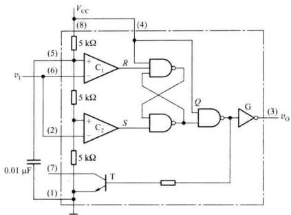

<details>
<summary>text_image</summary>

VCC
(8)
(4)
5 kΩ
C1
R
Q
G
(3)
vI
(5)
(6)
5 kΩ
C2
S
Q
G
(2)
(7)
5 kΩ
T
(1)
0.01 μF
vo
</details>

(a)

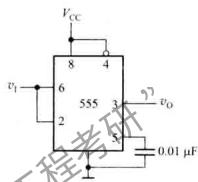

<details>
<summary>text_image</summary>

VCC
8 4
vi 6 555 3 γ7 vo
2 5 0.01 μF
</details>

(b)   
图 9.4.2 用 555 构成的施密特触发器  
(a) 电路 (b) 简化电路

变为低电平；之后 $v_{1}$ 再增加，仍是 $v_{1} > \frac{2V_{cc}}{3}$ ，输出保持低电平不变。

如果 $v_{1}$ 由大于 $\frac{2}{3}V_{cc}$ 的电压值逐渐下降，只要 $\frac{V_{cc}}{3}<v_{1}<\frac{2V_{cc}}{3}$ ，电路输出状态不变仍为低电平；只有当 $v_{1}<\frac{V_{cc}}{3}$ 时，电路才再次翻转， $v_{0}$ 就由低电平跳变为高电平。

如果输入 $v_{1}$ 为三角波，电路的工作波形和电压传输特性曲线分别如图9.4.3(a)、(b)所示。

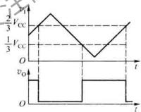

<details>
<summary>line</summary>

| t     | Vcc (Upper) | Vcc (Lower) |
|-------|------------|------------|
| 0     | 0.5        | 0          |
| Peak  | 1.2        | -0.5       |
| Low   | 0.5        | 0          |
| High  | 1.2        | -0.5       |
</details>

(a)

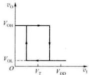

<details>
<summary>line</summary>

| v₁     | vₒ     |
| ------ | ------ |
| 0      | Vₒₕ    |
| Vₜ     | Vₒₗ    |
| Vₐₙ    | Vₒₗ    |
</details>

(b)   
图 9.4.3 施密特触发器的工作波形及电压转输特性曲线  
(a) 工作波形图 (b) 电压传输特性曲线

图 9.4.2 所示施密特触发器的正、负向阈值电压分别为 $\frac{2}{3}V_{cc}$ 和 $\frac{1}{3}V_{cc}$ 。不难理解，如施密特触发器控制电压（5 脚）端接 $V_{IC}$ ，改变 $V_{IC}$ 可以调节电路的回差电压。

# 9.4.3 用555组成的单稳态触发器

用 555 构成的单稳态触发器和简化电路分别如图 9.4.4(a)、(b) 所示。

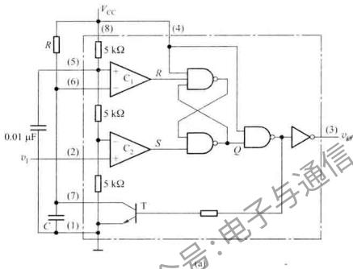

<details>
<summary>text_image</summary>

0.01 μF
v₁
R
(5)
(6)
(2)
(7)
C
(1)
VCC
(8)
(4)
5 kΩ
C₁
R
5 kΩ
C₂
S
Q
(3)
vₐₐ
5 kΩ
T
(6)
(7)
</details>

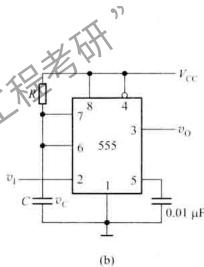

<details>
<summary>text_image</summary>

8
7
6
2
C
v_C
v_1
555
4
3
5
v_O
v_CC
0.01 µF
(b)
</details>

图 9.4.4 用 555 构成的单稳态触发器  
(a) 电路 (b) 简化电路

没有触发信号时 $v_{1}$ 处于高电平 $\left(v_{1} > \frac{V_{cc}}{3}\right)$ ，如接通电源后 Q = 0, $v_{0} = 0$ , T 导通，电容通过 T 放电，使 $v_{c} = 0$ , $v_{0}$ 保持低电平不变。如接通电源后 Q = 1, T 就会截止，电源通过电阻 R 向电容 C 充电，当 $v_{c}$ 上升到 $\frac{2V_{cc}}{3}$ 时，由于 R = 0, S = 1，锁存器置 0, $v_{0}$ 为低电平。此时 T 导通，电容 C 放电， $v_{0}$ 保持低电平不变。因此，电路通电后在没有触发信号时，电路只有一种稳定状态， $v_{0} = 0$ 。

若触发输入端施加触发信号 $\left(v_{1}<\frac{V_{cc}}{3}\right)$ ，电路的输出状态由低电平跳变为高电平，电路进入暂稳态，三极管T截止。此后电容C充电，当电容充电至 $v_{c}=\frac{2V_{cc}}{3}$ 时，电路的输出电压 $v_{0}$ 由高电平翻转为低电平，同时T导通，于是电容C放电，电路返回到稳定状态。电路的工作波形如图9.4.5所示。

如果忽略 T 的饱和压降, 则 $v_{c}$ 从零电平上升到 $\frac{2V_{cc}}{3}$ 的时间, 即为输出电压 $v_{0}$ 的脉宽 $t_{w}$ 。

$$
\begin{array}{l} t _ {\mathrm{w}} = R C \ln \frac {V _ {\mathrm{cc}} - 0}{V _ {\mathrm{cc}} - \frac {2}{3} V _ {\mathrm{cc}}} \\ = R C \ln 3 \approx 1. 1 R C \tag {9.4.1} \\ \end{array}
$$

通常 R 的取值在几百欧至几兆欧之间，电容取值为几百皮法到几百微法。这种电路产生的脉冲宽度可从几个微秒到数分钟，精度可达 0.1%。由图 9.4.5 可知，如果在电路的暂稳态持续时间内，加入新的触发脉冲（如图 9.4.5 中的虚线所示），则该脉冲对电路不起作用，电路为不可重复触发单稳态触发器。


<details>
<summary>line</summary>

| t     | v_i  | v_o  |
|-------|------|------|
| 0     | 0    | 0    |
| Peak  | 2/3  | Peak |
| Low   | 0    | 0    |
| High  | 0    | 0    |
</details>

图 9.4.5 工作波形

由 555 定时器构成的可重复触发单稳态电路及工作波形分别如图 9.4.6(a)、(b) 所示。

  
图 9.4.6 可重复触发的单稳态电路  
(a) 电路图 (b) 工作波形

当 $v_{1}$ 输入负向脉冲后，电路进入暂稳态，同时三极管 T 导通，电容 C 放电。输入负脉冲撤除后，电容 C 充电，在 $v_{c}$ 未充到 $\frac{2V_{cc}}{3}$ 之前，电路处于暂稳态。如果在此期间，又加入新的触发脉冲，三极管 T 又导通，电容 C 再次放电，输出仍然维持在暂稳态。只有在触发脉冲撤除后，在输出脉宽 $t_{s}$ 时间内没有新的触发脉冲，电路才返回到稳定状态。该电路可用作失落脉冲检测，或对电机转速或人体的心律进行监视，如转速不稳或人体的心律不齐时， $v_{0}$ 的低电平可用作报警信号。

用单稳态电路组成的脉宽调制电路如图9.4.7(a)所示。在单稳态电路的电压控制端输入三角波，当输入电压升高时，电路的阈值电压升高，输出的脉冲宽度随之增加；而当输入电压降低时，电路的阈值电压也降低，输出的脉冲宽度则随之减小。随着输入电压的变化，在单稳态的输出端，就可得到一串随控制电压变化的脉宽调制波形，如图9.4.7(b)所示。


<details>
<summary>text_image</summary>

VCC
R
vo
555
2
3
4
5
6
1
v1
vIC
C
</details>

(a)


<details>
<summary>line</summary>

| t     | v_R (V_CC) | v_I (v_I) | v_O (v_O) |
|-------|------------|-----------|-----------|
| 0     | 0          | 0         | 0         |
| 1/3   | 2/3        | 0         | 0         |
| 2/3   | 2/3        | 0         | 0         |
| 3/3   | 1/3        | 0         | 0         |
</details>

(b)   
图 9.4.7 脉冲宽度调制器  
(a) 电路 (b) 波形图

# 9.4.4 用 555 组成的多谐振荡器

由555定时器构成的多谐振荡器如图9.4.8(a)所示。接通电源后，电容 $C$ 被充电，当 $v_{c}$ 上升到 $\frac{2V_{cc}}{3}$ 时，使 $v_{0}$ 为低电平，同时T导通，此时电容 $C$ 通过 $R_{2}$ 和T放电， $v_{c}$ 下降。当 $v_{c}$ 下降到 $\frac{V_{cc}}{3}$ 时， $v_{0}$ 翻转为高电平。电容器 $C$ 放电所需的时间为

$$
t _ {\mathrm{pL}} = R _ {2} \mathrm{Cln} \frac {0 - V _ {\mathrm{T+}}}{0 - V _ {\mathrm{T-}}} = R _ {2} C \mathrm{ln} 2 \approx 0. 7 R _ {2} C \tag {9.4.2}
$$


<details>
<summary>text_image</summary>

R1
8
4
Vcc
7
6
555
3
vo
2
5
vC
C
1
0.01 μF
</details>

(a)


<details>
<summary>line</summary>

| Time | v_c (Square Wave) | v_o (Square Wave) |
|------|-------------------|-------------------|
| t_pL | 2/3 V_CC          | -                 |
| t_pH | 2/3 V_CC          | -                 |
| t    | 2/3 V_CC          | -                 |
| t_L  | -                 | t_PL              |
| t_H  | -                 | t_H               |
</details>

(b)   
图 9.4.8 多谐振荡器  
(a) 电路图 (b) 工作波形

当放电结束时，T截止， $V_{cc}$ 将通过 $R_{1}$ 、 $R_{2}$ 向电容器C充电， $v_{c}$ 由 $\frac{V_{cc}}{3}$ 上升到 $\frac{2V_{cc}}{3}$ 所需的时间为

$$
\begin{array}{l} t _ {\mathrm{pH}} = \left(R _ {1} + R _ {2}\right) C \ln \frac {V _ {\mathrm{cc}} - V _ {\mathrm{T-}}}{V _ {\mathrm{cc}} - V _ {\mathrm{T+}}} \\ = (R _ {1} + R _ {2}) C \ln 2 \approx 0. 7 (R _ {1} + R _ {2}) C \tag {9.4.3} \\ \end{array}
$$

当 $v_{c}$ 上升到 $\frac{2V_{cc}}{3}$ 时，电路又翻转为低电平。如此周而复始，于是，在电路的输出端就得到一个周期性的矩形波。电路的工作波形如图 9.4.8（b）所示，其振荡频率为

$$
f = \frac {1}{t _ {\mathrm{pL}} + t _ {\mathrm{pll}}} \approx \frac {1 . 4 3}{\left(R _ {1} + 2 R _ {2}\right) C} \tag {9.4.4}
$$

由于 555 内部的比较器灵敏度较高,而且采用差分电路形式,用 555 构成的多谐振荡器的振荡频率受电源电压和温度变化的影响很小。

图 9.4.8(a) 所示电路的 $t_{pl} \neq t_{pH}$ ，而且占空比固定不变。如要实现占空比可调可采用如图 9.4.9 所示电路。由于电路中二极管 $D_{1}$ 、 $D_{2}$ 的单向导电特性，使电容器 C 的充放电回路分开，调节电位器，就可调节多谐振荡器的占空比。图中， $V_{CC}$ 通过 $R_{A}$ 、 $D_{1}$ 向电容 C 充电，充电时间为

$$
t _ {\mathrm{pH}} \approx 0. 7 R _ {\mathrm{A}} C \tag {9.4.5}
$$

电容器 C 通过 $D_{2}$ 、 $R_{B}$ 及 555 中的三极管 T 放电，放电时间为


<details>
<summary>text_image</summary>

R_A
R_1
R_2
D_1
7 8 4
6 555
v_c
C
D_2
v_O
V_CC
0.01 μF
</details>

图 9.4.9 占空比可调的方波发生器

$$
t _ {\mathrm{pL}} \approx 0. 7 R _ {\mathrm{B}} C \tag {9.4.6}
$$

因而，振荡频率为

$$
f = \frac {1}{t _ {\mathrm{pH}} + t _ {\mathrm{pL}}} \approx \frac {1 . 4 3}{(R _ {\mathrm{A}} + R _ {\mathrm{B}}) C} \tag {9.4.7}
$$

电路输出波形的占空比为

$$
q (\%) = \frac {R _ {\mathrm{A}}}{R _ {\mathrm{A}} + R _ {\mathrm{B}}} \times 100 \% \tag{9.4.8}
$$

上面仅讨论了由555定时器组成的单稳态触发器、多谐振荡器和施密特触发器，实际上，由于555定时器的比较器灵敏度高、输出驱动电流大、功能灵活，因而在电子电路中获得了广泛应用，限于篇幅，这里就不一一列举了。

# 复习思考题

9.4.1 555 定时器中缓冲器 G 有什么作用？  
9.4.2 555 定时器的功能表如何？用它能组成哪些脉冲波形的变换与产生电路？

9.4.3 如将图 9.4.2(a) 中 555 定时器的控制电压输入端(5 脚)改接电压 $V_{H}$ 上, 试问电路的输出脉宽 $t_{w}$ 有无改变? $t_{w}$ 与 $V_{H}$ 的关系如何?

9.4.4 能否采用改变图 9.4.8(a) 中 555 定时器控制电压的方法调节电路的振荡频率？为什么？如要实现振荡和停振可控，你会采用什么方法来实现？

# 小结

- 集成单稳态触发器分为非重复触发和可重复触发两大类，在暂稳态期间，出现的触发信号对非重复触发单稳态电路的输出脉宽没有影响，而对可重复触发单稳态电路可起到连续触发作用。  
- 在数字电路中，施密特触发器实质上是具有滞后特性的逻辑门，它有两个阈值电压。电路状态与输入电压有关，不具备记忆功能。  
- 多谐振荡器无需外加输入信号就能在接通电源后自行产生矩形波输出。在频率稳定性要求较高的场合通常采用石英晶体振荡器。  
- 定时器是一种应用广泛的集成器件，多用于脉冲产生、整形及定时等。除555定时器外，目前还有556（双定时器）、558（四定时器）等。

# 习题

# 9.1 单稳态触发器

9.1.1 在图 9.1.1(a) 所示微分型单稳态电路中，已知 $C=0.01\ \mu F, R=9.1\ k\Omega$ ，电源电压 $V_{DD}=10\ V_{0}$ 。试对应图题 9.1.1 所示的输入波形画出电路输出 $v_{0}$ 的波形，并计算输出脉宽 $t_{w}$ 及幅值大小。  
9.1.2 用 CMOS 逻辑门组成的微分型单稳态电路如图题 9.1.2 所示。其中 $t_{pt} = 3 \mu s, C_{d} = 50 pF, R_{d} = 10 k\Omega, C = 0.01 \mu F, R = 10 k\Omega$ ，试对应地画出 $v_{1}, v_{D}, v_{01}, v_{R}, v_{02}, v_{0}$ 的波形，并求出输出脉冲宽度。

  
图题9.1.1


<details>
<summary>text_image</summary>

VDD
Rd
10 kΩ
C4
v1
50 pF
G1
vO1
C
0.01 μF
v2
R
10 kΩ
G2
vO2
G3
vO
Ipi
</details>

图题9.1.2

9.1.3 图题 9.1.3 所示电路是用 CMOS 或非门构成的单稳态触发器的另一种形式。试回答下列问题：

(1) 分析电路的工作原理；  
(2) 画出加入触发脉冲后 $v_{01}$ 、 $v_{02}$ 及 $v_{R}$ 的工作波形；  
(3) 写出输出脉宽 $t_{w}$ 的表达式。

9.1.4 由集成单稳态触发器74121组成的延时电路及输入波形如图题9.1.4所示。

(1) 计算输出脉宽的变化范围；  
(2) 解释为什么使用电位器时要串接一个电阻。


<details>
<summary>text_image</summary>

v₁ G₁ vₒ₁ G₂ vₒ₂
vᵣ C
R
</details>

图题9.1.3


<details>
<summary>text_image</summary>

1 µF
20 kΩ
5.1 kΩ
Vcc
Cext Rext / Cext
74121
A1 Q v0
A2
B
</details>

图题9.1.4

9.1.5 利用两片集成单稳态触发器 74LS121 可构成的多谐振荡器如图题 9.1.5 所示，试说明其工作原理，并计算电路的振荡频率。  
9.1.6 某控制系统要求产生的信号 $v_{a}$ 、 $v_{b}$ 与系统时钟 CP 的时序关系如图题 9.1.6 所示。试用计数器 74161、集成单稳 74121 设计该信号产生电路，画出电路图。


<details>
<summary>text_image</summary>

VCC
C1 R1 VCC
Cext Rext/Cext Q1
A1 74121
A2 B
VCC
C2 R2 VCC
Cext Rext/Cext Q
A1 7412K
A2 B
VCC
</details>

图题9.1.5


<details>
<summary>text_image</summary>

CP
vₐ
vₑ
tₐ
</details>

图题9.1.6

# 9.2 施密特触发器

9.2.1 在图题 9.2.1 所示的施密特触发器电路中，已知 $R_{1}=10\ k\Omega, R_{2}=30\ k\Omega$ 。 $G_{1}, G_{2}$ 为 CMOS 反相器， $V_{DD}=15\ V, V_{T}=\frac{1}{2}V_{DD}$ 。


<details>
<summary>text_image</summary>

R₂
v₁ —— R₁ —— v₁₁ —— G₁ —— G₂ —— vₒ
</details>

(a)


<details>
<summary>line</summary>

| t | v₁ (V) |
|---|---|
| 0 | 0 |
| 1 | 5 |
| 2 | 0 |
| 3 | 16 |
| 4 | 5 |
| 5 | 0 |
| 6 | 13 |
| 7 | 0 |
| 8 | 13 |
| 9 | 0 |
| 10 | 0 |
</details>

(b)   
图题9.2.1

(1) 试计算电路的上门限触发电平 $V_{\mathrm{T}}$ 、下门限触发电平 $V_{\mathrm{T}}$ 和回差电压 $\Delta V_{\mathrm{T}}$ 。  
(2) 若电路的输入信号 $v_{1}$ 波形如图题 9.2.1(b) 所示, 试画出相应的输出电压 $v_{0}$ 的波形。

9.2.2 图题 9.2.2 所示为一个回差可调的施密特电路，它是利用射极跟随器的射极电阻来调节回差的。

(1) 分析电路的工作原理；  
(2) 当 $R_{e1}$ 在 $50 \sim 100 \Omega$ 的范围内变动时，试计算回差的变化范围。

9.2.3 集成施密特电路和集成单稳态触发器74121构成如图题9.2.3所示电路。已知集成施密特电路的 $V_{DD}=10\ V, R=100\ k\Omega, C=0.01\ \mu F, V_{T+}=6.3\ V, V_{T-}=2.7\ V, C_{ext}=0.01\ \mu F, R_{ext}=30\ k\Omega$ 。

(1) 分别计算 $v_{01}$ 的周期及 $v_{02}$ 的脉宽；  
(2) 根据计算结果画出 $v_{01}$ 、 $v_{02}$ 的波形。


<details>
<summary>text_image</summary>

2.2 kΩ
v1
BJT
VCC(+5 V)
3.3 kΩ
Rc1
100 Ω
vA
S
vo1
R
vo2
vB
Rc2
100 Ω
</details>

图题9.2.2


<details>
<summary>text_image</summary>

VCC
R1
S
C
B
A1
A2
Cext
Rext/Cext
Q
VCC
RExt
V02
74121
</details>

图题9.2.3

9.2.4 集成施密特触发器和4位计数器74LVC161组成的电路如图题9.2.4所示。

(1) 分别说明图中两部分电路的功能；  
(2) 画出图中 74LVC161 组成的电路的状态图；  
(3) 画出图中 $v_{a}$ 、 $v_{b}$ 和 $v_{0}$ 的对应波形。


<details>
<summary>text_image</summary>

R
CET
CEP
74LVC161
TC
vO
Q3 Q2 Q1 Q0
PE
I
CR D3 D2 D1 D0
CET
CEP
74LVC161
vB
C
vA
vB
</details>

图题9.2.4

9.2.5 已知几种电路的输入、输出波形如图题 9.2.5 所示, 试问应分别选取何种电路才能实现如图所示工作波形?


<details>
<summary>text_image</summary>

v₁
v₀
</details>

(a)


<details>
<summary>text_image</summary>

v_I
v_O
</details>

(b)


<details>
<summary>line</summary>

| Time | Voltage |
|------|---------|
| 0    | v₁      |
| 1    | v₂      |
| 2    | v₃      |
| 3    | v₄      |
| 4    | v₅      |
| 5    | v₆      |
| 6    | v₇      |
| 7    | v₈      |
| 8    | v₉      |
| 9    | v₁₀     |
| 10   | v₁₁     |
| 11   | v₁₂     |
| 12   | v₁₃     |
| 13   | v₁₄     |
| 14   | v₁₅     |
| 15   | v₁₆     |
| 16   | v₁₇     |
| 17   | v₁₈     |
| 18   | v₁₉     |
| 19   | v₂₀     |
| 20   | v₂₁     |
| 21   | v₂₂     |
| 22   | v₂₃     |
| 23   | v₂₄     |
| 24   | v₂₅     |
| 25   | v₂₆     |
| 26   | v₂₇     |
| 27   | v₂₈     |
| 28   | v₂₉     |
| 29   | v₃₀     |
| 30   | v₃₁     |
| 31   | v₃₂     |
| 32   | v₃₃     |
| 33   | v₃₄     |
| 34   | v₃₅     |
| 35   | v₃₆     |
| 36   | v₃₇     |
| 37   | v₃₈     |
| 38   | v₃₉     |
| 39   | v₄₀     |
| 40   | v₄₁     |
| 41   | v₄₂     |
| 42   | v₄₃     |
| 43   | v₄₄     |
| 44   | v₄₅     |
| 45   | v₄₆     |
| 46   | v₄₇     |
| 47   | v₄₈     |
| 48   | v₄₉     |
| 49   | v₅₀     |
| 50   | v₅₁     |
| 51   | v₅₂     |
| 52   | v₅₃     |
| 53   | v₅₄     |
| 54   | v₅₅     |
| 55   | v₅₆     |
| 56   | v₅₇     |
| 57   | v₅₈     |
| 58   | v₅₉     |
| 59   | v₆₀     |
| 60   | v₆₁     |
| 61   | v₆₂     |
| 62   | v₆₃     |
| 63   | v₆₄     |
| 64   | v₆₅     |
| 65   | v₆₆     |
| 66   | v₆₇     |
| 67   | v₆₈     |
| 68   | v₆₉     |
| 69   | v₇₀     |
| 70   | v₇₁     |
| 71   | v₇₂     |
| 72   | v₇₃     |
| 73   | v₇₄     |
| 74   | v₇₅     |
| 75   | v₇₆     |
| 76   | v₇₇     |
| 77   | v₇₈     |
| 78   | v₇₉     |
| 79   | v₸₀     |
| 80   | v₈₁     |
| 81   | v₈₂     |
| 82   | v₈₃     |
| 83   | v₈₄     |
| 84   | v₈₅     |
| 85   | v₈₆     |
| 86   | v₈₇     |
| 87   | v₈₈     |
| 88   | v₈₉     |
| 89   | v₉₀     |
| 90   | v₁₀₀    |
| 91   | v₁₁₀₀   |
| 92   | v₁₂₀₀   |
| 93   | v₁₃₀0   |
| 94   | v₁₄₀0   |
| 95   | v₁₅₀0   |
| 96   | v₁₆₀0   |
| 97   | v₁₇₀0   |
| 98   | v₁₈₀0   |
| 99   | v₁_9₀₀   |
| 100  | v₂₀₀₀   |
</details>

(c)


<details>
<summary>text_image</summary>

v₁
v₀
</details>

(d)   
图题9.2.5

# 9.3 多谐振荡器

9.3.1 图题 9.3.1 所示电路为 CMOS 或非门构成的多谐振荡器，图中 R = 10R。

(1) 画出 a、b、c 各点的波形；  
(2) 计算电路的振荡周期；  
（3）试问当阈值电压 $V_{TH}$ 由 $\frac{V_{DD}}{2}$ 改变至 $\frac{2V_{DD}}{3}$ 时，电路的振荡频率如何变化？

9.3.2 RC 环型多谐振荡电路如图题 9.3.2 所示，试分析电路的振荡过程，画出 $v_{01}$ 、 $v_{02}$ 、 $v_{R}$ 、 $v_{03}$ 及 $v_{0}$ 的波形


<details>
<summary>text_image</summary>

R_s
a
b
R
c
</details>

图题9.3.1


<details>
<summary>text_image</summary>

C
5000 pF
R
400 Ω
Rg
100 Ω
G3
vO3
G4
vO
G1
vO1
G2
vO2
vR
vO
</details>

图题9.3.2

9.3.3 由集成施密特 CMOS 与非门电路组成的脉冲占空比可调多谐振荡器如图题 9.3.3 所示。设电路中 $R_{1}$ 、 $R_{2}$ 、C 及 $V_{DD}$ 、 $V_{T+}$ 、 $V_{T-}$ 的值已知。

(1) 定性画出 $v_{c}$ 及 $v_{0}$ 波形；  
(2) 写出输出信号 $v_{0}$ 频率的表达式。

# 9.4 555 定时器及其应用

9.4.1 图题 9.4.1 所示为一简易触摸开关电路。当手摸金属片时，发光二极管亮，经过一定时间后，发光二极管自动熄灭。试说明其工作原理，问手摸金属片后发光二极管亮多长时间自动熄灭？

9.4.2 由555定时器及场效应管T组成的电路如图题9.4.2所示，电路


<details>
<summary>text_image</summary>

D₁
R₁
D₂
R₂
vₒ
C
</details>

图题9.3.3

中 T 工作于可变电阻区，其导通电阻为 $R_{DS}$ 。

(1) 说明电路功能；  
(2) 写出输出 $v_{0}$ 频率的表达式。


<details>
<summary>text_image</summary>

R
200 kΩ
7 8 4
6 555 3
2 5
C+ 50 μF
金属片
VCC
</details>

图题9.4.1


<details>
<summary>text_image</summary>

R1
2.2 kΩ
+5 V
R2
300 Ω
T
v1
-
7
8
4
6
555
3
vo
2
2
C
0.01 μF
1
5
0.01 μF
7
</details>

图题9.4.2

9.4.3 由555定时器构成的锯齿波发生器如图题9.4.3所示，三极管T和电阻 $R_{1}, R_{2}, R_{c}$ 构成恒流源，给定时电容C充电，当触发输入端输入负脉冲后，画出电容电压 $v_{c}$ 及555输出端 $v_{0}$ 的波形，并计算电路的输出脉宽。


<details>
<summary>text_image</summary>

v1
2
v0
3
555°
8
4
7
6
5
1
BJT
vC
C
0.01 μF
R1
R2
VCC
</details>

图题9.4.3

9.4.4 / 由 555 定时器组成的脉冲宽度鉴别电路及输入 $v_{1}$ 波形如图题 9.4.4 所示。集成施密特的 $V_{\mathrm{T}} = 3.3 \, \mathrm{V}, V_{\mathrm{T - 1}} = 1.6 \, \mathrm{V}$ 。已知单稳的输出脉宽 $t_{\mathrm{w}}$ 与 $t_{1}, t_{2}$ 关系为 $t_{1} < t_{\mathrm{w}} < t_{2}$ 。对应 $v_{1}$ 画出电路中 $B, C, D, E$ 各点波形，并说明 $D, E$ 端输出负脉冲的作用。  
9.4.5 图题 9.4.5(a) 所示为心律失常报警电路，经放大后的心电信号 $v_{1}$ 如图题 9.4.5(b) 所示， $v_{1}$ 的幅值 $V_{lm}=4V$ 。

(1) 对应 $v_{1}$ 分别画出图中 A、B、E 三点的电压波形；  
(2) 说明电路的组成及工作原理。

9.4.6 一防盗报警电路如图题9.4.6所示，a、b两端被一细铜丝接通，此铜丝置于小偷必经之处。当小偷闯入室内将铜丝碰断后，扬声器即发出报警声。（扬声器电压为1.2 V，通过电流为40 mA）。

(1) 试问 555 定时器接成何种电路?  
(2) 简要说明该报警电路的工作原理。


<details>
<summary>text_image</summary>

v_i
B
R
7
8
4
+5 V
D
C
6
555
3
2
1
5
0.01 µF
E
C
v_i/V
3.3
1.6
t_1
t_2
工程表
</details>

图题9.4.4


<details>
<summary>text_image</summary>

v1
8
4
+5 V
6
2
555
(1)
3
1
5
R
B
C
7
8
4
555
(2)
3
2
1
5
E
D1
D2
vo
(a)
v1
(b)
</details>

图题9.4.5

9.4.7 分析图题 9.4.7 所示电路，简述电路组成及工作原理。若要求扬声器在开关 S 按下后以 1.2 kHz 的频率持续响 10 s，试确定图中 $R_{1}, R_{2}$ 的阻值。  
9.4.8 图题 9.4.8 电路为两个 555 定时器构成的频率可调而脉宽不变的方波发生器，试说明工作原理；确定频率变化的范围和输出脉宽；解释二极管 D 在电路中的作用。


<details>
<summary>text_image</summary>

Vcc
R2
8
4
C3
2.4 kΩ
7
3
555
(2)
6
2
1
5
C2
0.22 μF
0.01 μF
a
b
</details>

图题9.4.6


<details>
<summary>text_image</summary>

+5 V
20 kΩ
R1
8
7
6
555
(1)
4
3
5
R2
R3
2.4 kΩ
8
7
6
2
5
3
4
3
555
(2)
2
1
C1
10 μF
0.01 μF
0.22μF
0.01 μF
S
C2
</details>

图题9.4.7


<details>
<summary>text_image</summary>

R1
R2
R3
C3
C4
C5
VCC
8
3
7
6
5
1
2
4
555
5
C1
R4
D
R5
2 4 8 3
555 7
5
1 6
vo
</details>

图题9.4.8