# 《数字电子技术》复习

# 一、主要知识点总结和要求

1．数制、编码其及转换：要求：能熟练在 10 进制、2 进制、8 进制、16 进制、8421BCD、格雷码之间进行相互转换。

举例 1：（37.25） $_ { 1 0 } =$ ( ) $2 ^ { = }$ ( ) $1 6 ^ { = }$ ( )8421BCD

解：（37.25） $\mathrm { \Delta _ { 1 0 } = ( \ 1 0 0 1 0 1 . 0 1 \ ) _ { 2 } = ( \ 2 5 . 4 \ ) _ { 1 6 } = ( \ 0 0 1 1 0 1 1 1 . 0 0 1 0 0 1 0 1 \ ) _ { 8 4 2 1 B C D } }$ $_ { 1 0 } =$

# 2．逻辑门电路：

(1)基本概念   
1）数字电路中晶体管作为开关使用时，是指它的工作状态处于饱和状态和截止状态。  
2）TTL 门电路典型高电平为 $3 . 6 \mathrm { V }$ ，典型低电平为 0.3 V。  
3）OC 门和 OD 门具有线与功能。  
4）三态门电路的特点、逻辑功能和应用。高阻态、高电平、低电平。  
5）门电路参数：噪声容限 $\mathbf { V _ { N H } }$ 或 $\mathbf { V _ { N L } }$ 、扇出系数 $\mathbf { N _ { 0 } }$ 、平均传输时间 tpd。

要求：掌握八种逻辑门电路的逻辑功能；掌握 OC 门和 OD 门，三态门电路的逻辑功能；能根据输入信号画出各种逻辑门电路的输出波形。

举例 2：画出下列电路的输出波形。

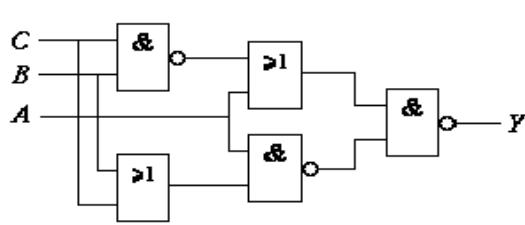

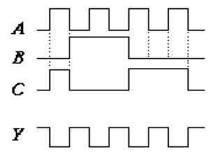

解：由逻辑图写出表达式为： $Y = \overline { { A } } + \overline { { B } } \overline { { C } } = \overline { { A } } + \overline { { B + C } }$ ，则输出Y见上。

# 3．基本逻辑运算的特点：

与 运 算：见零为零，全 1 为1；或 运 算：见1 为1，全零为零；

与非运算：见零为 1，全 1 为零；或非运算：见 1 为零，全零为 1；

异或运算：相异为 1，相同为零；同或运算：相同为 1，相异为零；

非 运 算：零 变 1， 1 变 零；

要求：熟练应用上述逻辑运算。

4. 数字电路逻辑功能的几种表示方法及相互转换。

$\textcircled{1}$ 真值表（组合逻辑电路）或状态转换真值表（时序逻辑电路）：是由变量的所有可能取值组合及其对应的函数值所构成的表格。  
$\textcircled{2}$ 逻辑表达式：是由逻辑变量和与、或、非 3种运算符连接起来所构成的式子。  
$\textcircled{3}$ 卡诺图：是由表示变量的所有可能取值组合的小方格所构成的图形。

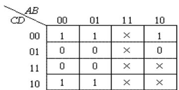

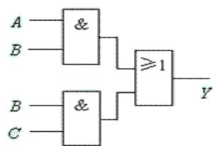

$\textcircled{4}$ 逻辑图：是由表示逻辑运算的逻辑符号所构成的图形。  
$\textcircled{5}$ 波形图或时序图：是由输入变量的所有可能取值组合的高、低电平及其对应的输出函数值的高、低电平所构成的图形。

$\textcircled{6}$ 状态图（只有时序电路才有）：描述时序逻辑电路的状态转换关系及转换条件的图形称为状态图。

要求：掌握这五种（对组合逻辑电路）或六种（对时序逻辑电路）方法之间的相互转换。

# 5．逻辑代数运算的基本规则

$\textcircled{1}$ 反演规则：对于任何一个逻辑表达式 Y，如果将表达式中的所有“·”换成“＋”，“＋”换成“·”，“0”换成“1”，“1”换成“0”，原变量换成反变量，反变量换成原变量，那么所得到的表达式就是函数 Y 的反函数 Y（或称补函数）。这个规则称为反演规则。  
$\textcircled{2}$ 对偶规则：对于任何一个逻辑表达式 Y，如果将表达式中的所有“·”换成“＋”，“＋”换成“·”，“0”换成“1”，“1”换成“0”，而变量保持不变，则可得到的一个新的函数表达式 Y ＇，Y ＇ 称为函 Y的对偶函数。这个规则称为对偶规则。要求：熟练应用反演规则和对偶规则求逻辑函数的反函数和对偶函数。

举例 3：求下列逻辑函数的反函数和对偶函数

$$
Y = A \bar {B} + C \bar {D} E
$$

解：反函数： $-$ 对偶函数： $-$

# 6．逻辑函数化简

要求：熟练掌握逻辑函数的两种化简方法。

$\textcircled{1}$ 公式法化简：逻辑函数的公式化简法就是运用逻辑代数的基本公式、定理和规则来化简逻辑函数。

举例 4：用公式化简逻辑函数： $Y _ { \scriptscriptstyle 1 } = A B C + \overline { { A } } B C + \overline { { B } } C$

$$
Y _ {1} = A B C + \bar {A} B C + B \bar {C} = (A + \bar {A}) B C + B \bar {C}
$$

解： = BC + BC = B(C +C)= B

$\cdot$ 图形化简：逻辑函数的图形化简法是将逻辑函数用卡诺图来表示，利用卡诺图来化简逻辑函数。（主要适合于 3 个或 4 个变量的化简）

举例 5：用卡诺图化简逻辑函数： $\begin{array} { r } { Y ( A , B , C ) = \sum m ( 0 , 2 , 3 , 7 ) + \sum d ( 4 , 6 ) } \end{array}$

解：画出卡诺图为

则 $Y = \overline { { C } } + B$

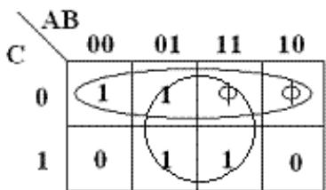

# 7．触发器及其特性方程

1）触发器的的概念和特点：

触发器是构成时序逻辑电路的基本逻辑单元。其具有如下特点：

$\textcircled{1}$ 它有两个稳定的状态：0 状态和1状态；  
$\textcircled{2}$ 在不同的输入情况下，它可以被置成 0 状态或 1 状态，即两个稳态可以相互转换；  
$\textcircled{3}$ 当输入信号消失后，所置成的状态能够保持不变。具有记忆功能

2）不同逻辑功能的触发器的特性方程为：

RS 触发器： $\boldsymbol { Q } ^ { n + 1 } = \boldsymbol { S } + \overline { { \boldsymbol { R } } } \boldsymbol { Q } ^ { n }$ ，约束条件为： $\mathrm { R S } { = } 0$ ，具有置 0、置 1、保持功能。

JK 触发器： $Q ^ { n + 1 } = J \overline { { { Q } } } ^ { n } + \overline { { { K } } } Q ^ { n }$ ，具有置0、置1、保持、翻转功能。

D 触发器： $Q ^ { n + 1 } = D$ ，具有置 0、置 1 功能。

T 触发器： $Q ^ { n + 1 } = T \overline { { { Q } } } ^ { n } + \overline { { { T } } } Q ^ { n }$ ，具有保持、翻转功能。

$\mathrm { ~ T ~ } ^ { \prime }$ 触发器： $Q ^ { n + 1 } = \overline { { { Q } } } ^ { n }$ (计数工作状态)，具有翻转功能。

要求：能根据触发器（重点是 JK-FF 和 D-FF）的特性方程熟练地画出输出波形。

举例 6：已知 J，K-FF 电路和其输入波形，试画出

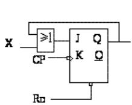

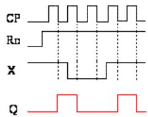

# 8．脉冲产生和整形电路

1)施密特触发器是一种能够把输入波形整形成为适合于数字电路需要的矩形脉冲的电路。要求：会根据输入波形画输出波形。

特点：具有滞回特性，有两个稳态，输出仅由输入决定，即在输入信号达到对应门限电压时触发翻转，没有记忆功能。

2)多谐振荡器是一种不需要输入信号控制，就能自动产生矩形脉冲的自激振荡电路。

特点：没有稳态，只有两个暂稳态，且两个暂稳态能自动转换。

3)单稳态触发器在输入负脉冲作用下，产生定时、延时脉冲信号，或对输入波形整形。

特点： $\textcircled{1}$ 电路有一个稳态和一个暂稳态。

$\textcircled{2}$ 在外来触发脉冲作用下，电路由稳态翻转到暂稳态。  
$\textcircled{3}$ 暂稳态是一个不能长久保持的状态，经过一段时间后，电路会自动返回到稳态。

要求：熟练掌握 555 定时器构成的上述电路，并会求有关参数（脉宽、周期、频率）和画输出波形。

举例 7：已知施密特电路具有逆时针的滞回特性，试画出输出波形。

解：

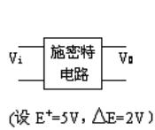

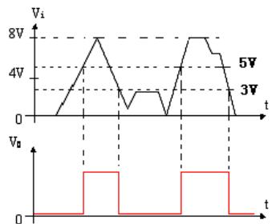

# 9．A/D 和 D/A 转换器

1）A/D和 D/A 转换器概念：

模数转换器：能将模拟信号转换为数字信号的电路称为模数转换器，简称 A/D 转换器或 ADC。由采样、保持、量化、编码四部分构成。

数模转换器：能将数字信号转换为模拟信号的电路称为数模转换器，简称 D/A 转换器或 DAC。由基准电压、变换网络、电子开关、反向求和构成。

ADC 和DAC 是沟通模拟电路和数字电路的桥梁，也可称之为两者之间的接口。

2）D/A 转换器的分辨率

分辨率用输入二进制数的有效位数表示。在分辨率为 $\boldsymbol { \eta }$ 位的 D/A 转换器中，输出电压能区分 $2 ^ { \eta }$ 个不同的

输入二进制代码状态，能给出 $2 ^ { \eta }$ 个不同等级的输出模拟电压。

分辨率也可以用 D/A 转换器的最小输出电压与最大输出电压的比值来表示。

举例 8：10位 D/A 转换器的分辨率为：

$$
\frac {1}{2 ^ {1 0} - 1} = \frac {1}{1 0 2 3} \approx 0. 0 0 1
$$

3）A/D 转换器的分辨率 $\cdot$ 转换器的分辨率用输出二进制数的位数表示，位数越多，误差越小，转换精度越高。

举例 9：输入模拟电压的变化范围为 $0 { \sim } 5 \mathrm { V }$ ，输出8 位二进制数可以分辨的最小模拟电压为 $5 \mathrm { v } \times 2 ^ { - 8 } =$

20mV；而输出 12 位二进制数可以分辨的最小模拟电压为 $5 \mathrm { v } { \times } 2 ^ { - 1 2 } { \approx } 1 . 2 2 \mathrm { m V } .$

# 10．常用组合和时序逻辑部件的作用和特点

组合逻辑部件：编码器、译码器、数据选择器、数据分配器、半加器、全加器。

时序逻辑部件：计数器、寄存器。

要求：掌握编码器、译码器、数据选择器、数据分配器、半加器、全加器、计数器、寄存器的定义，功能和特点。

举例 10：能对两个 1 位二进制数进行相加而求得和及进位的逻辑电路称为半加器。

# 二、典型题型总结及要求

# （一）分析题型

# 1．组合逻辑电路分析：

# 分析思路：

$\textcircled{1}$ 由逻辑图写出输出逻辑表达式；  
$\textcircled{2}$ 将逻辑表达式化简为最简与或表达式；  
$\textcircled{3}$ 由最简与或表达式列出真值表；  
$\textcircled{4}$ 分析真值表，说明电路逻辑功能。

要求：熟练掌握由门电路和组合逻辑器件 74LS138、74LS153、74LS151 构成的各种组合逻辑电路的分析。举例 11：分析如图逻辑电路的逻辑功能。

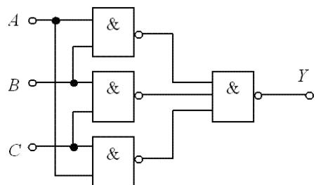

解：

$\textcircled{1}$ 由逻辑图写出输出逻辑表达式

$$
Y = \overline {{Y _ {1} Y _ {2} Y _ {3}}} = \overline {{\overline {{A B}}}} \overline {{B C}} \overline {{A C}}
$$

$\textcircled{2}$ 将逻辑表达式化简为最简与或表达式

$$
Y = A B + B C + C A
$$

$\textcircled{3}$ 由最简与或表达式列出真值表  
$\textcircled{4}$ 分析真值表，说明电路逻辑功能

<table><tr><td>A</td><td>B</td><td>C</td><td>Y</td></tr><tr><td>0</td><td>0</td><td>0</td><td>0</td></tr><tr><td>0</td><td>0</td><td>1</td><td>0</td></tr><tr><td>0</td><td>1</td><td>0</td><td>0</td></tr><tr><td>0</td><td>1</td><td>1</td><td>1</td></tr><tr><td>1</td><td>0</td><td>0</td><td>0</td></tr><tr><td>1</td><td>0</td><td>1</td><td>1</td></tr><tr><td>1</td><td>1</td><td>0</td><td>1</td></tr><tr><td>1</td><td>1</td><td>1</td><td>1</td></tr></table>

当输入 A、B、C 中有 2 个或 3 个为1 时，输出Y为 1，否则输出 Y 为0。所以这个电路实际上是一种 3 人表决用的组合逻辑电路：只要有 2票或 3 票同意，表决就通过。

# 2．时序逻辑电路分析：

# 分析思路：

$\textcircled{1}$ 由电路图写出时钟方程、驱动方程和输出方程；  
$\textcircled{2}$ 将驱动方程代入触发器的特征方程，确定电路状态方程；  
$\textcircled{3}$ 分析计算状态方程，列出电路状态表；  
$\textcircled{4}$ 由电路状态表画出状态图或时序图；  
$\textcircled{5}$ 分析状态图或时序图，说明电路逻辑功能。

要求：熟练掌握同步时序电路，比如同步加法计数器、减法计数器、环形计数器、扭环形计数器的分析。

举例 12：如图所示时序逻辑电路，试分析它的逻辑功能，验证是否能自启动，并画出状态转换图和时序图。

解：

时钟方程为：CP0=CP1=CP

激励方程为：

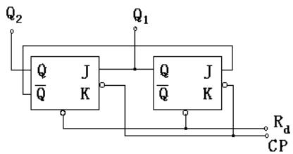

$$
\left\{ \begin{array}{l} J _ {0} = \overline {{Q}} _ {1} ^ {n} \\ K _ {0} = 1 \end{array} \right. \quad \left\{ \begin{array}{l} J _ {1} = \overline {{Q}} _ {0} ^ {n} \\ K _ {1} = 1 \end{array} \right.
$$

将激励方程代入 J-K-FF 的特性方程可得状态方程为

$$
\left\{ \begin{array}{l} Q _ {0} ^ {n + 1} = J 0 \bar {Q} _ {0} ^ {n} + \bar {K} Q _ {0} ^ {n} = \bar {Q} _ {0} ^ {n} \bar {Q} _ {0} ^ {n} \\ Q _ {1} ^ {n + 1} = J 1 \bar {Q} _ {1} ^ {n} + \bar {K} Q _ {1} ^ {n} = Q _ {0} ^ {n} \bar {Q} _ {1} ^ {n} \end{array} \right.
$$

由状态方程做出状态转换表为：

<table><tr><td>Q1nQ0n</td><td>Q1n+1</td><td>Q0n+1</td></tr><tr><td>0 0</td><td>0</td><td>1</td></tr><tr><td>0 1</td><td>1</td><td>0</td></tr><tr><td>1 0</td><td>0</td><td>0</td></tr><tr><td>1 1</td><td>0</td><td>0</td></tr></table>

则状态转换图和时序图为：

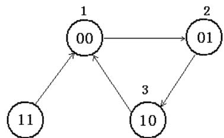

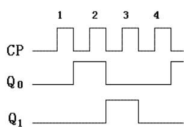

可见电路具有自启动特性，这是一个三进制计数器。

# （二）设计题型

# 1．组合逻辑电路设计：

# 设计思路：

$\textcircled{1}$ 由电路功能描述列出真值表；  
$\textcircled{2}$ 由真值表写出逻辑表达式或卡若图；  
$\textcircled{3}$ 将表达式化简为最简与或表达式；

$\textcircled{4}$ 实现逻辑变换，画出逻辑电路图。

要求：熟练掌握用常用门电路和组合逻辑器件 74LS138、74LS153、74LS151 设计实现各种组合逻辑电路。举例 13：某汽车驾驶员培训班进行结业考试，有三名评判员，其中 A为主评判员，B 和C 为副评判员，在评判时按照服从多数原则通过，但主评判员认为合格也通过，试用与非门实现该逻辑电路。（或用 74138、74151、74153 实现）

解：由题意可作出真值表为：用卡诺图化简为

<table><tr><td>A</td><td>B</td><td>C</td><td>Y</td></tr><tr><td>0</td><td>0</td><td>0</td><td>0</td></tr><tr><td>0</td><td>0</td><td>1</td><td>0</td></tr><tr><td>0</td><td>1</td><td>0</td><td>0</td></tr><tr><td>0</td><td>1</td><td>1</td><td>1</td></tr><tr><td>1</td><td>0</td><td>0</td><td>1</td></tr><tr><td>1</td><td>0</td><td>1</td><td>1</td></tr><tr><td>1</td><td>1</td><td>0</td><td>1</td></tr><tr><td>1</td><td>1</td><td>1</td><td>1</td></tr></table>

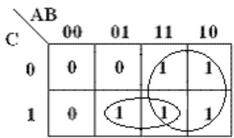

则输出逻辑表达式为 $Y = A + B C = { \overline { { { \overline { { A } } } { \overline { { B C } } } } } }$

用与非门实现逻辑电路图为：

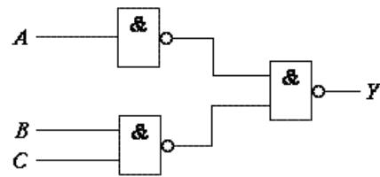

# 2．时序逻辑电路设计：

# 设计思路：

$\textcircled{1}$ 由设计要求画出原始状态图或时序图；  
$\textcircled{2}$ 简化状态图，并分配状态；  
$\textcircled{3}$ 选择触发器类型，求时钟方程、输出方程、驱动方程；  
$\textcircled{4}$ 画出逻辑电路图；  
$\textcircled{5}$ 检查电路能否自启动。

要求：熟练掌握同步时序电路，比如同步加法计数器、减法计数器的设计实现。

举例 14：设计一个按自然态序变化的 7 进制同步加法计数器，计数规则为逢七进 1，产生一个进位输出。

解： $\textcircled{1}$ 建立原始状态图：

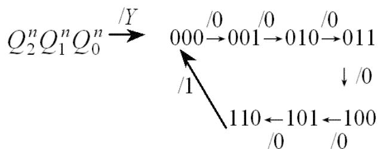

$\textcircled{2}$ 简化状态图，并分配状态：已经是最简，已是二进制状态；

$\textcircled{3}$ 选择触发器类型，求时钟方程、输出方程、驱动方程：因需用 3 位二进制代码，选用3 个 $C P$ 下降沿触发的 JK触发器，分别用 $\mathrm { F F } 0$ 、FF1、 $\mathrm { F F 2 }$ 表示。

由于要求采用同步方案，故时钟方程为：

输出方程：

$$
C P _ {0} = C P _ {1} = C P _ {2} = C P
$$

$$
Y = Q _ {1} ^ {n} Q _ {2} ^ {n}
$$

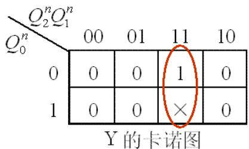

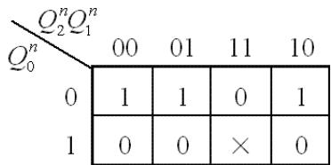  
(a） 的 $\mathcal { Q } _ { 0 } ^ { n + 1 }$ 的卡诺图

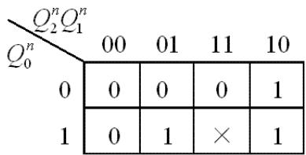  
$\mathcal { Q } _ { 2 } ^ { n + 1 }$ 的卡诺图

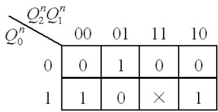  
${ \mathcal { Q } } _ { 1 } ^ { n + 1 }$

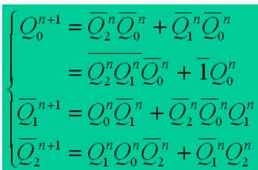

状态方程：

$$
\left\{ \begin{array}{l} Q _ {0} ^ {n + 1} = \overline {{Q _ {2} ^ {n} Q _ {1} ^ {n}}} \overline {{Q}} _ {0} ^ {n} + \overline {{1}} Q _ {0} ^ {n} \\ \overline {{Q}} _ {1} ^ {n + 1} = Q _ {0} ^ {n} \overline {{Q}} _ {1} ^ {n} + \overline {{Q}} _ {2} ^ {n} \overline {{Q}} _ {0} ^ {n} Q _ {1} ^ {n} \\ \overline {{Q}} _ {2} ^ {n + 1} = Q _ {1} ^ {n} Q _ {0} ^ {n} \overline {{Q}} _ {2} ^ {n} + \overline {{Q}} _ {1} ^ {n} Q _ {2} ^ {n} \end{array} \right.
$$

$$
Q ^ {n + 1} = J \overline {{Q}} ^ {n} + \overline {{K}} Q ^ {n}
$$

比较，得驱动方程：

$$
\left\{ \begin{array}{l} J _ {0} = \overline {{Q _ {2} ^ {n} Q _ {1} ^ {n}}} 、 K _ {0} = 1 \\ J _ {1} = Q _ {0} ^ {n} 、 K _ {1} = \overline {{\overline {{Q}} _ {2} ^ {n} \overline {{Q}} _ {0} ^ {n}}} \\ J _ {2} = Q _ {1} ^ {n} Q _ {0} ^ {n} 、 K _ {2} = Q _ {1} ^ {n} \end{array} \right.
$$

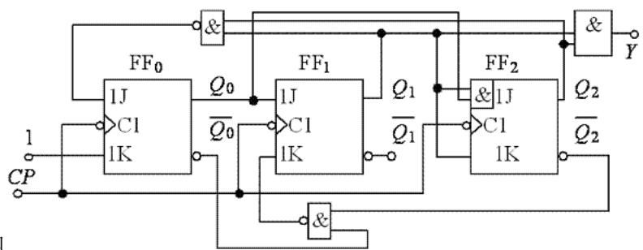

$\textcircled{4}$ 画出电路图

$\textcircled{5}$ 检查电路能否自启动：

将无效状态 111 代入状态方程计算：可见 111 的次态为有效状态 000，电路能够自启动。

3．集成计数器和寄存器的应用：构成 N 进制计数器，构成环形计数器和扭环形计数器。

$$
\left\{ \begin{array}{l} Q _ {0} ^ {n + 1} = \overline {{Q _ {2} ^ {n} Q _ {1} ^ {n}}} \overline {{Q}} _ {0} ^ {n} + \overline {{1}} Q _ {0} ^ {n} = 0 \\ \overline {{Q}} _ {1} ^ {n + 1} = Q _ {0} ^ {n} \overline {{Q}} _ {1} ^ {n} + \overline {{Q}} _ {2} ^ {n} \overline {{Q}} _ {0} ^ {n} Q _ {1} ^ {n} = 0 \\ \overline {{Q}} _ {2} ^ {n + 1} = Q _ {1} ^ {n} Q _ {0} ^ {n} \overline {{Q}} _ {2} ^ {n} + \overline {{Q}} _ {1} ^ {n} Q _ {2} ^ {n} = 0 \end{array} \right.
$$

要求：熟练掌握 74LS160、74LS161、74LS162、74LS163 四种集成计数器应用，比如分析或设计 N 进制计数器；熟练掌握 74LS194 应用，比如分析或设计环形计数器和扭环形计数器。

# 1.用同步清零端或置数端归零构成 N 进置计数器

（1）写出状态 $\cdot$ 的二进制代码。  
（2）求归零逻辑，即求同步清零端或置数控制端信号的逻辑表达式。  
（3）画连线图。

# 2.用异步清零端或置数端归零构成 N 进置计数器

（1）写出状态 SN的二进制代码。  
（2）求归零逻辑，即求异步清零端或置数控制端信号的逻辑表达式。  
（3）画连线图。

举例 15：用 74LS161 来构成一个十二进制计数器。解：

(1)用异步清零端 $\overline { { C R } }$ 归零： $\mathrm { S _ { N } } { = } \mathrm { S _ { 1 2 } } { = } 1 1 0 0$ 则电路为：

$$
\overline {{C R}} = \overline {{Q _ {3} ^ {n} Q _ {2} ^ {n}}}
$$

注：这里 $\mathrm { D } 0 \sim \mathrm { D } 3$ 可随意处理。

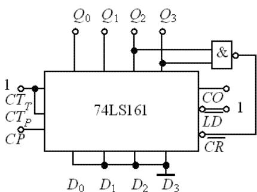  
(a）用异步清零端 $\overline { { C R } }$ 归零

(2)用同步置数端 $\overline { { L D } }$ 归零：

$$
\mathrm {S} _ {\mathrm {N}} = \mathrm {S} _ {1 1} = 1 0 1 1
$$

$$
\overline {{L D}} = \overline {{Q _ {3} ^ {n} Q _ {1} ^ {n} Q _ {0} ^ {n}}}
$$

则电路为：注：这里 $\mathrm { D } _ { 0 } { \sim } \mathrm { D } _ { 3 }$ 必须都接 0。

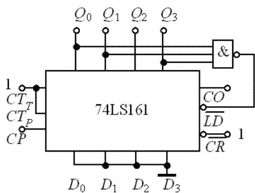  
(b）用同步置数端 $\overline { { L D } }$ 归零

举例 16：用74LS160 来构成一个 48 进制同步加法计数器。

解：因 74LS160 为同步十进制计数器，要构成 48进制同步加法计数器须用二片 74LS160 来实现，现采用异步清零实现： $\mathrm { S } _ { 4 8 } { = } 0 1 0 0 1 0 0 0$ ，取高位片的 $\mathrm { Q _ { C } }$ 和低位片的 QD作归零反馈信号。即清零端 $C R$ 归零信号为： $\overline { { C R } } = \overline { { Q _ { C _ { \scriptscriptstyle / E J } } } } \overline { { Q } } _ { \scriptscriptstyle D / E }$ ，则电路连线图为：

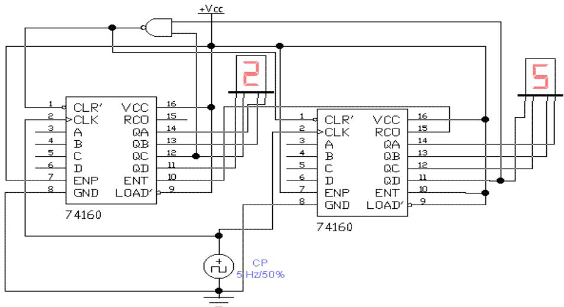

（三）计算和画图题型：要求：会分析电路工作原理，说明电路功能；会根据题意计算电路参数，或正确画出电路波形。

举例 17：如图电路，完成下列问题：

1)说明这是什么电路？  
2)求电路的输出信号频率 $f$   
3)画出 $\mathrm { V _ { C } }$ 及 $\mathrm { V } _ { 0 }$ 的波形。

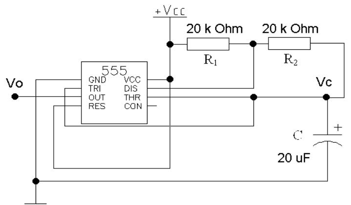

# 解：

1) 这是一个由 555 定时器构成的多谐振荡器。  
2) 其振荡周期为

$$
\begin{array}{l} T = 0. 7 \left(R _ {1} + 2 R _ {2}\right) C \\ = 0. 7 (2 0 + 4 0) \times 1 0 ^ {3} \times 2 0 \times 1 0 ^ {- 6} \\ = 0. 8 4 s \\ \end{array}
$$

则其频率为 $f = \frac { 1 } { T } = \frac { 1 } { 0 . 8 4 } \approx 1 . 2 H z$

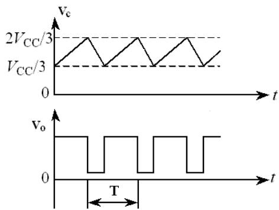

3)VC 及 $\mathrm { V } _ { 0 }$ 的波形的波形为：

# 三、基本概念练习

# 一、判断题

1．CMOS 门电路为双极型电路，而 TTL 门电路则为单极型电路。（ ）  
2.能够实现“线与”功能的门电路是 OC 门或 OD 门。（ ）  
3．施密特触发器的特点是只有一个稳态，需在外加信号作用下才能由稳态翻转到暂稳态。（ ）  
4．在时钟脉冲的控制下，根据输入信号 T 不同情况，凡是具有保持和翻转功能的电路，称为 T 触发器。（ ）  
5.某电路任意时刻的输出不仅取决于当时的输入信号，而且与电路的原状态有关，该电路为时序逻辑电 路。( )   
6.若集成555 定时器的第 4 脚接低电平时，不管输入信号为任意值，定时器始终输出高电平。( )

# 二、填空题：

1．（44．375） $1 0 ^ { = } .$ 8 16 = 8421BCD。   
2．Y=AB（ $\mathrm { C ^ { + D } }$ ），它的反函数 ${ \overline { { Y } } } = { } _ { - }$ ；对偶函数 $Y ^ { \prime } { = } _ { - }$ 。  
3．或非逻辑运算特点是 ，异或逻辑运算特点为 。  
4.n-2 n线译码器的输入代码为 个，输出代码为 个。   
5.就单稳态触发器和施密特触发器而言，若要实现延时、定时的功能，应选用 ；若要实现波形变换、整形的功能，应选用 。  
6.一位二进制计数器可实现 分频；n 位二进制计数器，最后一个触发器输出的脉冲频率是输入频率的 倍。

# 三、选择题

1.八位二进制数所能表示的最大十进制数为( )。

(a) 255

(b) 88

(c) 99

(d) 128

2.下图中能实现 $Y = { \overline { { A \oplus B } } }$ 逻辑运算的电路是( )。

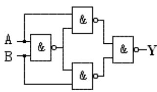

(a)

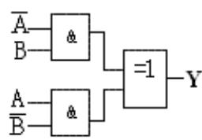

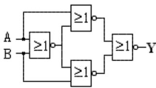

（c)

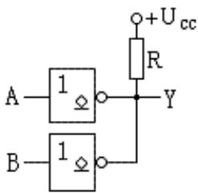

(d）

3.8421BCD 十进制译码器，数字输入信号端和数字输出信号端分别有（ ）个。

(a)4 和 16

(b) 3 和 8

(c) 3 和 10

(d) 4 和 10

4．四个触发器构成十进制加法计数器，若触发器输出从低位至高位分别为 $\mathsf Q _ { 0 }$ 、Q1、Q2、 $\mathsf { Q } _ { 3 }$ ，则输出进位信号 C 为( )

(a) $\mathsf { Q } _ { 3 } \mathsf { Q } _ { 1 }$

(b) Q3Q2Q1Q0

(c) Q2Q1Q0

(d) Q3Q0

5．能将输入三角波信号转换成矩形脉冲信号输出的电路是( )。

(a) 多谐振荡器

(b) A／D 转换器

(c) 单稳态触发器

(d) 施密特触发器

6.若 A/D 转换器输入模拟电压的变化范围为 $0 { \sim } 5 \mathrm { V }$ ，则输出 10 位二进制数可以分辨的最小模拟电压为)

(a)1.5mV

(b)2.4mV

(c)4.9mV

(d)6.5mV

# 数电课程各章重点

# 第一章 逻辑代数基础知识要点

一、二进制、十进制、十六进制数之间的转换；二进制数的原码、反码和补码  
二、逻辑代数的三种基本运算以及 5 种复合运算的图形符号、表达式和真值表：与、或、非  
三、逻辑代数的基本公式和常用公式、基本规则

逻辑代数的基本公式

逻辑代数常用公式：

吸收律： $A + A B = A$

消去律： $A + \overline { { A } } B = A + B$ $A B + A { \overline { { B } } } = A$

多余项定律： $A B + \overline { { A } } C + B C = A B + \overline { { A } } C$

反演定律： AB  A  B A+B=A·B

$$
\overline {{A \bar {B} + \bar {A} B}} = A B + \bar {A} \bar {B}
$$

基本规则：反演规则和对偶规则，例 1-5

# 四、逻辑函数的三种表示方法及其互相转换

逻辑函数的三种表示方法为：真值表、函数式、逻辑图

会从这三种中任一种推出其它二种，详见例 1-7

# 五、逻辑函数的最小项表示法：最小项的性质；例 1-8

# 六、逻辑函数的化简：要求按步骤解答

1、利用公式法对逻辑函数进行化简  
2、利用卡诺图对逻辑函数化简  
3、具有约束条件的逻辑函数化简

例1.1 利用公式法化简 $F ( A B C D ) = A \overline { { { B C } } } + \overline { { { A B } } } + \overline { { { A D } } } + C + B D$

解： $F ( A B C D ) = A \overline { { { B } } } \overline { { { C } } } + \overline { { { A } } } \overline { { { B } } } + \overline { { { A } } } D + C + B D$

$$
\begin{array}{l} = A \bar {B} + \bar {A} \bar {B} + \bar {A} D + C + B D \quad (A \bar {B} \bar {C} + C = A \bar {B} + C) \\ = \bar {B} + \bar {A} D + C + B D \quad (A \bar {B} + \bar {A} \bar {B} = \bar {B}) \\ = \bar {B} + D + \bar {A} D + C \quad (\bar {B} + B D = \bar {B} + D) \\ = \bar {B} + D + C \quad (D + \bar {A} D = D) \\ \end{array}
$$

例 1.2 利用卡诺图化简逻辑函数 $Y ( A B C D ) = \sum m ( 3 . 5 . 6 . 7 . 1 0 )$

约束条件为 1、

解：函数 Y的卡诺图如下：

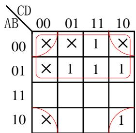

$$
Y = \bar {A} + \bar {B} \bar {D}
$$

# 第二章 门电路知识要点

# 一、三极管开、关状态

1、饱和、截止条件：截止： $V _ { b e } < V _ { T }$ ， 饱和： $i _ { _ B } > I _ { _ { B S } } = \frac { I _ { _ { C S } } } { \beta }$   
2、反相器饱和、截止判断

# 二、基本门电路及其逻辑符号

与门、或非门、非门、与非门、OC 门、三态门、异或；

传输门、OC/OD 门及三态门的应用

# 三、门电路的外特性

1、输入端电阻特性：对 TTL 门电路而言，输入端通过电阻接地或低电平时，由于输入电流流过该电阻，会在电阻上产生压降，当电阻大于开门电阻时，相当于逻辑高电平。习题 2-7

# 以下内容了解

2、输入短路电流 IIS

输入端接地时的输入电流叫做输入短路电流 IIS。

3、输入高电平漏电流 IIH  
输入端接高电平时输入电流  
4、输出高电平负载电流 IOH  
5、输出低电平负载电流 IOL  
6、扇出系数NO

一个门电路驱动同类门的最大数目

# 第三章 组合逻辑电路知识要点

一、组合逻辑电路：任意时刻的输出仅仅取决于该时刻的输入，与电路原来的状态无关  
二、 组合逻辑电路的分析方法（按步骤解题）

逻辑图 写出逻辑函数式 $\nrightarrow$ 化简  真值表 逻辑功能

# 三、 若干常用组合逻辑电路

译码器（74LS138）

全加器（真值表分析）

数选器（74151 和 74153）

# 四、 组合逻辑电路设计方法（按步骤解题）

1、用门电路设计  
2、用译码器、数据选择器实现

例3.1 试设计一个三位多数表决电路

1、用与非门实现   
2、 用译码器 74LS138 实现  
3、 用双 4 选 1 数据选择器 74LS153

解：1. 逻辑定义

设 A、B、C为三个输入变量，Y 为输出变量。逻辑 1 表示同意，逻辑 0 表示不同意，输出变量 $\mathbf { Y } { = } 1$ 表示事件成立，逻辑 0表示事件不成立。

2. 根据题意列出真值表如表 3.1 所示

表 3.1  

<table><tr><td>A</td><td>B</td><td>C</td><td>Y</td></tr><tr><td>0</td><td>0</td><td>0</td><td>0</td></tr><tr><td>0</td><td>0</td><td>1</td><td>0</td></tr><tr><td>0</td><td>1</td><td>0</td><td>0</td></tr><tr><td>0</td><td>1</td><td>1</td><td>1</td></tr><tr><td>1</td><td>0</td><td>0</td><td>0</td></tr><tr><td>1</td><td>0</td><td>1</td><td>1</td></tr><tr><td>1</td><td>1</td><td>0</td><td>1</td></tr><tr><td>1</td><td>1</td><td>1</td><td>1</td></tr></table>

3. 经化简函数 Y的最简与或式为： $Y = A B + B C + A C$   
4. 用门电路与非门实现

函数 Y的与非—与非表达式为： $Y = { \overline { { A B } } } { \overline { { B C } } } { \overline { { A C } } }$

逻辑图如下：

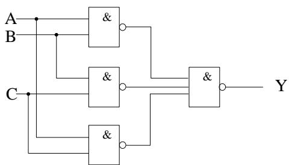

5. 用 3—8 译码器 74LS138 实现

由于 74LS138 为低电平译码，故有 ${ \overline { { Y } } } _ { i } = { \overline { { m _ { i } } } }$

由真值表得出 Y的最小项表示法为：

$$
Y = m _ {3} + m _ {5} + m _ {6} + m _ {7}
$$

$$
\begin{array}{l} = \overline {\overline {{m _ {3}}} \cdot \overline {{m _ {5}}} \cdot \overline {{m _ {6}}} \cdot \overline {{m _ {7}}}} \\ = \overline {{\overline {{Y _ {3}}} \cdot \overline {{Y _ {5}}} \cdot \overline {{Y _ {6}}} \cdot \overline {{Y _ {7}}}}} \\ \end{array}
$$

用 74LS138实现的逻辑图如下：

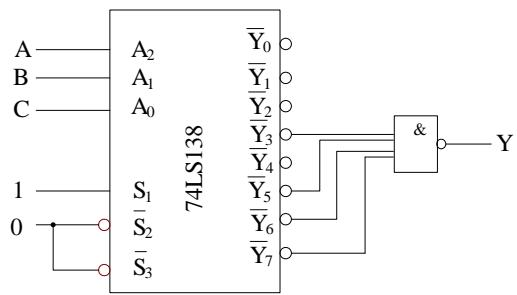

6. 用双 4 选 1 的数据选择器 74LS153 实现

74LS153 内含二片双 4 选 1 数据选择器，由于该函数 Y 是三变量函数，故只需用一个 4 选 1 即可，如果是 4 变量函数，则需将二个 4选 1 级连后才能实现

74LS153 输出 $\mathrm { Y } _ { 1 }$ 的逻辑函数表达式为：

$$
Y _ {1} = \bar {A} _ {1} \bar {A} _ {0} D _ {1 0} + \bar {A} _ {1} A _ {0} D _ {1 1} + A _ {1} \bar {A} _ {0} D _ {1 2} + A _ {1} A _ {0} D _ {1 3}
$$

三变量多数表决电路 Y输出函数为：

$$
Y = \bar {A} B C + A \bar {B} C + A B \bar {C} + A B C
$$

令 $\mathbf { A } { = } \mathbf { A } _ { 1 }$ ， ${ \bf B } { = } { \bf A } _ { 0 }$ ，C 用 $\mathrm { D } _ { 1 0 } { \sim } \mathrm { D } _ { 1 3 }$ 表示，则

$$
\begin{array}{l} Y = \bar {A} \bar {B} \cdot 0 + \bar {A} B \cdot C + A \bar {B} \cdot C + A B \cdot 1 \\ \therefore \mathrm {D} _ {1 0} = 0, \quad \mathrm {D} _ {1 1} = \mathrm {C}, \quad \mathrm {D} _ {1 2} = \mathrm {C}, \quad \mathrm {D} _ {1 3} = 1 \\ \end{array}
$$

逻辑图如下：

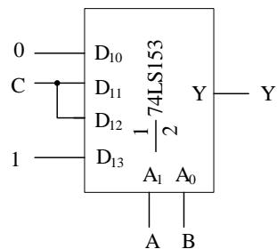

注：实验中 1 位二进制全加器设计：用 138 或 153 如何实现？1 位二进制全减器呢？

# 第四章 触发器知识要点

# 一、触发器：能储存一位二进制信号的单元

# 二、各类触发器框图、功能表和特性方程

RS： $Q ^ { n + 1 } = S + \overline { { { R } } } Q ^ { n }$

$$
\mathrm {S R} = 0
$$

JK：

D:

T：

T'：

# 三、 各类触发器动作特点及波形图画法

基本 RS触发器： $\mathbf { S } _ { \mathrm { D } }$ 、 $\mathtt { R } _ { \mathrm { D } }$ 每一变化对输出均产生影响

时钟控制 RS触发器：在 CP高电平期间 R、S变化对输出有影响

主从 JK触发器：在 $\mathrm { C P = } 1$ 期间，主触发器状态随 R、S变化。CP下降沿，从触发器按主触发器状态翻转。在 $\mathrm { C P = } 1$ 期间，JK 状态应保持不变，否则会产生一次状态变化。

T'触发器：Q是 CP的二分频

边沿触发器：触发器的次态仅取决于 CP（上升沿/下降沿）到达时输入信号状态。

# 四、触发器转换

D触发器和 JK触发器转换成 T 和 T’触发器

# 第五章 时序逻辑电路知识要点

# 一、时序逻辑电路的组成特点：任一时刻的输出信号不仅取决于该时刻的输入信号，还和电路原状态有关。

时序逻辑电路由组合逻辑电路和存储电路组成。

# 二、同步时序逻辑电路的分析方法（按步骤解题）

逻辑图 $\twoheadrightarrow$ 写出驱动方程 $\twoheadrightarrow$ 写出状态方程 $\twoheadrightarrow$ 写出输出方程 $\twoheadrightarrow$ 画出状态转换图 （详见例5-1）

# 三、典型时序逻辑电路

1. 移位寄存器及移位寄存器型计数器。   
2. 用 T 触发器构成二进制加法计数器构成方法。

$$
\begin{array}{l} \mathrm {T} _ {0} = 1 \\ \mathrm {T} _ {1} = \mathrm {Q} _ {0} \\ \end{array}
$$

$$
\mathrm {T} _ {\mathrm {i}} = \mathrm {Q} _ {\mathrm {i} - 1} \quad \mathrm {Q} _ {\mathrm {i} - 2} \dots \mathrm {Q} _ {1} \mathrm {Q} _ {0}
$$

# 3. 集成计数器框图及功能表的理解

4 位同步二进制计数器 74LS161：异步清 0（低电平），同步置数，CP上升沿计数，功能表

4 位同步十进制计数器 74LS160：同 74LS161

同步十六进制加/减计数器 74LS191：无清0 端，只有异步预置端，功能表

双时钟同步十六进制加减计数器 74LS193：有二个时钟 CPU，CPD，异步置 0（H），异步预置（L）

# 四、 时序逻辑电路的设计 （按步骤解题）

1．用触发器组成同步计数器的设计方法及设计步骤（例 5-3）

逻辑抽象 $\twoheadrightarrow$ 状态转换图 $\twoheadrightarrow$ 画出次态 以及各输出的卡诺图 $\twoheadrightarrow$ 利用卡诺图求状态方程和驱动方程、

输出方程 $\twoheadrightarrow$ 检查自启动（如不能自启动则应修改逻辑） $\twoheadrightarrow$ 画逻辑图

# 2．用集成计数器组成任意进制计数器的方法

置0 法：如果集成计数器有清零端，则可控制清零端来改变计数长度。如果是异步清零端，则 N进制计数器可用第 N 个状态译码产生控制信号控制清零端，如果是同步清零，则用第 N-1 个状态译码产生控制信号，产生控制信号时应注意清零端时高电平还是低电平。

置数法：控制预置端来改变计数长度。

如果异步预置，则用第 N个状态译码产生控制信号

如果同步预置，则用第 N-1 个状态译码产生控制信号，也应注意预置端是高电平还是低电平。

两片间进位信号产生：有串行进位和并行进位二种方法

详见例 5-5 至 5-8

# 第六章 可编程逻辑器件知识要点

# 一、半导体存储器的分类及功能（了解）

从功能上分

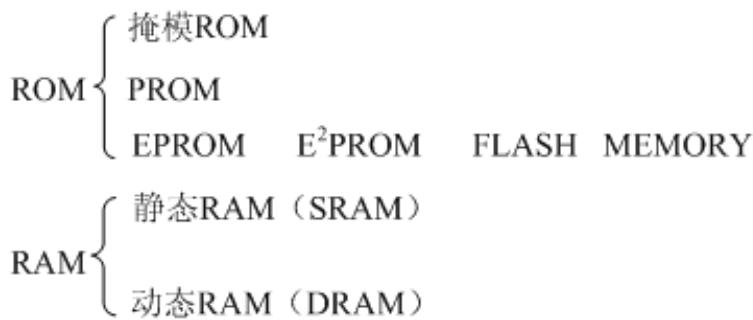

# 二、半导体存储器结构 （了解）

ROM、RAM 结构框图以及两者差异

# 三、RAM 存储器容量扩展

位扩展：增加数据位数

字扩展：增加存储单元

# 第八章 脉冲波形产生和整形知识要点

重点：555 电路及其应用

# 一、用 555 组成多谐振荡器

1. 电路组成如图 6.5 所示

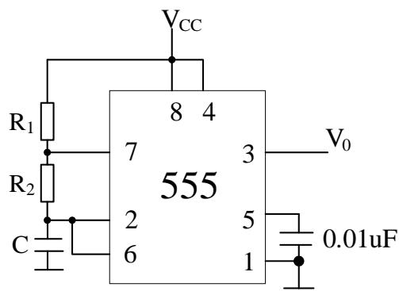  
图 6.5

# 2. 电路参数：

充电 ${ \boldsymbol { \tau } } : ~ ( \mathbf { R } _ { 1 } { + } \mathbf { R } _ { 2 } ) { \bf C }$ 放电 $\tau$ ： R2C 周期： $\mathrm { T } { = } ( \mathbf { R } _ { 1 } { + } 2 \mathbf { R } _ { 2 } ) \mathbf { C } \ 1$ n2

占空比： $q = \frac { t _ { w 1 } } { T } = \frac { R _ { 1 } + R _ { 2 } } { R _ { 1 } + 2 R _ { 2 } }$

# 二、用 555 电路组成施密特触发器

1. 电路如图 6.1所示  
2. 回差计算

$$
V _ {T +} = \frac {2}{3} V _ {C C}, \quad V _ {T -} = \frac {1}{3} V _ {C C}
$$

回差 $\Delta V = V _ { { _ { T + } } } - V _ { { _ { T - } } }$

# 3. 对应 $\mathrm { \nabla V _ { i } }$ 输入波形、输出波形如图 6.2 所示

# 三、用 555 电路组成单稳电路

# 1. 电路如图 6.3所示

稳态时 $\mathrm { \Delta V _ { O } = 0 }$

$\mathrm { V } _ { \mathrm { i } 2 }$ 有负脉冲触发时 $\mathrm { V } _ { \mathrm { O } } { = } 1$ 。

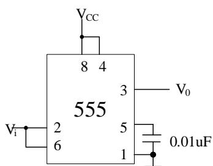

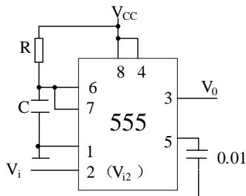  
图6.3

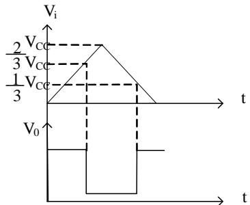  
图6.2

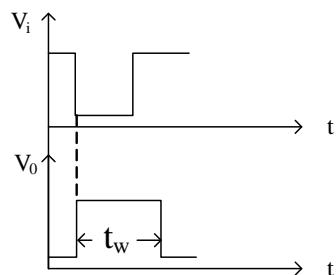  
图6.4

# 2. 脉宽参数计算

# 3. 波形如图 6.4所示

# 第九章 数模和模数转换知识要点

# 一、D/A 转换器

D/A 转换器的一般形式为： $\mathrm { V } _ { \mathrm { O } } { = } \mathrm { K D } _ { \mathrm { i } }$ ，K为比例系数， $\mathrm { D } _ { \mathrm { i } }$ 为输入的二进制数，D/A 转换器的电路结构主要看有权电阻、权电流、权电容以及开关树型 D/A 转换器。

权电阻及倒 T 型电阻网络 D/A转换器输出电压和输入二进制数之间关系的推导过程。

# 二、A/D 转换器

# 1. A/D 转换器基本原理

取样定理：为保证取样后的信号不失真恢复变量信号，设采样频率为 $f _ { s }$ ，原信号最高频率为 $f _ { \mathrm { m a x } }$

则 $f _ { s } \geq 2 f _ { \operatorname* { m a x } }$ 。

A/D 转换器过程：采样、保持、量化、编码

2. 典型 A/D 转换器的工作原理

逐次逼近型 A/D 转换器原理

计数型 A/D 转换器原理