# 目 录

# 第1 章 数字逻辑概论

1.1 复习笔记  
1.2 课后习题详解  
1.3 名校考研真题详解

# 第2 章 逻辑代数与硬件描述语言基础

2.1 复习笔记  
2.2 课后习题详解  
2.3 名校考研真题详解

# 第3 章 逻辑门电路

3.1 复习笔记  
3.2 课后习题详解  
3.3 名校考研真题详解

# 第4 章 组合逻辑电路

4.1 复习笔记  
4.2 课后习题详解  
4.3 名校考研真题详解

# 第5 章 锁存器和触发器

5.1 复习笔记  
5.2 课后习题详解  
5.3 名校考研真题详解

# 第6 章 时序逻辑电路

6.1 复习笔记  
6.2 课后习题详解  
6.3 名校考研真题详解

# 第 7 章 存储器、复杂可编程器件和现场可编程门阵列

7.1 复习笔记  
7.2 课后习题详解  
7.3 名校考研真题详解

# 第8 章 脉冲波形的变换与产生

8.1 复习笔记  
8.2 课后习题详解  
8.3 名校考研真题详解

# 第9 章 数模与模数转换器

9.1 复习笔记  
9.2 课后习题详解  
9.3 名校考研真题详解

# 第10 章 数字系统设计基础

10.1 复习笔记  
10.2 课后习题详解  
10.3 名校考研真题详解

# 第 $1$ 章　数字逻辑概论

# 1.1　复习笔记

# 一、模拟信号与数字信号

# 1．模拟信号和数字信号

# （1）模拟信号

在时间上连续变化，幅值上也连续取值的物理量称为模拟量，表示模拟量的信号称为模拟信号，处理模拟信号的电子电路称为模拟电路。

# （2）数字信号

与模拟量相对应，在一系列离散的时刻取值，取值的大小和每次的增减都是量化单位的整数倍，即时间离散、数值也离散的信号。

表示数字量的信号称为数字信号，工作于数字信号下的电子电路称为数字电路。

# （3）模拟量的数字表示

$\textcircled{1}$ 对模拟信号取样，通过取样电路后变成时间离散、幅值连续的取样信号；  
$\textcircled{2}$ 对取样信号进行量化即数字化；  
$\textcircled{3}$ 对得到的数字量进行编码，生成用 0 和 1 表示的数字信号。

# 2．数字信号的描述方法

# （1）二值数字逻辑和逻辑电平

在数字电路中，可以用0和1组成的二进制数表示数量的大小，也可以用0和1表示两种不同的逻辑状态。

在电路中，当信号电压在 $3 . 5 { \sim } 5 \mathrm { ~ V ~ }$ 范围内表示高电平；在 $0 \sim 1 . 5 \mathrm { V }$ 范围内表示低电平。以高、低电平分别表示逻辑1和0两种状态。

# （2）数字波形

$\textcircled{1}$ 数字波形的两种类型

非归零码：在一个时间拍内用高电平代表1，低电平代表0。

归零码：在一个时间拍内有脉冲代表1，无脉冲代表0。

$\textcircled{2}$ 周期性和非周期性

周期性数字波形常用周期 T 和频率 f 来描述。脉冲波形的脉冲宽度用 $t _ { \mathrm { W } }$ 表示，所以占空比

$$
q = \frac{t_{\mathrm{W}}}{T}\times 100\%
$$

$\textcircled{3}$ 实际数字信号波形

在实际的数字系统中，数字信号并不理想。当从低电平跳变到高电平，或从高电平跳到低电平时，边沿没有那么陡峭，而要经历一个过渡过程。图1-1 为非理想脉冲波形。

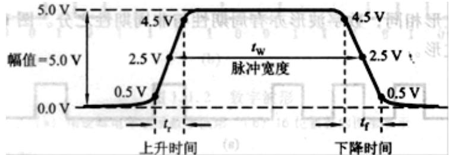  
图1-1 非理想脉冲波形

$\textcircled{4}$ 时序图：表示各信号之间时序关系的波形图称为时序图。

# 二、数制

# 1．十进制

以10为基数的计数体制称为十进制，其计数规律为“逢十进一”。

$$
(N) _ {D} = \sum_ {i = - \infty} ^ {\infty} K _ {i} \times 1 0 ^ {i}
$$

任意十进制可表示为：

式中， $K _ { i }$ 可以是 $0 { \sim } 9$ 中任何一个数字。

如果将上式中的10用字母R 代替，则可以得到任意进制数的表达式：

$$
(N) _ {R} = \sum_ {i = - \infty} ^ {\infty} K _ {i} \times R ^ {i}
$$

# 2．二进制

# （1）二进制的表示方法

以2为基数的计数体制称为二进制，其只有0和1两个数码，计数规律为“逢二进一”。

任意二进制可表示为： $( N ) _ { g } = \sum _ { i = - \infty } ^ { \infty } K _ { i } \times 2 ^ { i }$ ，即二进制数转换为十进制数的转换公式。

式中， 可以是0或1。

# （2）二进制的优缺点

$\textcircled{1}$ 优点：二进制的数字装置简单可靠，所用元件少；基本运算规则简单，运算操作方便。  
$\textcircled{2}$ 缺点：用二进制表示一个数时，位数多。

# （3）二进制数的波形表示

二值数据常用数字波形来表示，用高、低电平表示 1、0。

# （4）二进制数据的传输

二进制数据从一处传输到另一处，可以采用串行或并行的方式：

$\textcircled{1}$ 串行传输是逐位传送，所需设备简单，但速度相对较慢。  
$\textcircled{2}$ 并行传输是一组数据同时传送，传输速度快，但需要的传输线和部件较多。

# 3．十-二进制之间的转换

# （1）整数部分

将十进制整数每除以一次 2，就可根据余数得到二进制数的 1 位数字。因此，只要连续除以2直到商为0，就可由所有的余数求出二进制数。

以十进制数(37)D转换为二进制数为例。

# （2）小数部分

将十进制小数乘以2，每次除去上次所得积中的整数所剩的小数再乘以2，直到满足误差要求进行“四舍五入”为止。

以十进制数(0.706)D转换为二进制数为例。

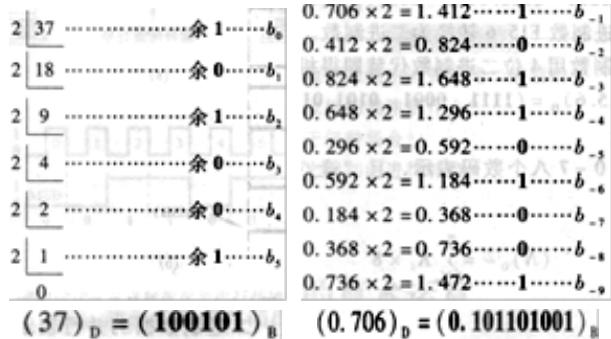

# 4．十六进制和八进制

# （1）十六进制

以16为基数的计数体制称为十六进制，分别为

0、1、2、3、4、5、6、7、8、9、A、B、C、D、E、F，其计数规律为“逢十六进一”。

# （2）十六-二进制之间转换

以小数点为基准，整数部分从右到左每4位一组，不足4位的在高位补0；小数部分从左到右每4位一组，不足4位的在低位补0。每4位一组的二进制数就表示1位十六进制数。

以二进制数(01011110.10110010)2 转换为十六进制数为例。

$$
\begin{array}{c c c c} (0 1 0 1 & 1 1 1 0. & 1 0 1 1 & 0 0 1 0) _ {2} \\ \downarrow & \downarrow & \downarrow & \downarrow \\ = (5 & E. & B & 2) _ {1 6} \end{array}
$$

十六进制转换为二进制，将每位十六进制数用4位二进制数代替即可得到相应的二进制数。

# （3）八进制

以8为基数的计数体制称为八进制，其计数规律为“逢八进一”。

$$
(N) _ {O} = \sum_ {i = - \infty} ^ {\infty} K _ {i} \times 8 ^ {i}
$$

# （4）八-二进制之间转换

可将3位二进制数分为一组，对应于1位八进制数。

以二进制数(010011.101010)2 转换为八进制数为例。

$$
\begin{array}{c c c c} (0 1 0 & 0 1 1. & 1 0 1 & 0 1 0) _ {2} \\ \downarrow & \downarrow & \downarrow & \downarrow \\ = (2 & 3. & 5 & 2) _ {8} \end{array}
$$

# （5）其他进制间转换

十进制数转换为十六进制数，可先将十进制数转换为二进制数，再由二进制数转换为十六进制数。十进制、二进制、八进制及十六进制之间的关系对照如表1-1 所示。

表1-1 几种数制之间的关系对照表  

<table><tr><td>十进制数</td><td>二进制数</td><td>八进制数</td><td>十六进制数</td><td>十进制数</td><td>二进制数</td><td>八进制数</td><td>十六进制数</td></tr><tr><td>0</td><td>00000</td><td>0</td><td>0</td><td>11</td><td>01011</td><td>13</td><td>B</td></tr><tr><td>1</td><td>00001</td><td>1</td><td>1</td><td>12</td><td>01100</td><td>14</td><td>C</td></tr><tr><td>2</td><td>00010</td><td>2</td><td>2</td><td>13</td><td>01101</td><td>15</td><td>D</td></tr><tr><td>3</td><td>00011</td><td>3</td><td>3</td><td>14</td><td>01110</td><td>16</td><td>E</td></tr><tr><td>4</td><td>00100</td><td>4</td><td>4</td><td>15</td><td>01111</td><td>17</td><td>F</td></tr><tr><td>5</td><td>00101</td><td>5</td><td>5</td><td>16</td><td>10000</td><td>20</td><td>10</td></tr><tr><td>6</td><td>00110</td><td>6</td><td>6</td><td>17</td><td>10001</td><td>21</td><td>11</td></tr><tr><td>7</td><td>00111</td><td>7</td><td>7</td><td>18</td><td>10010</td><td>22</td><td>12</td></tr><tr><td>8</td><td>01000</td><td>10</td><td>8</td><td>19</td><td>10011</td><td>23</td><td>13</td></tr><tr><td>9</td><td>01001</td><td>11</td><td>9</td><td>20</td><td>10100</td><td>24</td><td>14</td></tr><tr><td>10</td><td>01010</td><td>12</td><td>A</td><td></td><td></td><td></td><td></td></tr></table>

# 三、二进制数的算术运算

# 1．无符号二进制数的算术运算

# （1）二进制加法

无符号二进制数的加法规则： $0 + 0 { = } 0$ ， $0 + 1 = 1$ ， $1 + 1 = 1 0$ ，方框中的1为进位数。

# （2）二进制减法

无符号二进制数的减法规则： $0 - 0 = 0$ ， $1 - 1 = 0$ ， $1 - 0 = 1$ ， $0 - 1 = 1 1$ ，方框中的 1为借位数。

# （3）乘法运算和除法运算

$\textcircled{1}$ 乘法运算是由左移被乘数和加法运算组成的；  
$\textcircled{2}$ 除法运算是由右移被除数和减法运算组成的。

# 2．带符号二进制数的减法运算

负数的运算需要用有符号的二进制数表示。在定点运算的情况下，二进制数的最高位表示符号位，其中，0表示正数，1表示负数，其余部分为数值位。

将负数用补码表示，以便将减法运算变为加法运算。

# （1）二进制数的补码表示

补码或反码的最高位为符号位，其中，0 表示正数，1 表示负数。

当二进制数为正数时，其补码、反码与原码相同。

当二进制数为负数时，将原码的数值位逐位求反，然后在最低位加 1 得到补码。

对于 $\mathbf { n }$ 位带符号的二进制数的原码、反码和补码的数值范围分别为：

原码 $\mathfrak { - } ( 2 ^ { n - 1 } - 1 ) \sim + ( 2 ^ { n - 1 } - 1 )$

反码 $\mathfrak { - } ( 2 ^ { n - 1 } - 1 ) \sim + ( 2 ^ { n - 1 } - 1 )$

补码 $\displaystyle - 2 ^ { n - 1 } \sim + ( 2 ^ { n - 1 } - 1 )$

# （2）二进制补码的减法运算

二进制数减法运算的原理是减去一个正数相当于加上一个负数，即 $\mathrm { A } { \cdot } \mathrm { B } { = } \mathrm { A } { + } ( { - } \mathrm { B } )$ ，对（-B）求补码，然后进行加法运算。

二进制补码的加法运算应注意被加数补码与加数补码的位数相等，即让两个二进制数补码的符号位对齐。

乘法和除法可以采用移位和加法或减法的组合完成。

# （3）溢出

当运算结果超出了数值位表示的范围时就会产生溢出。

解决办法：进行位扩展

溢出的判断：当最高位的进位与和数的符号位相反时，运算结果是错误的，产生溢出。

# 四、二进制代码

# 1．二-十进制码

用 4 位二进制数表示 1 位十进制数中 $0 { \sim } 9$ ，简称 BCD 码。

# （1）8421BCD 码

有权码，即0000（0） $\sim 1 0 0 1$ （9），高位到低位的权分别为8、4、2、1。

# （2）2421 码

有权码，高位到低位的权分别为 2、4、2、1。

# （3）5421 码

有权码，高位到低位的权分别为 5、4、2、1。

# （4）余3码

自补码，也是无权码，每一位没有权值，但其编码可以由8421码加3（0011）得出。

# （5）余3循环码

无权码，任意两个相邻代码之间仅有1位取值不同。可以看成是将格雷码首尾各 3种状态去掉而得。

# 2．格雷码

格雷码是一种无权码，它也具有相邻性，即两个相邻代码之间仅有1位取值不同，因而常用于将模拟量转换成用连续二进制数序列表示数字量的系统中。

# 3．ASCII 码

ASCII 码是目前国际上最通用的一种字符码。它是用7位二进制码来表示128个十进制数、英文大小写字母、控制符、运算符及特殊符号。

# 五、二值逻辑变量与基本逻辑运算

当0和1表示逻辑状态时，两个二进制数码按照某种指定的因果关系进行的运算称为逻辑运算。

# 1．与运算

只有当一件事的几个条件全部具备之后，这件事才发生。这种关系称为与逻辑，如图1-2所示。

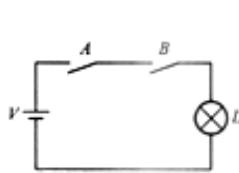  
(a)

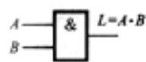  
(b)

(c)   
图1-2 与逻辑运算  
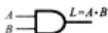  
(a)电路图 (b)矩形符号 (c)特异形符号

# 2．或运算

只要一件事情的几个条件中有一个条件得到满足，这件事就会发生。这种关系称为或逻辑，如图1-3 所示。

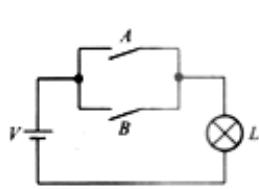  
(a)

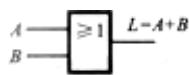  
(b)

(c)   
图1-3 或逻辑运算  
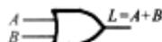  
(a)电路图 (b)矩形符号 (c)特异形符号

3．非运算：一件事情的发生是以其相反的条件为依据。这种逻辑关系称为非逻辑，如图1-4 所示。

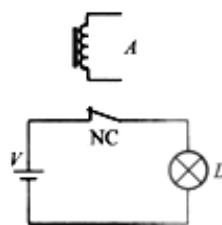

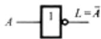  
(b)

图 1-4 非逻辑运算  
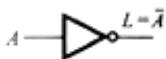  
(a)电路图 (b)矩形符号 (c)特异形符号

# 4．几种常用的逻辑运算

（1）与非：由与运算和非运算组合在一起，其符号如图1-5 所示。  
（2）或非：由或运算和非运算组合在一起，其符号如图1-6 所示。  
（3）异或：当两个输入信号相同时，输出为0；当两个输入信号不同时，输出为 1，其符号如图1-7 所示。

（4）同或：当两个输入信号相同时，输出为1；当两个输入信号不同时，输出为 0，其符号如图1-8 所示。

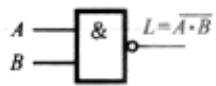  
(a)

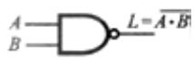

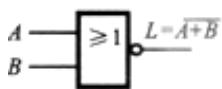  
(a)

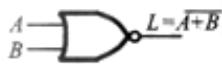

图1-5 与非逻辑符号 图1-6 或非逻辑符号

(a)矩形符号 (b)特异形符号

(a)矩形符号 (b)特异形符号

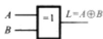  
(a)

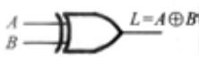

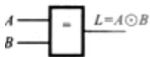  
(a)

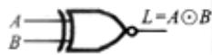

图 1-7 异或逻辑符号 图 1-8 同或逻辑符号

(a)矩形符号 (b)特异形符号

(a)矩形符号 (b)特异形符号

# 六、逻辑函数及其表示方法

# 1．真值表

将输入变量所有取值对应的输出值找出来，列成表格，即可得到真值表。

# 2．逻辑表达式

用与、或、非等运算组合起来，表示逻辑函数和逻辑变量之间关系的逻辑代数式。

# 3．逻辑图

用与、或、非等逻辑符号表示逻辑函数中各变量之间的逻辑关系所得到的图形称为逻辑图。

# 4．波形图

用输入端在不同逻辑信号作用下所对应的输出信号的波形图，表示电路的逻辑关系。

上述四种不同的表示方法所描述的是同一逻辑函数，因此它们之间有着必然的联系，可以从一种表示方法，得到其他表示方法。

# 1.2　课后习题详解

# 1．1 数字电路与数字信号

1．1.1 试以教材表1.1.1所列的数字集成电路的分类为依据，指出下列IC 器件属于何种集成度器件：(1)微处理器；(2)计数器；(3)加法器；(4)逻辑门；(5)4兆位存储器。

解：由教材表1.1.1可知，(1)、(5)属于超大规模集成电路；(2)、(3)属于中规模集成电路；

(4)属于小规模集成电路。

1．1.2 一数字信号波形如图1-9 所示，试问该波形所代表的二进制数是什么?

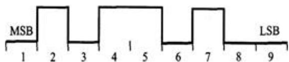  
图 1-9

解：低电平用0表示，高电平用1表示，则图1-9 所示波形用二进制可表示为：

$$
0 1 0 1 1 0 1 0 0 。
$$

1．1.3 试绘出下列二进制数的数字波形，设逻辑1的电压为5V，逻辑 0的电压为 $0 \mathrm { V }$ 。

$$
(1) 0 0 1 1 0 0 1 1 0 0 1 1 (2) 0 1 1 1 0 1 0 (3) 1 1 1 1 0 1 1 1 0 1
$$

解：0表示低电平，1表示高电平，且左高位右低位，则数字波形如图1-10 所示。

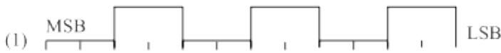

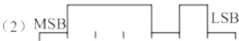

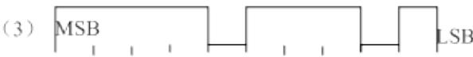  
图 1-10

1．1.4 一周期性数字波形如图 1-11 所示，试计算：(1)周期；(2)频率；(3)占空比。

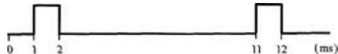  
图 1-11

解：由图 1-11 可知该波形为周期性数字波形，则有

周期： $\mathrm { T } { = } 1 1 \ \mathrm { m s } { - } 1 \ \mathrm { m s } \ = 1 0 \ \mathrm { m s }$ （两相邻上升沿之差）；

频率： $\mathrm { f } { = } 1 / \mathrm { T } { = } 1 0 0 \ \mathrm { H z }$ ；

占空比： $q = \frac { T _ { 1 } } { T } { \times } 1 0 0 \% { = } \frac { 1 } { 1 0 } { \times } 1 0 0 \% = 1 0 \%$ 。

# 1．2 数制

1．2.1 一数字波形如图1-12 所示，时钟频率为 $4 \mathrm { k H z }$ ，试确定：(1)它所表示的二进制数；(2)串行方式传送8位数据所需要的时间；(3)以 8位并行方式传送数据时需要的时间。

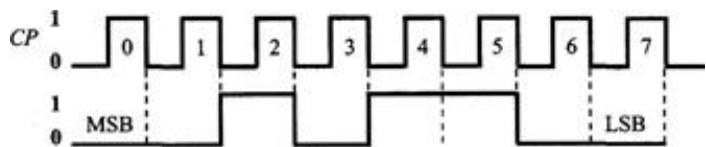  
图 1-12

解：（1）该波形所代表的二进制数为 00101100；

（2）串行方式传送 8 位数据共需要 8 个时钟周期， $t = 8 / f _ { = 2 \mathrm { m s } }$   
（3）并行方式传送 8 位数据共需要 1 个时钟周期， $t = 1 / \mathrm { ~ } f _ { = 0 . 2 5 \mathrm { ~ m s } }$

1．2.2 将下列十进制数转换为二进制数、八进制数和十六进制数(要求转换误差不大于 $2 ^ { - 4 }$ )：

(1)43 (2)127 (3)254.25 (4)2.718

解：十进制整数转化为二进制数采用“除 2取余”法，十进制小数转换为二进制采用“乘 2取整”法。相应的八进制和十进制可通过二进制转换。以（3）254.25 为例：

63 31 15 0

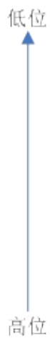

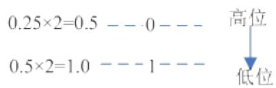

(1) $( 4 3 ) \ \mathrm { _ { D } } \mathrm { = \ ( 1 0 1 0 1 1 ) \ \mathrm { _ { B } } \mathrm { = \ ( 5 3 ) \ \mathrm { _ { 0 } } \mathrm { = \ ( 2 B ) \ \mathrm { _ { H } } \mathrm { ; } } } }$   
(2)（127 $^ { 7 ) } _ { \mathrm { \scriptsize ~ D } } = \mathrm { \scriptsize ~ ( 1 1 1 1 1 1 1 ) ~ } _ { \mathrm { \scriptsize ~ B } } = ( 1 7 7 ) _ { \mathrm { \scriptsize 0 } } = ( 7 \mathrm { F } ) _ { \mathrm { \scriptsize { H } } } ;$ $_ \mathrm { B } { = } ( 1 7 7 ) _ { \mathrm { O } } { = } ( 7 \mathrm { F } ) _ { \mathrm { H } }$   
( $3 ) ( 2 5 4 . 2 5 ) _ { \mathrm { D } } { = } ( 1 1 1 1 1 1 0 . 0 1 ) _ { \mathrm { B } } { = } ( 3 7 6 . 2 ) _ { \mathrm { o } } { = } ( \mathrm { F E . 4 } ) _ { \mathrm { H } }$ ；  
(4) $( 2 . 7 1 8 ) _ { \mathrm { D } } { = } ( 1 0 . 1 0 1 1 0 1 1 1 ) _ { \mathrm { B } } { = } ( 2 . 5 6 ) _ { \mathrm { O } } { = } ( 2 . \mathrm { B } ) _ { \mathrm { H } } { \circ }$ 。

1．2.3 将下列二进制数转换为十六进制数：

(1)(101001)B (2)(11.01101)B

解：(1)（101001）B＝（0010 1001）B＝（29）H；  
(2)（11.01101） $\mathrm { \Pi _ { B } } = \mathrm { \ c } 0 0 1 1 . 0 1 1 0 1 0 0 0 \mathrm { \ _ { \ B } } = \mathrm { \ } ( 3 . 6 8 ) \ \mathrm { \Pi _ { H } } \circ$

1．2.4 将下列十进制数转换为十六进制数(要求转换误差不大于 $1 6 ^ { - 4 }$ )：

(1)(500)D (2)(59)D (3)(0.34)D (4)(1002.45)D

解：先将十进制整数转化为二进制，然后转换成十六进制数。对于十进制小数转化成十六进制，采用乘16取整的办法。

(1)（5 $ \mathrm { \Delta 0 0 ) _ { \ D } = \mathrm { \langle 1 1 1 1 0 1 0 0 \rangle _ { \ B } = \langle 1 F 4 \rangle _ { \ B } ; } }$   
(2)（59） $\mathrm { \Delta _ { D } } \mathbf { = } \ \left( 1 1 \ 1 0 1 1 \right) \mathrm { \Omega _ { B } } \mathbf { = } \ \left( 3 \mathbf { B } \right) \mathrm { \Omega _ { H } } \mathbf { ; }$   
(3)（0.34） $\mathrm { \Delta } _ { \mathrm { D } } \mathrm { = } \ \mathrm { \Gamma } ( 0 . 5 7 0 \mathrm { A } )$ H；  
(4)（1002）D＝（11 1110 1010）B＝（3EA）H （0.45）D＝（0.7333）H

故（1002.45） $\mathrm { _ { D } = }$ （3EA.7333）H。

1．2.5 将下列十六制数转换为二进制数：

(1)(23F.45)H (2)(A040.51)H   
解：(1)（ $2 3 \mathrm { F } . 4 5 ) _ { \mathrm { ~ \tiny ~ H } } = \mathrm { ~ ( 0 0 1 0 ~ 0 0 1 1 ~ 1 1 1 1 . 0 1 0 ~ 0 1 0 1 ~ ) _ { ~ \tiny ~ B } ; }$   
(2)（A040.51） $_ { \mathrm { H } } { = } ( 1 0 1 0 0 0 0 0 0 0 1 0 0 0 0 0 0 . 0 1 0 1 0 0 0 1 ) _ { \mathrm { B } }$ 。

1．2.6 将下列十六进制数转换为十进制数：

( $\mathrm { 1 ) ( 1 0 3 . 2 ) _ { H } ( 2 ) ( A 4 5 D . 0 B C ) _ { H } }$

解： ${ } _ { ( 1 ) } \big ( 1 0 3 . 2 \big ) _ { \scriptscriptstyle H } = 1 \times 1 6 ^ { 2 } + 3 \times 1 6 ^ { 0 } + 2 \times 1 6 ^ { - 1 } = \big ( 2 5 9 . 1 2 5 \big ) _ { \scriptscriptstyle D } ,$

同理（2） $\left( A 4 5 D . 0 B C \right) _ { H } = \left( 4 2 0 7 7 . 0 4 5 9 \right) _ { D \mathrm { ~ q ~ } }$

# 1．3 二进制的算术运算

1．3.1 写出下列二进制数的原码、反码和补码：

(

解：正数的反码、补码与原码相同，负数的反码等于原码的数值位逐位取反，负数的补码等于反码加 1。

（2） A=A=A=10110  
（3） ， ，  
（4） ， ，

1．3.2 写出下列有符号二进制补码所表示的十进制数：

(1)0010111 (2)11101000

解：（1）0010111为正数，正数的补码与原码相同，所以 $\left( + 0 1 0 1 1 \right) _ { B } = \left( 2 3 \right) _ { D }$ 。

（2）11101000 为负数补码，将其还原成二进制数为 $( - 0 0 1 1 0 0 0 ) _ { B }$ ，十进制表示为 $( - 2 4 ) _ { D }$ 。

1．3.3 试用8位二进制补码计算下列各式，并用十进制数表示结果：

$\left( 1 \right) 1 2 + 9 \left( 2 \right) 1 1 - 3 \left( 3 \right) - 2 9 - 2 5 \left( 4 \right) - 1 2 0 + 3 0$

解：（1） $\square 1 2 + 9 \square _ { \vec { * } \vdash } = \square + 1 2 \sqcap _ { \vec { * } \vdash } + \square + 9 \sqcap _ { \vec { * } \vdash }$

D；

（2） $\scriptstyle \perp 1 1 - 3 \scriptscriptstyle \perp _ { \vec { * } \vdash } = \scriptscriptstyle \perp + 1 1 \scriptscriptstyle \perp _ { \vec { * } \vdash } + \scriptscriptstyle \perp - 3 \scriptscriptstyle \perp _ { \vec { * } \vdash }$   
$= 0 0 0 0 1 0 1 1 + 1 1 1 1 1 1 0 1 = 0 0 0 0 1 0 0 0$ （舍弃进位） $= ( 8 ) _ { \mathrm { D } }$ ；  
（3） $ - 2 9 - 2 5 \sqcup _ { \vec { * } \vec { \vdash } } = \sqcup - 2 9 \sqcup _ { \vec { * } \vec { \vdash } } + \sqcup - 2 5 \sqcup _ { \vec { * } \vec { \vdash } }$   
$= 1 1 1 0 0 0 1 1 + 1 1 1 0 0 1 1 1 = 1 1 0 0 1 0 1 0$ （舍弃进位） $= ( - 5 4 ) _ { \mathrm { D } }$ ；  
（4） $\Theta . 1 2 0 + 3 0 \Theta _ { \vec { * } \vec { \imath } } = \Theta . 1 2 0 \Theta _ { \vec { * } \vec { \imath } } + \Theta + 3 0 \Theta _ { \vec { * } \vec { \imath } }$   
$= 1 0 0 0 1 0 0 0 + 0 0 0 1 1 1 1 0 = 1 0 1 0 0 1 1 0 = ( - 9 0 ) _ { \mathrm { D } } { \mathrm { { } } } \quad$

# 1．4 二进制代码

1．4.1 将下列十进制数转换为8421BCD 码：

(1)43 (2)127 (3)254.25 (4)2.718

解：十进制的每一位都用 8421BCD 码表示即可。

$1 ) ( 4 3 ) _ { \mathrm { D } } { = } ( 0 1 0 0 0 0 1 1 ) _ { \mathrm { B C D } }$   
(2) $\scriptstyle ( 1 2 7 ) _ { \mathrm { D } } = ( 0 0 0 1 0 0 1 0 0 1 1 1 ) _ { \mathrm { B C D } }$ ；  
( $3 ) ( 2 5 4 . 2 5 ) _ { \mathrm { D } } { = } ( 0 0 1 0 0 1 0 1 0 0 . 0 0 1 0 0 1 0 1 ) _ { \mathrm { B C D } }$   
( $4 ) ( 2 . 7 1 8 ) _ { \mathrm { D } } { = } ( 0 0 1 0 . 0 1 1 1 0 0 0 1 1 0 0 0 ) _ { \mathrm { B C D } } { \circ }$ $=$

1．4.2 将下列数码作为自然二进制数或8421BCD 码时，分别求出相应的十进制数：

(1)10010111 (2)100010010011 (3)000101001001 (4)10000100.10010001

解： $( 1 ) ( 1 0 0 1 0 1 1 1 ) _ { \mathrm { B } } { = } 2 ^ { 0 } { + } 2 ^ { 1 } { + } 2 ^ { 2 } { + } 2 ^ { 4 } { + } 2 ^ { 7 } { = } ( 1 5 1 ) _ { \mathrm { D } }$   
$( 1 0 0 1 0 1 1 1 ) _ { \mathrm { B C D } } { = } ( 1 0 0 1 0 1 1 1 ) _ { \mathrm { B C D } } { = } ( 9 7 ) _ { \mathrm { D } }$   
( $\ ! ) ( 1 0 0 0 1 0 0 1 0 0 1 1 ) _ { \mathrm { B } } = 2 ^ { 0 } + 2 ^ { 1 } + 2 ^ { 4 } + 2 ^ { 7 } + 2 ^ { 1 1 } = ( 2 1 9 5 ) _ { \mathrm { D } }$   
$( 1 0 0 0 1 0 0 1 0 0 1 1 ) _ { \mathrm { B C D } } { = } ( 1 0 0 0 1 0 0 1 0 0 1 1 ) _ { \mathrm { B C D } } { = } ( 8 9 3 ) _ { \mathrm { D } }$   
(3 $) ( 0 0 0 1 0 1 0 0 1 0 0 1 ) _ { \mathrm { B } } { = } 2 ^ { 0 } + 2 ^ { 3 } + 2 ^ { 6 } { + } 2 ^ { 8 } { = } ( 3 2 9 ) _ { \mathrm { D } }$   
$( 0 0 0 1 0 1 0 0 1 0 0 1 ) _ { \mathrm { B C D } } { = } ( 0 0 0 1 0 1 0 0 1 0 0 1 ) _ { \mathrm { B C D } } { = } ( 1 4 9 ) _ { \mathrm { D } }$

（4）（10000100.10010001）B＝(132.57)D

（10000100.10010001） $\scriptstyle \mathrm { { B C D } } = ( 8 4 . 9 1 ) _ { \mathrm { { D } } }$

1．4.3 试用十六进制数写出下列字符的ASCⅡ码的表示：

$( 1 ) + ( 2 ) @$ (3)you (4)43

解：各个字符的ASCⅡ码的表示如表 1-1 所示。

表 1-1  

<table><tr><td>题号</td><td>ASCII 码表示</td></tr><tr><td>(1)</td><td>\( {\left( {0101011}\right) }_{\mathrm{B}} = {\left( 2\mathrm{\;B}\right) }_{\mathrm{H}} \)</td></tr><tr><td>(2)</td><td>\( {\left( {1000000}\right) }_{\mathrm{B}} = {\left( {40}\right) }_{\mathrm{H}} \)</td></tr><tr><td>(3)</td><td>\( y = {\left( {1111001}\right) }_{\mathrm{B}} = {\left( {79}\right) }_{\mathrm{H}};\;o = {\left( {1101111}\right) }_{\mathrm{B}} = {\left( 6\mathrm{\;F}\right) }_{\mathrm{H}};\;u = {\left( {1110101}\right) }_{\mathrm{B}} = {\left( {75}\right) }_{\mathrm{H}} \)</td></tr><tr><td>(4)</td><td>\( 4 = {\left( {0110100}\right) }_{\mathrm{B}} = {\left( {34}\right) }_{\mathrm{H}};3 = {\left( {0110011}\right) }_{\mathrm{B}} = {\left( {33}\right) }_{\mathrm{H}} \)</td></tr></table>

1．6 逻辑函数及其表示方法

1．6.1 在图1-13 中，已知输入信号A、B 的波形，画出各门电路输出 L 的波形。

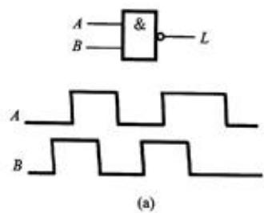

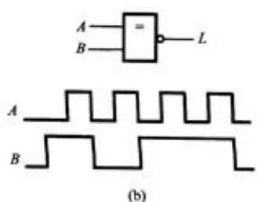  
图 1-13

解：（1）只有当 $\mathrm { A } { = } \mathrm { B } { = } 1$ 时， $\mathrm { L } = 0$ ，否则 L 输出高电平；L 波形图如图1-14（a）所示。（2）当AB 的输入不同时， $\mathrm { L } = 1$ ，否则输出低电平；L 的波形图如图1-14（b）所示。

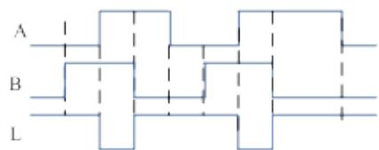

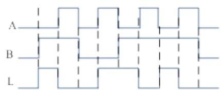  
（a）  
（b）  
图 1-14

# 1.3　名校考研真题详解

# 一、填空题

(10100011.11)2＝( ) $1 0 ^ { = }$ ( )8421BCD。[电子科技大学 2009 研]

【答案】163.75；000101100011.01110101 查看答案

【解析】二进制转换为十进制公式： $D = \sum k _ { i } \times 2 ^ { i }$ ，再由十进制数的每位数对应写出BCD8421 码。

# 二、选择题

1．十进制数 $( - 6 ) _ { 1 0 }$ 的补码是( )。(连符号位在内取 6 位)[电子科技大学 2006 研]

A．(111001)2   
B．(110011)2   
C．(110100)2   
D． $( 1 1 1 0 1 0 ) _ { 2 }$

【答案】D 查看答案

【解析】－6 的原码为 100110，反码为 111001，补码为 111010。

2．十进制数 $( 2 6 . 6 2 5 ) _ { 1 0 }$ 的二进制数是（ ）。[北京科技大学 2011 研]

A． $( 1 1 0 1 0 . 1 0 1 ) _ { 2 }$   
B．(10010.101)2   
C． $( 1 1 0 0 1 . 1 0 1 ) _ { 2 }$   
D． $( 1 1 0 1 0 . 1 0 0 ) _ { 2 }$

【答案】A 查看答案

【解析】整数部分26除2求余后倒排得11010，小数部分0.625乘2取整后顺排得0.101

3．无符号二进制数 $( 1 1 0 1 , 1 0 1 1 ) _ { 2 }$ 的等值八进制数是（ ）。[成都理工大学 2006 研]

【答案】 $( 1 5 . 5 4 ) _ { 8 }$ 查看答案

【解析】 $( 1 1 0 1 . 1 0 1 1 ) _ { 2 } { = } ( 0 0 1 ~ 1 0 1 . 1 0 1 ~ 1 0 0 ) _ { 2 } { = } ( 1 5 . 5 4 ) _ { 8 }$

# 三、分析计算题

1．列表写出 $( + 9 6 ) _ { 1 0 }$ 的原码、反码和补码(含符号位取 8 位)。[华南理工大学大学 $( - 1 5 ) _ { 1 0 }$ 2006 研]

解： $( + 9 6 ) _ { 1 0 } =$ （01100000）原码 $=$ （01100000）反码 $=$ （01100000）补码

$$
(- 1 5) _ {1 0} = (1 0 0 0 1 1 1 1) _ {\text {原 码}} = (1 1 1 1 0 0 0 0) _ {\text {反 码}} = (1 1 1 1 0 0 0 1) _ {\text {补 码}}
$$

# 第2章　逻辑代数与硬件描述语言基础

# 2.1　复习笔记

# 一、逻辑代数

1．逻辑代数的基本定律和恒等式

由逻辑与、或、非三种基本运算法则可推导出常用逻辑代数基本定律和恒等式，如表2-1所示。

表 2-1 逻辑代数定律、定理和恒等式  

<table><tr><td>基本定律</td><td>或</td><td>与</td><td>非</td></tr><tr><td>0-1律</td><td>A+0=A</td><td>A·0=0</td><td></td></tr><tr><td></td><td>A+1=1</td><td>A·1=A</td><td></td></tr><tr><td></td><td>A+A=A</td><td>A·A=A</td><td>A̅ = A</td></tr><tr><td></td><td>A+A=1</td><td>A·A̅=0</td><td></td></tr><tr><td>结合律</td><td>(A+B)+C=A+(B+C)</td><td>(AB)C=A(BC)</td><td></td></tr><tr><td>交换律</td><td>A+B=B+A</td><td>AB=BA</td><td></td></tr><tr><td>分配律</td><td>A(B+C)=AB+AC</td><td>A+BC=(A+B)(A+C)</td><td></td></tr><tr><td>反演律(摩根定理①)</td><td>A·B·C···=A+B+C+···</td><td>A+B+C+···=A·B·C···</td><td></td></tr><tr><td>吸收律</td><td>A+A·B=A</td><td></td><td></td></tr><tr><td></td><td>A·(A+B)=A</td><td></td><td></td></tr><tr><td></td><td>A+A·B=A+B</td><td></td><td></td></tr><tr><td></td><td>(A+B)·(A+C)=A+BC</td><td></td><td></td></tr><tr><td>常用恒等式</td><td>AB+AC+BC=AB+AC</td><td>AB+AC+BCD=AB+AC</td><td></td></tr></table>

2．逻辑代数的基本规则

（1）代入规则

在任何一个逻辑等式中，如果将等式两边出现的某变量A，都用一个函数代替，则等式依然成立，这个规则称为代入规则。

# （2）反演规则

将原函数中的与换成或，或换成与；再将原变量换为非变量，非变量换为原变量；并将1换成0，0换成1，所得的逻辑函数式就是原函数的非函数，这个规则称为反演规则。

运用反演规则时应注意：

$\textcircled{1}$ 保持原来的运算优先级，即先进行与运算，后进行或运算，并注意优先考虑括号内的运算；  
$\textcircled{2}$ 对于反变量以外的非号应保持不变。

# （3）对偶规则

将原函数中的与换成或，或换成与；1换成0，0换成1，所得的逻辑函数式就是原函数的对偶式，这个规则称为对偶规则。

# 3．逻辑函数的代数化简法

# （1）逻辑函数的最简与-或表达式

逻辑函数化简就是要消去与-或表达式中多余的乘积项和每个乘积项中多余的变量，以得到逻辑函数的最简与-或表达式。有了最简表达式后，再用公式变换就可得到其他类型的函数式。

# （2）逻辑函数的化简方法

常用的有代数法和卡诺图法。代数法就是运用逻辑代数的基本定律和恒等式对逻辑函数进行化简。以下为常用的方法：

$\textcircled{1}$ 并项法

利用 $A + { \overline { { A } } } = 1$ 的公式，将两项合并成一项，并消去一个变量。

$\textcircled{2}$ 吸收法

利用 $A + A B = A$ 的公式，消去多余的项AB，根据代入规则，A、B 可以是任何一个复杂的逻辑式。

$\textcircled{3}$ 消去法

利用 $A + \overline { { A } } B = A + B$ ，消去多余的因子。

$\textcircled{4}$ 配项法

先利用 $\scriptstyle A = A ( B + { \overline { { B } } } )$ ，增加必要的乘积项，再用并项或吸收的办法使项数减少。

# 二、逻辑函数的卡诺图化简法

由代数法化简后得到的逻辑表达式是否为最简式较难判断，而卡诺图法可以比较简便地得到最简的逻辑表达式。

# 1．最小项的定义及其性质

# （1）最小项的意义

n个变量 $\mathrm { X } _ { 1 }$ 、 $X _ { 2 }$ 、…、 $X _ { \mathrm { n } }$ 的最小项是n个因子的乘积，每个变量都以它的原变量或非变量的形式在乘积项中出现，且仅出现一次。

# （2）最小项的性质

$\textcircled{1}$ 对于任意一个最小项，输入变量只有一组取值使得它的值为 1，而在变量取其他各组值时，这个最小项的值都是0；  
$\textcircled{2}$ 不同的最小项，使它的值为 1的那一组输入变量取值也不同；  
$\textcircled{3}$ 对于输入变量的任一组取值，任意两个最小项的乘积为 0；

$\textcircled{4}$ 对于输入变量的任一组取值，全体最小项之和为 1。

# （3）最小项的编号

最小项通常用 $\mathrm { m } _ { \mathrm { i } }$ 表示，下标i 即最小项编号，用十进制数表示。将最小项中的原变量用1表示，非变量用0表示，可得到最小项的编号，如表2-2 所示。

表2-2 三变量最小项编号  

<table><tr><td rowspan="2">最小项</td><td colspan="3">变量取值</td><td rowspan="2">表示符号</td><td rowspan="2">最小项</td><td colspan="3">变量取值</td><td rowspan="2">表示符号</td></tr><tr><td>A</td><td>B</td><td>C</td><td>A</td><td>B</td><td>C</td></tr><tr><td>\(\overline{A}\ \overline{B}\ \overline{C}\)</td><td>0</td><td>0</td><td>0</td><td>\(m_0\)</td><td>\(A\ \overline{B}\ \overline{C}\)</td><td>1</td><td>0</td><td>0</td><td>\(m_4\)</td></tr><tr><td>\(\overline{A}\ \overline{B}C\)</td><td>0</td><td>0</td><td>1</td><td>\(m_1\)</td><td>\(A\ \overline{B}C\)</td><td>1</td><td>0</td><td>1</td><td>\(m_5\)</td></tr><tr><td>\(\overline{A}B\ \overline{C}\)</td><td>0</td><td>1</td><td>0</td><td>\(m_2\)</td><td>\(AB\ \overline{C}\)</td><td>1</td><td>1</td><td>0</td><td>\(m_6\)</td></tr><tr><td>\(\overline{A}BC\)</td><td>0</td><td>1</td><td>1</td><td>\(m_3\)</td><td>\(ABC\)</td><td>1</td><td>1</td><td>1</td><td>\(m_7\)</td></tr></table>

# 2．逻辑函数的最小项表达式

利用逻辑代数的基本公式，可以把任意一个逻辑函数化成若干个最小项之和的形式，称为最小项表达式。

求解最小项表达式的步骤：

（1）多次利用摩根定律去掉非号，直至最后得到一个只在单个变量上有非号的表达式；  
（2）利用分配律消去括号，直至得到一个与-或表达式；  
（3）在所得式子中，利用配项法使每一项中包含所有变量，即最小项形式。

任意一个逻辑函数经过变换，都能表示成唯一的最小项表达式。

# 3．用卡诺图表示逻辑函数

# （1）卡诺图的引出

一个逻辑函数的卡诺图是将此函数的最小项表达式中的各最小项相应地填入一个特定的方格图中，此方格图称为卡诺图。

卡诺图“折叠展开”的法则：

$\textcircled{1}$ 新增加的方格按展开方向应标以新变量；  
$\textcircled{2}$ 新的方格内最小项编号应为展开前对应方格编号加 $2 ^ { \mathrm { n - 1 } }$ 。

# （2）卡诺图的特点

各小方格对应于各变量不同的组合，且上下左右在几何上相邻的方格内只有一个因子有差别，这个重要特点称为卡诺图化简逻辑函数的主要依据。

需要指出，卡诺图水平方向同一行里，最左端和最右端的方格具有相邻性，垂直方向同一列里最上端和最下端两个方格也是相邻的。

# （3）卡诺图的简化表示法

在卡诺图中用0、1表示非变量和原变量，所有变量的每组取值，与方格内的最小项编号一一对应。

# （4）已知逻辑函数画卡诺图

当逻辑函数为最小项表达式时，在卡诺图中找出和表示式中最小项对应的小方格填上1，其余的小方格填上0，就可以得到相应的卡诺图。

当逻辑函数的表达式为其他形式时，可将其变换为最小项表达式后，再作出卡诺图。

# 4．用卡诺图化简逻辑函数

# （1）化简的依据

卡诺图具有循环邻接的特性，若图中两个相邻的方格均为1，则这两个相邻最小项的和将消去一个变量。若卡诺图中 4个相邻的方格为1，则这4个相邻的最小项之和将消去2个变量。同理，8个相邻的方格为1可消去3个变量。

# （2）化简的步骤

用卡诺图化简逻辑函数的步骤如下：

$\textcircled{1}$ 将逻辑函数写成最小项表达式；  
$\textcircled{2}$ 按最小项表达式填卡诺图，凡式中包含了的最小项，其对应方格填 1，其余方格填0；  
$\textcircled{3}$ 合并最小项，即将相邻的 1方格圈成一组（包围圈），每一组含2n个方格，对应每个包围圈写成一个新的乘积项；  
$\textcircled{4}$ 将所有包围圈对应的乘积项相加。

画包围圈时应遵循的原则：

$\textcircled{1}$ 包围圈内的方格数必定是 2n个，n 等于 0、1、2、3、…；  
$\textcircled{2}$ 相邻方格包括上下底相邻、左右边相邻和四角相邻；  
$\textcircled{3}$ 同一方格可以被不同的包围圈重复包围，但新增包围圈中一定要有新的方格，否则该包围圈为多余；  
$\textcircled{4}$ 包围圈内的方格数要尽可能多，包围圈的数目要尽可能少。

# （3）具有无关项的化简

在真值表内对应于变量的某些取值下，函数的值可以是任意的，或者这些变量的取值根本不会出现，这些变量取值所对应的最小项称为无关项或任意项。

无关项的意义在于，它的值可以取 0或1，具体取什么值，可以根据使函数尽量得到简化而定。

# 2.2　课后习题详解

# 2．1 逻辑代数

2．1.1 用真值表证明下列恒等式：

( $\mathbf { \Phi } _ { \mathrm { 1 ) ( A } } \mathbf { \oplus _ { B ) } } \mathbf { \oplus _ { C = A } } \oplus \mathbf { _ { ( B } } \oplus _ { \mathbf { C ) } }$   
(2)(A+B)(A+C)＝A+BC   
(3) $\overline { { A \oplus B } } = \overline { { A } } \overline { { B } } + A B$

证明 首先分别写出等式左右两边的真值表。

（1）

表 2-3  

<table><tr><td>A B C</td><td>\( \left( {A \oplus  B}\right)  \oplus  C \)</td><td>\( A \oplus  \left( {B \oplus  C}\right) \)</td></tr><tr><td>000</td><td>0</td><td>0</td></tr><tr><td>001</td><td>1</td><td>1</td></tr><tr><td>010</td><td>1</td><td>1</td></tr><tr><td>011</td><td>0</td><td>0</td></tr><tr><td>100</td><td>1</td><td>1</td></tr><tr><td>101</td><td>0</td><td>0</td></tr><tr><td>110</td><td>0</td><td>0</td></tr><tr><td>111</td><td>1</td><td>1</td></tr></table>

则有 ${ \bigl ( } A \oplus B { \bigr ) } \oplus C _ { \mathrm { = } } A \oplus { \bigl ( } B \oplus C { \bigr ) }$ 。

（2）

表 2-4  

<table><tr><td>A B C</td><td>(A+B)(A+C)</td><td>A+BC</td></tr><tr><td>000</td><td>0</td><td>0</td></tr><tr><td>001</td><td>0</td><td>0</td></tr><tr><td>010</td><td>0</td><td>0</td></tr><tr><td>011</td><td>1</td><td>1</td></tr><tr><td>100</td><td>1</td><td>1</td></tr><tr><td>101</td><td>1</td><td>1</td></tr><tr><td>110</td><td>1</td><td>1</td></tr><tr><td>111</td><td>1</td><td>1</td></tr></table>

则有(A+B)(A+C)＝A+BC。

（3）

表 2-5  

<table><tr><td>AB</td><td>\( \bar{A} \oplus  \bar{B} \)</td><td>\( \bar{A}\bar{B} + {AB} \)</td></tr><tr><td>00</td><td>1</td><td>1</td></tr><tr><td>01</td><td>0</td><td>0</td></tr><tr><td>10</td><td>0</td><td>0</td></tr><tr><td>11</td><td>1</td><td>1</td></tr></table>

则有 ${ \overline { { A \oplus B } } } = { \overline { { A } } } { \overline { { B } } } + A B$ 。

2．1.2 写出三变量的摩根定理表达式，并用真值表验证其正确性。

解：设三表量为ABC，则摩根定理可表示为： 。 ${ \overline { { A B C } } } = { \overline { { A } } } + { \overline { { B } } } + { \overline { { C } } } , { \overline { { A + B + C } } } = { \overline { { A } } } { \overline { { B } } } { \overline { { C } } }$ 各个表达式的真值表如表2-6 所示。

表 2-6  

<table><tr><td>ABC</td><td>\( \overline{ABC} \)</td><td>\( \bar{A} + \bar{B} + \bar{C} \)</td><td>\( \overline{A + B + C} \)</td><td>\( \overline{ABC} \)</td></tr><tr><td>000</td><td>1</td><td>1</td><td>1</td><td>1</td></tr><tr><td>001</td><td>1</td><td>1</td><td>0</td><td>0</td></tr><tr><td>010</td><td>1</td><td>1</td><td>0</td><td>0</td></tr><tr><td>011</td><td>1</td><td>1</td><td>0</td><td>0</td></tr><tr><td>100</td><td>1</td><td>1</td><td>0</td><td>0</td></tr><tr><td>101</td><td>1</td><td>1</td><td>0</td><td>0</td></tr><tr><td>110</td><td>1</td><td>1</td><td>0</td><td>0</td></tr><tr><td>111</td><td>0</td><td>0</td><td>0</td><td>0</td></tr></table>

等式成立。

2．1.3 用逻辑代数定律证明下列等式：

（1）  
（2）

证明： $( 1 ) ^ { \cal A } \ ^ { + } \overline { { { \cal A } } } \bar { \cal B } \ = { \cal A } \big ( 1 \ + \bar { \cal B } \big ) \ + \overline { { { \cal A } } } \bar { \cal B } \ = { \cal A } + { \cal A } \bar { \cal B } + \overline { { { \cal A } } } \bar { \cal B } = { \cal A } + { \cal B }$

$$
\begin{array}{l} = A C (B + \bar {B}) + A B (C + \bar {C}) = A B + A C \\ = A + C D + \overline {{C D}} E = A + C D + E \\ \end{array}
$$

2．1.4 用代数法化简下列各式：

(1)AB(BC+A) (2)

（3）ABC（B+C）

（4）AB+ABC+A（B+AB）

（5）AB+AB+AB+AB

（6）（A+B）+（A+B）+（AB）（AB)

（7）B+ABC+AC+AB

（8）ABC+ABC+ABC+A+BC

（9）ABC $\overline { { D } } + A B D + B C \overline { { D } } + A B C B D + B \overline { { C } }$

（10）AC+ABC+BC+ABC

解：(1) $A B \left( B C \ + A \right) \ = A B C \ + A B \ = \left( 1 + C \right) A B = A B$

(2)

(3)

(4)

$$
= A (\bar {B} + C) \overline {{A (B + A)}} = A (\bar {B} + C) \overline {{A + A B}} = A (\bar {B} + C) \bar {A} = 0
$$

(5) ${ \overline { { A B + { \overline { { A } } } { \overline { { B } } } + { \overline { { A } } } { \overline { { B } } } + { \overline { { A } } } { \overline { { B } } } } } } \ + { \overline { { A } } } { \overline { { \overline { { B } } } } } = { \overline { { \overline { { \left( A B + { \overline { { A } } } B \right) } } + \left( { \overline { { A } } } { \overline { { B } } } + { A } { \overline { { B } } } \right) } } } = { \overline { { B + { \overline { { B } } } } } } = 0$

$\overline { { \left( \overline { { A } } + B \right) } } + \overline { { A + B } } + \overline { { \left( \overline { { \overline { { A } } } } B \right) } } \overline { { \left( A \overline { { B } } \right) } } = \left( \overline { { \overline { { A } } } } + B \right) \left( A + B \right) \overline { { \overline { { \left( \overline { { A } } \overline { { B } } \right) } } \left( \overline { { A \overline { { B } } } } \right) } }$

$$
= (\bar {A} B + A B + B) (A \bar {B} + \bar {A} B) = B (A \bar {B} + \bar {A} B) = \bar {A} B
$$

$( 7 ) ^ { \overline { { B } } } + A B C + \overline { { A C } } + \overline { { A B } } = \overline { { B } } + A C + \overline { { A C } } + \overline { { A B } } = 1$

$$
\begin{array}{l} (8) \overline {{A B C}} + A \bar {B} C + A B C + A + B \bar {C} \\ = (\overline {{A B C}} + A B C) + A \bar {B} C + A + B \bar {C} = 1 + A \bar {B} C + A + B \bar {C} = 1 \\ \end{array}
$$

$$
\begin{array}{l} A B C \bar {D} + A B D + B C \bar {D} + A B C B D + B \bar {C} = A B C (D + \bar {D}) + A B D + B (C \bar {D} + \bar {C}) \tag {9} \\ = A B C + A B D + \mathcal {B} (\bar {C} + \bar {D}) = A B C + B \bar {C} + A B D + B \bar {D} \\ = \mathcal {B} (A + \bar {C}) + \mathcal {B} (A + \bar {D}) = A B + B \bar {C} + B \bar {D} \\ \end{array}
$$

$$
\begin{array}{l} \overline {{\overline {{A C + \bar {A} B C}} + \bar {B} C + A B \bar {C}}} = \overline {{\left(A + \bar {A} B\right) C}} + \bar {B} C + A B \bar {C} \tag {10} \\ = \overline {{\left(A + B\right)}} + \bar {C} + \bar {B} C + A B \bar {C} = \overline {{A \bar {B}}} + \bar {C} + \bar {B} = \bar {C} + \bar {B} = B C \\ \end{array}
$$

2．1.5 将下列各式转换成与-或形式：

（1)ABCD  
（2）A+B+C+D+C+D+A+D  
（3）AC·BDBC·AB

解：(1) ${ \overline { { A \oplus B } } } \oplus { \overline { { C \oplus D } } } = { \bigl ( } A \odot B { \bigr ) } \oplus { \bigl ( } C \odot D { \bigr ) } = { \bigl ( } A \odot B { \bigr ) } { \bigl ( } C \oplus D { \bigr ) } + { \bigl ( } A \oplus B { \bigr ) } { \bigl ( } C \odot D { \bigr ) }$

$$
\begin{array}{l} = \left(A B + \bar {A} \bar {B}\right) \left(C \bar {D} + \bar {C} D\right) + \left(A \bar {B} + \bar {A} B\right) \left(C D + \bar {C} \bar {D}\right) \\ = A B C \bar {D} + A B \bar {C} D + \bar {A} \bar {B} C \bar {D} + \bar {A} \bar {B} \bar {C} D + A \bar {B} C D + A \bar {B} \bar {C} \bar {D} + \bar {A} B C D + \bar {A} B \bar {C} \bar {D} \\ \end{array}
$$

$$
\begin{array}{l} \overline {{\overline {{A + B}} + \overline {{C + D}}}} + \overline {{\overline {{C + D}} + \overline {{A + D}}}} = (A + B) (C + D) + (C + D) (A + D) \tag {2} \\ = A C + A D + B C + B D + A C + C D + A D + D = A C + B C + D \\ \end{array}
$$

$$
\begin{array}{l} \overline {{\overline {{A C}} \cdot \overline {{B D}} \cdot \overline {{B C}} \cdot \overline {{A B}}}} = \overline {{A C}} \overline {{B D}} + \overline {{B C}} \overline {{A B}} = (\overline {{A}} + \overline {{C}}) (\overline {{B}} + \overline {{D}}) + (\overline {{B}} + \overline {{C}}) (\overline {{A}} + \overline {{B}}) \tag {3} \\ = \bar {A} \bar {B} + \bar {A} \bar {D} + \bar {B} \bar {C} + \bar {C} \bar {D} + \bar {A} \bar {B} + \bar {B} + \bar {A} \bar {C} + \bar {B} \bar {C} \\ = (\bar {A} + \bar {C} + \bar {A} + \bar {C} + 1) \bar {B} + \bar {A} \bar {D} + \bar {C} \bar {D} + \bar {A} \bar {C} = \bar {A} \bar {D} + \bar {C} \bar {D} + \bar {A} \bar {C} + \bar {B} \\ \end{array}
$$

2．1.6 已知逻辑函数表达式为 $\bar { L } = \overline { { A } } \overline { { B } } C \overline { { D } }$ ，画出实现该式的逻辑电路图，限使用非门和二输入与非门。

解：本题有多种组合方式，以其中的一种说明。

$$
L = \bar {A} B C \bar {D} = \overline {{\bar {\equiv}}} \bar {A} \bar {B} \bar {C} \bar {D} = \overline {{\bar {\equiv}}} \bar {A} \bar {B} \bar {C} \bar {D}
$$

，逻辑电路图如图2-1 所示。

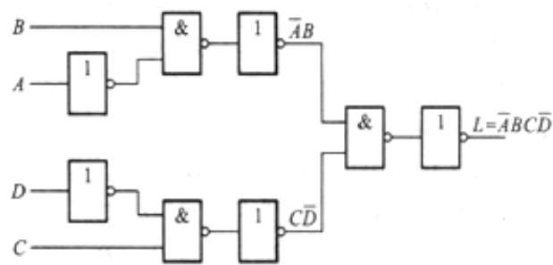

图 2-1

2．1.7 画出实现下列逻辑表达式的逻辑电路图，限使用非门和二输入与非门。

(1)L $=$ AB+AC

解：（1） $\begin{array} { r } { L = \overline { { A B + A C } } = \overline { { \overline { { A B } } \overline { { A C } } } } } \end{array}$

（2） $L = \overline { { D \big ( A + C \big ) } } = \overline { { D } } + \overline { { A + C } } = \overline { { \overline { { D } } + \overline { { A } } \overline { { C } } } } = \overline { { D } } \overline { { \overline { { A } } \overline { { C } } } }$   
（3） $L = { \overline { { \left( A + B \right) \left( C + D \right) } } } = { \overline { { A + B } } } + { \overline { { C + D } } } = { \overline { { { \overline { { A } } } { \overline { { B } } } + { \overline { { C } } } { \overline { { D } } } } } } = { \overline { { { \overline { { A } } } { \overline { { B } } } \cdot { \overline { { C } } } { \overline { { D } } } } } } = { \overline { { { \overline { { A } } } { \overline { { B } } } \cdot { \overline { { C } } } { \overline { { D } } } } } }$

根据化简后的表达式，可以画出相应的逻辑电路图如图 2-2 所示。

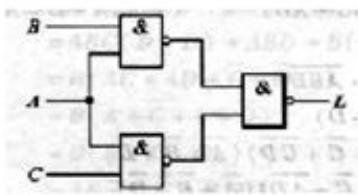

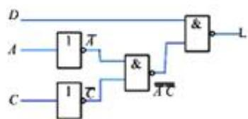  
（2）

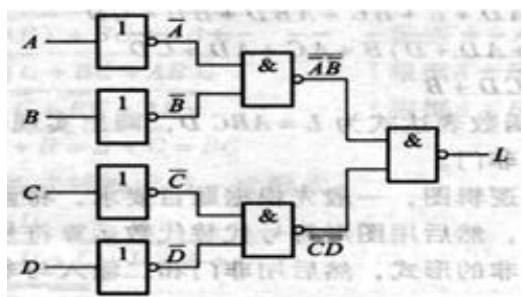  
  
图 2-2

2．1.8 已知逻辑函数表达式为 $_ \mathrm { L = A } \overline { { \mathrm { B } } } + \overline { { \mathrm { A } } }$ C，画出实现该式的逻辑电路图，限使用非门和二输入或非门。

解： $L = A \overline { { { B } } } + \overline { { { A } } } C = \overline { { { \overline { { { A } } } + B } } } + \overline { { { A + \overline { { { C } } } } } } = \overline { { { \overline { { { \overline { { { A } } } + B } } } + \overline { { { A + \overline { { { C } } } } } } } } }$

根据化简后的表达式，可以画出相应的逻辑电路图如图2-3 所示。

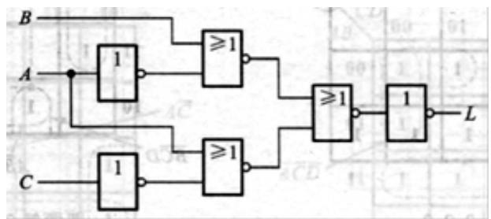  
图 2-3

# 2．2 逻辑函数的卡诺图化简法

2．2.1 将下列函数展开为最小项表达式：

解：因为表达式本身已经是与或形式，对于积项而言，若缺少某变量，只需先将该变量与其反变量相加，然后与积项相乘。

（1）L=ACD+BCD+ABCD=ACD（B+B）+BCD（A+A）+ABCD=ABCD+ABCD+ABCD+ABCD+ABCD函  
（2）L=A（B+C）=A+B+C=A+BC=A（B+B）（C+C）+BC（A+A）=ABC+ABC+ABC+ABC+ABC  
（3）Z=AB+ABD（B+CD）BA+A+ =ABABD（B+CD）=AB（A+B+D）（B+CD） =ABD（B+CD）=ABD+ABDCD =ABD（C+C）=ABCD+ABCD+8

2．2.2 已知函数L(A，B，C，D)的卡诺图如图2-4 所示，试写出函数L 的最简与或表达式。

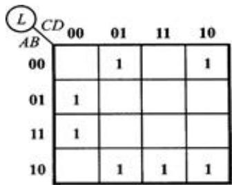  
图 2-4

解：将卡诺图中为 1 的项化简后，如图 2-5 所示。

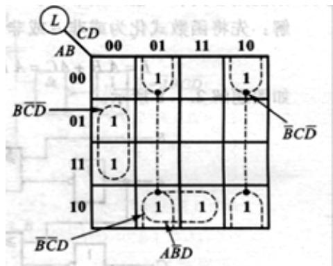  
图 2-5

因此，最简与或表达式为： 。 $L ( A , B , C , D ) = B \overline { { { C } } } \overline { { { D } } } + \overline { { { B } } } \overline { { { C } } } D + \overline { { { B } } } C \overline { { { D } } } + A \overline { { { B } } } D \nonumber _ { \mathrm { o n } }$

2．2.3 用卡诺图法化简下列各式：

$L ( A , B , C , D ) ~ = ~ \sum m ( 0 , 2 , 4 , 6 , 9 , 1 3 ) ~ + ~ \sum d ( 1 , \Big \{ 3 , 5 , 7 , 1 1 , 1 5 \Big \} )$   
$L ( A , B , C , D ) ~ = ~ \sum m ( 0 , 1 3 , 1 4 , 1 5 ) ~ + ~ \sum d ( 1 , 2 \ P 3 , 9 , 1 0 , 1 1 )$

解：各表达式的卡诺图，如图 2-6 所示。

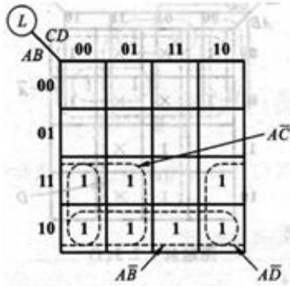

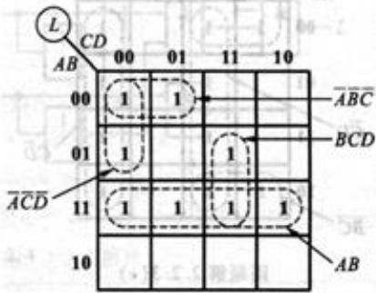

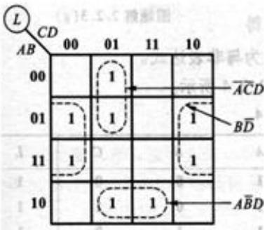  
（3）

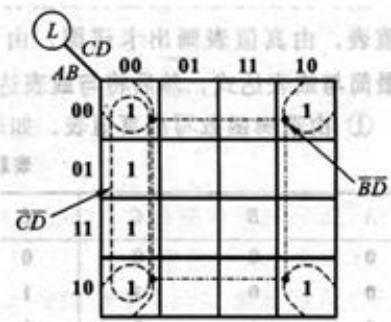  
（1）  
（2）

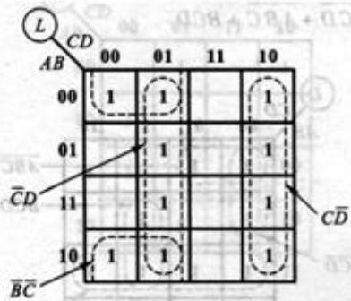

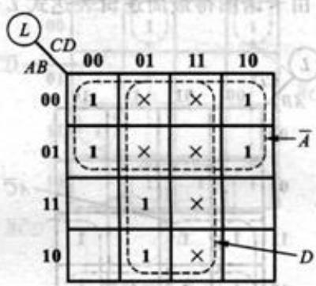  
（4） （ 5）

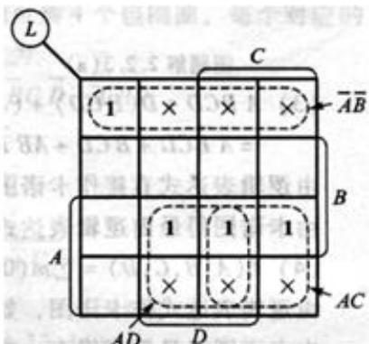  
（6） （7）  
图 2-6

化简后的最简逻辑表达为：

$( 1 ) ^ { L = A \overline { { { C } } } + A D + A B } ~ , ~ ( 2 ) ^  L = A B + \overline { { { A } } } \overline { { { C } } } \overline { { { D } } } + \overline { { { A } } } \overline { { { B } } } \overline { { { C } } } + B C D ~ ;$

(3)   
(5)

2．2.4 已知逻辑函数 $\mathrm { L } = \mathrm { A } \overline { { \mathrm { B } } } + \mathrm { B } \overline { { \mathrm { C } } } + \mathrm { C } \overline { { \mathrm { A } } }$ ，试用真值表、卡诺图和逻辑图(限用非门和与非门)表示。

解：（1）表达式 L 的真值表如表 2-7 所示。

表 2-7  

<table><tr><td>A</td><td>B</td><td>C</td><td>L</td><td>A</td><td>B</td><td>C</td><td>L</td></tr><tr><td>0</td><td>0</td><td>0</td><td>0</td><td>1</td><td>0</td><td>0</td><td>1</td></tr><tr><td>0</td><td>0</td><td>1</td><td>1</td><td>1</td><td>0</td><td>1</td><td>1</td></tr><tr><td>0</td><td>1</td><td>0</td><td>1</td><td>1</td><td>1</td><td>0</td><td>1</td></tr><tr><td>0</td><td>1</td><td>1</td><td>1</td><td>1</td><td>1</td><td>1</td><td>0</td></tr></table>

（2）可根据真值表直接画出卡诺图，如图 2-7（a）所示。  
（3）根据卡诺图得， ${ \cal L } = { \cal A } \overline { { { B } } } + { \cal B } \overline { { { C } } } + \overline { { { A } } } C = \overline { { { A } } } \overline { { { B } } } + { B } \overline { { { C } } } + \overline { { { A } } } \overline { { { C } } } = \overline { { { A } } } \overline { { { B } } } \cdot \overline { { { B } } } \overline { { { C } } } \cdot \overline { { { A } } } C$ ，用与门和与非门实现的逻辑图如图2-7（b）所示。

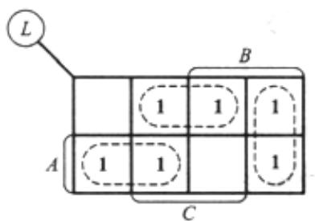

图 2-7  
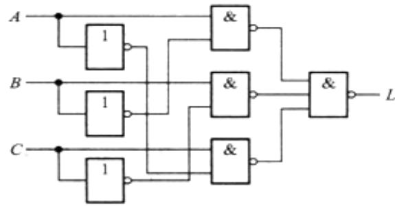  
（a） （b）

# 2．3 硬件描述语言 VerilogHDL 基础

2．3.1 在Verilog 中，下列标识符是否正确?

(1)system1 (2)2reg (3)FourBit_Adder (4)exec$ (5)_2to1mux

解：标识符通常由英文字母、数字、$符和下划线组成，并且必须以英文字母或下划线开始，不能以数字或$符开头。因此，(1)、(3)、(4)和(5)正确；(2)错误。

2．3.2 Verilog 规定的 4 种基本逻辑值是什么?

解：4 种基本逻辑值如表2-8 所示。

表 2-8  

<table><tr><td>0</td><td>逻辑 0、逻辑 假</td><td>\( \mathrm{x} \) 或 \( \mathrm{X} \)</td><td>不确定的值(未知状态)</td></tr><tr><td>1</td><td>逻辑 1、逻辑 真</td><td>\( \mathrm{z} \) 或 \( \mathrm{Z} \)</td><td>高阻态</td></tr></table>

2．3.3 在Verilog 程序中，如果没有说明输入变量、输出变量的数据类型，试问它们的数据类型是什么?

解：在Verilog 程序中，如果没有说明输入变量、输出变量的数据类型，则默认为位宽为1 的 wire 型变量。

2．3.4 下列Verilog 程序描述了图2-8 所示的电路，但程序中每一行有一个语法错误，试改正(注意：基本门级元件的调用名可以省略)。

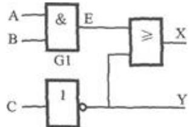  
图 2-8

```txt
module Ex1(A,B,C,X,Y)  
input A,B,C  
output X,Y  
reg E:  
and G1(A,B,E):  
NOT(Y,C);  
OR(X,E,Y);  
endmodule; 
```

解： 表 2-9

```csv
Module Ex1(A,B,C,X,Y) 结尾添加"；"  
inputA,B,C 结尾添加"；"  
outputX,Y 结尾添加"；"  
regE; 改为 wire E;  
and G1(A,B,E) 改为 and GI(E,A,B);  
NOT(Y,C); 改为 not(Y,C);  
OR(X,E,Y); 改为 or(X,E,Y);  
endmodule; 结尾去掉"；"
```

2．3.5 根据下面的HDL 描述，画出数字电路的逻辑图。

```fortran
module circuit(A,B,L):  
input A,B:  
output L:  
wire a1,a2,Anot,Bnot;  
and G1(a1,A,B):  
and G2(a2,Anot,Bnot);  
not(Anot,A):  
not(Bnot,B):  
or(L,a1,a2):  
endmodule 
```

解：如图2-9 所示。

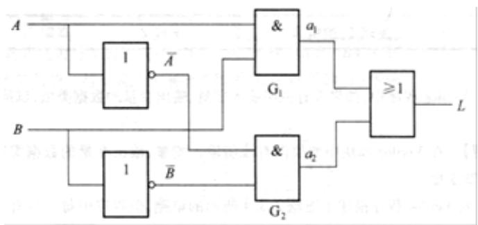  
图 2-9

# 2.3　名校考研真题详解

# 一、填空题

函数 F(A，B，C)＝∑m(0，2，4，5，7)，则其最大项表达式是 F(A，B，C) $=$ ( )(必须写出标准形式，不能用简写形式)。[北京邮电大学 2010 研]

【答案】 $( \overline { { { A } } } + \overline { { { B } } } + C ) ( A + \overline { { { B } } } + \overline { { { C } } } ) ( A + B + \overline { { { C } } } )$ 查看答案

【解析】 $F ( A , B , C ) = \prod { ( 1 , 3 , 6 ) } = ( \overline { { { A } } } + \overline { { { B } } } + C ) ( A + \overline { { { B } } } + \overline { { { C } } } ) ( A + B + \overline { { { C } } } )$

# 二、选择题

1．与 $A B C + A B C$ $\bar { B C }$ 函数式功能相等的函数表达式是( )。[成都理工大学 2006 研]

（A)ABC

（B）A

（C）ABC

（D）ABC+BC

【答案】B 查看答案

【解析】 $A B C + A { \overline { { B C } } } = A \left( B C + { \overline { { B C } } } \right) = A$

2．函数 $F ( x _ { 1 } , x _ { 2 } , x _ { 3 } , x _ { 4 } ) \ = \ \sum _ { \bf n } ( 0 , 1 , 2 , 4 , 6 , 8 , 9 , 1 2 , 1 4 )$ 其完全和表达式是( )。[电子科技大学 2006 研]

【答案】A 查看答案

【解析】将函数表达式的卡诺图（图2-10）化简可知 A 项成立。

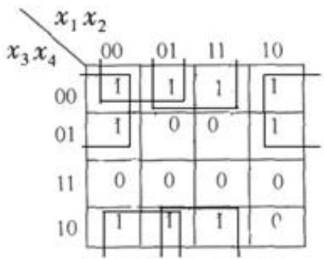

# 三、分析计算题

1．用代数化简法求下列函数的最简与-或表达式。[中国科技大学2008研]

$$
A D + A \bar {D} + A B + B \bar {C} + C \bar {D} + A C E + \bar {A} B \bar {D} F
$$

解：

$$
\begin{array}{l} A D + A \bar {D} + A B + B \bar {C} + C \bar {D} + A C E + \bar {A} B \bar {D} F \\ = A + A B + B \bar {C} + C \bar {D} + A C E + \bar {A} B \bar {D} F \\ = A + B \bar {C} + C \bar {D} + \bar {A} B \bar {D} F \\ = A + B \bar {C} + C \bar {D} + B \bar {D} F \\ = A + B \bar {C} + C \bar {D} \\ \end{array}
$$

2．将下列逻辑函数化为最简与或式。[北京科技大学 2011 研]

$$
F = \overline {{\bar {A}}} \bar {B} + \bar {B} \bar {D} + C D + \bar {A} \bar {C} + \bar {A} C D
$$

解：

$$
\begin{array}{l} F = \overline {{\bar {A} \bar {B} + B \bar {D}}} + C D + \bar {A} \bar {C} + \bar {A} C D \\ = \overline {{\overline {{A B}}}} \cdot \overline {{B \overline {{D}}}} + C D + \overline {{A C}} + \overline {{A C D}} \\ = (A + B) (\bar {B} + D) + C D + \bar {A} \bar {C} + \bar {A} C D \\ = A \bar {B} + A D + B D + C D + \bar {A} \bar {C} \\ = A \bar {B} + B D + C D + \bar {A} \bar {C} \\ = (A \bar {B} + B) (A \bar {B} + D) + (C + \bar {A} \bar {C}) (D + \bar {A} \bar {C}) \\ = (A + B) (A \bar {B} + D) + (C + \bar {A}) (D + \bar {A} \bar {C}) \\ = A \bar {B} + A D + B D + \bar {A} \bar {C} + \bar {A} D + C D \\ = A \bar {B} + \bar {A} \bar {C} + (A + \bar {A} + B + C) D \\ = \bar {A} \bar {B} + \bar {A} \bar {C} + D \\ \end{array}
$$

也可结合卡诺图化简。

3．将逻辑函数Y 化简为最简与-或式，并用最少的与非门实现。[北京理工大学 2006研]

$$
Y (A, B, C, D) = \sum \left(m _ {3}, m _ {4}, m _ {5}, m _ {7}, m _ {9}, m _ {1 0}, m _ {1 1}\right)
$$

给定约束条件为： $m _ { 0 } + m _ { 1 } + m _ { 2 } + m _ { 1 3 } + m _ { 1 4 } + m _ { 1 5 } = 0 _ { \circ }$

解：根据题意，可得函数式的卡诺图如图2-11 所示，化简得

$$
F = \bar {A} \bar {C} + A C + D
$$

题目要求用与非门实现，则可将 F 转化为

$$
F = \bar {A} \bar {C} + A C + D = \overline {{\bar {A} \bar {C} + A C + D}} = \bar {\bar {A}} \bar {C} \cdot \bar {A C} \cdot \bar {D}
$$

电路图如图2-12 所示。


  
图 2-11 图 2-12

# 第3章　逻辑门电路

# 3.1　复习笔记

# 一、MOS 逻辑门电路

# 1．逻辑电路的一般特性

# （1）输入和输出的高、低电平

数字电路中的高、低电压常用高、低电平来描述，并规定在正逻辑体制中，用逻辑1和0分别表示高、低电平。当逻辑电路的输入信号在一定范围内变化时，输出电压并不会改变，因此逻辑1和0对应一定的电压范围。

# （2）噪声容限

噪声容限表示门电路的抗干扰能力。在数字系统中，各逻辑电路之间的连线可能会受到各种噪声的干扰，这些噪声会叠加在工作信号上，只要其幅度不超过逻辑电平允许的最小值或最大值，则输出逻辑状态不会受影响。通常将这个最大噪声幅度称为噪声容限。

# （3）传输延迟时间

传输延迟时间是表征门电路开关速度的参数，它说明门电路在输入脉冲波形的作用下，其输出波形相对于输入波形延迟了多长时间。

# （4）功耗

# $\textcircled{1}$ 静态功耗

当电路的输出没有状态转换时的功耗。静态时，CMOS 电路的电流非常小，使得静态功耗非常低。

# $\textcircled{2}$ 动态功耗

CMOS 电路在输出发生状态转换时的功耗，它主要由两部分组成：

a．由于电路输出状态转换的瞬间，其等效电阻比较小，从而导致有较大的电流从电源

VDD 经 CMOS 电路流入地；

b．由于CMOS 管的负载通常是电容性的，因此当输出由高电平到低电平，或者由低电平到高电平转换时，会对电容进行充、放电，这个过程将增加电路的损耗。

# （5）延时-功耗积

理想的数字电路或系统，要求它既速度高，同时功耗低。用符号DP 表示延时-功耗积：

$$
D P = t _ {p d} P _ {D}
$$

式中， $t _ { p d }$ 为传输延迟时间， $P _ { D }$ 为门电路功耗。

DP 值越小，特性越理想。

# （6）扇入数和扇出数

门电路的扇入数取决于它的输入端的个数。

门电路的扇出数指其在正常工作情况下，所能带同类门电路的最大数目。

考虑如下两种情况：

# $\textcircled{1}$ 拉电流工作情况

负载电流从驱动门流向外电路，输出为高电平的扇出数表示：

$$
N _ {O H} = \frac {I _ {O H} (\text {驱 动 门})}{I _ {H} (\text {负 载 门})}
$$

# $\textcircled{2}$ 灌电流工作情况

负载电流从外电路流入驱动门，驱动门所能驱动同类门的个数：

$$
N _ {O L} = \frac {I _ {O L} (\text {驱 动 门})}{I _ {\text {正}} (\text {负 载 门})}
$$

# 2．MOS 开关及等效电路

# （1）MOS 管开关特性

图 3-1（a）为 N 沟道增强型 MOS 管构成的开关电路。 $\nu _ { _ { I } } = \nu _ { _ { G S } }$ $\nu _ { o } = \nu _ { D \mathbb { S } }$ $V _ { \tau }$ 为其开启电压。图 3-1（b）为 NMOS 管的输出特性曲线，其中斜线为直流负载线。

  
(a)MOS 管开关电路 (b)N 沟道 MOS 管的输出特性曲线  
图3-1MOS 管开关电路及其输出特性曲线

当 $\nu _ { _ { I } } < V _ { \tau }$ 时，MOS 管处于截止状态， ${ i _ { D } } ^ { = 0 }$ ，输出电压 $\nu _ { o } = V _ { D D }$ ，此时器件不损耗功率。

当 $\nu _ { \scriptscriptstyle { I } } > V _ { \tau }$ 时，且比较大，使得 $\nu _ { D S } > \nu _ { G S } - V _ { T }$ 时，MOS 管工作在饱和区。随着 的增加，$i _ { \bar { D } }$ 增加， $\nu _ { D S }$ 随之下降，MOS 管最后工作在可变电阻区。

# （2）等效电路

MOS 管相当于一个由 $\nu _ { G S }$ 控制的无触点开关，当输入为低电平时，MOS 管截止，相当于开关“断开”，输出高电平，其等效电路如图 3-2（a）所示；当输入为高电平时，MOS 管工作在可变电阻区，相当于开关“闭合”，输出低电平，其等效电路如图 3-2（b）所示。

  
(a)截止时的等效电路 (b)导通时的等效电路   
图3-2MOS 管的开关等效电路

# 3．CMOS 反相器

由N 沟道和P 沟道两种MOSFET 组成的电路称为互补MOS 或CMOS 电路。CMOS 反相器电路由两只增强型MOSFET 组成，其中 $\mathrm { T _ { N } }$ 为N 沟道结构，T 为P 沟道结构，电路如图3-3 所示。

  
图 3-3 MOS 反相器

当输入为高电平 $\nu _ { \scriptscriptstyle { I } } = V _ { \scriptscriptstyle { D D } }$ 时， $\nu _ { G S N } = V _ { D D }$ ， $\nu _ { \tt S G P } = 0$ ， $\mathrm { T _ { P } }$ 管截止， $\mathrm { T _ { N } }$ 管工作在可变电阻区，输出电压

$$
v _ {O L} = V _ {O L} \approx 0
$$

，通过两管的电流接近于零，功耗很低。

当输入为低电平 $\nu _ { { } _ { I } } = 0$ 时， $\nu _ { G S N } = 0$ ， $\nu _ { _ { S G P } } = V _ { D D }$ ， $\mathrm { T _ { N } }$ 管截止， $\mathrm { T _ { P } }$ 管工作在可变电阻区，输出电压

$$
v _ {O H} = V _ {O H} \approx V _ {D D}
$$

，通过两管的电流接近于零，功耗很低。

# 4．CMOS 其他逻辑门电路

# （1）与非门电路

电路如图3-4 所示，包括两个串联的N 沟道增强型MOS 管和两个并联P 沟道增强型MOS管。

  
图 3-4 CMOS 与非门

只要输入端A、B 有一个为低电平，就会使与它相连的NMOS 管截止，与它相连的PMOS管导通，输出为高电平。

当A、B 全为高电平时，才会使两个串联的NMOS 管都导通，使两个并联的PMOS 管都截止，输出为低电平。

该电路具有与非的逻辑功能，即 。 $L = { \overline { { A B } } }$

# （2）或非门电路

电路如图3-5 所示，包括两个并联的N 沟道增强型MOS 管和两个串联P 沟道增强型MOS管。

  
图 3-5 CMOS 或非门

只要输入端A、B 有一个为高电平，就会使与它相连的NMOS 管导通，与它相连的PMOS管截止，输出为低电平。

当A、B 全为低电平时，使两个并联的NMOS 管都截止，使两个串联的PMOS 管都导通，输出为高电平。

该电路具有或非的逻辑功能，即 。 $L = \overline { { A + B } }$

# （3）异或门电路

电路如图3-6 所示，它是由一级或非门和一级与或非门组成。逻辑功能为 $L = A \oplus B$ ，如在异或门后面增加一级反相器就构成异或非门，即同或门。

  
图3-6 异或门电路

# 5．CMOS 漏极开路门和三态输出门电路

# （1）CMOS 漏极开路门电路

漏极开路（OD）是指 CMOS 门输出电路只有NMOS 管，且它的漏极是开路的。OD 电路只能外接上拉电阻电路才能正常工作。

# （2）三态（TSL）输出门电路

输出不仅具有高、低电平，还具有高输出阻抗的第三态，称为高阻态，又称为禁止态。

三态输出门电路主要用于总线传输，任何时刻只有一个三态输出电路被使能（输出高、低电平），该电路的信号被传到总线上，而其他三态输出电路处于高阻状态。

# 6．CMOS 传输门

CMOS 传输门由一个 P 沟道和一个 N 沟道增强型 MOSFET 并联而成，如图 3-7 所示。

  
(a)电路 (b)符号  
图 3-7 CMOS 传输门

当 C 端接 0， 为高电平，此时 $\mathrm { T _ { N } }$ 、 $\mathrm { T _ { P } }$ 同时截止，输入和输出之间呈高阻态，传输门断开。

当 C 端接高电平， 为 0，在输入信号增大的过程中 $\mathrm { T _ { N } }$ 先导通， $\mathrm { T _ { P } }$ 后导通，总之至少有一个导通。

# 二、TTL 逻辑门电路

# 1．BJT 的开关特性

图 3-8（a）为 NPN 型硅管构成的开关电路，开关工作状态如图 3-8（b）所示。

  
(a)电路 (b)工作状态图解  
图3-8BJT 的开关工作状态

当输入为低电平时，BJT 的发射结为零偏（ $\nu _ { _ { B E } } = 0$ ），集电结为反向偏置（ $\nu _ { _ { B C } } = 0$ ），相当于开关断开，BJT 工作在截止状态，输出为高电平。

当输入为高电平时，集电极回路中的c、e 极之间近似于短路，相当于开关闭合，BJT 工作在饱和导通状态，输出为低电平。

NPN 型 BJT 截止、放大、饱和三种工作状态的特点如表 3-1 所示。

表3-1NPN 型BJT 截止、放大、饱和工作状态的特点

<table><tr><td colspan="2">工作状态</td><td>截止</td><td>放大</td><td>饱和</td></tr><tr><td colspan="2">条件</td><td>iB≈0</td><td>0&lt;iB&lt;ls/β</td><td>iB≥ls/β</td></tr><tr><td rowspan="4">工作特点</td><td>偏置情况</td><td>发射结零偏或反偏，集电结反偏</td><td>发射结正偏，集电结反偏</td><td>发射结和集电结均为正偏</td></tr><tr><td>集电极电流</td><td>i1≈0</td><td>iC=βiB</td><td>iC=Ics=Vcc/Rc且不随iB增加而增加</td></tr><tr><td>管压降</td><td>VCEO=VCC</td><td>VCE=VCC-iLRC</td><td>VCES=0.2V</td></tr><tr><td>c、e间等效内阻</td><td>很大，约为数百千欧，相当于开关断开</td><td>可变</td><td>很小，约为数百欧，相当于开关闭合</td></tr></table>

# 2．TTL 反相器的基本电路

图3-9 为TTL 反相器的基本电路，该电路由三部分组成， $\mathrm { T _ { 1 } }$ 组成电路的输入级， $\mathrm { T } _ { 3 }$ 、T 和二极管D 组成输出级，由 $\mathrm { T } _ { 2 }$ 组成的中间级作为输出级的驱动电路。

  
图 3-9 TTL 反相器的基本电路

（1）该电路实现反相器功能的工作原理：

$\textcircled{1}$ 当输入 $\nu _ { _ { I } } = V _ { \pi = 0 . 2 \ : \mathrm { V } }$ 时， $\mathrm { T _ { 1 } }$ 的发射结导通， $\mathrm { T } _ { 2 }$ 、 $\mathrm { T } _ { 3 }$ 都截止，而 $\mathrm { T } _ { 4 }$ 和 D 导通，输出为高电平。  
$\textcircled{2}$ 当输入 $\nu _ { _ { I } } = V _ { _ { I H } } = 3 . 6 \ : \mathrm { V }$ 时， $\mathrm { T _ { 1 } }$ 处于发射结和集电结倒置的放大状态， $\mathrm { T } _ { 2 }$ 、 $\mathrm { T } _ { 3 }$ 都饱和导通，而 $\mathrm { T } _ { 4 }$ 和D 截止，输出为低电平。

（2）电路中各组成部分的作用：

$\textcircled{1}$ 输入级的作用是提高工作速度；  
$\textcircled{2}$ 中间驱动级的作用是将 $\mathrm { T } _ { 2 }$ 的单端输入信号 $\mathbf { V } _ { 1 2 }$ 转换为互补的双端输出信号 $\mathbf { V } _ { 1 3 }$ 和 $\mathbf { V } _ { 1 4 }$ ，以驱动 $\mathrm { T } _ { 3 }$ 和 $\mathrm { T } _ { 4 }$ ；  
$\textcircled{3}$ 输出级采用推拉式以提高开关速度和带负载能力，同时输出级的两个管子总是一个导通一个截止，因此降低了静态功耗。

# 3．TTL 逻辑门电路

# （1）与非门电路

将基本TTL 反相器的输入级 $\mathrm { T _ { 1 } }$ 改为多发射极的BJT，就构成了与非门。如图 3-10 所示为有2个输入端的TTL 与非门。

当任一输入端为低电平时， $\mathrm { T _ { 1 } }$ 的发射结将正向偏置而导通， $\mathrm { T } _ { 2 }$ 、T 都截止，输出为高电平。

当全部输入端为高电平时， $\mathrm { T _ { 1 } }$ 将转入倒置放大状态， $\mathrm { T } _ { 2 }$ 和 $\mathrm { T } _ { 3 }$ 均饱和，输出为低电平。

这就实现了与非的逻辑功能，即 。 $L = { \overline { { A B } } }$

# （2）或非门电路

图 3-11 为 TTL 或非门逻辑电路。 $\mathrm { T _ { 1 A } }$ 、 $\mathrm { T } _ { 2 \mathrm { A } }$ 和 $\mathrm { R _ { 1 A } }$ 组成的电路与 $\mathrm { T _ { 1 B } }$ 、 $\mathrm { T } _ { 2 \mathrm { B } }$ 和 $\mathrm { R } _ { \mathrm { 1 B } }$ 组成的电路相同。

当A、B 两输入端均为低电平时， $\mathrm { T } _ { 2 \mathrm { A } }$ 和 $\mathrm { T } _ { 2 \mathrm { B } }$ 均截止， $\mathrm { T } _ { 3 }$ 截止， $\mathrm { T } _ { 4 }$ 和D 饱和导通，输出为高电平。  
当A、B 两输入端中有一个为高电平时， $\mathrm { T } _ { 2 \mathrm { A } }$ 和 $\mathrm { T } _ { 2 \mathrm { B } }$ 饱和， $\mathrm { T } _ { 3 }$ 饱和导通， $\mathrm { T } _ { 4 }$ 截止，输出为低电平。

这就实现了或非的逻辑功能，即 。 $L = \overline { { A + B } }$


  
图 3-10 与非门电路 图 3-11 TTL 或非门电路

4．集电极开路门和三态门电路

（1）集电极开路（OC）门

它是指TTL 门电路输出级BJT 管的集电极是开路的。OC 门只有外接上拉电阻电路才能正常工作，且可以承受较高电压和较大电流。

（2）三态（TSL）输出门电路

TTL 三态门与CMOS 三态门一样，是在普通门电路的基础上，增加控制电路构成的。

# 三、逻辑描述中的几个问题

1．正负逻辑的规定

正逻辑体制：高电平用逻辑 1表示，低电平用逻辑0表示。

负逻辑体制：高电平用逻辑 0表示，低电平用逻辑1表示。

正逻辑和负逻辑两种体制不牵涉逻辑电路本身的结构问题，但根据所选正负逻辑的不同，即使同一电路也具有不同的逻辑功能。

2．正负逻辑的等效变换

在工程实践中，一般采用正逻辑体制，可以按下列方式进行两种逻辑体制的互换：

与非 $\Longleftrightarrow$ 或非；与 $\Longleftrightarrow$ 或；非 $\Longleftrightarrow$ 非。

# 3.2　课后习题详解

# 3．1MOS 逻辑门电路

3．1.1 根据表3-2 所列的三种逻辑门电路的技术参数，试选择一种最适合工作在高噪声环境下的门电路。

表3-2 逻辑门电路的技术参数表  

<table><tr><td></td><td>VOH(min)/V</td><td>VOL(max)/V</td><td>VIH(min)/V</td><td>VIL(max)/V</td></tr><tr><td>逻辑门A</td><td>2.4</td><td>0.4</td><td>2</td><td>0.8</td></tr><tr><td>逻辑门B</td><td>3.5</td><td>0.2</td><td>2.5</td><td>0.6</td></tr><tr><td>逻辑门C</td><td>4.2</td><td>0.2</td><td>3.2</td><td>0.8</td></tr></table>

解：分别求得各个逻辑门的噪声容限如下：

$$
\begin{array}{l} V _ {\mathrm {N H A}} = V _ {\mathrm {O H (m i n)}} - V _ {\mathrm {I H (m i n)}} = 2. 4 \mathrm {V} - 2 \mathrm {V} = 0. 4 \mathrm {V} \\ V _ {\mathrm {N L A}} = V _ {\mathrm {I L (m a x)}} - V _ {\mathrm {O L (m a x)}} = 0. 8 \mathrm {V} - 0. 4 \mathrm {V} = 0. 4 \mathrm {V} \\ V _ {\mathrm {N H B}} = V _ {\mathrm {O H (m i n)}} - V _ {\mathrm {I H (M I N)}} = 3. 5 \mathrm {V} - 2. 5 \mathrm {V} = 1 \mathrm {V} \\ V _ {\mathrm {N L B}} = V _ {\mathrm {I L (m a x)}} - V _ {\mathrm {O L (m a x)}} = 0. 6 \mathrm {V} - 0. 2 \mathrm {V} = 0. 4 \mathrm {V} \\ V _ {\mathrm {N H C}} = V _ {\mathrm {O H (m i n)}} - V _ {\mathrm {I H (m i n)}} = 4. 2 \mathrm {V} - 3. 2 \mathrm {V} = 1 \mathrm {V} \\ V _ {\mathrm {N L C}} = V _ {\mathrm {I L (m a x)}} - V _ {\mathrm {O L (m a x)}} = 0. 8 \mathrm {V} - 0. 2 \mathrm {V} = 0. 6 \mathrm {V} \\ \end{array}
$$

电路的噪声容限越大，抗干扰能力越强，所以选择逻辑门C。

3．1.2 求下列情况下 TTL 逻辑门的扇出数：(1)74LS 门驱动同类门；(2)74LS 门驱动74ALS 系列 TTL 门。

解：查表得74LS 系列电流参数的数值为 $\mathrm { I _ { O H } { = } 0 . 4 \ m A }$ ， $\mathrm { I _ { O L } } { = } 8 \ \mathrm { m A }$ ， $\mathrm { I _ { I H } } { = } 0 . 0 2 \ \mathrm { m A }$ ， $\mathrm { I _ { I L } } = 0 . 4$ mA；74ALS 系列输入电流参数的数值为 $\mathrm { I _ { I H } } { = } 0 . 0 2 \ \mathrm { m A }$ ， $\mathrm { I _ { I L } } { = } 0 . 1 \ \mathrm { m A }$ ，其中省略了表示电流流向的负号。

74LS 系列驱动同类门时，输出为高电平的扇出数为

$$
N _ {\mathrm {O H}} = \frac {I _ {\mathrm {O H}}}{I _ {\mathrm {I H}}} = \frac {0 . 4 \mathrm {m A}}{0 . 0 2 \mathrm {m A}} = 2 0
$$

输出为低电平的扇出数为

$$
N _ {\mathrm {O L}} = \frac {I _ {\mathrm {O L}}}{I _ {\mathrm {I L}}} = \frac {8 \mathrm {m A}}{0 . 4 \mathrm {m A}} = 2 0
$$

所以，74LS 系列驱动同类门时的扇出数 $\mathrm { N } _ { 0 } { = } 2 0$ 。

(2)同理，74LS 系列驱动 74ALS 系列时，有

$$
\begin{array}{r l} N _ {\mathrm {O H}} & = \frac {I _ {\mathrm {O H}}}{I _ {\mathrm {I H}}} = \frac {0 . 4 \mathrm {m A}}{0 . 0 2 \mathrm {m A}} = 2 0 \\ N _ {\mathrm {O L}} & = \frac {I _ {\mathrm {O L}}}{I _ {\mathrm {I L}}} = \frac {8 \mathrm {m A}}{0 . 1 \mathrm {m A}} = 8 0 \end{array}
$$

所以74LS 系列驱动74ALS 系列时，扇出数 $\mathrm { N } _ { 0 } { = } 2 0$ 。

3．1.3 根据表3-3 所列的三种逻辑门电路的技术参数，计算出它们的延时-功耗积，并确定哪一种逻辑门的性能最好。

表3-3 逻辑门电路的技术参数表  

<table><tr><td></td><td>tPLH/ns</td><td>tPHL/ns</td><td>PD/mW</td></tr><tr><td>逻辑门A</td><td>1</td><td>1.2</td><td>16</td></tr><tr><td>逻辑门B</td><td>5</td><td>6</td><td>8</td></tr><tr><td>逻辑门C</td><td>10</td><td>10</td><td>1</td></tr></table>

解：延时-功耗积 $D P = t _ { P D } P _ { D } = \frac { t _ { P L H } + t _ { P H L } } { 2 } \bullet P _ { D }$ tpLH+tpHL.PD ，由此可得

$$
D P _ {A} = 1 7. 6 p J, \quad D P _ {B} = 4 4 p J, \quad D P _ {C} = 1 0 p J
$$

故逻辑门C 的性能最好。

3．1.4 已知图 3-12 所示各 NOSFET 管的 $| \mathrm { V } _ { \mathrm { T } } | { = } 2 \mathrm { V }$ ，忽略电阻上的压降，试确定其工作状态(导通或截止)。

  
(a)

  
(b)

  
(c)

  
(d)   
图 3-12

解：N 沟道增强型 MOS 管，开启电压 $\mathrm { V T } { > } 0$ ，当 $\nu _ { G S } \geq V _ { T } \mathrm { ~ _ { H } ~ } ^ { \nu } { _ { D S } } \geq \left( \nu _ { G S } - V _ { T } \right)$ 时，饱和导通；而 $\nu _ { G S } < V _ { T }$ 时，截止。P 沟道 MOS，开启电压 $\mathrm { V T } { < } 0$ ，当 $\nu _ { G S } \leq V _ { T }$ 且

时，饱和导通；而 时，截止。故（a）饱和导通；（b）截止； $\nu _ { D \mathscr { S } } \leq \left( \nu _ { G \mathscr { S } } - V _ { T } \right)$ $\nu _ { G S } > V _ { T }$ （c）截止；（d）饱和导通。

3．1.5 为什么说 74HC 系列 CMOS 与非门在 $+ 5 \mathrm { \mathrm { ~ V ~ } }$ 电源工作时，输入端在以下四种接法下都属于逻辑0：(1)输入端接地；(2)输入端接低于 $1 . 5 \mathrm { V }$ 的电源；(3)输入端接同类与非门的输出低电压 $0 . 1 \mathrm { ~ V ~ }$ ；(4)输入端接 $1 0 \mathrm { k } \Omega$ 的电阻到地。

解：对于 74HC 系列 CMOS 电路，有 $\mathrm { V _ { I L } } { = } 1 . 5 \ : \mathrm { V }$ ， $\mathrm { V _ { O L } } { = } 0 . 1 \mathrm { V }$ 且其栅极电流非常小，通常小于 1 。（1）

$$
v _ {i} = 0 V; \quad (2) v _ {i} <   1. 5 V; \quad (3) v _ {i} = 0. 1 V; \quad (4) v _ {i} <   1 0 m V = 0. 0 1 V 。
$$

因此，四种接法均为逻辑0。

3．1.6 试分析图3-13 所示的电路，写出其逻辑表达式，说明它是什么逻辑电路?

  
图 3-13

$L = \overline { { \left( A + B \right) X } } = \overline { { \left( A + B \right) \overline { { A B } } } } = A B + \overline { { A } } \overline { { B } } = A \odot B$

该电路是同或逻辑电路。

3．1.7 求图3-14 所示电路的输出逻辑表达式。

  
图 3-14

解： $L = { \overline { { A B } } } \cdot { \overline { { B C } } } \cdot { \overline { { D } } } \cdot { \cal E }$ 。

3．1.8 用三个漏极开路与非门74HC03 和一个TTL 与非门74LS00 实现图3-3 所示的电路，已知 CMOS 管截止时的漏电流，Ioz＝5μA，试计算 Rp(min)和 Rp(max)。 $\mathrm { I } _ { \mathrm { o z } } { = } 5 \mu \mathrm { A }$ $\mathrm { R } _ { \mathrm { p ( m i n ) } }$ $\mathrm { R } _ { \mathrm { p ( m a x ) } }$

解：在拉电流情况下，第一级的每个门输出均为高电平，则

$$
R _ {P (m a x)} = \frac {V _ {D D} - V _ {O H (m i n)}}{3 I _ {O Z} + I _ {I H (m a x)}} = \frac {5 - 3 . 8 4}{3 \times 5 \mu A + 0 . 0 2 m A} \approx 3 3. 1 K \Omega
$$

在灌电流情况下，第一级有一个门输出为低电平，则

$$
R _ {P (m i n)} = \frac {V _ {D D} - V _ {O L (m a x)}}{I _ {O L (m a x)} - I _ {I L (m a x)}} = \frac {(5 - 0 . 3 3) V}{(4 - 0 . 4) m A} \approx 1. 3 K \Omega
$$

故上拉电阻的范围为 $1 . 3 { \sim } 3 3 . 1 K \varOmega$ 。

3．1.9 图3-15 表示三态门作总线传输的示意图，图中 $\mathbf { n }$ 个三态门的输出接到数据传输总线， $\mathrm { D } _ { 1 }$ 、 $\mathrm { D } _ { 2 }$ 、…、 $\mathrm { D } _ { \mathrm { n } }$ 为数据输入端， $\mathrm { C S _ { 1 } }$ 、 $\mathrm { C S } _ { 2 }$ 、…、 $\mathrm { C S } _ { \mathrm { n } }$ 为片选信号输入端。试问：(1)CS 信号如何进行控制，以便数据 $\mathrm { D } _ { 1 }$ 、 $\mathrm { D } _ { 2 }$ 、…、 $\mathrm { D } _ { \mathrm { n } }$ 通过该总线进行正常传输；(2)CS 信号能否有两个或两个以上同时有效?如果 CS 出现两个或两个以上有效，可能发生什么情况?(3)如果所有CS 信号均无效，总线处在什么状态?

  
图 3-15

解：（1）根据数据传输的速度，分时给各个三态门的片选信号输入端以正脉冲信号。

（2）CS 信号不能有两个或两个以上同时有效，否则两个信号在总线上冲突。  
（3）如果所有CS 信号均无效，总线处在高阻状态。

3．1.10 CMOS 集成芯片4007中包含两个互补对和一个反相器，其引出端如图 3-16 所示，试分别连接：(1)三个反相器；(2)3 输入端或非门；(3)3 输入端与非门；(4)或与非门

；(5)传输门(一个非门控制两个传输门分时传送)。 $\left[ L = \overline { { C \left( A + B \right) } } \right]$


  
图 3-16

解：（1）如图 3-17（a）所示；（2）如图 3-17（b）所示；（3）如图 3-17（c）所示；（4）如图3-17（d）所示；（5）如图3-17（e）所示。


  
（a）


  
（b）  
（c）  
（d）


  
（e）  
图 3-17

3．1.11 试分析图3-18 所示某CMOS 器件的电路，写出其逻辑表达式，说明它是什么逻辑电路。

  
图 3-18

解：传输门的控制信号为 B 及 $\overline { { B } }$ ，当 $\mathrm { B } { = } 0$ 时，传输门导通，当 $\mathrm { B } = 1$ 时，传输门截止。且当 ${ \overline { { B } } } = 1$ 时， $\mathrm { T } _ { 1 } \mathrm { T } _ { 2 } \mathrm { T } _ { 3 }$ 不工作，否则 $\mathrm { T } _ { 1 } \mathrm { T } _ { 2 } \mathrm { T } _ { 3 }$ 共同构成反相器。真值表如表 3-4 所示。

表 3-4  

<table><tr><td>A</td><td>B</td><td>L</td></tr><tr><td>0</td><td>0</td><td>0</td></tr><tr><td>0</td><td>1</td><td>1</td></tr><tr><td>1</td><td>0</td><td>1</td></tr><tr><td>1</td><td>1</td><td>0</td></tr></table>

化简得： ${ \cal { L } } = \overline { { { A } } } \overline { { { B } } } + \cal { A } \overline { { { B } } } = \cal { A } \oplus \cal { B }$ ，故为异或门。

3．1.12 试分析图 3-19 所示的 CMOS 电路，说明它们的逻辑功能。


  
图 3-19

解：（1）由图 3-19（a）知，当 $\overline { { E N } } = 0$ 时， $T _ { P 2 } _ { \mathcal { F } \mathbb { H } } T _ { N 2 }$ 均导通， $T _ { P 1 }$ 和 $T _ { x 1 }$ 构成的反相器正常工作，输出 $0 L = \overline { { A } }$ ；当 $\overline { { E N } } = 1$ 时， $T _ { P 2 }$ 和 $T _ { N 2 }$ 均截止，不管 A 的状态如何，输出段均为高阻态，故该电路为低电平使能三态非门。其符号如图 3-20（a）所示。

（2）由图 3-19（b）知，当 $\overline { { E N } } = 0$ 时， $T _ { P 2 }$ 导通，或非门打开， $T _ { P 1 }$ 和 $T _ { x 1 }$ 构成的反相器正常工作， $L = A$ ；当 $\overline { { E N } } = 1$ 时， $T _ { P 2 }$ 截止，或非门输出低电平， $T _ { x 1 }$ 截止，输出端处于高阻态，故该电路为低电平使能三态缓冲器。其符号如图 3-20（b）所示。

（3）分析方法同（b），为高电平使能三态缓冲器。其符号如图 3-20（c）所示。  
（4）分析方法同（a），为低电平使能三态非门。其符号如图 3-20（d）所示。

  
图 3-20

3．1.13 试分析图3-21 所示传输门构成的电路，写出其逻辑表达式，说明它是什么逻辑电路。

  
图 3-21

解：该逻辑电路的真值表如表 3-5 所示。

表 3-5  

<table><tr><td>A</td><td>B</td><td>TG1</td><td>TG2</td><td>L</td></tr><tr><td>0</td><td>0</td><td>导通</td><td>断开</td><td>0</td></tr><tr><td>0</td><td>1</td><td>导通</td><td>断开</td><td>1</td></tr><tr><td>1</td><td>0</td><td>断开</td><td>导通</td><td>1</td></tr><tr><td>1</td><td>1</td><td>断开</td><td>导通</td><td>0</td></tr></table>

由真值表可得： ${ \cal { L } } = \overline { { { A } } } \overline { { { B } } } + \cal { A } \overline { { { B } } } = \cal { A } \oplus \cal { B }$ ，电路实现异或功能。

3．1.14 由CMOS 传输门构成的电路如图3-22 所示，试列出其真值表，说明该电路的逻辑功能。

  
图 3-22

解：真值表如表 3-5 所示。

表 3-5  

<table><tr><td>CS</td><td>A</td><td>B</td><td>L</td></tr><tr><td>1</td><td>×</td><td>×</td><td>高阻态</td></tr><tr><td>0</td><td>0</td><td>0</td><td>1</td></tr><tr><td>0</td><td>0</td><td>1</td><td>0</td></tr><tr><td>0</td><td>1</td><td>0</td><td>0</td></tr><tr><td>0</td><td>1</td><td>1</td><td>0</td></tr></table>

由真值表可得： $L = \overline { { A + B } }$ ，电路为或非门。

3．1.15 写出图3-23 所示电路的逻辑表达式。

  
图 3-23

解： $L = \overline { { { A B C + A D E + E F A + E F G } } } = \overline { { { A \big ( B C + D E \big ) + E F ( A + G ) } } } \mathrm { ~ , ~ }$

3．1.16 写出图3-24 所示电路的逻辑表达式。

  
图 3-24

解：

  
图 3-25

分析图3-25 中间电路可得真值表如表3-6 所示。

表 3-6  

<table><tr><td>A</td><td>X</td><td>T1</td><td>T2</td><td>Y</td></tr><tr><td>0</td><td>0</td><td>截止</td><td>截止</td><td>1</td></tr><tr><td>0</td><td>1</td><td>导通</td><td>截止</td><td>0</td></tr><tr><td>1</td><td>0</td><td>截止</td><td>导通</td><td>0</td></tr><tr><td>1</td><td>1</td><td>截止</td><td>截止</td><td>1</td></tr></table>

即有 $Y = A \odot X$ 。而 $X = { \overline { { B } } }$ ， $L = \overline { { Y } }$ ，所以 $L = A \oplus X = A \oplus { \overline { { B } } }$

则有 $\scriptstyle { \cal L } = { \cal A } \odot { \cal B }$ ，即该电路为同或门。

# 3．2 TTL 逻辑门电路

3．2.1 由 BJT 构成的反相器如图 3-26 所示， $\mathrm { V } _ { \mathrm { c c } } { = } { + } 5 \mathrm { V }$ ， $\mathrm { V _ { B E } } { = } 0 . 7 \ : \mathrm { V }$ ， $\beta { = } 1 0 0$ 。当输入 $\mathbf { V } _ { 1 }$ 为5V 时，输出为 $0 . 2 \mathrm { ~ V ~ }$ ，试计算 $\mathrm { R _ { b } } ~ / ~ \mathrm { R _ { c } }$ 的最大比值。

  
图 3-26

解：三极管处于饱和放大状态，此时电流放大倍数 $\beta = \frac { i _ { c } } { i _ { B } } < 1 0 0 \mathrm { ~ } \ i$ i

$i _ { B } = \frac { y _ { 1 } - 0 . 7 } { R _ { b } } = \frac { 5 - 0 . 7 } { R _ { b } } = \frac { 4 . 3 } { R _ { b } } \ ,$ 输入回路满足： R R R

输出回路满足： $i _ { C } = \frac { V _ { C C } - \nu _ { 0 } } { R _ { c } } = \frac { 5 - 0 . 2 } { R _ { c } } = \frac { 4 . 8 } { R _ { c } }$ R R

BJT 工作在饱和区时 $i _ { c } \le \beta i _ { B }$ ，所以联立得 $\frac { R _ { b } } { R _ { c } } \leq \frac { 4 3 0 } { 4 . 8 } \approx 9 0$ 。

3．2.2 为什么说TTL 与非门的输入端在以下四种接法下，都属于逻辑 1：(1)输入端悬空；(2)输入端接高于 2V 的电源；(3)输入端接同类与非门的输出高电压 $3 . 6 \mathrm { V }$ ；(4)输入端接 10$\mathrm { k } \Omega$ 的电阻到地。

解：对于 TTL 门电路，有 $\mathrm { V } _ { \mathrm { I H } } { = } 2 \mathrm { V }$ ， $\mathrm { V } _ { \mathrm { O H } } { = } 2 . 7 \mathrm { V }$

（1）如图 3-27 所示，此时 $\mathrm { T } _ { 2 } \mathrm { T } _ { 3 }$ 饱和导通，输出为低电平，故悬空相当于逻辑 1；

（2） $\nu _ { i } > 2 V$ ；（3） $\nu _ { i } = 0 . 1 V$ ； （4）10 KΩ 的电阻，可以使 。 $1 0 \mathrm { K } \Omega$ $\nu _ { i } > 2 V$

因此，四种接法均为逻辑1。

  
图 3-27

3．2.3 设有一 74LS04 反相器驱动两个 74ALS04 反相器和四个 74LS04 反相器。(1)问驱动门是否超载?(2)若超载，试提出一改进方案；若未超载，问还可增加几个 74LS04 门?

解：（1）如图3-28 所示，查表得：74LS04： $\mathrm { I _ { O H } { = } 0 . 4 m A }$ ， $\mathrm { I _ { O L } } { = } 8 \ \mathrm { m A }$ ， $\mathrm { I } _ { \mathrm { I H } } { = } 0 . 0 2$ mA， $\mathrm { I _ { I L } } { = } 0 . 4 \ : \mathrm { m A }$ ；74ALS 系列输入电流参数的数值为 $\mathrm { I _ { I H } } { = } 0 . 0 2 \ \mathrm { m A }$ ， $\mathrm { I _ { I L } } { = } 0 . 1 \ \mathrm { m A }$ ，省略表示方向的负号。

  
图 3-28

拉电流负载情况，第一级输出为高电平，若不超载，则需满足 $I _ { O H L S } \geq 4 I _ { I H L S } + 2 I _ { I H L I S }$ ，而 $0 . 4 \geq 4 \times 0 . 0 2 + 2 \times 0 . 0 2$ 。

灌电流负载情况，第一级输出为低电平，若不超载，则需满足 $I _ { O L L S } \geq 4 I _ { I L L S } + 2 I _ { I L A L S }$ ，而$8 \geq 4 \times 0 . 4 + 2 \times 0 . 1 _ { \ }$ 。

因此没有超载。

（2）拉电流时，余量满足 $0 . 4 - { \bigl ( } 4 \times 0 . 0 2 + 2 \times 0 . 0 2 { \bigr ) } = 0 . 2 8 = 1 4 I _ { L H L S }$

灌电流时，余量满足 ${ 8 - ( 4 { \times } 0 . 4 + 2 { \times } 0 . 1 ) = 6 . 2 { \approx } 1 5 I _ { \pi L S } }$

故最多还可增加14个74LS04 驱动门。

3．2.4 图3-29 所示为集电极开路门74LS03 驱动5个CMOS 逻辑门，已知OC 门输出管截止时的漏电流， $\mathrm { I _ { o z } } { = } 0 . 2 \ \mathrm { m A }$ ；负载门的参数为： $\mathrm { V _ { I H ( m i n ) } { = } } 4 \mathrm { V }$ ， $\mathrm { V } _ { \mathrm { I L ( m a x ) } } { = } 1 \mathrm { V }$ ， $\mathrm { I _ { I L } } { = } \mathrm { I _ { I H } } { = } 1$ $\mu \mathrm { A }$ 。试计算上拉电阻的值。

  
图 3-29

解：在拉电流情况下，74LS03 输出高电平，此时由于 $V _ { O H ( n a x ) } = 2 . 7 V < V _ { I H ( n i n ) } = 4 V$ ，取$V _ { O H ( m a x ) } = 4 V$ 得

$$
R _ {P (m a x)} = \frac {V _ {D D} - V _ {O H (m i n)}}{5 I _ {I H} + I _ {O Z}} = \frac {(5 - 4) V}{5 \times 1 \mu A + 0 . 2 m A} \approx 4. 9 K \Omega
$$

在灌电流情况下，74LS03 输出低电平，得

$$
R _ {P (m i n)} = \frac {V _ {D D} - V _ {O L (m a x)}}{I _ {O L (m a x)} - 5 I _ {I L}} = \frac {(5 - 0 . 5) V}{8 m A - 5 \mu A} \approx 0. 5 6 K \Omega
$$

故上拉电阻的范围为 $0 . 5 6 { \sim } 4 . 9 ^ { X \varOmega }$ 。

3．2.5 图 3-30 表示一 2 输入端 BiCMOS 与非门电路，试分析该电路是怎样实现与非逻辑关系 $L = A \cdot B$ 的。

  
图 3-30

解：当A、B 均为高电平时 $\mathrm { M } _ { \mathrm { N A } }$ 和 $\mathrm { M } _ { \mathrm { N B } }$ 均导通， $\mathrm { { M _ { P A } } }$ 和 $\mathrm { M _ { P B } }$ 均截止，输出L 为低电平。此时 $\mathrm { M _ { I A } }$ 和 $\mathbf { M } _ { \mathrm { I B } }$ 饱和导通，为 $\mathrm { T _ { 1 } }$ 基区的存储电荷提供一条释放通路。

当A、B 中有一个为低电平时， $\mathrm { M } _ { \mathrm { N A } }$ 或 $\mathrm { M } _ { \mathrm { N B } }$ 中有一个截止， $\mathrm { M _ { I A } }$ 或 $\mathbf { M } _ { \mathrm { I B } }$ 中也有一个截止，而 $\mathrm { { M _ { P A } } }$ 或 $\mathrm { M } _ { \mathrm { P B } }$ 导通，使输出为高电平； $\mathrm { V _ { D D } }$ 通过导通的 $\mathrm { { M _ { P A } } }$ 或 $\mathrm { M _ { P B } }$ 使 $\mathrm { M } _ { 2 }$ 导通，为 $\mathrm { T } _ { 2 }$ 基区的存储电荷提供一条释放通路。

# 3．3 涉及耦合逻辑门电路

3．3.1 某 ECL 门电路在 $2 5 \mathrm { { ^ \circ C } }$ 时的参数为： $\mathrm { V } _ { \mathrm { I L ( m a x ) } } { = } { - } 1 . 4 7 5 \mathrm { V }$ ， $\mathrm { V _ { I H ( m i n ) } { = } { - } 1 . 1 0 5 \ V }$ ，VOL(max)$= - 1 . 6 3 0 \mathrm { V }$ ， $\mathrm { V _ { O H ( m i n ) } { = } { - } 0 . 9 8 0 \ V } .$ 。试计算它的噪声容限。

解：根据公式可得，高、低电平分别为：

$$
\begin{array}{l} V _ {\mathrm {N H}} = V _ {\mathrm {O H (m i n)}} - V _ {\mathrm {I H (m i n)}} = - 0. 9 8 0 \mathrm {V} - (- 1. 1 0 5 \mathrm {V}) = 0. 1 2 5 \mathrm {V} \\ V _ {\mathrm {N L}} = V _ {\mathrm {I L (m a x)}} - V _ {\mathrm {O L (m a x)}} = - 1. 4 7 5 \mathrm {V} - (- 1. 6 3 0 \mathrm {V}) = 0. 1 5 5 \mathrm {V} \end{array}
$$

# 3．4 砷化镓逻辑门电路

3．4.1 试计算教材3.4节介绍的两种砷化镓逻辑门电路的噪声容限，并判断哪种电路的抗干扰能力强。

解：直接耦合FET 逻辑电路的噪声容限为：

$$
V _ {\mathrm {N H}} = V _ {\mathrm {O H (m i n)}} - V _ {\mathrm {I H (m i n)}} = 0. 7 \mathrm {V} - 0. 6 3 \mathrm {V} = 0. 0 7 \mathrm {V}
$$

$$
V _ {\mathrm {N L}} = V _ {\mathrm {I L} (\max)} - V _ {\mathrm {O L} (\max)} = 0. 5 4 \mathrm {V} - 0. 1 7 \mathrm {V} = 0. 3 7 \mathrm {V}
$$

耗尽型FET 逻辑电路的噪声容限为：

$$
V _ {\mathrm {N H}} = V _ {\mathrm {O H (m i n)}} - V _ {\mathrm {I H (m i n)}} = 0. 7 \mathrm {V} - (- 0. 1 6 \mathrm {V}) = 0. 8 6 \mathrm {V}
$$

$$
V _ {\mathrm {N L}} = V _ {\mathrm {I L (m a x)}} - V _ {\mathrm {O L (m a x)}} = - 0. 2 6 \mathrm {V} - (- 1. 2 7 \mathrm {V}) = 1. 0 1 \mathrm {V}
$$

因此，耗尽型FET 逻辑电路的抗干扰能力强。

# 3．5 逻辑描述中的几个问题

3．5.1 试对图3-31 所示电路的逻辑门进行变换，使其可以用单一的或非门实现。

  
图 3-31

解：由图3-31 可得

$$
L = (A + B) (C + D) = \overline {{(A + B) (C + D)}} = \overline {{A + B + C + D}}
$$

故用单一的或非门实现的电路图如图 3-32 所示。

  
图 3-32

3．5.2 电路如图 3-33 所示，试用与非门实现。

  
图 3-33

解：由图3-33 可得

$$
L = A B + C D + B C = \overline {{\overline {{A B}} + C D + B C}} = \overline {{\overline {{A B}} \cdot \overline {{C D}} \cdot \overline {{B C}}}}
$$

故用与非门实现的电路图如图 3-34 所示。

  
图 3-34

# 3．6 逻辑门电路使用中的几个实际问题

3．6.1 当CMOS 和TTL 两种门电路相互连接时，要考虑哪几个电压和电流参数?这些参数应满足怎样的关系?

解：需要考虑的电压和电流参数： $\textcircled{1}$ 逻辑电平兼容问题； $\textcircled{2}$ 扇出问题。

这些参数应满足的关系： $V _ { \mathrm { o H ( m a n ) } } \geqslant V _ { \mathrm { m ( m a n ) } } \quad V _ { \mathrm { o L ( m a x ) } } \leqslant V _ { \mathrm { m a x ) } }$

$$
I _ {\mathrm {O L} (\max )} \geqslant I _ {\mathrm {I L} (\text {t o t a l})} I _ {\mathrm {O H} (\max )} \geqslant I _ {\mathrm {I H} (\text {t o t a l})}
$$

3．6.2 当用74LS 系列TTL 电路去驱动74HC 系列CMOS 电路时，试简述其设计思路，是否需要接口电路?计算其扇出数，并对接口电路就开关速度和功耗两方面做出评价(设用一个74LS 逻辑门作为驱动器件，并且它的高电平输出时的漏电流为 $0 . 2 \mathrm { m A }$ )。

解：（1）查表得 74LS 系列 TTL 电路：

$$
V _ {O H (m i n)} = 2. 7 V, \quad V _ {O L (m a x)} = 0. 5 V, \quad I _ {O Z} = 0. 2 m A, \quad I _ {O L (m a x)} = 8 m A;
$$

74HC 系列 COMS 电路：

$$
V _ {I H (m i n)} = 3. 5 V, I _ {I H (m a x)} = 0. 0 0 1 m A, I _ {I L (m a x)} = 0. 0 0 1 m A
$$

因为 $V _ { O H ( P m i n ) } < V _ { I H ( P m i n ) }$ ，所以需要外加接口电路，如图 3-35 所示。

  
图 3-35

（2） 很小，理论上扇出数可以很大。但 CMOS 门电路的输入电容较大，负载门过多会影响电路的开关速度，取扇出数 $\mathrm { N } _ { \mathrm { O } } { = } 2 0$ 。  
（3）在拉电流情况下，74LS 逻辑门输出高电平，此时由于

$$
V _ {O H (\max )} = 2. 7 V <   V _ {I H (\min )} = 3. 5 V \text {, 取}
$$

$$
V _ {O H (m a x)} = 3. 5 V
$$

得

$$
R _ {P (m a x)} = \frac {V _ {D D} - V _ {O H (m i n)}}{2 0 I _ {I H} + I _ {O Z}} = \frac {(5 - 3 . 5) V}{2 0 \times 1 \mu A + 0 . 2 m A} \approx 6. 8 K \Omega
$$

在灌电流情况下，74LS 逻辑门输出低电平，得

$$
0. 5 6 K \Omega R _ {P (m i n)} = \frac {V _ {D D} - V _ {O L (m a x)}}{I _ {O L (m a x)} - 2 0 I _ {I L}} = \frac {(5 - 0 . 5) V}{8 m A - 2 0 \mu A} \approx 0. 5 6 K \Omega
$$

故上拉电阻的范围为 $0 . 5 6 K \itOmega < R _ { P } < 6 . 8 K \itOmega$ ，为兼顾开关速度和功耗，取

$$
1 K \Omega <   R _ {P} <   3 K \Omega
$$

3．6.3 当用 74ALS 系列 TTL 去驱动 74HC 系列 CMOS 时，重复题 3.6.2。

解：（1）查表得

74ALS 系列 TTL 电路：

$$
V _ {O H (m i n)} = 3. 0 V, \quad V _ {O L (m a x)} = 0. 5 V, \quad I _ {O Z} = 0. 2 m A, \quad I _ {O L (m a x)} = 8 m A;
$$

74HC 系列 COMS 电路： $V _ { I H @ i n } ) = 3 . 5 V$

因为 $V _ { O H ( P m i n ) } < V _ { I H ( P m i n ) }$ ，所以需要外加接口电路，如图 3-35 所示。

（2） 很小，理论上扇出数可以很大。但 CMOS 门电路的输入电容较大，负载门过多会影响电路的开关速度。取扇出数 $\mathrm { N } _ { \mathrm { O } } { = } 2 0$ 。

（3）在拉电流情况下，74ALS 逻辑门输出高电平，此时由于

$$
V _ {O H (m a x)} = 3. 0 V <   V _ {I H (m i n)} = 3. 5 V, \text {取}
$$

$$
V _ {O H (m a x)} = 3. 5 V
$$

得

$$
R _ {P (m a x)} = \frac {V _ {D D} - V _ {O H (m i n)}}{2 0 I _ {I H} + I _ {O Z}} = \frac {(5 - 3 . 5) V}{2 0 \times 1 \mu A + 0 . 2 m A} \approx 6. 8 K \Omega
$$

在灌电流情况下，74ALS 逻辑门输出低电平，得

$$
0. 5 6 K \Omega R _ {P (m i n)} = \frac {V _ {D D} - V _ {O L (m a x)}}{I _ {O L (m a x)} - 2 0 I _ {I L}} = \frac {(5 - 0 . 5) V}{8 m A - 2 0 \mu A} \approx 0. 5 6 K \Omega
$$

故上拉电阻的范围为 ，为兼顾开关速度和功耗，取 $0 . 5 6 K \itOmega < R _ { P } < 6 . 8 K \itOmega$

$$
1 K \Omega <   R _ {P} <   3 K \Omega
$$

3．6.4 当用HC 系列CMOS 去驱动74LS 系列TTL 门电路时，试简述其设计思路，指出是否需要加接口电路。并就开关速度和功耗两方面对接口电路进行评价。

解：（1）查表可知：

$$
V _ {O H (m i n)} = 3. 8 4 V > V _ {I H (m i n)} = 2 V
$$

$$
V _ {O L (m a x)} = 0. 3 3 V <   V _ {I L (m a x)} = 0. 8 V
$$

因此，电路不需要接口电路。

（2）灌电流负载时的扇出为：

$$
N _ {\mathrm {O L}} = \frac {I _ {\mathrm {O L (m a x)}}}{I _ {\mathrm {I L (m a x)}}} = \frac {4 \mathrm {m A}}{0 . 4 \mathrm {m A}} = 1 0
$$

$$
N _ {\mathrm {O H}} = \frac {I _ {\mathrm {O H (m a x)}}}{I _ {\mathrm {D H (m a x)}}} = \frac {4 \mathrm {~m A}}{0 . 0 2 \mathrm {~m A}} = 2 0 0
$$

拉电流负载时的扇出为：

故扇出数 $\mathrm { N } _ { 0 } { = } 1 0$ 。

（3）开关速度和功耗取决于原有的技术性能。

3．6.5 当用 HC 系列 CMOS 驱动 ALS 系列 TTL 时，重复题 3.6.4。

解：（1）查表可知：

$$
V _ {O H (m i n)} = 3. 8 4 V > V _ {I H (m i n)} = 2 V
$$

$$
V _ {O L (m a x)} = 0. 3 3 V <   V _ {I L (m a x)} = 0. 8 V
$$

因此，电路不需要接口电路。

$$
N _ {\mathrm {O L}} = \frac {I _ {\mathrm {O L (m a x)}}}{I _ {\mathrm {I L (m a x)}}} = \frac {4 \mathrm {m A}}{0 . 2 \mathrm {m A}} = 2 0
$$

（2）灌电流负载时的扇出为：

$N _ { \mathrm { o H } } = { \frac { I _ { \mathrm { o H ( = a x ) } } } { I _ { \mathrm { I M ( = a x ) } } } } = { \frac { 4 ~ \mathrm { m A } } { 0 . 0 2 ~ \mathrm { m A } } } = 2 0 0$ NOH拉电流负载时的扇出为：

故扇出数 $\mathrm { N } _ { 0 } { = } 2 0$ 。

3．6.6 复习一下TTL 门的输出电路。若TTL 的输出级超载时，电路会出现什么现象?用什么仪器进行判断?

解：以 74LS 系列为例：(1)若灌电流超载，则 $\mathrm { V _ { O L } } { > } 0 . 5 \ : \mathrm { V }$ ；(2)若拉电流超载，则 $\mathrm { V _ { O H } } { < } 2 . 7$ V。用数字电压表测量 $\mathrm { V _ { O L } }$ 和 $\mathrm { V _ { O H } }$ ，即可判断是否超载。

3．6.7 设计一发光二极管(LED)驱动电路，设 LED 的参数为 $\mathrm { V } _ { \mathrm { F } } { = } 2 . 5 \mathrm { V }$ ， $\mathrm { I _ { D } } { = } 4 . 5 \mathrm { m A }$ ；若$\mathrm { V } _ { \mathrm { c c } } { = } 5 \mathrm { V }$ ，当 LED 发亮时，电路的输出为低电平，选用集成门电路的型号，并画出电路图。

解：若用 74LS04 作为驱动器件，查表得： $V _ { O L ( m a x ) } = 0 . 5 \ : \mathrm { V }$ ， $I _ { O L ( m a x ) } = 8 \mathrm { m A }$ 。可知限流电阻需满足：

$$
R = \frac {V _ {\mathrm {C C}} - V _ {\mathrm {F}} - V _ {\mathrm {O L (m a x)}}}{I _ {\mathrm {D}}} = \frac {(5 - 2 . 5 - 0 . 5) \mathrm {V}}{4 . 5 \mathrm {m A}} \approx 4 4 4 \Omega_ {\circ}
$$

电路图如图3-36 所示。

  
图 3-36

3．7 用 Verilog 描述逻辑门电路

3．7.1 试用Verilog 提供的基本开关元件对图3-5 所示的或非门电路进行描述。

解：

```verilog
moduleSNOR2(L,A,B); inputA,B; outputL; supply1 Vdd; supply0 GND; wireW1; //将两个PMOS管之间的连接点定义为W1 pmosTP1(W1,Vdd,B)；//（漏极，源极，控制栅极） pmosTP2(L,W1,A)；//两个PMOS管串行连接 nmosTN1(L,GND,B)；//两个NMOS管并行连接 nmosTN2(L,GND,A)；//NMOS管的源极与地相连  
endmodule
```

3．7.2 试用 Verilog 提供的基本开关元件对图 3-6 所示的异或门电路进行描述。

解：

```verilog
module XOR2(L,A,B); input A,B; output L; supply1 Vdd; supply0 GND; wire X,W1,W2,W3; pmos TP1(W1,Vdd,B); //漏极、源极、控制栅极 pmos TP2(X,W1,A); //两个PMOS管串行连接 nmos TN1(X,GND,B); //两个NMOS管并行连接 nmos TN2(X,GND,A); //NMOS管的源极与地相连 pmos TP3(W2,Vdd,B); pmos TP4(W2,Vdd,A); pmos TP5(L,W2,X); nmos TN5(L,GND,X) nmos TN3(W3,GND,B) nmos TN4(L,W3,A);   
endmodule 
```

3．7.3 分析图3-37 所示电路的逻辑功能，并使用Verilog 提供的基本开关元件对该电路进行描述，图中的非门可以直接调用教材例3.7.2中定义的下层模块inverter。

  
图 3-37

解：该电路的真值表如表3-7 所示。

表 3-7  

<table><tr><td>A</td><td>B</td><td>TG1</td><td>TG2</td><td>L</td></tr><tr><td>0</td><td>0</td><td>导通</td><td>截止</td><td>0</td></tr><tr><td>0</td><td>1</td><td>导通</td><td>截止</td><td>1</td></tr><tr><td>1</td><td>0</td><td>截止</td><td>导通</td><td>1</td></tr><tr><td>1</td><td>1</td><td>截止</td><td>导通</td><td>0</td></tr></table>

可知该电路为异或逻辑电路，其 verilog 描述如下：

```verilog
module SXOR2(L,A,B); input A,B; output L; wire Anot,Bnot; //instantiate inverter inverter v1 (Anot,A); inverter v2 (Bnot,B); //instantiate cmos switch cmos TG1(L,B,Anot,A); cmos TG2(L,Bnot,A,Anot);   
endmodule 
```

# 3.3　名校考研真题详解

# 一、分析计算题

1．指出图 3-38 中 74HC 系列 CMOS 门电路的输出状态。[北京科技大学 2010 研]


  
图 3-38

解： $Y _ { 1 } { = } \overline { { 1 { + } V _ { \mathrm { 1 2 } } } } { = } 0$ ，则 $\mathrm { Y } _ { 1 }$ 输出低电平；

$\mathrm { Y } _ { 2 }$ 所在图中， ，则输出端Y 为高阻态； $\overline { { E N } } = V _ { \perp }$ $\mathrm { Y } _ { 2 }$

，则Y3输出低电平； $Y _ { 3 } = \overline { { V _ { \mathbb { D } } \oplus V _ { \mathrm { l } \mathrm { L } } } } = { \bf 0 }$ $\mathrm { Y } _ { 3 }$

，则 Y4输出低电平； $Y _ { 4 } = \overline { { { V _ { \tt D D } V _ { \tt L } + \bf l } } } = { \bf 0 }$ $\mathrm { Y } _ { 4 }$

，则Y 输出低电平。 $Y _ { 5 } = \overline { { V _ { \mathtt { l H } } V _ { \mathtt { l H } } } } = \mathbf { 0 }$ $\mathrm { Y } _ { 5 }$

2．图3-39 所示电路中的 $\mathbf { G } _ { 1 } , \mathbf { G } _ { 2 }$ 均为CMOS 门电路；图3-40 所示电路中的 和 均为TTL 门电路， 为 CMOS 门电路。试写出 $\mathrm { Y } _ { 1 }$ 的逻辑表达式。[北京理工大学 2006 研]


  
图 3-39 图 3-40

解： $Y _ { 1 } = \overline { { \mathrm { E N } } } \cdot \overline { { A } } ; Y _ { 2 } = \overline { { \overline { { A B } } \cdot \overline { { A B } } } } \cdot \overline { { C D } } = \overline { { A B } } + C D _ { \circ }$

3．某电路如图3-41 所示，A 和B 为输入，out 为输出，试写出其逻辑表达式，并说明它是什么逻辑电路。[北京大学 2007研]

  
图 3-41

解：由图3-41 分析可知，A 作为传输门的控制信号，B 作为输入信号，通过反相器输出给out，当 $\mathrm { A } { = } 0$ 时， $\mathrm { M p } 1$ 与 Mn1 同时截止，传输门截止，输出为高阻态；当 $\mathrm { A } = 1$ 时，传输门导通，输出为 。因此，逻辑表达式为 $o u t = \mathrm { A } \overline { { \mathrm { B } } }$ ，即为带控制端的反相器电路。

4．已知TTL 门的参数为 $\mathrm { I } _ { \mathrm { 1 H } } { = } 2 0 ~ \mu \mathrm { A }$ ， $\mathrm { I _ { 1 L } { = } 1 \ m A }$ ， $\mathrm { I _ { O H } } { = } 0 . 5 \ \mathrm { m A }$ ， $\mathrm { I _ { O L } } { = } 1 0 \mathrm { m A }$ ，试确定图 3-42 所示的二输入端与非门能驱动多少个三输入端与非门。[北京邮电大学 2010 研]

  
图 3-42

解：若与非门的输出为高电平，则 $I _ { 0 1 } = 2 I _ { O H } = _ { 1 \mathrm { \ m A } }$ ，此时的扇出系数为：

$$
\frac {I _ {0 1}}{I _ {I H}} = \frac {1 \mathrm {m A}}{2 0 \mu \mathrm {A}} = 5 0
$$

最多可驱动16个三输入与非门。

若与非门的输出为低电平，则 $I _ { \circ 2 } = 2 I _ { O L } = _ { 2 0 \mathrm { m A } }$ ，此时的扇出系数为：

$$
\frac {I _ {0 2}}{I _ {\pi}} = \frac {2 0 \mathrm {m A}}{1 \mathrm {m A}} = 2 0
$$

最多可驱动6个三输入与非门。

综上，该与非门可驱动6个三输入与非门。

# 第4章　组合逻辑电路

# 4.1　复习笔记

数字电路分成两大类，一类称为组合逻辑电路，另一类称为时序逻辑电路。

组合逻辑电路的工作特点：

任意时刻的输出仅仅取决于该时刻的输入，与电路原来的状态无关。

组合逻辑电路的一般框图如图 4-1 所示，其输出与输入之间的逻辑关系可用逻辑函数来描述，即

$$
L _ {i} = f (A _ {1}, A _ {2}, \dots , A _ {n}) \quad (\text {其 中}, \mathrm {i} = 1, 2 \dots , \mathrm {m})
$$

式中， $A _ { 1 } , A _ { 2 } , \dotsc , A _ { n }$ 为输入变量。

  
图4-1 组合逻辑电路的一般框图

组合逻辑电路的电路特点：

$\textcircled{1}$ 输出、输入之间没有反馈延时通路；  
$\textcircled{2}$ 电路中不含有记忆功能的元件。

# 一、组合逻辑电路的分析

分析组合逻辑电路的目的是确定其逻辑功能。分析的步骤大致如下：

（1）根据逻辑电路，从输入到输出，写出各级逻辑函数表达式，直到写出最后输出端与输入信号的逻辑函数表达式；  
（2）将各逻辑函数表达式化简和变换，以得到最简单的表达式；  
（3）根据简化后的逻辑表达式列出真值表；  
（4）根据真值表和简化后的逻辑表达式对逻辑电路进行分析，最后确定其功能。

# 二、组合逻辑电路的设计

组合逻辑电路的设计与分析过程相反，通常要求电路简单，所用器件的种类和每种器件的数目尽可能少。电路的实现可以采用小规模集成门电路、中规模组合逻辑器件或者可编程逻辑器件。

组合逻辑电路的设计步骤大致如下：

（1）明确实际问题的逻辑功能，并确定输入、输出变量数及表示符号；  
（2）根据对电路逻辑功能的要求，列出真值表；  
（3）由真值表写出逻辑表达式；  
（4）简化和变换逻辑表达式，从而画出逻辑图。

# 三、组合逻辑电路中的竞争冒险

# 1．产生竞争冒险的原因

由于逻辑门的延迟时间对电路产生影响，使得当一个逻辑门的两个输入端的信号同时向相反方向变化时，其变化的时间产生差异的现象，称为竞争。由于竞争而可能产生输出干扰脉冲的现象称为冒险。值得注意的是，有竞争现象不一定都会产生干扰脉冲。

在一个复杂的逻辑系统中，由于信号的传输路径不同，或者各个信号延迟时间的差异、信号变化的互补性以及其他一些因素，很容易产生竞争冒险现象。因此在电路设计中应尽量减小冒险产生。

# 2．消去竞争冒险的方法

# （1）发现并消去互补相乘项

令逻辑式某些变量的取值为 0或1，当最简表达式中含有互补乘积项（如 $\overset { } { \underset { } { A } } \overset { - } { A }$ ），若直接根据这个逻辑表达式组成逻辑电路，则可能出现竞争冒险。因此，应当先消去互补乘积项，根据消去后的表达式组成逻辑电路就不会出现竞争冒险。

# （2）增加乘积项以避免互补项相加

该方法通过举例说明，可以根据常用恒等式增加乘积项，将输出逻辑表达式

$$
L = A C + B \bar {C} _ {\text {变 为}}
$$

$L = A C + B { \overline { { C } } } + A B$ 。当 $\mathrm { A } { = } \mathrm { B } { = } 1$ 时，表达式为 $L = C + \overline { { C } } + 1$ ，不会只出现互补项相加的情况，从而消除了竞争冒险。

# （3）输出端并联电容器

如果逻辑电路在较慢速度下工作，为了消去竞争冒险产生的干扰窄脉冲，可以在输出端并联一个滤波电容，其容量在 $4 { \sim } 2 0 \mathrm { p F }$ 之间。电容对窄脉冲起到平波的作用，使输出不会出现逻辑错误，但同时也使输出波形上升沿或下降沿变得缓慢。

除了以上方法外，现在还可以借助计算机进行时序仿真，检查电路是否存在竞争冒险现象。

# 四、若干典型的组合逻辑集成电路

# 1．编码器

用一个二进制代码表示特定含义的信息称为编码。具有编码功能的逻辑电路称为编码器。如图4-2 为二进制编码器的结构图，它有n位二进制码输出，与2n个输入相对应。

  
图4-2 二进制编码器结构框图

# $\textcircled{1}$ 普通编码器

4线-2 线编码器真值表如表4-1 所示，任何时刻 $\mathrm { I } _ { 0 } { \sim } \mathrm { I } _ { 3 }$ 中只能有一个取值为1，并且有一组对应的二进制码输出。

如果 $\mathrm { I } _ { 0 } { \sim } \mathrm { I } _ { 3 }$ 中有2个或2个以上的取值同时为1，输出会出现错误编码。因此必须根据轻重缓急，规定好这些控制对象允许操作的先后次序，即优先级别。识别这类请求信号的优先级别并进行编码的逻辑部件称为优先编码器。

# $\textcircled{2}$ 优先编码器

488线-2 线优先编码器真值表如表4-2 所示，由表可以可知 $\mathrm { I } _ { 0 } { \sim } \mathrm { I } _ { 3 }$ 的优先级别，高低次序依次为 $\mathrm { I } _ { 3 }$ 、 $\mathrm { I } _ { 2 }$ 、I1、 $\mathrm { I } _ { 0 }$ ，优先编码器允许 2 个以上的输入同时为 1，但只对优先级别比较高的输入进行编码。

表4-14 线-2 线普通编码器真值表  

<table><tr><td colspan="4">输入</td><td colspan="2">输出</td></tr><tr><td>I0</td><td>I1</td><td>I2</td><td>I3</td><td>Y1</td><td>Y0</td></tr><tr><td>1</td><td>0</td><td>0</td><td>0</td><td>0</td><td>0</td></tr><tr><td>0</td><td>1</td><td>0</td><td>0</td><td>0</td><td>1</td></tr><tr><td>0</td><td>0</td><td>1</td><td>0</td><td>1</td><td>0</td></tr><tr><td>0</td><td>0</td><td>0</td><td>1</td><td>1</td><td>1</td></tr></table>

表4-2 4线-2 线优先编码器真值表

表4-32 线-4 线译码器真值表  

<table><tr><td colspan="4">输入</td><td colspan="2">输出</td></tr><tr><td>I0</td><td>I1</td><td>I2</td><td>I3</td><td>Y1</td><td>Y0</td></tr><tr><td>1</td><td>0</td><td>0</td><td>0</td><td>0</td><td>0</td></tr><tr><td>×</td><td>1</td><td>0</td><td>0</td><td>0</td><td>1</td></tr><tr><td>×</td><td>×</td><td>1</td><td>0</td><td>1</td><td>0</td></tr><tr><td>×</td><td>×</td><td>×</td><td>1</td><td>1</td><td>1</td></tr></table>

# 2．译码器/数据分配器

在数字系统中，经常需要将一种代码转换为另一种代码，以满足特定的需要，完成这种功能的电路称为码转换电路。译码器和编码器都是码转换电路。

# （1）译码器的定义与功能

译码器是编码的逆过程，它的功能是将具有特定含义的二进制码转换成对应的输出信号，具有译码功能的逻辑电路称为译码器。

译码器可分为两类：

$\textcircled{1}$ 将一系列代码转换成与之一一对应的有效信号，这种译码器可称为唯一地址译码器；  
$\textcircled{2}$ 将一种代码转换成另一种代码，所以也成为代码变换器。

二进制译码器的结构图如图 4-3 所示，它具有n个输入端，2n个输出端和1个使能输入端。在使能输入端为有效电平时，对应每一组输入代码，只有其中一个输出端为有效电平，其余输出端则为相反电平。输出信号可以是高电平有效，也可以是低电平有效。

表4-3 为2线-4 线译码器真值表。2个输入变量 $\mathbf { A } _ { 1 }$ 、 $\mathbf { A } _ { 0 }$ 共有4种不同状态组合，因而译码器有4个输出信号 $\overline { { Y _ { 0 } } } \sim \overline { { Y _ { 3 } } }$ ，并且输出低电平有效。

  
图4-3 二进制译码器结构图

# （2）数据分配器

数据分配是将公共数据线上的数据根据需要送到不同的通道上去，实现数据分配功能的逻辑电路称为数据分配器。它的作用相当于多个输出的单刀多掷开关。数据分配器可以用唯一地址译码器实现，它的用途比较多。

# 3．数据选择器

# （1）数据选择器的定义与功能

数据选择是指经过选择，把多路数据中的某一路数据传送到公共数据线上，实现数据选择功能的逻辑电路称为数据选择器。它的作用相当于多个输入的单刀多掷开关。

以4选1数据选择器为例，其逻辑图如图4-4，功能表如表 4-4。为了对4个数据源进行选择，使用2位地址码输入 $\mathrm { S } _ { 1 } \mathrm { S } _ { 0 }$ ，产生4个地址信号，由 $\mathrm { S } _ { 1 } \mathrm { S } _ { 0 }$ 等于 00、01、10、11 分别控

制4个与门的开闭。任何时候 $\mathrm { S } _ { 1 } \mathrm { S } _ { 0 }$ 只有一种可能的取值，所以只有一个与门打开，使对应的那一路数据通过，送达 Y 端。使能输入端 $\overline { E }$ 是低电平有效，当 $\overline { { E } } = 1$ 时，所有与门都被封锁，无论地址码是什么，Y 总是等于0；当 $\overline { { E } } = 0$ 时，封锁解除，由地址码决定哪一个与门打开。

  
图4-44 选1数据选择器逻辑图

表4-44 选1数据选择器功能表  

<table><tr><td colspan="3">输 人</td><td rowspan="2">输出</td></tr><tr><td>使能</td><td colspan="2">地址</td></tr><tr><td>E</td><td>S1</td><td>Sp</td><td>Y</td></tr><tr><td>1</td><td>x</td><td>x</td><td>0</td></tr><tr><td>0</td><td>0</td><td>0</td><td>I0</td></tr><tr><td>0</td><td>0</td><td>1</td><td>I1</td></tr><tr><td>0</td><td>1</td><td>0</td><td>I2</td></tr><tr><td>0</td><td>1</td><td>1</td><td>I3</td></tr></table>

同理，可以构成更多输入通道的数据选择器。被选数据源越多，所需地址码的位数也越多，若地址输入端为n，可选输入通道为 $2 ^ { \mathfrak { n } }$ 。

# （2）数据选择器的扩展

$\textcircled{1}$ 位的扩展

如果需要选择多位数据时，可由几个1位数据选择器并联组成，即将它们的使能端连在一起，相应的选择输入端连在一起。

$\textcircled{2}$ 字的扩展

可以把数据选择器的使能端作为地址选择输入。

# 4．数值比较器

# （1）数值比较器的定义与功能

数值比较器是对两个二进制数 A、B 进行比较的逻辑电路，比较结果有 $\mathrm { A } > \mathrm { B }$ 、 $\mathrm { A } { < } \mathrm { B }$ 以及$\mathrm { A } { = } \mathrm { B }$ 三种情况。

$\textcircled{1} 1$ 位数值比较器

当A 和B 都是1位数时，它们只能取0或1两种值。1位数值比较器的逻辑图如图4-5 所示，真值表如表4-5 所示，由真值表得到逻辑表达式

$$
\left\{ \begin{array}{l} F _ {A > B} = A \bar {B} \\ F _ {A <   B} = \bar {A} B \\ F _ {A = B} = \bar {A} \bar {B} + A B \end{array} \right.
$$

  
图4-51 位数值比较器的逻辑图

表4-51 位数值比较器真值表  

<table><tr><td colspan="2">输 人</td><td colspan="3">输 出</td></tr><tr><td>A</td><td>B</td><td>F_{A,B}</td><td>F_{A,C}</td><td>F_{A,A}</td></tr><tr><td>0</td><td>0</td><td>0</td><td>0</td><td>1</td></tr><tr><td>0</td><td>1</td><td>0</td><td>1</td><td>0</td></tr><tr><td>1</td><td>0</td><td>1</td><td>0</td><td>0</td></tr><tr><td>1</td><td>1</td><td>0</td><td>0</td><td>1</td></tr></table>

$\textcircled{2} 2$ 位数值比较器

当高位（ $\mathbf { A } _ { 1 }$ 、 $\mathrm { B } _ { 1 }$ ）不相等时，无需比较低位（ $\mathbf { A } _ { 0 }$ 、 $\mathrm { B } _ { 0 }$ ），两个数的比较结果就是高位比较的结果。当高位相等时，两数的比较结果由低位比较的结果决定。2位数值比较器的逻辑图如图4-6 所示，真值表如表4-6 所示。

由真值表可得逻辑表达式：

$$
\begin{array}{l} F _ {A > B} = A _ {1} \bar {B} _ {1} + (\bar {A} _ {1} \bar {B} _ {1} + A _ {1} B _ {1}) A _ {0} \bar {B} _ {0} \\ = F _ {A _ {1} > B _ {1}} + F _ {A _ {1} = B _ {1}} \cdot F _ {A _ {0} > B _ {0}} \\ \end{array}
$$

$$
F _ {A <   B} = F _ {A _ {1} <   B _ {1}} + F _ {A _ {1} = B _ {1}} \cdot F _ {A _ {0} <   B _ {0}}
$$

$$
F _ {A = B} = F _ {A _ {1} = B _ {1}} \cdot F _ {A _ {0} = B _ {0}}
$$

表4-62 位数值比较器真值表

  
图4-62 位数值比较器逻辑图

<table><tr><td colspan="2">输入</td><td colspan="3">输出</td></tr><tr><td>A1 B1</td><td>A0 B0</td><td>FA,B</td><td>FA,C</td><td>FA,A,B</td></tr><tr><td>A1 &gt; B1</td><td>×</td><td>1</td><td>0</td><td>0</td></tr><tr><td>A1 &lt; B1</td><td>×</td><td>0</td><td>1</td><td>0</td></tr><tr><td>A1 = B1</td><td>A0 &gt; B0</td><td>1</td><td>0</td><td>0</td></tr><tr><td>A1 = B1</td><td>A0 &lt; B0</td><td>0</td><td>1</td><td>0</td></tr><tr><td>A1 = B1</td><td>A0 = B0</td><td>0</td><td>0</td><td>1</td></tr></table>

用以上的方法可以构成更多位数值比较器。

# 5．算术运算电路

# （1）半加器和全加器

半加器和全加器是算术运算电路中的基本单元，它们是完成1位二进制数相加的一种组合逻辑电路。

$\textcircled{1}$ 半加器

只考虑两个加数本身，而没有考虑低位进位的加法运算，称为半加，实现半加运算的逻辑电路称为半加器。两个1位二进制的半加运算可用表4-7 所示的真值表表示，其中A、B是两个加数，S 表示和数，C 表示进位数。

由真值表可得逻辑表达式

$$
\left\{ \begin{array}{l} S = \overline {{A}} B + A \overline {{B}} \\ C = A B \end{array} \right.
$$

由表达式得出半加器的组成，逻辑图和符号如图 4-7（a）（b）所示。

<table><tr><td>输</td><td>入</td><td>输</td><td>出</td></tr><tr><td>A</td><td>B</td><td>C</td><td>S</td></tr><tr><td>0</td><td>0</td><td>.0</td><td>0</td></tr><tr><td>0</td><td>1</td><td>0</td><td>1</td></tr><tr><td>1</td><td>0</td><td>0</td><td>1</td></tr><tr><td>1</td><td>1</td><td>1</td><td>0</td></tr></table>

  
表4-7 半加器真值表

  
（a）逻辑图 （b）半加器符号  
图4-7 半加器

$\textcircled{2}$ 全加器

全加器能进行加数、被加数和低位来的进位信号相加，并根据求和结果给出该位进位信号。根据全加器的功能，可列出它的真值表，如表4-8 所示。其中A 和B 是被加数和加数， $\mathrm { C _ { i } }$ 为低位进位数，S 为本位和数，Co 为向高位的进位数。

由真值表可得出逻辑表达式

$$
\left\{ \begin{array}{r l} S & = \overline {{A}} \overline {{B}} C _ {i} + \overline {{A}} B \overline {{C}} _ {i} + A \overline {{B}} \overline {{C}} _ {i} + A B C _ {i} \\ & = A \oplus B \oplus C _ {i} \\ C _ {o} & = A B + A \overline {{B}} C _ {i} + \overline {{A}} B C _ {i} \\ & = A B + (A \oplus B) C _ {i} \end{array} \right.
$$

由表达式得出全加器的组成，逻辑图和符号如图（a）（b）。

表4-8 全加器真值表  
（a）逻辑图  

<table><tr><td colspan="3">输入</td><td colspan="2">输出</td></tr><tr><td>A</td><td>B</td><td>C</td><td>C</td><td>S</td></tr><tr><td>0</td><td>0</td><td>0</td><td>0</td><td>0</td></tr><tr><td>0</td><td>0</td><td>1</td><td>0</td><td>1</td></tr><tr><td>0</td><td>1</td><td>0</td><td>0</td><td>1</td></tr><tr><td>0</td><td>1</td><td>1</td><td>1</td><td>0</td></tr><tr><td>1</td><td>0</td><td>0</td><td>0</td><td>1</td></tr><tr><td>1</td><td>0</td><td>1</td><td>1</td><td>0</td></tr><tr><td>1</td><td>1</td><td>0</td><td>1</td><td>0</td></tr><tr><td>1</td><td>1</td><td>1</td><td>1</td><td>1</td></tr></table>

  
（b）全加器符号

  
图4-8 全加器

（2）多位数加法器

$\textcircled{1}$ 串行进位加法器

若有多位数相加，则可采用并行相加串行进位的方式来完成。

图4-9 为2个4位二进制数相加。将低位的进位输出信号接到高位的进位输入端，因此，任意1位的加法运算必须在低1位的运算完成之后才能进行，这种进位方式称为串行进位。这种加法器电路简单，但运算速度慢。

$\textcircled{2}$ 超前进位加法器

每位的进位只由加数和被加数决定，而与低位的进位无关。超前进位加法器大大提高了运算速度，但随着加法器位数的增加，超前进位逻辑电路越来越复杂。

  
图4-94 位串行进位全加器

（3）减法运算

减法运算的原理是将减法运算变成加法运算进行的。若n 为二进制的原码为N ，则与它对应的2的补码为 $\Nu _ { \dot { \pi } \mathrm { h } } { = } 2 ^ { \mathrm { n } } { - } \mathrm { N } _ { \mathrm { \ p h } }$ ，两个数相减 $\mathrm { A } { \cdot } \mathrm { B } { = } \mathrm { A } { + } \mathrm { B } _ { \downarrow \downarrow } { - } 2 \mathrm { n } _ { \cdot }$ 。因此，A 减B 可由A 加B的补码并减2n完成。

# 五、组合可编程逻辑器件

1．PLD 的结构、表示方法及分类

（1）PLD 的一般框图如图4-10（a）所示，与阵列和或阵列是它的基本组成部分。图（b）为 PLD 的基本电路结构。

  
（a）一般框图 （b）基本电路结构  
图 4-10 PLD 结构图

（2）PLD 的表示方法

$\textcircled{1}$ 连接方式

交叉点单元的连接符号如图 4-11 所示。

  
图 4-11 PLD 连接符号

$\textcircled{2}$ 基本门电路的表示方式

PLD 中基本门电路符号如图4-12 所示。

  
(a)


  
（c)

  
(d)

  
(e)

  
图 4-12 基本门电路的符号

（

（a）与门 （b）或门 （c）输出恒等于0的与门 （d）输出为 1的状态

（e）输入缓冲器 （f）三态输出缓冲器

2．组合逻辑电路的PLD 实现

任何组合逻辑关系都可以变换成与或表达式，因此通过PLD 的与、或阵列可以实现任何一个逻辑函数。

# 4.2　课后习题详解

4．1 组合逻辑电路的分析

4．1.1 写出如图4-13 所示电路对应的真值表。


  
  
图 4-13

解：（a） ${ \cal L } = \overline { { { \mathcal { A } \bar { B } + \overline { { { \mathcal { A } } } } + \bar { B } + \bar { B } \overline { { { C } } } \overline { { { C } } } } } } = 4 \bar { B } + \overline { { { { \mathcal { A } } + \bar { B } } } } + \bar { B } \overline { { { C } } } + C = \mathcal { A } \bar { B } + \overline { { { { \mathcal { A } } } } } \overline { { { \bar { B } } } } + \bar { B } \overline { { { C } } } + C$

真值表如表 4-9（a）所示。

表 4-9（a）  

<table><tr><td>A</td><td>B</td><td>C</td><td>L</td><td>A</td><td>B</td><td>C</td><td>L</td></tr><tr><td>0</td><td>0</td><td>0</td><td>1</td><td>1</td><td>0</td><td>0</td><td>0</td></tr><tr><td>0</td><td>0</td><td>1</td><td>1</td><td>1</td><td>0</td><td>1</td><td>1</td></tr><tr><td>0</td><td>1</td><td>0</td><td>1</td><td>1</td><td>1</td><td>0</td><td>1</td></tr><tr><td>0</td><td>1</td><td>1</td><td>1</td><td>1</td><td>1</td><td>1</td><td>1</td></tr></table>

（b）

$$
L _ {1} = \bar {L} _ {2} + \overline {{A B C}} = \overline {{\bar {A} \bar {B} \bar {C} + \bar {A} B C}} + \overline {{A B C}} = \overline {{\bar {A} B \odot C}} + \overline {{A B C}} = A + B \oplus C + \bar {A} + \bar {B} + \bar {C} = 1
$$

真值表如表4-9（b）所示。

表 4-9（b）  

<table><tr><td>A</td><td>B</td><td>C</td><td>L1</td><td>L2</td><td>A</td><td>B</td><td>C</td><td>L1</td><td>L2</td></tr><tr><td>0</td><td>0</td><td>0</td><td>1</td><td>1</td><td>1</td><td>0</td><td>0</td><td>1</td><td>0</td></tr><tr><td>0</td><td>0</td><td>1</td><td>1</td><td>0</td><td>1</td><td>0</td><td>1</td><td>1</td><td>0</td></tr><tr><td>0</td><td>1</td><td>0</td><td>1</td><td>0</td><td>1</td><td>1</td><td>0</td><td>1</td><td>0</td></tr><tr><td>0</td><td>1</td><td>1</td><td>1</td><td>1</td><td>1</td><td>1</td><td>1</td><td>1</td><td>0</td></tr></table>

4．1.2 组合逻辑电路及输入波形(A、B)如图 4-14 所示，试写出输出端的逻辑表达式并画出输出波形。

  
图 4-14

解：输出的逻辑表达式为： ${ \cal L } = \boldsymbol { A } \boldsymbol { B } + \overline { { \boldsymbol { A } } } \overline { { \boldsymbol { B } } }$

输出波形如图4-15 所示。

  
图 4-15

4．1.3 设有四种组合逻辑电路，它们的输入波形(A、B、C、D)如图 4-16(a)所示，其对应的输出波形为 W、X、Y、Z，如图 4-16(b)所示，试分别写出它们的简化逻辑表达式。

  
图 4-16

解：根据波形图列出真值表，如表 4-10 所示。

表 4-10  

<table><tr><td>A B C D</td><td>W X Y Z</td><td>A B C D</td><td>W X Y Z</td></tr><tr><td>0 0 0 0</td><td>0 1 1 0</td><td>1 0 0 0</td><td>0 0 1 0</td></tr><tr><td>0 0 0 1</td><td>1 1 1 1</td><td>1 0 0 1</td><td>0 1 0 0</td></tr><tr><td>0 0 1 0</td><td>1 1 0 0</td><td>1 0 1 0</td><td>1 0 0 1</td></tr><tr><td>0 0 1 1</td><td>1 1 0 1</td><td>1 0 1 1</td><td>1 1 0 1</td></tr><tr><td>0 1 0 0</td><td>0 1 0 0</td><td>1 1 0 0</td><td>1 0 0 0</td></tr><tr><td>0 1 0 1</td><td>1 0 1 0</td><td>1 1 0 1</td><td>1 0 0 1</td></tr><tr><td>0 1 1 0</td><td>1 0 1 1</td><td>1 1 1 0</td><td>0 1 1 1</td></tr><tr><td>0 1 1 1</td><td>0 0 0 0</td><td>1 1 1 1</td><td>0 1 0 1</td></tr></table>

卡诺图如图4-17 所示。


  
图 4-17

最简逻辑表达式为： $W = \overline { { { B } } } C + A B \overline { { { C } } } + \overline { { { A } } } \overline { { { C } } } D + \overline { { { A } } } C \overline { { { D } } }$

$$
X = \bar {A} \bar {B} + \bar {B} D + \bar {A} \bar {C} \bar {D} + A B C
$$

$$
Y = \bar {A} \bar {C} D + \bar {B} \bar {C} \bar {D} + B C \bar {D}
$$

$$
Z = A C + \bar {A} \bar {B} D + B C \bar {D} + A B D
$$

4．1.4 试分析图4-18 所示逻辑电路的功能。

  
图 4-18

$L = \left( A \oplus B \right) \oplus \left( C \oplus D \right)$

真值表如表4-11 所示。

表 4-11  

<table><tr><td>A</td><td>B</td><td>C</td><td>D</td><td>L</td><td>A</td><td>B</td><td>C</td><td>D</td><td>L</td></tr><tr><td>0</td><td>0</td><td>0</td><td>0</td><td>0</td><td>1</td><td>0</td><td>0</td><td>0</td><td>1</td></tr><tr><td>0</td><td>0</td><td>0</td><td>1</td><td>1</td><td>1</td><td>0</td><td>0</td><td>1</td><td>0</td></tr><tr><td>0</td><td>0</td><td>1</td><td>0</td><td>1</td><td>1</td><td>0</td><td>1</td><td>0</td><td>0</td></tr><tr><td>0</td><td>0</td><td>1</td><td>1</td><td>0</td><td>1</td><td>0</td><td>1</td><td>1</td><td>1</td></tr><tr><td>0</td><td>1</td><td>0</td><td>0</td><td>1</td><td>1</td><td>1</td><td>0</td><td>0</td><td>0</td></tr><tr><td>0</td><td>1</td><td>0</td><td>1</td><td>0</td><td>1</td><td>1</td><td>0</td><td>1</td><td>1</td></tr><tr><td>0</td><td>1</td><td>1</td><td>0</td><td>0</td><td>1</td><td>1</td><td>1</td><td>0</td><td>1</td></tr><tr><td>0</td><td>1</td><td>1</td><td>1</td><td>1</td><td>1</td><td>1</td><td>1</td><td>1</td><td>0</td></tr></table>

电路功能：奇校验电路，当输入奇数个1时，输出为1，否则输出为0。4．1.5 逻辑电路如图4-19 所示，试分析其逻辑功能。

  
图 4-19

解：根据逻辑电路可写出输出函数为：


真值表如表4-12 所示。

  
表 4-12

可见，只有当 $\mathbf A > \mathbf B$ 时， $\mathrm { L } _ { 1 } = 1$ ；只有当 $\mathrm { A } { = } \mathrm { B }$ 时， $\mathrm { L } _ { 2 } { = } 1$ ；当且仅当 $\mathrm { A } { < } \mathrm { B }$ 时， $\mathrm { L } _ { 3 } { = } 1$ 。因此，该逻辑电路为 1 位数值比较器。

4．1.6 试分析图4-20 所示逻辑电路的功能。

  
图 4-20

解：逻辑输出函数为：真值表如表4-13 所示。

$$
S = A \oplus B \oplus C _ {i} \quad C _ {o} = \overline {{(A \oplus B) C _ {i} \cdot A B}}
$$

表 4-13  

<table><tr><td>A</td><td>B</td><td>C1</td><td>S</td><td>C0</td></tr><tr><td>0</td><td>0</td><td>0</td><td>0</td><td>0</td></tr><tr><td>0</td><td>0</td><td>1</td><td>1</td><td>0</td></tr><tr><td>0</td><td>1</td><td>0</td><td>1</td><td>0</td></tr><tr><td>0</td><td>1</td><td>1</td><td>0</td><td>1</td></tr><tr><td>1</td><td>0</td><td>0</td><td>1</td><td>0</td></tr><tr><td>1</td><td>0</td><td>1</td><td>0</td><td>1</td></tr><tr><td>1</td><td>1</td><td>0</td><td>0</td><td>1</td></tr><tr><td>1</td><td>1</td><td>1</td><td>1</td><td>1</td></tr></table>

电路功能：由真值表可以看出该电路为1位数全加器。其中A、B 表示加数， 表示低位进位，S 为和， 为向高位的进位。

4．1.7 分析图4-21 所示逻辑电路的功能。

  
图 4-21

解：逻辑输出函数为

$$
\begin{array}{l} S _ {0} = A _ {0} \oplus B _ {0} \\ S _ {1} = A _ {1} \oplus B _ {1} \oplus A _ {0} B _ {0} \\ C _ {0} = A _ {0} B _ {0} \\ C _ {1} = A _ {0} B _ {0} \left(A _ {1} \oplus B _ {1}\right) + A _ {1} B _ {1} \\ \end{array}
$$

真值表如表4-14 所示。

表 4-14  

<table><tr><td>A1</td><td>B1</td><td>A0</td><td>B0</td><td>S0</td><td>S1</td><td>C0</td><td>C1</td></tr><tr><td>0</td><td>0</td><td>0</td><td>0</td><td>0</td><td>0</td><td>0</td><td>0</td></tr><tr><td>0</td><td>0</td><td>0</td><td>1</td><td>1</td><td>0</td><td>0</td><td>0</td></tr><tr><td>0</td><td>0</td><td>1</td><td>0</td><td>1</td><td>0</td><td>0</td><td>0</td></tr><tr><td>0</td><td>0</td><td>1</td><td>1</td><td>0</td><td>1</td><td>1</td><td>0</td></tr><tr><td>0</td><td>1</td><td>0</td><td>0</td><td>0</td><td>1</td><td>0</td><td>0</td></tr><tr><td>0</td><td>1</td><td>0</td><td>1</td><td>1</td><td>1</td><td>0</td><td>0</td></tr><tr><td>0</td><td>1</td><td>1</td><td>0</td><td>1</td><td>1</td><td>0</td><td>0</td></tr><tr><td>0</td><td>1</td><td>1</td><td>1</td><td>1</td><td>0</td><td>1</td><td>1</td></tr><tr><td>1</td><td>0</td><td>0</td><td>0</td><td>0</td><td>1</td><td>0</td><td>0</td></tr><tr><td>1</td><td>0</td><td>0</td><td>1</td><td>1</td><td>1</td><td>0</td><td>0</td></tr><tr><td>1</td><td>0</td><td>1</td><td>0</td><td>1</td><td>1</td><td>0</td><td>0</td></tr><tr><td>1</td><td>0</td><td>1</td><td>1</td><td>0</td><td>0</td><td>1</td><td>1</td></tr><tr><td>1</td><td>1</td><td>0</td><td>0</td><td>0</td><td>0</td><td>0</td><td>1</td></tr><tr><td>1</td><td>1</td><td>0</td><td>1</td><td>1</td><td>0</td><td>0</td><td>1</td></tr><tr><td>1</td><td>1</td><td>1</td><td>0</td><td>1</td><td>0</td><td>0</td><td>1</td></tr><tr><td>1</td><td>1</td><td>1</td><td>1</td><td>0</td><td>1</td><td>1</td><td>1</td></tr></table>

电路功能：可看成两位二进制加法器，其中 $\mathbf { A } _ { 1 } \mathbf { A } _ { 0 }$ 、 $\mathrm { B _ { 1 } B _ { 0 } }$ 表示加数， $\mathrm { A } _ { \mathrm { l } }$ 和 $\mathrm { B } _ { 1 }$ 为高位 $\mathrm { S } _ { 1 } \mathrm { S } _ { 0 }$ 表示和， $\mathrm { C } _ { 0 }$ 表示低位的进位， $\mathrm { C _ { 1 } }$ 表示高位的进位。

4．1.8 分析图4-22 所示逻辑电路的功能。

  
图 4-22

解：逻辑输出函数为

$$
L _ {4} = \overline {{\overline {{\overline {{A B}}}}} \overline {{\overline {{C}}}}} = \overline {{A}} \overline {{B}} \overline {{C}}, L _ {3} = \overline {{\overline {{B C}}}} \overline {{\overline {{B C}}}} = B \overline {{C}} + \overline {{B}} C, L _ {2} = C, L _ {1} = \overline {{D}}
$$

$$
F = \overline {{\overline {{A B}} \overline {{A C}}}} = A B + A C
$$

真值表如表4-15 所示。

表 4-15  

<table><tr><td>A</td><td>B</td><td>C</td><td>D</td><td>L4</td><td>L3</td><td>L2</td><td>L1</td><td>F</td></tr><tr><td>0</td><td>0</td><td>0</td><td>0</td><td>1</td><td>0</td><td>0</td><td>1</td><td>0</td></tr><tr><td>0</td><td>0</td><td>0</td><td>1</td><td>1</td><td>0</td><td>0</td><td>0</td><td>0</td></tr><tr><td>0</td><td>0</td><td>1</td><td>0</td><td>0</td><td>1</td><td>1</td><td>1</td><td>0</td></tr><tr><td>0</td><td>0</td><td>1</td><td>1</td><td>0</td><td>1</td><td>1</td><td>0</td><td>0</td></tr><tr><td>0</td><td>1</td><td>0</td><td>0</td><td>0</td><td>1</td><td>0</td><td>1</td><td>0</td></tr><tr><td>0</td><td>1</td><td>0</td><td>1</td><td>0</td><td>1</td><td>0</td><td>0</td><td>0</td></tr><tr><td>0</td><td>1</td><td>1</td><td>0</td><td>0</td><td>0</td><td>1</td><td>1</td><td>0</td></tr><tr><td>0</td><td>1</td><td>1</td><td>1</td><td>0</td><td>0</td><td>1</td><td>0</td><td>0</td></tr><tr><td>1</td><td>0</td><td>0</td><td>0</td><td>0</td><td>0</td><td>0</td><td>1</td><td>0</td></tr><tr><td>1</td><td>0</td><td>0</td><td>1</td><td>0</td><td>0</td><td>0</td><td>0</td><td>0</td></tr><tr><td>1</td><td>0</td><td>1</td><td>0</td><td>0</td><td>1</td><td>1</td><td>1</td><td>1</td></tr><tr><td>1</td><td>0</td><td>1</td><td>1</td><td>0</td><td>1</td><td>1</td><td>0</td><td>1</td></tr><tr><td>1</td><td>1</td><td>0</td><td>0</td><td>0</td><td>1</td><td>0</td><td>1</td><td>1</td></tr><tr><td>1</td><td>1</td><td>0</td><td>1</td><td>0</td><td>1</td><td>0</td><td>0</td><td>1</td></tr><tr><td>1</td><td>1</td><td>1</td><td>0</td><td>0</td><td>0</td><td>1</td><td>1</td><td>1</td></tr><tr><td>1</td><td>1</td><td>1</td><td>1</td><td>0</td><td>0</td><td>1</td><td>0</td><td>1</td></tr></table>

电路功能：当ABCD 表示的二进制数不大于9时，输出 $\mathrm { L } _ { 4 } \mathrm { L } _ { 3 } \mathrm { L } _ { 2 } \mathrm { L } _ { 1 }$ 的恰为 1001(十进制数 9)-ABCD，输出 $\mathrm { F } { = } 0$ ；当 ABCD 表示的二进制数大于9时，输出 $\mathrm { F } { = } 1$ ，代表输入超出范围，电路输出伪码。故该电路功能是计算十进制数9的补码。

# 4．2 组合逻辑电路的设计

4．2.1 试用2输入与非门设计一个3输入的组合逻辑电路。当输入的二进制码小于3时，输出为0；输入大于等于3时，输出为1。

解：（1）假设输入变量为 ABC，输出变量为 F，真值表如表 4-16 所示。

表 4-16  

<table><tr><td>A</td><td>B</td><td>C</td><td>F</td><td>A</td><td>B</td><td>C</td><td>F</td></tr><tr><td>0</td><td>0</td><td>0</td><td>0</td><td>1</td><td>0</td><td>0</td><td>1</td></tr><tr><td>0</td><td>0</td><td>1</td><td>0</td><td>1</td><td>0</td><td>1</td><td>1</td></tr><tr><td>0</td><td>1</td><td>0</td><td>0</td><td>1</td><td>1</td><td>0</td><td>1</td></tr><tr><td>0</td><td>1</td><td>1</td><td>1</td><td>1</td><td>1</td><td>1</td><td>1</td></tr></table>

（2）用卡诺图化简输出函数，卡诺图如图4-23（a）所示。


  
（a） （b）

（3） $F = A + B C = { \overline { { A B C } } }$ ，故逻辑电路图如图 4-23（b）所示。

4．2.2 试设计一个4位的奇偶校验器，即当4位数中有奇数个1时输出为0，否则输出为1。可以采用各种逻辑功能的门电路来实现。

解：（1）假设输入变量为 ABCD，输出变量为 L，真值表如表 4-17 所示。

表 4-17  

<table><tr><td>A</td><td>B</td><td>C</td><td>D</td><td>L</td><td>A</td><td>B</td><td>C</td><td>D</td><td>L</td></tr><tr><td>0</td><td>0</td><td>0</td><td>0</td><td>1</td><td>1</td><td>0</td><td>0</td><td>0</td><td>0</td></tr><tr><td>0</td><td>0</td><td>0</td><td>1</td><td>0</td><td>1</td><td>0</td><td>0</td><td>1</td><td>1</td></tr><tr><td>0</td><td>0</td><td>1</td><td>0</td><td>0</td><td>1</td><td>0</td><td>1</td><td>0</td><td>1</td></tr><tr><td>0</td><td>0</td><td>1</td><td>1</td><td>1</td><td>1</td><td>0</td><td>1</td><td>1</td><td>0</td></tr><tr><td>0</td><td>1</td><td>0</td><td>0</td><td>0</td><td>1</td><td>1</td><td>0</td><td>0</td><td>1</td></tr><tr><td>0</td><td>1</td><td>0</td><td>1</td><td>1</td><td>1</td><td>1</td><td>0</td><td>1</td><td>0</td></tr><tr><td>0</td><td>1</td><td>1</td><td>0</td><td>1</td><td>1</td><td>1</td><td>1</td><td>0</td><td>0</td></tr><tr><td>0</td><td>1</td><td>1</td><td>1</td><td>0</td><td>1</td><td>1</td><td>1</td><td>1</td><td>1</td></tr></table>

（2）用卡诺图化简输出函数，卡诺图如图4-24（a）所示。

  
图 4-23

  
（a） （b）  
图 4-24

$$
\begin{array}{l} = (A \odot B) \overline {{C}} \overline {{D}} + (A \oplus B) \overline {{C}} D + (A \odot B) C D + (A \oplus B) C \overline {{D}} \\ = (A \odot B) (C \odot D) + (A \oplus B) (C \oplus D) \\ = (A \oplus B) \odot (C \oplus D) = \overline {{A \oplus B \oplus C \oplus D}} \\ \end{array}
$$

故逻辑电路图如图4-24（b）所示。

4．2.3 试设计一个4输入、4输出逻辑电路。当控制信号 $\mathrm { C } = 0$ 时，输出状态与输入状态相反； $\mathrm { C } = 1$ 时，输出状态与输入状态相同。可以采用各种逻辑功能的门电路来实现。

解：（1）输入变量有四个，设为 $\mathrm { A } _ { 4 } \mathrm { A } _ { 3 } \mathrm { A } _ { 2 } \mathrm { A } _ { 1 }$ ，控制信号为C，输出变量有四个，设为$\mathrm { B } _ { 4 } \mathrm { B } _ { 3 } \mathrm { B } _ { 2 } \mathrm { B } _ { 1 }$ ，且当 $\mathrm C = 0$ 时，

$$
B _ {4} B _ {3} B _ {2} B _ {1} = \overline {{A _ {4}}} \overline {{A _ {3}}} \overline {{A _ {2}}} \overline {{A _ {1}}} \text {, 当 C = 1 时 , B _ {4} B _ {3} B _ {2} B _ {1} = A _ {4} A _ {3} A _ {2} A _ {1}} 。
$$

故输出函数可以表示为：

$$
B _ {4} = \bar {C} \bar {A} _ {4} + C A _ {4} = C \odot A _ {4}, B _ {3} = \bar {C} \bar {A} _ {3} + C A _ {3} = C \odot A _ {3}
$$

$$
B _ {2} = \bar {C} \bar {A} _ {2} + C A _ {2} = C \odot A _ {2}, \quad B _ {1} = \bar {C} \bar {A} _ {1} + C A _ {1} = C \odot A _ {1}
$$

也可列出真值表化简，所得结果相同。

（2）用同或门实现较为简单，逻辑电路如图4-25 所示。

  
图 4-25

4．2.4 试设计一可逆的4位码转换电路。当控制信号 $\mathrm { C } = 1$ 时，它将8421码转换为格雷码；$\mathrm C = 0$ 时，它将格雷码转换为8421码。可以采用任何门电路来实现。

解：（1）假设输入变量为 $\mathrm { X } _ { 3 } \mathrm { X } _ { 2 } \mathrm { X } _ { 1 } \mathrm { X } _ { 0 }$ ，控制变量为 C，输出变量为 $\mathrm { Y } _ { 3 } \mathrm { Y } _ { 2 } \mathrm { Y } _ { 1 } \mathrm { Y } _ { 0 }$ ，真值表如表4-18 所示。

表 4-18  

<table><tr><td colspan="4">输入</td><td colspan="4">C=O</td><td colspan="4">C=1</td></tr><tr><td>x2</td><td>x2</td><td>x1</td><td>x0</td><td>g1</td><td>g2</td><td>g1</td><td>g0</td><td>b3</td><td>b2</td><td>b1</td><td>b0</td></tr><tr><td>0</td><td>0</td><td>0</td><td>0</td><td>0</td><td>0</td><td>0</td><td>0</td><td>0</td><td>0</td><td>0</td><td>0</td></tr><tr><td>0</td><td>0</td><td>0</td><td>1</td><td>0</td><td>0</td><td>0</td><td>1</td><td>0</td><td>0</td><td>0</td><td>1</td></tr><tr><td>0</td><td>0</td><td>1</td><td>0</td><td>0</td><td>0</td><td>1</td><td>1</td><td>0</td><td>0</td><td>1</td><td>1</td></tr><tr><td>0</td><td>0</td><td>1</td><td>1</td><td>0</td><td>0</td><td>1</td><td>0</td><td>0</td><td>0</td><td>1</td><td>0</td></tr><tr><td>0</td><td>1</td><td>0</td><td>0</td><td>0</td><td>1</td><td>1</td><td>0</td><td>0</td><td>1</td><td>1</td><td>1</td></tr><tr><td>0</td><td>1</td><td>0</td><td>1</td><td>0</td><td>1</td><td>1</td><td>1</td><td>0</td><td>1</td><td>1</td><td>0</td></tr><tr><td>0</td><td>1</td><td>1</td><td>0</td><td>0</td><td>1</td><td>0</td><td>1</td><td>0</td><td>1</td><td>0</td><td>0</td></tr><tr><td>0</td><td>1</td><td>1</td><td>1</td><td>0</td><td>1</td><td>0</td><td>0</td><td>0</td><td>1</td><td>0</td><td>1</td></tr><tr><td>1</td><td>0</td><td>0</td><td>0</td><td>1</td><td>1</td><td>0</td><td>0</td><td>1</td><td>1</td><td>1</td><td>1</td></tr><tr><td>1</td><td>0</td><td>0</td><td>1</td><td>1</td><td>1</td><td>0</td><td>1</td><td>1</td><td>1</td><td>1</td><td>0</td></tr><tr><td>1</td><td>0</td><td>1</td><td>0</td><td>1</td><td>1</td><td>1</td><td>1</td><td>1</td><td>1</td><td>0</td><td>0</td></tr><tr><td>1</td><td>0</td><td>1</td><td>1</td><td>1</td><td>1</td><td>1</td><td>0</td><td>1</td><td>1</td><td>0</td><td>1</td></tr><tr><td>1</td><td>1</td><td>0</td><td>0</td><td>1</td><td>0</td><td>1</td><td>0</td><td>1</td><td>0</td><td>0</td><td>0</td></tr><tr><td>1</td><td>1</td><td>0</td><td>1</td><td>1</td><td>0</td><td>1</td><td>1</td><td>1</td><td>0</td><td>0</td><td>1</td></tr><tr><td>1</td><td>1</td><td>1</td><td>0</td><td>1</td><td>0</td><td>0</td><td>1</td><td>1</td><td>0</td><td>1</td><td>1</td></tr><tr><td>1</td><td>1</td><td>1</td><td>1</td><td>1</td><td>0</td><td>0</td><td>0</td><td>1</td><td>0</td><td>1</td><td>0</td></tr></table>

（2）卡诺图如图4-26（a）所示。


  
图 4-26（a）

化简得：

$$
\begin{array}{l} g _ {3} = X _ {3} C \\ g _ {2} = \left(X _ {3} \bar {X} _ {2} + \bar {X} _ {3} X _ {2}\right) C = X _ {3} \oplus X _ {2}) C \\ \mathbf {g} _ {1} = \left(X _ {2} \bar {X} _ {1} + \bar {X} _ {2} X _ {1}\right) C = \left(X _ {2} \oplus X _ {1}\right) C \\ \mathbf {g} _ {0} = \left(X _ {1} \bar {X} _ {0} + \bar {X} _ {1} X _ {0}\right) C = \left(X _ {1} \oplus X _ {0}\right) C \\ b _ {3} = X _ {3} C \\ b _ {2} = \left(X _ {3} \bar {X} _ {2} + \bar {X} _ {3} X _ {2}\right) \bar {C} = \left(X _ {3} \oplus X _ {2}\right) \bar {C} \\ b _ {1} = \left(X _ {3} \bar {X} _ {2} \bar {X} _ {1} + \bar {X} _ {3} X _ {2} \bar {X} _ {1} + X _ {3} X _ {2} X _ {1} + \bar {X} _ {3} \bar {X} _ {2} X _ {1}\right) \bar {C} \\ = \left(X _ {3} \oplus X _ {2} \oplus X _ {1}\right) \bar {C} \\ b _ {0} = \left(X _ {3} \oplus X _ {2} \oplus X _ {1} \oplus X _ {0}\right) \bar {C} \\ \end{array}
$$

则输出函数可以表示为：

$$
\begin{array}{l} Y _ {3} = g _ {3} + b _ {3} = X _ {3} C + X _ {3} \overline {{C}} = X _ {3} \\ Y _ {2} = g _ {2} + b _ {2} = \left(X _ {3} \oplus X _ {2}\right) C + \left(X _ {3} \oplus X _ {2}\right) \bar {C} = X _ {3} \oplus X _ {2} \\ Y _ {1} = g _ {1} + b _ {1} = \left(X _ {2} \oplus X _ {1}\right) C + \left(X _ {3} \oplus X _ {2} \oplus X _ {1}\right) \bar {C} \\ = X _ {1} \oplus \left(C X _ {2} + \bar {C} Y _ {2}\right) \\ = X _ {1} \oplus (\overline {{C X _ {2}}} \cdot \overline {{C Y _ {2}}}) \\ Y _ {0} = g _ {0} + b _ {0} = X _ {0} \oplus \left(\overline {{C X _ {1}}} \cdot \overline {{C Y _ {1}}}\right) \\ \end{array}
$$

（3）逻辑电路图如图4-27（b）所示。

  
图 4-27（b）

4．2.5 试设计一组合逻辑电路，能够对输入的4位二进制数进行求反加1的运算。可以采用任何门电路来实现。

解：（1）假设输入变量为 ABCD，，输出变量为 $\mathrm { Y } _ { 3 } \mathrm { Y } _ { 2 } \mathrm { Y } _ { 1 } \mathrm { Y } _ { 0 }$ ，真值表如表 4-19 所示。

表 4-19  

<table><tr><td colspan="4">输入</td><td colspan="4">输出</td></tr><tr><td>A</td><td>B</td><td>C</td><td>D</td><td>Y3</td><td>Y2</td><td>Y1</td><td>Y0</td></tr><tr><td>0</td><td>0</td><td>0</td><td>0</td><td>0</td><td>0</td><td>0</td><td>0</td></tr><tr><td>0</td><td>0</td><td>0</td><td>1</td><td>1</td><td>1</td><td>1</td><td>1</td></tr><tr><td>0</td><td>0</td><td>1</td><td>0</td><td>1</td><td>1</td><td>1</td><td>0</td></tr><tr><td>0</td><td>0</td><td>1</td><td>1</td><td>1</td><td>1</td><td>0</td><td>1</td></tr><tr><td>0</td><td>1</td><td>0</td><td>0</td><td>1</td><td>1</td><td>0</td><td>0</td></tr><tr><td>0</td><td>1</td><td>0</td><td>1</td><td>1</td><td>0</td><td>1</td><td>1</td></tr><tr><td>0</td><td>1</td><td>1</td><td>0</td><td>1</td><td>0</td><td>1</td><td>0</td></tr><tr><td>0</td><td>1</td><td>1</td><td>1</td><td>1</td><td>0</td><td>0</td><td>1</td></tr><tr><td>1</td><td>0</td><td>0</td><td>0</td><td>1</td><td>0</td><td>0</td><td>0</td></tr><tr><td>1</td><td>0</td><td>0</td><td>1</td><td>0</td><td>1</td><td>1</td><td>1</td></tr><tr><td>1</td><td>0</td><td>1</td><td>0</td><td>0</td><td>1</td><td>1</td><td>0</td></tr><tr><td>1</td><td>0</td><td>1</td><td>1</td><td>0</td><td>1</td><td>0</td><td>1</td></tr><tr><td>1</td><td>1</td><td>0</td><td>0</td><td>0</td><td>1</td><td>0</td><td>0</td></tr><tr><td>1</td><td>1</td><td>0</td><td>1</td><td>0</td><td>0</td><td>1</td><td>1</td></tr><tr><td>1</td><td>1</td><td>1</td><td>0</td><td>0</td><td>0</td><td>1</td><td>0</td></tr><tr><td>1</td><td>1</td><td>1</td><td>1</td><td>0</td><td>0</td><td>0</td><td>1</td></tr></table>

（2）用卡诺图化简输出函数，卡诺图如图4-28（a）所示。


  
图 4-28（a）

（3）由卡诺图可知：

$$
Y _ {3} = \bar {A} B + \bar {A} C + \bar {A} D + A \bar {B} \bar {C} \bar {D}
$$

$$
\begin{array}{l} = A \oplus (B + C + D) \\ Y _ {2} = \bar {B} C + \bar {B} D + B \bar {C} \bar {D} \\ = B \oplus (C + D) \\ \end{array}
$$

$$
Y _ {1} = \bar {C} D + C \bar {D} = C \oplus D
$$

$$
Y _ {0} = D
$$

故逻辑电路图如图4-29（b）所示。

  
图 4-29（b）

4．2.6 试设计一个电路，能实现表 4-20 所示的逻辑功能，选用合适的 SSI 门电路时，尽可能做到种类少，数目少。

表 4-20

表 4-21  

<table><tr><td>A</td><td>B</td><td>C</td><td>L1</td><td>L2</td><td>A</td><td>B</td><td>C</td><td>L1</td><td>L2</td></tr><tr><td>0</td><td>0</td><td>0</td><td>0</td><td>1</td><td>1</td><td>0</td><td>0</td><td>1</td><td>0</td></tr><tr><td>0</td><td>0</td><td>1</td><td>1</td><td>0</td><td>1</td><td>0</td><td>1</td><td>1</td><td>0</td></tr><tr><td>0</td><td>1</td><td>0</td><td>1</td><td>0</td><td>1</td><td>1</td><td>0</td><td>1</td><td>0</td></tr><tr><td>0</td><td>1</td><td>1</td><td>0</td><td>1</td><td>1</td><td>1</td><td>1</td><td>0</td><td>0</td></tr></table>

解：（1）根据真值表可画出卡诺图，如图 4-30（a）所示。


  
图 4-30（a）

${ \cal L } _ { 1 } = A \overline { { { B } } } + \overline { { { B } } } C + B \overline { { { C } } } = A \overline { { { B } } } + B \oplus C \enskip \vert { \cal L } _ { 2 } = \overline { { { A } } } \overline { { { B } } } \overline { { { C } } } + \overline { { { A } } } B C = \overline { { { A } } } \overline { { { B } } } \oplus C \enskip \mathrm { ~ o t h e r m a t i o n s } $

（2）需要 1 个异或门、3 个反相器、2 个与门、1 个或门，逻辑电路图如图 4-30（b）所示。

  
图 4-30（b）

4．2.7 某足球评委会由一位教练和三位球迷组成，对裁判员的判罚进行表决。当满足以下条件时表示同意：有三人或三人以上同意，或者有两人同意，但其中一人是教练。试用2输入与非门设计该表决电路。

解：（1）假设输入变量为ABCD，其中 A 表示教练，BCD 分别表示球员。输出变量为L，若同意判罚， $\mathrm { L } = 1$ ，否则 $\mathrm { L } = 0$ ，则真值表如表 4-21 所示。

表 4-22  

<table><tr><td colspan="4">输入</td><td>输出</td><td colspan="4">输入</td><td>输出</td></tr><tr><td>A</td><td>B</td><td>C</td><td>D</td><td>L</td><td>A</td><td>B</td><td>C</td><td>D</td><td>L</td></tr><tr><td>0</td><td>0</td><td>0</td><td>0</td><td>0</td><td>1</td><td>0</td><td>0</td><td>0</td><td>0</td></tr><tr><td>0</td><td>0</td><td>0</td><td>1</td><td>0</td><td>1</td><td>0</td><td>0</td><td>1</td><td>1</td></tr><tr><td>0</td><td>0</td><td>1</td><td>0</td><td>0</td><td>1</td><td>0</td><td>1</td><td>0</td><td>1</td></tr><tr><td>0</td><td>0</td><td>1</td><td>1</td><td>0</td><td>1</td><td>0</td><td>1</td><td>1</td><td>1</td></tr><tr><td>0</td><td>1</td><td>0</td><td>0</td><td>0</td><td>1</td><td>1</td><td>0</td><td>0</td><td>1</td></tr><tr><td>0</td><td>1</td><td>0</td><td>1</td><td>0</td><td>1</td><td>1</td><td>0</td><td>1</td><td>1</td></tr><tr><td>0</td><td>1</td><td>1</td><td>0</td><td>0</td><td>1</td><td>1</td><td>1</td><td>0</td><td>1</td></tr><tr><td>0</td><td>1</td><td>1</td><td>1</td><td>1</td><td>1</td><td>1</td><td>1</td><td>1</td><td>1</td></tr></table>

（2）相应的卡诺图如图 4-31（a）所示。


  
（a） （b）  
图 4-31

化简得： $L \ = A B + A D + A C + B C D$ 。

（3）若用两输入与非门表示，对表达式进行如下变换


逻辑电路图如图 4-31（b）所示。

4．2.8 设计一2位二进制数相加的逻辑电路，可以用任何门电路实现。提示：

$$
C _ {1} \quad \begin{array}{c c c} & A _ {1} & A _ {0} \\ + & B _ {1} & B _ {0} \\ \hline & S _ {1} & S _ {0} \end{array}
$$

$\mathbf { A } _ { 1 }$ 、 $\mathbf { A } _ { 0 }$ 和 $\mathrm { B } _ { 1 }$ 、 $\mathrm { B } _ { 0 }$ 分别为被加数和加数， $\mathrm { S } _ { 1 }$ 、 $\mathrm { S } _ { 0 }$ 为相加的和， $\mathrm { C } _ { 1 }$ 为进位位。

解：（1）有四个输入变量，三个输出变量。若用 $\mathbf { A } _ { 1 } \mathbf { A } _ { 0 }$ 、 $\mathrm { B _ { 1 } B _ { 0 } }$ 表示加数， $\mathrm { A } _ { \mathrm { l } }$ 和 $\mathrm { B } _ { 1 }$ 为高位，$\mathrm { S } _ { 1 } \mathrm { S } _ { 0 }$ 表示和， $\mathrm { C _ { 1 } }$ 表示高位的进位。真值表如表 4-22 所示。

<table><tr><td>\( {A}_{1} \)</td><td>\( {B}_{1} \)</td><td>\( {A}_{0} \)</td><td>\( {B}_{0} \)</td><td>\( {S}_{1} \)</td><td>\( {S}_{0} \)</td><td>\( {C}_{1} \)</td></tr><tr><td>0</td><td>0</td><td>0</td><td>0</td><td>0</td><td>0</td><td>0</td></tr><tr><td>0</td><td>0</td><td>0</td><td>1</td><td>0</td><td>1</td><td>0</td></tr><tr><td>0</td><td>0</td><td>1</td><td>0</td><td>0</td><td>1</td><td>0</td></tr><tr><td>0</td><td>0</td><td>1</td><td>1</td><td>1</td><td>0</td><td>0</td></tr><tr><td>0</td><td>1</td><td>0</td><td>0</td><td>1</td><td>0</td><td>0</td></tr><tr><td>0</td><td>1</td><td>0</td><td>1</td><td>1</td><td>1</td><td>0</td></tr><tr><td>0</td><td>1</td><td>1</td><td>0</td><td>1</td><td>1</td><td>0</td></tr><tr><td>0</td><td>1</td><td>1</td><td>1</td><td>0</td><td>0</td><td>1</td></tr><tr><td>1</td><td>0</td><td>0</td><td>0</td><td>1</td><td>0</td><td>0</td></tr><tr><td>1</td><td>0</td><td>0</td><td>1</td><td>1</td><td>1</td><td>0</td></tr><tr><td>1</td><td>0</td><td>1</td><td>0</td><td>1</td><td>1</td><td>0</td></tr><tr><td>1</td><td>0</td><td>1</td><td>1</td><td>0</td><td>0</td><td>1</td></tr><tr><td>1</td><td>1</td><td>0</td><td>0</td><td>0</td><td>0</td><td>1</td></tr><tr><td>1</td><td>1</td><td>0</td><td>1</td><td>0</td><td>1</td><td>1</td></tr><tr><td>1</td><td>1</td><td>1</td><td>0</td><td>0</td><td>1</td><td>1</td></tr><tr><td>1</td><td>1</td><td>1</td><td>1</td><td>1</td><td>0</td><td>1</td></tr></table>

（2）相应的卡诺图如图 4-32（a）所示。

  
图 4-32（a）

输出函数的最简表达式为：

$$
\begin{array}{l} S _ {1} = \bar {A} _ {1} B _ {1} \bar {A} _ {0} + \bar {A} _ {1} B _ {1} \bar {B} _ {0} + A _ {1} \bar {B} _ {1} \bar {B} _ {0} + A _ {1} \bar {B} _ {1} \bar {A} _ {0} + \bar {A} _ {1} \bar {B} _ {1} A _ {0} B _ {0} + A _ {1} B _ {1} A _ {0} B _ {0} \\ = \bar {A} _ {0} \left(\bar {A} _ {1} B _ {1} + A _ {1} \bar {B} _ {1}\right) + \bar {B} _ {0} \left(\bar {A} _ {1} B _ {1} + A _ {1} \bar {B} _ {1}\right) + A _ {0} B _ {0} \left(A _ {1} B _ {1} + \bar {A} _ {1} \bar {B} _ {1}\right) \\ = \bar {A} _ {0} \left(A _ {1} \oplus B _ {1}\right) + \bar {B} _ {0} \left(A _ {1} \oplus B _ {1}\right) + A _ {0} B _ {0} \left(\overline {{A _ {1} \oplus B _ {1}}}\right) \\ = \left(\bar {A} _ {0} + \bar {B} _ {0}\right) \left(A _ {1} \oplus B _ {1}\right) + A _ {0} B _ {0} \overline {{A _ {1} \oplus B _ {1}}} \\ = \overline {{A _ {0} B _ {0}}} \left(A _ {1} \oplus B _ {1}\right) + A _ {0} B _ {0} \overline {{A _ {1} \oplus B _ {1}}} \\ = A _ {1} \oplus B _ {1} \oplus \left(A _ {0} B _ {0}\right) \\ \end{array}
$$

$$
S _ {0} = \bar {A} _ {0} B _ {0} + A _ {0} \bar {B} _ {0} = A _ {0} \oplus B _ {0}
$$

$$
C _ {1} = A _ {1} B _ {1} + B _ {1} A _ {0} B _ {0} + A _ {1} A _ {0} B _ {0} = A _ {1} B _ {1} + A _ {0} B _ {0} (A _ {1} + B _ {1})
$$

（3）逻辑电路图如图4-32（b）所示。

  
图 4-32（b）

4．2.9 某雷达站有3部雷达A、B、C，其中 A 和B 功率消耗相等，C 的功率是A 的2倍。这些雷达由2台发电机X 和Y 供电，发电机X 的最大输出功率等于雷达A 的功率消耗，发电机Y 的最大输出功率是X 的3倍。要求设计一个逻辑电路，能够根据各雷达的起动和关闭信号，以最节约电能的方式起、停发电机。

解：（1）根据题意，雷达的启动与否为输入变量，发动机的启动为输出变量。设逻辑 1 表示雷达或发动机启动，逻辑 0表示雷达或发动机关闭。

若发动机的功率刚好与雷达消耗的功率相当将最节省电能，根据雷达及发动机之间的功率关系，可列出真值表，如表 4-23 所示。

表 4-23  

<table><tr><td>A</td><td>B</td><td>C</td><td>X</td><td>Y</td><td>A</td><td>B</td><td>C</td><td>X</td><td>Y</td></tr><tr><td>0</td><td>0</td><td>0</td><td>0</td><td>0</td><td>1</td><td>0</td><td>0</td><td>1</td><td>0</td></tr><tr><td>0</td><td>0</td><td>1</td><td>0</td><td>1</td><td>1</td><td>0</td><td>1</td><td>0</td><td>1</td></tr><tr><td>0</td><td>1</td><td>0</td><td>1</td><td>0</td><td>1</td><td>1</td><td>0</td><td>0</td><td>1</td></tr><tr><td>0</td><td>1</td><td>1</td><td>0</td><td>1</td><td>1</td><td>1</td><td>1</td><td>1</td><td>1</td></tr></table>

（2）相应的卡诺图如图 4-33（a）所示。

  
图 4-33

化简得： $X = \overline { { { A } } } B \overline { { { C } } } + A \overline { { { B } } } \overline { { { C } } } + A B C Y = A B + C .$ $Y = A B + C$ 。

（3）逻辑电路图如图4-33（b）所示。

# 4．3 逻辑函数中竞争冒险

4．3.1 判断下列逻辑函数是否有可能产生竞争冒险，如果可能应如何消除。

(1)L1(A，B，C，D) $=$ ∑m(5，7，13，15)  
$( 2 ) \mathrm { L } _ { 2 }$ (A，B，C，D)＝∑m(5，7，8，9，10，11，13，15)  
$( 3 ) \mathrm { L } _ { 3 }$ (A，B，C，D)＝∑m(0，2，4，6，8，10，12，14)  
(4)L4(A，B，C，D)＝∑m(0，2，4，6，12，13，14，15)

解：（1）卡诺图如图 4-34（a）所示。

  
（a）

  
（b）

  
（c）

  
（d）  
图 4-34

可化简为： ，当信号 B 和 D 同时向相反的方向变化时，由于电路的延迟，可能发生冒险。在输出端并联一滤波电容可以消除冒险。

（2）卡诺图如图 4-34（b）所示，若输出化简为： $L _ { 2 } = A \overline { { B } } + B D \overline { { 0 } }$ ，当 $\mathrm { A } { = } \mathrm { D } { = } 1$ 时，存在1型冒险，此时可以通过增加冗余项 AD 消除冒险。  
（3）卡诺图如图4-34（c）所示，化简为： $\mathrm { L } _ { 3 } { = } \mathrm { D }$ ，不会产生竞争冒险。  
（4）卡诺图如图 4-34（d）所示，若输出化简为： ${ L _ { 4 } } = A B + { \overline { { A } } } { \overline { { D } } }$ ，当 $\mathrm { B } = 1$ ， $\mathrm { D } { = } 0$ 时，存在 1 型冒险，此时可以通过增加冗余项 $B \overline { { D } }$ 消除冒险。

4．3.2 判断图4-35 所示电路是否会产生竞争冒险。

  
图 4-35

解：输出函数的逻辑表达式为： ，当A＝C＝1 时，会存在1型冒 $L = { \overline { { A { \overline { { B } } } \cdot { \overline { { B C } } } } } } = A { \overline { { B } } } + B C$ $\mathrm { A } { = } \mathrm { C } { = } 1$ 险。

4．3.3 判断图4-36 所示电路在什么条件下产生竞争冒险，怎样修改电路能消除竞争冒险?

  
图 4-36

解：根据电路图可以写出逻辑表达式： $L = \overline { { A } } \overline { { B } } + B C$ 。当 $\mathrm { A } { = } 0$ ， $\mathrm { C } = 1$ 时，存在 1 型冒险，增加乘积项 可以消除冒险，此时逻辑表达式变为： ${ \cal L } = \overline { { { \cal A } } } \overline { { { \cal B } } } + B { \cal C } + \overline { { { \cal A } } } { \cal C }$ 。

电路图如图 4-37 所示。

  
图 4-37

4．3.4 画出下列逻辑函数的逻辑图，电路在什么条件下产生竞争冒险，怎样修改电路能消除竞争冒险。

$$
\mathrm {L} (\mathrm {A}, \mathrm {B}, \mathrm {C}) = (\mathrm {A} + \bar {\mathrm {B}}) (\mathrm {B} + \mathrm {C})
$$

解：根据电路图可以写出逻辑表达式： $L = { \left( { \mathcal { A } } + { \overline { { B } } } \right) } { \big ( } B + C { \big ) }$ 。当 $\scriptstyle \mathbf { A } = \mathbf { C } = 0$ 时，存在0型冒险。若将表达式变为： $L = A B + A C + \overline { { B } } C$ ，可消除冒险。修改后的电路如图 4-38 所示。

  
图 4-38

4．4 若干典型的组合逻辑集成电路

4．4.1 优先编码器CD4532 的输入端， $\mathrm { I } _ { 1 } { = } \mathrm { I } _ { 3 } { = } \mathrm { I } _ { 5 } { = } 1$ ，其余输入端均为0，试确定其输出$\mathrm { Y } _ { 2 } \mathrm { Y } _ { 1 } \mathrm { Y } _ { 0 }$ 。

解：对于优先编码器CD532，当控制端 $\mathrm { E I } = 1$ 时，进行编码，否则输出000，由题意可知，$\mathrm { Y } _ { 2 } \mathrm { Y } _ { 1 } \mathrm { Y } _ { 0 } { = } 0 0 0$ 。

4．4.2 试用与非门设计一 4 输入的优先编码器，要求输入、输出及工作状态标志均为高电平有效。列出真值表，画出逻辑图。

解：所要设计的编码器有四个输入，设为 $\mathrm { I } _ { 3 } \mathrm { I } _ { 2 } \mathrm { I } _ { 1 } \mathrm { I } _ { 0 }$ ，两个输出，设为 $\mathrm { Y } _ { 1 } \mathrm { Y } _ { 0 }$ ，另有一个状态标志输出，设为GS，则真值表如表 4-24 所示。

由真值表可得：

$$
\begin{array}{l} Y _ {1} = I _ {2} \overline {{I}} _ {3} + I _ {3} = I _ {2} + I _ {3} = \overline {{I _ {2} I _ {3}}} \\ Y _ {0} = I _ {1} \overline {{I}} _ {2} \overline {{I}} _ {3} + I _ {3} = I _ {1} \overline {{I}} _ {2} + I _ {3} = \overline {{I _ {1} I _ {2} I _ {3}}} \\ G S = I _ {0} + I _ {1} + I _ {2} + I _ {3} = \overline {{I _ {0} I _ {1} I _ {2} I _ {3}}} \end{array}
$$

表 4-24  

<table><tr><td colspan="4">输 人</td><td colspan="3">输 出</td></tr><tr><td>I0</td><td>I1</td><td>I2</td><td>I3</td><td>Y1</td><td>Y0</td><td>GS</td></tr><tr><td>0</td><td>0</td><td>0</td><td>0</td><td>0</td><td>0</td><td>0</td></tr><tr><td>1</td><td>0</td><td>0</td><td>0</td><td>0</td><td>0</td><td>1</td></tr><tr><td>×</td><td>1</td><td>0</td><td>0</td><td>0</td><td>1</td><td>1</td></tr><tr><td>×</td><td>×</td><td>1</td><td>0</td><td>1</td><td>0</td><td>1</td></tr><tr><td>×</td><td>×</td><td>×</td><td>1</td><td>1</td><td>1</td><td>1</td></tr></table>

与非门实现的逻辑电路，如图 4-39 所示。

  
图 4-39

4．4.3 优先编码器74HC147 的功能表如表4-25 所示，试用74HC147 和适当的门构成输入为低有效的 $\overline { { \mathrm { I } _ { 0 } } } \sim \overline { { \mathrm { I } _ { \mathfrak { s } } } }$ 19 输出为8421BCD 码，并具有编码输出标志的编码器。

表 4-25 优先编码器 74HC147 功能表  

<table><tr><td colspan="9">输入</td><td colspan="4">输出</td></tr><tr><td>I1</td><td>I2</td><td>I3</td><td>I4</td><td>I5</td><td>I6</td><td>I7</td><td>I8</td><td>I9</td><td>Y3</td><td>Y2</td><td>Y1</td><td>Y0</td></tr><tr><td>H</td><td>H</td><td>H</td><td>H</td><td>H</td><td>H</td><td>H</td><td>H</td><td>H</td><td>H</td><td>H</td><td>H</td><td>H</td></tr><tr><td>x</td><td>x</td><td>x</td><td>x</td><td>x</td><td>x</td><td>x</td><td>x</td><td>L</td><td>L</td><td>H</td><td>H</td><td>L</td></tr><tr><td>x</td><td>x</td><td>x</td><td>x</td><td>x</td><td>x</td><td>x</td><td>L</td><td>H</td><td>L</td><td>H</td><td>H</td><td>H</td></tr><tr><td>x</td><td>x</td><td>x</td><td>x</td><td>x</td><td>x</td><td>L</td><td>H</td><td>H</td><td>H</td><td>L</td><td>L</td><td>L</td></tr><tr><td>x</td><td>x</td><td>x</td><td>x</td><td>x</td><td>L</td><td>H</td><td>H</td><td>H</td><td>H</td><td>L</td><td>L</td><td>H</td></tr><tr><td>x</td><td>x</td><td>x</td><td>x</td><td>L</td><td>H</td><td>H</td><td>H</td><td>H</td><td>H</td><td>L</td><td>H</td><td>L</td></tr><tr><td>x</td><td>x</td><td>x</td><td>L</td><td>H</td><td>H</td><td>H</td><td>H</td><td>H</td><td>H</td><td>L</td><td>H</td><td>H</td></tr><tr><td>x</td><td>x</td><td>L</td><td>H</td><td>H</td><td>H</td><td>H</td><td>H</td><td>H</td><td>H</td><td>H</td><td>L</td><td>L</td></tr><tr><td>x</td><td>L</td><td>H</td><td>H</td><td>H</td><td>H</td><td>H</td><td>H</td><td>H</td><td>H</td><td>H</td><td>L</td><td>H</td></tr><tr><td>L</td><td>H</td><td>H</td><td>H</td><td>H</td><td>H</td><td>H</td><td>H</td><td>H</td><td>H</td><td>H</td><td>H</td><td>L</td></tr></table>

解：由表4-2 可得74HC147 的输出为低电平，因此只要取反即可变成相应的BCD 码，当且仅当74HC147 的输出全为高电平时，表示没有编码输出，此时输出标志信号GS 为0，因此可令 $\overline { { G S } } = \overline { { Y _ { 3 } } } \overline { { Y _ { 2 } } } \overline { { Y _ { 1 } } } \overline { { Y _ { 0 } } }$ ，逻辑图如图4-40 所示。

  
图 4-40

4．4.4 试用74HC147 设计键盘编码电路，十个按键分别对应十进制数 $0 { \sim } 9$ ，编码器的输出为8421BCD 码。要求按键9的优先级别最高，并且有工作状态标志，以说明没有按键按下和按键0按下两种情况。

解：74HC147 的功能表如表4-26 所示。它有九个输入，分别对十进制数 $1 { \sim } 9$ 编码，因此还需要一个输入端IO。根据题目要求，对于 $1 { \sim } 9$ 这九个输入的BCD 码输出可由编码器74HC147 相应输出取反得到，此时输出标志信号 $\mathrm { G S } { = } 1$ ；当 $\overline { { I _ { 9 } } } \sim \overline { { I _ { 1 } } }$ 均为 1，且 $\overline { { I _ { \circ } } } _ { = 0 }$ 时，表示十进制0有效，编码器74HC147 输出 $\overline { { Y _ { 3 } } } \overline { { Y _ { 2 } } } \overline { { Y _ { 1 } } } \overline { { Y _ { 0 } } } = 1 1 1 1$ ，取反后得到BCD 输出0000， $\mathrm { G S } { = } 1$ 。而当 $\overline { { I _ { 9 } } } \sim \overline { { I _ { 1 } } }$ 均为 1，且 $\overline { { I _ { 0 } } } _ { = 1 }$ 时，输入无效， $\mathrm { G S } { = } 0$ ，此时编码器74HC147 仍输出 $\overline { { Y _ { 3 } } } \overline { { Y _ { 2 } } } \overline { { Y _ { 1 } } } \overline { { Y _ { 0 } } } = 1 1 1 1$ 。因此，输出标志信号 。键盘编码电路如图4-41 所示。 $\overline { { G S } } = \overline { { Y _ { 3 } } } \overline { { Y _ { 2 } } } \overline { { Y _ { 1 } } } \overline { { Y _ { 0 } } } \overline { { I _ { 0 } } }$

<table><tr><td colspan="9">输入</td><td colspan="4">输出</td></tr><tr><td>I1</td><td>I2</td><td>I3</td><td>I4</td><td>I5</td><td>I6</td><td>I7</td><td>I8</td><td>I9</td><td>Y1</td><td>Y2</td><td>Y3</td><td>Y0</td></tr><tr><td>H</td><td>H</td><td>H</td><td>H</td><td>H</td><td>H</td><td>H</td><td>H</td><td>H</td><td>H</td><td>H</td><td>H</td><td>H</td></tr><tr><td>X</td><td>X</td><td>X</td><td>X</td><td>X</td><td>X</td><td>X</td><td>X</td><td>L</td><td>L</td><td>H</td><td>H</td><td>L</td></tr><tr><td>X</td><td>X</td><td>X</td><td>X</td><td>X</td><td>X</td><td>X</td><td>L</td><td>H</td><td>L</td><td>H</td><td>H</td><td>H</td></tr><tr><td>X</td><td>X</td><td>X</td><td>X</td><td>X</td><td>X</td><td>L</td><td>H</td><td>H</td><td>H</td><td>L</td><td>L</td><td>L</td></tr><tr><td>X</td><td>X</td><td>X</td><td>X</td><td>X</td><td>L</td><td>H</td><td>H</td><td>H</td><td>H</td><td>L</td><td>L</td><td>H</td></tr><tr><td>X</td><td>X</td><td>X</td><td>X</td><td>L</td><td>H</td><td>H</td><td>H</td><td>H</td><td>H</td><td>L</td><td>H</td><td>L</td></tr><tr><td>X</td><td>X</td><td>X</td><td>L</td><td>H</td><td>H</td><td>H</td><td>H</td><td>H</td><td>H</td><td>L</td><td>H</td><td>H</td></tr><tr><td>X</td><td>X</td><td>L</td><td>H</td><td>H</td><td>H</td><td>H</td><td>H</td><td>H</td><td>H</td><td>H</td><td>L</td><td>L</td></tr><tr><td>X</td><td>L</td><td>H</td><td>H</td><td>H</td><td>H</td><td>H</td><td>H</td><td>H</td><td>H</td><td>H</td><td>L</td><td>H</td></tr><tr><td>L</td><td>H</td><td>H</td><td>H</td><td>H</td><td>H</td><td>H</td><td>H</td><td>H</td><td>H</td><td>H</td><td>H</td><td>L</td></tr></table>

  
图 4-41

4．4.5 为了使74HC138 译码器的第10脚输出为低电平，试标出各输入端应置的逻辑电平。

解：由 74HC138 的引脚图知，第 10 脚为逻辑 ，因此题目转换为如何译码出十进制数5。即求 $\mathrm { A } _ { 2 } \mathrm { A } _ { 1 } \mathrm { A } _ { 0 } { = } 1 0 1$ ， $\mathrm { E } _ { 3 } { = } 1$ ， $\overline { { E _ { 2 } } } = \overline { { E _ { 1 } } } = 0$ ， $\mathrm { G N D } { = } 0$ ，VCC 接电源。如图 4-42 所示。

  
图 4-42

4．4.6 用译码器74HC138 和适当的逻辑门实现函数

$$
F = \bar {A} \bar {B} \bar {C} + A \bar {B} \bar {C} + A B \bar {C} + A B C _ {\circ}
$$

解：译码器的输出恰为完备的最小项，且74HC138 输出低电平有效，如果A 表示最高位，C 为最低位，则

$$
\begin{array}{l} F = \bar {A} \bar {B} \bar {C} + A \bar {B} \bar {C} + A B \bar {C} + A B C = \overline {{\bar {A} \bar {B} \bar {C} + A \bar {B} \bar {C} + A B \bar {C} + A B C}} \\ = \overline {{\overline {{A B}} \overline {{C}}}} \cdot \overline {{\overline {{A B}} \overline {{C}}}} \cdot \overline {{A B \overline {{C}}}} \cdot \overline {{A B C}} = \overline {{\overline {{Y}} _ {0}}} \cdot \overline {{\overline {{Y}} _ {4}}} \cdot \overline {{\overline {{Y}} _ {6}}} \cdot \overline {{\overline {{Y}} _ {7}}} \\ \end{array}
$$

逻辑图如图 4-43 所示。

  
图 4-43

4．4.7 试用一片 74HC138 实现函数 L(A，B，C，D) $=$ AB +ACD。

解：将表达式做如下化简，设 B 为最高位，D 为最低位。

$$
\begin{array}{l} L = A B \bar {C} + A C D = A B \bar {C} D + A B \bar {C} \bar {D} + A B C D + A \bar {B} C D = A \left(B \bar {C} D + B \bar {C} \bar {D} + B C D + \bar {B} C D\right) \\ = A \cdot \overline {{\overline {{B \bar {C} D}} + B \bar {C} \bar {D} + B C D + \bar {B} C D}} = A \cdot \overline {{\overline {{B \bar {C} D}} \cdot \overline {{\overline {{B \bar {C} \bar {D}}}}} \cdot \overline {{\overline {{B C D}}}} \cdot \overline {{\bar {B} C D}}}} = A \cdot \overline {{\bar {Y} _ {3} \cdot \bar {Y} _ {4} \cdot \bar {Y} _ {5} \cdot \bar {Y} _ {7}}} \\ \end{array}
$$

逻辑图如图4-44 所示。

  
图 4-44

4．4.82线-4 线译码器74x139的输入为高电平有效，使能输入及输出均为低电平有效。试用 74x139 构成 4 线-16 线译码器。

解：根据4-16 译码器的真值表，可令其高2位接一片2-4 译码器，其输出作为控制片选信号，控制 4 片 2-4 译码器轮流工作。电路图如图 4-45 所示，输入分别为 $\mathcal { A } _ { 3 } \mathcal { A } _ { 2 } \mathcal { A } _ { 1 } \mathcal { A } _ { 0 }$ ，输出为 ～ 。

  
图 4-45

4．4.9 译码器的真值表如表4-27 所示，试用74HC138 实现该译码器。

表 4-27  

<table><tr><td colspan="4">选择输入</td><td colspan="10">译码输出</td></tr><tr><td>D</td><td>C</td><td>B</td><td>A</td><td>0</td><td>1</td><td>2</td><td>3</td><td>4</td><td>5</td><td>6</td><td>7</td><td>8</td><td>9</td></tr><tr><td>0</td><td>0</td><td>0</td><td>0</td><td>0</td><td>1</td><td>1</td><td>1</td><td>1</td><td>1</td><td>1</td><td>1</td><td>1</td><td>1</td></tr><tr><td>0</td><td>0</td><td>0</td><td>1</td><td>1</td><td>0</td><td>1</td><td>1</td><td>1</td><td>1</td><td>1</td><td>1</td><td>1</td><td>1</td></tr><tr><td>0</td><td>0</td><td>1</td><td>0</td><td>1</td><td>1</td><td>0</td><td>1</td><td>1</td><td>1</td><td>1</td><td>1</td><td>1</td><td>1</td></tr><tr><td>0</td><td>0</td><td>1</td><td>1</td><td>1</td><td>1</td><td>1</td><td>0</td><td>1</td><td>1</td><td>1</td><td>1</td><td>1</td><td>1</td></tr><tr><td>0</td><td>1</td><td>0</td><td>0</td><td>1</td><td>1</td><td>1</td><td>1</td><td>0</td><td>1</td><td>1</td><td>1</td><td>1</td><td>1</td></tr><tr><td>1</td><td>0</td><td>0</td><td>0</td><td>1</td><td>1</td><td>1</td><td>1</td><td>1</td><td>0</td><td>1</td><td>1</td><td>1</td><td>1</td></tr><tr><td>1</td><td>0</td><td>0</td><td>1</td><td>1</td><td>1</td><td>1</td><td>1</td><td>1</td><td>1</td><td>0</td><td>1</td><td>1</td><td>1</td></tr><tr><td>1</td><td>0</td><td>1</td><td>0</td><td>1</td><td>1</td><td>1</td><td>1</td><td>1</td><td>1</td><td>1</td><td>0</td><td>1</td><td>1</td></tr><tr><td>1</td><td>0</td><td>1</td><td>1</td><td>1</td><td>1</td><td>1</td><td>1</td><td>1</td><td>1</td><td>1</td><td>1</td><td>0</td><td>1</td></tr><tr><td>1</td><td>1</td><td>0</td><td>0</td><td>1</td><td>1</td><td>1</td><td>1</td><td>1</td><td>1</td><td>1</td><td>1</td><td>1</td><td>0</td></tr></table>

解：该译码器为4-10 译码器，共需要2片74HC138。又根据 4-10 译码器的真值表可知，当 $\mathrm { D } { = } 0$ 时，CBA 从 000 译码至 100；当 $\mathrm { D } { = } 1$ 时，CBA 从000译码至100。因此可把D作为片选信号，CBA 分别接两片 74HC138 的 $\mathbf { A } _ { 2 } \mathbf { A } _ { 1 } \mathbf { A } _ { 0 }$ 。当 $\mathrm { D } { = } 0$ 时，第一片 74HC138 的输出为4-10 译码器低5位的输出，当 $\mathrm { D } { = } 1$ 时，第二片74HC138 的输出为4-10 译码器高5位的输出。电路图如图4-46 所示。

  
图 4-46

4．4.10 应用74HC138 和其他逻辑门设计一地址译码器，要求地址范围是 $0 0 \mathrm { H } { \sim } 3 \mathrm { F H }$ 。

解：地址的二进制范围是 $0 0 0 0 0 0 { \sim } 1 1 1 1 1 1 1$ ，即共64位输出，则该译码器应该有6位输入，设为 $\mathrm { A } _ { 5 } \mathrm { A } _ { 4 } \mathrm { A } _ { 3 } \mathrm { A } _ { 2 } \mathrm { A } _ { 1 } \mathrm { A } _ { 0 }$ 。若用3-8 译码器实现，则至少需要8片，可把 $\mathrm { A } _ { 5 } \mathrm { A } _ { 4 } \mathrm { A } _ { 3 }$ 作为片选信号，$\mathbf { A } _ { 2 } \mathbf { A } _ { 1 } \mathbf { A } _ { 0 }$ 作为3-8 译码器的输入，则所设计译码器的真值表如表4-28 所示。

表 4-28  

<table><tr><td>A5</td><td>A4</td><td>A3</td><td>74HC138</td></tr><tr><td>0</td><td>0</td><td>0</td><td>74HC138(1)</td></tr><tr><td>0</td><td>0</td><td>1</td><td>74HC138(2)</td></tr><tr><td>0</td><td>1</td><td>0</td><td>74HC138(3)</td></tr><tr><td>0</td><td>1</td><td>1</td><td>74HC138(4)</td></tr><tr><td>1</td><td>0</td><td>0</td><td>74HC138(5)</td></tr><tr><td>1</td><td>0</td><td>1</td><td>74HC138(6)</td></tr><tr><td>1</td><td>1</td><td>0</td><td>74HC138(7)</td></tr><tr><td>1</td><td>1</td><td>1</td><td>74HC138(8)</td></tr></table>

若把 $\mathrm { A } _ { 5 } \mathrm { A } _ { 4 } \mathrm { A } _ { 3 }$ 或其反逻辑分别作为控制信号 $\mathrm { E } _ { 3 } \overline { { E _ { 2 } E _ { 1 } } } _ { \mathrm { E } _ { 2 } \mathrm { E } _ { 1 } }$ 的输入，则连接如下：

$$
7 4 H C l 3 8 (1): E _ {3} \bar {E} _ {2} \bar {E} _ {1} = \bar {A} _ {5} A _ {4} A _ {3}
$$

$$
7 4 H C 1 3 8 (5): E _ {3} \bar {E} _ {2} \bar {E} _ {1} = A _ {5} A _ {4} A _ {3}
$$

$$
7 4 \mathrm {H C} 1 3 8 (2): E _ {Y} E _ {2} E _ {1} = A _ {5} A _ {4} A _ {3}
$$

$$
7 4 H C l 3 8 (6): E _ {3} \bar {E} _ {2} \bar {E} _ {1} = A _ {5} A _ {4} \bar {A} _ {3}
$$

$$
7 4 H C 1 3 8 (3): E _ {3} \bar {E} _ {2} \bar {E} _ {1} = \bar {A} _ {5} \bar {A} _ {4} A _ {3}
$$

$$
7 4 H C l 3 8 (7): E _ {3} \bar {E} _ {2} \bar {E} _ {1} = A _ {5} \bar {A} _ {4} A _ {3}
$$

$$
7 4 H C l 3 8 (4): E _ {3} \bar {E} _ {2} \bar {E} _ {1} = \bar {A} _ {5} \bar {A} _ {4} \bar {A} _ {3}
$$

$$
7 4 \mathrm {H C l} 3 8 (8): E _ {3} \bar {E} _ {2} \bar {E} _ {1} = A _ {5} \bar {A} _ {4} \bar {A} _ {3}
$$

电路图如图 4-47 所示。

  
图 4-47

另外还可以用另一片3-8 译码器实现片选。

4．4.11 指出题4.4.10中对应十六进制地址码 $0 7 \mathrm { H }$ 、0EH、13H、2CH、3BH 的输入。

解：07H 的输入 $A _ { 5 } A _ { 4 } A _ { 3 } A _ { 2 } A _ { 1 } A _ { 0 } = 0 0 0 1 1 1$ ，选中译码器(1)的输出 ；

OEH 的输入 $A _ { 5 } A _ { 4 } A _ { 3 } A _ { 2 } A _ { 1 } A _ { 0 } = 0 0 1 1 1 0$ ，选中译码器(2)的输出 Y

13H 的输入 $A _ { 5 } A _ { 4 } A _ { 3 } A _ { 2 } A _ { 1 } A _ { 0 } = 0 1 0 0 1 1$ ，选中译码器(3)的输出 ；

2CH 的输入 ， $A _ { 5 } A _ { 4 } A _ { 3 } A _ { 2 } A _ { 1 } A _ { 0 } = 1 0 1 1 0 0$ 选中译码器(6)的输出

3BH 的输入 $A _ { 5 } A _ { 4 } A _ { 3 } A _ { 2 } A _ { 1 } A _ { 0 } = 1 1 1 0 1 1$ ，选中译码器(8)的输出 ；

如图4-9 中的标注。

4．4.12 试用一片 74x154 译码器和必要的与非门，设计一个乘法器电路，实现 2 位二进制数相乘，并输出结果。74x154 示意图如图4-48 所示。

  
图 4-48

解：设两个乘数分别用 $\mathbf { A } _ { 1 } \mathbf { A } _ { 0 }$ 、 $\mathrm { B } _ { 1 } \mathrm { B } _ { 0 }$ 表示，积用 $\mathrm { P } _ { 3 } \mathrm { P } _ { 2 } \mathrm { P } _ { 1 } \mathrm { P } _ { 0 }$ 表示，即

$$
P _ {3} \begin{array}{c c c} & A _ {1} & A _ {0} \\ \times & B _ {1} & B _ {0} \\ \hline P _ {2} & P _ {1} & P _ {0} \end{array}
$$

则真值表如表4-29 所示。

表 4-29  

<table><tr><td>\( A_1 \)</td><td>\( A_0 \)</td><td>\( B_1 \)</td><td>\( B_0 \)</td><td>\( P_3 \)</td><td>\( P_2 \)</td><td>\( P_1 \)</td><td>\( P_0 \)</td><td>\( A_1 \)</td><td>\( A_0 \)</td><td>\( B_1 \)</td><td>\( B_0 \)</td><td>\( P_3 \)</td><td>\( P_2 \)</td><td>\( P_1 \)</td><td>\( P_0 \)</td></tr><tr><td>0</td><td>0</td><td>0</td><td>0</td><td>0</td><td>0</td><td>0</td><td>0</td><td>1</td><td>0</td><td>0</td><td>0</td><td>0</td><td>0</td><td>0</td><td>0</td></tr><tr><td>0</td><td>0</td><td>0</td><td>1</td><td>0</td><td>0</td><td>0</td><td>0</td><td>1</td><td>0</td><td>0</td><td>1</td><td>0</td><td>0</td><td>0</td><td>0</td></tr><tr><td>0</td><td>0</td><td>1</td><td>0</td><td>0</td><td>0</td><td>0</td><td>0</td><td>1</td><td>0</td><td>1</td><td>0</td><td>0</td><td>1</td><td>0</td><td>0</td></tr><tr><td>0</td><td>0</td><td>1</td><td>1</td><td>0</td><td>0</td><td>0</td><td>0</td><td>1</td><td>0</td><td>1</td><td>1</td><td>0</td><td>1</td><td>1</td><td>0</td></tr><tr><td>0</td><td>1</td><td>0</td><td>0</td><td>0</td><td>0</td><td>0</td><td>0</td><td>1</td><td>1</td><td>0</td><td>0</td><td>0</td><td>0</td><td>0</td><td>0</td></tr><tr><td>0</td><td>1</td><td>0</td><td>1</td><td>0</td><td>0</td><td>0</td><td>1</td><td>1</td><td>1</td><td>0</td><td>1</td><td>0</td><td>0</td><td>1</td><td>1</td></tr><tr><td>0</td><td>1</td><td>1</td><td>0</td><td>0</td><td>0</td><td>1</td><td>0</td><td>1</td><td>1</td><td>1</td><td>0</td><td>0</td><td>1</td><td>1</td><td>0</td></tr><tr><td>0</td><td>1</td><td>1</td><td>1</td><td>0</td><td>0</td><td>1</td><td>1</td><td>1</td><td>1</td><td>1</td><td>1</td><td>1</td><td>0</td><td>0</td><td>1</td></tr></table>

又 $7 4 \mathrm { x } 1 5 4$ 为4-16 译码器，输出包含所有最小项，且低电平有效。因此积中的每一位P 直接用最小项之和表示即可。

$$
P _ {3} = m _ {1 5} = \bar {Y} _ {1 5}, P _ {2} = m _ {1 4} + m _ {1 1} + m _ {1 0} = \overline {{\bar {m} _ {1 4} \cdot \bar {m} _ {1 1} \cdot \bar {m} _ {1 0}}} = \bar {Y} _ {1 4} \cdot \bar {Y} _ {1 1} \cdot \bar {Y} _ {1 0}
$$

$$
P _ {1} = m _ {1 4} + m _ {1 3} + m _ {1 1} + m _ {9} + m _ {7} + m _ {6} = \bar {Y} _ {1 4} \cdot \bar {Y} _ {1 3} \cdot \bar {Y} _ {1 1} \cdot \bar {Y} _ {9} \cdot \bar {Y} _ {7} \cdot \bar {Y} _ {6}
$$

$$
P _ {0} = m _ {1 5} + m _ {1 3} + m _ {7} + m _ {5} = \overline {{\bar {Y} _ {1 5} \cdot \bar {Y} _ {1 3} \cdot \bar {Y} _ {7} \cdot \bar {Y} _ {5}}}
$$

该乘法电路的电路图如图4-49 所示。


图 4-49

4．4.13 用逻辑门对74HC42 的功能做修改，增加低电平使能输入功能。要求当使能端为高电平时，所有输出为高电平。

解：为二-十译码器，输入高电平有效，输出低电平有效。若将每个输入与使能端进行或运算，则当使能端为1时，输入相当于1111，输出为高电平，满足要求。又只要74HC42 的输入大于1001时，输出即高电平，所以只需将高二位与使能端进行或运算，则当使能端为1时，输入大于等于1100，输出为高电平。电路图如图4-50 所示。

  
图 4-50

4．4.14 七段显示译码电路如图4-51(a)所示，对应图 4-51(b)所示输入波形，试确定显示器显示的字符序列是什么?

  
(a)

  
图 4-51

(b）

解：当 $\mathrm { L E } { = } 0$ 时，译码器能正常工作，显示输入代表的十进制数，故显示的字符序列为0、1、6，9，4。当 $\mathrm { L E } = 1$ 时，输出不变，将持续显示4。

4．4.15 数据选择器如图 4-52 所示，并行输入数据 $\mathrm { I } _ { 3 } \mathrm { I } _ { 2 } \mathrm { I } _ { 1 } \mathrm { I } _ { 0 } { = } 1 0 1 0$ ，控制端 $\mathrm { X } { = } 0$ ， $\mathbf { A } _ { 1 } \mathbf { A } _ { 0 }$ 的态序分别为00、01、10、11，试画出输出端 L 的波形。

  
图 4-52

解：因为 $\mathrm { X = 0 }$ ，数据选择器能正常工作，当 $\mathbf { A } _ { 1 } \mathbf { A } _ { 0 }$ 依次为00、01、10、11时，将依次选出$\mathrm { I _ { 0 } I _ { 1 } I _ { 2 } I _ { 3 } }$ 送给输出端L。L 波形图如图4-53 所示。

  
图 4-53

4．4.16 数据选择器如图 4-54 所示，当 $\mathrm { I } _ { 3 } { = } 0$ ， $\mathrm { I } _ { 2 } { = } \mathrm { I } _ { 1 } { = } \mathrm { I } _ { 0 } { = } 1$ 时，有 $\mathrm { L } = \overline { { \mathsf { S } } } _ { 1 } \qquad \mathrm { \overline { { S } } } _ { \circ }$ 的关系，证明该逻辑表达式的正确性。

  
图 4-54

证明：输出L 的逻辑表达式为： $L = I _ { \circ } \overline { { S } } _ { 1 } \overline { { S } } _ { 0 } + I _ { 1 } \overline { { S } } _ { 1 } S _ { 0 } + I _ { 2 } S _ { 1 } \overline { { S } } _ { 0 } + I _ { 3 } S _ { 1 } S _ { 0 }$

当 $\mathrm { I } _ { 0 } \mathrm { I } _ { 1 } \mathrm { I } _ { 2 } \mathrm { I } _ { 3 } { = } 1 1 1 0$ 时，代入上式可得

$$
L = \overline {{S _ {1} S _ {0}}} + \overline {{S _ {1}}} S _ {0} + S _ {1} \overline {{S _ {0}}} = \overline {{S _ {1}}} \left(\overline {{S _ {0}}} + S _ {0}\right) + S _ {1} \overline {{S _ {0}}} = \overline {{S _ {1}}} + S _ {1} \overline {{S _ {0}}}
$$

证毕。

4．4.17 应用图 4-54 所示的电路产生逻辑函数 ${ \mathrm { F } } { = } { \mathrm { S } } _ { 1 } { + } { \mathrm { S } } _ { 0 }$

解：由图 4-54 可知，L 的逻辑表达式为：

$$
L = \bar {S} _ {1} \bar {S} _ {0} I _ {0} + \bar {S} _ {1} S _ {0} I _ {1} + S _ {1} \bar {S} _ {0} I _ {2} + S _ {1} S _ {0} I _ {3}
$$

又 $F = S _ { 1 } + S _ { 0 } = S _ { 1 } S _ { 0 } + S _ { 1 } \overline { { S } } _ { 0 } + S _ { 0 } S _ { 1 } + S _ { 0 } \overline { { S } } _ { 1 }$ =s,S+sS+5

因此，只要 $\mathrm { I _ { 0 } I _ { 1 } I _ { 2 } I _ { 3 } } { = } 0 1 1 1$ 即可。

4．4.18 设计一4选1数据选择器。数据输入是 $\mathrm { I } _ { 0 }$ 、 $\mathrm { I } _ { 1 }$ ，I 、 $\mathrm { I } _ { 3 }$ ，数据输出是Y，4 个控制信号为 $\mathrm { S } _ { \mathrm { n } }$ 、 $\mathrm { S } _ { 1 }$ 、 $\mathrm { S } _ { 2 }$ 、 $\mathrm { S } _ { 3 }$ 。要求只当 $\mathrm { S } _ { \mathrm { i } } { = } 1$ 时， $\mathrm { I } _ { \mathrm { i } }$ 与Y 接通，且由另一控制信号 E 作为该选择器的使能信号。

(1)画出由反相器、两输入与门和或门实现的逻辑电路。  
(2)选择一合适的三态门作为输出级。

解：根据题意列出真值表如表 4-30 所示。

表 4-30

<table><tr><td>E</td><td>S3</td><td>S2</td><td>S1</td><td>S0</td><td>I3</td><td>I2</td><td>I1</td><td>I0</td><td>Y</td></tr><tr><td>1</td><td>0</td><td>0</td><td>0</td><td>1</td><td>×</td><td>×</td><td>×</td><td>I0</td><td>I0</td></tr><tr><td>1</td><td>0</td><td>0</td><td>1</td><td>0</td><td>×</td><td>×</td><td>I1</td><td>×</td><td>I1</td></tr><tr><td>1</td><td>0</td><td>1</td><td>0</td><td>0</td><td>×</td><td>I2</td><td>×</td><td>×</td><td>I2</td></tr><tr><td>1</td><td>1</td><td>0</td><td>0</td><td>0</td><td>I3</td><td>×</td><td>×</td><td>×</td><td>I3</td></tr><tr><td>0</td><td>×</td><td>×</td><td>×</td><td>×</td><td>×</td><td>×</td><td>×</td><td>×</td><td>高阻</td></tr></table>

则 $\boldsymbol { Y } = \bigl [ \begin{array} { l } { \overline { { S } } _ { 3 } \overline { { S } } _ { 2 } \overline { { S } } _ { 1 } S _ { 0 } I _ { 0 } + \overline { { S } } _ { 3 } \overline { { S } } _ { 2 } S _ { 1 } \overline { { S } } _ { 0 } I _ { 1 } + \overline { { S } } _ { 3 } S _ { 2 } \overline { { S } } _ { 1 } \overline { { S } } _ { 0 } I _ { 2 } + S _ { 3 } \overline { { S } } _ { 2 } \overline { { S } } _ { 1 } \overline { { S } } _ { 0 } I _ { 3 } } \end{array} \bigr ] \boldsymbol { E }$

$$
= \left[ \bar {S} _ {3} \bar {S} _ {2} \left(\bar {S} _ {1} S _ {0} I _ {0} + S _ {1} \bar {S} _ {0} I _ {1}\right) + \bar {S} _ {0} \bar {S} _ {1} \left(\bar {S} _ {3} S _ {2} I _ {2} + S _ {3} \bar {S} _ {2} I _ {3}\right) \right] E
$$

电路图如图4-55 所示。

  
图 4-55

4．4.19 试用 4 选 1 数据选择器 74HC153 产生逻辑函数 L(A，B，C)＝∑m(1，2，6，7)。

解：74HC153 的输出函数可表示为： ${ \cal L } = \overline { { S _ { 1 } } } \overline { { S _ { 0 } } } \overline { { I _ { 0 } } } + \overline { { S _ { 1 } } } S _ { 0 } I _ { 1 } + S _ { 1 } \overline { { S _ { 0 } } } I _ { 2 } + S _ { 1 } S _ { 0 } I _ { 3 }$ 对照该式将逻辑函数做如下化简：

$$
\begin{array}{l} L (A, B, C) = \bar {A} \bar {B} C + \bar {A} B \bar {C} + A B \bar {C} + A B C \\ = \bar {B} C \cdot \bar {A} + B \bar {C} \cdot (\bar {A} + A) + B C \cdot A = \bar {B} C \cdot \bar {A} + B \bar {C} \cdot 1 + B C \cdot A \\ \end{array}
$$

则令 $S _ { 1 } S _ { 0 } = B C$ ， $I _ { 0 } = 0 , I _ { 1 } = \overline { { A } } , I _ { 2 } = 1 , I _ { 3 } = A$ ，电路图如图 4-56 所示。


图 4-56

4．4.2074HC151 的连接方式和各输入端的输入波形如图4-57 所示，画出输出端Y 的波形。


  
  
图 4-57

解：选择器输入与输出的对应关系如表 4-31 所示。

表 4-31  

<table><tr><td colspan="4">输入</td><td>输出</td><td colspan="4">输入</td><td>输出</td></tr><tr><td rowspan="2">使能E</td><td colspan="3">选择</td><td rowspan="2">Y</td><td rowspan="2">使能E</td><td colspan="3">选择</td><td rowspan="2">Y</td></tr><tr><td>C</td><td>B</td><td>A</td><td>C</td><td>B</td><td>A</td></tr><tr><td>0</td><td>0</td><td>0</td><td>0</td><td>A0</td><td>0</td><td>1</td><td>0</td><td>1</td><td>0</td></tr><tr><td>0</td><td>0</td><td>0</td><td>1</td><td>1</td><td>0</td><td>1</td><td>1</td><td>0</td><td>A2</td></tr><tr><td>0</td><td>0</td><td>1</td><td>0</td><td>A2</td><td>0</td><td>1</td><td>1</td><td>1</td><td>1</td></tr><tr><td>0</td><td>0</td><td>1</td><td>1</td><td>0</td><td>1</td><td>×</td><td>×</td><td>×</td><td>0</td></tr><tr><td>0</td><td>1</td><td>0</td><td>0</td><td>A0</td><td></td><td></td><td></td><td></td><td></td></tr></table>

故Y 的波形图如图4-58 所示。

  
图 4-58

4．4.21 应用 74HC151 实现如下逻辑函数：

$$
(1) L = A B C + A B C + \overline {{A B C}} (2) L = (A \odot B) \odot C
$$

解：74HC151 为八选一数据选择器，其输出满足

$$
\begin{array}{l} Y = \bar {S} _ {2} \bar {S} _ {1} \bar {S} _ {0} D _ {0} + \bar {S} _ {2} \bar {S} _ {1} S _ {0} D _ {1} + \bar {S} _ {2} S _ {1} \bar {S} _ {0} D _ {2} + \bar {S} _ {2} S _ {1} S _ {0} D _ {3} + S _ {2} \bar {S} _ {1} \bar {S} _ {0} D _ {4} \\ + S _ {2} \bar {S} _ {1} S _ {0} D _ {5} + S _ {2} S _ {1} \bar {S} _ {0} D _ {6} + S _ {2} S _ {1} S _ {0} D _ {7} \\ = m _ {0} D _ {0} + m _ {1} D _ {1} + m _ {2} D _ {2} + m _ {3} D _ {3} + m _ {4} D _ {4} + m _ {5} D _ {5} + m _ {6} D _ {6} + m _ {7} D _ {7} \\ \end{array}
$$

将逻辑函数化简为最小项的和

（1）

$$
\begin{array}{l} L = A \odot B \odot C = (\overline {{A}} \overline {{B}} + A B) \odot C = \overline {{A}} \overline {{B}} + A B \overline {{C}} + (\overline {{A}} \overline {{B}} + A B) C \\ = (\overline {{A}} B + A \overline {{B}}) \overline {{C}} + \overline {{A}} \overline {{B}} C + A B C = \overline {{A}} B \overline {{C}} + A \overline {{B}} \overline {{C}} + \overline {{A}} \overline {{B}} C + A B C \\ \end{array}
$$

（2）

与74HC151 的输出对比，可得电路图如图4-59 所示。


  
图 4-59

4．4.22 应用已介绍过的中规模组合逻辑电路设计一个数据传输电路，其功能是在4位通道选择信号的控制下，能将 16个输入数据中的任何一个传送到 16个输出端中相对应的一个输出端，其示意图如图4-60 所示。

  
图 4-60

解：根据四位输入信号的变化，将 16 个输入数据的任一个传送的输出端，则该电路必然包含16选一数据选择器，可用两片八选一数据选择器实现，输入信号的最高为作为片选，低三位作为选择器的输入。

又选择器只有一个输出端，而题目要求16个输出端，则考虑将数据选择器的输出作为三八译码器的控制信号，同时将输入信号的低三位作为译码器的输入，可实现所要求的电路功能，电路图如图4-61 所示。

  
图 4-61

4．4.23 试用三个3输入端与门、和一个或门和非门实现“A $>$ B”的比较电路，A 和B 均为2位二进制数。

解：设 $\mathbf { A } { = } \mathbf { A } _ { 1 } \mathbf { A } _ { 0 }$ ， $\mathrm { B } { = } \mathrm { B } _ { 1 } \mathrm { B } _ { 0 }$ ，且 $\mathrm { A } _ { 1 } \mathrm { B } _ { 1 }$ 为高位，若 $\mathrm { A } > \mathrm { B }$ ，则输出 $\mathrm { F } { = } 1$ ，则真值表如表 4-32所示。

表 4-32  

<table><tr><td>\( {\mathrm{A}}_{1}{\mathrm{\;A}}_{0}{\mathrm{\;B}}_{1}{\mathrm{\;B}}_{0} \)</td><td>F</td><td></td><td>\( {\mathrm{A}}_{1}{\mathrm{\;A}}_{0}{\mathrm{\;B}}_{1}{\mathrm{\;B}}_{0} \)</td><td>F</td></tr><tr><td>0000</td><td>0</td><td></td><td>1000</td><td>1</td></tr><tr><td>0001</td><td>0</td><td></td><td>1001</td><td>1</td></tr><tr><td>0010</td><td>0</td><td></td><td>1010</td><td>0</td></tr><tr><td>0011</td><td>0</td><td></td><td>1011</td><td>0</td></tr><tr><td>0100</td><td>1</td><td></td><td>1100</td><td>1</td></tr><tr><td>0101</td><td>0</td><td></td><td>1101</td><td>1</td></tr><tr><td>0110</td><td>0</td><td></td><td>1110</td><td>1</td></tr><tr><td>0111</td><td>0</td><td></td><td>1111</td><td>0</td></tr></table>

卡诺图如图4-62（a）所示，题目要求用与门实现，故要把表达式化简成最小项和的形式。


  
（a）  
（b）

化简得： $F _ { _ { A D B } } = A _ { 1 } \overline { { B } } _ { 1 } + A _ { 0 } \overline { { B } } _ { 1 } \overline { { B } } _ { 0 } + A _ { 1 } A _ { 0 } \overline { { B } } _ { 0 }$

电路实现如图4-62（b）所示。

4．4.24 试用五个2输入端或门和一个与门实现语句“A $\mathrm { > B ^ { \prime \prime } }$ ，A 和B 均为2位二进制数。解：设 $\mathbf { A } { = } \mathbf { A } _ { 1 } \mathbf { A } _ { 0 }$ ， $\mathrm { B } { = } \mathrm { B } _ { 1 } \mathrm { B } _ { 0 }$ ，且 $\mathrm { A } _ { 1 } \mathrm { B } _ { 1 }$ 为高位，若 $\mathrm { A } > \mathrm { B }$ ，则输出 $\mathrm { F } { = } 1$ ，则真值表如表 4-33所示。

表 4-33  

<table><tr><td>\( {\mathrm{A}}_{1}{\mathrm{\;A}}_{0}{\mathrm{\;B}}_{1}{\mathrm{\;B}}_{0} \)</td><td>F</td><td>\( {\mathrm{A}}_{1}{\mathrm{\;A}}_{0}{\mathrm{\;B}}_{1}{\mathrm{\;B}}_{0} \)</td><td>F</td></tr><tr><td>0000</td><td>0</td><td>1000</td><td>1</td></tr><tr><td>0001</td><td>0</td><td>1001</td><td>1</td></tr><tr><td>0010</td><td>0</td><td>1010</td><td>0</td></tr><tr><td>0011</td><td>0</td><td>1011</td><td>0</td></tr><tr><td>0100</td><td>1</td><td>1100</td><td>1</td></tr><tr><td>0101</td><td>0</td><td>1101</td><td>1</td></tr><tr><td>0110</td><td>0</td><td>1110</td><td>1</td></tr><tr><td>0111</td><td>0</td><td>1111</td><td>0</td></tr></table>

卡诺图如图4-63（a）所示，题目要求用或门实现，故采用圏零法把表达式化简成最大项的积的形式。

  
图 4-62

图 4-63  
  
（a） （b）

化简得： $F _ { _ { A > B } } = \left( A _ { _ 1 } + \overline { { B } } _ { _ 1 } \right) \left( \overline { { B } } _ { _ 1 } + \overline { { B } } _ { _ 0 } \right) \left( \overline { { B } } _ { _ 1 } + A _ { 0 } \right) \left( A _ { _ 1 } + A _ { 0 } \right) \left( A _ { _ 1 } + \overline { { B } } _ { _ 0 } \right)$

电路实现如图 4-63（b）所示。

4．4.25 试设计一个 8 位相同数值比较器，当两数相等时，输出 $\mathrm { L } = 1$ ，否则 $\mathrm { L } = 0$ 。

解：根据题目要求， $L = A \odot B _ { = 1 }$ ；当每一位均相等时，即

＝1（i＝0、1、…7），八位二进制相等，输出 L＝1。可用同或门和与门实现， $\mathrm { L } = 1$ 电路实现如图4-64 所示。

  
图 4-64

4．4.26 试用数值比较器74HC85 设计一个8421BCD 码有效性测试电路，当输入为8421BCD 码时，输出为1，否则为0。

解：任何一个 BCD 码 A 满足 $\mathrm { A } { < } 1 0 1 0$ 。因此，可以通过判定 A 是否小于 1010，判定 A 是否为BCD 码，电路实现如图4-65 所示。

  
图 4-65

4．4.27 试用数值比较器 74HC85 和必要的逻辑门设计一个余 3 码有效性测试电路，当输入为余3码时，输出为1，否则为0。

解：任何一个余三码 A，满足 $0 0 1 1 \leq A \leq 1 1 0 0$ ，可用两片 74HC85 实现，电路实现如图4-66 所示。当输入有效时，两片比较器的输出均为0， $\mathrm { L } = 1$ ，否则表示输入的不是余三码。

  
图 4-66

4．4.28 试用反相器和与或非门设计1位二进制全加器。

解：全加器的真值表如表4-34 所示。

表 4-34

<table><tr><td>Ai</td><td>Bi</td><td>C i-1</td><td>Si</td><td>Ci</td><td>Ai</td><td>Bi</td><td>C i-1</td><td>Si</td><td>Ci</td></tr><tr><td>0</td><td>0</td><td>0</td><td>0</td><td>0</td><td>1</td><td>0</td><td>0</td><td>1</td><td>0</td></tr><tr><td>0</td><td>0</td><td>1</td><td>1</td><td>0</td><td>1</td><td>0</td><td>1</td><td>0</td><td>1</td></tr><tr><td>0</td><td>1</td><td>0</td><td>1</td><td>0</td><td>1</td><td>1</td><td>0</td><td>0</td><td>1</td></tr><tr><td>0</td><td>1</td><td>1</td><td>0</td><td>1</td><td>1</td><td>1</td><td>1</td><td>1</td><td>1</td></tr></table>

用卡诺图圏0法化简得：

$$
\bar {S} _ {i} = \bar {A} _ {i} \bar {B} _ {i} \bar {C} _ {i - 1} + \bar {A} _ {i} B _ {i} C _ {i - 1} + A _ {i} \bar {B} _ {i} C _ {i - 1} + A _ {i} B _ {i} \bar {C} _ {i - 1}
$$

$$
\bar {C} _ {i} = \bar {A} _ {i} \bar {B} _ {i} + \bar {B} _ {i} \bar {C} _ {i - 1} + \bar {A} _ {i} \bar {C} _ {i - 1}
$$

化简成与或非形式得：

$$
S _ {i} = \overline {{A _ {i} B _ {i} C _ {i - 1} + A _ {i} B _ {i} C _ {i - 1} + A _ {i} B _ {i} C _ {i - 1} + A _ {i} B _ {i} C _ {i - 1}}}
$$

$$
C _ {i} = \overline {{\bar {A} _ {i} \bar {B} _ {i}}} + \bar {B} _ {i} \bar {C} _ {i - 1} + \bar {A} _ {i} \bar {C} _ {i - 1}
$$

电路实现如图 4-67 所示。

  
图 4-67

4．4.29 试用8选1数据选择器74HC151，实现 1位二进制全加器。

解：二位全加器的真值表如表 4-35 所示。

表 4-35  

<table><tr><td>A1</td><td>B1</td><td>Ct-1</td><td>Si</td><td>Ct</td><td>A1</td><td>B1</td><td>Ct-1</td><td>Si</td><td>Ct</td></tr><tr><td>0</td><td>0</td><td>0</td><td>0</td><td>0</td><td>1</td><td>0</td><td>0</td><td>1</td><td>0</td></tr><tr><td>0</td><td>0</td><td>1</td><td>1</td><td>0</td><td>1</td><td>0</td><td>1</td><td>0</td><td>1</td></tr><tr><td>0</td><td>1</td><td>0</td><td>1</td><td>0</td><td>1</td><td>1</td><td>0</td><td>0</td><td>1</td></tr><tr><td>0</td><td>1</td><td>1</td><td>0</td><td>1</td><td>1</td><td>1</td><td>1</td><td>1</td><td>1</td></tr></table>

可以用最小项的和表示输出函数：

$$
S _ {i} = \bar {A} _ {i} \bar {B} _ {i} C _ {i - 1} + \bar {A} _ {i} B _ {i} \bar {C} _ {i - 1} + A _ {i} \bar {B} _ {i} \bar {C} _ {i - 1} + A _ {i} B _ {i} C _ {i - 1} = m _ {1} + m _ {2} + m _ {4} + m _ {7}
$$

$$
C _ {i} = \bar {A} _ {i} B _ {i} C _ {i - 1} + A _ {i} \bar {B} _ {i} C _ {i - 1} + A _ {i} B _ {i} \bar {C} _ {i - 1} + A _ {i} B _ {i} C _ {i - 1} = m _ {3} + m _ {5} + m _ {6} + m _ {7}
$$

又八选一数据选择器的输出可以表示为：

$$
\begin{array}{l} Y = \bar {S} _ {2} \bar {S} _ {1} \bar {S} _ {0} D _ {0} + \bar {S} _ {2} \bar {S} _ {1} S _ {0} D _ {1} + \bar {S} _ {2} S _ {1} \bar {S} _ {0} D _ {2} + \bar {S} _ {2} S _ {1} S _ {0} D _ {3} + S _ {2} \bar {S} _ {1} \bar {S} _ {0} D _ {4} \\ + S _ {2} \bar {S} _ {1} S _ {0} D _ {5} + S _ {2} S _ {1} \bar {S} _ {0} D _ {6} + S _ {2} S _ {1} S _ {0} D _ {7} \\ = m _ {0} D _ {0} + m _ {1} D _ {1} + m _ {2} D _ {2} + m _ {3} D _ {3} + m _ {4} D _ {4} + m _ {5} D _ {5} + m _ {6} D _ {6} + m _ {7} D _ {7} \\ \end{array}
$$

对比可得电路实现如图4-68 所示。


  
图 4-68

4．4.30 仿照半加器和全加器的设计方法，试设计一半减器和一全减器，所用的门电路由自己选定。

解：用A 表示被减数，B 表示减数，C 来自低位的借位，D 表示差值，V 表示向高位的借位。则半减器的真值表如表 4-36（a）所示，全减器的真值表如表 4-36（b）所示。

表 4-36（a）  

<table><tr><td>A</td><td>B</td><td>D</td><td>V</td><td>A</td><td>B</td><td>D</td><td>V</td></tr><tr><td>0</td><td>0</td><td>0</td><td>0</td><td>1</td><td>0</td><td>1</td><td>0</td></tr><tr><td>0</td><td>1</td><td>1</td><td>1</td><td>1</td><td>1</td><td>0</td><td>0</td></tr></table>

表 4-36（b）  

<table><tr><td>A</td><td>B</td><td>C</td><td>D</td><td>V</td></tr><tr><td>0</td><td>0</td><td>0</td><td>0</td><td>0</td></tr><tr><td>0</td><td>0</td><td>1</td><td>1</td><td>1</td></tr><tr><td>0</td><td>1</td><td>0</td><td>1</td><td>1</td></tr><tr><td>0</td><td>1</td><td>1</td><td>0</td><td>1</td></tr><tr><td>1</td><td>0</td><td>0</td><td>1</td><td>0</td></tr><tr><td>1</td><td>0</td><td>1</td><td>0</td><td>0</td></tr><tr><td>1</td><td>1</td><td>0</td><td>0</td><td>0</td></tr><tr><td>1</td><td>1</td><td>1</td><td>1</td><td>1</td></tr></table>

对于半减器，可直接从真值表看出 ， ，电路实现如图4- $D = \mathcal { A } \overline { { \boldsymbol { B } } } + \overline { { \boldsymbol { A } } } \boldsymbol { B } = \mathcal { A } \odot \boldsymbol { B } , ~ \boldsymbol { V } = \overline { { \mathcal { A } } } \boldsymbol { B }$ 69（a）所示。

对于全减器，用卡诺图化简得：

$$
D = \bar {A} \bar {B} C + \bar {A} B \bar {C} + A \bar {B} \bar {C} + A B C = \bar {A} (B \oplus C) + A \overline {{B \oplus C}} = A \oplus B \oplus C
$$

$$
V = \bar {A} B + \bar {A} C + B C
$$

电路实现如图 4-69（b）所示。


  
（a） （b）  
图 4-69

4．4.31 由4位数加法器74HC283 构成的逻辑电路如图4-70 所示，M 和N 为控制端，试分析该电路的功能。

  
图 4-70

解：输入和输出之间的关系如表 4-37 所示。

表 4-37  

<table><tr><td>M</td><td>N</td><td>B1</td><td>B2</td><td>B3</td><td>B0</td><td>S</td><td>M</td><td>N</td><td>B1</td><td>B2</td><td>B3</td><td>B0</td><td>S</td></tr><tr><td>0</td><td>0</td><td>0</td><td>0</td><td>0</td><td>0</td><td>I+0</td><td>1</td><td>0</td><td>0</td><td>0</td><td>1</td><td>1</td><td>I+3</td></tr><tr><td>0</td><td>1</td><td>0</td><td>0</td><td>1</td><td>0</td><td>I+2</td><td>1</td><td>1</td><td>0</td><td>1</td><td>0</td><td>1</td><td>I+5</td></tr></table>

可见该电路是可控制加法器。

4．4.32 逻辑电路如图4-71 所示，试分析该电路的功能。

  
图 4-71

$\mathcal { A } \oplus 1 = \overline { { A } } , A \odot 1 = A , A \oplus 0 = A , A \odot 0 = \overline { { A } }$

当 $\mathrm { A } > \mathrm { B }$ 时，加法器输入输出之间的关系如图4-72（a）所示，它实现的功能是 A-B。当$\mathrm { A } { \leq } \mathrm { B }$ 时，加法器输入输出之间的关系如图 4-72（b）所示，它实现的功能是 B-A。因此该电路实现减法功能。

  
（a）

  
（b）  
图 4-72

4．4.33 试用若干片 $7 4 \mathrm { x } 2 8 3$ 构成一个12位二进制加法器，画出连接图。此加法器能否用74x182构成超前进位的级联方式，为什么?

解：74x283 为四位二进制计数器，故需要四片构成 12 位二进制计数器。连接图如图 4-73所示。

  
图 4-73

由于74x283没有超前进位输出端P、G，因此，该加法器不能用超前进位级联方式。

4．4.34 试用若干片74LS182 构成一个16位全超前进位产生器，画出逻辑示意图。解：逻辑图如图4-74 所示。

  
图 4-74

4．5 组合可编程逻辑器件

4．5.1 一个可编程逻辑阵列PLA 电路如图4-75 所示。试写出输出逻辑函数表达式。

  
图 4-75

解： $L _ { 0 } = \left( A \stackrel { \_ } { B } + A C + \stackrel { \_ } { A } B \stackrel { \_ } { C } \right) \oplus 0 = A \stackrel { \_ } { B } + A C + \stackrel { \_ } { A } B \stackrel { \_ } { C }$

$$
L _ {1} = (A C + B C) \oplus 1 = \overline {{A B + B C}}
$$

4．5.2 试用可编程逻辑阵列PLA 实现下列逻辑函数，并考虑尽量减少乘积项数目。

解：首先用卡诺图对表达式进行化简，如图4-76（a）所示。为使表达式更简单，对 $\mathrm { L } _ { 0 }$ 化简时，采用圈零法。


  
（a） （ b）  
图 4-76

化简得： $\begin{array} { r } { L _ { \mathfrak { V } } = \overline { { A B + A C + B C } } } \end{array}$

PLA 阵列如图 4-76（b）所示。

4．5.3 试用图4-77 所示的可编程阵列逻辑PLA，实现表 4-38 所示真值表给出的逻辑关系。

表 4-38

<table><tr><td>A</td><td>B</td><td>C</td><td>L1</td><td>L2</td><td>L3</td><td>L4</td></tr><tr><td>0</td><td>0</td><td>0</td><td>0</td><td>1</td><td>0</td><td>0</td></tr><tr><td>0</td><td>0</td><td>1</td><td>1</td><td>1</td><td>1</td><td>1</td></tr><tr><td>0</td><td>1</td><td>0</td><td>1</td><td>0</td><td>1</td><td>1</td></tr><tr><td>0</td><td>1</td><td>1</td><td>0</td><td>1</td><td>0</td><td>1</td></tr><tr><td>1</td><td>0</td><td>0</td><td>1</td><td>0</td><td>1</td><td>0</td></tr><tr><td>1</td><td>0</td><td>1</td><td>0</td><td>0</td><td>0</td><td>1</td></tr><tr><td>1</td><td>1</td><td>0</td><td>1</td><td>1</td><td>1</td><td>0</td></tr><tr><td>1</td><td>1</td><td>1</td><td>0</td><td>1</td><td>1</td><td>1</td></tr></table>

  
图 4-77

解：首先根据真值表列出卡诺图，对输出函数进行化简。卡诺图如图4-78（a）所示。


  
图 4-78（a）

化简得：

$$
L _ {1} = B \bar {C} + A \bar {C} + \bar {A} \bar {B} C
$$

$$
L _ {2} = \bar {A} \bar {B} + A B + B C
$$

$$
L _ {3} = B \bar {C} + A \bar {C} + \bar {A} \bar {B} C + A B C = L _ {1} + A B C
$$

$$
L _ {4} = C + \bar {A} B
$$

则利用PLA 实现的电路图如图4-78（b）所示。

  
图 4-78（b）

4．5.4 试用图4-10 所示的可编程阵列逻辑PLA，实现码转换电路，输入为 4位8421BCD码，输出为余3码。

解：8421BCD 码转化成余3码电路有四个输入，设为ABCD，四个输出，设为 WXYZ，则真值表如表4-39 所示。

表 4-39  

<table><tr><td>A</td><td>B</td><td>C</td><td>D</td><td>W</td><td>X</td><td>Y</td><td>Z</td><td>A</td><td>B</td><td>C</td><td>D</td><td>W</td><td>X</td><td>Y</td><td>Z</td></tr><tr><td>0</td><td>0</td><td>0</td><td>0</td><td>0</td><td>0</td><td>1</td><td>1</td><td>0</td><td>1</td><td>0</td><td>1</td><td>1</td><td>0</td><td>0</td><td>0</td></tr><tr><td>0</td><td>0</td><td>0</td><td>1</td><td>0</td><td>1</td><td>0</td><td>0</td><td>0</td><td>1</td><td>1</td><td>0</td><td>1</td><td>0</td><td>0</td><td>1</td></tr><tr><td>0</td><td>0</td><td>1</td><td>0</td><td>0</td><td>1</td><td>0</td><td>1</td><td>0</td><td>1</td><td>1</td><td>1</td><td>1</td><td>0</td><td>1</td><td>0</td></tr><tr><td>0</td><td>0</td><td>1</td><td>1</td><td>0</td><td>1</td><td>1</td><td>0</td><td>1</td><td>0</td><td>0</td><td>0</td><td>1</td><td>0</td><td>1</td><td>1</td></tr><tr><td>0</td><td>1</td><td>0</td><td>0</td><td>0</td><td>1</td><td>1</td><td>1</td><td>1</td><td>0</td><td>0</td><td>1</td><td>1</td><td>1</td><td>0</td><td>0</td></tr></table>

相应的卡诺图如图 4-79（a）所示。化简可得：

$$
W = A + B C + B D \quad X = \bar {B} C + \bar {B} D + B \bar {C} \bar {D} \quad Y = C D + \bar {C} \bar {D} \quad Z = \bar {D}
$$

  
图 4-79（a）

PLA 阵列实现如图 4-79（b）所示。

  
图 4-79（b）

4．6 用 Verilog HDL 描述组合逻辑电路

4．6.1 试根据图4-80 所示的4线-2 线编码器逻辑图，写出它的HDL 门级描述。

  
图 4-80

解：

```verilog
//4线-2线编码器门级描述  
module_4to2encoder(13,12,11,10,Y1,Y0);input 13,12,11,10;output Y1,Y0;wire 13not,12not,11not,10not;wire[3:0]A; //4个与门的输出not n0(10not,10),n1(11not,11),n2(12not,12),n3(13not,13);andn4(A[0],13not,12,11not,10not),n5(A[1],13,12not,11not,10not),n6(A[2],13not,12not,11,10not),n7(A[3],13,12not,11not,10not);orol(Y1,A[0],A[1]),o2(Y0,A[2],A[3]);  
endmodule 
```

4．6.2 试根据图4-5 和图4-6 所示的数值比较器逻辑图，使用自底向上的分层次设计方法，首先写出1位数值比较器的VerilogHDL 门级描述，然后再调用两个1位比较器和基本门级元件组合成2位数值比较器。

解：用AB 表示输入，AGB 表示A 大于B；ALB 表示A 小于B；AEB 表示A 等于B。

//1位数值比较器模块的门级描述   
//两位数值比较器模块的门级描述   
```verilog
module 1bit_Comp(A,B,AGB,AEB,ALB); input A,B; output AGB,AEB,ALB; wire Anot,Bnot; not n0(Anot,A), n1(Bnot,B); and n2(AGB,A,Bnot), n3(ALB,Anot,B); nor n4(AEB,AGB,ALB);   
endmodule 
```

```verilog
module 2bit_Comp(FAGB,FAEB,FALB,A1,A0,B1,B0); input A1,A0,B1,B0; output FAGB,FAEB,FALB; wire AGB1,AEB1,ALB1,AGBO,AEB0,ALBO; //内部信号 wire G10,G20; //与门G1、G2的输出信号 //Instantiate 1-bit Comparator _1bit_Comp C1(A1,B1,AGB1,AEB1,ALB1); _1bit_Comp C0(A0,B0,AGBO,AEB0,ALBO); and G1(G10,AEB1,AGBO), G2(G20,AEB1,ALB0), G3(FAEB,AEB1,AEB0); or G4(FAGB,AGB1,G10); or G5(FALB,ALB1,G20);   
endmodule
```

4．6.3 填空题：

reg[3:0]m; $\mathrm{m} = 4^{\prime}\mathrm{b1010}; / / \{2|\mathrm{m}|\}$ 的二进制值是

$\mathrm { m } = 4 { } ^ { \prime } \mathrm { b } 0 1 0 1$

&m= ， $\mid m = \_ \_ ,\hat{m} = \_ \_ ,\sim \hat{m} = \_ \_ .$

解：（1）

$$
\begin{array}{l} \mid m = 0 \mid 1 \mid 0 \mid 1 = 1 ^ {\prime} b 1 \\ \hat {m} = 0 ^ {\prime} 1 ^ {\prime} 0 ^ {\prime} 1 = ^ {\prime} b 0 \\ \sim^ {\prime} \mathrm {m} = 0 \sim^ {\prime} 1 \sim^ {\prime} 1 = 1 ^ {\prime} b 1 \\ \end{array}
$$

4．6.4 图4-81 所示是带有使能控制端的3线-8 线译码器的逻辑图，试参考该图写出3线-8线译码器的Verilog HDL 数据流描述。

  
图 4-81

解：根据图4-81，带有使能端的三八译码器 VHDL 的数据流描述：

module3to8decoder(Y,A2,A1,A0,E3,E2,E1);inputA2,A1,A0,E3,E2,E1; //输入信号output[7:0]Y; //输出信号wireEn; //定义使能信号assign $\mathrm{En} = \mathrm{E3}\& (\sim \mathrm{E2})\& (\sim \mathrm{E1})$ ：assign $\mathrm{Y}[0] = \mathrm{En}\& (\sim \mathrm{A2})\& (\sim \mathrm{A1})\& (\sim \mathrm{A0})$ ：assign $\mathrm{Y}[1] = \mathrm{En}\& (\sim \mathrm{A2})\& (\sim \mathrm{A1})\& \mathrm{A0}$ ：assign $\mathrm{Y}[2] = \mathrm{En}\& (\sim \mathrm{A2})\& \mathrm{A1}\& (\sim \mathrm{A0})$ ：assign $\mathrm{Y}[3] = \mathrm{En}\& (\sim \mathrm{A2})\& \mathrm{A1}\& \mathrm{A0}$ ：assign $\mathrm{Y}[4] = \mathrm{En}\& \mathrm{A2}\& (\sim \mathrm{A1})\& (\sim \mathrm{A0})$ ：assign $\mathrm{Y}[5] = \mathrm{En}\& \mathrm{A2}\& (\sim \mathrm{A1})\& \mathrm{A0}$ ：assign $\mathrm{Y}[6] = \mathrm{En}\& \mathrm{A2}\& \mathrm{A1}\& (\sim \mathrm{A0})$ ：assign $\mathrm{Y}[7] = \mathrm{En}\& \mathrm{A2}\& \mathrm{A1}\& \mathrm{A0}$ endmodule

4．6.5 图4-82 所示是一个码制变换器，将输入的格雷码转换成二进制码输出，试用VerilogHDL 数据流方式描述该码制变换器。

  
图 4-82

解：根据图4-82，将格雷码转换成二进制码的 Verilog HDL 数据流描述如下：

```verilog
moduleGray_Bin(B,G); input[3:0]G; output[3:0]B; wire[3:0]B; assign B[3] = G3; assign B[2] = G3^G2; assign B[1] = G3^G2^G1; assign B[0] = G3^G2^G1^G0;   
endmodule 
```

4．6.6 下面是用分层次方法设计的 4位串行全加器程序。设计者首先完成了 1位全加器(模块名为_1bitAdder)的建模和仿真，结果是正确的；然后在顶层调用 4 个 1 位全加器模块组合成为4位全加器(模块名为_4bitAdder)，结果编译未能通过，试参照图 4-9 所示组成框图分析下列程序中存在的错误，并进行改正。

module_4bitAdder(A,B,Cin,Sum,Cout);   
input[3:0]A,B;   
input Cin;   
output[3:0]Sum;   
output Cout;   
reg Cout;   
reg[4:0]temp;   
always $@$ (A or B or Cin)   
begin   
temp[0]=Cin;   
1bitAdder u0(A[0],B[0],temp[0],Sum[0],temp[1]); 1bitAdder u1(A[1],B[1],temp[1],Sum[1],temp[2]); 1bitAdder u2(A[2],B[2],temp[2],Sum[2],temp[3]); 1bitAdder u3(A[3],B[3],temp[3],Sum[3],temp[4]); Cout= temp[4];   
end   
endmodule   
module_1bitAdder(A,B,Ci,Sum,Co); input A,B,Ci; output Sum,Co; assign Sum=A^B^Ci; assign Co=(A&B)(B&Ci)(A&Ci);   
endmodule

解：(1)上层模块调用下层模块时，上层模块中的输出变量必须定义成 wire 类型，因此“regCout；”应改为“wire Cout；”，“reg[4:0]temp；”应改为“wire[4:0]temp；  
(2)在数据类型说明部分 Sum 未定义类型，因此需要增加一行：“wire[3:0]Sum； C  
(3)上层模块调用下层模块时，只能用结构化的描述方式将模块之间的连接关系表示出来，不能采用行为描述方式中过程块的方式进行调用。因此，要删除“always $@$ (A or B or Cin)”、“begin”、“end”语句，将“temp[0] $=$ Cin；”和“Cout $=$ temp[4]；”改为“assign temp[0]$=$ Cin；”和“assign Cout $=$ temp[4]”。

4．6.7 图4-83 所示是带有使能控制端的8线-3 线优先编码器的逻辑图，试写出该电路的行为级描述。

  
图 4-83

解：带有使能控制端 8 线-3 线优先编码器的 Verilog HDL 行为描述如下：

module_4to8encoder(Y,EO,GS,I,EI); output[2:0]Y; output EO,GS; input[7:0]1; input EI; reg[2:0]Y; reg EO,GS; always @ (I or EI) case(EI) 1'b0: begin $\mathrm{Y}[2:0] = 3'\mathrm{b}000;$ GS=1'b0; EO=1'b0; end 1'b1; begin GS=|1; EO=-GS; if(I[7]) Y=3'b111; else if(I[6]) Y=3'b110; else if(I[5]) Y=3'b101; else if(I[4]) Y=3'b100; else if(I[3]) Y=3'b011; else if(I[2]) Y=3'b010; else if(I[1]) Y=3'b001; else if(I[0]) Y=3'b000; else Y=3'b000; end endcase endmodule

4．6.81路-4 路数据分配器电路的功能表如表4-40 所示，IN 为1路数据输入信号，

S1、S0 为选择信号，EN 为芯片的使能信号， $\mathrm { Y } 3 \mathrm { \sim } \mathrm { Y } 0$ 为输出信号。x为任意值，z 为高阻态。要求：

(1)用逻辑门设计该电路，写出设计过程，画出逻辑图。  
(2)用VerilogHDL 的行为建模方式描述该电路。

表4-40 数据分配器功能表  

<table><tr><td>EN</td><td>S1</td><td>S0</td><td>Y3</td><td>Y2</td><td>Y1</td><td>Y0</td></tr><tr><td>0</td><td>0</td><td>0</td><td>z</td><td>z</td><td>z</td><td>IN</td></tr><tr><td>0</td><td>0</td><td>1</td><td>z</td><td>z</td><td>IN</td><td>z</td></tr><tr><td>0</td><td>1</td><td>0</td><td>z</td><td>IN</td><td>z</td><td>z</td></tr><tr><td>0</td><td>1</td><td>1</td><td>IN</td><td>z</td><td>z</td><td>z</td></tr><tr><td>1</td><td>x</td><td>x</td><td>z</td><td>z</td><td>z</td><td>z</td></tr></table>

解：（1）由真值表可知：

$$
\begin{array}{l l} C _ {0} = \overline {{E N}} \cdot \overline {{S _ {1}}} \cdot \overline {{S _ {0}}} & C _ {1} = \overline {{E N}} \cdot \overline {{S _ {1}}} \cdot S _ {0} \\ C _ {2} = \overline {{E N}} \cdot S _ {1} \cdot \overline {{S _ {0}}} & C _ {3} = \overline {{E N}} \cdot S _ {1} \cdot S _ {0} \end{array}
$$

逻辑电路图如图4-84 所示。

  
图 4-84

（2）四选一数据选择器的VerilogHDL 的行为级描述如下：

module Demux1_to_4(Y0,Y1,Y2,Y3,IN,S1,S0,EN); output Y0,Y1,Y2,Y3; input IN; input S1,S0,EN; reg Y0,Y1,Y2,Y3; always @ (S1 or S0 or IN or EN) if(EN == 1) begin $\begin{array}{rl} & {\mathrm{Y0 = 1^{\prime} bz;}}\\ & {\mathrm{Y1 = 1^{\prime} bz;}}\\ & {\mathrm{Y2 = 1^{\prime} bz;}}\\ & {\mathrm{Y3 = 1^{\prime} bz;}} \end{array}$ end else case(S1,S0) 2'b00: begin $\begin{array}{rl} & {\mathrm{Y0 = 1^{\prime} bz;}}\\ & {\mathrm{Y1 = 1^{\prime} bz;Y2 = 1^{\prime} bz;Y3 = 1^{\prime} bz;end}} \end{array}$ 2'b01: begin $\begin{array}{rl} & {\mathrm{Y0 = 1^{\prime} bz;}}\\ & {\mathrm{Y1 = 1^{\prime} bz;Y2 = 1^{\prime} bz;Y3 = 1^{\prime} bz;end}} \end{array}$ 2'b10: begin $\begin{array}{rl} & {\mathrm{Y0 = 1^{\prime} bz;}}\\ & {\mathrm{Y1 = 1^{\prime} bz;Y2 = 1^{\prime} bz;Y3 = 1^{\prime} bz;end}} \end{array}$ 2'b11: begin $\begin{array}{rl} & {\mathrm{Y0 = 1^{\prime} bz;}}\\ & {\mathrm{Y1 = 1^{\prime} bz;Y2 = 1^{\prime} bz;Y3 = 1^{\prime} N;}} \end{array}$ endcase endmodule

# 4.3　名校考研真题详解

# 一、填空题

n个输入端的二进制译码器，共有( )输出端，对于每一组输入代码，有( )个输出端具有有效电平。[华中科技大学 2007 研]

【答案】 ；1 查看答案

【解析】二进制译码器是将具有特定含义的二进制码转换成对应的输出信号，且每组二进制只对应一个有效输出，则 n 个二进制输入对应 个输出。

# 二、选择题

1．8 路数据分配器有( )个数据输入线。[电子科技大学 2006 研]

A．2   
B．3   
C．8   
D．1

【答案】C 查看答案

2．在下列逻辑电路中，不是组合逻辑电路的是( )。[成都理工大学 2006 研]

A．译码器  
B．编码器  
C．全加器  
D．寄存器

【答案】D 查看答案

# 三、分析计算题

1．试用4位并行加法器74LS283 设计一个加／减运算电路，当控制信号 $\mathbf { M } { = } 0$ 时它将两个输入4位二进制数相加，而 $\mathbf M = 1$ 时，它将两个4位二进制数相减。允许附加必要的门电路。74LS283 如图 4-85 所示。[华南理工大学 2006 研]

  
图 4-85

解： $A _ { 3 } A _ { 2 } A _ { 1 } A _ { 0 }$ 为被加数或被减数， $B _ { 3 } B _ { 2 } B _ { 1 } B _ { 0 }$ 为加数或者减数。当作加法运算时，$B _ { 3 } B _ { 2 } B _ { 1 } B _ { 0 }$ 为原值；作减法运算时，相当于 $A _ { 3 } A _ { 2 } A _ { 1 } A _ { 0 }$ 和 $B _ { 3 } B _ { 2 } B _ { 1 } B _ { 0 }$ 的补码相加。根据题意，写出真值表，如表 4-41 所示。

表 4-41

<table><tr><td>M</td><td>B3</td><td>B2</td><td>B1</td><td>B0</td><td>B3n+1</td><td>B2n+1</td><td>B1n+1</td><td>B0n+1</td></tr><tr><td>0</td><td>0</td><td>0</td><td>0</td><td>0</td><td>0</td><td>0</td><td>0</td><td>0</td></tr><tr><td>0</td><td>0</td><td>0</td><td>0</td><td>1</td><td>0</td><td>0</td><td>0</td><td>1</td></tr><tr><td>0</td><td>0</td><td>0</td><td>1</td><td>0</td><td>0</td><td>0</td><td>1</td><td>0</td></tr><tr><td>0</td><td>0</td><td>0</td><td>1</td><td>1</td><td>0</td><td>0</td><td>1</td><td>1</td></tr><tr><td>0</td><td>0</td><td>1</td><td>0</td><td>0</td><td>0</td><td>1</td><td>0</td><td>0</td></tr><tr><td>0</td><td>0</td><td>1</td><td>0</td><td>1</td><td>0</td><td>1</td><td>0</td><td>1</td></tr><tr><td>0</td><td>0</td><td>1</td><td>1</td><td>0</td><td>0</td><td>1</td><td>1</td><td>0</td></tr><tr><td>0</td><td>0</td><td>1</td><td>1</td><td>1</td><td>0</td><td>1</td><td>1</td><td>1</td></tr><tr><td>0</td><td>1</td><td>0</td><td>0</td><td>0</td><td>1</td><td>0</td><td>0</td><td>0</td></tr><tr><td>0</td><td>1</td><td>0</td><td>0</td><td>1</td><td>1</td><td>0</td><td>0</td><td>1</td></tr><tr><td>0</td><td>1</td><td>0</td><td>1</td><td>0</td><td>1</td><td>0</td><td>1</td><td>0</td></tr><tr><td>0</td><td>1</td><td>0</td><td>1</td><td>1</td><td>1</td><td>0</td><td>1</td><td>1</td></tr><tr><td>0</td><td>1</td><td>1</td><td>0</td><td>0</td><td>1</td><td>1</td><td>0</td><td>0</td></tr><tr><td>0</td><td>1</td><td>1</td><td>0</td><td>1</td><td>1</td><td>1</td><td>0</td><td>1</td></tr><tr><td>0</td><td>1</td><td>1</td><td>1</td><td>0</td><td>1</td><td>1</td><td>1</td><td>0</td></tr><tr><td>0</td><td>1</td><td>1</td><td>1</td><td>1</td><td>1</td><td>1</td><td>1</td><td>1</td></tr></table>

根据真值表以及74LS283 的功能表，令 输入M，当 $\mathbf { M } { = } 0$ 时将 $A _ { 3 } A _ { 2 } A _ { 1 } A _ { 0 }$ 和 $B _ { 3 } B _ { 2 } B _ { 1 } B _ { 0 }$ 直接相加，而 $\mathbf M = 1$ 时，将 $A _ { 3 } A _ { 2 } A _ { 1 } A _ { 0 }$ 和 $B _ { 3 } B _ { 2 } B _ { 1 } B _ { 0 }$ 相减，在此采用补码相加的方法，用 M 与$B _ { 3 } B _ { 2 } B _ { 1 } B _ { 0 }$ 分别异或作为减数输入，输出值为 $S _ { 3 } S _ { 2 } S _ { 1 } S _ { 0 }$ 输出进位为 则可得电路图如图4-86 所示。

  
图 4-86

2．已知某电路输入信号A，B，C 和输出信号Y 的波形图如图4-87 所示。

(1)试写出输出 Y(A，B，C)的逻辑表达式；  
(2)8 选 1 数据选择器 74151 逻辑符号如图 4-88 所示，其中 $D _ { 0 } \sim D _ { 7 }$ 为数据输入端，

$A _ { 0 } \sim A _ { 2 }$ 为选择控制端，ST 为使能端，低电平有效。试用 74151 实现逻辑函数 Y。[北京理工大学 2006 研]

  
图 4-87 图 4-88

解： $( 1 ) ^ { Y } ( A , B , C ) \ = \ \overline { { A } } \ \overline { { B } } C + A B \ \overline { { C } } + \overline { { A } } B \ \overline { { C } } + A \ \overline { { B } } C + A \ \overline { { B } } \ \overline { { C } } + \overline { { A } } \ B \ \overline { { C } } \ + \ \overline { { A } } \ B C \ = \ \overline { { B } } C + \overline { { C } } \ = B + \ C _ { \sim }$

(2)将 ABC 分别连接到数据选择器的 $S _ { 2 } S _ { 1 } S _ { 0 }$ 端，则数据输入端 $D _ { 7 } D _ { 6 } D _ { 5 } D _ { 4 } D _ { 3 } D _ { 2 } D _ { 1 } D _ { 4 }$ 应为01110111，电路图如图 4-89 所示。

  
图 4-89

3．分析图4-90 所示组合逻辑电路的功能。已知输入 $\mathbf { A } _ { 3 } \mathbf { A } _ { 2 } \mathbf { A } _ { 1 } \mathbf { A } _ { 0 }$ 和 $\mathrm { B } _ { 3 } \mathrm { B } _ { 2 } \mathrm { B } _ { 1 } \mathrm { B } _ { 0 }$ 均为余3码。(7483 是二进制超前进位加法器芯片)[华南理工大学 2010 研]

  
图 4-90

解：（1）加法器7483-1 实现的功能

$$
S _ {3} ^ {(1)} S _ {2} ^ {(1)} S _ {1} ^ {(1)} S _ {0} ^ {(1)} = A _ {3} ^ {(1)} A _ {2} ^ {(1)} A _ {1} ^ {(1)} A _ {0} ^ {(1)} + B _ {3} ^ {(1)} B _ {2} ^ {(1)} B _ {1} ^ {(1)} B _ {0} ^ {(1)} = A _ {3} A _ {2} A _ {1} A _ {0} + B _ {3} B _ {2} B _ {1} B _ {0}
$$

进位信号赋给 Y4

（2）加法器7483-2 实现的功能

当 ＝1时， ； $Y _ { 4 } = 1$ $S _ { 3 } ^ { ( 2 ) } S _ { 2 } ^ { ( 2 ) } S _ { 1 } ^ { ( 2 ) } S _ { 0 } ^ { ( 2 ) } = \bf { 0 0 1 1 } + S _ { 3 } ^ { ( 2 ) } S _ { 2 } ^ { ( 2 ) } S _ { 1 } ^ { ( 2 ) } S _ { 0 } ^ { ( 2 ) } ,$

当 ＝0时， 。 $Y _ { 4 } = 0$ $Y _ { 3 } Y _ { 2 } Y _ { 1 } Y _ { 0 } = S _ { 3 } { } ^ { ( 2 ) } S _ { 2 } { } ^ { ( 2 ) } S _ { 1 } { } ^ { ( 2 ) } S _ { 0 } { } ^ { ( 2 ) } = \mathbf { 1 } \mathbf { 1 } \mathbf { 0 } \mathbf { 1 } + S _ { 3 } { } ^ { ( 1 ) } S _ { 2 } { } ^ { ( 1 ) } S _ { 1 } { } ^ { ( 1 ) } S _ { 0 } { } ^ { ( 1 ) } \phantom { } _ { \mathrm { ~ o ~ } }$

综上，当低位有进位时将和转成余 3码，当低位无进位时，将和的余 3码转为8421码。

# 第5章　锁存器和触发器

# 5.1　复习笔记

组合电路和存储电路相结合可构成时序逻辑电路，不仅具有逻辑运算和算术运算功能，还具有存储功能。

# 一、双稳态存储单元电路

# 1．双稳态

如图 5-1 为双稳态物理模型，小球的位置表示两个稳态（0,1）和一种介稳态(峰顶)。

  
图5-1 双稳态物理模型 图5-2 双稳态存储单元电路

# 2．双稳态存储单元电路

# （1）电路结构

将两个非门 $\mathrm { G } _ { 1 }$ 和 $\mathrm { G } _ { 2 }$ 接成图5-2 所示的交叉耦合形式，则构成最基本的双稳态电路。

# （2）逻辑状态分析

由电路的逻辑关系知：

若 $\scriptstyle { Q = 0 }$ ，由于非门 ${ \bf G } _ { 2 }$ 的作用，则使 $\overline { { \mathrm { Q } } } = 1$ ， 反馈到 $\mathrm { G } _ { 1 }$ 输入端，保证了 $\scriptstyle { Q = 0 }$ 。由于两个非门首尾相接的逻辑锁定，因此电路能自行保持在 $\scriptstyle \mathrm { Q = 0 , } \overline { { \mathrm { Q } } } = 1$ 的状态，形成第一种稳定状态。

若 $\mathrm { Q } { = } 1$ ，则 $\overline { { \mathrm { Q } } } = 1$ ，形成第二种稳定状态。在两种稳定状态中，输出端 和 总是逻辑互补的。因为电路只存在这两种可以长期保持的稳定状态，故称为双稳态存储单元电路，简称双稳态电路。

# 二、锁存器

锁存器和触发器是构成各种时序电路的存储单元电路，其共同特点是都具有0和1两种稳定状态，一旦状态被确定，就能自行保持，即长期存储1 位二进制码，直到有外部信号作用时才有可能改变。

# （1）锁存器

一种对脉冲电平敏感的存储单元电路，它们可以在特定输入脉冲电平作用下改变状态。

# （2）触发器

由不同锁存器构成，是一种对脉冲边沿敏感的存储电路，它们只有在作为触发信号的时钟脉冲上升沿或下降沿的变化瞬间才能改变状态。

# 1．SR 锁存器

# （1）基本SR 锁存器

将图5-2 中双稳态电路的非门替换为或非门，则构成图5-3（a）所示的基本 SR 锁存器，

图（b）为其逻辑符号，S 端称为置位（1）端，R 端称为清零（0）端。输出端 和 的逻辑表达式：

$$
Q = \overline {{R + \overline {{Q}}}}
$$

$$
\bar {Q} = \overline {{S + Q}}
$$

功能表如表5-1 所示。

# 表5-1 用或非门构成的基本RS 锁存器功能表

<table><tr><td>S</td><td>R</td><td>Q</td><td>\( \overline{\mathbf{r}} \)</td><td>锁存器状态</td></tr><tr><td>0</td><td>0</td><td>不变</td><td>不变</td><td>保持</td></tr><tr><td>0</td><td>1</td><td>0</td><td>1</td><td>0</td></tr><tr><td>1</td><td>0</td><td>1</td><td>0</td><td>1</td></tr><tr><td>1</td><td>1</td><td>0</td><td>0</td><td>不确定</td></tr></table>


  
a)逻辑图 (b)国标逻辑符号  
图 5-3 用或非门构成基本SR 锁存器

基本SR 锁存器也可以用与非门构成，其逻辑原理图和逻辑符号如图5-4 所示。该锁存器的逻辑表达式为：

$$
Q = \overline {{\overline {{S}}}} + \overline {{\overline {{Q}}}} = \overline {{\overline {{S}} \overline {{\overline {{Q}}}}}}
$$

$$
\bar {Q} = \bar {\overline {{R}}} + \bar {Q} = \bar {\overline {{R Q}}}
$$

功能表如表5-2 所示。

表5-2 用与非门构成的基本RS 锁存器功能表  

<table><tr><td>R</td><td>S</td><td>Q</td><td>Q</td></tr><tr><td>1</td><td>1</td><td>不变</td><td>不变</td></tr><tr><td>1</td><td>0</td><td>1</td><td>0</td></tr><tr><td>0</td><td>1</td><td>0</td><td>1</td></tr><tr><td>0</td><td>0</td><td>1</td><td>1</td></tr></table>

（2）逻辑门控SR 锁存器

图5-5 所示在基本SR 锁存器前增加了一对逻辑门 ${ \bf G } _ { 3 }$ 、 $\mathrm { G } _ { 4 }$ ，用锁存使能信号E 控制锁存器在某一指定时刻根据S、R 输入信号确定输出状态。这种锁存器称为逻辑门控SR 锁存器。

  
(a)逻辑图 (b)国标逻辑符号   
图 5-4 用与非门构成的基本SR 锁存器


# (a)电路结构 (b)国标逻辑符号

图5-5 逻辑门控SR 锁存器

当 E 为 0 时， ${ \bf G } _ { 3 }$ 和 $\mathrm { G } _ { 4 }$ 被封锁，S、R 端的电平不会影响锁存器的状态；

当 E 为 1 时， ${ \bf G } _ { 3 }$ 和 $\mathrm { G } _ { 4 }$ 打开，将 S、R 端的信号传送到基本 SR 锁存器的输入端，从而确定和 端的状态。

功能表与表 5-1 相同。若这时输入信号 $\mathrm { S } = \mathrm { R } = 1$ ，则 $\mathrm { Q } = \overline { { \mathrm { Q } } } = 0$ ，锁存器处于不确定状态。因此，这种锁存器必须严格遵守 $\mathrm { S R } { = } 0$ 的约束条件。

# 2．D 触发器

# （1）逻辑门控D 锁存器

消除逻辑门控SR 锁存器不确定状态的最简单的方法是在图5-5（a）所示电路的 S 和R 输入端连接一个非门 $\mathrm { G } _ { 5 }$ ，从而保证了S 和R 不同时为1的条件，电路如图5-5（a）所示，逻辑符号如图（b）所示，功能表如表 5-3 所示。

表 $5 { - } 3 ~ \mathrm { D }$ 锁存器的功能表  

<table><tr><td>E</td><td>D</td><td>Q</td><td>Q</td><td>功能</td></tr><tr><td>0</td><td>x</td><td>不变</td><td>不变</td><td>保持</td></tr><tr><td>1</td><td>0</td><td>0</td><td>1</td><td>置0</td></tr><tr><td>1</td><td>1</td><td>1</td><td>0</td><td>置1</td></tr></table>


  
图5-5 逻辑门控的D 锁存器

(b)

# (a)逻辑电路图 (b)国标逻辑符号

当 $\mathrm { E } { = } 0$ 时， ${ \bf G } _ { 3 }$ 、 $\mathrm { G } _ { 4 }$ 输出均为0，使 $\mathrm { G } _ { 1 }$ 、 $\mathrm { G } _ { 2 }$ 构成的基本SR 锁存器处于保持状态，无论 D信号怎样变化，输出 $\mathsf { Q }$ 和 $\overline { { \mathrm { Q } } }$ 均保持不变。

当 $\mathrm { E } = 1$ 时，更新状态，根据送到D 端新的二值信息将锁存器置为新的状态，如果 $\mathrm { D } { = } 0$ ，无论基本SR 锁存器原来状态如何，都将使 $Q = \mathbf { 0 }$ $\overline { { O } } = { \bf 1 }$ ，反之，则将锁存器置为1状态。如果D 信号在 $\mathrm { E } = 1$ 期间发生变化，电路提供的信号路径将使Q 端信号跟随D 而变化。

# （2）传输门控D 锁存器

图5-7(a)所示传输门控 D 锁存器是在图5-2 所示双稳态电路基础上增加两个传输门 TG 和$\mathrm { T G } _ { 2 }$ 实现的。

  
（a）电路结构  
$( \mathsf { b } ) \mathrm { E } = 1$ 时的等效电路   
$\mathrm { ( c ) E = 0 }$ 时的等效电路   
图5-7 传输门控D 锁存器

当 $\mathrm { E } = 1$ 时， $C = 1 1$ ， $\mathrm { T G } _ { 1 }$ 导通， $\mathrm { T G } _ { 2 }$ 断开，输入数据 D 经 $\mathrm { G } _ { 1 }$ 、 ${ \bf G } _ { 2 }$ 两个非门，使$Q \ = \ D , \ \overline { { { Q } } } = \overline { { { D } } }$ ，如图 5-7（b）所示。这时 Q 端跟随输入信号 D 的变化。

当 $\mathrm { E } { = } 0$ 时， $\bar { C } = 1 , C = 0$ ， $\mathrm { T G } _ { 1 }$ 断开， $\mathrm { T G } _ { 2 }$ 导通，如图 5-7（c）所示。电路将被锁定在 E 信号由1变0前瞬间D 信号所确定的状态。

# 三、触发器的电路结构和工作原理

在时钟边沿作用下的状态刷新称为触发，具有这种特性的存储单元电路称为触发器。

# 1．主从触发器

将两个图5-7（a）所示的 D 锁存器级联，则构成CMOS 主从触发器，图5-8 左边的锁存器称为主锁存器，右边的称为从锁存器。主锁存器的锁存使能信号正好与从锁存器反相，利用两个锁存器的交互锁存，则可实现存储数据和输入信号之间的隔离。

  
图 5-8 CMOS 主从 D 触发器的逻辑电路图

触发器工作过程分为以下两个节拍：

（1）当时钟信号 $\mathrm { C P = 0 }$ 时， $\scriptstyle { \vec { C } } = 1 , C = 0$ ，使 $\mathrm { T G } _ { 1 }$ 导通， $\mathrm { T G } _ { 2 }$ 断开，D 端输入信号进入主锁存器，这时 Q 跟随 D 端的状态变化，使 。 $\boldsymbol { Q } ^ { \prime } = \boldsymbol { D }$   
（2）当CP 由0跳变到1后， $\bar { \boldsymbol { C } } = \mathbf { 0 } , \boldsymbol { C } = \mathbf { 1 }$ ，使 $\mathrm { T G } _ { 1 }$ 断开，从而切断了D 端与主锁存器的联系，同时 $\mathrm { T G } _ { 2 }$ 导通，将 $\mathrm { G } _ { 1 }$ 的输入端和 $\mathrm { G } _ { 2 }$ 的输出端连通，使主锁存器维持原态不变。

这时， $\mathrm { T G } _ { 3 }$ 导通， $\mathrm { T G } _ { 4 }$ 断开，将 $\varrho$ 端信号传送到 Q 端。若 $\overset { \vartriangle } { \boldsymbol { Q } } = 0$ ，经 $\mathrm { T G } _ { 3 }$ 传送给 ${ \bf G } _ { 3 }$ 的输入端，于是 $\stackrel { \_ } { \ O } = { \ o } { \ O }$ $\textit { O } = 1 1$ 。

从锁存器在工作中总是跟随主锁存器的状态变化，触发器因之冠名“主从”。触发器的状态仅仅取决于CP 信号上升沿到达前瞬间的D 信号，从功能上考虑称为D 触发器。D 触发器的特性方程是： ${ \boldsymbol { Q } } ^ { n + 1 } = { \boldsymbol { D } }$ 。

# 2．维持阻塞触发器

维持阻塞结构的D 触发器的逻辑电路如图5-9 所示。该触发器由3个用与非门构成的基本SR 锁存器组成。

  
图5-9 维持阻塞D 触发器的逻辑电路

工作原理如下：

（1）当 $\mathrm { C P = 0 }$ 时，与非门 $\mathrm { G } _ { 2 }$ 和 ${ \bf G } _ { 3 }$ 被封锁，其输出 $Q _ { \mathrm { : } } = Q _ { \mathrm { : } } = 1$ ${ \overline { { S } } } = { \overline { { R } } } = 1$ ，使输出锁存器处于保持状态，触发器的输出 和 $\overline { { \varrho } }$ 不改变状态。同时， $\mathrm { Q } _ { 2 }$ 和 $\mathrm { Q } _ { 3 }$ 的反馈信号分别将$\mathrm { G } _ { 1 }$ 和 $\mathrm { G } _ { 4 }$ 两个门打开，使 $Q _ { 1 } = \overline { { { Q _ { 4 } } } } = D$ ，D 信号进入触发器，为触发器状态刷新做好准备。

（2）当CP 由0变1后瞬间， ${ \bf G } _ { 2 }$ 和 ${ \bf G } _ { 3 }$ 打开，它们的输出 $\mathrm { Q } _ { 2 }$ 和 $\mathrm { Q } _ { 3 }$ 状态由 $\mathrm { G } _ { 1 }$ 和 $\mathrm { G } _ { 4 }$ 的输出状态决定，

$\overline { { S } } = Q _ { z } = \overline { { Q } } _ { z } = \overline { { D } } , \overline { { R } } = Q _ { z } = \overline { { Q } } _ { * } = D$ ，二者状态永远是互补的，即 中必定有一个是0。由基本SR锁存器的逻辑功能可知，这时 ${ \boldsymbol { O } } ^ { * * 1 } = { \boldsymbol { D } }$ ，触发器状态按此前D 的逻辑值刷新。

（3）在 $\mathrm { C P } { = } 1$ 期间，由 $\mathrm { G } _ { 1 }$ 、 $\mathrm { G } _ { 2 }$ 和 ${ \bf G } _ { 3 }$ 、 $\mathrm { G } _ { 4 }$ 分别构成的两个基本SR 锁存器可以保证$\mathrm { Q } _ { 2 }$ 、 $\mathrm { Q } _ { 3 }$ 的状态不变，使触发器状态不受输入信号D 变化的影响。

在 $\mathrm { Q } = 1$ 时， $\mathrm { Q } _ { 2 } { = } 0$ ，则将 $\mathrm { G } _ { 1 }$ 、 ${ \bf G } _ { 3 }$ 封锁。 $\mathrm { Q } _ { 2 }$ 至 $\mathrm { G } _ { 1 }$ 的反馈线使 $\mathrm { Q } _ { \mathrm { l } } = 1$ ，起维持 $\mathrm { Q } _ { 2 } = 0$ 的作用，从而维持了触发器的1状态，称为置1维持线；而 $\mathrm { Q } _ { 2 }$ 至 ${ \bf G } _ { 3 }$ 的反馈线使 $\mathrm { Q } _ { 3 } { = } 1$ ，虽然D 信号在此期间的变化可能使 $\mathrm { Q } _ { 4 }$ 相应改变，但不会改变 $\mathrm { Q } _ { 3 }$ 的状态，从而阻塞了D 端输入的置0信号，称为置0阻塞线。

在 $\mathrm { Q } { = } 0$ 时， $\mathrm { Q } _ { 3 } { = } 0$ ，则将 $\mathrm { G } _ { 4 }$ 封锁，使 $\mathrm { Q } _ { 4 } { = } 1$ ，既阻塞了 $\mathrm { D } { = } 1$ 信号进入触发器的路径，又与 $\mathrm { C P } { = } 1$ ， $\mathrm { Q } _ { 2 } { = } 1$ 共同作用，将 $\mathrm { Q } _ { 3 }$ 维持为0，而将触发器维持在0状态，故将 $\mathrm { Q } _ { 3 }$ 至 $\mathrm { G } _ { 4 }$ 的反馈线称为置1阻塞、置0维持线。

该D 触发器的特性方程同前面，即 ${ \boldsymbol { Q } } ^ { * * } = { \boldsymbol { D } }$ 。

# 3．利用传输延迟的触发器

图 5-10 是利用传输延迟实现的 JK 触发器电路结构。该电路由 $\mathrm { G } _ { 1 1 }$ 、 $\mathrm { G } _ { 1 2 }$ 、 $\mathrm { G } _ { 1 3 }$ 和

$\mathrm { G } _ { 2 1 }$ 、 $\mathrm { G } _ { 2 2 }$ 、 $\mathrm { G } _ { 2 3 }$ 构成两个与或非门。在集成电路的工艺上保证 ${ \bf G } _ { 3 }$ 和 $\mathrm { G } _ { 4 }$ 门的传输延迟时间大于SR 锁存器的翻转时间。

  
图 5-10 利用传输延迟的 JK 触发器的逻辑电路

工作原理如下：

（1） $C P = 0$ 时， $\mathrm { G } _ { 1 2 }$ 、 $\mathrm { G } _ { 2 2 }$ 被 信号封锁， ${ \bf G } _ { 3 }$ 、 $\mathrm { G } _ { 4 }$ 也被 封锁，不论 J、K 为何状态，$\overline { { S } } , \ \overline { { R } }$ 均为 1，把 $\mathrm { G } _ { 1 3 }$ 、 $\mathrm { G } _ { 2 3 }$ 打开，使 $\mathrm { G } _ { 1 1 }$ 和 $\mathrm { G } _ { 2 1 }$ 形成交叉耦合的保持状态，输出 $\ell , \bar { \ell }$ 状态不变，触发器处于稳定状态。  
（2） $C P$ 由 0 变 1 后瞬间， $\mathrm { G } _ { 1 2 }$ 、 $\mathrm { G } _ { 2 2 }$ 两门传输延迟时间较短，抢先打开，使 $\mathrm { G } _ { 1 1 }$ 和 $\mathrm { G } _ { 2 1 }$ 继续处于锁定状态，输出仍保持不变。经过一段延迟， $\overline { { S } } , \ \overline { { R } }$ 才反映出输入信号J、K 的作用，

为触发器状态刷新做好了准备。

（3） $C P$ 由 1 变 0 后的瞬间，G12、 $\mathrm { G } _ { 2 2 }$ 两门抢先关闭，而 ${ \bf G } _ { 3 }$ 、 $\mathrm { G } _ { 4 }$ 两门的延迟使 S、R 尚未来得及变化，在这期间状态由 $\scriptstyle { \overline { { R } } }$ 确定，于是触发器状态由前一状态转换为下一状态。随着 ${ \bf G } _ { 3 }$ 、 $\mathrm { G } _ { 4 }$ 延迟的结束， $\overline { { S } } , \ \overline { { R } }$ 均为 1，触发器又进入 $\textcircled{1}$ 所分析的情况。

# 三、触发器的逻辑功能

所谓触发器的逻辑功能，是指次态与现态、输入信号之间的逻辑关系，这种关系可以用特性表、特性方程或状态图来描述。按照触发器状态转换的规则不同，通常分为D 触发器、JK 触发器、T 触发器、SR 触发器等几种逻辑功能类型。它们的逻辑符号如图 5-11 所示。

  
(a)D 触发器

  
(b)JK 触发器

  
(c)T 触发器

  
(d)SR 触发器   
图5-11 不同逻辑功能触发器的国标逻辑符号

注意，逻辑功能与电路结构是两个不同的概念。同一逻辑功能的触发器可以用不同的电路结构实现；以同一基本电路结构，也可以构成不同逻辑功能的触发器。

# 1．D 触发器

# （1）特性表

以触发器的现态和输入信号为变量，以次态为函数，描述它们之间逻辑关系的真值表称为触发器的特性表。

表5-4 D 触发器的特性表  

<table><tr><td>Q*</td><td>D</td><td>Q^{n+1}</td></tr><tr><td>0</td><td>0</td><td>0</td></tr><tr><td>0</td><td>1</td><td>1</td></tr><tr><td>1</td><td>0</td><td>0</td></tr><tr><td>1</td><td>1</td><td>1</td></tr></table>

  
5-12D 触发器的状态图

（2）特性方程

逻辑表达式称为触发器特性方程，由特性表得 D 触发器的特性方程 。 ${ Q } ^ { \ast \ast 1 } = D$

（3）状态图

状态图由特性表导出，如图 5-12 所示。

# 2．JK 触发器

（1）特性表

表5-5 JK 触发器的特性表  

<table><tr><td>Q*</td><td>J</td><td>K</td><td>Q**1</td><td>Q*</td><td>J</td><td>K</td><td>Q**1</td></tr><tr><td>0</td><td>0</td><td>0</td><td>0</td><td>1</td><td>0</td><td>0</td><td>1</td></tr><tr><td>0</td><td>0</td><td>1</td><td>0</td><td>1</td><td>0</td><td>1</td><td>0</td></tr><tr><td>0</td><td>1</td><td>0</td><td>1</td><td>1</td><td>1</td><td>0</td><td>1</td></tr><tr><td>0</td><td>1</td><td>1</td><td>1</td><td>1</td><td>1</td><td>1</td><td>0</td></tr></table>

（2）JK 触发器次态的特性方程

$$
Q ^ {n + 1} = J \overline {{Q ^ {n}}} + \overline {{K}} Q ^ {n}
$$

（3）状态图

  
5-13JK 触发器的状态图

# 3．T 触发器

（1）特性表

表5-6T 触发器的特性表  

<table><tr><td>Q*</td><td>T</td><td>Q**1</td></tr><tr><td>0</td><td>0</td><td>0</td></tr><tr><td>0</td><td>1</td><td>1</td></tr><tr><td>1</td><td>0</td><td>1</td></tr><tr><td>1</td><td>1</td><td>0</td></tr></table>

（2）T 触发器次态的特性方程

$$
Q ^ {n + 1} = T \bar {Q} ^ {n} + \bar {T} Q ^ {n}
$$

（3）状态图

  
5-14T 触发器的状态图

（4）T’触发器：当 T 触发器的 T 输入端固定接高电平，得 。 $Q ^ { \ast + 1 } = \overline { { Q ^ { \ast } } }$

# 4．SR 触发器

# （1）特性方程

$$
\left\{ \begin{array}{l} Q ^ {n + 1} = S + \overline {{R}} Q ^ {n} \\ S R = \mathbf {0} (\text {约 束 条 件}) \end{array} \right.
$$

# （2）特性表

表5-7 SR 触发器的特性表  

<table><tr><td>Q*</td><td>S</td><td>R</td><td>Q**1</td><td>Q*</td><td>S</td><td>R</td><td>Q**1</td></tr><tr><td>0</td><td>0</td><td>0</td><td>0</td><td>1</td><td>0</td><td>0</td><td>1</td></tr><tr><td>0</td><td>0</td><td>1</td><td>0</td><td>1</td><td>0</td><td>1</td><td>0</td></tr><tr><td>0</td><td>1</td><td>0</td><td>1</td><td>1</td><td>1</td><td>0</td><td>1</td></tr><tr><td>0</td><td>1</td><td>1</td><td>不确定</td><td>1</td><td>1</td><td>1</td><td>不确定</td></tr></table>

# （3）状态图

  
图5-15SR 触发器的状态图

# 5．D 触发器功能的转换

# （1）D 触发器构成JK 触发器

比较D 触发器和JK 触发器特性方程，令 $D = J ~ Q + K Q$ ，如图 5-16 所示，可以实现JK 功能。

  
图5-16 用D 触发器实现JK 触发器的逻辑功能

# （2）D 触发器构成T 触发器

令 $D = T \stackrel { \_ } { Q } + T Q = T \oplus Q = T \odot \stackrel { \_ } { Q }$ ，只需在 D 输入端前增加一个异或门或者同或门即可实现。

图5-17 为两种T 触发器逻辑电路。

  
(a)用异或门实现

  
(b)用同或门实现

图 5-17 用 D 触发器实现 T 触发器的逻辑功能

（3）D 触发器构成T’触发器

令 $D = Q$ ，画出用 D 触发器构成的 T’触发器，如图 5-18 所示。

  
图 5-18 D 触发器实现 T"触发器逻辑功能

# 5.2　课后习题详解

5．2 锁存器

5．2.1 分析图 5-19 所示电路的功能，列出功能表。

  
图 5-19

解：由电路图可得： $\mathcal { Q } = \overline { { \overline { { S } } } } \overline { { \overline { { Q } } } } \mathrm { ~ , ~ } \overline { { \mathcal { Q } } } = \overline { { Q \overline { { R } } } }$

因此锁存器的功能表，如表 5-8 所示。

表 5-8  

<table><tr><td>S</td><td>R</td><td>Q</td><td>Q</td><td>锁存器状态</td></tr><tr><td>0</td><td>0</td><td>不变</td><td>不变</td><td>保持</td></tr><tr><td>0</td><td>1</td><td>0</td><td>1</td><td>0</td></tr><tr><td>1</td><td>0</td><td>1</td><td>0</td><td>1</td></tr><tr><td>1</td><td>1</td><td>0</td><td>0</td><td>不确定</td></tr></table>

5．2.2 用CMOS 电路74HCT02 或非门构成消除机械开关抖动影响的电路如图 5-20 所示，试画出在开关S 由位置A 到 B 时Q 和 端的波形。如改用TTL 电路74LS02 实现，$\mathrm { R } _ { 1 }$ 、 $\mathrm { R } _ { 2 }$ 取值的大致范围为多少?整个电路的功耗会发生什么变化?

  
图 5-20

解：开关接通 A 点时， $\mathrm { Q = 0 }$ ， $\overline { { Q } } = 1$ 。当开关触点拨离 A 点瞬间，由于 $\overline { { Q } } = 1$ 的作用，其抖动不会影响 $\mathrm { Q = 0 }$ 的状态。在开关悬空期间，锁存器保持状态不变。开关触点第一次接通

B 点，就使 $\mathrm { Q } = 1$ ， 。在 Q＝1 的作用下，即使触点的抖动会使 B 点电平发生跳动， $\overline { { Q } } = 0$ $\mathrm { Q } { = } 1$ 也不会改变 $\overline { { Q } } = 0$ 的状态。该过程中 Q 和 的波形如图 5-21（a）所示。

  
图 5-21

如果改用 TTL 电路 74LS02 实现，其输入电路如图 5-21（b）所示。

当开关未接通A 点时，电源+Vcc 将通过内部的电阻 $\mathbf { r } _ { 1 }$ 、二极管 $\mathrm { D } _ { 1 }$ ，向电路外接电阻 $\mathrm { R } _ { 1 }$ 注入电流 i1。如果 $\mathrm { R } _ { 1 }$ 阻值过大， $\mathrm { i } _ { 1 }$ 在该电阻上产生的压降有可能超过 TTL 电路所允许的低电平输入电压最大值 $\mathrm { V _ { I L M A X } }$ ，从而电路可能发生逻辑混乱。因此：

$$
\frac {V _ {\mathrm {C C}} - V _ {\mathrm {F S B D}} - V _ {\mathrm {I L m a x}}}{r _ {1}} R _ {1} \leqslant V _ {\mathrm {I L m a x}}
$$

74LS02 中， $\mathrm { V c c } { = } { + } 5 \mathrm { V }$ ， $\mathrm { V _ { I L M A X } } { = } 0 . 8 \mathrm { V }$ ， $\mathbf { r } _ { 1 }$ 的典型值为 $2 0 \mathrm { K } \Omega$ ，二极管正向导通时的典型压降 $\mathrm { V } _ { \mathrm { F S B D } } { = } 0 . 4 \ : \mathrm { V }$ 。代入不等式可得： $R _ { 1 } \leq 4 . 2 _ { \mathrm { ~ K } \Omega }$ ，为了降低电路功耗， $\mathrm { R _ { 1 } }$ 取值一般应大于 $5 0 0 \Omega$ 。因此 $5 0 0 \Omega \le R _ { 1 } \le 4 . 2 K \Omega$ 。

TIL 电路的静态功耗远大于CMOS 电路，同时考虑电阻 $\mathrm { R } _ { 1 }$ 和 $\mathrm { R } _ { 2 }$ 的功耗，用74LS02 构成的电路，功耗将显著增大。

5．2.3 由与或非门组成的艘锁存器如图5-22 所示，试分析其工作原理并列出功能表。

  
图 5-22

解：当 $\mathrm { E } { = } 0$ 时，输出保持不变；当 $\mathrm { E } = 1$ 时，输出随S、R 逻辑值的变化而变化。功能表如表5-9 所示。

表 5-9

<table><tr><td>E</td><td>S</td><td>R</td><td>Q</td><td>Q</td><td>锁存器状态</td></tr><tr><td>0</td><td>×</td><td>×</td><td>不变</td><td>不变</td><td>保持</td></tr><tr><td>1</td><td>0</td><td>0</td><td>不变</td><td>不变</td><td>保持</td></tr><tr><td>1</td><td>0</td><td>1</td><td>0</td><td>1</td><td>0</td></tr><tr><td>1</td><td>1</td><td>0</td><td>1</td><td>0</td><td>1</td></tr><tr><td>1</td><td>1</td><td>1</td><td>0</td><td>0</td><td>不确定</td></tr></table>

5．2.4 图5-4 所示锁存器的E、R、S 端的输入信号波形如图5-23 所示，试画出Q 和 端的波形，设初态 $\mathrm { Q } { = } 0$ 。

  
图 5-23

解：锁存器的功能表如表5-10 所示，根据此表可以画出波形图如图 5-24 所示。

表 5-10  

<table><tr><td>E</td><td>S</td><td>R</td><td>Q</td><td>Q</td><td>锁存器状态</td></tr><tr><td>0</td><td>×</td><td>×</td><td>不变</td><td>不变</td><td>保持</td></tr><tr><td>1</td><td>0</td><td>0</td><td>不变</td><td>不变</td><td>保持</td></tr><tr><td>1</td><td>0</td><td>1</td><td>0</td><td>1</td><td>0</td></tr><tr><td>1</td><td>1</td><td>0</td><td>1</td><td>0</td><td>1</td></tr><tr><td>1</td><td>1</td><td>1</td><td>0</td><td>0</td><td>不确定</td></tr></table>

  
图 5-24

5．2.5 若图5-5(a)所示电路的初始状态为 $\mathrm { Q } = 1$ ，E、S、R 端的输入信号如图5-25 所示，试画出相应Q 和 端的波形。

  
图 5-25

解：该锁存器的功能表如表 5-11 所示，若初态 $\mathrm { Q } = 1$ ，则根据功能表可画出波形图如图5-26所示。

表 5-11  

<table><tr><td>E</td><td>S</td><td>R</td><td>Q</td><td>Q̅</td><td>锁存器状态</td></tr><tr><td>0</td><td>x</td><td>x</td><td>不变</td><td>不变</td><td>保持</td></tr><tr><td>1</td><td>0</td><td>0</td><td>不变</td><td>不变</td><td>保持</td></tr><tr><td>1</td><td>0</td><td>1</td><td>0</td><td>1</td><td>0</td></tr><tr><td>1</td><td>1</td><td>0</td><td>1</td><td>0</td><td>1</td></tr><tr><td>1</td><td>1</td><td>1</td><td>0</td><td>0</td><td>不确定</td></tr></table>

  
图 5-26

5．2.6 试用1片八D 锁存器74HC373 设计一个能锁存2位BCD 码信号的锁存电路。假定三态输出使能端 $\overline { { \mathrm { O E } } } = 0$ ，锁存器原输出 $\mathrm { Q } _ { 7 } \mathrm { Q } _ { 6 } \mathrm { Q } _ { 5 } \mathrm { Q } _ { 4 } { = } 1 0 0 1 ( 9 _ { \mathrm { D } } )$ ， $\mathrm { Q } _ { 3 } \mathrm { Q } _ { 2 } \mathrm { Q } _ { 1 } \mathrm { Q } _ { 0 } { = } 0 1 0 0 ( 4 _ { \mathrm { D } } )$ ，而输入为 $\mathrm { D } _ { 7 } \mathrm { D } _ { 6 } \mathrm { D } _ { 5 } \mathrm { D } _ { 4 } { = } 1 0 0 1 ( 9 _ { \mathrm { D } } )$ ， $\mathrm { D } _ { 3 } \mathrm { D } _ { 2 } \mathrm { D } _ { 1 } \mathrm { D } _ { 0 } { = } 0 1 0 1 ( 5 _ { \mathrm { D } } )$ ，画出锁存器锁存新数据前、后使能端 LE应输入的波形和相应 $\mathrm { Q } _ { 0 }$ 的波形。

解：所设计的电路如图5-27（a)所示。其锁存新数据前、后使能端LE 应输入的波形和相应 $\mathrm { Q } _ { 0 }$ 的波形如图 5-27(b)所示。

  
（a) （b)

  
图 5-27

# 5．3 触发器的电路结构和工作原理

5．3.1 触发器的逻辑电路如图5-28 所示，确定其属于何种电路结构的触发器并分析工作原理。

  
图 5-28

解：电路是由两个传输门控 D 锁存器级联构成的 COMS 主从 D 触发器。其中 $\mathrm { G } _ { 1 }$ 、 ${ \bf G } _ { 2 }$ 构成主锁存器， ${ \bf G } _ { 3 }$ 、 $\mathrm { G } _ { 4 }$ 构成从锁存器。 $\overline { { S _ { D } } }$ 和 $\overline { { R _ { D } } }$ 为直接置1端和直接置0端，当触发器处于以下触发工作状态时，应将它们置为高电平。

(1)当 $\mathrm { C P = 0 }$ 时， $\overline { { C } } = 1$ ， $\mathrm { C } = 0$ ， $\mathrm { T G } _ { 1 }$ 和 $\mathrm { T G } _ { 4 }$ 导通， $\mathrm { T G } _ { 2 }$ 和 $\mathrm { T G } _ { 3 }$ 断开。D 端信号进入主锁存器， $\mathrm { G } _ { 1 }$ 输出为 $\overline { { D } }$ ，并随 D 变化。由于 $\mathrm { T G } _ { 3 }$ 断开、 $\mathrm { T G } _ { 4 }$ 导通，主、从锁存器相互隔离，使触发器输出维持原来的状态不变。  
(2)当 CP 由 0 跳变到 1 后， $\overline { { C } } = 0$ ， $\mathrm { C } = 1$ ， $\mathrm { T G } _ { 1 }$ 和 $\mathrm { T G } _ { 4 }$ 断开， $\mathrm { T G } _ { 2 }$ 和 $\mathrm { T G } _ { 3 }$ 导通。这时 D 端与主锁存器之间的联系被切断， $\mathrm { T G } _ { 2 }$ 的导通使主锁存器维持在 CP 上升沿到来前瞬间的状态。同时由于 $\mathrm { T G } _ { 3 }$ 导通， $\mathrm { G } _ { 1 }$ 输出信号送至Q 端得 Qn+1 ${ Q } ^ { n + 1 } = { D }$ ，并在 $\mathrm { C P } { = } 1$ 期间维持不变。  
(3)当CP 由1跳变到0后，则再次重复(1)的过程。

5．3.2 触发器的逻辑电路如图5-29 所示，确定其应属于何种电路结构的触发器。

  
图 5-29

解：该电路是由两个逻辑门控 SR 锁存器级联构成的主从SR 触发器。

5．3.3 触发器的逻辑电路如图5-30 所示，确定其应属于何种电路结构的触发器。

  
图 5-30

解：该电路是维持阻塞结构的 JK 触发器。

5．3.4 根据对图5-10 的电路分析，列出其功能表。

解：功能表如表5-12 所示。

表 5-12  

<table><tr><td colspan="3">输入</td><td>输出</td><td>功能</td><td colspan="3">输入</td><td>输出</td><td>功能</td></tr><tr><td>\( \overline{CP} \)</td><td>J</td><td>K</td><td>\( Q^{*+1} \)</td><td>\( \overline{Q^{*+1}} \)</td><td>\( \overline{CP} \)</td><td>J</td><td>K</td><td>\( Q^{*+1} \)</td><td>\( \overline{Q^{*+1}} \)</td></tr><tr><td>↓</td><td>L</td><td>L</td><td>\( Q^* \)</td><td>\( \overline{Q^*} \)</td><td>保持</td><td>↓</td><td>H</td><td>L</td><td>置1</td></tr><tr><td>↓</td><td>L</td><td>H</td><td>L</td><td>H</td><td>置0</td><td>↓</td><td>H</td><td>H</td><td>翻转</td></tr></table>

5．3.5 图5-9 的维持阻塞D 触发器在 $\mathrm { D } { = } 1$ 时保持时间 $\mathrm { t _ { H } }$ 为零，分析其原因。

解：若在维持阻塞 D 触发器在 CP 脉冲上升沿到来前 $\mathrm { C P = 0 }$ )置 $\mathrm { D } { = } 1$ ，则使

$\mathrm { Q } _ { 4 } { = } 0$ ， $\mathrm { Q } _ { 1 } = 1$ 。 $\mathrm { C P = 0 }$ 使得 $\scriptstyle \mathrm { Q } _ { 2 } = \mathrm { Q } _ { 3 } = 1$ 即( ${ \overline { { S } } } = { \overline { { R } } } = 1$ )，则 $\mathrm { G } _ { 5 }$ 、 $\mathrm { G } _ { 6 }$ 构成的 SR 锁存器的输出状态保持不变。

一旦CP 脉冲上升沿到来，经过 ${ \bf G } _ { 2 }$ 一个门的延迟时间，便将 $\mathrm { Q } _ { 2 }$ 置0，并同时分别作用于

$\mathrm { G } _ { 1 }$ 和 ${ \bf G } _ { 3 }$ 输入端，使得SR 锁存器置1。即使CP 上升沿到达时，D 信号也从1变化到

0（即D 信号的保持时间 $\mathrm { t _ { H } } { = } 0$ )，D 信号还要经过 $\mathrm { G } _ { 4 }$ 一个门的延迟时间才能使 $\mathrm { Q } _ { 4 } { = } 1$ ，对

$\mathrm { G } _ { 1 }$ 和 ${ \bf G } _ { 3 }$ 两门发生作用.而这时 $\mathrm { Q } _ { 2 }$ 的低电平信号也几乎同时到 $\mathrm { G } _ { 1 }$ 和 ${ \bf G } _ { 3 }$ 输入端，将两门封住，从而阻挡住D 信号变化对触发器的作用。因此该D 触发器在 $\mathrm { D } { = } 1$ 时，保持时间 $\mathrm { t _ { H } }$ 可以为0。

5．3.6 图 5-10 中触发器电路的动态特性参数为： $\mathrm { t } _ { \mathrm { s u } } { = } 5 ~ \mathrm { n s }$ ， $\mathrm { t _ { p H L } } = 1 0 \ \mathrm { n s }$ ， $\mathrm { t _ { p H L } } = 1 5 \ \mathrm { n s }$ 。画出这种触发器的定时图。

解：该电路是下降沿触发的 JK 触发器。 $\mathrm { \Delta t _ { s u } }$ 为建立时间，它表示J、K 信号的作用应提前于

信号下降沿的时间最小值，tpHL是指 J、K 信号和 CP 信号共同作用后，输出从高电平 $\mathrm { t _ { p H L } }$ 到低电平的延迟时间， $\mathrm { t _ { p L H } }$ 则是指输出从低电平到高电平的延迟时间。其定时图如图5-31所示。

  
图 5-31  
5．4 触发器的逻辑功能

5．4.1 上升沿触发和下降沿触发的 D 触发器逻辑符号及时钟信号 $\mathrm { C P } ( { \overline { { \mathrm { C P } } } } )$ )和 D 的波形如图 5-32 所示。分别画出它们的 Q 端波形。设触发器的初始状态为 0。


  
图 5-32

解：波形图如图5-33 所示。

  
图 5-33

5．4.2 试用卡诺图化简表 5-5 表达的逻辑关系，并将结果与教材式(5.4.2)

$$
Q ^ {n + 1} = J \overline {{Q}} ^ {n} + \overline {{K}} Q _ {\text {核 对 。}}
$$

解：根据特性表可得卡诺图如图 5-34 所示，化简得： $\mathcal { Q } ^ { n + 1 } = J \overline { { \mathcal { Q } } } + \overline { { K } } \mathcal { Q }$ ，与教材式(5.4.2)相同。

  
图 5-34

5．4.3 设下降沿触发的 JK 触发器初始状态为 0， 、J、K 信号如图 5-35 所示，试画出触发器Q 端的输出波形。

  
图 5-35

解：Q 端的波形如图5-36 所示。

  
图 5-36

5．4.4 逻辑电路如图 5-37 所示，试画出在 CP 作用下， $\Psi 0$ 、φ1、 $\Phi _ { 2 }$ 和 $\Phi _ { 3 }$ 的波形。

  
图 5-37

解：触发器 FF 和 $F F _ { 1 }$ 均为上升沿触发，且RS 触发器的特征方程为:

$$
\left\{ \begin{array}{l} Q ^ {n + 1} = S + \overline {{R}} Q ^ {n} \\ S R = \mathbf {0} (\text {约 束 条 件}) \end{array} \right.
$$

$$
S _ {0} = \overline {{Q _ {1}}}, R _ {0} = \overline {{S _ {0}}} = Q _ {1};
$$

触发器的激励方程为： $S _ { 1 } = \mathcal { Q } _ { 0 } , R _ { 1 } = \overline { { S _ { 1 } } } = \overline { { \mathcal { Q } _ { 0 } } }$

状态方程为： $\mathcal { Q } _ { \circ } ^ { n + 1 } = \overline { { Q _ { 1 } } } , \mathcal { Q } _ { 1 } ^ { n + 1 } = \mathcal { Q } _ { 0 }$

设初始状态为 ${ \mathrm { Q } } _ { 0 } { = } { \mathrm { Q } } _ { 1 } { = } 0$ ，列真值表画出波形图如图 5-38 所示。

  
图 5-38

5．4.5 电路如图 5-39 所示，设各触发器的初态为 0，画出在 脉冲作用下 Q 端波形。


  
  
图 5-39

解：各触发器的状态方程为：

$\mathcal { Q } _ { 1 } ^ { n + 1 } = J \overline { { Q _ { 1 } ^ { n } } } + \overline { { K } } Q _ { 1 } ^ { n } = \overline { { Q _ { 1 } ^ { n } } }$   
(b) Q¹ =JQ+KQ =0   
$\left( \mathrm { c } \right) Q _ { 3 } ^ { n + 1 } = J \overline { { Q _ { 3 } ^ { n } } } + \overline { { K } } Q _ { 3 } ^ { n } = \overline { { Q _ { 3 } ^ { n } } }$   
$\left( \mathrm { d } \right) \mathcal { Q } _ { 4 } ^ { n + 1 } = J \overline { { \mathcal { Q } _ { 4 } ^ { n } } } + \overline { { K } } \mathcal { Q } _ { 4 } ^ { n } = 1$

则各触发器Q 端的波形如图5-40 所示。


图 5-40

5．4.6 逻辑电路如图 5-41 所示，已知 和 X 的波形，试画出 $\mathrm { Q } _ { 1 }$ 和 $\mathrm { Q } _ { 2 }$ 的波形。触发器的初始状态均为 0。

  
图 5-41

解：触发器的激励方程为：

状态方程为： $Q _ { 1 } ^ { n + 1 } = \overline { { { Q } } } _ { 1 } , \varrho _ { { \mathrm { 2 } } } ^ { n + 1 } = X \oplus \underline { { { Q } } } _ { 1 } \overline { { { Q } } } _ { 2 } + \overline { { { X } \oplus \underline { { { Q } } } _ { 1 } } } \underline { { { Q } } } _ { 2 } = X \oplus \underline { { { Q } } } _ { 1 } \oplus \underline { { { Q } } } _ { 2 }$

由此可得， 和 的波形如图 5-42 所示。

  
图 5-42

5．4.7 逻辑电路如图5-43 所示，已知 和A 的波形，画出触发器Q 端的波形，设触发器的初始状态为0。


  
图 5-43

解：异步清零端 $\overline { { R } } = \overline { { C P \bullet Q } }$

状态方程为： $Q ^ { n + 1 } = A \overline { { Q } }$ 。由此可得 Q 端波形如图 5-44 所示。

  
图 5-44

5．4.8 两相脉冲产生电路如图 5-45 所示，试画出在 作用下 $\Phi 1$ 、 $\Phi 2$ 的波形，并说明 $\Phi 1$ 和 $\Phi 2$ 的时间关系。各触发器的初始状态为 0。

  
图 5-45

解：由于触发器的激励为1，因此触发器在没有脉冲来临时，改变一次状态。且第一个触发器的脉冲信号为 CP，第二个触发器的脉冲信号为 $\mathrm { Q } _ { 1 }$ 。

输出方程为： $\phi _ { 1 } = Q _ { 2 } , \phi _ { 2 } = Q _ { 2 } Q _ { 1 } + \overline { { { Q _ { 2 } } } } \overline { { { Q _ { 1 } } } } = Q _ { 2 } \odot Q _ { 1 }$

波形如图 5-46 所示。

  
图 5-46

可见 超前 一个 $\overline { { C P } }$ 周期。

5．4.9 逻辑电路和各输入信号波形如图5-47 所示，画出两触发器Q 端的波形。两触发器的初始状态均为0。


  
图 5-47

解：第一片触发器为上升沿触发的 D 触发器，脉冲信号为 $\mathrm { Q } _ { 2 }$ ，状态方程为 $\mathcal { Q } _ { : } ^ { n + 1 } = \overline { { \mathcal { Q } _ { 1 } } }$ ，异步清零信号为 ；第二片触发器为下降沿触发的 JK 触发器，脉冲信号为 $\overline { { C P } }$ ，状态方程$\mathcal { Q } _ { 2 } ^ { n + 1 } = A \overline { { \mathcal { Q } _ { 2 } } } + \overline { { B } } \mathcal { Q } _ { 2 }$ ，异步清零信号为 ，输出波形图如图 5-48 所示。

  
图 5-48

5．4.10 逻辑电路和输入信号波形如图5-49 所示，画出各触发器Q 端的波形。触发器的初始状态均为0。


  
图 5-49

解：第一片触发器的状态方程为： $Q _ { 1 } ^ { n + 1 } = 1$ ，并且在脉冲信号 $\mathrm { C P _ { 1 } }$ 的上升沿发生，又异步清零信号 $\mathrm { R } { = } \mathrm { Q } _ { 2 }$ ，即当 $\mathrm { Q } _ { 2 } { = } 1$ 时，触发器异步清零。

第二片触发器的状态方程为： $\boldsymbol { Q } _ { 2 } ^ { n + 1 } = 1$ ，并且在脉冲信号 $\mathrm { C P } _ { 2 }$ 的上升沿发生，又异步清零信 号 ，即当 Q1＝0 时，触发器异步清零。 $R = \overline { { Q _ { 1 } } }$ $\mathrm { Q } _ { 1 } = 0$

电路图如图 5-50 所示。

  
图 5-50

# 5．5 用 Verilog HDL 描述锁存器和触发器

5．5.1 试说明下列程序所完成的逻辑功能，并画出它的逻辑图。

```verilog
module d_latch_rst(Rd, control, D, Q);  
input Rd, control, D;  
output Q;  
reg Q;  
always @ (Rd or control or D)  
if (~Rd)Q<=1'b0;  
else if(control)  
Q<=D;  
endmodule 
```

解：该程序描述的是一个D 触发器，逻辑图如图5-51 所示，它有三个输入端，分别为D、Rd、control，一个输出端为Q，电路的功能特性如表 5-13 所示。

  
表 5-13

  
图 5-51

5．5.2 试用Verilog HDL 行为级建模方式描述一个下降沿触发的D 触发器，要求具有异步置0功能，即置0信号变为低电平时，将触发器的输出置 0。

解：

module async_rst_DFF(Q,QN,D,CP,Rd); output Q,QN; input D,CP,Rd; reg Q,QN; always @ (negedge CP or negedge Rd) if(~Rd) begin $\mathrm{Q} <   = 1$ b0; $\mathrm{QN} <   = 1$ b1; end else begin $\mathrm{Q} <   = \mathrm{D}$ . $\mathrm{QN} <   = \sim \mathrm{D}$ end   
endmodule

5．5.3 阅读下列两个程序，画出它们的逻辑图。

```matlab
(1)  
module DFF1(Qa,Qb,D,CP);  
input D,CP;  
output Qa,Qb;  
reg Qa,Qb;  
always @ (posedge CP)  
begin  
Qa = D;  
Qb = Qa;  
end  
endmodule 
```

```verilog
(2)  
module DFF2(Qa,Qb,D,CP);  
input D,CP;  
output Qa,Qb;  
reg Qa,Qb;  
always @ (posedge CP)  
begin  
Qa <= D;  
Qb <= Qa;  
end  
endmodule 
```

解：逻辑图如图5-52（a）和（b）所示。


  
（a） （b）  
图 5-52

# 5.3　名校考研真题详解

# 一、填空题

试用 D 触发器实现 T 触发器的功能，写出逻辑表达式( )。[北京邮电大学 2010 研]

【答案】 $D = T { \overline { { Q } } } ^ { n } + { \overline { { T } } } Q ^ { n }$ 查看答案

【解析】D 触发器的逻辑功能为 $\boldsymbol { Q } ^ { n + 1 } = \boldsymbol { D }$ ；T 触发器的逻辑功能为 $\stackrel { \bar { Q } ^ { n + 1 } } { = } \bar { T } \stackrel { \overline { { { Q } } } ^ { n } } { \longrightarrow } + \bar { T } \stackrel { \bar { Q } ^ { n } } { \longrightarrow } \stackrel { n } { ~ , }$ 对比可得。

# 二、判断题

D 触发器的建立时间指的是在时钟的触发沿之后输出达到稳定所需的时间。（ ）[北京大学 2007 研]

【答案】错查看答案

【解析】建立时间是指在D 触发器的时钟信号上升沿到来以前，输入信号 D 跳变到某一逻辑电平并保持不变的最小时间。

# 三、选择题

1．为了使钟控 RS 触发器的次态为 1，RS 的取值应为( )。[成都理工大学 2006 研]

A． $\mathrm { R S } { = } 0$   
B． $\mathrm { R } \mathrm { S } { = } 0 1$   
C． $\mathrm { R } \mathrm { S } { = } 1 0$   
D． $\mathrm { R S } { = } 1 1$

【答案】B 查看答案

【解析】根据基本RS 触发器的状态转移表可得出答案。

2．设计一“00001111”串行序列发生器，最少需要触发器个数是( )。[电子科技大学 2006研]

A．4 个   
B．3 个   
C．5 个   
D．8 个

【答案】B 查看答案

【解析】

3．4 级移位寄存器，现态为 0111，经右移一位后其次态为( )。[成都理工大学 2006 研]

A．0011 或 1011  
B．1111 或 1110  
C．1011 或 1110   
D．0011 或 1111

【答案】A 查看答案

【解析】从左向右第 2-4 位必然是 011，第一位可能为 0，也可能为 1。

# 四、分析计算题

1．如图5-53 所示，试画出各触发器Q 端在初始状态为0和1两种条件下的波形。[中科院2005 研]

  
图 5-53

解：由图5-53 可知，abc 是在CP 上升沿触发，def 是在CP 下降沿触发，如图5-54 所示。

  
初态为1时 初态为0时

  
图 5-54

2．如图5-55 所示输入电压波形，触发器的初始状态均为 $\mathrm { Q } { = } 0$ ，试画出各触发器输出端的电压波形。[北京科技大学 2010研]


  
（a）基本RS触发器


  
（b）维持阻塞结构D触发器  
图 5-55

解：（1）图5-55（a）所示触发器的特性表，如表 5-14 所示，输出端的电压波形如图5-56（a）所示。

表 5-14  

<table><tr><td>\( \overline{S_D} \) \( \overline{R_D} \)</td><td>\( Q^{n+1} \)</td></tr><tr><td>00</td><td>不定</td></tr><tr><td>01</td><td>置1</td></tr><tr><td>10</td><td>置0</td></tr><tr><td>11</td><td>不定</td></tr></table>

（2）如图 5-55（b）所示，脉冲上升沿触发， $\boldsymbol { Q } ^ { n + 1 } = \boldsymbol { D }$ ，输出端的电压波形如图 5-56（b）所示。

  
（a）

  
（b）  
图 5-56

# 第6章　时序逻辑电路

# 6.1　复习笔记

组合逻辑电路中，任一时刻的输出信号仅仅由该时刻的输入信号所决定。

时序电路在任一时刻的输出信号不仅与当前的输入信号有关，而且与电路原来的状态有关。即时序电路中除具有逻辑运算功能的组合电路外，还必须有能够记忆电路状态的存储单元或延迟单元，即锁存器或触发器。

# 一、时序逻辑电路的基本概念

# 1．时序逻辑电路的模型和分类

# （1）时序电路的模型

整个时序电路由进行逻辑运算的组合电路和起记忆作用的存储电路两部分组成，存储电路可用触发器或锁存器组成。

图 6-1 为时序电路模型。其中， $I = ( I _ { 1 } , I _ { 2 } , \ldots , I _ { i } )$ 为输入信号； $O = ( O _ { 1 } , O _ { 2 } , \dots , O _ { j } )$ 为输出信号；

为驱动存储电路转换为下一状态的激励信号 $\boldsymbol { E } = ( E _ { 1 } , E _ { 2 } , . . . , E _ { \natural } )$ ； ${ \cal S } = ( S _ { 1 } , S _ { 2 } , . . . , S _ { m } )$ 为 存储电路的状态信号。

  
图6-1 时序逻辑电路的模型

以上4组变量的逻辑关系：

输出方程： $O = f ( I , S )$ ；

激励方程： $E = g ( I , S )$ ；

状态方程： 。 $S ^ { n + 1 } = h ( E , S ^ { n } )$

时序逻辑电路的特征：

$\textcircled{1}$ 时序逻辑电路由组合电路和存储电路组成；

$\textcircled{2}$ 时序逻辑电路的状态与时间因素相关，即时序电路在任一时刻的状态变量不仅是当前输入信号的函数，而且还是电路以前状态的函数，时序电路的输出信号由输入信号和电路的状态共同决定。

（2）异步时序电路与同步时序电路

$\textcircled{1}$ 异步时序电路

电路中触发器的时钟输入端没有接在统一的时钟脉冲上，或电路中没有时钟脉冲(如 SR 锁存器构成的时序电路)，电路中各存储单元的状态更新不是同时发生的。

$\textcircled{2}$ 同步时序电路

存储电路状态的转换是在同一时钟源的同一脉冲边沿作用下同步进行的。同步时序电路的存储电路一般用触发器实现，所有触发器的时钟输入端都应接在同一个时钟脉冲源上，而且它们对时钟脉冲的敏感沿也都应一致。

2．时序电路逻辑功能的表达

时序电路可用方程组、状态表、状态图和时序图来表达。

（1）逻辑方程组

包括输出方程组、激励方程组和状态方程组。只有状态方程组存在触发器从现态到次态的变化，需要用上标n和 $\mathrm { n } { + } 1$ 来区别这两种状态，未标注的变量为现态值。

（2）状态表

根据逻辑方程组可以列出真值表，真值表反映了触发器从现态到次态的转换，故称为状态转换真值表。在分析和设计时序电路时，更常用集约形式的状态表。

（3）状态图

状态转换过程以信号流图方式表达了电路的逻辑功能。图中以圆圈表示电路的状态，圆圈中的二进制码为状态编码。带箭头的方向线指示状态转换的方向，当方向线的起点和终点都在同一个圆圈上时，则表示状态不变。标在方向线旁斜线左、右两侧的二进制数分别表示状态转换前输入信号的逻辑值和相应的输出逻辑值。

（4）时序图

通常把时序电路的状态和输出对时钟脉冲序列和输入信号响应的波形图称为时序图。时序图可以从上述三组逻辑方程、状态表或状态图得到。

# 二、同步时序逻辑电路的分析

1．分析同步时序逻辑电路的一般步骤

（1）根据给定的同步时序电路列出下列逻辑方程组

$\textcircled{1}$ 对应每个输出变量导出输出方程，组成输出方程组；  
$\textcircled{2}$ 对每个触发器导出激励方程，组成激励方程组；  
$\textcircled{3}$ 将各触发器的激励方程代入相应触发器的特性方程，得到各触发器的状态方程，从而组成状态方程组。

上述 $\textcircled{1}$ 和 $\textcircled{2}$ 表达了同步时序电路中全部组合电路的特性，而 $\textcircled{3}$ 则表达了电路的状态转换特性。

（2）根据状态方程组和输出方程组，列出电路的状态表，画出状态图或时序图。  
（3）确定电路的逻辑功能，必要的话，可用文字详细描述。

2．米利型和穆尔型时序电路

电路输出是输入变量及触发器状态的函数，这类时序电路称为米利型电路或米利型状态机，它的一般化模型如图6-2 所示。

电路输出仅仅取决于各触发器的状态，而不受电路当时的输入信号影响或没有输入变量，这类电路称为穆尔型电路或穆尔型状态机，其模型如图6-3 所示。


  
图6-2 米利型电路模型 图6-3 穆尔型电路模型

# 三、同步时序逻辑电路的设计

# 1．设计同步时序逻辑电路的一般步骤

设计同步时序逻辑电路的一般过程如图 6-4 所示。

  
图6-4 同步时序电路的设计过程

# （1）由给定的逻辑功能建立原始状态图和原始状态表

通常，所要设计的时序电路的逻辑功能是通过文字、图形或波形图来描述的，首先必须把它们变换成规范的状态图或状态表。

具体做法如下：

$\textcircled{1}$ 明确电路的输入条件和相应的输出要求，分别确定输入变量和输出变量的数目和符号。

同步时序电路的时钟脉冲 $C P$ 或 $\overline { { C P } }$ 一般是不作为输入变量考虑的。

$\textcircled{2}$ 找出所有可能的状态和状态转换之间的关系，则建立起原始状态图。

$\textcircled{3}$ 根据原始状态图建立原始状态表。

# （2）状态化简

原始状态图或原始状态表很可能隐含多余的状态，去除多余状态的过程称为状态化简，其目的是减少电路中触发器及门电路的数量，但不能改变原始状态图或原始状态表所表达的逻辑功能。

状态化简建立在等价状态的基础上：如果两个状态作为现态，其任何相同输入所产生的输出及建立的次态均完全相同，则这两个状态称为等价状态。凡是两个等价状态都可以合并成一个状态而不改变输入-输出关系。

# （3）状态分配

对每个状态指定一个特定的二进制代码，称为状态分配或状态编码。

$\textcircled{1}$ 要确定状态编码的位数。

同步时序电路的状态取决于触发器的状态组合，触发器的个数 $n$ 即状态编码的位数。n与

状态数M 一般应满足关系： $2 ^ { n - 1 } < M \leq 2 ^ { n }$ 。

$\textcircled{2}$ 要对每个状态确定编码。

选取的编码方案应该有利于所选触发器的激励方程及输出方程的化简以及电路的稳定可靠。

状态分配完成，则可将简化状态图和状态表中的字符替换为状态编码。

# （4）选择触发器类型

$\textcircled{1}$ 小规模集成电路的触发器产品，大多是 D 触发器和JK 触发器。由于单个JK 触发器具有较强的功能，选择它有时可使设计灵活方便。  
$\textcircled{2}$ 中规模集成电路大多已组成为功能模块，对于电路设计来说已无选择余地。

# （5）确定激励方程组和输出方程组

根据状态分配后的状态表，用卡诺图或其他方式对逻辑函数进行化简，可求得电路的激励方程组和输出方程组。

# （6）画出逻辑图，并检查自启动能力

按照前一步导出的激励方程组和输出方程组，可画出接近工程实现的逻辑电路图。

有些同步时序电路设计中会出现没有用到的无效状态，当电路上电后有可能陷入这些无效状态而不能退出。因此，设计的最后一步应检查电路是否能进入有效状态，即是否具有自启动能力。如果不能自启动，则需修改设计。

# 四、异步时序逻辑电路的分析

异步时序电路与同步时序电路的主要区别在于电路中没有统一的时钟脉冲，因而各存储电路不是同时更新状态，状态之间没有准确的分界。

在分析脉冲异步时序电路时必须注意以下几点：

（1）分析状态转换时必须考虑各触发器的时钟信号作用情况

异步时序电路中，由于各个触发器只有在其时钟输入 $\mathrm { C P _ { n } }$ 端的相应脉冲沿作用时，才有可能改变状态。因此，在分析状态转换时，首先应根据给定的电路列出各个触发器时钟信号的逻辑表达式。有时钟信号作用时，则令 $\mathrm { C P _ { n } } { = } 1$ ，否则 $\mathrm { C P _ { n } = 0 }$ 。

（2）每一次状态转换必须从输入信号所能影响触发的第一个触发器开始逐级确定

异步时序电路每一次状态转换的分析必须从输入信号所能作用的第一个触发器开始推导，确定它的状态变化，然后根据它的输出信号分析下一个触发器的时钟信号以确定 $\mathrm { C P _ { n } }$ 的值，进一步决定该触发器是否发生状态转换。

# （3）每一次状态转换都有一定的时间延迟

异步时序电路各个触发器之间的状态转换存在一定的延迟，输入信号（包括时钟信号）必须等待电路进入稳定状态之后才允许发生改变，否则电路会处在不确知的状态。

# 五、若干典型的时序逻辑集成电路

# 1．寄存器和移位寄存器

# （1）寄存器

寄存器是数字系统中用来存储二进制数据的逻辑部件。1个触发器可存储1位二进制数据，存储 位二进制数据的寄存器需要用 个触发器组成。

# （2）移位寄存器

寄存器只有寄存数据或代码的功能。如果将若干个触发器级联成如图6-5 所示电路，则可构成移位寄存器。它们在同一时钟脉冲作用下，可将寄存的二进制代码或数据依次移位，用来实现数据的串行/并行或并行/串行的转换、数值运算以及其他数据处理功能。显然，移位寄存器属于同步时序电路。

  
图 6-5 用 $D$ 触发器构成的4位移位寄存器

$\textcircled{1}$ 基本移位寄存器

图6-5 所示是一个4位移位寄存器，串行二进制数据从输入端 输入，左边触发器的输 $D _ { \mathfrak { I } }$ 出作为右邻触发器的数据输入。 为串行输出， $D _ { \mathrm { s } 0 }$ 为并行输出。状态表如表 6-1 所示。 $D _ { \mathsf { P O } }$

表6-1 电路的状态表  

<table><tr><td>CP</td><td>\( Q_0 \)</td><td>\( Q_1 \)</td><td>\( Q_2 \)</td><td>\( Q_3 \)</td></tr><tr><td>第一个 CP 脉冲之前</td><td>x</td><td>x</td><td>x</td><td>x</td></tr><tr><td>1</td><td>\( D_1 \)</td><td>x</td><td>x</td><td>x</td></tr><tr><td>2</td><td>\( D_2 \)</td><td>\( D_3 \)</td><td>x</td><td>x</td></tr><tr><td>3</td><td>\( D_3 \)</td><td>\( D_2 \)</td><td>\( D_3 \)</td><td>x</td></tr><tr><td>4</td><td>\( D_4 \)</td><td>\( D_1 \)</td><td>\( D_2 \)</td><td>\( D_3 \)</td></tr></table>

$\textcircled{2}$ 多功能双向移位寄存器

对移位寄存器的数据流向加以控制，实现数据的双向移动，其中一个方向称为右移，另一个方向则为左移，这种移位寄存器称为双向移位寄存器。逻辑图中的最低有效位(LSB)到最高有效位(MSB)的电路排列顺序应从上到下，从左到右。因此，定义移位寄存器中的数据从低位触发器移向高位为右移，移向低位为左移。

为了扩展逻辑功能和增加使用的灵活性，某些双向移位寄存器集成电路产品又附加了并行输入、并行输出等功能。图 6-6 所示是上述几种工作模式的简化示意图。

  
图 6-6 多功能移位寄存器工作模式简图

# 2．计数器

计数器不仅可用于对脉冲进行计数，还可用于分频、定时、产生节拍脉冲以及其他时序信号。种类很多，根据不同的标准有不同的分类。

# （1）二进制计数器

$\textcircled{1}$ 异步二进制计数器

图 6-7 是一个 4 位异步二进制计数器的逻辑图，它由 4 个 $T ^ { \prime }$ 触发器组成。该计数器以 16个CP 脉冲构成一个计数周期，是模 16（ $\mathrm { M } { = } 1 6$ ）加计数器。其中， 的频率是CP 的1/2，即实现了 2 分频， $\mathcal { Q } _ { 1 }$ 得到 $C P$ 的 4 分频，以此类推， $\mathcal { Q } _ { 2 }$ 、 分别对 $C P$ 进行了 8分频和16分频，因而，计数器也可作为分频器使用。

  
图 6-74 位异步二进制计数器的逻辑图

$\textcircled{2}$ 同步二进制加计数器

对 4 位二进制计数器， 在每个计数脉冲到来时都要翻转一次； $\mathcal { Q } _ { 1 }$ 需要在 $Q _ { 0 } = 1$ 时准备好翻转的条件，下一个计数脉冲沿到达时立即翻转； 在 时需要准备好翻转条件，在其次态翻转； 则在 $Q _ { 0 } = Q _ { \mathrm { \scriptscriptstyle 1 } } = Q _ { \mathrm { \scriptscriptstyle 2 } } = { \bf 1 }$ 的次态翻转；以此类推，可以扩展到更多的位数。

同步二进制计数器可用 $T$ 触发器来实现，根据每个触发器状态翻转的条件确定其 $T$ 输入端的逻辑值，以控制它是否翻转。可以推出 $N$ 位二进制计数器第 $\boldsymbol { i }$ 位 $T$ 触发器激励方程的一般化表达式

$$
\left\{ \begin{array}{l} T _ {0} = 1 \\ T _ {i} = Q _ {i - 1} Q _ {i - 2} \dots Q _ {1} Q _ {0} = \prod_ {j = 0} ^ {i - 1} Q _ {j} (i = 1, 2, \dots , N - 1) \end{array} \right.
$$

（2）非二进制计数器

$\textcircled{1}$ 异步二-十进制计数器  
在一个异步五进制加法计数电路基础上增加一级触发器，便可构成异步二-十进制计数器。  
$\textcircled{2}$ 用集成计数器构成任意进制计数器  
任意进制的计数器可以用厂家定型的集成计数器产品外加适当的电路连接而成。用 $M$ 进制集成计数器构成 进制计数器时，如果 $M > N$ ，则只需一个 $M$ 进制集成计数器；如果 $M < N$ ，则要用多个 $M$ 进制计数器来构成。  
$\textcircled{3}$ 环形计数器

a．基本环形计数器

将图6-5 中移位寄存器的 $D _ { \mathrm { s o } } ( Q _ { 3 } )$ $D _ { \mathrm { s } _ { \| } }$ 相连，则构成环形计数器。这种计数器不必译码就能直接输出4 个状态的译码信号，并且不存在普通译码电路输出易出现的竞争-冒险现象。

b．扭环形计数器

基本环形计数器的状态利用率不高，4个触发器只有4个计数状态。若将图6-5 所示电路中 相连，则构成扭环形计数器，电路的状态将增加一倍。附加的逻辑门使电路能够自启动。它的译码电路十分简单，译码输出不会出现竞争-冒险。

# 6.2 课后习题详解

# 6．1 时序逻辑电路的基本概念

6．1.1 已知一时序电路的状态表如表6-2 所示，A 为输入信号，试作出相应的状态图。

表 6-2  

<table><tr><td rowspan="2">现态(Sn)</td><td colspan="2">次态/输出(Sn+1/Z)</td><td rowspan="2">现态(Sn)</td><td colspan="2">次态/输出(Sn+1/Z)</td></tr><tr><td>A=0</td><td>A=1</td><td>A=0</td><td>A=1</td></tr><tr><td>a</td><td>d/1</td><td>b/0</td><td>c</td><td>d/1</td><td>a/0</td></tr><tr><td>b</td><td>d/1</td><td>c/0</td><td>d</td><td>b/1</td><td>c/0</td></tr></table>

解：状态图如图 6-8 所示。

  
图 6-8

6．1.2 已知状态表如表 6-3 所示，输入为 $\mathrm { X } _ { 1 } \mathrm { X } _ { 0 }$ ，试作出相应的状态图。

表 6-3  

<table><tr><td rowspan="2">现态 \( \left( {S}^{ * }\right) \)</td><td colspan="4">次态/输出 \( \left( {{S}^{n + 1}/Z}\right) \)</td></tr><tr><td>\( {X}_{1}{X}_{0} = 00 \)</td><td>\( {X}_{1}{X}_{0} = 01 \)</td><td>\( {X}_{1}{X}_{0} = {10} \)</td><td>\( {X}_{1}{X}_{0} = {11} \)</td></tr><tr><td>\( {S}_{0} \)</td><td>\( {S}_{0}/0 \)</td><td>\( {S}_{1}/0 \)</td><td>\( {S}_{3}/0 \)</td><td>\( {S}_{2}/1 \)</td></tr><tr><td>\( {S}_{1} \)</td><td>\( {S}_{1}/0 \)</td><td>\( {S}_{2}/1 \)</td><td>\( {S}_{3}/1 \)</td><td>\( {S}_{0}/0 \)</td></tr><tr><td>\( {S}_{2} \)</td><td>\( {S}_{2}/0 \)</td><td>\( {S}_{1}/0 \)</td><td>\( {S}_{3}/0 \)</td><td>\( {S}_{3}/0 \)</td></tr><tr><td>\( {S}_{3} \)</td><td>\( {S}_{3}/0 \)</td><td>\( {S}_{0}/1 \)</td><td>\( {S}_{2}/0 \)</td><td>\( {S}_{2}/0 \)</td></tr></table>

解：状态图如图6-9 所示。

  
图 6-9

6．1.3 已知状态图如图6-10 所示，试作出它的状态表。


图 6-10

解：状态表如表6-4 所示。

表 6-4  

<table><tr><td rowspan="2">现态</td><td colspan="4">次态/输出</td></tr><tr><td>X1X0=00</td><td>X1X0=01</td><td>X1X0=10</td><td>X1X0=11</td></tr><tr><td>0</td><td>0/0</td><td>1/1</td><td>0/0</td><td>1/0</td></tr><tr><td>1</td><td>0/0</td><td>1/1</td><td>1/1</td><td>1/1</td></tr></table>

6．1.4 试画出101序列检测器的状态图，已知此检测器的输入序列、输出序列如下：

(1)输入 A：0 1 0 1 0 1 1 0 1 输出 Z：0 0 0 1 0 1 0 0 1

(2)输入 A：0 1 0 1 0 1 1 0 1 0 输出 Z：0 0 0 1 0 0 0 0 1 0

解：(1)状态转换表如表 6-5（a）所示，状态图如图 6-11（a）所示。

(2)状态转换表如表 6-5（b）所示，状态图如图 6-11（b）所示。

表 6-5（a）  
表 6-5（b）  

<table><tr><td rowspan="2">\( {\mathrm{S}}^{\mathrm{n}} \)</td><td colspan="2">\( {S}^{n + 1}/Z \)</td></tr><tr><td>A \( = 0 \)</td><td>A \( = 1 \)</td></tr><tr><td>\( {\mathrm{S}}_{0} \)</td><td>\( {\mathrm{S}}_{0}/0 \)</td><td>\( {\mathrm{S}}_{1}/0 \)</td></tr><tr><td>\( {\mathrm{S}}_{1} \)</td><td>\( {\mathrm{S}}_{2}/0 \)</td><td>\( {\mathrm{S}}_{1}/0 \)</td></tr><tr><td>\( {\mathrm{S}}_{2} \)</td><td>\( {\mathrm{S}}_{0}/0 \)</td><td>\( {\mathrm{S}}_{3}/0 \)</td></tr><tr><td>\( {\mathrm{S}}_{3} \)</td><td>\( {\mathrm{S}}_{2}/0 \)</td><td>\( {\mathrm{S}}_{1}/0 \)</td></tr></table>

<table><tr><td rowspan="2">\( S^n \)</td><td colspan="2">\( S^{n+1}/Z \)</td></tr><tr><td>A=0</td><td>A=1</td></tr><tr><td>S0</td><td>S0/0</td><td>S1/0</td></tr><tr><td>S1</td><td>S2/0</td><td>S1/0</td></tr><tr><td>S2</td><td>S0/0</td><td>S3/0</td></tr><tr><td>S3</td><td>S0/0</td><td>S1/0</td></tr></table>

  
（a）

  
（b）  
图 6-11

6．1.5 图6-12 所示是某时序电路的状态图，设电路的初始状态为01，当序列$_ { \mathrm { A } } = 1 0 0 1 1 0$ (自左至右输入)时，求该电路输出 Z 的序列。

  
图 6-12

解：根据状态转换图6-13 可知，当初态为01，输入 $_ { \mathrm { A } } = 1 0 0 1 1 0$ 时，状态顺序转换图如图6-6 所示，故输出序列 ${ \cal Z } = 0 1 1 0 1 0$ 。

  
图 6-13

6．1.6 已知某时序电路的状态表如表6-6 所示，输入为A，试画出它的状态图。如果电路的初始状态在b，输入信号A 依次是0、1、0、1、1、1、1，试求其相应的输出。

表 6-6  

<table><tr><td rowspan="2">现态(S*)</td><td colspan="2">次态/输出(S**1/Z)</td><td rowspan="2">现态(S*)</td><td colspan="2">次态/输出(S**1/Z)</td></tr><tr><td>A=0</td><td>A=1</td><td>A+=0</td><td>A=1</td></tr><tr><td>a</td><td>a/0</td><td>b/0</td><td>d</td><td>d/0</td><td>c/0</td></tr><tr><td>b</td><td>a/1</td><td>d/1</td><td>e</td><td>b/1</td><td>a/1</td></tr><tr><td>c</td><td>b/1</td><td>e/1</td><td></td><td></td><td></td></tr></table>

解：根据状态转换表可画出其状态转换图如图6-14（a）所示。当初始状态为 b，输入信号$_ { \mathrm { A = 0 1 0 1 1 1 1 } }$ 时，可根据状态转换图画出相应的状态顺序变化图如图6-14（b）所示，故输出序列依次为 1010101。


  
图 6-14

6．1.7 已知某同步时序电路含有两个上升沿触发的D 触发器，其激励方程组为

$$
D _ {0} = X _ {2} X _ {1} + X _ {1} Q _ {0} + X _ {2} Q _ {0}
$$

$$
D _ {1} = X _ {1} \oplus X _ {2} \oplus Q _ {0}
$$

输出方程为

$$
Z = Q _ {1}
$$

列出状态转换真值表和状态图，并分析其逻辑功能。若输入信号的波形如图6-15 所示，且电路的初始状态为00，试画出 $\mathrm { Q } _ { 1 }$ 、 $\mathrm { Q } _ { 0 }$ 的波形。

  
图 6-15

解：时序电路的状态方程为：

$$
\begin{array}{l} Q _ {0} ^ {* + 1} = D _ {0} = X _ {2} X _ {1} + X _ {1} Q _ {0} ^ {*} + X _ {2} Q _ {0} ^ {*} \\ Q _ {1} ^ {* + 1} = D _ {1} = X _ {1} \oplus X _ {2} \oplus Q _ {0} ^ {*} \end{array}
$$

输出方程为： $Z { = } \mathrm { Q } _ { 1 }$

由此可画出该时序电路的真值表如表6-7 所示。

表 6-7  

<table><tr><td>\( X_2 \)</td><td>\( X_1 \)</td><td>\( Q_1^n \)</td><td>\( Q_0^n \)</td><td>\( Q_1^{n+1} \)</td><td>\( Q_0^{n+1} \)</td></tr><tr><td>0</td><td>0</td><td>×</td><td>0</td><td>0</td><td>0</td></tr><tr><td>0</td><td>0</td><td>×</td><td>1</td><td>1</td><td>0</td></tr><tr><td>0</td><td>1</td><td>×</td><td>0</td><td>1</td><td>0</td></tr><tr><td>0</td><td>1</td><td>×</td><td>1</td><td>0</td><td>1</td></tr><tr><td>1</td><td>0</td><td>×</td><td>0</td><td>1</td><td>0</td></tr><tr><td>1</td><td>0</td><td>×</td><td>1</td><td>0</td><td>1</td></tr><tr><td>1</td><td>1</td><td>×</td><td>0</td><td>0</td><td>1</td></tr><tr><td>1</td><td>1</td><td>×</td><td>1</td><td>1</td><td>1</td></tr></table>

根据真值表可画出相应的状态转换图如图6-16（a）所示。电路将根据 CP 上升沿到达前得瞬间 $\mathrm { X } _ { 1 } \mathrm { X } _ { 2 }$ 的值的不同，改变触发器状态，当初始状态为00时， $\mathrm { Q } _ { 1 } \mathrm { Q } _ { 0 }$ 的波形图如图6-16（b）所示。


图 6-16  
  
（a） （b）

电路逻辑功能：串行加法器。该电路的状态转换真值表与一位全加器的真值表相同。可认为 $\mathrm { X } _ { 1 }$ 、 $\mathrm { X } _ { 2 }$ 为两个加数，脉冲信号CP 的每一个上升沿到达时，各接受 $\mathrm { X } _ { 1 }$ 、 $X _ { 2 }$ 的一位数值，以及 $\mathrm { Q } _ { 0 }$ 中的数值（低位的进位信号）， $\mathrm { Q } _ { 1 } ( \mathrm { Z } )$ 输出数值的和， $\mathrm { Q } _ { 0 }$ 输出向高位的进位值。时间上先输入的 $\mathrm { X } _ { 1 }$ 、 $\mathrm { X } _ { 2 }$ 值作为加数的低位，后输入的值作为高位。电路开始工作时，要将$\mathrm { Q } _ { 0 }$ 置零。

6．1.8 已知状态表如表6-8 所示，若电路的初始状态为 $\mathrm { Q } _ { 1 } \mathrm { Q } _ { 0 } { = } 0 0$ ，输入信号A 波形如图6-17 所示，输出信号为Z，试画出 $\mathrm { Q } _ { 1 } \mathrm { Q } _ { 0 }$ 的波形(设触发器对下降沿敏感)。

表 6-8  

<table><tr><td rowspan="2">Q1^nQ0^n</td><td colspan="2">Q1^{n+1}Q0^{n+1}/Z</td><td rowspan="2">Q1^nQ0^n</td><td colspan="2">Q1^{n+1}Q0^{n+1}/Z</td></tr><tr><td>A=0</td><td>A=1</td><td>A=0</td><td>A=1</td></tr><tr><td>00</td><td>01/1</td><td>11/1</td><td>10</td><td>10/0</td><td>11/0</td></tr><tr><td>01</td><td>10/0</td><td>10/0</td><td>11</td><td>01/1</td><td>00/1</td></tr></table>


解：当电路的初始状态 $\mathrm { Q } _ { 1 } \mathrm { Q } _ { 0 } { = } 0 0$ 时，根据脉冲信号下降沿到达前的瞬间输入A 值的不同，结合状态表，可以得出 $\mathrm { Q } _ { 1 } \mathrm { Q } _ { 0 }$ 状态依次变化的状态图如图6-18（a）所示，波形图如图 6-18（b）所示。

  
图 6-17

图 6-18  
  
（a） （b）

# 6．2 同步时序逻辑电路的分析

6．2.1 试分析图 6-19(a)所示时序电路，画出其状态表和状态图。设电路的初始状态为 0，试画出在图6-19(b)所示波形作用下，Q 和Z 的波形图。


  
  
图 6-19

解：电路的状态方程为： $Q ^ { n + 1 } = { \cal A } \oplus { \cal Q }$ 输出方程为： $Z = { \overline { { A Q } } }$

状态转换表如表6-9 所示，状态转换图如图6-20（a）所示，波形图如图 6-20（b）所示。

表 6-9  

<table><tr><td rowspan="2">Q*</td><td colspan="2">Q**1/Z</td></tr><tr><td>A=0</td><td>A=1</td></tr><tr><td>0</td><td>0/1</td><td>1/1</td></tr><tr><td>1</td><td>1/1</td><td>0/0</td></tr></table>


图 6-20  
  
（a） （b）

6．2.2 试分析图6-21(a)所示时序电路，画出其状态表和状态图。设电路的初始状态为 0，画出在图6-21(b)所示波形作用下，Q 和Z 的波形图。


  
  
图 6-21

解：电路的状态方程为：

$$
Q ^ {n + 1} = Z \bar {Q} + \bar {Z} Q = (A \oplus Q) \bar {Q} + (A \odot Q) Q = A Q + A \bar {Q} = A
$$

输出方程为： $Z = A \oplus Q$

状态转换表如表6-10 所示，状态转换图如图6-22（a）所示，波形图如图 6-22（b）所示。

表 6-10

表 6-11  

<table><tr><td rowspan="2">Q*</td><td colspan="2">Q**1/Z</td></tr><tr><td>A=0</td><td>A=1</td></tr><tr><td>0</td><td>0/0</td><td>1/1</td></tr><tr><td>1</td><td>0/1</td><td>1/0</td></tr></table>


  
（a）  
（b）  
图 6-22

6．2.3 试分析图6-23 所示时序电路，画出状态图。

  
图 6-23

解：电路的状态方程为： $\mathcal { Q } _ { 1 } ^ { n + 1 } = \mathcal { Q } _ { 0 }$ 输出方程为： Z =AQ0状态转换表如表6-11 所示，状态转换图如图6-24 所示。

表 6-12  

<table><tr><td rowspan="2">\( {Q}_{1}^{n}{Q}_{0}^{n} \)</td><td colspan="2">\( {Q}_{1}^{n + 1}{Q}_{0}^{n + 1}/Z \)</td></tr><tr><td>\( A = 0 \)</td><td>\( A = 1 \)</td></tr><tr><td>00</td><td>00/1</td><td>01/1</td></tr><tr><td>01</td><td>10/1</td><td>11/1</td></tr><tr><td>10</td><td>00/1</td><td>01/0</td></tr><tr><td>11</td><td>10/1</td><td>11/1</td></tr></table>

  
图 6-24

6．2.4 分析图6-25 所示电路，写出它的激励方程组、状态方程组和输出方程，画出状态表和状态图。

  
图 6-25

解：电路的激励方程为：

状态方程为： $\boldsymbol { Q } _ { 1 } ^ { * * } = \boldsymbol { Q } _ { 0 } \boldsymbol { Q } _ { 1 }$

输出方程为： $Z = A Q _ { \circ } Q _ { 1 }$

状态转换表如表6-12 所示，状态转换图如图6-26 所示。

<table><tr><td rowspan="2">\( {Q}_{1}^{n}{Q}_{0}^{n} \)</td><td colspan="2">\( {Q}_{1}^{n + 1}{Q}_{0}^{n + 1}/Z \)</td></tr><tr><td>\( A = 0 \)</td><td>\( A = 1 \)</td></tr><tr><td>00</td><td>01/0</td><td>01/0</td></tr><tr><td>01</td><td>10/0</td><td>11/0</td></tr><tr><td>10</td><td>00/0</td><td>00/0</td></tr><tr><td>11</td><td>00/0</td><td>00/1</td></tr></table>

  
图 6-26

6．2.5 分析图6-27 所示同步时序电路，写出各触发器的激励方程、电路的状态方程组和输出方程，画出状态表和状态图。

  
图 6-27

解：电路的激励方程：

$$
J _ {0} = A \quad K _ {0} = \overline {{A Q _ {1}}}
$$

$$
J _ {1} = A Q _ {0} \quad K _ {1} = \bar {A}
$$

$$
J _ {2} = \bar {A} Q _ {0} Q _ {1} \quad K _ {2} = 1
$$

状态方程为：

$$
Q _ {2} ^ {n + 1} = \bar {A} Q _ {0} ^ {n} Q _ {1} ^ {n} \overline {{Q _ {2} ^ {n}}}
$$

$$
Q _ {1} ^ {n + 1} = A Q _ {0} ^ {n} \overline {{Q _ {1} ^ {n}}} + A Q _ {1} ^ {n} = A \left(Q _ {1} ^ {n} + Q _ {0} ^ {n}\right)
$$

$$
Q _ {0} ^ {n + 1} = A \overline {{Q _ {0} ^ {n}}} + A Q _ {1} ^ {n} Q _ {0} ^ {n} = A \left(Q _ {1} ^ {n} + \overline {{Q _ {0} ^ {n}}}\right)
$$

输出方程为： $Z = { \overline { { A } } } Q _ { 2 }$

状态转换表如表6-13 所示，状态转换图如图6-28 所示。

<table><tr><td rowspan="2">\( {Q}_{2}^{n}{Q}_{1}^{n}{Q}_{0}^{n} \)</td><td colspan="2">\( {Q}_{2}^{n + 1}{Q}_{1}^{n + 1}{Q}_{0}^{n + 1}/Z \)</td><td rowspan="2">\( {Q}_{2}^{n}{Q}_{1}^{n}{Q}_{0}^{n} \)</td><td colspan="2">\( {Q}_{2}^{n + 1}{Q}_{1}^{n + 1}{Q}_{0}^{n + 1}/Z \)</td></tr><tr><td>\( A = 0 \)</td><td>\( A = 1 \)</td><td>\( A = 0 \)</td><td>\( A = 1 \)</td></tr><tr><td>000</td><td>000/0</td><td>001/0</td><td>100</td><td>000/1</td><td>001/0</td></tr><tr><td>001</td><td>000/0</td><td>010/0</td><td>101</td><td>000/1</td><td>010/0</td></tr><tr><td>010</td><td>000/0</td><td>011/0</td><td>110</td><td>000/1</td><td>011/0</td></tr><tr><td>011</td><td>100/0</td><td>011/0</td><td>111</td><td>000/1</td><td>011/0</td></tr></table>

  
图 6-28

6．2.6 试画出图6-29(a)所示时序电路的状态图，并画出对应于 CP 的 $\mathrm { Q } _ { 1 }$ 、 $\mathrm { Q } _ { 0 }$ 和输出Z 的波形，设电路的初始状态为 00。


  
  
图 6-29

解：电路的激励方程为： $J _ { 0 } = Q _ { 1 } \qquad K _ { 0 } = 1 J _ { 1 } = Q _ { 0 } \qquad K _ { 1 } = 1$

状态方程为： $\theta _ { 1 } ^ { * + 1 } = \overline { { Q } } _ { 1 } \overline { { Q } } _ { 0 }$ $Q _ { 0 } ^ { * * } = Q _ { 1 } \overline { { Q _ { 0 } } }$

输出方程为： ${ \cal Z } = \overline { { C P } } \underline { { Q } } _ { \circ }$

状态转换图如图6-29（a）所示，波形图如图 6-29（b）所示。

  
（a）

  
  
图 6-29

# 6．3 同步时序逻辑电路的设计

6．3.1 用 JK 触发器设计一同步时序电路，其状态如表 6-14 所示。

表 6-14  

<table><tr><td rowspan="2">\( {Q}_{1}^{n}{Q}_{0}^{n} \) .</td><td colspan="2">\( {Q}_{1}^{n+1}{Q}_{0}^{n+1}/Y \)</td><td rowspan="2">\( {Q}_{1}^{n}{Q}_{0}^{n} \)</td><td colspan="2">\( {Q}_{1}^{n+1}{Q}_{0}^{n+1}/Y \)</td></tr><tr><td>\( A = 0 \)</td><td>\( A = 1 \)</td><td>\( A = 0 \)</td><td>\( A = 1 \)</td></tr><tr><td>00</td><td>01/0</td><td>11/0</td><td>10</td><td>11/0</td><td>01/0</td></tr><tr><td>01</td><td>10/0</td><td>00/0</td><td>11</td><td>00/1</td><td>10/1</td></tr></table>

解：由状态转换表可以看出，共四种状态，故需要2个JK 触发器。根据状态表可以画出次态以及输出的卡诺图如图 6-30（a）所示。


  
图 6-30（a）

化简得： $\mathcal { Q } _ { 0 } ^ { n + 1 } = \overline { { \mathcal { Q } _ { ~ 0 } ^ { n } } } = 1 \bullet \overline { { \mathcal { Q } _ { ~ 0 } ^ { n } } } + \bar { 1 } \bullet \mathcal { Q } _ { ~ 0 } ^ { n }$

$$
Q _ {1} ^ {n + 1} = \bar {A} Q _ {0} ^ {n} \bar {Q} _ {1} ^ {n} + A \bar {Q} _ {0} ^ {n} \bar {Q} _ {1} ^ {n} + \bar {A} \bar {Q} _ {0} ^ {n} Q _ {1} ^ {n} + A Q _ {0} ^ {n} Q _ {1} ^ {n} = \left(A \oplus Q _ {0} ^ {n}\right) \bar {Q} _ {1} ^ {n} + \overline {{\left(A \oplus Q _ {0} ^ {n}\right)}} Q _ {1} ^ {n}
$$

$$
Y = Q _ {0} Q _ {1}
$$

故激励方程为：

电路图如图6-30（b）所示。

  
图 6-30（b）

6．3.2 某同步时序电路的状态图如图 6-31 所示，试写出用 D 触发器设计时的最简激励方程组(设电路的初始状态为 001)。

  
图 6-31

解：由图6-2 可知共有六个状态，故至少需要3位触发器，根据状态转换图可以画出次态的卡诺图如图6-32 所示。

  
图 6-32

又因为D 触发器的特性方程为： ${ Q } ^ { n + 1 } = { D }$

故D 触发器的激励方程为： $D _ { 2 } = \overline { { \boldsymbol { Q } _ { \mathrm { ~ 0 ~ } } ^ { n } } } , \quad D _ { 1 } = \overline { { \boldsymbol { Q } _ { \mathrm { ~ 2 ~ } } ^ { n } } } , \quad D _ { 0 } = \overline { { \boldsymbol { Q } _ { \mathrm { ~ 1 ~ } _ { 0 } } ^ { n } } }$

6．3.3 试用上升沿触发的JK 触发器设计一同步时序电路，其状态图如图6-33 所示，要求电路使用的门电路最少。

  
图 6-33

解：由图6-34 可知共有四个状态，故至少需要2位JK 触发器，根据状态转换图可以列出完全的状态转换真值表如表 6-15 所示。根据状态转换图可以画出次态以及输出的卡诺图如图6-35（a）所示。

表6-15 状态转换真值表  

<table><tr><td rowspan="2">Q1*</td><td rowspan="2">Q0*</td><td rowspan="2">A</td><td rowspan="2">Q1**</td><td rowspan="2">Q0**</td><td rowspan="2">Y</td><td colspan="4">激励信号</td></tr><tr><td>J1</td><td>K1</td><td>J0</td><td>K0</td></tr><tr><td>0</td><td>0</td><td>0</td><td>0</td><td>0</td><td>0</td><td>0</td><td>×</td><td>0</td><td>×</td></tr><tr><td>0</td><td>0</td><td>1</td><td>0</td><td>1</td><td>0</td><td>0</td><td>×</td><td>1</td><td>×</td></tr><tr><td>0</td><td>1</td><td>0</td><td>1</td><td>1</td><td>0</td><td>1</td><td>×</td><td>×</td><td>0</td></tr><tr><td>0</td><td>1</td><td>1</td><td>0</td><td>1</td><td>0</td><td>0</td><td>×</td><td>×</td><td>0</td></tr><tr><td>1</td><td>0</td><td>0</td><td>0</td><td>0</td><td>0</td><td>×</td><td>1</td><td>0</td><td>×</td></tr><tr><td>1</td><td>0</td><td>1</td><td>1</td><td>0</td><td>1</td><td>×</td><td>0</td><td>0</td><td>×</td></tr><tr><td>1</td><td>1</td><td>0</td><td>1</td><td>1</td><td>1</td><td>×</td><td>0</td><td>×</td><td>0</td></tr><tr><td>1</td><td>1</td><td>1</td><td>1</td><td>0</td><td>1</td><td>×</td><td>0</td><td>×</td><td>1</td></tr></table>

化简并把次态写成 $\mathcal { Q } ^ { n + 1 } = J \overline { { \mathcal { Q } } } + \overline { { K } } \mathcal { Q }$ 的形式，有：

$$
Q _ {1} ^ {n + 1} = Q _ {0} \bar {A} + Q _ {1} A = Q _ {0} \bar {A} \left(Q _ {1} + \bar {Q} _ {1}\right) + Q _ {1} A = \left(Q _ {0} \bar {A} + A\right) Q _ {1} + Q _ {0} \bar {A} \bar {Q} _ {1}
$$

$$
Q _ {0} ^ {n + 1} = Q _ {0} \bar {A} + \bar {Q} _ {1} A = Q _ {0} \bar {A} + \bar {Q} _ {1} A \left(Q _ {0} + \bar {Q} _ {0}\right) = \left(\bar {Q} _ {1} A + \bar {A}\right) Q _ {0} + \bar {Q} _ {1} A \bar {Q} _ {0}
$$

$$
Y = Q _ {1} Q _ {0} + Q _ {1} A
$$

故激励方程为： $J _ { 1 } = \overline { { { A } } } Q _ { 0 } K _ { 1 } = \overline { { { A } } } \overline { { { Q _ { 0 } } } } J _ { 0 } = A \overline { { { Q _ { 1 } } } } K _ { 0 } = A Q _ { 1 }$ 电路图如图6-35（b）所示。


  
(b)   
图 6-35

6．3.4 试用下降沿触发的D 触发器设计一同步时序电路，其状态图如图 6-35(a)所示，$\mathrm { S } _ { 0 }$ 、 $\mathrm { S } _ { 1 }$ 、 $\mathrm { S } _ { 2 }$ 的编码如图 6-35(b)所示。


  
  
图 6-35

解：由图6-35（a）可知有 3个状态，故需要2个D 触发器，根据状态转换图及状态赋值可画出次态及输出的卡诺图如图 6-36（a）所示。


  
图 6-36（a）

由卡诺图化简得： $\begin{array} { r } { \mathcal { Q } _ { 1 } ^ { n + 1 } = \overline { { \mathcal { A } } } \mathcal { Q } _ { ~ 0 } ^ { n } ; \quad \mathcal { Q } _ { 0 } ^ { n + 1 } = \mathcal { A } \overline { { \mathcal { Q } _ { ~ 1 } ^ { n } } } ; \quad Y = \mathcal { A } \mathcal { Q } _ { ~ 1 } } \end{array}$

故D 触发器的激励方程为： $D _ { 1 } = \overline { { { A } } } Q _ { 0 } ; ~ D _ { 0 } = A \overline { { { Q _ { 1 } } } }$

电路图如图6-36（b）所示。

  
图 6-36（b）

自启动检验：当 $\mathrm { Q } _ { 1 } \mathrm { Q } _ { 0 } { = } 1 1$ 时，若 $\mathrm { A } { = } 0$ ，则向状态 $\mathrm { Q } _ { 1 } \mathrm { Q } _ { 0 } { = } 1 0$ 转化，输出为0；若 $\mathrm { A } { = } 1$ ， 则向状态 $\mathrm { Q } _ { 1 } \mathrm { Q } _ { 0 } { = } 0 0$ 转化，输出为1；故电路能够自启动。完整的状态转换图如图6- 36（c）所示。


图 6-36（c）

6．3.5 试用下降沿触发的JK 触发器和最少的门电路，实现图6-37 所示的 $Z _ { 1 }$ 和 $Z _ { 2 }$ 输出波形。

  
图 6-37

解：从波形图可以看出四个时间间隔为一个周期，因此触发器必然有四种状态，可用两个JK 触发器实现。若用 $\mathrm { Q } _ { 1 } \mathrm { Q } _ { 0 } { = } 0 0$ 、01、10、11 依次表示四种状态，则触发器的状态装换图如图6-38（a）所示。

  
图 6-38（a）

由此可得次态和输出的卡诺图如图 6-38（b）所示。

  
图 6-38（b）

化简得： ${ \mathcal { Q } } _ { \circ } ^ { n + 1 } { = } \overline { { Q _ { \circ } } }$

$$
Z _ {2} = Q _ {1} \bar {Q} _ {0}, \quad Z _ {1} = Q _ {1} + Q _ {0}
$$

根据JK 触发器的特性方程可写出激励方程为： $J _ { 1 } = K _ { 1 } = Q _ { 0 } , \quad J _ { \circ } = K _ { \circ } = 1$ 逻辑电路图如图6-38（c）所示。

  
图 6-38（c）

6．3.6 试用上升沿触发的 D 触发器设计一个 1101 序列检测器，它有一个输入端和一个输出端。

解：1101 序列检测器的状态转换表如表 6-16（a）所示。

表 6-16（a）  

<table><tr><td colspan="2">现态 (Sn)</td><td colspan="2">次态/输出 (Sn+1/Y)</td></tr><tr><td>含义</td><td>表示</td><td>A=0</td><td>A=1</td></tr><tr><td>接收0</td><td>S0</td><td>S0/0</td><td>S1/0</td></tr><tr><td>接收1</td><td>S1</td><td>S0/0</td><td>S2/0</td></tr><tr><td>接收11</td><td>S2</td><td>S3/0</td><td>S2/0</td></tr><tr><td>接收110</td><td>S3</td><td>S0/0</td><td>S1/1</td></tr></table>

共有4个有效状态，用2个D 触发器实现，假设分别用 $\mathrm { Q } _ { 1 } \mathrm { Q } _ { 0 } { = } 0 0$ 、01、10、11 表示$\mathrm { S } _ { 0 } \mathrm { S } _ { 1 } \mathrm { S } _ { 2 } \mathrm { S } _ { 3 }$ ，则状态转换图如图6-40（a）所示。

根据状态转换图可以得到次态及输出的状态转换真值表，如表6-16（b）所示。

  
图6-40（a)

表6-16 (b)  

<table><tr><td>X</td><td>Q1*</td><td>Q0*</td><td>Q1n+1(D1)</td><td>Q0n+1(D0)</td><td>Z</td></tr><tr><td>0</td><td>0</td><td>0</td><td>0</td><td>0</td><td>0</td></tr><tr><td>0</td><td>0</td><td>1</td><td>0</td><td>0</td><td>0</td></tr><tr><td>0</td><td>1</td><td>0</td><td>1</td><td>1</td><td>0</td></tr><tr><td>0</td><td>1</td><td>1</td><td>0</td><td>0</td><td>0</td></tr><tr><td>1</td><td>0</td><td>0</td><td>0</td><td>1</td><td>0</td></tr><tr><td>1</td><td>0</td><td>1</td><td>1</td><td>0</td><td>0</td></tr><tr><td>1</td><td>1</td><td>0</td><td>1</td><td>0</td><td>0</td></tr><tr><td>1</td><td>1</td><td>1</td><td>0</td><td>1</td><td>1</td></tr></table>

化简的： $\mathcal { Q } _ { 1 } ^ { n + 1 } = \mathcal { Q } _ { 1 } \overline { { \mathcal { Q } _ { 0 } } } + \overline { { \mathcal { Q } _ { 1 } } } \mathcal { Q } _ { 0 } \mathcal { A } \mathcal { Q } _ { 0 } ^ { n + 1 } = \mathcal { Q } _ { 1 } \overline { { \mathcal { Q } _ { 0 } } } \mathcal { A } + \overline { { \mathcal { Q } _ { 1 } } } \overline { { \mathcal { Q } _ { 0 } } } \mathcal { A } + \mathcal { Q } _ { 1 } \mathcal { Q } _ { 0 } \mathcal { A } \quad Y = \mathcal { Q } _ { 1 } \mathcal { Q } _ { 0 } \mathcal { A }$

逻辑电路图如图6-40（b）所示。

  
图 6-40（b）

# 6．4 异步时序逻辑电路的分析

6．4.1 一时序电路如图 6-40(a)所示，试画出在 CP 作用下， $\mathrm { Q } _ { 0 }$ 、 $\mathrm { Q } _ { 1 }$ 、 $\mathrm { Q } _ { 2 }$ 和 Z 端的波形，设各触发器的初态均为零。


  
  
  
图 6-40

解：各触发器的时钟信号为： $C P _ { \circ } = C P { \ : } _ { 1 } = C P \oplus Q _ { 2 } \qquad C P _ { \ : 2 } = \overline { { Q } } _ { 1 }$

激励方程： $J _ { 0 } = \overline { { Q } } _ { 1 } , K _ { 0 } = 1 ; J _ { 1 } = Q _ { 0 } , K _ { 1 } = 1 ; J _ { 2 } = \overline { { Q } } _ { 2 } , K _ { 2 } = 1$

状态方程：

$$
Q _ {0} ^ {n + 1} = J _ {0} \bar {Q} _ {0} ^ {n} + \bar {K} _ {0} Q _ {0} ^ {n} = \bar {Q} _ {1} ^ {n} \bar {Q} _ {0} ^ {n} + 0 \cdot Q _ {0} ^ {n} = \bar {Q} _ {1} ^ {n} \bar {Q} _ {0} ^ {n}
$$

$$
Q _ {1} ^ {n + 1} = J _ {1} \bar {Q} _ {1} ^ {n} + \bar {K} _ {1} Q _ {1} ^ {n} = Q _ {0} ^ {n} \bar {Q} _ {1} ^ {n} + 0 \cdot Q _ {0} ^ {n} = \bar {Q} _ {1} ^ {n} Q _ {0} ^ {n}
$$

$$
Q _ {2} ^ {n + 1} = J _ {2} \bar {Q} _ {2} ^ {n} + \bar {K} _ {2} Q _ {2} ^ {n} = \bar {Q} _ {2} ^ {n} \cdot \bar {Q} _ {2} ^ {n} + 0 \cdot Q _ {2} ^ {n} = \bar {Q} _ {2} ^ {n}
$$

输出方程为： $\begin{array} { r } { Z = \overline { { Q } } _ { 1 } } \end{array}$

波形图如图6-41 所示。

  
图 6-41

6．4.2 分析图 6-42 所示时序电路[CP 脉冲同图 6-40(b)]。

(1)写出各触发器的 CP 信号方程和激励方程。  
(2)写出电路的状态方程组和输出方程。   
(3)画出状态表及状态图。  
(4)画出电路的时序图。

  
图 6-42

解：（1）各触发器的CP 信号： $C P _ { \mathrm { {  o } } } = C P _ { \mathrm { { 1 } } } = C P : C P _ { \mathrm { { 2 } } } = Q _ { \mathrm { { 0 } } }$

激励方程： $J _ { 0 } = 0 , \cdot K _ { 0 } = 1 ; J _ { 1 } = 0 , Q _ { 0 } , K _ { 1 } = 1 ; J _ { 2 } = K _ { 2 } = 1$ 。

（2）状态方程组：

$$
\begin{array}{l} Q _ {0} ^ {n \cdot 1} = J _ {0} \bar {Q} _ {0} + \bar {K} _ {0} Q _ {0} = \bar {Q} _ {1} \bar {Q} _ {0} + 0 \cdot Q _ {0} = \bar {Q} _ {1} \bar {Q} _ {0} \\ Q _ {1} ^ {n + 1} = J _ {1} \bar {Q} _ {1} + \bar {K} _ {1} Q _ {1} = \bar {Q} _ {2} Q _ {0} \cdot \bar {Q} _ {1} + 0 \cdot Q _ {1} = \bar {Q} _ {2} \bar {Q} _ {1} Q _ {0} \\ Q _ {2} ^ {n + 1} = J _ {2} \bar {Q} _ {2} + \bar {K} _ {2} Q _ {2} = 1 \cdot \bar {Q} _ {2} + 0 \cdot Q _ {2} = \bar {Q} _ {2} \\ \end{array}
$$

输出方程： 。 ${ \cal Z } { = } Q _ { 2 } Q _ { 0 }$

（3）状态转换表如表 6-16 所示，状态图如图 6-43（a）所示。

表 6-16

表 6-17  

<table><tr><td>\( {Q}_{2}^{n}{Q}_{1}^{n}{Q}_{0}^{n} \)</td><td>\( {Q}_{2}^{n + 1}{Q}_{1}^{n + 1}{Q}_{0}^{n + 1} \)</td><td>\( C{P}_{2} \)</td><td>Z</td></tr><tr><td>000</td><td>101</td><td>↑</td><td>0</td></tr><tr><td>001</td><td>010</td><td>0</td><td>0</td></tr><tr><td>010</td><td>000</td><td>0</td><td>0</td></tr><tr><td>011</td><td>000</td><td>0</td><td>0</td></tr><tr><td>100</td><td>001</td><td>↑</td><td>0</td></tr><tr><td>101</td><td>100</td><td>0</td><td>1</td></tr><tr><td>110</td><td>100</td><td>0</td><td>0</td></tr><tr><td>111</td><td>100</td><td>0</td><td>1</td></tr></table>

（4）时序图如图 6-43（b）所示。


  
（b）  
图 6-43

6．4.3 试分析图6-44 所示时序电路的逻辑功能。

  
图 6-44

解：各触发器的 CP 信号为： $C P _ { \circ } = C P _ { \circ } = C P : C P _ { \circ } = Q _ { \circ }$

$J _ { * } = Q _ { z } Q _ { i }$

状态方程为：

$$
Q _ {2} ^ {n + 1} = \left(J _ {2} \bar {Q} _ {2} ^ {n} + \bar {K} Q _ {2} ^ {n}\right) C P _ {2} + Q _ {2} ^ {n} \overline {{C P}} _ {2} = \bar {Q} _ {2} ^ {n} C P _ {2} + Q _ {2} ^ {n} \overline {{C P}} _ {2}
$$

$$
Q _ {1} ^ {n + 1} = \left(J _ {1} \bar {Q} _ {1} ^ {n} + \bar {K} _ {1} Q _ {1} ^ {n}\right) C P _ {1} + Q _ {1} ^ {n} \overline {{C P}} _ {1} = \left(\bar {Q} _ {1} ^ {n} Q _ {0} ^ {n} + \bar {Q} _ {2} ^ {n} Q _ {1} ^ {n} \bar {Q} _ {0} ^ {n}\right) C P _ {1} + Q _ {1} ^ {n} \overline {{C P}} _ {1}
$$

$$
Q _ {0} ^ {n + 1} = \left(J _ {0} \bar {Q} _ {0} ^ {n} + \bar {K} _ {0} Q _ {0} ^ {n}\right) C P _ {0} + Q _ {0} ^ {n} \overline {{C P}} _ {0} = Q _ {2} ^ {n} Q _ {1} ^ {n} Q _ {0} ^ {n} C P _ {0} + Q _ {0} ^ {n} \overline {{C P}} _ {0}
$$

状态转化表如表6-17 所示。

<table><tr><td>\( {Q}_{2}^{ * }{Q}_{1}^{n}{Q}_{0}^{n} \)</td><td>\( c{p}_{2} \)</td><td>\( c{p}_{1} \)</td><td>\( c{p}_{0} \)</td><td>\( {Q}_{2}^{n + 1}{Q}_{1}^{n + 1}{Q}_{0}^{n + 1} \)</td></tr><tr><td>000</td><td>0</td><td>1</td><td>1</td><td>001</td></tr><tr><td>001</td><td>0</td><td>1</td><td>1</td><td>010</td></tr><tr><td>010</td><td>0</td><td>1</td><td>1</td><td>011</td></tr><tr><td>011</td><td>1</td><td>1</td><td>1</td><td>100</td></tr><tr><td>100</td><td>0</td><td>1</td><td>1</td><td>101</td></tr><tr><td>101</td><td>0</td><td>1</td><td>1</td><td>110</td></tr><tr><td>110</td><td>1</td><td>1</td><td>1</td><td>000</td></tr><tr><td>111</td><td>1</td><td>1</td><td>1</td><td>000</td></tr></table>

故该电路是能自启动的7进制计数器。

# 6．5 若干类型的时序逻辑集成电路

6．5.1 试画出图 6-45 所示逻辑电路的输出 $( \mathrm { Q } _ { 3 } \mathrm { \sim } \mathrm { Q } _ { 0 } )$ )波形，并分析该电路的逻辑功能。

  
图 6-45

解：开始时，启动信号输入低电平，使得 $\mathrm { S } _ { 1 } \mathrm { S } _ { 0 } { = } 1 1$ ，并行输入，使得

$\mathrm { Q _ { 0 } Q _ { 1 } Q _ { 2 } Q _ { 3 } } = \mathrm { D _ { 0 } D _ { 1 } D _ { 2 } D _ { 3 } } = 0 1 1 1$ ；之后启动信号变为高电平， $\mathrm { S } _ { 1 } \mathrm { S } _ { 0 } { = } 0 1$ ，移位寄存器右移了，且一直持续。波形图如图6-46 所示。

  
图 6-46

因此该电路是四相脉冲产生电路。

6．5.2 试用两片74HC194 构成8位双向移位寄存器。

解：电路图如图6-47 所示。

  
图 6-47

6．5.3 在某计数器的输出端观察到如图6-48 所示的波形，试确定该计数器的模。

  
图 6-48

解：由波形图可看出 $\mathrm { Q } _ { 2 } \mathrm { Q } _ { 1 } \mathrm { Q } _ { 0 }$ 状态变化： $0 1 0 {  } 0 0 0 {  } 0 0 1 {  } 1 0 0 {  } 0 1 1 {  } 1 0 1 {  } 0 1 0$ ，故为6进制计数器。

6．5.4 试用下降沿触发的JK 触发器组成4位异步二进制减计数器，画出逻辑图。

解：逻辑图如图6-49 所示。

  
图 6-49

6．5.5 试用下降沿触发的D 触发器组成4位异步二进制加计数器，画出逻辑图。

解：逻辑图如图6-50 所示。

  
图 6-50

6．5.6 试用上升沿触发的D 触发器及门电路组成3位同步二进制加计数器，画出逻辑图。

解：三位二进制加法计数器的状态转换表如表6-18 所示。

表 6-18

<table><tr><td colspan="3">现态</td><td colspan="3">次态(激励)</td></tr><tr><td>Qz^2</td><td>Q1^x</td><td>Q0^x</td><td>Qz^{x+1}</td><td>Q1^{x+1}</td><td>Q0^{x+1}</td></tr><tr><td>0</td><td>0</td><td>0</td><td>0</td><td>0</td><td>1</td></tr><tr><td>0</td><td>0</td><td>1</td><td>0</td><td>1</td><td>0</td></tr><tr><td>0</td><td>1</td><td>0</td><td>0</td><td>1</td><td>1</td></tr><tr><td>0</td><td>1</td><td>1</td><td>1</td><td>0</td><td>0</td></tr><tr><td>1</td><td>0</td><td>0</td><td>1</td><td>0</td><td>1</td></tr><tr><td>1</td><td>0</td><td>1</td><td>1</td><td>1</td><td>0</td></tr><tr><td>1</td><td>1</td><td>0</td><td>1</td><td>1</td><td>1</td></tr><tr><td>1</td><td>1</td><td>1</td><td>0</td><td>0</td><td>0</td></tr></table>

用卡诺图化简可得：

$$
\begin{array}{l} D _ {2} = Q _ {2} ^ {n + 1} = Q _ {2} \bar {Q} _ {1} + Q _ {2} \bar {Q} _ {0} + \bar {Q} _ {2} Q _ {1} Q _ {0} = Q _ {2} \oplus (Q _ {1} Q _ {0}) \\ D _ {1} = Q _ {1} ^ {* *} = \overline {{Q}} _ {1} Q _ {0} + Q _ {1} \overline {{Q}} _ {0} = Q _ {1} \oplus Q _ {0} \\ D _ {0} = Q _ {0} ^ {* *} = \bar {Q} _ {0} \\ \end{array}
$$

逻辑电路图如图6-51 所示。

  
图 6-51

6．5.7 试分析图6-52 所示电路是几进制计数器，画出各触发器输出端的波形图。

  
图 6-52

解：电路激励方程为：

$$
J _ {0} = 1, \quad K _ {0} = Q _ {2}
$$

$$
J _ {1} = \bar {Q} _ {2}, \quad K _ {1} = \bar {Q} _ {0}
$$

$$
J _ {2} = Q _ {1}, \quad K _ {2} = Q _ {1}
$$

状态方程为：

$$
\begin{array}{l} Q _ {0} ^ {n + 1} = \bar {Q} _ {0} + \bar {Q} _ {2} Q _ {0} \\ Q _ {1} ^ {n + 1} = \bar {Q} _ {2} \bar {Q} _ {1} + Q _ {0} Q _ {1} \\ Q _ {2} ^ {n + 1} = \bar {Q} _ {2} Q _ {1} + Q _ {2} Q _ {1} = Q _ {1} \\ \end{array}
$$

由此可得状态转换图如图6-53（a）所示。


  
（a） （ b）  
图 6-53

可见该电路是能自启动的 5 进制计数器。波形图如图 6-53（b）所示。

6．5.8 电路如图6-54 所示，试分析它是几进制计数器，画出它的状态图。

  
图 6-54

解：该电路为异步时序逻辑电路，其中CP 信号为：

$$
C P _ {0} = C P _ {1} = \overline {{C P}}; C P _ {2} = Q _ {1}
$$

激励信号为：

$$
\begin{array}{l l l} J _ {0} = \overline {{Q _ {2} Q _ {1}}} & J _ {1} = Q _ {0} & J _ {2} = Q _ {1} \\ K _ {0} = 1 & K _ {1} = \overline {{Q _ {2} Q _ {0}}} & K _ {2} = 1 \end{array}
$$

状态方程为：

$$
\begin{array}{r l}&Q _ {0} ^ {n + 1} = J _ {0} \overline {{Q}} _ {0} ^ {n} + \overline {{K}} _ {0} Q _ {0} ^ {n} = \overline {{Q}} _ {1} ^ {n} \overline {{Q}} _ {2} ^ {N} \overline {{Q}} _ {0} ^ {n} (\overline {{C P}} \text {下 降 沿 时 有 效})\\&Q _ {1} ^ {n + 1} = J _ {1} \overline {{Q}} _ {1} ^ {n} + \overline {{K}} _ {1} Q _ {1} ^ {n} = Q _ {0} ^ {n} \overline {{Q}} _ {1} ^ {n} + \overline {{Q}} _ {0} ^ {n} \overline {{Q}} _ {0} ^ {n} Q _ {1} ^ {n} (\overline {{C P}} \text {下 降 沿 时 有 效})\\&Q _ {2} ^ {n + 1} = J _ {2} \overline {{Q}} _ {2} ^ {n} + \overline {{K}} _ {2} Q _ {2} ^ {n} = Q _ {1} ^ {n} \overline {{Q}} _ {2} ^ {n} (Q _ {1} ^ {n} \text {由} 1 \rightarrow 0 \text {时 有 效})\end{array}
$$

状态转换表如表6-19 所示。

表 6-19  

<table><tr><td>Q2*</td><td>Q1*</td><td>Q0*</td><td>CP2=Q1*</td><td>Q2*+1</td><td>Q1*+1</td><td>Q0*+1</td></tr><tr><td>0</td><td>0</td><td>0</td><td>0</td><td>0</td><td>0</td><td>1</td></tr><tr><td>0</td><td>0</td><td>1</td><td>0</td><td>0</td><td>1</td><td>0</td></tr><tr><td>0</td><td>1</td><td>0</td><td>0</td><td>0</td><td>1</td><td>1</td></tr><tr><td>0</td><td>1</td><td>1</td><td>↓</td><td>1</td><td>0</td><td>0</td></tr><tr><td>1</td><td>0</td><td>0</td><td>0</td><td>1</td><td>0</td><td>1</td></tr><tr><td>1</td><td>0</td><td>1</td><td>0</td><td>1</td><td>1</td><td>0</td></tr><tr><td>1</td><td>1</td><td>0</td><td>↓</td><td>0</td><td>0</td><td>0</td></tr><tr><td>1</td><td>1</td><td>1</td><td>↓</td><td>0</td><td>0</td><td>0</td></tr></table>

可见电路是能自启动的7进制计数器，其状态转换图如图6-55 所示。

  
图 6-55

6．5.9 试用上升沿触发的 D 触发器和门电路设计一个同步三进制减计数器。

解：三进制减法计数器的状态转换表如表6-20 所示。

表 6-20  

<table><tr><td>计数脉冲</td><td colspan="2">现态</td><td colspan="2">次态</td><td colspan="2">激励信号</td></tr><tr><td>CP的顺序</td><td>Q1*</td><td>Q0*</td><td>Q1**1</td><td>Q0**1</td><td>D1</td><td>D0</td></tr><tr><td>0</td><td>0</td><td>0</td><td>1</td><td>1</td><td>1</td><td>1</td></tr><tr><td>1</td><td>1</td><td>1</td><td>1</td><td>0</td><td>1</td><td>0</td></tr><tr><td>2</td><td>1</td><td>0</td><td>0</td><td>0</td><td>0</td><td>0</td></tr><tr><td></td><td>0</td><td>1</td><td>×</td><td>×</td><td>×</td><td>×</td></tr></table>

由此可得出次态的卡诺图，由于 D 触发器的特性方程为： ${ \boldsymbol { Q } } ^ { n + 1 } = { \boldsymbol { D } }$ 故可直接得到激励方程的卡诺图如图6-56（a）所示。


  
图 6-56（a）

化简得： $D _ { 1 } = \overline { { Q } } _ { 1 } + Q _ { 0 } D _ { 0 } = \overline { { Q } } _ { 1 }$

逻辑电路图如图6-56（b）所示。

  
图 6-56（b）

当 $\mathrm { Q _ { 1 } Q _ { 0 } } \mathrm { = } 0 1$ 时，其次态为 11，故电路能够自启动。

6．5.10 试用 JK 触发器设计一个同步六进制加计数器。

解：六进制加计数器的状态转换表如表6-21 所示。

表 6-21  

<table><tr><td rowspan="2">计数脉冲\( CP \)的顺序</td><td colspan="3">现态</td><td colspan="3">次态</td></tr><tr><td>\( Q_2^n \)</td><td>\( Q_1^n \)</td><td>\( Q_0^n \)</td><td>\( Q_2^{n+1} \)</td><td>\( Q_1^{n+1} \)</td><td>\( Q_0^{n+1} \)</td></tr><tr><td>0</td><td>0</td><td>0</td><td>0</td><td>0</td><td>0</td><td>1</td></tr><tr><td>1</td><td>0</td><td>0</td><td>1</td><td>0</td><td>1</td><td>0</td></tr><tr><td>2</td><td>0</td><td>1</td><td>0</td><td>0</td><td>1</td><td>1</td></tr><tr><td>3</td><td>0</td><td>1</td><td>1</td><td>1</td><td>0</td><td>0</td></tr><tr><td>4</td><td>1</td><td>0</td><td>0</td><td>1</td><td>0</td><td>1</td></tr><tr><td>5</td><td>1</td><td>0</td><td>1</td><td>0</td><td>0</td><td>0</td></tr><tr><td></td><td>1</td><td>1</td><td>0</td><td>×</td><td>×</td><td>×</td></tr><tr><td></td><td>1</td><td>1</td><td>1</td><td>×</td><td>×</td><td>×</td></tr></table>

次态的卡诺图如图6-57（a）所示。

  
图 6-57（a）

化简得： $Q _ { \natural } ^ { n + 1 } = Q _ { 2 } \overline { { Q _ { \circ } } } + \overline { { Q _ { \circ } } } Q _ { 1 } Q _ { 0 } \quad Q _ { \natural } ^ { n + 1 } = Q _ { 1 } \overline { { Q _ { \circ } } } + \overline { { Q _ { 2 } } } \overline { { Q _ { 1 } } } Q _ { 0 } \quad Q _ { \circ } ^ { n + 1 } = \overline { { Q _ { \circ } } }$ $\mathcal { Q } _ { z } ^ { n + 1 } = \mathcal { Q } _ { 2 } \overline { { \mathcal { Q } _ { 0 } } } + \overline { { \mathcal { Q } _ { 2 } } } \mathcal { Q } _ { 1 } \mathcal { Q } _ { 0 }$

故激励方程为：

$$
J _ {2} = Q _ {1} Q _ {0} \quad J _ {1} = \bar {Q} _ {2} Q _ {0} \quad J _ {0} = 1
$$

$$
K _ {2} = Q _ {0} \quad K _ {1} = Q _ {0} \quad K _ {0} = 1
$$

逻辑电路图如图6-57（b）所示。

  
图 6-57（b）

当 $\mathrm { Q } _ { 2 } \mathrm { Q } _ { 1 } \mathrm { Q } _ { 0 } { = } 1 1 0$ 时，其次态为111，而111的次态为000，从而能够进入有效循环，故电路能够自启动。

6．5.11 试分析图6-58 所示电路，画出它的状态图，说明它是几进制计数器。

  
图 6-58

解：74HCT161 有异步清零功能，当 $\mathrm { Q } _ { 3 } \mathrm { Q } _ { 2 } \mathrm { Q } _ { 1 } \mathrm { Q } _ { 0 } { = } 1 0 1 0$ 时，异步清零，状态 1010 为暂态，故电路从0000计数到1001，为十进制计数器。其状态图如图6-59 所示。

  
图 6-59

6．5.12 试分析图6-60 所示电路，画出它的状态图，说明它是几进制计数器。(74HCT163是具有同步清零功能的 4 位同步二进制加计数器，其他功能与 74HCT161 相同)

  
图 6-60

解：74HCT163 有同步清零功能，当 $\mathrm { Q } _ { 3 } \mathrm { Q } _ { 2 } \mathrm { Q } _ { 1 } \mathrm { Q } _ { 0 } { = } 1 0 1 0$ ，且当下一个脉冲信号来临时清零，故电路从0000计数到1010，为十一进制计数器。其状态图如图6-61 所示。

  
图 6-61

6．5.13 试分析图6-62 所示电路，画出它的状态图，说明它是几进制计数器。

  
图 6-62

解：74HCT161 有同步置数功能，当 $\mathrm { Q } _ { 3 } \mathrm { Q } _ { 2 } \mathrm { Q } _ { 1 } \mathrm { Q } _ { 0 } { = } 1 0 1 0$ ，且当下一个脉冲信号来临时被置成0000，故电路从0000计数到1010，为十一进制计数器。其状态图如图6-63 所示。

  
图 6-63

6．5.14 试分析图6-64 所示电路，画出它的状态图，说明它是几进制计数器。

  
图 6-64

解：当 $\mathrm { Q } _ { 3 } \mathrm { Q } _ { 2 } \mathrm { Q } _ { 1 } \mathrm { Q } _ { 0 } { = } 1 1 1 1$ 时， $\mathrm { T C } { = } 1$ ，则 $\mathrm { P E } = 0$ ，当下一个脉冲信号到来时，计数器被置数$\mathrm { Q _ { 3 } Q _ { 2 } Q _ { 1 } Q _ { 0 } = D _ { 3 } D _ { 2 } D _ { 1 } D _ { 0 } = 0 1 0 1 }$ ，故计数器从0101计数到1111，为十一进制计数器。状态图如图6-65 所示。

  
图 6-65

6．5.15 试用74HCT161 设计一个计数器，其计数状态为自然二进制数 $1 0 0 1 { \sim } 1 1 1 1$ 。解：采用同步置数的方式，电路图如图6-66 所示。

  
图 6-66

6．5.16 试分析图6-67 所示电路，说明它是多少进制的计数器，采用了何种进位方式。

  
图 6-67

解：电路为 $1 6 { \times } 1 6 { \times } 1 6 { = } 4 0 9 6$ 进制计数器。T4HCT161 内部采用并行进位方式，而3个芯片之间采用串行进位方式。

6．5.17 试分析图6-68 所示电路，说明它是多少进制的计数器。

  
图 6-68

解：当左边计数器的输出 $\mathrm { Q } _ { 3 } \mathrm { Q } _ { 2 } \mathrm { Q } _ { 1 } \mathrm { Q } _ { 0 } { = } 1 1 1 1$ 时，右边的计数器加1，共计16个脉冲周期。而当右边计数器计数到1010且左边计数器为1110时，计数器被置零，故共经历了$1 6 { \times } 1 0 { + } 1 4 { = } 1 7 4$ 个计数周期后计数器置零。可知该电路为一百七十四进制计数器。

6．5.18 试分析图 6-69 所示电路，说明它是多少进制的计数器。

  
图 6-69

解：当两个触发器的输出均为 1111时，两个触发器将同时被置数。故触发器计数的起始状态为01010010（右边的触发器为高位），相当于十进制的 82，计数到11111111，相当于十进制的255，故计数器的模为 $2 5 5 - 8 2 + 1 = 1 7 4$ ，即该计数器是一百七十四进制计数器。6．5.19 试用74HCT161 构成同步二十四进制计数器，要求采用两种不同的方法。

解：（1）反馈清零法

当出现状态00011000（相当于十进制数24）时，电路异步清零，电路图如图 6-70（a）所示。

  
图 6-70（a）

# （2）反馈置数法

设电路从初态x计数至11111111，然后触发器被置成 $\mathbf { X }$ ，由 $2 5 5 - \mathrm { x } + 1 = 2 4$ ，得 $\mathbf { x } = 2 3 2$ ，其对应的二进制数为11101000。相应的电路图如图6-70（b）所示。

  
图 6-70（b）

6．5.20 用一个全加器和一个D 触发器及两个8位移位寄存器A、B 构成的8位串行加法电路如图6-71 所示。图中，CLK 为时钟输入端； 为置数控制输入端，当 $\overline { { \mathrm { L D } } } = 0$ 时，

8 位被加数 $\mathbf { A } _ { 7 \sim 0 }$ 和 8 位加数 $\mathrm { B } _ { 7 \sim 0 }$ 将分别进入移位寄存器 A 和 B；AE 为加运算控制端，当$\mathrm { A E } { = } 1$ 时，进行串行加法运算，输入8个时钟脉冲后恢复为0； $\mathbf { S } _ { 7 \sim 0 }$ 为8位和输出端；C为进位输出端。移位寄存器 A、B 的 CP 端为时钟输入端， 端为并行置数控制端， $\mathrm { D } _ { \mathrm { S I } }$ 和 $\mathrm { D } _ { \mathrm { S O } }$ 端分别为串行数据输入端、输出端。试分析电路的工作原理。

  
图 6-71

解：该电路可实现两个8位二进制数的求和运算。移位寄存器A、B 均为右移移位寄存器。电路工作过程如下：

# (1)置数

首先令 $\mathrm { A E } { = } 0$ ，禁止时钟脉冲 CLK 输入，将 8 位被加数 $\mathbf { A } _ { 7 \sim 0 }$ 和 8 位加数 $\mathrm { B } _ { 7 \sim 0 }$ 以低位在右、高位在左的形式分别置于移位寄存器 A、B 的并行数据输入端，然后令 产生短暂的低电平脉冲，触发器被置数，同时 D 触发器置零。

# (2)加法运算

置数后电路开始工作，此时 D 触发器 $\mathrm { Q } { = } 0$ ，因此全加器的进位输入端 $\mathrm { C I } { = } 0$ ，全加器的A、B 输入端分别为 $\mathbf { A } _ { 0 }$ 和 $\mathrm { B } _ { 0 }$ ，并将和送到输出端S，低位的进位信号送给 CO。然后下一个脉冲到来时，信号CO 通过D 触发器被送到CI，此时在进行 $\mathrm { A _ { 1 } + B _ { 1 } + C I }$ 的运算。重复上述过程。8个时钟脉冲之后，AE 置0，一次8位二进制加法运算结束。

# (3)读出和值

运算结束后，两个8位二进制数之和已全部移入移位寄存器A，从它的 8位并行输出端$\mathrm { S } _ { 7 \sim 0 }$ 可读出串行加法运算的结果。从 D 触发器Q 的输出状态可判断加法运算是否溢出。如果 $\mathrm C = 0$ ，则说明从 $\mathbf { S } _ { 7 \sim 0 }$ 读出的和是正确的；如果 $\mathrm { C } = 1$ ，则说明两个8位数之和大于255，加法运算溢出。

# 6．6 用 Verilog HDL 描述时序逻辑电路

6．6.1 试用 Verilog 写出图 6-5 所示 4 位移位寄存器的行为描述。

解：

module shifter(Q,Dsi,Dso,CP); input Dsi,CP; output Dso; output[3:0]Q; reg [3:0]Q; reg Dso; always $@$ (posedge CP) begin $\mathrm{Q}[0] <   = \mathrm{Dsi};\quad \mathrm{/}$ 串行输入数据移到输出的最低位 $\mathrm{Q} <   = \mathrm{Q} <   <   1;\quad \mathrm{/}$ 输出信号左移1位 $\mathrm{Dso} <   = \mathrm{Q}[3];\quad \mathrm{/}$ 串行输出数据 end   
endmodule

6．6.2 试用Verilog 写出一个4位二进制可逆计数器的行为描述。要求具有 5种功能，即异步清零、同步置数、加计数、减计数和保持原有状态不变。且要求计数器能输出进位信号和借位信号，即当计数器递增计数到最大值时，产生一个高电平有效的进位信号 Co；当计数器递减计数到最小值0时，产生一个高电平有效的借位信号Bo。

解：

module Counter(Q,Co,Bo,nCR,CP,S1,S0,Din);   
parameter Width $= 4$ .   
input nCR,CP; //Reset and Clock   
input[Width-1:0]Din; //Parallel Data input   
input S1,S0; //Function select inputs   
output[Width-1:0]Q; //Register output   
reg[Width-1:0]Q;   
output Co,Bo;   
wire Co,Bo;   
always @(posedge CP or negedge nCR)   
begin if(-nCR) Q<=4'h0; //asynchronous clear else case(S1,S0)   
2'b00: Q<=Din; //Synchronous parallel load input   
2'b01: Q<=Q+1; //Synchronous counts up   
2'b10: Q<=Q-1; //Synchronous counts down   
2'b11: Q<=Q; //No change   
endcase   
end   
assign Co=&Q; //Co=1 when all Q bits equal 1   
assign Bo=-|Q; //Bo=1 when all Q bits equal 0   
endmodule

6．6.3 设计一个变模计数器，在S 和T 的控制下，实现同步模5、模8、模10和模12计数，其模数控制表如表6-22 所示，并要求具有异步清零和暂停计数的功能。

表6-22 计数器的模数控制表  

<table><tr><td colspan="2">控制信号</td><td rowspan="2">模 数</td><td colspan="2">控制信号</td><td rowspan="2">模 数</td></tr><tr><td>S</td><td>T</td><td>S</td><td>T</td></tr><tr><td>0</td><td>0</td><td>模5计数</td><td>1</td><td>0</td><td>模10计数</td></tr><tr><td>0</td><td>1</td><td>模8计数</td><td>1</td><td>1</td><td>模12计数</td></tr></table>

解：

```txt
module Var_Counter(CP,nCR,EN,S,T,Q); input CP,nCR,EN,S,T; output[3:0]Q; //4-bit register output reg[3:0]Q; always @(posedge CP or negedge nCR) begin if(~nCR) Q<=4'd0; //asynchronous clear else if(EN) begin case(S,T) //由[S,T]控制模数切换 2'b00: if(Q>=4'd4) Q<=4'd0; //M=5 else Q<=Q+1'd1; 2'b01: if(Q>=4'd7) Q<=4'd0; //M=8 else Q<=Q+1'd1; 2'b10: if(Q>=4'd9) Q<=4'd0; //M=10 else Q<=Q+1'd1; 2'b11: if(Q>=4'd11) Q<=4'd0; //M=12 else Q<=Q+1'd1; endcase end else Q<=Q; //EN=0时，暂停计数 end module 
```

6．6.4 试用 Verilog 的行为描述方式写出一个小时时间计数器程序。要求如下：

(1)计数器的功能是从 1开始计数到12，然后又从1开始，周而复始运行。计数器的输出为8421 BCD 码。  
(2)要求该计数器带有复位端CR 和计数控制端EN。当 CR 为低电平时，计数器复位，其输出为1；当CR 和EN 均为高电平时，计数器处于计数状态；当CR 为高电平但EN 为低电平时，计数器暂停计数。

解：计数器的输入为 CR、EN、CP，输出为 Qh、QI，其 Verilog HDL 程序如下:

```verilog
module Cnt12_1(CP,CR,EN,Qh,Ql);  
input CP,CR,EN;  
output[3:0]Qh,Ql;  
reg[3:0]Qh,Ql;  
always @(posedge CP or negedge CR)  
begin  
if(-CR)  
begin Ql <= 4'd1;Qh <= 4'd0;end  
else if(EN)  
begin  
if((Qh > 4'd1) || (Ql > 4'd9) || (Qh == 4'd1) && (Ql > 4'd2))  
begin Ql <= 4'd1;Qh <= 4'd0; end //出错处理  
else if(Qh == 4'd1 && Ql == 4'd2)  
begin Ql <= 4'd1;Qh <= 4'd0; end //计到最大值  
else if(Ql == 4'd9) //个位计到最大值  
begin Ql <= 4'd0;Qh <= Qh + 1'd1;end  
else if(Ql < 4'd9)  
begin Ql <= Ql + 1'd1;Qh <= Qh;end  
end  
else  
begin Ql <= Ql;Qh <= Qh;end  
end  
endmodule 
```

6．6.5 某电路的状态图如图6-72 所示，图中，M 为控制变量，当 $\mathbf { M } { = } 0$ 时，电路按顺时针方向所指的状态进行转换；当 $\mathbf M = 1$ 时，则按反时针方向进行状态转换。试用 Verilog 描述该电路。

  
图 6-72

解：电路的输入变量为M，输出变量为 A、B、C，并设输入时钟信号 CP 和清零信号CR。则 Verilog HDL 行为描述程序如下：

```verilog
module Motor(A,B,C,M,CP,CR); input M, CP, CR; output A, B, C; reg A, B, C; reg[2:0]current_state, next_state; //分别为3个内部触发器的输出、输入信号 parameter S0 = 3 'b000, S1 = 3 'b100, S2 = 3 'b110, S3 = 3 'b010, S4 = 3 'b011, S5 = 3 'b001, S6 = 3 'b101, S7 = 3 'b111; always @ (posedge CP) //The state register begin if (~CR) current_state <= S0; //同步清零 else current_state <= next_state; //在CP的上升沿触发器状态翻转 end always @ (current_state or M) begin case (current_state) S7: begin {A, B, C} = 3 'b111; next_state = S0; end S0: begin {A, B, C} = 3 'b000; next_state = S2; end S1: begin {A, B, C} = 3 'b100; next_state = (M == 0)? S2: S6; end S2: begin {A, B, C} = 3 'b110; next_state = (M == 0)? S3: S1; end S3: begin {A, B, C} = 3 'b010; next_state = (M == 0)? S4: S2; end S4: begin {A, B, C} = 3 'b011; next_state = (M == 0)? S5: S3; end S5: begin {A, B, C} = 3 'b001; next_state = (M == 0)? S6: S4; end S6: begin {A, B, C} = 3 'b101; next_state = (M == 0)? S1: S5; end end module 
```

6．6.6 设计一个序列检测器电路。功能是检测出串行输入数据Data 中的4位二进制序列0101(自左至右输入)，当检测到该序列时，输出 Out $= 1$ ；没有检测到该序列时，输出Out ${ } = 0$ 。要求：

(1)给出电路的状态编码，画出状态图(注意考虑序列重叠的可能性，例如010101，相当于出现两个0101序列)。  
(2)用JK 触发器和门电路来设计此电路。  
(3)用Verilog 的行为描述方式描述该电路。

解：根据题意可以画出状态转换表如表6-23 所示。

<table><tr><td colspan="2">现态 \( \left( {\mathrm{S}}^{\mathrm{n}}\right) \)</td><td colspan="2">次态/输出 \( \left( {{\mathrm{S}}^{\mathrm{n} + 1}/\mathrm{{Out}}}\right) \)</td></tr><tr><td>含义</td><td>表示</td><td>\( \operatorname{Sin} = 0 \)</td><td>\( \operatorname{Sin} = 1 \)</td></tr><tr><td>接收 1</td><td>\( {\mathrm{S}}_{0} \)</td><td>\( {\mathrm{S}}_{1}/0 \)</td><td>\( {\mathrm{S}}_{0}/0 \)</td></tr><tr><td>接收 0</td><td>\( {\mathrm{S}}_{1} \)</td><td>\( {\mathrm{S}}_{1}/0 \)</td><td>\( {\mathrm{S}}_{2}/0 \)</td></tr><tr><td>接收 01</td><td>\( {\mathrm{S}}_{2} \)</td><td>\( {\mathrm{S}}_{3}/0 \)</td><td>\( {\mathrm{S}}_{0}/0 \)</td></tr><tr><td>接收 010</td><td>\( {\mathrm{S}}_{3} \)</td><td>\( {\mathrm{S}}_{1}/0 \)</td><td>\( {\mathrm{S}}_{2}/1 \)</td></tr></table>

共四个状态，故需要两个 JK 触发器实现，若分别用 $\mathrm { Q } _ { 1 } \mathrm { Q } _ { 0 } { = } 0 0$ 、01、10、11 表示$\mathrm { S } _ { 0 } \mathrm { S } _ { 1 } \mathrm { S } _ { 2 } \mathrm { S } _ { 3 }$ ，则次态和输出的卡诺图如图 6-73（a）所示。


  
图 6-73（a）

化简得： $\begin{array} { l l } { { Q _ { 1 } ^ { \circ } { } ^ { * } { } ^ { * } { } = S i n Q _ { \circ } ^ { \circ } \overline { { { Q } } } _ { 1 } ^ { \circ } + ( S i n Q _ { \circ } ^ { \circ } + \overline { { { S i n } } } \overline { { { Q } } } _ { \circ } ^ { \circ } ) Q _ { 1 } ^ { \circ } } } & { { Q _ { \circ } ^ { \circ } { } ^ { * } { } ^ { 1 } = \overline { { { S i n } } } \overline { { { Q } } } _ { \circ } ^ { * } + \overline { { { S i n } } } Q _ { \circ } ^ { \circ } { } ^ { * } } } \\ { { \nonumber \mathcal { X } _ { 3 } { } : } } & { { O u t = \overline { { { S } } } i n \ \overline { { { Q } } } _ { 1 } Q _ { \circ } } } \end{array}$ 输出方程

故激励方程为： $\begin{array} { l l } { { J _ { 1 } = S i n Q _ { \circ } ^ { * } } } & { { \qquad K _ { 1 } = S i n \ L \ L \ L \ L \ L \ L \ L \ L \ L \ L \ L \ L } Q _ { \circ } ^ { * } }  \\ { { J _ { \circ } = \overline { { { S i n } } } } } & { { \qquad K _ { \circ } = S i n \ L } } & { { } } \end{array}$

电路图如图 6-73（b）所示。

  
图 6-73（b）

行为描述方式的 Verilog HDL 程序如下：

module Detector(Sin,CP,CR,Out);input Sin,CP,CR;output Out;reg Out;reg[1:0]current_state,next_state;//The state labels and their assignmentsparameter $S_0 = 2^{\prime}b00,S1 = 2^{\prime}b01,S2 = 2^{\prime}b10,S3 = 2^{\prime}b11$ ：  
always $@$ (posedge CP) //The state registerbeginif( $\sim$ CR)current_state $<   =$ S0; //同步清零elsecurrent_state $<   =$ next_state;//在CP上升沿触发器状态翻转end//The combinational logic,assign the next state  
always $@$ (current_state or Sin)begincase(current_state)S0:begin Out $= 0$ ;next_state $=$ (Sin $= = 1$ ?S0:S1;endS1:begin Out $= 0$ ;next_state $=$ (Sin $= = 1$ ?S2:S1;endS2:begin Out $= 0$ ;next_state $=$ (Sin $= = 1$ ?S0:S3;endS3:if(Sin $= = 1$ )begin Out $= 1$ ;next_state $= S2$ endelsebegin Out $= 0$ ;next_state $= S1$ endendcaseendendmodule

# 6．7 时序可编程逻辑器件

6．7.1 对于图 6-74 所示的 OLMC，试画出当 $\mathrm { A C O } { = } 1$ ， $\mathrm { A C l } ( \mathrm { n } ) { = } 1$ ， $\mathrm { X O R } ( \mathrm { n } ) { = } 1$ 时的等效逻辑电路。

  
图 6-74

解：等效逻辑图如图6-75 所示。

  
图 6-75

# 6.3　名校考研真题详解

# 一、填空题

8 级扭环计数器的状态转换圈中，无效状态有( )个。[电子科技大学 2008 研]

【答案】240查看答案

【解析】n级扭环计数器的无效状态共有 $2 ^ { n } - 2 n$ 个。

# 二、选择题

为了把串行输入的数据转换为并行输出的数据，可以使用( )。[北京科技大学 2010研]

A．寄存器  
B．移位寄存器  
C．计数器  
D．存储器

【答案】B 查看答案

【解析】移位寄存器能能够串行输入串行输出，并行输入并行输出，串行输入并行输出。

# 三、分析计算题

1．分析如图6-76 所示时序电路。设触发器的初始状态均为0，触发器为维持-阻塞型。

（1）写出电路的状态方程和输出方程；  
（2）画出在CP 作用下 $\mathrm { Q } _ { 0 }$ 、 $\mathrm { Q } _ { 1 }$ 和F 的波形图；从输出F 与CP 看，说明其实现的功能。[中科院 2004 研]

  
图 6-76

解：（1）驱动方程：

代入特性方程得状态方程 ： $\mathcal { Q } _ { 0 } ^ { \ n + 1 } = \overline { { \mathcal { Q } _ { 1 } ^ { \ n } } } , \ : \ : \ : \mathcal { Q } _ { 1 } ^ { \ n + 1 } = \mathcal { Q } _ { 0 } ^ { \ n }$

输出方程： $F = \overline { { C P + Q _ { 0 } } }$

（2）两个触发器都在CP 上升沿的时候触发，波形如图6-77 所示。

  
图 6-77

功能是同步四进制计数器。

2．假定：A 从来不说话；B 只有在A 在场时才说话；C 在任何情况下，甚至一个人时也说话；D 只有在B 在场时才说话，试求房间里没有人说话的逻辑表达式。[中科院 2005研]

解：设在场为“1”，不在场为“0”，令 F 为说话函数，且说话为 $\mathrm { F } { = } 1$ ，不说话 $\mathrm { F } { = } 0$ ，房间里没有人说话为 $Z = 1$ ，有人说话为 $Z = 0$ 。

真值表如表6-24 所示。

表 6-24

<table><tr><td>A</td><td>B</td><td>C</td><td>D</td><td>FA</td><td>FB</td><td>FC</td><td>FD</td><td>Z</td></tr><tr><td>0</td><td>0</td><td>0</td><td>0</td><td>0</td><td>0</td><td>1</td><td>0</td><td>1</td></tr><tr><td>0</td><td>0</td><td>0</td><td>1</td><td>0</td><td>0</td><td>1</td><td>0</td><td>1</td></tr><tr><td>0</td><td>0</td><td>1</td><td>0</td><td>0</td><td>0</td><td>1</td><td>0</td><td>0</td></tr><tr><td>0</td><td>0</td><td>1</td><td>1</td><td>0</td><td>0</td><td>1</td><td>0</td><td>0</td></tr><tr><td>0</td><td>1</td><td>0</td><td>0</td><td>0</td><td>0</td><td>1</td><td>1</td><td>1</td></tr><tr><td>0</td><td>1</td><td>0</td><td>1</td><td>0</td><td>0</td><td>1</td><td>1</td><td>0</td></tr><tr><td>0</td><td>1</td><td>1</td><td>0</td><td>0</td><td>0</td><td>1</td><td>1</td><td>0</td></tr><tr><td>0</td><td>1</td><td>1</td><td>1</td><td>0</td><td>0</td><td>1</td><td>1</td><td>0</td></tr><tr><td>1</td><td>0</td><td>0</td><td>0</td><td>0</td><td>1</td><td>1</td><td>0</td><td>1</td></tr><tr><td>1</td><td>0</td><td>0</td><td>1</td><td>0</td><td>1</td><td>1</td><td>0</td><td>1</td></tr><tr><td>1</td><td>0</td><td>1</td><td>0</td><td>0</td><td>1</td><td>1</td><td>0</td><td>0</td></tr><tr><td>1</td><td>0</td><td>1</td><td>1</td><td>0</td><td>1</td><td>1</td><td>0</td><td>0</td></tr><tr><td>1</td><td>1</td><td>0</td><td>0</td><td>0</td><td>1</td><td>1</td><td>1</td><td>0</td></tr><tr><td>1</td><td>1</td><td>0</td><td>1</td><td>0</td><td>1</td><td>1</td><td>1</td><td>0</td></tr><tr><td>1</td><td>1</td><td>1</td><td>0</td><td>0</td><td>1</td><td>1</td><td>1</td><td>0</td></tr><tr><td>1</td><td>1</td><td>1</td><td>1</td><td>0</td><td>1</td><td>1</td><td>1</td><td>0</td></tr></table>

由真值表得出房间里没有人说话的逻辑表达式并化简：

$$
\begin{array}{l} Z = \bar {A} \bar {B} \bar {C} \bar {D} + \bar {A} \bar {B} \bar {C} D + \bar {A} B \bar {C} \bar {D} + A \bar {B} \bar {C} \bar {D} + A \bar {B} \bar {C} D \\ = \bar {A} \bar {B} \bar {C} + \bar {A} \bar {C} \bar {D} + \bar {B} \bar {C} \bar {D} + A \bar {B} \bar {C} D \\ = (\bar {A} \bar {B} \bar {C} + D) (\bar {A} \bar {B} \bar {C} + A \bar {B} \bar {C}) + \bar {A} \bar {C} \bar {D} + \bar {B} \bar {C} \bar {D} \\ = (\bar {A} \bar {B} \bar {C} + D) \bar {B} \bar {C} + \bar {A} \bar {C} \bar {D} + \bar {B} \bar {C} \bar {D} \\ = \bar {A} \bar {B} \bar {C} + \bar {B} \bar {C} D + \bar {A} \bar {C} \bar {D} + \bar {B} \bar {C} \bar {D} \\ = \bar {A} \bar {C} \bar {D} + \bar {B} \bar {C} \\ \end{array}
$$

3．按表6-25 所示的状态表和表6-26 所示的状态编码方案，用正边沿触发的JK 触发器设计此同步时序电路。[中国科技大学 2008研]

表 6-25 表 6-26

表 6-27  

<table><tr><td rowspan="2">次态/输出 现态</td><td rowspan="2">输入</td><td colspan="2">X</td><td>状态</td><td>编码</td></tr><tr><td>0</td><td>1</td><td>S0</td><td>00</td></tr><tr><td>S0</td><td>S1/0</td><td>S3/0</td><td></td><td>S1</td><td>01</td></tr><tr><td>S1</td><td>S2/0</td><td>S0/0</td><td></td><td>S2</td><td>10</td></tr><tr><td>S2</td><td>S3/0</td><td>S1/0</td><td></td><td>S3</td><td>11</td></tr><tr><td>S3</td><td>S0/1</td><td>S2/1</td><td></td><td></td><td></td></tr></table>

解：给定状态表已是最简，不需要化简。4个状态故需要2个JK 触发器，设状态S 为Q1Q0，可得编码后的状态表如表 6-27 所示。


由状态表和JK 触发器的驱动表可得激励函数和输出函数的真值表如表6-28 所示。

表 6-28  

<table><tr><td>X</td><td>\( Q_1^* \)</td><td>\( Q_0^* \)</td><td>\( Q_1^{**1} \)</td><td>\( Q_0^{**1} \)</td><td>Z</td><td>\( J_1 \)</td><td>\( K_1 \)</td><td>\( J_0 \)</td><td>\( K_0 \)</td></tr><tr><td>0</td><td>0</td><td>0</td><td>0</td><td>1</td><td>0</td><td>0</td><td>X</td><td>1</td><td>X</td></tr><tr><td>0</td><td>0</td><td>1</td><td>1</td><td>0</td><td>0</td><td>1</td><td>X</td><td>X</td><td>1</td></tr><tr><td>0</td><td>1</td><td>0</td><td>1</td><td>1</td><td>0</td><td>X</td><td>0</td><td>1</td><td>X</td></tr><tr><td>0</td><td>1</td><td>1</td><td>0</td><td>0</td><td>1</td><td>X</td><td>1</td><td>X</td><td>1</td></tr><tr><td>1</td><td>0</td><td>0</td><td>1</td><td>1</td><td>0</td><td>1</td><td>X</td><td>1</td><td>X</td></tr><tr><td>1</td><td>0</td><td>1</td><td>0</td><td>0</td><td>0</td><td>0</td><td>X</td><td>X</td><td>1</td></tr><tr><td>1</td><td>1</td><td>0</td><td>0</td><td>1</td><td>0</td><td>X</td><td>1</td><td>1</td><td>X</td></tr><tr><td>1</td><td>1</td><td>1</td><td>1</td><td>0</td><td>1</td><td>X</td><td>0</td><td>X</td><td>1</td></tr></table>

用卡诺图化简：


化简得：

$$
\begin{array}{l} J _ {1} = K _ {1} = \bar {X} Q _ {0} ^ {*} + X \bar {Q} _ {0} ^ {*} = X \oplus Q _ {0} ^ {*} \\ J _ {0} = K _ {0} = 1 \\ Z = Q _ {1} ^ {*} Q _ {0} ^ {*} \\ \end{array}
$$

可得逻辑电路图如图6-78 所示。

  
图 6-78

本电路无多余状态，所以不需要自启动检查。

# 第7章　存储器、复杂可编程器件和现场可编程门阵列

# 7.1　复习笔记

半导体存储器可分为两大类：只读存储器(ROM)和随机存取存储器(RAM)。

# 一、只读存储器

# 1．ROM 的定义与基本结构

# （1）ROM 的定义

ROM 是一种永久性数据存储器，其中的数据一般由专用的装置写入，数据一旦写入，不能随意改写，在切断电源之后，数据也不会消失。

常用于存放系统程序、数据表、字符代码等不易变化的数据。

可按如下分类：


# （2）ROM 的基本结构

存储器由存储阵列、地址译码器和输出控制电路三部分组成，结构如图7-1 所示。

  
图 7-1 ROM 电路的基本结构

$\textcircled{1}$ 存储阵列

由许多存储单元组成，每个存储单元存放 1 位二值数据。

通常存储单元排列成矩阵形式，且按一定位数进行编组，每次读出一组数据，这里的组称为字。一个字中所含的位数称为字长。为了区别各个不同的字，给每个字赋予一个编号，称为地址。

$\textcircled{2}$ 地址译码器

将输入的地址代码译成相应的字单元控制信号，控制信号从存储矩阵中选出指定的存储单元，并将其中的数据送到输出控制电路。字单元也称为地址单元。

$\textcircled{3}$ 输出控制电路

一般包含三态缓冲器，以便与系统的数据总线连接。当有数据读出时，可以有足够的能力驱动数据总线；而没有数据输出时，输出高阻态不会对数据总线产生影响。

# 2．二维译码

实际的ROM 中，采用行译码和列译码的二维译码结构来减小译码电路的规模。

# 3．可编程 ROM

存储阵列采用带金属熔丝的二极管、SIMOS 管、FlotoxMOS 管和快闪叠栅MOS 管等，制成各种可编程ROM。

# （1）一次可编程存储器PROM

其存储阵列由带金属熔丝的二极管构成。出厂时，PROM 存储内容全为1(或者全为 0)，用户可根据需要，利用通用或专用的编程器，将某些单元的熔丝烧断，来改写存储的内容。由于熔丝烧断后不能恢复，因此 PROM 只能改写一次。

# （2）光可擦除可编程存储器 EPROM

其存储阵列由SIMOS 管构成，数据写入需要通用或专用的编程器。EPROM 芯片的封装外壳装有透明的石英盖板，用紫外线或X 射线照射 $1 5 { \sim } 2 0 ~ \mathrm { m i n }$ ，便可擦除其全部内容，擦除后可重新写入数据。

# （3）电可擦除可编程存储器 E2PROM

E2PROM 由FlotoxMOS 管构成，它既具有ROM 的非易失性，又具有写入功能。改写过程就是电擦除过程(在线擦除，即不需要将芯片从电路系统中取出。可重复擦写 1万次以上)，改写以字为单位进行。

# （4）闪烁存储器阵列

快闪叠栅MOS 管构成，改写过程也是电擦除过程。

# 二、随机存取存储器

RAM 与ROM 的最大区别就是数据易失性，一旦失去电源供电，所存储的数据立即丢失。最大优点是可以随时从其中任一指定地址读出(取出)或写入(存入)数据。

RAM 一般用在需要频繁读写数据的场合。

RAM 可分为静态 RAM(SRAM)和动态 RAM(DRAM)。SRAM 中的存储单元是一个触发器，有0、1两个稳态；DRAM 则是利用电容器存储电荷来保存0或1的，因此需要定时对其存储单元进行刷新。

# 1．静态随机存取存储器

# （1）SRAM 的基本结构与输入输出

SRAM 的基本结构与 ROM 类似，由存储阵列、地址译码器和输入/输出控制电路三部分组成，其结构框图如图7-2 所示。SRAM 的工作模式如表7-1 所示。

表 7-1 SRAM 的工作模式

  
图 7-2 RAM 的结构框图

<table><tr><td>工作模式</td><td>CE</td><td>WE</td><td>OE</td><td>I/O0-I/On-1</td></tr><tr><td>保持(微功耗)</td><td>1</td><td>x</td><td>x</td><td>高阻</td></tr><tr><td>读</td><td>0</td><td>1</td><td>0</td><td>数据输出</td></tr><tr><td>写</td><td>0</td><td>0</td><td>x</td><td>数据输入</td></tr><tr><td>输出无效</td><td>0</td><td>1</td><td>1</td><td>高阻</td></tr></table>

# （2）SRAM 存储单元

SRAM 与ROM 最主要的差别是存储单元。SRAM 的存储单元是由锁存器(或触发器)构成的，因此SRAM 属于时序逻辑电路。

# 2．同步静态随机存取存储器

# （1）SSRAM

同步静态随机存取存储器(SSRAM)是在 SRAM 基础上发展起来的一种高速RAM。SSRAM与SRAM 最主要的差别是，前者的读写操作是在时钟脉冲节拍控制下完成的。因此，

SSRAM 最明显的标志是有时钟脉冲输入端。

# （2）其他 SSRAM

$\textcircled{1}$ 双倍数据传输率静态随机存取存储器(DDR SRAM)

DDRSRAM 是在SSRAM 基础上进行改进的，在每个时钟周期的上升沿和下降沿各传输一次数据，数据传输效率提高了一倍，但是读写仍不能同时进行。

$\textcircled{2}$ 四倍数据传输率静态随机存取存储器(QDR SRAM)

QDRSRAM 进一步改进了结构，为读和写操作分别提供独立的接口，不但在每个时钟周期的上升沿和下降沿共传输两次数据，而且每次读写能够同时进行，避免了数据总线的争抢，使数据传输效率相对于SSRAM 提高了两倍。

# 3．动态随机存取存储器

# （1）DRAM 存储单元

DRAM 的存储单元由一个MOS 管和一个容量较小电容器构成，如图 7-3 画线框内所示。

  
图7-3 动态存储单元

# （2）DRAM 的基本结构

为减少引线数目，DRAM 大都采用行、列地址分时送入的方法。基本结构如图7-4 所示。

  
图 7-4 DRAM 基本结构

# 4．存储容量的扩展

# （1）字长（位数）的扩展

位扩展可以利用芯片的并联方式实现，即将RAM 的地址线、读/写控制线和片选信号对应地并联在一起，而各个芯片的数据输入/输出端作为字的各个位线。

# （2）字数的扩展

字数的扩展可以利用外加译码器控制存储器芯片的片选使能输入端来实现。

# 三、复杂可编程逻辑器件

与简单PLD(PAL，GAL 等)相比，CPLD 的集成度更高。CPLD 具有更多的输入信号、更多的乘积项和更多的宏单元。结构框图如图 7-5 所示。

  
图 7-5 CPLD 的结构框图

# 1．逻辑块

逻辑块的构成如图7-6 所示。它主要由可编程乘积项阵列(即与阵列)、乘积项分配、宏单元三部分组成，其结构类似于 GAL。

  
图7-6 逻辑块的构成 图7-7 可编程连接原理

# 2．可编程内部连线

作用是实现逻辑块与逻辑块之间、逻辑块与I/O 块之间以及全局信号到逻辑块和 I/O 块之间的连接。连线区的可编程连接一般由E2CMOS 管实现，其原理如图7-7 所示。

# 3．I/O 单元

I/O 单元是CPLD 外部封装引脚和内部逻辑间的接口。每个I/O 单元对应一个封装引脚，通过对I/O 单元中可编程单元的编程，可将引脚定义为输入、输出和双向功能。

# 四、现场可编程门阵列

FPGA 中可以包含数量众多的查找表（LUT）和触发器，从而能够实现更大规模、更复杂的逻辑电路，避免了“与-或”阵列结构上的限制和触发器及 I/O 端数量上的限制。

# 1．FPGA 中编程实现逻辑功能的基本原理

在FPGA 中，实现组合逻辑功能的基本电路是 LUT 和数据选择器，而触发器仍然是实现时序逻辑功能的基本电路。LUT 本质上就是一个SRAM。

# 2．FPGA 的结构

FPGA 主要由可编程逻辑模块(CLB)、RAM 块(Block RAM)、输入/输出模块(IOB)、延时锁环(DLL)和可编程布线矩阵(PRM)等组成。FPGA 规模不同，其所含模块的数量也不同。

# （1）可编程逻辑模块CLB

它是实现各种逻辑功能的基本单元，包括组合逻辑、时序逻辑、加法器等运算功能。

# （2）可编程的输入/输出模块 IOB

它是芯片外部引脚数据与内部数据进行交换的接口电路，通过编程可将I/O 引脚设置成输入、输出和双向等不同的功能。

# （3）延时锁环DLL

它可以控制和修正内部各部分时钟的传输延迟时间，保证逻辑电路可靠地工作。同时，也可以产生相位滞后 $0 ^ { \circ }$ 、 $9 0 ^ { \circ }$ 、 $1 8 0 ^ { \circ }$ 和 $2 7 0 ^ { \circ }$ 的时钟脉冲，还可产生倍频或分频时钟。

# （4）可编程布线资源

CLB 之间的空隙部分是布线区，分布着可编程布线资源。通过它们实现CLB 与CLB 之间、CLB 与 IOB 之间以及全局时钟等信号与CLB 和IOB 之间的连接。

# 7.2　课后习题详解

# 7．1 只读存储器

7．1.1 指出下列存储系统各具有多少个存储单元，至少需要几根地址线和数据线。

$( 1 ) 6 4 \mathrm { K } { \times } 1$ ( $2 ) 2 5 6 \mathrm { K } { \times } 4$ (3)1 $\mathbf { M } { \times } 1$ (4) $1 2 8 \mathrm { K } { \times } 8 $

解：(1)64K 个存储单元，16 根地址线，1根数据线；

(2)1M 个存储单元，18根地址线，4根数据线；  
(3)1M 个存储单元，18根地址线，1根数据线；  
(4)1M 个存储单元，17根地址线，8根数据线。

7．1.2 设存储器的起始地址为全0，试指出下列存储系统的最高地址的十六进制地址码为多少?

(1)2 $\mathrm { K } \times 1$ (2)16 K×4 (3)256 K×32

解：(1)7FFH；(2)3FFFH；(3)3FFFFH。

7．1.3 试确定用ROM 实现下列逻辑函数时所需的容量：

(1)实现两个3位二进制数相乘的乘法器。  
(2)将8位二进制数转换成十进制数(用BCD 码表示)的转换电路。

解：(1)两个3位二进制数相乘，共有6位输入，即需要6根地址线；而两个3位二进制数相乘的最大值为 $1 1 1 \times 1 1 1 = 1 1 0 0 0 1$ ，共需要 6位输出，所以ROM 的容量应为 $2 ^ { 6 } { \times } 6$ 位。  
(2)8位二进制数转换成十进制数的最大值为 255，用BCD 码表示为1001010101，即有8位输入，10位输出，所以ROM 的容量应为 $2 ^ { 8 } \times 1 0$ 位。

7．1.4 用一片 $1 2 8 { \times } 8$ 位的ROM 实现各种码制之间的转换。要求用从第0个地址单元(全 0地址)开始的前 16个单元中的10个，实现8421BCD 码到余3码的转换；用第16个地址单元开始，接下来的16个单元中的10个，实现余3码到8421BCD 码的转换。试求：

(1)列出RON 的地址与内容对应关系的真值表。  
(2)确定输入变量和输出变量与ROM 地址线和数据线的对应关系。  
(3)简要说明将 8421BCD 码的 0101 转换成余 3 码和将余 3 码的 1001 转换成 8421BCD 码的过程。

解：（1）用 $\mathrm { A } _ { 6 } \mathrm { A } _ { 5 } \mathrm { A } _ { 4 } \mathrm { A } _ { 3 } \mathrm { A } _ { 2 } \mathrm { A } _ { 1 } \mathrm { A } _ { 0 }$ 表示 7 位输入， $\mathrm { D _ { 7 } D _ { 6 } D _ { 5 } D _ { 4 } D _ { 3 } D _ { 2 } D _ { 1 } D _ { 0 } }$ 表示 8 位输出，则真值表如表7-2 所示。

<table><tr><td colspan="7">地 址</td><td colspan="8">内容</td></tr><tr><td>A0</td><td>A1</td><td>A2</td><td>A3</td><td>A4</td><td>A5</td><td>A6</td><td>D0</td><td>D6</td><td>D3</td><td>D1</td><td>D2</td><td>D3</td><td>D1</td><td>D0</td></tr><tr><td>0</td><td>0</td><td>0</td><td>0</td><td>0</td><td>0</td><td>0</td><td>0</td><td>0</td><td>0</td><td>0</td><td>0</td><td>0</td><td>1</td><td>1</td></tr><tr><td>0</td><td>0</td><td>0</td><td>0</td><td>0</td><td>0</td><td>1</td><td>0</td><td>0</td><td>0</td><td>0</td><td>0</td><td>1</td><td>0</td><td>0</td></tr><tr><td>0</td><td>0</td><td>0</td><td>0</td><td>0</td><td>1</td><td>0</td><td>0</td><td>0</td><td>0</td><td>0</td><td>0</td><td>1</td><td>0</td><td>1</td></tr><tr><td>0</td><td>0</td><td>0</td><td>0</td><td>0</td><td>1</td><td>1</td><td>0</td><td>0</td><td>0</td><td>0</td><td>0</td><td>1</td><td>1</td><td>0</td></tr><tr><td>0</td><td>0</td><td>0</td><td>0</td><td>1</td><td>0</td><td>0</td><td>0</td><td>0</td><td>0</td><td>0</td><td>0</td><td>1</td><td>1</td><td>1</td></tr><tr><td>0</td><td>0</td><td>0</td><td>0</td><td>1</td><td>0</td><td>1</td><td>0</td><td>0</td><td>0</td><td>0</td><td>1</td><td>0</td><td>0</td><td>0</td></tr><tr><td>0</td><td>0</td><td>0</td><td>0</td><td>1</td><td>1</td><td>0</td><td>0</td><td>0</td><td>0</td><td>0</td><td>1</td><td>0</td><td>0</td><td>1</td></tr><tr><td>0</td><td>0</td><td>0</td><td>0</td><td>1</td><td>1</td><td>1</td><td>0</td><td>0</td><td>0</td><td>0</td><td>1</td><td>0</td><td>1</td><td>0</td></tr><tr><td>0</td><td>0</td><td>0</td><td>1</td><td>0</td><td>0</td><td>1</td><td>0</td><td>0</td><td>0</td><td>0</td><td>1</td><td>1</td><td>0</td><td>0</td></tr><tr><td>0</td><td>0</td><td>0</td><td>1</td><td>0</td><td>1</td><td>0</td><td>x</td><td>x</td><td>x</td><td>x</td><td>x</td><td>x</td><td>x</td><td>x</td></tr><tr><td>0</td><td>0</td><td>0</td><td>1</td><td>0</td><td>1</td><td>1</td><td>x</td><td>x</td><td>x</td><td>x</td><td>x</td><td>x</td><td>x</td><td>x</td></tr><tr><td>0</td><td>0</td><td>0</td><td>1</td><td>1</td><td>0</td><td>0</td><td>x</td><td>x</td><td>x</td><td>x</td><td>x</td><td>x</td><td>x</td><td>x</td></tr><tr><td>0</td><td>0</td><td>0</td><td>1</td><td>1</td><td>0</td><td>1</td><td>x</td><td>x</td><td>x</td><td>x</td><td>x</td><td>x</td><td>x</td><td>x</td></tr><tr><td>0</td><td>0</td><td>0</td><td>1</td><td>1</td><td>1</td><td>0</td><td>x</td><td>x</td><td>x</td><td>x</td><td>x</td><td>x</td><td>x</td><td>x</td></tr><tr><td>0</td><td>0</td><td>1</td><td>0</td><td>0</td><td>0</td><td>0</td><td>x</td><td>x</td><td>x</td><td>x</td><td>x</td><td>x</td><td>x</td><td>x</td></tr><tr><td>0</td><td>0</td><td>1</td><td>0</td><td>0</td><td>0</td><td>1</td><td>x</td><td>x</td><td>x</td><td>x</td><td>x</td><td>x</td><td>x</td><td>x</td></tr><tr><td>0</td><td>0</td><td>1</td><td>0</td><td>0</td><td>1</td><td>0</td><td>x</td><td>x</td><td>x</td><td>x</td><td>x</td><td>x</td><td>x</td><td>x</td></tr><tr><td>0</td><td>0</td><td>1</td><td>0</td><td>0</td><td>1</td><td>1</td><td>0</td><td>0</td><td>0</td><td>0</td><td>0</td><td>0</td><td>0</td><td>0</td></tr><tr><td>0</td><td>0</td><td>1</td><td>0</td><td>1</td><td>0</td><td>0</td><td>0</td><td>0</td><td>0</td><td>0</td><td>0</td><td>0</td><td>1</td><td>0</td></tr><tr><td>0</td><td>0</td><td>1</td><td>0</td><td>1</td><td>1</td><td>0</td><td>0</td><td>0</td><td>0</td><td>0</td><td>0</td><td>1</td><td>1</td><td>1</td></tr><tr><td>0</td><td>0</td><td>1</td><td>0</td><td>1</td><td>1</td><td>1</td><td>0</td><td>0</td><td>0</td><td>0</td><td>0</td><td>1</td><td>0</td><td>0</td></tr><tr><td>0</td><td>0</td><td>1</td><td>1</td><td>0</td><td>0</td><td>0</td><td>0</td><td>0</td><td>0</td><td>0</td><td>0</td><td>1</td><td>0</td><td>1</td></tr><tr><td>0</td><td>0</td><td>1</td><td>1</td><td>0</td><td>0</td><td>1</td><td>0</td><td>0</td><td>0</td><td>0</td><td>0</td><td>1</td><td>0</td><td>1</td></tr><tr><td>0</td><td>0</td><td>1</td><td>1</td><td>0</td><td>1</td><td>0</td><td>0</td><td>0</td><td>0</td><td>0</td><td>0</td><td>1</td><td>1</td><td>0</td></tr><tr><td>0</td><td>0</td><td>1</td><td>1</td><td>0</td><td>1</td><td>1</td><td>0</td><td>0</td><td>0</td><td>0</td><td>0</td><td>1</td><td>1</td><td>1</td></tr><tr><td>0</td><td>0</td><td>1</td><td>1</td><td>1</td><td>0</td><td>0</td><td>0</td><td>0</td><td>0</td><td>0</td><td>1</td><td>0</td><td>0</td><td>0</td></tr><tr><td>0</td><td>0</td><td>1</td><td>1</td><td>1</td><td>0</td><td>1</td><td>x</td><td>x</td><td>x</td><td>x</td><td>x</td><td>x</td><td>x</td><td>x</td></tr><tr><td>0</td><td>0</td><td>1</td><td>1</td><td>1</td><td>1</td><td>0</td><td>x</td><td>x</td><td>x</td><td>x</td><td>x</td><td>x</td><td>x</td><td>x</td></tr><tr><td>0</td><td>0</td><td>1</td><td>1</td><td>1</td><td>1</td><td>1</td><td>x</td><td>x</td><td>x</td><td>x</td><td>x</td><td>x</td><td>x</td><td>x</td></tr></table>

（2）从真值表可以看出，输入变量对应地址线的 $\mathbf { A } _ { 3 } \mathbf { A } _ { 2 } \mathbf { A } _ { 1 } \mathbf { A } _ { 0 }$ ，输出变量对应数据线的$\mathrm { D } _ { 3 } \mathrm { D } _ { 2 } \mathrm { D } _ { 1 } \mathrm { D } _ { 0 }$ 。 $\mathrm { A } _ { 4 }$ 为控制输入端，当 ${ \mathrm { A } } _ { 4 } { = } 0$ 时，实现8421BCD 码到余3码的转换；当 $\mathrm { A } _ { 4 } { = } 1$ 时，实现余3码到8421BCD 码的转换。  
（3）8421BCD 码0101转换成余3码时，输入地址码应为 $\mathrm { A _ { 6 } A _ { 5 } A _ { 4 } A _ { 3 } A _ { 2 } A _ { 1 } A _ { 0 } } { = } 0 0 0 0 1 0 1$ ，输出 $\mathrm { D _ { 7 } D _ { 6 } D _ { 5 } D _ { 4 } D _ { 3 } D _ { 2 } D _ { 1 } D _ { 0 } } { = } 0 0 0 0 1 0 0 0 .$ 。

而将余3码的1001转换成8421BCD 码时，输入地址码应为 $\mathrm { A _ { 6 } A _ { 5 } A _ { 4 } A _ { 3 } A _ { 2 } A _ { 1 } A _ { 0 } } { = } 0 0 1 1 0 0 1$ 输出 $\mathrm { D _ { 7 } D _ { 6 } D _ { 5 } D _ { 4 } D _ { 3 } D _ { 2 } D _ { 1 } D _ { 0 } } { = } 0 0 0 0 0 1 1 0$ 。

7．1.5 利用ROM 构成的任意波形发生器如图7-8 所示，改变ROM 的内容，即可改变输出波形。当ROM 的内容如表7-3 所示时，画出输出端随CP 变化的波形。


图 7-8

表 7-3  

<table><tr><td>\( A_{3} \)</td><td>\( A_{2} \)</td><td>\( A_{1} \)</td><td>\( A_{0} \)</td><td>\( D_{3} \)</td><td>\( D_{2} \)</td><td>\( D_{1} \)</td><td>\( D_{0} \)</td><td>\( A_{3} \)</td><td>\( A_{2} \)</td><td>\( A_{1} \)</td><td>\( A_{0} \)</td><td>\( D_{3} \)</td><td>\( D_{2} \)</td><td>\( D_{1} \)</td><td>\( D_{0} \)</td></tr><tr><td>0</td><td>0</td><td>0</td><td>0</td><td>0</td><td>1</td><td>0</td><td>0</td><td>1</td><td>0</td><td>0</td><td>0</td><td>0</td><td>1</td><td>0</td><td>0</td></tr><tr><td>0</td><td>0</td><td>0</td><td>1</td><td>0</td><td>1</td><td>0</td><td>1</td><td>1</td><td>0</td><td>0</td><td>1</td><td>0</td><td>0</td><td>1</td><td>1</td></tr><tr><td>0</td><td>0</td><td>1</td><td>0</td><td>0</td><td>1</td><td>1</td><td>0</td><td>1</td><td>0</td><td>1</td><td>0</td><td>0</td><td>0</td><td>1</td><td>0</td></tr><tr><td>0</td><td>0</td><td>1</td><td>1</td><td>0</td><td>1</td><td>1</td><td>1</td><td>1</td><td>0</td><td>1</td><td>1</td><td>0</td><td>0</td><td>0</td><td>1</td></tr><tr><td>0</td><td>1</td><td>0</td><td>0</td><td>1</td><td>0</td><td>0</td><td>0</td><td>1</td><td>1</td><td>0</td><td>0</td><td>0</td><td>0</td><td>0</td><td>0</td></tr><tr><td>0</td><td>1</td><td>0</td><td>1</td><td>0</td><td>1</td><td>1</td><td>1</td><td>1</td><td>1</td><td>0</td><td>1</td><td>0</td><td>0</td><td>0</td><td>1</td></tr><tr><td>0</td><td>1</td><td>1</td><td>0</td><td>0</td><td>1</td><td>1</td><td>0</td><td>1</td><td>1</td><td>1</td><td>0</td><td>0</td><td>0</td><td>1</td><td>0</td></tr><tr><td>0</td><td>1</td><td>1</td><td>1</td><td>0</td><td>1</td><td>0</td><td>1</td><td>1</td><td>1</td><td>1</td><td>1</td><td>0</td><td>0</td><td>1</td><td>1</td></tr></table>

解：输出与 $\mathrm { D } _ { 3 } \mathrm { D } _ { 2 } \mathrm { D } _ { 1 } \mathrm { D } _ { 0 }$ 之间的关系可表示为：

$$
\begin{array}{l} v _ {0} = - R _ {t} \left(\frac {D _ {0} V _ {\text {R E F}}}{R} + \frac {2 D _ {1} V _ {\text {R E F}}}{R} + \frac {4 D _ {2} V _ {\text {R E F}}}{R} + \frac {8 D _ {3} V _ {\text {R E F}}}{R}\right) \\ = - \frac {V _ {\mathrm {R E F}} R _ {\mathrm {f}}}{R} \left(D _ {0} + 2 D _ {1} + 4 D _ {2} + 8 D _ {3}\right) \\ \end{array}
$$

若设 $K = \frac { V _ { \mathrm { s } \varepsilon r } R _ { i } } { R }$ ，则当输入题目给出的 $\mathbf { A } _ { 3 } \mathbf { A } _ { 2 } \mathbf { A } _ { 1 } \mathbf { A } _ { 0 }$ 值时，输出 ${ \bf V } _ { 0 }$ 的值如表 7-4 所示。则输出波形图如图7-9 所示。

表 7-4  

<table><tr><td>\( A_{3} \)</td><td>\( A_{2} \)</td><td>\( A_{1} \)</td><td>\( A_{0} \)</td><td>\( D_{3} \)</td><td>\( D_{2} \)</td><td>\( D_{1} \)</td><td>\( D_{0} \)</td><td>\( v_{0} \)</td><td>\( A_{3} \)</td><td>\( A_{2} \)</td><td>\( A_{1} \)</td><td>\( A_{0} \)</td><td>\( D_{3} \)</td><td>\( D_{2} \)</td><td>\( D_{1} \)</td><td>\( D_{0} \)</td><td>\( v_{0} \)</td></tr><tr><td>0</td><td>0</td><td>0</td><td>0</td><td>0</td><td>1</td><td>0</td><td>0</td><td>-4K</td><td>1</td><td>0</td><td>0</td><td>0</td><td>0</td><td>1</td><td>0</td><td>0</td><td>-4K</td></tr><tr><td>0</td><td>0</td><td>0</td><td>1</td><td>0</td><td>1</td><td>0</td><td>1</td><td>-5K</td><td>1</td><td>0</td><td>0</td><td>1</td><td>0</td><td>0</td><td>1</td><td>1</td><td>-3K</td></tr><tr><td>0</td><td>0</td><td>1</td><td>0</td><td>0</td><td>1</td><td>1</td><td>0</td><td>-6K</td><td>1</td><td>0</td><td>1</td><td>0</td><td>0</td><td>0</td><td>1</td><td>0</td><td>-2K</td></tr><tr><td>0</td><td>0</td><td>1</td><td>1</td><td>0</td><td>1</td><td>1</td><td>1</td><td>-7K</td><td>1</td><td>0</td><td>1</td><td>1</td><td>0</td><td>0</td><td>0</td><td>1</td><td>-1K</td></tr><tr><td>0</td><td>1</td><td>0</td><td>0</td><td>1</td><td>0</td><td>0</td><td>0</td><td>-8K</td><td>1</td><td>1</td><td>0</td><td>0</td><td>0</td><td>0</td><td>0</td><td>0</td><td>0</td></tr><tr><td>0</td><td>1</td><td>0</td><td>1</td><td>0</td><td>1</td><td>1</td><td>1</td><td>-7K</td><td>1</td><td>1</td><td>0</td><td>1</td><td>0</td><td>0</td><td>0</td><td>1</td><td>-1K</td></tr><tr><td>0</td><td>1</td><td>1</td><td>0</td><td>0</td><td>1</td><td>1</td><td>0</td><td>-6K</td><td>1</td><td>1</td><td>1</td><td>0</td><td>0</td><td>0</td><td>1</td><td>0</td><td>-2K</td></tr><tr><td>0</td><td>1</td><td>1</td><td>1</td><td>0</td><td>1</td><td>0</td><td>1</td><td>-5K</td><td>1</td><td>1</td><td>1</td><td>1</td><td>0</td><td>0</td><td>1</td><td>1</td><td>-3K</td></tr></table>

  
图 7-9

# 7．2 随机存取存储器

7．2.1 一个CMOS 存储单元如图7-10 所示，试分析其工作原理。

  
图 7-10

解：此电路为五管静态存储单元电路。 $\mathrm { T } _ { 1 } { \sim } \mathrm { T } _ { 4 }$ 为两个反相器交叉连接而成的双稳态电路，用 MOS 管的导通和截止来存储信息。 $\mathrm { T } _ { 5 }$ 和 $\mathrm { T } _ { 6 }$ 分别是由行选线和列选线控制的传输门，当行选线和列选线都为高电平时， $\mathrm { T } _ { 5 }$ 和 $\mathrm { T } _ { 6 }$ 导通，可以对该存储单元读出或存入数据。

7．2.2 设同步SRAM 工作在丛发模式下，若数据写入的首地址为 0094H，问接下来的 3个数据将被写入的存储单元的地址分别是多少?

解：接下来的 3 个地址分别是 0095H、0096H、0097H。

7．2.3 一个有4096位的DRAM，如果存储矩阵为 $6 4 { \times } 6 4$ 结构形式，且每个存储单元刷新时间为 $1 0 0 \mathrm { n s }$ ，则存储单元全部刷新一遍最快需要多长时间?如果刷新每行的最长间隔时间为 $1 5 . 6 \mu \mathrm { s }$ ，则该 DRAM 的刷新周期最长为多少?刷新操作所用时间占刷新周期的百分比是多少?

解：DRAM 一次可刷新一行，所以：

将其全部刷新一遍最少需要的刷新时间为： $6 4 ^ { \times } 1 0 0 \mathrm { n s } { = } 6 . 4 \mu$ s64 行的总间隔时间为： $6 4 ^ { \times } 1 5 . 6 \mu \mathrm { s } = 9 9 8 . 4 \mu \mathrm { s } \approx 1$ ms

即DRAM 的最长刷新周期约为 $1 ~ \mathrm { m s }$ 。

刷新操作所用时间占刷新周期的百分比为： $\frac { 6 . 4 ~ \mu \mathrm { s } } { 1 ~ \mathrm { m s } } \times 1 0 0 \% = 0 . 6 4 \%$

7．2.4 一个有 $1 \ \mathrm { M } \times 1$ 位的DRAM，采用地址分时送入的方法，芯片应具有几条地址线?解：该DRAM 共有20根地址线，即行和列各10根地址线。采用地址分时送入的方法，芯片应具有10根地址线。

7．2.5 试用一个具有片选使能 、输出使能 $\overline { { \mathrm { O E } } }$ 、读写控制 $\overline { { \mathrm { W E } } }$ 、容量为 $8 \mathrm { K } { \times } 8$ 位的SRAM 芯片，设计一个 $1 6 \mathrm { K } { \times } 1 6$ 位的存储器系统，试画出其逻辑图。

解：用2片 $8 \mathrm { K } { \times } 8$ 位的芯片，通过位扩展构成 $8 ~ \mathrm { K } { \times } 1 6$ 位系统，两片 $8 \mathrm { K } { \times } 1 6$ 位存储系统进行字扩展，从而实现 $1 6 \mathrm { K } { \times } 1 6$ 位的存储器系统，此时还需增加 1根地址线。系统共需要4片 $8 \mathrm { K } { \times } 8$ 位的SRAM 芯片。用增加的地址线 $\mathbf { A } _ { 1 3 }$ 作为片选信号。逻辑图如图7-11 所示。

  
图 7-11

# 7．3 复杂可编程逻辑器件

7．3.1 若某CPLD 中的逻辑块有36个输入(不含全局时钟、全局使能控制等)，16 个宏单元。理论上，该逻辑块可以实现多少个逻辑函数?每个逻辑函数最多可有多少个变量?如果每个宏单元包含5个乘积项，通过乘积项扩展，逻辑函数中所能包含的乘积项数目最多是多少?

解：每个宏单元可以产生一个逻辑函数，所以可以实现16 个逻辑函数。

每个逻辑函数可以有36个变量。通过乘积项扩展，逻辑函数中包含的乘积项最多为$1 6 \times 5 = 8 0$ （个）。

7．3.2 设CPLD 中某宏单元编程后电路如图 7-12 所示，图中画出了 $\mathrm { S } _ { 1 } { \sim } \mathrm { S } _ { 8 }$ 和 $\mathrm { M } _ { 1 }$ 、 $\mathrm { M } _ { 3 }$ 编程后的连接。数据分配器 $\mathrm { S } _ { 1 } { \sim } \mathrm { S } _ { 8 }$ 未被选中的输出为0。已知各乘积项如图7-12 中所示。

(1)此时宏单元的输出 Y 是组合型输出还是寄存器型输出?  
(2)写出X 和Y 的逻辑函数表达式。

  
图 7-12

解：(1)由 $\mathrm { M } _ { 3 }$ 的状态看出为组合型输出。

$\overline { { \chi = 0 + A G H = A G H ~ } } Y = \overline { { A B \overline { { D } } + \overline { { C } } D F + B M + P \overline { { R } } S + B C F } }$ 。

# 7．4 现场可编程门阵列

7．4.1 电路如图7-13 所示，LUT 的内容如表7-5 所示。试写出Y 的逻辑函数表达式。

  
图 7-13

表 7-5  

<table><tr><td>B</td><td>C</td><td>D</td><td>E</td><td>L1</td><td>L0</td><td>B</td><td>C</td><td>D</td><td>E</td><td>L1</td><td>L0</td></tr><tr><td>0</td><td>0</td><td>0</td><td>0</td><td>0</td><td>1</td><td>1</td><td>0</td><td>0</td><td>0</td><td>0</td><td>1</td></tr><tr><td>0</td><td>0</td><td>0</td><td>1</td><td>0</td><td>0</td><td>1</td><td>0</td><td>0</td><td>1</td><td>1</td><td>0</td></tr><tr><td>0</td><td>0</td><td>1</td><td>0</td><td>1</td><td>0</td><td>1</td><td>0</td><td>1</td><td>0</td><td>0</td><td>0</td></tr><tr><td>0</td><td>0</td><td>1</td><td>1</td><td>0</td><td>0</td><td>1</td><td>0</td><td>1</td><td>1</td><td>0</td><td>1</td></tr><tr><td>0</td><td>1</td><td>0</td><td>0</td><td>1</td><td>0</td><td>1</td><td>1</td><td>0</td><td>0</td><td>0</td><td>1</td></tr><tr><td>0</td><td>1</td><td>0</td><td>1</td><td>0</td><td>0</td><td>1</td><td>1</td><td>0</td><td>1</td><td>1</td><td>0</td></tr><tr><td>0</td><td>1</td><td>1</td><td>0</td><td>0</td><td>1</td><td>1</td><td>1</td><td>0</td><td>1</td><td>0</td><td>1</td></tr><tr><td>0</td><td>1</td><td>1</td><td>1</td><td>0</td><td>1</td><td>1</td><td>1</td><td>1</td><td>1</td><td>0</td><td>1</td></tr></table>

解： $Y = A L _ { \mathrm { _ 1 } } + \overline { { A } } L _ { \mathrm { _ 0 } }$ ，又

$$
L _ {0} = \bar {B} \bar {C} \bar {D} \bar {E} + \bar {B} C D \bar {E} + \bar {B} C D E + B \bar {C} \bar {D} \bar {E} + B \bar {C} D E + B C \bar {D} \bar {E} + B C D E
$$

$$
L _ {1} = \bar {B} \bar {C} D \bar {E} + \bar {B} C \bar {D} \bar {E} + B \bar {C} \bar {D} E + B C \bar {D} E + B C D \bar {E}
$$

$$
Y = A (\bar {B} \bar {C} D \bar {E} + \bar {B} C \bar {D} \bar {E} + B \bar {C} \bar {D} E + B C \bar {D} E + B C D \bar {E})
$$

故 $+ \overline { { { A } } } ( \overline { { { B C D E } } } + \overline { { { B C D E } } } + \overline { { { B C D E } } } + \overline { { { B C D E } } } + B \overline { { { C D E } } } + B \overline { { { C } } } \overline { { { D E } } } + B C D E )$

7．4.2 根据图7-14，试画出其实现 2位二进制数加法运算的简化逻辑图。

  
图 7-14

解：简化后的逻辑图如图 7-15 所示。

  
图 7-15

# 7．5 用EDA 技术和可编程器件的设计例题

7．5.1 试用 Verilog 语言设计一个 1 位十进制数(用 8421BCD 码表示)加法器。

解：

```verilog
module 1 bit BCD adder(A,B,S,CY)  
input[3:0]A,B;  
output[3:0]S;  
output CY;  
assign{CY,s}=(A+B>4'b1001)?A+B+4'b0110.A+B;  
endmodule 
```

7．5.2 在教材例7.5.2的基础上，将计时输入脉冲频率改为 $1 \mathrm { k H z }$ ，要求增加以下功能：

(1)具有仿电台整点报时功能。即每逢 $5 9 \mathrm { m i n } 5 1$ s、53 s、55 s、57 s 输出 $5 0 0 \mathrm { H z }$ 低音信号，在 $5 9 \mathrm { m i n } 5 9 \mathrm { s }$ 时输出 $1 \mathrm { k H z }$ 高音信号，输出信号的持续时间均为 1s，高音信号结束时，正好为整点。  
(2)增加闹钟功能，最长闹铃时间为1min。要求可以任意设置闹钟的时、分；闹铃信号为$5 0 0 \mathrm { H z }$ 和 $1 \mathrm { k H z }$ 的方波信号，两种频率的信号交替输出，且均持续 1s。设置一个停止闹铃控制键，可以停止输出闹铃信号。  
(3)采用分层次分模块的方法，用Verilog 语言进行设计。

解：（1）数字钟组成框图如图 7-16（a）所示。

  
图 7-16（a）

（2）数字钟程序的层次结构图如图 7-16（b）所示。

  
图 7-16（b）

（3）时钟显示及报警的verilog 程序

/*用 CP 表示接收 $1 \mathrm { k H z }$ 的输入时钟，nCR 表示异步低有效清零控制，EN 表示计数使能控制（高有效），小时、分增 1调整指令为Adj_H 和Adj_M；

SET 表示接收报警设置标志，用 BCD 码表示报警时刻：H[7:0]和 M[7:0]，产生 BCD 码表示的小时显示 Hours[7:0]，分显示 Minute[7:0]，秒显示 Second[7:0]，Bell 表示产生响铃或报警的频率信号输出。*/

moduletop_clock(Hour,Minute,Second,CP,nCR,EN,Adj_H,Adj_M,H, input CP,nCR,EN,Adj_H,Adj_M,Set; input[7:0]H,M; output[7:0]Hour,Minute,Second; output Bell; supplyl Vdd;   
wireML_EN,MH_EN,H_EN,SL_EN,SH_EN;   
wire[9:0]mSecond;   
//1000毫秒计数模块 counter1000U0(mSecond,CP,nCR,EN); //产生秒计数使能信号SL_EN和SH_EN assign SL_EN $=$ (EN&&mSecond $\equiv$ $= 10^{\prime}\mathrm{d}999)$ ： assign SH_EN $=$ (Second[3:0] $= = 4^{\prime}\mathrm{h}9$ &&(mgecond $\equiv$ $= 10^{\prime}\mathrm{d}999)$ ：   
//60进制秒计数器   
counter10U1(Second[3:0],nCR,SL_EN,CP);   
counter6U2(Second[7:4],nCR,SH_EN,CP);   
//产生分计数使能信号ML_EN和MH_EN   
assign ML_EN $=$ Adj_M?Vdd:(Second $= = 8^{\prime}\mathrm{h}59)$ ： assign MH_EN $=$ (Adj_M&&(Minute[3:0] $= = 4^{\prime}\mathrm{h}9)$ )||(Minute[3:0] $= = 4^{\prime}\mathrm{h}9)$ &&(Second $= = 8^{\prime}\mathrm{h}59)$ //60进制分计数器   
counter10U3(Minute[3:0],nCR,ML_EN,CP);   
counter6U4(Minute[7:4],nCR,MH_EN,CP);

```verilog
//产生小时计数使能信号EN_H  
assign H_EN = Adj_H? Vdd: ((Minute = =8'h59) && (Second = =8'h59));  
//24进制小时计数器  
counter24 U5(Hour[7:4], Hour[3:0], nCR, H_EN, CP);  
counter1000(CP, Second, Minute, H, M, Set, CP1, CP2);  
assign Bell = CP2;  
endmodule  
// == => => => => => => => => => => =>  
mosule counter10(Q, nCR, EN, CP);  
input CP, nCR, EN;  
output[3:0]Q;  
reg[3:0]Q;  
always @ (posedge CR or negedge nCR)  
begin  
if (~nCR) Q <= 4'h0;  
else if (~EN) Q <= Q;  
else if (Q == 4'h9) Q <= 4'h0;  
else Q <= Q + 1'b1;  
end  
endmodule  
// == => => => => => => => => => =>  
module counter6(Q, nCR, EN, CP);  
input CP, nCR, EN;  
output[3:0]Q;  
reg[3:0]Q;  
always@ (posedge CR or negedge nCR)  
begin  
if (~nCR) Q <= 4'h0;  
else if (~EN) Q <= Q;  
else if (Q == 4'h5) Q <= 4'h0;  
else Q <= Q + 1'b1;  
end  
endmodule  
// == => => => => => => => => =>  
module counter24 (CntH, CntL, nCR, EN, CP);  
input CP, nCR, EN;  
output[3:0]CntH, CntL; 
```

reg[3:0]CntH，CntL; always@（posedge CPor negedgenCR)

begin

$$
\mathrm {i f} (- \mathrm {n C R}) \mid \mathrm {C n H}; \mathrm {C n t L} \mid <   = 8 ^ {\prime} \mathrm {h} 0 0
$$

$$
e l s e \quad i f (\sim E N) \left| C n t H, C n t L \right| <   = \left| C n t H, C n t L \right|;
$$

$$
e l s e \quad i f ((C n t H) > 2) \mid | (C n t L) > 9) \mid | ((C n t H = = 2) \& \& (C n t L) = 3))
$$

$$
\left\{\mathrm {C n t H}, \mathrm {C n t L} \right\} <   = 8 ^ {\prime} \mathrm {h} 0 0;
$$

$$
e l s e i f ((C n t H = = 2) \& \& (C n t L <   3))
$$

begin

$$
\mathrm {C n t H} <   = \mathrm {C n t H};
$$

$$
\mathrm {C n t L} <   = \mathrm {C n t L} + 1 ^ {\prime} \mathrm {b l};
$$

end

$$
\mathrm {C n t H} <   = \mathrm {C n t H} + 1 ^ {\prime} \mathrm {b l};
$$

$$
C n t L <   = 4 ^ {\prime} h 0;
$$

$$
\mathrm {C n t H} <   = \mathrm {C n t H};
$$

$$
\mathrm {C n t L} <   = \mathrm {C n t L} + 1 ^ {\prime} \mathrm {b l};
$$

$$
/ / = = = = = = = = = = = = = =
$$

module gen_CP2(CP,Second,Hour,Minute,H,M,Set,CP1,CP2); input CP,Set; input[7:0]Second,Hour,Minute,H,M; output CP1,CP2; reg CP1 CP2; always @ (posedge CP or second) bgein if(posedge CP) $\mathrm{CP1} = \sim \mathrm{CP1}$ else if((Hour $= = \mathrm{H})$ &&(Minute $= = \mathrm{M})$ &&Set) CP2 $<   =$ (CP2 $= =$ CP)? CP1;CP; else if(Minute $= = 8^{\prime}\mathrm{h}51$ ||Minute $= = 8^{\prime}\mathrm{h}53$ || Minute $= = 8^{\prime}\mathrm{h}55$ ||Minute $= 8^{\prime}\mathrm{h}57)$ CP2 $<   =$ CP1; else if(Minute $= = 8^{\prime}\mathrm{h}59)$ CP2 $<   =$ CP; else CP2 $<   = 1^{\prime}\mathrm{b}0$ end   
endmodule

7．5.3 设计一个4位数字显示的简易频率计。要求：

(1)能够测试 $1 0 0 { \sim } 9 9 9 9 \mathrm { H z }$ 正方波信号(幅度为 $3 { \sim } 5 \mathrm { V }$ )的频率。  
(2)电路输入的基准时钟为 $1 \ : \mathrm { H z }$ ，要求测量值以 8421BCD 码形式输出。  
(3)系统有复位按键。  
(4)采用分层次分模块的方法，用Verilog 语言进行设计。

解：（1）频率计系统框图如图 7-17 所示。

  
图 7-17

（2）Verilog 程序语言

/* 顶层模块的功能：接收 $1 0 0 { \sim } 9 9 9 9 \mathrm { H z }$ 频率信号A 输入，对其进行计数，当时钟信号（1Hz，每秒一次）CP 到来时，将频率计数值的千、百、十、个位以 BCD 码形式送至显示器，RST 表示接收复位，EN 表示计数使能。

底层模块有两个： $\textcircled{1}$ BCD 码计数器（对输入频率计数，用 BCD 码表示结果），收到复位信号 ${ \mathrm { R S T } } { = } 1$ 时，清零； $\mathrm { E N } { = } 0$ 时暂停计数， $\mathrm { E N } { = } 1$ 时计数； $\textcircled{2}$ 显示 BCD 码生成（有CP

上升沿时，将千、百、十、个位计数值拼成16位显示输出，然后将原来计数值清零，以便下一秒能重新开始从0计数；在没有CP 上升沿时，显示输出保持不变。*/

//*************************************************   
module test_freq(CP,A,RST,EN,DISP); input CP,A,RST,EN; output[15:0]DISP; reg[15:0]DISP; wire ENA,ENB,ENC; wire[3:0]THO,HON,TEN,IND; //个位计数 counter10U1(A,RST,EN,IND); assign ENA $=$ (IND $\equiv$ =4'b1001); //十位计数 counter10U2(A,RST,ENA,TEN); assign ENB $=$ (TEN $= = 4^{\prime}$ b1001); //百位计数 counter10U3(A,RST,ENB,HUN); assign ENC $=$ (HUN $= = 4^{\prime}$ b100); //千位计数 counter10U4(A,RST,ENC,THO); //生成显示数据 gen_code(CP,RST,EN,THO,HON,TEN,IND,DLSP); endmodule

```verilog
//********** module counter10(A,TST,EN,Q);
input A,TST,EN;
output[3:0]Q;
reg[3:0]Q;
always @ (posedge A or RST)
begin
    if(RST)Q = 4'b0000;
    else if(~EN)Q = Q;
    else Q = Q + 1'b1;
endmodule 
```

```txt
//**********  
module gen_code(CP,RST,EN,THO,HUN,TEN,IND,DISP);  
input CP,RST,EN;  
input[3:0]THO,HUN,TEN,IND;  
output[15:0]DISP;  
reg[15:0]DISP;  
always @ (posedge CP or RST) 
```

begin if(RST)DISP $= 16^{\prime}\mathrm{b}0$ else if(posedge CP) begin $\mathrm{DISP} = \{\mathrm{THO},\mathrm{HUN},\mathrm{TEN},\mathrm{IND}\} ;$ THO,HUN,TEN,IND $| = 16^{\prime}\mathrm{b}0$ end end   
endmodule

# 7.3　名校考研真题详解

# 一、填空题

1．半导体静态RAM 靠( )存储信息，半导体动态 RAM 靠( )来存储信息。[中科院 2005研]

【答案】触发器原理；电容存储电荷的原理。查看答案

2．EPROM 是指( )。[中科院 2005 研]

【答案】电擦除可编程的只读存储器查看答案

3．设 ROM 的地址为 A0A1…A7，输出为 $\mathrm { Y 0 } { \sim } \mathrm { Y } 3$ ，该 ROM 的容量为( )bit。[华中科技大学 2007 研]

【答案】1K 查看答案

【解析】若 ROM 的地址位数为 n，输出位数为 $\mathbf { M }$ ，则字数为 $2 ^ { n }$ ，字长为 $\mathbf { M }$ ，其容量常表示为字数与字长的乘积。题中 n＝8，M＝4，则 ROM 容量为 。 $\mathrm { n } { = } 8$ $\mathrm { M } { = } 4$ $2 ^ { 8 } \times 4 = 1 0 2 4 = 1 K$

# 二、选择题

为构成 $4 0 9 6 { \times } 1 6$ 的 RAM 区，共需 $1 0 2 4 \times 4$ 位的 RAM 芯片( )片。[电子科技大学 2008 研]

A．64   
B．32   
C．16   
D．8

【答案】C 查看答案

【解析】（ $4 0 9 6 \times 1 6$ ）/（ $1 0 2 4 \times 4$ ）＝16。

# 三、分析计算题

1．试将图7-18 所示的 $1 \mathrm { K B } { \times } 4$ 的RAM 芯片扩展成 $1 \mathrm { K B } { \times } 8$ 的存储器。[北京理工大学 2006研]

  
图 7-18

解：用两片 $1 \mathrm { K B } { \times } 4$ 的存储器通过位扩展的方式可构成 $1 \mathrm { K B } { \times } 8$ 的存储器，连接图如图7-19所示。

  
图 7-19

2．某系统的内存储器容量为 $6 4 ~ \mathrm { K B } { \times } 1 6$ 位，存储器芯片采用 62256(32 KB×8 位的 SRAM)，画出存储器的扩展接线草图。[华南理工大学 2006 研]

解：先进行字扩展，将 $3 2 \mathrm { K B } { \times } 8$ 位的 SRAM 扩展成 $6 4 \mathrm { K B } { \times } 8$ 的 SRAM，如图 7-20 所示。

  
图 7-20

再进行位扩展，将 $6 4 \mathrm { K B } { \times } 8$ 的 SRAM 扩展成 $6 4 ~ \mathrm { K B } { \times } 1 6$ 的 SRAM，如图 7-21 所示。

  
图 7-21

# 第8章　脉冲波形的变换与产生

# 8.1　复习笔记

在数字电路中，常常需要各种脉冲波形，这些脉冲波形的获取，通常有两种方法：

$\textcircled{1}$ 将已有的非脉冲波形通过波形变换电路获得；  
$\textcircled{2}$ 采用脉冲信号产生电路直接得到。

# 单稳态触发器

单稳态触发器具有如下的工作特性：

$\textcircled{1}$ 没有触发脉冲作用时电路处于一种稳定状态。

$\textcircled{2}$ 在触发脉冲作用下，电路由稳态翻转到暂稳态。暂稳态是一种不能长久保持的状态。  
$\textcircled{3}$ 由于电路中 RC 延时环节的作用，电路的暂稳态在维持一段时间后，会自动返回到稳态。暂稳态的持续时间决定于电路中的RC 参数值。

# 1．用CMOS 门电路组成的微分型单稳态触发器

# （1）电路组成和工作原理

单稳态触发器可由逻辑门和 RC 电路组成。

根据RC 电路连接方式不同，单稳态触发器有微分型单稳态和积分型单稳态两种电路形式。

用 CMOS 门组成的微分型单稳态触发器如图 8-1(a)、(b)所示。图中 RC 电路均按微分电路方式连接在 $\mathrm { G } _ { 1 }$ 门的输出端和 ${ \bf G } _ { 2 }$ 门的输入端。


  
（a）与非门和非门构成 (b)或非门和非门构成微分型单稳态触发器 微分型单稳态触发器  
图8-1CMOS 门电路组成的微分型单稳态触发器

工作原理：

$\textcircled{1} \mathrm { G } _ { 1 }$ 门两输入端均为 0， $v _ { 0 } , \ l \ l = V _ { \mathrm { p 0 } }$ ，电容器 $C$ 两端的电压接近 $0 \mathrm { V }$ ，电路处于一种稳定状态。  
$\textcircled{2}$ 输入触发脉冲，在 $\nu _ { \mathrm { r } }$ 的上升沿， 2 微分电路输出正的窄脉冲，当 上升到 G1门 $\mathrm { G } _ { 1 }$ 的阈值电压 时，在电路中产生如下正反馈过程：


电路的这种状态是不能长久保持的，称之为暂稳态。暂稳态时 $v _ { 0 1 } \approx 0 , \ v _ { 0 } \approx V _ { \mathrm { D D } }$ 。

$\textcircled{3}$ 暂稳态期间，电源 $V _ { \tt D D }$ 经电阻 $R$ 和 $\mathrm { G } _ { 1 }$ 门导通的工作管对电容 $C$ 充电， $\nu _ { { \scriptscriptstyle \mathrm { I } } 2 }$ 按指数规律升高，当 $\nu _ { { \scriptscriptstyle \mathrm { I } } 2 }$ 达到 $V _ { \mathrm { \overline { { I H } } } }$ 时，电路又产生如下正反馈过程：


电容通过电阻 $R$ 和 ${ \bf G } _ { 2 }$ 门的输入保护电路放电，最终使电容 $C$ 上的电压恢复到稳定状态时的初始值，电路从暂稳态返回到稳态。

# （2）主要参数

$\textcircled{1}$ 输出脉冲宽度： $t _ { \mathrm { { u } } } = R C ~ \ln { \frac { \upsilon _ { c } ( \infty { \bf { \rho } } ) ~ - \upsilon _ { c } ( \bf { 0 } ) } { \upsilon _ { c } ( \infty { \bf { \rho } } ) ~ - V _ { \mathrm { { m } } } } } ,$   
②恢复时间：一般为 $\textcircled{2}$ $3 \sim 5 ) \tau , \ \tau = R C$

$\textcircled{3}$ 最高工作频率：

$$
f _ {\mathrm {m a x}} = \frac {1}{T _ {\mathrm {m i n}}} <   \frac {1}{t _ {\mathrm {w}} + t _ {\mathrm {r e}}}
$$

2．单稳态触发器的应用

（1）定时

单稳态触发器的 取值不同，与门的开启时间不同，通过与门的脉冲个数也就随之改变。

（2）延时

单稳态触发器的另一用途是实现脉冲的延时。

（3）噪声消除电路

噪声多表现为尖脉冲形式。合理地选择R、C 的值，使单稳电路的输出脉宽大于噪声宽度而小于信号的脉宽，即可消除噪声。

# 二、施密特触发器

（1）电路特点

$\textcircled{1}$ 电路的触发方式属于电平触发，对于缓慢变化的信号仍然适用，当输入电压达到某一定值时，输出电压会发生跳变。由于电路内部正反馈的作用，输出电压波形的边沿很陡直。  
V V$\textcircled{2}$ 在输入信号增加和减少时，施密特触发器有正向阈值电压 和负向阈值电压 。正向与负向阈值电压之差，称为回差电压，用 表示。施密特触发器有同相输出和反相输出两种电路形式。其电压传输特性曲线及逻辑符号分别如图8-2（a）、（b）所示。

  
（a）反相输出的传输特性及逻辑符号

  
（b）同相输出的传输特性及逻辑符号  
图8-2 施密特电路的传输特性

（2）电路组成

用CMOS 门组成的施密特触发器如图 8-3 所示。电路中两个CMOS 反相器串接，分压电阻、 $R _ { 2 }$ 将输出端的电压反馈到 $\mathrm { G } _ { 1 }$ 门的输入端，并对电路产生影响。

  
图8-3CMOS 反相器组成的施密特触发器

（3）施密特触发器的应用

$\textcircled{1}$ 波形变换

施密特触发器将正弦波变换成同频率的矩形波。改变 和 $V _ { \mathrm { T - } }$ 就可调节 的脉宽，即可将非矩形波变换为矩形波。

$\textcircled{2}$ 波形的整形与抗干扰

信号传输过程中产生的畸变，可采用施密特触发器对波形进行整形，只要回差电压选择恰当，就可达到理想的整形效果。

$\textcircled{3}$ 幅度鉴别

只有幅度大于 $V _ { \mathtt { T } + }$ 的那些脉冲才会使施密特触发器翻转， 有相应的脉冲输出；而对于幅度小于 $V _ { \mathtt { T } + }$ 的脉冲，施密特触发器不翻转， 就没有相应的脉冲输出。

# 三、多谐振荡器

多谐振荡器是一种在接通电源后，就能产生一定频率和一定幅值矩形波的自激振荡器，常作为脉冲信号源。由于多谐振荡器在工作过程中没有稳定状态，故又称为无稳态电路。多谐振荡器的结构特点：电路由开关器件和反馈延时环节组成。

$\textcircled{1}$ 开关器件可以是逻辑门、电压比较器、定时器等，作用是产生脉冲信号的高、低电平。  
$\textcircled{2}$ 反馈延时环节一般为 RC 电路，RC 电路将输出电压延时后，恰当地反馈到开关器件输入端，以改变其输出状态。

# 1．用门电路组成的多谐振荡器

# （1）电路组成

由CMOS 门电路组成的多谐振荡器如图 8-4 所示。多谐振荡器的两个暂稳态转换过程是通过电容C 充放电作用来实现的，电容的充、放电作用又集中体现在 的变化上。

  
图8-4 用门电路组成的多谐振荡器

# （2）振荡周期的计算

多谐振荡器的振荡周期与两个暂稳态时间有关，两个暂稳态时间分别由电容的充、放电时间决定。

第一暂稳态时间：由于 $v _ { \mathrm { i } } ( \infty \ ) \ = V _ { \mathrm { D D } } \ , \tau = R C , v _ { \mathrm { i } } ( 0 \textsuperscript { * } ) \approx 0$ ，因此

$$
T _ {1} = R C \ln \frac {V _ {\mathrm {D D}}}{V _ {\mathrm {D D}} - V _ {\mathrm {T H}}}
$$

第二暂稳态时间：由于 $\nu _ { 1 } ( 0 ^ { + } ) = V _ { \mathrm { p 0 } } + \Delta V _ { \ast } \approx V _ { \mathrm { p 0 } } , ~ v _ { 1 } ( \infty ) = 0 ~ \mathrm { V } , ~ \tau = R C$ ，因此

$$
T _ {2} = R C \ln \frac {V _ {\mathrm {D D}}}{V _ {\mathrm {T H}}}
$$

整个周期： $T = T _ { \mathrm { t } } \ + T _ { \mathrm { z } } \ { = } { \cal R } { \cal C } { \ln } \bigg [ \frac { V _ { \mathrm { { b 0 } } } ^ { \mathrm { z } } } { \big ( V _ { \mathrm { { b 0 } } } \ -  V _ { \mathrm { { r } } u } \big ) \ \cdot \ V _ { \mathrm { r u } } } \bigg ]$

# 2．用施密特触发器构成波形产生电路

将施密特触发器的输出端经 $R C$ 积分电路接回其输入端即可，电路如图 8-5 所示。

  
图8-5 用施密特触发器构成波形产生电路

# （1）工作原理

电容器 上的初始电压为零，输出电压 为高电平。 通过电阻 $R$ 对电容器 充电，当$\nu _ { c }$ 达到 $V _ { \mathtt { T } + }$ 时，施密特触发器翻转， 跳变为低电平。此后，电容器 又开始放电，$\nu _ { c }$ 下降，当它下降到 $V _ { \mathrm { T - } }$ 时，电路又发生翻转， $\nu _ { \scriptscriptstyle 0 }$ 又由低电平跳变为高电平， 又被重新充电。如此周而复始，在电路的输出端，就得到了矩形波。

# （2）振荡周期的计算

由于 $v _ { \mathrm { r } } \left( \mathrm { ~ O ~ } ^ { + } \right) = V _ { \mathrm { ~ r ~ - ~ } \mathrm { ~ , ~ } \mathrm { ~ } v _ { \mathrm { r } } } \left( \infty \right) = V _ { \mathrm { 0 0 } } \mathrm { ~ , ~ } v _ { \mathrm { r } } \left( T _ { \mathrm { ~ r ~ } } \right) = V _ { \mathrm { \tau ~ + ~ } } \mathrm { ~ , ~ } \tau = R C$ ，因此

$$
T _ {1} = R C \ln \frac {V _ {\mathrm {D D}} - V _ {\mathrm {T}}}{V _ {\mathrm {D D}} - V _ {\mathrm {T}}}
$$

由于 $v _ { \uparrow } \left( 0 ^ { \mathrm { ~ * ~ } } \right) = V _ { \uparrow \mathrm { ~ * ~ } } , ~ v _ { \uparrow } \left( T _ { 2 } \right) = V _ { \uparrow \mathrm { ~ * ~ } } , ~ v _ { \uparrow } \left( \infty \right) = 0 , ~ \tau = R C$ ，因此

$$
T _ {2} = R C \ln \frac {V _ {\mathrm {T +}}}{V _ {\mathrm {T -}}}
$$

整个周期： $T = T _ { \mathrm { t } } + T _ { \mathrm { r } } = R C \bigg ( \ln { \frac { V _ { \mathrm { o p } } - V _ { \mathrm { r } } } { V _ { \mathrm { o p } } - V _ { \mathrm { t } } } } + \ln { \frac { V _ { \mathrm { r } } } { V _ { \mathrm { r } } } } \bigg ) = R C \ln \bigg ( { \frac { V _ { \mathrm { o p } } - V _ { \mathrm { r } } } { V _ { \mathrm { p p } } - V _ { \mathrm { r } } } } \cdot { \frac { V _ { \mathrm { r } } } { V _ { \mathrm { r } } . } } \bigg )$

# 3．石英晶体振荡器

由石英晶体组成的振荡器产生频率稳定性很高的脉冲波形，石英晶体的电路符号和阻抗频率特性如图8-6(a)、(b)所示。石英晶体振荡器电路如图8-7 所示。

  
(a) 电路符号 (b) 阻抗频率特性

  
图8-6 石英晶体的电路符号及阻抗频率特性  
图8-7 石英晶体振荡器

# 四、555定时器及其应用

555定时器是一种集模拟、数字于一体的中规模集成电路，其应用极为广泛。它不仅用于信号的产生和变换，还常用于控制与检测电路中。

# 1．555 定时器

555 定时器的内部电路由分压器、电压比较器 $\mathrm { C } _ { 1 }$ 和 $\mathrm { C } _ { 2 }$ 、简单 $\mathrm { S } R$ 锁存器、放电三极管 T 以及缓冲器G 组成，其内部结构图如图8-8 所示。三个 $5 \mathrm { k } \Omega$ 的电阻串联组成分压器，为比较器 $\mathrm { C _ { 1 } }$ 、 $\mathrm { C } _ { 2 }$ 提供参考电压。电路功能如表8-1。

  
图 8-8 555 定时器的电路结构

表8-1555 定时器功能表  

<table><tr><td colspan="3">输入</td><td colspan="2">输出</td></tr><tr><td>阈值输入(rH)</td><td>触发输入(rB)</td><td>复位(RD)</td><td>输出(r0)</td><td>放电管T</td></tr><tr><td>×</td><td>×</td><td>0</td><td>0</td><td>导通</td></tr><tr><td>&lt;2VCC/3</td><td>&lt;VCC/3</td><td>1</td><td>1</td><td>截止</td></tr><tr><td>&gt;2VCC/3</td><td>&gt;VCC/3</td><td>1</td><td>0</td><td>导通</td></tr><tr><td>&lt;2VCC/3</td><td>&lt;VCC/3</td><td>1</td><td>不变</td><td>不变</td></tr></table>

# 2．用555定时器组成的施密特触发器

将555定时器的阈值输入端和触发输入端相接，即构成施密特触发器，电路和简化电路分别如图 8-9(a)、(b)所示。


  
(a)电路 (b)简化电路   
图8-9 用555定时器组成的施密特触发器

（1） 由 0 V 开始逐渐增加，当 $\nu _ { \mathrm { r } }$ $v _ { 1 } < \frac { V _ { \mathrm { e c } } } { 3 }$ ，根据定时器功能表可知，输出 $\nu _ { \scriptscriptstyle 0 }$ 为高电平；当 $\frac { V _ { \mathrm { c c } } } { 3 } < v _ { \| } < \frac { 2 V _ { \mathrm { c c } } } { 3 }$ ，输出 $\nu _ { \scriptscriptstyle 0 }$ 维持高电平不变；当 由高电平跳变为低电平，且保 $\nu _ { \scriptscriptstyle 0 }$ 持低电平不变。

（2） 由大于 的电压值逐渐下降，当 $\frac { V _ { c c } } { 3 } < \tau , < \frac { 2 V _ { c c } } { 3 }$ ，电路输出状态不变，仍为低电平；$v _ { 1 } < \frac { V _ { \mathrm { e c } } } { 3 }$ 电路才再次翻转， Vo 就由低电平跳变为高电平。

3．用555定时器组成的单稳态触发器


  
(a)电路 (b)简化电路   
图 8-10 用 555 定时器组成的单稳态触发器

（1）电路通电后在没有触发信号时，电路只有一种稳定状态 。 $\nu _ { \circ } = 0$ 。  
（2）若触发输入端施加触发信号 $v _ { 1 } < \frac { \nu _ { \mathrm { c c } } } { 3 }$ ，电路的输出状态由低电平跳变为高电平，电路进入暂稳态。此后电容C 充电，当C 充电至 $\displaystyle v _ { c } = { \frac { 2 V _ { c c } } { 3 } }$ ，电路的输出电压 由高电平翻转为低电平，同时T 导通，C 放电，电路返回到稳定状态。

4．用555定时器组成的多谐振荡器

  
图 8-11 用555定时器组成的多谐振荡器

接通电源后，电容 $C$ 被充电，当 上升到 时，使 为低电平，同时放电三极管 T 导通，此时电容 $C$ 通过 $R _ { 2 }$ 和T 放电， $\nu _ { c }$ 下降。当 $\nu _ { c }$ 下降到 ， Vo 翻转为高电平。

振荡频率： $f ^ { \smash { \scriptstyle \left| \approx \frac { 1 , 4 3 } { \left( R _ { 1 } + 2 R _ { 2 } \right) C } \right| } }$

# 8.2 课后习题详解

# 8．1 单稳态触发器

8．1.1 由CMOS 逻辑门组成的微分型单稳电路如图 8-12 所示。其中 $\mathrm { \Delta t _ { p i } }$ 为 $3 ~ \mu \mathrm { s }$ ， $\mathrm { C _ { d } } = 5 0$ pF， $\mathrm { R } _ { \mathrm { d } } { = } 1 0 \mathrm { k } \Omega$ ， $\mathrm { C = 0 . 0 1 ~ \mu F }$ ， $\mathrm { R } { = } 1 0 \mathrm { k } \Omega$ ，试对应地画出 $\mathbf { V } _ { \mathrm { I } } \cdot$ 、 $\mathbf { V } _ { \mathrm { d } }$ 、 $\mathbf { V } _ { \mathrm { O 1 } }$ 、 $\mathbf { V } _ { \mathrm { R } }$ 、 $\mathbf { v } _ { 0 2 }$ 、 $\mathbf { V } _ { \mathbf { O } }$ 的波形，并求出输出脉冲宽度。

  
图 8-12

解：（1）图 8-12 中各点波形如图 8-13 所示。

  
图 8-13

（2）输出脉冲宽度 $v _ { R } ( t ) = v _ { R } ( \infty ) + [ v _ { R } ( 0 ^ { * } ) - v _ { R } ( \infty ) ] ^ { - \nu _ { R C } }$

$v _ { R } ( 0 ^ { + } \ ) = v _ { \mathrm { 0 D } } , \ v _ { R } ( \infty \ ) = 0 \ \mathrm { V } , \ v _ { R } ( t _ { * } ) = V _ { \mathrm { \pi M } } \approx V _ { \mathrm { 0 D } } / 2$

$$
\begin{array}{l} t _ {*} = R C \ln \frac {v _ {R} (\infty) - v _ {R} (0 ^ {*})}{v _ {R} (\infty) - v _ {R} (t _ {*})} \\ = 1 0 \times 1 0 ^ {3} \times 0. 0 1 \times 1 0 ^ {- 6} \times \ln 2 s \\ \end{array}
$$

$$
= 6 9 \mu s 。
$$

8．1.28.1.2 图8-14 所示电路是用CMOS 或非门构成的单稳态触发器的另一种形式。试回答下列问题：

(1)分析电路的工作原理。  
(2)画出加入触发脉冲后 $\mathbf { V } _ { \mathrm { O 1 } }$ 、vO2 及 $\mathbf { V } _ { \mathrm { R } }$ 的工作波形。  
(3)写出输出脉宽 tW的表达式。

  
图 8-14

解：（1）电路工作原理

时，电路处于稳态， 0， $\nu _ { \mathsf { C } } = _ { 0 }$ ，故 $^ { \nu _ { 0 1 } } = 1 , ^ { \nu _ { 0 2 } } = 0 \mathrm { , }$ ， ＝0。

当有激励脉冲 $\nu _ { \mathrm { I } }$ 时，电路进入暂稳态，此时 ${ } ^ { \nu _ { 0 1 } } = 0$ ， $\nu _ { 0 2 } = 1$ 。因为电容C 上电压不跳变，在 由 $_ { 0 \to 1 }$ 的一瞬间， $\nu _ { R }$ 也由低电平跳变至高电平，且与 $\nu _ { 0 2 }$ 跳变幅度一致。然后，对C 进行充电， $\nu _ { R }$ 按指数规律下降，由KVL 定律有 $v _ { \mathrm { C } } = - v _ { 0 1 } + v _ { R } = v _ { R }$ ，所以

$$
v _ {R} = v _ {R} (\infty) + \left[ v _ {R} (0 _ {+}) - v _ {R} (\infty) \right] e ^ {- \frac {t}{R C}}
$$

其中， $v _ { R } \big ( \infty \big ) = 0 , v _ { R } \big ( 0 \big . _ { \ast } \big ) = v _ { 0 2 } = V _ { \mathrm { D D } }$ ，所以 $v _ { R } = v _ { R } ( 0 , ) \cdot \mathrm { e } ^ { - \frac { 1 } { R C } }$ 。

当 $v _ { \kappa } ( t ) \leqslant V _ { \kappa }$ 时， 翻转为高电平，即 $\nu _ { 0 1 } = 1$ ，则 ${ } ^ { \nu _ { 0 2 } } = 0$ ， $\nu _ { R }$ 和 $\nu _ { 0 2 }$ 等幅下降，然后电容放电，使 重新为0，返回稳态。

（2）各点工作波形如图8-15 所示。

  
图 8-15

⑶ 输出脉冲宽度

$$
t _ {\text {空}} = R C \ln \frac {v _ {R} (0 _ {-})}{v _ {R} (t _ {\text {空}})} = R C \ln \frac {V _ {D 0}}{\frac {1}{2} V _ {D 0}}
$$

其中， $v _ { \kappa } ( t _ { * } ) = V _ { \ast } = \frac { 1 } { 2 } V _ { \mathrm { p 0 } }$ ，所以 。 $t _ { \mathrm { { s } } } = R C \ln 2 = 0 . 7 R C$

8．1.3 由集成单稳态触发器74121组成的延时电路及输入波形如图8-16 所示。

(1)计算输出脉宽的变化范围。

(2)解释为什么使用电位器时要串接一个电阻。

  
图 8-16

解：（1）由于 $t _ { * } { } \approx 0 . 7 R C$ ，将 $C = 1 \mu \mathrm { F } , R = ( 5 . 1 - 2 5 . 1 ) \ k \Omega$ 代入得，

（2）若不串接 $5 . 1 k \Omega$ 电阻，单稳态触发器 74LS121 外界电阻仅为电位器，当电位器电阻调为0时，单稳态会因无定时电阻而无法开始正常工作。

8．1.4 某控制系统要求产生的信号 $\mathbf { V _ { \lambda \lambda \lambda \lambda } } _ { \mathbf { a } }$ 、 $\mathbf { V } _ { \mathrm { b } }$ 与系统时钟CP 的时序关系如图8-17 所示。试用4位二进制计数器74LVC161、集成单稳 74121设计该信号产生电路，画出电路图。

  
图 8-17

解：由图8-6 可知， 为时钟CP 的4分频， 在 下降沿触发，产生脉宽为 $t _ { w }$ 的正脉冲。由此电路的设计思路为：先设计出 产生电路，然后用 作为触发信号，用单稳态触发器得到所要求的输出波形。电路图如图8-18 所示。

  
图 8-18

# 8．2 施密特触发器

8．2.1 回差电压可调的施密特电路如图8-19 所示，它是利用射极跟随器的射极电阻来调节回差的。

(1)分析电路的工作原理。  
(2)当 $\mathrm { R _ { e l } }$ 在 $5 0 \sim 1 0 0 \Omega$ 的范围内变动时，试计算回差的变化范围。

  
图 8-19

解：（1）当 $\nu _ { \mathrm { I } }$ 上升时， $\nu _ { \mathrm { { A } } }$ 首先到达与非门的阈值电压 $1 . 4 \mathrm { V }$ ，在 $\nu _ { \mathrm { I } }$ 上升前， $\nu _ { \mathrm { { A } } }$ 、 $\nu _ { \mathtt { B } }$ 均为低电平，则 $\mathrm { \bf S } = 0$ ， $\mathrm { R } = 1$ ，于是 ＝1， ${ } ^ { \nu _ { 0 2 } } = 0$ ； $\nu _ { A }$ 达到 $1 . 4 \mathrm { V }$ 后， $\mathbf { S } = 1$ ，当 $\nu _ { \mathtt { B } }$ 未达到$1 . 4 \mathrm { V }$ 时，

$\mathrm { R } = 1$ ， ${ } ^ { \nu _ { 0 2 } } = 0$ 。于是， $\nu _ { 0 1 }$ 仍保持为 1，不发生翻转；直至 $\nu _ { \mathtt { B } }$ 达 到 的阈值电压 1.4V 时，S＝1，R＝0，于是施密特电路发生翻转，设此时 的阈值为 。 $\mathbf { S } = 1$ $\mathrm { R } { = } 0$ $\nu _ { \mathrm { I } }$ $V _ { \tilde { \mathrm { I } } + }$

当 $\nu _ { \mathrm { I } }$ 下降时， $\nu _ { \mathtt { B } }$ 先下降到1.4V 以下，但 $\nu _ { \mathrm { { A } } }$ 仍高于1.4V，故 $\mathrm { S } { = } 1$ ， $\mathrm { R } = 1$ ，电路仍维持原来状态。只有当 $\nu _ { \mathrm { { A } } }$ 下降到1.4V 时，基本SR 触发器才发生翻转，这时的 为负向阈值电压 。

（2）由 KVL 定律有： $\boldsymbol { V } _ { \mathrm { T } { } + } = \boldsymbol { v } _ { \mathrm { B E } } + \boldsymbol { v } _ { \boldsymbol { A } }$ ，而 $v _ { \wedge } = { \frac { v _ { \scriptscriptstyle \mathrm { R } } } { v _ { \scriptscriptstyle e 2 } } } ( R _ { \scriptscriptstyle e \scriptscriptstyle i } + R _ { \scriptscriptstyle e 2 } ) = { \frac { V _ { \scriptscriptstyle \mathrm { \phi } } } { R _ { \scriptscriptstyle e 2 } } } ( R _ { \scriptscriptstyle e \scriptscriptstyle i } + R _ { \scriptscriptstyle e \scriptscriptstyle i } )$ ，因此

$$
V _ {\mathrm {T}} = \frac {V _ {\mathrm {t h}}}{R _ {\mathrm {e 2}}} \left(R _ {\mathrm {r l}} + R _ {\mathrm {r 2}}\right) + v _ {\mathrm {B E}} = 1. 4 \cdot \frac {R _ {\mathrm {e 1}} + R _ {\mathrm {e 2}}}{R _ {\mathrm {e 2}}} + v _ {\mathrm {B E}} = 1. 4 \cdot \left(1 + \frac {R _ {\mathrm {e 1}}}{R _ {\mathrm {e 2}}}\right) + 0. 7
$$

$$
V _ {\mathrm {T} -} = V _ {\phi} + v _ {\mathrm {B E}} = 1. 4 \mathrm {V} + 0. 7 \mathrm {V} (\mathrm {K V L} \text {定 律}) = 2. 1 \mathrm {V}
$$

则

故当 $R _ { \mathrm { a l } } = 5 0 \Omega$ 时， $\Delta V _ { \tau } = \frac { 5 0 } { 1 0 0 } \times 1 . 4 = 0 . 7 8$ ； 当 $R _ { \tt a l } = 1 0 0 \Omega$ 时， $\Delta V _ { \uparrow } = \frac { 1 0 0 } { 1 0 0 } \times 1 . 4 = 1 . 4 V$ 。

由此可见， $\Delta V _ { \tau }$ 的变化范围为 $0 . 7 \sim 1 . 4 \mathrm { V } _ { \circ }$

8．2.2 集成施密特电路和集成单稳态触发器74121构成的电路如图8-20 所示。已知集成施密特电路的 $\mathrm { V _ { D D } } { = } 1 0 \mathrm { V }$ ， $\mathrm { R } { = } 1 0 0 \mathrm { k } \Omega$ ， $\mathrm { C = 0 . 0 1 ~ \mu F }$ ， $\mathrm { V } _ { \mathrm { T } + } { = } 6 . 3 \mathrm { V }$ ， $\mathrm { V } _ { \mathrm { T } } { = } 2 . 7 \ : \mathrm { V }$ ， $\mathrm { C } _ { \mathrm { e x t } } { = } 0 . 0 1$ $\mu \mathrm { F }$ ， $\mathrm { R } _ { \mathrm { e x t } } { = } 3 0 \mathrm { k } \Omega$ 。

(1)分别计算 $\mathbf { V } _ { \mathrm { O 1 } }$ 的周期及 $\mathbf { v } _ { 0 2 }$ 的脉宽。  
(2)根据计算结果画出 $\mathbf { V } _ { \mathrm { O 1 } }$ 、 $\mathbf { v } _ { 0 2 }$ 的波形。

  
图 8-20

解：（1） 的周期为

$$
\begin{array}{l} T = R C \ln \left(\frac {V _ {\mathrm {D D}} - V _ {\mathrm {T} -}}{V _ {\mathrm {D D}} - V _ {\mathrm {T} +}} \cdot \frac {V _ {\mathrm {T} +}}{V _ {\mathrm {T} -}}\right) = \left[ 1 0 ^ {5} \times 1 0 ^ {- 8} \times \ln \frac {7 . 3}{3 . 7} \cdot \frac {6 . 3}{2 . 7} \right] \mathrm {s} \\ = 1. 5 3 \mathrm {m s} \\ \end{array}
$$

$\nu _ { O 2 }$ 的脉宽为： $\iota _ { * } \approx 0 . 7 R _ { \mathrm { e n } } C _ { \mathrm { e n } } = ( 0 . 7 \times 3 \times 1 0 ^ { 4 } \times 1 0 ^ { - 5 } )$ ＝0.21 ms

（2） 、 $\nu _ { O 1 }$ 1 的波形如图 8-21 所示。

  
图 8-21

# 8．3 多谐振荡器

8．3.1 图 8-22 所示电路为 CMOS 或非门构成的多谐振荡器，图中 $\mathrm { R _ { s } } { = } 1 0 \mathrm { R }$ 。

(1)画出a、b、c 各点的波形。  
(2)计算电路的振荡周期。

2VDD(3)试问当阈值电压 V 由 改变至 时，电路的振荡频率如何变化?

  
图 8-22

解：（1）a、b、c 各点波形如图8-23 所示。

  
图 8-23

（2）由题意可知， $R _ { s } = 1 0 R$ ，所以充电只需考虑R 和C：

$$
T _ {1} = R C \ln \frac {V _ {\mathrm {D O}} + V _ {\mathrm {T H}}}{V _ {\mathrm {T H}}}
$$

$$
T _ {2} = R C \ln \frac {2 V _ {\mathrm {D D}} - V _ {\mathrm {T H}}}{V _ {\mathrm {D D}} - V _ {\mathrm {T H}}}
$$

故振荡周期为： $T = T _ { 1 } + T _ { 2 } = R C \mathrm { I n } \frac { ( V _ { _ \mathrm { D D } } + V _ { _ \mathrm { T H } } ) ( 2 V _ { _ \mathrm { D D } } - V _ { _ \mathrm { T H } } ) } { V _ { _ \mathrm { T H } } ( V _ { _ \mathrm { D D } } - V _ { _ \mathrm { T H } } ) }$

（3）当 由 变为 VDD 2VDL 时，由电路振荡周期公式有： $T = R C \ln 9 \longrightarrow R C \ln 1 0$

$\frac { 1 } { R C \ln { 9 } }$ 1由此可知，振荡频率变小了，由 $R C 1 \mathrm { n } 9$ 下降到 。

8．3.2RC 环形多谐振荡电路如图8-24 所示，试分析电路的振荡过程，画出vO1、vO2、vR、vO3 及 vO 的波形。 $\mathbf { v } _ { 0 2 }$ ${ \mathrm { v } } _ { \mathrm { R } }$ $\mathbf { V } _ { \mathbf { O 3 } }$

  
图 8-24

解：（1）电路分析

当电路通电后，若开始 $\nu _ { O 3 }$ 输出为 1，则 $\nu _ { O 1 }$ 为 0， $\nu _ { O 2 }$ 为 1。因为电容电压不能突变，所以$\nu _ { R }$ 也为 0，从而保持 $\nu _ { O 3 }$ 为高电平。这是第一暂稳态。

  
图 8-25

这种状态不能维持太久，由图 8-25 可知，电容C 开始充电，使 $\nu _ { R }$ 上升，一旦 $\nu _ { R }$ 达到阈值电压，就会产生正反馈雪崩过程，这是第二暂稳态。


在第二暂稳态期间， 通过电阻R 及 对电容 C 反向充电， 将按指数规律下降。当下降至阈值电压，又发生下述雪崩过程：


结果使电路返回至第一暂稳态，如此周期反复，产生振荡。

（2）各点的工作波形如图8-26 所示。

  
图 8-26

8．3.3 由集成施密特CMOS 与非门电路组成的脉冲占空比可调多谐振荡器如图 8-27 所示。设电路中 $\mathrm { R } _ { 1 }$ 、 $\mathrm { R } _ { 2 }$ 、C 及 $\mathrm { V _ { d M } }$ 、 $\mathrm { V } _ { \mathrm { T } ^ { + } } ,$ 、 $\mathrm { V } _ { \mathrm { T } }$ -的值已知，试：

(1)定性画出 $\mathbf { V } _ { \mathbf { C } }$ 及 $\mathbf { V } _ { \mathrm { O } }$ 波形。  
(2)写出输出信号 $\mathbf { V } _ { \mathrm { O } }$ 频率的表达式。

  
图 8-27

解：（1） 及 波形如图 8-28 所示。

  
图 8-28

（2）电容C 的工作过程可分充电和放电两个阶段。

充电过程为零状态响应： $v _ { c } ( t _ { 1 } ) = v _ { c } ( \infty ) + \left[ v _ { c } ( 0 _ { \star } ) - v _ { c } ( \infty ) \right] \mathrm { e } ^ { - \frac { t _ { 1 } } { R _ { 1 } C _ { \star } } }$

将 $\nu _ { c } ( \infty ) = V _ { \mathrm { { r o } } } \cdot { \nu } _ { c } ( 0 _ { + } ) = V _ { \tau - } , V$ $v _ { c } ( t _ { 1 } ) = V _ { \tau * }$ 代入上式，得 $t _ { 1 } = R _ { 1 } C \ln { \frac { V _ { \mathrm { 0 0 } } - V _ { \tau } } { V _ { \mathrm { 0 0 } } - V _ { \tau } } }$ 。

放电过程为零输入响应： $v _ { c } ( t _ { 2 } ) = v _ { c } ( 0 , \boldsymbol { \mathbf { \rho } } ) \cdot \mathrm { e } ^ { - \pi \boldsymbol { \mathbf { \rho } } _ { n _ { 2 } } ( t ) }$

将 $v _ { \mathrm { c } } ( 0 , ) = V _ { \uparrow \cdot } , v _ { \mathrm { c } } ( t _ { 2 } ) = V _ { \uparrow \cdot }$ 代入上式，得 $t _ { 2 } = R _ { 2 } C \ln { \frac { V _ { \tau } . } { V _ { \tau } . } }$ 。

综上：

$$
T = t _ {1} + t _ {2} = R _ {1} C \ln \frac {V _ {\mathrm {D D}} - V _ {\mathrm {T} -}}{V _ {\mathrm {D D}} - V _ {\mathrm {T} +}} + R _ {2} C \ln \frac {V _ {\mathrm {T} +}}{V _ {\mathrm {T} -}} f = \frac {1}{T} = \frac {1}{C} \ln \left(\frac {V _ {\mathrm {D D}} - V _ {\mathrm {T} -}}{V _ {\mathrm {D D}} - V _ {\mathrm {T} +}}\right) ^ {- R _ {1}} \left(\frac {V _ {\mathrm {T} +}}{V _ {\mathrm {T} -}}\right) ^ {- R _ {2}}
$$

# 8．4555定时器及其应用

8．4.1 由555定时器及场效应管T 组成的电路如图8-29 所示，电路中T 工作于可变电阻区，其导通电阻为 $\mathrm { R _ { d s } }$ 。

(1)说明电路功能。  
(2)写出输出 $\mathbf { V } _ { 0 }$ 频率的表达式。

  
图 8-29

解：（1）555定时器 与 、 及 C 组成多谐振荡器。由图 8-29 可知，场效应管 T 工作 $R _ { D S }$ 于可变电组区，当 变化时， $R _ { D S }$ 的阻值不同，改变 的数值，可改变振荡器的振荡频率。电路为压控振荡器。

$t _ { \scriptscriptstyle { \mathrm { p H } } } \approx 0 . \cdot 7 \left( R _ { 1 } + R _ { \scriptscriptstyle { \mathrm { D S } } } \right) C \quad t _ { \scriptscriptstyle { \mathrm { P L } } } \approx 0 . 7 R _ { \scriptscriptstyle { \mathrm { D S } } } C \quad \quad f = \frac { 1 } { t _ { \scriptscriptstyle { \mathrm { p H } } } + t _ { \scriptscriptstyle { \mathrm { P L } } } } \simeq \frac { 1 . 4 3 } { \left( R _ { 1 } + 2 R _ { \scriptscriptstyle { \mathrm { D S } } } \right) C }$

8．4.2 由555定时器构成的锯齿波发生器如图8-30 所示，三极管T 和电阻 $\mathrm { R } _ { 1 }$ 、 $\mathrm { R } _ { 2 }$ 、 $\mathrm { R _ { e } }$ 构成恒流源，给定时电容C 充电。画出当触发输入端输入负脉冲后，电容电压 $\mathbf { V } _ { \mathbf { C } }$ 及 555 输出端 $\mathbf { V } _ { \mathbf { O } }$ 的波形，并计算电路的输出脉宽。

  
图 8-30

解：（1）当 输入负脉冲时，555内SR 触发器置1，三极管T 截止，定时电容由恒流源电路充电，故有

，由此可知电容两端电压 随时间线性增长。当

2vcc3 时，三极管T 导通，电容放电。各点波形如图8-31 所示。

  
图 8-31

（2）由（1）可知 $t _ { * } = ( \frac { 2 } { 3 } \cdot v _ { e } \cdot c ) / l _ { 0 }$

又将

若 $\frac { V _ { c c } R _ { z } } { R _ { \iota } + R _ { \iota } } \gg V _ { n \kappa }$ ，则 $\therefore = \frac { 2 R _ { \circ } ( R _ { \circ } + R _ { \circ } ) C } { 3 R _ { \circ } }$

8．4.3 图 8-32(a)所示为心律失常报警电路，经放大后的心电信号 $\mathbf { V } _ { \mathrm { I } }$ 如图 8-32(b)所示， $\mathbf { V } _ { 1 }$ 的幅值 $\mathrm { V } _ { \mathrm { I m } } { = } 4 \mathrm { V }$ 。

(1)对应 $\mathrm { V _ { I } }$ 分别画出图中A、B、E 三点波形。  
(2)说明电路的组成及工作原理。

  
图 8-32

解：（1）由图8-32（a）可知，555（0）为施密特触发器，555（1）为单稳态触发器。在电路中，RC 参数取值使单稳态触发器输出脉宽 $t _ { w }$ 大于正常心电信号周期。由分析可画出$\nu _ { A }$ V 、 各点电压波形如图 8-33 所示。

  
图 8-33

（2）由（1）可知，正常的心电信号使电容C 一直不断地充电，其放电时间很短，所以$\nu _ { \bar { \varepsilon } } = 1$ 当心电信号异常产生漏波时，电容C 被完全放电， $\nu _ { \bar { \varepsilon } } = 0$ 。此低电平使二极管导通发光，而心率正常时，因为 $\nu _ { \bar { \varepsilon } } = 1$ ， 所以 D 导通发光。

8．4.4 分析如图8-34 所示电路，简述电路组成及工作原理。若要求扬声器在开S 按下后以 $1 . 2 \mathrm { k H z }$ 的频率持续响10s，试确定图中 $\mathrm { R } _ { 1 }$ 、 $\mathrm { R } _ { 2 }$ 的阻值。

  
图 8-34

解：由图8-34 可知，555（0）组成单稳态触发器，555（1）组成多谐振荡器，555（0）的输出作为555（1）的清零信号。当开关 S 接通后，555（0）的引脚2由高电平跳变为低电平，单稳态触发器被触发，输出脉宽为 $t _ { w }$ 的正脉冲。在 时间内 555（1）的清零信号为高电平，多谐振荡器工作，其振荡频率为 $1 . 2 \mathrm { k H z }$ 。当单稳态触发器返回稳态后，555（1）定时器被清零，多谐振荡器停振。

由题意可知，脉宽 $t _ { * } = 1 . 1 R _ { 1 } C _ { 1 } = 1 0 s$ ，又 $C _ { 1 } = 1 0 u F$ ，则

多谐振荡器频率 $f = { \frac { 1 } { 0 . 7 ( R _ { 2 } + 2 R _ { 3 } ) C _ { 2 } } }$

代入 $R _ { \mathrm { 3 } } = 2 . 4 ~ \mathrm { k } \Omega , ~ C _ { \mathrm { 2 } } = 0 . 2 2 ~ \mu \mathrm { F }$ ，得 $R _ { 2 } = 0 . 6 1 ~ { \mathrm { k } } \Omega$

8．4.5 图8-35 所示电路为两个555定时器构成的频率可调而脉宽不变的方波发生器，试说明工作原理；确定频率变化的范围和输出脉宽；解释二极管D 在电路中的作用。

  
图 8-35

解：由图8-35 可知，555（0）构成多谐振荡器，其输出周期 $T = t _ { \mathrm { P H } } + t _ { \mathrm { P E } }$

$$
t _ {\mathrm {P H}} = 0. 7 \left(R _ {1} + R _ {2} + R _ {3}\right) C _ {2}, t _ {\mathrm {P L}} = 0. 7 R _ {3} C _ {2}
$$

故输出频率

$$
\left. f = \frac {1}{T} = \frac {1}{0 . 7 \left(R _ {1} + R _ {2} + R _ {3}\right) C _ {2} + 0 . 7 R _ {3} C _ {2}} \right| = \frac {1}{0 . 7 \left(R _ {1} + R _ {2} + 2 R _ {3}\right) C _ {2}}
$$

为可调电阻器，故频率 $f$ 也可调，调整的范围是

$$
\frac {1}{0 . 7 \left(R _ {1} + R _ {2} + 2 R _ {3}\right) C _ {2}} \sim \frac {1}{0 . 7 \left(R _ {2} + 2 R _ {3}\right) C _ {2}}
$$

555（1）构成单稳态触发器，其触发信号是555（0）的输出， 输出脉宽 $t _ { * } = 1 . 1 R _ { 5 } C _ { 5 }$ 。因此该电路构成的是频率可调而脉宽不变的矩形波发生器。

二极管D 的作用：限幅555（1）的触发输入，避免过高的触发信号损坏555（1）。

# 8.3　名校考研真题详解

# 一、填空题

1．用 555 构成的施密特电路，有( )个稳定状态。[华中科技大学 2007 研]

【答案】2查看答案

【解析】555定时器的阈值输入端与触发输入端相接构成施密特触发器，输出具有两个稳

2Vcc V定状态，其正、负向阈值电压分别为 3 和 3

2．欲构成能记最大十进制数为 999的计数器，至少需要( )个双稳态触发器。[华中科技大学 2007 研]

【答案】10查看答案

【解析】n个双稳态触发器可以实现 $2 ^ { n }$ 个十进制数的计数，因为

，所以n最少为10。 $2 ^ { 1 0 } = 1 0 2 4 > 9 9 9 > 5 1 1 = 2 ^ { 9 }$ $\mathbf { n }$

# 二、分析计算题

1．图8-36 所示为CMOS 与非门构成的积分型单稳态电路， $\mathbf { V } _ { \mathrm { I } }$ 的稳态下为低电平，若输入$\mathbf { V } _ { \mathrm { I } }$ 为宽度 $2 0 \mu \mathrm { s }$ 的脉冲如图8-37 所示。


  
图 8-36  
图 8-37

(1)请在图 8-37 中画出 a、b、d、 $\mathbf { V } _ { 0 }$ 各点的波形。(可忽略各 CMOS 门延迟)  
(2)请推导 $\mathbf { V } _ { 0 }$ 的脉冲宽度计算公式；图中 ${ \mathrm { R } } { = } 2 . 0 \mathrm { k } \Omega$ ， $\mathrm { C = 1 0 0 0 p f }$ ，且CMOS 门电路的阈值电压为电源电压的一半，求此时 $\mathbf { v } _ { 0 }$ 的脉冲宽度。  
(3)描述对输入脉冲的要求。[中国科技大学 2008 研]

解：（1）a、b、d、 $\mathbf { V } _ { 0 }$ 各点的波形如图 8-38 所示。

  
图 8-38

（2 ） 的上升沿后，a 随即翻转，但 b 点由于积分电路的存在，随电容放电缓慢下降，因此 两输入端同时为高电平，其输出 d 输出由“1”翻转为“0”，Vo 由“0”翻转为“1”；当 b点电压降到 后，d 翻转回“1”，Vo 翻转回“0”，由 RC 电路过渡过程的瞬态公式

$$
v _ {C} (t) = v _ {C} (\infty) + \left[ v _ {C} \left(0 ^ {*}\right) - v _ {C} (\infty) \right] \cdot e ^ {- t / \tau}
$$

其中 $\mathrm { v _ { C } ( ^ { \infty } ) ^ { - 0 } , ~ \ v _ { C } ( 0 ^ { * } ) ^ { - } \mathbf { V } _ { D O } , ~ \ v _ { C } ( t _ { * } ) ^ { - } \mathbf { v } _ { 0 } }$ ，可得

$$
V _ {m} = V _ {0 0} e ^ {- t _ {e} / t}, t _ {m} = \tau \ln \frac {V _ {0 0}}{V _ {m}} = R C \ln \frac {V _ {0 0}}{V _ {m}}
$$

代入 $R = 2 . 0 \mathbf { k } \Omega$ $C { = } 1 0 0 0 \mathrm { p F }$ $V _ { \mathrm { e } } { = } V _ { \Sigma \ D } / 2$ 时得脉冲宽度： 。

（3）要求输入脉冲宽度大于输出脉冲的宽度（0.7RC），才能获得所要求的输出脉冲。2．图8-39 是用555定时器组成的开机延时电路。若给定 $C ~ = ~ 2 5 \mu \mathrm { F } , R ~ = ~ 9 1 \mu \Omega$ $V _ { \mathrm { c c } } = 1 2 \mathrm { V }$ 试计算常闭开关 S 断开以后经过多长的延迟时间 才跳变为高电平。[成都理工大学 2006 研]

  
图 8-39

解：根据电路图，可知为单稳态触发器，则延迟时间为

$$
t _ {W} = R C \ln 3 = 1. 1 \times 9 1 k \Omega \times 2 5 \mu F = 2. 0 5 0 2 5 s
$$

3．图8-40 所示电路中，555定时器的功能表如表8-2 所列，理想运放A 的供电电压为± $1 5 \mathrm { V }$ 定时器的供电电压 $V _ { \mathrm { D D } } = 1 5 \mathrm { V } , 5 5 5 ( \mathrm { ~ I I }$ 的供电电压 $V _ { \mathrm { D D } } = 5 \mathrm { V }$

$R _ { 1 } ~ = ~ R _ { 2 } ~ = 5 0 \mathrm { k } \Omega , C = 0 . 0 1 \mu \mathrm { F }$ 其他参数如图 8-40 所示。[北京理工大学 2006 研]

(1)指出电路中两个 定时器分别构成什么电路；  
(2)计算输出 $u _ { 0 1 }$ 的周期，写出 $u _ { \Lambda }$ 与 $u _ { \mathrm { c } }$ 之间的表达式；  
(3)试对应画出 $\boldsymbol { u } _ { \mathrm { c } } \boldsymbol { \cdot } \boldsymbol { u } _ { \mathrm { A } } \boldsymbol { \cdot } \boldsymbol { u } _ { 0 2 }$ 的波形。

  
图 8-40

表 8-2 555 功能表  

<table><tr><td colspan="3">输入</td><td colspan="2">输出</td><td colspan="3">输入</td><td colspan="2">输出</td></tr><tr><td>RD</td><td>TH</td><td>TR</td><td>OUT</td><td>TD状态</td><td>RD</td><td>TH</td><td>TR</td><td>OUT</td><td>TD状态</td></tr><tr><td>0</td><td>X</td><td>X</td><td>低</td><td>导通</td><td>1</td><td>&lt;2/3VDD&gt;1/3VDD</td><td>不变</td><td>不变</td><td></td></tr><tr><td>1</td><td>&gt;2/3VDD</td><td>&gt;1/3VDD</td><td>低</td><td>导通</td><td>1</td><td>X</td><td>&lt;1/3VDD</td><td>高</td><td>截止</td></tr></table>

解：（1）555(I)构成多谐振荡器，555(Ⅱ)构成施密特触发器。

（2） $u _ { 0 1 }$ 的周期为： $T = \left( R _ { 1 } + 2 R _ { 2 } \right) C \ln 2 = 1 \mathrm { m s }$

$- \left( { \frac { u _ { \mathrm { c } } } { 5 k } } + { \frac { - 1 0 } { 5 k } } \right) \times 5 k = u _ { \mathrm { A } }$ ，所以 $1 0 - u _ { \mathrm { ~ C ~ } } = u _ { \mathrm { ~ A ~ } }$ 。由题意可得：

（3） $u _ { \mathrm { { C } } } , u _ { \mathrm { { A } } }$ 的波形如图 8-41（a）所示， $u _ { 0 2 }$ 的波形如图 8-41（b）所示。

  
（a）  
（b）  
图 8-41

# 第9章　数模与模数转换器

# 9.1　复习笔记

能把模拟信号转换成数字信号的电路称为模数转换器(简称 ADC 或A/D 转换器)；能把数字信号转换为模拟信号的电路称为数模转换器(简称 DAC 或D/A 转换器)。

A/D 转换器与D/A 转换器的重要技术指标是转换精度与转换速度。

# 一、D/A 转换器

# 1．D/A 转换器的基本原理

D/A 转换器的框图如图9-1 所示。输入数字量 为n位二进制代码 $D _ { \circ - 1 } D _ { \circ - 2 } \cdots D _ { 1 } D _ { 0 }$ ，为输出模拟量。输出量与输入量之间的一般关系式为：

$$
v _ {0} (\text {或} i _ {0}) = K \sum_ {n = 0} ^ {n - 1} D _ {n} 2 ^ {n}
$$

实现数模转换的过程：

将输入二进制数中为1的每1位代码按其权大小，转换成模拟量，然后将这些模拟量相加，相加的结果就是与数字量成正比的模拟量。4位D/A 转换器的原理电路如图9-2 所示。电路由电子开关、权电阻网络、求和电路、基准电压、锁存器等组成。

  
图9-1D/A 转换器的框图 图9-2 4位D/A 转换器的原理电路

n位D/A 转换器的一般框图如图9-3 所示。数字量以串行或并行方式输入并存储于数码寄存器中，寄存器的输出驱动对应数位上的电子开关将相应数位的权值送入求和电路。求和电路将各位的权值相加得到与数字量对应的模拟量。

  
图 $9 { - } 3 ~ \mathrm { n }$ 位D/A 转换器的一般框图

# 2．倒T 形电阻网络D/A 转换器

4位倒T 形电阻网络D/A 转换器的原理图如图9-4 所示。图中呈倒T 形的电阻解码网络与运算放大器A 组成求和电路。从每个节点向左看，每个二端网络的等效电阻均为R，与开关相连的2R 电阻上的电流从高位到低位按 2的负整数幂递减。如果基准电压源提供的总

I电流为I，则流过各开关支路(从右到左)的电流分别 、 、 和 。

  
图 9-4 4位倒T 形电阻网络D/A 转换器

输出电压： $v _ { 0 } ~ = - ~ i \sum R _ { i } ~ = - ~ { \frac { R _ { i } } { R } } ~ \cdot ~ { \frac { V _ { \mathrm { R E F } } } { 2 ^ { * } } } \sum _ { i = 0 } ^ { 3 } ~ ( ~ D _ { i } ~ \cdot ~ 2 ^ { i } )$

如果将输入数字量扩展到n位，可得n位倒T 形电阻网络D/A 转换器输出模拟量与输入数字量之间的一般关系式：

$$
v _ {0} = - \frac {V _ {\text {R E F}}}{2 ^ {n}} \cdot \frac {R _ {i}}{R} \left[ \sum_ {i = 0} ^ {n - 1} \left(D _ {i} \cdot 2 ^ {i}\right) \right]
$$

要提高D/A 转换器的转换精度，电路参数的选择要注意以下几点：

$\textcircled{1}$ 基准电压 的精度和稳定性对 D/A 转换器的精度影响很大，在对精度要求较高的情况下，基准电压可采用带隙基准电压源；  
$\textcircled{2}$ 倒 T 形电阻网络中R 和2R 电阻比值的精度要高；  
$\textcircled{3}$ 每个模拟开关的开关电压降要相等；  
$\textcircled{4}$ 运放的零点漂移要小。

# 3．权电流型D/A 转换器

4位权电流D/A 转换器的原理电路如图9-5 所示。用一组恒流源代替了图9-4 中倒T 形电

阻网络，恒流源从高位到低位电流的大小依次为 、 、 和 。

  
图9-5 权电流D/A 转换器的原理电路

输出电压：

n位权电流D/A 转换器的输出电压：

由于权电流D/A 转换器中，各支路上的权电流的大小不受开关导通电阻和电压的影响，所以该电路的转换精度较高。又由于一般都采用了高速电子开关，电路具有较高的转换速度。

# 4．D/A 转换器的输出方式

在前面介绍的D/A 转换器的讨论中，输入的数字均为正数，即二进制数的每1位都是数值位。根据电路形式或参考电压的极性不同，输出电压或为0V 到正满度值，或为0V 到负满度值，D/A 转换器处于单极性输出方式。

实际上，D/A 转换器输入的数字量有正也有负，这就要求D/A 转换器能够把它们对应转换为正、负极性的模拟电压输出，工作于双极性方式。

# 5．D/A 转换器的主要技术指标

# （1）分辨率

分辨率是D/A 转换器对输入微小量变化敏感程度的表征。n位D/A 转换器最多有2n个不同的模拟量输出值，其分辨率即为 2n。输入数字量位数愈多，分辨率愈高。

# （2）转换精度

D/A 转换器实际输出的模拟量与理想值之间存在误差，将这些误差的最值定义为转换精度。转换误差有比例系数误差、失调误差和非线性误差等。

$\textcircled{1}$ 比例系数误差

指实际转换特性曲线的斜率与理想特性曲线斜率的偏差。

$\textcircled{2}$ 失调误差

为模拟量的实际起始数值与理想起始数值之差，由运算放大器的零点漂移所引起，它使输出电压的转移特性曲线发生平移。

$\textcircled{3}$ 非线性误差

没有变化规律，一般用在满刻度范围内，偏离理想转移特性的最大值来表示。

因此要获得高精度的D/A 转换器，不仅应选择位数较多的高分辨率的D/A 转换器，且电路中还需选用高稳定度的 和低零漂的运算放大器等器件与之配合才能达到要求。

# （3）转换速度

当D/A 转换器输入的数字量发生变化时，输出的模拟量并不能立即达到所对应的量值，它要延迟一段时间。

$\textcircled{1}$ 建立时间

指输入数字量变化时，输出电压达到规定误差范围所需的时间。

$\textcircled{2}$ 转换速率

指大信号工作状态下，模拟输出电压的最大变化率。

# （4）温度系数

指在输入不变的情况下，输出模拟电压随温度变化产生的变化量。一般用满刻度输出条件下温度每升高 $1 ^ { \circ } \mathrm { C }$ ，输出电压变化的百分数作为温度系数。

# 二、A/D 转换器

# 1．A/D 转换的一般工作过程

# （1）取样与保持

取样电路可将输入模拟量转换为在时间离散的模拟量。

取样定理：设取样信号 的频率为 ，输入模拟信号 $\mathbf { V } _ { \mathrm { I } }$ （t）的最高频率分量的频率为$f _ { \mathrm { i m a x } }$ ，则 $f _ { \mathfrak { s } }$ 和 $f _ { \mathrm { i m a x } }$ 必须满足 $f _ { \mathrm { s } } \geqslant 2 f _ { \mathrm { i m a x } }$ ，一般取 $f _ { \ast } > 2 f _ { \ast \ast \ast }$ 。

取样-保持电路由输入放大器 $\mathbf { A } _ { 1 }$ 、输出放大器 $\mathbf { A } _ { 2 }$ 、保持电容 $\mathrm { C _ { H } }$ 和开关驱动电路组成。电路要求 $A _ { n } \cdot A _ { \nu 2 } = 1$ ，电路原理图和输出波形如图9-6（a）、（b）所示。

  
(a)原理图 (b)波形图

图9-6 取样-保持电路

$\mathrm { t _ { 0 } } \sim \mathrm { t _ { l } }$ 时段开关 S 闭合，电路处于取样阶段，电容器 $\mathrm { C _ { H } }$ 充电，由于 $A _ { n } \cdot A _ { \nu 2 } = 1$ ，因此$\mathbf { v } _ { 0 } { = } \mathbf { v } _ { \mathrm { I } }$ ；

$\mathfrak { t } _ { 1 } \sim \mathfrak { t } _ { 2 }$ 时段为保持阶段，此期间S 断开，若 $\mathbf { A } _ { 2 }$ 的输入阻抗足够大，但S 为较理想的开关，可认为 $\mathrm { C _ { H } }$ 几乎没有放电回路，输出电压保持不变。

# （2）量化与编码

将数值连续的模拟量转换为数字量的过程称为量化。最小数量单位△称为量化单位。量化的方法，一般有舍尾取整法和四舍五入法两种。

$\textcircled{1}$ 舍尾取整方法

如果输入电压 $\mathbf { V } _ { \mathrm { I } }$ 在两个相邻的量化值之间时，即 $\left( n - 1 \right) \Delta < v _ { 1 } < n \Delta$ ，取 $\mathbf { V } _ { \mathrm { I } }$ 的量化值$( n - 1 ) \Delta u _ { \circ }$ 。

$\textcircled{2}$ 四舍五入方法

A A当 $\mathbf { V } _ { \mathrm { I } }$ 的尾数不足 时，舍去尾数取整数；当 $\mathbf { V } _ { \mathrm { I } }$ 的尾数大于或等于 时，则其量化单位在原数上加一个△。

将量化后的结果用二进制码或其他代码表示出来的过程称为编码。经编码输出的代码就是A/D 转换器的转换结果。

A/D 转换器按其工作原理的不同分为直接A/D 转换器和间接A/D 转换器两种。直接A/D转换器典型电路有并行比较型 A/D 转换器、逐次比较型A/D 转换器。而间接A/D 转换器典型电路有双积分型A/D 转换器、电压频率转换型A/D 转换器。

# 2．并行比较器A/D 转换器

并行比较型A/D 转换器通常由电阻分压器、电压比较器、寄存器及优先编码器组成，输入电压 $\mathbf { V } _ { \mathrm { I } }$ 同时加到所有比较器的输入端。并行 A/D 转换器具有最短的转换时间，但随着分辨率的提高，元件数目几乎按几何级数增加，电路复杂程度急剧增加。

# 3．逐次比较器A/D 转换器

转换原理：逐次比较型A/D 转换器，就是将输入模拟信号与不同的参考电压做多次比较，使转换所得的数字量在数值上逐次逼近输入模拟量。

8位逐次比较型A/D 转换器框图如图9-7 所示。它由控制逻辑电路、数据寄存器、移位寄存器、D\A 转换器及电压比较器组成。

  
图9-7 逐次比较型A/D 转换器框图

# 4．双积分型A/D 转换器

基本原理：在某一固定时间内对输入模拟电压求积分，首先将输入电压平均值变换成与之成正比的时间间隔，然后，再利用时钟脉冲和计数器测出此时间间隔，得到与输入模拟量对应的数字量输出。

双积分型A/D 转换器的原理电路如图9-8 所示，它由积分器(由集成运放 A 组成)、过零比较器(C)、时钟脉冲控制门(G)和计数器 $( \mathrm { F F _ { 0 } \mathrm { - F F _ { n - 1 } } } )$ )等几部分组成。

  
图 9-8 双积分型 A/D 转换器

# 5．A/D 转换器的主要技术指标

A/D 转换器的主要技术指标有转换精度、转换速度等，还应注意满足其输入电压的范围、输出数字的编码、工作温度范围和电压稳定度等方面的要求。

# （1）分辨率

A/D 转换器的分辨率用输出二进制(或十进制)数的位数表示。n 位输出的A/D 转换器能区分2n个输入模拟电压信号的不同等级，能区分输入电压的最小值为满量程输入的1/2n。在最大输入电压一定时，输出位数愈多，量化单位愈小，分辨率愈高。

# （2）转换时间

转换时间是指A/D 转换器从转换控制信号到来开始，到输出端得到稳定的数字信号所经过的时间。其中并行比较A/D 转换器的转换速度最高，逐次比较型 A/D 转换器次之，间接A/D 转换器的速度最慢。

# 9.2　课后习题详解

# 9．1 D/A 转换

9．1.110位倒T 形电阻网络D／A 转换器如图9-9 所示。

(1)试求输出电压的取值范围。  
(2)若要求电路输入数字量为 $2 0 0 \mathrm { H }$ 时输出电压 $\mathrm { v } _ { 0 } { = } 5 \mathrm { V }$ ，试问 $\mathrm { V } _ { \mathrm { R E F } }$ 应取何值?

  
图 9-9

解：（1）10位D/A 转换器的输出电压 为：

$$
v _ {0} = - \frac {V _ {\text {R E F}}}{2 ^ {1 0}} \cdot \frac {R _ {f}}{R} \sum_ {i = 0} ^ {9} D _ {i} \cdot 2 ^ {i}
$$

当 D9D8D7D6D5D4D3D2D1D0＝00…0 时， ； $\mathrm { D _ { 9 } D _ { 8 } D _ { 7 } D _ { 6 } D _ { 5 } D _ { 4 } D _ { 3 } D _ { 2 } D _ { 1 } D _ { 0 } } { = } 0 0 . . . 0$ $\nu _ { 0 } = 0 V$ ：

当 $\mathrm { D _ { 9 } D _ { 8 } D _ { 7 } D _ { 6 } D _ { 5 } D _ { 4 } D _ { 3 } D _ { 2 } D _ { 1 } D _ { 0 } } { = } 1 1 . . . 1$ 时， $v _ { 0 } = \frac { V _ { \mathrm { n o r } } } { 2 ^ { 1 0 } } \cdot \frac { R _ { i } } { R } \cdot ( 2 ^ { 1 0 } - 1 ) = - \frac { R _ { i } } { R } \cdot V _ { \mathrm { n o r } } = - V _ { \mathrm { R B } } ,$ 故电压的范围 $\mathrm { - V _ { R E F } { \sim } 0 \ V }$ 。

（2）当 $\mathrm { D } _ { 9 } \mathrm { D } _ { 8 } \mathrm { D } _ { 7 } \mathrm { D } _ { 6 } \mathrm { D } _ { 5 } \mathrm { D } _ { 4 } \mathrm { D } _ { 3 } \mathrm { D } _ { 2 } \mathrm { D } _ { 1 } \mathrm { D } _ { 0 } = 2 0 0 \mathrm { H } = 1 0 0 0 0 0 0 0 0 0$ 时，有

$$
v _ {0} = - \frac {V _ {R E F}}{2 ^ {1 0}} \cdot \frac {R _ {f}}{R} \cdot 2 ^ {9} = 5 V \rightarrow V _ {R E F} = - 1 0 V
$$

9．1.2 在图 9-10 所示的 4 位权电流 D／A 转换器中，已知 $\mathrm { V } _ { \mathrm { R E F } } { = } 6 \mathrm { V }$ ， $\mathrm { R } _ { 1 } { = } 4 8 \mathrm { k } \Omega$ ，当输入 $\mathrm { D } _ { 3 } \mathrm { D } _ { 2 } \mathrm { D } _ { 1 } \mathrm { D } _ { 0 } { = } 1 1 0 0$ 时， $\mathrm { v _ { o } } { = } 1 . 5 \mathrm { V }$ ，试确定 $\mathrm { R _ { f } }$ 的值。

  
图 9-10

$$
v _ {0} = \frac {V _ {R E F}}{2 ^ {4}} \cdot \frac {R _ {f}}{R _ {1}} \sum_ {i = 1} ^ {3} D _ {i} \cdot 2 ^ {i}
$$

解：4位权电流D/A 转换器的输出电压为：

$$
R _ {f} = \frac {2 ^ {4} \cdot v _ {0} \cdot R _ {1}}{V _ {R E F} \cdot \sum_ {i = 1} ^ {3} D _ {i} \cdot 2 ^ {i}} = \frac {2 ^ {4} \times 1 . 5 \times 4 8 k}{6 \times (2 ^ {3} + 2 ^ {2})} = 1 6 k \Omega
$$

9．1.3 在图9-4 所示的倒T 形电阻网络D／A 转换器中，设 $\mathrm { R _ { f } } \mathrm { = R }$ ，外接参考电压

$\mathrm { V _ { R E F } } { = } { - } 1 0 \mathrm { V }$ ，为保证 $\mathrm { V _ { R E F } }$ 偏离标准值所引起的误差小于 LSB／2，试计算 $\mathrm { V _ { R E F } }$ 的相对稳定度应取多少?

解：4位倒T 型电阻网络D/A 转换器的输出电压为：

$$
v _ {0} = - \frac {V _ {\mathrm {R E F}}}{2 ^ {4}} \cdot \frac {R _ {f}}{R} \sum_ {i = 0} ^ {5} 2 ^ {i} \cdot D _ {i}
$$

又 $\Delta \boldsymbol { v } _ { 0 } = - \frac { \Delta V _ { \mathrm { R E F } } } { 2 ^ { + } } \sum _ { \cdots \delta } ^ { 3 } 2 ^ { \cdots } \boldsymbol { D } ^ { \prime }$ ，则由于 $\mathrm { V _ { R E F } }$ 偏离标准所引起的最大误差为：

（此时 $\mathrm { D } _ { 3 } \mathrm { D } _ { 2 } \mathrm { D } _ { 1 } \mathrm { D } _ { 0 } { = } 1 1 1 1 \rangle$

根据题意 $\left| \Delta \nu _ { 0 } \right| \leq \left| \frac { 1 } { 2 } L S B \right| = \frac { \left| V _ { R E F } \right| } { 2 ^ { 5 } } \ : , \ : \ : \ : \ : \ : \ : \ : \ : \ : \ : \ : \ : \ : \ : \ : \mathrm { { d } } ^ { 4 } - 1 \left| \Delta V _ { R E F } \right| \leq \frac { \left| V _ { R E F } \right| } { 2 ^ { 5 } }$

因此参考电压 $\mathrm { V } _ { \mathrm { R E F } }$ 的相对稳定度满足：

$$
\frac {\left| \Delta V _ {R E F} \right|}{\left| V _ {R E F} \right|} \leq \frac {1}{2 ^ {5}} \cdot \frac {2 ^ {4}}{2 ^ {4} - 1} \approx 3.13 \%
$$

9．1.4 由AD7533 组成双极性输出D／A 转换器如图9-11 所示。

(1)根据电路写出输出电压 ${ \bf V } _ { 0 }$ 的表达式。  
(2)试问实现输入为 2 的补码时的双极性输出电路中 ${ \mathrm { V } } _ { \mathrm { B } }$ 、 $\mathrm { R _ { B } }$ 、 $\mathrm { V } _ { \mathrm { R E F } }$ 和片内的 R 应满足什么关系?

  
图 9-11

解：（1）根据理想放大器的虚短虚断特性，满足

$$
\begin{array}{l} I _ {\text {O U T 1}} + \frac {V _ {\mathrm {B}}}{R _ {\mathrm {B}}} = \frac {0 - v _ {0}}{R _ {\mathrm {f}}} (①) \\ I _ {O U T 1} = \frac {V _ {R E F}}{2 ^ {1 0} \cdot R} \sum_ {i = 1} ^ {9} D _ {i} 2 ^ {i} (②) \\ \end{array}
$$

若 $\mathrm { R _ { f } } \mathrm { = R }$ ，由式 $\textcircled{1} \textcircled{2}$ 联立得

$$
v _ {0} = - \frac {V _ {\mathrm {R E F}}}{2 ^ {1 0}} \sum_ {i = 0} ^ {9} D _ {i} \cdot 2 ^ {i} - \frac {V _ {\mathrm {B}} R _ {\mathrm {f}}}{R _ {\mathrm {B}}}
$$

（2）若输入为双极性2的补码，实现D/A 转换时，只需要将最高位取反后接到 $\mathrm { D } _ { 9 }$ 上。

另外当 $\mathrm { D _ { 9 } } { \sim } \mathrm { D _ { 0 } } { = } 1 0 0 0 0 0 0 0 0 0$ （代表二进制数 $0 0 0 \mathrm { H }$ ）时，输出 $\mathbf { v } _ { 0 } { = } 0$ ，即 $\frac { \left| V _ { R E F } \right| } { 2 R } = \frac { V _ { B } } { R _ { B } }$ RB

9．1.5 可编程放大器(数控可变增益放大器)电路如图 9-12 所示。

(1)推导电路电压放大倍数 $\mathrm { A _ { V } = v _ { o } / \ v _ { I } }$ 的表达式。  
(2)当输入编码为(001H)和(3FFH)时，电压放大倍数 AV分别为多少?  
(3)试问当输入编码为(000H)时，运放 $\mathbf { A } _ { 1 }$ 处于什么状态?


图 9-12

解：（1） $\nu _ { 0 2 } = - \frac { V _ { \tt R E F } \cdot R _ { \tt f } } { 2 ^ { 1 0 } \cdot R } \sum _ { i = 0 } ^ { 9 } D _ { i } 2 ^ { i } = - \frac { V _ { \tt R E F } } { 2 ^ { 1 0 } } \sum _ { i = 0 } ^ { 9 } D _ { i } 2 ^ { i } \qquad \textcircled { 1 }$ L £ D2 2 VREI

$$
\begin{array}{l} v _ {O} = - V _ {\text {R E F}} \quad ② v _ {O 2} = v _ {1} \quad ③ \\ A _ {V} = - \frac {v _ {\mathrm {O}}}{v _ {\mathrm {I}}} = \frac {2 ^ {1 0}}{\sum_ {i = 0} ^ {9} D _ {i} \cdot 2 ^ {i}} \\ \end{array}
$$

。

（2）当 D＝001H 时， ， $_ { \mathrm { D } } { = } 0 0 1 \mathrm { H }$ $\mathcal { A } _ { V } = 2 ^ { 1 0 }$ 当 ${ \mathrm { D } } { = } 3 \mathrm { F F H }$ 时， 。  
（3）当 $\mathrm { D } { = } 0 0 0 \mathrm { H }$ 时， $\nu _ { 0 2 } = 0$ ，即 $V _ { \mathfrak { p } 1 } = 0$ ， $\mathbf { A } _ { 1 }$ 处于开环状态，工作于非线性区。

9．1.6 试用D／A 转换器AD7533 和计数器74161组成如图9-13 所示的阶梯波形发生器，要求画出完整的逻辑图。

  
图 9-13

解：阶梯波形共有9个数字量 $0 0 0 0 { \sim } 1 0 0 0$ ，因此用九进制计数器和AD7533 可构成电路。逻辑图如图9-14 所示。

  
图 9-14

# 9． $2 \ : \mathrm { A } / \mathrm { D }$ 转换器

9．2.1 在图9-15 所示并行比较型A／D 转换器中 $\mathrm { V } _ { \mathrm { R E F } } { = } 7 \mathrm { V }$ ，试问电路的最小量化单位△等于多少?当 $\mathrm { v } _ { 1 } { = } 2 . 4 \ : \mathrm { V }$ 时，输出数字量 $\mathrm { D } _ { 2 } \mathrm { D } _ { 1 } \mathrm { D } _ { 0 } { = } ?$

  
图 9-15

解：量化单位 $\Delta = \frac { 2 } { 1 5 } V _ { R E R } = \frac { 1 4 } { 1 5 } V$

当v ＝2.4V 时，由于 $\mathrm { v } _ { 1 } { = } 2 . 4 \mathrm { V }$ $\frac { 5 V _ { \mathrm { R E F } } } { 1 5 } < 2 . 4 < \frac { 7 } { 1 5 } V _ { \mathrm { w } }$ 故对 $\mathrm { C } _ { 0 4 }$ 进行优先编码，输出 $\mathrm { D } _ { 2 } \mathrm { D } _ { 1 } \mathrm { D } _ { 0 } { = } 0 1 1$ 。9．2.2 在图9-7 所示的逐次比较型 $\mathrm { ~ A ~ } / \mathrm { ~ D ~ }$ 转换器中，若 $\mathrm { n } = 1 0$ ，已知时钟频率为 $1 \ : \mathrm { M H z }$ ，则完成一次转换所需时间是多?如果要求完成一次转换的时间小于 $1 0 0 ~ \mu \mathrm { s }$ ，试问时钟频率应选多大?

解：逐次比较A/D 转换器的转换时间： $t = n \cdot T _ { C P } = 1 0 \cdot \frac { 1 } { 1 M H Z } = 1 0 \mu s$

$$
t = n \cdot T _ {C P} = 1 0 \cdot \frac {1}{f} <   1 0 0 \mu s \rightarrow f > 0. 1 M H Z
$$

9．2.3 在图9-16 所示逐次比较型A／D 转换器中，设 $\mathrm { V } _ { \mathrm { R E F } } { = } 1 0 \mathrm { V }$ ， $V _ { \mathrm { I } } { = } 8 . 2 6 \ : \mathrm { V }$ ，试画出在时钟脉冲作用下 的波形并写出转换结果。

  
图 9-16

解：倒T 型电阻网络D/A 转换器的输出电压为：

$$
v _ {0} ^ {\prime} = - \frac {R _ {i}}{R} \cdot \frac {V _ {\text {R E F}}}{2 ^ {4}} \sum_ {i = 0} ^ {3} \left(D _ {i} \cdot 2 ^ {i}\right)
$$

第一个 $C P$ 信号作用下， $D _ { 3 } D _ { 2 } D _ { 1 } D _ { 0 } = 1 0 0 0$ ， $\nu _ { 0 } = 5 \mathrm { V }$ 。 $\nu _ { \mathrm { { I } } } > \nu _ { \mathrm { { O } } } ^ { ' }$ ，故 $D _ { 3 } = 1$

第二个 $C P$ 信号作用下， $D _ { 3 } D _ { 2 } D _ { 1 } D _ { 0 } = 1 1 0 0$ ， 。 $\nu _ { \mathrm { { I } } } > \nu _ { \mathrm { { O } } } ^ { ' }$ ，故 $D _ { 2 } { \bf \Psi } = 1 { \bf \Psi }$

第三个 $C P$ 信号作用下， $D _ { 3 } D _ { 2 } D _ { 1 } D _ { 0 } = 1 1 1 0$ ， 。 $\nu _ { \mathrm { { I } } } < \nu _ { \mathrm { { O } } } ^ { ' }$ ，故 $D _ { 1 } { } _ { = } 0$

第四个 $C P$ 信号作用下， $D _ { 3 } D _ { 2 } D _ { 1 } D _ { 0 } = 1 1 0 1$ ， $\nu _ { 0 } ^ { ' } = 8 . 1 2 5 \mathrm { V }$ 。 $\nu _ { \mathrm { { I } } } < \nu _ { \mathrm { { O } } } ^ { ' }$ ，故 $D _ { \circ } { } _ { = } 1$

即转换结果为 ＝1101，波形图如图9-17 所示。 $D _ { 3 } D _ { 2 } D _ { 1 } D _ { 0 } = 1 1 0 1$

  
图 9-17

9．2.4 计数型A／D 转换器如图9-18 所示。试分析其工作原理。

  
图 9-18

解：该电路为逐次逼近型A/D 转化电路，开始进行转换时，控制信号 C 为低电平，从而二LSB$\mathrm { Q } _ { 2 } \mathrm { Q } _ { 1 } \mathrm { Q } _ { 0 } { = } 0 0 0$ ，此时3位 $\mathrm { D } / \mathrm { A }$ 转换器的输出为 $0 \mathrm { V }$ ，0 V 与 相加得到 ，若 ， $\nu _ { 0 }$ $\nu _ { \mathrm { 1 } } > \nu _ { \mathrm { 0 } }$ 则比较器的输出 ， $\nu _ { C } = 1$ 那么 CP 作为 $\mathrm { F F _ { 0 } }$ 的时钟信号，使得 $\mathrm { Q } _ { 2 } \mathrm { Q } _ { 1 } \mathrm { Q } _ { 0 } { = } 0 0 1$ ，送到 D/A 转二LSB换器后，输出的模拟量加上 后得到 $\nu _ { 0 }$ ，再与 比较，如果仍满足 $\nu _ { \mathrm { 1 } } > \nu _ { \mathrm { 0 } }$ ，则比较器的输出 $\nu _ { C } = 1$ ,那么 CP 作为 $\mathrm { F F _ { 0 } }$ 的时钟信号，使得 $\mathrm { Q } _ { 2 } \mathrm { Q } _ { 1 } \mathrm { Q } _ { 0 } { = } 0 1 0$ ，此过程不断循环，直到 。 $\nu _ { \mathrm { 1 } } < \nu _ { \mathrm { 0 } }$

$\nu _ { 1 } < \nu _ { 0 }$ ，则 $\nu _ { C } = 0$ ， $\mathrm { F F } _ { 0 }$ 没有触发时钟， $\mathrm { Q } _ { 2 } \mathrm { Q } _ { 1 } \mathrm { Q } _ { 0 }$ 保持。

7 个时钟周期后，A/D 转换已经完成，将 C 变为高电平， $\mathrm { D } _ { 2 } \mathrm { D } _ { 1 } \mathrm { D } _ { 0 } { = } \mathrm { Q } _ { 2 } \mathrm { Q } _ { 1 } \mathrm { Q } _ { 0 }$ ，可将 对应的

9．2.5 某双积分型 A／D 转换器中，计数器为十进制计数器，其最大计数容量为 $( 3 0 0 0 ) _ { 1 0 }$ 。已知计数时钟脉冲频率 $\mathrm { f _ { c p } } { = } 3 0 \mathrm { k H z }$ ，积分器中 $\mathrm { R } { = } 1 0 0 \mathrm { k } \Omega$ ， ${ \mathrm { C } } { = } 1 ~ { \mu \mathrm { F } }$ ，输入电压 $\mathbf { V } _ { \mathrm { I } }$ 的变化范围为 $0 { \sim } 5 \mathrm { ~ V ~ }$ ，试求：

(1)第一次积分时间 $\mathrm { T _ { 1 } }$ 。  
(2)求积分器的最大输出电压 $\lvert \mathrm { V } _ { \mathrm { o m a x } } \rvert$ 。  
(3)当 $\mathrm { V } _ { \mathrm { R E F } } { = } 1 0 \mathrm { V }$ ，第二次积分计数器计数值 $\lambda { = } ( 2 5 0 0 ) _ { 1 0 }$ 时，输入电压的平均值为多少?解：用 $_ \mathrm { N }$ 表示第一次积分时计数器最大计数容量，则

$$
T _ {1} = N \times T _ {C P} = \frac {N}{f _ {C P}} = \frac {3 0 0 0}{3 0 k H Z} = 1 0 0 m s \tag {1}
$$

$$
\begin{array}{l} \left| V _ {\text {o m a x}} \right| = \frac {1}{R C} \int_ {0} ^ {T _ {1}} V _ {\text {i m a x}} d t = \frac {V _ {\text {i m a x}} T _ {1}}{R C} = \left[ \frac {5 \times 0 . 1}{1 0 0 \times 1 0 ^ {3} \times 1 0 ^ {- 6}} \right] \mathrm {V} = 5 \mathrm {V} (2) \\ \lambda = - \frac {N _ {1}}{V _ {\mathrm {R E F}}} V _ {1} \rightarrow V _ {1} = - \frac {\lambda V _ {\mathrm {R E F}}}{N _ {1}} = \frac {2 5 0 0 \times 1 0}{3 0 0 0} \approx - 8. 3 \mathrm {V} (3) \\ \end{array}
$$

9．2.6 在图 9-8 所示的双积分型 A／D 转换器中，设时钟脉冲频率为 $\mathrm { f _ { c p } }$ ，其分辨率为 n 位，写出最低的取样频率表达式。

$T _ { m a x } = 2 T _ { 1 } = \frac { 2 ^ { n } } { f _ { C P } } \times 2  f _ { m i n } = \frac { 1 } { T _ { m a x } } = \frac { f _ { C P } } { 2 ^ { n + 1 } }$ 2T 2+1解：最长转换时间 （ 为积分器为第一次积分时间）。

9．2.7 在双积分型A／D 转换器中，输入电压 $\mathrm { V _ { I } }$ 和参考电压 $\mathrm { V } _ { \mathrm { R E F } }$ 在极性和数值上应满足什么关系?如果 $| \mathbf { v } _ { \mathrm { I } } | { > } | \mathrm { V } _ { \mathrm { R E F } } |$ ，那么电路能完成模数转换吗?为什么?

解：根据双积分型A/D 转换器的工作原理可知，电路正常工作时，两次积分方向相反且第二次积分结束时输出电压必须过零。所以 $\mathbf { V } _ { \mathrm { I } }$ 与 的极性相反且 。 $V _ { R E F }$ $\left. \nu _ { I } \right. < \left. V _ { R E F } \right.$

如 果 ，则第二次积分结束时，积分器输出电压不能过零，且无法确定，这样就 $\left| \nu _ { I } \right| > \left| V _ { R E F } \right|$ 无转换结果。

9．2.8 在应用A／D 转换过程中应注意哪些主要问题，用满度值为 $1 0 \mathrm { V }$ 的8位A／D 转换器对输入信号幅值为 $0 . 5 \mathrm { V }$ 的电压进行模数转换，这样使用正确吗?为什么?

解：应该注意以下几个问题：

$\textcircled{1}$ A/D 系统对其精度的要求；  
$\textcircled{2}$ A/D 转换器的输入信号电压范围及极性要求；  
$\textcircled{3}$ 对 A/D 转换器输出编码及逻辑电平的要求；  
$\textcircled{4}$ A/D 转换器的转换速度。

10满度值为 $1 0 \mathrm { V }$ 的8位A/D 转换器的最小量化单位为 △= ≈0.04 V，与幅值 0.5 之间的差值不大，进行模数转换时，会引起较大的转换误差。因此该方式不正确。

# 9.3　名校考研真题详解

# 一、填空题

1．ADC 输出为八位二进制数，输入信号的最大值为5V，其分辨率为( )。[华中科技大学 2007 研]

【答案】 $2 0 \mathrm { m V }$ 查看答案

【解析】ADC 的分辨率为转换器能区分的输入电压最小值，若输出二进制数位为n，则分

1 $\frac { 5 } { 2 ^ { 8 } } = \frac { 5 } { 2 5 6 } \approx 0 . 0 2 0 \ \mathrm { V } = 2 0 \ \mathrm { m V } \circ$ 辨率为满量程的 ，则该题所求分辨率为 n ≈0.020 V＝20 mV。

2．1个8位D／A 转换器的最小输出电压 $\mathrm { V } _ { \mathrm { L S B } } { = } 0 . 0 2 \ : \mathrm { V }$ ，当输入代码为00100110时，输出电压 $\mathrm { \Delta U _ { 0 } = ( \mathrm { \Omega \Omega \mathrm { \Omega } ) V } }$ ；如果要将一个最大幅值为 $5 . 1 \mathrm { ~ V ~ }$ 的模拟信号转换为数字信号，要求模

拟信号每变化 $2 0 \mathrm { m v }$ 就能使数字信号最低位(LSB)发生变化，那么应选用至少( )位的转换。

[北京理工大学 2006 研]

【答案】0.76；8查看答案

【解析】 $\mathrm { U } _ { 0 } { = } \mathrm { V } _ { \mathrm { L S B } }$ ·（00100110） $_ 2 { = } 0 . 0 2 { \times } 3 8 { = } 0 . 7 6 \mathrm { ~ V }$ ；又由 ${ \frac { U } { 2 ^ { n } - 1 } } \leq _ { 2 0 \mathrm { m V } }$ $2 ^ { n } - 1 \quad 2 0 \mathrm { m V }$ ，可得 $\mathrm { n } { \geq } 8$

# 二、分析计算题

1．已知8位模数转换电路的基准电压 $\mathrm { E _ { B } } { = } { - } 1 2 \mathrm { V }$ 。

(1)输入二进制数为 00000001 时，输出模拟电压 $\mathrm { u _ { O } }$ 是多少?  
(2)输入二进制数为 11111111 时，输出模拟电压 $\mathrm { u _ { O } }$ 是多少?  
(3)该电路的分辨率 D 是多少?[成都理工大学 2006 研]

$( 1 ) u _ { 0 } = - \frac { U _ { R E F } } { 2 ^ { \circ } } ( d ^ { n - 1 } 2 ^ { n - 1 } + d ^ { n - 2 } 2 ^ { n - 2 } + \cdots + d ^ { 0 } 2 ^ { 0 } ) = - \frac { - 1 2 } { 2 5 6 } = 0 . 0 4 6 8 7 5 \vee .$

$( 2 ) u _ { 0 } ~ = ~ - { \frac { U _ { \mathrm { R E F } } } { 2 ^ { n } } } ( d ^ { n - 1 } 2 ^ { n - 1 } ~ + d ^ { n - 2 } 2 ^ { n - 2 } ~ + ~ \cdots ~ + d ^ { 0 } 2 ^ { 0 } ) ~ = ~ - { \frac { - 1 2 } { 2 5 6 } } \times 2 5 5 ~ = 1 1 . 9 5 3 1 2 5 \mathrm { V }$   
；

2．已知某DAC 转换电路，输入三位数字量，参考电压 $\mathrm { E _ { B } } \mathrm { = } \mathrm { - } 8 \mathrm { ~ V ~ }$ 当输入数字量 $\mathrm { D } _ { 2 } \mathrm { D } _ { 1 } \mathrm { D } _ { 0 }$ 如图9-19 所示时，求相应的输出模拟量 $\mathrm { u _ { O } }$ ，并对应时钟CP 波形画出 $\mathrm { u _ { O } }$ 的波形。[成都理工大学 2006 研]

  
图 9-19

解：根据题意，可得：

$$
0 0 0 \text {时 ,} u _ {0} = - \frac {V _ {\mathrm {R E F}}}{2 ^ {3}} \times 0 = 0 \mathrm {V};
$$

$$
\text {同 理 ,} 0 1 0 \text {时 ,} u _ {\mathrm {O}} = 2 \mathrm {V};
$$

$$
1 0 1 \text {时 ,} u _ {\mathrm {O}} = 5 \mathrm {V};
$$

$$
0 1 1 \text {时 ,} u _ {0} = 3 \mathrm {V};
$$

$$
1 0 0 \text {时 ,} u _ {\mathrm {O}} = 4 \mathrm {V};
$$

$$
0 0 1 \text {时 ,} u _ {0} = 1 \mathrm {V} 。
$$

则可以得到波形图如图9-20 所示。

  
图 9-20

3．在双积分式A／D 转换器中，计数器的最大计数容量为 $\mathrm { N } _ { 1 } \mathrm { ~ = ~ } \left( 3 0 0 0 \right) \ \mathrm { ~ } _ { 1 0 }$ $1 0$ ，时钟脉冲频率为 $\mathrm { f _ { C P } = 4 0 0 k H z }$ ，试问：

  
图 9-21

(1)完成一次转换最长需要多少时间?  
(2)若参考电压 $\mathrm { U } _ { \mathrm { R E F } } { = } + 1 5 \mathrm { V }$ 第二次计数值 $N _ { 2 } = ~ ( 2 0 0 0 )$ ） $1 0$ ，此时输入模拟电压 $\mathbf { u } _ { \mathrm { I } }$ 为多少?输出数字量又是多少?[浙江大学 2005 研]

解：(1)根据双积分式 A／D 转换器的工作原理，完成一次最长的 A／D 转换所需的时间对应于计数器的最大容量计数时间为

$$
\mathrm {T} _ {\max } = \mathrm {N} _ {1} \times \mathrm {T} _ {\mathrm {C P}}
$$

由 $\mathrm { f _ { C P } = 4 0 0 k H z }$ ，可得 $\mathrm { T _ { C P } } { = } 2 . 5 ~ \mu \mathrm { s }$ 。因此完成一次转换的最长时间为

$$
\mathrm {T} _ {\max } = \mathrm {N} _ {1} \times \mathrm {T} _ {\mathrm {C P}} = 3 0 0 0 \times 2. 5 \mu \mathrm {s} = 7. 5 \mu \mathrm {s}
$$

(2)由双积分式 A／D 转换器的原理可知，计数器的最大计数容量对应于参考电压，计数器的计数值对应于需要转换的输入模拟电压。所以在计数器的计数值为 $\Nu _ { 2 }$ 时，输入模拟电压为

$$
\frac {U _ {1}}{N _ {2}} = \frac {U _ {\mathrm {R E F}}}{N _ {1}}
$$

$$
U _ {1} = \frac {N _ {2}}{N _ {1}} U _ {\text {R E F}} = \frac {2 0 0 0}{3 0 0 0} \times 1 5 \mathrm {V} = 1 0 \mathrm {V}
$$

输出的数字量为： $N _ { 2 } { = } \ ( 2 0 0 0$ ） $_ { 1 0 } =$ （011111010000）2。

# 第10章　数字系统设计基础

# 10.1　复习笔记

本章主要介绍了数字系统的基本概念，数字系统的设计方法以及数字系统的实现方法，以及两种常用的设计工具：算法状态机ASM 图和寄存器传输语言RTL。基本上没有学校的考研试题涉及到本章内容。因此，读者可以简单了解，本部分也就不再整理相关的复习笔记。

# 10.2　课后习题详解

# 10．2 算法状态机

10．2.1 初始状态为 $\mathrm { { T _ { 0 } } }$ 的数字系统，有两个控制信号X 和Y，当 $\mathrm { X Y = 1 0 }$ 时，寄存器R加1，系统转到第二个状态 $\mathrm { T _ { 1 } }$ 。如果 $\mathrm { X Y = 0 1 }$ 时，寄存器R 清零，同时系统从 $\mathrm { { T _ { 0 } } }$ 转到第三个状态 $\mathrm { T } _ { 2 }$ 。其他情况下系统处于初始状态 $\mathrm { { T _ { 0 } } }$ 。试画出该数字系统的ASM 图。

解：假设 、 、 的状态代码分别为 00、01、10，则数字系统的 ASM 图如图 10-1 所示。

  
图 10-1

10．2.2 一个数字系统的数据处理单元由触发器E 和F、4 位二进制计数器A 以及必要的门电路组成。计数器的各位为 $\mathrm { A } _ { 4 }$ 、 $\mathbf { A } _ { 3 }$ 、 $\mathbf { A } _ { 2 }$ 、 $\mathbf { A } _ { 1 }$ 。系统开始处于初始状态，当信号 $\mathrm { \bf S } = 0$ 时，系统保持在初始状态；当信号 $\mathrm { S } = 1$ 时，计数器A 和触发器F 清零。从下一个时钟脉冲开始，计数器进行加1计数，直到系统操作停止。 $\mathrm { A } _ { 4 }$ 和 $\mathbf { A } _ { 3 }$ 的值决定了系统的操作顺序。

当 ${ \mathrm A } _ { 3 } { = } 0$ 时，触发器E 清零，计数器继续计数。

当 $\mathrm { A } _ { 3 } { = } 1$ 时，触发器E 置1，并检测到 $\mathrm { A } _ { 4 }$ ， ${ \bf A } _ { 4 } { = } 0$ 时，继续计数；当 ${ \bf A } _ { 4 } { = } 1$ 时，触发器F置1，并停止计数，回到系统初始状态。

(1)试画出该系统的 ASM 图。  
(2)画出该系统控制单元的状态图，并用D 触发器及必要的门电路设计控制单元。

解：（1）该系统的 ASM 图如图 10-2 所示。

  
图 10-2

（2）该系统控制单元的状态图如图 10-3 所示。

  
图 10-3

由于系统只有两个状态 和 ，故可仅有一个 D 触发器来表示，用 $\mathrm { Q = 0 }$ 表示 状态，用$\mathrm { Q } { = } 1$ 表示 状态。该系统控制单元状态转换表如表 10-1 所示。

表 10-1  

<table><tr><td colspan="5">输入</td><td colspan="4">输出</td></tr><tr><td rowspan="2">现态符号</td><td>现态</td><td colspan="3">状态转换条件</td><td>次态</td><td colspan="3">输出信号</td></tr><tr><td>\( Q_1^* \)\( Q_0^* \)</td><td>S</td><td>\( A_3 \)</td><td>\( A_4 \)</td><td>\( Q_1^{n+1} \)\( Q_0^{n+1} \)</td><td>\( T_0 \)</td><td>\( T_1 \)</td><td>\( T_2 \)</td></tr><tr><td>\( T_0 \)</td><td>0 0</td><td>0</td><td>×</td><td>×</td><td>0 0</td><td>1</td><td>0</td><td>0</td></tr><tr><td>\( T_0 \)</td><td>0 0</td><td>1</td><td>×</td><td>×</td><td>0 1</td><td>1</td><td>0</td><td>0</td></tr><tr><td>\( T_1 \)</td><td>0 1</td><td>×</td><td>0</td><td>×</td><td>0 1</td><td>0</td><td>1</td><td>0</td></tr><tr><td>\( T_1 \)</td><td>0 1</td><td>×</td><td>1</td><td>0</td><td>0 1</td><td>0</td><td>1</td><td>0</td></tr><tr><td>\( T_1 \)</td><td>0 1</td><td>×</td><td>1</td><td>1</td><td>1 1</td><td>0</td><td>1</td><td>0</td></tr><tr><td>\( T_2 \)</td><td>1 1</td><td>×</td><td>×</td><td>×</td><td>0 0</td><td>0</td><td>0</td><td>1</td></tr></table>

作出输入和输出的卡诺图，如图 10-4 所示。


  
图 10-4

由卡诺图可得：

$$
Q ^ {n + 1} = \overline {{Q ^ {n}}} S + Q ^ {n} \bar {A} _ {3} + Q ^ {n} \bar {A} _ {4} = \overline {{Q ^ {n}}} S + A
$$

$$
A = Q ^ {n} \bar {A} _ {3} + Q ^ {n} \bar {A} _ {4} = Q ^ {n} (\bar {A} _ {3} + \bar {A} _ {4}) = Q ^ {n} \overline {{A _ {3} A _ {4}}}
$$

$$
E = Q ^ {n} A _ {3} \overline {{A}} _ {4}
$$

$$
F = Q ^ {n} A _ {3} A _ {4}
$$

所以设计的控制单元如图10-5 所示。

  
图 10-5

10．2.3 用一个触发器一个状态方法实现图10-6 所示的ASM 图。

  
图 10-6

解：由图10-6 可知，系统共有A、B、C 和D 这4种状态，用一个触发器一个状态方法，需要4个D 触发器。根据ASM 图列出状态转换表如表10-2 所示。

表 10-2  

<table><tr><td rowspan="2">现态</td><td rowspan="2">转换条件</td><td rowspan="2">次态</td><td colspan="3">输出</td></tr><tr><td>\(CMD_1\)</td><td>\(CMD_2\)</td><td>\(CMD_3\)</td></tr><tr><td>C</td><td>1</td><td rowspan="2">A</td><td>0</td><td>0</td><td>0</td></tr><tr><td>D</td><td>1</td><td>0</td><td>0</td><td>1</td></tr><tr><td>A</td><td>X</td><td>B</td><td>1</td><td>1</td><td>0</td></tr><tr><td>A</td><td>\(\overline{X}\)</td><td>C</td><td>1</td><td>0</td><td>0</td></tr><tr><td>B</td><td>1</td><td>D</td><td>0</td><td>0</td><td>0</td></tr></table>

由状态转换表可以写出 D 触发器的驱动方程和输出方程：

$$
\mathrm {F F} _ {0}: D _ {0} (A) = C + D \quad \mathrm {F F} _ {2}: D _ {2} (C) = \bar {X} A
$$

$$
\mathrm {F F} _ {1}: D _ {1} (B) = X A \quad \mathrm {F F} _ {3}: D _ {3} (D) = B
$$

$$
C M D _ {1} = A \quad C M D _ {2} = A X \quad C M D _ {3} = D
$$

根据上述逻辑表达式，可得控制器的电路如图10-7 所示。

  
图 10-7

10．2.4 一个数字系统控制单元的状态图如图10-8 所示，试画出等效的ASM 图(状态框是空的)，并用 D 触发器和数据选择器实现控制单元电路。

  
图 10-8

解：设图 10-8 所示的状态图的 4 个状态 00、01、10、11 分别为 、 $T _ { 1 }$ 、 、 $T _ { 3 }$ ，则可画出 ASM 图如图 10-9 所示。

  
图 10-9

由 ASM 图列出状态转换表如表 10-3 所示。

表 10-3  

<table><tr><td colspan="2">现态</td><td colspan="2">输人</td><td colspan="2">次态</td></tr><tr><td>Q1*</td><td>Q0*</td><td>X</td><td>Y</td><td>Q1**</td><td>Q0**</td></tr><tr><td>0</td><td>0</td><td>0</td><td>×</td><td>0</td><td>0</td></tr><tr><td>0</td><td>0</td><td>1</td><td>×</td><td>0</td><td>1</td></tr><tr><td>0</td><td>1</td><td>×</td><td>0</td><td>1</td><td>0</td></tr><tr><td>0</td><td>1</td><td>×</td><td>1</td><td>1</td><td>1</td></tr><tr><td>1</td><td>0</td><td>0</td><td>×</td><td>0</td><td>0</td></tr><tr><td>1</td><td>0</td><td>1</td><td>0</td><td>1</td><td>0</td></tr><tr><td>1</td><td>0</td><td>1</td><td>1</td><td>1</td><td>1</td></tr><tr><td>1</td><td>1</td><td>0</td><td>×</td><td>0</td><td>0</td></tr><tr><td>1</td><td>1</td><td>1</td><td>0</td><td>1</td><td>0</td></tr><tr><td>1</td><td>1</td><td>1</td><td>1</td><td>1</td><td>1</td></tr></table>

由状态转换表，将 $\mathcal { Q } _ { 1 } ^ { n + 1 }$ 或 $\boldsymbol { Q } _ { 0 } ^ { n + 1 }$ 为1的项所对应的现态及输入相与，“1”用原变量表示，“0”用反变量表示，然后将各个与项相或并化简，写出状态方程。

$$
\begin{array}{l} Q _ {1} ^ {n + 1} = \bar {Q} _ {1} ^ {n} Q _ {0} ^ {n} + X Q _ {1} ^ {n} \bar {Q} _ {0} ^ {n} + X Q _ {1} ^ {n} Q _ {0} ^ {n} \\ Q _ {0} ^ {n + 1} = X \bar {Q} _ {1} ^ {n} \bar {Q} _ {0} ^ {n} + Y \bar {Q} _ {1} ^ {n} Q _ {0} ^ {n} + X Y Q _ {1} ^ {n} \bar {Q} _ {0} ^ {n} + X Y Q _ {1} ^ {n} Q _ {0} ^ {n} \\ \end{array}
$$

选择两个D 触发器，每个触发器的驱动方程用数据选择器实现，所以需要两个数据选择器。用 D 触发器和数据选择器实现的控制单元电路如图10-10 所示。

  
图 10-10

10．2.5 数字系统的 ASM 图如图 10-11 所示，试设计系统的控制单元电路。

  
图 10-11

解：由图10-11 可知，系统有4个状态，因此选用2个D 触发器和数据选择器实现控制单元电路。先画出ASM 图对应的状态转换表如表10-4 所示。

表 10-4  

<table><tr><td colspan="2">现态</td><td colspan="4">输入</td><td colspan="2">次态</td></tr><tr><td>Q1*</td><td>Q0*</td><td>W</td><td>X</td><td>Y</td><td>Z</td><td>Q1**</td><td>Q0**</td></tr><tr><td>0</td><td>0</td><td>0</td><td>x</td><td>x</td><td>x</td><td>0</td><td>0</td></tr><tr><td>0</td><td>0</td><td>1</td><td>x</td><td>x</td><td>x</td><td>0</td><td>1</td></tr><tr><td>0</td><td>1</td><td>x</td><td>1</td><td>x</td><td>x</td><td>1</td><td>0</td></tr><tr><td>0</td><td>1</td><td>x</td><td>0</td><td>x</td><td>x</td><td>1</td><td>1</td></tr><tr><td>1</td><td>0</td><td>x</td><td>x</td><td>0</td><td>x</td><td>0</td><td>0</td></tr><tr><td>1</td><td>0</td><td>x</td><td>x</td><td>1</td><td>0</td><td>1</td><td>0</td></tr><tr><td>1</td><td>0</td><td>x</td><td>x</td><td>1</td><td>1</td><td>1</td><td>1</td></tr><tr><td>1</td><td>1</td><td>x</td><td>x</td><td>0</td><td>1</td><td>0</td><td>1</td></tr><tr><td>1</td><td>1</td><td>x</td><td>x</td><td>1</td><td>x</td><td>1</td><td>0</td></tr><tr><td>1</td><td>1</td><td>x</td><td>x</td><td>0</td><td>0</td><td>1</td><td>1</td></tr></table>

n+1 On+1由状态转换表知，将 或 为1的项所对应的现态及输入相与，“1”用原变量表示，“0”用反变量表示，然后将各个与项相或并化简，写出状态方程。

$$
\begin{array}{l} Q _ {1} ^ {n + 1} = \overline {{Q}} _ {1} ^ {n} Q _ {0} ^ {n} + Y Q _ {1} ^ {n} \overline {{Q}} _ {0} ^ {n} + (Y + \bar {Z}) Q _ {1} ^ {n} Q _ {0} ^ {n} \\ Q _ {0} ^ {n + 1} = W \bar {Q} _ {1} ^ {n} \bar {Q} _ {0} ^ {n} + \bar {X} \bar {Q} _ {1} ^ {n} Q _ {0} ^ {n} + Y Z Q _ {1} ^ {n} \bar {Q} _ {0} ^ {n} + \bar {Y} Q _ {1} ^ {n} Q _ {0} ^ {n} \\ \end{array}
$$

用 2 个数据选择器分别实现 D 触发器的驱动方程，数据选择器的地址输入为 、 $\mathcal { Q } _ { \circ } ^ { n }$ ，每个数据选择器的数据输入由上述状态方程中 、 组成最小项的系数决定。

  
图 10-12

# 10．3 寄存器传输语言

10．3.1 试说明下列寄存器传输语言所描述的功能

$( 1 ) \mathrm { T } _ { 1 }$ : $\mathrm { A } {  } \mathrm { A } { \ – } \mathrm { B }$   
$( 2 ) \mathrm { T } _ { 2 }$ : $_ \mathrm { A  A + B + 1 }$   
$( 3 ) \mathrm { T } _ { 1 } \mathrm { + T } _ { 2 }$ ： $\mathrm { A } {  } \mathrm { A } { + } \mathrm { B }$ ，C←D∨B  
(4)if $\mathrm { T } _ { 1 } = 1$ then( $\mathrm { C } { \gets } \mathrm { A }$ ) else if $\mathrm { T } _ { 2 } { = } 1$ then $\mathrm { C } { \gets } \mathrm { B }$ )

解：（1）寄存器A 的内容与B 的内容相减，结果送到寄存器A。

（2）寄存器A 的内容与寄存器B 的补码相加。

（3）两个控制函数 和 相或，当 $T _ { 1 } + T _ { 2 } = 1$ 时，寄存器 A 的内容与寄存器 B 的内容相加，结果送寄存器 A；而寄存器 D 和 B 的对应位相或，结果送寄存器 C。  
（4）如果控制函数 $T _ { 1 } = 1$ ，则寄存器 A 的内容送寄存器 C，否则如果 $T _ { 1 } = 0 , T _ { 2 } = 1$ ，则寄存器 B 的内容送寄存器 C。

10．3.2 试用寄存器传输语言描述题10.2.2所描述的数字系统的传输操作。

解：

$$
\begin{array}{l} T _ {0}: \text {i f} (S = 1) \text {t h e n} A \leftarrow 0, F \leftarrow 0 \\ T _ {1}: A \leftarrow A + 1 \\ i f (A _ {3} = 1) \text {t h e n} E \leftarrow 1 \text {e l s e} E \leftarrow 0 \\ \end{array}
$$

$$
T _ {2}: F \leftarrow 1
$$

10．3.3 设 $\mathrm { P } { = } 3 \mathrm { X } { - } \mathrm { Y } ( \mathrm { X }$ 和Y 均为不带符号的二进制数)。若 $\mathrm { P } { = } 0$ ，将 Y 送到寄存器C 中。否则将寄存器C 清零。试用RTL 表达该系统的工作。

解：

$$
T _ {1}: A \leftarrow X, B \leftarrow Y
$$

$$
T _ {2}: C \leftarrow A
$$

$$
T _ {3}: A \leftarrow \text {s h} 1 A
$$

$$
T _ {4}: A \leftarrow A + C
$$

$$
T _ {5}: B \leftarrow \overline {{B}} + 1
$$

$$
T _ {6}: A \leftarrow A + B
$$

$$
T _ {7}: \text {i f} \vee / A = 1 \text {t h e n} T _ {7} \rightarrow T _ {1} \text {e l s e} T _ {7} \rightarrow T _ {8}
$$

$$
T _ {x}: B \leftarrow \bar {B} + 1
$$

$$
T _ {9}: C \leftarrow B
$$

$$
T _ {1 0} \text {E N D}
$$

$$
T _ {1 1} C \leftarrow 0
$$

$$
T _ {1 2} \text {E N D}
$$

# 10．4 用可编程逻辑器件实现数字系统

10．4.1 设计一个可以控制计数功能的计数器，当 $\mathrm { X } { = } 0$ 时，计数器以二进制数序列000、001、010、011、100、101、110、111 计数并重复。当 $\mathrm { X } { = } 1$ 时，计数器以格雷码序列 000、001、011、010、110、111、101、100 计数并重复，要求：

(1)画出计数器的状态图和 ASM 图。  
(2)用 Verilog HDL 描述系统的工作过程。

解：（1）用 $S _ { 0 } \cdots S _ { 7 }$ 分别表示计数器的 8 个状态，计数器的状态转换图和 ASM 图分别如图 10-13（a）、（b）所示。

  
图 10-13（a）

  
图 10-13（b）

（2）描述计数器的 Verilog 程序为：

```verilog
module BiCounter 1 (CP, nCLR, X, Q);  
parameter S0 = 3 'b000; //分配状态值  
parameter S1 = 3 'b001;  
parameter S2 = 3 'b010;  
parameter S3 = 3 'b011;  
parameter S4 = 3 'b100;  
parameter S5 = 3 'b101;  
parameter S6 = 3 'b110;  
parameter S7 = 3 'b111;  
input X; //定义输入、输出变量  
input CP;  
input nCLR;  
output[2:0]Q; 
```

wire[2:0]Q; //定义变量类型  
reg[2:0] state; //状态触发器的输出信号  
reg[2:0] next_state; //状态触发器的输入信号  
always@（posedge CP or negedge nCLR）//状态转换  
begin  
if(~nCLR) state $< = \mathrm{S}0$ else state $< =$ next_state; end  
always@（state or X）//组合逻辑  
begin  
next_state $= \mathrm{S}0$ ;  
case(state)  
S0: next_state $= (\mathrm{X})?\mathrm{S}1:\mathrm{S}1$ S1: next_state $= (\mathrm{X})?\mathrm{S}3:\mathrm{S}2$ S2: next_state $= (\mathrm{X})?\mathrm{S}6:\mathrm{S}3$ S3: next_state $= (\mathrm{X})?\mathrm{S}2:\mathrm{S}4$ S4: next_state $= (\mathrm{X})?\mathrm{S}0:\mathrm{S}5$ S5: next_state $= (\mathrm{X})?\mathrm{S}4:\mathrm{S}6$ S6: next_state $= (\mathrm{X})?\mathrm{S}7:\mathrm{S}7$

```txt
S7: next_state = (X)? S5: S0; default: next_state = S0; endcase end assign Q = state; endmodule 
```

10．4.2 设计一个简单的3位二进制数字密码锁，控制房门的打开，当接收到的串行输入数码与原设定的密码相同时，发出开锁信号，锁被打开。要求：

(1)画出系统的 ASM 图。  
(2)画出系统的状态转换图。  
(3)用 Verilog HDL 描述其工作过程。

(提示：数字锁系统的示意图如图 10-14 所示，由于开锁过程比较简单，所以没有划分控制单元和处理单元。 $\mathrm { L } _ { 0 }$ 、 $\mathrm { L } _ { 1 }$ 、 $\mathrm { L } _ { 2 }$ 用于低位到高位设置密码，另外三个输入端 Re、En、Ki 中，Re 是复位端，当 $\mathrm { R e } = 1$ 时，系统复位进入初始状态。En 是控制开关，Ki 是数据输入端，当按一下En 键 $\mathrm { E n } { = } 1$ 时，从Ki 端输入一个数码，再按一下 En 键，再送一个数码，直到将三个数码送完为止。每输入一个数据都要同原设定的密码比较，依次从低位到高位。若相等则准备接收下一位数码，若不相等系统应进入错误状态。输入数码的位数也是开锁的条件。当输入数码的位数和位值与相应密码都相等时，系统发出开锁信号， $\mathrm { U n } { = } 1$ ，锁被打开，否则， $\mathrm { E r } { = } 1$ 表示开锁过程错误。为保密起见，中间错误状态不显示，并且不能返回初态，直到三个数码全部送完为止。)

  
图 10-14

解：（1）设 4 个状态 、 $S _ { 1 }$ 、 $S _ { 2 }$ 和 $S _ { 3 }$ ， $S _ { \circ }$ 、 $S _ { 1 }$ 、 用于输入一位待测密码 K；然后于设置的相应内部密码 、 、 $L _ { 0 }$ 比较。 状态为控制开锁状态，若已输入的 3 位密码 $S _ { 3 }$ 均等于内部密码，则允许开锁。系统的 ASM 图如图 10-15 所示。

  
图 10-15

（2）系统的状态转换图如图 10-16 所示。

  
图 10-16

（3）描述开锁控制单元的 Verilog 程序为：

module unlock(CP,Re,En,Ki,L,Un); input CP,Re,En,Ki; input[2:0]L; output Un; reg Un;   
wire[2:0]Er;   
reg[1:0]current_state,next_state;   
parameter $\mathrm{S0} = 2^{\prime}\mathrm{b00},\mathrm{S1} = 2^{\prime}\mathrm{b01},\mathrm{S2} = 2^{\prime}\mathrm{b10};\mathrm{S3} = 2^{\prime}\mathrm{b11};$ always @ (posedge CP) current_state $=$ next_state;   
always @ (current_state)   
begin   
case(current_state)   
S0:begin $\mathrm{Un} = 0;\mathrm{Er} = 3^{\prime}\mathrm{b000};$ if( $\mathrm{Re}_i^1\sim \mathrm{En})$ next_state $= \mathbf{S}0$ else if(En&(Ki $= = \sim \mathrm{L}[0])$ begin Er[0] $= 0$ ;next_state $= S1$ end else next_state $= S1$ end   
S1:if(~En)next_state $= S1$ else if(Ki $= = \sim L[1]$ begein Er[1] $= 1$ ;next_state $= S2$ end else next_state $= S2$ .   
S2:if(~En)next_state $= S2$ else if(Ki $= = \sim L[2]$

begin $\mathrm{Er}[2] = 1$ ;next_state $= S3$ end else next_state $= S3$ .   
S3:bgein $\mathrm{Un} = (\sim (\mathrm{En}[2]\mid \mathrm{En}[1]\mid \mathrm{En}[0]))$ if( $\sim$ Re) next state $= S3$ else next state $= S0$ end   
endcase   
end   
endmodule

10．4.3 设计一个体育比赛中常用的数字跑表。它是通过两个按键来控制计时开始和停止，一个是清零控制按键 Reset(简称 R 键)，另一个是 Start／Stop 控制按键(简称 S 键)，其工作过程如下：

开始时R 键使跑表为零初始状态。在 R 键无效的时候，按一下S 键则计时器开始计时，在此计时状态下，按一下S 键暂停计时，再按一下S 键则继续计时，并且这一过程可由S 键控制重复进行。如果在暂停状态按一下R 键，跑表被清零。

如果在计时状态下，按一下 R 键则暂停计时，再按一下R 键则继续计时，并且这一过程也可由R 键控制重复进行。当按R 键使计时暂停时，再按S 键不起作用。

要求跑表的计时范围为 $0 . 0 1 \mathrm { s } \mathrm { \sim } 5 9 \operatorname* { m i n } { 5 9 . 9 9 \mathrm { s } }$ ，计时精度为 $1 0 \mathrm { m s }$ ；跑表的输出能够直接驱动共阳极7段数码管显示。输入信号的频率为 $1 0 0 \mathrm { H z }$ 。

(1)画出跑表的结构框图。  
(2)画出控制单元的 ASM 图及状态图。  
(3)用 Verilog HDL 描述跑表的功能。

解：（1）结构框图如图10-17 所示。

  
图 10-17

（2）控制单元的ASM 图如图10-18（a）所示，状态图如图 10-18（b）所示。


  
图 10-18（a）  
图 10-18（b）

（3）跑表用 Verilog HDL 语言描述的程序如下：

parameter $1 0 = 2 ^ { \prime } \mathrm { b } 0 0$

parameter $ { \mathrm { T } } | = 2 ^ { \prime }  { \mathrm { b } } 0 |$

parameter $\mathrm { T } 2 = 2 ^ { \prime } \mathrm { b } 1 0$

parameter ${ \mathrm { T } } 3 = 2 ^ { \prime } { \mathrm { b l l } }$

inputsysclk；//系统输入时钟信号

inputR;

inputS;

regEn; //计数器使能控制信号

regsys_nCR；//计数器的清零信号

reg[1:0]state；//状态触发器的输出信号

reg[1:0]nextstate；//状态触发器的输入信号

always@（posedgesys_clk）//状态触发器（计数器）的时序控制部分

begin state<=next state；end

always@（stateorRorS）//状态触发器（计数器）的组合逻辑部分begin

```txt
next_state = T0;  
case(state)  
T0: begin  
En = 0; sys_nCR = 0;  
if(R&&S)begin next_state = T1; En = 1; sys_nCR = 1; end  
else begin next_state = T0; En = 0; sys_nCR = 0; end  
end  
T1: begin  
En = 1; sys_nCR = 1;  
if(R&&(!S))begin next_state = T2; En = 0; end  
else if(!R) begin next_state = T3; En = 0; end  
else begin next_state = T1; En = 1; end//R and S  
end  
T2: begin  
En = 0; sys_nCR = 1;  
casex ([S,R])  
2' b00: begin next_state = T0; En = 0; sys_nCR = 0; end  
2' b01: begin next_state = T2; En = 0; sys_nCR = 1; end  
2' b1x: begin next_state = T1; En = 1; sys_nCR = 1; end  
endcase  
T3: begin  
En = 0; sys_nCR = 1;  
if(R) begin next_state = T1; En = 1; end  
else begin next_state = T3; En = 0; end  
end  
default: begin next_state = T0; En = 0; sys_nCR = 0; end  
end 
```

//跑表的计时器部分（异步级联计数），计时脉冲为 10 ms

always@（posedgesys_clkornegedge sys_nCR）//10ms计数器

begin

if( $\sim$ sys_nCR)mSecL $<  = 0$ ·   
else if(En)   
begin if(mSecL $<  9$ ） begin mSecL $<   =$ mSecL $+1$ · mSecL_clk $<   = 0$ ： end else begin mSecL $<   = 0$ · mSecL_clk $<   = 1$ · end end   
s@（posedgemSecL_clkornegedgesys_nCR）//100ms计数器 if（-sys_nCR)mSecH $<   = 0$ ： end   
ys@（posedgemSecH_clkornegedgesys_nCR）//秒个位计数器   
if（-sys_nCR)SecL $<   = 0$ ：   
else if(En)   
begin if( $\mathrm{SecL} <   9$ ） begin SecL $<   =$ SecL $+1$ ;SecL_clk $<   = 0$ end else begin SecL $<   = 0$ ;SecL_clk $<   = 1$ end end

```verilog
end  
always@(posedgeSecL_clk or negedge sys_nCR) //秒十位计数器  
begin  
if(~sys_nCR)SecH <= 0;  
else if(En)  
begin  
if(SecH < 5)  
begin SecH <= SecH + 1; SecH_clk <= 0; end  
else begin SecH <= 0; SecH_clk <= 1; end  
end  
end  
always@(posedgeSecH_clk or negedge sys_nCR) //分个位计数器  
begin  
if(~sys_nCR)MinL <= 0;  
else if(En)  
begin  
if(MinL < 9)  
begin MinL <= MinL + 1; MinL_clk <= 0; end  
else begin MinL <= 0; MinL_clk <= 1; end  
end  
end  
always@(posedgeMinL_clk or negedge sys_nCR) //分十位计数器  
begin  
if(~sys_nCR)MinH <= 0;  
else if(En)  
begin  
if(MinH < 5)  
begin MinH <= MinH + 1; MinH_clk <= 0; end  
else begin MinH <= 0; MinH_clk <= 1; end  
end  
end  
DecodeBCD seg1(MinH,seg_MinH);  
DecodeBCD seg2(MinL,seg_MinL);  
DecodeBCD seg3(SecH,seg_SecH);  
DecodeBCD seg4(SecL,seg_SecL);  
DecodeBCD seg5(mSecH,seg_mSecH);  
DecodeBCD seg6(mSecL,seg_mSecL);  
endmodule 
```

# 10.3　名校考研真题详解

本章内容不是考试重点，所以基本上没有学校的考研试题涉及到本章内容。因此，读者可以简单了解，不必作为复习重点，本部分也就没有选用考研真题。