# 2 >>

# 逻辑代数与硬件描述语言基础

引言

本章将首先介绍分析和设计数字电路的数学工具——逻辑代数，从逻辑变量、基本定律和定理、逻辑函数及其化简方法逐步加以讨论。然后介绍在数字电路仿真和设计中使用的一种硬件描述语言——Verilog HDL 的基础知识。

# 2.1 逻辑代数的基本定律和规则

逻辑代数是1854年问世的，最早用于开关和继电器网络的分析及化简，随着半导体器件制造工艺的发展，各种性能良好的微电子开关器件不断涌现，逻辑代数成为分析和设计逻辑电路不可缺少的数学工具。利用这种数学工具，可以把逻辑电路输入和输出之间的关系用代数方程表示出来。

逻辑代数有一系列的定律. 定理和规则, 用它们对数学表达式进行处理, 可以完成对逻辑电路的化简、变换、分析和设计.

# 2.1.1 逻辑代数的基本定律和恒等式

表2.1.1列出了常用的逻辑代数基本定律和恒等式。等式中的字母（例如 $A, B, C$ ）为逻辑变量，其值可以取0或1，代表逻辑信号的两种可能状态之一。

表 2.1.1 逻辑代数定律、定理和恒等式  

<table><tr><td rowspan="4">基本定律</td><td>或</td><td>与</td><td>非</td></tr><tr><td>\( A + \mathbf{0} = A \)</td><td>\( A \cdot  \mathbf{1} = A \)</td><td></td></tr><tr><td>\( A + \mathbf{1} = \mathbf{1} \)</td><td>\( A \cdot  \mathbf{0} = \mathbf{0} \)</td><td></td></tr><tr><td>\( A + A = A \)</td><td>\( A \cdot  A = A \)</td><td>\( \overline{\underline{A}} = A \)</td></tr><tr><td></td><td>\( A + \bar{A} = 1 \)</td><td>\( A \cdot  \bar{A} = 0 \)</td><td></td></tr><tr><td>交换律</td><td>\( A + B = B + A \)</td><td>\( A \cdot  B = B \cdot  A \)</td><td></td></tr><tr><td>结合律</td><td>\( \left( {A + B}\right)  + C = A + \left( {B + C}\right) \)</td><td>\( \left( {A \cdot  B}\right)  \cdot  C = A \cdot  \left( {B \cdot  C}\right) \)</td><td></td></tr><tr><td>分配律</td><td>\( A \cdot  \left( {B + C}\right)  = A \cdot  B + A \cdot  C \)</td><td>\( A + B \cdot  C = \left( {A + B}\right)  \cdot  \left( {A + C}\right) \)</td><td></td></tr><tr><td>吸收律</td><td>\( A + A \cdot  B = A \)</td><td>\( A \cdot  \left( {A + B}\right)  = A \)</td><td></td></tr><tr><td>反演律 (摩根定理①)</td><td>\( \overline{A \cdot  B \cdot  C \cdots  = \bar{A} + \bar{B} + \bar{C} + \cdots } \)</td><td>\( \overline{A + B + C\cdots  = \bar{A} \cdot  \bar{B} \cdot  \bar{C}\cdots } \)</td><td></td></tr><tr><td>其他常用恒等式</td><td>\( A + \bar{A} \cdot  B = A + B \) \( A \cdot  B + \bar{A} \cdot  C + B \cdot  C = A \cdot  B + \bar{A} \cdot  C \)</td><td>\( A \cdot  \left( {\bar{A} + B}\right)  = A \cdot  B \) \( A \cdot  B + \bar{A} \cdot  C + B \cdot  C = B = A \cdot  B + \bar{A} \cdot  C \)</td><td></td></tr></table>

表2.1.1中除了逻辑非运算外，其他基本定律或恒等式是成对出现的，具有对偶性。用完全归纳法可以证明表2.1.1所列等式的正确性，方法是：列出等式左边函数与右边函数的真值表，如果等式两边的真值表相同，说明等式成立。

例如，要证明恒等式 $A + A \cdot B = A + B$ 时，按变量 $A, B$ 所有可能的取值情况列出真值表如表2.1.2所示。表中第3列和第4列的结果相同，故等式 $A + \overline{A} \cdot B = A + B$ 成立。

表2.1.2 恒等式 $A + \overline{A}\cdot B = A + B$ 的证明  

<table><tr><td>\( A \)\( B \)</td><td>\( \bar{A} \cdot  B \)</td><td>\( A + \bar{A} \cdot  B \)</td><td>\( A + B \)</td></tr><tr><td>0</td><td>0</td><td>\( 0 + 0 = 0 \)</td><td>0</td></tr><tr><td>0</td><td>1</td><td>\( 0 + 1 = 1 \)</td><td>1</td></tr><tr><td>1</td><td>0</td><td>\( 1 + 0 = 1 \)</td><td>1</td></tr><tr><td>1</td><td>0</td><td>\( 1 + 0 = 1 \)</td><td>1</td></tr></table>

表2.1.1中的常用恒等式可以用其他基本定律加以证明，下面证明其中的一条。

（运用定律 $A + A = 1$ ）

$$
\begin{array}{l} A \cdot B + \bar {A} \cdot C + B \cdot C = A \cdot B + \bar {A} \cdot C + (A + \bar {A}) \cdot B \cdot C \\ = A \cdot B + \bar {A} \cdot C + A \cdot B \cdot C + \bar {A} \cdot B \cdot C (\text {运 用 定 律} A \cdot (B + C) = A \cdot B + A \cdot C) \\ = A \cdot B \cdot (1 + C) + \bar {A} \cdot C \cdot (1 + B) \quad (\text {运 用 定 律} A \cdot (B + C) = A \cdot B + A \cdot C) \\ = A \cdot B + \bar {A} \cdot C \quad (\text {运 用 定 律} A + 1 = 1 \text {和} A \cdot 1 = A) \\ \end{array}
$$

为了进一步简化表达式的形式，在不会产生混淆的前提下，可以省略与运算符“·”，因此上面的表达式可以写成

$$
A B + \bar {A} C + B C = A B + \bar {A} C
$$

这个恒等式说明，若两个乘积项中分别包含因子 $A$ 和 $\overline{A}$ ，而这两个乘积项的其余因子组成第三个乘积项时，则第三个乘积项是多余的，可以消去。

在以上所有定律中，数学家摩根提出的反演律具有特殊重要的意义。反演律又称为摩根定理，它经常用于求一个原函数的非函数或者对逻辑函数进行变换。以两个变量为例，证明摩根定理的正确性，即 $\overline{A\cdot B} = \overline{A} +\overline{B}$ 和 $\overline{A + B} = \overline{A}\cdot \overline{B}$ 。将 $A,B$ 所有可能的取值情况列出，并求出相应表达式的结果，得到表2.1.3所示的真值表。分别将表中第3列和第4列进行比较，第5列和第6列进行比较，可见上面每个等式两边的真值表相称，故等式成立。

表 2.1.3 摩根定理的证明  

<table><tr><td>\( A \)\( B \)</td><td>\( \bar{A} \)\( \bar{B} \)</td><td>\( \bar{A} \cdot  \bar{B} \)</td><td>\( \bar{A} + \bar{B} \)</td><td>\( \bar{A} + \bar{B} \)</td><td>\( \bar{A} \cdot  \bar{B} \)</td></tr><tr><td>0</td><td>1</td><td>\( \overline{0 - 0} = 1 \)</td><td>1</td><td>\( \overline{0 + 0} = 1 \)</td><td>1</td></tr><tr><td>0</td><td>1</td><td>\( \overline{0 - 1} = 1 \)</td><td>1</td><td>\( \overline{0 + 1} = 0 \)</td><td>0</td></tr><tr><td>1</td><td>0</td><td>\( \overline{1 - 0} = 1 \)</td><td>1</td><td>\( \overline{1 + 0} = 0 \)</td><td>0</td></tr><tr><td>1</td><td>1</td><td>0</td><td>0</td><td>\( \overline{1 + 1} = 0 \)</td><td>0</td></tr></table>

上面这些基本定理对化简逻辑函数表达式十分有用，也就是说，可以用来减少表达式中乘积项的数量。

例2.1.1 试化简下列逻辑函数表达式：

$$
L = (A + B) \cdot (\overline {{A}} + B)
$$

解：运用分配律将表达式展开，得到

$$
\begin{array}{l} L = A \cdot \bar {A} + A \cdot B + B \cdot \bar {A} + B \cdot B \\ = \mathbf {0} + A \cdot B + B \cdot \bar {A} + B \quad (\text {运 用 定 理} A \cdot \bar {A} = \mathbf {0} \text {和} A \cdot A = A) \\ = A \cdot B + B \cdot \bar {A} + B \quad (\text {运 用 定 理} A + 0 = A) \\ = B \cdot (A + \overline {{A}} + 1) \quad (\text {运 用 定 理} A \cdot (B + C) = A \cdot B + A \cdot C) \\ = B \cdot 1 = B \quad (\text {运 用 定 理} A + 1 = 1 \text {和} A \cdot 1 = A) \\ \end{array}
$$

本节所列出的基本公式反映了逻辑关系，而不是数量之间的关系，在运算中不能简单套用初等代数的运算规则。如初等代数中的移项规则就不能用，这是因为逻辑代数中没有减法的缘故。这一点在使用时必须注意。

# 2.1.2 逻辑代数的基本规则

# 1. 代入规则

在任何一个逻辑等式中，如果用一个函数代替等式两边出现的某变量 $A$ ，则等式依然成立，这个规则称为代入规则。

例如，在 $B \cdot (A + C) = B \cdot A + B \cdot C$ 中，将所有出现 $A$ 的地方都用函数 $E + F$ 代替，则等式仍成立，即得

$$
B \cdot [ (E + F) + C ] = B \cdot (E + F) + B \cdot C = B \cdot E + B \cdot F + B \cdot C
$$

对所有基本定律或定理都可以使用代入规则。例如对于二变量的摩根定理 $A \cdot B = A + B$ ，若用 $L = C \cdot D$ 代替等式中的 $A$ ，则 $(\overline{C \cdot D}) \cdot \overline{B} = \overline{C \cdot D} + \overline{B} = \overline{C} + \overline{D} + \overline{B}$ ，以此类推，任意多个变量的摩根定理都成立。

# 2. 反演规则

根据摩根定理，由原函数 $L$ 的表达式，求它的非函数 $L$ 时，可以将 $\bar{L}$ 中的与（·）换成或 $(+)$ 或 $(+)$ 换成与 $(\cdot)$ ；再将原变量换为非变量（如 $A$ 换成 $A$ ），非变量换为原变量；并将1换成0，0换成1；那么所得的逻辑函数式就是 $\bar{L}$ 。这个规则称为反演规则。

利用反演规则，可以比较容易地求出一个原函数的非函数。运用反演规则时必须注意以下两个原则：

（1）保持原来的运算优先级，即先进行与运算，后进行或运算。并注意优先考虑括号内的运算。  
（2）对于非变量以外的非号应保留不变

例2.1.2 试求 $L = A \cdot B + C \cdot D + 0$ 的非函数 $L$ 。

解：按照反演规则，得

$$
\bar {L} = (A + B) \cdot (\bar {C} + \bar {D}) \cdot 1 = (A + B) \cdot (\bar {C} + \bar {D})
$$

例2.1.3 试求 $L = A + B\cdot \overline{C} +D + \overline{E}$ 的非函数 $\overline{L}$

解：按照反演规则，并保留非变量以外的非号不变，得

$$
\bar {L} = \bar {A} \cdot (\bar {B} + C) \cdot \bar {\overline {{D}}} \cdot \bar {E}
$$

# 3. 对偶规则

设 $L$ 是一个逻辑表达式，若把 $L$ 中的“与、或互换，0,1互换”，那么就得到一个新的逻辑函数式，这就是 $L$ 的对偶式，记作 $L^{\prime}$ 。与、或互换就是把与（·）换成或 $(+)$ ，或 $(+)$ 换成与（·）；0,1互换就是把1换成0，0换成1。变换时需注意保持原式中“先括号、然后与、最后或”的运算顺序。

例如， $L = (A + \overline{B})\cdot (A + C)$ ，则 $L^{\prime} = A\cdot \overline{B} +A\cdot C_{\circ}$

对偶规则为：当某个逻辑表达式相等，则它们的对偶式也相等。

对偶性意味着逻辑代数中每个逻辑恒等式可以用两种不同的表达式进行表示。即任何一个定理的对偶表达式也是正确的。例如，表2.1.1中吸收律 $A + \overline{A} \cdot B = A + B$ 成立，利用对偶规则，它的对偶式 $A \cdot (\overline{A} + B) = A \cdot B$ 也是成立的。

# 复习思考题

2.1.1 (1) $A + 1 = ?$ (2) $A \cdot 0 = ?$ (3) $A \cdot A = ?$ (4) $A + A = ?$   
2.1.2 试用完全归纳法证明 $A + B\cdot C = (A + B)\cdot (A + C)$   
2.1.3 写出三变量摩根定理的表达式，并用完全归纳法进行证明。

# 2.2 逻辑函数表达式的形式

任何一个逻辑函数，其表达式的形式都不是唯一的。下面先介绍逻辑函数的“与-或”、“或-与”表达式，接着介绍最小项的概念及逻辑函数的“最小项之和”表达式，然后再介绍最大项的概念及逻辑函数的“最大项之积”表达式。

# 2.2.1 逻辑函数表达式的基本形式

# 1. 与-或表达式

与-或表达式是指由若无与项进行或逻辑运算构成的表达式。例如有一个逻辑函数式为

$$
L = A \cdot C + \bar {C} \cdot D
$$

式中， $A\cdot C$ 和 $C\div D$ 两项都是由与（逻辑乘）运算把变量连接起来的，故称为与项(或乘积项），然后将这两个与项用或运算符连接起来，称这种类型的表达式为与一或式，或称之为“积之和(Sum of Products,简称SOP)”表达式。

# 2.或-与表达式

或-与表达式是指由若干或项进行与逻辑运算构成的表达式。例如有一个逻辑函数式为

$$
L = (A + C) \cdot (B + \bar {C}) \cdot D
$$

式中， $(A + C)$ 和 $(B + C)$ 两项是由或（逻辑加）运算符把变量连接起来的，故称为或项， $D$ 是单个变量，可以认为是 $(D + 0)$ ，然后将这三个或项用与运算符连接起来，称这种类型的表达式为或-与式，或称之为“和之积（Products of Sum，简称POS）”表达式。

通常可以将逻辑函数式表示成混合形式。例如，函数 $L = A \cdot (B \cdot C + \overline{B} \cdot \overline{C}) + A \cdot (B \cdot \overline{C} + \overline{B} \cdot C)$ ，既不是与-或式，也不是或-与式，但经过变换可以转化成上述两种基本形式。

# 2.2.2 最小项与最小项表达式

逻辑函数的最小项表达式是建立在最小项基础之上的，下面先介绍最小项的定义和性质。

# 1.最小项的定义和性质

对于有 $n$ 个变量的逻辑函数，若有一个乘积项包含了全部的 $n$ 个变量，每个变量都以它的原变量或非变量的形式在乘积项中出现，且仅出现一次，则称该乘积项为最小项。例如，三个变量 $A,B,C$ 的最小项有 $\overline{A}\overline{B}\overline{C},\overline{AB}\overline{C},\overline{ABC}$ 等，而 $\overline{AB},\overline{A}\overline{BC}\overline{A},\overline{A} (B + C)$ 等则不是最小项。

一般 $n$ 个变量的最小项应有 $2^{n}$ 个，最小项通常用 $m_{i}$ 表示，下标 $i$ 即最小项编号，用十进制数表示。将最小项中的原变量用1表示，非变量用0表示，可得到最小项的编号。例如，以三个变量的乘积项 $\overline{A} BC$ 为例，它的二进制取值为011，可以用十进制数3表示，所以把最小项 $\overline{A} BC$ 记作 $m_{3}$ 。三个变量 $A,B,C$ 的全部8个最小项及其最小项的代表符号如表2-2-4所示。

表 2.2.1 三变量最小项、最大项编号表  

<table><tr><td rowspan="2">行号</td><td colspan="3">变量取值</td><td rowspan="2">最小项</td><td rowspan="2">最大项</td></tr><tr><td>\( A \)</td><td>\( B \)</td><td>\( C \)</td></tr><tr><td>0</td><td>0</td><td>0</td><td>0</td><td>\( {m}_{0} = \bar{A}\bar{B}\bar{C} \)</td><td>\( {M}_{0} = A + B + C \)</td></tr><tr><td>1</td><td>0</td><td>0</td><td>1</td><td>\( {m}_{1} = \bar{A}\bar{B}C \)</td><td>\( {M}_{1} = A + B + \bar{C} \)</td></tr><tr><td>2</td><td>0</td><td>1</td><td>0</td><td>\( {m}_{2} = \bar{A}\bar{B}\bar{C} \)</td><td>\( {M}_{2} = A + \bar{B} + C \)</td></tr><tr><td>3</td><td>0</td><td>1</td><td>1</td><td>\( {m}_{3} = \bar{A}{BC} \)</td><td>\( {M}_{3} = A + \bar{B} + \bar{C} \)</td></tr><tr><td>4</td><td>1</td><td>0</td><td>0</td><td>\( {m}_{4} = A\bar{B}\bar{C} \)</td><td>\( {M}_{4} = \bar{A} + B + C \)</td></tr><tr><td>5</td><td>1</td><td>0</td><td>1</td><td>\( {m}_{5} = A\bar{B}C \)</td><td>\( {M}_{5} = \bar{A} + B + \bar{C} \)</td></tr><tr><td>6</td><td>1</td><td>1</td><td>0</td><td>\( {m}_{6} = {AB}\bar{C} \)</td><td>\( {M}_{6} = \bar{A} + \bar{B} + C \)</td></tr><tr><td>7</td><td>1</td><td>1</td><td>1</td><td>\( {m}_{7} = {ABC} \)</td><td>\( {M}_{7} = \bar{A} + \bar{B} + \bar{C} \)</td></tr></table>

为了分析最小项的性质，我们列出三个变量 $A, B, C$ 所有最小项的真值表，如表2.2.2所示。

表 2.2.2 三变量最小项真值表  

<table><tr><td>\( A \)</td><td>\( B \)</td><td>\( C \)</td><td>\( \bar{A}\bar{B}\bar{C} \)</td><td>\( \bar{A}\bar{B}C \)</td><td>\( \bar{A}B\bar{C} \)</td><td>\( \bar{A}BC \)</td><td>\( A\bar{B}\bar{C} \)</td><td>\( A\bar{B}C \)</td><td>\( {AB}\bar{C} \)</td><td>\( {ABC} \)</td></tr><tr><td>0</td><td>0</td><td>0</td><td>1</td><td>0</td><td>0</td><td>0</td><td>0</td><td>0</td><td>0</td><td>0</td></tr><tr><td>0</td><td>0</td><td>1</td><td>0</td><td>1</td><td>0</td><td>0</td><td>0</td><td>0</td><td>0</td><td>0</td></tr><tr><td>0</td><td>1</td><td>0</td><td>0</td><td>0</td><td>1</td><td>0</td><td>0</td><td>0</td><td>0</td><td>0</td></tr><tr><td>0</td><td>1</td><td>1</td><td>0</td><td>0</td><td>0</td><td>1</td><td>0</td><td>0</td><td>0</td><td>0</td></tr><tr><td>1</td><td>0</td><td>0</td><td>0</td><td>0</td><td>0</td><td>0</td><td>1</td><td>0</td><td>0</td><td>0</td></tr><tr><td>1</td><td>0</td><td>1</td><td>0</td><td>0</td><td>0</td><td>0</td><td>0</td><td>1</td><td>0</td><td>0</td></tr><tr><td>1</td><td>1</td><td>0</td><td>0</td><td>0</td><td>0</td><td>0</td><td>0</td><td>0</td><td>1</td><td>0</td></tr><tr><td>1</td><td>1</td><td>1</td><td>0</td><td>0</td><td>0</td><td>0</td><td>0</td><td>0</td><td>0</td><td>1</td></tr></table>

观察表2.2.2可以看出，最小项具有下列性质

（1）任意一个最小项，输入变量只有一组取值使其值为1，而其他各组取值均使其为0。并且，最小项不同，使其值为1的输入变量取值也不同。以 $AB\overline{C}$ 为例，只有当ABC取110时，最小项 $m_{6} = AB\overline{C} = 1$ ，取其他值时， $m_{6}$ 均为0。

（2）任意两个不同的最小项之积为0。  
（3）所有最小项之和为1。

# 2. 最小项表达式

由若干最小项相或构成的逻辑表达式称为最小项表达式，也称为标准与-或表达式。

例2.2.1 将逻辑函数 $L(A, B, C) = AB + AC$ 变换成最小项之和表达式。

解：利用公式 $A + \overline{A} = 1$ ，将逻辑函数中的每一个乘积项都化成包含所有变量 $A,B,C$ 的项，即

$$
\begin{array}{l} L (A, B, C) = A B + \bar {A} C = A B (C + \bar {C}) + \bar {A} (B + \bar {B}) C \\ = A B C + A B \bar {C} + \bar {A} B C + \bar {A} \bar {B} C \\ \end{array}
$$

此式为四个最小项之和，是一个标准“与-或”表达式。为了简便，在表达式中常用最小项的编号表示，上式又可写为

$$
\begin{array}{l} L (A, B, C) = m _ {7} + m _ {6} + \hat {m} _ {x} + m _ {\mathrm {下}} \\ = \sum m (1, 3, 6, 7) \\ \end{array}
$$

由此可见，任一个逻辑函数都能变换成唯一的最小项表达式。

例2.2.2 将逻辑函数 $L(A, B, C) = (AB + \overline{A}B + \overline{C})\overline{AB}$ 变换成最小项表达式。

解：（1）多次利用摩根定理去掉非号，直至最后得到一个只在单个变量上有非号的表达式，即

$$
\begin{array}{l} L (A, B, E) = (\overline {{A B + \overline {{A}}}} \overline {{B}} + \overline {{C}}) \overline {{A B}} = (\overline {{A B + \overline {{A}}}} \overline {{B}} + \overline {{C}}) + A B \\ = (\overline {{A B}} \cdot \overline {{\overline {{A B}}}} \cdot C) + A B = (\overline {{A}} + \overline {{B}}) (A + B) C + A B \\ \end{array}
$$

（2）利用分配律去掉括号，直至得到一个与-或表达式

$$
\begin{array}{l} L (A, B, C) = (\bar {A} + \bar {B}) (A + B) C + A B \\ = \bar {A} B C + A \bar {B} C + A B \\ \end{array}
$$

（3）式中 $AB$ 不是最小项，用 $(C + C)$ 进行配项，可得

$$
\begin{array}{l} L (A, B, C) = \bar {A} B C + A \bar {B} C + A B (C + \bar {C}) \\ = \bar {A} B C + A \bar {B} C + A B C + A B \bar {C} \\ = m _ {3} + m _ {5} + m _ {6} + m _ {7} \\ = \sum m (3, 5, 6, 7) \\ \end{array}
$$

# 2.2.3 最大项与最大项表达式

逻辑函数的最大项表达式是建立在最大项基础之上的，下面先介绍最大项的定义和性质。

# 1. 最大项的定义和性质

对于有 $n$ 个变量的函数来说，若有一个或项包含了全部的 $n$ 个变量，每个变量都以它的原变量或非变量的形式在或项中出现，且仅出现一次，则称该或项为最大项。

一般 $n$ 个变量的最大项应有 $2^{n}$ 个。最大项通常用 $M_{i}$ 表示，下标编号 $i$ 用于区别不同的最大项。对于一个最大项，输入变量只有一组二进制数使其取值为0，与该二进制数对应的十进制数就是该最大项的下标编号。

三个变量 $A, B, C$ 的全部 8 个最大项及其最大项的代表符号如表 2.2.1 所示。表中每一行列出的二进制数都使与其对应的最大项的值为 0。例如， $A, B, C$ 的取值为 010，其对应十进制数为 2，它使最大项 $(A + \overline{B} + C) = 0$ ，所以把 $(A + \overline{B} + C)$ 记作 $M_2$ 。

根据最大项的定义，得到最大项具有下列性质：

（1）任意一个最大项，输入变量只有一组取值使得它的值为0，而在变量取其他各组值时，这个最大项的值都是1。并且，最大项不同，使其值为0的输入变量取值也不同。  
（2）任意两个不同的最大项之和为1。  
（3）所有最大项之积为0。

# 2. 最小项和最大项的关系

根据最小项和最大项的性质可知，相同变量构成的最小项与最大项之间存在互补关系，即

$$
m _ {i} = \overline {{M}} _ {i} \quad \text {或 者} \quad M _ {i} = \overline {{m _ {i}}}
$$

例如， $m_{2} = \overline{A} B\overline{C}$ ，则 $\overline{m_2} = \overline{AB}\overline{C} = A + \overline{B} +C = M_2$

例2.2.3 将逻辑函数 $T(A, B, C) = A \cdot B + A \cdot C$ 变换成最大项之积表达式。

解：（1）多次利用摩根定律，将函数表达式变换成或-与表达式，即

$$
\begin{array}{l} L (A, B, C) = \overline {{A \cdot B + \bar {A} \cdot C}} = (\bar {A} + \bar {B}) (\bar {A} + \bar {C}) \\ = \bar {A} \cdot A + A \cdot \bar {B} + \bar {A} \cdot \bar {C} + \bar {B} \cdot \bar {C} \\ = (\overline {{A}} + B) \cdot (A + C) \cdot (B + C) \\ \end{array}
$$

（2）利用公式 $A\cdot A = 0$ 和 $A + B\cdot C = (A + B)\cdot (A + C)$ ，将或一与式中非最大项扩展成最大项，即

$$
\begin{array}{l} L (A, B, C) = (\bar {A} + B + 0) \cdot (A + C + 0) \cdot (B + C + 0) \\ = (\bar {A} + B + C \cdot \bar {C}) \cdot (A + C + B \cdot \bar {B}) \cdot (B + C + A \cdot \bar {A}) \\ = (\bar {A} + B + C) \cdot (\bar {A} + B + \bar {C}) \cdot (A + C + B) \cdot (A + C + \bar {B}) \cdot (B + C + A) \cdot (B + C + \bar {A}) \\ = (\bar {A} + B + C) \cdot (\bar {A} + B + \bar {C}) \cdot (A + B + C) \cdot (A + \bar {B} + C) \\ \end{array}
$$

此式为四个最大项之积，是一个标准“或-与”表达式。

为了简便，在表达式中常用最大项（或最大项的下标编号）表示，上式又可写为

$$
L (A, B, C) = M _ {4} \cdot M _ {5} \cdot M _ {0} \cdot M _ {2} = \prod M (0, 2, 4, 5)
$$

由此可见，任一个逻辑函数经过变换，都能表示成唯一的最大项表达式。

例2.2.4一个逻辑电路有三个输入逻辑变量 $A,B,C$ ，它的真值表如表2.2.3所示，试写出该逻辑函数的最小项表达式和最大项表达式。

表 2.2.3 例 2.2.4 的真值表  

<table><tr><td rowspan="2">行号</td><td colspan="3">输入变量</td><td>输出</td></tr><tr><td>A</td><td>B</td><td>C</td><td>L</td></tr><tr><td>0</td><td>0</td><td>0</td><td>0</td><td>0</td></tr><tr><td>1</td><td>0</td><td>0</td><td>1</td><td>0</td></tr><tr><td>2</td><td>0</td><td>1</td><td>0</td><td>0</td></tr><tr><td>3</td><td>0</td><td>1</td><td>1</td><td>\( 1\rightarrow m_3 \)</td></tr><tr><td>4</td><td>1</td><td>0</td><td>0</td><td>0</td></tr><tr><td>5</td><td>1</td><td>0</td><td>1</td><td>\( 1\rightarrow m_5 \)</td></tr><tr><td>6</td><td>1</td><td>1</td><td>0</td><td>\( 1\rightarrow m_6 \)</td></tr><tr><td>7</td><td>1</td><td>1</td><td>1</td><td>0</td></tr></table>

解：（1）根据真值表求最小项表达式的一般方法是：

① 写出使函数 $L = 1$ 的各行所对应的最小项；  
② 将这些最小项相加，即得到最小项表达式

$$
\begin{array}{l} L (A, B, C) = m _ {3} + m _ {5} + m _ {6} \\ = \sum m (3, 5, 6 \\ = \bar {A} \cdot \bar {B} \cdot C + A \cdot \bar {B} \cdot C + A \cdot B \cdot \bar {C} \\ \end{array}
$$

（2）根据真值表求最大项表达式的一般方法是：

① 写出使函数 $L = 0$ 的各行所对应的最大项；  
② 将这些最大项相乘，即得到最大项表达式

$$
\begin{array}{l} L (A, B, C) = M _ {0} \cdot M _ {1} \cdot M _ {2} \cdot M _ {4} \cdot M _ {7} \\ = \square M (0, 1, 2, 4, 7) \\ = (A + B + C) \cdot (A + B + \bar {C}) \cdot (A + \bar {B} + C) \cdot (\bar {A} + B + C) \cdot (\bar {A} + \bar {B} + \bar {C}) \\ \end{array}
$$

由上面的推导可知，由未出现在最小项表达式中的各标号组成的最大项之积就构成了最大项表达式，反之亦然。

# 复习思考题

2.2.1 对于有 $n$ 个变量的函数来说，它的最小项有多少个？每个最小项中有多少个变量？

2.2.2 对于 $n$ 个变量的函数，任意两个最小项的乘积是多少？全体最小项之和是多少？

2.2.3相同变量构成的最小项与最大项之间存在什么关系？试以两个变量为例进行说明

2.2.4 已知逻辑函数的最小项表达式 $L(A, B, C, D) = \sum m(1, 2, 3, 7, 8, 9, 10, 11, 12, 14)$ ，试写出其最大项表达式。

# 2.3 逻辑函数的代数化简法

在设计逻辑电路时，根据实际要求直接归纳出来的逻辑函数式往往不是最简的形式，这就需

要对逻辑函数式进行化简，其目的是为了降低电路实现的成本，以较少的门实现电路。

例如，图2.3.1(a)所示电路可以简化为图2.3.1(b)所示的电路，两个电路具有完全相同的逻辑功能。显然，简化电路使用较少的门，比原来电路的体积小且成本低。简化电路的连线较少，减少了电路可能潜在的故障，可靠性得到进一步的改善。

简化逻辑函数的方法很多，本节将介绍代数化简法，下一节介绍卡诺图法。

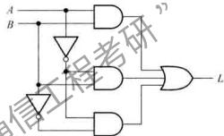

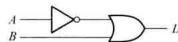  
(a)   
(b)   
图2.3.1 具有相同逻辑功能的两种电路实现（a）标准积之和的电路 （b）成本最低的电路

# 2.3.1 逻辑函数的最简形式

一个逻辑函数可以有多种不同的逻辑表达式，如与-或表达式、与非-与非表达式、或-与表达式、或非-或非表达式以及与-或-非表达式等。例如：

$$
\begin{array}{l} L = A C + \bar {C} D \\ = \overline {{A C}} \cdot \overline {{C D}} \\ = (A + \bar {C}) (C + D) \\ = \overline {{(A + C) + (C + D)}} \\ = \overline {{A C + C D}} \\ \end{array}
$$

与-或表达式  
与非-与非表达式  
或-与表达式  
或非-或非表达式  
与-或-非表达式

以上是同一函数五种不同形式的最简表达式。通常与-或表达式易于转换为其他类型的函数式，所以下面着重讨论与-或表达式的化简。

在若干个具有相同逻辑关系的与-或表达式中，将其中包含的乘积项个数最少，且每个乘积项中变量数最少的表达式称为最简与-或表达式。

逻辑函数化简就是要消去与-或表达式中多余的乘积项和每个乘积项中多余的变量，以得

到逻辑函数的最简与-或表达式。有了最简与-或表达式以后，再用公式变换就可以得到其他类型的函数式。

# 2.3.2 逻辑函数的代数化简法

# 1. 逻辑函数的化简

代数法是运用逻辑代数中的定理、恒等式或规则对逻辑函数进行化简，这种方法需要一些技巧，没有固定的步骤。下面是经常使用的方法。

（1）并项法

利用公式 $A + \overline{A} = 1$ ，将两项合并成一项，并消去一个变量

例2.3.1 试用并项法化简逻辑函数表达式 $L = A(BC + \overline{B}\overline{C}) + A(B\overline{C} + \overline{B}C)$ 。

解： $L = ABC + A\overline{B}\overline{C} +AB\overline{C} +A\overline{B} C$

$$
\begin{array}{l} = A B (C + \bar {C}) + A \bar {B} (C + \bar {C}) \\ = A (B + \bar {B}) = A \\ \end{array}
$$

(2）吸收法

利用公式 $A + AB = A$ ，消去多余的项 $AB$ 。根据代入规则， $A,B$ 可以是任何一个复杂的逻辑式。

例2.3.2 试用吸收法化简逻辑函数表达式 $L = AB + ABCDE + ABCDF$

解： $L = \overline{A} B + \overline{A} BCD(E + F) = \overline{A} B$

（3）消去法

利用 $A + \overline{AB} = A + B$ ，消去多余的因子

例2.3.3 试用消去法化简逻辑函数表达式 $L = AB + \overline{A} C + \overline{B} C$

解： $L = AB + (-A + B)C$

$$
\begin{array}{l} = A B + \overline {{A B C}} \\ = A B + C \\ \end{array}
$$

（4）配项法

先利用 $A = A(B + B)$ ，增加必要的乘积项，再用并项或吸收的办法使项数减少。

例2.3.4 试用配项法化简逻辑函数表达式 $L = AB + \overline{A}\overline{C} +B\overline{C}$

解： $L = AB + \overline{A}\overline{C} +(A + \overline{A})B\overline{C}$

$$
\begin{array}{l} = A B + \bar {A} \bar {C} + A B \bar {C} + \bar {A} B \bar {C} \\ = (A B + A B \bar {C}) + (\bar {A} \bar {C} + \bar {A} \bar {C} B) \\ = A B + \bar {A} \bar {C} \\ \end{array}
$$

使用配项的方法要有一定的经验，否则越配越繁。通常对逻辑表达式进行化简，要综合使用

上述技巧。以下再举一例

例2.3.5 化简 $L = AD + A\overline{D} +AB + \overline{A} C + BD + A\overline{BE} F + \overline{BE} F$

解： $L = A(D + \overline{D}) + AB + \overline{A} C + BD + A\overline{B} EF + \overline{B} EF$ （利用 $A + \overline{A} = 1$

$$
\begin{array}{l} = A + \overline {{A}} C + B D + \overline {{B}} E F \quad (\text {利 用} A + A B = A) \\ = A + C + B D + B E F \quad (\text {利 用} A + A B = A + B) \\ \end{array}
$$

# 2. 逻辑函数形式的变换

如果用门电路实现前面介绍的逻辑函数，需要用到非门、与门和或门。通常在一片集成电路芯片中只有一种门电路，为了减少门电路的种类，需要对逻辑函数表达式进行变换。

例2.3.6 已知逻辑函数表达式为

$$
L = \bar {A} B \bar {D} + A \bar {B} \bar {D} + \bar {A} B D + A \bar {B} C D + A \bar {B} C D
$$

要求：（1）试求最简的与-或逻辑函数表达式，并画出相应的逻辑图；

（2）仅用与非门画出表达式的逻辑图

解： $L = \overline{A} B(\overline{D} + D) + A\overline{B}\overline{D} + A\overline{B}(\overline{C} + C)D$ （分配律）

$= \overrightarrow{AB}\cdot \overrightarrow{AV}$ （与非-与非表达式）

$$
\begin{array}{l} = \bar {A} B + A \bar {B} \bar {D} + A \bar {B} D \quad (\text {利 用} A \bar {+} A = Y) \\ = \bar {A} B + A \bar {B} (D + \bar {D}) \quad (\text {利 用} A + \bar {A} = 1) \\ = \bar {A} B + A \bar {B} \quad (\text {与 一 或 表 达 式}) \\ = \overline {{\overline {{A B}} + A \overline {{B}}}} \quad \text {常} \cdot \quad (\text {先 利 用} \overline {{A}} = A, \overline {{B}} \\ \end{array}
$$

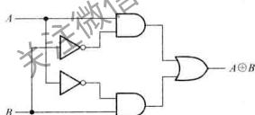  
(a)

(b)   
图2.3.2 例2.3.6的逻辑图  
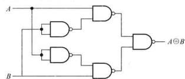  
（a）与-或表达式的实现 （b）与非门的实现

图2.3.2(a)是根据最简与-或表达式画出的逻辑图，它用到与门、或门和非门三种类型的门；而图2.3.2(b)是根据与非-与非表达式画出的逻辑图，它只用到两输入端与非门一种类型。注意，图2.3.2(b)中用两输入与非门来实现非门（即将两个输入端连接在一起）。

将与-或表达式变换成与非-与非表达式时，首先对与-或表达式取两次非，然后按照摩根定

理分开下面的非号。将与-或表达式变换成或非-或非表达式时，首先对与-或表达式中的每个乘积项单独取两次非，然后按照摩根定理分开下面的非号。下面再举一例说明逻辑函数的变换。

例2.3.7 试对逻辑函数表达式 $L = \overline{A}\overline{B} C + A\overline{B}\overline{C}$ 进行变换，仅用或非门画出该表达式的逻辑图。

解： $L = \overline{\overline{A}B}\overline{C} +\overline{\overline{A}B}\overline{C}$   
$= \overline{A + B + C} +\overline{\overline{A} + B + C}$ （摩根定理）  
#   
$= A + B + C + A + B + C$ （或非-或非表达式）

逻辑图如图2.3.3所示

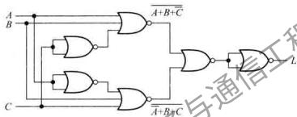  
图2.3.3 例2.3.7的逻辑图

# 复习思考题

2.3.1 对逻辑函数进行化简的目的是什么？最简与-或表达式的标准是什么？  
2.3.2 对逻辑函数进行变换的目的是什么？  
2.3.3 用代数法将下列各式化简成最简的与-或表达式：

（1）AB（BC+A）

(2) $(A + B)(A\overline{B})$

(3) $\overline{ABC} (B + C)$

（4） $A\overline{B} +ABC + A(B + A\overline{B})$

# 2.4 逻辑函数的卡诺图化简法

利用代数法可使逻辑函数变成较简单的形式，但经代数法化简得到的逻辑表达式是否为最简式较难判断。本节介绍的卡诺图①法可以比较简便地得到最简的逻辑表达式。

# 2.4.1 用卡诺图表示逻辑函数

# 1. 卡诺图的引出

一个逻辑函数的卡诺图就是将此函数的最小项表达式中的各最小项相应地填入一个特定的方格图内，此方格图称为卡诺图。因此，卡诺图是逻辑函数的一种图形表示。

下面从一变量卡诺图开始讨论，逐步过渡到多变量卡诺图。

对于 $n$ 个变量的逻辑函数有 $2^{n}$ 个小最项，因此一变量的逻辑函数有2个最小项。设变量为 $D$ ，则其两个最小项是 $\overline{D}$ 和 $D$ ，分别记为 $m_0 = \overline{D},m_1 = D$ 。用两个相邻的方格表示这两个最小项，如图2.4.1(a)所示。方格上的 $\overline{D}$ 和 $D$ 分别表示非变量和原变量。为简明起见，非变量 $\overline{D}$ 可以不标出，只标出原变量 $D$ ，得到图2.4.1(b)。图2.4.1(c)是另一种更简单的画法，图中 $m_0,m_1$ 只用其下标编号来表示。

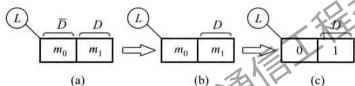  
图2.4.1 一变量卡诺图

二变量逻辑函数的最小项有 $2^{2} = 4$ 项，如果逻辑函数的变量用 $C, D$ 表示，则 $m_{0} = \overline{C} \cdot \overline{D}, m_{1} = \overline{C} \cdot D, m_{2} = C \cdot \overline{D}, m_{3} = C \cdot D$ 。用四个相邻的方格来表示这四个最小项。

将一变量卡诺图按照图2.4.2（a）所示箭头方向展开，得到二变量卡诺图如图2.4.2（b）所示。新增加的两个方格标以变量 $C$ ，新方格最小项的编号相对原方格编号增加了 $2^{n - 1} = 2^{2^{-1}} = 2$ ，即方格0后面为方格2，方格1后面为方格3。按照展开规律，中间两格 $m_{1}$ 和 $m_{3}$ 包含原变量 $D$ ，右边两方格 $m_{3}$ 和 $m_{2}$ 包含原变量 $C$ ，图中清楚地展示了原变量所包含的方格。

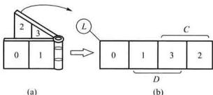  
图2.4.2 二变量卡诺图

综上所述，可归纳“折叠展开”的法则如下：

① 新增加的方格按展开方向应标以新变量；  
② 新方格内最小项编号应为展开前对应方格编号加上 $2^{n-1}$ 。

按照同样的方法，从二变量卡诺图展开获得三变量卡诺图，如图2.4.3所示。三变量逻辑函数 $L(B,C,D)$ 有8个最小项，可用8个相邻的方格来表示。新增加的四个方格标以变量 $B$ ，并且其最小项编号相对原方格的编号加上 $2^{n - 1} = 2^{3 - 1} = 4$ 。方格所处的位置，与相应的最小项对应，例如，2号方格处于变量为 $\overline{B},C,\overline{D}$ 的区域，则 $m_{2} = \overline{BC}\overline{D}$ ，余类推。

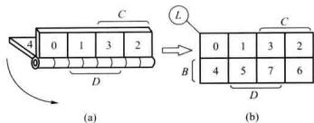  
图2.4.3 三变量卡诺图

同理，可得四变量卡诺图，如图2.4.4所示。在使用时，根据方格所在区域对应的变量 $A, B, C, D$ 的取值，可直接填入相应的最小项。

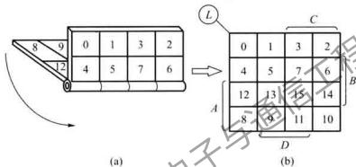  
图2.4.4 四变量卡诺图

# 2. 卡诺图的特点

卡诺图的特点是：几何位置相邻的最小项在逻辑上也是相邻的。即相邻的两个最小项只有一个变量不同，这是用卡诺图化简逻辑函数的主要依据。

现以四变量卡诺图为例，并将最小项用变量表示出来，如图2.4.5所示。图中相邻的方格内只有一个变量不同，例如， $m_{4} = \overline{A} B\overline{C}\overline{D}$ ， $m_{5} = \overline{A} B\overline{C} D$ ，这两个相邻最小项之间的差别仅在 $D$ 和 $\overline{D}$ ， $m_{5}$ 和 $m_{13}$ 之间的差别在于 $A$ 和 $\overline{A}$ 。要特别指出的是，卡诺图同一行最左端和最右端的方格是相邻的，同一列最上端和最下端两个方格也是相邻的。这个特点说明在几何位置上卡诺图具有上下、左右封闭的特性。

# 3. 卡诺图的简化表示法

图2.4.6所示为图2.4.5所示的卡诺图简化形式。变量 $A, B, C, D$ 的每组取值，与对应方格内的最小项编号一一对应。例如， $AB = 11, CD = 01$ ，即1101对应最小项 $m_{13}$ 。

# 4.已知逻辑函数，画出卡诺图

当逻辑函数为最小项表达式时，在卡诺图对应最小项的方格填上1，其余的方格填上0（也可用空格表示），就可以得到相应的卡诺图。也就是说，任何逻辑函数都等于其卡诺图中为1的方格所对应的最小项之和。

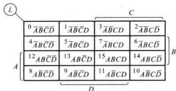  
图2.4.5 填入最小项的卡诺图

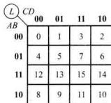  
图2.4.6 图2.4.5的简化表示法

例如，要画出逻辑函数 $L(A,B,C,D) = \sum m(0,1,2,3,4,8,10,11,14,15)$ 的卡诺图时，首先画出四变量卡诺图，并将逻辑函数表达式中最小项对应的方格填入1，其余填入0，即可得图2.4.7所示的 $L(A,B,C,D)$ 的卡诺图。

当逻辑函数的表达式为其他形式时，可将其变换为最小项表达式后，再作出卡诺图。

例2.4.1 画出

$L(A,B,C,D) = (\overline{A} +\overline{B} +\overline{C} +\overline{D})(\overline{A} +\overline{B} +C + \overline{D})(\overline{A} +B + \overline{C} +\overline{D})(A + \overline{B} +\overline{C} +D)(A + B + C + D)$ 的卡诺图。

解：（1）由摩根定理，将上式变换成

$$
\begin{array}{l} \bar {L} = A B C D + A B \bar {C} D + A B C \bar {D} + \bar {A} B C \bar {D} + \bar {A} B \bar {C} \bar {D} \\ = \sum m (1 5, 1 3, 1 0, 6, 0) \\ \end{array}
$$

（2）因上式为 $\overline{L}$ ，故最小项对应的方格内填入0，其余填入1，得到图2.4.8所示的卡诺图。

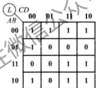  
图2.4.7 $L(A,B,C,D)$ 的卡诺图

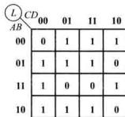  
图2.4.8 例2.4.1的卡诺图

# 2.4.2 用卡诺图化简逻辑函数

# 1. 化简的依据

卡诺图具有相邻性，若两个相邻的方格均为1，则这两个最小项之和有一个变量可以被消去，例如，图2.4.5所示卡诺图中的方格5和方格7，其最小项之和为 $\overline{AB}\overline{CD} +\overline{A} BCD = \overline{ABD} (\overline{C} +$ $C) = \overline{A} BD$ ，将两个方格中的不相同的因子 $C$ 和 $\overline{C}$ 消去。

若四个相邻的方格为1，则这四个最小项之和有两个变量可以被消去，如图2.4.5所示四变量

量卡诺图中的方格2、3、7、6，它们的最小项之和

$$
\begin{array}{l} \bar {A} \bar {B} C \bar {D} + \bar {A} \bar {B} C D + \bar {A} B C D + \bar {A} B C \bar {D} = \bar {A} \bar {B} C (D + \bar {D}) + \bar {A} B C (D + \bar {D}) \\ = \bar {A} \bar {B} C + \bar {A} B C = \bar {A} C \\ \end{array}
$$

消去了四个方格中不相同的两个因子，使逻辑表达式得到简化。这就是卡诺图法化简逻辑函数的基本原理。

# 2. 化简的步骤

用卡诺图化简逻辑函数的步骤如下：

（1）将逻辑函数写成最小项表达式  
（2）按最小项表达式填卡诺图，凡式中包含了的最小项，其对应方格填1，其余方格填0。  
（3）找出为1的相邻最小项，用虚线（或者细实线）画一个包围圈，每个包围圈含 $2^{n}$ 个方格，写出每个包围圈的乘积项。  
（4）将所有包围圈对应的乘积项相加

有时也可以由真值表直接填卡诺图，以上的（1）、（2）两步就合为一步。

画包围圈的原则：

（1）包围圈内的方格数必定是 $2^{n}$ 个， $n$ 等于 $0,1,2,3,\dots$   
（2）相邻方格包括上下底相邻，左右边相邻和两个角两两相邻。  
（3）同一方格可以被不同的包围圈重复包围，但新增包围圈中一定要有新的方格，否则该包围圈为多余。  
（4）包围圈内的方格数要尽可能多，包围圈的数目要尽可能少。

化简逻辑函数后，一个包围圈对应一个乘积项，包围圈越大，所得乘积项中的变量越少。包围圈个数越少，乘积项个数也越少，得到的与-或表达式也最简。

例2.4.2 用卡诺图法化简下列逻辑函数，求 $L$ 的最简与-或表达式。

$$
L (A, B, C, D) = \sum m (0, 2, 5, 7, 8, 1 0, 1 3, 1 5)
$$

解：（1）由 $L$ 画出卡诺图，如图2.4.9所示

（2）找出1的相邻最小项，用虚线画包围圈，合并最小项，得最简与-或表达式为

$$
L = B D + \bar {B} \bar {D}
$$

例2.4.3 用卡诺图法化简下列逻辑函数

$$
L (A, B, C, D) = (\bar {A} \bar {B} + B \bar {D}) \bar {C} + B D (\bar {\bar {A}} \bar {C}) + \bar {D} (\bar {\bar {A}} + \bar {B})
$$

解：（1）将逻辑函数化简，得到与-或表达式

$$
\begin{array}{l} L (A, B, C, D) = \bar {A} \bar {B} \bar {C} + B \bar {C} \bar {D} + B D (A + C) + \bar {D} A B \\ = \bar {A} \bar {B} \bar {C} + B \bar {C} \bar {D} + A B D + B C D + A B \bar {D} \\ \end{array}
$$

（2）由逻辑表达式直接作卡诺图，如图2.4.10所示  
（3）画包围圈合并最小项，得简化的与-或表达式为

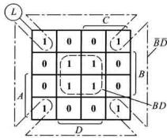  
图2.4.9 例2.4.2的卡诺图

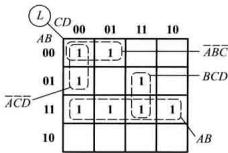  
图2.4.10 例2.4.3的卡诺图

$$
L = A B + B C D + \bar {A} \bar {B} \bar {C} + \bar {A} \bar {C} \bar {D}
$$

注意，此例中包含最小项 $m_4$ 的包围圈还有一种画法，即将 $m_4$ 和 $m_3'$ 画成一个包围圈，得到下面另一种简化的与-或表达式。可见，包围圈画的不同，得到的表达式也不同。

$$
L = A B + B C D + \bar {A} \bar {B} \bar {C} + B \bar {C} \bar {D}
$$

利用卡诺图化简时，如果卡诺图中大多数方格为1，用包围1的方法需要画很多包围圈。这时采用包围0的方法化简更为简单。即求出非函数 $\overline{L}$ ，再对 $\overline{L}$ 求非，下面举例说明。

例2.4.4 化简下列逻辑函数

$$
L (A, B, C, D) = \sum m (0 \sim 3, 5 \sim 1 1, 1 3 \sim 1 5)
$$

解：由 $L$ 画出卡诺图，如图2.4.11（a）所示。

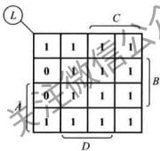  
(a)

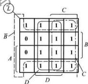  
(b)

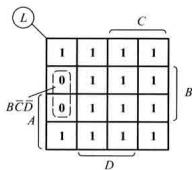  
(c)   
图2.4.11 例2.4.4的卡诺图

方法一：用包围1的方法化简，如图2.4.11（b）所示，得

$$
L = \bar {B} + C + D
$$

方法二：用包围0的方法化简，如图2.4.11（c）所示，得

$$
\bar {L} = B \bar {C} \bar {D}
$$

对 $L$ 求非

$$
L = \bar {B} + C + D
$$

可见，两种方法结果相同。

# 3. 具有无关项的化简

在实际工作中，当逻辑变量被赋予特定含义时，有一些变量的取值组合根本就不会出现，或者对应于变量的某些取值，其函数值可以是任意的（它的值可以取0或取1），将变量取这些值所对应的最小项称为无关项或任意项。

无关项的值可以取0或取1，具体取什么值，可以根据使函数尽量得到简化而定。下面举一个利用无关项化简的例子。

例2.4.5 要求设计一个逻辑电路，能够判断1位十进制数是奇数还是偶数，当十进制数为奇数时，电路输出为1；当十进制数为偶数时，电路输出为0。

解：第一步，列写真值表。用8421BCD码表示十进制数，输入变量用 $A,B,C,D$ 表示，当对应的十进制数为奇数时，函数值为1，反之为0，得到表2.4.1所示的真值表。

表 2.4.1 例 2.4.5 的真值表  

<table><tr><td rowspan="2">对应十进制数</td><td colspan="4">输入变量</td><td>输出</td></tr><tr><td>A</td><td>B</td><td>C</td><td>D</td><td>L</td></tr><tr><td>0</td><td>0</td><td>0</td><td>0</td><td>0</td><td>0</td></tr><tr><td>1</td><td>0</td><td>0</td><td>0</td><td>1</td><td>1</td></tr><tr><td>2</td><td>0</td><td>0</td><td>1</td><td>0</td><td>0</td></tr><tr><td>3</td><td>0</td><td>0</td><td>1</td><td>1</td><td>1</td></tr><tr><td>4</td><td>0</td><td>1</td><td>0</td><td>0</td><td>0</td></tr><tr><td>5</td><td>0</td><td>1</td><td>0</td><td>1</td><td>1</td></tr><tr><td>6</td><td>0</td><td>1</td><td>1</td><td>0</td><td>0</td></tr><tr><td>7</td><td>0</td><td>1</td><td>1</td><td>1</td><td>1</td></tr><tr><td>8</td><td>1</td><td>0</td><td>0</td><td>0</td><td>0</td></tr><tr><td rowspan="6">无关项</td><td>1</td><td>0</td><td>0</td><td>1</td><td>1</td></tr><tr><td>1</td><td>0</td><td>1</td><td>1</td><td>×</td></tr><tr><td>1</td><td>1</td><td>0</td><td>0</td><td>×</td></tr><tr><td>1</td><td>1</td><td>0</td><td>1</td><td>×</td></tr><tr><td>1</td><td>1</td><td>1</td><td>0</td><td>×</td></tr><tr><td>1</td><td>1</td><td>1</td><td>1</td><td>×</td></tr></table>

注意，8421 BCD 码只有十个数，表中 4 位二进制码的后六种组合是无关的，1 位十进制数不包括 $10 \sim 15$ ，这些无关状态根本不会出现，输入变量的这后六种组合所对应的最小项就是无关项，它们对应的函数值可以任意假设，为 0 为 1 都可以，通常以 $\times$ （或 $\phi$ ）表示。

第二步，根据真值表的内容，填写四变量卡诺图，如图2.4.12所示。

第三步，画包围圈，此时应利用无关项，显然，将最小项 $m_{13}$ 、 $m_{15}$ ， $m_{11}$ 对应的方格视为1，可以得到最大的包围圈，由此得到逻辑表达式

$$
L = D
$$

若不利用无关项， $L = \overline{A} D + \overline{B}\overline{C} D$ ，结果复杂得多。

以上讨论的是从一变量到四变量的卡诺图，并以4变量卡诺图为例，分析了逻辑函数的化简方法。至于更多变量，如五变量或六变量卡诺图的应用，可参阅文献[3,4]。

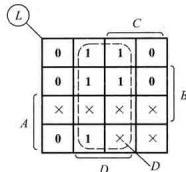  
图2.4.12 例2.4.5的卡诺图

# 复习思考题

2.4.1 什么是无关项？  
2.4.2 使用卡诺图化简逻辑函数的依据是什么？  
2.4.3 用卡诺图找出下列各个逻辑函数的最简与-或表达式

(1) $L(A,B,C,D) = \sum m(1,4,5,7,12,14,15)$   
(2) $L(A, B, C) = \prod M(0, 1, 2, 4)$

# 2.5 硬件描述语言 Verilog HDL 基础

硬件描述语言HDL类似于计算机高级程序设计语言（如C语言等），它是一种以文本形式来描述数字系统硬件的结构和功能的语言，用它可以表示逻辑电路图、逻辑表达式，还可以表示更复杂的数字逻辑系统所完成的逻辑功能（即行为）。人们还可以用HDL编写设计说明文档，这种文档易于存储和修改，适用于不同的设计人员之间进行技术交流，还能被计算机识别和处理，计算机对HDL的处理包括两个方面：逻辑仿真和逻辑综合。

逻辑仿真是指用计算机仿真软件对数字逻辑电路的结构和行为进行预测，仿真器对HDL描述进行解释，以文本形式或时序波形图形式给出电路的输出。在电路被实现之前，设计人员根据仿真结果可以初步判断电路的逻辑功能是否正确。在仿真期间，如果发现设计中存在的错误，可以对HDL描述进行修改，直至满足设计要求为止。

逻辑综合是指从HDL描述的数字逻辑电路模型中导出电路基本元件列表以及元件之间的连接关系（常称为门级网表）的过程，即将HDL代码转换成真实的硬件电路。它类似于高级程序设计语言中对一个程序进行编译，得到目标代码的过程。所不同的是，逻辑综合不会产生目标代码，而是产生门级元件及其连接关系的数据库，根据这个数据库可以制作出集成电路或印制电路板（Printed Circuit Board, PCB）。

早期较为流行的硬件描述语言是ABEL①，目前，有两种硬件描述语言符合IEEE标准：VHDL和Verilog HDL（简称Verilog）。VHDL是在20世纪80年代中期由美国国防部支持开发出来的，约在同一时期，由Gateway Design Automation②公司开发出Verilog语言。1990年，Verilog被公开推向市场，并成为最流行的描述数字电路的语言。1995年，Verilog正式地被批准为IEEE的标准，叫做1364—1995。该语言的修订增强版引入了一些新的特性，分别于2001年、2005年被批准为IEEE的标准，叫做1364—2001和1364—2005。修订增强版支持原始Verilog版本的所有特性。

尽管这两种语言在很多方面都有所不同，但在学习逻辑电路时，设计者使用任何一种语言都可以完成自己的任务，并且Verilog的句法根源出自通用的C语言，较VHDL易学易用。作为入门，本书简要讲解Verilog的基本知识，并介绍逻辑电路综合和设计用到的Verilog结构，对逻辑仿真时用到的语言结构没有进行介绍。

# 2.5.1 Verilog语言的基本语法规则

Verilog语言继承了C语言的许多语法结构，同时又增加了一些新的规则，本节将介绍Verilog语言的基本语法规则。

# 1. 间隔符

Verilog的间隔符包括空格符（\b）、TAB键（\r）换行符（\n）及换页符。如果间隔符并非出现在字符串中，则该间隔符被忽略。所以编写程序时，可以跨越多行书写，也可以在一行内书写。

间隔符主要起分隔文本的作用，在必要的地方插入适当的空格或换行符，可以使文本错落有致，便于阅读与修改。

# 2.注释符

Verilog 支持两种形式的注释符：/\*----\*/和/\(/。其中，/\*----\*/为多行注释符，用于写多行注释；//为单行注释符，以双斜线//开始到行尾结束为注释文字。注释只是为了改善程序的可读性，在编译时不起作用。

# 3.标识符和关键词

给对象（如模块名、电路的输入与输出端口、变量等）取名所用的字符串称为标识符，标识符通常由英文字母、数字、$符或者下画线组成，并且规定标识符必须以英文字母或下画线开始，不能以数字或$符开头。英文字母的大小写是有区别的。例如，clk、counter8、_net、bus_A等都是合法的标识符，2cp、S latch、a * b则是非法的标识符；A和a是两个不同的标识符。

关键词为小写的英文字符串，它是Verilog语言本身规定的特殊字符串，在Verilog中有100个左右预定义的关键词用来定义该语言的结构。例如，module、endmodule、input、output、wire、reg、and等都是关键词。关键词不能作为标识符使用。

本书为清晰起见，将关键词以粗体字印刷，但语言本身没有这一要求。

# 4. 逻辑值集合

为了表示数字逻辑电路的逻辑状态，Verilog语言规定了4种基本的逻辑值，如表2.5.1所示。

表 2.5.1 4 种逻辑状态的表示  

<table><tr><td>0</td><td>逻辑 0、逻辑假</td></tr><tr><td>1</td><td>逻辑 1、逻辑真</td></tr><tr><td>\( \mathrm{x} \) 或 \( \mathrm{X} \)</td><td>不确定的值 (未知状态)</td></tr><tr><td>\( \mathrm{z} \) 或 \( \mathrm{Z} \)</td><td>高阻态</td></tr></table>

# 5. 常量及其表示

Verilog中有两种类型的常量：整数型常量和实数型常量

整数型常量有两种不同的表示方法：一是使用简单的十进制数的形式表示常量，例如：30、-2都是十进制数表示的常量。用这种方法表示的常量被认为是具有符号的常量。二是使用带基数的形式表示常量，其格式为：

$$
<   + / - > <   \text {位 宽} > ^ {\prime} <   \text {基 数 符 号} ^ {\prime} <   \text {数 值} >
$$

其中 $\langle + / - \rangle$ 表示常量是正整数还是负整数。当常量为正整数时，前面的正号可以省略；<位宽>定义了常量对应的二进制数的宽度；<基数符号>定义了后面<数值>的表示形式，在<数值>表示中，左边为最高有效位，右边为最低有效位。整数型常量可以用二进制数（基数符号为b或B）的形式表示，还可以用十进制数（基数符号为d或D）、十六进制数（基数符号为h或H)和八进制数（基数符号为o或O）的形式表示。例如： $3^{\prime}\mathrm{b}101,5^{\prime}\mathrm{o}37,8^{\prime}\mathrm{he}3$ 分别表示位宽为3位的二进制数101、位宽为5位的八进制数37和位宽为8位的十六进制数e3，-4'd10、4'b1x0x分别表示位宽为4位的十进制数10和位宽为4位的二进制数1x0x。为了增加数值的可读性，可以在数字之间增加下画线。例如： $8^{\prime}\mathrm{b}1001\_ 0011$ 是位宽为8位的二进制数10010011。

实数型常量也有两种表示方法：一是使用简单的十进制记数法，例如：0.1、2.0、5.67等都是十进制记数法表示的实数型常量。二是使用科学记数法，23_5.1e2、3.6E2、5E-4等都是使用科学记数法表示的实数型常量，它们以十进制记数法表示分别为23510.0、360.0和0.0005。

为了改善可读性和方便将来修改程序，Verilog允许用参数定义语句定义一个标识符来代表一个常量，称为符号常量。定义的格式为：

parameter参数名 $1 =$ 常量表达式1，参数名 $2 =$ 常量表达式2，…；

下面是符号常量的定义实例：

$$
\begin{array}{l} \text {p a r a m e t e r B I T} = 1, \mathrm {B Y T E} = 8, \mathrm {P I} = 3. 1 4; \\ \text {p a r a m e t e r D E L A Y} = (\mathrm {B Y T E} + \mathrm {B I T}) / 2; \\ \end{array}
$$

# 6. 字符串

字符串是双撇号内的字符序列，但字符串不允许分成多行书写。在表达式和赋值语句中，字

字符串要转换成无符号整数，用一串8位ASCII值表示，每一个8位ASCII码代表一个字符。例如：字符串“ab”等价于 $16^{\prime}h5758$ 。存储字符串“INTERNALERROR”，需要定义 $8\times 14$ 位的变量。

# 2.5.2 变量的数据类型

在Verilog语言中，变量有两大类数据类型：一类是线网类型①，另一类是寄存器类型②。

# 1. 线网类型

线网类型是硬件电路中元件之间实际连线的抽象。线网类型变量的值由驱动元件的值决

定。例如，图2.5.1所示线网L跟与门G1的输出相连，线网L的值由与门的驱动信号a和b所决定，即 $\mathrm{L = a\&b}$ 。a、b的值发生变化，线网L的值会立即跟着变化。当线网型变量被定义后，没有被驱动元件驱动时，线网的默认值为高阻态z(线网trireg除外，它的默认值为 $\mathbf{x}$ ）。

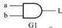  
图2.5.1 线网示意图

常用的线网类型由关键词wire定义。如果没有明确地说明线网型变量是多少位宽的矢量，则线网型变量的位宽为1位。在Verilog模块中如果没有明确地定义输入、输出变量的数据类型，则默认为是位宽为1位宽的wire型变量。wire型变量的定义格式如下：

wire[n-1:0]变量名1，变量名2，…，变量名n；

其中，方括号内以冒号分隔的两个数字定义了变量的位置，位宽的定义也可以用[n:1]的形式定义。下面是wire型变量定义的一些例子：

wire a,b; //串两个线网类型变量a、b

wire1;

wire[7:0]databus; //声明一个8位宽的线网类型变量databus

wire[32:1]busA,busB,busC; //声明3个位宽为32的线网类型变量busA、busB、busC

线网类型除wire外，还有wand、wor、tri、triand、trior、trireg等。

# 2. 寄存器类型

寄存器类型表示一个抽象的数据存储单元，它具有状态保持作用。寄存器型变量只能在initial或always内部被赋值。寄存器型变量在没有被赋值前，它的默认值是 $\mathbf{X}_{\circ}$

Verilog语言中，有4种寄存器类型的变量，如表2.5.2所示

表 2.5.2 寄存器类型变量及其说明  

<table><tr><td>寄存器类型</td><td>功能说明</td></tr><tr><td>reg</td><td>用于行为描述中对寄存器型变量的说明</td></tr><tr><td>integer</td><td>32 位带符号的整数型变量</td></tr><tr><td>real</td><td>64 位带符号的实数型变量,默认值为0</td></tr><tr><td>time</td><td>64 位无符号的时间型变量</td></tr></table>

常用的寄存器类型用关键词reg进行声明。如果没有明确地说明寄存器型变量是多位宽的矢量，则寄存器变量的位宽为1位。reg型变量的定义格式如下：

reg[n-1:0]变量名1，变量名2，…，变量名n；

下面是reg型变量定义的一些例子：

```txt
reg clock; //声明一个寄存器变量clock  
reg [3:0] counter; //声明一个4位宽的寄存器变量counter 
```

integer、real 和 time 等 3 种寄存器类型变量都是纯数学的抽象描述，不对应任何具体的硬件电路。integer 型变量通常用于对整数型常量进行存储和运算，在算术运算中 integer 型数据被视为有符号的数，用二进制补码的形式存储。而 reg 型数据通常被当作无符号数来处理。注意 integer 型变量不能使用位矢量，例如 integer [3:0] num；的定义是错误的。integer 型变量的应用举例如下：

integer counter; //声明一个整型变量counter  
initial counter $= -1$ ;//将-1以补码的形式存储在counter中

其中，initial是一种过程语句结构，只有寄存器类型的变量才能在initial内部被赋值。

real型变量通常用于对实数型常量进行存储和运算，实数不能定义范围，其默认值为0。当实数值被赋给一个integer型变量时，只保留整数部分的值，小数点后面的值被截掉。real型变量的应用举例如下：

```txt
real delta; 声明一个实数型变量 delta  
initial  
begin  
delta = 4e10; //给 delta 赋值  
delta = 2.13;  
end  
integer i; //i 明一个整型变量 i  
initial  
i = delta; //i 得到的值是 2（只将实数 2.13 的整数部分赋给 i）
```

time型变量主要用于存储仿真的时间,它只存储无符号数。每个time型变量存储一个至少64位的时间值。为了得到当前的仿真时间,常调用系统函数$time。time型变量的应用举例如下:

```txt
time current_time; //声明一个时间类型的变量 current_time
initial
current_time = $time; //保存当前的仿真时间到变量 current_time 中
```

# 2.5.3 运算符及其优先级

# 1. 运算符

Verilog语言提供了30多个运算符，表2.5.3列出了对逻辑电路综合有用的部分运算符。按

照功能可以大致分为算术运算符、逻辑运算符、关系运算符、移位运算符等几大类。按照参与运算的操作数的个数，可以分为单目、双目和三目运算符。双目运算符是指一个运算符需要带两个操作数，即对两个操作数进行运算。单目运算符只对一个操作数进行运算，而三目运算符需要带三个操作数。

表 2.5.3 Verilog HDL 的运算符  

<table><tr><td>类型</td><td>符号</td><td>功能说明</td><td>类型</td><td>符号</td><td>功能说明</td></tr><tr><td>算术运算符</td><td>+ - - * /</td><td>二进制加 二进制减 2的补码 二进制乘 二进制除</td><td>关系运算符(双目运算符)</td><td>&gt; &lt; &gt;= &lt;= != ! =</td><td>大于小于大于或等于小于或等于相等</td></tr><tr><td>位运算符(双目运算符)</td><td>~ &amp; | ~ ~ ~ 或 ~ ~</td><td>按位取反 按位与 按位或 按位异或 按位同或</td><td>缩位运算符(单目运算符)</td><td>&amp; ~ &amp; ! ~ ! ~ ~或 ~ ~</td><td>缩位与缩位与非缩位或缩位或非缩位异或缩位同或</td></tr><tr><td>逻辑运算符(双目运算符)</td><td>! &amp;&amp; ||</td><td>逻辑非 逻辑与 逻辑或</td><td>移位运算符(双目运算符)</td><td>&gt;&gt; &lt;&lt;</td><td>右移左移</td></tr><tr><td>位拼接运算符</td><td>| , | &#x27; &#x27; &#x27; &#x27; &#x27; &#x27; &#x27; &#x27; &#x27; &#x27; &#x27; &#x27; &#x27; &#x27; &#x27; &#x27; &#x27; &#x27; &#x27; &#x27; &#x27; &#x27; &#x27; &#x27; &#x27; &#x27; &#x27; &#x27; &#x27; &#x27; &#x27; &#x27; &#x27; &#x27; &#x27; &#x27; &#x27; &#x27; &#x27; &#x27; &#x27; &#x27; &#x27; &#x27; &#x27; &#x27; &#x27; &#x27; &#x27; &#x27; &#x27; &#x27; &#x27; &#x27; &#x27; &#x27; &#x27; &#x27; &#x27; &#x27; &#x27; &#x27; &#x27; &#x27; &#x27; &#x27; &#x27; &#x27; &#x27; &#x27; &#x27; &#x27; &#x27; &#x27; &#x27; &#x27; &#x27; &#x27; &#x27; &#x27; &#x27; &#x27; &#x27; &#x27; &#x27; &#x27; &#x27; &#x27; &#x27; &#x27; &#x27; &#x27; &#x27; &#x27; &#x27; &#x27; &#x27; &#x27; &#x27; &#x27;</td><td>将多个操作数拼接成为一个操作数</td><td>条件运算符(三目运算符)</td><td>? ;</td><td>根据条件表达式是否成立,选择表达式</td></tr></table>

Verilog语言中运算符有很多与C语言中的类似，下面仅介绍含义有差别的运算符。

缩位运算符是Verilog语言中新增加的，它和位运算符是有区别的。位运算是将两个操作数按对应位进行相应的逻辑运算，操作数是几位数，则运算结果也是几位数。而缩位运算是对单个操作数的各位进行相应运算，最后的运算结果是1位二进制数。假设变量A、B的值分别为 $4^{\prime}\mathrm{b}1010$ 和 $4^{\prime}\mathrm{b}1111$ ，表2.5.4为这两种不同运算的例子。

表 2.5.4 位运算、缩位运算和逻辑运算的比较表  

<table><tr><td>位运算</td><td>~A=0101 ~B=0000</td><td>A&amp;B=1010</td><td>A|B=1111</td><td>A*B=0101</td><td>A~^B=1010</td></tr><tr><td>缩位运算</td><td>&amp;A=1&amp;0&amp;1&amp;0 =0</td><td>~&amp;A=1 &amp;B=1</td><td>|A|=1 ~|B|=0</td><td>^A=0 ^B=0</td><td>~^A=1 ~^B=1</td></tr></table>

逻辑运算符的运算结果为1位，其中&&和||为双目运算符，逻辑运算符！为单目运算符。在运算过程中，如果操作数只有1位，那么1代表逻辑1,0代表逻辑0；如果操作数由多位组成，若操作数的每一位都是0，则认为该操作数具有逻辑0值；反之，若操作数中某一位为1，则认为该操作数具有逻辑1值；如果任一个操作数为 $\mathbf{x}$ 或 $\mathbf{z}$ ，则逻辑运算的结果为不定态 $\mathbf{x}$ 。例如，设变量A、B的值分别为 $2^{\prime}b10$ 和 $2^{\prime}b00$ ，则A为逻辑1,B为逻辑0，于是！ $A = 0,!,B = 1,A\& \& B = 1\& \& 0 = 0,A\parallel B = 1\parallel 0 = 1$

位拼接运算符的作用是将两个或多个信号的某些位拼接起来成为一个新的操作数，进行运算操作。例如，设 $A = 1^{\prime} b1$ ， $B = 2^{\prime} b10$ ， $C = 2^{\prime} b00$ ，若将操作数 $B$ 、 $C$ 拼接起来，则得到 $|B, C| = 4^{\prime} b1000$ ；若将操作数 $A, B$ 的第 1 位和 $C$ 的第 0 位拼接起来，则得到一个 3 位矢量的新操作数，即 $|A, B[1], C[0]| = 3^{\prime} b110$ 。若将操作数 $A, B, C$ 和 $3^{\prime} b101$ 拼接起来，则得到一个 8 位矢量的新操作数，即 $|A, B, C, 3^{\prime} b101| = 8^{\prime} b11000101$ 。

对同一个操作数重复拼接还可以使用双重大括号构成的运算符 $\left\{\begin{array}{l}1 \\ 2 \\ 3\end{array}\right\}$ ，例如 $\{4 \mid A\} = 4^{\prime} b_{1} 1111, \{2 \mid A, 2 \mid B, C\} = 8^{\prime} b_{1} 1101000$ 。注意，参与拼接的操作数必须标明位宽。

# 2. 运算符的优先级

表2.5.5是Verilog运算符的优先级。优先级的顺序从下向上依次增加，位于顶部行的运算符优先级别最高，在最底部行的优先级别最低。列表同一行的运算符优先级别相同。所有运算符（条件运算符？：除外）在表达式中都是从左向右结合的，使用圆括号（）可以改变运算的先后顺序。为了避免发生误解，推荐使用圆括号去隔开不同的表达式，以便代码的含义更明确易懂。

表 2.5.5 Yerilog HDL 运算符的优先级  

<table><tr><td>类型</td><td>符号</td><td>优先级别</td></tr><tr><td>取反</td><td>! ~ -(求2的补码)</td><td rowspan="6">最高优先级</td></tr><tr><td>转义</td><td>* /+ -</td></tr><tr><td>移位</td><td>&gt;&gt; &lt;&lt;</td></tr><tr><td>关系</td><td>&lt; &lt;= &gt; &gt;=</td></tr><tr><td>等于</td><td>== !=</td></tr><tr><td>缩位</td><td>&amp; ~&amp;^ ~^ ! ~1</td></tr><tr><td>逻辑</td><td>&amp;&amp;||</td><td rowspan="2">最低优先级</td></tr><tr><td>条件</td><td>?:</td></tr></table>

# 2.5.4 Verilog内部的基本门级元件

Verilog语言包含12个预先定义的基本门级元件①(gate level primitives)模型，如表2.5.6所示。门级元件的输出、输入必须为线网类型的变量。当使用这些元件进行逻辑仿真时，仿真软件会根据程序的描述给每个元件中的变量分配逻辑0、逻辑1、不确定态 $\mathbf{x}$ 和高阻态 $\mathbf{z}$ 这4个值之一。下面介绍这些元件的用法。

表 2.5.6 Verilog 语言内置的 12 个基本门级元件  

<table><tr><td>元件符号</td><td>功能说明</td><td>元件符号</td><td>功能说明</td></tr><tr><td>and</td><td>多输入端的与门</td><td>nand</td><td>多输入端的与非门</td></tr><tr><td>or</td><td>多输入端的或门</td><td>nor</td><td>多输入端的或非门</td></tr><tr><td>xor</td><td>多输入端的异或门</td><td>xnor</td><td>多输入端的异或非门</td></tr><tr><td>buf</td><td>多输出端的缓冲器</td><td>not</td><td>多输出端的反相器</td></tr><tr><td>buffl</td><td>控制信号高电平有效的三态缓冲器</td><td>notf1</td><td>控制信号高电平有效的三态反相器</td></tr><tr><td>bufflt</td><td>控制信号低电平有效的三态缓冲器</td><td>notf0</td><td>控制信号低电平有效的三态反相器</td></tr></table>

# 1. 多输入门

and、nand、or、nor、xor和xnor是具有多个输入的逻辑门，它们的共同特点是：只允许有一个输出，但可以有多个输入。图2.5.2是与门元件(and)模型的示意图，一般的调用形式为：

and A1 (out, in1, in2, ..., inN);

其中，调用名Al可以省略。注意，调用门级元件时，在圆括号中需要列出输入、输出变量，括号中左边的第一个变量必须是输出变量，即与原理图中的输出端口对应。nand、or、nor、xor、xnor的调用形式与之类似，不再赘述。

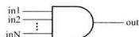  
图2.5.2 多输入与门元件模型

表2.5.7~表2.5.9是两输入端and.or和xor元件的逻辑真值表，表中第一行对应于门的一个输入端，表中的第一列对应于门的另一个输入端，行、列输入的运算结果列在表的中间部位。注意，多输入门的输出不可能为高阻态 $\mathbf{z}$ 。

其余3个多输入门（nand、nor、xnor）的真值表分别与上述的类似。

表 2.5.7 两输入 and 真值表  

<table><tr><td rowspan="2" colspan="2">and</td><td colspan="4">输入1</td></tr><tr><td>0</td><td>1</td><td>x</td><td>z</td></tr><tr><td rowspan="4">输 人 2</td><td>0</td><td>0</td><td>0</td><td>0</td><td>0</td></tr><tr><td>1</td><td>0</td><td>1</td><td>x</td><td>x</td></tr><tr><td>x</td><td>0</td><td>x</td><td>x</td><td>x</td></tr><tr><td>z</td><td>0</td><td>x</td><td>x</td><td>x</td></tr></table>

表 2.5.8 两输入 or 真值表  

<table><tr><td rowspan="2" colspan="2">or</td><td colspan="4">输入1</td></tr><tr><td>0</td><td>1</td><td>x</td><td>z</td></tr><tr><td rowspan="4">输 人 2</td><td>0</td><td>0</td><td>1</td><td>x</td><td>x</td></tr><tr><td>1</td><td>1</td><td>1</td><td>1</td><td>1</td></tr><tr><td>x</td><td>x</td><td>1</td><td>x</td><td>x</td></tr><tr><td>z</td><td>x</td><td>1</td><td>x</td><td>x</td></tr></table>

表 2.5.9 两输入 xor 真值表  

<table><tr><td rowspan="2" colspan="2">xor</td><td rowspan="2">x1 x1 x1 x1 x1 x1 x1 x1 x1 x1 x1 x1 x1 x1 x1 x1 x1 x1 x1 x1 x1 x1 x1 x1 x1 x1 x1 x1 x1 x1 x1 x1 x1 x1 x1 x1 x1 x1 x1 x1 x1 x1 x1 x1 x1 x1 x1 x1 x1 x1 x1</td></tr><tr></tr><tr><td rowspan="4">输 人 2</td><td>0</td><td>0 1 x x</td></tr><tr><td>1</td><td>1 0 x x</td></tr><tr><td>x</td><td>x x x x x x</td></tr><tr><td>z</td><td>x x x x x x</td></tr></table>

# 2. 多输出门

buf、not是具有多个输出端的逻辑门，它们的共同特点是：允许有多个输出，但只有一个输入。一般的调用形式为：

buf B1(out1,out2,…,outN,in);

not N1 (put, out2, ..., outN, in);

其中，调用名BI\N1可以省略。图2.5.3所示为多个输出端反相器的示意图，其逻辑真值表如表2.5.10所示。buf逻辑真值表与not的类似，但输出值与not的相反。

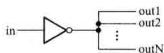  
图2.5.3 门级元件not的模型

表 2.5.10 not 真值表  

<table><tr><td></td><td></td><td></td><td></td><td></td></tr><tr><td>0</td><td>1</td><td>x</td><td>z</td><td></td></tr><tr><td>输出</td><td>1</td><td>0</td><td>x</td><td>x</td></tr></table>

# 3.三态门①

bufif1 $②$ 、bufif0、notif1和notif0是三态门元件模型，这些门有一个输出、一个数据输入和一

个输入控制。如果输入控制信号无效，则三态门的输出为高阻态 $\mathbf{z}$ 。一般的调用形式为：

bufif1 B1(out,in,ctrl); bufif0 B0(out,in,ctrl);

notif1 N1 (out,in,ctrl) ; notif0 NO (out,in,ctrl);

其中，调用名B1、B0、N1、N0可以省略。图2.5.4所示是buffif1和notif1的示意图。

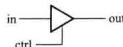  
(a)

(b)   
图2.5.4 三态门元件模型  
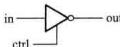  
(a)bufif1 (b)notif1

表2.5.11和表2.5.12给出了bufifl和notifl的逻辑真值表，表中， $\mathbf{0} / \mathbf{z}$ 表明三态门的输出可能是0，也可能是高阻态 $\mathbf{Z}$ ，主要由输入数据信号和控制信号的强度决定。有关信号强度的讨论超出了本书的范畴。

表 2.5.11 bufif1 真值表  

<table><tr><td rowspan="2" colspan="2">buffl</td><td colspan="4">控制输入</td></tr><tr><td>0</td><td>1</td><td>x</td><td>z</td></tr><tr><td rowspan="4">数 据 输 人</td><td>0</td><td>z</td><td>0</td><td>0/z</td><td>0/z</td></tr><tr><td>1</td><td>z</td><td>1</td><td>1/z</td><td>1/z</td></tr><tr><td>x</td><td>z</td><td>x</td><td>x</td><td>x</td></tr><tr><td>z</td><td>z</td><td>x</td><td>x</td><td>x</td></tr></table>

表 2.5.12 notif1 真值表  

<table><tr><td rowspan="2" colspan="2">notifl</td><td colspan="4">控制输入</td></tr><tr><td>0</td><td>1</td><td>x</td><td>z</td></tr><tr><td rowspan="2">数 据</td><td>0</td><td>z</td><td>1</td><td>1/z</td><td>1/z</td></tr><tr><td>1</td><td>z</td><td>0</td><td>0/z</td><td>0/z</td></tr><tr><td rowspan="2">输 入</td><td>x</td><td>z</td><td>x</td><td>x</td><td>x</td></tr><tr><td>z</td><td>z</td><td>x</td><td>x</td><td>x</td></tr></table>

# 2.5.5 Verilog程序的基本结构

模块 (module) 是 Verilog 描述电路的基本单元, 它可以表示一个简单的门电路, 也可以表示功能复杂的数字电路。对数字电路建模时, 通常使用 Verilog 的一个或多个模块, 不同的模块之间通过端口进行连接。定义模块的基本语法结构如下:

module模块名（端口名1，端口名2，端口名3，…）；

端口模式说明（input，output，inout）；

参数定义（可选）： 说明部分

数据类型定义（wire，reg等）；

实例化低层次模块或基本门级元件；

连续赋值语句（assign）：

过程块结构(initial和always)

行为描述语句；

endmodule

逻辑功能描述部分，

其排列顺序是任意的。

定义模块时总是以关键词module开始，并以关键词endmodule来结束。“模块名”是模块唯一的标识符，圆括号中以逗号分隔列出的端口名是该模块的输入、输出端口；在Verilog中，“端口类型说明”为input（输入）、output（输出）、input（双向端口）三者之一，它决定了信号流经端口的方向，凡是在模块名后面圆括号中出现的端口名，都必须明确地说明其端口模式。“参数定义”是将数值常量用符号常量代替，以增加程序的可读性和可修改性，它是一个可选择的语句。“数据类型定义”部分用来指定模块内所用的数据对象为寄存器类型还是连线类型。

接着要对该模块完成的逻辑功能进行描述，通常可以使用三种不同风格描述电路的功能：一是使用实例化低层次模块的方法，即调用其他已定义过的低层次模块对整个电路的功能进行描述，或者直接调用Verilog内部预先定义的基本门级元件描述电路的结构，通常将这种方法称为结构描述方式（对仅使用基本门级元件描述电路功能的方式，也称为门级描述方式）；二是使用连续赋值语句（assign）对电路的逻辑功能进行描述，通常称之为数据流描述方式，该方式特别便于对组合逻辑电路建模；三是使用过程块语句结构（包括initial语句结构和always语句结构两种)和比较抽象的高级程序语句对电路的逻辑功能进行描述，通常称之为行为描述方式。

行为描述侧重于描述模块的逻辑功能，不涉及实现该模块的详细硬件电路结构。设计人员可以选用这三种方式中的任意一种或混合使用几种对电路的功能进行描述，并且这几种描述方式在程序中排列的先后顺序是任意的。这些描述方式将在4.6节、5.6节和6.7节做进一步介绍。除此之外，在3.9节中将介绍开关级描述方式，有时用这种方法对MOS管构成的逻辑电路进行建模，以便仿真MOS管电路的逻辑功能，但逻辑综合工具不支持这种建模方式。

例2.5.1用Verilog语言对图2.5.5所示简单逻辑电路进行建模。

解：该电路的逻辑表达式为

$$
Y \neq D _ {0} - S + D _ {1} \cdot S
$$

当 $S = 0$ 时，输出 $Y_{0} = D_{0}$ ，当 $S = 1$ 时， $Y_{1} = D_{1}$ 。可见，该电路能够根据输入 $S$ 的控制，选择两路输入信号 $(D_{0}, D_{1})$ 中的一路作为输出。因此，该电路也被称为2选1数据选择器。

用于ferilog语言对该电路建模时，有以下三种不同的描述方式。

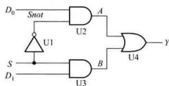  
图2.5.5 简单的门电路

# （1）门级描述方式

Verilog语言内部预先定义了12个基本门级元件，门级描述就是调用这些“元件”描述逻辑图中的元件以及元件之间的连线关系。2选1数据选择器的门级描述代码如下：

//Verilog model of circuit of Figure2.5.5.IEEE 1364-1995 Syntax

module mux2tol(D0,D1,S,Y);

input D0, D1, S; //输入端口声明

outputY:/输出端口声明

wire Snot,A,B://内部节点声明

//下面对电路的逻辑功能进行描述

```verilog
not U1(Snot,S)；//调用名U1可以省略 and U2(A,D0,Snot); and U3(B,D1,S); or U4(Y,A,B);   
endmodule
```

说明：代码第1行以双斜线(/)开始到本行结尾之间的文本是一个注释，对这个电路进行简单的说明。第2行以关键词module开始声明了一个模块，module后面跟有模块名（ $\mathrm{mux2tol}$ ）和端口名（D0、D1、S、Y）列表。端口名列表给出了该模块的输入、输出端口，端口用圆括号括起来，多个端口之间以逗号进行分隔。每一条语句以分号结尾。

接着，以关键词input和output定义了该模块的输入端口、输出端口。端口的数据类型默认为wire类型，此处将电路内部的结点信号(Snot、A、B)定义为wire类型。

电路的结构（即逻辑功能）由基本门级元件（not、and、or）进行描述，每个门级元件后面包含一个调用名（U1、U2等）和由圆括号括起来、以逗号分隔的输出端口以及输入端口，调用基本门级元件时，Verilog规定输出端口总是位于圆括号中左边的第一个位置，输入端口跟在后面。例如，调用名为U4的或门输出端口是Y、输入端口是A和B。调用名可以直接使用，不需要预先定义，并且调用基本门级元件时，调用名可以省略。最后模块以endmodule结尾（注意后面没有分号）。由于这个模块描述了电路的逻辑功能，故将该模块称为设计块。

在修订后的Verilog标准中，定义模块端口时可以按照如下方式书写：

```javascript
module mx2tol1(inputD0,D1,S,outputY); 
```

在模块的端口列表中，直接声明端口模式，不再需要独立的input和output语句，这使得代码变得更加紧凑。

# （2）数据流描述方式

数据流描述方式使用的基本语句是连续赋值语句，它由关键词 assign 开始，后面跟着由操作数和运算符组成的逻辑表达式。连续赋值语句右边的表达式等同于用该函数实现的逻辑门。

2选1数据选择器的数据流描述代码如下：

```verilog
module mux2tol_dataflow(D0,D1,S,Y); //IEEE 1364—1995 Syntax  
input D0,D1,S; //输入端口声明  
output Y; //输出端口声明  
wire Y; //变量的数据类型声明  
//电路功能描述  
assignY = (S & D0) | (S & D1); //注意表达式左边变量的数据类型必须是 wire 型  
endmodule
```

可见，使用逻辑表达式编写Verilog代码更加简明、易懂。通过逻辑综合软件，能够自动地将数据流描述转换成为门级电路。

# （3）行为描述方式

对于功能复杂的逻辑电路，使用门级描述或者数据流描述电路的功能，其工作效率就会很低。另一种方法就是使用更抽象的结构来描述电路的逻辑功能和算法。使用Verilog提供的always语句结构和一些类似于高级语言的语句就可以对电路的行为进行描述。2选1数据选择器的行为描述代码如下：

```verilog
module mux2to1_bh(D0,D1,S,Y); //IEEE 1364—1995 Syntax  
input D0,D1,S; //输入端口声明  
output Y; //输出端口声明  
reg Y; //变量的数据类型声明  
//电路功能描述  
always @ (S or D0 or D1)  
if (S == 1) Y = D1; //也可以写成 if (S) Y = D1;  
else Y = D0; //注意表达式左边变量的数据类型必须是 reg 型  
endmodule
```

上述代码使用 if-else 语句对数据选择器的行为特征进行了描述，它没有涉及实现选择器的具体电路结构。if-else 语句是 Verilog 语言中的一种过程性语句，在本书 4.6 节将介绍其他类型的过程性语句。

行为描述的标识是always语句, always 是一个循环执行语句, 在它后面跟着执行循环体语句的条件@ (S or D0 or D1) (注意后面没有分号), 它表示圆括号内的任一个变量发生变化时, 下面的过程赋值语句就会被执行一次, 执行完最后一条语句后, 执行挂起, always 语句再次等待变量发生变化, 因此将圆括号内列出的变量称为敏感变量。对组合逻辑电路来说, 所有的输入信号都是敏感变量, 应该被写在圆括号内。注意, 过程赋值语句只能给寄存器型变量赋值, 因此, 程序中将输出变量 Y 的数据类型定义成 reg。

典型的 Verilog 设计模块可以包含几个 always 语句块, 每个 always 语句块表示电路模型的一个部分。always 语句块的一个重要特性是它内部所包含的语句是按代码排列顺序执行的。这与连续赋值语句 assign 是不同的, 多条 assign 语句是并行执行的。

修订后的Verilog标准在敏感变量列表中，可以用逗号代替or，也可以用一个\*号来代替敏感变量列表中所有输入信号，所以上述代码的更简单写法如下所示：

```javascript
module mxu2tol_hb() //Verilog 2001,2005 module port syntax input D0,D1,S, output reg Y 
```

）；always@（D0,D1,S）//Verilog2001,2005 syntax//可以写成always@ $(\ast)$ .或者写成always@\*if(S) $\mathrm{Y} = \mathrm{D}1$ ·else $Y = D0$ ；  
endmodule

# 2.5.6 逻辑功能的仿真与测试

一旦逻辑电路的设计块完成后，接下来就要测试这个设计块描述的逻辑功能是否正确。为此必须在输入端口加入测试信号，以便从输出端口检测其结果是否正确，这一过程常称为搭建测试平台（Test Bench）。根据仿真软件的不同，搭建测试平台的方法也不同，本书使用Quartus II 9.1版软件①进行仿真，以波形图的方式建立一个矢量波形文件（扩展名为.vdi）作为激励信号。

对例2.5.1进行仿真②时，首先进入QuartusII软件，创建一个新的工程设计项目，并使用文本编辑器输入源程序，再对该设计项目进行编译，然后使用波形编辑器创建一个新的矢量波形文件，最后进行逻辑功能仿真，得到图2.5.6所示的波形。由图可知，在 $0\sim 50~\mathrm{ns}$ 期间，由于 $\mathrm{S} = 0$ 所以输出Y与输入D0相同；在 $50\sim 100\mathrm{ns}$ 期间， $\mathrm{S} = 1$ 故输出Y与输入D1相同。分析表明该设计块描述的逻辑功能是正确的。

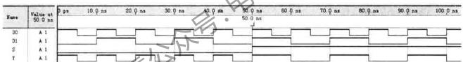  
图2.5.6 例2.5.1的仿真输出波形

对一个实际的门电路来说，信号从输入端传到输出端存在着延时，在使用HDL进行逻辑功能仿真时，有时需要说明门电路的延时。本书作为Verilog的入门，没有介绍这方面的内容。

# 小结

- 逻辑代数是分析和设计逻辑电路的数学工具。一个逻辑问题可用逻辑函数来描述，逻辑函数可用真值表、逻辑表达式、卡诺图和逻辑图表达，这四种表示方法各具特点，可根据需要选用。  
- 逻辑函数的与-或表达式和或-与表达式是两种常见的形式，但其表达式的形式不是唯一

的。任一个逻辑函数经过变换，都能得到唯一的最小项表达式或者是最大项表达式。

- 硬件描述语言HDL是一种以文本形式来描述数字系统硬件的结构和行为的语言，可以用来表示逻辑电路图、逻辑表达式，还可以表示更复杂的数字逻辑系统所完成的逻辑功能（即行为）。计算机对HDL的处理包括两个方面：逻辑仿真和逻辑综合。用HDL设计数字系统是当今的一种趋势。

# 习题

# 2.1 逻辑代数的基本定律和规则

2.1.1 用真值表证明下列恒等式：

（1） $(A\oplus B)\oplus C = A\oplus (B\oplus C)$   
(2) $\overline{A\oplus B} = \overline{A}\overline{B} +AB$

2.1.2 用逻辑代数定律证明下列等式：

（1） $A + \overline{A} B = A + B$   
(2) $ABC + A\overline{BC} + AB\overline{C} = AB + AC$   
(3) $A + A\overline{B}\overline{C} +\overline{A} CD + (\overline{C} +\overline{D})E = A + CD + E$   
（4） $(A + B)(A + \overline{B}) = A$   
（5） $AB + \overline{A} C + BCD = AB + \overline{A} C$   
(6) $(A + B)(B + C)(\overline{A} + C) = (\overline{A} + B)(\overline{A} + C)$

2.1.3 应用反演规则和对偶规则，求下列函数的非函数和对偶函数

(1) $L = A \cdot B + \overline{A} \cdot \overline{B}$   
(2) $L = \Delta B + Q + D$   
(3) $\left\{L = \overline{A} + \overline{B + A} + \overline{B} + \overline{C} + D\right.$

# 2.2 逻辑函数表达式的形式

2.2.1 将下列各式转换成与-或形式：

(1) $\overline{A} \oplus \overline{B} \oplus \overline{C} \oplus \overline{D}$   
（2） $\overline{A + B + C + D} +C + D + A + D$   
（3） $\overline{\overline{AC} + BD}\overline{BC + AB}$

2.2.2 列出逻辑函数 $L(A,B,C) = A\overline{B} + B\overline{C}$ 的真值表，并写出该函数的最小项表达式。

2.2.3 试写出下列各个函数的最小项表达式：

(1) $L = A\overline{CD} +\overline{BD}\overline{C}\overline{D} +ABCD$   
(2) $L = \overline{A(B + C)}$

（3） $L = \overline{\overline{AB} + ABD(B + \overline{CD})}$   
(4) $L = (\overline{A\overline{B} + B\overline{C}})\overline{AB}$

2.2.4 判断下列等式是否成立？

(1) $\overline{A}\overline{C} +BC + A\overline{B} = \overline{AB} +AC + \overline{B}\overline{C}$   
(2) $\overline{A} C + A B\overline{C} +\overline{A} B + A\overline{B} = \overline{B} C + A\overline{C} +B\overline{C} +\overline{A} B C$   
(3) $A\overline{C} +BC + \overline{B}\overline{C} = (A + \overline{B} +C)(A + B + \overline{C})(\overline{A} +B + \overline{C})$   
（4） $(A + C)(\overline{A} +\overline{B} +\overline{C})(\overline{A} +B) = (A + B)(B + C)(\overline{A} +\overline{C})$

2.2.5 列出逻辑函数 $L(A,B,C) = \overline{A}\cdot C + A\cdot \overline{B}\cdot \overline{C}$ 的真值表，并写出该函数的最大项表达式。

2.2.6已知下列函数的最大项表达式，试写出其最小项表达式

(1) $L(A,B) = \square M(0,1,2)$

(2) $L(A, B, C) = \prod M(0, 1, 3, 6, 7)$

2.2.7已知下列函数的最小项表达式，试写出其最大项表达式

(1) $L(A,B) = \sum m(1,2)$

(2) $L(A, B, C, D) = \sum m(1, 2, 5, 6)$

# 2.3 逻辑函数的代数化简法

2.3.1 用代数法将下列各式化简成最简的与-或表达式：

（1） $\overline{AB + A\overline{B} + AB + A\overline{B}}$

(2) $\overline{(\bar{A} + B)^2 + (\bar{A} + B)^2 + (\bar{A}\bar{B})(\bar{A}\bar{B})}$

(3) $\overline{B} +\overline{A} BC + \overline{A} C + \overline{A} B$

（4） $\overline{ABC} +A\overline{BC} +ABC + A + B\overline{C}$

（5） $ABC\overline{D} +ABD + BC\overline{D} +ABCD + B$

（6） $AC + \overline{A} BC + \overline{B} C + AB\overline{C}$

2.3.2已知逻辑函数表达式为 $L = \overline{A} R\overline{C}\overline{D}$ 画出实现该式的逻辑电路图，限使用非门和2输入与非门

2.3.3 画出实现下列逻辑表达式的逻辑电路图，限使用非门和2输入与非门。

(1) $L = AB + AC$

（2） $A = D(A + C)$

(3) $L = \overline{(A + B)(C + D)}$

2.3.4已知逻辑函数表达式为 $L = A\overline{B} +\overline{A} C$ ，画出实现该式的逻辑电路图，限使用非门和2输入或非门。

2.3.5 写出图题2-5.5所示电路的逻辑表达式，将其转换成与非-与非表达式，然后画出仅用与非门实现的逻辑图。

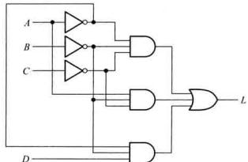  
图题2.3.5

# 2.4 逻辑函数的卡诺图化简法

2.4.1已知逻辑函数 $L(A,B,C) = A\overline{B} +B\overline{C} +C\overline{A}$ ，试用真值表、卡诺图和逻辑图（限用非门和与非门）表示。

2.4.2已知函数 $L(A,B,C,D)$ 的卡诺图如图题2.4.2所示，请写出函数 $L$ 的最简与-或表达式。

2.4.3 用卡诺图法化简下列各式：

(1) $A\overline{B} CD + AB\overline{C} D + A\overline{B} +A\overline{D} +A\overline{B} C$   
(2) $\overline{A}\overline{B}C + A\overline{B}\overline{C}D + AB\overline{C}D + ABC$   
(3) $A\overline{B}CD + D(\overline{B}\overline{C}D) + (A + C)B\overline{D} + A(\overline{B} + C)$   
(4) $L(A, B, C, D) = \sum m(0, 2, 4, 8, 10, 12)$   
（5） $L(A,B,C,D) = \sum m(0,1,2,5,6,8,9,10,13,14)$   
(6) $L(A,B,C,D) = \sum m(0,2,4,6,9,13) + \sum d(1,3,5,7,11,15)$   
（7） $L(A,B,C,D) = \sum m(0,4,6,13,14,15) + \sum d(1,2,3,5,7,9,10,11)$

2.4.4 用卡诺图化简法，求下列函数的最简或-与表达式。

（1） $L(A,B,C,D) = A\overline{C} +AD + \overline{B}\overline{C} +\overline{BD}$   
(2) $L(A, B, C, D) = \sum m(3, 4, 5, 7, 13, 14, 15)$   
(3) $L(A, B, C, D) = (\overline{A} + D)(B + \overline{D})(A + B)$   
（4）L(A,B,C,D)=M(3,4,6,7,11,12,13,14,15)

# 2.5 硬件描述语言 Verilog HDL 基础

2.5.1 在Verilog语言中，下列标识符是否正确？

(1) system1 (2) reg (3) FourBit_Adder (4) exec $ (5) 2tolux   
2.5.2 Verilog语言规定的4种基本逻辑值是什么？  
2.5.3在Verilog程序中，如果没有说明输入、输出变量的数据类型，试问它们的数据类型是什么？  
2.5.4 填空题：

（1）问下列运算的二进制值是多少？

$$
\operatorname {r e g} [ 3: 0 ] \mathrm {m}
$$

$$
\mathrm {m} \geqslant 4 ^ {\prime} \mathrm {b} 1 0 1 0; \quad / / \left\{2 \mid \mathrm {m} \right\} \text {的 二 进 制 值 是}
$$

（2）假设 $m = 4^{\prime}b0101$ ，按要求填写下列运算的结果：

$$
\begin{array}{l} \& m = \_ \_ \_ \_ \_ \_ \_ \_ \_ \_ \_ \_ \_ \_ \_ \_ \_ \_ \_ \_ \_ \_ \_ \_ \_ \_ \_ \_ \_ \_ \_ \_ \_ \_ \_ \_ \_ \_ \_ \_ \_ \_ \_ \_ \\ \hat {\mathrm {m}} = \quad , \sim \hat {\mathrm {m}} = \\ \end{array}
$$

2.5.5 下列 Verilog 程序描述了图题 2.5.5 所示的电路，但程序中每一行有一个语法错误，请改正。（注意：基本门级元件的调用名可以省略。）

$$
\begin{array}{l} \text {m o d u l e} \mathrm {E x 1} (\mathrm {A}, \mathrm {B}, \mathrm {C}, \mathrm {X}, \mathrm {Y}) \\ \text {i n p u t} \mathrm {A}, \mathrm {B}, \mathrm {C} \\ \text {o u t p u t} X, Y \\ \operatorname {r e g} E; \\ a n d G 1 (A, B, E); \\ \text {N O T} (\mathrm {Y}, \mathrm {C}); \\ \end{array}
$$

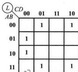  
图题2.4.2

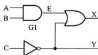  
图题2.5.5

OR (X,E,Y);

endmodule;

2.5.6 根据下面的HDL描述，用QuartusII软件对电路进行逻辑功能仿真，给出仿真波形。再画出该模块的逻辑电路图。

```verilog
module circuit(A,B,L); input A,B; output L; wire a1,a2,Anot,Bnot; and G1(a1,A,B); and G2(a2,Anot,Bnot); not (Anot,A); not (Bnot,B); or(L,a1,a2);   
endmodule 
```