# 锁存器和触发器

引言

大多数数字系统中，除了需要具有逻辑运算和算术运算功能的组合逻辑电路外，还需要具有存储功能的电路。组合电路与存储电路结合构成时序逻辑电路，简称时序电路。本章将讨论实现存储功能的两种逻辑单元电路：锁存器和触发器，着重讨论它们的工作原理与电路结构，以及所实现的不同逻辑功能。此外，本章还将讨论用Verilog HDL描述锁存器与触发器的方法。

# 5.1 基本双稳态电路

将两个非门 $\mathrm{G}_1$ 和 $\mathrm{G}_2$ 接成如图5.1.1所示的交叉耦合形式，则构成最基本的双稳态电路。

从图5.1.1所示电路的逻辑关系可知，若 $Q = 0$ ，经非门 $\mathrm{G}_2$ 反相，则 $\overline{Q} = 1$ 。 $\overline{Q}$ 反馈到 $\mathbf{G}_1$ 输入端，又保证了 $Q = 0$ 。由于两个非门首尾相接的逻辑锁定，因而电路能自行保持在 $Q = 0,\overline{Q} = 1$ 的状态，形成第一种稳定状态。反之，若 $Q = 1,\overline{Q} = 0$ ，则形成第二种稳定状态。在两种稳定状态中，输出端 $Q$ 和 $\overline{Q}$ 总是逻辑互补的。可以定义 $Q = 0$ 为整个电路的0状态， $Q = 1$ 则是1状态。电路进入其中任意一种逻辑状态都能长期保持下去，并可以通过 $Q$ 端电平检测出来，因此，它具有存储1位二进制数据的功能。

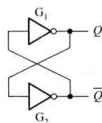  
图5.1.1 最基本的双稳态电路

像图5.1.1所示电路这样，具有0、1两种逻辑状态，一旦进入其中一种状态，就能长期保持不变的单元电路，称为双稳态存储电路，简称双稳态电路。本章所讨论的锁存器和触发器均属于双稳态电路。

可以看出，图5.1.1所示双稳态电路的功能极不完备。在接通电源后，它可能随机进入0状态或1状态，因为没有控制机构，所以也无法在运行中改变和控制它的状态，从而不能作为存储

电路使用。但是，该电路是各种锁存器、触发器等存储单元的基础。

# 复习思考题

5.1.1 为什么图5.1.1所示的电路能长期保持状态不变？

# 5.2 SR锁存器

锁存器（Latch）是一种对脉冲电平敏感的双稳态电路，它具有0和1两个稳定状态，一旦状态被确定，就能自行保持，直到有外部特定输入脉冲电平作用在电路一定位置时，才有可能改变状态。这种特性可以用于置入和存储1位二进制数据。本节首先讨论SR锁存器。

# 5.2.1 基本SR锁存器

# 1. 基本SR锁存器的工作原理

将图5.1.1中双稳态电路的非门换成或非门，则构成图5.2.1(a)所示的基本SR锁存器，它是一种具有最简单控制功能的双稳态电路。图中，S和 $R$ 是两个输入端， $Q$ 和 $\overline{Q}$ 是两个输出端。定义 $Q = 0$ 且 $\overline{Q} = 1$ 为整个锁存器的0状态， $Q = 1$ 且 $\overline{Q} = 0$ 则是锁存器的1状态。下面根据 $S,R$ 的4种输入状态组合来分析它的工作原理。

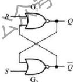  
(a)

(b)   
图5.2.1 用或非门构成基本SR锁存器  
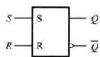  
（a）逻辑电路 （b）逻辑符号

$①$ $S = R = 0$

根据图5.2.1(a)的逻辑电路可以列出 $Q = R + \overline{Q} = 0 + \overline{Q} = Q, \overline{Q} = \overline{S + Q} = \overline{0 + Q} = \overline{Q}$ 。显然， $S, R$ 两信号对输出 $Q$ 和 $\overline{Q}$ 不起作用，电路状态保持不变，功能与图5.1.1所示的双稳态电路相同，因此可存储1位二进制数据。

② $S = 0, R = 1$

对于或非门而言， $S = 0$ 不会影响 $\mathbf{G}_2$ 的输出状态，而 $R = 1$ 作用于 $\mathrm{G}_1$ 则不然，所以必须首先确

定 $G_{1}$ 输出端 $Q$ 的状态。根据电路可得： $Q = \overline{R + \overline{Q}} = \overline{1 + \overline{Q}} = 0$ 。该信号再反馈到 $G_{2}$ 输入端，于是得： $\overline{Q} = \overline{S + Q} = \overline{0 + 0} = 1$ 。根据定义，锁存器这时的状态为0。

再从电路的动态变化进行分析。如果图5.2.1(a)所示电路此前的状态为1，即 $Q = 1, \overline{Q} = 0$ 在 $R$ 端出现逻辑1电平瞬间，将使 $Q$ 端输出电压下降并作用于 $G_{2}$ 的输入端，随即引发 $\overline{Q}$ 端电压上升。一旦 $Q$ 和 $\overline{Q}$ 端均跨越逻辑阈值电平，便迅速转换为 $Q = 0, \overline{Q} = 1$ ，电路状态由1翻转为0；反之，如果此前电路状态为0，即 $Q = 0, \overline{Q} = 1$ ，则 $R = 1$ 的出现不改变其状态。

总之， $S = 0, R = 1$ 将使锁存器置0，因此将 $R$ 端称为复位（或置0）输入端。当 $R = 1$ 信号消失（即回到0），电路则进入前述①的状态，使锁存器的0状态得以保持。

③ $S = 1, R = 0$

电路是对称的， $S = 1, R = 0$ 将首先使 $\overline{Q} = \overline{S + Q} = 0$ ，继而 $Q = R + \overline{Q} = 1$ ，锁存器置1。 $S$ 端称为置位（或置1）输入端。当 $S = 1$ 信号消失，同样可使锁存器的1状态得以保持。

④ $S = R = 1$

无论 $Q$ 和 $\overline{Q}$ 原来是什么状态， $S = R = 1$ 将强制 $Q = R + \overline{Q} = 1 + \overline{Q} = 0, \overline{Q} = \overline{S + \overline{Q}} = \overline{1 + Q} = 0$ ，锁存器处在既非1，又非0的非定义状态。若 $S$ 和 $R$ 同时回到0，则无法确定锁存器将落入1状态还是0状态。由于电路存在制造误差， $G_{1}, G_{2}$ 两门的延迟时间总是有微小差别，若 $G_{1}$ 的延迟时间稍短，在 $S$ 和 $R$ 同时跳变到0时， $Q$ 端会抢先跳变为1，迫使 $\overline{Q} = 0$ ；反之，若 $G_{2}$ 延迟时间稍短，锁存器则进入0状态。所以，实际的电路在这种情况下总是倒向电路设计者无法预知的一个固定状态。为保证锁存器始终工作于定义状态，输入信号应遵守 $SR = 0$ 的约束条件，也就是说不允许 $S = R = 1$ 。

由上述分析可得基本SR锁存器的功能表，如表5.2.1所示。表中的4行内容分别对应于前述 $① \sim ④$ 的输入和输出状态。

表 5.2.1 用或非门构成基本 SR 锁存器的功能表  

<table><tr><td>S</td><td>R</td><td>Q</td><td>Q</td><td>功能</td></tr><tr><td>0</td><td>0</td><td>不变</td><td>不变</td><td>保持</td></tr><tr><td>0</td><td>1</td><td>0</td><td>1</td><td>置0</td></tr><tr><td>1</td><td>0</td><td>1</td><td>0</td><td>置1</td></tr><tr><td>1</td><td>1</td><td>0</td><td>0</td><td>非定义状态</td></tr></table>

图5.2.1(b)所示为基本SR锁存器的逻辑符号， $S$ 和 $R$ 分别为置位端和复位端， $Q$ 和 $\overline{Q}$ 为互补的两个输出端，其中 $\overline{Q}$ 输出锁存器的非状态，所以用小圆圈示之。这样，不通过图5.2.1（a）的逻辑门电路，仅从抽象的逻辑符号也可以理解基本SR锁存器各输入、输出信号之间的逻辑关系。

基本SR锁存器的数据保持、置0和置1功能，是一个可实际应用的存储单元最基本的逻辑

功能。基本SR锁存器的典型工作波形如图5.2.2所示

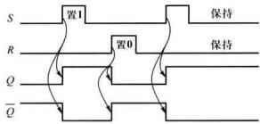  
图5.2.2 基本SR锁存器的典型工作波形

例5.2.1 设图5.2.1(a)所示基本 $SR$ 锁存器的初始状态为1，其 $S, R$ 端输入波形如图5.2.3中虚线上面所示，试画出对应的 $Q$ 和 $\overline{Q}$ 波形。

解：根据表5.2.1可以画出 $Q$ 和 $\overline{Q}$ 端的波形如图5.2.3中虚线下面所示。

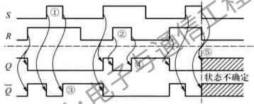  
图5.2.3 例5.2.1的波形

需要注意，虽然图5.2.3中①、②两处输入信号越出了 $SR$ 锁存器的约束条件，出现 $S = R = 1$ 使 $Q = \overline{Q} = 0$ 的情况，但是，如果 $S$ 和 $R$ 的1电平不同时撤消，此后的输出状态仍然是可以确定的，如图中③、④所示。而在⑤处，由于 $S$ 和 $R$ 的高电平同时撤消，所以锁存器以后的状态将无法确定，从而失去对它的控制，在实际应用中必须避免出现这种情况。

# 2. 基本SR锁存器的动态特性

此前的讨论仅考虑了电路的逻辑关系，没有涉及门电路输出信号对输入信号的时间延迟，即电路的动态特性。而构成图5.2.1(a)所示电路的两个或非门在工作时都存在一定的传输延迟，当输入信号 $S$ 或 $R$ 变为高电平后，输出信号 $Q$ 或 $\bar{Q}$ 需要经过一定延迟才会产生变化。这种延迟有时会影响到被其驱动的后续电路的动作，可能造成错误的逻辑输出或出现工作不稳定的情况。此外，为保证锁存器状态可靠转换，对输入信号也需要有一定的时间要求。

定时图是表达时序电路动态特性的工具之一，它表达了电路动作过程中，输出对输入信号响应的延迟时间，以及对各输入信号的时间要求。图5.2.4是基本SR锁存器的定时图。图中，脉冲信号的上升沿和下降沿均用斜线表达，表示存在一定的上升时间和下降时间，脉冲沿的基准时间定位在上升沿和下降沿的 $50\%$ 处。

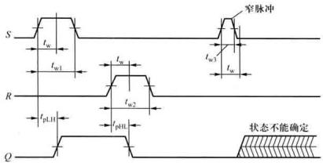  
图5.2.4 基本SR锁存器的定时图

传输延迟时间 $t_{\mathrm{pLH}}$ 和 $t_{\mathrm{pHL}}$

如图5.2.4所示，当置1信号 $S$ 上升为高电平时，需要一定的传输延迟时间 $t_{\mathrm{ph}}$ 之后， $Q$ 端才转换为高电平。同样，置0信号 $R$ 作用于电路， $Q$ 端电平也经一定的传输延迟时间 $t_{\mathrm{phL}}$ 才变化为0。 $\overline{Q}$ 端的变化相对于输入信号 $S$ 或 $R$ 的变化也存在一定的传输延迟。这里，把 $t_{\mathrm{phH}}$ 和 $t_{\mathrm{phL}}$ 定义为基本SR锁存器的传输延迟时间。对于具体电路，由于信号通过的路径不同， $t_{\mathrm{phL}}$ 和 $t_{\mathrm{phH}}$ 一般不完全相等。

脉冲宽度 $t_{\mathrm{w}}$

基本 $SR$ 锁存器工作时，必须保证 $S$ 和 $R$ 的高电平脉冲宽度不小于某一最小值 $t_{\mathrm{m}}$ 。例如，图5.2.4中的 $t_{\mathrm{s1}}$ 和 $t_{\mathrm{s2}}$ 均满足要求，从而电路能可靠地实现翻转。如果加在 $S$ 或 $R$ 端的脉冲宽度过窄，如图5.2.4所示宽度为 $t_{\mathrm{s3}}$ 的窄脉冲，在 $Q$ 端电压尚未越过逻辑阈值电平时， $S$ 端的高电平就被撤除，电路可能又回到原来的状态，或者使 $Q$ 的最终状态不能确定。所以基本 $SR$ 锁存器应用中要求输入信号 $S$ 和 $R$ 的脉冲宽度必须不小于一个最低限值 $t_{\mathrm{m}}$ ，才能保证在 $S$ 或 $R$ 脉冲作用之后有确定的状态。

# 3. 用与非门构成的基本SR锁存器

基本 $SR$ 镀存器也可以用与非门构成，其逻辑原理图和逻辑符号如图5.2.5所示。图5.2.5(a)中的两个与非门是用其等效符号表示的，由图可分析出当 $\overline{S},\overline{R}$ 为不同输入状态组合时锁存器的状态，如表5.2.2所示。

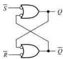  
(a)

(b)   
图5.2.5 用与非门构成的基本SR锁存器  
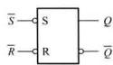  
(a) 逻辑电路 (b) 逻辑符号

表 5.2.2 用与非门构成基本 ${SR}$ 锁存器的功能表  

<table><tr><td>S</td><td>R</td><td>Q</td><td>Q</td><td>功能</td></tr><tr><td>1</td><td>1</td><td>不变</td><td>不变</td><td>保持</td></tr><tr><td>1</td><td>0</td><td>0</td><td>1</td><td>置0</td></tr><tr><td>0</td><td>1</td><td>1</td><td>0</td><td>置1</td></tr><tr><td>0</td><td>0</td><td>1</td><td>1</td><td>非定义状态</td></tr></table>

当输入为 $\overline{S} = \overline{R} = 0$ 时， $Q = 1, \overline{Q} = 1$ ，该锁存器处于非定义状态，因此工作时应当受到 $\overline{S} + \overline{R} = \overline{SR} = 1$ 的条件约束，即同样应遵守 $SR = 0$ 的约束条件。

与前述或非门构成的基本 $SR$ 锁存器不同，这种锁存器的输入信号 $S$ 和 $R$ 以逻辑0作为有效作用信号，因而在图5.2.5(b)所示逻辑符号中，在输入端用小圆圈表示。为了区别，这种锁存器有时也称为基本 $\overline{SR}$ 锁存器。

# 4. 基本SR锁存器的应用

基本SR锁存器可以应用于数字系统中某些特定标志的设置。例如，当某种预设逻辑条件具备时，电路可以通过 $S$ 端将基本 $SR$ 锁存器置1，标志预设事件已经发生；而当另一种相悖的预设逻辑条件满足时，则可通过 $R$ 端将其置0。下面的例题是另外一种应用。

例5.2.2 运用基本SR锁存器消除机械开关触点抖动引起的脉冲输出。

解：机械开关（例如按键、拨动开关、继电器等）常常用作数字系统的逻辑电平输入装置。由于机械开关接通或断开瞬间的弹性振颤，触点会在短时间内多次接通和断开，出现如图5.2.6所示的“抖动”现象，使 $\phi_0$ 的逻辑电平多次在0和1之间跳变，导致错误逻辑输入数字系统。机械开关触点振颤的延续时间因开关结构、几何形状和尺寸以及材料的不同而不同，从数毫秒到上百毫秒不等。在设计数字系统时，通常需要采用硬件方法（如本例）或软件方法来克服其不良影响。

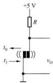  
(a)

(b)   
图5.2.6 机械开关的“抖动”现象  
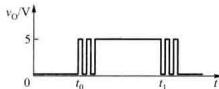  
（a）开关在 $t_0$ 时断开， $t_1$ 时接通 （b）实际输出波形

图5.2.7(a)是解决机械开关抖动现象的一种硬件方案，它利用基本 $SR$ 锁存器的存储作用消除开关触点振动所产生的影响，称为去抖动电路。图5.2.7(b)中横虚线上面是图5.2.7(a)所示电路中 $\overline{S}$ 和 $\overline{R}$ 端的波形，表示了单刀双掷开关S由B拨向A，然后又拨回B的过程。初始时，开关S的动触点与B点接通，锁存器的状态为0。在开关S拨向A，动触点脱离B点瞬间产生的抖动，并不影响锁存器的状态。在动触点悬空瞬间， $\overline{S} = \overline{R} = 1$ ， $Q$ 仍维持为0。当它第一次触碰A点时，便使 $\overline{S} = 0$ ， $Q$ 端状态立即翻转为1。此后，即使触点抖动，使 $\overline{S}$ 端再次出现高、低电平的跳变，也不会改变 $Q = 1$ 的状态。由于电路是对称的，开关由A拨向B与前述的情况类似。于是得到 $Q$ 端波形，如图5.2.7(b)中横虚线下面所示。可以看到，在开关每次变化时，锁存器只翻转一次，不存在抖动波形。图5.2.7(a)所示去抖动电路特别适用于需要对机械开关状态进行计数的场合，它可以消除开关触点抖动造成的误计数。

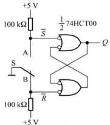  
(a)

(b)   
图5.2.7 用基本SR锁存器构成机械开关去抖动电路  
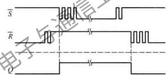  
（a）电路 （b）波形图

# 5.2.2 门控SR锁存器

# 1. 门控SR锁存器的逻辑功能

前面所讨论的基本SR锁存器的输出状态是由输入信号 $S$ 或 $R$ 直接控制的，而图5.2.8(a)所示电路在基本 $SR$ 锁存器输入端增加了一对逻辑门 $\mathrm{G}_3,\mathrm{G}_4$ ，用使能信号 $E$ 控制锁存器在某一指定时刻，根据 $S,R$ 输入信号确定输出状态。这种锁存器称为门控 $SR$ 锁存器。通过控制 $E$ 端电平，可以实现多个锁存器同步的数据锁定。

从图5.2.8(a)可以看出，当 $E = 0$ 时， $Q_{3} = Q_{4} = 0,S,R$ 端的逻辑状态不会影响到锁存器的状态；当 $E = 1$ 时， $S,R$ 端的信号被传送到基本 $SR$ 锁存器的输入端，从而可确定 $Q$ 和 $\overline{Q}$ 端的状态，其功能与表5.2.1一致。若 $E = 1$ 时输入信号 $S = R = 1$ ，则 $Q = \overline{Q} = 0$ ，锁存器将处于非定义的逻辑状态。当 $E$ 恢复为0时，由于 $Q_{3},Q_{4}$ 同时回到0，将不能确定锁存器的状态。因此，应用这种锁存器必须更严格地遵守 $SR = 0$ 的约束条件。由于约束条件造成的应用限制，因而很少有独立的门

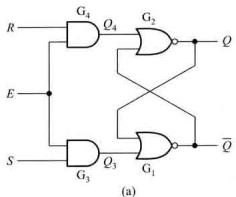

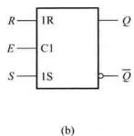  
图5.2.8 门控SR锁存器（a）逻辑电路 （b）逻辑符号

控SR锁存器产品。但是，在许多中、大规模集成电路中时常应用这种锁存器，或用它构成触发器或存储器。所以，SR锁存器仍是重要的基本逻辑单元。

图5.2.8(b)所示是门控SR锁存器的逻辑符号。其方框内用C1和 $\mathrm{IR},\mathrm{IS}$ 表达内部逻辑之间的关联关系。C表示这种关联属于控制类型，其后级用标识序号“1”表示该输入的逻辑状态对所有以“1”作为前缀的输入起控制作用。这里因置位和复位输入均受C1的控制，故S和R之前分别以标识序号“1”作为前缀。图5.2.8(b)中所示的两个输出端 $Q$ 和 $\overline{Q}$ ，其意义与图5.2.1

(b) 所示基本 $SR$ 锁存器相同。

例5.2.3图5.2.8(a)所示，设SR锁存器的 $E,S$ $R$ 的波形如图5.2.9中横虚线下面所示，设锁存器的初始状态为 $Q = 0,\overline{Q} = 1$ ，试画出 $Q_{3},Q_{4},Q$ 和 $\overline{Q}$ 的波形。

解：从图5.2.8（a）的逻辑电路图得 $Q_{3} = SE$ ， $Q_{4} = RE$ 。于是，可根据 $E, S$ 和 $R$ 的波形画出 $Q_{3}$ 和 $Q_{4}$ 的波形。图5.2.8（a）中 $G_{1}, G_{2}$ 构成基本SR锁存器，再根据表5.2.1即可画出 $Q$ 和 $\overline{Q}$ 的波形。全部波形如图5.2.9所示。

# 2.CMOS集成电路中的门控SR锁存器

在集成电路中，往往根据具体条件，尽量应用简化电路来实现所要求的逻辑功能。例如，图5.2.10所示是一种CMOS集成电路中常用的门控SR锁存器晶体管级电路，它仅用6个NMOS管和两个PMOS管便实现了图5.2.8(a)所

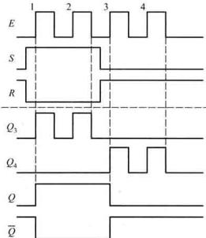  
图5.2.9 例5.2.3的波形图

示的两个与门和两个或非门的逻辑功能，而没有使用标准CMOS门电路，从而省却了一些PMOS晶体管。由于一般CMOS与或非门中的PMOS管占据芯片的面积远大于相应的NMOS管①，所以

图5.2.10所示电路的简化有效缩小了锁存器在集成电路芯片中所占的空间。在正常逻辑状态下，该电路只在状态转换瞬间存在一定的工作电流，静态功耗极微。但需要注意，如果在 $E = 1$ 的同时 $S = R = 1$ ，则 $\mathrm{T}_1 - \mathrm{T}_3$ 和 $\mathrm{T}_5 - \mathrm{T}_7$ 均处于导通状态，将使电路功耗剧增。因此，在集成电路结构设计时就必须考虑到严格遵守 $SR = 0$ 的约束条件，保证在任何时候都不出现 $S = R = 1$ 的情况。

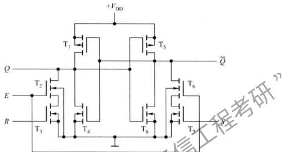  
图5.2.10 CMOS门控SR锁存器电路

由于图5.2.10所示电路不是用标准逻辑门电路构成的，所以在考虑它的动态特性时，按图5.2.8(a)所示的与门和或非门去逐级累加计算传输延迟时间是脱离实际的。应用中，一般通过查阅芯片的数据手册直接了解相关参数。

# 复习思考题

5.2.1 图5.2.1所示基本SR锁存器和图5.2.8(a)所示门控SR锁存器在电路结构、数据锁存动作上有什么区别？为什么它们在工作中均须遵循 $SR = 0$ 的约束条件？  
5.2.2 为什么图5.2.10中的CMOS门控SR锁存器电路可以节省一些晶体管？这样的电路有什么优点和应用上的注意事项？

# 5.3 $D$ 锁存器

# 5.3.1 $D$ 锁存器的电路结构

与 $SR$ 锁存器不同， $D$ 锁存器在工作中不存在非定义状态，因而得到广泛应用。目前，CMOS集成电路主要采用传输门控 $D$ 锁存器和逻辑门控 $D$ 锁存器两种电路结构形式，特别是前者电路结构简单、在芯片中占用面积小而更受青睐。

# 1. 传输门控 $D$ 锁存器

在图5.1.1的双稳态电路中插入两个传输门 $\mathrm{TG}_1$ 和 $\mathrm{TG}_2$ ，则可构成如图5.3.1(a)所示的传输门控 $D$ 锁存器，图5.3.1(b)所示是它的逻辑符号。

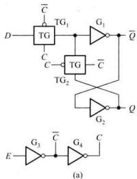

图5.3.1 传输门控 $D$ 锁存器  
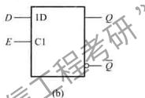  
(a) 逻辑电路 (b) 逻辑符号

$D$ 锁存器有两个输入端：使能端 $E$ 和数据输入端 $D$ 。当 $E = 1$ 时， $\overline{C} = 0, C = 1, \mathrm{TG}_1$ 导通， $\mathrm{TG}_2$ 断开，如图5.3.2(a)所示。输入数据 $D$ 经 $G_{1}, G_{2}$ 两个非门，使 $Q = D, \overline{Q} = \overline{D}$ 。显然，这时 $Q$ 端跟随输入信号 $D$ 的变化。当 $E = 0$ 时， $\overline{C} = 1, C = 0, \mathrm{TG}_1$ 断开， $\mathrm{TG}_2$ 导通，如图5.3.2(b)所示，其原理与图5.1.1所示双稳态电路相同。由于 $G_{1}, G_{2}$ 输入端存在的分布电容对逻辑电平有暂短的保持作用，在两个传输以状态转换瞬间并不影响电路的输出状态。之后，电路将被锁定在 $E$ 信号由1变0前瞬间 $D$ 信号所确定的状态，在 $E = 0$ 的条件下可保持锁存器状态不变，使1位二进制数据得以存储。表5.3.1概括了 $D$ 锁存器的功能。由于这种锁存器在 $E = 1$ 时 $Q$ 端可跟随 $D$ 端的逻辑状态变化，故又称为透明锁存器。

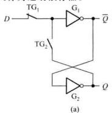

图5.3.2 传输门的开关状态   
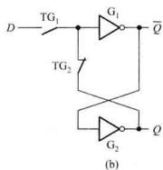  
(a) $E = 1$ 时的状态 (b) $E = 0$ 时的状态

表 5.3.1 D 锁存器的功能表  

<table><tr><td>E</td><td>D</td><td>Q</td><td>Q</td><td>功能</td></tr><tr><td>0</td><td>×</td><td>不变</td><td>不变</td><td>保持</td></tr><tr><td>1</td><td>0</td><td>0</td><td>1</td><td>置0</td></tr><tr><td>1</td><td>1</td><td>1</td><td>0</td><td>置1</td></tr></table>

# 2. 逻辑门控 $D$ 锁存器

图5.3.3所示为逻辑门控 $D$ 锁存器的逻辑电路，它在门控 $SR$ 锁存器的 $S$ 和 $R$ 输入端之间连接了一个非门 $G_{S}$ ，从而保证了 $SR = 0$ 的约束条件，消除了可能出现的非定义状态。读者可仿照前述方法自行分析，并用表5.3.1来验证图5.3.3所示电路的逻辑功能。由于它的逻辑功能与传输门控 $D$ 锁存器完全相同，所以逻辑符号亦相同。

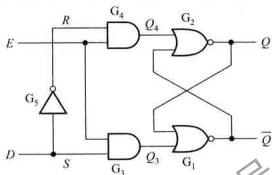  
图5.3.3 逻辑门控 $D$ 锁存器的逻辑电路

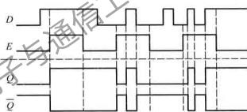  
图5.3.4 例5.3.1的波形图

例5.3.1设图5.3-1(a)所示电路的初始状态为 $Q = 0$ ，输入信号 $D,E$ 的波形如图5.3.4中横虚线上面所示，画出 $Q$ 和 $\overline{Q}$ 的输出波形。

解：根据图5.3.2(a)、(b)，当 $E = 1$ 时， $Q$ 端波形跟随 $D$ 端变化；当 $E$ 跳变为0时，锁存器保持此前瞬间的状态，可以画出 $Q$ 和 $\overline{Q}$ 波形如图5.3.4中横虚线下面所示。

# 5.3.2 典型的 $D$ 锁存器集成电路

# 1. 74HC/HCT373

图5.3.5为中规模集成的CMOS八 $D$ 锁存器74HC/HCT373的内部逻辑图，其核心电路是8个如图5.3.1(a)所示的传输门控 $D$ 锁存器。8个锁存器共用同一对互补的传输门控制信号 $C$ 和 $\overline{C}$ ，这对信号又由锁存使能信号 $LE$ 所驱动。当 $LE$ 为高电平时，允许各 $D$ 锁存器的输出跟随相应输入信号的变化； $LE$ 为低电平时则保持状态不变。8个 $D$ 锁存器输出端都带有三态门，当输出三态门使能信号 $\overline{OE}$ 为低电平时，三态门有效，输出锁存的信号；当 $\overline{OE}$ 为高电平时，输出处于高阻状态。这种三态输出电路，一方面提高了对负载的驱动能力，在锁存器与输出负载之间起到

隔离作用，避免因负载变化而影响锁存器的动态特性；更重要的是使74HC/HCT373可以方便地应用于微处理机或计算机的总线传输电路。

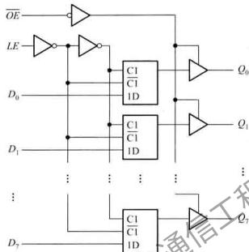  
图5.3.5 74HC/HCT373八D锁存器的内部逻辑图

根据 $LE$ 和 $OE$ 的不同逻辑电平，74.1C/HCT373可分为三种工作模式：①使能和读锁存器（传送模式）；②锁存和读锁存器；③禁止输出。表5.3.2所示为其功能表。

表5.3.2 74HC/HCT373的功能表  

<table><tr><td rowspan="2">工作模式</td><td colspan="3">输入</td><td rowspan="2">内部锁存器 状态</td><td>输出</td></tr><tr><td>\( \overline{OE} \)</td><td>\( {LE} \)</td><td>\( {D}_{N} \)</td><td>\( {Q}_{N} \)</td></tr><tr><td rowspan="2">使能和读锁存器 (传送模式)</td><td>L</td><td>H</td><td>L</td><td>L</td><td>L</td></tr><tr><td>L</td><td>H</td><td>H</td><td>H</td><td>H</td></tr><tr><td rowspan="2">锁存和读锁存器</td><td>L</td><td>L</td><td>L*</td><td>L</td><td>L</td></tr><tr><td>L</td><td>L</td><td>\( {\mathrm{H}}^{ * } \)</td><td>H</td><td>H</td></tr><tr><td>禁止输出</td><td>H</td><td>✘</td><td>✘</td><td>✘</td><td>高阻</td></tr></table>

注： $D_N$ 和 $Q_N$ 的下标表示第 $N$ 位锁存器数据。L*和H*表示使能信号LE的电平由高变低之前瞬间 $D_N$ 的电平。

# 2. 74LVC32373A

图5.3.6所示为“宽总线”锁存器74LVC32373A的内部简化逻辑图，芯片中集成了32个三态输出的 $D$ 锁存器，它们分为4组，每一组的逻辑功能都相当于一个74HC373，各组间既可同步工作，又可独立运行，异步工作。这种结构给芯片的总线应用带来很大的灵活性。除此之外，一般还能找到16位、20位等“宽总线” $D$ 锁存器集成电路产品，以适用于不同总线宽度的微处理机

系统。

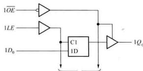  
至第1组其他7个通道

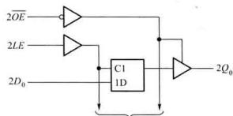  
至第2组其他7个通道

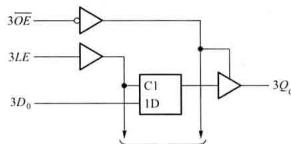  
至第3组其他7个通道

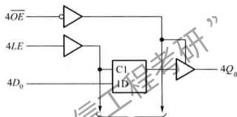  
第4组其他7个通道  
图5.3.6 “宽总线”D锁存器74LVC32373A的内部简化逻辑图

# 3. 74LVC1G373

图5.3.7所示为“小逻辑”锁存器74LCYG373的内部逻辑图，它的封装中只有一路 $D$ 锁存器，其逻辑功能只相当于74HC373中的一个通道。

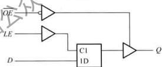  
图5.3.7 “小逻辑”D锁存器74LVC1G373的内部逻辑图

# 5.3.3 $D$ 锁存器的动态特性

图5.3.8所示是 $D$ 锁存器的定时图，对于传输门控和逻辑门控两种电路结构的 $D$ 锁存器都是适用的，只是具体参数值有所差异。下面对各参数进行说明。

传输延迟时间 $t_{\mathrm{pd}}$

$t_{\mathrm{pd}}$ 是输出信号对输入信号的响应延迟时间，对于 $D$ 锁存器则是指 $D$ 信号和 $E$ 信号共同作用后， $Q$

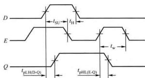  
图5.3.8 $D$ 锁存器的定时图

（或 $\overline{Q}$ ）端响应的延迟时间。图5.3.8中所示 $t_{\mathrm{pH}(D - Q)}$ 是输出 $Q$ 从低电平到高电平对 $D$ 信号的延迟时间， $t_{\mathrm{pHL(E - Q)}}$ 则是 $Q$ 从高电平到低电平对 $E$ 信号的延迟时间。根据不同的输入状态，还存在图中没有显示的 $t_{\mathrm{pHL(D - Q)}}$ 和 $t_{\mathrm{pLH(E - Q)}}$ 。对于CMOS集成电路，因为输出信号对各输入信号的延迟相差不多，有时统一以 $t_{\mathrm{pHL}}$ 和 $t_{\mathrm{pLH}}$ 表达，更经常的是取平均传输延迟时间： $t_{\mathrm{pd}} = (t_{\mathrm{pHL}} + t_{\mathrm{pHL}}) / 2$

建立时间 $t_{\mathrm{SU}}$

信号 $D$ 的逻辑电平必须在使能信号 $E$ 下降沿到来之前建立起来，才能保证正确地锁存。 $t_{\mathrm{SU}}$ 表示 $D$ 信号对 $E$ 下降沿的最少时间提前量。

保持时间 $t_{\mathrm{H}}$

在 $E$ 电平下降后， $D$ 信号不允许立即撤除，否则不能确保数据的锁存。 $t_H$ 表示 $D_H$ 信号电平在 $E$ 电平下降后需要继续保持的最少时间。

脉冲宽度 $t_{\mathrm{w}}$

为保证 $D$ 信号正确传送到 $Q$ 和 $\overline{Q}$ ，要求 $E$ 信号的脉冲宽度不小于 $t_{2}$

上述 $t_{\mathrm{SU}}, t_{\mathrm{H}}$ 和 $t_{\mathrm{w}}$ 是对输入信号的时间要求。如果电路运行中达不到要求，则会分别出现如图5.3.9所示的情况，可能导致 $D$ 锁存器不确定的逻辑输出。

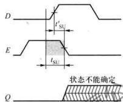  
(a)

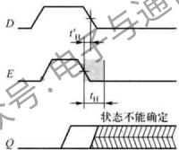  
(b)

(c)   
图5.3.9 $t_{\mathrm{SU}}$ 、 $t_{\mathrm{H}}$ 和 $t_{\mathrm{s}}$ 达不到要求时可能导致 $D$ 锁存器不确定的逻辑输出  
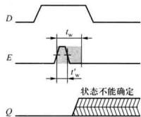  
(a) $t_{\mathrm{SU}}^{\prime} < t_{\mathrm{SU}}$ (b) $t_{\mathrm{H}}^{\prime} < t_{\mathrm{H}}$ (c) $t_{\mathrm{w}}^{\prime} < t_{\mathrm{w}}$

在生产厂家提供的数据手册中，都会给出这些时间关系的明确限度，表5.3.3示出环境温度在 $-40\% \sim +85\%$ 范围的几种典型 $D$ 锁存器的定时参数。

表 5.3.3 几种典型的 $D$ 锁存器定时参数  

<table><tr><td rowspan="3">型号</td><td rowspan="3">功能</td><td rowspan="3">工作电压 \( {V}_{\mathrm{{CC}}}/\mathrm{V} \)</td><td colspan="4">\( {t}_{\text{pd }}/\mathrm{{ns}} \)</td><td rowspan="2">\( {t}_{\mathrm{{SC}}}/\mathrm{{ns}} \)</td><td rowspan="2">\( {t}_{\mathrm{{ff}}}/\mathrm{{ns}} \)</td><td rowspan="2">\( {t}_{\mathrm{w}}/\mathrm{{ns}} \)</td></tr><tr><td colspan="2">\( D - Q \)</td><td colspan="2">\( {LE} - Q \)</td></tr><tr><td>最小</td><td>最大</td><td>最小</td><td>最大</td><td>最小</td><td>最小</td><td>最小</td></tr><tr><td>74HCT373</td><td>八 \( D \) 锁存器</td><td>4.5</td><td></td><td>38</td><td></td><td>44</td><td>13</td><td>12</td><td>20</td></tr><tr><td>74LVC32373A</td><td>三十二 \( D \) 锁存器</td><td>\( {3.3} \pm  {0.3} \)</td><td>1.6</td><td>4.2</td><td>2.1</td><td>4.6</td><td>1.7</td><td>1.2</td><td>3.3</td></tr><tr><td>74LVC1G373</td><td>单 \( D \) 锁存器</td><td>\( {3.3} \pm  {0.3} \)</td><td>1</td><td>5.4</td><td>1</td><td>5.5</td><td>1.5</td><td>1.5</td><td>3</td></tr></table>

*测试条件： $Q$ 端负载电容 $C_{\mathrm{L}} = 50 \mathrm{pF}$ 。  
（摘自http://www.ti.com/）

在设计工作中，对电路的动态特性必须予以充分重视，特别是电路工作在接近定时极限的高频条件下，对上述时间关系更要注意留有充分余地。否则，电路在长期工作时会发生原因难以查明的偶发性逻辑错误，或因环境条件改变（如温度变化）而出现工作不稳定的情况。

# 复习思考题

5.3.1 传输门控和逻辑门控 $D$ 锁存器在电路结构和工作原理上有何不同？

5.3.2 $D$ 锁存器工作时对使能信号 $E$ 和输入信号 $D$ 在定时上有什么要求？输出信号 $Q$ 的变化对输入信号 $D_{\mathrm{c}}$ 使能信号 $E$ 有何定时特性？

# 5.4 触发器的电路结构和工作原理

本节讨论另一种对脉冲边沿敏感的双稳态电路。如前所述， $D$ 额存器在使能信号 $E$ 为逻辑1期间更新状态，在图5.4.1(a)所示的波形图中以加粗部分表示这个敏感时段。在这期间，它的输出会随输入信号变化。而很多时序电路要求存储电路只对时钟信号的上升沿或下降沿敏感，而在其他时刻保持状态不变，例如6.5节中将要讨论的移位寄存器和计数器。这种对时钟脉冲边沿敏感的状态更新称为触发，具有触发工作特性的存储单元称为触发器。电路结构不同的触发器对时钟脉冲的敏感边沿可能不同，分为上升沿触发和下降沿触发。本书以 $CP(\mathrm{Clock}$ Pulse)命名上升沿触发的时钟信号，触发边沿如图5.4.1(b)波形中的箭头所示；以 $CP$ 命名下降沿触发的时钟信号，触发边沿如图5.4.1(c)中箭头所示。

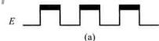

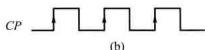

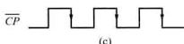  
图5.4.1 锁存器对使能信号的响应和触发器对时钟信号的响应（a）对脉冲商电平敏感（b）对脉冲上升沿敏感（c）对脉冲下降沿敏感

在VerilogHDL中，对脉冲电平敏感的锁存器和脉冲边沿敏感的触发器的描述语句是不同的，这一点将在5.6节中说明。正因为如此，这里要特别强调锁存器与触发器在概念上的差异。

目前应用的触发器主要有三种电路结构：主从触发器、维持阻塞触发器和利用传输延迟的触发器。由于CMOS主从结构的 $D$ 触发器在芯片上占用的面积最小，逻辑设计方法也较简单，在

大规模CMOS集成电路，特别是可编程逻辑器件（如CPLD、FPGA）和专用集成电路（ASIC）中得到普遍应用，因而在目前的工程实践中也会更多地面对这种 $D$ 触发器。下面重点讨论CMOS主从 $D$ 触发器。

# 5.4.1 主从 $D$ 触发器的电路结构和工作原理

将两个如图5.3.1(a)所示 $D$ 锁存器级联，则构成典型的CMOS主从 $D$ 触发器，如图5.4.2所示。图中左边的锁存器称为主锁存器，右边的称为从锁存器。主锁存器与从锁存器的使能信号相位相反，利用两个锁存器的交互锁存，则可实现存储数据和输入信号之间的隔离。

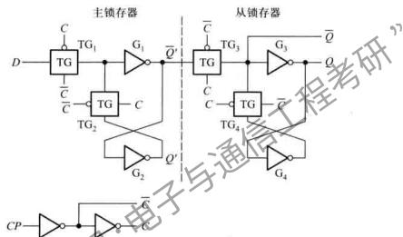  
图5.4.2 CMOS主从 $D$ 触发器的逻辑电路

主从 $D$ 触发器工作过程分为以下两个节拍

① 当时钟信号 $CP = 0$ 时， $\overline{C} = 1, C = 0$ ，使 $\mathrm{TG}_1$ 导通， $\mathrm{TG}_2$ 断开， $D$ 端输入信号进入主锁存器，这时 $Q'$ 跟随 $\overline{D}$ 端的状态变化，使 $Q' = D$ 。例如， $D$ 为1时，经 $\mathrm{TG}_1$ 传到 $\mathrm{G}_1$ 的输入端，使 $\overline{Q'} = 0, Q' = 1$ 。同时由于 $\mathrm{TG}_1$ 断开，切断了从锁存器与主锁存器之间的联系，而 $\mathrm{TG}_4$ 导通，使 $\mathrm{G}_3$ 的输入端和 $\mathrm{G}_4$ 的输出端经 $\mathrm{TG}_4$ 连通，构成最基本的双稳态电路，使从锁存器维持原来的状态，即触发器的输出状态不变。  
② 当 $CP$ 由0跳变到1后， $\overline{C} = \mathbf{0}, C = \mathbf{1}$ ，使 $\mathrm{TG}_1$ 断开，从而切断了 $D$ 端与主锁存器的联系，同时 $\mathrm{TG}_2$ 导通，将 $\mathrm{G}_1$ 的输入端和 $\mathrm{G}_2$ 的输出端连通，主锁存器锁存 $CP$ 跳变前 $D$ 端的数据。这时， $\mathrm{TG}_3$ 导通， $\mathrm{TG}_4$ 断开， $Q'$ 端信号传送到 $Q$ 端。若 $Q' = 1, Q' = 0$ ，经 $\mathrm{TG}_3$ 传送给 $\mathrm{G}_3$ 的输入端，于是 $\overline{Q} = \mathbf{0}, Q = 1$ 。

可见，从锁存器在工作中是跟随主锁存器的状态变化的，触发器因之冠名主从（Master-Slave）。它的状态转换发生在 $CP$ 信号上升沿到来后的瞬间，输出状态由 $CP$ 信号上升沿到达前瞬间的数据信号 $D$ 所决定，从功能上考虑称为 $D$ 触发器。如果以 $Q^{n + 1}$ 表示 $CP$ 信号上升沿到达

后触发器的状态，则 $D$ 触发器的特性可以用下式来表达：

$$
Q ^ {n + 1} = D \tag {5.4.1}
$$

该式称为 $D$ 触发器的特性方程。它反映了触发器在时钟信号作用后的状态与此前输入信号 $D$ 的关系。

# 5.4.2 典型的主从 $D$ 触发器集成电路

# 1. 74HC/HCT74

图5.4.3所示是一种CMOS集成 $D$ 触发器的内部逻辑电路。由于实际应用中有时需要对触发器进行异步（即与图中 $CP$ 信号无关)置位、复位，所以电路中引入了直接置0端 $\overline{R}_{\mathrm{D}}$ 和直接置1端 $\overline{S}_{\mathrm{D}}$ 。这两个信号经非门缓冲后，分别送入主锁存器和从锁存器。当 $CP = 1$ 时， $\mathrm{TG}_1, \mathrm{TG}_4$ 断开而 $\mathrm{TG}_2, \mathrm{TG}_3$ 导通，或非门 $G_{1}$ 和 $G_{2}$ 构成基本 $SR$ 锁存器，可以把 $\overline{R}_{\mathrm{D}}$ 或 $\overline{S}_{\mathrm{D}}$ 信号锁存在主锁存器，进而传送到 $Q$ 和 $\overline{Q}$ 端。当 $CP = 0$ 时， $\mathrm{TG}_1$ 断开 $\mathrm{TG}_4$ 导通，或非门 $G_{1}$ 和 $G_{2}$ 构成基本 $SR$ 锁存器，同样可把 $\overline{R}_{\mathrm{D}}$ 或 $\overline{S}_{\mathrm{D}}$ 信号锁存到 $Q$ 和 $\overline{Q}$ 端。显然， $\overline{S}_{\mathrm{D}}$ 和 $\overline{R}_{\mathrm{D}}$ 对触发器的状态有优先控制权。只有当 $\overline{S}_{\mathrm{D}} = \overline{R}_{\mathrm{D}} = 1$ 时，触发器才能被 $CP$ 上升沿触发，按 $D$ 端逻辑值更新状态。

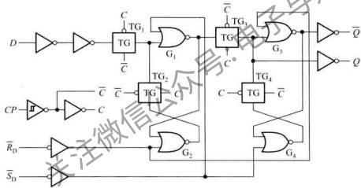  
图5.4.3 74HC/HCT74中 $D$ 触发器的逻辑图

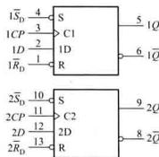  
图5.4.4 74HC/HCT74的逻辑符号

由图可见，触发器的所有输入、输出都设置了缓冲电路，这些措施提高了电路工作的稳定性。为了避免 $CP$ 脉冲上升沿或下降沿在跨越阈值电平时的噪声引发触发器的误触发，电路在 $CP$ 输入端特别增置了施密特反相器，以提高抗干扰能力（施密特电路的抗干扰原理请参见第8章）。

双 $D$ 触发器74HC/HCT74芯片中集成了两个如图5.4.3所示的 $D$ 触发器，它们之间相互独立，其逻辑符号见图5.4.4。图中方框内侧的“>”符号表示电路对 $CP$ 信号的脉冲边沿敏感，C1和C2分别关联控制着1D和2D。表5.4.1是74HC/HCT74中触发器的功能表。表的上半部分是 $\overline{S}_{\mathrm{D}}\backslash \overline{R}_{\mathrm{D}}$ 与输出信号的关系。其中，当 $\overline{S}_{\mathrm{D}}$ 和 $\overline{R}_{\mathrm{D}}$ 均为低电平时，输出 $Q$ 和 $\overline{Q}$ 均为高电平，若 $\overline{S}_{\mathrm{D}}\backslash \overline{R}_{\mathrm{D}}$

同时恢复高电平，则不能确定触发器此后的状态，因而 $R_{\mathrm{D}}S_{\mathrm{D}} = 0$ （即 $S_{\mathrm{D}} + \overline{R}_{\mathrm{D}} = 1$ ）仍为约束条件。表5.4.1的下半部分是在 $\overline{S}_{\mathrm{D}}, \overline{R}_{\mathrm{D}}$ 均为高电平时的动态功能表。符号“↑”表示 $CP$ 脉冲上升沿触发， $Q^{n+1}$ 和 $\overline{Q}^{n+1}$ 分别为 $CP$ 脉冲上升沿到达后 $Q$ 和 $\overline{Q}$ 端的状态。

表 5.4.1 74HC/HCT74 的功能表  

<table><tr><td colspan="4">输入</td><td colspan="2">输出</td></tr><tr><td>\( \overline{S}_{\mathrm {D}} \)</td><td>\( \overline{R}_{\mathrm {D}} \)</td><td>\( CP \)</td><td>\( D \)</td><td>\( Q \)</td><td>\( \overline{Q} \)</td></tr><tr><td>L</td><td>H</td><td>×</td><td>×</td><td>H</td><td>L</td></tr><tr><td>H</td><td>L</td><td>×</td><td>×</td><td>L</td><td>\( \gamma^{+} \)H</td></tr><tr><td>L</td><td>L</td><td>×</td><td>×</td><td>H</td><td>H</td></tr><tr><td>\( \overline{S}_{\mathrm {D}} \)</td><td>\( \overline{R}_{\mathrm {D}} \)</td><td>\( CP \)</td><td>\( D \)</td><td>\( Q^{*+1} \)</td><td>\( \overline{Q}^{*+1} \)</td></tr><tr><td>H</td><td>H</td><td>↑</td><td>\( L^{+} \)</td><td>L</td><td>H</td></tr><tr><td>H</td><td>H</td><td>↑</td><td>\( H^{+} \)</td><td>H</td><td>L</td></tr></table>

L*和H*表示CP脉冲上升沿到来之前瞬间的电平。

# 2. 74LVC1G79

小逻辑系列的 $D$ 触发器74LVC1G79的内部逻辑图如图5.4.5所示，其逻辑已达到最简。

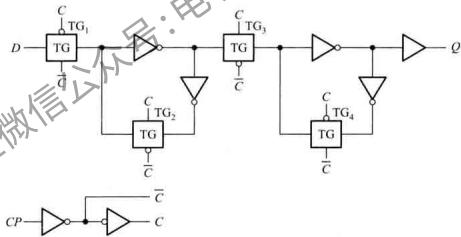  
图5.4.5 74LVC1G79的内部逻辑图

与锁存器类似， $D$ 触发器同样有宽总线产品，如74LVC32374，不再赘述。

# 5.4.3 主从 $D$ 触发器的动态特性

图5.4.6的定时图显示了 $CP$ 上升沿触发的 $D$ 触发器的动态特性，它反映了输出对时钟信号响应的延迟时间，以及对输入逻辑信号和时钟信号的定时要求。下面以前述上升沿触发的 $D$ 触发器为例进行说明。

传输延迟时间 $t_{\mathrm{pd}}$

时钟脉冲 $CP$ 上升沿至输出端新状态稳定建立起来的时间定义为 $D$ 触发器的传输延迟时间。图5.4.6所示波形中， $t_{\mathrm{pLH}}$ 是输出 $Q$ 从低电平到高电平的延迟时间， $t_\mathrm{pHL}$ 则是 $Q$ 从高电平到低电平的延迟时间。应用中更多地取它们的平均值，即平均传输延迟时间 $t_\mathrm{pd} = (t_\mathrm{pLH} + t_\mathrm{pHL}) / 2$

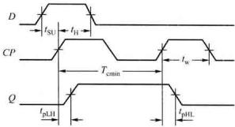  
图5.4.6 $D$ 触发器定时图

建立时间 $t_{\mathrm{SU}}$

输入信号 $D$ 的变化会引起触发器内部电路逻辑电平的一系列变化，为保证相关电路建立起稳定的状态，信号 $D$ 必须提前于时钟信号 $CP$ 的上升沿（对上升沿触发的触发器而言）就稳定在指定的逻辑电平上，以使触发器状态得到正确的转换。该提前时间的最小值即建立的时间 $t_{\mathrm{S1}}$

保持时间 $t_{\mathrm{H}}$

信号 $D$ 在 $CP$ 上升沿到来之后还应保持一定时间，才能保证 $Q$ 状态可靠地传送到 $Q$ 和 $\overline{Q}$ 端，该时间的最小值称为保持时间 $t_\mathrm{h}$ 。由于技术的进步，已有多种触发器把保持时间几乎降到0。这项特性在高速移位寄存器或计数器中是十分重要的。

触发脉冲宽度 $t_{\mathrm{w}}$

为保证可靠触发，要求时钟脉冲 $CP$ 的宽度不小于 $t_{\mathrm{s}}$ ，以保证内部门电路有足够的时间实现正确的翻转。

最高时钟频率 $f_{\mathrm{emax}}$

触发器所能响应的时钟脉冲 $CP$ 的最高频率， $f_{\mathrm{max}} = 1 / T_{\mathrm{emax}}$ 。因为 $CP$ 无论在高电平还是在低电平期间，触发器内部都要完成一系列动作，存在一定的时间延迟，所以对于 $CP$ 最高工作频率有一个限制。

对于特定型号的 $D$ 触发器，上述动态特性参数在生产厂家的数据手册中都会给出。表5.4.2所示为环境温度在 $-40\% \sim +85\%$ 范围的几种典型 $D$ 触发器的定时参数。

表 5.4.2 几种典型的 $D$ 触发器定时参数  

<table><tr><td rowspan="2">型号</td><td rowspan="2">功能</td><td rowspan="2">工作电压 \( {V}_{\mathrm{{CC}}}/\mathrm{V} \)</td><td colspan="2">\( {t}_{\text{paf }}/\mathrm{{ns}} \)</td><td>\( {t}_{\mathrm{{sc}}}/\mathrm{{ns}} \)</td><td>\( {t}_{\mathrm{H}}/\mathrm{{ns}} \)</td><td>\( {t}_{\mathrm{w}}/\mathrm{{ns}} \)</td><td>\( {f}_{\max }/\mathrm{{MHz}} \)</td></tr><tr><td>最小</td><td>最大</td><td>最小</td><td>最小</td><td>最小</td><td>最高</td></tr><tr><td>74HC74</td><td>双 D 触发器</td><td>4.5</td><td></td><td>44</td><td>25</td><td>0</td><td>20</td><td>25</td></tr><tr><td>74HC374</td><td>八 D 触发器</td><td>4.5</td><td></td><td>45</td><td>25</td><td>5</td><td>20</td><td>24</td></tr><tr><td>74AUC1G74</td><td>单 D 触发器</td><td>\( {2.5} \pm  {0.2} \)</td><td>0.8</td><td>1.2</td><td>0.4</td><td>0.3</td><td>1</td><td>275</td></tr><tr><td>74LVC1G79</td><td>单 D 触发器</td><td>\( {3.3} \pm  {0.3} \)</td><td>1</td><td>4</td><td>1.3</td><td>1</td><td>2.5</td><td>160</td></tr><tr><td>74AUC1G79</td><td>单 D 触发器</td><td>\( {2.5} \pm  {0.2} \)</td><td>0.3</td><td>1.3</td><td>0.5</td><td>0.1</td><td>1.7</td><td>275</td></tr></table>

*测试条件：表中74HC系列逻辑电路的 $Q$ 端负载电容为 $C_{\mathrm{L}} = 50 \mathrm{pF}$ ，其余逻辑系列为 $C_{\mathrm{L}} = 15 \mathrm{pF}$ 。  
（摘自http://www.ti.com/）

# 5.4.4 其他电路结构的触发器

# 1. 维持阻塞触发器

维持阻塞结构的 $D$ 触发器逻辑电路如图5.4.7所示。该触发器由6个与非门构成，其中， $\mathrm{G}_1, \mathrm{G}_2, \mathrm{G}_3$ 和 $\mathrm{G}_4$ 响应外部输入信号 $D$ 和时钟信号 $CP$ ，所产生的 $\overline{S}$ 和 $\overline{R}$ 信号控制由 $\mathrm{G}_5, \mathrm{G}_6$ 构成的基本 $\overline{S} R$ 锁存器的状态，也就是整个触发器的状态。下面分析其工作原理。

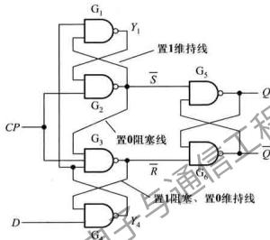  
图5.4.7 维持阻塞 $D$ 触发器的逻辑电路

① 当 $CP = 0$ 时，与非门 $G_{2}$ 和 $G_{3}$ 被低电平封锁，它们的输出 $\overline{S} = \overline{R} = 1$ ，使 $G_{5}, G_{6}$ 组成的输出锁存器处于保持状态，触发器的输出 $Q$ 和 $\overline{Q}$ 不变。同时， $\overline{S}$ 和 $\overline{R}$ 的高电平分别反馈到 $G_{1}$ 和 $G_{4}$ 输入端，将这两个门打开，使 $Y_{4} = \overline{D}, Y_{1} = \overline{Y}_{4} = D$ ，D信号进入触发器，为触发器状态更新做好准备。  
② 由 $CP$ 由0跳变到1后瞬间， $\mathrm{G}_2$ 和 $\mathrm{G}_3$ 打开， $\overline{S}$ 和 $\overline{R}$ 分别由 $Y_1$ 和 $Y_4$ 的状态所决定，即 $\overline{S} = \overline{Y}_1 = \overline{D}^*$ ， $\overline{R} = \overline{Y}_4 = D^*$ 。这里， $D^*$ 表示 $CP$ 脉冲上升沿到来之前 $D$ 的逻辑值。可以看出， $\overline{S}$ 和 $\overline{R}$ 的逻辑值始终是互补的，即二者中仅有一个为0。如果 $D^* = 1$ ，则 $\overline{S} = \overline{D^*} = 0$ ， $\overline{R} = \overline{D^*} = 1$ ，将输出基本 $\overline{S} \overline{R}$ 锁存器置1，即触发器状态更新为 $Q^{n+1} = 1$ 。在 $CP = 1$ 期间， $\overline{S} = 0$ 将 $\mathrm{G}_1$ 和 $\mathrm{G}_3$ 封锁。其中， $\overline{S}$ 至 $\mathrm{G}_1$ 输入端的反馈线使 $Y_1 = 1$ ，起到维持 $\overline{S} = 0$ 的作用，从而维持了触发器的1状态，故称之为置1维持线。虽然 $D$ 信号在 $CP = 1$ 期间可能由1跳变为0，使 $Y_4 = 1$ ，但 $\overline{S}$ 至 $\mathrm{G}_3$ 输入端的反馈线将阻止 $\overline{R} = 1$ 状态的改变，从而阻塞了 $D$ 端输入的置0信号。故称该反馈线为置0阻塞线。反之，假若 $D^* = 0$ ，则 $\overline{S} = 1$ ， $\overline{R} = 0$ ，触发器状态更新为 $Q^{n+1} = 0$ 。在 $CP = 1$ 期间， $\overline{R}$ 至 $\mathrm{G}_2$ 输入端反馈线上的信号将 $\mathrm{G}_4$ 封锁，使 $Y_4 = 1$ ，既阻塞了 $D = 1$ 信号进入触发器的路径，又通过 $\overline{R} = \overline{Y_4 \cdot \overline{S} \cdot CP} = 0$ ，将

触发器维持在0状态。故这根反馈线称为置1阻塞、置0维持线

待 $CP$ 高电平结束，电路又回到①所描述的状况。可以看出，触发器只在 $CP$ 由0跳变到1瞬间更新状态，其余时间均处于保持不变的状态。

虽然维持阻塞 $D$ 触发器的电路结构与前述主从 $D$ 触发器完全不同，但这两个电路所实现的逻辑功能是完全相同的，都是在 $CP$ 脉冲上升沿到来后瞬间转换输出状态，将输入信号 $D$ 传递到 $Q$ 端并保持下去。因此，它们使用同一逻辑符号和特性方程[即式(5.4.1)]来表达，并具有十分相似的动态特性。

# 2. 利用传输延迟的触发器

一种利用传输延迟实现的 $JK$ 触发器电路结构如图5.4.8所示。由 $\mathrm{G}_{11}$ 、 $\mathrm{G}_{12}$ 、 $\mathrm{G}_{13}$ 和 $\mathrm{G}_{21}$ 、 $\mathrm{G}_{22}$ 、 $\mathrm{G}_{23}$ 构成两个与或非门，它们交叉耦合进一步构成 $SR$ 锁存器作为触发器的输出电路，而与非门 $\mathrm{G}_3$ 和 $\mathrm{G}_4$ 则构成触发器的输入电路接收输入信号 $J$ 、 $K$ 。另外，在集成电路的工艺上保证 $\mathrm{G}_3$ 和 $\mathrm{G}_4$ 门的传输延迟时间大于 $SR$ 锁存器的翻转时间。该触发器的工作原理如下：

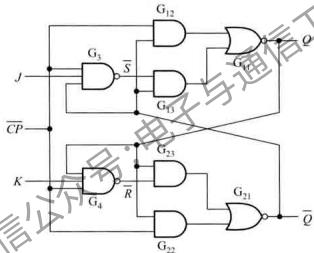  
图5.4.8 利用传输延迟的JK触发器的逻辑电路

① $\overline{CP} = 0$ 时，不仅封锁了 $\mathrm{G}_{12},\mathrm{G}_{22}$ ，而且也封锁了 $\mathrm{G}_3,\mathrm{G}_4$ ，不论 $J,K$ 为何状态， $S,R$ 均为1，使 $\mathrm{G}_{13},\mathrm{G}_{23}$ 打开，于是 $\mathrm{G}_{11}$ 和 $\mathrm{G}_{21}$ 形成交叉耦合的锁定状态，输出 $Q,\overline{Q}$ 保持原状态不变。  
② $\overline{CP}$ 由0变1后瞬间， $\mathrm{G}_{12}, \mathrm{G}_{22}$ 两门传输延迟时间较短，首先打开，使 $\mathrm{G}_{11}$ 和 $\mathrm{G}_{21}$ 继续处于锁定状态，输出仍保持不变。经过 $\mathrm{G}_{3}, \mathrm{G}_{4}$ 稍长时间的传输延迟， $\overline{S}, \overline{R}$ 才反映出信号 $J, K$ 的作用。设 $\overline{CP}$ 由0到1跳变前触发器的状态为 $Q^{n}$ ，根据图5.4.8，在此后的 $\overline{CP} = 1$ 期间

$$
Q = \overline {\overline {{C P}} \cdot \overline {{Q ^ {*}}} + \overline {{S}} \cdot \overline {{Q ^ {*}}}} = Q ^ {*} \tag {5.4.2}
$$

$$
\bar {Q} = \overline {{C P}} \cdot Q ^ {*} + \bar {R} \cdot Q ^ {*} = \bar {Q} ^ {*} \tag {5.4.3}
$$

说明触发器状态仍与 $\overline{CP}$ 跳变前相同。同时

$$
\bar {S} = \overline {{C P}} \cdot J \cdot \overline {{Q ^ {n}}} = \bar {J} \overline {{Q ^ {n}}} \tag {5.4.4}
$$

$$
\bar {R} = \overline {{C P}} \cdot K \cdot Q ^ {n} = K Q ^ {n} \tag {5.4.5}
$$

无论 $J, K$ 为何值，若 $Q^{*} = 1$ ，则从式(5.4.4)可得 $\overline{S} = 1$ ；反之， $Q^{*} = 0$ ，则从式(5.4.5)可得 $\overline{R} = 1$ ；即 $\overline{S}, \overline{R}$ 不可能同时为0。这时，电路已接收输入信号 $J, K$ ，为触发器状态更新做好了准备。

③ $\overline{CP}$ 由1变0后的瞬间， $G_{12}, G_{22}$ 两门首先关闭，均输出为0。而 $G_{3}, G_{4}$ 两门的延迟使 $\overline{S}, \overline{R}$ 尚未变化，此时仍为 $\overline{S} = \overline{JQ^{\prime\prime}}, \overline{R} = \overline{KQ^{\prime\prime}}$ ，输出 $SR$ 锁存器可简化为图5.4.9所示电路，其状态由 $\overline{S}, \overline{R}$ 确定，于是，触发器状态由前一状态转换为下一状态。随着 $G_{3}, G_{4}$ 的延迟关闭， $\overline{S}, \overline{R}$ 均转换为1，触发器又进入①所分析的情况。

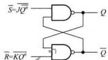  
图5.17 由1变0后瞬间输出 $R$ 镜存器的简化电路

由于这种触发器的状态更新发生在时钟脉冲由1变0瞬间即

时钟脉冲的下降沿，属于如图5.4.1(c)所示波形触发的触发器，所以我们从一开始就以 $\overline{CP}$ 来表示这种触发器的时钟信号。为了区别 $\overline{CP}$ 下降沿到来前、后触发器的状态，以 $Q^{n}$ 表示触发器现在的状态，以 $Q^{n + 1}$ 表示下一状态，根据图5.4.9的电路可得

$$
Q ^ {n + 1} = S R Q ^ {n} = J \overline {{Q}} ^ {n} \overline {{K Q ^ {n}}} Q ^ {n} \tag {5.4.6}
$$

应用摩根定理进行整理，得

$$
Q ^ {n + 1} = \bar {J} \overline {{Q ^ {n}}} + \bar {K} Q ^ {n} \tag {5.4.7}
$$

上式称为 $JK$ 触发器的特性方程。式中可见， $Q^{n+1}$ 是 $Q^n$ 和输入信号 $J, K$ 的函数。

在 $JK$ 触发器的动态特性中，输出信号 $Q$ 和 $\overline{Q}$ 对时钟信号 $\overline{CP}$ 下降沿亦存在传输延迟时间 $t_\mathrm{pd}$ 输入信号 $J,K$ 的逻辑电平至少应在时钟信号 $\overline{CP}$ 下降沿到来之前 $t_\mathrm{SU}$ 建立起来，并至少保持一段时间 $t_\mathrm{H}$ ，对 $\overline{CP}$ 脉冲的低电平宽度 $t_\mathrm{s}$ 和最高工作频率 $f_{\mathrm{emax}}$ 也有一定的要求。这些参数均与前述 $D$ 触发器类似，不再赘述。

虽然在现代时序电路设计中使用 $JK$ 触发器的机会已大大减少，但是，因为用它们构成时序电路所需的外部驱动电路有时比用 $D$ 触发器简单，所以至今还时有应用。在较新的CMOS集成电路系列中也保留了专门的 $JK$ 触发器芯片产品。

图5.4.10所示为CMOS双JK触发器74LVC112A中一个触发器的内部逻辑图，与图5.4.8相比，只不过改变了各个门电路在图中布局的位置，并增加了直接置1端 $\overline{S}_{\mathrm{B}}$ 和直接置0端 $\overline{R}_{\mathrm{D}}$ 。74LVC112A的逻辑符号如图5.4.11所示，方框内侧的“>”符号和方框外侧与其相邻的圆圈共同表示该触发器对时钟信号的脉冲下降沿敏感。方框内C1与1J、1K控制关联，而C2则与2J、2K控制关联。表5.4.3所示是74LVC112A中触发器的功能表。

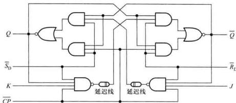  
图5.4.10 74LVC112A中利用传输延迟的JK触发器逻辑图

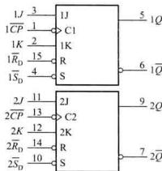  
图5.4.11 74LCL12的逻辑符号

表 5.4.3 74LVC112A 中 JK 触发器的功能表  

<table><tr><td colspan="5">输入</td><td colspan="2">输出</td></tr><tr><td>\( \overline{S}_{\mathrm {D}} \)</td><td>\( \overline{R}_{\mathrm {D}} \)</td><td>\( \overline{CP} \)</td><td>J</td><td>K</td><td>Q</td><td>\( \overline{Q} \)</td></tr><tr><td>L</td><td>H</td><td>×</td><td>×</td><td>×</td><td>H</td><td>L</td></tr><tr><td>H</td><td>L</td><td>×</td><td>×</td><td>×</td><td>L</td><td>H</td></tr><tr><td>L</td><td>L</td><td>×</td><td>×</td><td>×</td><td>H</td><td>H</td></tr><tr><td>\( \overline{S}_{\mathrm {D}} \)</td><td>\( \overline{R}_{\mathrm {D}} \)</td><td>\( \overline{CP} \)</td><td>\( ^{\circ }J \)</td><td>K</td><td>\( Q^{n+1} \)</td><td>\( \overline{Q}^{n+1} \)</td></tr><tr><td>H</td><td>H</td><td>↓</td><td>L*</td><td>L*</td><td>Q*</td><td>\( \overline{Q}^{\circ} \)</td></tr><tr><td>H</td><td>H</td><td></td><td>L*</td><td>H*</td><td>L</td><td>H</td></tr><tr><td>H</td><td>H*</td><td>↓</td><td>H*</td><td>L*</td><td>H</td><td>L</td></tr><tr><td>H</td><td>L</td><td>↓</td><td>H*</td><td>H*</td><td>\( \overline{Q}^{\circ} \)</td><td>Q*</td></tr></table>

$\mathrm{L}^{*}$ 和 $\mathrm{H}^{*}$ 表示 $CP$ 脉冲下降沿到来之前瞬间的电平。

# 复习思考题

5.4.1 触发器有哪几种常见的电路结构？试归纳它们的工作原理和动作特点。  
5.4.2 图5.4.2所示 $D$ 触发器要求输入信号 $D$ 与时钟信号 $CP$ 有什么样的定时关系？输出信号 $Q$ 和 $Q$ 与 $CP$ 有什么样的定时关系？  
5.4.3 试画出图5.4.8所示 $JK$ 触发器的定时图，注意定时图中各信号与时钟脉冲 $\overline{CP}$ 的哪一个边沿有定时关系。

# 5.5 触发器的逻辑功能

在5.4节中以两种 $D$ 触发器和一种 $JK$ 触发器为例，介绍了触发器的不同电路结构，本节将进一步讨论触发器的逻辑功能。触发器在每次时钟触发沿到来之前的状态称为现态，之后的状态称为次态。所谓触发器的逻辑功能，是指以输入信号和现态为变量，以次态为函数的逻辑关系，可以用特性表、特性方程或状态图来描述这种关系。按照触发器的逻辑功能，通常分为 $D$ 触发器、 $JK$ 触发器、 $T$ 触发器和 $SR$ 触发器等几种不同类型。它们的逻辑符号见图5.5.1，各逻辑方框内分别标明了时钟信号与不同输入信号的控制关联。

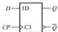  
(a)

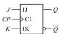  
(b)

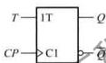  
(6)

(d)   
图5.5.1 不同逻辑功能触发器的逻辑符号  
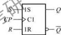  
(a) $D$ 触发器 (b) $JK$ 触发器 (c) $T$ 触发器 (d) $SR$ 触发器

需要指出的是，逻辑功能和电路结构是两个不同的概念。某一种逻辑功能的触发器可以用不同的电路结构来实现，如前述两种不同电路结构而功能完全相同的 $D$ 触发器；同时，以某一种基本电路结构为基础，也可以构成不同逻辑功能的触发器，例如5.5.5节将要讨论的 $D$ 触发器逻辑功能的转换。对于某种特定的电路结构，只不过是可能更易于实现某一逻辑功能而已。在本节讨论触发器的逻辑功能时，可以暂时不考虑其内部的电路结构。

# 5.5.1 D触发器

# 1. 特性表

以输入信号和触发器的现态为变量，以次态为函数，描述它们之间逻辑关系的真值表称为触发器的特性表。 $D$ 触发器的特性表如表5.5.1所示，表中对触发器的输入信号 $D$ 和现态 $Q^{n}$ 的每种组合都列出了相应的次态 $Q^{n + 1}$

表 5.5.1 D 触发器的特性表  

<table><tr><td>D</td><td>Q*</td><td>Q**1</td></tr><tr><td>0</td><td>0</td><td>0</td></tr><tr><td>0</td><td>1</td><td>0</td></tr><tr><td>1</td><td>0</td><td>1</td></tr><tr><td>1</td><td>1</td><td>1</td></tr></table>

# 2. 特性方程

触发器的逻辑功能也可以用逻辑表达式来描述，称为触发器的特性方程。根据表5.5.1可以列出 $D$ 触发器的特性方程：

$$
Q ^ {n + 1} = D \tag {5.5.1}
$$

该式与5.4节中从触发器电路结构导出的式(5.4.1)完全相同。

# 3. 状态图

触发器的功能还可以用图5.5.2所示的状态图更为形象地表示。它同样可以由 $D$ 触发器

的特性表导出。图中，圆圈内为触发器的状态 $Q$ ，分别标示为0和1的两个圆圈代表了触发器的两个状态；4根带箭头的方向线表示状态转换的方向，分别对应特性表中的4行，方向线的起点为触发器的现态 $Q^{n}$ ，箭头指向相应的次态 $Q^{n + 1}$ ；方向线旁边标出了状态转换的条件，即输入信号 $D$ 的逻辑值。

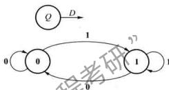  
图8.5.2 $D$ 触发器的状态图

由特性表、特性方程或状态图均可看出，当 $D = 0$ 时， $D$ 触发器的下一状态将被置0（ $Q^{n+1} = 0$ ）；当 $D = 1$ 时，将被置1（ $Q^n = 1$ ）。在时钟脉冲的两个触发沿之间，触发器状态保持不变，即存储1位二进制数据。

# 5.5.2 JK触发器

# 1. 特性表

表5.5.2是 $JK$ 触发器的特性表，其中列出了触发器的输入信号 $J, K$ 和现态 $Q^n$ 在不同组合条件下的次态值。

表 5.5.2 JK 触发器的特性表  

<table><tr><td>\( J \)</td><td>K</td><td>\( {Q}^{ * } \)</td><td>\( {Q}^{n + 1} \)</td></tr><tr><td>0</td><td>0</td><td>0</td><td>0</td></tr><tr><td>0</td><td>0</td><td>1</td><td>1</td></tr><tr><td>0</td><td>1</td><td>0</td><td>0</td></tr><tr><td>0</td><td>1</td><td>1</td><td>0</td></tr><tr><td>1</td><td>0</td><td>0</td><td>1</td></tr><tr><td>1</td><td>0</td><td>1</td><td>1</td></tr><tr><td>1</td><td>1</td><td>0</td><td>1</td></tr><tr><td>1</td><td>1</td><td>1</td><td>0</td></tr></table>

# 2. 特性方程

从表5.5.2可以写出 $JK$ 触发器次态的逻辑表达式，经化简可得其特性方程如下：

$$
Q ^ {n + 1} = J \overline {{Q}} ^ {n} + \bar {K} Q ^ {n} \tag {5.5.2}
$$

与由触发器电路结构导出的式(5.4.7)完全一致。

# 3. 状态图

JK触发器的状态图如图5.5.3所示，它可从表5.5.2导出。与 $D$ 触发器的状态图在形式上

的差别是它有两个输入变量，所以每根方向线旁都标有两个逻辑值，分别为 $J, K$ 的值。可以注意到，在每一个转换方向上， $J, K$ 中总有一个是无关变量。例如，表5.5.2的第5行和第7行， $Q^{n} = 0$ 转换为 $Q^{n+1} = 1$ ，条件是 $J = 1$ ，而 $K$ 既可以取0，也可以取1，故状态图中的转换条件则以1×表示。所以，状态图中的4根方向线实际对应表中8行。

  
图5.5.3 $JK$ 触发器的状态图

由上面的描述可以看出，当 $J = K = 0$ 时， $JK$ 触发器状态保持不变（ $Q^{n + 1} = Q^n$ ）；当 $J = 0, K = 1$ 时，触发器的下一状态将被置 $\mathbf{0}(Q^{n + 1} = \mathbf{0})$ ；当 $J = 1, K = 0$ 时，将被置 $\mathbf{1}(Q^{n + 1} = \mathbf{1})$ ；当 $J = K = 1$ 时，触发器的下一状态将翻转（ $Q^{n + 1} = \overline{Q^n}$ ）。在所有逻辑类型的触发器中， $JK$ 触发器具有最强的逻辑功能，在外部 $J, K$ 信号控制下，它能执行保持、置 $\mathbf{0}$ 、置 $\mathbf{1}$ 和翻转四种操作，并可用简单的附加电路转换为其他功能的触发器。

例5.5.1设下降沿触发的 $JK$ 触发器时钟脉冲 $CP$ 和 $J,K$ 信号的波形如图5.5.4中横虚线上面所示，试画出输出端 $Q$ 的波形。设触发器的初始状态为0。

  
图5.5.4 例5.5.1的波形图

解：根据 $JK$ 触发器的特性表，特性方程或状态图都可画出 $Q$ 端波形，如图5.5.4中横虚线下面所示。

从图5.5.4可以看出，在第1、2个 $CP$ 脉冲作用期间， $J, K$ 均为1，每输入一个脉冲， $Q$ 端的状态就改变一次，即触发器翻转一次。触发器的这种工作状态称为计数状态；由触发器翻转的次数可以计算出时钟脉冲的个数。同时， $Q$ 端的方波频率是时钟脉冲频率的二分之一。若以 $CP$ （或

$\overline{CP}$ 为输入信号， $Q$ 为输出信号，则一个触发器可作为二分频电路，两个触发器级联可获得四分频，其余类推。

# 5.5.3 $T$ 触发器

在某些应用中，需要对上述计数功能进行控制：当控制信号 $T = 1$ 时，每来一个 $CP(\text{或} \overline{CP})$ 脉冲，它的状态翻转一次；而当 $T = 0$ 时，则不对 $CP(\text{或} \overline{CP})$ 信号作出响应而保持状态不变。具备这种逻辑功能的触发器称为 $T(\text{Toggle})$ 触发器。

# 1. 特性表

$T$ 触发器的特性表如表5.5.3所示

表 5.5.3 T 触发器的特性表  

<table><tr><td>\( T \)</td><td>\( {Q}^{n} \)</td><td>\( {Q}^{n + 1} \)</td></tr><tr><td>0</td><td>0</td><td>0</td></tr><tr><td>0</td><td>1</td><td>1</td></tr><tr><td>1</td><td>0</td><td>1</td></tr><tr><td>1</td><td>1</td><td>0</td></tr></table>

# 2. 特性方程

从表5.5.3可以写出 $T$ 触发器的特性方程：

$$
Q ^ {n + 1} = T \overline {{Q ^ {n}}} + \overline {{T}} Q ^ {n} \tag {5.5.3}
$$

# 3. 状态图

$T$ 触发器的状态图如图5.5.5所示

由此可知，T触发器的功能是： $T = 1$ 时为翻转状态， $Q^{n + 1} = Q^n$ . $T = 0$ 时为保持状态， $Q^{n + 1} = Q^n$

比较式(5.5.3)和式(5.5.2)，如果令 $J = K = T$ ，则两式等效。事实上只要将JK触发器的 $J$ 、 $K$ 端连接在一起作为 $T$ 输入端，就可实现 $T$ 触发器的功能，因此，在小规模集成触发器产品中没有专门的 $T$ 触发器，如果有需要，可用其他功能的触发器转换。

  
图5.5.5 $T$ 触发器的状态图

  
图5.5.6 $T^{\prime}$ 触发器的逻辑符号

# 4. $T^{\prime}$ 触发器

当 $T$ 触发器的 $T$ 输入端固定接高电平时（即 $T \equiv 1$ ），则式（5.5.3）变为

$$
Q ^ {n + 1} = \overline {{Q}} ^ {n} \tag {5.5.4}
$$

也就是说，时钟脉冲每作用一次，触发器翻转一次。这种特定的 $T$ 触发器常在集成电路内部逻辑图中出现，其输入只有时钟信号，有时称为 $T^{\prime}$ 触发器。上升沿触发的 $T^{\prime}$ 触发器逻辑符号如图5.5.6所示。

# 5.5.4 SR触发器

仅有置位、复位功能的触发器称为 $SR$ 触发器，它的特性表如表5.5.4所示。从表中可以看出， $S = R = 1$ 时，触发器的次态是不能确定的，如果出现这种情况，触发器将失去控制。因此， $SR$ 触发器的使用必须遵循 $SR = 0$ 的约束条件。从特性表可导出表达次态与现象、输入信号关系的表达式

$$
\left\{ \begin{array}{l} Q ^ {n + 1} = S \overline {{R}} \overline {{Q}} ^ {n} + S \overline {{R}} Q ^ {n} + \overline {{S}} R Q ^ {n} = S \overline {{R}} + S \overline {{R}} Q ^ {n} \\ S R = \mathbf {0} (\text {约 束 条 件}) \end{array} \right.
$$

由于约束条件限制，当 $S = 1$ 时， $R = 0, Q^{n + 1} = S$ ；当 $S = 0$ 时， $Q^{n + 1} = RQ^n$ 。上式可进一步化简，于是得到特性方程

$$
\left\{ \begin{array}{l} Q ^ {n} = S + \tilde {R} Q ^ {n} \\ S \tilde {R} = 0 \quad (\text {约 束 条 件}) \end{array} \right. \tag {5.5.5}
$$

表 5.5.4 SR 触发器的特性表  

<table><tr><td>S</td><td>R</td><td>Q</td><td>Qn+1</td></tr><tr><td>0</td><td>0</td><td>0</td><td>0</td></tr><tr><td>0</td><td>0</td><td>1</td><td>1</td></tr><tr><td>0</td><td>1</td><td>0</td><td>0</td></tr><tr><td>0</td><td>1</td><td>1</td><td>0</td></tr><tr><td>1</td><td>0</td><td>0</td><td>1</td></tr><tr><td>1</td><td>0</td><td>1</td><td>1</td></tr><tr><td>1</td><td>1</td><td>0</td><td>不确定</td></tr><tr><td>1</td><td>1</td><td>1</td><td>不确定</td></tr></table>

  
图5.5.7 SR触发器的状态图

从特性表也可以导出状态图，如图5.5.7所示

事实上，生产厂家罕有专门的SR触发器芯片提供，它主要出现于集成电路的内部结构，需要单独使用SR触发器时，可以JK触发器直接代用。比较图5.5.3和图5.5.7的状态图，令 $J = S, K = R$ ，便可用JK触发器实现SR触发器的全部有效功能。

# 5.5.5 $D$ 触发器逻辑功能的转换

如前所述， $D$ 触发器和 $JK$ 触发器具有较完善的功能，有很多独立的中、小规模集成电路产品，而 $T$ 触发器和 $SR$ 触发器可以很容易用 $D$ 触发器或 $JK$ 触发器转换而成。下面将仅讨论应用普遍的 $D$ 触发器逻辑功能的转换，其他触发器之间逻辑功能的相互转换，有些在前文中已述及，有些则请读者采用类似的方法举一反三。

# 1. $D$ 触发器构成 $JK$ 触发器

比较 $D$ 触发器和 $JK$ 触发器的特性方程，即式（5.5.1）和式（5.5.2），可以令

$$
Q ^ {n + 1} = D = J \overline {{Q ^ {n}}} + \bar {K} Q ^ {n} \tag {5.5.6}
$$

按上式，可得电路如图5.5.8所示，电路特性符合 $JK$ 触发器的特性方程，从而能实现 $JK$ 触发器的所有功能。有些CMOS主从结构的集成 $JK$ 触发器就是采用类似方式实现的。

  
图5.5.8 用 $D$ 触发器实现 $fK$ 触发器的逻辑功能

# 2. $D$ 触发器构成 $T$ 触发器

用构成 $JK$ 触发器相同的方法，令

$$
Q _ {n} ^ {n + 1} = D = T \overline {{Q ^ {n}}} + \overline {{T}} Q ^ {n} = T \oplus Q ^ {n} = T \odot \overline {{Q ^ {n}}} \tag {5.5.7}
$$

只需在 $D$ 输入端前增加一个异或门或者同或门即可实现，于是得到如图5.5.9（a）、（b）所示的两种 $T$ 触发器逻辑电路。

  
(a)

  
(b)   
图5.5.9 用 $D$ 触发器实现 $T$ 触发器的逻辑功能  
（a）用异或门实现  
（b）用同或门实现

  
图5.5.10用 $D$ 触发器实现 $T^{\prime}$ 触发器的逻辑功能

# 3. $D$ 触发器构成 $T^{\prime}$ 触发器

比较式(5.5.1)和式(5.5.4)可得 $Q^{n + 1} = D = Q^n$ ，于是，画出用 $D$ 触发器构成的 $T^{\prime}$ 触发器如图5.5.10所示。

# 复习思考题

5.5.1 触发器的逻辑功能和电路结构之间有什么关系？  
5.5.2 写出 $D$ 触发器、JK触发器、T触发器和SR触发器的特性方程，并画出它们的状态图。  
5.5.3 试用 $JK$ 触发器实现 $D$ 触发器、 $T$ 触发器、 $T^{\prime}$ 触发器以及 $SR$ 触发器的逻辑功能。

# 5.6 用VerilogHDL描述锁存器和触发器

4.6节介绍了组合逻辑电路的行为级建模，本节将讨论时序电路的基本部件——锁存器和触发器的建模，首先介绍有关的基础知识，然后以实例进行说明。

# 5.6.1 时序逻辑电路建模基础

在Verilog中，行为级描述主要使用由关键词initial或always定义的两种结构类型的语句。一个模块的内部可以包含多个initial或always语句，依此类时这些语句同时并行执行，即与它们在模块内部排列的顺序无关，都从仿真的0时刻开始执行。

initial语句是一条初始化语句，仅执行一次，在测试模块中用它对激励信号进行描述，在硬件电路的行为描述中，有时为了仿真的需求，也用initial语句给寄存器变量赋初值。initial语句主要是一条面向仿真的过程语句，逻辑综合工具不支持initial语句，因而不作介绍。

always本身是一个无限循环语句，即不停地循环执行其内部的过程语句，直到仿真过程结束。但用它来描述硬件电路的逻辑功能时，通常在always后面紧跟着循环的控制条件，所以always语句的一般用法如下：

always@（事件控制表达式）

begin

块内部局部变量的定义；

过程赋值语句：

end

这里，“事件控制表达式”也称为敏感事件表，即等待确定的事件发生或某一特定的条件变为“真”，它是执行后面过程赋值语句的条件。“过程赋值语句”左边的变量必须被定义成reg数据类型，右边变量可以是任意数据类型。begin和end将多条过程赋值语句包围起来，组成一个顺序语句块，块内的语句按照排列顺序依次执行，最后一条语句执行完后，执行挂起，然后always语句处于等待状态，等待下一个事件的发生。注意，当begin和end之间只有一条语句，且没有定义局部变量时，则关键词begin和end可以被省略。

在Verilog中，将逻辑电路中的敏感事件分为两种类型：电平敏感事件和边沿触发事件。在组合电路中，输入信号的变化直接会导致输出信号的变化；时序电路中的锁存器输出在使能信号

为高电平时亦随输入电平面变化，如图5.4.1(a)所示波形。这种对输入信号电平变化的响应称为电平敏感事件。

例如，例4.6.1中对4选1数据选择器的描述语句

always $@$ (D,S)

说明S或D中任意一个信号的电平发生变化（即有电平敏感事件发生），后面的过程赋值语句将会执行一次。

而触发器状态的变化仅仅发生在时钟脉冲的上升沿或下降沿，如图5.4.1(b)、(c)所示波形。Verilog中分别用关键词posedge(上升沿)和negedge(下降沿)进行说明，这就是边沿敏感事件。例如，语句

always@(posedge CP or negedge CR) //Verilog 1995 syntax

说明在时钟信号CP的上升沿到来或在清零信号CR跳变为低电平时，后面的过程语句将被执行。注意，关键词negedge不能省略，因为敏感事件列表中不能同时包含电平敏感事件和边沿触发事件。

修订后的 Verilog 语言在敏感事件列表中，允许用逗号进行分隔多个不同的事件。例如，上面的语句可以改写成下面的形式：

always@（posedgeCP,negedgeCR） //Vetilog2001,2005 syntax

always 语句内部的过程赋值语句有两种类型：阻塞型赋值语句（Blocking Assignment Statement）和非阻塞型赋值语句（Non-Blocking Assignment Statement）。所使用的赋值符分别为“=”和“<=”，通常称“=”为阻塞赋值符，“>=”为非阻塞赋值符。在串行语句块中，阻塞型赋值语句按照它们在块中排列的顺序依次执行，即前一条语句没有完成赋值之前，后面的语句不能被执行，换言之，前面的语句阻塞了后面语句的执行，这与在一个公路收费站，汽车必须排成队顺序前进缴费有些类似。例如，下面两条阻塞型赋值语句的执行过程是：首先执行第一条语句，将 A 的值赋给 B，接着执行第二条语句，将 B 的值（等于 A 值）加 1，并赋给 C，执行完后，C 的值等于 A + 1。也就是说，如果使用“=”给一个变量 B 赋了新值，则该块后面的语句若用到该变量 B 时将使用新值。

begin

$$
\mathrm {B} = \mathrm {A};
$$

$$
C = B + 1;
$$

end

Verilog中由“ $\leq$ ”符号构成的非阻塞型赋值语句的执行过程是：首先计算语句块内部所有右边表达式的值，然后完成对左边寄存器变量的赋值操作，这些操作是并行执行的。例如，下面两条非阻塞型赋值语句的执行过程是：首先计算所有表达式右边的值并分别存储在暂存器中，即A的值被保存在一个暂存器中，而 $\mathrm{B} + 1$ 的值被保存在另一个暂存器中，在begin和end之间所有非阻塞型赋值语句的右边表达式都被计算并存储后，对左边寄存器变量的赋值操作才会进行。这样，C的值等于B的原始值（而不是A的值）加1。也就是说，always块中所有非阻塞赋值语

句在求值时，所用的值全部是进入 always 块时各个变量的原始值。

begin $\mathrm{B} <   = \mathrm{A};$ $\mathrm{C} <   = \mathrm{B} + 1;$ end

综上所述，阻塞型赋值语句和非阻塞型赋值语句的主要区别是完成赋值操作的时间不同，前者的赋值操作是立即执行的，即执行后一句时，前一句的赋值已经完成；而后者的赋值操作要到顺序块内部的多条非阻塞型赋值语句运算结束时，才同时并行完成赋值操作，一旦赋值操作完成，语句块的执行也就结束了。需要注意的是，在可综合的电路设计中，一个语句块的内部只允许出现唯一一种类型的赋值语句，而不允许阻塞型赋值语句和非阻塞型赋值语句二者同时出现。在时序电路的设计中，建议采用非阻塞型赋值语句。

# 5.6.2 锁存器和触发器的Verilog建模实例

本节给出一些锁存器和触发器的行为级描述实例。

例5.6.1 根据功能表5.3.1，对D锁存器的行为进行描述

解：对于锁存器来说，当输入控制信号处于有效电平时（即 $\mathrm{E} = 1$ 时），其输出Q跟随输入信号D的变化；当控制信号无效时，输出Q保持不变。所以在always语句中@符号之后的“事件控制表达式”使用了电平敏感事件，说明如果输入信号E或者D发生变化，就会执行一次后面的if语句，但只有E为逻辑I时，输入D的变化才能传送到输出Q；否则，输出Q将保持不变。

注意，由于输出Q在过程语句中被赋值，所以必须将它声明为reg类型的变量。

module D_latch（Q=ON，D；E）; //IEEE1364—1995 Syntax  
input D，E; //输入端口声明  
output reg Q; //输出端口声明  
output ON; //输出端口声明  
assign $\mathrm{QN} = \sim \mathrm{Q}$ ；//Continuous assignment  
always@（E or D）  
if(E)Q<=D; //Same as:if $(\mathrm{E} = =1)$ endmodule

例5.6.2 分析下列程序，说明它所完成的逻辑功能

(1) module DFF (output reg Q, input D, input CP); // Verilog 2001, 2005 syntax always @ (posedge CP) // Elementary D flip-flop $Q<=D$ ; endmodule

(2)   
module async_set_rst_DFF(/Verilog 2001,2005 syntax output reg Q,QN，//D flip-flop with asynchronous set and reset input D,CP,Sd,Rd); always@（posedge CP,negedge Sd,negedge Rd） if(~Sd||~Rd) if(~Sd)begin $\mathrm{Q} <   = 1^{\prime}\mathrm{b}1$ ;QN $<   = 1^{\prime}\mathrm{b}0$ end else begin $\mathrm{Q} <   = 1^{\prime}\mathrm{b}0$ ;QN $<   = 1^{\prime}\mathrm{b}1$ end else begin $\mathrm{Q} <   = \mathrm{D}$ ;QN $<   = -\mathrm{D}$ end   
endmodule

```verilog
(3)  
module sync_rst_DIFF(/ / Verilog 2001, 2005 syntax  
output reg Q, // D flip-flop with synchronous reset.  
input D, CP, Rd;  
);  
always @ (posedge CP)  
if (~Rd) Q <= 1'hO;  
else Q <= D;  
endmodule 
```

解：例5.6.2对上升沿触发的 $D$ 触发器的行为进行了描述

（1）第一个模块对基本 $D$ 触发器的行为进行了描述。该模块的输出信号为Q，输入信号为D和CP。在always语句@符号之后的“事件控制表达式”中使用了边沿触发事件，即posedgeCP，使其后的语句 $\mathrm{Q} < = \mathrm{D}$ 仅在CP上升沿期间将D的值赋给Q，而在其他任何时间，无论D信号如何变化，都不能改变Q的状态。  
（2）第二个模块对具有异步直接置1、置0功能的 $D$ 触发器的行为进行了描述。在always语句的“事件控制表达式”中，比前一模块增加了两个异步触发事件negedge Sd和negedge Rd。在这种表达式中，可以有一个或多个异步事件，但必须有一个事件是时钟事件，在IEEE 1364—1995标准中，要求多个事件之间用关键词or进行连接，修订后的标准可以用逗号隔开多个异步事件。这个模块中的触发事件表示，在输入信号CP的上升沿到来、或Sd或Rd跳变为低电平时，后面的if-else语句就会被执行一次。negedge Sd和negedge Rd是两个异步事件，它与if( $\sim$ Sd11\~Rd)语句相匹配。如果条件成立，接下来，如果Sd为逻辑0（if( $\sim$ Sd))，则将输出Q置1，QN置0；否则将执行else后面的两条语句，将输出Q置0，QN置1；如果Sd和Rd均不为0，当时钟CP上升沿到来时，将输入D传送到输出Q， $\sim$ D传送到QN。从语句执行的顺序来看，如果直接置1、置0和时钟上升沿三个事件同时发生，则置1事件拥有最高的优先级别，其次是

置0事件，时钟上升沿事件的优先级别最低。

（3）第三个模块对具有同步置0功能的 $D$ 触发器的行为进行了描述。即置0信号Rd要在CP脉冲上升沿到来后才起作用。于是，在always语句中@符号之后的“事件控制表达式”中只有一个时钟事件，它表示只有在CP的上升沿到来时，后面的if-else语句才会被执行，此时首先检查Rd信号，如果Rd为逻辑0，则将输出Q置0；否则，将输入D传给输出 $\mathrm{Q}_{\circ}$ 显然，在该语句块中，置0信号Rd仍具有优先权，只有 $\mathrm{Rd} = 1$ 时，才有可能执行 $Q <   = D$ 语句。

例5.6.3 根据特性表5.5.2，对下降沿触发的 $JK$ 触发器行为进行描述。

解：根据 $JK$ 触发器的特性表，使用case多路分支语句进行描述。这里，将输入变量J、K拼接起来成为一个两位二进制变量（|J,K|），它的值可能是二进制数00、01、10、11，case语句后面的4条分支语句正好说明了在时钟信号CP下降沿作用后，触发器的次态。

```verilog
module JK_FF (output reg Q, output Qnot, input J, K, CP); //Verilog 2007/2005 syntax
assign Qnot = ~ Q; //Continuous assignment
always @ (negedge CP)
case (|J, K|) //Switch based on concatenation of J and K signals
2'h00: Q <= Q;
2'h01: Q <= 1'h0;
2'h10: Q <= 1'h1;
2'h11: Q <= ~ Q;
endcase
endmodule 
```

例5.6.4 分析下列程序，说明阻塞赋值语句和非阻塞赋值语句之间的区别。

(1) module Circuit_A (2) module Circuit_B (3) output reg f, g, input A, B, C, CP; always @ (posedge CP) always @ (posedge CP) begin $\mathrm{f} = \mathrm{A} \& \mathrm{B}$ ; $\mathrm{g} = \mathrm{f} \mid \mathrm{C}$ ; end endmodule

解：模块 Circuit_A 使用阻塞赋值语句建模，因为 always 语句 @ 符号之后的敏感事件表中使用了边沿触发事件，即 posedge CP，所以 f 和 g 都是 $D$ 触发器的输出。由于用的是阻塞赋值，所以由 $f = A \& B$ 产生的新 f 值，在接下来的语句 $g = f \& C$ 中就会被使用，这意味着 $g = f \& C$ 实际

上与 $\mathrm{g} = \mathrm{A}\& \mathrm{B}\mid \mathrm{C}$ 是等效的。综合后得到的电路如图5.6.1所示。

模块 Circuit_B 使用非阻塞赋值语句建模，进入 always 语句之后，会使用各个变量的原始值将两个表达式右边的值计算出来并存入暂存器，在 always 语句结束时 f 和 g 的值被同时更新。这意味着计算 $\mathrm{g} < = \mathrm{f} \mid \mathrm{C}$ 时使用了 f 的前一个值，即或门的一个输入端应该连接到触发器的输出端 $\mathrm{f}_0$ 综合后得到的电路如图 5.6.2 所示。

  
图5.6.1 模块Circuit_A的电路

  
图5.6.2 模块Circuit_B的电路

假设分别将两个模块中给f和g赋值的两条语句的次序颠倒一下，那么会综合成什么样的电路呢？

对模块 Circuit_A 来说，由于用的是阻塞赋值，begin-end 之间的语句是顺序执行的，语句次序颠倒后，首先执行 $\mathrm{g} = \mathrm{f} \mid \mathrm{C}$ ，此时 f 的值就是进入 always 语句时的值，即 CP 上升沿到来之前的值，所以综合后生成的电路会变成图 5.6.2 所示的那样。对模块 Circuit_B 来说，由于用的是非阻塞赋值，begin-end 之间的语句是并行执行的，所以语句次序颠倒对综合器生成电路没有任何影响。

可见，阻塞赋值对语句的顺序具有依赖性，用它对时序电路建模存在一定的风险，所以，对时序逻辑电路时，建议使用非阻塞赋值语句。

# 复习思考题

5.6.1 在Verilog中, initial语句和always语句的主要区别是什么？  
5.6.2 在always语句中对电平敏感事件和边沿敏感事件的描述有何不同？  
5.6.3 阻塞型赋值和非阻塞型赋值有何区别？  
5.6.4 试用Verilog描述一个基本SR锁存器和一个下降沿触发的SR触发器。

# 小结

- 双稳态电路存在两个稳定状态，从而可存储、记忆1位二进制数据。锁存器和触发器都属于双稳态电路，它们是时序电路的基本存储单元。置0、置1和数据保持是一个存储单元最基

本的逻辑功能。

- 锁存器是对脉冲电平敏感的存储电路，它们在一定电平作用下才能改变状态。基本SR锁存器由输入信号电平直接控制其状态，门控SR锁存器在使能信号有效的条件下由输入信号决定其状态。  
- $D$ 锁存器在工作中没有约束条件，因而应用较广泛。在使能信号作用期间， $D$ 锁存器输出跟随输入信号 $D$ 而变化。其中传输门控 $D$ 锁存器在中、大规模CMOS集成电路中应用较多，是构成触发器的基础电路。  
- 触发器是对时钟脉冲边沿敏感的存储电路，它们在时钟脉冲的上升沿或下降沿作用下更新状态。目前流行的触发器电路主要有主从、维持阻塞和利用传输延迟等几种电路结构，它们的工作原理各不相同。  
- 触发器按逻辑功能分类有 $D$ 触发器、 $JK$ 触发器、 $T$ 触发器和 $SR$ 触发器等几种类型。它们的功能可用特性表、特性方程和状态图来描述。触发器的电路结构与逻辑功能没有必然联系。例如 $JK$ 触发器既有主从结构的，也有维持阻塞或利用传输延迟结构的。每一种逻辑功能的触发器都可以通过适当增加外部连线和门电路转换为其他逻辑功能的触发器。  
- 可以用 Verilog 语言对锁存器和触发器的行为特性进行建模。Verilog 语言提供了两种赋值符：阻塞型赋值和非阻塞型赋值。对组合逻辑电路建模时，建议使用阻塞型赋值；对时序电路建模时，建议使用非阻塞型赋值。

# 习题

# 5.2 SR锁存器

5.2.1 分析图题5.2.1所示电路的功能，列出功能表。

  
图题5.2.1

  
图题5.2.2

5.2.2 用CMOS电路74HCT02或非门构成消除机械开关抖动影响的电路如图题5.2.2所示，试画出在开关S由位置A到B时 $Q$ 和 $\overline{Q}$ 端的波形。如改用TTL电路74LS02实现， $R_{1}, R_{2}$ 取值的大致范围为多少？整个电路的功耗会发生什么变化？

5.2.3SR锁存器如图5.2.1(a)所示，其初始状态为 $Q = 0,\overline{Q} = 1$ ，图中两个或非门的传输延迟时间均为

10ns- $\mathcal{SR}$ 锁存器的输入波形如图题5.2.3所示，虚线表示的时间间隔为 $10\mathrm{ns}$ ，画出考虑或非门传输延迟时间的输出波形。假定输入和输出信号的上升和下降时间均为 $0$

  
图题5.2.3

5.2.4 由与或非门组成的 $SR$ 锁存器如图题5.2.4所示，试分析其工作原理并列出功能表。

  
图题5.2.4

  
图题5.2.5

5.2.5 图题 5.2.4 所示锁存器的 $B$ 和 $S$ 端的输入信号波形如图题 5.2.5 所示，试画出 $Q$ 和 $\overline{Q}$ 端的波形。设初始状态 $Q = 0$ 。  
5.2.6 若图5.2.8(a)所示电路的初始状态为 $Q = 1, E, S, R$ 端的输入信号如图题5.2.6所示，试画出相应 $Q$ 和 $\overline{Q}$ 端的波形。

  
图题5.2.6

# 5.3 $D$ 锁存器

5.3.1 列出图题5.3.1所示电路的功能表，并与表5.3.1比较，证明该电路的逻辑功能与图5.3.1(a)和图5.3.3所示的锁存器相同。与图5.3.3所示电路比较，图题5.3.1所示电路有何优点？

  
图题5.3.1

  
图题5-3-2

5.3.2 一种简单的 $D$ 锁存器晶体管级电路如图题5.3.2所示，试列出该电路的功能表。这种电路广泛用于CMOS静态随机存储器（SRAM）中作为基本存储单元。  
5.3.3 试用1片八 $D$ 锁存器74HC373设计一个能锁存两组BCD码信号的锁存电路。假定三态输出使能端 $\overline{OE} = 0$ ，锁存器原输出为 $Q_{1}Q_{0}Q_{3}Q_{4} = 1001(9_{\mathrm{D}})$ 和 $Q_{2}Q_{3}Q_{4}Q_{6} = 0100(4_{\mathrm{D}})$ ，输入为 $D_{1}D_{8}D_{4}D_{8} = 1001(9_{\mathrm{D}})$ 和 $D_{3}D_{2}D_{1}D_{0} = 0101(5_{\mathrm{D}})$ ，画出锁存器锁存新数据前，后使能端 $LE$ 应输入的波形和相应 $Q_{0}$ 的波形。74HC373的内部逻辑图请参见图5.3.5。

# 5.4 触发器的电路结构和工作原理

5.4.1 触发器的逻辑电路如图题5.4.1所示，确定其属于何种电路结构的触发器并分析工作原理。

  
图题5.4.1

5.4.2 触发器的逻辑电路如图题5.4.2所示，确定其应属于何种电路结构的触发器。

  
图题5.4.2

  
图题5.4.3

5.4.3 触发器的逻辑电路如图题5.4.3所示，确定其属于何种电路结构的触发器。

5.4.4 根据对图5.4.8所示电路的分析，列出其功能表。

5.4.5图5.4.7所示维持阻塞 $D$ 触发器在 $D = 1$ 时保持时间 $t_{\parallel}$ 为零，分析其原因。

5.4.6 图5.4.8所示触发器电路的动态特性参数为 $t_{\mathrm{p}} = 5 \mathrm{~ns}, t_{\mathrm{ph}} = 10 \mathrm{~ns}, t_{\mathrm{ph,l}} = 15 \mathrm{~ns}$ 。画出这种触发器的定时图。

# 5.5 触发器的逻辑功能

5.5.1上升沿触发和下降沿触安位D触发器逻辑符号及时钟信号 $CP(CP)$ 和输入信号 $D$ 的波形如图题5.5.1所示。分别画出它们的电流波形，设触发器的初始状态为0。


  
图题5.5.1

5.5.2试用卡诺图化简表5.5.2表达的逻辑关系，并将结果与式(5.5.2)核对。

5.5.3 设下降沿触发的 $JK$ 触发器初始状态为 $\mathbf{0},CP,J,K$ 信号如图题5.5.3所示，试画出触发器 $Q$ 端的输出波形。

5.5.4 逻辑电路如图题5.5.4所示，初始状态为 $Q_{0} = Q_{1} = 0$ ，试画出在 $CP$ 作用下， $\phi_0, \phi_1, \phi_2$ 和 $\phi_3$ 的波形。

5.5.5 电路如图题5.5.5所示，设各触发器的初始状态为0，画出在 $CP$ 脉冲作用下 $Q$ 端波形。

5.5.6 逻辑电路如图题5.5.6所示，已知 $CP$ 和 $X$ 的波形，试画出 $Q_{1}$ 和 $Q_{2}$ 的波形。触发器的初始状态均为0。

  
图题5.5.3

  
图题5.5.4


  
图题5.5.5


  
图题5.5.6

5.5.7 逻辑电路如图题5.5.7所示，已知 $\overline{CP}$ 和 $A$ 的波形，画出触发器 $Q$ 端的波形，设触发器的初始状态为0。


  
图题5.5.7

5.5.8 两相脉冲产生电路如图题5.5.8所示，试画出在 $\overline{CP}$ 作用下 $\phi_{1},\phi_{2}$ 的波形，并说明 $\phi_{1}$ 和 $\phi_{2}$ 的时间关系。各触发器的初始状态为0。

  
图题5.5.8

5.5.9 逻辑电路和各输入信号波形如图题5.5.9所示，画出两触发器 $Q$ 端的波形。两触发器的初始状态均为0。


  
图题5.5.9

5.5.10 逻辑电路和输入信号波形如图题5.5.10所示，画出各触发器 $Q$ 端的波形。触发器的初始状态均为 $\mathbf{0}$   
5.5.11 试用 $T$ 触发器和适当的组合逻辑实现 $D$ 触发器的逻辑功能。


  
图题5.5.10

5.5.12 试用 $T$ 触发器和适当的组合逻辑实现 $JK$ 触发器的逻辑功能。

# 5.6 用VerilogHDL描述锁存器和触发器

5.6.1 试说明下列程序所完成的逻辑功能，并画出它的逻辑图。

module d_latch_rst (Rd, control, D, Q);

input Rd, control, D;

output Q:

regQ:

always $@$ (Rd or control or D)

if $(\sim \mathrm{Rd})Q <   = 1^{\prime}\mathrm{b}0;$

else if (control)

$\mathrm{Q} <   = \mathrm{D}$

endmodule

5.6.2 试用该算法对输出方式描述一个下降沿触发的 $D$ 触发器，要求具有异步置零功能，即置零信号变为低电平时，将触发器的输出置零。

5.6.3 阅读下列两个程序，画出它们的逻辑图。

(1)

(2)

module DFF1 (Qa, Qb, D, CP);

module DFF2 (Qa, Qb, D, CP);

input D, CP;

input D,CP;

output Qa, Qb;

output Qa, Qb;

reg Qa, Qb;

reg Qa, Qb;

always@(posedgeCP)

always $@$ (posedge CP)

begin

begin

$\mathrm{Qa} = \mathrm{D}$

$\mathrm{Qa} <   = \mathrm{D}$

$\mathrm{Qb} = \mathrm{Qa}$

$\mathrm{Qb} <   = \mathrm{Qa}$

end

end

endmodule

endmodul