# 4>>

# 组合逻辑电路

引言

数字系统中常用的各种数字部件，就其结构和工作原理而言可分为两大类，即组合逻辑电路和时序逻辑电路。本章首先介绍组合逻辑电路的定义、分析方法和设计方法，并阐述竞争-冒险产生的原因及消除方法。然后讨论常用的几种组合逻辑电路的功能及基本应用，它们包括编码器和译码器、数据选择器和数据分配器、数值比较器、算术运算单元等。最后介绍组合逻辑电路的Verilog-HDL描述以及用可编程逻辑器件PLD的实现方法。

# 4.1 组合逻辑电路的分析

# 4.1.1 组合逻辑电路的定义

对于一个逻辑电路，其输出状态在任何时刻只取决于同一时刻的输入状态，而与电路原来的状态无关，这种电路被定义为组合逻辑电路。组合逻辑电路的一般框图如图4.1.1所示，其输出与输入之间的逻辑关系可用如下的逻辑函数来描述，即

$$
L _ {i} = f \left(A _ {1}, A _ {2}, \dots , A _ {n}\right) \quad (i = 1, 2, \dots , m) \tag {4.1.1}
$$

式中， $A_{1},A_{2},\dots ,A_{n}$ 为输入变量。

组合逻辑电路的结构具有如下的特点：

（1）输出、输入之间没有反馈延迟通路；  
（2）电路中不含具有记忆功能的元件。

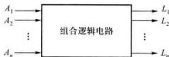  
图4.1.1 组合逻辑电路的一般框图

# 4.1.2 组合逻辑电路的分析方法

分析组合逻辑电路的目的是，对于一个给定的逻辑电路，确定其逻辑功能。分析组合逻辑电

路的步骤大致如下：

（1）根据逻辑电路，从输入到输出，写出各级逻辑函数表达式，直到写出输出信号与输入信号的逻辑函数表达式；

（2）将各逻辑函数表达式化简和变换，以得到最简单的表达式；  
（3）根据简化后的逻辑表达式列出真值表；  
（4）根据真值表和简化后的逻辑表达式对逻辑电路进行分析，最后确定其功能。  
下面举例说明组合逻辑电路的分析方法。

例4.1.1 已知逻辑电路如图4.1.2所示，分析该电路的功能。

解：（1）根据逻辑电路可写出输出端的逻辑函数表达式，为方便起见，电路中标出了中间变量 $Z$ 。电路由两个异或门构成，因此

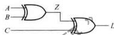  
图4.1.2 例3-1.1的逻辑电路

$$
Z = A \oplus B
$$

$$
L = Z \oplus C = (A \oplus B) \oplus C
$$

该表达式无须化简和变换

（2）列写真值表。将3个输入变量的8种可能的组合，列出。分别将每一组变量的取值代入逻辑函数表达式，然后算出中间变量 $Z$ 值和输出 $L_{i}$ 值，填入表中，如表4.1.1所示。

表 4.1.1 例 ${4.1}_{\mathrm{r}}1$ 的真值表  

<table><tr><td>A</td><td>B</td><td>电子</td><td>Z</td><td>L</td></tr><tr><td>0</td><td>0</td><td>0</td><td>0</td><td>0</td></tr><tr><td>0</td><td>0</td><td>1</td><td>0</td><td>1</td></tr><tr><td>0</td><td>1</td><td>0</td><td>1</td><td>1</td></tr><tr><td>0</td><td>1</td><td>1</td><td>1</td><td>0</td></tr><tr><td>1</td><td>0</td><td>0</td><td>1</td><td>1</td></tr><tr><td>1</td><td>0</td><td>1</td><td>1</td><td>0</td></tr><tr><td>1</td><td>1</td><td>0</td><td>0</td><td>0</td></tr><tr><td>1</td><td>1</td><td>1</td><td>0</td><td>1</td></tr></table>

（3）确定逻辑功能。分析真值表后可知，当 $A, B, C$ 三个输入变量的取值中有奇数个1时， $L$ 为1，否则 $L$ 为0。所以该电路称为奇校验电路，用于检查3位二进制码的奇偶性。

如果在上述电路的输出端再加一级反相器，当输入电路的二进制码中含有偶数个1时，输出为1，则称此电路为偶校验电路。

波形图可以比较直观地反映输入与输出之间的逻辑函数关系，对于比较简单的组合逻辑电路，也可用画波形图的方法进行分析。为了避免出错，通常是根据输入波形的变化分段，然后逐段画出输出波形，例如，第一段的输入信号 $A, B, C$ 的值均为0，代入表达式中得出 $Z$ 的值，然后

得出 $L$ 的值，如图4.1.3所示。最后根据波形图确定输入和输出的逻辑功能。

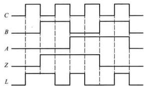  
图4.1.3 例4.1.1的波形分析图

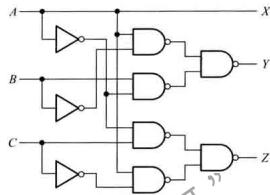  
图4.1.4例4.1.2的逻辑电路

例4.1.2 试分析图4.1.4所示组合逻辑电路的逻辑功能。

解：（1）根据逻辑电路可写出各输出端的逻辑表达式，并进行化简和变换。

$$
\begin{array}{r l} X & = A \\ Y & = \overline {{A B}} + \overline {{A B}} = \overline {{A B}} + \overline {{A B}} \\ Z & = A C \cdot A C = \overline {{A C}} + \overline {{A C}} \end{array}
$$

（2）列写真值表，如表4.1.2所示

表 4.1.2 例 4.1.2 的真值表  

<table><tr><td colspan="3"></td><td colspan="3">输出</td></tr><tr><td>A</td><td>B</td><td>C</td><td>X</td><td>Y</td><td>Z</td></tr><tr><td>0</td><td>0</td><td>0</td><td>0</td><td>0</td><td>0</td></tr><tr><td>0</td><td>0</td><td>1</td><td>0</td><td>0</td><td>1</td></tr><tr><td>0</td><td>1</td><td>0</td><td>0</td><td>1</td><td>0</td></tr><tr><td>0</td><td>1</td><td>1</td><td>0</td><td>1</td><td>1</td></tr><tr><td>1</td><td>0</td><td>0</td><td>1</td><td>1</td><td>1</td></tr><tr><td>1</td><td>0</td><td>1</td><td>1</td><td>1</td><td>0</td></tr><tr><td>1</td><td>1</td><td>0</td><td>1</td><td>0</td><td>1</td></tr><tr><td>1</td><td>1</td><td>1</td><td>1</td><td>0</td><td>0</td></tr></table>

（3）确定逻辑功能。分析真值表可知，输出最高位 $X$ 与输入最高位 $A$ 相等。当 $A$ 为0时，输出 $Y, Z$ 分别与所对应的输入 $B, C$ 相同；而当 $A$ 为1时，输出 $Y, Z$ 分别是输入 $B, C$ 取反。这个电

路逻辑功能是对输入的二进制码求反码。最高位为符号位，0表示正数，1表示负数，正数的反码与原码相同；负数的数值部分是在原码的基础上逐位求反。

# 复习思考题

4.1.1 什么是组合逻辑电路？  
4.1.2 列出分析组合逻辑电路的步骤  
4.1.3 组合逻辑电路都能用波形分析法进行分析吗？

# 4.2 组合逻辑电路的设计

组合逻辑电路的设计与分析过程相反，对于提出的实际逻辑问题，得化满足这一逻辑问题的逻辑电路。电路设计的首要任务是满足功能要求，其次是优化，即用指定的器件实现逻辑函数时，力求成本低并且工作速度快。前面介绍的用代数法和卡诺代数求化简逻辑函数，是为了获得最简的逻辑表达式。根据最简表达式获得最低成本电路。电路的实现可以采用各种门电路，也可以利用数据选择器等基本模块，或者可编程逻辑器件。因此，逻辑函数的化简也要结合所选用的器件进行，有时还需要一定的变换，以便满足优化实现的要求。

# 4.2.1 组合逻辑电路的设计过程

组合逻辑电路的设计步骤大致如下：

（1）明确实际问题的逻辑功能。许多实际设计要求是用文字描述的，因此，需要确定实际问题的逻辑功能，并确定输入、输出变量数及表示符号。  
（2）根据对电路逻辑功能的要求，列出真值表；  
（3）由真值表写出逻辑表达式；  
（4）简化和变换逻辑表达式，从而画出逻辑图

下面举例说明设计组合逻辑电路的方法和步骤

例4.2.1 某火车站有特快、直快和慢车三种类型的客运列车进出，试设计一个指示列车等待进站的逻辑电路。当有两种或以上的列车等待进站时，要求发出信号，提示工作人员安排列车进站事宜。

解：（1）明确逻辑功能

设变量 $A, B, C$ 分别表示特快、直快和慢车，并规定有进站请求时为1，没有请求时为0。输出变量 $L$ 表示进站状况，有两种或以上的列车等待进站时， $L$ 为1，否则为0。

根据题意列出真值表，如表4.2.1所示

（2）根据真值表写出输出逻辑表达式

根据1.6节介绍的方法，逻辑变量之间是与的关系，而输出状态之间的组合则是或的关系。对于输入或输出变量，凡取1值的用原变量表示，取0值用反变量表示。则

$$
L = \bar {A} B C + \bar {A} B C + A B \bar {C} + A B C \tag {4.2.1}
$$

（3）简化逻辑表达式

用公式法或卡诺图化简法对式（4.2.1）化简，得

$$
L = A B + A C + B C \tag {4.2.2}
$$

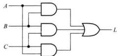  
图4.2.1 例4.2.1逻辑图

式（4.2.2）为最简与-或式，用与门和或门实现两级与-或结构的最简电路如图4.2.1所示。

表 4.2.1 例 4.2.1 的真值表  

<table><tr><td colspan="3">输入</td><td>输出</td></tr><tr><td>A</td><td>B</td><td>C</td><td>L</td></tr><tr><td>0</td><td>0</td><td>0</td><td>0</td></tr><tr><td>0</td><td>0</td><td>1</td><td>0</td></tr><tr><td>0</td><td>1</td><td>0</td><td>0</td></tr><tr><td>0</td><td>1</td><td>1</td><td>1</td></tr><tr><td>1</td><td>0</td><td>0</td><td>0</td></tr><tr><td>1</td><td>0</td><td>1</td><td>1</td></tr><tr><td>1</td><td>1</td><td>0</td><td>1</td></tr><tr><td>1</td><td>1</td><td>1</td><td>1</td></tr></table>

在不同的数字系统中，可能采用不同的码制对信息进行编码和处理。如果在采用不同码制的两个数字系统之间进行信息传输，则需要一个码转换电路，以保证两者之间的相互匹配。

例4.2.2 试设计一个码转换电路，将4位格雷码转换为自然二进制码。可以采用任何逻辑门电路来实现。

解：（1）明确逻辑功能，列出真值表

设电路的4个输入变量为 $G_{3}, G_{2}, G_{1}$ 和 $G_{0}$ ，4个输出变量为 $B_{3}, B_{2}, B_{1}$ 和 $B_{0}$ 。当输入格雷码按照从十进制数0到15递增排序时，对应输出的自然二进制码如表4.2.2所示。

（2）画出各输出函数的卡诺图，如图4.2.2所示。如果按照表4.2.2所示从上到下的顺序，填写卡诺图的顺序依次为：第一行从左到右，第二行从右到左，第三行从左到右，第四行从右到左。如 $B_{1}$ 的第一行从左到右为0011，第二行从右到左为0011，以此类推。由卡诺图写出各输出逻辑表达式，并化简和变换，如式(4.2.3)所示。

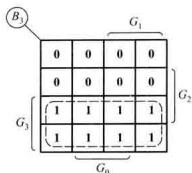

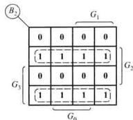

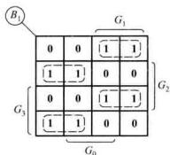

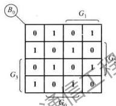  
图4.2.2 例4.2.2的卡诺图

表 4.2.2 例 4.2.2 的真值表  

<table><tr><td rowspan="2">十进制数</td><td colspan="4">输入</td><td colspan="4">输出</td></tr><tr><td>\( {G}_{3} \)</td><td>\( {G}_{2} \)</td><td>\( {G}_{1} \)</td><td>\( {G}_{0} \)</td><td>\( {B}_{3} \)</td><td>\( {B}_{2} \)</td><td>\( {B}_{1} \)</td><td>\( {B}_{0} \)</td></tr><tr><td>0</td><td>0</td><td>0</td><td>0</td><td>0</td><td>0</td><td>0</td><td>0</td><td>0</td></tr><tr><td>1</td><td>0</td><td>0</td><td>0</td><td>1</td><td>0</td><td>0</td><td>0</td><td>1</td></tr><tr><td>2</td><td>0</td><td>0</td><td>1</td><td>1</td><td>0</td><td>0</td><td>1</td><td>0</td></tr><tr><td>3</td><td>0</td><td>0</td><td>1</td><td>0</td><td>0</td><td>0</td><td>1</td><td>1</td></tr><tr><td>4</td><td>0</td><td>1</td><td>1</td><td>0</td><td>0</td><td>1</td><td>0</td><td>0</td></tr><tr><td>5</td><td>0</td><td>1</td><td>1</td><td>1</td><td>0</td><td>1</td><td>0</td><td>1</td></tr><tr><td>6</td><td>0</td><td>1</td><td>0</td><td>1</td><td>0</td><td>1</td><td>1</td><td>0</td></tr><tr><td>7</td><td>0</td><td>1</td><td>0</td><td>0</td><td>0</td><td>1</td><td>1</td><td>1</td></tr><tr><td>8</td><td>1</td><td>1</td><td>0</td><td>0</td><td>1</td><td>0</td><td>0</td><td>0</td></tr><tr><td>9</td><td>1</td><td>1</td><td>0</td><td>1</td><td>1</td><td>0</td><td>0</td><td>1</td></tr><tr><td>10</td><td>1</td><td>1</td><td>1</td><td>1</td><td>1</td><td>0</td><td>1</td><td>0</td></tr><tr><td>11</td><td>1</td><td>1</td><td>1</td><td>0</td><td>1</td><td>0</td><td>1</td><td>1</td></tr><tr><td>12</td><td>1</td><td>0</td><td>1</td><td>0</td><td>1</td><td>1</td><td>0</td><td>0</td></tr><tr><td>13</td><td>1</td><td>0</td><td>1</td><td>1</td><td>1</td><td>1</td><td>0</td><td>1</td></tr><tr><td>14</td><td>1</td><td>0</td><td>0</td><td>1</td><td>1</td><td>1</td><td>1</td><td>0</td></tr><tr><td>15</td><td>1</td><td>0</td><td>0</td><td>0</td><td>1</td><td>1</td><td>1</td><td>1</td></tr></table>

$$
\left\{ \begin{array}{l} B _ {3} = G _ {3} \\ B _ {2} = G _ {3} \overline {{G _ {2}}} + \overline {{G _ {3}}} G _ {2} \\ = G _ {3} \oplus G _ {2} \\ = B _ {3} \oplus G _ {2} \\ B _ {1} = G _ {3} \overline {{G _ {2}}} \overline {{G _ {1}}} + \overline {{G _ {3}}} G _ {2} \overline {{G _ {1}}} + G _ {3} G _ {2} G _ {1} + \overline {{G _ {3}}} \overline {{G _ {2}}} G _ {1} \\ = (G _ {3} \overline {{G _ {2}}} + \overline {{G _ {3}}} G _ {2}) \overline {{G _ {1}}} + (\overline {{G _ {3}}} \overline {{G _ {2}}} + \overline {{G _ {3}}} G _ {2}) G _ {1} \\ = G _ {3} \oplus G _ {2} \oplus G _ {1} \\ = B _ {2} \oplus G _ {1} \\ B _ {0} = \overline {{G _ {3}}} \overline {{G _ {2}}} \overline {{G _ {1}}} G _ {0} + \overline {{G _ {3}}} \overline {{G _ {2}}} G _ {1} \overline {{G _ {0}}} + \overline {{G _ {3}}} G _ {2} \overline {{G _ {1}}} \overline {{G _ {0}}} + \overline {{G _ {3}}} G _ {2} G _ {1} G _ {0} \\ + G _ {3} G _ {2} \overline {{G _ {1}}} G _ {0} + G _ {3} G _ {2} G _ {1} \overline {{G _ {0}}} + G _ {3} \overline {{G _ {2}}} \overline {{G _ {1}}} \overline {{G _ {0}}} + G _ {3} \overline {{G _ {2}}} G _ {\mathrm {T}} G _ {0}. \\ = G _ {3} \oplus G _ {2} \oplus G _ {1} \oplus G _ {0} \\ = B _ {1} \oplus G _ {0} \end{array} \right.
$$

因此， $n$ 位格雷码 $G_{n - 1}G_{n - 2}G_{n - 3}\dots G_0$ 转换为 $n$ 位二进制码 $B_{n - 1}B_{n - 2}B_{n - 3}\dots B_0$ 的公式为

$$
\begin{array}{r l} & \left\{ \begin{array}{l} B _ {n - 1} = G _ {n - 1} \\ B _ {n - 2} = B _ {n - 1} \oplus G _ {n - 2} \end{array} \right. \\ & \left\{ \begin{array}{c} B _ {n - 3} = B _ {n - 2} \oplus G _ {n - 3} \\ \vdots \\ B _ {0} = B _ {1} \oplus G _ {0} \end{array} \right. \end{array} \tag {4.2.4}
$$

以同样的方法，也可以得到 $n$ 位二进制码 $B_{n - 1}B_{n - 2}B_{n - 3}\dots B_0$ 转换为 $n$ 位格雷码 $G_{n - 1}G_{n - 2}G_{n - 3}\dots$ $G_{0}$ 的公式为

$$
\left\{ \begin{array}{l} G _ {n - 1} = B _ {n - 1} \\ G _ {n - 2} = B _ {n - 1} \oplus B _ {n - 2} \\ G _ {n - 3} = B _ {n - 2} \oplus B _ {n - 3} \\ \vdots \\ G _ {0} = B _ {1} \oplus B _ {0} \end{array} \right. \tag {4.2.5}
$$

（3）根据式(4.2.3)的逻辑表达式，可画出逻辑图如图4.2.3所示

从以上逻辑表达式和逻辑图可以看出，用异或门代替与门和或门能使逻辑电路比较简单。在化简和变换逻辑表达式时，注意综合考虑，使各式中的相同乘积项尽可能多，使某些输出作为另一些逻辑门的输入。例如，利用 $B_{2}$ 作为 $B_{1}$ 的一个输入， $B_{1}$ 又作为 $B_{0}$ 的一个输入，这样可以减少门电路的数目，降低实现电

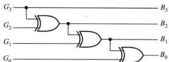  
图4.2.3 例4.2.2的逻辑图

路的成本。

# 4.2.2 组合逻辑电路的优化实现

逻辑函数的优化实现是用指定芯片中特定资源实现逻辑函数，使电路的成本低并且工作速度快。优化实现可以使用基本逻辑门电路或由门电路构成的常用组合逻辑电路模块，这些模块可以作为EDA工具的库元件，由规模更大的电路调用。采用的芯片类型不同，实现电路的优化方式也不同。手工设计过程中由设计者进行优化，自动设计过程中由EDA工具实现优化。EDA工具的优化策略和实现过程庞大而复杂，由计算机在后台完成。对用户而言有许多可选择的特性和控制选项，因此，我们要了解EDA工具所做的工作。作为入门，这一节简单介绍EDA工具实现优化设计时用到的一些技术。

前面介绍的组合逻辑电路的设计过程中，对满足功能要求的逻辑函数进行代数式或卡诺图法进行化简，通常得到最简与-或式。可以用与门和或门构成最简的两级与-或结构电路。但实际电路设计不仅要满足功能要求，还要根据所指定的芯片进行优化实现，而且确保能够物理实现。因此要对逻辑函数的最简与-或式进行变换。变换的宗旨是在满足设计要求的前提下，减少所用芯片资源的数目和连线，使电路得到简化。

如果使用基本门电路为优化资源，需要将最简与-或式变换成与指定门电路相适应的形式。如使用与非门，需要将逻辑函数变换成与非-与非式。各种常用组合逻辑电路的输出与输入的关系都可以写成一个逻辑函数式，不同功能的电路模块，逻辑函数式的形式也不同。CPLD实现逻辑函数是基于与-或式和输出宏单元。FPGA实现逻辑函数是基于查找表（Look-up table，LUT），即数据选择器。基于组合逻辑电路模块及可编程逻辑器件的优化实现在随后的章节介绍。

# 1. 单输出电路

以基本门电路作为可用资源，用两级与-或结构实现最简函数

$$
L = A B + C D \tag {4.2.6}
$$

得到如图4.2.4(a)所示电路。如果要求用与非门优化实现该逻辑电路，需要对式(4.2.6)所示逻辑函数式进行变换，用两次求反的方法得到

$$
\begin{array}{l} L = A B + C D \\ = \overline {{\overline {{A B}} \cdot \overline {{C D}}}} \tag {4.2.7} \\ \end{array}
$$

由此可画出逻辑图，如图4.2.4(b)所示。相同输入端的与非门相对与门或者或门而言，所用晶体管少，速度快，实际中多选择使用与非门。或非门相对于或门和与门而言速度快。

# 2. 多输出电路

在实际的数字系统中，通常都有多个逻辑函数输出，化简时需要将多个输出函数作为整体考虑，使各式中的相同乘积项尽可能多，以减少门的个数。如两个逻辑函数

$$
L _ {1} = A B + \bar {A C} + B D
$$

$$
L _ {2} = A B + \bar {A} C + \bar {A} B D
$$

如果直接分别实现这两个逻辑函数，需要6个与门和两个或门（不考虑非门）。如果考虑共享相同乘积项则只需要4个与门和两个或门，逻辑电路如图4.2.5所示。

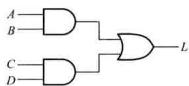  
(a)

(b)   
图4.2.4 以门电路为资源优化实现逻辑函数  
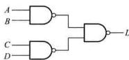  
（a）与门和或门结构 （b）与非门结构

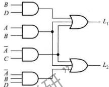  
图4.2.5 共享相同乘积项的逻辑电路

# 3. 多级逻辑电路

逻辑门电路的优化实现除了要考虑降低成本外，还必须保证能够实现。前面介绍的单输出或多输出都可以用两级与-或结构实现。当输入变量数增加时，逻辑门输入端的数目将增多。如果所需逻辑门输入端数超过物理实现的可能，则需要变换逻辑表达式，以减少逻辑门的扇入数。变换方法可以是提取公因子或函数分解等。

# （1）提取公因子

对于逻辑函数

$$
L = A B C D + A B \bar {C} E + A B D \bar {F}
$$

用与-或两级电路实现上述函数需要3个4输入与门和一个3输入或门，如图4.2.6所示。如果限定逻辑门的扇入数为3，需要变换逻辑表达式，提取公因子得

$$
L = A B (C D + \bar {C} E + D \bar {F})
$$

实现上式逻辑门的最大扇入数为3，满足限定条件。但电路的级数增加到3级，如图4.2.7所示。

表达式中每个变量对应一根信号线。提取公因子减少了连线的数目，因此减少了逻辑电路连线的复杂度。

# （2）函数分解

对于多变量逻辑函数，减少扇入数除了提取公因子外，还可以用函数分解方法减少子函数的变量数目。

对于逻辑函数

$$
L = \overline {{A}} B C + \overline {{A}} B C + A B D + \overline {{A}} B D
$$

用与-或两级电路实现上述函数需要4个3输入与门和一个4输入或门，如图4.2.8所示。

如果限定逻辑门的扇入数为3，需要对上式进行变换，函数分解得到

$$
\begin{array}{l} L = (\bar {A} B + \bar {A} \bar {B}) C + (A B + \bar {A} \bar {B}) D \\ = (\bar {A} B + \bar {A} \bar {B}) C + (\bar {A} B + \bar {A} B) D \\ \end{array}
$$

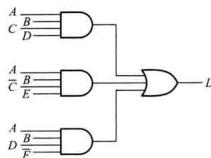  
图4.2.6 提取公因子前的与-或两级电路

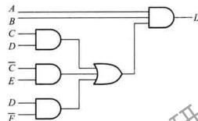  
图4.2.7 提取公因子后的3级电路

实现上述逻辑门的最大扇入数为2，满足限定条件。但电路级数增加到5级，如图4.2.9所示。

提取公因子或函数分解可以将与-或两级电路转换为多级电路，减少逻辑门的扇入数，以满足设计要求。但电路级数的增加可能会使总延时增加，因此变换后电路性能的好坏需综合评定。

上述介绍的逻辑电路优化实现是基于代数法或卡诺图法化简进行的，只适合函数的变量数较少（不大于5）时的手工化简，当变量数较多时，将优化实现的策略写入计算机程序，由计算机自动完成。

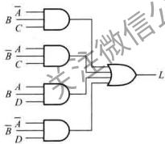  
图4.2.8 函数分解前的与-或两级电路

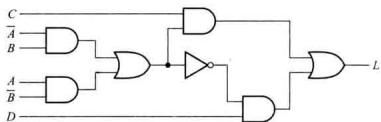  
图4.2.9 函数分解后的5级电路

# 复习思考题

4.2.1 列出设计组合逻辑电路的步骤  
4.2.2 为什么说在组合逻辑电路设计中正确列出真值表是最关键的一步？  
4.2.3 什么是逻辑函数的优化实现？这里介绍的优化实现的策略有哪些？

# 4.3 组合逻辑电路中的竞争-冒险

前面进行组合逻辑电路的分析和设计时，都没有考虑逻辑门的延迟时间对电路产生的影响，并且认为电路的输入和输出均处于稳定的逻辑电平。实际上，信号经过逻辑门电路都需要一定的时间。由于不同路径上门的级数不同，信号经过不同路径传输的时间不同。或者门的级数相同，而各个门延迟时间的差异，也会造成传输时间的不同。因此，电路在信号电平变化瞬间，可能与稳态下的逻辑功能不一致，产生错误输出，这种现象就是电路中的竞争-冒险。

# 4.3.1 产生竞争-冒险的原因

下面通过两个简单电路的工作情况，说明产生竞争-冒险的原因。图4.3.1(a)所示的与门在稳态情况下，当 $A = 0, B = 1$ 或者 $A = 1, B = 0$ 时，输出 $L$ 始终为0。如果信号 $A, B$ 的变化同时发生，则能满足要求。若由于前级门电路的延迟差异或其他原因，致使 $B$ 从1变为0的时刻，滞后于 $A$ 从0变为1的时刻，因此，在很短的时间间隔内，与门的两个输入端均为1，其输出端出现一个高电平牵脉冲（干扰脉冲），如图4.3.1(b)所示。图中考虑了与门的延迟。

同理，图4.3.2（a）所示的或门在稳态情况下，当 $A = 0, B = 1$ 或者 $A = 1, B = 0$ 时，输出 $L$ 始终为1。而当 $A$ 从0变为1时刻，滞后于 $B$ 从1到0的时刻，则在很短的时间间隔内，或门的两个输入端均为0，使输出出现一个低电平个脉冲，如图4.3.2(b)所示。

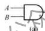

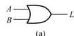

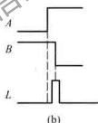

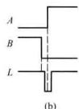  
图4.3.1 产生正跳变脉冲的竞争-冒险（a）逻辑电路 （b）工作波形  
图4.3.2 产生负跳变脉冲的竞争-冒险（a）逻辑电路（b）工作波形

下面进一步分析组合逻辑电路产生的竞争-冒险。图4.3.3(a)所示的逻辑电路中，它的输出逻辑表达式为 $L = AC + BC$ 。由此式可知，当 $A$ 和 $B$ 都为1时，表达式简化成两个互补信号相加，即 $L = C + \overline{C}$ ，此时，该电路可能存在竞争-冒险。由图4.3.3(b)所示的波形图可以看出，在 $C$ 由1变0时， $\overline{C}$ 由0变1有一延迟时间， $G_{2}$ 和 $G_{3}$ 的输出 $AC$ 和 $BC$ 分别相对于 $C$ 和 $\overline{C}$ 均有延迟， $AC$ 和

$BC$ 经过 $G_{4}$ 的延迟而使输出出现一负跳变的窄脉冲

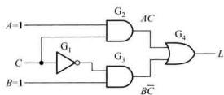  
(a)

(b)   
图4.3.3 组合逻辑电路的竞争-冒险  
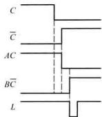  
（a）逻辑电路 （b）工作波形

综上所述，一个逻辑门的两个输入端的信号同时向相反方向变化，而变化的时间有差异的现象，称为竞争。两个输入端可以是不同变量所产生的信号，但其取值的变化方向是相反的，参见图4.3.1和图4.3.2中的 $AB$ 及 $A + B$ 。也可以是在一定条件下，门电路输出端的逻辑表达式简化成两个互补信号相乘或者相加，即 $L = A\cdot \bar{A}$ 或者 $L = A + 1$ ，如图4.3.3所示。由竞争而可能产生输出干扰脉冲的现象称为冒险。

在考虑延迟的条件下，若与门的两个输入 $A$ 和 $A$ ，其中一个先从0变1时，则 $A \cdot A$ 会向其非稳定值1变化，此时会产生冒险；若或门的两个输入 $A$ 和 $A$ ，其中一个先从1变0时，则 $A + A$ 会向其非稳定值0变化，也会产生冒险。两者之间存在对偶关系。

值得注意的是，有竞争现象时不一定都会产生干扰脉冲，如图4.3.2(a)中，如果 $A$ 从0变为1时刻没有滞后信号 $B$ 的变化，则输出不会产生冒险。在一个复杂的逻辑系统中，由于信号的传输路径不同，或者各个信号延迟时间的差异、信号变化的互补性以及其他一些因素，很容易产生竞争-冒险现象。因此在电路设计中应尽量减小冒险产生。

# 4.3.2 消去竞争-冒险的方法

针对上述分析，可以采取以下措施来消去竞争-冒险现象

# 1. 发现并消去互补相乘项

例如，函数式 $F = (A + B)(A + C)$ ，在 $B = C = 0$ 时， $F = AA$ 。若直接根据这个逻辑表达式组成逻辑电路，如图4.3.4(a)所示，则可能出现竞争-冒险。如将该式变换为 $F = \overline{AA} + AC + \overline{AB} + BC = AC + \overline{A}B + BC$ ，这里已将 $AA$ 消掉。根据这个表达式组成逻辑电路，如图4.3.4(b)所示，就不会出现竞争-冒险。

图4.3.4 逻辑表达式的不同实现方法  
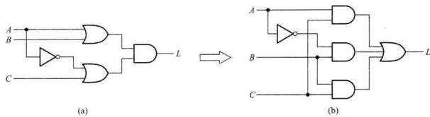  
（a）存在竞争-冒险的电路 （b）无竞争-冒险的电路

# 2. 增加乘积项以避免互补项相加

对于图4.3.3(a)所示的逻辑电路，可以根据常用恒等式增加乘积项，将输出逻辑表达式 $L = AC + BC$ 变为 $L = AC + BC + AB$ ，卡诺图如图4.3.5所示，对应的逻辑电路如图4.3.6所示。当 $A = B = 1$ 时，根据逻辑表达式有 $L = C + C + 1$ ，不会只出现互补项相加的情况。而此时电路中， $\mathrm{G}_2$ 输出为1，使 $\mathrm{G}_4$ 输出亦为1，这就消除了 $C$ 的状态变化对输出状态的影响，从而消去了竞争-冒险。

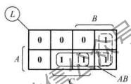  
图4.3.5 增加了乘积项 $AB$ 的卡诺图

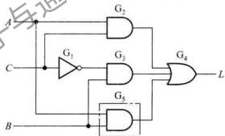  
图4.3.6 增加了乘积项 $AB$ 的逻辑电路

# 3. 输出端并联电容器

对于工作速度不高的逻辑门构成的电路，为了消去竞争-冒险产生的干扰窄脉冲，可以在输出端并联一滤波电容，其容量为 $4\sim 20\mathrm{pF}$ 之间，如图4.3.7(a)所示， $R_{\mathrm{e}}$ 是逻辑门电路的输出电阻。若在图4.3.3(a)所示电路的输出端并联电容 $C$ ，当 $A = B = 1,C$ 的波形与图4.3.3相同的情况下，得到如图4.3.7(b)所示的输出波形。显然，电容对窄脉冲起到平波的作用，消除输出端出现的逻辑错误，但同时也使输出波形上升沿或下降沿变得缓慢。

以上介绍了产生竞争-冒险的原因和克服竞争-冒险的方法。现代数字电路或数字系统的分析与设计，可以借助计算机进行时序仿真，检查电路是否存在竞争-冒险现象。仿真时，由于逻辑门电路的传输延迟时间是采用软件设定的标准值或设计者自行设定的值，与电路的实际工作情况有差异，最终要在实验中检查验证。因此，要能很好地解决这一问题，还必须在实践中积累和总结经验。

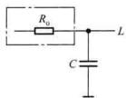  
(a)

(b)   
图4.3.7 并联电容器消去竞争冒险  
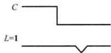  
（a）电路 （b）输出波形

# 复习思考题

4.3.1 什么是组合逻辑电路中的竞争-冒险？  
4.3.2 列出三种消去组合逻辑电路竞争-冒险的方法。

# 4.4 若干典型的组合逻辑电路

半导体制作工艺的发展，将许多常用的组合逻辑电路制成了中规模集成芯片，曾被广泛应用。在现代数字电路和数字系统的设计中，这些典型的组合逻辑电路经常被当做基本模块，很多EDA工具将这些基本模块作为库元件，也可以用HDL语言描述这些模块的功能，由高层设计调用，以便构建所需要的逻辑电路。这些模块包括编码器、译码器、数据选择器、数据分配器、数值比较器、算术运算单元等。下面着重分析它们的工作原理及基本应用方法。

# 4.4.1 编码器

本节和下二节分别讨论编码器和译码器。编码和译码问题在日常生活中经常遇到。例如，你购买一台移动电话时，通信公司给你的电话设定一个号码，叫做编码。显然，这个特定的号码与你的姓名是等同的，任何人拨打你的移动电话号码，都能够找到你，这叫做译码。

# 1. 编码器的定义与工作原理

数字系统中存储或处理的信息，常常是用二进制码表示的。用一个二进制代码表示特定含

义的信息称为编码。具有编码功能的逻辑电路称为编码器。图4.4.1所示为二进制编码器的结构图，它有 $n$ 位二进制码输出，与 $2^{n}$ 个输入相对应。编码器有普通编码器和优先编码器之分。普通编码器任何时刻只允许一个输入信号有效，否则将产生错误输出。优先编码器允许多个输入信号同时有效，输出是对优先级别高的输入信号进行编码。

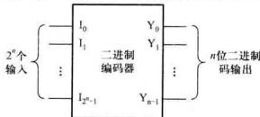  
图4.4.1 二进制编码器结构框图

# （1）普通编码器

4线-2线普通编码器真值表如表4.4.1所示，根据真值表设计编码器电路。4个输入 $I_0$ 到 $I_{3}$ 为高电平有效，输出是2位二进制代码 $Y_{1}Y_{0}$ ，任何时刻 $I_0 - I_3$ 中只能有一个取值为1，并且有一组对应的二进制代码输出。除表中列出4个输入变量的4种取值组合有效外，其余12种组合所对应的输出均应为0。由真值表可以得到如下逻辑表达式：

$$
Y _ {1} = \bar {l} _ {0} \bar {l} _ {1} l _ {2} \bar {l} _ {3} + \bar {l} _ {0} \bar {l} _ {1} l _ {2} l _ {3} \tag {4.4.1}
$$

$$
Y _ {0} = \bar {I} _ {0} I _ {1} \bar {I} _ {2} \bar {I} _ {3} + \bar {I} _ {0} \bar {I} _ {1} \bar {I} _ {2} I _ {3}
$$

任何时刻只有一个输入为1，如果将表4.4.1中没有列出的12种组合所对应的输出看作无关项，并化简得

$$
Y _ {1} = I _ {2} + I _ {3} \tag {4.4.2}
$$

$$
Y _ {0} = I _ {1} + I _ {3}
$$

式(4.4.2)是考虑了无关项的简化结果，比式(4.4.1)简单。根据式(4.4.2)的逻辑表达式画出逻辑图如图4.4.2所示。

表 4.4.1 4 线 -2 线编码器真值表  

<table><tr><td colspan="4">输入</td><td colspan="2">输出</td></tr><tr><td>I0</td><td>I1</td><td>I2</td><td>I3</td><td>Y1</td><td>Y0</td></tr><tr><td>1</td><td>0</td><td>0</td><td>0</td><td>0</td><td>0</td></tr><tr><td>0</td><td>1</td><td>0</td><td>0</td><td>0</td><td>1</td></tr><tr><td>0</td><td>0</td><td>1</td><td>0</td><td>1</td><td>0</td></tr><tr><td>0</td><td>0</td><td>0</td><td>1</td><td>1</td><td>1</td></tr></table>

应当特别注意，这一电路实现正常编码时，对输入信号有严格的限制，即任何时刻 $I_0 \sim I_3$ 中只能并且必须有一个取值为1。例如，当 $I_1, I_2$ 同时为1时，输出出现错误编码 $Y_{1}Y_{0} = 11$ 。因为正常编码时，输出11表示 $I_1$ 为1。

在实际应用中，经常会遇到两个以上的输入同时为有效信号的情况。因此，必须根据轻重缓急，事先规定好这些输入编

码的先后次序，即优先级别。识别这类请求信号的优先级别并进行编码的逻辑电路称为优先编码器。

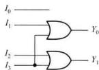  
图4.4.2 4线-2线编码器逻辑图

# （2）优先编码器

4线-2线优先编码器的功能表如表4.4.2所示，根据真值表设计优先编码器电路。由表4.4.2可知 $I_0\sim I_3$ 的优先级别。例如，对于 $I_{0}$ ，只有当 $I_{1},I_{2},I_{3}$ 均为0，即均无有效电平输入，由表 $I_{0}$ 为1时，输出为 $\mathbf{00}$ 。对于 $I_{3}$ ，无论其他3个输入是否为有效电平输入，输出均为11。由此可知 $I_{3}$

的优先级别高于 $I_{0}$ 的优先级别，且这4个输入的优先级别由高到低的次序依次为 $I_{3}, I_{2}, I_{1}, I_{0}$ 。优先编码器允许2个以上的输入同时为1，但只对优先级别比较高的输入进行编码。

由表4.4.2可以得出该优先编码器的逻辑表达式为

$$
\begin{array}{l} Y _ {1} = I _ {2} \bar {I} _ {3} + I _ {3} = I _ {2} + I _ {3} \\ Y _ {0} = I _ {1} \overline {{I}} _ {2} \overline {{I}} _ {3} + I _ {3} = I _ {1} \overline {{I}} _ {2} + I _ {3} \\ \end{array}
$$

上述两种类型的编码器均存在一个问题，当电路所有的输入为0时，输出 $Y_{1}Y_{0}$ 均为0。而当 $I_0$ 为1时，输出 $Y_{1}Y_{0}$ 也全为0，即输入条件不同而输出代码相同。这两种情况在实际中必须加以区分，解决的方法将在下面例题中介绍。

表 4.4.2 4 线 -2 线优先编码器真值表  

<table><tr><td colspan="4">输入</td><td colspan="2">输出</td></tr><tr><td>I0</td><td>I1</td><td>I2</td><td>I3</td><td>Y0</td><td>Y0</td></tr><tr><td>1</td><td>0</td><td>0</td><td>0</td><td>0</td><td>0</td></tr><tr><td>x</td><td>1</td><td>0</td><td>0</td><td>0</td><td>1</td></tr><tr><td>x</td><td>x</td><td>1</td><td>0</td><td>1</td><td>0</td></tr><tr><td>x</td><td>x</td><td>x</td><td>1</td><td>1</td><td>1</td></tr></table>

例4.4.1键盘输入逻辑电路就是由编码器组成的。图4.4.3是用十个按键和门电路组成的8421码编码器，其真值表如表4.4.3所示，十个按键 $\overline{S}_0\sim \overline{S}_9$ 分别对应十进制数 $0\sim 9$ ，编码器的输出为ABCD和GS，试分析该电路的工作原理及GS的作用。

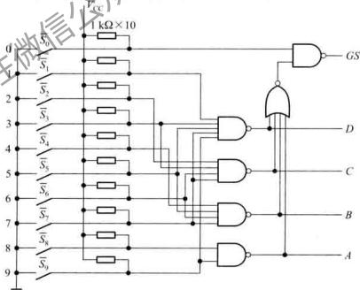  
图4.4.3 用十个按键和门电路组成的8421BCD码编码器

表 4.4.3 十个按键 8421BCD 码编码器真值表  

<table><tr><td colspan="10">输入</td><td colspan="5">输出</td></tr><tr><td>\( \bar {S}_{9} \)</td><td>\( \bar {S}_{8} \)</td><td>\( \bar {S}_{7} \)</td><td>\( \bar {S}_{6} \)</td><td>\( \bar {S}_{5} \)</td><td>\( \bar {S}_{4} \)</td><td>\( \bar {S}_{3} \)</td><td>\( \bar {S}_{2} \)</td><td>\( \bar {S}_{1} \)</td><td>\( \bar {S}_{0} \)</td><td>A</td><td>B</td><td>C</td><td>D</td><td>GS</td></tr><tr><td>1</td><td>1</td><td>1</td><td>1</td><td>1</td><td>1</td><td>1</td><td>1</td><td>1</td><td>1</td><td>0</td><td>0</td><td>0</td><td>0</td><td>0</td></tr><tr><td>1</td><td>1</td><td>1</td><td>1</td><td>1</td><td>1</td><td>1</td><td>1</td><td>1</td><td>0</td><td>0</td><td>0</td><td>0</td><td>0</td><td>1</td></tr><tr><td>1</td><td>1</td><td>1</td><td>1</td><td>1</td><td>1</td><td>1</td><td>1</td><td>0</td><td>1</td><td>0</td><td>0</td><td>0</td><td>1</td><td>1</td></tr><tr><td>1</td><td>1</td><td>1</td><td>1</td><td>1</td><td>1</td><td>1</td><td>0</td><td>1</td><td>1</td><td>0</td><td>0</td><td>1</td><td>0</td><td>1</td></tr><tr><td>1</td><td>1</td><td>1</td><td>1</td><td>1</td><td>1</td><td>0</td><td>1</td><td>1</td><td>1</td><td>0</td><td>0</td><td>1</td><td>1</td><td>1</td></tr><tr><td>1</td><td>1</td><td>1</td><td>1</td><td>1</td><td>0</td><td>1</td><td>1</td><td>1</td><td>1</td><td>0</td><td>1</td><td>0</td><td>0</td><td>1</td></tr><tr><td>1</td><td>1</td><td>1</td><td>1</td><td>0</td><td>1</td><td>1</td><td>1</td><td>1</td><td>1</td><td>0</td><td>1</td><td>0</td><td>1</td><td>1</td></tr><tr><td>1</td><td>1</td><td>1</td><td>0</td><td>1</td><td>1</td><td>1</td><td>1</td><td>1</td><td>1</td><td>0</td><td>1</td><td>1</td><td>0</td><td>1</td></tr><tr><td>1</td><td>1</td><td>0</td><td>1</td><td>1</td><td>1</td><td>1</td><td>1</td><td>1</td><td>1</td><td>0</td><td>1</td><td>1</td><td>1</td><td>1</td></tr><tr><td>1</td><td>0</td><td>1</td><td>1</td><td>1</td><td>1</td><td>1</td><td>1</td><td>1</td><td>1</td><td>1</td><td>0</td><td>0</td><td>0</td><td>1</td></tr><tr><td>0</td><td>1</td><td>1</td><td>1</td><td>1</td><td>1</td><td>1</td><td>1</td><td>1</td><td>1</td><td>1</td><td>0</td><td>0</td><td>1</td><td>1</td></tr></table>

解：对真值表和逻辑电路进行分析，可得知：① 该编码器为输入低电平有效，因此用带非号的变量表示；② 在按下 $\overline{S}_0 \sim \overline{S}_9$ 中任意一个键时，即输入信号中有一个为低电平时，ABCD 输出信号为该键的 BCD 编码，同时 $GS = 1$ ，表示有信号输入。而只有 $\overline{S}_0 \sim \overline{S}_9$ 均为高电平时 $GS = 0$ ，表示无信号输入，此时的输出代码 0000 为无效代码。由此解决了图 4.4.2 所示电路存在的问题，即输入条件不同而输出代码相同。

# 2.典型编码器电路

8线-3线优先编码器CD4532是CMOS中规模集成电路，其功能如表4.4.4所示。

表 4.4.4 优先编码器 CD4532 功能表  

<table><tr><td colspan="10">输入</td><td colspan="5">输出</td></tr><tr><td>EI</td><td>I1</td><td>I6</td><td>I5</td><td>I4</td><td>I3</td><td>I2</td><td>I1</td><td>I0</td><td>Y2</td><td>Y1</td><td>Y0</td><td>GS</td><td>EO</td><td></td></tr><tr><td>0</td><td>×</td><td>×</td><td>×</td><td>×</td><td>×</td><td>×</td><td>×</td><td>×</td><td>0</td><td>0</td><td>0</td><td>0</td><td>0</td><td></td></tr><tr><td>1</td><td>0</td><td>0</td><td>0</td><td>0</td><td>0</td><td>0</td><td>0</td><td>0</td><td>0</td><td>0</td><td>0</td><td>0</td><td>1</td><td></td></tr><tr><td>1</td><td>1</td><td>×</td><td>×</td><td>×</td><td>×</td><td>×</td><td>×</td><td>×</td><td>1</td><td>1</td><td>1</td><td>1</td><td>0</td><td></td></tr><tr><td>1</td><td>0</td><td>1</td><td>×</td><td>×</td><td>×</td><td>×</td><td>×</td><td>×</td><td>1</td><td>1</td><td>0</td><td>1</td><td>0</td><td></td></tr><tr><td>1</td><td>0</td><td>0</td><td>1</td><td>×</td><td>×</td><td>×</td><td>×</td><td>×</td><td>1</td><td>0</td><td>1</td><td>1</td><td>0</td><td></td></tr><tr><td>1</td><td>0</td><td>0</td><td>0</td><td>1</td><td>×</td><td>×</td><td>×</td><td>×</td><td>1</td><td>0</td><td>0</td><td>1</td><td>0</td><td></td></tr><tr><td>1</td><td>0</td><td>0</td><td>0</td><td>0</td><td>1</td><td>×</td><td>×</td><td>×</td><td>0</td><td>1</td><td>1</td><td>1</td><td>0</td><td></td></tr><tr><td>1</td><td>0</td><td>0</td><td>0</td><td>0</td><td>0</td><td>1</td><td>×</td><td>×</td><td>0</td><td>1</td><td>0</td><td>1</td><td>0</td><td></td></tr><tr><td>1</td><td>0</td><td>0</td><td>0</td><td>0</td><td>0</td><td>0</td><td>1</td><td>×</td><td>0</td><td>0</td><td>1</td><td>1</td><td>0</td><td></td></tr><tr><td>1</td><td>0</td><td>0</td><td>0</td><td>0</td><td>0</td><td>0</td><td>0</td><td>1</td><td>0</td><td>0</td><td>0</td><td>1</td><td>0</td><td></td></tr></table>

从功能表可以看出，该编码器有8个信号输入端，3个二进制码输出端，输入和输出均以高

电平作为有效电平，而且输入优先级别由高到低的次序依次为 $I_{\mathrm{a}}, I_{\mathrm{b}}, \dots, I_{0}$ 。此外，为便于多个芯片连接起来扩展电路的功能，还设置了高电平有效的输入使能端 $EI$ 和输出使能端 $EO$ ，以及优先编码工作状态标志 $GS$ 。

当 $EI = 1$ 时，编码器工作；而当 $EI = 0$ 时，禁止编码器工作，此时不论8个输入端为何种状态，3个输出端均为低电平，且 $GS$ 和 $EO$ 均为低电平。

只有在 $EI$ 为1，且所有输入端都为0时， $EO$ 输出为1，它可与另一片相同器件的 $EI$ 连接，以便组成更多输入端的优先编码器。

$GS$ 的功能是，当 $EI$ 为1，且至少有一个输入端有高电平信号输入时， $GS$ 为1，表明编码器处于工作状态，否则 $GS$ 为0，由此可以区分当电路所有输入端均无高电平输入，或者只有 $I_{0}$ 输入端有高电平时， $Y_{2}Y_{1}Y_{0}$ 均为000的情况。

根据功能表推导出各输出端的逻辑表达式为

$$
\left\{ \begin{array}{l} Y _ {2} = E I \left(I _ {7} + I _ {6} + I _ {5} + I _ {4}\right) \\ Y _ {1} = E I \left(I _ {7} + I _ {6} + \overline {{I _ {5}}} \overline {{I _ {4}}} I _ {3} + \overline {{I _ {4}}} \overline {{I _ {1}}} I _ {2}\right) \\ Y _ {0} = E I \left(I _ {7} + I _ {6} I _ {5} + \overline {{I _ {6}}} \overline {{I _ {4}}} I _ {3} + \overline {{I _ {6}}} \overline {{I _ {2}}} \overline {{I _ {2}}} I _ {0}\right) \\ E O = E I (\overline {{I _ {7}}} \overline {{I _ {6}}} \overline {{I _ {5}}} \overline {{I _ {4}}} \overline {{I _ {3}}} \overline {{I _ {2}}} \overline {{I _ {1}}} I _ {0}) \\ G S = E I \left(I _ {7} + I _ {6} + I _ {4} + I _ {4} + I _ {1} + I _ {2} + I _ {1} + I _ {0}\right) \end{array} \right. \tag {4.4.3}
$$

由式(4.4.3)可以画出逻辑图（此处省略），逻辑符号如图4.4.4所示。

例4.4.2 用两片8线-3线编码器CD4532组成16线-4线优先编码器，其逻辑图如图4.4.5所示，试分析其工作原理。

解：根据CD4532的功能表，对逻辑图进行分析得出：

（1）当 $EI_{1} = 0$ 时，片（1）禁止编码，其输出端 $Y_{2}Y_{1}Y_{0}$ 为000，而且 $GS_{1},EO_{1}$ 均为0。同时 $EO_{1}$ 使 $EI_{0} =$

0，片(0)也禁止编码，其输出端及 $GS_{0},EO_{0}$ 均为0。由电

电路图可知 $GS = GS_{1} + GS_{0} = 0$ ，表示此时电路输出端的代码 $L_{3}L_{2}L_{1}L_{0} = 0000$ 是非编码输出。

（2）当 $EI_{1} = 1$ 时，片(1)允许编码，若 $A_{15}\sim A_{8}$ 均无有效电平输入，则 $EO_{1} = 1$ ，使 $EI_{0} = 1$ ，从而允许片(0)编码，因此片(1)的优先级高于片(0)。

此时 $A_{15} - A_{8}$ 没有有效电平输入，片(1)的输出均为0，使4个或门都打开， $L_{2}, L_{1}, L_{0}$ 取决于片(0)的输出，而 $L_{3} = GS_{1}$ 总是等于0，所以输出代码在0000～0111之间变化。若只有 $A_{0}$ 有高电平输入，输出为0000，若 $A_{3}$ 及其他输入同时有高电平输入，则输出为0111。 $A_{0}$ 的优先级别最低。

（3）当 $EI_{1} = 1$ 且 $A_{15}\sim A_{9}$ 中至少有一个为高电平输入时， $EO_{1} = 0$ ，使 $EI_{0} = 0$ ，片(0)禁止编码，此时 $L_{3} = GS_{3} = 1,L_{2},L_{1},L_{0}$ 取决于片(1)的输出，输出代码在1000\~1111之间变化，并且 $A_{15}$ 的优先级别最高。

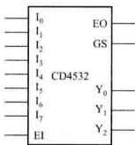  
图4.4.4 优先编码器CD4532的逻辑符号

电路实现了16位输入的优先编码，优先级别从 $A_{15}$ 至 $A_0$ 依次递减

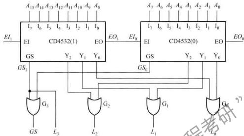  
图4.4.5 例4.4.2的逻辑图

# 复习思考题

4.4.1.1 普通编码器和优先编码器的区别是什么？  
4.4.1.2优先编码器CD4532的输入、输出信号是高电平有效还是低电平有效？  
4.4.1.3 说明CD4532的输入信号EI和输出信号GS、EO的作用。

# 4.4.2 译码器/数据分配器

在数字系统中，经常需要将一种代码转换为另一种代码，以满足特定的需要，完成这种功能的电路称为码转换电路。译码器和编码器都是码转换电路。

# 1. 译码器的定义与功能

译码是编码的逆过程，它的功能是将具有特定含义的二进制码转换成对应的输出信号，具有译码功能的逻辑电路称为译码器。

译码器可分为两种类型，一种是将一系列代码转换成与之一一对应的有效信号。这种译码

器可称为二进制译码器或唯一地址译码器，它常用于计算机中对存储器单元地址的译码，即将每一个地址代码转换成一个有效信号，从而选中对应的单元。另一种是将一种代码转换成另一种代码，所以也称为代码变换器。

图4.4.6表示二进制译码器的一般框图，它具有 $n$ 个输入端， $2^n$ 个输出端和一个使能输入端。在使能输入端为有效电平时，对应每一

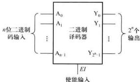  
图4.4.6 二进制译码器框图

组输入代码，只有其中一个输出端为有效电平，其余输出端则为相反电平。输出信号可以是高电平有效，也可以是低电平有效。

下面以2线-4线译码器为例，分析译码器的工作原理和电路结构。

2输入变量 $A_{1}, A_{0}$ 共有4种不同状态组合，因而译码器有4个输出信号 $\overline{Y}_0 \sim \overline{Y}_1$ ，并且输出为低电平有效，真值表如表4.4.5所示。

表 4.4.5 2 线 -4 线译码器真值表  

<table><tr><td colspan="3">输入</td><td colspan="4">输出</td></tr><tr><td>E</td><td>A1</td><td>Ao</td><td>Y0</td><td>Y1</td><td>Y2</td><td>Y3</td></tr><tr><td>1</td><td>×</td><td>×</td><td>1</td><td>1</td><td>1</td><td>1</td></tr><tr><td>0</td><td>0</td><td>0</td><td>0</td><td>1</td><td>1</td><td>1</td></tr><tr><td>0</td><td>0</td><td>1</td><td>1</td><td>0</td><td>1</td><td>1</td></tr><tr><td>0</td><td>1</td><td>0</td><td>1</td><td>1</td><td>0</td><td>1</td></tr><tr><td>0</td><td>1</td><td>1</td><td>1</td><td>1</td><td>1</td><td>0</td></tr></table>

另外设置了使能控制端 $E$ ，当 $E$ 为1时，无论 $A_{0}, A_{0}$ 为何种状态，输出全为1，译码器处于非工作状态。而当 $\overline{E}$ 为0时，对应于 $A_{1}, A_{0}$ 的一种输入状态，其中只有一个输出端为0，其余各输出端均为1。例如， $A_{1}A_{0} = 00$ 时， $\overline{Y}_{0}$ 为0， $\overline{Y}_{1} = \overline{Y}_{3}$ 均为1。由此可见，译码器是通过输出端的逻辑电平以识别不同的代码。

根据真值表可写出各输出端的逻辑表达式为

$$
\begin{array}{l} V _ {0} = E A _ {1} A _ {0} \\ \left\{ \begin{array}{l} \bar {Y} _ {1} = \overline {{E A _ {1}}} A _ {0} \\ \bar {Y} _ {2} = E A _ {1} \bar {A} _ {0} \\ \bar {Y} _ {3} = E A _ {1} A _ {0} \end{array} \right. \tag {4.4.4} \\ \end{array}
$$

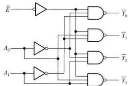  
图4.4.7 2线-4线译码器逻辑图

根据逻辑表达式画出逻辑图如图4.4.7所示

# 2.典型译码器电路及应用

（1）二进制译码器

典型的二进制译码器有2线-4线译码器和3线-8线译码器

3线-8线译码器的逻辑图如图4.4.8(a)所示，逻辑符号如图4.4.8(b)所示。该译码器有3

位二进制输入 $A_{2}, A_{1}, A_{0}$ ，它们共有8种组合状态，即可译出8个输出信号 $\overline{Y}_{0} \sim \overline{Y}_{7}$ ，输出为低电平有效。此外，还设置了3个使能输入端 $E_{3}, E_{2}$ 和 $\overline{E}_{1}$ ，并且 $E = E_{3} = \overline{\overline{E}_{2}} = \overline{\overline{E}_{1}}$ ，为扩展电路的功能提供了方便。由逻辑图写出：

$$
\left\{ \begin{array}{l} \overline {{Y}} _ {0} = \overline {{E A _ {2} \overline {{A}} _ {1} \overline {{A}} _ {0}}} \\ \overline {{Y}} _ {1} = \overline {{E A _ {2} \overline {{A}} _ {1} A _ {0}}} \\ \overline {{Y}} _ {2} = \overline {{E A _ {2} A _ {1} \overline {{A}} _ {0}}} \\ \overline {{Y}} _ {3} = \overline {{E A _ {2} A _ {1} A _ {0}}} \\ \overline {{Y}} _ {4} = \overline {{E A _ {2} \overline {{A}} _ {1} \overline {{A}} _ {0}}} \\ \overline {{Y}} _ {5} = \overline {{E A _ {2} \overline {{A}} _ {1} A _ {0}}} \\ \overline {{Y}} _ {6} = \overline {{E A _ {2} A _ {1} \overline {{A}} _ {0}}} \\ \overline {{Y}} _ {7} = \overline {{E A _ {2} A _ {1} A _ {0}}} \end{array} \right. ^ {\gamma_ {7}} \tag {4.4.5}
$$

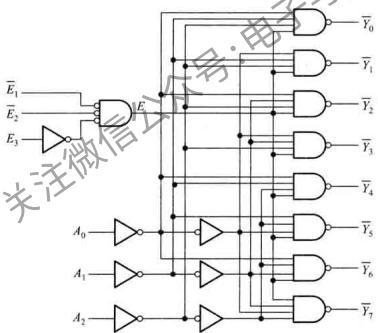  
(a)

(b)   
图4.4.8 3线-8线译码器  
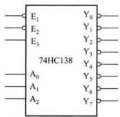  
（a）逻辑图 （b）逻辑符号

当 $E_{3} = 1$ ，且 $\overline{E}_2 = \overline{E}_1 = 0$ 时， $E = 1$ ，带入式（4.4.5）可得

$$
\bar {Y} _ {0} = m _ {0}, \bar {Y} _ {1} = m _ {1}, \bar {Y} _ {2} = m _ {2}, \bar {Y} _ {3} = m _ {3}, \bar {Y} _ {4} = m _ {4}, \bar {Y} _ {5} = m _ {5}, \bar {Y} _ {6} = m _ {6}, \bar {Y} _ {7} = m _ {7}
$$

译码器的输出包含了输入 $A_{2}, A_{1}, A_{0}$ 组成的所有最小项。

根据式（4.4.5）可以列出3线-8线译码器功能表如表4.4.6所示。

利用3线-8线译码器可以构成4线-16线、5线-32线或6线-64线译码器。

表 4.4.6 3 线 -8 线译码器功能表  

<table><tr><td colspan="6">输入</td><td colspan="7">输出</td></tr><tr><td>\( E_3 \)</td><td>\( \bar{E}_2 \)</td><td>\( \bar{E}_1 \)</td><td>\( A_2 \)</td><td>\( A_1 \)</td><td>\( A_0 \)</td><td>\( \bar{Y}_0 \)</td><td>\( \bar{Y}_1 \)</td><td>\( \bar{Y}_2 \)</td><td>\( \bar{Y}_3 \)</td><td>\( \bar{Y}_4 \)</td><td>\( \bar{Y}_5 \)</td><td>\( \bar{Y}_6 \)</td></tr><tr><td>×</td><td>1</td><td>×</td><td>×</td><td>×</td><td>×</td><td>1</td><td>1</td><td>1</td><td>1</td><td>1</td><td>1</td><td>1</td></tr><tr><td>×</td><td>×</td><td>1</td><td>×</td><td>×</td><td>×</td><td>1</td><td>1</td><td>1</td><td>1</td><td>1</td><td>1</td><td>1</td></tr><tr><td>0</td><td>×</td><td>×</td><td>×</td><td>×</td><td>×</td><td>1</td><td>1</td><td>1</td><td>1</td><td>1</td><td>1</td><td>1</td></tr><tr><td>1</td><td>0</td><td>0</td><td>0</td><td>0</td><td>0</td><td>0</td><td>1</td><td>1</td><td>1</td><td>1</td><td>1</td><td>1</td></tr><tr><td>1</td><td>0</td><td>0</td><td>0</td><td>0</td><td>1</td><td>1</td><td>0</td><td>1</td><td>1</td><td>1</td><td>1</td><td>1</td></tr><tr><td>1</td><td>0</td><td>0</td><td>0</td><td>1</td><td>0</td><td>1</td><td>1</td><td>0</td><td>1</td><td>1</td><td>1</td><td>1</td></tr><tr><td>1</td><td>0</td><td>0</td><td>0</td><td>1</td><td>1</td><td>1</td><td>1</td><td>1</td><td>0</td><td>1</td><td>1</td><td>1</td></tr><tr><td>1</td><td>0</td><td>0</td><td>1</td><td>0</td><td>0</td><td>1</td><td>1</td><td>1</td><td>1</td><td>0</td><td>1</td><td>1</td></tr><tr><td>1</td><td>0</td><td>0</td><td>1</td><td>0</td><td>1</td><td>1</td><td>1</td><td>1</td><td>1</td><td>1</td><td>0</td><td>1</td></tr><tr><td>1</td><td>0</td><td>0</td><td>1</td><td>1</td><td>0</td><td>1</td><td>1</td><td>1</td><td>1</td><td>1</td><td>1</td><td>0</td></tr><tr><td>1</td><td>0</td><td>0</td><td>1</td><td>1,</td><td>1</td><td>1</td><td>1</td><td>1</td><td>1</td><td>1</td><td>1</td><td>0</td></tr></table>

集成3线-8线译码器有CMQS（如74HC138）和TTL（如74LS138）的产品，两者在逻辑功能上没有区别，只是电性能参数不同，用 $74\mathrm{x}138$ 表示两者中任意一种。 $74\mathrm{x}139$ 是双2线-4线，两个独立的译码器封装在一个集成芯片中，其中之一的逻辑符号如图4.4.9(a)所示。

逻辑符号说明：74x139 逻辑符号框外部的 $E, Y_0 \sim Y_3$ 作为变量符号，表示外部输入或输出

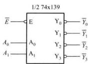  
(a)

(b)   
图4.4.9 74x139逻辑符号及结构  
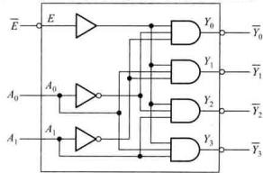  
（a）逻辑符号 （b）逻辑符号结构

信号名称，字母上面的“一”号说明该输入或输出是低电平有效，如图4.4.9(b)所示。符号框内部的输入、输出变量表示其内部的逻辑关系，全部为高电平有效。当输入或输出为低电平有效时，符号框外部逻辑变量 $\overline{E},\overline{Y}_0\sim \overline{Y}_1$ 的逻辑状态与符号框内相应的 $E,Y_0\sim Y_1$ 的逻辑状态相反。在推导表达式的过程中，如果低有效的输入或输出变量上面的“一”号参与运算，则在画逻辑图或验证真值表时，注意将其还原为低有效符号。

例4.4.3 试用四片3线-8线译码器(74HC138)和一片2线-4线译码器(74HC139)构成5线-32线译码器，输入为5位二进制码 $B_{4}B_{3}B_{2}B_{1}B_{0}$ ，对应输出 $\overline{L}_0\sim \overline{L}_{31}$ 为低电平有效信号。

解：首先列出5线-32线译码器的真值表如表4.4.7所示

表 4.4.7 5 线-32 线译码器真值表  

<table><tr><td colspan="5">输入</td><td colspan="10">输出</td></tr><tr><td>\( B_4 \)</td><td>\( B_3 \)</td><td>\( B_2 \)</td><td>\( B_1 \)</td><td>\( B_0 \)</td><td>\( \bar{L}_{0_4} \)</td><td>\( \bar{L}_{1_4} \)</td><td>\( \bar{L}_{2_4} \)</td><td>\( \bar{L}_{3_4} \)</td><td>\( \bar{L}_{4_4} \)</td><td>...</td><td>\( \bar{L}_{n_4} \)</td><td>\( \bar{L}_{n_2} \)</td><td>\( \bar{L}_{n_1} \)</td><td>\( \bar{L}_{c_{11}} \)</td></tr><tr><td>0</td><td>0</td><td>0</td><td>0</td><td>0</td><td>0</td><td>1</td><td>1</td><td>1</td><td>1</td><td>...</td><td>1</td><td>1</td><td>1</td><td>1</td></tr><tr><td>0</td><td>0</td><td>0</td><td>0</td><td>1</td><td>1</td><td>0</td><td>1</td><td>1</td><td>1</td><td>...</td><td>1</td><td>1</td><td>1</td><td>1</td></tr><tr><td>0</td><td>0</td><td>0</td><td>1</td><td>0</td><td>1</td><td>1</td><td>0</td><td>1</td><td>1</td><td>...</td><td>1</td><td>1</td><td>1</td><td>1</td></tr><tr><td>0</td><td>0</td><td>0</td><td>1</td><td>1</td><td>1</td><td>1</td><td>1</td><td>0</td><td>1</td><td>...</td><td>1</td><td>1</td><td>1</td><td>1</td></tr><tr><td>0</td><td>0</td><td>1</td><td>0</td><td>0</td><td>1</td><td>1</td><td>1</td><td>1</td><td>0</td><td>...</td><td>1</td><td>1</td><td>1</td><td>1</td></tr><tr><td></td><td></td><td>:</td><td></td><td></td><td></td><td></td><td></td><td></td><td></td><td>:</td><td></td><td></td><td></td><td></td></tr><tr><td>1</td><td>1</td><td>0</td><td>1</td><td>1</td><td>1</td><td>4</td><td>1</td><td>1</td><td>1</td><td>...</td><td>0</td><td>1</td><td>1</td><td>1</td></tr><tr><td>1</td><td>1</td><td>1</td><td>0</td><td>0</td><td>1</td><td>1</td><td>1</td><td>1</td><td>1</td><td>...</td><td>1</td><td>0</td><td>1</td><td>1</td></tr><tr><td>1</td><td>1</td><td>1</td><td>0</td><td>1</td><td>1</td><td>1</td><td>1</td><td>1</td><td>1</td><td>...</td><td>1</td><td>1</td><td>0</td><td>1</td></tr><tr><td>1</td><td>1</td><td>1</td><td>1</td><td>0</td><td>1</td><td>1</td><td>1</td><td>1</td><td>1</td><td>...</td><td>1</td><td>1</td><td>1</td><td>0</td></tr><tr><td>1</td><td>1</td><td>1</td><td>1</td><td>1</td><td>1</td><td>1</td><td>1</td><td>1</td><td>1</td><td>...</td><td>1</td><td>1</td><td>1</td><td>0</td></tr></table>

从表中可以看出，当 $B_{4}B_{3} = 00$ ，而 $B_{2}B_{1}B_{0}$ 从000变化到111时，对应 $\overline{L}_0\sim \overline{L}_7$ 中有一个输出为0，其余输出全为1，因此4片3线-8线译码器(74HC138)中，设置片（0）为译码状态，其余3片为禁止译码状态，对应的输出 $\overline{L}_{8}\sim \overline{L}_{31}$ 全为1。

以此类推，当 $B_{4}B_{3} = 01$ ， $B_{2}B_{1}B_{0}$ 从000变化到111时， $\overline{L}_{8}\sim \overline{L}_{15}$ 分别输出有效信号，此时设置片(1)为译码状态。当 $B_{4}B_{3} = 10$ 和11时，分别设置片(2)和片(3)为译码状态。因此，将5位二进制码的低3位 $B_{2}B_{1}B_{0}$ 分别与4片3线-8线译码器的3个地址输入端 $A_{2}A_{1}A_{0}$ 并接在一起。

高位 $B_{4}B_{3}$ 有4种状态的组合，因此接入2线-4线译码器(74HC139)的两个地址输入端 $A_{1}A_{0},2$ 线-4线译码器的4个低有效输出信号分别接入4片3线-8线译码器的低使能输入端，使它们在 $B_{4}B_{3}$ 的控制下轮流工作在译码状态。这样就得到5线-32线译码器，逻辑图如图4.4.10所示。

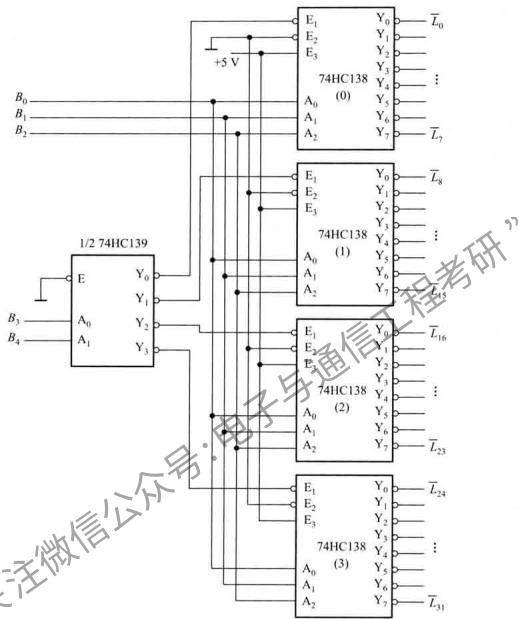  
图4.4.10 例4.4.3的逻辑图

例4.4.4用3线-8线译码器（74HC138）和必要的逻辑门实现函数 $L = \overline{AC} +AB$

解：当控制端接有效电平时，译码器的输出是3个输入变量的全部最小项。因此，首先将函数式变换为最小项之和的形式

$$
L = \bar {A} \bar {B} C + \bar {A} \bar {B} C + A B \bar {C} + A B C = m _ {0} + m _ {2} + m _ {6} + m _ {7}
$$

将输入变量 $A, B, C$ 分别接入 $A_{2}, A_{1}$ 和 $A_{0}$ 端，并将使能端接有效电平。由于译码器输出是低电平有效，所以将最小项变换为反函数的形式

$$
L = \overline {{\bar {m} _ {0} \cdot \bar {m} _ {2}}} \cdot \overline {{\bar {m} _ {6} \cdot \bar {m} _ {7}}} = \overline {{\bar {Y} _ {0}}} \cdot \overline {{\bar {Y} _ {2}}} \cdot \overline {{\bar {Y} _ {6}}} \cdot \overline {{\bar {Y} _ {7}}}
$$

在译码器的输出端加一个与非门，将这些最小项组合起来，便可实现3变量组合逻辑函数，如图4.4.11所示。

# （2）二-十进制译码器

在第一章已经讨论过8421BCD码，对应于 $0\sim$ 9的十进制数，由4位二进制数 $0000\sim 1001$ 表示由于人们不习惯于直接识别二进制数，所以采用

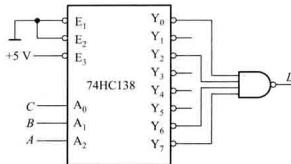  
图4.4.11 例4.4.4的逻辑图

二十进制译码器来解决。这种译码器应有4个输入端，10个输出端。它的真值表如表4.4.8所示，其输出为低电平有效。当输入超过8421BCD码的范围时（即1010~1111），输出均为高电平，即没有有效译码输出。

根据真值表4.4.8，可以写出二-十进制译码器输出与输入的逻辑表达式：

$$
\left\{ \begin{array}{l l} \overline {{Y _ {0}}} = \overline {{A _ {3} A _ {2} A _ {1} A _ {0}}} & \overline {{Y _ {1}}} = \overline {{A _ {3} A _ {1} A _ {2} A _ {0}}} \\ \overline {{Y _ {2}}} = \overline {{A _ {3} A _ {2} A _ {1} A _ {0}}} & \overline {{Y _ {3}}} = \overline {{A _ {3} A _ {2} A _ {1} A _ {0}}} \\ \overline {{Y _ {4}}} = \overline {{A _ {3} A _ {2} A _ {1} A _ {0}}} & \overline {{Y _ {5}}} = \overline {{A _ {3} A _ {2} A _ {1} A _ {0}}} \\ \overline {{Y _ {6}}} = \overline {{A _ {3} A _ {2} A _ {1} A _ {0}}} & \overline {{Y _ {7}}} = \overline {{A _ {3} A _ {2} A _ {1} A _ {0}}} \\ \overline {{Y _ {8}}} = \overline {{A _ {3} A _ {2} A _ {1} A _ {0}}} & \overline {{Y _ {9}}} = \overline {{A _ {3} A _ {2} A _ {1} A _ {0}}} \end{array} \right. \tag {4.4.6}
$$

表 4.4.8 二-十进制译码器真值表  

<table><tr><td rowspan="2">数 据</td><td colspan="4">\( \mathrm{{BCD}} \) 输入</td><td colspan="9">输出</td></tr><tr><td>\( {A}_{2} \)</td><td>\( {A}_{1} \)</td><td>\( {A}_{0} \)</td><td>\( {\bar{Y}}_{0} \)</td><td>\( {\bar{Y}}_{1} \)</td><td>\( {\bar{Y}}_{2} \)</td><td>\( {\bar{Y}}_{3} \)</td><td>\( {\bar{Y}}_{4} \)</td><td>\( {\bar{Y}}_{5} \)</td><td>\( {\bar{Y}}_{6} \)</td><td>\( {\bar{Y}}_{7} \)</td><td>\( {\bar{Y}}_{8} \)</td><td>\( {\bar{Y}}_{9} \)</td></tr><tr><td>0</td><td>0</td><td>0</td><td>0</td><td>0</td><td>0</td><td>1</td><td>1</td><td>1</td><td>1</td><td>1</td><td>1</td><td>1</td><td>1</td></tr><tr><td>1</td><td>0</td><td>0</td><td>0</td><td>1</td><td>1</td><td>0</td><td>1</td><td>1</td><td>1</td><td>1</td><td>1</td><td>1</td><td>1</td></tr><tr><td>2</td><td>0</td><td>0</td><td>1</td><td>0</td><td>1</td><td>1</td><td>0</td><td>1</td><td>1</td><td>1</td><td>1</td><td>1</td><td>1</td></tr><tr><td>3</td><td>0</td><td>0</td><td>1</td><td>1</td><td>1</td><td>1</td><td>1</td><td>0</td><td>1</td><td>1</td><td>1</td><td>1</td><td>1</td></tr><tr><td>4</td><td>0</td><td>1</td><td>1</td><td>0</td><td>1</td><td>1</td><td>1</td><td>1</td><td>0</td><td>1</td><td>1</td><td>1</td><td>1</td></tr><tr><td>5</td><td>0</td><td>1</td><td>0</td><td>1</td><td>1</td><td>1</td><td>1</td><td>1</td><td>0</td><td>1</td><td>1</td><td>1</td><td>1</td></tr><tr><td>6</td><td>0</td><td>1</td><td>1</td><td>0</td><td>1</td><td>1</td><td>1</td><td>1</td><td>1</td><td>0</td><td>1</td><td>1</td><td>1</td></tr><tr><td>7</td><td>0</td><td>1</td><td>1</td><td>1</td><td>1</td><td>1</td><td>1</td><td>1</td><td>1</td><td>1</td><td>0</td><td>1</td><td>1</td></tr><tr><td>8</td><td>1</td><td>0</td><td>0</td><td>0</td><td>1</td><td>1</td><td>1</td><td>1</td><td>1</td><td>1</td><td>1</td><td>0</td><td>1</td></tr><tr><td>9</td><td>1</td><td>0</td><td>0</td><td>1</td><td>1</td><td>1</td><td>1</td><td>1</td><td>1</td><td>1</td><td>1</td><td>1</td><td>0</td></tr><tr><td>10</td><td>1</td><td>0</td><td>1</td><td>0</td><td>1</td><td>1</td><td>1</td><td>1</td><td>1</td><td>1</td><td>1</td><td>1</td><td>1</td></tr></table>

续表  

<table><tr><td rowspan="2">数目</td><td colspan="4">BCD 输入</td><td colspan="9">输出</td><td></td></tr><tr><td>\( {A}_{3} \)</td><td>\( {A}_{2} \)</td><td>\( {A}_{1} \)</td><td>\( {A}_{0} \)</td><td>\( {\bar{Y}}_{0} \)</td><td>\( {\bar{Y}}_{1} \)</td><td>\( {\bar{Y}}_{2} \)</td><td>\( {\bar{Y}}_{3} \)</td><td>\( {\bar{Y}}_{4} \)</td><td>\( {\bar{Y}}_{5} \)</td><td>\( {\bar{Y}}_{6} \)</td><td>\( {\bar{Y}}_{7} \)</td><td>\( {\bar{Y}}_{8} \)</td><td>\( {\bar{Y}}_{9} \)</td></tr><tr><td>11</td><td>1</td><td>0</td><td>1</td><td>1</td><td>1</td><td>1</td><td>1</td><td>1</td><td>1</td><td>1</td><td>1</td><td>1</td><td>1</td><td></td></tr><tr><td>12</td><td>1</td><td>1</td><td>0</td><td>0</td><td>1</td><td>1</td><td>1</td><td>1</td><td>1</td><td>1</td><td>1</td><td>1</td><td>1</td><td></td></tr><tr><td>13</td><td>1</td><td>1</td><td>0</td><td>1</td><td>1</td><td>1</td><td>1</td><td>1</td><td>1</td><td>1</td><td>1</td><td>1</td><td>1</td><td></td></tr><tr><td>14</td><td>1</td><td>1</td><td>1</td><td>0</td><td>1</td><td>1</td><td>1</td><td>1</td><td>1</td><td>1</td><td>1</td><td>1</td><td>1</td><td></td></tr><tr><td>15</td><td>1</td><td>1</td><td>1</td><td>1</td><td>1</td><td>1</td><td>1</td><td>1</td><td>1</td><td>1</td><td>1</td><td>1</td><td>1</td><td></td></tr></table>

由式（4.4.6）可以画出逻辑图（此处省略）。

二-十进制译码器应用电路如图4.4.12所示。电路的输出分别接在标有十进制数的灯泡。当输入一组8421BCD码时，对应输出端为低电平，点亮与之相连的灯泡。例如，当输入BCD码 $A_{3}A_{2}A_{1}A_{0} = 0110$ 时，输出 $\overline{Y}_6 = 0$ ，它对应于十进制数6，其余输出为高电平。

# （3）七段显示译码器

在数字测量仪表和各种数字系统中，都需要将数字量直观地显示出来，数字显示电路通常由译码驱动器和显示器等部分组成。数码显示器就是用来显示数字、文字或符号的器件。七段式数字显示器是目前常用的显示方式，图4.4.13

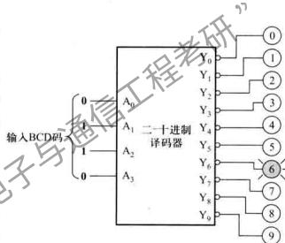  
图4.4.12 二-十进制译码器应用电路

表示七段式数字显示器利用不同发光段的组合，显示0~9阿拉伯数字。有些数码显示器增加了一段，作为小数点。

日常生活中普遍使用七段式数字显示器，也称为七段数码管。常见的七段显示器有发光二极管和液晶显示器两种，这里主要介绍前者。发光二极管构成的七段显示器有两种，共阴极和共阳极电路，如图4.4.14所示。共阴极电路中，八个发光二极管的阴极连在一起接低电平，需要某一段发光，就将相应二极管的阳极接高电平。共阳极显示器的驱动则刚好相反。

为了使数码管能显示十进制数，必须将十进制数的代码经译码器译出，然后经驱动器点亮对应的段。例如，对于8421码的0011状态，对应的十进制数为3，则译码驱动器应使 $a, b, c, d, g$ 各段点亮。译码器的功能就是，对应于某一组数码输入，相应的几个输出端有有效信号输出。

常用的七段显示译码器有两类，一类译码器输出高电平有效信号，用来驱动共阴极显示器，另一类输出低电平有效信号，以驱动共阳极显示器。下面介绍输出高电平有效的七段显示译码器(74HC4511)。

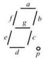  
(a)

(b)   
图4.4.13 七段数字显示器发光段组合图  
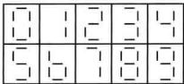  
（a）分段布置图 （b）段组合图

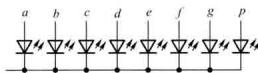  
(a)

(b)   
图4.4.14 二极管显示器等效电路  
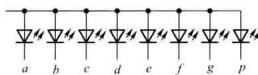  
（a）共阴极电路 （b）共阳极电路

七段显示译码器功能表如表4.4.9所示。当输入 $D_{3}D_{2}D_{1}D_{0}$ 接8421BCD码时，输出高电平有效，用以驱动共阴极显示器。当输入为 $1010\sim 1111$ 六个状态时，输出全为低电平，显示器无显示。该显示译码器设有三个辅助控制端 $LE, \overline{BL}, \overline{LT}$ ，以增强器件的功能，现分别简要说明如下：

$①$ 灯测试输入 $\overline{LT}$

当 $LT = 0$ 时，无论其他输入端是什么状态，所有输出 $a\sim g$ 均为1，显示器显示字形。该输入端常用于检查译码器本身及显示器各段的好坏。

② 灭灯输入 $\overline{BL}$

当 $BL = 0$ ，并且 $LT = 1$ 时，无论其他输入端是什么电平，所有输出 $a\sim g$ 均为0，所以字形熄灭。该输入端用于将不必要显示的零熄灭，例如一个6位数字023.050，将首、尾多余的0熄灭，则显示为23.05，使显示结果更加清楚。

③ 锁存使能输入 $LE$

在 $BL = LP = 1$ 的条件下，当 $LE = 0$ 时，锁存器不工作，译码器的输出随输入码的变化而变化；当 $LE$ 出口跳变为1时，输入码被锁存，输出只取决于锁存器的内容，不再随输入的变化而变化。有关锁存器的内容将在第五章介绍。

表 4.4.9 七段显示译码器(74HC4511)功能表  

<table><tr><td rowspan="2">十进制或功能</td><td colspan="6">输入</td><td colspan="7">输出</td><td>字形</td></tr><tr><td>LE</td><td>BL</td><td>LT</td><td>D3</td><td>D2</td><td>D1</td><td>D0</td><td>a</td><td>b</td><td>c</td><td>d</td><td>e</td><td>f</td><td>g</td></tr><tr><td>0</td><td>0</td><td>1</td><td>1</td><td>0</td><td>0</td><td>0</td><td>0</td><td>1</td><td>1</td><td>1</td><td>1</td><td>1</td><td>1</td><td>0</td></tr><tr><td>1</td><td>0</td><td>1</td><td>1</td><td>0</td><td>0</td><td>0</td><td>1</td><td>0</td><td>1</td><td>1</td><td>0</td><td>0</td><td>0</td><td>0</td></tr><tr><td>2</td><td>0</td><td>1</td><td>1</td><td>0</td><td>0</td><td>1</td><td>0</td><td>1</td><td>1</td><td>0</td><td>1</td><td>1</td><td>0</td><td>1</td></tr><tr><td>3</td><td>0</td><td>1</td><td>1</td><td>0</td><td>0</td><td>1</td><td>1</td><td>1</td><td>1</td><td>1</td><td>1</td><td>0</td><td>0</td><td>1</td></tr><tr><td>4</td><td>0</td><td>1</td><td>1</td><td>0</td><td>1</td><td>0</td><td>0</td><td>0</td><td>1</td><td>1</td><td>0</td><td>0</td><td>1</td><td>1</td></tr><tr><td>LE</td><td>BL</td><td>LT</td><td>D1</td><td>D2</td><td>D3</td><td>D0</td><td>a</td><td>b</td><td>c</td><td>d</td><td>e</td><td>f</td><td>g</td></tr><tr><td>5</td><td>0</td><td>1</td><td>1</td><td>0</td><td>1</td><td>0</td><td>1</td><td>1</td><td>0</td><td>1</td><td>1</td><td>0</td><td>1</td><td>1</td></tr><tr><td>6</td><td>0</td><td>1</td><td>1</td><td>0</td><td>1</td><td>1</td><td>0</td><td>0</td><td>0</td><td>1</td><td>1</td><td>1</td><td>1</td><td>1</td></tr><tr><td>7</td><td>0</td><td>1</td><td>1</td><td>0</td><td>1</td><td>1</td><td>1</td><td>1</td><td>1</td><td>1</td><td>0</td><td>0</td><td>0</td><td>0</td></tr><tr><td>8</td><td>0</td><td>1</td><td>1</td><td>1</td><td>0</td><td>0</td><td>0</td><td>1</td><td>1</td><td>1</td><td>1</td><td>1</td><td>1</td><td>1</td></tr><tr><td>9</td><td>0</td><td>1</td><td>1</td><td>1</td><td>0</td><td>0</td><td>1</td><td>1</td><td>1</td><td>1</td><td>1</td><td>0</td><td>1</td><td>1</td></tr><tr><td>10</td><td>0</td><td>1</td><td>1</td><td>1</td><td>0</td><td>1</td><td>0</td><td>0</td><td>0</td><td>0</td><td>0</td><td>0</td><td>0</td><td>熄灭</td></tr><tr><td>11</td><td>0</td><td>1</td><td>1</td><td>1</td><td>0</td><td>1</td><td>1</td><td>0</td><td>0</td><td>0</td><td>0</td><td>0</td><td>0</td><td>熄灭</td></tr><tr><td>12</td><td>0</td><td>1</td><td>1</td><td>1</td><td>1</td><td>0</td><td>0</td><td>0</td><td>0</td><td>0</td><td>0</td><td>0</td><td>0</td><td>熄灭</td></tr><tr><td>13</td><td>0</td><td>1</td><td>1</td><td>1</td><td>1</td><td>0</td><td>1</td><td>0</td><td>0</td><td>0</td><td>0</td><td>0</td><td>0</td><td>熄灭</td></tr><tr><td>14</td><td>0</td><td>1</td><td>1</td><td>1</td><td>1</td><td>1</td><td>0</td><td>0</td><td>0</td><td>0</td><td>0</td><td>0</td><td>0</td><td>熄灭</td></tr><tr><td>15</td><td>0</td><td>1</td><td>1</td><td>1</td><td>1</td><td>1</td><td>1</td><td>0</td><td>0</td><td>0</td><td>0</td><td>0</td><td>0</td><td>熄灭</td></tr><tr><td>灯测试</td><td>×</td><td>×</td><td>0</td><td>×</td><td>×</td><td>×</td><td>×</td><td>1</td><td>1</td><td>1</td><td>1</td><td>1</td><td>1</td><td>1</td></tr><tr><td>灭灯</td><td>×</td><td>0</td><td>1</td><td>×</td><td>×</td><td>×</td><td>×</td><td>0</td><td>0</td><td>0</td><td>0</td><td>0</td><td>0</td><td>熄灭</td></tr><tr><td>锁存</td><td>1</td><td>1</td><td>1</td><td>×</td><td>×</td><td>×</td><td>×</td><td></td><td></td><td></td><td></td><td></td><td></td><td>*</td></tr></table>

此时输出状态取决于LE由0跳变为1时BCD码的输入

根据表(4.4.9)所示功能表，如果不考虑控制端 $LE, BL, LT$ 的作用，可以画出 $a \sim g$ 每个字段与 $D_{3}, D_{2}, D_{1}, D_{0}$ 的卡诺图，并求出每一个字段的最简逻辑表达式。图4.4.15所示为 $a$ 段的卡诺图，并求出 $a$ 段的最简逻辑表达式

$$
\bar {a} = \bar {D} _ {1} \bar {D} _ {2} D _ {1} + D _ {3} \bar {D} _ {2} \bar {D} _ {1} + \bar {D} _ {3} D _ {2} D _ {0} + \bar {D} _ {3} \bar {D} _ {2} \bar {D} _ {0}
$$

当考虑 $\overline{BL},\overline{LT}$ 的作用时， $a$ 段的表达式为

$$
a = \left(\bar {D} _ {3} \bar {D} _ {2} D _ {1} + D _ {3} \bar {D} _ {2} \bar {D} _ {1} + \bar {D} _ {3} D _ {2} D _ {0} + \bar {D} _ {3} \bar {D} _ {2} \bar {D} _ {0}\right) \overline {{B L}} + \overline {{L T}}
$$

以此类推，可以写出其他字段的最简逻辑表达式。根据各段的表达式可以画出逻辑图（此处省略）。

如果在 $D_{3}, D_{2}, D_{1}, D_{0}$ 端各增加一个锁存器， $LE$ 为锁存器的控制信号，就可以实现锁存使能输入的控制。

七段显示译码器（74HC4511）与七段显示器的连接方式如图4.4.16所示。

例4.4.5由2线-4线译码器(74HC139)、显示译码器(74HC4511)和4个七段显示器构成的4位动态显示电路如图4.4.17所示，试分析其工作原理。

解：如果每位显示器配一个显示译码器驱动，当显示器的位数比较多时，电路的复杂程度会增加。采用动态扫描多位显示器，可以减少显示译码器数目，简化电路连线。

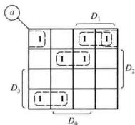  
图4.4.15 $a$ 段的卡诺图

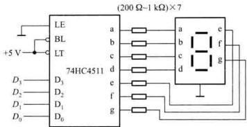  
图4.4.16 七段显示译码器与显示器的连接

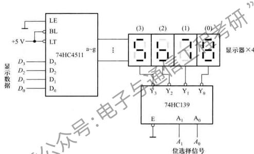  
图4.4.17 例4.4.5的译码显示电路

图中4个显示器的 $a\sim g$ 段分别接在一起，并与显示译码器的输出 $a\sim g$ 分别相连。将要显示的数据组分别送到显示译码器的输入端 $D_{3}D_{2}D_{1}D_{0}$ 。2线-4线译码器的选择信号 $A_{1}A_{0}$ 控制输出 $\bar{Y}_3\sim \bar{Y}_0$ 依次产生低电平，使4个显示器轮流显示。例如要显示4位数5678。位选择信号 $A_{1}A_{0}$ $= 00$ 时， $\bar{Y}_0 = 0$ ，将数据 $D_{3}D_{2}D_{1}D_{0} = 1000$ ，经过译码器74HC4511送到第(0)位显示器显示8。当 $A_{1}A_{0}$ 分别为01、10、11时，将数据0111、0110和0101分别送到第(1)、(2)、(3)位显示器，分别显示7、6、5。当以一定的频率重复此过程，在4个显示器上分别显示稳定的数字5678。位选择信号 $A_{1}A_{0}$ 必须与显示的数据 $D_{3}D_{2}D_{1}D_{0}$ 同步变化。

人的视觉暂留时间有一定范围。当显示器频率变化太高时，前一个数字的余辉没消失，又开始显示后一个数字，显示的数码不清晰。当太低时，会使显示闪烁。通常每位显示器频率 $f_{\mathrm{c}}$ 的变化范围为

$$
2 5 <   f _ {c} <   1 0 0
$$

$f_{\mathrm{C}}$ 的单位为 $\mathrm{Hz}$

# 3. 数据分配器

数据分配是将公共数据线上的数据根据需要送到不同的通道上去，实现数据分配功能的逻辑电路称为数据分配器。它的作用相当于多个输出的单刀多掷开关，其示意图如图4.4.18所示。

数据分配器可以用带有使能端的二进制译码器实现。如用3线-8线译码器可以把1个数据信号分配到8个不同的通道上去。用3线-8线译码器(74HC138)作为数据分配器的逻辑原理图如图4.4.19所示。将 $\overline{E}_2$ 接低电平， $E_{3}$ 作为使能端， $A_{2},A_{1}$ 和 $A_0$ 作为选择通道地址输入， $\overline{E}_1$ 作为数据输入。例如，当 $E_{\mathrm{A}} = 1,A_{2}A_{1}A_{0} = 010$ 时，由功能表（表4.4.6）可得 $\overline{E}_2$ 的逻辑表达式

$$
\bar {Y} _ {2} = \left(\overline {{E _ {3}}} \cdot \overline {{\dot {\bar {E}} _ {2}}} \cdot \overline {{\dot {\bar {E}} _ {1}}}\right) \cdot \overline {{A _ {2}}} \cdot A _ {1} \cdot \overline {{A _ {0}}} = \overline {{E _ {1}}}
$$

而其余输出端均为高电平。因此，当地址 $A_{2}A_{1}A_{0} = 010$ 时，只有输出端 $Y_{2}$ 得到与输入相同的数据波形。改变 $A_{2}A_{1}A_{0}$ 的取值可以将数据送到不同的输出端。

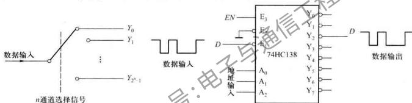  
图4.4.18 数据分配器示意图  
图4.4.19 用3线-8线译码器作为数据分配器

数据分配器的用途比较多，比如用它将一台PC机与多台外部设备连接，将计算机的数据分送到外部设备中。它还可以与计数器结合组成脉冲分配器，用它与数据选择器连接组成分时数据传送系统。

例4.4.6 试用门电路设计一个具有低电平使能控制的1线~4线数据分配器，使能信号无效时，电路所有的输出为高阻态。当通道选择信号将1路输入信号连接到其中1路输出端时，其他输出端为高阻状态。

解：（1）明确逻辑功能，列出真值表

根据题意可知，电路有一个数据输入端 $In$ ，一个低有效的使能端 $E$ ，两个通道选择输入端 $S_{1}$ 、 $S_{0}$ ，以及4个输出端 $Y_{3} \sim Y_{0}$ 。电路的真值表如表4.4.10所示。

（2）根据真值表写出逻辑表达式

电路的每个输出端有3种状态 $(0,1,z)$ ，因此电路的输出级必须由4个三态门 $G_{3}, G_{2}, G_{1}, G_{0}$ 组成。三态门的工作状态由其控制信号决定。设 $C_{3}, C_{2}, C_{1}, C_{0}$ 分别为4个三态门的控制信号。三态门的控制信号由使能端 $\overline{E}$ 通道选择输入端 $S_{1}, S_{0}$ 共同作用产生。

根据表4.4.10所示的输入与输出的逻辑关系，可以写出每个三态门控制端的表达式。

表 4.4.10 例 4.4.6 的 1 线-4 线数据分配器真值表  

<table><tr><td colspan="3">输入</td><td colspan="4">输出</td></tr><tr><td>E</td><td>S1</td><td>S0</td><td>Y3</td><td>Y2</td><td>Y1</td><td>Y0</td></tr><tr><td>0</td><td>0</td><td>0</td><td>z</td><td>z</td><td>z</td><td>In</td></tr><tr><td>0</td><td>0</td><td>1</td><td>z</td><td>z</td><td>In</td><td>z</td></tr><tr><td>0</td><td>1</td><td>0</td><td>z</td><td>In</td><td>z</td><td>z</td></tr><tr><td>0</td><td>1</td><td>1</td><td>In</td><td>z</td><td>z</td><td>z</td></tr><tr><td>1</td><td>x</td><td>x</td><td>z</td><td>z</td><td>z</td><td>z</td></tr></table>

例如，当 $\overline{E} = 0, S_1 = S_0 = 0$ 时， $C_0 = 1$ ， $\Gamma$ G₀工作，使得输出 $Y_0 = \ln n$ 。控制端 $C_0$ 的逻辑表达式为： $\overline{C_0} = \overline{E} \cdot \overline{S_1} \cdot \overline{S_0}$ 。其他控制端 $C_3 = C_2 = C_1 = 0$ ，对应的三态门输出高阻态。

以此类推，写出其他三态门控制信号的逻辑表达式为：

$$
C _ {1} = \overline {{\overline {{\overline {{E}}}} \cdot \overline {{S _ {1}}}}} \cdot S _ {0}, \quad C _ {2} = \overline {\overline {{\overline {{E}}}} \cdot S _ {1} \cdot \overline {{S _ {0}}}}, \quad C _ {3} = \overline {{\overline {{E}} \cdot S _ {1} \cdot S _ {0}}}
$$

# （3）画逻辑电路

电路的输出级由4个三态门组成，其控制信号是由2线-4线译码器输出确定。译码器的输入为 $S_{1}$ 和 $S_{0}$ 及使能端 $\overline{E}$ ，译码器的输出为 $C_{1}, C_{0}, C_{1}$ 和 $C_{0}$ 。画出完整的逻辑电路如图4.4.20所示。注意， $\overline{E}$ 表示低电平有效，看做完整的变量符号。

  
图4.4.20 例4.4.6的逻辑电路

# 复习思考题

4.4.2.1 什么是译码？什么是二进制译码器或唯一地址译码？  
4.4.2.2 发光二极管构成的七段显示器有哪两种，七段显示译码器有哪两类？  
4.4.2.3 何种译码器可以作为数据分配器使用？为什么？  
4.4.2.4 3 线-8线译码器(74HC138)作为数据分配器时，对于 $E_{1}, E_{2}, E_{3}$ 的设置办法，除了图4.4.19所示外，你还有别的什么办法？

# 4.4.3 数据选择器

# 1. 数据选择器的定义与功能

数据选择是指经过选择，把多路数据中的某一路数据传送到公共数据线上，实现数据选择功能的逻辑电路称为数据选择器。它的作用相当于多个输入的单刀多掷开关，其示意图如图4.4.21所示。

在3.2.4节已经介绍了由传输门构成的2选1数据选择器。这里介绍将2选1数据选择器作为基本模块，构成更大规模的电路。图4.4.22所示为与门和或门构成的2选1数据选择器电路及逻辑符号，该符号常在大规模逻辑电路中使用。2选1数据选择器选择输入端 $S$ 决定输出 $Y$ 等于 $D_{0}$ 还是 $D_{1}$ ，真值表如表4.4.11所示。输出的逻辑函数式为

  
图4.4.21 数据选择器示意图

  
(a)

(b)   
图4.4.22 2选1数据选择器  
  
（a）逻辑电路 （b）逻辑符号

表 4.4.11 2 选 1 数据选择器真值表  

<table><tr><td>选择输入</td><td>输出</td></tr><tr><td>S</td><td>Y</td></tr><tr><td>0</td><td>D0</td></tr><tr><td>1</td><td>D1</td></tr></table>

4选1数据选择器对4个数据源进行选择，需要两位选择输入 $S_{1}S_{0}$ 。当 $S_{1}S_{0}$ 取 $\mathbf{00},\mathbf{01},\mathbf{10},\mathbf{11}$

时，分别控制4个数据通道的开关。任何时候 $S_{1}, S_{0}$ 只有一种可能的取值，使对应的那一路数据通过，送达 $Y$ 端。4选1数据选择器的真值表如表4.4.12所示，输出端逻辑函数式为

$$
\begin{array}{l} Y = \bar {S} _ {1} S _ {0} D _ {0} + \bar {S} _ {1} S _ {0} D _ {1} + S _ {1} \bar {S} _ {0} D _ {2} + S _ {1} S _ {0} D _ {3} \\ = \bar {S} _ {1} (\bar {S} _ {0} D _ {0} + S _ {0} D _ {1}) + S _ {1} (\bar {S} _ {0} D _ {2} + S _ {0} D _ {3}) \\ = S _ {1} Y _ {0} + S _ {1} Y _ {1} \\ \end{array}
$$

用3个2选1数据选择器构成两级电路，第1级两个数据选择器分别实现 $Y_{0} = S_{0}D_{0} + S_{0}D_{1}$ 和 $Y_{1} = \overline{S}_{0}D_{2} + S_{0}D_{3}$ 。第2级实现 $Y = \overline{S}_1Y_0 + S_1Y_1$ ，其电路结构及逻辑符号分别如图4.4.23（a）、（b）所示。


(b)   
图4.4.23 4选1数据选择器逻辑图  
  
（a）由2选1数据选择器构成的4选1数据选择器 （b）逻辑符号

表 4.4.12 4 选 1 数据选择器真值表  

<table><tr><td colspan="2">选择输入</td><td>输出</td></tr><tr><td>S1</td><td>So</td><td>Y</td></tr><tr><td>0</td><td>0</td><td>D0</td></tr><tr><td>0</td><td>1</td><td>D1</td></tr><tr><td>1</td><td>0</td><td>D2</td></tr><tr><td>1</td><td>1</td><td>D3</td></tr></table>

同样原理，可以构成更多输入通道的数据选择器。被选数据源越多，所需选择输入端的位数也越多，若选择输入端为 $n$ ，可选输入通道数为 $2^n$ 。

# 2.典型数据选择器电路及应用

数据选择器的应用非常广泛，并且是构成FPGA器件内部查找表(LUT)的基本单元。常用

的数据选择器有2选1数据选择器、4选1数据选择器、8选1数据选择器、16选1数据选择器等。还有一些数据选择器具有三态输出功能，除了正常的0或1输出之外，当使能输入端为无效信号时，输出为高阻状态。利用这一特点，可以将多个数据选择器的输出端线与连在一起，共用一根数据传输线，而不会出现相互干扰问题。

# （1）用数据选择器实现逻辑函数

以4选1数据选择器为例，它有2个选择输入 $S_{1}, S_{0}$ 和4个数据输入 $D_{0}, D_{1}, D_{2}$ 和 $D_{3}$ ，其输出与输入的关系式可以写成

$$
Y = \bar {S} _ {1} \bar {S} _ {0} D _ {0} + \bar {S} _ {1} S _ {0} D _ {1} + S _ {1} \bar {S} _ {0} D _ {2} + S _ {1} S _ {0} D _ {3} = \sum_ {i = 0} ^ {3} m _ {i} D _ {i}
$$

式中 $m_{i}$ 是选择输入端 $S_{1}, S_{0}$ 构成的最小项。数据输入作为控制信号，当 $D_{i} = 1$ 时，其对应的最小项 $m_{i}$ 在表达式中出现，当 $D_{i} = 0$ 时，对应的最小项就不存在。利用这一点将函数变换成最小项表达式，函数的变量接入选择输入端，就可以实现组合逻辑函数。

例4.4.7 试用数据选择器实现下列逻辑函数：

（1）用4选1数据选择器实现 $L_0 = \overline{A} B + A\overline{B}$   
（2）用4选1数据选择器实现 $L_{1} = AB + AC + BC$   
（3）用2选1数据选择器和必要的逻辑门实现 $L_{\mathrm{r}} = AB + AC + BC$

解：（1）把所给的函数式变换成最小项表达式

$$
L _ {0} = \overline {{A}} B \cdot 1 + \overline {{A}} \overline {{B}} \cdot 1 = m _ {1} D _ {1} + m _ {2} D _ {2}
$$

变量 $A, B$ 分别接4选1数据逆择器的两个选择端 $S_{1}$ 和 $S_{0}$ 。 $I_{0}$ 中出现的最小项 $m_{1}, m_{2}$ 对应的数据输入端 $D_{1}, D_{2}$ 都应该等于1，而没有出现的最小项 $m_{0}, m_{3}$ 对应的数据输入端 $D_{0}, D_{3}$ 都应该等于0。由此可画出逻辑的如图4.4.24(a)所示。

（2）根据 $L_{1}$ 的函数式列出真值表如表4.4.13所示。将变量 $A, B$ 接入4选1数据选择器选择输入端 $S_{1}$ 和 $S_{0}$ ，将变量 $C$ 分配在数据输入端。从表中可以看出输出 $L_{1}$ 与变量 $C$ 的关系。当 $AB = 00$ 时选通 $D_{0}$ ，而此时 $L_{1} = 0$ ，所以数据端 $D_{0}$ 接 $\mathbf{0}$ ；当 $AB = 01$ 时选通 $D_{1}$ ，由真值表得此时 $L_{1} = C$ ，即 $D_{1}$ 应接 $C$ ；当 $AB$ 为10和11时， $D_{2}$ 和 $D_{3}$ 分别接 $C$ 和 $\mathbf{1}$ 。因此得到逻辑电路如图4.4.24(b)所示。  
（3） $L_{1}$ 的真值表如表4.4.14所示。2选1数据选择器只有一个选择输入端，将变量 $A$ 接入选择输入端。根据表中 $L_{1}$ 和 $B,C$ 的关系，当 $A = 0$ 时，可以求出 $L_{1} = BC$ ，即数据端 $D_0 = BC$ 。同理求出 $D_{1} = B + C$ 。也可以将逻辑函数变换为 $L_{1} = \overline{ABC} +A(B + \overline{C})$ ，求得 $D_0$ 和 $D_{1}$ 。将变量 $B,C$ 用逻辑门组合后接入数据端如图4.4.24(c)所示，这样可以实现变量数更多的逻辑函数。

由此可知，用一个具有 $n$ 位选择输入的数据选择器，实现变量数不大于 $n + 1$ 的逻辑函数时，每一个数据输入端可以接0、1、单变量或它的非。当变量数大于 $n + 1$ 时，可以用多个数据选择器扩展使用，也可以附加其他门电路后连接到数据输入端。

表 4.4.13 例 4.4.7(2) 的真值表  

<table><tr><td colspan="3">输入</td><td>输出</td></tr><tr><td>A</td><td>B</td><td>C</td><td>Li</td></tr><tr><td>0</td><td>0</td><td>0</td><td>0 Li=0</td></tr><tr><td>0</td><td>0</td><td>1</td><td>0</td></tr><tr><td>0</td><td>1</td><td>0</td><td>0 Li=C</td></tr><tr><td>0</td><td>1</td><td>1</td><td>1</td></tr><tr><td>1</td><td>0</td><td>0</td><td>1 Li=C</td></tr><tr><td>1</td><td>0</td><td>1</td><td>0</td></tr><tr><td>1</td><td>1</td><td>0</td><td>1 Li=1</td></tr><tr><td>1</td><td>1</td><td>1</td><td>1</td></tr></table>

表 4.4.14 例 4.4.7(3) 的真值表  

<table><tr><td colspan="3">输入</td><td>输出</td></tr><tr><td>A</td><td>B</td><td>C</td><td>L1</td></tr><tr><td>0</td><td>0</td><td>0</td><td>0</td></tr><tr><td>0</td><td>0</td><td>1</td><td>0</td></tr><tr><td>0</td><td>1</td><td>0</td><td>L1=BC</td></tr><tr><td>0</td><td>1</td><td>1</td><td>1</td></tr><tr><td>1</td><td>0</td><td>0</td><td>1</td></tr><tr><td>1</td><td>0</td><td>1</td><td>0</td></tr><tr><td>1</td><td>1</td><td>0</td><td>L1=B+C</td></tr><tr><td>1</td><td>1</td><td>1</td><td>1</td></tr></table>


图4.4.24 用数据选择器实现逻辑函数  
  
（a）用4选1数据选择器实现 $L_{0}$ （b）用4选1数据选择器实现 $L_{1}$ （c）用2选1数据选择器实现 $L_{1}$

（2）用数据选择器构成查找表LUT

构成FPGA基本单元的逻辑块主要是查找表LUT。LUT实质是一个小规模的存储器，以真值表的形式实现给定的逻辑函数。3输入LUT的结构及逻辑符号如图4.4.25所示，由7个2选1数据选择器组成3级电路，第1级的数据输入端接存储单元（存储单元在第7章介绍），每个存储单元可以存放一个逻辑值0或1，由编程决定取0还是1。4输入的LUT则由15个2选1数据选择器组成4级电路，4个选择输入端对16个存储单元进行选择。当输入端增加时，LUT使用的数据选择器呈几何增长。FPGA中LUT的输入端数一般为4个。

  
(a)

(b)   
图4.4.25 3输入LUT结构图及符号  
  
（a）结构图 （b）符号

图4.4.26所示为3输入LUT实现例4.4.8中的函数 $L_{1} = AB + AC + BC$ 。根据表4.4.13所示

真值表中 $L_{i}$ 的取值对存储单元编程，每个存储单元对应真值表中相应行的输出值。输入变量 $A, B, C$ 接入选择端，根据它们的取值从8个存储单元中选择一个作为输出。

用FPGA实现大规模逻辑电路时，变量数比较多，需要将多个LUT扩展连接。首先要对复杂逻辑函数进行函数分解变换，以便能够满足单个LUT对变量数的要求。

例4.4.8 试用3输入LUT实现逻辑函数 $L = BC + ABC + BCD + \overline{ABD}$

解：将逻辑函数进行变换

$$
L = \bar {B} (\bar {C} + \bar {A} D) + B (A C + \bar {C} \bar {D})
$$

  
图4.4.26 用LUT实现给定的函数 $L_{1}$

$$
\begin{array}{l} = \bar {B} (\overline {{A C + C D}}) + B (\overline {{A C + C D}}) \\ = \bar {B} Y + B \bar {Y} \\ \end{array}
$$

该电路需要两个3输入LUT，片(0)实现 $Y = \overline{C} +\overline{A} D$ ，片(1)实现 $L = \overline{B} Y + \overline{B} Y_{\circ}$ 由于 $Y(A,C,D)$ $= (\overline{C} +\overline{A} D) = \sum m(0,1,3,4,5),\mathrm{LUT}(0)$ 中数据输入存储单元0,1,3,4,5为1，其余为0。片(1)的3个选择输入端只接 $B,Y$ 两个变量，最高位地址输入端没有使用。查找表将没有使用的输入端作为无关项对待， $L(\times ,B,Y) = \overline{B} Y + \overline{B} Y = \sum m(1,2,5,6)$

查找表没有使用的输入端可以接0，也可以接1，这里接0。因此， $L(0,B,Y) = \overline{BY} +\overline{BY} = \sum m(1,2),\mathrm{LUT}(1)$ 中存储单元1，2为1，其余为0。用LUT实现的框图如图4.4.27所示。

对变量数比较多的复杂逻辑函数，很难用手工进行分解变换，用户可以借助CAD工具。另外，如何用尽量少的LUT实现给定的逻辑函数是一个优化问题，限于篇幅这（3）数据选择器数据分配器与总线的连接

  
图4.4.27 例4.4.8函数的LUT实现

数据选择器又称为多路复用器，数据分配器又称为多路分接器（或解复用器）。由多路复用器、多路分配器和传输总线连接构成的信息传输系统示意图如图4.4.28所示。该系统将多个数据信号中的一路信号连接到总线，经过远距离传送后，由多路分配器再将总线上的数据分配到被选中的多个目的地之一。这种信息传输的基本原理在通信系统、计算机网络系统以及计算机内部各功能部件之间的信息传送等都有广泛的应用。

  
图4.4.28 多路复用器、多路分配器、总线构成的信号传输系统示意图

# （4）集成数据选择器

数据选择器集成芯片有很多种，74HC151是一种典型的CMOS集成数据选择器。它有3个地址输入端 $S_{2}, S_{1}, S_{0}$ ，可选择 $D_{0} \sim D_{7}$ 共8个数据源，具有两个互补输出端，同相输出端 $Y$ 和反相

输出端 $\overline{Y}$ ，还有一个使能输入端 $E$ ，功能表如表4.4.15所示。当 $\overline{E} = 0$ 时数据选择器工作， $\overline{E} = 1$ 时数据选择器禁止工作，输出被封锁。

表 4.4.15 74HC151 的功能表  

<table><tr><td colspan="4">输入</td><td colspan="2">输出</td></tr><tr><td rowspan="2">使能\( \bar{E} \)</td><td colspan="3">选 择</td><td rowspan="2">Y</td><td rowspan="2">\( \bar{Y} \)</td></tr><tr><td>\( S_2 \)</td><td>\( S_1 \)</td><td>\( S_0 \)</td></tr><tr><td>1</td><td>✘</td><td>✘</td><td>✘</td><td>0</td><td>1</td></tr><tr><td>0</td><td>0</td><td>0</td><td>0</td><td>\( D_0 \)</td><td>\( \overline{D}_0 \)</td></tr><tr><td>0</td><td>0</td><td>0</td><td>1</td><td>\( D_1 \)</td><td>\( \overline{D}_1 \)</td></tr><tr><td>0</td><td>0</td><td>1</td><td>0</td><td>\( D_2 \)</td><td>\( \overline{D}_2 \)</td></tr><tr><td>0</td><td>0</td><td>1</td><td>1</td><td>\( D_3 \)</td><td>\( \overline{D}_3 \)</td></tr><tr><td>0</td><td>1</td><td>0</td><td>0</td><td>\( D_4 \)</td><td>\( \overline{D}_4 \)</td></tr><tr><td>0</td><td>1</td><td>0</td><td>1</td><td>\( D_5 \)</td><td>\( \overline{D}_5 \)</td></tr><tr><td>0</td><td>1</td><td>1</td><td>0</td><td>\( D_6 \)</td><td>\( \overline{D}_6 \)</td></tr><tr><td>0</td><td>1</td><td>1</td><td>1</td><td>\( D_7 \)</td><td>\( \overline{D}_7 \)</td></tr></table>

使用时，当数据选择器的大小不满足实际需求时，需要进行扩展。

位的扩展上面所讨论的是一位数据选择器，如需要选择多位数据时，可由几个一位数据选择器并联组成，即将它们的使能端连在一起，相应的选择输入端连在一起。两位8选1数据选择器的连接方法如图4.4.29所示。当需要进一步扩充位数时，只需相应地增加器件的数目。

字的扩展 我们可以把数据选择器的使能端作为地址选择输入，将两片74LS151连接成一个16选1的数据选择器，其连接方式如图4.4.30所示。16选1的数据选择器的地址选择输入有4位，其最高位 $D$ 与一个8选1数据选择器的使能端连接，经过一反相器反相后与另一个数据选择器的使能端连接。低3位地址选择输入端CBA由两片74HC151的地址

  
图4.4.29 两位8选1数据选择器的连接方法

选择输入端相对应连接而成

  
图4.4.30 用两片8选1数据选择器连接成16选1数据选择器

# 复习思考题

4.4.3.1 试用十六进制数的方式写出16选1的数据选择器的各地址码。  
4.4.3.2 构成16选1数据选择器需要多少个2选1数据选择器，电路有几级？试画出逻辑电路。  
4.4.3.3 试说明FPGA中查找表LUT实现逻辑函数的原理  
4.4.3.4 用32选1数据选择器选择数据，若选择的输入数据为 $D_{20}, D_{17}, D_{18}, D_{27}, D_{31}$ ，试依次写出对应的地址码。

# 4.4.4 数值比较器

# 1. 数值比较器的定义及功能

在数字系统中，特别是在计算机中常需要对两个数的大小进行比较。数值比较器就是对两个二进制数 $A, B$ 进行比较的逻辑电路，比较结果有 $A > B, A < B$ 以及 $A = B$ 三种情况。

# （1）1位数值比较器

1 位数值比较器是多位比较器的基础。当 $A$ 和 $B$ 都是 1 位二进制数时，它们只能取 0 或 1 两种值，由此可写出 1 位数值比较器的真值表，如表 4.4.16 所示。

由真值表得到如下逻辑表达式：

$$
\left\{ \begin{array}{l} F _ {A > B} = \overline {{A}} \overline {{B}} \\ F _ {A <   B} = \overline {{A}} B \\ F _ {A + B} = \overline {{A}} \overline {{B}} + A B \end{array} \right. \tag {4.4.6}
$$

由以上逻辑表达式可画出图4.4.31所示的逻辑电路。

  
图4.4.31 1位数值比较器逻辑图

表 4.4.16 一位数值比较器真值表  

<table><tr><td colspan="2">输入</td><td colspan="3">输出</td></tr><tr><td>A</td><td>B</td><td>\( F_{A\times B} \)</td><td>\( F_{A\times B} \)</td><td>\( F_{A\times B} = 0 \)</td></tr><tr><td>0</td><td>0</td><td>0</td><td>0</td><td>1</td></tr><tr><td>0</td><td>1</td><td>0</td><td>1</td><td>0</td></tr><tr><td>1</td><td>0</td><td>1</td><td>0</td><td>0</td></tr><tr><td>1</td><td>1</td><td>0</td><td>0</td><td>1</td></tr></table>

# （2）两位数值比较器

现在分析比较两位二进制数 $A_{1}A_{0}$ 和 $B_{1}B_{0}$ 的情况，用 $F_{A > B}, F_{A < B}$ 和 $F_{A = B}$ 表示比较结果。当高位 $(A_{1}, B_{1})$ 不相等时，无需比较低位 $(A_{0}, B_{0})$ ，高位比较的结果就是两个数的比较结果。当高位相等时，两数的比较结果由低位比较的结果决定。利用I位数值的比较结果，可以列出简化的真值表，如表4.4.17所示。

表 4.4.17 两位数值比较器真值表  

<table><tr><td colspan="2">输入</td><td colspan="3">输出</td></tr><tr><td>\( {A}_{1} \)\( {B}_{1} \)</td><td>\( {B}_{0} \)</td><td>\( {F}_{A \times  B} \)</td><td>\( {F}_{A \times  B} \)</td><td>\( {F}_{A \times  B} \)</td></tr><tr><td>\( {A}_{1} &gt; {B}_{1} \)</td><td>✘</td><td>1</td><td>0</td><td>0</td></tr><tr><td>\( {A}_{1} &lt; {B}_{1} \)</td><td>✘</td><td>0</td><td>1</td><td>0</td></tr><tr><td>\( {A}_{1} = {B}_{1} \)</td><td>\( {A}_{0} &gt; {B}_{0} \)</td><td>1</td><td>0</td><td>0</td></tr><tr><td>\( {A}_{1} = {B}_{1} \)</td><td>\( {A}_{0} &lt; {B}_{0} \)</td><td>0</td><td>1</td><td>0</td></tr><tr><td>\( {A}_{1} = {B}_{2} \)</td><td>\( {A}_{0} = {B}_{0} \)</td><td>0</td><td>0</td><td>1</td></tr></table>

由表4.4.17可以写出如下逻辑表达式：

$$
\begin{array}{l} F _ {x + B} = A _ {1} \bar {B} _ {1} + (\bar {A} _ {1} \bar {B} _ {1} + A _ {1} B _ {1}) A _ {0} \bar {B} _ {0} \\ = F _ {A _ {1} > B _ {1}} + F _ {A _ {1} = B _ {1}} \cdot F _ {A _ {0} > B _ {0}} \\ \end{array}
$$

$$
F _ {A \times B} = \bar {A} _ {1} B _ {1} + (\bar {A} _ {1} \bar {B} _ {1} + A _ {1} B _ {1}) \bar {A} _ {0} B _ {0} \tag {4.4.7}
$$

$$
\begin{array}{l} = F _ {A _ {1} <   B _ {1}} + F _ {A _ {1} = B _ {1}} \cdot F _ {A _ {0} <   B _ {0}} \\ F _ {A = B} = F _ {A _ {1} - B _ {1}} \cdot F _ {A _ {0} - B _ {0}} \\ \end{array}
$$

根据上式画出逻辑图，如图4.4.32所示。电路利用了1位数值比较器的输出作为中间结果。它所依据的原理是，如果两位数 $A_{1}A_{0}$ 和 $B_{1}B_{0}$ 的高位不相等，则高位比较结果就是两数比较结果，与低位无关。这时，高位输出 $F_{A_1 = B_1} = 0$ ，使与门 $G_{1},G_{2},G_{3}$ 均封锁，而或门都打开，低位比较结果不能影响或门，高位比较结果则从或门直接输出。如果高位相等，即 $F_{A_1 + B_1} = 1$ ，使与门 $\mathrm{G}_1$ 、 $\mathrm{G}_2,\mathrm{G}_3$ 均打开，同时由 $F_{A_1 > B_1} = 0$ 和 $F_{A_1 < B_1} = 0$ 作用，或门也打开，低位的比较结果直接送达输出端，即低位的比较结果决定两数的大、小或者相等。

  
图4.4.32 两位数值比较逻辑图

用以上方法可以构成更多位数值的比较器

# 2.典型数值比较器

常用的比较器有4位数值比较器、8位数值比较器等。

# （1）4位数值比较器

4位数值比较器是对两个4位二进制数 $A_{1}A_{2}A_{1}A_{0}$ 与 $B_{3}B_{2}B_{1}B_{0}$ 进行比较，比较原理与2位比较器的相同。从 $A$ 的最高位 $A_{3}$ 和 $B$ 的最高位 $B_{3}$ 进行比较，如果它们不相等，则该位的比较结果可以作为两数的比较结果。若最高位 $A_{3} = B_{3}$ ，则再比较次高位 $A_{2}$ 和 $B_{2}$ ，余此类推。显然，如果两数相等，那么，必须将比较进行到最低位才能得到结果。可以得出：

$$
\begin{array}{l} F _ {A > B} = F _ {A _ {3} > B _ {3}} + F _ {A _ {3} = B _ {3}} F _ {A _ {2} > B _ {2}} + F _ {A _ {3} = B _ {3}} F _ {A _ {2} = B _ {2}} F _ {A _ {1} > B _ {1}} + F _ {A _ {3} = B _ {3}} F _ {A _ {2} = B _ {2}} F _ {A _ {1} = B _ {1}} F _ {A _ {0} > B _ {0}} \\ + F _ {A _ {3} = B _ {3}} F _ {A _ {2} = B _ {2}} F _ {A _ {1} = B _ {1}} F _ {A _ {0} = B _ {0}} I _ {\Lambda > B} \\ \end{array}
$$

$$
\begin{array}{l} F _ {A <   B} = F _ {A _ {3} <   B _ {3}} + F _ {A _ {3} = B _ {3}} F _ {A _ {2} <   B _ {2}} + F _ {A _ {1} = B _ {1}} F _ {A _ {2} = B _ {2}} F _ {A _ {1} <   B _ {1}} + F _ {A _ {3} = B _ {3}} F _ {A _ {2} = B _ {2}} F _ {A _ {1} = B _ {1}} F _ {A _ {0} <   B _ {0}} \\ + F _ {A _ {3} = B _ {3}} F _ {A _ {2} = B _ {2}} F _ {A _ {1} = B _ {1}} F _ {A _ {0} = B _ {0}} I _ {A <   B} \tag {4.4.8} \\ \end{array}
$$

$$
F _ {A = B} = F _ {A _ {3} = B _ {3}} F _ {A _ {2} = B _ {2}} F _ {A _ {1} = B _ {1}} F _ {A _ {0} = B _ {0}} I _ {A = B}
$$

$I_{A > B}$ $I_{A <   B}$ 和 $I_{A = B}$ 称为扩展输入端，是来自低位的比较结果。扩展输入端与其他数值比较器的输出连接，以便组成位数更多的数值比较器。若仅对4位数进行比较时，应对 $I_{A > B}$ $I_{A <   B}$ 、 $I_{1 - B}$ 进行适当处理，即 $I_{A > B} = I_{A <   B} = 0,I_{A = B} = 1$

74HC85是4位CMOS集成数值比较器

# （2）数值比较器的位数扩展

数值比较器的扩展有串联和并联两种方式。图4.4.33表示两个4位数值比较器串联而成为一个8位的数值比较器。我们知道，对于两个8位数，若高4位相同，它们的大小则由低4位的比较结果确定。因此，低4位的比较结果应作为高4位的条件，即低4位比较器的输出端应分别与高4位比较器的 $I_{A > B}$ 、 $I_{A < B}$ 和 $I_{A > B}$ 端连接。

当位数较多且要满足一定的速度要求时，可以采取并联方式。图4.4.34表示16位并联数值比较器的原理图。由图可以看出这里采用两级比较方法，将16位按高低位次序分成四组，每组4位，各组的比较是并行进行的。将每组的比较结果再经4位比较器进行比较后得出结果。显然，从数据输入到稳定输出只需2倍的4位比较器延迟时间，若用串联方式，则16位的数值比较器从输入到稳定输出需要约四倍的4位比较器的延迟时间。

  
图4.4.33 中联方式扩展数值比较器的位数

  
图4.4.34 并联方式扩展数值比较器的位数

# 复习思考题

4.4.4.1 比较器的三个输入端 $I_{A > B}, I_{A < B}, I_{A = B}$ 有何作用？  
4.4.4.2用两个4位比较器串联，连接成8位数值比较器时，低位的 $I_{A > B},I_{A <   B},I_{A = B}$ 端应作何处理？

# 4.4.5 算术运算电路

算术运算是数字系统的基本功能，更是计算机中不可缺少的组成单元。在第1章介绍了二进制数的算术运算，下面介绍实现加法运算和减法运算的逻辑电路。

# 1. 半加器和全加器

# （1）半加器

半加器和全加器是算术运算电路中的基本单元，它们是完成1位二进制数相加的一种组合逻辑电路。

如果只考虑了两个加数本身，而没有考虑低位进位的加法运算，称为半加。实现半加运算的逻辑电路称为半加器。两个1位二进制的半加运算可用表4.18所示的真值表表示，其中 $A, B$ 是两个加数， $S$ 表示和数， $C$ 表示进位数。由真值表可得逻辑表达式

$$
\left\{ \begin{array}{l} S = A B + A B \\ C = A B \end{array} \right. \tag {4.4.9}
$$

表4.4.18 半加器真值表  

<table><tr><td colspan="2">输入</td><td colspan="2">输出</td></tr><tr><td>A</td><td>B</td><td>C</td><td>S</td></tr><tr><td>0</td><td>0</td><td>0</td><td>0</td></tr><tr><td>0</td><td>1</td><td>0</td><td>1</td></tr><tr><td>1</td><td>0</td><td>0</td><td>1</td></tr><tr><td>1</td><td>1</td><td>1</td><td>0</td></tr></table>

由上述表达式可以得出由异或门和与门组成的半加器，如图4.4.35（a）所示，图4.4.35（b）是半加器的图形符号。

  
(a)

(b)   
图4.4.35 半加器  
  
（a）逻辑图 （b）半加器符号

# （2）全加器

全加器能进行被加数、加数和来自低位的进位信号相加，并根据求和结果给出该位的进位信号。

根据全加器的功能，可列出它的真值表，如表4.4.19所示。其中 $A$ 和 $B$ 分别是被加数及加数， $C_{i}$ 为低位进位数， $S$ 为本位和数（称为全加和）以及 $C_{n}$ 为向高位的进位数。为了求出 $S$ 和 $C_{n}$ 的逻辑表达式，首先分别画出 $S$ 和 $C_{n}$ 的卡诺图，如图4.4.36所示，其中 $C_{n}$ 的包围圈是为了便于利用 $A \oplus B$ 结果，得出下列表达式：

$$
\left\{ \begin{array}{r l} S & = \overline {{A}} \overline {{B}} C _ {1} + \overline {{A}} \overline {{B}} C _ {1} + \overline {{A}} \overline {{B}} C _ {1} + A B C _ {1} \\ & = A \oplus B \oplus C _ {1} \\ C _ {\mathrm {a}} & = A B + \overline {{A}} \overline {{B}} C _ {1} + \overline {{A}} B C _ {1} \\ & = A B + (A \oplus B) C _ {1} \end{array} \right. \tag {4.4.10}
$$

由式(4.4.10)可以画出1位全加器的逻辑图，如图4.4.37(a)所示，它是由两个半加器和一个或门构成的，图4.4.37(b)是它的图形符号。

表 4.4.19 全加器真值表  

<table><tr><td colspan="3">输入</td><td colspan="2">输出</td></tr><tr><td>A</td><td>B</td><td>\( C_1 \)</td><td>S</td><td>\( C_n \)</td></tr><tr><td>0</td><td>0</td><td>0</td><td>0</td><td>0</td></tr><tr><td>0</td><td>0</td><td>1</td><td>1</td><td>0</td></tr><tr><td>0</td><td>1</td><td>0</td><td>1</td><td>0</td></tr><tr><td>0</td><td>1</td><td>1</td><td>0</td><td>1</td></tr><tr><td>1</td><td>0</td><td>0</td><td>1</td><td>0</td></tr><tr><td>1</td><td>0</td><td>1</td><td>0</td><td>1</td></tr><tr><td>1</td><td>1</td><td>0</td><td>0</td><td>1</td></tr><tr><td>1</td><td>1</td><td>1</td><td>1</td><td>1</td></tr></table>


图4.4.36 全加器的 $S$ 和 $C_{\mathrm{n}}$ 卡诺图  
  
(a) $S$ 的卡诺图 (b) $C_{n}$ 的卡诺图

  
(a)

(b)   
图4.4.37 全加器  
  
(a) 逻辑图 (b) 全加器符号

# 2. 多位数加法器

# （1）串行进位加法器

若有多位数相加，则可采用并行相加串行进位的方式来完成。例如，有两个4位二进制数 $A_{1}A_{2}A_{3}A_{0}$ 和 $B_{3}B_{2}B_{1}B_{0}$ 相加，可以采用4个全加器构成4位数加法器，其原理图如图4.4.38所示。将低位的进位输出信号接到高位的进位输入端，因此，任1位的加法运算必须在低1位的运算完成之后才能进行，这种进位方式称为串行进位。这种加法器的逻辑电路比较简单，但它的运算速度不高。为克服这一缺点，可以采用超前进位等方式

  
图4.4.38 四位串行进位全加器

# （2）超前进位加法器

由于串行进位加法器的速度受到进位信号的限制，人们又设计了一种多位数超前进位加法逻辑电路，使每位的进位只由被加数和加数决定，而与低位的进位无关。下面介绍超前进位的概念。

由式（4.4.10），并考虑多位数值相加时，全加器的和数 $S_{i}$ 和进位 $C_i$ 的逻辑表达式

$$
S _ {i} = A _ {i} \oplus B _ {i} \oplus C _ {i - 1} \tag {4.4.11}
$$

$$
C _ {i} = A _ {i} B _ {i} + \left(A _ {i} \oplus B _ {i}\right) C _ {i - 1} \tag {4.4.12}
$$

定义两个中间变量 $G_{i}$ 和 $P_{i}$

$$
G _ {i} = A _ {i} B _ {i} \tag {4.4.13}
$$

$$
P _ {i} = A _ {i} \oplus B _ {i} \tag {4.4.14}
$$

当 $A_{i} = B_{i} = 1$ 时， $G_{i} = 1$ ，由式（4.4.9）得 $C_i = 1$ ，即产生进位，所以 $G_{i}$ 称为产生变量。若 $P_{i} = 1$ 则 $A_{i}B_{i} = 0$ ，由式（4.4.12）得 $C_{i} = C_{i - 1}$ ，即 $P_{i} = 1$ 时，低位的进位能传送到高位的进位输出端，故

$P_{i}$ 称为传输变量。这两个变量都与进位信号无关

将式（4.4.13）和（4.4.14）代入式（4.4.11）和（4.4.12），得

$$
S _ {i} = P _ {i} \oplus C _ {i - 1} \tag {4.4.15}
$$

$$
C _ {i} = G _ {i} + P _ {i} C _ {i - 1} \tag {4.4.16}
$$

由式（4.4.16）得各位进位信号的逻辑表达式如下：

$$
C _ {0} = G _ {0} + P _ {0} C _ {- 1} \tag {4.4.17a}
$$

$$
C _ {1} = G _ {1} + P _ {1} C _ {0} = G _ {1} + P _ {1} G _ {0} + P _ {1} P _ {0} C _ {- 1} \tag {4.4.17b}
$$

$$
C _ {2} = G _ {2} + P _ {2} C _ {1} = G _ {2} + P _ {2} G _ {1} + P _ {2} P _ {1} G _ {0} + P _ {2} P _ {1} P _ {0} C _ {- 1} \tag {4.4.17c}
$$

$$
C _ {3} = G _ {3} + P _ {3} C _ {2} = G _ {3} + P _ {3} G _ {2} + P _ {3} P _ {2} G _ {1} + P _ {3} P _ {2} P _ {1} G _ {0} + P _ {3} P _ {2} P _ {1} P _ {0} C _ {- 1} \tag {4.4.17d}
$$

由式(4.4.17)可知，因为进位信号只与变量 $G_{1}, P_{1}$ 和 $C_{3,1}$ 有关，而 $C_{3,1}$ 是向最低位的进位信号，其值为0，所以各位的进位信号都只与两个加数有关，它们是可以并行产生的。用与门和或门即可实现式(4.4.17)所表示的超前进位产生电路，如图4.4.39所示。根据超前进位概念构成的4位加法器的结构示意图如图4.4.40所示。

超前进位加法器大大提高了运算速度。但是，随着加法器位数的增加，超前进位逻辑电路越来越复杂。74HC283是4位超前进位加法器，如果进行更多位数的加法，则需要进行扩展。例如用74HC283实现8位二进制数相加，两片4位加法器的连接方法如图4.4.41所示。该电路的级联是串行进位方式，低位片(0)的进位输出连到高位片(1)的进位输入。当级联数目增加时，会影响运算速度，可采用并行进位的级联方式加以改进。

并行进位级联是指片与片之间采用最前进位连接方式。4片加法器采用并行进位的连接示意图如图4.4.42所示。令加法器片 $(0)\sim (4)$ 的产生变量和传输变量分别为 $g_{0},p_{0},g_{1},p_{1},g_{2},p_{2}$ 和 $g_{3},p_{3}$ ，并且令式(4.4.17d)由

$$
\begin{array}{l} p _ {0} = P _ {3} P _ {2} P _ {1} P _ {0} \\ g _ {0} = G _ {3} + P _ {3} G _ {2} + P _ {1} P _ {2} G _ {1} + P _ {3} P _ {2} P _ {1} G _ {0} \\ \end{array}
$$

因此，式（4.4.17d）可以写成

$$
\begin{array}{l} C _ {3} = G _ {3} + P _ {3} C _ {2} = G _ {3} + P _ {3} G _ {2} + P _ {3} P _ {2} G _ {1} + P _ {3} P _ {2} P _ {1} G _ {0} + P _ {3} P _ {2} P _ {1} P _ {0} C _ {- 1} \\ = g _ {0} + p _ {0} C _ {- 1} \\ \end{array}
$$

同样，加法器片（1）、（2）和（3）的进位信号分别为

$$
\begin{array}{l} C _ {7} = g _ {1} + p _ {1} C _ {3} = g _ {1} + p _ {1} \left(g _ {0} + p _ {0} C _ {- 1}\right) \\ C _ {1 1} = g _ {2} + p _ {2} g _ {1} + p _ {2} p _ {1} g _ {0} + p _ {2} p _ {1} p _ {0} C _ {- 1} \\ C _ {1 5} = g _ {3} + p _ {3} g _ {2} + p _ {3} p _ {2} g _ {1} + p _ {3} p _ {2} p _ {1} g _ {0} + p _ {3} p _ {2} p _ {1} p _ {0} C _ {- 1} \\ \end{array}
$$

从以上各个进位位表达式可知，进位信号 $C_3, C_7, C_{11}$ 和 $C_{15}$ 只由被加数、加数和 $C_{-1}$ 决定，而与其他低位的进位无关。它们只用于高位片的求和，例如计算 $S_7 \sim S_4$ 需要 $C_3$ 。

从输入加数、被加数到产生 $g_{1},p_{1}$ ，需要三级门延迟，再经过两级门（进位产生电路的与门和或门)的延迟才能产生进位信号 $C_3,C_7,C_{11}$ 和 $C_{18}$ 。从进位信号 $C_3,C_7,C_{11}$ 分别输入片(1）、(2)、(3)，到各片内部进位信号的建立，需要再加上两级门延迟，产生每一个和还需一个异或门的延

迟。因此，完成16位数总共需要8级门的延迟，当位数增加时，延迟时间几乎不再增加。如果采用串行进位连接，每一片加法器有4级门延迟，4片共有16级门延迟， $n$ 片将有 $4n$ 级门延时。超前进位级联方式提高了电路的工作速度，但也增加了电路结构的复杂程度。

  
图4.4.30 超前进位产生电路

  
图4.4.40 超前进位加法器结构示意图

  
图4.4.41 加法器串行进位扩展连接方式

  
图4.4.42 加法器并行进位扩展连接方式

# 3. 减法运算

由第1章介绍的二进制数算术运算可知，减法运算的原则是将减法运算转换成补码的加法运算进行的。如果前面介绍的加法运算器既能实现加法运算，又可实现减法运算，就可以简化数字系统结构。

若 $n$ 位二进制的原码为 $N_{\text{原}}$ ，则与它相对应的补码为

$$
N _ {\text {补}} ^ {\circ} = 2 ^ {n} - N _ {\text {原}} \tag {4.4.18}
$$

补码与反码的关系式

$$
N _ {\text {补}} = N _ {\text {反}} + 1 \tag {4.4.19}
$$

设两个数 $A, B$ 相减，利用式（4.4.18）和式（4.4.19）可得

$$
A - B = A + B _ {\text {补}} - 2 ^ {n} = A + B _ {\text {反}} + 1 - 2 ^ {n} \tag {4.4.20}
$$

式(4.4.20)表明， $A$ 减 $B$ 可由 $A$ 加 $B$ 的补码并减 $2^{n}$ 完成。4位减法运算电路如图4.4.43（a）所示，具体原理如下。

由4个反相器将 $B$ 的各位反相(求反)，并将进位输入端 $C_{-1}$ 接逻辑1以实现加1，由此求得 $B$ 的补码。加法器相加的结果为 $(A + B_{\text{反}} + 1)$

由于 $2^{n} = (10000)_{2}$ ，相加结果与 $2^{n}$ 相减只能由加法器进位输出信号完成。当进位输出信号为1时，它与 $2^{n}$ 的差为0；当进位输出信号为0时，它与 $2^{n}$ 的差值为1，同时还应发出借位信号。因此，只要将进位信号反相即实现了减 $2^{n}$ 的运算，反相器的输出 $V$ 为1时需要借位，故 $V$ 也可作为借位信号。下面分两种情况分析减法运算过程。

（1） $A - B\geqslant 0$ 的情况。设 $A = \mathbf{0}\mathbf{1}\mathbf{0}\mathbf{1},B = \mathbf{0}\mathbf{0}\mathbf{0}\mathbf{1}$

求补相加演算过程如下：


直接作减法演算，则有


比较两种运算结果，它们完全相同。在 $A - B\geq 0$ 时，所得的差值就是差的原码，借位信号为0

（2） $A - B <   0$ 的情况。设 $A = \textbf{0}\textbf{0}\textbf{0}\textbf{1},B = \textbf{0}\textbf{1}\textbf{0}\textbf{1}$

求补相加演算过程如下：


直接作减法演算则有


比较两种运算结果可知，前者正好是后者的绝对值的补码，借位信号 $V$ 为1时表示差值为负数， $V$ 为0时差为正数。若要求差值以原码形式输出，则还需进行变换。由式(4.4.18)可知，将补码再求补得原码。

求补逻辑电路如图4.4.43(b)所示，它和图4.4.43(a)共同组成输出为原码的完整的4位减法运算电路。由图4.4.43(a)所得的差值输入到异或门的一个输入端，而另一端输入端由借位信号 $V$ 控制。当 $V = 1$ 时， $D_{-} \sim D_{0}$ 反相，并与 $C_{-1} = 1$ 相加，实现求补运算； $V = 0$ 时， $D_{+} \sim D_{0}$ 不反相，加法器也不实现加1运算，维持原码。

  
图4.4.43 输出为原点的4位减法运算逻辑图（a）4位减法运算逻辑图 （b）输出求补逻辑图

# 复习思考题

4.4.5.1 什么是半加器？什么是全加器？  
4.4.5.2 超前进位加法器和串行进位加法器的区别是什么？  
4.4.5.3 图4.4.38所示4位串行进位加法器，完成一次运算有多少级门延迟？  
4.4.5.4 说明反码和补码之间的关系  
4.4.5.5 简要说明由加补码完成减法运算的原理

# 4.5 组合可编程逻辑器件

早期通用型的小规模门电路和中规模组合逻辑集成器件性能好、结构简单，是组成数字系统的基本构件。但是这些器件的逻辑功能是固定的，所包含的逻辑门数量较少。当构造一个大型复杂的数字系统时，过多的器件可能导致功耗高、占用空间大和系统可靠性差等问题。利用可编程逻辑器件(Programmable Logic Device, PLD)进行数字系统的设计，可以较好地解决以上问题。

PLD是一种可以由用户定义和设置逻辑功能的器件。该类器件具有逻辑功能实现灵活、集成度高、处理速度快和可靠性高等特点。

# 4.5.1 PLD的结构、表示方法及分类

# 1. PLD的结构

PLD的结构框图如图4.5.1(a)所示。与阵列和或阵列是它的基本组成部分，通过对与、或阵列的编程实现所需的逻辑功能。输入电路是由输入缓冲器组成，通过它可以得到驱动能力强，并且互补的输入变量送到与阵列。有些PLD器件的输出电路包含称为宏单元的电路。宏单元可以被编程为组合输出和时序输出两种方式，组合方式的或阵列经过三态门输出，时序方式的或阵列经过触发器和三态门输出。有些电路可以根据需要将输出反馈到与阵列的输入，以增加器件的灵活性。图4.5.1(b)所示为PLD基本电路结构，为简明，将输出三态门省略。

图4.5.1 PLD结构图  
  
（a）结构框图 （b）基本电路结构

# 2. PLD 的表示方法

为了便于绘制与、或阵列的结构图，采用一种简化的表示方法，该方法的各种符号及含义

如下。

# （1）连接方式

在图4.5.1（b）所示基本的PLD结构中，门阵列的每个交叉点称为“单元”，单元的连接方式共有三种情况，如图4.5.2所示：

a. 硬线连接：硬线连接是固定连接，不可以编程改变  
b.可编程“接通”单元：依靠用户编程来实现“接通”连接  
c. 可编程“断开”单元：编程实现断开状态。这种单元又称为被

  
图4.5.2 PLD连接符号

编程擦除单元。

# （2）基本门电路的表示方式

PLD中基本门电路符号如图4.5.3所示。图4.5.3(a)和图4.5.3(b)分别为与门 $L_{1} = ABC$ 和或门 $L_{2} = A + B + C$ 。由于 $L_{1} = A\cdot \bar{A}\cdot B\cdot \bar{B} = 0$ ，图4.5.3(c)给出了与门输出恒等于0的简化画法。图4.5.3(d)中与门的所有输入项均不接通，保持“悬浮”的1状态，即 $L_{4} = 1$ 。图4.5.3(e)为具有互补输出的缓冲器。图4.5.3(f)为三态输出缓冲器。

  
(a)

  
(b)

  
(c)

  
(d)

  
(c)

(f)   
图4.5.3 可编程器件中基本门电路的符号  
  
（a）与门（b）或门（c）输出恒等于0的与门  
(d) 输出为 1 的状态 (e) 互补输出的缓冲器 (f) 三态输出缓冲器

# （3）编程连接技术

早期的PLD采用双极型连接技术，对于图4.5.4(a)的逻辑电路，单元的连接是由一个二极管与金属熔丝串接在一起，如图4.5.4(b)所示。编程时，用比工作电流大许多的电流，将不需要连接的熔丝烧断。由于熔丝烧断后不能恢复，这种方法只能进行一次编程。在门阵列中表示“单元”连接状况的阵列图，称为熔丝图，并且这个名称被沿用下来。

在CMOS的PLD中，常采用可擦除的编程方法，即可以对器件进行多次编程。可擦除CMOS技术用浮栅MOS管代替“熔丝”，如图4.5.4(c)所示，图中MOS管为浮栅MOS符号，它可以是叠栅注入MOS、浮栅隧道氧化层MOS或快闪叠栅MOS管中的任意一种。未经编程的浮栅MOS管，与普通N沟道增强型MOS管一样，当栅极加正常的逻辑高电平时，管子处于导通状态，否则截止。而经过编程处理的浮栅MOS管，始终处于截止状态，相当于“熔丝”断开一样。

根据图4.5.4(a)电路的逻辑要求，经过编程将图4.5.4(c)中的 $\mathrm{T}_2$ 、 $\mathrm{T}_4$ 断开。由于输入信号接在MOS管的栅极，所以输入信号低电平有效，即 $A = 0$ ， $\overline{A} = 1$ 时， $\mathrm{T}_{1}$ 导通，无论输入信号 $C$ 为何值， $L = 0$ 。当 $A, C$ 均为1时， $\mathrm{T}_1, \mathrm{T}_3$ 均截止， $L = 1$ 。所以该电路实现与逻辑 $L = AC$ 。另外在图4.5.4(c)中，上拉电阻实际是由P沟道MOS管构成的。

# （4）浮栅MOS管开关

  
(a)

  
(b)

(c)   
图4.5.4 与门电路  
  
（a）PLD表示的与门 （b）熔丝工艺的与门原理图 （c）CMOS工艺的与门原理图

上面介绍了可擦除PLD采用浮栅MOS管，而浮栅MOS管又分为叠栅注入MOS管（Stacked-gate Injection Metal Oxide Semiconductor；SIMOS管）、浮栅隧道氧化层MOS管（Floating-gate Tunnel Oxide，Flotox管）和快闪(Flash)叠栅MOS管。不同的浮栅MOS管连接的PLD，编程信息的擦除方法也不同。SIMOS管连接的PLD，采用紫外光照射擦除；Flotox管和快闪叠栅MOS管，采用电擦除方法。

a. SIMOS管开关

SIMOS管的结构及符号如图4.5.5(a)所示。它是一个N沟道增强型MOS管，有两个多晶硅栅极，控制栅 $\mathbf{g}_{\mathrm{s}}$ 和浮置栅 $\mathbf{g}_{\mathrm{f}\alpha}$ 。浮栅被绝缘的 $\mathrm{SiO}_2$ 包围着。编程处理前，浮栅上没有电荷，与普通MOS管一样。当控制栅加正常工作的高电平时，SIMOS管处于导通状态，此时的开启电压为 $V_{\mathrm{T1}}$ ，转移特性如图4.5.5(b)所示。编程时漏源间加几十伏的正电压，漏极与衬底间的PN结产生雪崩击穿，若同时在控制栅加正脉冲电压，则雪崩产生的高能电子，在栅极电场的作用下，穿过 $\mathrm{SiO}_2$ 层注入到浮栅上。编程电压撤除后，因浮栅被绝缘层包围，注入的电子无放电通路，可以长期保留，此时SIMOS管的开启电压升高到 $V_{\mathrm{T2}}$ 。特性曲线右移如图4.5.5(b)所示。因此，控制栅加正常逻辑高电平也不能达到其开启电压，SIMOS管始终截止，相当于断开一样。

擦除的方法是用紫外线灯照射器件 $20\mathrm{min}$ ，则 $\mathrm{SiO}_2$ 层中将产生电子-空穴对，为浮栅上的电子提供泄放通道，使之放电，SIMOS管恢复到编程前的状态。

b. Flotox 管开关

Flotox管的结构及符号如图4.5.6所示。它与SIMOS管相似，不同的只是其浮栅与漏区间

  
(a)


(b)   
图4.5.5 叠栅注入（SIMOS）管  
  
（a）结构及符号 （b）浮栅上累积电子与开启电压的关系

有一个极薄的氧化层（仅 $0.01\mu \mathrm{m}$ ），称为隧道区。当隧道区的电场强度足够大时，漏区与浮栅之间便出现导电隧道，在电场的作用下，电子通过隧道形成电流，这种现象称为隧道效应。同样，编程处理前，浮栅上没有电荷，与普通MOS管一样。编程时源极、漏极均接地，控制栅加 $20\mathrm{V}$ 的脉冲电压，隧道区产生强电场，吸引漏区的电子通过隧道到达浮栅。撤除编程电压后，浮栅上的电子可以长久保留，此时Flotox管的开启电压升高，在正常逻辑电平下，始终关断。

如果需要擦除编程信息，将Flotox管漏极加 $20\mathrm{V}$ 正脉冲电压，控制栅接地，则浮栅上的电子在电场的作用下通过隧道回到漏区，Flotox管恢复到编程前的状态，从而达到擦除编程信息的目的。与SIMOS管相比，Flotox管的编程和擦除都是通过在漏极和控制栅上加脉冲电压，向浮栅注入和清除电荷的速度快、操作简单，用户可以在电路板上实现在线操作。实际上编程和擦除是同时进行的，每次编程时，是以新的信息代替原来的信息。Flotox管也广泛用于各种大规模可编程器件，作为可编程开关。


  
图4.5.6Flotox管的结构及符号


  
图4.5.7 快闪叠栅MOS管的结构及符号

# c. 快闪叠栅 MOS 管开关

快闪叠栅MOS管的结构及符号如图4.5.7所示。它与SIMOS管结构类似。两者最大的区别在于快闪叠栅MOS管的浮栅到P型衬底间的氧化绝缘层比SIMOS管的更薄。因此，其擦除方式是通过浮栅与源极之间超薄氧化层的电子隧道效应进行擦除。而SIMOS管的浮栅与源极

之间氧化层较厚，电场不足以产生隧道效应，所以用紫外线或X射线照射，使浮栅上的电子获得足够的能量回到衬底。

对快闪叠栅MOS管编程时，漏极接正电压(6V)，源极接地，同时在控制栅加 $12\mathrm{V}$ 正脉冲电压，向浮栅注入电子的方式与SIMOS相同。编程后，快闪叠栅MOS管在正常逻辑条件下相当于断开。

快闪叠栅MOS管擦除编程信息的方式类似于Flotox管，将漏极加 $12\mathrm{V}$ 正脉冲电压，控制栅接地，即可利用隧道效应使浮栅放电而擦除编程信息。快闪叠栅MOS管既有SIMOS管结构简单，工作可靠的优点，又有Flotox管隧道效应带来的速度快、操作简单的特点，因而被广泛使用。

# 3. PLD的分类

PLD的分类方法有多种。按照PLD门电路的集成度，可以分为低密度和高密度器件，1000门以下为低密度，例如可编程只读存储器（Programmable Read Only Memory PROM）、可编程逻辑阵列（Programmable Logic Array, PLA）、可编程阵列逻辑（Programmable Array Logic, PAL）和通用阵列逻辑（Generic Array Logic, GAL）等；1000门以上的为高密度，如CPLD、FPGA等。

按照PLD的结构体系，可分为简单PLD（如PAL、GAL），复杂可编程逻辑器件CPLD和现场可编程门阵列FPGA。CPLD和FPGA将在第8章介绍。

按照PLD中的与、或阵列是否可编程分为三种，分别如图4.5.8(a)、4.5.8(b)和4.5.8(c)所示，PROM的与阵列固定，或阵列可编程；PAL的与阵列、或阵列均可编程；PAL和GAL等的与阵列可编程，或阵列固定。

  
(a)

  
(b)

(c)   
图4.5.8 PLD的分类  
  
(a) PROM的基本电路结构  
（b）PLA的基本电路结构  
（c）PAL的基本电路结构

# 4.5.2 组合逻辑电路的PLD实现

任何组合逻辑关系都可以变换成与或表达式，因此通过PLD的与、或阵列可以实现任何一

个逻辑函数。

从图4.5.8(a)可以看出，PROM的与阵列是将输入变量的全部最小项译出来了，如果用它来实现逻辑函数，往往只用到一部分最小项，芯片的利用率不高，因此很少做为PLD器件使用。

# 1. 可编程逻辑阵列 PLA

PLA就是为解决PROM实现逻辑函数时芯片利用率不高的问题而设计的。由于它的与、或阵列均可编程，所以将逻辑函数化简后再实现，可以有效地提高芯片的利用率。典型的集成PLA(82S100)有16个输入变量、48个乘积项、8个输出端。

例4.5.1由PLA构成的逻辑电路如图4.5.9所示，试写出该电路的逻辑表达式，并确定其逻辑功能。

解：（1）由图4.5.9可知，该电路有7个与项，根据或阵列得到输出逻辑表达式：

$$
\begin{array}{l} L _ {0} = \bar {A} \bar {B} C + \bar {A} \bar {B} C + A \bar {B} \bar {C} + A B C \\ L _ {1} = A B + A C + B C \\ \end{array}
$$

（2）列出真值表如表4.5.1所示

（3）由真值表看出该电路实现全加器的功能，A、B、C分别为加数、被加数和低位进位数。 $L_{0}$ 为和数， $L_{1}$ 为向高位的进位数

尽管PLA的灵活性比PROM提高了，但是由于缺少高质量的支撑软件和编程工具，并且价格较贵，因而使用不广泛。

  
图4.5.9 例4.5.1的PLA电路

表 4.5.1 例 4.5.1 电路的真值表  

<table><tr><td colspan="3">输入</td><td colspan="2">输出</td></tr><tr><td>A</td><td>B</td><td>C</td><td>L1</td><td>L0</td></tr><tr><td>0</td><td>0</td><td>0</td><td>0</td><td>0</td></tr><tr><td>0</td><td>0</td><td>1</td><td>0</td><td>1</td></tr><tr><td>0</td><td>1</td><td>0</td><td>0</td><td>1</td></tr><tr><td>0</td><td>1</td><td>1</td><td>1</td><td>0</td></tr><tr><td>1</td><td>0</td><td>0</td><td>0</td><td>1</td></tr><tr><td>1</td><td>0</td><td>1</td><td>1</td><td>0</td></tr><tr><td>1</td><td>1</td><td>0</td><td>1</td><td>0</td></tr><tr><td>1</td><td>1</td><td>1</td><td>1</td><td>1</td></tr></table>

# 2. 可编程阵列逻辑 PAL

可编程阵列逻辑器件PAL是20世纪70年代后期推出的PLD器件，早期采用双极型熔丝技术实现编程。除输入缓冲器外，PAL由可编程的与阵列、固定的或阵列和输出电路组成。由于只有与阵列可编程，因此PAL的编程相对简单。各种型号PAL的门阵列规模有大有小，但基本结构类似。

图4.5.10所示为一简单的PAL结构图，它有4组 $10\times 3$ 位的可编程与阵列，4个输入信号和1个输出反馈信号产生10个与阵列的输入变量。每3个乘积项构成一组固定或阵列，共有4组输出。

  
图4.5.10 PAL的基本电路结构图

PAL与阵列所有交叉点都由熔丝连通（图4.5.10中所有交叉点上省略了“×”），编程时保留有用的熔丝，断开无用的熔丝，就得到所需的电路。

例4.5.2 用图4.5.10所示PAL实现下列逻辑函数

$$
\left\{ \begin{array}{l} L _ {0} = \overline {{A B C}} + \overline {{A B C D}} \\ L _ {1} = \overline {{A B C}} + \overline {{A C D}} + \overline {{B C D}} \\ L _ {2} = \overline {{A B C}} + \overline {{A B C}} \\ L _ {3} = \overline {{A B C}} + \overline {{A B C D}} + \overline {{B C D}} + \overline {{A C D}} \end{array} \right.
$$

解：这组逻辑函数均为简化的逻辑表达式，有4个输入变量，4个输出。固定或阵列的每一个输出包含3个乘积项，而 $L_{0} \sim L_{2}$ 三个表达式各包含3个以下乘积项，满足输出端对乘积项数目的要求，可以直接编程实现。

$L_{3}$ 表达式包含4个乘积项，不能直接编程实现，但其前两项正好为 $L_{0}$ ，即

$$
\begin{array}{l} L _ {3} = A \bar {B} \bar {C} + \bar {A} \bar {B} \bar {C} \bar {D} + \bar {B} \bar {C} D + A \bar {C} \bar {D} \\ = L _ {0} + \bar {B C D} + A \bar {C D} \\ \end{array}
$$

因此，将 $L_{0}$ 反馈到输入端作为 $L_{3}$ 的输入就可以实现。编程后的逻辑图如图4.5.11所示。

或阵列(固定)

  
图4.5.11 例4.5.2中编程后的PAL电路

为了扩展电路的功能并增加使用的灵活性，还有多种形式的输出、反馈电路结构。后期PAL器件采用了可擦除CMOS编程单元满足修改电路的需要。与中、小规模组合逻辑集成器件相比，PAL的通用性好，速度和集成度均有所提高，设计和使用的灵活性得到改善。但是，PAL器件输出电路结构的类型较多且不统一，给设计和使用带来不便，并且用PAL实现的时序电路非常有限。为克服这一缺陷，推出了采用可擦除CMOS编程技术的GAL器件，将在后面6.6节中介绍。

# 复习思考题

4.5.1 PLD由哪几部分组成？  
4.5.2 PLD编程连接技术分哪几类？  
4.5.3浮栅MOS管编程信息的擦除方法主要有哪些？  
4.5.4 列举四种类型的PLD器件，并简单说明其结构

# 4.6 用 Verilog HDL 描述组合逻辑电路

2.5节介绍了用Verilog语言描述电路的基本知识，本节将进一步讨论组合逻辑电路的行为级建模以及分模块、分层次的结构化建模方法。行为级建模用于描述一个电路输入、输出的功能特性，即所设计的电路是干什么的，而不是怎样去实现硬件电路。

# 4.6.1 组合逻辑电路的行为级建模

行为级建模一般使用always结构和过程赋值语句、条件语句（if-else）、多路分支语句(case-endcase)和for循环语句等。

# 1. 条件语句

条件语句就是根据条件表达式的真假，确定下一步进行的运算。Verilog语言中有3种形式的if语句，一般用法如下：

if (condition_expr) true_statement;

或

if (condition_expr) true_statement;

else fale_ statement;

或

if (condition_expr1) true_statement1;

else if (condition_expr2) true_statement2;

else if (condition_expr3) true_statement3;

中

else default_statement:

if后面的条件表达式一般为逻辑表达式或关系表达式。执行if语句时，首先计算表达式的值，若结果为0、x或z，按“假”处理；若结果为1，按“真”处理，并执行相应的语句。注意，在第三种形式中，从第一个条件表达式condition_expr开始依次进行判断，直到最后一个条件表达式被判断完毕，如果所有的表达式都不成立，才会执行else后面的语句。这种判断上的先后次序，本身隐含着一种优先级关系，在使用时应予注意。

例4.6.1 根据表4.4.11所示的真值表，使用if-else语句对4选1数据选择器的行为（功能）进行描述。

解：假设这个程序模块的名称为 $\mathrm{max4to1\_bh}$ ，输出端口为Y，输入端口使用一个4位的向量D来代替原来的 $D_{3}, D_{2}, D_{1}, D_{0}$ ，选择输入端口使用一个2位的向量S来代替原来的 $S_{1}, S_{0}$ ，它的4个可能值用2位二进制数来表示。于是，得到4选1数据选择器的行为描述代码如下：

module mux4to1_bh(D,S,Y); //Verilog 1995 module port syntax

input[3:0]D; //输入端口声明

input[1:0]S; //输入端口声明

outputregY；//输出端口及变量的数据类型声明

always@（D,S）//电路功能描述

if $(S = 2^{\prime}b00)$ Y=D[0]；

else if $(S = 2^{\prime}b01)$ Y = D[1];

else if $(S = 2^{\prime}b10)$ Y=D[2];

else $\mathrm{Y} = \mathrm{D}[3]$

endmodule

注意，过程赋值语句只能给寄存器型变量赋值，因此，程序中将输出变量Y的数据类型定义成reg。

# 2. 多路分支语句

case语句是一种多分支条件选择语句，一般形式如下：

case (case exp)

item_expr1:statement1;

item_expr2:statement2;

··

default: default_statement; //default 语句可以省略

endcase

执行时，首先计算 case_expr 的值，然后依次与各分支项中表达式的值进行比较，如果 case_expr 的值与 item_expr1 的值相等，就执行语句 statement1，依次类推，如果 case_expr 的值与所有列出来的分支项的值都不相等，则执行语句 default_statement。

注意，(1)每个分支项中的语句可以是单条语句，也可以是多条语句。如果是多条语句，必须在多条语句的最前面写上关键词begin，在这些语句的最后写上关键词end，这样多条语句就成了一个整体，称之为顺序语句块。在分支语句中，可以嵌入if-else语句，也可以嵌入另一条

case语句。

（2）每个分支项表达式的值必须各不相同，一旦判断到与某分支项的值相同并执行相应语句后，case语句的执行便结束了。  
（3）如果某几个连续排列的分支执行同一条语句，则这几个分支项表达式之间可以用逗号分隔，将语句写在这几个分支项表达式的最后一个中。

例4.6.2对4选1数据选择器的行为进行描述。要求电路有一个使能输入端 $En$ ，当 $En = 0$ 时允许数据选择器工作， $En = 1$ 时禁止数据选择器工作，输出为0。

解：可以混合使用 if-else 和 case 语句对带使能输入端的 4 选 1 数据选择器进行描述。首先使用 if-else 语句对使能输入端 En 进行判断，然后使用 case 语句对输入的选择条件进行比较。2 位选择输入向量 S 的 4 个可能值可以用十进制数来表示。其代码如下：

```verilog
module mx4tol_bh( //Verilog 2001,2005 module port syn  
input En;  
input [3:0] D, //输入端口声明  
input [1:0] S, //输入端口声明  
output reg Y //输出端口及变量的数据类型声明  
);  
always @ (D,S,En) //Verilog 2001,2005 syntax  
begin  
if (En == 1) Y = 0; //当En为1时，输出为0  
else //当En为0时，实现选择器的功能  
case (S)  
2'd0: Y = D[0];  
2'd1: Y = D[1];  
2'd2: Y = D[2];  
2'd3: Y = D[3];  
endcase  
end  
endmodule 
```

例4.6.3 根据表4.4.9所示的功能表，对共阴极的七段显示译码器的行为进行描述。

解：根据电路的真值表对电路进行描述时使用 case 语句比较方便。程序①中用位拼接运算符将输出端口 a、b、c、d、e、f、g 拼接起来成为一个 7 位向量，将 4 位 BCD 码输入 $D_{3}, D_{2}, D_{1}, D_{0}$ 拼接成一个 4 位向量。case 语句的分支项按顺序排列，最后一个分支项 default 把其他非 8421 BCD 码输入的情况设置成全零输出，可以省去所有无用输入码的显示。

注意，case语句中列出的各个条件是不存在优先权差别的。

module seg7 Decoder( //Verilog 2001,2005 module port syntax

input LE, BL, LT, D3, D2, D1, D0, //输入端口声明

output reg a,b,c,d,e,f,g //输出端口及变量的数据类型声明

）：

always@（\*）//Verilog2001语法，用\*号表示电路的所有输入信号，参考2.5.5节的说明

begin

if $(\mathrm{LT} = = 0)$ $|\text{a,b,c,d,e,f,g}| = 7^{\prime}\text{b111\_1111}; / /$ 让显示器的7段都发光，显示8

else if $(\mathrm{BL} = = 0)$ a,b,c,d,e,f,g|=7'b000_0000; //让显示器的7段都熄灭

else if $(\mathrm{LE} = = 1)$ $|\text{a,b,c,d,e,f,g}| = |\text{a,b,c,d,e,f,g}|; / /$ 锁存显示

else

case（[D3,D2,D1,D0]） //根据输入的8421BCD码，实现显示译码器的功能

4'd0: |a,b,c,d,e,f,g| = 7'b111_1110; //7e

4'd1: {a,b,c,d,e,f,g} = 7'b011_0000; //30

4'd2: |a,b,c,d,e,f,g| = 7'b110_1101; //6d

4'd3: {a,b,c,d,e,f,g} = 7'b111_1001; //79

4'd4: |a,b,c,d,e,f,g| = 7'b011_0011; //33

4'd5: {a,b,c,d,e,f,g} = 7'b101_1011; //5b

4'd6: |a,b,c,d,e,f,g| = 7'b001_1111; //

4'd7:|a,b,c,d,e,f,g|=7'b111_0000; //70

4'd8: |a,b,c,d,e,f,g| = 7'b111111; //7f

4'd9: a,b,c,d,e,f,g|7b11P_1011; //7b

default: [a, b, c, d, e, f, g] = 7'b000_0000; //非8421 BCD码输入时，不显示

endcase

end

endmodule

例4.6.4根据表4.4.10所示功能表，使用case语句对1路-4路数据分配器的行为进行描述。

解：该例给出了 case 语句的嵌套使用情况，在使能信号 $\mathrm{E} = 1$ 的分支语句中，嵌入另一条 case 语句对选择条件（|S1, S0|）进行比较，从而确定电路的输出。

module Demux1_to_4 //Verilog 2001,2005 module port syntax

outputregY0,Y1,Y2,Y3, //输出端口及变量的数据类型声明

inputIn //输入端口声明

input S1,S0,E //输入端口声明

）：

always $@$ (S1 or S0 or In or E)

case(E)

1'b1; case(|S1,S0|)

2'b00: begin Y0 = In; Y1 = 1'bz; Y2 = 1'bz; Y3 = 1'bz; end

2'b01:begin Y0 $= 1^{\prime}$ bz;Y1 $=$ In;Y2 $= 1^{\prime}$ bz;Y3 $= 1^{\prime}$ bz;end   
2'b10:begin $\mathrm{Y}0 = 1^{\prime}$ bz;Y1 $= 1^{\prime}$ bz;Y2 $=$ In;Y3 $= 1^{\prime}$ bz;end   
2'b11:begin $\mathrm{Y}0 = 1^{\prime}$ bz;Y1 $= 1^{\prime}$ bz;Y2 $= 1^{\prime}$ bz;Y3 $=$ In;end   
endcase   
default:begin $\mathrm{Y}0 = 1^{\prime}$ bz;Y1 $= 1^{\prime}$ bz;Y2 $= 1^{\prime}$ bz;Y3 $= 1^{\prime}$ bz;end   
endmodule

在Verilog语言中，case语句还有另外两种形式，用关键词casex和casez表示，以便处理表达式值中含有逻辑值 $\mathbf{x}$ 和 $\mathbf{z}$ 的情况。casez将比较双方表达式（分支项表达式和case_expr控制表达式）中出现 $\mathbf{z}$ 的位当作不用关心的位来处理，在分支项表达式中所有为 $\mathbf{z}$ 的位也可以用？来表示。而casex则认为表达式中所有的 $\mathbf{z}$ 和 $\mathbf{x}$ 都为无关项。

例4.6.5 根据表4.4.4所示功能表，对8线-3线优先编码器的行为进行描述。

解：程序首先使用casex语句描述了带使能控制端优先级编码器。这个模块与集成电路CD4532的功能类似，当 $EI = 1$ 时，才对casex语句中的条件项进行比较。当至少有一个输入数据为1时，编码器的输出GS必然为1且EO必然为0，在casex语句执行之前，这两个输出信号即被设置。若8个分支表达式的值没有一个与1的值匹配，将会执行default分支后面语句，将输出设置成默认值。注意，casex忽略了比较双方表达式各个位中的x和z，根据比较的先后次序，使得casex也存在隐含的优先级。

程序后面给出了优先编码器的另一种描述方式，使用的if-else语句本身隐含着优先级关系。

module encoder8to3hh( //Verilog 2001,2005 module port syntax  
input E1, //输入端口声明  
input[7:0]h, //输入端口声明  
output reg [2:0]Y, //输出端口及变量的数据类型声明  
output reg GS,EO //输出端口及变量的数据类型声明  
}…  
always@(EI,1) //Verilog 2001,2005 syntax  
begin  
if $(\mathrm{EI} = = 0)$ begin $Y = 3^{\prime}\mathrm{d}0$ . $\mathrm{GS} = 0$ . $\mathrm{EO} = 0$ :end  
else //当 $EI = 1$ 时，实现优先编码器的功能  
begin  
GS=1;EO=0;//编码器的输入信号有效时，设定GS、EO的输出值  
casex(I) //逻辑值x表示输入信号中哪些位可以为任意值 $8^{\prime}\mathrm{b1xxx\_xxxx};Y = 3^{\prime}\mathrm{d}7$ ;//只要I的最高位等于1，就执行该语句 $8^{\prime}\mathrm{b01xx\_xxxx};Y = 3^{\prime}\mathrm{d}6$ $8^{\prime}\mathrm{b001x\_xxxx};Y = 3^{\prime}\mathrm{d}5$ $8^{\prime}\mathrm{b0001\_xxxx};Y = 3^{\prime}\mathrm{d}4$

8'b0000_1xxx;Y $= 3^{\prime}\mathrm{d}3$ $8^{\prime}\mathrm{b0000\_01xx};\mathrm{Y} = 3^{\prime}\mathrm{d}2$ $8^{\prime}\mathrm{b0000\_001x};\mathrm{Y} = 3^{\prime}\mathrm{d}1$ $8^{\prime}\mathrm{b0000\_0001};\mathrm{Y} = 3^{\prime}\mathrm{d}0$ default:begin $\mathrm{Y} = 3^{\prime}\mathrm{d}0;\quad \mathrm{GS} = 0;\mathrm{EO} = 1;\mathrm{end}\quad /$ 处理编码器输入信号无效的情况  
endcase  
end  
end  
/\*下面给出另一种描述方式  
always@（E1，I）  
begin  
if(E1==0）begin $\mathrm{Y} = 3^{\prime}\mathrm{d}0;\quad \mathrm{GS} = 0;\mathrm{EO} = 0;\mathrm{end}$ else //当 $EI = 1$ 时，实现优先编码器的功能begin $\mathrm{GS} = 1;\mathrm{EO} = 0$ ：//编码器的输入信号有效时，指定GS,EO的输出值  
if(I[7]) $\mathrm{Y} = 3^{\prime}\mathrm{d}7$ ;else//只要I的最高位等于1，就执行该语句  
if(I[6]) $\mathrm{Y} = 3^{\prime}\mathrm{d}6$ ;else  
if(I[5]) $\mathrm{Y} = 3^{\prime}\mathrm{d}5$ ;else  
if(I[4]) $\mathrm{Y} = 3^{\prime}\mathrm{d}4$ ;else  
if(I[3]) $\mathrm{Y} = 3^{\prime}\mathrm{d}3$ ;else  
if(I[2]) $\mathrm{Y} = 3^{\prime}\mathrm{d}2$ ;else  
if(I[1]) $\mathrm{Y} = 3^{\prime}\mathrm{d}1$ ;else  
if(I[0]) $\mathrm{Y} = 3^{\prime}\mathrm{d}0$ else begin $\mathrm{Y} = 3^{\prime}\mathrm{d}0;\mathrm{GS} = 0;\mathrm{EO} = 1;\mathrm{end}\quad /$ 处理编码器输入信号无效的情况  
end

# 3. for 循环语句

for语句的一般形式如下：

```vhdl
for (initial_assignment; condition; step_assignment) statement; 
```

initial_assignment 为循环变量的初始值, condition 给出了循环的条件, 只要条件为真, 就执行过程赋值语句 statement, 当循环条件不成立时, 循环结束, 执行 for 后面的语句。step_assignment 为循环变量的步长, 每次迭代后, 循环变量将增加或减少一个步长。

注意，（1）循环变量必须为integer（整数）型变量。

（2）过程语句statement可以是过程赋值语句、条件语句和多路分支语句。也可以是另一条循环语句，即循环语句可以嵌套。

例4.6.6 用Verilog描述一个具有使能输入端的3线-8线译码器的行为，要求输出为低电平有效。

解：该模块实现的功能与集成电路74HC138类似，但只有一个高电平有效的使能信号。当使能信号 $E n = 1$ 时，针对循环变量 $(k = 0,1,\dots ,7)$ 的变化，重复执行if-else语句8次。每一次迭代实现一个不同的子电路，例如 $A = 0$ 时，设置 $Y[0] = 0; A = 1$ 时，设置 $Y[1] = 0,\dots$ ，其余的依次类推。

```verilog
module decoder3to8_bh( //Verilog 2001,2005 module port syntax  
input [2:0] A, //输入端口声明  
input En, //输入端口声明  
output reg [7:0] Y //输出端口及变量的数据类型声明  
);  
integer k; //声明一个整型变量k  
always @ (A,En) //Verilog 2001,2005 syntax  
begin  
Y = 8'h1111_1111; //设置译码器输出的默认值  
for(k = 0; k <= 7; k = k+1)//下面的if-else语句循环8次  
if((En == 1) && (A == k))  
Y[k] = 0; //当使能En=1时，根据输入A进行译码  
else  
Y[k] = 1; //处理使能无效或输入无效的情况  
end  
endmodule
```

例4.6.7 试用for循环语句对 $n$ 位串行加法器的行为进行描述。

解：程序使用for语句描述了一个通用的串行进位电路，通过改变parameter语句中定义的参数 $n$ 的数值。该加法器可以对任意位宽数据进行加法运算。该例中 $n$ 值被设置为32，所以此例代码实现的是32位加法器。

该模块的for循环由begin和end之间的两条语句定义，这两条语句定义了循环变量为 $k$ 的那一级加法器所对应的求和函数以及进位函数。 $k$ 的范围是0到 $n - 1$ ，它的值每经过一次循环就递增1。注意，在Verilog中，没有C语言中的“++”和“--”运算符，因此 $\mathrm{k + + }$ 和 $\mathbf{k} = \mathbf{-}$ 是错误的。

module addern_bh  
#（parameter $n = 32$ ： //定义一个符号常量 $\mathbf{n}$ ）//Verilog2001,2005 module port syntax  
input[n-1:0]A,B， //输入端口声明  
input Cin， //输入端口声明  
outputreg[n-1:0]SUM， //输出端口及变量的数据类型声明  
outputreg Cout //输出端口及变量的数据类型声明

）;reg[n:0]G; //声明中间变量integerk; //声明一个整型变量 $\mathbf{k}$ always@（A,B,Cin） //Verilog2001,2005syntaxbegin $\mathrm{C}[0] = \mathrm{Cin};$ for $(\mathrm{k} = 0;\mathrm{k} <   \mathrm{n};\mathrm{k} = \mathrm{k} + 1)$ //下面begin…end之间的语句循环n次begin $\mathrm{SUM[k] = A[k]^{\star}B[k]^{\star}C[k]}$ //求和 $\mathrm{C[k + 1] = (A[k]\& B[k])!(A[k]\& C[k])!(B[k]\& C[k])}$ //求进位end $\mathrm{Cout} = \mathrm{C}[n]$ ： 输出进位信号  
endmodule

例4.6.8 根据表4.4.10所示功能表，对2选1数据选择器的行为进行描述。

解：对2选1数据选择器的行为进行描述的方法很多，例2-5-1就介绍过。在这里介绍用条件运算符进行建模的方法。条件运算符可以用在连续赋值语句中，也可以用在always结构的过程语句中。

```verilog
module mx2tol1 (
    input D1, D0, S,
    output Y
);
    assign Y = S ? D1 : D0; //用连续赋值语句和条件运算符建模
endmodule
//下面给出另一种描述方式
module mx2tol1
    input D1, D0, S,
    output r eg Y
);
    always @ (D1, D0, S) //用always语句和条件运算符建模
L = S ? D1 : D0;
endmodule
```

从上面的例子来看，数据流建模也是根据电路的逻辑功能进行描述，不必考虑电路组成以及元件之间的连接，也是属于电路行为描述范畴。下面再举两例，说明数据流建模方法。

例4.6.9 根据表4.4.5所示的真值表，用数据流建模方法对2线-4线译码器的行为进行描述。

解：2线-4线译码器的逻辑功能由4个逻辑表达式组成的连续赋值语句进行描述，每一个

表达式与译码器的一个输出相对应。每一个表达式可以单独写成一条语句，后面用分号结尾，也可以像程序中示意的那样4个表达式合起来作为一条assign语句，但要注意，此时各个表达式之间以逗号作为分隔符，最后一个表达式以分号作为一条语句的结束。

module decoder_df（ //Verilog 2001,2005 module port syntax  
input A1,A0,E,  
output[3:0] Y  
）;  
assignY[0] $\equiv$ ~（\~A1&\~A0&\~E），//多条赋值语句列表的情况  
Y[1] $\equiv$ （\~A1&A0&\~E),  
Y[2] $\equiv$ （A1&\~A0&\~E),  
Y[3] $\equiv$ （A1&A0&\~E);  
endmodule

例4.6.10 试用数据流建模方法对4位加法器的行为进行描述

解：4位加法器的逻辑功能用一条连续赋值语句进行描述，如“+”指明是二进制的加法，由于被加数和加数都是4位的，而低位来的进位为1位，所以运算的结果可能为5位，用|Cout, Sum|拼接起来表示。

module binary_adder（ //Verilog 2001,2005 module port syntax input[3:0]A,B, input Cin, output[3:0]SUM, output Cout); assign|Cout $\mathrm{S}\mathrm{CM} = \mathrm{A} + \mathrm{B} + \mathrm{Cin};$ endmodule

# 4.6.2 分模块、分层次的电路设计

在电路设计中，可以将两个或多个模块组合起来描述电路逻辑功能，通常称之为分模块、分层次的电路设计，自上而下（Top-down）和自下而上（Bottom-up）是两种常用的设计方法。在自上而下设计中，先定义顶层模块，然后再定义顶层模块中用到的子模块。而在自下而上设计中，底层的各个子模块首先被确定下来，然后将这些子模块组合起来构成顶层模块。

以图4.4.36所示的全加器电路为例，4位串行进位全加器被认为是一个顶层电路模块，它由4个全加器的子模块构成，而每个全加器又可以由两个半加器和一个或门构成，图4.6.1明确地表示了构成4位全加器的3个层次。如果用自上而下的设计方法，首先定义4位串行进位全加器这个顶层模块，然后定义1位的全加器，最后定义底层的半加器子模块。如果用自下而上的设计方法，则设计次序相反。

例4.6.11 根据图4.6.1所示的层次结构框图，使用自下而上的方法描述4位全加器的逻

  
图4.6.1 4位全加器的层次结构框图

辑功能。

解：4位全加器的结构化描述代码如下：

//一位半加器的描述（参考图4.4.33）

module halfadder(S,C,A,B); //IEEE 1364—1995 Syntax

input A, B; //输入端口声明

output S,C; //输出端口声明

xor（S，A，B）；//实例引用逻辑门原语

and $(\mathrm{C},\mathrm{A},\mathrm{B})$

endmodule

//一位全加器的描述（参考图4.4.35）

module fulladder (Sum, Co, A, B, Ci);

input A,B,Ci;

output Sum, Co;

wire S1，D1，D2; 内部节点信号声明

halfadder HA1（B，B），S（S1），C（D1），A(A)）； //实例引用底层模块 halfadder

halfadder HA2（A（SI）.B（Ci）..S（Sum）..C（D2））；//端口信号按照名称对应关联

or g] (Co, D2, D1);

endmodule

//四位全加器的描述（参考图4.4.36）

module_4bit_adder(S,C3,A,B,C_l);

input[3:0]A,B;

input C_1;

output[3:0]S;

output C3;

wire C0,C1,C2; //声明模块内部的连接线

fulladderU0_FA（S[0]，C0,A[0]，B[0]，C_1）;//实例引用模块fulladder

fulladder U1_FA（S[1]，C1，A[1]，B[1]，C0）；//端口信号按照位置顺序对应关联

fulladderU2_FA(S[2],C2,A[2],B[2],C1)；

fulladder U3_FA (S[3], C3, A[3], B[3], C2);

endmodule

例4.6.12所示的4位全加器总共使用了3个模块。首先，通过实例引用基本门级元件xor、and定义了底层的半加器模块halfadder，接着实例引用两个半加器模块halfadder和一个基本或门元件or组合成为全加器模块fulladder，最后实例引用4个1位的全加器模块fulladder构成4位全加器的顶层模块。可见，当一个模块被其他模块实例引用时，就形成了层次化结构。这种层次表明了引用模块与被引用模块之间的关系，引用模块称为父模块，被引用的模块称为子模块，即包含子模块的模块是父模块。

模块实例引用语句的格式如下：

module_name instance_name port_associations);

其中，module_name为设计模块名，instance_name为实例引用名，port_associations为父模块与子模块之间端口信号的关联方式，通常有位置关联法和名称关联法。

父模块引用子模块时，通过模块名完成引用过程，且实例引用名不能省略。例4.6.11所示的4位全加器顶层模块_4bit_adder是用4条实例引用语句描述的，每一条语句的开头都是被引用模块的名字fulladder，后面紧跟着的是实例引用名（例如，U0FA、U1FA等），且实例引用名在父模块中必须是唯一的。

父模块与子模块的端口信号是按照位置（端口排列次序）对应关联的。父模块引用子模块时可以使用一套新端口，也可以使用同名的旧端口，但必须注意端口的排列次序。例如，在引用语句fulladder U0_FA（S[0]，C0，A[0]，B[0]，C_1)中，信号S[0]与模块(fulladder)的端口S连接，信号C0与模块的端口CO连接，信号A[0]与模块的端口A连接，信号B[0]与模块的端口B连接，信号C_1与模块的端口CH连接。对于端口较少的Verilog模块，使用这种方法比较方便。

当端口较多时，建议使用名称关联的方法。图4.6.2是上面第2个模块调用半加器时的情况，带有圆点的名称（如S、C等）是定义子模块时使用的端口名称，也称为形式名称，类似于C语言中子函数的形参，写在圆括号内的名称（如Sum、D2等）是父模块中使用的新名称，也称为实际名称，类似于C语言中的实参。用这种方法实例引用子模块时，直接通过名称建立模块端口的连接关系，不需要考虑端口的排列次序。另外，端口关联时允许某些端口不连接，方法是：让不需要连接的端口位置为空白即可。在进行逻辑综合时，未连接输入端口的值被设置为高阻态(z)，未连接的输出端口表示该端口没有被使用。

  
图4.6.2 模块端口的名称关联法

在顶层模块_4bit_adder中，每一个fulladder后面的端口名称隐含地表示了这些子模块是如何

何相互连接在一起的。例如，子模块U0_DA中的进位输出C0被连接到子模块U1_DA中作为进位输入信号。

关于模块引用的几点注意事项：

(1) 模块只能以实例引用的方式嵌套在其他模块内, 嵌套的层次是没有限制的。但不能在一个模块内部使用关键词 module 和 endmodule 去定义另一个模块, 也不能以循环方式嵌套模块, 即不能在 always 语句内部引用子模块。  
（2）实例引用的子模块可以是一个设计好的 Verilog 设计文件（即一个设计模块），也可以是 FPGA 元件库中一个元件或嵌入式元件功能块，或者是用别的 HDL 语言（如 VHDL、AHDL 等）设计的元件，还可以是 IP(Intellectual Property, 知识产权) 核模块。  
（3）在一条实例引用子模块的语句中，不能一部分端口用位置关联，另一部分端口用名称关联，即不能混合使用这两种方式建立端口之间的连接。

# 小结

- 根据电路的结构和工作特点，将数字电路分为两大类，即组合逻辑电路和时序逻辑电路。

- 组合逻辑电路的特点是，其输出状态在任何时刻都只决定于同一时刻的输入状态。它可由逻辑门电路以及可编程器件(PLD)等组成。组合逻辑电路在形式和功能上种类繁多，但其分析方法和设计方法具有共同特点。因此，学习的重点是掌握一般的分析方法和设计方法。

- 分析组合逻辑电路的目的是确定已知电路的逻辑功能，其步骤大致是：写出各输出端的逻辑表达式 $\rightarrow$ 化简和变换逻辑表达式 $\rightarrow$ 列出真值表 $\rightarrow$ 确定功能。

- 设计组合逻辑电路的目的是根据提出的实际问题，设计出逻辑电路。设计步骤大致是：明确逻辑功能 $\rightarrow$ 列出真值表 $\rightarrow$ 写出逻辑表达式 $\rightarrow$ 逻辑化简和变换 $\rightarrow$ 画出逻辑图。

- 组合逻辑电路优化实现的技术包括：多输出的化简变换，用提取公因子或函数分解来减少扇入数。

- 典型的组合逻辑电路包括编码器、译码器、数据选择器、数值比较器、加法器和算术运算单元等。这些组合逻辑电路除了具有其基本功能外，通常还具有输入使能、输出使能、输入扩展、输出扩展功能，使其功能更加灵活，便于构成较复杂的逻辑系统。在用可编程逻辑器件设计逻辑系统时，这些典型的组合逻辑电路经常被当做特殊功能模块调用。

- 逻辑函数的优化实现是用指定芯片中特定资源实现逻辑函数。优化实现可以使用门电路，常用组合逻辑电路模块或可编程逻辑器件。用基本门电路进行优化实现时，需要对逻辑表达式进行变换，以满足芯片资源的要求。用可编程逻辑器件时，优化实现过程由EDA工具自动完成。组合逻辑电路模块可以作为EDA工具的库元件，由高层电路设计调用。用组合逻辑电路模块进行优化实现时，所应用的原理和步骤与用门电路时基本一致，但也有其特殊之处。

① 对逻辑表达式的变换与化简应尽可能与组合逻辑模块的形式一致，而不是尽量简化。  
② 在满足设计要求的前提下，尽量选用简单的模块，模块数也尽可能少。

③ 如果只需一个模块就可以满足要求，则需要对有关使能、扩展或者多余输入端等作适当的处理。如果一个模块不能满足要求，则需要进行扩展，直接将若干个模块组合或者由适当的逻辑门将若干个模块组合起来。

- 电路在信号电平变化的瞬间经常会产生竞争-冒险现象，在电路设计过程中要采取措施避免产生竞争-冒险。  
- 可编程逻辑器件（PLD）由用户定义和设置逻辑功能，可以实现各种组合逻辑电路。其特点是结构灵活、集成度高、速度快和可靠性高等。  
- 用Verilog对组合逻辑电路建模时有三种不同的描述风格，即行为级建模、数据流建模和分模块分层次的结构化建模，其中数据流建模方式也属于行为建模的范畴。而结构化的建模方式通常用于规模较大的复杂逻辑电路。

# 习题

# 4.1 组合逻辑电路的分析

4.1.1 写出图题4.1.1所示电路对应的真值表

  
(a)

  
(b)   
图题4.1.1

4.1.2 组合逻辑电路及输入波形(A、B)如图题4.1.2所示，试写出输出端的逻辑表达式并画出输出波形。


  
图题4.1.2

4.1.3设有四种组合逻辑电路，它们的输入波形 $(A,B,C,D)$ 如图题4.1.3所示，其对应的输出波形为 $W$ 、 $X,Y,Z$ ，试分别写出它们的简化逻辑表达式。  
4.1.4 试分析图题4.1.4所示逻辑电路的功能

  
图题4.1.3

  
图题4.1.4

  
图题4.1.5

4.1.5 逻辑电路如图题4.1.5所示，试分析其逻辑功能。  
4.1.6 试分析图题4.1.6所示逻辑电路的功能。

  
图题4.1.6

  
图题4.1.7

4.1.7 分析图题4.1.7所示逻辑电路的功能  
4.1.8 分析图题4.1.8所示逻辑电路的功能

  
图题4.1.8

# 4.2 组合逻辑电路的设计

4.2.1 试用2输入与非门设计一个3输入的组合逻辑电路。当输入的一进制码小于3时，输出为0；输入大于等于3时，输出为1。  
4.2.2 试设计一个4位的奇偶校验器，即当4位数中有奇数个时输出为0，否则输出为1。可以采用各种逻辑功能的门电路来实现。  
4.2.3 试设计一个具有控制端 $C$ 的4输入小输出逻辑电路。当控制信号 $C = 0$ 时，输出状态与输入状态相反； $C = 1$ 时，输出状态与输入状态相同。可以采用各种逻辑功能的门电路来实现。  
4.2.4 试设计一可逆的 4 位码转换电路。当控制信号 $C = 1$ 时，它将 8421 码转换为格雷码； $C = 0$ 时，它将格雷码转换为 8421 码。可以采用任何门电路来实现。  
4.2.5 试设计一组合逻辑电路，能够对输入的4位二进制数进行求反加1的运算。可以采用任何门电路来实现。  
4.2.6 某足球比赛由一位教练和三位球迷组成，对裁判员的判罚进行表决。当满足以下条件时表示同意：有三人或二人以上同意，或者有两人同意，但其中一人是教练。试用 2 输入与非门设计该表决电路。  
4.2.7 某雷达站有三部雷达 $A, B, C$ ，其中 $A$ 和 $B$ 功率消耗相等， $C$ 的功率是 $A$ 的两倍。这些雷达由两台发电机 $X$ 和 $Y$ 供电，发电机 $X$ 的最大输出功率等于雷达 $A$ 的功率消耗，发电机 $Y$ 的最大输出功率是 $X$ 的3倍。要求设计一个逻辑电路，能够根据各雷达的启动和关闭信号，以最节约电能的方式启、停发电机。可以采用任何门电路来实现。  
4.2.8某火车站有特快、直快和慢车三种类型的客运列车进出，试用2输入与非门和反相器设计一个指示列车等待进站的逻辑电路，3个指示灯一、二、三号分别对应特快、直快和慢车。列车的优先级别依次为特快、直快和慢车，要求当特快列车请求进站时，无论其他两种列车是否请求进站，一号灯亮。当特快没有请求，直快请求进站时，无论慢车是否请求，二号灯亮。当特快和直快均没有请求，而慢车有请求时，三号灯亮。  
4.2.9 设计一个电路，能实现表题 4.2.9 所示的逻辑功能，可以采用任何门电路来实现。化简变换时考虑多输出函数的公共乘积项，以减少门的数目。

表题4.2.9的真值表  

<table><tr><td>\( A \)</td><td>\( B \)</td><td>\( C \)</td><td>\( {L}_{1} \)</td><td>\( {L}_{2} \)</td></tr><tr><td>0</td><td>0</td><td>0</td><td>0</td><td>1</td></tr><tr><td>0</td><td>0</td><td>1</td><td>1</td><td>0</td></tr><tr><td>0</td><td>1</td><td>0</td><td>1</td><td>0</td></tr><tr><td>0</td><td>1</td><td>1</td><td>0</td><td>1</td></tr><tr><td>1</td><td>0</td><td>0</td><td>1</td><td>0</td></tr><tr><td>1</td><td>0</td><td>1</td><td>1</td><td>0</td></tr><tr><td>1</td><td>1</td><td>0</td><td>1</td><td>0</td></tr><tr><td>1</td><td>1</td><td>1</td><td>0</td><td>0</td></tr></table>

4.2.10 设计一2位二进制数相加的逻辑电路，可以用任何门电路实现。化简变换能考虑多输出函数的公共乘积项，以减少门的数目。提示：

$$
\frac {A _ {1}}{C _ {1}} + \frac {B _ {1}}{S _ {1}} + \frac {A _ {0}}{S _ {0}}.
$$

$A_{1}, A_{0}$ 和 $B_{1}, B_{0}$ 分别为被加数和加数， $S_{1}, S_{0}$ 为相加的和， $C$ 为进位位。

# 4.3 组合逻辑电路中的竞争-冒险

4.3.1判断下列逻辑函数是否有可能产生竞争-冒险，如果可能应如何消除

（1） $L_{1}(A,B,C,D) = \sum m(5,7,13,15)$   
(2) $L_{2}(A, B, C, D) = \sum m(5, 7, 8, 9, 10, 11, 13, 15)$   
(3) $L_{1}(A, B, C, D) = \sum m(0, 2, 4, 6, 8, 10, 12, 14)$   
(4) $L_{4}(A, B, C, D) = \sum_{i=1}^{n} w(0, 2, 4, 6, 12, 13, 14, 15)$

4.3.2 判断图题4.3.2所示电路是否会产生竞争-冒险

4.3.3判断图题4.3.3所示电路在什么条件下产生竞争-冒险，怎样修改电路能消除竞争-冒险？

  
图题4.3.2

  
图题4.3.3

4.3.4 画出下列逻辑函数的逻辑图，电路在什么条件下产生竞争-冒险，怎样修改电路能消除竞争-冒险。 $L(A,B,C) = (A + B)(B + C)$

# 4.4 若干典型的组合逻辑电路

4.4.1 优先编码器CD4532的输入端 $I_{1} = I_{3} = I_{5} = 1$ ，其余输入端均为0，试确定其输出 $Y_{2}Y_{1}Y_{0}$   
4.4.2试用与非门设计一4输入的优先编码器，要求输入、输出及工作状态标志均为高电平有效。列出真

值表，画出逻辑图。

4.4.3 优先编码器74HC147的功能表如表题4.4.3所示，试用74HC147和适当的门构成输入为低有效的 $\overline{I}_0 \sim \overline{I}_n$ ，输出为低电平有效的8421BCD码，并具有编码输出标志的编码器。

表题4.4.3 优先编码器74HC147功能表  

<table><tr><td colspan="10">输入</td><td colspan="4">输出</td></tr><tr><td>\( \bar{I}_1 \)</td><td>\( \bar{I}_2 \)</td><td>\( \bar{I}_3 \)</td><td>\( \bar{I}_4 \)</td><td>\( \bar{I}_5 \)</td><td>\( \bar{I}_6 \)</td><td>\( \bar{I}_7 \)</td><td>\( \bar{I}_8 \)</td><td>\( \bar{I}_9 \)</td><td>\( \bar{Y}_3 \)</td><td>\( \bar{Y}_2 \)</td><td>\( \bar{Y}_1 \)</td><td>\( \bar{Y}_0 \)</td><td></td></tr><tr><td>1</td><td>1</td><td>1</td><td>1</td><td>1</td><td>1</td><td>1</td><td>1</td><td>1</td><td>1</td><td>1</td><td>1</td><td>1</td><td></td></tr><tr><td>×</td><td>×</td><td>×</td><td>×</td><td>×</td><td>×</td><td>×</td><td>×</td><td>0</td><td>0</td><td>1</td><td>1</td><td>0</td><td></td></tr><tr><td>×</td><td>×</td><td>×</td><td>×</td><td>×</td><td>×</td><td>×</td><td>0</td><td>1</td><td>0</td><td>1</td><td>1</td><td>1</td><td></td></tr><tr><td>×</td><td>×</td><td>×</td><td>×</td><td>×</td><td>×</td><td>0</td><td>1</td><td>1</td><td>1</td><td>0</td><td>0</td><td>0</td><td></td></tr><tr><td>×</td><td>×</td><td>×</td><td>×</td><td>×</td><td>0</td><td>1</td><td>1</td><td>1</td><td>1</td><td>0</td><td>0</td><td>1</td><td></td></tr><tr><td>×</td><td>×</td><td>×</td><td>×</td><td>0</td><td>1</td><td>1</td><td>1</td><td>1</td><td>1</td><td>0</td><td>1</td><td>0</td><td></td></tr><tr><td>×</td><td>×</td><td>×</td><td>0</td><td>1</td><td>1</td><td>1</td><td>1</td><td>1</td><td>1</td><td>0</td><td>1</td><td>1</td><td></td></tr><tr><td>×</td><td>×</td><td>0</td><td>1</td><td>1</td><td>1</td><td>1</td><td>1</td><td>1</td><td>1</td><td>1</td><td>0</td><td>0</td><td></td></tr><tr><td>×</td><td>0</td><td>1</td><td>1</td><td>1</td><td>1</td><td>1</td><td>1</td><td>1</td><td>1</td><td>1</td><td>0</td><td>1</td><td></td></tr><tr><td>0</td><td>1</td><td>1</td><td>1</td><td>1</td><td>1</td><td>1</td><td>1</td><td>1</td><td>1</td><td>1</td><td>1</td><td>0</td><td></td></tr></table>

4.4.4 试用74HC147设计键盘编码电路，上位按钮分别对应十进制数0~9，编码器的输出为8421BCD码。要求按键9的优先级别最高，并且有工作状态标志，以说明没有按键按下和按键0按下两种情况。  
4.4.5 试用两片74HC138构成4线-16线译码器，输入为4位二进制码 $B_{1}B_{2}B_{3}B_{4}$ ，输出 $L_{0} \sim L_{15}$ 为低电平有效信号。  
4.4.6 译码器的真值表如表4.4.6所示，试用74HC138实现该译码器。

表题4.4.6的真值表  

<table><tr><td colspan="4">选择输</td><td colspan="9">译码输出</td></tr><tr><td>D</td><td>C</td><td>B</td><td>A</td><td>0</td><td>1</td><td>2</td><td>3</td><td>4</td><td>5</td><td>6</td><td>7</td><td>8</td></tr><tr><td>0</td><td>0</td><td>0</td><td>0</td><td>0</td><td>1</td><td>1</td><td>1</td><td>1</td><td>1</td><td>1</td><td>1</td><td>1</td></tr><tr><td>0</td><td>0</td><td>0</td><td>1</td><td>1</td><td>0</td><td>1</td><td>1</td><td>1</td><td>1</td><td>1</td><td>1</td><td>1</td></tr><tr><td>0</td><td>0</td><td>1</td><td>0</td><td>1</td><td>1</td><td>0</td><td>1</td><td>1</td><td>1</td><td>1</td><td>1</td><td>1</td></tr><tr><td>0</td><td>0</td><td>1</td><td>1</td><td>1</td><td>1</td><td>1</td><td>0</td><td>1</td><td>1</td><td>1</td><td>1</td><td>1</td></tr><tr><td>0</td><td>1</td><td>0</td><td>0</td><td>1</td><td>1</td><td>1</td><td>1</td><td>0</td><td>1</td><td>1</td><td>1</td><td>1</td></tr><tr><td>1</td><td>0</td><td>0</td><td>0</td><td>1</td><td>1</td><td>1</td><td>1</td><td>1</td><td>0</td><td>1</td><td>1</td><td>1</td></tr><tr><td>1</td><td>0</td><td>0</td><td>1</td><td>1</td><td>1</td><td>1</td><td>1</td><td>1</td><td>1</td><td>0</td><td>1</td><td>1</td></tr><tr><td>1</td><td>0</td><td>1</td><td>0</td><td>1</td><td>1</td><td>1</td><td>1</td><td>1</td><td>1</td><td>0</td><td>1</td><td>1</td></tr><tr><td>1</td><td>0</td><td>1</td><td>1</td><td>1</td><td>1</td><td>1</td><td>1</td><td>1</td><td>1</td><td>1</td><td>0</td><td>1</td></tr><tr><td>1</td><td>1</td><td>0</td><td>0</td><td>1</td><td>1</td><td>1</td><td>1</td><td>1</td><td>1</td><td>1</td><td>1</td><td>0</td></tr></table>

4.4.72线-4线译码器 $74\mathrm{x}139$ 的输入为高电平有效，使能输入及输出均为低电平有效。试用 $74\mathrm{x}139$ 构成4线-16线译码器。  
4.4.8 用译码器74HC138和适当的逻辑门实现函数 $F = \overline{A}\overline{B}\overline{C} +\overline{A}\overline{B}\overline{C} +A\overline{B}\overline{C} +ABC$   
4.4.9 试用一片74HC138实现函数 $L(A,B,C,D) = ABC + ACD$   
4.4.10 应用74HC138和其他逻辑门设计一地址译码器，要求地址范围是十六进制 $00\sim 3F$   
4.4.11 指出题4.4.10中对应十六进制地址码07、0E、13、2C、3B的输入。  
4.4.12 试用译码器74HC138和必要的与非门，设计一个乘法器电路，实现两位二进制数相乘，并输出结果。  
4.4.13由74HC4511构成24小时及分钟的评码电路如图题4.4.13所示，试分析小时高位是否具有零熄灭功能。

  
图题4.4.13

4.4.14 七段显示译码电路如图题4.4.14(a)所示，对应图题4.4.14(b)所示输入波形，试确定显示器显示的字符序列是什么？


  
图题4.4.14

4.4.15 图题 4.4.15 所示为 $8 \times 8$ 个 LED 阵列显示示意图。3 线 -8 线评码器控制逐行扫描，从上到下每次显示一行。存储阵列共有 $8 \times 8$ 个存储单元，每个单元存放 1 位显示的数据，需要显示的点存 1，否则存 0。地址线 $W_{2} W_{1} W_{0}$ 从 000 到 111 变化时，每次将一组 8 个数据送到输出端，控制发光二极管，需要发光的二极管接 1，否

则接0。如要显示的字型如图题4.4.15(b)所示，试写出存储器存放的数据。若人的视觉暂留时间为 $0.05\mathrm{s}$ ，在满足LED阵列图像稳定不闪烁的情况下，试计算地址变换的最低频率。

  
(a)

  
(b)   
图题4.4.15

4.4.16 数据选择器如图题4.4.16所示，并行输入数据 $I_{1}E_{1}I_{0} = 1010$ ，控制端 $X = 0, A_{1}A_{0}$ 的态序分别为00，01，10，11，试画出输出端 $L$ 的波形。

  
图题4.4.16

  
图题4.4.17

4.4.17 数据选择器如图题4.4.17所示，当 $I_{3} = 0$ ， $I_{2} = I_{1} = I_{0} = 1$ 时，有 $L = S_{1} + S_{1}S_{0}$ 的关系，证明该逻辑表达式的正确性。  
4.4.18 应用图题4.4.17所示的电路产生逻辑函数 $F = S_{1} + S_{0}$ 。  
4.4.19 设计一4选1数据选择器。数据输入是 $I_{0}, I_{1}, I_{2}, I_{3}$ ，数据输出是 $Y, 4$ 个控制信号为 $S_{1}, S_{2}, S_{3}, S_{4}$ 。要求只当 $S_{i} = 1$ 时， $I_{j}$ 与 $Y$ 接通，且由另一控制信号 $E$ 作为该选择器的使能信号。  
（1）画出由反相器、两输入与门和或门实现的逻辑电路  
（2）选择一合适的三态门作为输出级  
4.4.20 由数据选择器构成的电路如图题4.4.20所示，试写出输出端的逻辑函数式。

4.4.21由2选1数据选择器构成的电路如图题4.4.21所示，其数据输入端和选择输入端可接0、1或输入变量，试用该电路实现下列逻辑函数。

（1） $L(A,B) = AB + C$   
（2） $L(A,B,C) = AC + BC$

4.4.22 试用4选1数据选择器产生逻辑函数：

（1） $L(A,B) = \overline{AB} +AB$   
(2) $L(A, B, C) = \sum m(1, 2, 6, 7)$ 。

4.4.23 用2选1数据选择器构建一个4输入查找表LUT，画出电路结构图。

  
(a)

  
(b)

  
图题4.4.21  
图题4.4.20

4.4.24 试用3输入LUT实现下列逻辑函数，画出电路结构，标明输入端存储单元的数值。

（1） $L = \overline{ABC} +\overline{ABC} +\overline{ABC}$   
(2） $L = A\oplus B\oplus C$

4.4.25 试用3输入LUT实现子逻辑函数，画出LUT符号构成的结构图，说明各LUT输入端存储单元的数值。

$$
L = A (\bar {B} + C) + B \bar {C}
$$

4.4.26 74TH151的连接方式和各输入端的输入波形如图题4.4.26所示，画出输出端Y的波形。

  
(a)

  
(b)   
图题4.4.26

4.4.27 应用74HC151实现如下逻辑函数：

（1） $L = \overline{ABC} +\overline{ABC} +\overline{ABC}$   
（2） $L = (A\odot B)\odot C$

4.4.28 应用数据选择器 74HC151 和 3 线 -8 线译码器 74HC138 设计一个数据传输电路，其功能是在 4 位通道选择信号的控制下，能将 16 个输入数据中的任何一个传送到 16 个输出端中相对应的一个输出端，其逻辑电路示意图如图题 4.4.28 所示。

  
图题4.4.28

  
图题4.4.37

4.4.29 试用三个3输入端与门和一个或门实现“ $A > B$ ”的比较电路， $A$ 和 $B$ 均为两位二进制数。  
4.4.30 试用五个2输入端或门、一个与门和两个非门实现语句“A>B”，A和B均为两位二进制数。  
4.4.31 试设计一个八位相同数值比较器，当两数相等时，输出 $L = 1$ ，否则 $L = 0$   
4.4.32 试用数值比较器74HC85设计一个8421BCD码有效性测试电路，当输入为8421BCD码时，输出为1，否则为0。  
4.4.33 二进制数值比较器74HC85和必要的逻辑门设计一个余3的有效性测试电路，当输入为余3码时，输出为1，否则为0。  
4.4.34 试用反相器、与门和或门设计1位二进制全加器。  
4.4.35 试用8选1数据选择器74HC151，实现1位二进制加全器。  
4.4.36 仿照半加器和全加器的设计方法，试设计一半减器和一全减器，所用的门电路由自己选定。  
4.4.37 由4位加数法器74HC283构成的逻辑电路如图题4.4.37所示， $M$ 和 $N$ 为控制端，试分析该电路的功能。  
4.4.38 逻辑电路如图题4.4.38所示，试分析该电路的功能。

  
图题4.4.38

4.4.39 试用若干片74HC283构成一个12位二进制加法器，画出连接图。此加法器能否用来构成超前进位的级连方式，为什么？

# 4.5 组合可编程逻辑器件

4.5.1 一个可编程逻辑阵列PLA电路如图题4.5.1所示。试写出输出逻辑函数表达式。

  
图题4.5.1

4.5.2试用可编程逻辑阵列PLA实现下列逻辑函数，并考虑尽量减少乘积项数目。

$$
L _ {0} (A, B, C) = \sum (0, 1, 2, 4), L _ {1} (A, B, C) = \sum (0, 5, 6, 7)
$$

4.5.3试用图4.5.10所示的可编程阵列逻辑PAI，实现表题4.5.3所示真值表给出的逻辑关系。

表题4.5.3  

<table><tr><td>\( A \)</td><td>\( B \)</td><td>C</td><td>\( {L}_{1} \)</td><td>\( {L}_{2} \)</td><td>\( {L}_{3} \)</td><td>\( {L}_{4} \)</td></tr><tr><td>0</td><td>0</td><td>0</td><td>0</td><td>1</td><td>0</td><td>0</td></tr><tr><td>0</td><td>0</td><td>1</td><td>1</td><td>1</td><td>1</td><td>1</td></tr><tr><td>0</td><td>0</td><td>0</td><td>1</td><td>0</td><td>1</td><td>1</td></tr><tr><td>0</td><td>1</td><td>1</td><td>0</td><td>1</td><td>0</td><td>1</td></tr><tr><td>1</td><td>0</td><td>0</td><td>1</td><td>0</td><td>1</td><td>0</td></tr><tr><td>1</td><td>0</td><td>1</td><td>0</td><td>0</td><td>0</td><td>1</td></tr><tr><td>1</td><td>1</td><td>0</td><td>1</td><td>1</td><td>1</td><td>0</td></tr><tr><td>1</td><td>1</td><td>1</td><td>0</td><td>1</td><td>1</td><td>1</td></tr></table>

4.5.4 试用图4.5.10所示的可编程阵列逻辑PAL，实现码转换电路，输入为4位8421BCD码，输出为余3位码。

# 4.6 用 Verilog HDL 描述组合逻辑电路

4.6.1 试根据图4.4.3所示的逻辑图，写出8421BCD码编码器的Verilog门级描述。   
4.6.2 根据下面的Verilog描述，画出数字电路的逻辑图，写出逻辑电路的输出表达式。

（1）module Circuit_A（AgtB, AltB, AeqB, A, B）；

```javascript
input[1:0]A,B; output AgtB,AltB,AeqB; nor(AgtB,AltB,AeqB); or (AltB,w1,w2,w3); and(AeqB,w4,w5), (w1,w6,B[1]), (w2,w6,w7,B[0]), (w3,w7,B[1],B[0]); not(w6,A[1]), (w7,A[0]);xnor(w4,A[1],B[1]);xnor(w5,A[0],B[0]); 
```

# endmodule

```txt
(2) module Circuit_B (input A, B, output Y1, Y2); assign Y1 = A & B; or (Y2, A, B); 
```

# endmodule

4.6.3 使用连续赋值语句，写出由下列逻辑函数定义的逻辑电路的 Verilog 描述。

(1) $L_{1} = (B + C)(\overline{A} + D)\overline{B}$   
(2) $L_{2} = (\overline{B} C + ABC + B\overline{C})(A + \overline{D})$   
(3) $L_{y} = C(AD + B) + \overline{A}B$

4.6.4 图 4.2.3 是一个键制变换器, 将输入的格雷码转换成二进制码输出, 试用 Verilog 数据流方式描述该码制变换器的功能。然后把 Quartus II 软件进行逻辑功能仿真, 并给出仿真波形。  
4.6.5 根据功能表 4.4.2, 写出 4 线 -2 线优先编码器的行为级描述。然后用 Quartus II 软件进行逻辑功能仿真，并给出仿真结果。  
4.6.6 说明下列 Verilog 程序所描述电路的功能，并画出逻辑图。

```verilog
module Circuit_A (
    input [1:0] A, B,
    input S, E,
    output[1:0] Y
);
 assign Y = E ? (S ? A : B) : 'bz;
endmodule 
```

4.6.7 一个16位的加法器的组成框图如图题4.6.7所示，它由4个4位的加法器级联而成，每个单元所产生的进位从最低位开始逐级传递至下一级的进位输入端。要求直接引用例4.6.11中的4位加法器模块_4bitadder对16位加法器的行为进行描述，然后用QuartusII软件对整个电路进行逻辑功能仿真，并给出仿真模块波形。

  
图题4.6.7

4.6.8 根据图 4.4.5 所示的逻辑图，使用分模块、分层次设计方法，对 16 线-4 线优先编码器的行为进行描述。要求如下：

（1）首先根据功能表4.4.4写出8线 $-3$ 线优先编码器行为级描述，并用QuartusII软件对该模块进行逻辑功能仿真，并给出仿真波形。  
（2）然后调用上面设计的编码器子模块和基本门级元件，完成16线-4线优先编码器的建模。  
（3）最后用QuartusII软件对整个电路进行逻辑功能仿真，并给出仿真波形。

4.6.9 试根据图4.4.31和图4.4.32所示的数值比较器逻辑图，使用分模块、分层次设计方法，对两位数值比较器的行为进行描述。要求如下：

（1）首先根据图4.4.31对1位数值比较器的行为进行描述，并用QuartusII软件对该模块进行逻辑功能仿真，并给出仿真波形。  
（2）然后调用上面设计的1位比较器模块和基本门级元件，完成两位数值比较器的建模。  
（3）最后用QuartusII软件对整个电路进行逻辑功能仿真，并给出仿真波形。

4.6.10 下面是用分层次方法设计的 4 位串行全加器程序。设计者首先完成了 1 位全加器（模块名为 _1bitAdder）的建模和仿真，结果是正确的：然后在顶层调用 4 个 1 位全加器模块组合成为 4 位全加器（模块名为 4bitAdder），结果编译未能通过，试参照图 4.4.36 所示组成框图分析下列程序中存在的错误，并进行改正。

module_4bitAdder(A,B,Cin,Sum,Cout); input[3:0]A,B; input Cin; output[3:0] Sum; output Cout; reg Cout; reg[4:0] temp; always@（AorBorCin)   
begin $\mathrm{temp}[0] = \mathrm{Cin};$ _1bitAddr u0(A[0],B[0],temp[0],Sum[0],temp[1]); _1bitAddrul(A[1],B[1],temp[1],Sum[1],temp[2]); _1bitAddru2(A[2],B[2],temp[2],Sum[2],temp[3]); _1bitAddr u3(A[3],B[3],temp[3],Sum[3],temp[4]);

$\mathrm{Cout} = \mathrm{temp}[4]$ end  
endmodule

```verilog
module_1bitAddr(A,B,Ci,Sum,Co); //此模块正确  
input A,B,Ci;  
output Sum,Co;  
assign Sum = A'B'Ci;  
assign Co = (A&B) | (B&Ci) | (A&Ci);  
endmodule 
```