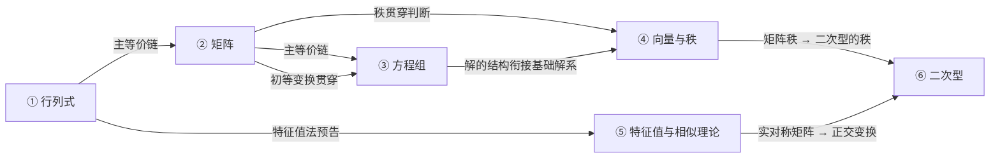

# 线性代数必背知识

> [!info] 用途
> 本笔记只记录每章后续快速复习必须马上想起的定义、公式、性质、口诀和做题步骤。长推导、完整例题保留在章节笔记中。

---

## 📌 线代知识地图（融会贯通总览）

> [!important] 主等价链：全书的灵魂
> 下面五件事本质上是同一件事，做题时随时互相翻译。三个"视角"分别来自第 1 章（行列式）、第 2 章（矩阵/秩）、第 3 章（方程组）——题目给你任一条件，立刻翻译成其他等价说法，等于多送好几个条件：
>
> $$
> \lvert A\rvert\neq 0 \iff A\ \text{可逆} \iff r(A)=n \iff A\mathbf{x}=\mathbf{0}\ \text{只有零解} \iff A\mathbf{x}=\mathbf{b}\ \text{有唯一解}
> $$

> [!tip] 贯穿全书的两个"通用工具"
> | 工具 | 出现在 | 串起的内容 |
> |:---|:---|:---|
> | **初等变换** | 第2章§14、第3章§2、第4章§9 | 求逆、求秩、解方程组、求极大无关组，全是同一套行变换 |
> | **秩 $r(A)$** | 第2章§15、第4章§7-9 | 判断可逆、线性相关/无关、解的存在唯一性的通用标尺 |

---

## 第一章：行列式

来源：[[线性代数/第一章：行列式/1.1-行列式的定义.md]]、[[线性代数/第一章：行列式/1.2-行列式的性质.md]]、[[线性代数/第一章：行列式/1.3-行列式的计算/1.3.1-行列式展开定理.md]]、[[线性代数/第一章：行列式/1.3-行列式的计算/1.3.2-常见行列式计算.md]]、[[线性代数/第一章：行列式/1.4-特殊行列式的计算/1.4.1-箭形爪形行列式.md]]、[[线性代数/第一章：行列式/1.4-特殊行列式的计算/1.4.2-爪形行列式的变形.md]]、[[线性代数/第一章：行列式/1.4-特殊行列式的计算/1.4.3-行和相等行列式.md]]、[[线性代数/第一章：行列式/1.4-特殊行列式的计算/1.4.4-行列同数行列式.md]]、[[线性代数/第一章：行列式/1.4-特殊行列式的计算/1.4.5-递推型行列式.md]]

### 1. 二阶与三阶行列式

二阶行列式：

$$
\begin{vmatrix}
a_{11} & a_{12}\\
a_{21} & a_{22}
\end{vmatrix}
= a_{11}a_{22}-a_{12}a_{21}
$$

三阶行列式用沙路法则：

> [!tip] 口诀
> **主正副负，平移两列。**

> [!warning] 易错点
> 沙路法则只适用于二阶、三阶行列式；四阶及以上不能直接套用。

---

### 2. 余子式与代数余子式

余子式：划去元素 $a_{ij}$ 所在的第 $i$ 行、第 $j$ 列后，剩下元素按原顺序组成的行列式，记为 $M_{ij}$。

代数余子式：

$$
A_{ij}=(-1)^{i+j}M_{ij}
$$

符号棋盘：

$$
\begin{matrix}
+ & - & + & -\\
- & + & - & +\\
+ & - & + & -\\
- & + & - & +
\end{matrix}
$$

> [!tip] 记忆
> 代数余子式 = 余子式 × 符号；符号由 $i+j$ 的奇偶决定。

---

### 3. 行列式五大性质

1. **转置不变**

$$
\lvert A^T\rvert=\lvert A\rvert
$$

2. **两行或两列互换，行列式变号**

$$
r_i \leftrightarrow r_j \quad \Longrightarrow \quad D \mapsto -D
$$

3. **某一行或某一列提出公因子**

若某一行或某一列都有公因子 $k$，则该公因子可以提到行列式外。

4. **某一行或某一列可拆分**

若某一行或某一列的每个元素都是两个数之和，则行列式可以拆成两个行列式之和。

5. **倍加不变**

把某一行或某一列的 $k$ 倍加到另一行或另一列，行列式值不变。

> [!important] 做题意义
> 行列式计算的核心不是硬算，而是用性质把行列式化简，尤其是制造 $0$ 后再展开。

---

### 4. 常用零行列式结论

以下情况行列式一定为 $0$：

- 有一行或一列全为 $0$；
- 有两行或两列对应相等；
- 有两行或两列对应成比例。

---

### 5. 行列式展开定理

按第 $i$ 行展开：

$$
D=\sum_{k=1}^{n}a_{ik}A_{ik}
$$

按第 $j$ 列展开：

$$
D=\sum_{k=1}^{n}a_{kj}A_{kj}
$$

> [!tip] 口诀
> 行列式等于某一行或某一列的元素与对应代数余子式乘积之和。

---

### 6. 展开定理的重要推论

同行同列，结果等于行列式本身：

$$
\sum_{k=1}^{n}a_{ik}A_{ik}=D
$$

异行异列，结果等于 $0$：

$$
\sum_{k=1}^{n}a_{ik}A_{jk}=0\quad(i\neq j)
$$

列的对应形式：

$$
\sum_{k=1}^{n}a_{ki}A_{kj}=0\quad(i\neq j)
$$

> [!important] 高频记忆句
> **同行同列得 $D$，异行异列得 $0$。**

---

### 7. 行列式计算基本策略

1. 先观察是否有相等行列、成比例行列、全零行列；
2. 用行列式性质化简，优先制造 $0$；
3. 选择 $0$ 最多的一行或一列展开；
4. 高阶行列式降为低阶行列式；
5. 注意换行换列会变号，提出公因子会改变倍数。

---

### 8. 常见特殊行列式

#### 主对角、上三角、下三角行列式

##### 结构模板

主对角型：

$$
\begin{vmatrix}
a_{11} & 0 & \cdots & 0\\
0 & a_{22} & \cdots & 0\\
\vdots & \vdots & \ddots & \vdots\\
0 & 0 & \cdots & a_{nn}
\end{vmatrix}
$$

上三角型：主对角线下方全为 $0$。

$$
\begin{vmatrix}
a_{11} & a_{12} & \cdots & a_{1n}\\
0 & a_{22} & \cdots & a_{2n}\\
\vdots & \vdots & \ddots & \vdots\\
0 & 0 & \cdots & a_{nn}
\end{vmatrix}
$$

下三角型：主对角线上方全为 $0$。

$$
\begin{vmatrix}
a_{11} & 0 & \cdots & 0\\
a_{21} & a_{22} & \cdots & 0\\
\vdots & \vdots & \ddots & \vdots\\
a_{n1} & a_{n2} & \cdots & a_{nn}
\end{vmatrix}
$$

三者行列式都等于主对角线元素乘积：

$$
D=a_{11}a_{22}\cdots a_{nn}.
$$

> [!tip] 识别
> 只要主对角线某一侧全为 $0$，就是三角型；不用展开，直接乘主对角线。

#### 副对角与副对角三角行列式

##### 结构模板

副对角型：非零元素主要落在右上到左下方向。以 $4$ 阶为例：

$$
\begin{vmatrix}
0 & 0 & 0 & a_{14}\\
0 & 0 & a_{23} & 0\\
0 & a_{32} & 0 & 0\\
a_{41} & 0 & 0 & 0
\end{vmatrix}
$$

副对角三角型：副对角线一侧允许有其他元素，但决定公式的仍是副对角线元素。

$$
\begin{vmatrix}
0 & 0 & 0 & a_{14}\\
0 & 0 & a_{23} & *\\
0 & a_{32} & * & *\\
a_{41} & * & * & *
\end{vmatrix}
$$

核心公式：

$$
D=(-1)^{\frac{n(n-1)}{2}}a_{1n}a_{2,n-1}\cdots a_{n1}.
$$

> [!tip] 口诀
> **副对角先相乘，再补逆序符号。**

> [!warning] 易错点
> 副对角方向不能只乘元素，还要补符号 $(-1)^{\frac{n(n-1)}{2}}$。其中 $\frac{n(n-1)}{2}$ 来自把副对角排列换成主对角排列所需的交换次数。

#### 范德蒙德行列式

$$
\begin{vmatrix}
1 & 1 & \cdots & 1\\
x_1 & x_2 & \cdots & x_n\\
x_1^2 & x_2^2 & \cdots & x_n^2\\
\vdots & \vdots & & \vdots\\
x_1^{n-1} & x_2^{n-1} & \cdots & x_n^{n-1}
\end{vmatrix}
=
\prod_{1\leq i<j\leq n}(x_j-x_i)
$$

> [!tip] 识别与口诀
> 每一列是同一个数的各次幂。先按列贴标签 $x_1,x_2,\cdots,x_n$，再让后面的减前面的：$x_j-x_i\ (j>i)$。

#### 矩阵乘积的行列式

若 $A,B$ 都是 $n$ 阶矩阵，则：

$$
\lvert AB\rvert=\lvert A\rvert\lvert B\rvert
$$

> [!warning] 易错点
> 一般没有 $\lvert A+B\rvert=\lvert A\rvert+\lvert B\rvert$。

#### 分块行列式

块三角型：

$$
\begin{vmatrix}
A & *\\
O & B
\end{vmatrix}
=
\begin{vmatrix}
A & O\\
* & B
\end{vmatrix}
=
\lvert A\rvert\lvert B\rvert
$$

块反对角型：

$$
\begin{vmatrix}
O & A\\
B & *
\end{vmatrix}
=
\begin{vmatrix}
* & A\\
B & O
\end{vmatrix}
=
(-1)^{mn}\lvert A\rvert\lvert B\rvert
$$

> [!important] 记忆
> 块三角型没有额外符号；块反对角型多乘 $(-1)^{mn}$，只看 $mn$ 的奇偶。

---

### 9. 箭形/爪形行列式

#### 识别特征

除第一行、第一列和主对角线外，其余元素全为 $0$，形如箭形或爪形：

$$
\begin{vmatrix}
a & b_1 & b_2 & \cdots & b_n \\
c_1 & d_1 & 0 & \cdots & 0 \\
c_2 & 0 & d_2 & \cdots & 0 \\
\vdots & \vdots & \vdots & \ddots & \vdots \\
c_n & 0 & 0 & \cdots & d_n
\end{vmatrix}
$$

#### 秒杀公式

若 $d_i\neq 0$，则：

$$
\begin{vmatrix}
a & b_1 & b_2 & \cdots & b_n \\
c_1 & d_1 & 0 & \cdots & 0 \\
c_2 & 0 & d_2 & \cdots & 0 \\
\vdots & \vdots & \vdots & \ddots & \vdots \\
c_n & 0 & 0 & \cdots & d_n
\end{vmatrix}
=
\left(\prod_{i=1}^n d_i\right)
\left(a-\sum_{i=1}^n\frac{b_i c_i}{d_i}\right)
$$

> [!tip] 口诀
> **外围乘积 × 内角修正。**

#### 消爪法（操作模板）

> [!important] 核心思想：为什么拿 $d_i$ 当“武器”
> $d_i$ 是“孤岛”元素：它所在的列除第 $1$ 行外，只有 $d_i$ 自己非零。用 $d_i$ 消第 $1$ 列的 $c_i$，只改写第 $1$ 列，稀疏区**不会新增非零元**；反过来若用第 $1$ 行去消别人，会瞬间让一整行变稠密，爪形结构就毁了。

**Step 1 找武器**：定位主对角线上的孤立非零元素 $d_1,d_2,\cdots,d_n$。

**Step 2 逐列消爪**：用每个 $d_i$ 所在的那一列（第 $i+1$ 列）消掉第 $1$ 列对应的 $c_i$：

$$
C_1\leftarrow C_1-\frac{c_i}{d_i}C_{i+1}\quad(i=1,2,\cdots,n),
$$

等价地一次消完：

$$
C_1\leftarrow C_1-\sum_{i=1}^{n}\frac{c_i}{d_i}C_{i+1}.
$$

**Step 3 化上三角**：第 $1$ 列除首元素外全部归 $0$，变成上三角：

$$
\begin{vmatrix}
a-\sum_{i=1}^{n}\frac{b_ic_i}{d_i} & b_1 & b_2 & \cdots & b_n\\
0 & d_1 & 0 & \cdots & 0\\
0 & 0 & d_2 & \cdots & 0\\
\vdots & \vdots & \vdots & \ddots & \vdots\\
0 & 0 & 0 & \cdots & d_n
\end{vmatrix}
=\left(a-\sum_{i=1}^{n}\frac{b_ic_i}{d_i}\right)\prod_{i=1}^{n}d_i.
$$

> [!tip] 一句话记忆
> **拿对角孤岛 $d_i$ 消第 $1$ 列爪子，爪子归零、稀疏不破，化成上三角相乘。**

> [!warning] 易错点
> 不要反过来用第一行或第一列去消其他行列，否则容易破坏稀疏结构，制造大量非零元素。若某个 $d_i=0$，不能直接套公式，要先换行/列、展开或另作变换。

---

### 10. 爪形变形题

#### 识别信号

结构介于三角行列式和标准爪形行列式之间，非零元素分布不规则，但某些行或列的零元素特别多。

> [!tip] 破题眼
> 若某行或某列只有 $1\sim2$ 个非零元素，优先考虑按该行或该列展开。
> **为什么**：展开式 $D=\sum a_{ik}A_{ik}$ 里，$a_{ik}=0$ 的项直接消失，只需算非零元对应的代数余子式——零越多，要算的余子式越少，降阶越省力。

#### 通用流程

1. 扫描各行各列，找零最多的一行或一列；
2. 按该行或该列展开，降为低阶行列式；
3. 若子式仍然零多，继续展开；
4. 若子式是三角型，直接用主对角线乘积；
5. 合并各项，注意代数余子式符号 $(-1)^{i+j}$。

> [!warning] 易错点
> 爪形变形题没有固定模板时，不要硬套标准爪形公式；先找零最多的行或列展开。

#### 递推型行列式

##### 识别与通用流程

递推型行列式的核心不是背一个孤立公式，而是先认出“展开后还能长回原来的样子”。

> [!tip] 破题流程
> 认模板 → 找含 $0$ 最多的行或列展开 → 判断每个非零元素对应的余子式 → 写成 $D_{n-1}$ 或 $D_{n-2}$ → 补初值 → 解递推数列。

> [!important] 做题核心
> 递推型行列式不能只背最终结果；考场必须会说明“按哪里展开、哪一支变成同型子式、哪一支直接算出系数”。

常见递推形式：

$$
D_n=pD_{n-1}+f(n),
\qquad
D_n=pD_{n-1}+qD_{n-2}.
$$

---

##### 模板一：异爪型递推

结构模板：

$$
D_n=
\begin{vmatrix}
a_1 & -1 & 0 & \cdots & 0 \\
a_2 & x & -1 & \cdots & 0 \\
a_3 & 0 & x & \cdots & 0 \\
\vdots & \vdots & \vdots & \ddots & \vdots \\
a_n & 0 & 0 & \cdots & x
\end{vmatrix}
$$

> [!tip] 识别
> 第一列较满，右下主体接近上双对角结构；末行只有 $a_n$ 和 $x$ 两个非零元素，优先按末行展开。

做题启动：按最后一行展开。

$$
D_n=a_nA_{n1}+xA_{nn}.
$$

其中：

$$
A_{nn}=D_{n-1},
\qquad
A_{n1}=1.
$$

所以立刻得到递推式。

递推式：

$$
D_n=xD_{n-1}+a_n,
\qquad
D_1=a_1.
$$

最终结果：

$$
D_n=a_1x^{n-1}+a_2x^{n-2}+\cdots+a_{n-1}x+a_n
=
\sum_{i=1}^{n}a_ix^{n-i}.
$$

> [!note]- 题目解析：套娃迭代
> 由
>
> $$
> D_n=xD_{n-1}+a_n
> $$
>
> 反复代入：
>
> $$
> \begin{aligned}
> D_n
> &=xD_{n-1}+a_n \\
> &=x^2D_{n-2}+a_{n-1}x+a_n \\
> &=x^3D_{n-3}+a_{n-2}x^2+a_{n-1}x+a_n \\
> &\quad \vdots \\
> &=x^{n-1}D_1+a_2x^{n-2}+\cdots+a_{n-1}x+a_n.
> \end{aligned}
> $$
>
> 又 $D_1=a_1$，所以
>
> $$
> \boxed{D_n=a_1x^{n-1}+a_2x^{n-2}+\cdots+a_{n-1}x+a_n
> =\sum_{i=1}^{n}a_ix^{n-i}}.
> $$

> [!tip] 口诀
> 异爪型结果就是：$a_1,a_2,\cdots,a_n$ 依次配 $x^{n-1},x^{n-2},\cdots,x^0$。

---

##### 模板二：三对角型递推

结构模板：

$$
D_n=
\begin{vmatrix}
b & c & 0 & \cdots & 0 \\
d & b & c & \cdots & 0 \\
0 & d & b & \cdots & 0 \\
\vdots & \vdots & \vdots & \ddots & c \\
0 & 0 & 0 & d & b
\end{vmatrix}
$$

> [!tip] 识别
> 只有主对角线、上次对角线、下次对角线可能非零；优先按第一行或最后一行展开，通常会降成 $D_{n-1}$ 和 $D_{n-2}$。

做题启动：按第一行展开。

$$
D_n=bA_{11}+cA_{12}.
$$

第一支保留同型结构：

$$
A_{11}=D_{n-1}.
$$

第二支再按第一列展开，会多出下次对角元素 $d$ 和代数余子式负号：

$$
A_{12}=-dD_{n-2}.
$$

所以立刻得到递推式。

递推式：

$$
D_n=bD_{n-1}-cdD_{n-2}.
$$

本节典型型：主对角线为 $2a$，上次对角线为 $1$，下次对角线为 $a^2$，所以：

$$
D_n=2aD_{n-1}-a^2D_{n-2},
\qquad
D_1=2a,
\qquad
D_2=3a^2.
$$

解递推：特征方程法（考场推荐）。

| 特征根情况                             | 通解形式                                |
| :-------------------------------- | :---------------------------------- |
| 两个不同根 $\lambda_1\ne\lambda_2$     | $D_n=C_1\lambda_1^n+C_2\lambda_2^n$ |
| 二重根 $\lambda_1=\lambda_2=\lambda$ | $D_n=(C_1+C_2n)\lambda^n$           |

源笔记里的通用模板是：设

$$
D_n=pD_{n-1}+qD_{n-2},
$$

移项得

$$
D_n-pD_{n-1}-qD_{n-2}=0,
$$

对应特征方程为

$$
\boxed{\lambda^2-p\lambda-q=0}.
$$

本节典型型中：

$$
D_n=2aD_{n-1}-a^2D_{n-2},
$$

对应特征方程

$$
\lambda^2-2a\lambda+a^2=0.
$$

即

$$
(\lambda-a)^2=0,
$$

为二重根 $\lambda=a$，所以通解为

$$
D_n=(C_1+C_2n)a^n.
$$

代入初始值：

$$
\begin{cases}
(C_1+C_2)a=2a,\\
(C_1+2C_2)a^2=3a^2.
\end{cases}
$$

当 $a\ne0$ 时，解得

$$
C_1=1,\qquad C_2=1.
$$

因此

$$
\boxed{D_n=(n+1)a^n}.
$$

$a=0$ 时也满足该结论。

> [!important] 考场策略
> 这部分按源笔记记：三对角型先展开出二阶递推，再用特征方程法；遇到二重根 $\lambda$，通解写成 $(C_1+C_2n)\lambda^n$。

---

##### 模板三：四角配对型（分块矩阵法）

图示：

![[线性代数/第一章：行列式/1.4-特殊行列式的计算/attachments/递推型行列式-四角剥皮例13.png]]

- **图的作用**：说明这类题的主方法不是普通展开，而是把对称位置配对，化成若干个相同的 $2\times2$ 小块。
- **关键标注**：按 $(1,2n),(2,2n-1),\ldots,(n,n+1)$ 配对；每一对行、每一对列交叉出来的核心块都是 $\begin{pmatrix}a&b\\c&d\end{pmatrix}$。
- **做题结论**：同时重排行和列后，行列式变成 $n$ 个相同 $2\times2$ 块的块对角行列式，所以结果是 $(ad-bc)^n$。

结构模板：

$$
D_{2n}=\begin{vmatrix}
a & 0 & \cdots & 0 & b \\
0 & a & \cdots & b & 0 \\
\vdots & \vdots & \ddots & \vdots & \vdots \\
0 & c & \cdots & d & 0 \\
c & 0 & \cdots & 0 & d
\end{vmatrix}.
$$

> [!tip] 识别口诀
> 看到“左上 $a$、右上 $b$、左下 $c$、右下 $d$，并且向中心重复出现”，就想：**四角配对 → 同序重排行列 → 块对角 → 小块行列式相乘**。

做题启动：把行和列都按同一个顺序重新排列：

$$
1,\ 2n,\ 2,\ 2n-1,\ 3,\ 2n-2,\ \ldots,\ n,\ n+1.
$$

也就是把原来的第 $1$ 个位置和第 $2n$ 个位置配成一组，第 $2$ 个位置和第 $2n-1$ 个位置配成一组，依次向中心配对。

重排后，矩阵变成块对角形式：

$$
\operatorname{diag}(B,B,\ldots,B),
\qquad
B=\begin{pmatrix}a&b\\c&d\end{pmatrix}.
$$

注意：这里是**同时按同样顺序交换行和列**。行交换产生的符号和列交换产生的符号相同，二者相乘为正，因此行列式值不变。

所以：

$$
D_{2n}=(\lvert B\rvert)^n
=\left(\begin{vmatrix}a&b\\c&d\end{vmatrix}\right)^n
=(ad-bc)^n.
$$

因此：

$$
\boxed{D_{2n}=(ad-bc)^n}.
$$

> [!warning] 方法选择
> 原图思路是分块矩阵法，考场上看到这种成对分布，先想“同序重排行列，化为块对角”。剥皮递推只作为备用验算思路。

---

##### 易错点

> [!warning] 易错点
> - 展开时别忘代数余子式符号 $(-1)^{i+j}$。
> - 写出递推式后必须补初值 $D_1,D_2$。
> - 三对角型第二项通常带负号，例如 $-cdD_{n-2}$。
> - 四角配对型的主方法是“同序重排行列 → 块对角”，不要误以为只能展开递推；同时换行换列时符号会抵消。

---

### 11. 行和相等与 ab 型行列式

#### 行和相等

行列式中**每一行元素的和都相等**，就说这个行列式是行和相等的。

##### 操作模板：标准三步走

典型 ab 型：

$$
D_n=\begin{vmatrix}
x & a & \cdots & a \\
a & x & \cdots & a \\
\vdots & \vdots & \ddots & \vdots \\
a & a & \cdots & x
\end{vmatrix},
\qquad
\text{每行和}=x+(n-1)a.
$$

**Step 1**：将第 $2,3,\dots,n$ 列都加到第 $1$ 列：

$$
C_1\leftarrow C_1+C_2+\cdots+C_n.
$$

此时第 $1$ 列全变成行和 $x+(n-1)a$。

**Step 2**：提出第 $1$ 列公因子：

$$
x+(n-1)a.
$$

**Step 3**：各行减第 $1$ 行，制造三角结构：

$$
R_i\leftarrow R_i-R_1\quad(i=2,3,\cdots,n).
$$

最终得到：

$$
D_n=[x+(n-1)a](x-a)^{n-1}.
$$

> [!tip] 口诀
> **列加制造行和，提出公因子，行减制造三角。**

> [!warning] 易错点
> 行和相等只是提示“先列加”，不等于一定能直接套 ab 型公式；只有主对角线同数、非主对角线同数时，才是 ab 型。

#### ab 型行列式

主对角线全为 $b$，非主对角线全为 $a$：

$$
D_n=
\begin{vmatrix}
b & a & \cdots & a \\
a & b & \cdots & a \\
\vdots & \vdots & \ddots & \vdots \\
a & a & \cdots & b
\end{vmatrix}
$$

必背公式：

$$
D_n=\bigl[b+(n-1)a\bigr](b-a)^{n-1}
$$

若主对角线写作 $x$，则：

$$
D_n=\bigl[x+(n-1)a\bigr](x-a)^{n-1}
$$

##### 特征值法（另一种推导）

学了特征值后，ab 型行列式还能用**特征值法**直接推出：把矩阵写成「全 $1$ 矩阵 $J_n$ 与单位矩阵 $I_n$ 的线性组合」，借助 $J_n$ 的已知特征值一步到位。

> [!note]- 特征值法推导
> 记 $J_n$ 为全 $1$ 矩阵，$I_n$ 为单位矩阵，则当前矩阵可以写成
>
> $$
> A=aJ_n+(x-a)I_n.
> $$
>
> 关键事实：$J_n$ 的特征值为
>
> $$
> n,\underbrace{0,0,\cdots,0}_{n-1\text{ 个}}.
> $$
>
> 因此 $A=aJ_n+(x-a)I_n$ 的特征值为
>
> $$
> an+(x-a)=x+(n-1)a,
> $$
>
> 以及
>
> $$
> \underbrace{x-a,x-a,\cdots,x-a}_{n-1\text{ 个}}.
> $$
>
> 行列式等于全部特征值之积，所以
>
> $$
> \lvert A\rvert=\bigl[x+(n-1)a\bigr](x-a)^{n-1}.
> $$

> [!important] 记忆
> 一个“行和因子” $b+(n-1)a$，再乘 $n-1$ 个“对角减非对角” $b-a$。

> [!warning] 易错点
> ab 型公式只适用于“主对角线同一个数、非主对角线同一个数”的结构。若只是行和相等但不满足 ab 型，不能直接套公式，应优先用列加到一列的行列变换法。

> [!tip] 关联
> **特征值法把行列式连到特征值**：$\lvert A\rvert=\text{所有特征值之积}$，对应顶部主等价链中“$0$ 是特征值 ⟺ $\lvert A\rvert=0$ ⟺ 不可逆”。第 5 章已完成，可用特征值之积重新理解这里，ab 型公式就不用死记了。

---

### 12. 行列同数行列式（加边法）

#### 识别特征

除主对角线外，其余位置全是同一个数 $a$，但主对角线可以分别是 $a_1,a_2,\cdots,a_n$：

$$
D_n=
\begin{vmatrix}
a_1 & a & \cdots & a\\
a & a_2 & \cdots & a\\
\vdots & \vdots & \ddots & \vdots\\
a & a & \cdots & a_n
\end{vmatrix}
$$

> [!tip] 本质：共同模板 + 对角线差额
> 每一行都能拆成「共同模板」+「主对角线上的差额」：
>
> $$
> \text{第 }i\text{ 行}=\underbrace{(a,a,\cdots,a)}_{\text{共同模板}}+\ (a_i-a)\,e_i,
> $$
>
> 其中 $e_i$ 是第 $i$ 个标准基行。这是第 11 节 ab 型的升级版：ab 型主对角线同数（$a_i$ 全相等），这里允许不同，所以公式会多一个「修正项」。

#### 核心思想：为什么用加边法

> [!important] 加边法（升阶法）
> 共同元素太多、硬算麻烦。加边法的思路：**加一行「共同模板」放到最上面**，再用这一行去减下面各行的共同 $a$，把共同元素全部清零——用「升一阶」的代价，换「消掉全部共同元素」。
>
> 清零后每行只剩主对角线差额 $a_i-a$，行列式立刻变成第 9 节的**爪形行列式**，最后一招定胜负。

#### 操作模板（三步走）

**Step 1 加边**：左上角加一行一列，首元素 $1$，第一行放共同模板 $(1,1,\cdots,1)$，第一列其余为 $0$（沿第一列展开即回原式，值不变）：

$$
D_n=
\begin{vmatrix}
1 & 1 & 1 & \cdots & 1\\
0 & a_1 & a & \cdots & a\\
0 & a & a_2 & \cdots & a\\
\vdots & \vdots & \vdots & \ddots & \vdots\\
0 & a & a & \cdots & a_n
\end{vmatrix}
$$

**Step 2 消公共**：用第一行消掉下面各行的共同 $a$，即 $R_i\leftarrow R_i-aR_1\ (i=2,\cdots,n+1)$，化为爪形：

$$
D_n=
\begin{vmatrix}
1 & 1 & 1 & \cdots & 1\\
-a & a_1-a & 0 & \cdots & 0\\
-a & 0 & a_2-a & \cdots & 0\\
\vdots & \vdots & \vdots & \ddots & \vdots\\
-a & 0 & 0 & \cdots & a_n-a
\end{vmatrix}
$$

**Step 3 套爪形公式**（第 9 节）：此处 $p=1,\ q_i=1,\ r_i=-a,\ d_i=a_i-a$，代入爪形公式

$$
\left(\prod_{i=1}^n d_i\right)\left(p-\sum_{i=1}^n\frac{q_ir_i}{d_i}\right)
$$

得：

$$
D_n=\prod_{i=1}^n(a_i-a)\cdot\left(1+a\sum_{i=1}^n\frac{1}{a_i-a}\right).
$$

#### 必背公式

令 $d_i=a_i-a$。若 $d_i\neq 0$，则：

$$
D_n=\left(\prod_{i=1}^{n}d_i\right)\left(1+a\sum_{i=1}^{n}\frac{1}{d_i}\right)
$$

即：

$$
D_n=\left[\prod_{i=1}^{n}(a_i-a)\right]\left(1+a\sum_{i=1}^{n}\frac{1}{a_i-a}\right)
$$

> [!tip] 口诀
> **先看对角减公共，再乘一个修正括号。**

> [!tip] 一句话理解公式
> 乘积部分 $\prod(a_i-a)$ 是「消掉共同模板后主对角线留下的差额」；修正括号里的 $1+a\sum\frac{1}{a_i-a}$ 是模板行本身（那个 $1$）加上它被消元时留下的影响。

> [!tip] 推广：模板不一定是 $a$
> 加边法真正的核心是「把共同模板提出来消掉」，模板可以不是 $a$。例如每行模板是 $(1,-1,1,-1)$、只在个别位置多出 $a$ 时同样适用：加一行共同模板 → 用模板行减下面各行 → 消完公共部分后剩下三角或反对角结构（见源笔记 [[线性代数/第一章：行列式/1.4-特殊行列式的计算/1.4.4-行列同数行列式.md]] 例 10）。

> [!warning] 易错点
> - 不能和 ab 型混淆：ab 型是 $a_1=a_2=\cdots=a_n=b$ 的特殊情形；行列同数允许主对角线不同，公式才多出求和修正项。
> - 若某个 $a_i-a=0$：分式公式分母为 $0$，**不能硬套**，应回到 Step 2 的爪形直接化三角、按该行展开或另作行列变换。
> - 加边位置：左上角加一行一列，首元素 $1$、第一行放共同模板、第一列其余 $0$；加错位置会改变行列式值。

---

## 第二章：矩阵

来源：[[线性代数/第二章：矩阵/2.1 矩阵的定义.md]]、[[线性代数/第二章：矩阵/2.2 常见的特殊矩阵.md]]、[[线性代数/第二章：矩阵/2.3 矩阵基本运算/2.3.1 矩阵的加减法.md]]、[[线性代数/第二章：矩阵/2.3 矩阵基本运算/2.3.2 矩阵的数量乘法.md]]、[[线性代数/第二章：矩阵/2.3 矩阵基本运算/2.3.3 矩阵的乘法.md]]、[[线性代数/第二章：矩阵/2.3 矩阵基本运算/2.3.4 对角矩阵的左乘与右乘.md]]、[[线性代数/第二章：矩阵/2.5 转置矩阵/2.5.1 转置矩阵的定义.md]]、[[线性代数/第二章：矩阵/2.5 转置矩阵/2.5.2 运算律.md]]、[[线性代数/第二章：矩阵/2.5 转置矩阵/2.5.3 对称矩阵与反对称矩阵.md]]、[[线性代数/第二章：矩阵/2.6 伴随矩阵/2.6.1 伴随矩阵的定义.md]]、[[线性代数/第二章：矩阵/2.6 伴随矩阵/2.6.2 伴随矩阵的相关公式.md]]、[[线性代数/第二章：矩阵/2.7 逆矩阵/2.7.1 逆矩阵的定义.md]]、[[线性代数/第二章：矩阵/2.7 逆矩阵/2.7.2 从行列式角度理解逆矩阵.md]]、[[线性代数/第二章：矩阵/2.7 逆矩阵/2.7.3 逆矩阵相关结论.md]]、[[线性代数/第二章：矩阵/2.9 初等变换与初等矩阵/📝 章节总结.md]]、[[线性代数/第二章：矩阵/2.10 矩阵的秩/2.10.1 子式、秩的概念.md]]、[[线性代数/第二章：矩阵/2.10 矩阵的秩/2.10.2 矩阵的秩相关结论.md]]

### 1. 矩阵的定义与记号

由 $m\times n$ 个元素排成的 $m$ 行 $n$ 列矩形数表，称为 $m\times n$ 矩阵，记为：

$$
A=(a_{ij})_{m\times n}.
$$

其中 $a_{ij}$ 表示第 $i$ 行第 $j$ 列元素。

> [!tip] 口诀
> **行在前，列在后。**

---

### 2. 矩阵与行列式的区别

- **矩阵**：是一个数表，有形状，可以是 $m\times n$，不一定是方阵；
- **行列式**：是一个数值，只能由方阵计算。

> [!important] 记忆
> **矩阵有形状，行列式有数值。**

---

### 3. 方阵

当 $m=n$ 时，称 $A$ 为 $n$ 阶方阵。

> [!warning] 易错点
> - 方阵才谈行列式；
> - 方阵才可能谈逆矩阵；
> - 但不是所有方阵都有逆矩阵，后面要看 $\lvert A\rvert\neq 0$ 或秩是否满。

---

### 4. 行向量与列向量

- 行向量：$1\times n$ 矩阵；
- 列向量：$m\times 1$ 矩阵；
- 向量是矩阵的特殊情形。

---

### 5. 同型矩阵与矩阵相等

同型矩阵：两个矩阵行数相同且列数相同。

矩阵相等：两个矩阵同型，且对应元素全部相等。

$$
A=B \Rightarrow A,B\text{ 同型},
$$

但

$$
A,B\text{ 同型} \nRightarrow A=B.
$$

> [!tip] 口诀
> **同型只看形状，相等还要看每个元素。**

---

### 6. 系数矩阵与增广矩阵

线性方程组可以抽出系数组成系数矩阵 $A$，再把常数列拼上得到增广矩阵：

$$
(A\mid b).
$$

> [!important] 后续用途
> 解线性方程组时，本质上是在增广矩阵上做初等行变换。

---

### 7. 常见的特殊矩阵

> [!summary] 必背层级
> 对角矩阵 $\supset$ 数量矩阵 $\supset$ 单位矩阵；对角矩阵同时属于上三角矩阵和下三角矩阵；严格三角矩阵是三角矩阵的特例，并且一定幂零。

#### 基础定义速记

- **零矩阵**：所有元素全为 $0$，可为 $m\times n$ 矩阵，记作 $O$。
- **对角矩阵**：$n$ 阶方阵，主对角线外元素全为 $0$，记作 $\operatorname{diag}(a_1,a_2,\dots,a_n)$。
- **数量矩阵**：对角线元素全相等，即 $kE$。
- **单位矩阵**：对角线元素全为 $1$，记作 $E$ 或 $I$。
- **上三角矩阵**：$a_{ij}=0\ (i>j)$，即主对角线左下方全为 $0$。
- **下三角矩阵**：$a_{ij}=0\ (i<j)$，即主对角线右上方全为 $0$。

> [!tip] 识别口诀
> 对角看“主线”，数量看“全相等”，单位看“全为 1”；上三角空左下，下三角空右上。

#### 对角、数量、单位矩阵核心性质

对角矩阵 $\Lambda=\operatorname{diag}(a_1,a_2,\dots,a_n)$：

$$
\Lambda^k=\operatorname{diag}(a_1^k,a_2^k,\dots,a_n^k).
$$

若 $a_i\neq 0\ (i=1,2,\dots,n)$，则：

$$
\Lambda^{-1}=\operatorname{diag}\left(\frac{1}{a_1},\frac{1}{a_2},\dots,\frac{1}{a_n}\right).
$$

数量矩阵与任意同阶方阵可交换：

$$
(kE)B=B(kE)=kB.
$$

单位矩阵是矩阵乘法的单位元：

$$
AE=EA=A.
$$

> [!warning] 易错点
> $AB=O$ 不能推出 $A=O$ 或 $B=O$；矩阵乘法中“零因子”可能存在。

#### 三角矩阵核心性质

- 上三角矩阵的乘积仍是上三角矩阵；下三角矩阵的乘积仍是下三角矩阵。
- 三角矩阵的行列式等于主对角线元素乘积：

$$
\lvert A\rvert=a_{11}a_{22}\cdots a_{nn}.
$$

- 三角矩阵的特征值就是主对角线元素 $a_{11},a_{22},\dots,a_{nn}$。

#### 行阶梯矩阵与行最简矩阵

行阶梯矩阵判断两条：

1. 零行在底部；
2. 非零行的首个非零元素逐行右移。

行最简矩阵 = 行阶梯矩阵 + 两条额外条件：

1. 每个非零行的首个非零元素必须为 $1$；
2. 首 $1$ 所在列的其他元素全为 $0$。

> [!tip] 口诀
> 行阶梯 = 楼梯状；行最简 = 楼梯状 + 台阶是 1 + 台阶上下全是 0。

#### 严格三角矩阵与幂零矩阵 ★★★

严格上三角矩阵满足 $a_{ij}=0\ (i\geq j)$；严格下三角矩阵满足 $a_{ij}=0\ (i\leq j)$。

若 $A$ 是 $n$ 阶严格三角矩阵，则：

$$
A^n=O.
$$

幂零矩阵的一般定义：存在正整数 $k$，使得 $A^k=O$。

> [!important] 关系
> 严格三角矩阵 $\Rightarrow$ 幂零矩阵；但幂零矩阵 $\nRightarrow$ 严格三角矩阵。

#### 考研启动信号：$\lambda E+N$ 拆分法

遇到主对角线元素全部相等的三角矩阵，优先拆成：

$$
A=\lambda E+N,
$$

其中 $N$ 通常是严格三角矩阵，因此 $N$ 幂零。若 $N^m=O$，则：

$$
(\lambda E+N)^n=\sum_{r=0}^{m-1}\mathrm{C}_n^r\lambda^{n-r}N^r.
$$

> [!tip] 做题意义
> 求高次幂时不要硬乘；先拆 $\lambda E+N$，再用二项式展开，展开到幂零前一项自动停止。

#### 幂零矩阵求逆公式

若 $N^k=O$，则：

$$
(E-N)^{-1}=E+N+N^2+\cdots+N^{k-1}.
$$

常见变形：

$$
(E+N)^{-1}=E-N+N^2-N^3+\cdots+(-1)^{k-1}N^{k-1}.
$$

$$
(E-\lambda N)^{-1}=E+\lambda N+\lambda^2N^2+\cdots+\lambda^{k-1}N^{k-1}.
$$

> [!note]- 为什么长这样：几何级数的矩阵版
> 对比数的情形：$\frac{1}{1-x}=1+x+x^2+\cdots$。矩阵版只要 $N^k=O$，级数到 $N^{k-1}$ **自动截断**（再往后全是 $O$）：
>
> $$
> (E-N)\left(E+N+N^2+\cdots+N^{k-1}\right)=E-N^k=E.
> $$
>
> 所以 $(E-N)^{-1}=E+N+\cdots+N^{k-1}$ 本质就是 $\frac{1}{1-x}$ 的等比求和公式，把 $x$ 换成 $N$、截断到 $N^{k-1}$。
>
> 三个变形式同理：$(E+N)^{-1}$ 对应 $\frac{1}{1+x}$（正负交替），$(E-\lambda N)^{-1}$ 对应公比 $\lambda x$。

---

### 8. 矩阵基本运算

#### 加减法与数乘

矩阵加减法要求两个矩阵**同型**，设 $A=(a_{ij})_{m\times n}$，$B=(b_{ij})_{m\times n}$，则：

$$
A\pm B=(a_{ij}\pm b_{ij})_{m\times n}.
$$

> [!tip] 口诀
> 同型才能加减，对应元素相加减。

数乘矩阵就是标量乘每一个元素：

$$
kA=(ka_{ij})_{m\times n}.
$$

> [!tip] 口诀
> 数乘矩阵，遍历每个元素。

若 $A$ 是 $n$ 阶方阵，则：

$$
\lvert kA\rvert=k^n\lvert A\rvert.
$$

> [!warning] 高频易错
> 矩阵数乘是“每个元素都乘 $k$”；行列式中只把某一行或某一列乘 $k$，才只提出一个 $k$。所以 $\lvert kA\rvert$ 是 $k^n\lvert A\rvert$，不是 $k\lvert A\rvert$。

#### 矩阵乘法定义与维度

若 $A$ 是 $m\times n$ 矩阵，$B$ 是 $n\times s$ 矩阵，则 $AB$ 有意义，且结果是 $m\times s$ 矩阵：

$$
(m\times n)(n\times s)=m\times s.
$$

元素公式：

$$
c_{ij}=\sum_{k=1}^{n}a_{ik}b_{kj}.
$$

> [!tip] 口诀
> 中间相等才能乘，结果取外面；左行右列对应乘，相加填入 $(i,j)$ 位。

#### 矩阵乘法的列解释与行解释

设 $A$ 是 $m\times n$ 矩阵，$B$ 是 $n\times s$ 矩阵，记：

$$
A=(\alpha_1,\alpha_2,\dots,\alpha_n),\qquad B=(b_1,b_2,\dots,b_s).
$$

##### 1）$AB=O$：看 $B$ 的每一列

$$
AB=O
\Longleftrightarrow
A[b_1,b_2,\dots,b_s]=[0,0,\dots,0]
\Longleftrightarrow
Ab_i=0\quad(i=1,2,\dots,s).
$$

即：**$B$ 的每一列都是齐次方程组 $Ax=0$ 的解。**

> [!important] 做题结论（不用向量空间语言）
> 若 $AB=O$，就逐列看：
> $$
> Ab_1=0,\quad Ab_2=0,\quad \dots,\quad Ab_s=0.
> $$
> 也就是说，$B$ 的所有列向量都要从齐次方程组 $Ax=0$ 的解里面选。
>
> 若 $r(A)=r$，则 $Ax=0$ 的基础解系含 $n-r$ 个向量，所以 $B$ 的列向量组最多只有 $n-r(A)$ 个线性无关向量：
> $$
> r(B)\leq n-r(A),\qquad r(A)+r(B)\leq n.
> $$
>
> 一句话：**$A$ 的秩越大，$Ax=0$ 的自由未知量越少，能拿来当 $B$ 的线性无关列也越少。**

> [!tip] 关联
> **“$B$ 的每一列都是 $Ax=0$ 的解”正是把矩阵乘法翻译成方程组**：$AB=O$ 的本质是“$B$ 的列全部落在齐次方程组的解空间里”。学到第 4 章基础解系后，这句话 = “$B$ 的列由 $Ax=0$ 的基础解系张成”，且列数不超过 $n-r(A)$——这正是本节 $r(B)\leq n-r(A)$ 的来源。

##### 2）$AB=C$：列看左边 $A$

若

$$
A=(\alpha_1,\alpha_2,\dots,\alpha_n),\quad
B=(b_1,b_2,\dots,b_s),\quad
C=AB=(c_1,c_2,\dots,c_s),
$$

则 $C$ 的第 $j$ 列为：

$$
c_j=Ab_j=b_{1j}\alpha_1+b_{2j}\alpha_2+\cdots+b_{nj}\alpha_n.
$$

即：**$AB$ 的列向量都可由 $A$ 的列向量线性表示。**

> [!note]- 为什么？
> $B$ 的第 $j$ 列 $b_j$ 只是在告诉我们：$A$ 的各列分别取什么系数、如何组合。
>
> $$
> c_j=Ab_j
> =b_{1j}\alpha_1+b_{2j}\alpha_2+\cdots+b_{nj}\alpha_n.
> $$
>
> 所以，$AB$ 的每一列都只是 $A$ 的列向量重新组合后的结果。可以记成：
>
> **$A$ 提供列向量，$B$ 提供组合系数，$AB$ 产生组合结果。**

> [!tip] 记忆
> **列看左边，行看右边。** $AB$ 的列由左因子 $A$ 的列向量组合而成，所以 $AB$ 中线性无关列的个数不会超过 $A$：
> $$
> r(AB)\leq r(A).
> $$
>
> 注意：这里比较的是秩 $r(A)$，不是 $A$ 的列数。

##### 3）$AB=C$：行看右边 $B$

设 $B$ 的行向量为 $\beta_1^{\mathrm T},\beta_2^{\mathrm T},\dots,\beta_n^{\mathrm T}$，$C$ 的行向量为 $\gamma_1^{\mathrm T},\gamma_2^{\mathrm T},\dots,\gamma_m^{\mathrm T}$，则：

$$
\gamma_i^{\mathrm T}=a_{i1}\beta_1^{\mathrm T}+a_{i2}\beta_2^{\mathrm T}+\cdots+a_{in}\beta_n^{\mathrm T}.
$$

即：**$AB$ 的行向量都可由 $B$ 的行向量线性表示。**

> [!tip] 记忆
> 乘积矩阵的“行”，只能由右因子 $B$ 的行向量组线性表示，所以线性无关行的个数不会超过 $B$：
> $$
> r(AB)\leq r(B).
> $$

> [!summary] 秩的核心结论
> $$
> r(AB)\leq \min\{r(A),r(B)\}.
> $$

##### 4）$Ax=0$：行向量正交解释

若 $A$ 按行分块为：

$$
A=\begin{pmatrix}
\alpha_1^{\mathrm T}\\
\alpha_2^{\mathrm T}\\
\vdots\\
\alpha_m^{\mathrm T}
\end{pmatrix},
$$

则：

$$
Ax=0
\Longleftrightarrow
\alpha_i^{\mathrm T}x=0\quad(i=1,2,\dots,m).
$$

即：**齐次方程组 $Ax=0$ 的解向量，与 $A$ 的每一个行向量都正交。**

> [!tip] 记忆
> $Ax=0$ 就是在说：$x$ 同时垂直于 $A$ 的每一个行向量。

#### 矩阵乘法运算律

- 数乘因子可移动：$k(AB)=(kA)B=A(kB)$。
- 结合律成立：$(AB)C=A(BC)$。
- 左分配律：$A(B+C)=AB+AC$。
- 右分配律：$(B+C)A=BA+CA$。
- 单位矩阵作单位元：$E_mA_{m\times n}=A_{m\times n}E_n=A$。

> [!warning] 注意
> 因为矩阵乘法一般不满足交换律，所以分配律要区分左分配和右分配。

#### 乘法高频陷阱

- 一般 $AB\neq BA$。
- $AB=O$ 不能推出 $A=O$ 或 $B=O$；非零矩阵相乘也可能得到零矩阵。
- $AB=AC$ 不能直接推出 $B=C$；只有当 $A$ 可逆时，才能左乘 $A^{-1}$ 消去 $A$。
- $(AB)^2=ABAB$，一般不等于 $A^2B^2$；若要等于，需要 $AB=BA$。
- $(A+B)^2=A^2+AB+BA+B^2$，一般不能写成 $A^2+2AB+B^2$；只有 $AB=BA$ 时才可合并。

> [!important] 考场判断
> 看到矩阵乘法、幂、展开式，先问自己：这些矩阵是否可交换？没有可交换条件，就不要套普通代数公式。

#### 对角矩阵左乘与右乘

设 $\Lambda=\operatorname{diag}(\lambda_1,\lambda_2,\dots,\lambda_n)$。

- 左乘 $\Lambda A$：$\lambda_i$ 依次乘 $A$ 的第 $i$ 行。
- 右乘 $A\Lambda$：$\lambda_j$ 依次乘 $A$ 的第 $j$ 列。

> [!tip] 口诀
> 左行右列。左乘对行操作，右乘对列操作。这个规则也会延伸到后面的初等矩阵。

#### 特殊矩阵乘法速记

- 对角矩阵乘对角矩阵，结果仍是对角矩阵，对角元对应相乘。
- 上三角矩阵乘上三角矩阵，结果仍是上三角矩阵。
- 下三角矩阵乘下三角矩阵，结果仍是下三角矩阵。
- 零矩阵乘维度兼容的矩阵，结果仍是零矩阵。

---

### 9. 转置矩阵

#### 定义与基本性质

设 $A=(a_{ij})_{m\times n}$，则 $A^{\mathrm T}$ 是 $n\times m$ 矩阵，元素位置满足：

$$
(A^{\mathrm T})_{ij}=a_{ji}.
$$

> [!tip] 口诀
> 转置就是沿主对角线翻折；行变列，列变行。

方阵转置不改变行列式：

$$
\lvert A^{\mathrm T}\rvert=\lvert A\rvert.
$$

#### 转置运算律

$$
(A^{\mathrm T})^{\mathrm T}=A
$$

$$
(kA)^{\mathrm T}=kA^{\mathrm T}
$$

$$
(A+B)^{\mathrm T}=A^{\mathrm T}+B^{\mathrm T}
$$

> [!attention] 易错提醒
> 这是**转置矩阵**的独有加法运算律：只有 $A,B$ 同型时才能相加，并且转置对加法可以逐项分配。不要和乘积转置混淆，乘积转置必须反序。

$$
(AB)^{\mathrm T}=B^{\mathrm T}A^{\mathrm T}
$$

多个矩阵乘积同理：

$$
(A_1A_2\cdots A_k)^{\mathrm T}=A_k^{\mathrm T}\cdots A_2^{\mathrm T}A_1^{\mathrm T}.
$$

> [!warning] 高频易错
> 乘积转置要反序：先转置每个因子，再把乘法顺序倒过来。

#### 对称矩阵与反对称矩阵

- 对称矩阵：$A=A^{\mathrm T}$，等价于 $a_{ij}=a_{ji}$。
- 反对称矩阵：$A=-A^{\mathrm T}$，等价于 $a_{ij}=-a_{ji}$。

反对称矩阵必有：

$$
a_{ii}=0.
$$

奇数阶反对称矩阵必有：

$$
\lvert A\rvert=0.
$$

> [!tip] 口诀
> 对称：相等相同；反对称：取反相等，对角为零。

> [!tip] 常用结论卡片：转置加减的对称性
> 对任意同阶方阵 $B$：
>
> 1. $B^{\mathrm T}+B$ 是对称矩阵，因为
>
>    $$
>    (B^{\mathrm T}+B)^{\mathrm T}=B+B^{\mathrm T}=B^{\mathrm T}+B.
>    $$
>
> 2. $B^{\mathrm T}-B$ 是反对称矩阵，因为
>
>    $$
>    (B^{\mathrm T}-B)^{\mathrm T}=B-B^{\mathrm T}=-(B^{\mathrm T}-B).
>    $$
>
> 3. $B-B^{\mathrm T}$ 也是反对称矩阵，因为它等于 $-(B^{\mathrm T}-B)$。

> [!note]- 常用结论卡片：反对称矩阵的二次型恒为 $0$
> 若 $A$ 为 $n$ 阶反对称矩阵，即 $A^{\mathrm T}=-A$，$x$ 为 $n$ 维列向量，则：
>
> $$
> x^{\mathrm T}Ax=0.
> $$
>
> 证明核心：$x^{\mathrm T}Ax$ 是 $1\times 1$ 标量，所以等于自身转置：
>
> $$
> x^{\mathrm T}Ax=(x^{\mathrm T}Ax)^{\mathrm T}=x^{\mathrm T}A^{\mathrm T}x=-x^{\mathrm T}Ax.
> $$
>
> 因此 $2x^{\mathrm T}Ax=0$，故 $x^{\mathrm T}Ax=0$。
>
> 做题意义：二次型里反对称部分不贡献；对任意方阵 $A$，都有
>
> $$
> x^{\mathrm T}Ax=x^{\mathrm T}\left( \frac{A+A^{\mathrm T}}{2} \right)x.
> $$
>
> 手写来源：![[线性代数/第二章：矩阵/assets/反对称矩阵二次型恒为零-手写来源.jpg]]

#### 对称矩阵常见构造与分解

对任意维度兼容的矩阵 $B$，$B^{\mathrm T}B$ 与 $BB^{\mathrm T}$ 都是对称矩阵。

任意 $n$ 阶方阵 $A$ 可唯一分解为“对称 + 反对称”：

$$
A=\frac{A+A^{\mathrm T}}{2}+\frac{A-A^{\mathrm T}}{2}.
$$

其中：

- $\dfrac{A+A^{\mathrm T}}{2}$ 是对称矩阵；
- $\dfrac{A-A^{\mathrm T}}{2}$ 是反对称矩阵。

---

### 10. 迹（Trace）与秩 1 矩阵

#### 定义

方阵 $A$ 的迹定义为主对角线元素之和：

$$
\operatorname{tr}(A)=a_{11}+a_{22}+\cdots+a_{nn}.
$$

#### 核心性质

1. 线性：

$$
\operatorname{tr}(A+B)=\operatorname{tr}(A)+\operatorname{tr}(B),\qquad
\operatorname{tr}(kA)=k\,\operatorname{tr}(A).
$$

2. 循环性质（可乘时成立）：

$$
\operatorname{tr}(XY)=\operatorname{tr}(YX).
$$

更一般地，

$$
\operatorname{tr}(ABC)=\operatorname{tr}(BCA)=\operatorname{tr}(CAB),
$$

但不能任意换位。

#### 秩 1 外积秒杀

若

$$
A=\alpha\beta^{\mathrm T},
$$

其中 $\alpha,\beta$ 为列向量，则：

$$
\operatorname{tr}(A)=\operatorname{tr}(\alpha\beta^{\mathrm T})
=\operatorname{tr}(\beta^{\mathrm T}\alpha)
=\beta^{\mathrm T}\alpha
=\alpha^{\mathrm T}\beta.
$$

同时：

- $\alpha\beta^{\mathrm T}$ 是**外积矩阵**，秩满足 $r(\alpha\beta^{\mathrm T})\leq 1$；
- 若 $\alpha\neq 0$ 且 $\beta\neq 0$，则 $r(\alpha\beta^{\mathrm T})=1$；
- $\alpha^{\mathrm T}\beta$ 是**内积**，结果是标量，不是矩阵。

> [!tip] 记忆
> **外积是矩阵，内积是数；迹可以把 $\alpha\beta^{\mathrm T}$ 秒成 $\beta^{\mathrm T}\alpha$。**

> [!warning] 易错点
> - $\operatorname{tr}(XY)=\operatorname{tr}(YX)$ 只保证**循环移位**，不是任意交换。
> - 秩 $>1$ 的矩阵不能直接写成单个 $\alpha\beta^{\mathrm T}$。
> - 迹等于对角线和，也等于全部特征值之和。

> [!tip] 识别信号
> 非零矩阵的各行或各列成比例时，优先尝试写成 $A=\alpha\beta^{\mathrm T}$。幂运算、特征值和对角化结论见本页第五章“秩为 1 矩阵专题”。

来源：[[线性代数/第五章：矩阵相似理论/5.2-秩为1矩阵专题/5.2.2-秩为1矩阵的性质与结论.md]]

---

### 11. 伴随矩阵

#### 定义与二阶速记

设 $A=(a_{ij})$ 为 $n$ 阶方阵，$A_{ij}$ 为元素 $a_{ij}$ 的代数余子式，则伴随矩阵满足：

$$
A^*=(A_{ji})_{n\times n}.
$$

> [!warning] 易错点
> 代数余子式 $A_{ij}$ 在伴随矩阵中放到第 $j$ 行第 $i$ 列；下标是 $ji$，不是 $ij$。

> [!tip] 位置图
> 图的作用：把“$A_{ij}$ 放到 $(j,i)$ 位置”可视化，防止把伴随矩阵误写成 $(A_{ij})$。
>
> ![[线性代数/第二章：矩阵/assets/伴随矩阵下标转置位置图.svg]]
>
> 做题结论：先算所有代数余子式排成矩阵 $(A_{ij})$，再整体转置，得到 $A^*=(A_{ji})$。

二阶矩阵伴随速记：

$$
\begin{pmatrix}
a & b\\
c & d
\end{pmatrix}^*
=
\begin{pmatrix}
d & -b\\
-c & a
\end{pmatrix}.
$$

> [!tip] 口诀
> 主对调，副变号。

#### 伴随矩阵核心公式

$$
AA^*=A^*A=\lvert A\rvert E.
$$

> [!important] 核心地位
> 伴随矩阵大多数公式都从 $AA^*=A^*A=\lvert A\rvert E$ 推出；证明思路是“同行展开得 $\lvert A\rvert$，异行展开得 $0$”。

若 $A$ 为 $n$ 阶方阵，则：

$$
\lvert A^*\rvert=\lvert A\rvert^{n-1}.
$$

伴随与乘法、转置：

$$
(AB)^*=B^*A^*
$$

$$
(A^{\mathrm T})^*=(A^*)^{\mathrm T}.
$$

> [!tip] 关联
> **伴随、逆、行列式三者在这里闭环**：$AA^*=\lvert A\rvert E$ 两边取行列式得 $\lvert A^*\rvert=\lvert A\rvert^{n-1}$；$\lvert A\rvert\neq 0$ 时 $A^{-1}=\dfrac{A^*}{\lvert A\rvert}$（见第 2 章§12 逆矩阵）。“$\lvert A\rvert\neq 0$ 就可逆”正是主等价链的第一环。

> [!warning] 高频易错
> 乘积的伴随也要反序：$(AB)^*$ 是 $B^*A^*$，不是 $A^*B^*$。

#### 伴随矩阵进阶公式

当公式有意义时，常用结论：

$$
(A^*)^{-1}=(A^{-1})^*
$$

$$
(kA)^*=k^{n-1}A^*\quad(k\neq 0)
$$

$$
(A^*)^*=\lvert A\rvert^{n-2}A\quad(n\geq 2).
$$

---

### 12. 逆矩阵

#### 定义与可逆判定

若 $A,B$ 是同阶方阵，且：

$$
AB=BA=E,
$$

则称 $A$ 可逆，$B$ 为 $A$ 的逆矩阵，记作 $A^{-1}$。

> [!warning] 前提
> 只有方阵才谈逆矩阵；可逆矩阵的逆矩阵唯一。

方阵单向验证：若 $A,B$ 都是 $n$ 阶方阵，且 $AB=E$，则 $BA=E$，二者互为逆矩阵。

可逆判定：

$$
A\text{ 可逆}\iff \lvert A\rvert\neq 0.
$$

> [!tip] 考研常用等价判定链
> 设 $A$ 为 $n$ 阶方阵，则：
> $$
> A\text{ 可逆}
> \iff \lvert A\rvert\neq 0
> \iff r(A)=n
> \iff A\text{ 的列向量组（或行向量组）线性无关}
> $$
> $$
> \iff Ax=0\text{ 只有零解}
> \iff 0\text{ 不是 }A\text{ 的特征值}.
> $$
> 记忆：**可逆 = 满秩 = 行列式非零 = 没有 $0$ 特征值**。题目中出现任一条件，都可以立刻互相转换。

> [!important] 题目启动信号：看到什么就怎么转
> - 看到 $\lvert A\rvert\neq 0$：直接判定 $A$ 可逆；看到 $\lvert A\rvert=0$：不可逆。
> - 看到 $r(A)=n$、行向量组/列向量组线性无关、齐次方程 $Ax=0$ 只有零解：都等价于满秩可逆。
> - 看到特征值：要理解为“所有特征值都非 $0$”；只要 $0$ 是特征值，马上判定不可逆。
> - 对角阵、上三角阵、下三角阵：只看主对角元是否全不为 $0$。

> [!tip] 关联
> **这正是顶部主等价链在矩阵里的落地**：可逆 ⟺ $\lvert A\rvert\neq 0$ ⟺ $r(A)=n$ ⟺ 齐次只有零解 ⟺ 非齐次唯一解。具体怎么判解，见第 3 章「解的判定」。

> [!note]- 手写来源
> 本次图片提取：判定可逆常看三个信号：$\lvert A\rvert\neq 0$、满秩、所有特征值均非 $0$。
> ![[线性代数/第二章：矩阵/assets/可逆判定三信号-手写来源-20260724.jpg]]
> ![[线性代数/第二章：矩阵/assets/可逆判定链-手写来源-20260723.jpg]]

- $\lvert A\rvert\neq 0$：非奇异矩阵，可逆；
- $\lvert A\rvert=0$：奇异矩阵，不可逆。

对角矩阵、上三角矩阵、下三角矩阵可逆，当且仅当主对角元全不为 $0$。

#### 逆矩阵与伴随矩阵

当 $\lvert A\rvert\neq 0$ 时：

$$
A^{-1}=\frac{1}{\lvert A\rvert}A^*.
$$

等价地：

$$
A^*=\lvert A\rvert A^{-1}.
$$

逆矩阵的行列式：

$$
\lvert A^{-1}\rvert=\frac{1}{\lvert A\rvert}.
$$

> [!tip] 口诀
> 行列式非零则可逆，逆矩阵等于伴随除以行列式。

#### 逆矩阵运算律

$$
(A^{-1})^{-1}=A
$$

$$
(kA)^{-1}=\frac{1}{k}A^{-1}\quad(k\neq 0)
$$

$$
(AB)^{-1}=B^{-1}A^{-1}
$$

$$
(A_1A_2\cdots A_m)^{-1}=A_m^{-1}\cdots A_2^{-1}A_1^{-1}
$$

$$
(A^n)^{-1}=(A^{-1})^n.
$$

> [!warning] 高频易错
> 乘积的逆要反序：$(AB)^{-1}$ 是 $B^{-1}A^{-1}$，不是 $A^{-1}B^{-1}$。

#### 矩阵方程左右乘

若 $A$ 可逆：

$$
AX=B\quad\Longrightarrow\quad X=A^{-1}B.
$$

$$
XA=B\quad\Longrightarrow\quad X=BA^{-1}.
$$

> [!tip] 口诀
> 左边挡路左乘逆，右边挡路右乘逆；顺序不能乱。

> [!danger] 等价变形前提
> 矩阵方程中，只有同时左乘或右乘**可逆矩阵**，才保证解不变；不可逆矩阵可能丢信息、产生增根。

---

### 13. 矩阵的分块

来源：[[线性代数/第二章：矩阵/2.8 矩阵的分块/2.8.1 分块矩阵的概念.md]]、[[线性代数/第二章：矩阵/2.8 矩阵的分块/2.8.2 分块矩阵的运算.md]]、[[线性代数/第二章：矩阵/2.8 矩阵的分块/2.8.3 分块对角矩阵的运算.md]]、[[线性代数/第二章：矩阵/2.8 矩阵的分块/2.8.4 分块三角矩阵的运算.md]]

#### 分块思想与分块方式

核心思想：把大矩阵切成若干子块，每个子块暂时当成一个“元素”，再按矩阵运算法则处理。

> [!tip] 什么时候想到分块
> - 矩阵里出现明显的零块、单位块、对角块、三角块；
> - 题目要求求幂、求逆、求行列式、求秩；
> - 矩阵规模较大，但局部结构很规整。
>
> 口诀：**分块是为了看结构，不是为了硬切。**

常用分块方式：

1. 按列分块：

$$
A=(\alpha_1,\alpha_2,\cdots,\alpha_n),
$$

把矩阵乘法 $Ax$ 理解成列向量线性组合。

2. 按行分块：

$$
A=\begin{pmatrix}
\beta_1\\
\beta_2\\
\vdots\\
\beta_m
\end{pmatrix},
$$

适合看每一行与列向量的乘积关系。

3. 分块对角：

$$
A=\operatorname{diag}(A_1,A_2,\dots,A_s),
$$

适合求行列式、幂、逆。

> [!warning] 分块边界
> 横线、纵线必须贯穿整行或整列；分块方式不唯一，按题目结构选。

#### 分块矩阵乘法 ★★★

设 $A=(A_{ij})_{r\times s}$，$B=(B_{ij})_{s\times t}$，且 $A$ 的列分块与 $B$ 的行分块对齐，则 $AB=C=(C_{ij})_{r\times t}$，其中：

$$
C_{ij}=A_{i1}B_{1j}+A_{i2}B_{2j}+\cdots+A_{is}B_{sj}.
$$

> [!important] 分块乘法条件
> - $A$ 的**列分块**必须和 $B$ 的**行分块**对齐；
> - $A$ 的行分块、$B$ 的列分块可以自由选；
> - 结果矩阵 $AB$ 的行分块由 $A$ 决定，列分块由 $B$ 决定。
>
> 口诀：**列-行必须对齐，行-列随意分。**

> [!warning] 高频易错
> 分块相乘不是只看块数相等，还要看对应子块维度：前一块的列数必须等于后一块的行数。

#### 分块矩阵转置

若 $A=(A_{ij})$，则：

$$
A^{\mathrm T}=(A_{ji}^{\mathrm T}).
$$

行列分块特例：

$$
(A\ B)^{\mathrm T}
=
\begin{pmatrix}
A^{\mathrm T}\\
B^{\mathrm T}
\end{pmatrix},
\qquad
\begin{pmatrix}
A\\
B
\end{pmatrix}^{\mathrm T}
=(A^{\mathrm T}\ B^{\mathrm T}).
$$

> [!tip] 口诀
> **大转 + 小转**：块的位置先整体转置，每个子块内部也要转置；横排转成竖排，竖排转成横排.
#### 分块对角矩阵公式 ★★★

若：

$$
A=\operatorname{diag}(A_1,A_2,\dots,A_s),
$$

则：

$$
\det A=\det A_1\det A_2\cdots\det A_s.
$$

$$
A^n=\operatorname{diag}(A_1^n,A_2^n,\dots,A_s^n).
$$

若各 $A_i$ 均可逆，则：

$$
A^{-1}=\operatorname{diag}(A_1^{-1},A_2^{-1},\dots,A_s^{-1}).
$$

> [!tip] 记忆
> 分块对角矩阵：**行列式相乘、幂分别做、逆分别求，位置不变。**

#### 分块副对角矩阵

若 $A,B$ 均可逆，则：

$$
\begin{pmatrix}
O&A\\
B&O
\end{pmatrix}^{-1}
=
\begin{pmatrix}
O&B^{-1}\\
A^{-1}&O
\end{pmatrix}.
$$

> [!warning] 副对角陷阱
> 分块副对角矩阵求逆时，子块求逆后位置要反转；但它的幂没有分块对角矩阵那种“各块分别求幂”的简单公式。
>
> 口诀：**对角不变换，副角两头翻。**

#### 分块三角矩阵的行列式

主对角线分块三角阵：

$$
\det\begin{pmatrix}
A&B\\
O&D
\end{pmatrix}
=
\det\begin{pmatrix}
A&O\\
C&D
\end{pmatrix}
=\det A\det D.
$$

副对角线分块三角阵：若 $B$ 为 $m$ 阶方阵，$C$ 为 $n$ 阶方阵，则：

$$
\det\begin{pmatrix}
O&B\\
C&D
\end{pmatrix}
=
\det\begin{pmatrix}
A&B\\
C&O
\end{pmatrix}
=(-1)^{mn}\det B\det C.
$$

> [!danger] 符号陷阱
> 副对角线分块行列式要乘 $(-1)^{mn}$，不要漏符号。

#### 分块三角矩阵的逆 ★★★

下三角型：若 $B,D$ 可逆，则：

$$
\begin{pmatrix}
B&O\\
C&D
\end{pmatrix}^{-1}
=
\begin{pmatrix}
B^{-1}&O\\
-D^{-1}CB^{-1}&D^{-1}
\end{pmatrix}.
$$

上三角型：若 $B,D$ 可逆，则：

$$
\begin{pmatrix}
B&C\\
O&D
\end{pmatrix}^{-1}
=
\begin{pmatrix}
B^{-1}&-B^{-1}CD^{-1}\\
O&D^{-1}
\end{pmatrix}.
$$

> [!tip] 考场速记
> 1. 对角块各自求逆；
> 2. 零块位置不变；
> 3. 非零块 = **负 × 行对角逆 × 原块 × 列对角逆**。

> [!warning] 乘法顺序不能乱
> 矩阵乘法不可交换。下三角非零块是 $-D^{-1}CB^{-1}$，不是 $-CB^{-1}D^{-1}$；上三角非零块是 $-B^{-1}CD^{-1}$，不是 $-D^{-1}CB^{-1}$。

#### 分块矩阵的广义初等变换 ★★★

广义初等变换就是把普通初等行、列变换里的“倍数 $k$”升级成可乘矩阵 $M$。

> [!important] 核心口诀：左行右列
> - 左乘分块初等矩阵 $\Longleftrightarrow$ 做分块行变换；
> - 右乘分块初等矩阵 $\Longleftrightarrow$ 做分块列变换；
> - 倍加、倍乘时，矩阵 $M$ 必须先保证维度可乘；
> - 倍乘时若 $M$ 可逆，则秩不变；若 $M$ 不可逆，秩可能下降。

分块行倍加代表式：

$$
\begin{pmatrix}
E&M\\
O&E
\end{pmatrix}
\begin{pmatrix}
A&B\\
C&D
\end{pmatrix}
=
\begin{pmatrix}
A+MC&B+MD\\
C&D
\end{pmatrix}.
$$

含义：第一分块行加上第二分块行左乘 $M$ 后的结果。

分块列倍加代表式：

$$
\begin{pmatrix}
A&B\\
C&D
\end{pmatrix}
\begin{pmatrix}
E&O\\
M&E
\end{pmatrix}
=
\begin{pmatrix}
A+BM&B\\
C+DM&D
\end{pmatrix}.
$$

含义：第一分块列加上第二分块列右乘 $M$ 后的结果。

> [!warning] 高频易错
> - 分块行变换中，$M$ 通常从**左侧**乘到对应块上；
> - 分块列变换中，$M$ 通常从**右侧**乘到对应块上；
> - 不要把 $MC$ 写成 $CM$，也不要把 $BM$ 写成 $MB$。

---

### 14. 初等变换与初等矩阵

来源：[[线性代数/第二章：矩阵/2.9 初等变换与初等矩阵/2.9.1 初等变换定义.md]]、[[线性代数/第二章：矩阵/2.9 初等变换与初等矩阵/2.9.2 初等变换相关定理.md]]、[[线性代数/第二章：矩阵/2.9 初等变换与初等矩阵/2.9.3 矩阵等价.md]]、[[线性代数/第二章：矩阵/2.9 初等变换与初等矩阵/2.9.4 初等矩阵的定义.md]]、[[线性代数/第二章：矩阵/2.9 初等变换与初等矩阵/2.9.5 初等矩阵相关定理.md]]、[[线性代数/第二章：矩阵/2.9 初等变换与初等矩阵/2.9.6 初等矩阵相关结论.md]]、[[线性代数/第二章：矩阵/2.9 初等变换与初等矩阵/2.9.7 利用初等变换法求逆矩阵.md]]

#### 三种初等变换

1. 对换：$r_i \leftrightarrow r_j$，交换第 $i$ 行与第 $j$ 行。
2. 倍乘：$k r_i\ (k\neq 0)$，第 $i$ 行乘非零常数 $k$。
3. 倍加：$r_i+k r_j$，第 $j$ 行的 $k$ 倍加到第 $i$ 行。

列变换同理：$c_i \leftrightarrow c_j$、$k c_i$、$c_i+k c_j$。

> [!tip] 记忆
> 初等变换都**可逆**：对换的逆是自身，倍乘的逆是乘 $\frac{1}{k}$，倍加的逆是加 $-k$ 倍。

#### 三类初等矩阵速查

初等矩阵：由单位矩阵 $E$ 经**一次**初等变换得到的矩阵；初等矩阵一定是方阵、可逆矩阵。

> [!warning] 记号约定：倍加矩阵看清下标
> 本笔记采用“**位置记号**”：$E_{ij}(k)$ 表示单位阵第 $(i,j)$ 位多一个 $k$。
>
> 因此：
> $$
> E_{ij}(k)A:
> R_i\leftarrow R_i+kR_j,
> \qquad
> AE_{ij}(k):
> C_j\leftarrow C_j+kC_i.
> $$
>
> 有些教材把“第 $i$ 行的 $k$ 倍加到第 $j$ 行”记成 $E_{ij}(k)$，这时 $k$ 实际在 $(j,i)$ 位。比如你给的
> $$
> \begin{pmatrix}1&0&0\\ k&1&0\\0&0&1\end{pmatrix}
> $$
> 按本笔记的位置记号应写作 $E_{21}(k)$，不是 $E_{12}(k)$。

| 初等矩阵        | 构造特征                         | 对 $A$ 左乘效果               | 对 $A$ 右乘效果               | 行列式 / 逆 / 转置                                                                             |
| ----------- | ---------------------------- | ------------------------ | ------------------------ | ---------------------------------------------------------------------------------------- |
| $E_{ij}$    | 交换单位阵第 $i,j$ 行或列             | $R_i\leftrightarrow R_j$ | $C_i\leftrightarrow C_j$ | $\lvert E_{ij}\rvert=-1$；$E_{ij}^{-1}=E_{ij}$；$E_{ij}^{\mathrm T}=E_{ij}$                |
| $E_i(k)$    | 第 $i$ 个对角元变成 $k$，$k\neq0$    | $R_i\leftarrow kR_i$     | $C_i\leftarrow kC_i$     | $\lvert E_i(k)\rvert=k$；$E_i(k)^{-1}=E_i(\frac{1}{k})$；$E_i(k)^{\mathrm T}=E_i(k)$       |
| $E_{ij}(k)$ | 第 $(i,j)$ 位多一个 $k$，$i\neq j$ | $R_i\leftarrow R_i+kR_j$ | $C_j\leftarrow C_j+kC_i$ | $\lvert E_{ij}(k)\rvert=1$；$E_{ij}(k)^{-1}=E_{ij}(-k)$；$E_{ij}(k)^{\mathrm T}=E_{ji}(k)$ |

> [!tip] 初等矩阵求逆的操作直觉
> 初等矩阵的逆，本质就是“撤销这一步操作”。
>
> 1. **对换型**：交换第 $i,j$ 行（或列）两次就回到原状，所以
>
>    $$
>    E_{ij}E_{ij}=E,
>    \qquad E_{ij}^{-1}=E_{ij}.
>    $$
>
>    也可以把右乘的 $E_{ij}$ 看成“对左边矩阵交换第 $i,j$ 列”：$E_{ij}$ 的第 $i,j$ 列本来已经交换过，再交换一次就还原成单位阵。
>
> 2. **倍乘型**：放大 $k$ 倍的逆操作是缩小 $k$ 倍，因此
>
>    $$
>    E_i(k)^{-1}=E_i\left(\frac{1}{k}\right).
>    $$
>
> 3. **倍加型**：加上 $c$ 倍的逆操作是减去 $c$ 倍，因此
>
>    $$
>    E_{ij}(c)^{-1}=E_{ij}(-c).
>    $$
>
> 做题时不用死背：先问“这一步怎么撤销”，逆矩阵就出来了。

> [!important] 必背边界
> “初等矩阵”强调**一次**初等变换；若干初等矩阵的乘积是可逆矩阵，但一般不再叫初等矩阵。

#### 初等矩阵对应初等变换：左行右列

核心口诀：**左行右列**。

$$
\text{左乘初等矩阵 }EA \Longleftrightarrow \text{ 对 }A\text{ 做对应初等行变换}
$$

$$
\text{右乘初等矩阵 }AE \Longleftrightarrow \text{ 对 }A\text{ 做对应初等列变换}
$$

> [!important] 最值得放入必背笔记
> 倍加矩阵是本节最容易写反的点：$E_{ij}(k)A$ 改第 $i$ 行；$AE_{ij}(k)$ 改第 $j$ 列。

> [!tip] 方程组视角：行变换同解，列变换变变量
> 对齐次方程组 $Ax=0$：
>
> - **左乘初等矩阵**：$PAx=0$。这只是对方程组的“方程之间”做加减消元、倍乘或交换，所以与 $Ax=0$ **同解**。
>
>   $$
>   PAx=0
>   \Longleftrightarrow
>   Ax=0
>   \qquad(P\text{ 可逆}).
>   $$
>
> - **右乘初等矩阵**：$AQx=0$。这不是直接改方程，而是把 $Qx$ 当成新的变量组合。令 $y=Qx$，则
>
>   $$
>   AQx=0
>   \Longleftrightarrow
>   Ay=0,
>   \qquad y=Qx.
>   $$
>
>   所以 $AQx=0$ 的解为 $x=Q^{-1}y$，其中 $y$ 是 $Ax=0$ 的解。**解空间维度不变，但解向量坐标通常会变**。
>
> **微型例子**：
>
> $$
> A=\begin{pmatrix}1&2&3\\2&3&4\end{pmatrix},
> \qquad
> Ax=0 \text{ 的基础解向量可取 }
> \begin{pmatrix}1\\-2\\1\end{pmatrix}.
> $$
>
> 若交换 $A$ 的第 $1,2$ 列得 $B$，则 $Bx=0$ 的对应基础解向量变成
>
> $$
> \begin{pmatrix}-2\\1\\1\end{pmatrix},
> $$
>
> 即原解向量的第 $1,2$ 个坐标互换。它们**秩相同、维数相同，但不是同解**。
>
> 口诀：**左行改方程，右列改变量；同解看行变，列变看坐标变换。**

> [!summary] 方法选择：什么时候只能行变换，什么时候行列都可用
>
> | 任务 | 允许的初等变换 | 原因 |
> | --- | --- | --- |
> | 求逆矩阵（常用增广法） | 只做初等**行**变换：$(A\mid E)\to(E\mid A^{-1})$ | 左边必须保持是对原矩阵做同一串行操作，右边才记录 $A^{-1}$ |
> | 解线性方程组 | 只做初等**行**变换：$(A\mid b)$ 上做行消元 | 行变换是方程等价变形；列变换会改变未知数含义 |
> | 求矩阵的秩 | 行变换、列变换都可以 | 初等行/列变换都不改变秩 |
> | 求矩阵的标准型 | 行变换、列变换都可以 | 标准形本来就是用行、列初等变换化成 $E_{m\times n}^{(r)}$ |
>
> 口诀：**求逆解方程，只动行；求秩标准型，行列都可行。**
>
> 补充：若使用“上下拼接”的列变换求逆法，则要全程只做列变换；考研最常用、最稳的是增广矩阵行变换法。

#### 行最简形、标准形与矩阵等价

任意 $m\times n$ 矩阵 $A$ 可经有限次初等行变换化为行阶梯矩阵或行最简矩阵。若行最简形为 $U$，则存在初等矩阵 $P_1,\dots,P_s$：

$$
P_s\cdots P_2P_1A=U.
$$

若允许行、列初等变换，则 $A$ 可化为唯一标准形：

$$
E_{m\times n}^{(r)}=
\begin{pmatrix}
E_r & O\\
O & O
\end{pmatrix}_{m\times n},
\qquad 0\leq r\leq \min(m,n).
$$

矩阵等价：若 $A$ 能经有限次初等变换变为 $B$，记作 $A\cong B$。对同型矩阵：

$$
A\cong B
\Longleftrightarrow
r(A)=r(B)
\Longleftrightarrow
A,B \text{ 有相同标准形}
\Longleftrightarrow
B=PAQ,
$$

其中 $P,Q$ 为可逆矩阵。

> [!warning] 易错点
> 矩阵等价必须先保证**同型**；“等价”只保留秩，不等于矩阵相等，也不等于相似。

#### 可逆矩阵与初等矩阵

可逆矩阵可经若干次初等行变换化为单位矩阵，所以可逆矩阵可以表示为若干个初等矩阵的乘积。

若

$$
P_s\cdots P_2P_1A=E,
$$

则

$$
A^{-1}=P_s\cdots P_2P_1,
\qquad
A=P_1^{-1}P_2^{-1}\cdots P_s^{-1}.
$$

#### 初等变换法求逆

行变换法最常用：

$$
(A\mid E)
\xrightarrow{\text{初等行变换}}
(E\mid A^{-1}).
$$

列变换法：

$$
\begin{pmatrix}A\\E\end{pmatrix}
\xrightarrow{\text{初等列变换}}
\begin{pmatrix}E\\A^{-1}\end{pmatrix}.
$$

> [!warning] 求逆易错
> - 只对可逆方阵求逆；若左侧化不到 $E$，说明 $A^{-1}$ 不存在。
> - 行变换法必须从头到尾只做行变换；列变换法必须从头到尾只做列变换，不能交叉混用。
> - 对增广矩阵做变换时，左右两边必须同步操作。

#### 本节最值得放入必背笔记的内容

1. **初等矩阵定义**：单位矩阵经一次初等变换得到；一定方阵、可逆。
2. **三类初等矩阵性质表**：行列式、逆、转置必须会秒写。
3. **左行右列**：左乘管行，右乘管列。
4. **倍加下标约定**：先确认教材采用“位置记号”还是“操作记号”。
5. **标准形与等价**：同型矩阵 $A,B$ 等价 $\Longleftrightarrow r(A)=r(B)$。
6. **可逆矩阵分解**：可逆矩阵可表示为若干初等矩阵乘积。
7. **求逆 SOP**：$(A\mid E)\to(E\mid A^{-1})$ 只用行变换。
8. **同解判定**：初等行变换保持 $Ax=0$ 同解；初等列变换一般只保持秩和基础解系向量个数，不保持同一个解向量集合。
9. **方法选择**：求逆、解方程默认只做行变换；求秩、求标准形可以用行变换和列变换。

---

### 15. 矩阵的秩

来源：[[线性代数/第二章：矩阵/2.10 矩阵的秩/2.10.1 子式、秩的概念.md]]、[[线性代数/第二章：矩阵/2.10 矩阵的秩/2.10.2 矩阵的秩相关结论.md]]

#### 秩的定义与判定

在 $m\times n$ 矩阵 $A$ 中，任取 $k$ 行 $k$ 列，交叉位置按原顺序组成的 $k$ 阶行列式，称为 $A$ 的一个 $k$ 阶子式。

矩阵的秩：

$$
r(A)=r
\Longleftrightarrow
\begin{cases}
\text{存在一个 }r\text{ 阶子式不为 }0,\\
\text{所有 }r+1\text{ 阶子式都为 }0.
\end{cases}
$$

等价判定常用三句话：

$$
r(A)\geq r
\Longleftrightarrow
\text{至少有一个 }r\text{ 阶子式不为 }0.
$$

$$
r(A)<r
\Longleftrightarrow
\text{所有 }r\text{ 阶子式都为 }0.
$$

$$
r(A)\leq r
\Longleftrightarrow
\text{所有 }r+1\text{ 阶及更高阶子式都为 }0.
$$

> [!warning] 易错点
> $r(A)=r$ 时，是“至少有一个 $r$ 阶子式不为 $0$”，不是“任意 $r$ 阶子式都不为 $0$”；也是“所有 $r+1$ 阶子式为 $0$”，不是“所有 $r$ 阶以上子式全为 $0$”。

> [!tip] 一句话
> **矩阵的秩 = 不为零子式的最高阶数。**

基本范围：

$$
0\leq r(A)\leq \min\{m,n\}.
$$

特殊情况：

$$
A=O \Longleftrightarrow r(A)=0.
$$

若 $A$ 是 $n$ 阶方阵，则：

$$
\lvert A \rvert\neq 0
\Longleftrightarrow
r(A)=n
\Longleftrightarrow
A \text{ 可逆}.
$$

$$
\lvert A \rvert=0
\Longleftrightarrow
r(A)<n.
$$

> [!tip] 行秩列秩
> 矩阵的秩 $r(A)$ = 线性无关列的最大个数 = 线性无关行的最大个数。这里的“列秩/行秩”只按“最大线性无关个数”理解即可，不必引入向量空间语言。

#### 求秩 SOP：定义看子式，计算靠阶梯

核心定理：**初等变换不改变矩阵的秩。**

求秩步骤：

1. 对 $A$ 作初等行变换；
2. 化为行阶梯形矩阵；
3. 数非零行，得到 $r(A)$。

> [!tip] 口诀
> **定义看子式，计算靠阶梯；求秩行列都可用，标准写法优先行变换。**

> [!tip] 关联
> **初等变换是贯穿全书的同一个工具**：求秩（这里）、求逆（第 2 章§14）、解方程组（第 3 章§2）、求极大无关组（第 4 章§9），全是同一套行变换、只是目的不同——这就是顶部地图“初等变换贯穿”那条边的含义。

#### 保秩操作与等价判定

以下操作不改变秩：

$$
r(A)=r(A^{\mathrm T}).
$$

$$
r(kA)=r(A)\quad(k\neq 0).
$$

若 $P,Q$ 可逆，则：

$$
r(PA)=r(AQ)=r(PAQ)=r(A).
$$

另外常用：

$$
r(A^{\mathrm T}A)=r(AA^{\mathrm T})=r(A).
$$

> [!tip] 记忆
> 转置、非零数乘、左右乘可逆矩阵，都不改变秩。

若 $A,B$ 同型，则：

$$
A \cong B \Longleftrightarrow r(A)=r(B).
$$

满秩与标准型：

- $A_{m\times n}$ 行满秩 $\Longleftrightarrow r(A)=m \Longleftrightarrow$ 标准型为 $(E_m\ O)$；
- $A_{m\times n}$ 列满秩 $\Longleftrightarrow r(A)=n \Longleftrightarrow$ 标准型为 $\begin{pmatrix}E_n\\ O \end{pmatrix}$；
- $n$ 阶方阵满秩 $\Longleftrightarrow r(A)=n \Longleftrightarrow A$ 可逆。

#### 乘积与零乘积的秩

乘积秩不等式：

$$
r(AB)\leq \min\{r(A),r(B)\}.
$$

更完整的乘积秩下界：若 $A$ 是 $m\times n$ 矩阵，$B$ 是 $n\times s$ 矩阵，则：

$$
r(AB)\geq r(A)+r(B)-n.
$$

合在一起记：

$$
r(A)+r(B)-n \leq r(AB)\leq \min\{r(A),r(B)\}.
$$

> [!tip] 口诀
> **秩越乘越小；下界减中间维数。**

满秩保护律（设 $A_{m\times n}B_{n\times s}$）：

- 若 $A$ 列满秩，即 $r(A)=n$，则 $r(AB)=r(B)$；
- 若 $B$ 行满秩，即 $r(B)=n$，则 $r(AB)=r(A)$；
- 若 $P,Q$ 可逆，则 $r(PAQ)=r(A)$。

> [!note]- 为什么？
> **1. $A$ 列满秩：保护 $B$ 的列关系**
>
> $AB$ 的第 $j$ 列是 $Ab_j$。若 $AB$ 的列之间有关系，则
> $$
> \lambda_1Ab_1+\cdots+\lambda_sAb_s
> =A(\lambda_1b_1+\cdots+\lambda_sb_s)=0.
> $$
> 因为 $A$ 列满秩，所以 $Ax=0$ 只有零解，从而
> $$
> \lambda_1b_1+\cdots+\lambda_sb_s=0.
> $$
> 因此，$B$ 与 $AB$ 的列之间具有完全相同的线性关系：
> $$
> r(AB)=r(B).
> $$
>
> **2. $B$ 行满秩：保护 $A$ 的行关系**
>
> $AB$ 的每一行都是 $B$ 的行向量的组合。$B$ 行满秩意味着
> $$
> xB=0\Longrightarrow x=0.
> $$
> 所以右乘 $B$ 不会制造或消除 $A$ 的行之间的线性关系：
> $$
> r(AB)=r(A).
> $$
>
> **3. $P,Q$ 可逆：左右乘都只是可逆变换**
>
> $$
> A=P^{-1}(PAQ)Q^{-1}.
> $$
> 由乘积秩不超过各因子的秩，分别得到 $r(PAQ)\leq r(A)$ 和 $r(A)\leq r(PAQ)$，所以
> $$
> r(PAQ)=r(A).
> $$

> [!warning] 易错点
> $A$ **行满秩**时，对 $AB$ 一般不能直接推出 $r(AB)=r(A)$。例如：
> $$
> A=\begin{pmatrix}1&0\end{pmatrix},\qquad
> B=\begin{pmatrix}0\\1\end{pmatrix},
> AB=0.
> $$
> 此时 $r(A)=1$，但 $r(AB)=0$。
>
> 若乘法有定义，把 $A$ 放在右边，则行满秩可以保护左因子：
> $$
> A\text{ 行满秩}\Longrightarrow r(BA)=r(B).
> $$
> 若 $A$ 是方阵，行满秩等价于可逆，此时才可由可逆矩阵结论得到 $r(AB)=r(B)$。

> [!tip] 记忆
> **满列在左边，保护右因子；满行在右边，保护左因子。**

若 $A_{m\times n}B_{n\times s}=O$，则：

$$
r(A)+r(B)\leq n.
$$

> [!important] 数二友好解释
> $AB=O$ 就是逐列看：
> $$
> Ab_1=0,\quad Ab_2=0,\quad \dots,\quad Ab_s=0.
> $$
> 所以 $B$ 的每一列都必须是齐次方程组 $Ax=0$ 的解。若 $r(A)=r$，则 $Ax=0$ 的基础解系含 $n-r$ 个向量，因此 $B$ 的列向量组最多只有 $n-r(A)$ 个线性无关向量。

#### 典型题：由 $AB=E_m$ 夹逼判秩

> [!example] 题型卡
> 设 $A$ 为 $m\times n$ 矩阵，$B$ 为 $n\times m$ 矩阵，$E_m$ 为 $m$ 阶单位矩阵。若 $AB=E_m$，则：
> $$
> r(A)=m,\qquad r(B)=m.
> $$
> 因此选项型题中应选“二者秩都等于 $m$”。

解题 SOP：

1. 先看等式右边：

$$
r(AB)=r(E_m)=m.
$$

2. 用乘积秩不等式锁定下界：

$$
r(AB)\leq r(A),\qquad r(AB)\leq r(B).
$$

所以：

$$
r(A)\geq m,\qquad r(B)\geq m.
$$

3. 再用矩阵大小锁定上界：

$$
r(A)\leq \min\{m,n\}\leq m,
\qquad
r(B)\leq \min\{n,m\}\leq m.
$$

上下界夹逼：

$$
m\leq r(A)\leq m \Longrightarrow r(A)=m,
\qquad
m\leq r(B)\leq m \Longrightarrow r(B)=m.
$$

> [!tip] 隐藏条件
> 既然 $r(A)=m$，而 $A$ 只有 $n$ 列，所以必须有 $m\leq n$。也就是说，$AB=E_m$ 成立时，$A$ 必为行满秩，$B$ 必为列满秩。

> [!warning] 易错点
> 不要看到 $A$ 是 $m\times n$ 就误以为 $r(A)=n$。秩永远先受维数限制：
> $$
> r(A_{m\times n})\leq \min\{m,n\}.
> $$

> [!summary] 对偶结论
> 若 $A_{m\times n}B_{n\times m}=E_m$，则 $r(A)=r(B)=m$，且 $m\leq n$；若反过来 $BA=E_n$，则 $r(A)=r(B)=n$，且 $n\leq m$。

#### 和差与拼接矩阵的秩

横向拼接矩阵记作 $(A,B)$，其中 $A,B$ 行数相同，则：

$$
\max\{r(A),r(B)\}\leq r(A,B)\leq r(A)+r(B).
$$

若 $A,B$ 同型，则：

$$
r(A \pm B)\leq r(A,B)\leq r(A)+r(B).
$$

> [!tip] 记忆
> 拼接不会丢掉原来已有的秩，但两边可能有重复信息，所以不一定直接相加。

#### 分块矩阵的秩

对角分块、副对角分块：

$$
r\begin{pmatrix}
A&O\\
O&B
\end{pmatrix}
=
r\begin{pmatrix}
O&A\\
B&O
\end{pmatrix}
=r(A)+r(B).
$$

分块三角矩阵：

$$
r\begin{pmatrix}
A&C\\
O&B
\end{pmatrix}
=
r\begin{pmatrix}
C&A\\
B&O
\end{pmatrix}
\geq r(A)+r(B).
$$

$$
r\begin{pmatrix}
A&O\\
C&B
\end{pmatrix}
=
r\begin{pmatrix}
O&A\\
B&C
\end{pmatrix}
\geq r(A)+r(B).
$$

> [!tip] 记忆
> 对角 / 副对角分块：秩直接相加；分块三角：至少相加，中间块 $C$ 可能额外贡献秩。

> [!warning] 易错点
> - 分块三角矩阵一般只能写 $\geq r(A)+r(B)$，不能直接写等号。
> - 等号左侧两种写法只是交换了分块列，秩不变；不要把它理解成普通矩阵元素可以随便交换。

> [!note]- 分块三角秩取等号的充分条件
> 先记下三角型：
>
> $$
> D=
> \begin{pmatrix}
> A&O\\
> C&B
> \end{pmatrix},
> \qquad
> r(D)\geq r(A)+r(B).
> $$
>
> 若满足下面任一条件，则等号成立。
>
> **1）行表示视角：$C$ 的行可由 $A$ 的行表示。**
>
> 即存在矩阵 $X$，使：
>
> $$
> C=XA.
> $$
>
> 这时用分块行变换消去 $C$：
>
> $$
> \begin{pmatrix}
> E&O\\
> -X&E
> \end{pmatrix}
> \begin{pmatrix}
> A&O\\
> XA&B
> \end{pmatrix}
> =
> \begin{pmatrix}
> A&O\\
> O&B
> \end{pmatrix}.
> $$
>
> **2）列表示视角：$C$ 的列可由 $B$ 的列表示。**
>
> 即存在矩阵 $Y$，使：
>
> $$
> C=BY.
> $$
>
> 这时用分块列变换消去 $C$：
>
> $$
> \begin{pmatrix}
> A&O\\
> BY&B
> \end{pmatrix}
> \begin{pmatrix}
> E&O\\
> -Y&E
> \end{pmatrix}
> =
> \begin{pmatrix}
> A&O\\
> O&B
> \end{pmatrix}.
> $$
>
> 左乘或右乘的分块初等矩阵均可逆，秩不变，所以：
>
> $$
> r(D)=r(A)+r(B).
> $$
>
> 更一般地，若 $C=XA+BY$，也可先用行变换消去 $XA$，再用列变换消去 $BY$，仍有 $r(D)=r(A)+r(B)$。
>
> 做题口诀：**$C$ 能被上方 $A$ 的行吃掉，或能被右方 $B$ 的列吃掉，三角分块秩就取等号。**

#### 伴随矩阵的秩公式

设 $A$ 为 $n$ 阶方阵，则：

$$
r(A^*)=
\begin{cases}
n, & r(A)=n,\\[4pt]
1, & r(A)=n-1,\\[4pt]
0, & r(A)<n-1.
\end{cases}
$$

> [!tip] 口诀
> **$n\to n$，$n-1\to 1$，$<n-1\to 0$。**

> [!important] 考场启动信号
> 题目出现 $A^*$、$r(A)$、$\lvert A \rvert=0$ 或“代数余子式”时，马上想到这组三段式。

#### 秩结论速查

1. $r(A)=r$：存在 $r$ 阶非零子式，所有 $r+1$ 阶子式为 $0$。
2. $r(A)\geq r$：至少有一个 $r$ 阶子式不为 $0$。
3. $r(A)<r$：所有 $r$ 阶子式都为 $0$。
4. 行阶梯矩阵的秩 = 非零行数。
5. 方阵可逆 $\Longleftrightarrow \lvert A \rvert\neq 0 \Longleftrightarrow r(A)=n$。
6. $A \cong B \Longleftrightarrow r(A)=r(B)$，前提是 $A,B$ 同型。
7. $r(PAQ)=r(A)$，其中 $P,Q$ 可逆。
8. $r(A)+r(B)-n \leq r(AB)\leq \min\{r(A),r(B)\}$。
9. $AB=O \Longrightarrow r(A)+r(B)\leq n$，其中 $n$ 是 $A$ 的列数、$B$ 的行数。
10. $A_{m\times n}B_{n\times m}=E_m \Longrightarrow r(A)=r(B)=m$，并推出 $m\leq n$。
11. $r(A^*)$ 三段式：$n\to n$，$n-1\to 1$，$<n-1\to 0$。

---

### 16. 正交矩阵

#### 定义与等价结论

若 $Q$ 是 $n$ 阶矩阵，满足：

$$
Q^{\mathrm T}Q=E,
$$

则称 $Q$ 为正交矩阵。对方阵而言，也有：

$$
Q^{\mathrm T}Q=E\Longleftrightarrow QQ^{\mathrm T}=E\Longleftrightarrow Q^{-1}=Q^{\mathrm T}.
$$

> [!tip] 口诀
> 正交矩阵的逆等于转置：$Q^{-1}=Q^{\mathrm T}$。

#### 必背性质

若 $Q$ 为正交矩阵，则：

$$
\lvert Q\rvert=\pm1.
$$

$$
Q^{-1}=Q^{\mathrm T}.
$$

$Q$ 的列向量组是规范正交基；同时，$Q$ 的行向量组也是规范正交基。

> [!important] 规范正交基含义
> “规范”表示每个向量长度为 $1$；“正交”表示不同向量内积为 $0$。所以正交矩阵就是由一组互相垂直、长度为 $1$ 的行/列向量组成的矩阵。

#### 运算封闭性

若 $Q$ 为正交矩阵，则下列矩阵仍为正交矩阵：

- $Q^{\mathrm T}$；
- $Q^{-1}$；
- $Q^*$；
- 若干个同阶正交矩阵的乘积。

> [!note]- 为什么 $Q^*$ 也是正交矩阵？
> 因为正交矩阵满足 $Q^*=\lvert Q\rvert Q^{-1}$，且 $\lvert Q\rvert=\pm1$，所以
>
> $$
> Q^*=\pm Q^{-1}=\pm Q^{\mathrm T}.
> $$
>
> $Q^{\mathrm T}$ 是正交矩阵，乘以 $-1$ 后仍正交，因此 $Q^*$ 也是正交矩阵。

#### 特征值与长度保持

正交矩阵保持向量长度和内积不变：

$$
(Qx)^{\mathrm T}(Qy)=x^{\mathrm T}y.
$$

特别地：

$$
\lVert Qx\rVert=\lVert x\rVert.
$$

> [!warning] 易错点
> 一般不能说正交矩阵的特征值只有 $1$ 或 $-1$。准确说法是：正交矩阵的特征值满足 $\lvert \lambda\rvert=1$；若特征值 $\lambda$ 为实数，则 $\lambda=1$ 或 $\lambda=-1$。

---

## 第三章：线性方程组

来源：[[线性代数/第三章：线性方程组/3.1-线性方程组的定义及基本概念.md]]、[[线性代数/第三章：线性方程组/3.2-解方程原理及高斯消元法.md]]、[[线性代数/第三章：线性方程组/3.3-方程组解的判定.md]]

### 1. 线性方程组的基本概念

**线性方程判断标准**：每一项要么是常数，要么是**未知量的一次幂**。禁止平方 $x_i^2$、乘积 $x_i x_j$、三角函数 $\sin x_i$、指数 $e^{x_i}$ 等。

一般形式（$m$ 个方程、$n$ 个未知数）：

$$
\left\{ \begin{array}{l}
a_{11} x_{1} + a_{12} x_{2} + \cdots + a_{1n} x_{n} = b_{1} \\
a_{21} x_{1} + a_{22} x_{2} + \cdots + a_{2n} x_{n} = b_{2} \\
\qquad\qquad\qquad\vdots \\
a_{m1} x_{1} + a_{m2} x_{2} + \cdots + a_{mn} x_{n} = b_{m}
\end{array} \right.
$$

矩阵形式：$\boxed{A\mathbf{x}=\mathbf{b}}$

| 矩阵 | 组成 | 形状 | 作用 |
|:---|:---|:---:|:---|
| 系数矩阵 $A$ | 仅系数 | $m\times n$ | 描述未知量之间的线性关系 |
| 未知向量 $\mathbf{x}$ | 未知数 | $n\times 1$ | |
| 常数向量 $\mathbf{b}$ | 常数项 | $m\times 1$ | |
| 增广矩阵 $(A\mid\mathbf{b})$ | 系数 + 常数项 | $m\times(n+1)$ | **唯一确定**整个方程组 |

分类：常数项全为 $0$ → **齐次** $A\mathbf{x}=\mathbf{0}$（必有零解）；否则 → **非齐次** $A\mathbf{x}=\mathbf{b}$（可能无解）。

> [!important] 导出组（高频考点）
> 非齐次 $A\mathbf{x}=\mathbf{b}$ 的**导出组** = 把常数项全换为 $0$ 得到的 $A\mathbf{x}=\mathbf{0}$。这是"非齐次通解 = 齐次通解 + 特解"的基础。

### 2. 高斯消元法与初等行变换

**三大初等行变换（均可逆）**：

| 编号 | 行操作 | 还原方式 |
|:---:|:---|:---|
| ① | 交换两行 $r_i\leftrightarrow r_j$ | 再对换一次 |
| ② | 某行乘非零常数 $k$：$r_i\times k$ | 乘 $1/k$ |
| ③ | 某行的 $k$ 倍加到另一行：$r_i+kr_j$ | 加 $-k$ 倍 |

> [!warning] 易错点
> - 解方程组**只允许行变换**，列变换改变变量对应关系；
> - 某行乘 $0$ **不可逆**、丢失信息，不属于初等行变换。

**高斯消元四步法**：

1. 写增广矩阵 $(A\mid\mathbf{b})$；
2. 初等行变换 → 行阶梯形；
3. 判断是否有解；
4. 回代求解。

**核心概念**：行阶梯形中，每行首个非零元素叫**主元**，所在列叫**主元列**，主元列对应**基本变量**，非主元列对应**自由变量**（可自由赋值）。

> [!tip] 口诀
> **主元列 = 有台阶的列 = 基本变量；非主元列 = 没台阶的列 = 自由变量。**

### 3. 解的判定（⭐核心）

> [!important] 口诀
> **齐次看秩比 n，非齐次先看等不等，再看秩比 n。**

**齐次 $A\mathbf{x}=\mathbf{0}$**（充要条件）：

| 条件 | 结论 | 自由变量数 |
|:---:|:---:|:---:|
| $r(A)=n$（列满秩） | **只有零解** | $0$ |
| $r(A)<n$（列不满秩） | **有无穷多非零解** | $n-r(A)$ |

**非齐次 $A\mathbf{x}=\mathbf{b}$**（充要条件）：

| 条件 | 结论 | 自由变量数 |
|:---:|:---:|:---:|
| $r(A,\mathbf{b})\neq r(A)$ | **无解** | — |
| $r(A,\mathbf{b})=r(A)=n$ | 有唯一解 | $0$ |
| $r(A,\mathbf{b})=r(A)<n$ | 有无穷多解 | $n-r(A)$ |

（$n$ = 未知数个数；**自由变量个数 = $n-r$**，不是 $m-r$。）

**非齐次判定三步法**：
1. 先判有无解：$r(A,\mathbf{b})\stackrel{?}{=}r(A)$，不等直接无解；
2. 再判多少解：相等时比较 $r(A)$ 与 $n$，等则唯一、小则无穷多；
3. 最后数自由变量：$n-r(A)$ 个。

> [!note]- 为什么非齐次先看等不等、齐次直接比秩与 n？
> 非齐次的"障碍"是常数项 $\mathbf{b}$：$r(A,\mathbf{b})>r(A)$ 说明 $\mathbf{b}$ 落在 $A$ 的列空间之外，方程组"矛盾"而无解；齐次 $\mathbf{b}=\mathbf{0}$ 永远落在列空间内，所以永远有解（至少零解），只需判断多少解。

**铁律速查**：

- 齐次**必有解**（至少零解），永远不出现无解；
- 齐次且 $m<n$（方程数 < 未知数个数）⟹ $r(A)\le m<n$ ⟹ **必有非零解**；
- $A$ 为方阵：$\lvert A\rvert=0 \iff r(A)<n \iff$ 齐次有非零解；
- **行满秩** $r(A)=m$ ⟹ 非齐次一定有解；
- **列满秩** $r(A)=n$ ⟹ 齐次只有零解；
- 非齐次唯一解是**双条件** $r(A,\mathbf{b})=r(A)=n$，缺一不可；$r(A)=n$ 只保证齐次唯一解，不保证非齐次有解。

> [!note]- 为什么行满秩保证“有解”，列满秩保证“齐次只有零解”？
> **1. 行满秩 $r(A)=m$：非齐次一定有解**
>
> 对方程组 $A\mathbf{x}=\mathbf{b}$，比较系数矩阵和增广矩阵：
> $$
> r(A)=m,\qquad r(A\mid\mathbf{b})\le m.
> $$
> 因为 $A$ 是 $(A\mid\mathbf{b})$ 的一部分，所以 $r(A\mid\mathbf{b})\ge r(A)=m$。因此：
> $$
> r(A\mid\mathbf{b})=r(A)=m,
> $$
> 满足非齐次方程组有解的判定条件。
>
> **2. 列满秩 $r(A)=n$：齐次只有零解**
>
> 把 $A$ 按列写成 $A=(\boldsymbol{\alpha}_1,\dots,\boldsymbol{\alpha}_n)$，则：
> $$
> A\mathbf{x}=x_1\boldsymbol{\alpha}_1+\cdots+x_n\boldsymbol{\alpha}_n.
> $$
> 齐次方程 $A\mathbf{x}=\mathbf{0}$ 就是列向量的线性组合等于零。列满秩表示这些列向量线性无关，所以只能有：
> $$
> x_1=x_2=\cdots=x_n=0.
> $$
>
> **不要混淆**：行满秩只保证非齐次方程“有解”，不保证“唯一解”；列满秩只保证齐次方程“只有零解”，不单独保证非齐次方程有解。

> [!note]- 预览：非齐次解的结构（衔接第 4 章基础解系）
> 有解时，非齐次通解 = 导出组（齐次）通解 + 一个特解。

> [!tip] 关联
> **这一章的判定表就是主等价链在解方程上的展开**：$r(A)=n$ ⟺ 齐次唯一零解 ⟺ $\lvert A\rvert\neq 0$ ⟺ 可逆（见第 2 章§12）；“唯一解/无穷多解/无解”背后的自由变量数 $n-r$ 由第 4 章基础解系给出。

### 4. 含参方程组分类讨论

> [!abstract] 模板
> 1. 化增广矩阵为行阶梯形；
> 2. 找出使主元位置为 $0$ 的行（含参数的行）；
> 3. 按参数取值分类：主元非零 → 秩确定，直接判断；主元 $=0$ → 继续化简再判断。

> [!warning] 易错点
> **先化简再分类，不要先代入具体值再化简**（会丢失信息）；注意参数使分母为 $0$ 的情形；不要默认 $r(A)=r(A,\mathbf{b})$ 恒成立。

### 5. 易错清单与考场速记

> [!warning] 高频易错
> 1. 列变换混入消元 → 解方程组只能用行变换；
> 2. 某行乘 $0$ → 不可逆、丢失信息；
> 3. 漏写系数为 $0$ 的列 → 每个变量对应一列，$0$ 也要写；
> 4. 看到 $r<n$ 就当无解 → 无矛盾行时 $r<n$ 是**无穷多解**；
> 5. 齐次也检查无解 → 齐次**永远有解**；
> 6. 自由变量取任意值后忘记回代求基本变量；
> 7. 非齐次唯一解忘记双条件 $r(A,\mathbf{b})=r(A)=n$。

> [!summary] 考场速记卡
> | 条件 | 结论 |
> |:---|:---|
> | $r(A)=n$（齐次） | 唯一零解 |
> | $r(A)<n$（齐次） | 无穷多非零解 |
> | $r(A,\mathbf{b})\neq r(A)$ | 无解 |
> | $r(A,\mathbf{b})=r(A)=n$ | 唯一解 |
> | $r(A,\mathbf{b})=r(A)<n$ | 无穷多解 |

---

## 第四章：向量与方程组

来源：[[线性代数/第四章：向量与方程组/4.1-向量的基本概念/4.1.1-向量的定义.md]]、[[线性代数/第四章：向量与方程组/4.1-向量的基本概念/4.1.2-向量相等的定义.md]]、[[线性代数/第四章：向量与方程组/4.1-向量的基本概念/4.1.3-向量的线性运算.md]]、[[线性代数/第四章：向量与方程组/4.1-向量的基本概念/4.1.4-n维向量的线性运算的性质.md]]、[[线性代数/第四章：向量与方程组/4.1-向量的基本概念/4.1.5-向量内积与向量的模.md]]、[[线性代数/第四章：向量与方程组/4.1-向量的基本概念/📝 章节总结.md]]

### 1. 向量基本概念与默认约定

$n$ 维向量是 $n$ 个数组成的**有序数组**。

行向量：

$$
\alpha=(a_1,a_2,\cdots,a_n)
$$

列向量：

$$
\alpha=\begin{pmatrix}
a_1\\
a_2\\
\vdots\\
a_n
\end{pmatrix}
=(a_1,a_2,\cdots,a_n)^{\mathrm T}
$$

> [!warning] 考研默认约定
> 题目未说明行向量还是列向量时，通常默认按**列向量**处理；考研线代默认讨论**实向量**。

零向量：所有分量均为 $0$ 的向量，记作 $\mathbf{0}$。

向量相等：

$$
\alpha=\beta \Longleftrightarrow a_i=b_i\quad(i=1,2,\cdots,n).
$$

> [!important] 前提
> 向量相等必须先满足**维数相同**，再逐个比较**对应位置分量**；分量顺序不能乱。

---

### 2. 向量线性运算

向量加减法与数乘都是**按分量进行**：

- 加减法：对应分量相加减；
- 数乘：每个分量都乘同一个数；
- 这些性质与矩阵加法、数乘性质一致。

常用性质速记：

$$
0\alpha=\mathbf{0}
$$

$$
(k+l)\alpha=k\alpha+l\alpha
$$

$$
k(l\alpha)=(kl)\alpha
$$

$$
k(\alpha+\beta)=k\alpha+k\beta
$$

$$
\alpha+\beta=\beta+\alpha
$$

$$
(\alpha+\beta)+\gamma=\alpha+(\beta+\gamma)
$$

> [!warning] 易错点
> 向量加法可交换，但减法一般不可交换：$\alpha-\beta\neq\beta-\alpha$。

---

### 3. 内积与内积性质

设

$$
\alpha=(a_1,a_2,\cdots,a_n)^{\mathrm T},\qquad
\beta=(b_1,b_2,\cdots,b_n)^{\mathrm T}.
$$

内积定义：

$$
(\alpha,\beta)=\alpha^{\mathrm T}\beta=\sum_{i=1}^{n}a_i b_i.
$$

内积性质：

$$
(\alpha,\beta)=(\beta,\alpha)
$$

$$
(k\alpha,\beta)=k(\alpha,\beta)
$$

$$
(\alpha+\beta,\gamma)=(\alpha,\gamma)+(\beta,\gamma)
$$

$$
(\alpha,\alpha)\geq 0,\qquad
(\alpha,\alpha)=0\Longleftrightarrow \alpha=\mathbf{0}.
$$

Cauchy 不等式：

$$
\lvert(\alpha,\beta)\rvert\leq \sqrt{(\alpha,\alpha)}\sqrt{(\beta,\beta)}
=\lVert\alpha\rVert\,\lVert\beta\rVert.
$$

> [!important] 维度判断
> $\alpha^{\mathrm T}\beta$ 是**数**；$\alpha\beta^{\mathrm T}$ 是**矩阵**。内积结果是实数，不是向量。

---

### 4. 向量的模、单位化与模的性质

模长定义：

$$
\lVert \alpha\rVert=\sqrt{(\alpha,\alpha)}
=\sqrt{a_1^2+a_2^2+\cdots+a_n^2}.
$$

单位向量：若 $\lVert\alpha\rVert=1$，则 $\alpha$ 为单位向量。

单位化：若 $\alpha\neq\mathbf{0}$，则

$$
\frac{\alpha}{\lVert\alpha\rVert}
$$

是单位向量。

模的性质：

$$
\lVert\alpha\rVert\geq0,
\qquad
\lVert\alpha\rVert=0\Longleftrightarrow \alpha=\mathbf{0}
$$

$$
\lVert k\alpha\rVert=\lvert k\rvert\,\lVert\alpha\rVert
$$

$$
\lVert\alpha+\beta\rVert\leq\lVert\alpha\rVert+\lVert\beta\rVert
$$

> [!warning] 易错点
> 单位化分母是 $\lVert\alpha\rVert$，不是 $\lVert\alpha\rVert^2$。

---

### 5. 夹角与正交

若 $\alpha,\beta$ 均非零，则它们的夹角 $\theta$ 满足

$$
\cos\theta=\frac{(\alpha,\beta)}{\lVert\alpha\rVert\,\lVert\beta\rVert}.
$$

正交条件：

$$
\alpha\perp\beta \Longleftrightarrow (\alpha,\beta)=0.
$$

> [!important] 特别注意
> 零向量与任意向量都正交；两个非零向量正交当且仅当夹角为 $\dfrac{\pi}{2}$。

---

### 6. 向量基本概念口诀

> [!tip] 口诀
> **向量默认列；相等看同维同位；线性运算按分量；内积乘加；模长自己乘自己开根；正交看内积为零；单位化除模长。**

---

### 7. 向量组与矩阵、秩

来源：[[线性代数/第四章：向量与方程组/4.2-向量组的基本概念/4.2-向量组的基本概念.md]]

向量组：若干个**同维数**的列向量，或若干个**同维数**的行向量，组成一个向量组。

> [!warning] 易错点
> 向量组中的向量必须同维数；行向量和列向量不能混在同一个向量组里讨论。

列向量组 $\alpha_1,\alpha_2,\cdots,\alpha_s$ 可按列组成矩阵：

$$
A=(\alpha_1,\alpha_2,\cdots,\alpha_s).
$$

行向量组 $\beta_1,\beta_2,\cdots,\beta_n$ 可按行组成矩阵：

$$
A=\begin{pmatrix}
\beta_1\\
\beta_2\\
\vdots\\
\beta_n
\end{pmatrix}.
$$

向量组的秩等于它对应矩阵的秩：

$$
r(\alpha_1,\alpha_2,\cdots,\alpha_s)=r(A),
\qquad A=(\alpha_1,\alpha_2,\cdots,\alpha_s).
$$

任意矩阵都有：

$$
r(A)=\text{行秩}=\text{列秩}.
$$

> [!important] 理解
> 向量组的秩表示其中“真正独立”的向量个数；秩越大，冗余越少。

> [!tip] 口诀
> **向量组先看同维；列成列，行成行；向量组的秩就是对应矩阵的秩；行秩列秩都等于矩阵秩。**

---

---

### 8. 线性相关、线性无关与线性表示

来源：[[线性代数/第四章：向量与方程组/4.3-线性相关、线性无关与线性表示/4.3.1-线性相关与无关定义.md]]、[[线性代数/第四章：向量与方程组/4.3-线性相关、线性无关与线性表示/4.3.2-利用定义法判断线性相关与无关.md]]、[[线性代数/第四章：向量与方程组/4.3-线性相关、线性无关与线性表示/4.3.3-从方程组和秩的角度理解线性相关与无关.md]]、[[线性代数/第四章：向量与方程组/4.3-线性相关、线性无关与线性表示/4.3.4-线性组合和线性表示定义.md]]、[[线性代数/第四章：向量与方程组/4.3-线性相关、线性无关与线性表示/4.3.5-从方程组和秩的角度理解线性表示.md]]、[[线性代数/第四章：向量与方程组/4.3-线性相关、线性无关与线性表示/4.3.6-判断线性相关性的常用结论.md]]、[[线性代数/第四章：向量与方程组/4.3-线性相关、线性无关与线性表示/📝 章节总结.md]]

#### 8.1 线性相关与线性无关

设向量组为 $\boldsymbol{\alpha}_1,\boldsymbol{\alpha}_2,\cdots,\boldsymbol{\alpha}_s$。

线性相关：存在**不全为 $0$** 的数 $k_1,k_2,\cdots,k_s$，使

$$
k_1\boldsymbol{\alpha}_1+k_2\boldsymbol{\alpha}_2+\cdots+k_s\boldsymbol{\alpha}_s=\boldsymbol{0}.
$$

线性无关：只有当

$$
k_1=k_2=\cdots=k_s=0
$$

时上式才成立。

> [!tip] 一句话
> **相关 = 能用非零系数凑出零向量；无关 = 只有全零系数才能凑出零向量。**

---

#### 8.2 判断线性相关性的核心判据

把 $n$ 维列向量组拼成矩阵：

$$
A=(\boldsymbol{\alpha}_1,\boldsymbol{\alpha}_2,\cdots,\boldsymbol{\alpha}_s)_{n\times s}.
$$

定义法等价于齐次方程组：

$$
k_1\boldsymbol{\alpha}_1+k_2\boldsymbol{\alpha}_2+\cdots+k_s\boldsymbol{\alpha}_s=\boldsymbol{0}
\Longleftrightarrow Ax=\boldsymbol{0}.
$$

秩判据：

$$
r(A)=s \Longleftrightarrow \boldsymbol{\alpha}_1,\boldsymbol{\alpha}_2,\cdots,\boldsymbol{\alpha}_s \text{ 线性无关}
$$

$$
r(A)<s \Longleftrightarrow \boldsymbol{\alpha}_1,\boldsymbol{\alpha}_2,\cdots,\boldsymbol{\alpha}_s \text{ 线性相关}
$$

方阵判据：若是 $n$ 个 $n$ 维向量，则

$$
\lvert A\rvert\neq 0 \Longleftrightarrow \text{线性无关},
\qquad
\lvert A\rvert=0 \Longleftrightarrow \text{线性相关}.
$$

> [!warning] 易错点
> 秩要和**向量个数 $s$** 比较，不是和向量维数 $n$ 比较；行列式判据只适用于方阵。

> [!important] 快速结论
> $s>n$ 时，$s$ 个 $n$ 维向量必线性相关，口诀：**多必相关**。

> [!tip] 关联
> **秩判据就是主等价链在向量组的投影**：$r(A)=s$（列满秩）⟺ $s$ 个列向量线性无关 ⟺ 齐次 $A\mathbf{x}=\mathbf{0}$ 只有零解；方阵时 $\lvert A\rvert\neq 0$（见顶部主等价链）。秩在矩阵章（第 2 章§15）也是同一把尺子。

> [!important] 抽象向量组：定义法与反证法
> 向量组是**抽象**的（只给相关/无关或表示关系，无具体坐标）时，不能拼矩阵求秩，改用：
>
> - **定义法**：设 $k_1\boldsymbol{\alpha}_1+\cdots+k_s\boldsymbol{\alpha}_s=\boldsymbol{0}$，用已知关系化简组合式，逐步推出 $k_1=\cdots=k_s=0$ ⟹ 无关；若存在不全为 $0$ 的系数使组合式成立 ⟹ 相关。
> - **反证法**：假设线性相关（存在不全为 $0$ 的系数），结合已知条件推出矛盾 ⟹ 无关。
>
> 方法选择：**具体坐标 → 拼矩阵看秩/行列式；抽象向量组 → 定义法/反证法。**

---

#### 8.3 线性组合与线性表示

线性组合：

$$
k_1\boldsymbol{\alpha}_1+k_2\boldsymbol{\alpha}_2+\cdots+k_s\boldsymbol{\alpha}_s
$$

线性表示：若

$$
\boldsymbol{\beta}=k_1\boldsymbol{\alpha}_1+k_2\boldsymbol{\alpha}_2+\cdots+k_s\boldsymbol{\alpha}_s,
$$

则称 $\boldsymbol{\beta}$ 可由 $\boldsymbol{\alpha}_1,\boldsymbol{\alpha}_2,\cdots,\boldsymbol{\alpha}_s$ 线性表示。

单个向量表示判据：

$$
\boldsymbol{\beta}\text{ 可由 }\boldsymbol{\alpha}_1,\boldsymbol{\alpha}_2,\cdots,\boldsymbol{\alpha}_s\text{ 表示}
\Longleftrightarrow Ax=\boldsymbol{\beta}\text{ 有解}
\Longleftrightarrow r(A)=r(A,\boldsymbol{\beta}).
$$

不能表示：

$$
r(A)<r(A,\boldsymbol{\beta}).
$$

向量组表示判据：若 $B=(\boldsymbol{\beta}_1,\boldsymbol{\beta}_2,\cdots,\boldsymbol{\beta}_t)$，则

$$
B\text{ 可由 }A\text{ 表示}
\Longleftrightarrow AX=B\text{ 有解}
\Longleftrightarrow r(A)=r(A,B).
$$

若 $B$ 可由 $A$ 表示，则

$$
r(B)\leq r(A).
$$

> [!tip] 直觉
> **秩 = 表出能力**：秩越小，能表示的向量越少；谁能表示别人，谁的秩就更大。

> [!warning] 易错点
> $r(B)\leq r(A)$ 只是“已知可表示”后的必要结论；单独看到 $r(B)\leq r(A)$，不能直接推出 $B$ 可由 $A$ 表示，仍要查 $r(A)=r(A,B)$。

---

#### 8.4 统一判据：齐次 / 非齐次一表看懂

> [!important] 本质
> 相关/无关 ↔ **齐次**方程 $Ax=\mathbf{0}$；表出/不能表出 ↔ **非齐次**方程 $Ax=\beta$。系数矩阵的**列就是向量组本身**。

| 判定对象         | 对应方程                    | 秩条件               |
| ------------ | ----------------------- | ----------------- |
| 线性相关         | 齐次 $Ax=\mathbf{0}$ 有非零解 | $r(A)<s$          |
| 线性无关         | 齐次 $Ax=\mathbf{0}$ 只有零解 | $r(A)=s$          |
| $\beta$ 能表出  | 非齐次 $Ax=\beta$ 有解       | $r(A)=r(A,\beta)$ |
| $\beta$ 不能表出 | 非齐次 $Ax=\beta$ 无解       | $r(A)<r(A,\beta)$ |

> [!tip] 一句话记忆
> **相关无关看齐次，表出与否看非齐次；齐次比 $r(A)$ 与 $s$，非齐次比 $r(A)$ 与 $r(A,\beta)$。**

> [!note]- 为什么"不能表出"时 $r(A,\beta)=r(A)+1$（夹逼直觉）
> **增一列，秩最多 $+1$**：$r(A)\le r(A,\beta)\le r(A)+1$（拼接矩阵秩不等式；单向量 $\beta$ 至多贡献一个新维度）。
>
> 结合"无解 ⟺ $r(A)<r(A,\beta)$"，整数夹逼只能取到：
>
> $$r(A,\beta)=r(A)+1$$
>
> - **几何直觉**：$\beta$ 指向原列空间之外，一个向量最多撑起一个新维度，所以不多不少刚好 $+1$；
> - **易错提醒**：拼接**多个**向量时是 $r(A,B)\le r(A)+r(B)$，不能想当然写成 $=r(A)+r(B)$（$B$ 内部列向量可能相关）。

---

#### 8.5 常用结论速查

| 结论       | 必背表达                                                                                                                                                                 | 口诀/提醒                 |
| -------- | -------------------------------------------------------------------------------------------------------------------------------------------------------------------- | --------------------- |
| 自身表出     | 线性相关 $\Longleftrightarrow$ 至少有一个向量可由其余向量线性表出                                                                                                                         | “相关就有冗余”              |
| 零向量      | 含零向量的向量组必线性相关                                                                                                                                                        | 有零必相关                 |
| 单个非零向量   | 单个非零向量线性无关                                                                                                                                                           | 独苗非零无关                |
| 两向量      | 两向量成比例则相关；不成比例则无关                                                                                                                                                    | 成比必相关                 |
| 部分与整体    | 部分相关 $\Rightarrow$ 整体相关；整体无关 $\Rightarrow$ 部分无关                                                                                                                      | 反向不一定                 |
| 延长与缩短    | 原相关 $\Rightarrow$ 缩短相关；原无关 $\Rightarrow$ 延长无关                                                                                                                        | 反向不一定                 |
| 重排分量     | 各向量按同一规则重排分量，不改变线性相关性                                                                                                                                                | 换序不变性                 |
| 行变换不变性   | 初等行变换不改变**列向量组**的线性相关性                                                                                                                                               | 行变换保列相关性              |
| 唯一表示     | 若 $\boldsymbol{\beta}_1,\cdots,\boldsymbol{\beta}_s$ 无关，且 $\boldsymbol{\beta}_1,\cdots,\boldsymbol{\beta}_s,\boldsymbol{\alpha}$ 相关，则 $\boldsymbol{\alpha}$ 可被前者唯一表示 | 无关 + 加一相关 = 唯一表出      |
| 以少表多     | 若 $t$ 个向量可由 $s$ 个向量表示，且 $t>s$，则这 $t$ 个向量必相关                                                                                                                          | 以少表多，多必相关             |
| 以少表多（逆否） | 若 $\boldsymbol{\alpha}_1,\cdots,\boldsymbol{\alpha}_s$ 无关，且可由 $\boldsymbol{\beta}_1,\cdots,\boldsymbol{\beta}_t$ 表出，则 $t\geq s$                                      | 无关组中没有混子，要更多向量才能比它 NB |

> [!note]- 延长与缩短定理的直觉（方程视角）
> 判断相关/无关 ⟺ 齐次方程组 $Ax=0$ 是否有非零解（$s$ 个未知数 = 向量个数，$n$ 个方程 = 向量维数）。
>
> **延长向量组 = 给方程组加方程 = 约束变强。**
> - **缩无关 ⟹ 延无关**：缩短组约束弱都只有零解，延长组约束更强，更不会产生非零解；
> - **延相关 ⟹ 缩相关**：延长组约束强都有非零解，缩短组约束更松，非零解必然仍在。

---

#### 8.6 做题启动步骤

1. 先判断题目问的是**相关/无关**，还是**能否线性表示**。
2. 问相关/无关：拼 $A=(\boldsymbol{\alpha}_1,\boldsymbol{\alpha}_2,\cdots,\boldsymbol{\alpha}_s)$，看 $Ax=\boldsymbol{0}$ 或比较 $r(A)$ 与 $s$。
3. 问能否表示：把待表示向量放到增广矩阵里，比较 $r(A)$ 与 $r(A,\boldsymbol{\beta})$。
4. 若是 $n$ 个 $n$ 维向量，优先用 $\lvert A\rvert$ 判断；非方阵不要硬算行列式。
5. 遇到“个数多于维数”“含零向量”“成比例”“部分相关”等条件，先用速查结论秒判。

> [!tip] 章节总口诀
> **相关看非零解，无关看满秩；表示看增广，方阵看行列式；个数大于维数，多必相关。**

---

### 9. 极大线性无关组与向量组的秩

来源：[[线性代数/第四章：向量与方程组/4.4-向量组的极大线性无关组、秩/4.4.1-极大线性无关组定义.md]]、[[线性代数/第四章：向量与方程组/4.4-向量组的极大线性无关组、秩/4.4.2-判断极大线性无关组.md]]、[[线性代数/第四章：向量与方程组/4.4-向量组的极大线性无关组、秩/4.4.3-初等变换法求极大线性无关组与秩的步骤.md]]

极大线性无关组：从向量组中选出一部分向量，满足：

1. 这部分向量本身线性无关；
2. 原向量组中每个向量都能由这部分向量线性表示。

向量组的秩：

$$
r(\boldsymbol{\alpha}_1,\boldsymbol{\alpha}_2,\cdots,\boldsymbol{\alpha}_s)=\text{极大线性无关组中向量的个数}
$$

> [!warning] 特殊情况
> 只含零向量的向量组没有极大线性无关组，规定其秩为 $0$。

> [!note]- 极大性的等价理解
> 对已经线性无关的 $r$ 个候选向量来说，下面两种说法等价：
>
> 1. 原向量组中每个向量都能由它线性表示；
> 2. 从原向量组中再任取一个向量加入，都会线性相关。
>
> 所以“极大”不是指数量越多越好，而是指在保持线性无关的前提下，已经不能再从原向量组中加入新向量。

判断一个部分组是否为极大无关组，检查三点：

1. 是否是原向量组的部分组；
2. 是否线性无关；
3. 向量个数是否等于原向量组的秩。

#### 初等变换法求极大无关组与秩 SOP

> [!important] 原理
> **初等行变换不改变列向量组的线性相关性。**

做题步骤：

1. 把列向量拼成矩阵 $A=(\alpha_1,\alpha_2,\cdots,\alpha_s)$，对其作初等行变换，化为行阶梯形 $B$；
2. 行阶梯形 $B$ 的秩就是原矩阵 $A$ 的秩（数非零行行数）；在 $B$ 的每个阶梯各抽取一列，记录所在列的序号（即主元列）；
3. 回到原矩阵 $A$，按同样的列序号取对应列，得到的部分组即为 $A$ 的一个极大无关组。

> [!tip] 口诀
> **列成矩阵 → 行变换化阶梯形 → 每阶抽一列记序号 → 回原矩阵取对应列。**

> [!important] 性质速查
> 极大线性无关组一般不唯一，但所含向量个数相同；这个共同个数就是向量组的秩。若向量组秩为 $r$，则任意 $r+1$ 个向量线性相关。

> [!warning] 易错点
> 只证明“所选向量线性无关”还不够，必须同时检查“向量个数 = 原向量组的秩”；求极大无关组时，行变换后记录的是主元列序号，最后要回到原矩阵中取对应列。

---

### 10. 向量组等价

来源：[[线性代数/第四章：向量与方程组/4.5-向量组等价/4.5.1-向量组等价定义.md]]、[[线性代数/第四章：向量与方程组/4.5-向量组等价/4.5.2-向量组等价常用判据.md]]、[[线性代数/第四章：向量与方程组/4.5-向量组等价/4.5.3-向量组等价常用性质.md]]

线性表出：若向量组 $\alpha_1,\alpha_2,\cdots,\alpha_s$ 中**每个向量**都可由 $\beta_1,\beta_2,\cdots,\beta_t$ 线性表出，则称 $\alpha_1,\alpha_2,\cdots,\alpha_s$ 可由 $\beta_1,\beta_2,\cdots,\beta_t$ **线性表出**（单向）。

向量组等价：两个向量组**互相可以线性表出**，记作 $A\cong B$：

$$
A\cong B \Longleftrightarrow A\text{ 能表示 }B \ \text{且}\ B\text{ 能表示 }A.
$$

> [!tip] 一句话
> **线性表示是单向的，等价是双向的。**

等价关系三性质（证明题常用传递性）：

| 性质 | 内容 |
|:---:|:---|
| 反身性 | 每组与自身等价 $A\cong A$ |
| 对称性 | 若 $A\cong B$，则 $B\cong A$ |
| 传递性 | 若 $A\cong B$，$B\cong C$，则 $A\cong C$ |

#### 10.1 判据一览（三个充要条件）

> [!important] 结论
> 下列三个判据都是向量组等价的**充要条件**（必要且充分），按计算量从小到大排列，做题优先用**三秩相同**。

| 判据 | 条件（均为充要条件） | 关键点 |
|:---:|:---|:---|
| 定义法 | 相互线性表示 | 最基本，但验证麻烦 |
| 秩+单侧 | 其中一个向量组可由另一个线性表示 且 $r(\mathrm{I})=r(\mathrm{II})$ | 只需证一个方向 |
| 三秩相同 | $r(\mathrm{I})=r(\mathrm{II})=r(\mathrm{I},\mathrm{II})$ | 最常用，计算量最小 |

**判据 A：秩相等 + 单侧表出**（方向不限，任一方向可表即可）

$$
\text{一个向量组可由另一个向量组线性表示，且 } r(\mathrm{I})=r(\mathrm{II}) \Leftrightarrow \mathrm{I}\cong\mathrm{II}.
$$

> [!note]- 为什么只需证一个方向？
> I 可由 II 表示 $\Rightarrow r(\mathrm{I})\leq r(\mathrm{II})$；加上 $r(\mathrm{I})=r(\mathrm{II})$，说明两个向量组张成的空间同维且一个含于另一个，故相等，反向表出自动成立。

**判据 B：三秩相同（最常用）**

$$
r(\mathrm{I})=r(\mathrm{II})=r(\mathrm{I},\mathrm{II}) \Rightarrow \mathrm{I}\cong\mathrm{II}.
$$

三秩含义：$r(\mathrm{I})$ 为向量组 I 自身秩，$r(\mathrm{II})$ 为向量组 II 自身秩，$r(\mathrm{I},\mathrm{II})$ 为两组拼在一起后的秩。

> [!note]- 为什么三个秩相等就等价？
> 合并秩 $r(\mathrm{I},\mathrm{II})=r(\mathrm{I})$：加入 II 的向量后秩没增，说明 II 中每个向量都在 I 张成的空间内（II 可由 I 表出）；同理 $r(\mathrm{I},\mathrm{II})=r(\mathrm{II})$ 说明 I 可由 II 表出。互相表出即等价。

**证明等价的做题步骤（三秩法）**：

1. 拼矩阵 $A=(\mathrm{I})$，求 $r(\mathrm{I})$；
2. 拼矩阵 $B=(\mathrm{II})$，求 $r(\mathrm{II})$；
3. 拼合并矩阵 $(\mathrm{I}\mid\mathrm{II})$，求 $r(\mathrm{I},\mathrm{II})$；
4. 三秩相等 $\Rightarrow$ 等价。

#### 10.2 四条核心性质速查

| 性质 | 内容 |
|:---:|:---|
| 性质1 | 向量组与它的任一极大无关组等价 |
| 性质2 | 向量组的任意两个极大无关组等价 |
| 性质3 | 等价向量组的极大无关组等价 |
| 性质4 | 等价向量组的秩相等 $r(A)=r(B)$ |

> [!tip] 快速记忆
> **极大无关组是向量组的“代表”，等价向量组的“代表”也等价。** 性质4 由性质1、3 加传递性推出。

> [!warning] 易错点
> 两个向量组等价，**向量个数不一定相同**。例：$\alpha_1=(1,0)^{\mathrm T}$ 与 $\beta_1=(1,0)^{\mathrm T},\beta_2=(0,1)^{\mathrm T}$ 个数不同但等价——等价的是“表出能力”，不是个数。

#### 10.3 向量组等价 vs 矩阵等价

| 对比项 | 向量组等价 | 矩阵等价 |
|:---:|:---:|:---:|
| 定义 | 互相线性表出 | 存在可逆矩阵 $P,Q$ 使 $B=PAQ$ |
| 核心要求 | 线性表示能力相同 | 行列变换可互化 |
| 秩的关系 | 秩相等 | 秩相等 |
| 充要条件 | $r(A)=r(B)=r(A\mid B)$ | $r(A)=r(B)$ |
| 向量个数 | 可以不同 | 必须相同（同型） |

> [!important] 记忆口诀
> **向量组等价条件更严**（秩相等 + 互相表出）；**矩阵等价条件更松**（只要秩相等）。所以“秩相等”只是向量组等价的**必要非充分**条件。

#### 10.4 高频易错

> [!warning] 易错清单
> 1. 仅 $r(\mathrm{I})=r(\mathrm{II})$ **不能**推出等价：如 $\alpha_1=(1,0)^{\mathrm T}$ 与 $\beta_1=(0,1)^{\mathrm T}$ 秩都为 1，但互不能表出，不等价。
> 2. 单侧可表 + 秩不等 $\Rightarrow$ 只是单向表示，不等价。
> 3. 三秩必须**同时**相等，不是任意两个相等。
> 4. 等价是**双向**的，线性表示是**单向**的，不要混淆。

#### 10.5 记忆口诀

> [!abstract] 速记
> **“单侧可表，秩同即等；三秩相同，等价必成。”**
> **“向量组等价看互相表出，矩阵等价看同秩。”**

---

### 11. 基础解系与解的结构

来源：[[线性代数/第四章：向量与方程组/4.6-基础解系与解的结构/4.6.1-齐次线性方程组解的性质.md]]、[[线性代数/第四章：向量与方程组/4.6-基础解系与解的结构/4.6.2-基础解系.md]]、[[线性代数/第四章：向量与方程组/4.6-基础解系与解的结构/4.6.3-齐次线性方程组的通解结构.md]]、[[线性代数/第四章：向量与方程组/4.6-基础解系与解的结构/4.6.4-非齐次线性方程组解的性质.md]]、[[线性代数/第四章：向量与方程组/4.6-基础解系与解的结构/4.6.5-非齐次线性方程组解的结构.md]]

#### 11.1 齐次方程组 $A\mathbf{x}=\mathbf{0}$ 解的性质

**可加性与数乘性**：若 $\boldsymbol{\alpha}_1,\cdots,\boldsymbol{\alpha}_s$ 都是解，则任意线性组合 $k_1\boldsymbol{\alpha}_1+\cdots+k_s\boldsymbol{\alpha}_s$ 仍是解。

> [!important] 本质
> 齐次方程组的解集合**对加法和数乘封闭**：解的任意线性组合仍是解——这正是"通解 = 基础解系线性组合"的原因。

#### 11.2 基础解系

**定义**（三个条件缺一不可）：$\boldsymbol{\alpha}_1,\boldsymbol{\alpha}_2,\cdots,\boldsymbol{\alpha}_{n-r}$ 是 $A\mathbf{x}=\mathbf{0}$ 的**基础解系**：

1. **是解**：每个向量都是 $A\mathbf{x}=\mathbf{0}$ 的解；
2. **无关**：$\boldsymbol{\alpha}_1,\cdots,\boldsymbol{\alpha}_{n-r}$ 线性无关；
3. **个数**：向量个数 $=n-r(A)$。

> [!tip] 为什么个数是 $n-r(A)$？
> $n-r(A)$ = 自由变量的个数。$n$ 个未知量被 $r(A)$ 个独立方程约束后，还剩 $n-r(A)$ 个自由变量，每个自由变量对应一个线性无关的特解。**本质：基础解系就是解向量组的一个极大无关组。**

**关键公式**：

$$
\boxed{\text{基础解系向量个数}=n-r(A)}
$$

**齐次通解**：

$$
\mathbf{x}=k_1\boldsymbol{\alpha}_1+k_2\boldsymbol{\alpha}_2+\cdots+k_{n-r}\boldsymbol{\alpha}_{n-r}\quad(k_i\text{ 为任意常数})
$$

#### 11.3 求基础解系的标准三步走

1. **看秩定自由**：化行阶梯形，数非零行得 $r(A)$，自由变量个数 $=n-r(A)$。口诀：**"秩数行，自由列减秩"**；
2. **化同解方程组**：继续化到**行最简形**（主元列形成单位阵雏形，主元系数为 $1$），主元变量留在左侧，自由变量移至右侧；
3. **赋值法**：自由变量依次取单位向量 $(1,0,\cdots,0),(0,1,\cdots,0),\cdots$，回代反算主元，拼出基础解向量。

> [!tip] 取反直填法（行最简形速算）
> **"行最简，看列号；自由列，赋单位；主元位，列取反。"**
> 行最简形下直接读：每个自由变量对应的列，其非零行元素**取相反数**填入基础解向量的主元位置，自由变量分量处填对应单位向量。

> [!warning] 易错点
> 取反直填法**仅适用于行最简形**；基础解向量是 $n$ 维向量，赋值的自由变量分量必须写回结果；移项注意变号（$x_1=-x_3$ 而非 $x_1=x_3$）。

#### 11.4 非齐次方程组解的性质

设 $\boldsymbol{\eta}_1,\boldsymbol{\eta}_2$ 是 $A\mathbf{x}=\mathbf{b}$ 的解，$\boldsymbol{\alpha}$ 是导出组 $A\mathbf{x}=\mathbf{0}$ 的解：

| 性质 | 条件 | 结论 |
|:---:|:---|:---|
| 性质1 | 两个非齐次解之差 $\boldsymbol{\eta}_1-\boldsymbol{\eta}_2$ | 是导出组 $A\mathbf{x}=\mathbf{0}$ 的解 |
| 性质2 | 齐次解 + 非齐次解 $\boldsymbol{\alpha}+\boldsymbol{\eta}$ | 是非齐次 $A\mathbf{x}=\mathbf{b}$ 的解 |
| 性质3 | $\sum k_i\boldsymbol{\eta}_i$ 且 $\sum k_i=1$ | 是非齐次解 |
| 性质3 | $\sum k_i\boldsymbol{\eta}_i$ 且 $\sum k_i=0$ | 是导出组的解 |

> [!important] 记忆口诀
> **系数和 = 1 → 非齐次解；系数和 = 0 → 齐次（导出组）解。**

#### 11.5 非齐次通解结构（⭐核心定理）

> [!important] 核心定理
> $$
> \boxed{\text{非齐次通解} = \text{导出组通解} + \text{一个特解}}
> $$
> $$
> \mathbf{x}=k_1\boldsymbol{\alpha}_1+\cdots+k_{n-r}\boldsymbol{\alpha}_{n-r}+\boldsymbol{\eta}
> $$
> 其中 $\{\boldsymbol{\alpha}_i\}$ 是导出组的基础解系，$\boldsymbol{\eta}$ 是非齐次方程组的一个特解。

> [!note]- 为什么非齐次通解 = 齐次通解 + 特解？
> 任意非齐次解 $\mathbf{x}$ 与特解 $\boldsymbol{\eta}$ 之差满足 $A(\mathbf{x}-\boldsymbol{\eta})=\mathbf{b}-\mathbf{b}=\mathbf{0}$，所以 $\mathbf{x}-\boldsymbol{\eta}$ 必是导出组的解，落在导出组通解 $X$ 中；于是任何非齐次解都可写成 $\mathbf{x}=X+\boldsymbol{\eta}$。

**求解 SOP（求非齐次通解）**：

1. 写增广矩阵，行变换化行阶梯形，判断是否有解（无解则停止）；
2. 有解 → 化行最简形，写同解方程组；
3. **找特解**：令所有自由变量 $=0$，反算主元；
4. **找基础解系**：令自由变量依次取 $1$；
5. 通解 = 基础解系线性组合 + 特解。

> [!tip] 行最简形（RREF）求特解速算
> 核心：行最简形下主元变量与自由变量已解耦，**令自由变量 $=0$，主元变量直接等于最后一列主元行处的数**。
> 若自由变量恰好是最后 $n-r$ 个变量（常见情形），**最后一列整列就是特解**。
>
> 例：$(\pmb A\mid\pmb b)\xrightarrow{\text{RREF}}\begin{pmatrix}1&0&a&c_1\\0&1&b&c_2\\0&0&0&0\end{pmatrix}$，主元 $x_1=c_1,\ x_2=c_2$，令 $x_3=0$，特解 $\pmb\eta=(c_1,c_2,0)^{\mathrm T}$。
>
> 口诀：**行最简，自由列置零，主元照抄末列。**
>
> 关联：与 §11.3 求基础解系的「取反直填法」互为对照，都是行最简形下的速算捷径。

**齐次 vs 非齐次对比**：

|  对比项  | 齐次 $A\mathbf{x}=\mathbf{0}$ | 非齐次 $A\mathbf{x}=\mathbf{b}$ |
| :---: | :-------------------------- | :--------------------------- |
| 解的存在性 | 必有零解                        | 有解 ⟺ $r(A)=r(A,\mathbf{b})$  |
| 解的结构  | 通解 = 基础解系线性组合               | 通解 = 导出组通解 + 特解              |
| 基础解系  | 有，$n-r(A)$ 个无关解向量           | 无基础解系概念                      |
| 解集性质  | 过原点，解的组合仍为解                   | 不过原点，解的组合通常不再是解                   |

> [!warning] 易错点
> 1. **忘记加特解**：非齐次通解必须写"基础解系组合 + 特解"，不能只写基础解系；
> 2. **基础解系个数**用 $n-r(A)$，不是 $r(A)$；
> 3. **特解找法**：令自由变量全为 $0$，不要令其取非零值；
> 4. **特解不唯一**：不同特解之差必须是导出组的解；
> 5. **基础解系在等价意义下唯一**：表示方式可以不同；
> 6. 不要把特解当基础解系（特解不满足齐次方程组）。

---

### 12. 公共解、解的单向归属与同解问题 ★★★

来源：教材 2.9「公共解/同解」专题（用户提供）；衔接 [[线性代数/第四章：向量与方程组/4.6-基础解系与解的结构/📝 章节总结.md]]

> [!important] 一句话总览
> 三个高频考点共享同一个内核——**把"解集之间的包含/相等"翻译成"行向量组的表示/等价"，再用秩判定**。记号 $\binom{A}{B}$ 表示把 $A$ 摞在 $B$ 上方。
>
> | 考点 | 解的归属关系 | 行向量组翻译 | 秩判定 |
> |:---|:---|:---|:---|
> | 公共解 | 求同时满足 (I)、(II) 的解 | 由两组基础解系分别线性表示 | 联立 / 代入 / 交叉三法 |
> | 单向归属 | $Bx=0$ 的解都是 $Ax=0$ 的解 | $A$ 的行向量组可由 $B$ 的行向量组表示 | $r(B)=r\binom{A}{B}$ |
> | 同解 | $Ax=0$ 与 $Bx=0$ 的解集相同 | $A$、$B$ 行向量组等价 | $r(A)=r(B)=r\binom{A}{B}$ |

#### 12.1 公共解问题（两个方程组共同的解）

**识别特征**：题目问方程组 (I)、(II) 的"公共解"，即求一个向量 $\gamma$ 同时满足两个方程组。

> [!important] 核心思想
> 公共解 = **同时满足两个方程组的解**（两个解集的公共部分）。方法选择完全取决于题目给了什么：给了方程组就联立，给了 (I) 的通解就代入，只给基础解系就交叉设公共解。

**操作模板：三种方法**

| 题目给了什么 | 方法 | 启动信号 |
|:---|:---|:---|
| (I)、(II) 具体给出 | ① 联立 | 把 (I)、(II) 拼成一个方程组，其解集就是公共解 |
| (I) 的通解易求 | ② 代入 | 设 $\gamma=k_1\xi_1+\cdots+k_s\xi_s$ 代入 (II)，求 $k_i$ 约束 |
| 只给两组基础解系 | ③ 交叉 | 设 $\gamma=\sum k_i\alpha_i=\sum l_j\beta_j$，解齐次方程组定系数 |

**方法③交叉法（带中间状态）**：

公共解 $\gamma$ 既可由 (I) 的基础解系 $\alpha_1,\cdots,\alpha_s$ 线性表示，也可由 (II) 的基础解系 $\beta_1,\cdots,\beta_t$ 线性表示：

$$
\gamma=k_1\alpha_1+\cdots+k_s\alpha_s=l_1\beta_1+\cdots+l_t\beta_t,
$$

移项成齐次方程组——**未知数是 $s+t$ 个系数 $k_i,l_j$**：

$$
k_1\alpha_1+\cdots+k_s\alpha_s-l_1\beta_1-\cdots-l_t\beta_t=\mathbf{0},
$$

解出 $k_i,l_j$ 代回 $\gamma=k_1\alpha_1+\cdots+k_s\alpha_s$ 即得公共解。

> [!warning] 易错点
> - 方法③未知数是**系数** $k_i,l_j$（共 $s+t$ 个），不是向量本身；系数全为 $0$ 说明公共解只有零解（两个方程组无非零公共解）。
> - 方法②代入 (II) 后解出 $k_i$ 的约束关系，要**代回 (I) 的通解**写出公共解，不是直接停在这组约束。
> - 方法①联立后照常按第三章§3 解的判定判断：无解说明两个方程组没有公共解。

#### 12.2 解的单向归属问题（$Bx=0$ 的解都是 $Ax=0$ 的解）

**等价链（全部充要）**：

$$
Bx=0\text{ 的解都是 }Ax=0\text{ 的解}
\iff A\text{ 的行向量组可由 }B\text{ 的行向量组线性表示}
\iff r(B)=r\binom{A}{B}
\iff Bx=0\text{ 与 }\binom{A}{B}x=0\text{ 同解}
$$

> [!important] 核心思想：解多 ⟺ 行弱
> 谁的解集**大**，谁的约束就**少**，行向量组就越"弱"（更容易被别人表示）。$Bx=0$ 的解都是 $Ax=0$ 的解，说明 $A$ 的每个方程都可由 $B$ 的方程线性推出，即 $A$ 的每个行向量都可由 $B$ 的行向量组线性表示。

> [!note]- 为什么成立（核验）
> 记 $\binom{A}{B}$ 为把 $A$ 摞在 $B$ 上方。$\binom{A}{B}x=0\iff Ax=0$ 且 $Bx=0$。
>
> （$\Rightarrow$）若 $Bx=0$ 的解都是 $Ax=0$ 的解，则 $\binom{A}{B}x=0\iff Bx=0$，二者同解，故 $r(B)=r\binom{A}{B}$。
>
> （$\Leftarrow$）若 $r(B)=r\binom{A}{B}$，把 $A$ 摞上去后秩不变，说明 $A$ 的每个行向量都可由 $B$ 的行向量组线性表示（否则秩会增大），于是 $Bx=0\Rightarrow Ax=0$。同解性也随之成立。

> [!tip] 口诀
> **B 的式子不动，A 摞上去秩不变** —— 就是 Bx 的解全都落在 Ax 的解里。

> [!warning] 易错点
> 方向不要记反：判定式是 $r(B)=r\binom{A}{B}$（$B$ 不动、把 $A$ 摞上去秩不变），**不是** $r(A)=r\binom{A}{B}$。

#### 12.3 同解问题（$Ax=0$ 与 $Bx=0$ 解集相同）

**等价链（全部充要）**：

$$
Ax=0\text{ 与 }Bx=0\text{ 同解}
\iff A\text{、}B\text{ 的行向量组等价}
\iff Ax=0\text{ 的解都是 }Bx=0\text{ 的解，且 }Bx=0\text{ 的解都是 }Ax=0\text{ 的解}
\iff r(A)=r(B)=r\binom{A}{B}
$$

> [!important] 核心思想
> 同解 ⟺ 解集相同 ⟺ 行向量组等价 ⟺ **三秩相同**。$r(A)=r(B)$ 单独**不足够**：秩相等只说明两个行向量组中"独立向量个数"相同，可能一个含在另一个里却并不相等（见 §10.4 易错清单）。

**非齐次同解（增广矩阵版）**：

$$
Ax=\alpha\text{ 与 }Bx=\beta\text{ 同解}
\iff r(A,\alpha)=r(B,\beta)=r\binom{A,\alpha}{B,\beta}
\iff (A,\alpha)\text{ 与 }(B,\beta)\text{ 行向量组等价}
$$

> [!tip] 口诀
> **齐次同解看三秩 $r(A)=r(B)=r\binom{A}{B}$；非齐次同解看增广三秩。全都回到"行向量组等价"一句话。**

> [!note]- 为什么三秩相同 ⟺ 同解（核验）
> $r\binom{A}{B}=r(A)$：把 $B$ 摞到 $A$ 上秩不变，说明 $B$ 的每个行向量都可由 $A$ 的行向量组线性表示，于是 $Ax=0$ 的解都是 $Bx=0$ 的解；
>
> 对称地 $r\binom{A}{B}=r(B)$ 说明 $A$ 的行向量组可由 $B$ 的行向量组线性表示，于是 $Bx=0$ 的解都是 $Ax=0$ 的解。两个方向合起来就是解集相同。

#### 12.4 同解方程组的常用结论

| 结论                                         | 一句话理解                                                             |
| :----------------------------------------- | :---------------------------------------------------------------- |
| $P$ 列满秩 ⟹ $PAx=0$ 与 $Ax=0$ 同解              | 列满秩 = 左乘不丢信息：$PAx=0$ 中令 $y=Ax$，$Py=0$ 只有零解                        |
| $A^{\mathrm T}Ax=0$ 与 $Ax=0$ 同解            | 左乘 $x^{\mathrm T}$：$\lVert Ax\rVert^2=0\Rightarrow Ax=0$          |
| $A$ 为 $n$ 阶方阵 ⟹ $A^nx=0$ 与 $A^{n+1}x=0$ 同解 | 解集链 $Ax=0$ 的解 $\subseteq A^2x=0$ 的解 $\subseteq\cdots$ 到第 $n$ 步必稳定 |
|                                            |                                                                   |

> [!note]- 为什么 $A^nx=0$ 与 $A^{n+1}x=0$ 同解（核验）
> 对于任意 $n$ 阶方阵 $A$，其幂矩阵的秩满足单调不增性：$$r(A) \ge r(A^2) \ge r(A^3) \ge \cdots \ge r(A^k) \ge \cdots$$因为秩是大于等于 $0$ 的整数，这个序列不可能无限严格递减。线性代数中有一个极其重要的结论（常作为考研默认定理使用）：对于 $n$ 阶矩阵，其幂的秩最多在第 $n$ 次时必然稳定，即：$$r(A^n) = r(A^{n+1})$$既然两个系数矩阵的秩相等，且它们都是 $n$ 元齐次线性方程组，那么它们基础解系中解向量的个数（$n - r$）完全相同。加上我们刚才证明的包含关系，解的个数相同且互相包含，说明两者的解完全相同（同解）。

> [!tip] 关联
> - **同解 / 单向归属 ⟺ 行向量组等价 / 表示**：对照 §10 向量组等价（三秩相同判据）与 §8.3 线性表示（$r(A)=r(A,\beta)$）。
> - **公共解方法③ ⟺ 同时满足两个方程组的解**：对照 §11 基础解系（$n-r(A)$ 个无关解向量）。
> - **结论 $A^{\mathrm T}A$ 同解**是 $r(A^{\mathrm T}A)=r(A)$（第 2 章§15）的"同解版"表述。
> - 主等价链再复习：这些秩等式最终都归于同一把尺子——**秩 = 约束个数 = 表出能力**。

---

### 第五章：矩阵相似理论

来源：[[线性代数/第五章：矩阵相似理论/5.1-特征值与特征向量/5.1.1-特征值与特征向量的定义.md]]、[[线性代数/第五章：矩阵相似理论/5.1-特征值与特征向量/5.1.2-特征多项式与特征方程.md]]、[[线性代数/第五章：矩阵相似理论/5.1-特征值与特征向量/5.1.4-求解特征值和特征向量的一般性方法.md]]、[[线性代数/第五章：矩阵相似理论/5.1-特征值与特征向量/5.1.5-特征向量的相关性质.md]]

> [!important] 本章主线
> **特征值把“矩阵乘法”转成“数的运算”**：先用特征方程找 $\lambda$，再用齐次方程组找 $\boldsymbol{x}$，最后用特征值的和、积和秩作检查，并为后续相似对角化提供工具。

#### 1. 特征值与特征向量的定义

设 $A$ 为 $n$ 阶方阵。若存在数 $\lambda$ 和非零向量 $\boldsymbol{x}$，使

$$
A\boldsymbol{x}=\lambda\boldsymbol{x},\qquad \boldsymbol{x}\neq\boldsymbol{0},
$$

则称 $\lambda$ 为 $A$ 的特征值，$\boldsymbol{x}$ 为 $A$ 对应于 $\lambda$ 的特征向量。

> [!tip] 识别特征
> 特征向量经过 $A$ 作用后，所在方向不变（$\lambda<0$ 时方向反向），只改变伸缩倍数。

**三个边界：**

- 特征值、特征向量只对方阵定义；
- 特征向量必须是非零向量；
- 特征值可以是 $0$，且 $0$ 是特征值等价于 $A$ 不可逆。

#### 2. 特征多项式与特征方程

由定义式移项：

$$
A\boldsymbol{x}=\lambda\boldsymbol{x}
\Longleftrightarrow
(\lambda E-A)\boldsymbol{x}=\boldsymbol{0}.
$$

要有非零解，系数矩阵必须奇异，因此：

$$
\lambda\text{ 是 }A\text{ 的特征值}
\Longleftrightarrow
\lvert\lambda E-A\rvert=0.
$$

- **特征多项式：**
  $$
  f(\lambda)=\lvert\lambda E-A\rvert
  $$
- **特征方程：**
  $$
  f(\lambda)=\lvert\lambda E-A\rvert=0
  $$

> [!important] 做题主链
> **定义式 $\rightarrow$ 移项成齐次方程组 $\rightarrow$ 行列式为零求 $\lambda$ $\rightarrow$ 回代求特征向量。**

> [!warning] 符号易错
> 速记和答题统一写 $\lvert\lambda E-A\rvert=0$。虽然 $\lvert A-\lambda E\rvert$ 与它的根相同，但不要在后续推导中混用；更不能误写成 $\lambda E+A$。

#### 3. 特征值的核心性质

**（1）特征值之和等于迹：**

$$
\sum_{i=1}^{n}\lambda_i=\operatorname{tr}(A)=\sum_{i=1}^{n}a_{ii}
$$

**（2）特征值之积等于行列式：**

$$
\prod_{i=1}^{n}\lambda_i=\lvert A\rvert
$$

这里的特征值按代数重数计，两个结论对任意方阵成立，与 $A$ 是否可相似对角化无关。

**（3）零特征值等价链：**

$$
\lvert A\rvert=0
\Longleftrightarrow
A\text{ 不可逆}
\Longleftrightarrow
A\text{ 的列向量组线性相关}
\Longleftrightarrow
A\boldsymbol{x}=\boldsymbol{0}\text{ 有非零解}
\Longleftrightarrow
0\text{ 是 }A\text{ 的特征值}
$$

##### 常见表现形式：从矩阵等式中直接读出特征向量

设 $A$ 为 $n$ 阶方阵，先把矩阵等式按列拆开；只要得到
$A\boldsymbol{\beta}_i=\lambda_i\boldsymbol{\beta}_i$ 且
$\boldsymbol{\beta}_i\neq\boldsymbol{0}$，就可以直接判定
$\boldsymbol{\beta}_i$ 是对应于 $\lambda_i$ 的特征向量。

- **给出 $AB=O$：** 设 $B=(\boldsymbol{\beta}_1,\dots,\boldsymbol{\beta}_s)$，则
  $$
  AB=O\Longleftrightarrow A\boldsymbol{\beta}_i=\boldsymbol{0}
  \quad(i=1,\dots,s).
  $$
  因而，$B$ 的每个**非零列**都是 $A$ 对应于特征值 $0$ 的特征向量；零列不能算特征向量。

- **给出 $AB=C$：** 设
  $B=(\boldsymbol{\beta}_1,\dots,\boldsymbol{\beta}_s)$、
  $C=(\boldsymbol{\gamma}_1,\dots,\boldsymbol{\gamma}_s)$，则
  $$
  A\boldsymbol{\beta}_i=\boldsymbol{\gamma}_i.
  $$
  若题目还能识别出
  $$
  \boldsymbol{\gamma}_i=\lambda_i\boldsymbol{\beta}_i,
  \qquad \boldsymbol{\beta}_i\neq\boldsymbol{0},
  $$
  则 $\boldsymbol{\beta}_i$ 是 $A$ 对应于 $\lambda_i$ 的特征向量。矩阵形式就是
  $AB=B\Lambda$，其中
  $\Lambda=\operatorname{diag}(\lambda_1,\dots,\lambda_s)$。

- **给出每行元素之和均为 $k$：** 令
  $\boldsymbol{e}=(1,1,\dots,1)^{\mathrm T}$，则
  $$
  A\boldsymbol{e}=k\boldsymbol{e}
  \Longleftrightarrow
  \boldsymbol{e}\text{ 是 }A\text{ 对应于 }k\text{ 的特征向量}.
  $$
  因为 $A\boldsymbol{e}$ 的第 $i$ 个分量正好是 $A$ 的第 $i$ 行元素之和。

> [!tip] 关联
> 这三类识别都来自第二章“矩阵乘法的列解释”：$AB=O$ 时逐列得到 $A\boldsymbol{\beta}_i=\boldsymbol{0}$，$AB=C$ 时逐列得到 $A\boldsymbol{\beta}_i=\boldsymbol{\gamma}_i$；本节进一步检查右端是否为 $\lambda_i\boldsymbol{\beta}_i$。

> [!warning] 易错点
> “每列元素之和均为 $k$”对应的是
> $\boldsymbol{e}^{\mathrm T}A=k\boldsymbol{e}^{\mathrm T}$，不能直接写成
> $A\boldsymbol{e}=k\boldsymbol{e}$；后者对应“每行元素之和均为 $k$”。

> [!tip] 一句话理解
> **迹负责查特征值的和，行列式负责查特征值的积；行列式为零时，零就是一个特征值。**

#### 4. 求特征值与特征向量的 SOP

**Step 1：求特征值。**

列特征方程：

$$
\lvert\lambda E-A\rvert=0
$$

解出所有根。$n$ 阶特征多项式在复数范围内按重数计算有 $n$ 个根；同一个根出现的次数是它的**代数重数** $k$。

**Step 2：逐个回代。**

对每个特征值 $\lambda$，解：

$$
(\lambda E-A)\boldsymbol{x}=\boldsymbol{0}.
$$

求出基础解系 $\boldsymbol{\xi}_1,\dots,\boldsymbol{\xi}_p$ 后，全部特征向量写成：

$$
\boldsymbol{x}=c_1\boldsymbol{\xi}_1+\cdots+c_p\boldsymbol{\xi}_p,\qquad
(c_1,\dots,c_p)\neq(0,\dots,0).
$$

其中 $p$ 是该特征值对应的线性无关特征向量个数，称为**几何重数**：

$$
p=n-r(\lambda E-A),\qquad 1\leq p\leq k.
$$

**Step 3：检查结果。**

- 特征值之和是否等于 $\operatorname{tr}(A)$；
- 特征值之积是否等于 $\lvert A\rvert$；
- 每个特征向量是否满足 $A\boldsymbol{x}=\lambda\boldsymbol{x}$；
- 重根对应的几何重数是否符合 $p\leq k$。

> [!tip] 结构捷径
> 三角矩阵的特征值就是主对角线元素；但特征向量仍要回代解 $(\lambda E-A)\boldsymbol{x}=0$。

#### 5. 特征向量的相关性质

**（1）同一特征值：**

若 $\boldsymbol{x}_1,\boldsymbol{x}_2$ 都对应于 $\lambda$，则它们的任意非零线性组合仍对应于 $\lambda$：

$$
A(c_1\boldsymbol{x}_1+c_2\boldsymbol{x}_2)
=\lambda(c_1\boldsymbol{x}_1+c_2\boldsymbol{x}_2).
$$

**（2）不同特征值：**

不同特征值对应的特征向量必然线性无关：

$$
\lambda_i\neq\lambda_j
\Longrightarrow
\boldsymbol{x}_i,\boldsymbol{x}_j\text{ 线性无关}.
$$

更一般地，互不相同的 $m$ 个特征值对应的 $m$ 个特征向量必然线性无关。

> [!note]- 两个互异特征值时的核验
> 若 $c_1\boldsymbol{x}_1+c_2\boldsymbol{x}_2=\boldsymbol{0}$，两边左乘 $A$，再减去 $\lambda_1$ 倍原式，得
>
> $$
> c_2(\lambda_2-\lambda_1)\boldsymbol{x}_2=\boldsymbol{0}.
> $$
>
> 因为 $\lambda_1\neq\lambda_2$ 且 $\boldsymbol{x}_2\neq\boldsymbol{0}$，所以 $c_2=0$，再得 $c_1=0$。

> [!warning] 易错点
> 不同特征值的特征向量若两个系数都非零，线性组合一般不是特征向量；不能把不同特征值对应的向量混成同一特征向量。

#### 6. 常见矩阵变换下的特征值关系

|    矩阵    | $\pmb{A}$ | $k\pmb{A}+b\pmb{E}$ | $\pmb{A}^k$ | $f(\pmb{A})$ |    $\pmb{A}^{-1}$    |              $\pmb{A}^*$               | $\pmb{P}^{-1}\pmb{A}\pmb{P}$ |
| :------: | :-------: | :-----------------: | :---------: | :----------: | :------------------: | :------------------------------------: | :--------------------------: |
| **特征值**  | $\lambda$ |   $k\lambda + b$    | $\lambda^k$ | $f(\lambda)$ | $\dfrac{1}{\lambda}$ | $\dfrac{\lvert\pmb{A}\rvert}{\lambda}$ |          $\lambda$           |
| **特征向量** | $\pmb{x}$ |      $\pmb{x}$      |  $\pmb{x}$  |  $\pmb{x}$   |      $\pmb{x}$       |               $\pmb{x}$                |    $\pmb{P}^{-1}\pmb{x}$     |

若 $A\boldsymbol{x}=\lambda\boldsymbol{x}$：

**多项式与幂：**

$$
(kA+bE)\boldsymbol{x}=(k\lambda+b)\boldsymbol{x}
$$

$$
A^m\boldsymbol{x}=\lambda^m\boldsymbol{x}\qquad(m\text{ 为正整数})
$$

$$
f(A)\boldsymbol{x}=f(\lambda)\boldsymbol{x}\qquad(f\text{ 为多项式})
$$

**逆矩阵与伴随矩阵：**

- 若 $A$ 可逆，则 $\lambda\neq0$，且
  $$
  A^{-1}\boldsymbol{x}=\frac{1}{\lambda}\boldsymbol{x}.
  $$
- 若 $\lambda\neq0$，则伴随矩阵满足
  $$
  A^*\boldsymbol{x}=\frac{\lvert A\rvert}{\lambda}\boldsymbol{x}.
  $$

**相似变换：**

若 $P$ 可逆，$B=P^{-1}AP$，则：

$$
A\boldsymbol{x}=\lambda\boldsymbol{x}
\Longrightarrow
B(P^{-1}\boldsymbol{x})=\lambda(P^{-1}\boldsymbol{x}).
$$

所以相似矩阵特征值相同，但特征向量要变为 $P^{-1}\boldsymbol{x}$。

**转置矩阵：**

$$
\lvert\lambda E-A^{\mathsf T}\rvert
=\lvert(\lambda E-A)^{\mathsf T}\rvert
=\lvert\lambda E-A\rvert.
$$

因此 $A$ 与 $A^{\mathsf T}$ 的特征值相同，但特征向量一般不同。

> [!tip] 统一记忆
> 对 $f(A)$、$A^m$、$kA+bE$：**特征向量不变，特征值对 $\lambda$ 做同样运算**；对相似变换：**特征值不变，特征向量换坐标**。

#### 7. 特征值题的考场检查清单

1. 是否确认 $A$ 是方阵？
2. 是否写明 $\boldsymbol{x}\neq\boldsymbol{0}$？
3. 特征方程是否写成 $\lvert\lambda E-A\rvert=0$？
4. 重根是否区分了代数重数和几何重数？
5. 求特征向量时是否写出全部非零线性组合？
6. 是否用迹和行列式检查特征值？
7. 使用 $A^{-1}$ 的公式前，是否确认 $A$ 可逆？
8. 相似变换中是否确认 $P$ 可逆，并把特征向量变为 $P^{-1}\boldsymbol{x}$？

> [!note]- 多项式矩阵的反向陷阱
> 若 $f(A)=O$，则 $A$ 的每个特征值 $\lambda$ 都满足 $f(\lambda)=0$；但仅由 $f(\lambda)=0$ 不能反推出 $f(A)=O$。前者是对已知特征值的必要条件，不是无条件的充分条件。

> [!tip] 关联
> - 与第二章“迹、伴随矩阵、逆矩阵、三角矩阵”相互检查；
> - 与第三、四章的齐次方程组、基础解系、线性无关直接衔接；
> - 本章完整章节总结见 [[线性代数/第五章：矩阵相似理论/5.1-特征值与特征向量/📝 章节总结.md]]。

---

#### 8. 秩为 1 矩阵专题

来源：[[线性代数/第五章：矩阵相似理论/5.2-秩为1矩阵专题/5.2.2-秩为1矩阵的性质与结论.md]]

设 $A$ 是 $n$ 阶非零秩 1 矩阵，则可写成：

$$
A=\boldsymbol{\alpha}\boldsymbol{\beta}^{\mathsf T},
\qquad
\boldsymbol{\alpha}\neq\boldsymbol{0},\quad
\boldsymbol{\beta}\neq\boldsymbol{0}.
$$

#### 识别特征

非零矩阵出现以下任一信号时，优先尝试秩 1 分解：

- 各行彼此成比例；
- 各列彼此成比例；
- 能直接写成一个列向量乘一个行向量。

> [!tip] 本质
> 秩 1 矩阵只有一个“有效方向”：$A\boldsymbol{x}$ 总是 $\boldsymbol{\alpha}$ 的倍数；复杂的矩阵运算可以压缩成标量 $\boldsymbol{\beta}^{\mathsf T}\boldsymbol{\alpha}$ 的运算。

#### 核心标量与幂运算

令

$$
l=\boldsymbol{\beta}^{\mathsf T}\boldsymbol{\alpha}
=\boldsymbol{\alpha}^{\mathsf T}\boldsymbol{\beta}
=\operatorname{tr}(A).
$$

则：

$$
A^2
=(\boldsymbol{\alpha}\boldsymbol{\beta}^{\mathsf T})
(\boldsymbol{\alpha}\boldsymbol{\beta}^{\mathsf T})
=\boldsymbol{\alpha}
(\boldsymbol{\beta}^{\mathsf T}\boldsymbol{\alpha})
\boldsymbol{\beta}^{\mathsf T}
=lA.
$$

因此，对正整数 $k$：

$$
A^k=l^{k-1}A.
$$

> [!tip] 口诀
> **秩 1 先算 $l=\operatorname{tr}(A)$，以后每乘一次 $A$ 就多乘一个 $l$。**

**特殊值：**

- $l=0\Rightarrow A^2=O$，所以 $A^k=O\ (k\geq2)$；
- $l=1\Rightarrow A^2=A$，这是幂等矩阵；
- $l=-1\Rightarrow A^k=(-1)^{k-1}A$。

#### 特征值分布

秩 1 矩阵的特征多项式为：

$$
\chi_A(\lambda)
=\lvert\lambda E-A\rvert
=\lambda^{n-1}\bigl(\lambda-l\bigr).
$$

由于 $l=\operatorname{tr}(A)$，所以特征值按代数重数计为：

$$
\operatorname{tr}(A),\quad
\underbrace{0,\dots,0}_{n-1\text{ 个}}.
$$

若 $\operatorname{tr}(A)=0$，则上式中的非零候选值也并入 $0$，因此 $A$ 的全部特征值都是 $0$。

#### 特征向量与对角化

**（1）特征值 $\operatorname{tr}(A)$：**

$$
A\boldsymbol{\alpha}
=\boldsymbol{\alpha}
(\boldsymbol{\beta}^{\mathsf T}\boldsymbol{\alpha})
=\operatorname{tr}(A)\boldsymbol{\alpha}.
$$

所以 $\boldsymbol{\alpha}$ 是 $\operatorname{tr}(A)$ 对应的特征向量。

**（2）特征值 $0$：**

$$
A\boldsymbol{x}=\boldsymbol{0}
\Longleftrightarrow
\boldsymbol{\alpha}
(\boldsymbol{\beta}^{\mathsf T}\boldsymbol{x})
=\boldsymbol{0}
\Longleftrightarrow
\boldsymbol{\beta}^{\mathsf T}\boldsymbol{x}=0.
$$

因此，$\boldsymbol{\beta}^{\mathsf T}\boldsymbol{x}=0$ 的全部非零解，就是 $0$ 对应的特征向量；其几何重数为：

$$
n-r(A)=n-1.
$$

> [!important] 对角化秒杀结论
> 对非零秩 1 方阵：
>
> $$
> \operatorname{tr}(A)\neq0
> \Longleftrightarrow
> A\text{ 可相似对角化}.
> $$
>
> 当 $\operatorname{tr}(A)=0$ 时，所有特征值都是 $0$，但 $0$ 的几何重数只有 $n-1$，小于代数重数 $n$，因此不可相似对角化。

> [!note]- 结论为什么成立
> 当 $\operatorname{tr}(A)\neq0$ 时，特征值 $\operatorname{tr}(A)$ 与 $0$ 不同：$\boldsymbol{\alpha}$ 提供一个特征向量，方程 $\boldsymbol{\beta}^{\mathsf T}\boldsymbol{x}=0$ 提供 $n-1$ 个线性无关特征向量，共有 $n$ 个线性无关特征向量。
>
> 当 $\operatorname{tr}(A)=0$ 时，只有特征值 $0$，但 $r(A)=1$，所以其特征向量方程的解空间维数为 $n-1$，无法得到 $n$ 个线性无关特征向量。

#### 考场启动模板

遇到“各行成比例”“各列成比例”或 $A=\boldsymbol{\alpha}\boldsymbol{\beta}^{\mathsf T}$：

1. 先确认 $A$ 是非零秩 1 方阵；
2. 写 $l=\operatorname{tr}(A)=\boldsymbol{\beta}^{\mathsf T}\boldsymbol{\alpha}$；
3. 求幂：$A^k=l^{k-1}A$；
4. 求特征值：$\operatorname{tr}(A)$ 和 $n-1$ 个 $0$；
5. 求特征向量：$\boldsymbol{\alpha}$，以及 $\boldsymbol{\beta}^{\mathsf T}\boldsymbol{x}=0$ 的非零解；
6. 根据 $\operatorname{tr}(A)$ 是否为 $0$ 判断能否对角化。

> [!warning] 易错点
> - “$\operatorname{tr}(A)\neq0$ 可对角化”只对**非零秩 1 方阵**成立，不能推广到任意矩阵；
> - 特征值 $0$ 的特征向量必须取非零解；
> - 幂公式中的指数建议写成 $k$，不要和矩阵阶数 $n$ 混用；
> - $\boldsymbol{\alpha}\boldsymbol{\beta}^{\mathsf T}$ 是外积矩阵，$\boldsymbol{\beta}^{\mathsf T}\boldsymbol{\alpha}$ 是标量，不能混淆。

---

#### 9. 矩阵相似 ★★★

来源：[[线性代数/第五章：矩阵相似理论/5.3-矩阵相似/5.3-矩阵相似.md]]

##### 定义与做题桥梁

设 $A,B$ 为 $n$ 阶矩阵。若存在可逆矩阵 $P$，使

$$
P^{-1}AP=B,
$$

则称 $A$ 与 $B$ 相似，记为 $A\sim B$。

最实用的等价形式是：

$$
P^{-1}AP=B
\Longleftrightarrow
AP=PB,
\qquad \lvert P\rvert\neq0.
$$

> [!tip] 启动口诀
> **相似先找桥梁 $P$：把 $P^{-1}AP=B$ 改写成 $AP=PB$。**
> 若 $B=\Lambda$ 为对角矩阵，则 $P$ 的列就是 $A$ 按照特征值顺序排列的特征向量。

##### 相似矩阵的不变量

若 $A\sim B$，则必有：

$$
\begin{cases}
\lvert\lambda E-A\rvert=\lvert\lambda E-B\rvert,\\
r(\lambda E-A)=r(\lambda E-B),\\
r(A)=r(B),\\
\lvert A\rvert=\lvert B\rvert,\\
\operatorname{tr}(A)=\operatorname{tr}(B).
\end{cases}
$$

因此，相似矩阵的特征值及其代数重数相同。特别地，对每个特征值 $\lambda$：

$$
\text{几何重数}=n-r(\lambda E-A).
$$

> [!warning] 必要不充分
> 上述条件都是“相似 $\Rightarrow$ 条件成立”的必要条件，不是充分条件。特征值、迹、行列式甚至秩都相同，仍不能直接推出两个矩阵相似；遇到精细判别时优先比较 $r(\lambda E-A)$。

##### 相似变换的常用性质

若 $A\sim B$，则

$$
\begin{gathered}
kA\sim kB,\qquad A^m\sim B^m,\qquad f(A)\sim f(B),\\
A^{\mathsf T}\sim B^{\mathsf T}.
\end{gathered}
$$

其中

$$
f(A)=a_mA^m+\cdots+a_1A+a_0E.
$$

若 $A$ 可逆（相似矩阵 $B$ 也必可逆），则

$$
A^{-1}\sim B^{-1}.
$$

> [!tip] 反向判断（常考易错）
> 已知右侧关系成立时，能否反推出 $A\sim B$：
> - $kA\sim kB$：当 $k\neq0$ 时可以；$k=0$ 时不能，因为此时只能得到 $O\sim O$。
> - $A^{\mathsf T}\sim B^{\mathsf T}$：可以，转置相似是双向等价的。
> - $A^{-1}\sim B^{-1}$：在 $A、B$ 可逆时可以。
> - $A^m\sim B^m$、$f(A)\sim f(B)$：一般不能反推；只有在额外条件成立或运算本身是恒等运算时才可能。

> [!note]- 为什么幂运算和多项式运算不能反推？
> 取
>
> $$
> A=\begin{pmatrix}1&0\\0&-1\end{pmatrix},\qquad B=E.
> $$
>
> 则
>
> $$
> A^2=B^2=E,
> $$
>
> 所以 $A^2\sim B^2$；但 $A\not\sim B$，因为
> $\operatorname{tr}(A)=0\neq2=\operatorname{tr}(B)$。令 $f(X)=X^2$，同一个反例也说明
> $f(A)\sim f(B)$ 不能一般推出 $A\sim B$。
>
> 反向成立的原因是：非零数乘、转置、求逆都可以再用相应的逆操作还原；而平方或一般多项式运算可能把不同矩阵压成相同结果。

> [!tip] 本质
> **相似变换只是换表示，不改变矩阵所代表的核心结构；对矩阵做同一个多项式运算，仍保持相似。**

##### 判断与证明 SOP

1. **证明不相似**：找一个不变量不相等即可，如迹、行列式、特征多项式或 $r(\lambda E-A)$。
2. **已知相似求参数**：优先使用
   $\operatorname{tr}(A)=\operatorname{tr}(B)$、$\lvert A\rvert=\lvert B\rvert$ 和特征多项式相同列方程。
3. **证明相似**：
   - 直接构造可逆 $P$，验证 $AP=PB$；
   - 或证明 $A,B$ 都相似于同一个对角矩阵，利用传递性得 $A\sim B$。
4. **检查 $P$ 与对角元顺序**：若 $P=(\boldsymbol{x}_1,\dots,\boldsymbol{x}_n)$，则第 $j$ 列特征向量对应 $\Lambda$ 的第 $j$ 个对角元。

> [!tip] 关联
> - $r(\lambda E-A)=n-\text{几何重数}$：连接“矩阵相似”与“相似对角化”。
> - $AP=P\Lambda$：连接特征向量、相似变换矩阵 $P$ 与对角化。
> - 特征值、迹、行列式的检查结论见本章前面的特征值专题。

---

#### 10. 相似对角化 ★★★

来源：[[线性代数/第五章：矩阵相似理论/5.4-矩阵相似对角化.md]]

##### 定义主链

若 $A$ 有 $n$ 个线性无关的特征向量 $\boldsymbol{x}_1,\dots,\boldsymbol{x}_n$，对应特征值为 $\lambda_1,\dots,\lambda_n$，令

$$
P=(\boldsymbol{x}_1,\dots,\boldsymbol{x}_n),
\qquad
\Lambda=\operatorname{diag}(\lambda_1,\dots,\lambda_n).
$$

则

$$
AP=P\Lambda
\Longleftrightarrow
P^{-1}AP=\Lambda.
$$

称 $A$ 可相似对角化。这里 $P$ 的第 $j$ 列与 $\Lambda$ 的第 $j$ 个对角元必须一一对应。

##### 充要条件与重根检验

$$
A\text{ 可相似对角化}
\Longleftrightarrow
A\text{ 有 }n\text{ 个线性无关的特征向量}.
$$

等价地：每个特征值的几何重数都等于代数重数。

若特征值 $\lambda$ 的代数重数为 $k$，则检查

$$
\text{几何重数}=n-r(\lambda E-A).
$$

- $n-r(\lambda E-A)=k$：该重根合格；
- $n-r(\lambda E-A)<k$：特征向量不足，$A$ 不可相似对角化；
- 单根的代数重数为 $1$，自动合格，不必重复检查。

> [!tip] 核心判断
> **对角化不是看有没有重根，而是看重根对应的特征向量够不够。**

##### 常用充分条件

以下任一条件成立，$A$ 必可相似对角化：

$$
\begin{aligned}
&n\text{ 个互不相同的特征值};\\
&A^2=A\quad\text{（幂等矩阵）};\\
&A^2=E\quad\text{（对合矩阵）};\\
&A\text{ 为实对称矩阵}.
\end{aligned}
$$

其中：

- $A^2=A$ 时，特征值只能是 $0,1$；
- $A^2=E$ 时，特征值只能是 $1,-1$；
- 实对称矩阵不仅可相似对角化，还可正交相似对角化，详见 5.5。

##### 相似对角化三步 SOP

1. **求特征值**：解
   $$
   \lvert\lambda E-A\rvert=0.
   $$
2. **求特征向量**：对每个不同的特征值 $\lambda$，解
   $$
   (\lambda E-A)\boldsymbol{x}=\boldsymbol{0},
   $$
   求出对应基础解系；若 $\lambda$ 为 $k$ 重根，必须检查能否得到 $k$ 个线性无关特征向量。
3. **构造 $P$ 与 $\Lambda$**：把选出的 $n$ 个线性无关特征向量按特征值顺序作为 $P$ 的列，把对应特征值按相同顺序放入 $\Lambda$，最后写出
   $$
   P^{-1}AP=\Lambda.
   $$

> [!warning] 高频误区
> - 有零特征值不等于不能对角化；真正的障碍是重根对应的特征向量亏损。
> - 看到三角矩阵先看主对角线；即使含有 $0$，只要有 $n$ 个互异特征值，仍必可相似对角化。
> - $P$ 的列顺序与 $\Lambda$ 的对角元顺序必须一致。

> [!tip] 关联
> - $r(\lambda E-A)=n-\text{几何重数}$：承接 [[线性代数/必背知识#9. 矩阵相似 ★★★]] 的相似不变量。
> - 实对称矩阵的正交对角化：承接第五章 5.5。

---

#### 11. 实对称矩阵正交对角化 ★★★

来源：[[线性代数/第五章：矩阵相似理论/5.5-实对称矩阵相似对角化/5.5.1-正交矩阵的定义及性质]]、[[线性代数/第五章：矩阵相似理论/5.5-实对称矩阵相似对角化/5.5.2-实对称矩阵的性质]]、[[线性代数/第五章：矩阵相似理论/5.5-实对称矩阵相似对角化/5.5.3-实对称矩阵正交对角化的一般步骤]]

##### 一眼识别：实对称矩阵的四个特权

若 $A$ 为实对称矩阵，即

$$
A^{\mathsf T}=A,
$$

则：

$$
\begin{cases}
A\text{ 的特征值全为实数（按代数重数计）};\\
A\text{ 有 }n\text{ 个线性无关的特征向量};\\
\text{不同特征值对应的特征向量相互正交};\\
A\text{ 必可正交相似对角化}.
\end{cases}
$$

> [!important] 核心理解
> 实对称矩阵比一般矩阵多出的关键能力是：可以把特征向量选成一组**规范正交向量**。因此，一般的可逆变换矩阵 $P$ 可以升级为正交矩阵 $Q$。

##### 正交对角化主链

令

$$
Q=(\boldsymbol{\gamma}_1,\boldsymbol{\gamma}_2,\dots,\boldsymbol{\gamma}_n),
\qquad
\Lambda=\operatorname{diag}(\lambda_1,\lambda_2,\dots,\lambda_n),
$$

其中 $\boldsymbol{\gamma}_j$ 是单位化后的特征向量，且第 $j$ 列 $\boldsymbol{\gamma}_j$ 对应 $\Lambda$ 的第 $j$ 个对角元 $\lambda_j$。则

$$
AQ=Q\Lambda
\Longleftrightarrow
Q^{\mathsf T}AQ=\Lambda
\Longleftrightarrow
Q^{-1}AQ=\Lambda,
$$

并且

$$
A=Q\Lambda Q^{\mathsf T},
\qquad
Q^{-1}=Q^{\mathsf T}.
$$

##### 正交对角化 SOP

1. **确认结构**：检查 $A^{\mathsf T}=A$，确认可以正交对角化。
2. **求特征值**：解
   $$
   \lvert\lambda E-A\rvert=0.
   $$
3. **求特征向量**：对每个不同的特征值，解
   $$
   (\lambda E-A)\boldsymbol{x}=\boldsymbol{0}.
   $$
4. **处理正交性**：不同特征值的特征向量已经正交；只有同一特征值对应的多个特征向量需要进一步正交化。
5. **单位化**：将正交向量分别除以自身的模，得到 $\boldsymbol{\gamma}_1,\dots,\boldsymbol{\gamma}_n$。
6. **构造 $Q$ 与 $\Lambda$**：把 $\boldsymbol{\gamma}_j$ 按特征值顺序作为 $Q$ 的第 $j$ 列，把对应的 $\lambda_j$ 放在 $\Lambda$ 的第 $j$ 个对角位置。
7. **验算**：检查
   $$
   Q^{\mathsf T}Q=E,
   \qquad
   AQ=Q\Lambda
   $$
   或直接检查 $Q^{\mathsf T}AQ=\Lambda$。

> [!tip] 一句话口诀
> **实对称先求特征值；异值自动正交；同值再正交；全部单位化；列与对角元要对应。**

##### 同一特征值的施密特正交化

若同一特征值对应两个线性无关但不正交的特征向量 $\boldsymbol{x}_1,\boldsymbol{x}_2$，取

$$
\boldsymbol{\beta}_1=\boldsymbol{x}_1,
$$

$$
\boldsymbol{\beta}_2=\boldsymbol{x}_2-\frac{(\boldsymbol{x}_2,\boldsymbol{\beta}_1)}{(\boldsymbol{\beta}_1,\boldsymbol{\beta}_1)}\boldsymbol{\beta}_1.
$$

再单位化：

$$
\boldsymbol{\gamma}_i=\frac{\boldsymbol{\beta}_i}{\left\lVert\boldsymbol{\beta}_i\right\rVert}.
$$

> [!note]- 几何示意
> 图的作用：从 $\boldsymbol{x}_2$ 中减去它在 $\boldsymbol{\beta}_1$ 方向上的投影，剩下的 $\boldsymbol{\beta}_2$ 就与 $\boldsymbol{\beta}_1$ 正交。
>
> ![[线性代数/第五章：矩阵相似理论/5.5-实对称矩阵相似对角化/assets/5.5.3-实对称矩阵正交对角化的一般步骤/604181a9116490487f84da08956e661c.png]]

##### 高频易错点

- 同一特征值对应的两个特征向量**不一定天然正交**，不能直接放入 $Q$。
- 不要把不同特征值的向量重新混合做施密特正交化；正交化只在同一特征值对应的向量之间进行。
- $Q$ 的列顺序改变时，必须同步改变 $\Lambda$ 的对角元顺序。
- $Q$ 的任意一列换成相反数仍然可以，但必须保持单位正交且与 $\Lambda$ 对应。
- 只求相似对角阵时，找到 $n$ 个线性无关特征向量即可；题目要求正交矩阵时，还必须正交化、单位化。

> [!tip] 与第 10 节的衔接
> 一般矩阵使用 $P^{-1}AP=\Lambda$；实对称矩阵可以进一步选取正交矩阵 $Q$，因此变为
>
> $$
> Q^{\mathsf T}AQ=\Lambda.
> $$

---

#### 12. 同时对角化（公共特征向量）★★★

##### $AB$ 与 $BA$ 的特征值

若 $A,B$ 均为 $n$ 阶矩阵，则

$$
\lvert \lambda E-AB\rvert=\lvert \lambda E-BA\rvert.
$$

所以 $AB$ 与 $BA$ 的**特征多项式相同，特征值及代数重数相同**。

> [!tip] 边界
> 该结论不要求 $A$、$B$ 可逆；若其中一个矩阵可逆，还能进一步得到 $AB\sim BA$。

##### $A$ 可逆时：$AB\sim BA$

若 $A$ 可逆，则

$$
A^{-1}(AB)A=BA,
$$

因此

$$
AB\sim BA.
$$

##### 由特殊等式推出交换

若

$$
AB=aA+bB,\qquad ab\neq0,
$$

则

$$
(A-bE)(B-aE)=abE.
$$

于是 $A-bE$ 可逆，且

$$
B=aE+ab(A-bE)^{-1}.
$$

所以 $B$ 与 $A$ 可交换：

$$
AB=BA.
$$

##### 交换矩阵的公共特征向量

若

$$
AB=BA,
$$

且 $A$ 有 $n$ 个互不相同的特征值。设

$$
A\boldsymbol{x}_i=\lambda_i\boldsymbol{x}_i,
\qquad \boldsymbol{x}_i\neq\boldsymbol{0}.
$$

则 $A$ 的每个特征向量也是 $B$ 的特征向量。若

$$
B\boldsymbol{x}_i=\mu_i\boldsymbol{x}_i,
$$

则 $\boldsymbol{x}_i$ 是 $A,B$ 的公共特征向量。

> [!note]- 判断依据
> 由 $AB=BA$ 及 $A\boldsymbol{x}_i=\lambda_i\boldsymbol{x}_i$：
>
> $$
> A(B\boldsymbol{x}_i)=B(A\boldsymbol{x}_i)
> =\lambda_i(B\boldsymbol{x}_i).
> $$
>
> 因此 $B\boldsymbol{x}_i$ 仍属于 $\lambda_i$ 对应的特征向量方向。由于 $A$ 的特征值互不相同，该方向唯一，故存在 $\mu_i$ 使
>
> $$
> B\boldsymbol{x}_i=\mu_i\boldsymbol{x}_i.
> $$

令

$$
P=(\boldsymbol{x}_1,\dots,\boldsymbol{x}_n),
$$

则 $A,B$ 可由同一个可逆矩阵 $P$ 同时对角化：

$$
P^{-1}AP=\operatorname{diag}(\lambda_1,\dots,\lambda_n),
$$

$$
P^{-1}BP=\operatorname{diag}(\mu_1,\dots,\mu_n).
$$

> [!warning] 易错点
> $AB=BA$ 本身不一定保证公共特征向量；还需要 $A$ 有 $n$ 个互不相同的特征值，或其他能保证 $A$ 有完整特征向量组的条件。
---

## 第六章：二次型

### 1. 二次型的定义与矩阵表示 ★★★

来源：[[线性代数/第六章：二次型/6.1-二次型的定义及其表示/6.1.1-二次型的定义与矩阵表示.md]]

#### 识别特征

含有 \(n\) 个变量、每一项总次数都是 \(2\) 的实齐次多项式，称为 \(n\) 元二次型。

标准结构为：

$$
f(\boldsymbol{x})=\sum_{i=1}^{n}a_{ii}x_i^2+2\sum_{1\leq i<j\leq n}a_{ij}x_ix_j.
$$

> [!tip] 识别口诀
> **只含二次项：平方项可以有，交叉项可以有；一次项和常数项不能有。**

#### 矩阵表示

令

$$
\boldsymbol{x}=(x_1,x_2,\dots,x_n)^{\mathsf T},
$$

则二次型可以表示为：

$$
f(\boldsymbol{x})=\boldsymbol{x}^{\mathsf T}A\boldsymbol{x},
\qquad A=A^{\mathsf T}\in\mathbb{R}^{n\times n}.
$$

其中 \(f(\boldsymbol{x})\) 是一个**数**，\(A\) 是二次型对应的实对称矩阵。

#### 从二次型写矩阵：对称分法

> [!tip] 核心思想
> 在 \(\boldsymbol{x}^{\mathsf T}A\boldsymbol{x}\) 中，交叉项 \(x_ix_j\) 会同时来自 \(a_{ij}x_ix_j\) 和 \(a_{ji}x_jx_i\)。规定 \(a_{ij}=a_{ji}\)，就要把交叉项系数平均分到对称位置。

**操作模板：**

1. \(x_i^2\) 的系数直接填入 \(a_{ii}\)；
2. 若 \(x_ix_j\) 的系数为 \(c\)，则填入
   $$
   a_{ij}=a_{ji}=\frac{c}{2};
   $$
3. 按对称位置成对填写矩阵。

例如：

$$
f(x_1,x_2)=3x_1^2+4x_1x_2-2x_2^2
\Longleftrightarrow
A=\begin{pmatrix}3&2\\2&-2\end{pmatrix}.
$$

> [!warning] 高频易错
> 交叉项系数不能原样同时填入 \(a_{ij}\) 和 \(a_{ji}\)。例如 \(4x_1x_2\) 对应的是 \(a_{12}=a_{21}=2\)，否则展开后会变成 \(8x_1x_2\)。

#### 二次型矩阵与二次型的秩

对二次型采用实对称矩阵表示时：

- \(A=A^{\mathsf T}\)；
- 该实对称矩阵 \(A\) 唯一；
- \(A\) 的秩称为二次型的秩：
  $$
  r(f)=r(A).
  $$

> [!tip] 关联
> 对任意方阵 \(B\)，都有
>
> $$
> \boldsymbol{x}^{\mathsf T}B\boldsymbol{x}
> =\boldsymbol{x}^{\mathsf T}\left(\frac{B+B^{\mathsf T}}{2}\right)\boldsymbol{x}.
> $$
>
> 所以二次型只由矩阵的对称部分决定；当前笔记第二章的[[线性代数/必背知识#对称矩阵与反对称矩阵|“反对称部分不贡献”]]正是这一结论的来源。标准二次型矩阵约定为唯一的实对称矩阵。

#### 最低掌握标准

看到一个二次齐次多项式，应能立即完成：

1. 判断它是不是二次型；
2. 写出 \(f(\boldsymbol{x})=\boldsymbol{x}^{\mathsf T}A\boldsymbol{x}\)；
3. 按“平方项直接填、交叉项对半填、位置保持对称”写出 \(A\)；
4. 由 \(r(A)\) 判断二次型的秩。
