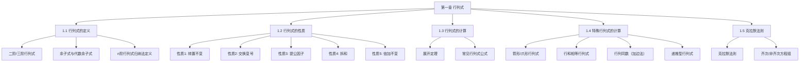

# 📑 行列式 - 知识索引

> [!info] 模块概述
> 本模块涵盖行列式的定义、性质、计算方法和克拉默法则，是线性代数的开篇基础。

## 📁 知识结构

## 📚 模块导航

| 模块 | 说明 | 重点程度 | 进度 |
|------|------|:--------:|------|
| [[1.1-行列式的定义]] | 二阶/三阶行列式、余子式、代数余子式、n阶定义 | ⭐⭐⭐⭐⭐ | 📝 笔记已生成 |
| [[1.2-行列式的性质]] | 五大性质（转置、交换、提公因子、拆和、倍加） | ⭐⭐⭐⭐⭐ | 📝 笔记已生成 |
| [[1.3-行列式的计算]] | 展开定理、常见行列式（对角/三角/范德蒙德） | ⭐⭐⭐⭐⭐ | 📝 笔记已生成 |
| [[1.4-特殊行列式的计算]] | 爪形、行和相等、加边法、递推法 | ⭐⭐⭐⭐ | 📝 笔记已生成 |
| [[1.5-克拉默法则]] | 克拉默法则解线性方程组 | ⭐⭐⭐⭐ | 📝 笔记已生成 |

## 🎯 考试要点

> [!important] 重中之重
> 1. **行列式的五大性质** - 化简计算的基石
> 2. **行列式展开定理** - 行列式计算的核心
> 3. **常见行列式公式** - 对角、三角、范德蒙德（必须牢记）
> 4. **行和相等行列式的处理** - 三步法（加列→提公因子→降阶）

> [!warning] 易错点
> 1. **副对角线行列式的符号**：$(-1)^{\frac{n(n-1)}{2}}$，切勿忘记！
> 2. **一阶行列式与绝对值的区别**：$|a_{11}| = a_{11}$（可能是负数）
> 3. **范德蒙德行列式的形式**：第一行必须全为 $1$

## 📝 笔记清单

### 1.1 行列式的定义 ✅ 已生成
- [[1.1-行列式的定义]]

### 1.2 行列式的性质 ✅ 已生成
- [[1.2-行列式的性质]]

### 1.3 行列式的计算（2个）✅ 已生成
- [[1.3-行列式的计算/1.3.1-行列式展开定理]]
- [[1.3-行列式的计算/1.3.2-常见行列式计算]] ⭐⭐⭐⭐⭐

### 1.4 特殊行列式的计算（5个）✅ 已生成
- [[1.4-特殊行列式的计算/1.4.1-箭形爪形行列式]]
- [[1.4-特殊行列式的计算/1.4.2-爪形行列式的变形]]
- [[1.4-特殊行列式的计算/1.4.3-行和相等行列式]] ⭐⭐⭐⭐
- [[1.4-特殊行列式的计算/1.4.4-行列同数行列式]] ⭐⭐⭐⭐
- [[1.4-特殊行列式的计算/1.4.5-递推型行列式]]

### 1.5 克拉默法则 ✅ 已生成
- [[1.5-克拉默法则]] ⭐⭐⭐⭐

## 🔗 相关链接

- 来源教材：`/Users/zhqznc/Documents/线性资料/线性代数基础/第一章：行列式/full.md`
- 配套习题：待补充
- 下一个模块：[[第二章 矩阵]]（待创建）
