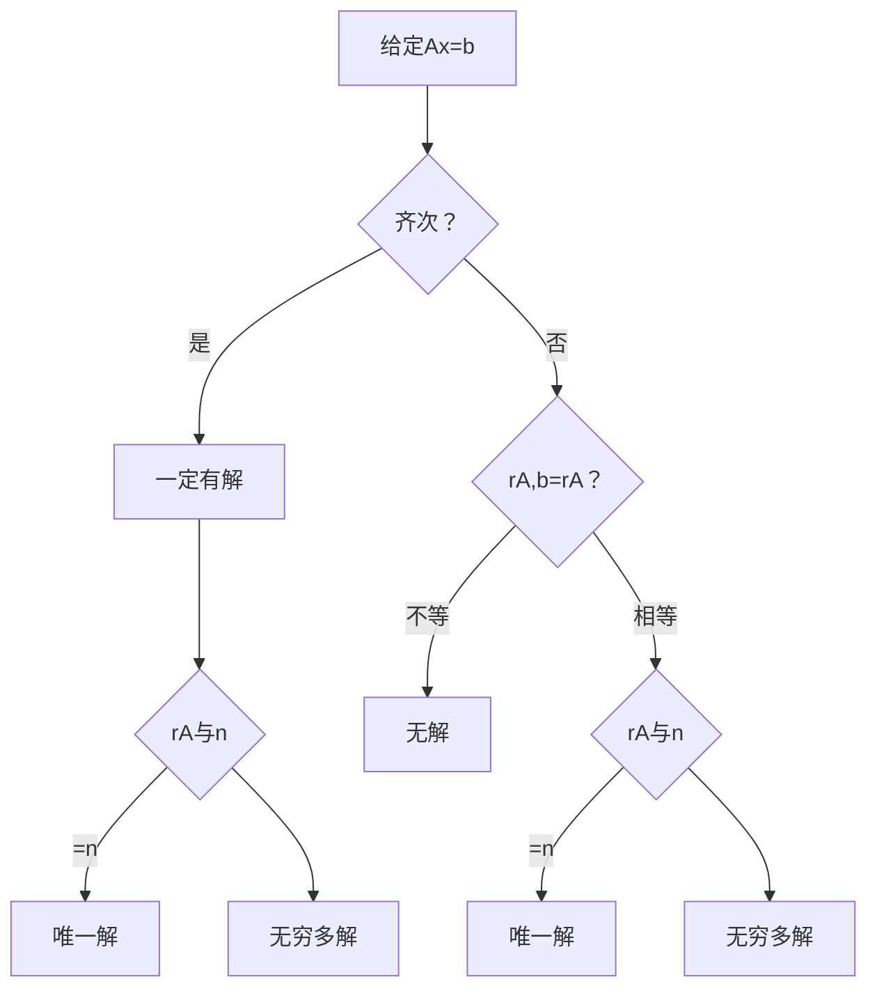

---
tags:
  - 线性代数
  - 线性方程组
  - 解的判定
created: 2026-05-01
updated: 2026-05-01
---

# 3.3 方程组解的判定

---

## 一、核心判定流程图 ⭐ （先看这张图，建立全局认知）



> [!tip] 记忆口诀
> **齐次看秩比 n，非齐次先看等不等，再看秩比 n**

---

## 二、判定定理速查表

### 2.1 齐次线性方程组 $A_{m \times n}\mathbf{x} = \mathbf{0}$

| 条件 | 结论 | 自由变量数 |
|:---:|:---:|:---:|
| $r(A) = n$ | **只有零解（唯一解）** | $0$ |
| $r(A) < n$ | **无穷多组非零解** | $n - r(A)$ |

> [!important] 齐次的两条铁律
> - **必有解**：至少零解（永远不出现"无解"）
> - **方程数 $m < n$**（未知数多于方程数）$\Rightarrow$ 必有 $r(A) \leq m < n$ $\Rightarrow$ **必有非零解**
> - **$A$ 为方阵时**：$|A| = 0 \iff r(A) < n \iff$ 有非零解

### 2.2 非齐次线性方程组 $A_{m \times n}\mathbf{x} = \mathbf{b}\; (\mathbf{b} \neq \mathbf{0})$

| $r(A,\mathbf{b})$ 与 $r(A)$ | $r(A)$ 与 $n$ | 结论 | 自由变量数 |
|:---:|:---:|:---:|:---:|
| $\neq$ | — | **无解** | — |
| $=$ | $= n$ | **唯一解** | $0$ |
| $=$ | $< n$ | **无穷多解** | $n - r(A)$ |

> [!important] 非齐次判定三步法
> 1. **先判有无解**：$r(A, \mathbf{b}) \stackrel{?}{=} r(A)$——不等则直接无解
> 2. **再判多少解**：相等时，$r(A) \stackrel{?}{=} n$——等于则唯一，小于则无穷多
> 3. **最后数自由变量**：$n - r(A)$ 个

### 2.3 齐次 vs 非齐次 判定逻辑对比

| 对比维度 | 齐次 $A\mathbf{x} = \mathbf{0}$ | 非齐次 $A\mathbf{x} = \mathbf{b}$ |
|:---:|:---|:---|
| 是否一定有解 | **是**（至少零解） | **不一定**（无解是常见情况） |
| 第一步判断 | $r(A)$ 与 $n$ 比较 | $r(A,\mathbf{b})$ 与 $r(A)$ 比较 |
| 唯一解条件 | $r(A) = n$ | $r(A,\mathbf{b}) = r(A) = n$ |
| 无穷多解条件 | $r(A) < n$ | $r(A,\mathbf{b}) = r(A) < n$ |

---

## 三、标准解题流程

### 3.1 通用五步法

> [!abstract] 行化简算法
> 1. 写出方程组的**增广矩阵**（齐次则只需系数矩阵）
> 2. 利用初等行变换化为**行阶梯形**，判断是否有解。无解则停止
> 3. 继续化为**行最简形**
> 4. 写出最简形矩阵对应的方程组
> 5. 将每个非零方程改写为用自由变量表示基本变量的形式

> [!tip] 解题技巧
> 并非一定要化成行最简矩阵才能求解，化到**行阶梯形进行赋值计算**亦可。

### 3.2 含参方程组的分类讨论模板

当方程组中含有参数时，按以下模板讨论：

```
Step 1: 化增广矩阵为行阶梯形
Step 2: 找出使主元位置出现零的行（即含参数的行）
Step 3: 按参数取值分类讨论：
  - 情况1：参数使主元非零 → 秩确定 → 直接判断
  - 情况2：参数使主元 = 0 → 需进一步化简，再判断
```

> [!warning] 含参题的易错点
> - 不要默认参数使 $r(A) = r(A, \mathbf{b})$，要分情况讨论
> - 先化简再代入，不要先代入再化简（会丢失信息）
> - 注意 $a$ 的取值是否使分母为零

---

## 四、核心要点总结（考前必看）

> [!summary] 一张表总结全部判定逻辑
> | 场景 | 判定条件 | 解的情况 |
> |:---|:---|:---:|
> | 齐次 | $r(A) = n$ | **唯一解**（零解） |
> | 齐次 | $r(A) < n$ | **无穷多解** |
> | 非齐次 | $r(A,\mathbf{b}) \neq r(A)$ | **无解** |
> | 非齐次 | $r(A,\mathbf{b}) = r(A) = n$ | **唯一解** |
> | 非齐次 | $r(A,\mathbf{b}) = r(A) < n$ | **无穷多解** |
>
> - **自由变量个数** = $n - r$（$r$ 为非零行数 = 主元个数）
> - 解的结构将在后续章节深入学习

## 五、易错清单与考场速记

> [!danger] 考场高频易错点
> 1. **非齐次唯一解的条件是双条件**：$r(A, \mathbf{b}) = r(A) = n$，缺一不可
> 2. **$r(A) = n$ 只保证齐次唯一解**，不保证非齐次有解
> 3. **含参题要先化简再分类**，默认代入具体值会丢失信息
> 4. **自由变量个数** = $n - r$，不是 $m - r$
> 5. **行满秩**（$r(A) = m$）保证非齐次有解，**列满秩**（$r(A) = n$）保证齐次唯一解

> [!summary] 考场速记卡片
> | 条件 | 结论 |
> |:---|:---|
> | $r(A) = n$（齐次） | 唯一解（零解） |
> | $r(A) < n$（齐次） | 无穷多解 |
> | $r(A, \mathbf{b}) \neq r(A)$ | 无解 |
> | $r(A, \mathbf{b}) = r(A) = n$ | 唯一解 |
> | $r(A, \mathbf{b}) = r(A) < n$ | 无穷多解 |
