---
tags:
  - 线性代数
  - 特征多项式
  - 特征方程
  - 矩阵相似理论
---

# 5.1.2 特征多项式与特征方程

> [!info] 前置知识
> 本节基于 [[5.1.1-特征值与特征向量的定义]]，请先理解定义式 $\boldsymbol{Ax} = \lambda \boldsymbol{x}$，否则本节推导无法衔接。

## 一、推导过程

由定义 $\boldsymbol{Ax} = \lambda \boldsymbol{x}$ 移项得：

$$
(\lambda \boldsymbol{E} - \boldsymbol{A})\boldsymbol{x} = \boldsymbol{0}
$$

这是一个含 $n$ 个方程、$n$ 个未知量的**齐次线性方程组**，其系数矩阵为 $\lambda \boldsymbol{E} - \boldsymbol{A}$。

> [!question] 关键问题
> $(\lambda \boldsymbol{E} - \boldsymbol{A})\boldsymbol{x} = \boldsymbol{0}$ 何时有非零解？——这正是本节要回答的核心。

## 二、核心结论

> [!abstract] 特征多项式与特征方程
> 齐次方程组 $(\lambda \boldsymbol{E} - \boldsymbol{A})\boldsymbol{x} = \boldsymbol{0}$ 有非零解的**充要条件**是系数矩阵**奇异**，即
>
> $$\det(\lambda \boldsymbol{E} - \boldsymbol{A}) = 0$$
>
> - **特征多项式**：$f(\lambda) = \lvert \lambda \boldsymbol{E} - \boldsymbol{A} \rvert$
> - **特征方程**：$f(\lambda) = \lvert \lambda \boldsymbol{E} - \boldsymbol{A} \rvert = 0$

> [!tip] 命名约定
> "$f(\lambda)$" 是行列式展开后关于 $\lambda$ 的多项式；"$f(\lambda) = 0$" 才是"特征方程"。二者一个是**式子**，一个是**等式**。

## 三、逻辑链条（记忆图）

```mermaid
flowchart LR
    A["定义式 Ax = λx"] --> B["移项得 (λE-A)x = 0"]
    B --> C["齐次线性方程组有非零解"]
    C --> D["&#124;λE-A&#124; = 0"]
    D --> E["求解特征方程得 λ"]
    E --> F["代入 (λE-A)x = 0 求特征向量"]
```

> [!example] 逻辑解读
> **从定义到求解**的完整链路：定义 → 移项 → 判非零解条件 → 列方程 → 解出 $\lambda$ → 回代求 $\boldsymbol{x}$。
> 抓住"齐次有非零解 ⇔ 行列式为 0"这一根主线，整章都串得起来。

## 四、关键理解

> [!success] 三个等价说法
> 以下三个表述**完全等价**：
>
> 1. $\lambda$ 是 $\boldsymbol{A}$ 的特征值
> 2. $(\lambda \boldsymbol{E} - \boldsymbol{A})\boldsymbol{x} = \boldsymbol{0}$ 有非零解
> 3. $\lvert \lambda \boldsymbol{E} - \boldsymbol{A} \rvert = 0$

- 特征向量是 $(\lambda \boldsymbol{E} - \boldsymbol{A})\boldsymbol{x} = \boldsymbol{0}$ 的**非零解**
- 特征值 $\lambda$ 使 $(\lambda \boldsymbol{E} - \boldsymbol{A})$ 成为**奇异矩阵**（行列式为 0）
- 求特征向量的本质：求解齐次线性方程组的非零解问题

## 五、典型例题

> [!quote] 例题
> 求矩阵 $\boldsymbol{A} = \begin{pmatrix} 1 & 2 \\ 2 & 1 \end{pmatrix}$ 的特征值与特征向量。

**解：**

**Step 1. 列特征方程**

$$
\lvert \lambda \boldsymbol{E} - \boldsymbol{A} \rvert = \begin{vmatrix} \lambda - 1 & -2 \\ -2 & \lambda - 1 \end{vmatrix} = (\lambda - 1)^2 - 4 = 0
$$

**Step 2. 求解 $\lambda$**

$$
\lambda^2 - 2\lambda - 3 = (\lambda - 3)(\lambda + 1) = 0
$$

得 $\lambda_1 = 3,\ \lambda_2 = -1$。

**Step 3. 对 $\lambda_1 = 3$ 求特征向量**

$$
(3\boldsymbol{E} - \boldsymbol{A})\boldsymbol{x} = \begin{pmatrix} 2 & -2 \\ -2 & 2 \end{pmatrix} \boldsymbol{x} = \boldsymbol{0}
$$

基础解系：$\boldsymbol{\xi}_1 = (1,\ 1)^T$，全部特征向量：$k_1 \boldsymbol{\xi}_1,\ k_1 \ne 0$

**Step 4. 对 $\lambda_2 = -1$ 求特征向量**

$$
(-\boldsymbol{E} - \boldsymbol{A})\boldsymbol{x} = \begin{pmatrix} -2 & -2 \\ -2 & -2 \end{pmatrix} \boldsymbol{x} = \boldsymbol{0}
$$

基础解系：$\boldsymbol{\xi}_2 = (1,\ -1)^T$，全部特征向量：$k_2 \boldsymbol{\xi}_2,\ k_2 \ne 0$

## 六、避坑提醒

> [!warning] 易错点
> - **符号写反**：写成 $\lvert \boldsymbol{A} - \lambda \boldsymbol{E} \rvert = 0$。结果数值相同，但**严格按定义**应写 $\lvert \lambda \boldsymbol{E} - \boldsymbol{A} \rvert = 0$，否则符号错位在后续相似对角化会引发 $\lvert \boldsymbol{P}^{-1}\boldsymbol{AP} - \lambda \boldsymbol{E} \rvert$ 等链式计算错误。
> - **加号误写**：系数矩阵写成 $\lambda \boldsymbol{E} + \boldsymbol{A}$，会使多项式整体变号。
> - **漏写 $k \ne 0$**：零向量不是特征向量，必须标注 $k$ 为任意**非零**常数。
> - **只写基础解系**：完整答案应写"全部特征向量 $k\boldsymbol{\xi}, k \ne 0$"，而非仅一个向量。
> - **漏掉重根讨论**：若 $\lambda$ 是 $k$ 重根，需对应 $k$ 个线性无关的特征向量（详见 [[5.2-矩阵的相似对角化]]）。

## 七、知识卡片

| 项目 | 内容 |
|------|------|
| **特征多项式** | $f(\lambda) = \lvert \lambda \boldsymbol{E} - \boldsymbol{A} \rvert$ |
| **特征方程** | $f(\lambda) = \lvert \lambda \boldsymbol{E} - \boldsymbol{A} \rvert = 0$ |
| **多项式次数** | $n$ 次（$\boldsymbol{A}$ 为 $n$ 阶矩阵）|
| **根的性质** | 在复数域恰有 $n$ 个根（按重数计） |
| **求特征值** | 解 $n$ 次方程 $f(\lambda) = 0$ |
| **求特征向量** | 解齐次方程组 $(\lambda \boldsymbol{E} - \boldsymbol{A})\boldsymbol{x} = \boldsymbol{0}$ 的非零解 |
| **核心充要条件** | 齐次有非零解 $\iff$ 系数行列式为 0 |

## 八、本节小结

> [!summary] 一句话总结
> **特征值** = 让齐次方程组 $(\lambda \boldsymbol{E} - \boldsymbol{A})\boldsymbol{x} = \boldsymbol{0}$ 有非零解的 $\lambda$；
> **特征向量** = 该方程组对应的非零解。
> 抓住"齐次方程组有非零解 $\iff$ 系数行列式为 0"这根主线，整章方法论都串得起来。

## 九、跳转链接

- 前置：[[5.1.1-特征值与特征向量的定义]]
- 后续：[[5.2-矩阵的相似对角化]] · [[5.3-实对称矩阵的相似对角化]]
