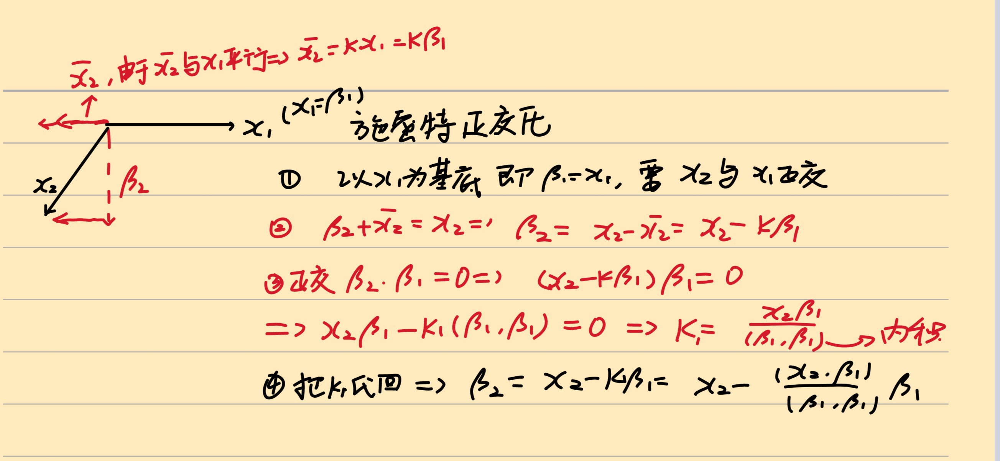

---
tags:
  - 线性代数
  - 实对称矩阵
  - 正交对角化
  - 施密特正交化
---

# 5.5.3 实对称矩阵正交对角化的一般步骤

## 求解步骤

### Step 1：求特征值

求出实对称矩阵 $\pmb{A}$ 的所有特征值 $\lambda_1, \lambda_2, \dots, \lambda_n$，其中互不相等的特征值为 $\lambda_{p1}, \lambda_{p2}, \dots, \lambda_{pr} \ (r \leq n)$。

### Step 2：求特征向量，正交化、单位化

求出每个齐次方程组 $(\lambda_{pi} \pmb{E} - \pmb{A})\pmb{x} = \pmb{0}$ 的基础解系，合并得到 $n$ 个线性无关的特征向量 $\pmb{x}_1, \pmb{x}_2, \dots, \pmb{x}_n$。

然后进行**正交化**和**单位化**，得到 $\pmb{\gamma}_1, \pmb{\gamma}_2, \dots, \pmb{\gamma}_n$。

> [!tip] 不同特征值的特征向量**已经正交**，只需对**相同特征值**对应的特征向量进行正交化。

### Step 3：构造正交矩阵

令

$$
\pmb{Q} = (\pmb{\gamma}_1, \pmb{\gamma}_2, \dots, \pmb{\gamma}_n), \quad
\pmb{\Lambda} = \begin{pmatrix}
\lambda_1 & & & \\
& \lambda_2 & & \\
& & \ddots & \\
& & & \lambda_n
\end{pmatrix}
$$

则 $\pmb{Q}^{\mathsf{T}}\pmb{A}\pmb{Q} = \pmb{\Lambda}$。

> [!warning] $\pmb{Q}$ 的每一列 $\pmb{\gamma}_j$ 的排序应与 $\pmb{\Lambda}$ 中对应的 $\lambda_j$ 的排序**相同**。

## 施密特正交化方法

给定一组线性无关但不正交的向量 $\pmb{x}_1, \pmb{x}_2, \pmb{x}_3$：

### 1）正交化

$$
\begin{aligned}
\pmb{\beta}_1 &= \pmb{x}_1 \\[4pt]
\pmb{\beta}_2 &= \pmb{x}_2 - \frac{(\pmb{x}_2, \pmb{\beta}_1)}{(\pmb{\beta}_1, \pmb{\beta}_1)} \pmb{\beta}_1 \\[4pt]
\pmb{\beta}_3 &= \pmb{x}_3 - \frac{(\pmb{x}_3, \pmb{\beta}_2)}{(\pmb{\beta}_2, \pmb{\beta}_2)} \pmb{\beta}_2 - \frac{(\pmb{x}_3, \pmb{\beta}_1)}{(\pmb{\beta}_1, \pmb{\beta}_1)} \pmb{\beta}_1
\end{aligned}
$$

> [!note]- 施密特正交化几何示意
> 
### 2）单位化

$$
\pmb{\gamma}_1 = \frac{1}{\|\pmb{\beta}_1\|}\pmb{\beta}_1, \quad
\pmb{\gamma}_2 = \frac{1}{\|\pmb{\beta}_2\|}\pmb{\beta}_2, \quad
\pmb{\gamma}_3 = \frac{1}{\|\pmb{\beta}_3\|}\pmb{\beta}_3
$$

## 与一般矩阵的对比

| 步骤 | 一般矩阵 | 实对称矩阵 |
|:---:|:---:|:---:|
| 求特征值 | 相同 | 相同 |
| 求特征向量 | 相同 | 相同 |
| 正交化、单位化 | 不需要 | **需要** |
| 变换矩阵 | 可逆矩阵 $\pmb{P}$ | 正交矩阵 $\pmb{Q}$ |
| 对角化结果 | $\pmb{P}^{-1}\pmb{A}\pmb{P} = \pmb{\Lambda}$ | $\pmb{Q}^{\mathsf{T}}\pmb{A}\pmb{Q} = \pmb{\Lambda}$ |
