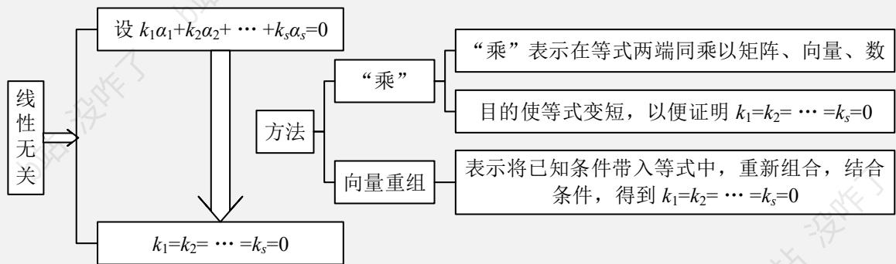

# 4.3.2 利用定义法判断线性相关/无关

> [!abstract] 核心思想
> 定义法是最基础、最重要的判断方法。核心思路：**从线性相关/无关的定义出发，建立关于系数 $k_1, k_2, \dots, k_s$ 的等式，分析这个等式的解**。

---

## 📌 方法原理

### 基本公式

设 $k_1 \boldsymbol{\alpha}_1 + k_2 \boldsymbol{\alpha}_2 + \dots + k_s \boldsymbol{\alpha}_s = \mathbf{0}$

### 判断标准

| 情况 | 条件 | 结论 |
|:---:|:---:|:---:|
| ✅ **线性无关** | 只有 $k_1 = k_2 = \cdots = k_s = 0$ 时等式成立 | 零向量的**唯一**表示方式是"所有系数都为零" |
| ❌ **线性相关** | 存在**不全为零**的 $k_1, k_2, \dots, k_s$ 使等式成立 | 零向量的表示方式**不唯一** |

---

## 🔑 方法步骤

> [!important] 标准解题流程
> 1. **设系数**：写出 $k_1 \boldsymbol{\alpha}_1 + k_2 \boldsymbol{\alpha}_2 + \dots + k_s \boldsymbol{\alpha}_s = \mathbf{0}$
> 2. **列方程组**：将向量代入坐标，得到关于 $k_1, k_2, \dots, k_s$ 的齐次线性方程组
> 3. **解方程组**：求解系数矩阵的秩
> 4. **判结论**：
>    - 若 $r(\boldsymbol{\alpha}_1, \boldsymbol{\alpha}_2, \dots, \boldsymbol{\alpha}_s) = s$（满秩），则**线性无关**
>    - 若 $r(\boldsymbol{\alpha}_1, \boldsymbol{\alpha}_2, \dots, \boldsymbol{\alpha}_s) < s$（不满秩），则**线性相关**

---

## 📝 典型例题

### 例1：判断三个三维向量的线性相关性

**题目**：判断 $\boldsymbol{\alpha}_1 = (1, 2, 1)^T, \boldsymbol{\alpha}_2 = (2, 5, 3)^T, \boldsymbol{\alpha}_3 = (1, 3, 2)^T$ 的线性相关性。

> [!example]- 解题过程
> **步骤1：设等式**
>
> $k_1 \begin{pmatrix} 1 \\ 2 \\ 1 \end{pmatrix} + k_2 \begin{pmatrix} 2 \\ 5 \\ 3 \end{pmatrix} + k_3 \begin{pmatrix} 1 \\ 3 \\ 2 \end{pmatrix} = \begin{pmatrix} 0 \\ 0 \\ 0 \end{pmatrix}$
>
> **步骤2：列方程组**
>
> $\begin{cases} k_1 + 2k_2 + k_3 = 0 \\ 2k_1 + 5k_2 + 3k_3 = 0 \\ k_1 + 3k_2 + 2k_3 = 0 \end{cases}$
>
> **步骤3：求解**
>
> 系数矩阵 $A = \begin{pmatrix} 1 & 2 & 1 \\ 2 & 5 & 3 \\ 1 & 3 & 2 \end{pmatrix}$
>
> $|A| = 1 \times (5 \times 2 - 3 \times 3) - 2 \times (2 \times 2 - 3 \times 1) + 1 \times (2 \times 3 - 5 \times 1) = 1 - 2 + 1 = 0$
>
> 因为 $|A| = 0$，所以 $r(A) < 3$，方程组有非零解。
>
> **结论**：$\boldsymbol{\alpha}_1, \boldsymbol{\alpha}_2, \boldsymbol{\alpha}_3$ **线性相关**。

---

### 例2：判断四个三维向量的线性相关性

**题目**：判断 $\boldsymbol{\alpha}_1 = (1, 0, 0)^T, \boldsymbol{\alpha}_2 = (1, 1, 0)^T, \boldsymbol{\alpha}_3 = (1, 1, 1)^T, \boldsymbol{\alpha}_4 = (2, 3, 4)^T$ 的线性相关性。

> [!example]- 解题过程
> **快捷判断**：4个3维向量必线性相关
>
> 由性质：若 $s > n$（向量个数 > 向量维数），则向量组**必定线性相关**。
>
> **结论**：$\boldsymbol{\alpha}_1, \boldsymbol{\alpha}_2, \boldsymbol{\alpha}_3, \boldsymbol{\alpha}_4$ **线性相关**。

---

## ⚠️ 易错点提醒

> [!warning] 常见错误
> 1. **混淆"方程组的解"与"向量组的性质"**
>    - 线性无关 → 只有零解
>    - 线性相关 → 有非零解
>
> 2. **忘记验证"不全为零"的条件**
>    - 不能只说"存在 $k_1, k_2, \dots, k_s$ 使等式成立"
>    - 必须存在**不全为零**的解
>
> 3. **计算行列式时出错**
>    - 细心计算，注意符号
>    - 特别是余子式的符号 $(-1)^{i+j}$

---

## 💡 关键结论速记

> [!tip] 重要性质
> - **$n$ 个 $n$ 维向量**：用行列式判断。$|A| \neq 0$ 无关，$|A| = 0$ 相关
> - **$s$ 个 $n$ 维向量（$s > n$）**：必定线性相关
> - **含零向量的向量组**：必定线性相关
> - **单个非零向量**：必定线性无关

---

## 🔗 相关知识点

- **4.3.1** [[4.3.1-线性相关与无关的定义]] - 基本概念
- **4.3.3** [[4.3.3-利用秩判断线性相关与无关]] - 秩的方法
- **4.4.1** [[4.4.1-极大线性无关组的定义与性质]] - 极大线性无关组

---

> [!summary] 本节核心
> **定义法**是判断线性相关/无关的基础方法：
> - 写出 $k_1 \boldsymbol{\alpha}_1 + k_2 \boldsymbol{\alpha}_2 + \dots + k_s \boldsymbol{\alpha}_s = \mathbf{0}$
> - 求解齐次线性方程组
> - 只有零解 → 无关；有非零解 → 相关
>
> 记住**快捷判断**：$s > n$ 时必相关！
