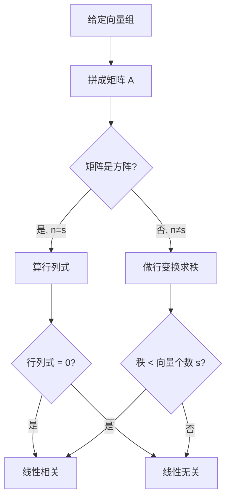

# 4.3.3 从方程组和秩的角度理解线性相关/无关

## 📌 一句话核心

> [!tip] 核心思想
> 向量组的线性相关性 → 等价于齐次线性方程组 $\boldsymbol{Ax} = \boldsymbol{0}$ 是否有非零解 → 等价于系数矩阵的秩 $r(\boldsymbol{A})$ 与向量个数 $s$ 的大小关系

---

## 🔍 概念拆解

### 第一步：向量组 → 矩阵

$n$ 维向量组 $\boldsymbol{\alpha}_1, \boldsymbol{\alpha}_2, \cdots, \boldsymbol{\alpha}_s$ 可以拼成一个矩阵：

$$
\boldsymbol{A} = \begin{bmatrix} \boldsymbol{\alpha}_1 & \boldsymbol{\alpha}_2 & \cdots & \boldsymbol{\alpha}_s \end{bmatrix}_{n \times s}
$$

### 第二步：线性组合 → 方程组

向量的线性组合写成方程组形式：

$$
x_1 \boldsymbol{\alpha}_1 + x_2 \boldsymbol{\alpha}_2 + \cdots + x_s \boldsymbol{\alpha}_s = \boldsymbol{0} \quad \Longleftrightarrow \quad \boldsymbol{Ax} = \boldsymbol{0}
$$

其中 $\boldsymbol{x} = (x_1, x_2, \cdots, x_s)^{\mathrm{T}}$ 是未知系数向量。

---

## 📐 核心定理（秩判据）

> [!important] 秩判据定理
> 对于 $n$ 维向量组 $\boldsymbol{\alpha}_1, \boldsymbol{\alpha}_2, \cdots, \boldsymbol{\alpha}_s$，构造矩阵 $\boldsymbol{A} = \begin{bmatrix} \boldsymbol{\alpha}_1 & \boldsymbol{\alpha}_2 & \cdots & \boldsymbol{\alpha}_s \end{bmatrix}$，则：
>
> | 相关性 | 秩的条件 | 几何直觉 |
> |:------:|:--------:|:--------:|
> | **线性相关** | $r(\boldsymbol{A}) < s$ | 向量组中有"冗余"，存在多余向量 |
> | **线性无关** | $r(\boldsymbol{A}) = s$ | 向量组中每个向量都"不可替代" |

---

## 🎯 重要推论

> [!note] 推论 1：方阵情况（$n = s$）
> 当向量个数等于向量维数时，向量组构成方阵 $\boldsymbol{A}_{n \times n}$，此时：
>
> $$
> \begin{aligned}
> \text{线性相关} &\Leftrightarrow |\boldsymbol{A}| = 0 \quad (\text{行列式为零，方阵奇异}) \\
> \text{线性无关} &\Leftrightarrow |\boldsymbol{A}| \neq 0 \quad (\text{行列式非零，方阵可逆})
> \end{aligned}
> $$

> [!warning] 推论 2：个数大于维数（$s > n$）
> **必线性相关！**
>
> 例：5 个 3 维向量 → 必然线性相关（"多必相关"）
>
> 直觉：方程组 $\boldsymbol{Ax} = \boldsymbol{0}$ 中，未知数个数 $s$ 大于方程个数 $n$，必有自由变量 → 必有非零解

---

## 🧠 转化关系图

```
向量组线性相关性
        ↓
  齐次方程组 Ax=0
        ↓
  有非零解？ ←————————————┐
        ↓                  │
   秩的比较            增广矩阵
   r(A) vs s           [A|0]
        ↓                  ↓
  r(A) < s → 相关     r(A) = r([A|0]) → 有解
  r(A) = s → 无关     r(A) < r([A|0]) → 无解（不可能）
```

---

## ✅ 考试快速判断流程



---

## 📝 常见误区

> [!danger] 易错点
> 1. **混淆向量个数与维数**：$r(\boldsymbol{A}) < s$（个数），不是 $r(\boldsymbol{A}) < n$（维数）
> 2. **方阵情况**：$|\boldsymbol{A}| = 0$ 只能判断方阵的列向量组，不能直接判断非方阵
> 3. **零向量**：包含零向量的向量组**必线性相关**（这是秩判据的特例）

---

## 🔗 关联知识

| 相关概念 | 关联说明 |
|:--------:|:--------:|
| [[4.3.1-线性相关与线性无关]] | 基础定义 |
| [[4.3.2-线性表示]] | 线性表示与线性相关的联系 |
| [[4.4-极大线性无关组]] | 秩判据的直接应用 |
| [[3.3-矩阵的秩]] | 秩的性质与计算 |
