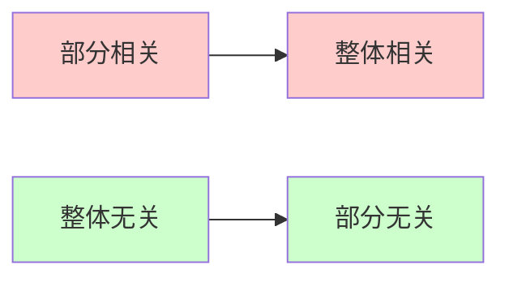

# 4.3.6 判断线性相关性的常用结论

> [!abstract] 本节核心
> 共8个常用结论，掌握这些结论可以快速判断向量组的线性相关性，是考研选择题和填空题的高频考点。

---

## 结论1️⃣ 自身表出

> [!important] 核心逻辑
> **线性相关** $\Leftrightarrow$ 至少有一个向量能由其他向量线性表出
>
> **线性无关** $\Leftrightarrow$ 任何一个向量都不能由其余 $s-1$ 个向量线性表示

| 向量组性质 | 判断条件 |
|:--------:|:------:|
| **线性相关** | $\exists \alpha_i$ 可由其他向量表出 |
| **线性无关** | $\forall \alpha_i$ 都不能由其他向量表出 |

---

## 结论2️⃣ 零向量与成比例

> [!warning] 特殊情况速记
> - 包含**零向量**的向量组 → **线性相关**
> - 单个**非零向量** → **线性无关**
> - 两个向量**成比例** → **线性相关**
> - 两个向量**不成比例** → **线性无关**

| 情况 | 相关性 | 记忆口诀 |
|:---:|:----:|:------:|
| 含零向量 | 相关 | "有零必相关" |
| 单个非零 | 无关 | "独苗无关" |
| 两向量成比例 | 相关 | "成比必相关" |
| 两向量不成比例 | 无关 | "不成比则无关" |

---

## 结论3️⃣ 行列式判据

> [!tip] 适用条件
> 仅适用于 **$n$ 个 $n$ 维向量**（向量个数 = 向量维数）

设向量组 $\boldsymbol{\alpha}_1, \boldsymbol{\alpha}_2, \cdots, \boldsymbol{\alpha}_n$ 构成矩阵 $A = (\boldsymbol{\alpha}_1, \boldsymbol{\alpha}_2, \cdots, \boldsymbol{\alpha}_n)$：

| 行列式值 | 相关性 |
|:-------:|:----:|
| $\lvert A \rvert = 0$ | **线性相关** |
| $\lvert A \rvert \neq 0$ | **线性无关** |

> [!danger] 重要推论
> 当向量个数 > 向量维数时，向量组**必线性相关**

---

## 结论4️⃣ 部分与整体

> [!quote] 记忆口诀
> **"部分相关 $\Rightarrow$ 整体相关；整体无关 $\Rightarrow$ 部分无关"**

| 条件 | 结论 |
|:---:|:---:|
| 某个部分组**线性相关** | 整个向量组**线性相关** |
| 整个向量组**线性无关** | 任一部分组**线性无关** |

---

## 结论5️⃣ 延长与缩短

> [!quote] 记忆口诀
> **"原相关 $\Rightarrow$ 缩短相关，原无关 $\Rightarrow$ 延长无关"**

将 $n$ 维向量组各向量添上 $m$ 个分量变成 $n+m$ 维向量组：

| 原始状态 | 操作 | 结果 |
|:-------:|:---:|:---:|
| **相关** | 缩短 | **相关** |
| **无关** | 延长 | **无关** |

> [!note] 易错点
> 反过来**不一定成立**！
> - 延长组相关 $\nRightarrow$ 原组相关
> - 缩短组无关 $\nRightarrow$ 原组无关

---

## 结论6️⃣ 重排分量

> [!important] 核心结论
> 对向量组各分量顺序进行重排，**不改变**线性相关性

设 $\boldsymbol{\alpha}_1', \boldsymbol{\alpha}_2', \cdots, \boldsymbol{\alpha}_s'$ 是对 $\boldsymbol{\alpha}_1, \boldsymbol{\alpha}_2, \cdots, \boldsymbol{\alpha}_s$ 各分量重排后的向量组，则：

$$\text{原向量组与新向量组有}\textbf{相同的线性相关性}$$

> [!tip] 拓展应用
> - **初等行变换**不改变**列向量组**的线性相关性
> - **初等列变换**不改变**行向量组**的线性相关性

---

## 结论7️⃣ 唯一表示

> [!important] 唯一性定理
> 若 $\boldsymbol{\beta}_1, \boldsymbol{\beta}_2, \cdots, \boldsymbol{\beta}_s$ **线性无关**
>
> 且 $\boldsymbol{\beta}_1, \boldsymbol{\beta}_2, \cdots, \boldsymbol{\beta}_s, \boldsymbol{\alpha}$ **线性相关**
>
> 则 $\boldsymbol{\alpha}$ 能由 $\boldsymbol{\beta}_1, \boldsymbol{\beta}_2, \cdots, \boldsymbol{\beta}_s$ 线性表示，且表示式**唯一**

---

## 结论8️⃣ 以少表多

> [!quote] 记忆口诀
> **"以少表多，多必相关"**

设向量组 $\boldsymbol{\beta}_1, \boldsymbol{\beta}_2, \cdots, \boldsymbol{\beta}_t$ 可由 $\boldsymbol{\alpha}_1, \boldsymbol{\alpha}_2, \cdots, \boldsymbol{\alpha}_s$ 线性表示：

| 条件 | 结论 |
|:---:|:---:|
| $t > s$（个数更多） | $\boldsymbol{\beta}$ 组**线性相关** |
| $\boldsymbol{\beta}$ 组**线性无关** | $t \leqslant s$（个数更少或相等） |

> [!danger] 等价命题（重要！）
> 如果 $\boldsymbol{\beta}$ 组可由 $\boldsymbol{\alpha}$ 组表示，且 $\boldsymbol{\beta}$ 组**线性无关**，则：
> $$t \leqslant s$$

---

## 📋 结论速查表

| 编号 | 结论名称 | 核心内容 | 记忆口诀 |
|:---:|:------:|:------:|:------:|
| 1 | 自身表出 | 相关⇔可表出 | - |
| 2 | 零向量与成比例 | 含零必相关 | 有零必相关 |
| 3 | 行列式判据 | $\lvert A\rvert=0$相关 | - |
| 4 | 部分与整体 | 部分相关⇒整体相关 | 部分推整体 |
| 5 | 延长与缩短 | 无关⇒延长无关 | 无关可延长 |
| 6 | 重排分量 | 不改变相关性 | 换序不变性 |
| 7 | 唯一表示 | 无关+相关⇒唯一 | - |
| 8 | 以少表多 | 多必相关 | 以少表多多必关 |

---

## 个人笔记
