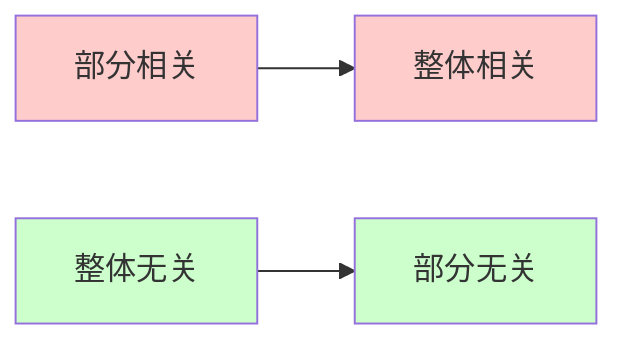

# 4.3.6 判断线性相关性的常用结论

> [!abstract] 本节核心
> 共8个常用结论，掌握这些结论可以快速判断向量组的线性相关性，是考研选择题和填空题的高频考点。

---

## 结论1️⃣ 自身表出

> [!important] 核心逻辑
> （1）**线性相关** $\Leftrightarrow$ 至少有一个向量能由其他向量线性表出
>
> （2） **线性无关** $\Leftrightarrow$ 任何一个向量都不能由其余 $s-1$ 个向量线性表示

| 向量组性质 | 判断条件 |
|:--------:|:------:|
| **线性相关** | $\exists \alpha_i$ 可由其他向量表出 |
| **线性无关** | $\forall \alpha_i$ 都不能由其他向量表出 |
> [!info] 与(1)的关系
> (2)是(1)的**逆否命题**，证明了(1)也就证明了(2)。
>
> (1)说：线性相关 $\Leftrightarrow$ 至少有一个向量能由其他向量表出
>
> 逆否命题：**不能**由其他向量表出 $\Rightarrow$ 线性无关

> [!note] 📝 详细证明过程
> 对(1)进行双向证明（充要条件证明）
>
> **【$\Rightarrow$ 必要性证明】**：已知线性相关，证明能被线性表出
>
> 根据向量组线性相关的定义，必然存在不全为零的一组实数 $k_1, k_2, \dots, k_s$，使得：
> $$k_1\boldsymbol{\alpha}_1 + k_2\boldsymbol{\alpha}_2 + \dots + k_s\boldsymbol{\alpha}_s = \boldsymbol{0}$$
>
> 因为系数不全为零，我们不妨设其中第 $i$ 个系数 $k_i \neq 0$。将除了 $k_i\boldsymbol{\alpha}_i$ 之外的所有项移到等号右边：
> $$k_i\boldsymbol{\alpha}_i = -k_1\boldsymbol{\alpha}_1 - \dots - k_{i-1}\boldsymbol{\alpha}_{i-1} - k_{i+1}\boldsymbol{\alpha}_{i+1} - \dots - k_s\boldsymbol{\alpha}_s$$
>
> 因为 $k_i \neq 0$，两边同除以 $k_i$：
> $$\boldsymbol{\alpha}_i = -\frac{k_1}{k_i}\boldsymbol{\alpha}_1 - \dots - \frac{k_{i-1}}{k_i}\boldsymbol{\alpha}_{i-1} - \frac{k_{i+1}}{k_i}\boldsymbol{\alpha}_{i+1} - \dots - \frac{k_s}{k_i}\boldsymbol{\alpha}_s$$
>
> 这就证明了，向量 $\boldsymbol{\alpha}_i$ 可以由其余的 $s-1$ 个向量线性表出。
>
> ---
>
> **【$\Leftarrow$ 充分性证明】**：已知能被线性表出，证明线性相关
>
> 不妨设向量组中的某一个向量 $\boldsymbol{\alpha}_j$，能够由其余的 $s-1$ 个向量线性表出。即存在一组实数 $l_1, \dots, l_{j-1}, l_{j+1}, \dots, l_s$，使得：
> $$\boldsymbol{\alpha}_j = l_1\boldsymbol{\alpha}_1 + \dots + l_{j-1}\boldsymbol{\alpha}_{j-1} + l_{j+1}\boldsymbol{\alpha}_{j+1} + \dots + l_s\boldsymbol{\alpha}_s$$
>
> 将等号左边的 $\boldsymbol{\alpha}_j$ 移到等号右边，构造出一个等于 $\boldsymbol{0}$ 的线性组合：
> $$\boldsymbol{0} = l_1\boldsymbol{\alpha}_1 + \dots + l_{j-1}\boldsymbol{\alpha}_{j-1} - \boldsymbol{\alpha}_j + l_{j+1}\boldsymbol{\alpha}_{j+1} + \dots + l_s\boldsymbol{\alpha}_s$$
>
> 观察这个等式，向量 $\boldsymbol{\alpha}_j$ 前面的系数是 $-1$。这意味着，在凑出零向量的这组系数 $(l_1, \dots, l_{j-1}, -1, l_{j+1}, \dots, l_s)$ 中，至少存在一个非零系数（即 $-1 \neq 0$）。
>
> 根据定义，只要存在不全为零的系数使得线性组合为零，该向量组就是线性相关。

> [!tip] 💡 核心洞察与实战意义
> 这个定理在解题中为什么重要？因为它打破了原本定义的"对称性"：
>
> - **定义的视角（齐次方程组）**：$k_1\boldsymbol{\alpha}_1 + k_2\boldsymbol{\alpha}_2 + \dots = \boldsymbol{0}$，在这个等式里，所有向量的地位是**平等的**
> - **表出的视角（非齐次方程组）**：$\boldsymbol{\alpha}_j = l_1\boldsymbol{\alpha}_1 + \dots$，在这个等式里，地位是**不平等的**
>
> 它清晰地指出了 $\boldsymbol{\alpha}_j$ 是那个"多余的、可以被替代"的**冗余向量**。

---

## 结论2️⃣ 零向量与成比例

> [!warning] 特殊情况速记
> - 包含**零向量**的向量组 → **线性相关**
> - 单个**非零向量** → **线性无关**
> - 两个向量**成比例** → **线性相关**
> - 两个向量**不成比例** → **线性无关**

| 情况 | 相关性 | 记忆口诀 |
|:---:|:----:|:------:|
| 含零向量 | 相关 | "有零必相关" |
| 单个非零 | 无关 | "独苗无关" |
| 两向量成比例 | 相关 | "成比必相关" |
| 两向量不成比例 | 无关 | "不成比则无关" |

---

## 结论3️⃣ 行列式判据

> [!tip] 适用条件
> 仅适用于 **$n$ 个 $n$ 维向量**（向量个数 = 向量维数）

设向量组 $\boldsymbol{\alpha}_1, \boldsymbol{\alpha}_2, \cdots, \boldsymbol{\alpha}_n$ 构成矩阵 $A = (\boldsymbol{\alpha}_1, \boldsymbol{\alpha}_2, \cdots, \boldsymbol{\alpha}_n)$：

| 行列式值 | 相关性 |
|:-------:|:----:|
| $\lvert A \rvert = 0$ | **线性相关** |
| $\lvert A \rvert \neq 0$ | **线性无关** |

> [!danger] 重要推论
> 当向量个数 > 向量维数时，向量组**必线性相关**

---

## 结论4️⃣ 部分与整体

> [!quote] 记忆口诀
> **"部分相关 $\Rightarrow$ 整体相关；整体无关 $\Rightarrow$ 部分无关"**

| 条件 | 结论 |
|:---:|:---:|
| 某个部分组**线性相关** | 整个向量组**线性相关** |
| 整个向量组**线性无关** | 任一部分组**线性无关** |

> [!info] 与结论(1)的关系
> (2)是(1)的**逆否命题**，在逻辑上完全等价，证明了(1)也就证明了(2)。

> [!note] 📝 详细证明过程（双视角验证）
> 以证明"前 $i$ 个向量 $\boldsymbol{\alpha}_1, \dots, \boldsymbol{\alpha}_i$ 线性相关 $\Rightarrow$ 整体 $\boldsymbol{\alpha}_1, \dots, \boldsymbol{\alpha}_s$ 线性相关"为例
>
> **【视角一】定义法 —— "补零法"**
>
> 思路：既然前面的向量已经能凑出 $\boldsymbol{0}$，那后面的向量全给 $0$ 权重即可。
>
> 已知部分向量组 $\boldsymbol{\alpha}_1, \boldsymbol{\alpha}_2, \dots, \boldsymbol{\alpha}_i$ 线性相关，根据定义，存在不全为 $0$ 的常数 $k_1, k_2, \dots, k_i$，使得：
> $$k_1\boldsymbol{\alpha}_1 + k_2\boldsymbol{\alpha}_2 + \dots + k_i\boldsymbol{\alpha}_i = \boldsymbol{0}$$
>
> 现在把后面的向量强行加上去，配上系数 $0$：
> $$k_1\boldsymbol{\alpha}_1 + k_2\boldsymbol{\alpha}_2 + \dots + k_i\boldsymbol{\alpha}_i + \mathbf{0}\boldsymbol{\alpha}_{i+1} + \dots + \mathbf{0}\boldsymbol{\alpha}_s = \boldsymbol{0}$$
>
> 观察这组系数 $(k_1, k_2, \dots, k_i, 0, \dots, 0)$：因为前半部分的 $k_1 \dots k_i$ 中已经包含了非零数，所以这整排系数**不全为 0**。
>
> 满足线性相关定义，故整体向量组线性相关。
>
> ---
>
> **【视角二】矩阵秩法 —— "秩的次可加性"**
>
> 思路：利用分块矩阵秩的不等式 $r(A, B) \leqslant r(A) + r(B)$ 进行放缩。
>
> 已知部分向量组线性相关，意味着：
> $$r(\boldsymbol{\alpha}_1, \dots, \boldsymbol{\alpha}_i) < i$$
>
> 考察整体向量组，根据分块矩阵秩的性质：
> $$r(\boldsymbol{\alpha}_1, \dots, \boldsymbol{\alpha}_s) \leqslant r(\boldsymbol{\alpha}_1, \dots, \boldsymbol{\alpha}_i) + r(\boldsymbol{\alpha}_{i+1}, \dots, \boldsymbol{\alpha}_s)$$
>
> 后半部分共有 $s-i$ 个向量，它的秩 $r(\boldsymbol{\alpha}_{i+1}, \dots, \boldsymbol{\alpha}_s) \leqslant s-i$。将这两个条件代入：
> $$r(\boldsymbol{\alpha}_1, \dots, \boldsymbol{\alpha}_s) < i + (s - i) = s$$
>
> 整体矩阵的秩严格小于列数 $s$，矩阵降秩，故整体向量组线性相关。

---

## 结论5️⃣ 延长与缩短

> [!quote] 记忆口诀
> **"原相关 $\Rightarrow$ 缩短相关，原无关 $\Rightarrow$ 延长无关"**

将 $n$ 维向量组各向量添上 $m$ 个分量变成 $n+m$ 维向量组：

| 原始状态 | 操作 | 结果 |
|:-------:|:---:|:---:|
| **相关** | 缩短 | **相关** |
| **无关** | 延长 | **无关** |

> [!note] 易错点
> 反过来**不一定成立**！
> - 延长组相关 $\nRightarrow$ 原组相关
> - 缩短组无关 $\nRightarrow$ 原组无关

---

## 结论6️⃣ 重排分量

> [!important] 核心结论
> 对向量组各分量顺序进行重排，**不改变**线性相关性

设 $\boldsymbol{\alpha}_1', \boldsymbol{\alpha}_2', \cdots, \boldsymbol{\alpha}_s'$ 是对 $\boldsymbol{\alpha}_1, \boldsymbol{\alpha}_2, \cdots, \boldsymbol{\alpha}_s$ 各分量重排后的向量组，则：

$$\text{原向量组与新向量组有}\textbf{相同的线性相关性}$$

> [!tip] 拓展应用
> - **初等行变换**不改变**列向量组**的线性相关性
> - **初等列变换**不改变**行向量组**的线性相关性

---

## 结论7️⃣ 唯一表示

> [!important] 唯一性定理
> 若 $\boldsymbol{\beta}_1, \boldsymbol{\beta}_2, \cdots, \boldsymbol{\beta}_s$ **线性无关**
>
> 且 $\boldsymbol{\beta}_1, \boldsymbol{\beta}_2, \cdots, \boldsymbol{\beta}_s, \boldsymbol{\alpha}$ **线性相关**
>
> 则 $\boldsymbol{\alpha}$ 能由 $\boldsymbol{\beta}_1, \boldsymbol{\beta}_2, \cdots, \boldsymbol{\beta}_s$ 线性表示，且表示式**唯一**

---

## 结论8️⃣ 以少表多

> [!quote] 记忆口诀
> **"以少表多，多必相关"**

设向量组 $\boldsymbol{\beta}_1, \boldsymbol{\beta}_2, \cdots, \boldsymbol{\beta}_t$ 可由 $\boldsymbol{\alpha}_1, \boldsymbol{\alpha}_2, \cdots, \boldsymbol{\alpha}_s$ 线性表示：

| 条件 | 结论 |
|:---:|:---:|
| $t > s$（个数更多） | $\boldsymbol{\beta}$ 组**线性相关** |
| $\boldsymbol{\beta}$ 组**线性无关** | $t \leqslant s$（个数更少或相等） |

> [!danger] 等价命题（重要！）
> 如果 $\boldsymbol{\beta}$ 组可由 $\boldsymbol{\alpha}$ 组表示，且 $\boldsymbol{\beta}$ 组**线性无关**，则：
> $$t \leqslant s$$

---

## 📋 结论速查表

| 编号 | 结论名称 | 核心内容 | 记忆口诀 |
|:---:|:------:|:------:|:------:|
| 1 | 自身表出 | 相关⇔可表出 | - |
| 2 | 零向量与成比例 | 含零必相关 | 有零必相关 |
| 3 | 行列式判据 | $\lvert A\rvert=0$相关 | - |
| 4 | 部分与整体 | 部分相关⇒整体相关 | 部分推整体 |
| 5 | 延长与缩短 | 无关⇒延长无关 | 无关可延长 |
| 6 | 重排分量 | 不改变相关性 | 换序不变性 |
| 7 | 唯一表示 | 无关+相关⇒唯一 | - |
| 8 | 以少表多 | 多必相关 | 以少表多多必关 |

---

## 个人笔记
