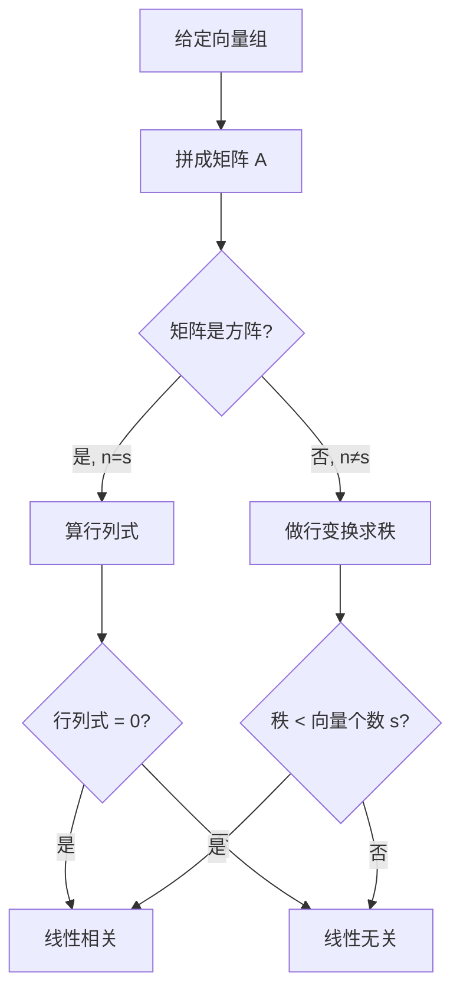

# 4.3 线性相关、线性无关与线性表示 · 章节总结

> [!abstract] 章节概览
> 本节是向量理论的核心，主要解决三个问题：**什么是线性相关/无关**、**如何判断线性相关性**、**如何理解线性表示**。

---

## 一、核心概念

### 1.1 线性相关

> [!important] 定义
> 如果有**不全为零**的数 $k_1, k_2, \cdots, k_s$，使
> $$k_1 \boldsymbol{\alpha}_1 + k_2 \boldsymbol{\alpha}_2 + \dots + k_s \boldsymbol{\alpha}_s = \boldsymbol{0}$$
> 则称向量组 $\boldsymbol{\alpha}_1, \boldsymbol{\alpha}_2, \cdots, \boldsymbol{\alpha}_s$ **线性相关**。

### 1.2 线性无关

> [!important] 定义
> 如果只有在 $k_1 = k_2 = \cdots = k_s = 0$ 时上式才成立，则称向量组 $\boldsymbol{\alpha}_1, \boldsymbol{\alpha}_2, \cdots, \boldsymbol{\alpha}_s$ **线性无关**。

> [!tip] 两者关系
> 向量组要么线性相关，要么线性无关，**两者必取其一**。

### 1.3 线性组合与线性表示

| 概念 | 定义 | 视角 |
|:---:|:---:|:---:|
| **线性组合** | $k_1 \boldsymbol{\alpha}_1 + k_2 \boldsymbol{\alpha}_2 + \cdots + k_s \boldsymbol{\alpha}_s$ | 构造者 |
| **线性表示** | $\boldsymbol{\beta}$ 能写成向量组的线性组合 | 判断者 |

---

## 二、判断线性相关性的方法

### 2.1 定义法（基础方法）

> [!check] 标准解题流程
> 1. 设等式：$k_1 \boldsymbol{\alpha}_1 + k_2 \boldsymbol{\alpha}_2 + \dots + k_s \boldsymbol{\alpha}_s = \boldsymbol{0}$
> 2. 列方程组：得到关于 $k_1, k_2, \dots, k_s$ 的齐次线性方程组
> 3. 求解：计算系数矩阵的秩
> 4. 判结论：
>    - $r(\boldsymbol{\alpha}_1, \boldsymbol{\alpha}_2, \dots, \boldsymbol{\alpha}_s) = s$（满秩）→ **线性无关**
>    - $r(\boldsymbol{\alpha}_1, \boldsymbol{\alpha}_2, \dots, \boldsymbol{\alpha}_s) < s$（不满秩）→ **线性相关**

### 2.2 秩判据（核心定理）

> [!important] 秩判据定理
> 构造矩阵 $\boldsymbol{A} = \begin{bmatrix} \boldsymbol{\alpha}_1 & \boldsymbol{\alpha}_2 & \cdots & \boldsymbol{\alpha}_s \end{bmatrix}$，则：
>
> | 相关性 | 秩的条件 | 几何直觉 |
> |:------:|:--------:|:--------:|
> | **线性相关** | $r(\boldsymbol{A}) < s$ | 向量组中有"冗余" |
> | **线性无关** | $r(\boldsymbol{A}) = s$ | 每个向量都"不可替代" |

### 2.3 行列式判据（仅限方阵）

> [!note] 适用条件
> 仅适用于 **$n$ 个 $n$ 维向量**（向量个数 = 向量维数）
>
> | 行列式值 | 相关性 |
> |:-------:|:----:|
> | $\lvert A \rvert = 0$ | **线性相关** |
> | $\lvert A \rvert \neq 0$ | **线性无关** |

---

## 三、线性表示的等价条件

### 3.1 单个向量的线性表示

$$
\begin{aligned}
\boldsymbol{\beta} \text{ 能由 } \boldsymbol{\alpha}_1, \dots, \boldsymbol{\alpha}_s \text{ 线性表示}
&\Leftrightarrow r(\boldsymbol{\alpha}_1, \dots, \boldsymbol{\alpha}_s) = r(\boldsymbol{\alpha}_1, \dots, \boldsymbol{\alpha}_s, \boldsymbol{\beta})
\end{aligned}
$$

> [!tip] 记忆口诀
> **"系数矩阵秩 = 增广矩阵秩 ⟺ 有解"**

### 3.2 向量组之间的线性表示

向量组 $\mathcal{B}$ 可由向量组 $\mathcal{A}$ 线性表示 $\Leftrightarrow r(\mathcal{A}) = r(\mathcal{A}, \mathcal{B})$

### 3.3 秩不等式（重要推论）

> [!important] 核心结论
> 如果向量组 $\mathcal{B}$ 可由向量组 $\mathcal{A}$ 线性表示，则
> $$r(\mathcal{B}) \leqslant r(\mathcal{A})$$
>
> **本质理解**："被表示的向量组的秩 ≤ 表示者的秩"

---

## 四、8个常用结论（速查表）

| 编号 | 结论名称 | 核心内容 | 记忆口诀 |
|:---:|:------:|:------:|:------:|
| 1 | **自身表出** | 线性相关 $\Leftrightarrow$ 至少有一个向量能被其他向量线性表出 | - |
| 2 | **零向量与成比例** | 含零向量必相关；单个非零向量无关；两向量成比例则相关 | 有零必相关 |
| 3 | **行列式判据** | $\lvert A\rvert=0$ 相关，$\lvert A\rvert\neq 0$ 无关（仅限方阵） | - |
| 4 | **部分与整体** | 部分相关 $\Rightarrow$ 整体相关；整体无关 $\Rightarrow$ 部分无关 | 部分推整体 |
| 5 | **延长与缩短** | 原相关 $\Rightarrow$ 缩短相关；原无关 $\Rightarrow$ 延长无关 | 无关可延长 |
| 6 | **重排分量** | 重排不改变线性相关性 | 换序不变性 |
| 7 | **唯一表示** | 无关+相关 $\Rightarrow$ 唯一表示 | - |
| 8 | **以少表多** | 以少表多，多必相关 | 以少表多多必关 |

---

## 五、快速判断流程

---

## 六、易错点汇总

> [!warning] 常见错误
> 1. **混淆向量个数与维数**：$r(\boldsymbol{A}) < s$（个数），不是 $r(\boldsymbol{A}) < n$（维数）
> 2. **忘记验证"不全为零"**：不能只说"存在 $k_1, k_2, \dots, k_s$ 使等式成立"，必须**不全为零**
> 3. **行列式仅适用于方阵**：非方阵不能用行列式判断
> 4. **含零向量必相关**：包含零向量的向量组**必线性相关**
> 5. **结论5的逆命题不成立**：延长组相关不能推出原组相关

---

## 七、关联知识

| 相关概念 | 关联说明 |
|:--------:|:--------:|
| [[3.3-方程组解的判定]] | 秩判据的理论基础 |
| [[4.4-极大线性无关组]] | 秩判据的直接应用 |
| [[2.10-矩阵的秩]] | 秩的性质与计算 |

---

> [!personal] 学习心得
> *(请在学习后补充)*
