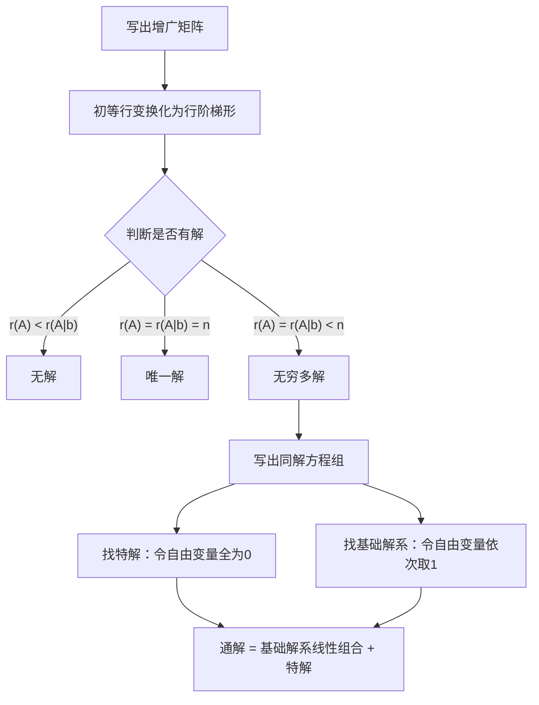

# 4.6 基础解系与解的结构 - 章节总结

---

## 📌 核心概念速查

| 概念 | 定义 | 关键公式 |
|:---:|:---:|:---:|
| **基础解系** | 齐次方程组解向量组的极大线性无关组 | 个数 $= n - r(A)$ |
| **导出组** | 非齐次方程组 $\pmb{Ax=b}$ 对应的齐次方程组 $\pmb{Ax=0}$ | - |
| **特解** | 非齐次方程组的一个具体解 | 令自由变量全为0求得 |
| **通解** | 所有解的完整表达式 | 齐次通解 = 基础解系线性组合 |

---

## 一、齐次线性方程组 $\pmb{Ax=0}$

### 1.1 解的性质

> [!important] 核心性质
> 齐次方程组的解的**任意线性组合仍是解** → 解集合构成向量空间（零空间）

**证明要点**：
- 已知：$A\alpha_1 = 0, A\alpha_2 = 0, \cdots, A\alpha_s = 0$
- 验证：$A(k_1\alpha_1 + k_2\alpha_2 + \cdots + k_s\alpha_s) = k_1(A\alpha_1) + k_2(A\alpha_2) + \cdots + k_s(A\alpha_s) = 0$

---

### 1.2 基础解系定义

> [!tip] 基础解系三个条件
> 1. **是解**：$\alpha_1, \alpha_2, \cdots, \alpha_{n-r}$ 均是 $Ax=0$ 的解
> 2. **无关**：$\alpha_1, \alpha_2, \cdots, \alpha_{n-r}$ 线性无关
> 3. **个数**：向量个数为 $n - r(A)$

**为什么个数是 $n-r(A)$**：
- $n$ 个未知量，被 $r(A)$ 个独立方程约束
- 剩余 $n - r(A)$ 个自由变量
- 每个自由变量对应一个线性无关的特解

---

### 1.3 通解结构

> [!summary] 通解公式
> $$\pmb{x} = k_1\alpha_1 + k_2\alpha_2 + \cdots + k_{n-r}\alpha_{n-r}$$
> 其中 $\alpha_1, \alpha_2, \cdots, \alpha_{n-r}$ 是基础解系，$k_i$ 为任意常数

---

### 1.4 标准求解流程（三步走）

#### 第一步：看秩定自由
- 基础解系个数 $= n - r(A)$
- 记忆口诀：**秩数行，自由列减秩**

#### 第二步：化同解方程组
- 将矩阵化为**行最简形**（主元列形成单位阵雏形）
- 主元变量留在左侧，自由变量移至右侧

#### 第三步：赋值法
- 对自由变量依次取基本单位向量 $(1,0,0,\ldots), (0,1,0,\ldots), (0,0,1,\ldots)$
- 代入反算出主元值，拼出基础解向量

> [!important] 为什么取 $(1,0,0), (0,1,0), (0,0,1)$？
> **控制变量法**：每次只让一个自由变量发挥作用，测试每个自由变量的纯粹影响

---

### 1.5 速算口诀：取反直填法

> [!tip] 口诀
> **行最简，看列号；自由列，赋单位；主元位，列取反。**

**步骤**：
1. 化行最简 → 定自由变量个数 $n-r(A)$
2. 自由变量部分分别取单位向量
3. 主元位填对应列取相反数

**示例**：
矩阵 $\begin{pmatrix} 1 & 0 & 1 & 1 & 3 \\ 0 & 1 & 0 & 0 & -2 \\ 0 & 0 & 0 & 0 & 0 \end{pmatrix}$

- $x_3$ 对应第三列 $(1,0)^T$，取反 → $\xi_1 = (-1, 0, 1, 0, 0)^T$
- $x_4$ 对应第四列 $(1,0)^T$，取反 → $\xi_2 = (-1, 0, 0, 1, 0)^T$
- $x_5$ 对应第五列 $(3,-2)^T$，取反 → $\xi_3 = (-3, 2, 0, 0, 1)^T$

---

## 二、非齐次线性方程组 $\pmb{Ax=b}$

### 2.1 解的性质

| 性质 | 条件 | 结论 |
|:---:|:---:|:---:|
| **性质1** | 两个非齐次解之差 | 是导出组的解 |
| **性质2** | 齐次解 + 非齐次解 | 是非齐次解 |
| **性质3** | 系数和 = 1 | 是非齐次解 |
| **性质3** | 系数和 = 0 | 是导出组的解 |

> [!important] 系数和判定法则
> $$k_1\eta_1 + k_2\eta_2 + \cdots + k_s\eta_s$$
> - **当** $k_1 + k_2 + \cdots + k_s = 1$ → 是 $Ax=b$ 的解
> - **当** $k_1 + k_2 + \cdots + k_s = 0$ → 是 $Ax=0$ 的解

**记忆技巧**：**系数和 = 1 → 非齐次解，系数和 = 0 → 齐次解**

---

### 2.2 通解结构

> [!summary] 核心定理
> $$\boxed{\text{非齐次通解} = \text{导出组通解} + \text{一个特解}}$$
> $$\pmb{x} = k_1\alpha_1 + k_2\alpha_2 + \cdots + k_{n-r}\alpha_{n-r} + \eta$$

---

### 2.3 齐次 vs 非齐次对比

| 概念 | 齐次方程组 $Ax=0$ | 非齐次方程组 $Ax=b$ |
|:---:|:---:|:---:|
| **解的存在性** | 必有零解 | 有解充要条件：$r(A) = r(A \vert b)$ |
| **解的结构** | 通解 = 基础解系线性组合 | 通解 = 导出组通解 + 特解 |
| **基础解系** | $n-r(A)$ 个线性无关解向量 | 无基础解系概念 |
| **特解** | 不需要 | 需找一个满足方程的解 |

---

### 2.4 求解步骤

**快速找特解**：令所有自由变量 $= 0$，求出主元变量的值

---

## 三、易错点总结

| 错误类型 | 错误示例 | 正确做法 |
|:---:|:---:|:---:|
| **漏写自由变量分量** | 只写主元变量 | 基础解向量是 $n$ 维向量 |
| **反算符号错误** | $x_1 = x_3$ | 移项变号 $x_1 = -x_3$ |
| **忘记加特解** | 只写 $x = k_1\alpha_1$ | 必须写 $x = k_1\alpha_1 + \eta$ |
| **基础解系个数错** | 用 $r(A)$ 个 | 应该用 $n-r(A)$ 个 |
| **混淆齐次与非齐次** | 把特解当作基础解系 | 特解不满足齐次方程组 |

> [!warning] 特别注意
> 1. **特解不唯一**：不同特解的差必须是导出组的解
> 2. **基础解系在等价意义下唯一**：表示方式可以不同
> 3. **通解是解集**：是无穷多个解的集合，不是某一个特定解

---

## 四、经典例题

### 例题：求非齐次方程组通解

**题目**：
$$\begin{cases} x_1 + x_2 - 3x_3 - x_4 = 1 \\ 3x_1 - x_2 - 3x_3 + 4x_4 = 4 \\ x_1 + 5x_2 - 9x_3 - 8x_4 = 0 \end{cases}$$

**解答**：

**Step 1**：增广矩阵化简
$$(\pmb{A}|\pmb{b}) = \begin{pmatrix} 1 & 1 & -3 & -1 & 1 \\ 3 & -1 & -3 & 4 & 4 \\ 1 & 5 & -9 & -8 & 0 \end{pmatrix} \xrightarrow{\text{行变换}} \begin{pmatrix} 1 & 1 & -3 & -1 & 1 \\ 0 & -4 & 6 & 7 & 1 \\ 0 & 0 & 0 & 0 & 0 \end{pmatrix}$$

**Step 2**：判断解的情况
$r(\pmb{A}) = r(\pmb{A}|\pmb{b}) = 2 < 4 = n$，有无穷多解

**Step 3**：同解方程组
$$\begin{cases} x_1 = 2x_3 - \frac{3}{4}x_4 + \frac{5}{4} \\ x_2 = \frac{3}{2}x_3 - \frac{7}{4}x_4 + \frac{1}{4} \end{cases}$$

**Step 4**：求特解（令 $x_3 = x_4 = 0$）
$$\pmb{\eta} = \left(\frac{5}{4}, \frac{1}{4}, 0, 0\right)^T$$

**Step 5**：求基础解系
- 令 $x_3 = 1, x_4 = 0$：$\alpha_1 = (2, \frac{3}{2}, 1, 0)^T$
- 令 $x_3 = 0, x_4 = 1$：$\alpha_2 = (-\frac{3}{4}, -\frac{7}{4}, 0, 1)^T$

**Step 6**：通解
$$\boxed{\pmb{x} = k_1\begin{pmatrix} 2 \\ \frac{3}{2} \\ 1 \\ 0 \end{pmatrix} + k_2\begin{pmatrix} -\frac{3}{4} \\ -\frac{7}{4} \\ 0 \\ 1 \end{pmatrix} + \begin{pmatrix} \frac{5}{4} \\ \frac{1}{4} \\ 0 \\ 0 \end{pmatrix}}$$

---

## 五、知识关联

### 前置知识
- [[4.5-向量组的线性相关性]] - 线性相关与线性无关
- [[4.4-向量组的秩]] - 秩的概念与求法

### 后续应用
- [[4.7-方程组的应用]] - 方程组在几何中的应用
- [[5.1-特征值与特征向量]] - 特征方程组的求解
- [[5.2-矩阵的对角化]] - 特征向量的线性无关性

---

## 📊 学习要点总结

> [!summary] 核心要点
> 1. **记住通解结构**：非齐次通解 = 导出组通解 + 一个特解
> 2. **掌握求解步骤**：增广矩阵 → 行变换 → 判断解 → 求基础解系 → 求特解
> 3. **理解解的性质**：两个解的差是导出组的解
> 4. **注意易错点**：特解必须加，基础解系个数是 $n - r(\pmb{A})$

---

*生成时间：2026-06-03*
