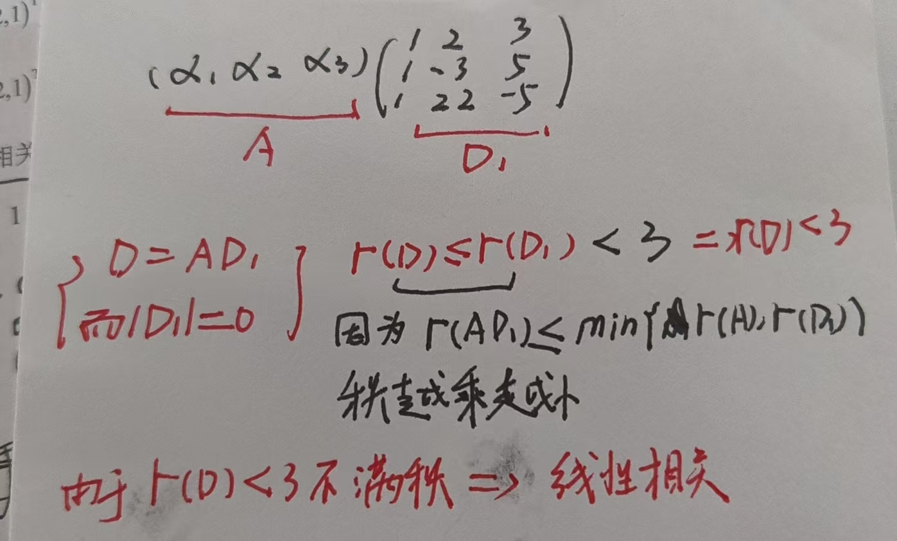

# 第四章：向量与方程组 · 错题本

> [!info] 本模块错题索引
>
> ## 📂 按知识点分类
>
> ### 🧮 秩为 1 矩阵的迹与幂运算
> - [01](#错题01秩为1矩阵的迹与向量内积的等价转换)：秩为1矩阵 $\alpha\beta^T$——$tr(\alpha\beta^T)=\alpha^T\beta$ 核心结论｜见到行/列成比例的矩阵，优先计算迹代替内积｜⭐⭐⭐｜[[4.1 向量组及其线性相关性]]
> - [02](#错题02秩为1矩阵的高次幂公式)：秩为 1 矩阵的高次幂——$A^n = [tr(A)]^{n-1}A$ 降次公式｜利用 $\beta^T\alpha$ 为标量可提取结合律降次｜⭐⭐⭐｜[[4.1 向量组及其线性相关性]]
>
> ### 🔍 线性相关性判定
> - [03](#错题03线性无关的基础证明)：线性无关基础证明——单个非零向量线性无关｜两个不成比例向量线性无关｜反证法是证明线性无关的核心套路｜⭐⭐⭐｜[[4.1 向量组及其线性相关性]]
> - [04](#错题04抽象向量组线性无关判定)：抽象向量组线性无关判定——系数矩阵行列式判别法｜$B=AP$，则 $|P|\neq 0$ 即无关｜⚠️警惕循环对称结构｜⭐⭐⭐｜[[4.1 向量组及其线性相关性]]
> - [05](#好题05累加型向量组线性无关的两种证明)：累加型向量组线性无关证明——定义法 vs 过渡矩阵法｜两种经典证明方法对比｜⭐⭐⭐｜[[4.1 向量组及其线性相关性]]
> - [06](#好题06递推型向量组线性无关的消元证明)：递推型向量组线性无关证明——定义法+左乘矩阵A消元｜"剥洋葱"法逐层降维｜⚠️$AD=DP$不能证无关｜⭐⭐⭐｜[[4.1 向量组及其线性相关性]]
> - [07](#好题07零化特性下向量组线性无关的证明)：零化特性向量组线性无关证明——定义法+左乘零化法｜$A^k\alpha=0$的黑洞效应｜⭐⭐⭐｜[[4.1 向量组及其线性相关性]]
> - [08](#好题08线性表示的判断与求解)：线性表示判断——构造统一增广矩阵｜$r(A)=r(A,\beta)$即有解｜⭐⭐⭐｜[[4.1 向量组及其线性相关性]]
> - [09](#好题09向量组线性表示的证明)：向量组线性表示证明——构造增广矩阵$(A|B)$｜$r(A)=r(A|B)$即有解｜证明题只证有解不求系数｜⭐⭐⭐｜[[4.1 向量组及其线性相关性]]
> - [10](#好题10含参向量组线性相关性的判定)：含参向量组线性相关性——2向量看成比例，3向量(方阵)求行列式｜参数讨论要完整｜⭐⭐⭐｜[[4.1 向量组及其线性相关性]]
> - [11](#好题11行列式条件翻译为秩与相关性判断)：行列式条件降维翻译——2阶非零子式→$r(A)\ge2$｜3阶子式为0→局部降秩｜⚠️需验证所有3阶子式才能断定秩｜⭐⭐⭐｜[[4.1 向量组及其线性相关性]]
> - [12](#好题12范德蒙德矩阵的线性相关性讨论)：范德蒙德矩阵向量组——$s=n$用行列式｜$s>n$秒杀相关｜$s<n$截短取子式｜⭐⭐⭐｜[[4.1 向量组及其线性相关性]]
> - [13](#好题13向量组相关性与线性表出的综合判断)：交织型向量组——无关→部分无关｜相关+无关→能表出｜比较$ r(A) $与$ r(A|b) $判表出｜⭐⭐⭐｜[[4.1 向量组及其线性相关性]]
> - [14](#好题14向量组的秩与增减量不等式)：向量组增减量不等式——增减1个向量秩最多变动1｜递推放缩破绝对化选项｜抽象问题用低维反例秒杀｜⭐⭐⭐｜[[4.1 向量组及其线性相关性]]
>
> ### 🔄 行变换保列线性关系
> - [15](#好题15初等行变换与列向量的线性关系)：行变换同构原理——$B$中列关系=原矩阵$A$中列关系｜主元列=极大无关组｜秩增减判断能否表出｜⭐⭐⭐｜[[4.3 线性方程组]]
> - [16](#好题16求包含特定向量的极大无关组)：强行入伙法——指定向量排最左｜行最简形直接读系数｜⚠️按原顺序化简会跳出指定向量｜⭐⭐⭐｜[[4.1 向量组及其线性相关性]]
>
> ### 🔄 向量组等价判定
> - [17](#好题17向量组等价的判定行列式与秩的联合策略)：方阵行列式秒杀法——向量组等价需三秩相等｜方阵优先算行列式避免繁琐行变换｜列变换制造0按列展开｜⭐⭐⭐｜[[4.1 向量组及其线性相关性]]
> - [18](#好题18向量组等价的传递性与多余向量剔除)：系数非零即剔除——谁系数不为0谁可被表出｜剔除后等价不变｜传递性串联结论｜⚠️$l$是否为0未知不能选A/C｜⭐⭐⭐｜[[4.1 向量组及其线性相关性]]
> - [19](#好题19向量组等价-vs-矩阵等价两个等价的本质区别)：两种等价辨析——向量组等价要互表（三秩相等）｜矩阵等价只需秩相等（门槛低）｜同型矩阵$r(A)=r(B)$即等价｜⚠️反例法排除充分不必要选项｜⭐⭐⭐｜[[4.1 向量组及其线性相关性]]
> - [20](#好题20矩阵乘法的左列右行与向量组等价)：左列右行定方向——$AB=C$中$C$列由$A$列表示｜可逆条件补反向｜$B$可逆$\Rightarrow$$A,C$列等价｜⚠️右乘$B^{-1}$不是左乘｜⭐⭐⭐｜[[4.1 向量组及其线性相关性]]
>
> ---
>
> ### 🔄 基础解系与方程组通解
> - [21](#好题21基础解系的控制变量法本质)：基础解系的控制变量法本质——自由变量取单位向量$(1,0,0),(0,1,0),(0,0,1)$的物理意义｜每个模板解只含一个自由变量的"纯粹影响"｜通解=模板的线性组合｜⭐⭐⭐｜[[4.3 线性方程组]]
> - [22](#好题22基础解系判定的过渡矩阵法秒杀)：基础解系判定三步法——核对个数→提取过渡矩阵→算行列式｜$|P|\neq 0$即真解系，$|P|=0$即水货｜⚠️等价不限个数，等秩不保证是解｜⭐⭐⭐｜[[4.3 线性方程组]]
>
> **更新日期**：2026-06-01（好题22-基础解系判定的过渡矩阵法秒杀）

---

## 错题01：秩为 1 矩阵的迹与向量内积的等价转换

> [!example] 填空题：求 $\alpha^T\beta$ ⚠️
> **题目**：设 $\alpha, \beta$ 为 3 维列向量，$\beta^T$ 是 $\beta$ 的转置，若
> $$\alpha\beta^T = \begin{pmatrix} 1 & -1 & 2 \\ -2 & 2 & -4 \\ 3 & -3 & 6 \end{pmatrix}$$
> 则 $\alpha^T\beta = ?$

### ❌ 我的错误
直接试图通过矩阵 $\alpha\beta^T$ 反解 $\alpha$ 和 $\beta$ 的每个分量，陷入复杂的方程求解。

### ✅ 正确解法
**关键观察**：矩阵 $\alpha\beta^T$ 的各行成比例（第二行 $=-2\times$ 第一行，第三行 $=3\times$ 第一行），故为秩 1 矩阵。

设 $\alpha = \begin{pmatrix} a_1 \\ a_2 \\ a_3 \end{pmatrix},\ \beta^T = (b_1, b_2, b_3)$，则：
$$\alpha\beta^T = \begin{pmatrix} a_1b_1 & a_1b_2 & a_1b_3 \\ a_2b_1 & a_2b_2 & a_2b_3 \\ a_3b_1 & a_3b_2 & a_3b_3 \end{pmatrix}$$

**核心结论**：
- 矩阵的迹 $tr(\alpha\beta^T) = a_1b_1 + a_2b_2 + a_3b_3$
- 向量内积 $\alpha^T\beta = a_1b_1 + a_2b_2 + a_3b_3$
- $\Rightarrow tr(\alpha\beta^T) = \alpha^T\beta$

本题中 $tr(A) = 1 + 2 + 6 = 9$，故 $\alpha^T\beta = 9$。

### 🎯 避坑要点
| 坑 | 正确做法 |
|----|---------|
| 试图反解 $\alpha,\beta$ 的每个分量 | 看到行/列成比例的矩阵，直接计算迹 $tr(A)$ 当作内积 |
| 不知道 $tr(\alpha\beta^T)$ 与 $\alpha^T\beta$ 的关系 | 记住：$\alpha\beta^T$ 的迹 $\equiv$ $\alpha^T\beta$（标量内积） |

### 🔗 相关知识点
- [[4.1 向量组及其线性相关性]] — 向量内积的基本定义
- [[2.3 矩阵基本运算/2.3.3 矩阵的乘法]] — $\alpha\beta^T$ 与 $\beta^T\alpha$ 的区别（外积 vs 内积）

### 💡 解题口诀
> **"行成比例，秩为1；求迹当作内积算"**

> [!tip] 秩为 1 矩阵与迹的奇妙化学反应
>
> 这是贯穿错题01和错题02的**核心原理**：
>
> 当矩阵 $A$ 的秩为 $1$ 时，它一定可以分解为一个列向量 $\alpha$ 和一个行向量 $\beta^T$ 的乘积：
> $$A = \alpha\beta^T$$
>
> 此时矩阵的迹完美等价于两个向量的内积：
> $$tr(\alpha\beta^T) = \alpha^T\beta$$
>
> 结合乘法结合律，就推导出考研中著名的秒杀公式：
> $$\begin{aligned}
> A^2 &= (\alpha\beta^T)(\alpha\beta^T) = \alpha(\beta^T\alpha)\beta^T = [tr(A)]A \\
> A^n &= [tr(A)]^{n-1} A
> \end{aligned}$$
>
> **整个逻辑链**：秩为 1 $\xrightarrow{\text{分解}}$ $\alpha\beta^T$ $\xrightarrow{\text{迹=内积}}$ $tr(A) = \alpha^T\beta$ $\xrightarrow{\text{结合律}}$ $A^n = [tr(A)]^{n-1}A$

---

## 错题02：秩为 1 矩阵的高次幂公式

> [!example] 计算题：求 $A^n$ ⚠️
> **题目**：已知矩阵 $A = \alpha\beta^T$ 为秩 1 矩阵（$\alpha, \beta$ 为列向量），且 $\alpha^T\beta = l$，求 $A^n$（$n \ge 2$）。

### ❌ 我的错误
试图用特征值对角化或硬算的方式求 $A^n$，计算量巨大。

### ✅ 正确解法
利用矩阵乘法的结合律，提取中间的标量内积：
$$A^2 = (\alpha\beta^T)(\alpha\beta^T) = \alpha(\beta^T\alpha)\beta^T = \alpha(l)\beta^T = l(\alpha\beta^T) = lA$$

递推至 $n$ 次方：
$$A^n = l^{n-1} A = [tr(A)]^{n-1} A$$

### 🎯 避坑要点
| 坑 | 正确做法 |
|----|---------|
| 见 $A^n$ 就想相似对角化 | 先看矩阵行/列是否成比例（秩 1），直接套 $A^n = [tr(A)]^{n-1}A$ |
| 忘记 $\beta^T\alpha$ 是标量 | 标量可以从矩阵乘法中提取到前面，这是结合律的关键 |

### 💡 解题口诀
> **"行成比例，秩为 1；求迹当作内积算；$n$ 次方降次公式：$[tr(A)]^{n-1}A$"**

### 🔗 相关知识点
- [[2.4 方阵的幂和方阵的多项式/2.4.1 方阵的幂]] — 方阵幂运算
- [[2.6 矩阵的秩/2.6.1 矩阵秩的定义]] — 秩 1 矩阵的判定

---

## 错题03：线性无关的基础证明

> [!example] 证明题 ⚠️
> **题目**：证明以下两个命题：
> 1. 单个非零向量 $\alpha \neq \mathbf{0}$ 线性无关
> 2. 两个不成比例的向量 $\alpha_1, \alpha_2$ 线性无关

### ❌ 我的错误
- 命题1：试图用反证法，但其实直接法更简洁
- 命题2：忘记声明 $k_1 \neq 0$，导致移项步骤逻辑不完整

### ✅ 正确证法

**命题1：单个非零向量线性无关（直接法）**

由定义，考虑方程：
$$k\alpha = \mathbf{0}$$

因为 $\alpha \neq \mathbf{0}$，等式两边"除以" $\alpha$ 的非零分量，必然得 $k = 0$。

满足线性无关定义，得证。

---

**命题2：两个不成比例的向量线性无关（反证法）**

**假设反面**：假设 $\alpha_1, \alpha_2$ 线性相关，则存在不全为 0 的常数 $k_1, k_2$，使得：
$$k_1\alpha_1 + k_2\alpha_2 = \mathbf{0}$$

不妨设 $k_1 \neq 0$，移项可得：
$$k_1\alpha_1 = -k_2\alpha_2 \implies \alpha_1 = \left(-\frac{k_2}{k_1}\right)\alpha_2$$

这意味着 $\alpha_1$ 和 $\alpha_2$ 存在比例关系，与已知条件"不成比例"矛盾。

故假设错误，$\alpha_1, \alpha_2$ 必定线性无关。

### 🎯 避坑要点
| 坑 | 正确做法 |
|----|---------|
| 证明线性无关时正面推导无从下手 | 优先考虑反证法：假设相关，推出矛盾 |
| 忘记线性相关的定义是"存在**不全为**0的常数" | 不全为 0 ≠ 全不为 0，只要有一个非零即可 |
| 反证法中未假设某个 $k_i \neq 0$ | 设定 $k_1 \neq 0$ 是移项的前提，必须声明 |

### 💡 解题口诀
> **"证无关，想反证；设相关，找矛盾；不成比例即无关，非零单个必无关"**

### 🔗 相关知识点
- [[4.1 向量组及其线性相关性]] — 线性相关/无关的定义
- [[4.1 向量组及其线性相关性]] — 向量组线性相关的判定定理

> [!tip] 考研核心思维：反证法 (Proof by Contradiction)
>
> 在考研线代中，当题目要求证明**"线性无关"**或**"矩阵可逆"**时，正面推导往往无从下手。此时，"假设相关"或"假设不可逆（即 $|A|=0$ 或存在非零解 $Ax=0$）"，通过移项得出与题设矛盾的结论，是最高效的通用套路。

---

## 错题04：抽象向量组线性无关判定

> [!example] 选择题 ⚠️
> **题目**：已知向量组 $\alpha_1, \alpha_2, \alpha_3$ 线性无关，则下列向量组中，线性无关的是（  ）。
>
> (A) $\alpha_1 + \alpha_2, \alpha_2 + \alpha_3, \alpha_3 - \alpha_1$
>
> (B) $\alpha_1 + \alpha_2, \alpha_2 + \alpha_3, \alpha_1 + 2\alpha_2 + \alpha_3$
>
> (C) $\alpha_1 + 2\alpha_2, 2\alpha_2 + 3\alpha_3, 3\alpha_3 + \alpha_1$
>
> (D) $\alpha_1 + \alpha_2 + \alpha_3, 2\alpha_1 - 3\alpha_2 + 22\alpha_3, 3\alpha_1 + 5\alpha_2 - 5\alpha_3$

### ❌ 我的错误
- 系数矩阵行列式写反（行和列互换），导致计算结果错误
- 没有先观察选项B的明显线性关系，直接硬算

### 📌 核心考点：系数矩阵行列式判别法

**核心定理**：设向量组 $A = (\alpha_1, \alpha_2, \dots, \alpha_n)$ 线性无关，向量组 $B = (\beta_1, \beta_2, \dots, \beta_n)$ 可由 $A$ 线性表示，即存在 $n$ 阶方阵 $P$ 使得：
$$B = A P$$
则：
- 向量组 $B$ 线性无关 $\iff$ 矩阵 $P$ 可逆 $\iff |P| \neq 0$
- 若 $|P| = 0$，则方阵 $P$ 降秩，向量组 $B$ 必然线性相关

### ✅ 正确解法

**答案：(C)**

将选项 (C) 写成矩阵相乘形式：
$$(\alpha_1 + 2\alpha_2, 2\alpha_2 + 3\alpha_3, \alpha_1 + 3\alpha_3) = (\alpha_1, \alpha_2, \alpha_3) \begin{pmatrix} 1 & 0 & 1 \\ 2 & 2 & 0 \\ 0 & 3 & 3 \end{pmatrix}$$

提取系数矩阵 $P_C$，计算行列式：
$$|P_C| = \begin{vmatrix} 1 & 0 & 1 \\ 2 & 2 & 0 \\ 0 & 3 & 3 \end{vmatrix} = 1 \cdot (6 - 0) - 0 + 1 \cdot (6 - 0) = 12$$

因为 $|P_C| = 12 \neq 0$，系数矩阵满秩 [一、秩的不变性 — 这些操作保秩](../第二章：矩阵/2.10%20矩阵的秩/2.10.2%20矩阵的秩相关结论.md#一、秩的不变性%20—%20这些操作保秩)，故新向量组线性无关。

---

**选项 (A) 分析**：
系数矩阵为 $\begin{pmatrix} 1 & 0 & -1 \\ 1 & 1 & 0 \\ 0 & 1 & 1 \end{pmatrix}$，行列式 $|P_A| = 1 - 0 - 1 = 0$，线性相关。

**选项 (B) 分析**（观察秒杀）：
直接观察发现：$(\alpha_1 + \alpha_2) + (\alpha_2 + \alpha_3) = \alpha_1 + 2\alpha_2 + \alpha_3$
第三个向量是前两个之和，必线性相关。

**选项 (D) 分析**：
系数矩阵 $|P_D| = 1 \cdot (15 - 110) - 2 \cdot (-5 - 5) + 3 \cdot (22 - (-3)) = -95 + 20 + 75 = 0$，线性相关。

### 🎯 避坑要点
| 坑 | 正确做法 |
|----|---------|
| 系数矩阵行列式写反（行和列互换） | 按列对应：$\beta_j = k_{1j}\alpha_1 + k_{2j}\alpha_2 + k_{3j}\alpha_3$，第 $j$ 列是 $\beta_j$ 的系数 |
| 看到循环对称结构仍硬算行列式 | 先观察：$\alpha_1-\alpha_2, \alpha_2-\alpha_3, \alpha_3-\alpha_1$ 这类结构行列式必为 0 |
| 忘记 $B = AP$ 的含义 | $\beta_j$ 是 $A$ 各列的线性组合，组合系数构成 $P$ 的第 $j$ 列 |

### 💡 解题口诀
> **"抽象向量判无关，系数矩阵行列式；$B=AP$ 要记牢，$|P|\neq 0$ 即过关；循环对称先观察，一眼看出省计算"**

### 🔗 相关知识点
- [[4.1 向量组及其线性相关性]] — 向量组线性相关/无关的定义
- [[2.3 矩阵基本运算/2.3.3 矩阵的乘法]] — 矩阵乘法与线性表示

---

## 好题05：累加型向量组线性无关的两种证明

> [!example] 经典例题：两种证明方法对比
> **题目**：设向量组 $\alpha_1, \alpha_2, \dots, \alpha_s \ (s \ge 2)$ 线性无关。证明：向量组 $\alpha_1, \alpha_1+\alpha_2, \dots, \alpha_1+\alpha_2+\dots+\alpha_s$ 也线性无关。

### 🎯 考点梳理

**线性无关的根本定义**：齐次线性方程组仅有唯一零解。

**过渡矩阵与秩的定理**：若向量组 $B$ 可由线性无关的向量组 $A$ 线性表示（即 $B = AP$），则 $B$ 线性无关的充要条件是系数矩阵 $P$ 满秩（即 $|P| \neq 0$）。

---

### ✅ 证法一：定义法 —— 回归本质，严谨推导

**思路**：利用线性无关的定义，构造线性组合为零的等式，证明所有组合系数必然为零。

**证明过程**：

设有实数 $k_1, k_2, \dots, k_s$ 使得：
$$k_1\alpha_1 + k_2(\alpha_1+\alpha_2) + \dots + k_s(\alpha_1+\alpha_2+\dots+\alpha_s) = 0$$

将上式展开，并按照原向量组 $\alpha_1, \alpha_2, \dots, \alpha_s$ 重新合并同类项：
$$(k_1+k_2+\dots+k_s)\alpha_1 + (k_2+k_3+\dots+k_s)\alpha_2 + \dots + (k_s)\alpha_s = 0$$

因为已知前提是 $\alpha_1, \alpha_2, \dots, \alpha_s$ 线性无关，所以上述等式中各项的系数必须全为 0，从而得到一个齐次线性方程组：
$$\begin{cases}
k_1 + k_2 + \dots + k_s = 0 \\
k_2 + \dots + k_s = 0 \\
\vdots \\
k_s = 0
\end{cases}$$

这是一个标准的**上三角阶梯型方程组**。从最后一个方程往上回代：
- 由 $k_s = 0$，代入倒数第二个方程得 $k_{s-1} = 0$
- 依此类推，必然得到唯一解：
$$k_1 = k_2 = \dots = k_s = 0$$

**结论**：仅当所有系数为 0 时线性组合才为零，故新向量组线性无关。证明完毕。

---

### ✅ 证法二：系数矩阵法（过渡矩阵法） —— 降维打击，高效判别

**思路**：剥离出向量组之间的系数矩阵，将"判断向量组的相关性"转化为"判断纯数字方阵的可逆性"。

**证明过程**：

令新向量组为 $B$，原向量组为 $A$。将新向量组用矩阵乘法的形式表示出来：
$$(\alpha_1, \alpha_1+\alpha_2, \dots, \alpha_1+\alpha_2+\dots+\alpha_s) = (\alpha_1, \alpha_2, \dots, \alpha_s) \begin{pmatrix}1 & 1 & 1 & \dots & 1 \\0 & 1 & 1 & \dots & 1 \\0 & 0 & 1 & \dots & 1 \\\vdots & \vdots & \vdots & \ddots & \vdots \\0 & 0 & 0 & \dots & 1\end{pmatrix}$$

即 $B = A P$。

观察提取出的 $s$ 阶系数矩阵 $P$，它是一个**上三角矩阵**。

计算矩阵 $P$ 的行列式。上三角矩阵的行列式等于主对角线元素之积：
$$|P| = 1 \times 1 \times \dots \times 1 = 1$$

因为 $|P| = 1 \neq 0$，说明矩阵 $P$ 是**满秩矩阵（可逆）**。

**结论**：满秩的过渡矩阵不改变原向量组的线性相关性。既然已知向量组 $A$ 线性无关，且 $|P| \neq 0$，故向量组 $B$ 也必然线性无关。证明完毕。

---

### 💡 方法总结与实战指导

| 方法 | 适用场景 | 优势 |
|------|----------|------|
| **定义法** | 解答题/证明题 | 展现扎实的代数基本功，按步骤推导，阅卷给分点清晰 |
| **系数矩阵法** | 选择题/填空题 | 直接提取系数矩阵，扫一眼上/下三角或对角线即可秒杀 |

**内在联系**：【法一】中解出来的齐次方程组的系数矩阵，恰恰就是【法二】中过渡矩阵 $P$ 的转置（$P^T$）。两者的底层逻辑是完全等价的。

---

### 🎯 避坑要点

| 坑 | 正确做法 |
|----|---------|
| 忘记将新向量组按原向量组展开合并 | 先写出完整展开式，再按 $\alpha_1, \alpha_2, \dots, \alpha_s$ 的顺序合并同类项 |
| 系数矩阵行列式的行/列写反 | 记住：$\beta_j = k_{1j}\alpha_1 + k_{2j}\alpha_2 + \dots$，第 $j$ 列是 $\beta_j$ 的系数 |
| 忽略原向量组线性无关的前提 | 只有前提线性无关，才能推出各系数必须为0 |

### 💡 解题口诀
> **"累加型向量组，定义法展开合并；矩阵法提取上三角，行列式为1必无关"**

### 🔗 相关知识点
- [[4.1 向量组及其线性相关性]] — 线性无关的定义
- [[4.1 向量组及其线性相关性]] — 过渡矩阵与向量组秩的关系

---

## 好题06：递推型向量组线性无关的消元证明

> [!example] 经典例题：递推关系下的线性无关性
> **题目**：设 $A$ 为 3 阶矩阵，$\alpha_1, \alpha_2, \alpha_3$ 是 3 维列向量。已知条件：
> - $A\alpha_1 = \alpha_1 \neq 0$
> - $A\alpha_2 = \alpha_1 + \alpha_2$
> - $A\alpha_3 = \alpha_2 + \alpha_3$
>
> **证明**：向量组 $\alpha_1, \alpha_2, \alpha_3$ 线性无关。

### 🎯 考点与思路拆解

**核心考点**：在带有抽象矩阵变换（递推关系）的情况下，证明向量组的线性无关性。

**破题切入点**：遇到抽象向量组的证明，最根本的出发点永远是**定义法**（令 $\sum k_i \alpha_i = 0$，证明所有系数 $k_i$ 均为 0）。

**消元核心技巧（"剥洋葱"法）**：题目给定了 $A\alpha_i$ 的降阶递推关系。对定义式的等式两边不断左乘矩阵 $A$，并与原等式相减，从而逐个消去末尾的向量，直至求出所有的系数。

---

### 🚨 避坑指南：为什么不能用"过渡矩阵法"？

在做本题时，极易陷入以下逻辑误区：

令 $D = (\alpha_1, \alpha_2, \alpha_3)$，根据已知条件可得：
$$A (\alpha_1, \alpha_2, \alpha_3) = (\alpha_1, \alpha_2, \alpha_3) \begin{pmatrix} 1 & 1 & 0 \\ 0 & 1 & 1 \\ 0 & 0 & 1 \end{pmatrix}$$

即：$AD = DP$。

因为系数矩阵 $P$ 的行列式 $|P| = 1 \neq 0$，所以 $P$ 可逆，从而得出 $r(AD) = r(DP) = r(D)$。

**❌ 逻辑断裂处**：推导到 $r(AD) = r(D)$ 是完全正确的，但这**无法证明 $r(D) = 3$**！

如果要证明 $\alpha_1, \alpha_2, \alpha_3$ 线性无关，必须证明方阵 $D$ 满秩（即 $r(D)=3$）。仅仅证明它与 $AD$ 的秩相等，**缺乏初始维度的锚点**（例如，如果 $\alpha_1, \alpha_2, \alpha_3$ 全是零向量，等式依然成立，但此时 $r(D)=0$）。

---

### ✅ 标准证明过程

**证明**：根据向量组线性无关的定义，设存在常数 $k_1, k_2, k_3$，使得：
$$k_1\alpha_1 + k_2\alpha_2 + k_3\alpha_3 = 0 \quad \text{—— (式 1)}$$

**第一轮消元（消去 $\alpha_3$）**：

对 (式 1) 两端同时左乘矩阵 $A$，得：
$$k_1(A\alpha_1) + k_2(A\alpha_2) + k_3(A\alpha_3) = 0$$

代入题目已知条件，得：
$$k_1\alpha_1 + k_2(\alpha_1+\alpha_2) + k_3(\alpha_2+\alpha_3) = 0 \quad \text{—— (式 2)}$$

将 (式 2) 减去 (式 1)，整理得：
$$k_2\alpha_1 + k_3\alpha_2 = 0 \quad \text{—— (式 3)}$$

**第二轮消元（消去 $\alpha_2$）**：

对 (式 3) 两端再次同时左乘矩阵 $A$，得：
$$k_2(A\alpha_1) + k_3(A\alpha_2) = 0$$

再次代入已知条件，得：
$$k_2\alpha_1 + k_3(\alpha_1+\alpha_2) = 0 \quad \text{—— (式 4)}$$

将 (式 4) 减去 (式 3)，整理得：
$$k_3\alpha_1 = 0$$

**回代求解**：

由题意已知 $\alpha_1 \neq 0$，且 $k_3\alpha_1 = 0$，故必须有 $k_3 = 0$。

将 $k_3 = 0$ 代回 (式 3)，得 $k_2\alpha_1 = 0$。同理，因 $\alpha_1 \neq 0$，故 $k_2 = 0$。

将 $k_2 = 0, k_3 = 0$ 代回 (式 1)，得 $k_1\alpha_1 = 0$。同理，因 $\alpha_1 \neq 0$，故 $k_1 = 0$。

**结论**：综上所述，等式 $k_1\alpha_1 + k_2\alpha_2 + k_3\alpha_3 = 0$ 仅当 $k_1 = k_2 = k_3 = 0$ 时才成立。根据定义，向量组 $\alpha_1, \alpha_2, \alpha_3$ 线性无关。证毕。

---

### 💡 方法总结

| 步骤 | 操作 | 目的 |
|------|------|------|
| 1 | 写定义等式 $\sum k_i\alpha_i = 0$ | 设定起点 |
| 2 | 两端左乘矩阵 $A$ | 构造递推关系 |
| 3 | 代入已知条件 | 替换 $A\alpha_i$ |
| 4 | 两式相减 | 消去末尾向量，降维 |
| 5 | 循环直至出底 | 逐步消去所有向量 |
| 6 | 逐层回代 | 求出所有系数为 0 |

**标准操作流**："设定义等式为零 $\rightarrow$ 左右同乘矩阵 $A$ $\rightarrow$ 代入已知条件 $\rightarrow$ 两式相减降维 $\rightarrow$ 循环直至出底 $\rightarrow$ 逐层回代"

---

### 🎯 避坑要点

| 坑 | 正确做法 |
|----|---------|
| 看到 $AD = DP$ 且 $\vert P \vert \neq 0$ 就认为证完 | $AD = DP$ 只能证明 $r(AD) = r(D)$，无法锚定 $r(D) = 3$ |
| 忘记题目给的 $\alpha_1 \neq 0$ 条件 | 这是回代求解的唯一锚点，必须用上 |
| 左乘 $A$ 后忘记代入递推条件 | 每次左乘后必须立即用已知的 $A\alpha_i$ 关系替换 |
| 减法运算时符号出错 | 两式相减时逐项仔细，特别是负号 |

### 💡 解题口诀
> **"递推型向量组，定义法设零；左乘A代入减，剥洋葱降维；$\alpha_1\neq 0$是锚点，回代系数全归零"**

### 🔗 相关知识点
- [[4.1 向量组及其线性相关性]] — 线性无关的定义
- [[4.1 向量组及其线性相关性]] — 向量组的秩与线性表示

---

## 好题07：零化特性下向量组线性无关的证明

> [!example] 经典例题：零化特性与线性无关性
> **题目**：设 $A$ 是 $n$ 阶矩阵，若存在正整数 $k$，使线性方程组 $A^kx = 0$ 有解向量 $\alpha$，且 $A^{k-1}\alpha \neq 0$。
>
> **证明**：向量组 $\alpha, A\alpha, \dots, A^{k-1}\alpha$ 线性无关。

### 🎯 考点与思路拆解

**挖掘隐含条件（零化特性）**：既然 $A^k\alpha = 0$，那么比 $k$ 次数更高的幂次乘上 $\alpha$ 必然也是 0。即对于任意 $m \ge 0$，都有 $A^{k+m}\alpha = A^m(A^k\alpha) = A^m \cdot 0 = 0$。

**消元策略（左乘零化法）**：设出定义方程后，不要盲目化简。观察到最高次项是 $A^{k-1}\alpha$。如果我们给等式两边同乘 $A^{k-1}$，那么第一项 $\alpha$ 会变成 $A^{k-1}\alpha$（非零），而后面的项 $A\alpha, A^2\alpha \dots$ 分别会变成 $A^k\alpha, A^{k+1}\alpha \dots$ 从而全部变为 0！这样就能"一击毙命"，直接求出第一个系数。接着降低乘的幂次，依次求出所有系数。

---

### ✅ 标准证明过程

**证明**：根据向量组线性无关的定义，设存在常数 $c_0, c_1, \dots, c_{k-1}$，使得：
$$c_0\alpha + c_1A\alpha + c_2A^2\alpha + \dots + c_{k-1}A^{k-1}\alpha = 0 \quad \text{—— (式 1)}$$

**第一步：求 $c_0$**

对 (式 1) 两端同时左乘 $A^{k-1}$，展开得：
$$c_0A^{k-1}\alpha + c_1A^k\alpha + c_2A^{k+1}\alpha + \dots + c_{k-1}A^{2k-2}\alpha = 0$$

因为已知 $A^k\alpha = 0$，所以凡是指数大于等于 $k$ 的项统统为 0。上式瞬间坍缩为：
$$c_0A^{k-1}\alpha = 0$$

又因为题目已知 $A^{k-1}\alpha \neq 0$，故必须有：$c_0 = 0$。

**第二步：求 $c_1$**

将 $c_0 = 0$ 代回 (式 1)，方程缩减为：
$$c_1A\alpha + c_2A^2\alpha + \dots + c_{k-1}A^{k-1}\alpha = 0 \quad \text{—— (式 2)}$$

对 (式 2) 两端同时左乘 $A^{k-2}$，展开得：
$$c_1A^{k-1}\alpha + c_2A^k\alpha + \dots + c_{k-1}A^{2k-3}\alpha = 0$$

同样地，利用 $A^k\alpha = 0$，上式再次坍缩为：
$$c_1A^{k-1}\alpha = 0$$

因为 $A^{k-1}\alpha \neq 0$，故必须有：$c_1 = 0$。

**第三步：循环直至完毕**

依此类推，将求出的系数代回原式，并依次左乘 $A^{k-3}, A^{k-4}, \dots, A$。最后仅剩 $c_{k-1}A^{k-1}\alpha = 0$，同样可得 $c_{k-1} = 0$。

**结论**：综上所述，必须有 $c_0 = c_1 = \dots = c_{k-1} = 0$。根据定义，向量组 $\alpha, A\alpha, \dots, A^{k-1}\alpha$ 线性无关。证毕。

---

### 💡 方法总结

| 方法 | 核心原理 | 适用场景 |
|------|----------|----------|
| **左乘相减法**（好题06） | 通过两式相减，抵消相同项，逐步降维 | 已知 $A\alpha_i$ 的线性组合关系 |
| **左乘零化法**（本题） | 利用 $A^k\alpha = 0$ 的黑洞效应，直接消去不需要的项 | 已知 $A^k\alpha = 0$ 的零化特性 |

**核心思想**：方程里想留谁，就凑出谁前面需要的幂次即可。

---

### 🎯 避坑要点

| 坑 | 正确做法 |
|----|---------|
| 忘记 $A^{k+m}\alpha = 0$（$m \ge 0$） | 零化特性具有"传染性"：$A^k\alpha = 0 \Rightarrow A^{k+1}\alpha = A \cdot 0 = 0$ |
| 左乘幂次选择错误 | 想求 $c_0$ 就左乘 $A^{k-1}$，想求 $c_1$ 就左乘 $A^{k-2}$，以此类推 |
| 忘记使用 $A^{k-1}\alpha \neq 0$ 条件 | 这是判断 $c_i = 0$ 的唯一依据，必须用上 |

### 💡 解题口诀
> **"零化特性黑洞效应，左乘幂次精准打击；想留谁就凑谁，$A^k\alpha=0$ 全部坍缩"**

### 🔗 相关知识点
- [[4.1 向量组及其线性相关性]] — 线性无关的定义
- [[4.1 向量组及其线性相关性]] — 向量组的秩与线性表示

---

## 好题08：线性表示的判断与求解

> [!example] 经典例题：线性表示判断
> **题目**：设向量 $\alpha_1 = (1, 2, -1, 5)^T$, $\alpha_2 = (2, -1, 1, 1)^T$, $\beta_1 = (4, 3, -1, 11)^T$, $\beta_2 = (4, 3, 0, 11)^T$。试分别判断 $\beta_1$ 与 $\beta_2$ 能否由向量组 $\alpha_1, \alpha_2$ 线性表示。若能，请写出表达式。

### 🎯 考点与思路拆解

**核心考点**：线性表示的判断与求解（最基础也最核心的计算题）。

**解题步骤**：
1. **构造统一增广矩阵**：避免重复计算，将所有向量按列排成一个大矩阵 $(\alpha_1, \alpha_2, \beta_1, \beta_2)$
2. **初等行变换**：化为行阶梯型矩阵
3. **看秩定结论**：
   - $r(A) = r(A, \beta)$ → 方程有解（能线性表示）
   - 出现 `0 0 | 非零` 的行 → 秩不相等，方程无解（不能线性表示）
4. **回代求系数**：对有解的情况，还原为方程组求解

---

### ✅ 标准解析过程

**第一步：构造矩阵并化简**

构造矩阵 $M = (\alpha_1, \alpha_2, \beta_1, \beta_2)$，对其进行初等行变换：
$$\begin{pmatrix}
1 & 2 & 4 & 4 \\
2 & -1 & 3 & 3 \\
-1 & 1 & -1 & 0 \\
5 & 1 & 11 & 11
\end{pmatrix}
\xrightarrow{\begin{subarray}{l} r_2 - 2r_1 \\ r_3 + r_1 \\ r_4 - 5r_1 \end{subarray}}
\begin{pmatrix}
1 & 2 & 4 & 4 \\
0 & -5 & -5 & -5 \\
0 & 3 & 3 & 4 \\
0 & -9 & -9 & -9
\end{pmatrix}$$

继续化简，提取第二行的公因子并消元：
$$\xrightarrow{\begin{subarray}{l} r_2 \div (-5) \\ r_3 - 3r_2 \\ r_4 + 9r_2 \end{subarray}}
\begin{pmatrix}
1 & 2 & 4 & 4 \\
0 & 1 & 1 & 1 \\
0 & 0 & 0 & 1 \\
0 & 0 & 0 & 0
\end{pmatrix}$$

**第二步：分析结论**

此时矩阵已经化为行阶梯型。记系数矩阵 $A = (\alpha_1, \alpha_2)$。

从化简后的矩阵可以看出，前两列构成的系数矩阵 $r(A) = 2$。

---

**1. 判断 $\beta_1$**：

观察前三列构成的增广矩阵 $(\alpha_1, \alpha_2, \beta_1)$：
$$\begin{pmatrix}
1 & 2 & 4 \\
0 & 1 & 1 \\
0 & 0 & 0 \\
0 & 0 & 0
\end{pmatrix}$$

显然 $r(A) = r(A, \beta_1) = 2$。因此，非齐次线性方程组 $Ax = \beta_1$ 有**唯一解**，即 $\beta_1$ **可由** $\alpha_1, \alpha_2$ **线性表示**。

将其还原为方程组求系数：
$$\begin{cases}
x_1 + 2x_2 = 4 \\
x_2 = 1
\end{cases}$$

解得 $x_1 = 2, x_2 = 1$。

**表达式**：$\beta_1 = 2\alpha_1 + \alpha_2$

---

**2. 判断 $\beta_2$**：

观察前两列与第四列构成的增广矩阵 $(\alpha_1, \alpha_2, \beta_2)$，看它的第三行：
$$\begin{pmatrix}
\dots & \dots & \dots \\
0 & 0 & 1 \\
\dots & \dots & \dots
\end{pmatrix}$$

这代表方程 $0 \cdot x_1 + 0 \cdot x_2 = 1$，显然**矛盾**。

即 $r(A) = 2 \neq r(A, \beta_2) = 3$。因此方程组**无解**，即 $\beta_2$ **不能由** $\alpha_1, \alpha_2$ **线性表示**。

---

### 💡 方法总结

| 步骤 | 操作 | 目的 |
|------|------|------|
| 1 | 构造增广矩阵 $(\alpha_1, \alpha_2, \beta)$ | 将问题转化为线性方程组 |
| 2 | 初等行变换化为行阶梯型 | 便于观察秩的关系 |
| 3 | 比较 $r(A)$ 与 $r(A, \beta)$ | 判断解的存在性 |
| 4 | 回代求系数（有解时） | 求出线性组合的具体表达式 |

**核心判据**：
- $r(A) = r(A, \beta) = n$（列数）→ **唯一解**
- $r(A) = r(A, \beta) < n$ → **无穷多解**
- $r(A) \neq r(A, \beta)$ → **无解**

---

### 🎯 避坑要点

| 坑 | 正确做法 |
|----|---------|
| 对每个 $\beta$ 分别构造增广矩阵 | 构造统一增广矩阵 $(\alpha_1, \alpha_2, \beta_1, \beta_2)$，一次行变换同时判断多个向量 |
| 行变换时计算出错 | 每步行变换后检查是否有公因子可提取，保持矩阵简洁 |
| 回代求解时符号搞错 | 还原方程组时逐项核对，特别是负号 |

### 💡 解题口诀
> **"线性表示看秩等，增广矩阵初等行；$r(A)=r(A,\beta)$ 即有解，$0=非零$ 便无解"**

### 🔗 相关知识点
- [[4.1 向量组及其线性相关性]] — 线性表示的定义
- [[4.1 向量组及其线性相关性]] — 齐次/非齐次方程组解的判定

---

## 好题09：向量组线性表示的证明

> [!example] 经典例题：向量组线性表示证明
> **题目**：已知向量组 (I)：$\alpha_1 = (0, 1, 2, 3)^T$, $\alpha_2 = (3, 0, 1, 2)^T$, $\alpha_3 = (2, 3, 0, 1)^T$ 和向量组 (II)：$\beta_1 = (2, 1, 1, 2)^T$, $\beta_2 = (0, -2, 1, 1)^T$, $\beta_3 = (4, 4, 1, 3)^T$。
>
> **证明**：向量组 (II) 可由向量组 (I) 线性表示。

### 🎯 考点与思路拆解

**理论转化**：要证明向量组 (II) 中的每一个向量都能被 (I) 线性表示，等价于证明矩阵方程 $(\alpha_1, \alpha_2, \alpha_3)X = (\beta_1, \beta_2, \beta_3)$ 有解。

**判定准则**：设 $A = (\alpha_1, \alpha_2, \alpha_3)$，$B = (\beta_1, \beta_2, \beta_3)$。根据线性方程组解的结构定理，该方程有解的充要条件是：系数矩阵 $A$ 的秩等于增广矩阵 $(A \mid B)$ 的秩，即 $r(A) = r(A \mid B)$。

**实战操作**：构造大矩阵 $(A \mid B)$，只作初等行变换化为行阶梯型，数非零行的个数即可。

---

### ✅ 标准证明过程

**证明**：记矩阵 $A = (\alpha_1, \alpha_2, \alpha_3)$，矩阵 $B = (\beta_1, \beta_2, \beta_3)$。构造增广矩阵 $(A \mid B)$，并进行初等行变换：

$$(A \mid B) = \begin{pmatrix}
0 & 3 & 2 & 2 & 0 & 4 \\
1 & 0 & 3 & 1 & -2 & 4 \\
2 & 1 & 0 & 1 & 1 & 1 \\
3 & 2 & 1 & 2 & 1 & 3
\end{pmatrix}$$

**第一步**：交换第一行与第二行，并利用新的第一行对下方进行消元：

$$\xrightarrow{\begin{subarray}{l} r_1 \leftrightarrow r_2 \\ r_3 - 2r_1 \\ r_4 - 3r_1 \end{subarray}}
\begin{pmatrix}
1 & 0 & 3 & 1 & -2 & 4 \\
0 & 3 & 2 & 2 & 0 & 4 \\
0 & 1 & -6 & -1 & 5 & -7 \\
0 & 2 & -8 & -1 & 7 & -9
\end{pmatrix}$$

**第二步**：将第二行与第三行交换（为了使主元为 1，简化计算），再继续消元：

$$\xrightarrow{\begin{subarray}{l} r_2 \leftrightarrow r_3 \\ r_3 - 3r_2 \\ r_4 - 2r_2 \end{subarray}}
\begin{pmatrix}
1 & 0 & 3 & 1 & -2 & 4 \\
0 & 1 & -6 & -1 & 5 & -7 \\
0 & 0 & 20 & 4 & -15 & 25 \\
0 & 0 & 4 & 1 & -3 & 5
\end{pmatrix}$$

**第三步**：交换第三行与第四行，并消去最后一行：

$$\xrightarrow{\begin{subarray}{l} r_3 \leftrightarrow r_4 \\ r_4 - 5r_3 \end{subarray}}
\begin{pmatrix}
1 & 0 & 3 & 1 & -2 & 4 \\
0 & 1 & -6 & -1 & 5 & -7 \\
0 & 0 & 4 & 1 & -3 & 5 \\
0 & 0 & 0 & 0 & 0 & 0
\end{pmatrix}$$

**分析结论**：此时矩阵已化为行阶梯型。观察可知：
- 左侧系数矩阵 $A$ 的非零行为 3 行，即 $r(A) = 3$
- 整体增广矩阵 $(A \mid B)$ 的非零行也为 3 行，即 $r(A \mid B) = 3$

因为 $r(A) = r(A \mid B)$，所以矩阵方程 $AX = B$ 有解。根据向量组线性表示的等价定理，**向量组 (II) 可由向量组 (I) 线性表示**。证毕。

---

### 💡 方法总结

| 题型 | 操作要求 | 目的 |
|------|----------|------|
| **证明题**（本题） | 化简到行阶梯型，比对 $r(A)$ 和 $r(A \mid B)$ | 只证有解即可，**不要求具体系数** |
| **计算题**（好题08） | 继续化简为行最简形 | 需要求出具体线性组合表达式 |

**行变换技巧**：在消元过程中，"找 1 做主元"是避免分数的最佳策略。如果实在没有 1，宁可同行乘以公倍数，也不要轻易引入分数，否则极易算错。

---

### 🎯 避坑要点

| 坑 | 正确做法 |
|----|---------|
| 证明题还去求具体系数 | 证明题只需证 $r(A) = r(A \mid B)$ 即可，不要浪费时间求系数 |
| 行变换时引入大量分数 | 通过交换行"找 1 做主元"，或乘公倍数消去分母 |
| 忘记验证最后一行 | 最后一行全为 0 是 $r(A) = r(A \mid B)$ 的关键证据 |

### 💡 解题口诀
> **"向量组表示证有解，增广矩阵行变换；阶梯型比秩相等，证明题只看不求"**

### 🔗 相关知识点
- [[4.1 向量组及其线性相关性]] — 向量组线性表示的定义
- [[4.1 向量组及其线性相关性]] — 线性方程组有解的判定定理

---

## 好题10：含参向量组线性相关性的判定

> [!example] 经典例题：参数讨论与线性相关性
> **题目**：设向量 $\alpha_1 = (6, a+1, 3)^T$, $\alpha_2 = (a, 2, -2)^T$, $\alpha_3 = (a, 1, 0)^T$。求：
> (1) $a$ 为何值时，$\alpha_1, \alpha_2$ 线性相关？$a$ 为何值时，$\alpha_1, \alpha_2$ 线性无关？
> (2) $a$ 为何值时，$\alpha_1, \alpha_2, \alpha_3$ 线性相关？$a$ 为何值时，$\alpha_1, \alpha_2, \alpha_3$ 线性无关？

### 🎯 考点与思路拆解

**核心考点**：处理含有未知参数 $a$ 的向量组相关性问题，核心是根据**向量的个数与维数的关系**，选择计算量最小的判定方法。

**"看菜吃饭"策略**：
- 2 个向量 → 直接看是否成比例
- 向量个数 = 维数（即方阵） → 直接求行列式（令 $|A|=0$ 找相关点）
- 向量个数 $\neq$ 维数 → 回归矩阵的初等行变换（化阶梯型看秩）

---

### ✅ 标准解析过程

**(1) 判断 $\alpha_1, \alpha_2$ 的线性相关性**

**解**：若 $\alpha_1$ 与 $\alpha_2$ 线性相关，则两向量的对应坐标必定成比例，即：
$$\frac{6}{a} = \frac{a+1}{2} = \frac{3}{-2}$$

由 $\frac{6}{a} = \frac{3}{-2}$ 解得：
$$a = -4$$

将 $a=-4$ 代入中间项检验：$\frac{-4+1}{2} = -\frac{3}{2}$，等式成立。

**结论**：
- 当 $a = -4$ 时，$\alpha_1, \alpha_2$ 线性相关
- 当 $a \neq -4$ 时，$\alpha_1, \alpha_2$ 线性无关

---

**(2) 判断 $\alpha_1, \alpha_2, \alpha_3$ 的线性相关性**

**解**：将三个向量按列排成矩阵 $A = (\alpha_1, \alpha_2, \alpha_3)$，计算其行列式。选择按含有元素 0 的**第三行**进行展开：

$$|A| = \begin{vmatrix} 6 & a & a \\ a+1 & 2 & 1 \\ 3 & -2 & 0 \end{vmatrix}$$

按第三行展开：

$$|A| = 3 \cdot (-1)^{3+1} \begin{vmatrix} a & a \\ 2 & 1 \end{vmatrix} + (-2) \cdot (-1)^{3+2} \begin{vmatrix} 6 & a \\ a+1 & 1 \end{vmatrix} + 0$$

化简计算：

$$|A| = 3(1)(a - 2a) - 2(-1)(6 - a(a+1))$$
$$|A| = -3a + 2(6 - a^2 - a)$$
$$|A| = -3a + 12 - 2a^2 - 2a$$
$$|A| = -2a^2 - 5a + 12$$

令 $|A| = 0$，即 $-2a^2 - 5a + 12 = 0$，提负号并十字相乘分解因式：
$$-(2a^2 + 5a - 12) = 0 \Rightarrow -(2a-3)(a+4) = 0$$

解得特征根为：$a = \frac{3}{2}$ 或 $a = -4$

**结论**：
- 当 $a = -4$ 或 $a = \frac{3}{2}$ 时，行列式为 0，$\alpha_1, \alpha_2, \alpha_3$ 线性相关
- 当 $a \neq -4$ 且 $a \neq \frac{3}{2}$ 时，行列式不为 0，$\alpha_1, \alpha_2, \alpha_3$ 线性无关

---

### 💡 方法总结

| 向量情况 | 判定方法 | 核心操作 |
|----------|----------|----------|
| **2 个向量** | 成比例法 | 对应坐标成比例即相关 |
| **n 个 n 维向量**（方阵） | 行列式法 | $\lvert A \rvert = 0$ 即相关，$\lvert A \rvert \neq 0$ 即无关 |
| **m 个 n 维向量**（$m \neq n$） | 秩判别法 | $r(A) < m$ 即相关 |

**行列式展开技巧**：选择含有最多 0 元素的行或列展开，可大幅简化计算。

---

### 🎯 避坑要点

| 坑 | 正确做法 |
|----|---------|
| 2 个向量用行列式法 | 2 个向量直接看成比例，计算量最小 |
| 比例式求解后忘记代入检验 | 由任一比例式求出 $a$，必须代入其他比例式验证一致性 |
| 行列式展开时忘记代数余子式的符号 | $(-1)^{i+j}$ 是关键，特别是第 2 列要乘 $-1$ |
| 二次方程因式分解出错 | 先提负号，再用十字相乘法分解 |

### 💡 解题口诀
> **"两向量看成比例，方阵求行列式；行列式等于0就相关，展开选零最多的行或列"**

### 🔗 相关知识点
- [[4.1 向量组及其线性相关性]] — 向量组线性相关/无关的定义
- [[4.1 向量组及其线性相关性]] — 方阵行列式判定法
- [[2.3 矩阵基本运算/2.3.3 矩阵的乘法]] — 行列式按行展开定理

---

## 好题11：行列式条件翻译为秩与相关性判断

> [!example] 经典例题：行列式条件的降维翻译
> **题目**：若矩阵 $A = \begin{pmatrix} a_{11} & a_{12} & a_{13} & a_{14} \\ a_{21} & a_{22} & a_{23} & a_{24} \\ a_{31} & a_{32} & a_{33} & a_{34} \end{pmatrix}$，记其列向量组为 $A = (\alpha_1, \alpha_2, \alpha_3, \alpha_4)$，行向量组为 $A = \begin{pmatrix} \beta_1 \\ \beta_2 \\ \beta_3 \end{pmatrix}$。
>
> 已知条件：
> $$\begin{vmatrix} a_{12} & a_{14} \\ a_{32} & a_{34} \end{vmatrix} \neq 0, \quad \begin{vmatrix} a_{11} & a_{12} & a_{13} \\ a_{21} & a_{22} & a_{23} \\ a_{31} & a_{32} & a_{33} \end{vmatrix} = 0$$
>
> 判断下列结论中正确的是：
> - ① $r(A) = 2$
> - ② $\alpha_2, \alpha_4$ 线性无关
> - ③ $\beta_1, \beta_2, \beta_3$ 线性相关
> - ④ $\alpha_1, \alpha_2, \alpha_3$ 线性相关

### 🎯 已知条件"降维翻译"

解此类题的核心是将抽象的行列式条件，翻译为具体的秩与相关性条件。

**翻译条件 1**：$\begin{vmatrix} a_{12} & a_{14} \\ a_{32} & a_{34} \end{vmatrix} \neq 0$

| 层面 | 结论 |
|------|------|
| **宏观** | 矩阵 $A$ 中存在一个 2 阶非零子式，因此 $r(A) \ge 2$ |
| **微观** | 这个子式由第 2 列和第 4 列提取，说明 $r(\alpha_2, \alpha_4) = 2$，即 $\alpha_2, \alpha_4$ 线性无关 |

**翻译条件 2**：$\begin{vmatrix} a_{11} & a_{12} & a_{13} \\ a_{21} & a_{22} & a_{23} \\ a_{31} & a_{32} & a_{33} \end{vmatrix} = 0$

| 层面 | 结论 |
|------|------|
| **微观** | 由前 3 列向量 $\alpha_1, \alpha_2, \alpha_3$ 拼成的方阵行列式为 0，说明 $r(\alpha_1, \alpha_2, \alpha_3) < 3$，即 $\alpha_1, \alpha_2, \alpha_3$ 线性相关 |

---

### ✅ 逐项深入剖析

**全局认知**：矩阵 $A$ 是 $3 \times 4$ 矩阵，其秩 $r(A)$ 的理论上限是 $\min(3, 4) = 3$。

---

#### ① $r(A) = 2$ ❌（错误）

**判定 $r(A) = 2$ 的必要条件**：
- 矩阵中至少存在一个 2 阶非零子式（条件 1 已满足 → $r(A) \ge 2$）
- **矩阵中所有的 3 阶子式必须全部等于 0**（这才是关键！）

**漏洞分析**：条件 2 仅告诉我们由第 1、2、3 列构成的那个特定 3 阶子式等于 0。但 $3 \times 4$ 矩阵中挑 3 列构成子式，共有 $C_4^3 = 4$ 种挑法：
- 第 1, 2, 3 列（已知 = 0）
- 第 1, 2, 4 列（**未知**）
- 第 1, 3, 4 列（**未知**）
- 第 2, 3, 4 列（**未知**）

既然条件 1 告诉我们第 2、4 列"很给力"（线性无关），那么只要第 1 列或第 3 列不能被第 2、4 列线性表出，其余 3 阶子式就可能不为 0。

**结论**：只要剩下的 3 阶子式中有一个不为 0，$r(A)$ 就会冲到 3。因此 $r(A)$ **完全可能是 3**，不能断定它一定等于 2。

---

#### ② $\alpha_2, \alpha_4$ 线性无关 ✅（正确）

**证明**：将 $\alpha_2, \alpha_4$ 抽出构成局部矩阵 $B = (\alpha_2, \alpha_4)$，这是 $3 \times 2$ 矩阵。

- $r(B)$ 的上限：$\min(3, 2) = 2$
- 条件 1 给出的非零子式 $\begin{vmatrix} a_{12} & a_{14} \\ a_{32} & a_{34} \end{vmatrix} \neq 0$ 包含在 $B$ 中
- 因此 $r(B) \ge 2$

两头堵死：$r(\alpha_2, \alpha_4) = 2$ = 向量个数。

**结论**：2 个列向量构成的矩阵秩等于向量个数，故 $\alpha_2, \alpha_4$ 线性无关。

---

#### ③ $\beta_1, \beta_2, \beta_3$ 线性相关 ❌（错误）

**核心铁律**：矩阵的行秩 = 列秩 = 矩阵的秩。

因此 $r(\beta_1, \beta_2, \beta_3) = r(A)$。

要让 3 个行向量线性相关，必须满足 $r(A) < 3$。

但由选项 ① 的分析可知，$r(A)$ **完全可能等于 3**。若 $r(A) = 3$，则 3 个行向量的秩等于其个数，它们线性无关。

**结论**：既然存在线性无关的可能性，就不能断言它们"一定线性相关"。

---

#### ④ $\alpha_1, \alpha_2, \alpha_3$ 线性相关 ✅（正确）

**证明**：将 $\alpha_1, \alpha_2, \alpha_3$ 抽出构成方阵 $C = (\alpha_1, \alpha_2, \alpha_3)$。

条件 2 明确给出 $|C| = 0$。

**等价翻译**：
- $n$ 阶方阵行列式 = 0 $\iff$ 奇异矩阵 $\iff$ 降秩
- 即 $r(C) < 3$

我们有 3 个列向量，但秩不到 3，说明某个向量是"多余"的，可被另外两个线性表出。

**结论**：向量个数 (3) > 秩 $r(C)$，根据定义，$\alpha_1, \alpha_2, \alpha_3$ 必定线性相关。

---

### 💡 方法总结

| 条件类型 | 翻译结论 | 记忆口诀 |
|----------|----------|----------|
| $k$ 阶子式 $\neq 0$ | $r(A) \ge k$，对应 $k$ 个向量线性无关 | "非零子式定下限" |
| $n$ 阶方阵行列式 $= 0$ | $r(A) < n$，对应 $n$ 个向量线性相关 | "方阵为零就降秩" |
| $n$ 阶方阵行列式 $\neq 0$ | $r(A) = n$，对应 $n$ 个向量线性无关 | "方阵非零满秩" |

**判定矩阵秩的完整条件**：
- $r(A) = k$ $\iff$ 存在 $k$ 阶非零子式 **且** 所有 $k+1$ 阶子式全为 0

---

### 🎯 避坑要点

| 坑 | 正确做法 |
|----|---------|
| 看到一个 3 阶子式 = 0 就断定 $r(A) < 3$ | 必须验证**所有** 3 阶子式都为 0，才能断定 $r(A) < 3$ |
| 混淆行向量组与列向量组的秩 | 行秩 = 列秩 = 矩阵的秩，三者恒等 |
| 忘记"向量个数 > 秩 → 线性相关" | 这是线性相关的核心判定准则 |
| 只看到局部子式，忽略整体可能性 | 子式条件只给出秩的上下界，需要综合判断 |

### 💡 解题口诀
> **"行列式条件要翻译：非零子式定下限，方阵为零就降秩；判定秩等需完整，所有子式都要查"**

### 🔗 相关知识点
- [[4.1 向量组及其线性相关性]] — 向量组线性相关/无关的定义
- [[4.1 向量组及其线性相关性]] — 矩阵的秩与子式的关系
- [[2.6 矩阵的秩/2.6.1 矩阵秩的定义]] — 秩的子式定义法

---

## 好题12：范德蒙德矩阵的线性相关性讨论

> [!example] 经典例题：范德蒙德矩阵与向量组相关性
> **题目**：设矩阵
> $$A = \begin{pmatrix}
> 1 & 1 & \dots & 1 \\
> a_1 & a_2 & \dots & a_s \\
> a_1^2 & a_2^2 & \dots & a_s^2 \\
> \vdots & \vdots & & \vdots \\
> a_1^{n-1} & a_2^{n-1} & \dots & a_s^{n-1}
> \end{pmatrix} = (\alpha_1, \alpha_2, \dots, \alpha_s)$$
>
> 其中 $a_i \neq a_j \ (i \neq j; \ i,j = 1,2,\dots,s)$。试讨论向量组 $\alpha_1, \alpha_2, \dots, \alpha_s$ 的线性相关性。

### 🎯 考点与结构分析

**矩阵尺寸**：$A$ 有 $n$ 行（向量维数为 $n$），有 $s$ 列（共 $s$ 个向量）。

**核心工具**：范德蒙德行列式（Vandermonde Determinant）非零性质。

**讨论策略**：比较向量个数 $s$ 与维数 $n$ 的大小关系，分三种情况讨论。

---

### ✅ 标准解析过程

#### 情况 ①：当 $s = n$ 时（向量个数 = 维数）

此时 $A$ 是 $n \times n$ 方阵，恰好是标准的 $n$ 阶范德蒙德行列式：

$$|A| = \prod_{1 \le i < j \le n} (a_j - a_i)$$

因为 $a_i \neq a_j$，所有连乘因子都不为 0，故 $|A| \neq 0$。

**结论**：$r(A) = s = n$，向量组 $\alpha_1, \alpha_2, \dots, \alpha_s$ **线性无关**。

---

#### 情况 ②：当 $s > n$ 时（向量个数 > 维数）

此时 $A$ 是"矮胖"型矩阵（行数少，列数多）。

根据矩阵秩的性质：
$$r(A) \le \min(n, s) = n < s$$

即 $r(A) < s$（秩严格小于列向量个数）。

**结论**：向量组 $\alpha_1, \alpha_2, \dots, \alpha_s$ **必然线性相关**。

> [!tip] 秒杀定理
> **"多于维数的向量组必相关"**——当向量个数超过维数时，无需任何计算直接判定相关。

---

#### 情况 ③：当 $s < n$ 时（向量个数 < 维数）

此时 $A$ 是"瘦长"型矩阵（行数多，列数少）。

**构造局部子矩阵**：取 $A$ 的前 $s$ 行，构成 $s \times s$ 方阵 $A_s$：

$$A_s = \begin{pmatrix}
1 & 1 & \dots & 1 \\
a_1 & a_2 & \dots & a_s \\
\vdots & \vdots & & \vdots \\
a_1^{s-1} & a_2^{s-1} & \dots & a_s^{s-1}
\end{pmatrix}$$

这也是标准的 $s$ 阶范德蒙德行列式！因为 $a_i \neq a_j$，所以 $|A_s| \neq 0$。

**推导**：
- $|A_s| \neq 0$ → 存在 $s$ 阶非零子式 → $r(A) \ge s$
- 矩阵只有 $s$ 列 → $r(A) \le s$
- 两头堵死：$r(A) = s$（列满秩）

**结论**：向量组 $\alpha_1, \alpha_2, \dots, \alpha_s$ **线性无关**。

> [!tip] 高阶视角：截短与延伸原理
> 前 $s$ 行构成的向量组（截短版）由于范德蒙德行列式非零而线性无关。根据**"截短若无关，延伸必无关"**原理，整体 $n$ 维向量组也必然线性无关。

---

### 💡 方法总结

| 情况 | 条件 | 判定方法 | 结论 |
|------|------|----------|------|
| ① | $s = n$ | 直接算范德蒙德行列式 $\lvert A \rvert \neq 0$ | **线性无关** |
| ② | $s > n$ | 秩的上限 $r(A) \le n < s$ | **线性相关** |
| ③ | $s < n$ | 取前 $s$ 行构造 $\lvert A_s \rvert \neq 0$ | **线性无关** |

**统一记忆**：
- $s \le n$ → 线性无关（范德蒙德行列式非零）
- $s > n$ → 线性相关（多于维数必相关）

---

### 🎯 避坑要点

| 坑 | 正确做法 |
|----|---------|
| $s < n$ 时试图计算整个 $n \times s$ 矩阵的行列式 | 非方阵无行列式，应取前 $s$ 行构造 $s \times s$ 子矩阵 |
| $s > n$ 时还去计算行列式 | 直接用"多于维数必相关"秒杀，无需计算 |
| 忘记范德蒙德行列式的结构 | 第一行全 1，第 $i$ 行是 $a_j^{i-1}$，连乘因子为 $a_j - a_i$ |
| 混淆行数与列数的含义 | 行数 = 向量维数，列数 = 向量个数 |

### 💡 解题口诀
> **"范德蒙德辨相关，个数维数比大小；$s$ 等 $n$ 算行列式，$s$ 大于 $n$ 必相关，$s$ 小于 $n$ 取子式"**

### 🔗 相关知识点
- [[4.1 向量组及其线性相关性]] — 向量组线性相关/无关的定义
- [[1.5 行列式的计算/1.5.5 范德蒙德行列式]] — 范德蒙德行列式公式
- [[2.6 矩阵的秩/2.6.1 矩阵秩的定义]] — 矩阵秩的性质

---

## 好题13：向量组相关性与线性表出的综合判断

> [!example] 经典例题：交织型向量组分析
> **题目**：设向量组 $\alpha_1, \alpha_2, \alpha_3$ 线性相关，向量组 $\alpha_2, \alpha_3, \alpha_4$ 线性无关。试回答：
> (1) $\alpha_1$ 能否由 $\alpha_2, \alpha_3$ 线性表出？
> (2) $\alpha_4$ 能否由 $\alpha_1, \alpha_2, \alpha_3$ 线性表出？

### 🎯 考点与思路拆解

**核心考点**：处理"交织"在一起的抽象向量组时，将相关/无关条件翻译为秩的语言，再用秩的比较来判断线性表出。

**"秩尺子"思维**：
- 遇到"无关" → 翻译成满秩（$r = \text{向量个数}$）
- 遇到"相关" → 翻译成降秩（$r < \text{向量个数}$）
- 遇到"能否表出" → 比较 $r(\text{前边几个})$ 与 $r(\text{加上目标向量后整体})$ 是否相等

---

### ✅ 标准解析过程

#### 第 (1) 问：$\alpha_1$ 能否由 $\alpha_2, \alpha_3$ 线性表出？

**【答案】能，且表示方式唯一。**

---

**视角一：定理秒杀法（最快）**

1. 因为 $\alpha_2, \alpha_3, \alpha_4$ 线性无关，根据"**整体无关 $\Rightarrow$ 部分无关**"，可知 $\alpha_2, \alpha_3$ 线性无关。
2. 又已知 $\alpha_1, \alpha_2, \alpha_3$ 线性相关。
3. 根据"**无关组加一个向量变相关，则被加的向量必能被原组表出**"，$\alpha_1$ 必然能由 $\alpha_2, \alpha_3$ 线性表出，且表出法唯一。

---

**视角二：定义反证法（最严谨）**

已知 $\alpha_1, \alpha_2, \alpha_3$ 线性相关，故存在不全为 0 的常数 $k_1, k_2, k_3$ 使得：
$$k_1\alpha_1 + k_2\alpha_2 + k_3\alpha_3 = 0$$

**假设 $k_1 = 0$**，则等式退化为 $k_2\alpha_2 + k_3\alpha_3 = 0$。

又因为 $\alpha_2, \alpha_3$ 线性无关（由 $\alpha_2, \alpha_3, \alpha_4$ 无关推得），故必有 $k_2 = 0, k_3 = 0$。

这导致 $k_1, k_2, k_3$ 全为 0，与前提矛盾！

因此假设不成立，必须有 $k_1 \neq 0$。将等式两边同除以 $k_1$ 并移项得：
$$\alpha_1 = -\frac{k_2}{k_1}\alpha_2 - \frac{k_3}{k_1}\alpha_3$$

故 $\alpha_1$ 能由 $\alpha_2, \alpha_3$ 线性表出。

---

**视角三：矩阵秩法（最通用）**

- 由 $\alpha_2, \alpha_3$ 无关 $\Rightarrow r(\alpha_2, \alpha_3) = 2$
- 由 $\alpha_1, \alpha_2, \alpha_3$ 相关 $\Rightarrow r(\alpha_1, \alpha_2, \alpha_3) < 3$

因为秩只能是整数，且增广矩阵的秩必定 $\ge$ 系数矩阵的秩，故只能是被夹逼在 2：
$$r(\alpha_2, \alpha_3) = r(\alpha_1, \alpha_2, \alpha_3) = 2$$

秩相等，方程有解，故能表出。

---

#### 第 (2) 问：$\alpha_4$ 能否由 $\alpha_1, \alpha_2, \alpha_3$ 线性表出？

**【答案】不能。**

这一问的最佳利器是**矩阵秩的不等式放缩**。

**确定系数矩阵的秩**：根据第 (1) 问的推导，已知 $r(\alpha_1, \alpha_2, \alpha_3) = 2$。

**确定增广矩阵的秩下界**：增广矩阵为 $(\alpha_1, \alpha_2, \alpha_3, \alpha_4)$。

仔细观察，这个大矩阵中包含了局部矩阵 $(\alpha_2, \alpha_3, \alpha_4)$。

因为题目已知 $\alpha_2, \alpha_3, \alpha_4$ 线性无关，说明这三列构成的局部矩阵秩为 3。

根据矩阵秩的性质，整体矩阵的秩必然大于等于其任意子矩阵的秩，因此：
$$r(\alpha_1, \alpha_2, \alpha_3, \alpha_4) \ge r(\alpha_2, \alpha_3, \alpha_4) = 3$$

**得出矛盾**：
- 系数矩阵的秩 $r(\alpha_1, \alpha_2, \alpha_3) = 2$
- 增广矩阵的秩 $r(\alpha_1, \alpha_2, \alpha_3, \alpha_4) \ge 3$

显然，$r(A) \neq r(A|b)$。根据非齐次线性方程组的判定定理，该方程组无解。

因此，$\alpha_4$ **不能**由 $\alpha_1, \alpha_2, \alpha_3$ 线性表出。

---

### 💡 方法总结

| 问法 | 判定方法 | 核心操作 |
|------|----------|----------|
| **能否表出** | 秩比较法 | 比较 $r(\text{系数矩阵})$ 与 $r(\text{增广矩阵})$，相等即能表出 |
| **整体无关 → 部分无关** | 性质秒杀 | 部分向量组一定线性无关 |
| **无关组 + 1 个向量变相关** | 定理秒杀 | 被加的向量必能被原组线性表出 |

**秩比较三步法**：
1. 确定系数矩阵的秩 $r(A)$
2. 确定增广矩阵的秩 $r(A|b)$ 的上/下界
3. 比较两秩是否相等

---

### 🎯 避坑要点

| 坑 | 正确做法 |
|----|---------|
| 看到"相关"就认为能表出 | 必须结合"部分组无关"才能推出能表出 |
| 混淆表出方向 | $\alpha_4$ 能否由 $\alpha_1, \alpha_2, \alpha_3$ 表出 $\neq$ $\alpha_1, \alpha_2, \alpha_3$ 能否由 $\alpha_4$ 表出 |
| 忘记"整体无关 → 部分无关" | 这是从已知条件推导局部性质的关键桥梁 |
| 比较秩时方向搞反 | 方程有解 $\iff r(A) = r(A|b)$，不是 $r(A) \ge r(A|b)$ |

### 💡 解题口诀
> **"交织向量组用秩尺：无关翻译满秩，相关翻译降秩；能否表出比两秩，系数增广相等就行"**

### 🔗 相关知识点
- [[4.1 向量组及其线性相关性]] — 线性相关/无关的定义与性质
- [[4.1 向量组及其线性相关性]] — 线性表出的判定定理
- [[4.1 向量组及其线性相关性]] — 整体无关与部分无关的关系

---

## 好题14：向量组的秩与增减量不等式

> [!example] 经典例题：秩的放缩原理
> **题目**：设向量组 $\alpha_1, \alpha_2, \cdots, \alpha_s$ 的秩为 $s-1$，则下列说法正确的是（ ）。
>
> (A) 其中有两个向量对应分量成比例
> (B) 其中任一向量可由其余 $s-1$ 个向量线性表示
> (C) 对任何 $1 < r < s$，$r(\alpha_1, \alpha_2, \cdots, \alpha_r) \ge r-1$
> (D) 对任何 $1 < r < s$，$r(\alpha_1, \alpha_2, \cdots, \alpha_r) = r$
>
> **正确答案：(C)**

### 📌 核心考点：秩的放缩原理 (以题带点)

本题的核心在于理解**向量组中增减向量对整体秩的影响**。
记住一条根本定理：**每增加（或减少）一个向量，向量组的秩最多增加（或减少） 1。**

用数学不等式表达即为：
$$r(\alpha_1, \alpha_2, \cdots, \alpha_k) - 1 \le r(\alpha_1, \alpha_2, \cdots, \alpha_k, \alpha_{k+1}) \le r(\alpha_1, \alpha_2, \cdots, \alpha_k) + 1$$

---

### ❌ 易错项：(A) 与 (B) —— 过度特殊化

这两个选项的错误在于，把整体的"线性相关"等同于了极端的局部情况。

**选项 (A)：两个向量对应分量成比例** ❌
秩为 $s-1$ 只说明整体存在线性相关，并不意味着某两个向量必然共线。
- *反例*：取 $s=3$。$\alpha_1 = (1, 0)^T, \alpha_2 = (0, 1)^T, \alpha_3 = (1, 1)^T$。整体秩为 $2$，但没有任何两个向量成比例。

**选项 (B)：任一向量可由其余 $s-1$ 个向量线性表示** ❌
整体秩为 $s-1$ 意味着**存在**一个向量能被其余表示，而不是**任一**。
- *反例*：取 $s=3$。$\alpha_1 = (1, 0, 0)^T, \alpha_2 = (2, 0, 0)^T, \alpha_3 = (0, 1, 0)^T$。整体秩为 $2$（满足 $s-1$），但 $\alpha_3$ 无法由都在 x 轴上的 $\alpha_1, \alpha_2$ 表示。

---

### ✅ 正确项：(C) —— 递推放缩

这是核心定理的直接应用，从全集递推回局部：
1. **初始状态**：$r(\alpha_1, \cdots, \alpha_s) = s-1$
2. **去掉 1 个向量**：$r(\alpha_1, \cdots, \alpha_{s-1}) \ge r(\alpha_1, \cdots, \alpha_s) - 1 = (s-1) - 1 = s-2$
3. **去掉 2 个向量**：$r(\alpha_1, \cdots, \alpha_{s-2}) \ge r(\alpha_1, \cdots, \alpha_{s-1}) - 1 \ge s-3$
4. 以此类推，**连续去掉 $s-r$ 个向量**：
$$r(\alpha_1, \alpha_2, \cdots, \alpha_r) \ge r(\alpha_1, \cdots, \alpha_s) - (s-r) = (s-1) - s + r = r-1$$

逻辑严密，放缩完全成立。

---

### ❌ 干扰项：(D) —— 绝对化

**选项 (D)：局部必满秩** ❌
选项认为任意挑 $r$ 个出来必然是线性无关的。
- *反例*：直接借用 (B) 的反例，若 $r=2$，且恰好挑出共线的 $\alpha_1 = (1, 0, 0)^T, \alpha_2 = (2, 0, 0)^T$。此时 $r(\alpha_1, \alpha_2) = 1$，而非选项所说的等于 $r$ (即 $2$)。

---

### 💡 解题复盘与反思

1. **抽象问题具体化**：遇到"设向量组..."这类纯字母的抽象题，最高效的方法是**构造极简的低维坐标向量**（如单位向量 $e_1, e_2$ 或成比例向量）作为反例，可以瞬间秒杀绝对化选项。
2. **抓住"最值"特性**：向量组的秩反映的是空间的维度，增减向量带来的维度变化是平滑的（每次最多变动 $1$）。掌握这个不等式关系，就能在正向推演中直接破题。

---

### 🎯 避坑要点

| 坑 | 正确做法 |
|----|---------|
| "线性相关"就认为某两个向量共线 | 整体相关只意味着存在冗余，不等于某两个必然成比例 |
| "秩为 $s-1$"就认为每个向量都能被其余表示 | 只是**存在**某个向量能被其余表示，不是**任意**一个 |
| 认为局部取 $r$ 个必线性无关 | 局部可能恰好取到相关子组，绝对化表述往往是错的 |

### 💡 解题口诀
> **"增减一个秩变一，递推放缩不等式；抽象反例低维造，绝对化选项先否定"**

### 🔗 相关知识点
- [[4.1 向量组及其线性相关性]] — 向量组秩的定义与性质
- [[4.1 向量组及其线性相关性]] — 线性相关与线性表示的关系

---

## 好题15：初等行变换与列向量的线性关系

> [!example] 经典例题：同构原理的应用
> **题目**：设 $A = (\alpha_1, \alpha_2, \alpha_3, \alpha_4)$ 为 4 阶方阵，其中 $\alpha_i (i=1,2,3,4)$ 为 4 维列向量，$A$ 经过初等行变换化为
> $$B = \begin{pmatrix} 1 & 2 & 2 & 1 \\ 0 & 1 & 2 & 2 \\ 0 & 0 & 0 & 1 \\ 0 & 0 & 0 & 0 \end{pmatrix}$$
> 则下列说法不正确的是（ ）。
>
> (A) $\alpha_1, \alpha_3, \alpha_4$ 线性无关
> (B) $\alpha_2, \alpha_3, \alpha_4$ 为 $A$ 的列向量组的极大无关组
> (C) $\alpha_2$ 可由 $\alpha_1, \alpha_3$ 线性表示，但 $\alpha_4$ 不可由 $\alpha_1, \alpha_3$ 线性表示
> (D) $\alpha_4$ 可由 $\alpha_1, \alpha_2, \alpha_3$ 线性表示
>
> **正确答案（不正确的选项）：(D)**

### 📌 核心考点：同构原理 (以题带点)

这道题的核心只考了一个极为重要的定理：**矩阵经过初等行变换，其列向量组的线性相关性保持不变。** 换句话说，矩阵 $B$ 的列向量 $\beta_1, \beta_2, \beta_3, \beta_4$ 之间存在什么样的线性关系，原矩阵 $A$ 的列向量 $\alpha_1, \alpha_2, \alpha_3, \alpha_4$ 之间就存在一模一样的线性关系。我们在 $B$ 中能一眼看出的东西，直接套用到 $A$ 上即可。

---

### 🎯 基础信息提取

观察阶梯型矩阵 $B$：

1. **非零行数为 3**：所以矩阵的秩 $r(A) = r(B) = 3$。
2. **主元（台阶的角）**：在第 1、2、4 列。这意味着 $\beta_1, \beta_2, \beta_4$ 是极大线性无关组。
3. **寻找线性关系**：观察前三列 $\beta_1 = (1, 0, 0, 0)^T$, $\beta_2 = (2, 1, 0, 0)^T$, $\beta_3 = (2, 2, 0, 0)^T$。
   很容易凑出：$2\beta_2 - 2\beta_1 = (4, 2, 0, 0)^T - (2, 0, 0, 0)^T = (2, 2, 0, 0)^T = \beta_3$。
   根据同构原理，立马得出：**$\alpha_3 = -2\alpha_1 + 2\alpha_2$**。

---

### 🔍 选项逐一剖析

**✅ (A) $\alpha_1, \alpha_3, \alpha_4$ 线性无关（正确说法）**
在矩阵 $B$ 中挑出第 1、3、4 列组成新矩阵，其前三行构成行列式 $\begin{vmatrix} 1 & 2 & 1 \\ 0 & 2 & 2 \\ 0 & 0 & 1 \end{vmatrix} = 2 \neq 0$。秩为 3，满秩，所以线性无关。

---

**✅ (B) $\alpha_2, \alpha_3, \alpha_4$ 为 $A$ 的列向量组的极大无关组（正确说法）**
极大无关组需要满足两个条件：一是它们本身线性无关；二是数量等于矩阵的秩。整个矩阵秩为 3，只需证明这三个向量无关。
在 $B$ 中取 2、3、4 列构成行列式 $\begin{vmatrix} 2 & 2 & 1 \\ 1 & 2 & 2 \\ 0 & 0 & 1 \end{vmatrix} = 2(2) - 2(1) = 2 \neq 0$。线性无关，由于总秩为 3，所以它们就是极大无关组。

---

**✅ (C) $\alpha_2$ 可由 $\alpha_1, \alpha_3$ 线性表示，但 $\alpha_4$ 不可由 $\alpha_1, \alpha_3$ 线性表示（正确说法）**

- **前半句**：前面提炼出 $\alpha_3 = -2\alpha_1 + 2\alpha_2$，移项得 $\alpha_2 = \alpha_1 + \frac{1}{2}\alpha_3$，显然可以表示。
- **后半句**：$r(\alpha_1, \alpha_3) = 2$，而加上 $\alpha_4$ 后，由选项 (A) 可知 $r(\alpha_1, \alpha_3, \alpha_4) = 3$。加入一个向量导致秩增加，说明这个新向量绝对不能由原来的向量表示。

---

**❌ (D) $\alpha_4$ 可由 $\alpha_1, \alpha_2, \alpha_3$ 线性表示（错误说法，即本题答案）**

因为 $\alpha_1, \alpha_2, \alpha_3$ 中 $\alpha_3$ 可以由前两个表示，所以这三个向量其实只是在一个二维平面里折腾，**它们的秩 $r(\alpha_1, \alpha_2, \alpha_3) = 2$**。
但是整个矩阵的秩是 3，如果 $\alpha_4$ 能被它们表示，那么把 $\alpha_4$ 加进去，总秩应该还是 2 才对。这与总秩为 3 矛盾。因此 $\alpha_4$ 必定是"拔高维度"的关键向量，不可能被前三个表示。

---

### 💡 解题复盘

这类给定化简后阶梯矩阵的题目，标准动作就是两步：

| 步骤 | 操作 | 目的 |
|------|------|------|
| 1 | **抓主元列** | 确定秩，找到最直观的一组极大无关组 |
| 2 | **找列关系** | 通过加减法口算，找出非主元列与主元列的线性组合公式 |

剩下的无非就是用秩的增减来判断能否线性表示：
- **能表出**：$r(\text{原组}) = r(\text{原组} + \text{新向量})$，秩未增加
- **不能表出**：加入新向量后秩增加，说明新向量带来了新的维度

---

### 🎯 避坑要点

| 坑 | 正确做法 |
|----|---------|
| 误以为行变换改变列向量的线性关系 | **行变换不改变列向量的线性关系**，这是本题的根基 |
| 找极大无关组时只看主元列 | 主元列是**一种**极大无关组，但不是唯一的；非主元列也可能与其他列构成极大无关组 |
| 判断能否表出时直接看系数 | 最严谨的方法是**比较秩**：$r(A) = r(A,b)$ 即能表出 |

### 💡 解题口诀
> **"行变换，列关系不变；主元列找无关组，非主元列凑组合；秩增减判表出，秩不变就能表"**

### 🔗 相关知识点
- [[4.3 线性方程组]] — 初等行变换不改变列向量的线性关系
- [[4.1 向量组及其线性相关性]] — 极大线性无关组的定义
- [[2.10 矩阵的秩/2.10.2 矩阵的秩相关结论]] — 秩与线性表示的关系

---

## 好题16：求包含特定向量的极大无关组

> [!example] 经典例题：指定向量的极大无关组
> **题目**：设向量组 $\alpha_1 = (1, -1, 2, 4)^T$, $\alpha_2 = (0, 3, 1, 2)^T$, $\alpha_3 = (3, 0, 7, 14)^T$, $\alpha_4 = (2, 1, 5, 6)^T$, $\alpha_5 = (1, -1, 2, 0)^T$。
>
> 求：(1) 求向量组的秩；(2) 求包含 $\alpha_1, \alpha_5$ 的一个极大无关组，并将其余向量用该极大无关组线性表示。

### 🎯 考点与思路拆解

**核心考点**：在有约束条件（指定某些向量必须属于极大无关组）的情况下，求向量组的极大无关组。

**易错陷阱**：很多同学会习惯性地按原顺序 $(\alpha_1, \alpha_2, \alpha_3, \alpha_4, \alpha_5)$ 构造矩阵并化简。但行最简形化简过程中，系统会自左向右优先挑选列向量作为主元。如果按原顺序化简，最终选出的极大无关组很可能是 $\alpha_1, \alpha_2, \alpha_4$，**无法满足题目"必须包含 $\alpha_1, \alpha_5$"的强制要求**。

---

### ✅ 标准解答过程

**核心技巧（"强行入伙"法）**：为了确保 $\alpha_1$ 和 $\alpha_5$ 能优先进入极大无关组，**将它们排在构造矩阵的最前列**。

令矩阵 $A = (\alpha_1, \alpha_2, \alpha_5, \alpha_3, \alpha_4)$，对其进行初等行变换：

$$A = \begin{pmatrix} 1 & 0 & 1 & 3 & 2 \\ -1 & 3 & -1 & 0 & 1 \\ 2 & 1 & 2 & 7 & 5 \\ 4 & 2 & 0 & 14 & 6 \end{pmatrix}$$

利用第 1 行消去第 1 列下方的元素：

$$\xrightarrow{\begin{subarray}{l} r_2 + r_1 \\ r_3 - 2r_1 \\ r_4 - 4r_1 \end{subarray}} \begin{pmatrix} 1 & 0 & 1 & 3 & 2 \\ 0 & 3 & 0 & 3 & 3 \\ 0 & 1 & 0 & 1 & 1 \\ 0 & 2 & -4 & 2 & -2 \end{pmatrix}$$

化简第 2 行，并利用其消去下方元素：

$$\xrightarrow{\begin{subarray}{l} r_2 \div 3 \\ r_3 - r_2 \\ r_4 - 2r_2 \end{subarray}} \begin{pmatrix} 1 & 0 & 1 & 3 & 2 \\ 0 & 1 & 0 & 1 & 1 \\ 0 & 0 & 0 & 0 & 0 \\ 0 & 0 & -4 & 0 & -4 \end{pmatrix}$$

交换第 3 行与第 4 行，将非零行集中，并将主元化为 1：

$$\xrightarrow{\begin{subarray}{l} r_3 \leftrightarrow r_4 \\ r_3 \div (-4) \end{subarray}} \begin{pmatrix} 1 & 0 & 1 & 3 & 2 \\ 0 & 1 & 0 & 1 & 1 \\ 0 & 0 & 1 & 0 & 1 \\ 0 & 0 & 0 & 0 & 0 \end{pmatrix}$$

最后化为行最简形矩阵（利用第 3 行消去上方元素）：

$$\xrightarrow{r_1 - r_3} \begin{pmatrix} 1 & 0 & 0 & 3 & 1 \\ 0 & 1 & 0 & 1 & 1 \\ 0 & 0 & 1 & 0 & 1 \\ 0 & 0 & 0 & 0 & 0 \end{pmatrix}$$

---

### 🎯 结论

**求秩**：行最简形矩阵中有 3 个非零行，故该向量组的秩为 3。

**极大无关组**：首非零元出现在第 1、2、3 列，对应我们排在前面的 $\alpha_1, \alpha_2, \alpha_5$。故包含 $\alpha_1, \alpha_5$ 的一个极大无关组为 $\alpha_1, \alpha_2, \alpha_5$。

**线性表示**：根据行最简形矩阵的第 4、5 列元素，可直接写出其余向量的线性组合：

- 对应 $\alpha_3$ 的列为 $(3, 1, 0, 0)^T$，即：$\alpha_3 = 3\alpha_1 + \alpha_2$
- 对应 $\alpha_4$ 的列为 $(1, 1, 1, 0)^T$，即：$\alpha_4 = \alpha_1 + \alpha_2 + \alpha_5$

---

### 💡 方法总结

| 步骤 | 操作 | 目的 |
|------|------|------|
| 1 | **调整列顺序**：把指定向量排到最左 | 确保指定向量优先成为主元列（强行入伙） |
| 2 | **行变换化行最简形** | 主元列变为单位向量，非主元列直接读系数 |
| 3 | **读行最简形**：非主元列的数字就是线性表示系数 | 无需再回头解方程组 |

**行最简形的读数规则**：非主元列第 $i$ 行的数字，就是该列向量对第 $i$ 个主元列向量的组合系数。

---

### 🎯 避坑要点

| 坑 | 正确做法 |
|----|---------|
| 按原顺序直接构造矩阵 | 有指定要求时，**必须调整列顺序**，把指定向量排最左 |
| 化到行阶梯形就停止 | 必须化到**行最简形**（主元为 1，且主元所在列其他元素全为 0），才能直接读系数 |
| 行最简形后还去解方程组 | 行最简形的非主元列**直接就是**线性组合系数，无需回代 |

### 💡 解题口诀
> **"指定向量排最左，强行入伙不能落；行最简形直接读，非主元列即系数"**

### 🔗 相关知识点
- [[4.1 向量组及其线性相关性]] — 极大线性无关组的定义与求法
- [[4.3 线性方程组]] — 行最简形矩阵的性质
- [[2.10 矩阵的秩/2.10.2 矩阵的秩相关结论]] — 初等变换不改变列向量的线性关系

---

## 好题17：向量组等价的判定——行列式与秩的联合策略

> [!example] 经典例题：向量组等价的充要条件
> **题目**：设向量组(I) $\alpha_1=(1,0,2)^T, \alpha_2=(1,1,3)^T, \alpha_3=(1,-1,a+2)^T$，向量组(II) $\beta_1=(1,2,a+3)^T, \beta_2=(2,1,a+6)^T, \beta_3=(2,1,a+4)^T$。试问：向量组(I)与(II)是否等价？请说明理由。

### 📌 核心考点：向量组等价的充要条件 (以题带点)

**核心定理**：向量组(I)与(II)等价的充要条件是它们的秩相等，且等于合并向量组的秩。即：$r(I) = r(II) = r(I, II)$。

**计算策略选择**：求矩阵的秩，通常构造增广矩阵进行初等行变换；但如果遇到方阵，**优先考虑行列式是否为 0**，这能极大节省运算时间。

---

### ❌ 常见误区：死板硬算行变换

**坑点分析**：为了求 $r(II)$ 或证明 (I) 能由 (II) 表示，死板地构造 $(II | I)$ 并硬算初等行变换。在本题中，如果强行对 $(II | I)$ 做行变换，会产生大量如 $\frac{1}{3}, \frac{2}{3}, a-\frac{1}{3}$ 这样的繁杂分数，计算量剧增且极易算错。

**破局点**：观察到向量组(II)是由 3 个 3 维向量构成的**方阵**，直接算行列式 $|II|$ 才是最优解。

---

### ✅ 标准解答过程

#### 第一步：求 $r(I)$ 与 $r(I, II)$

将向量组(I)和(II)按列排成矩阵，构造增广矩阵 $(I | II)$ 并化为阶梯型：

$$\begin{pmatrix}
1 & 1 & 1 & | & 1 & 2 & 2 \\
0 & 1 & -1 & | & 2 & 1 & 1 \\
2 & 3 & a+2 & | & a+3 & a+6 & a+4
\end{pmatrix}$$

进行初等行变换（$R_3 - 2R_1$，再 $R_3 - R_2$），化简得：

$$\to \begin{pmatrix}
1 & 1 & 1 & | & 1 & 2 & 2 \\
0 & 1 & -1 & | & 2 & 1 & 1 \\
0 & 0 & a+1 & | & a-1 & a+1 & a-1
\end{pmatrix}$$

#### 第二步：根据阶梯型矩阵分情况讨论

**情况 1：当 $a+1 = 0$，即 $a = -1$ 时**

将 $a = -1$ 代入上述化简后的矩阵：

$$\begin{pmatrix}
1 & 1 & 1 & | & 1 & 2 & 2 \\
0 & 1 & -1 & | & 2 & 1 & 1 \\
0 & 0 & 0 & | & -2 & 0 & -2
\end{pmatrix}$$

- 竖线左侧（向量组 I）：非零行数为 2，故 $r(I) = 2$
- 整体矩阵（合并向量组）：非零行数为 3，故 $r(I, II) = 3$

因为 $r(I) \neq r(I, II)$，故此时向量组(I)与(II) **不等价**。

**情况 2：当 $a+1 \neq 0$，即 $a \neq -1$ 时**

由阶梯型矩阵可知：
- 竖线左侧主元为 3 个，故 $r(I) = 3$
- 整体矩阵满秩，故 $r(I, II) = 3$

此时满足 $r(I) = r(I, II) = 3$。

#### 第三步：妙用行列式求 $r(II)$

令 $B = (\beta_1, \beta_2, \beta_3)$，计算其行列式（利用 $C_2 - C_3$ 简化计算）：

$$|B| = \begin{vmatrix}
1 & 2 & 2 \\
2 & 1 & 1 \\
a+3 & a+6 & a+4
\end{vmatrix} \xrightarrow{C_2 - C_3} \begin{vmatrix}
1 & 0 & 2 \\
2 & 0 & 1 \\
a+3 & 2 & a+4
\end{vmatrix}$$

按第 2 列展开：

$$|B| = -2 \times \begin{vmatrix} 1 & 2 \\ 2 & 1 \end{vmatrix} = -2 \times (1 - 4) = 6$$

因为 $|B| = 6 \neq 0$ 恒成立，说明方阵 $B$ 满秩，因此对于任意的 $a$，都有 $r(II) = 3$。

#### 综上所述

当 $a \neq -1$ 时，$r(I) = r(II) = r(I, II) = 3$。故此时向量组(I)与(II) **等价**。

---

### 💡 方法总结

| 步骤 | 操作 | 核心策略 |
|------|------|----------|
| 1 | 构造 $(I \| II)$ 做行变换 | 一次求出 $r(I)$ 和 $r(I,II)$ |
| 2 | 根据含参项分情况讨论 | $a = -1$ 时降秩，$a \neq -1$ 时满秩 |
| 3 | 对 $B = (II)$ 算行列式 | **方阵优先行列式**，避免繁琐行变换 |
| 4 | 比较三个秩 | $r(I) = r(II) = r(I,II)$ 即等价 |

**核心思想**：遇到方阵求秩，第一反应应该是"算行列式"而非"做行变换"。本题中 $|B|$ 的计算通过列变换 $C_2 - C_3$ 秒出，比硬算行变换节省了至少 10 分钟。

---

### 🎯 避坑要点

| 坑 | 正确做法 |
|----|---------|
| 对 $(II \| I)$ 硬算行变换，陷入繁杂分数 | 观察到方阵结构后，**立刻切换到行列式法** |
| 忘记向量组等价需要三个秩都相等 | 必须验证 $r(I) = r(II) = r(I,II)$，缺一不可 |
| 行列式展开时计算出错 | 利用列变换（如 $C_2 - C_3$）制造 0，再按列展开 |
| 分情况讨论时遗漏 $a = -1$ 的情况 | 含参矩阵必须讨论参数使行列式/主元为 0 的临界值 |

### 💡 解题口诀
> **"等价三秩必相等，方阵行列式先行；列变换制造零，按列展开秒出解"**

### 🔗 相关知识点
- [[4.1 向量组及其线性相关性]] — 向量组等价的定义与判定
- [[2.6 矩阵的秩/2.6.1 矩阵秩的定义]] — 矩阵秩的计算方法
- [[1.5 行列式的计算]] — 行列式的性质与展开技巧

---

## 好题18：向量组等价的传递性与"多余向量"剔除

> [!example] 经典例题：抽象向量组等价判定
> **题目**：设向量组 $\alpha, \beta, \gamma$ 及数 $k, l, m$ 满足：$k\alpha + l\beta + m\gamma = 0$，且 $km \neq 0$，则（ ）。
>
> (A) $\alpha, \beta$ 与 $\alpha, \gamma$ 等价
>
> (B) $\alpha, \beta$ 与 $\beta, \gamma$ 等价
>
> (C) $\alpha, \gamma$ 与 $\beta, \gamma$ 等价
>
> (D) $\alpha$ 与 $\gamma$ 等价
>
> **正确答案：(B)**

### 📌 核心考点：向量组等价的"加减"原理 (以题带点)

**核心定理（"多余向量"剔除）**：如果一个向量组中的某个向量可以由其余向量线性表出，那么去掉该向量后，新向量组与原向量组等价。

**通俗理解**：能被别人替代的"多余"向量，扔掉它不影响整个团队的"表达能力"（秩不变，等价）。

**等价的传递性**：若向量组 $I \sim II$，且 $II \sim III$，则 $I \sim III$。

---

### ❌ 常见误区：忽略条件的完整性

**坑点分析**：看到 $k\alpha + l\beta + m\gamma = 0$ 就急于求解，忽略 $km \neq 0$ 只保证了 $k \neq 0$ 和 $m \neq 0$，但 **$l$ 是否为 0 是未知的**。因此无法用 $l$ 去做分母除法，也就无法证明涉及 $\beta$ 被剔除的等价关系。

---

### ✅ 标准解答过程

#### 第一步：突破口——提取非零条件

已知 $km \neq 0$，这直接隐含了两个极其重要的条件：
- $k \neq 0$
- $m \neq 0$

（注：但并没有说 $l$ 是否为 0，所以不能用 $l$ 去做分母除法。）

#### 第二步：利用 $k \neq 0$ 剔除 $\alpha$

因为 $k \neq 0$，我们可以将原式变形，把 $\alpha$ 单独解出来（用 $\beta, \gamma$ 线性表出）：

$$k\alpha = -l\beta - m\gamma \implies \alpha = -\frac{l}{k}\beta - \frac{m}{k}\gamma$$

既然 $\alpha$ 可以由 $\beta, \gamma$ 线性表出，根据"核心定理"，在 $\{\alpha, \beta, \gamma\}$ 这个大系统中，$\alpha$ 就是个"多余"的向量。扔掉它，剩下的向量组与原向量组等价：

$$\{\alpha, \beta, \gamma\} \sim \{\beta, \gamma\} \quad \text{—— (结论 1)}$$

#### 第三步：利用 $m \neq 0$ 剔除 $\gamma$

同理，因为 $m \neq 0$，我们可以将原式变形，把 $\gamma$ 单独解出来（用 $\alpha, \beta$ 线性表出）：

$$m\gamma = -k\alpha - l\beta \implies \gamma = -\frac{k}{m}\alpha - \frac{l}{m}\beta$$

同理，$\gamma$ 在大系统中也可以被替代。扔掉它，剩下的向量组依然与原向量组等价：

$$\{\alpha, \beta, \gamma\} \sim \{\alpha, \beta\} \quad \text{—— (结论 2)}$$

#### 第四步：利用传递性得出最终结论

综合 (结论 1) 和 (结论 2)：
- 因为 $\{\alpha, \beta\} \sim \{\alpha, \beta, \gamma\}$
- 且 $\{\alpha, \beta, \gamma\} \sim \{\beta, \gamma\}$

由等价的传递性，直接得出：

$$\{\alpha, \beta\} \sim \{\beta, \gamma\}$$

完美契合选项 **(B)**。

---

### 💡 方法总结

| 步骤 | 操作 | 核心原理 |
|------|------|----------|
| 1 | 提取非零条件 $k \neq 0, m \neq 0$ | $km \neq 0$ 等价于两个因子都不为 0 |
| 2 | 解出 $\alpha = \cdots$ | 系数不为 0 的向量可被其余向量线性表出 |
| 3 | 得出 $\{\alpha, \beta, \gamma\} \sim \{\beta, \gamma\}$ | 多余向量剔除不改变等价性 |
| 4 | 同理解出 $\gamma = \cdots$ | 对称操作，剔除另一个可表出的向量 |
| 5 | 传递性得 $\{\alpha, \beta\} \sim \{\beta, \gamma\}$ | $A \sim B$ 且 $B \sim C$ 则 $A \sim C$ |

**核心思想**：看到 $k\alpha + l\beta + m\gamma = 0$，条件反射——"谁的系数不为 0，谁就能被别人线性表出，谁就能在等价关系中被剔除"。

---

### 🎯 避坑要点

| 坑 | 正确做法 |
|----|---------|
| 忘记 $km \neq 0$ 意味着 $k \neq 0$ 且 $m \neq 0$ | $km \neq 0$ 等价于两个因子都不为 0 |
| 默认 $l \neq 0$ 而选 A 或 C | 题目没有给出 $l \neq 0$ 的条件，严谨性上必须排除 |
| 混淆"能表出"与"等价"的关系 | 能表出 $\Rightarrow$ 可剔除 $\Rightarrow$ 剔除后等价 |
| 忘记等价的传递性 | $A \sim B$ 且 $B \sim C$ 则 $A \sim C$，这是串联结论的桥梁 |

### 💡 解题口诀
> **"系数非零就能剔，剔完等价不变性；传递性是桥和梁，串联结论不迷路"**

### 🔗 相关知识点
- [[4.1 向量组及其线性相关性]] — 向量组等价的定义与性质
- [[4.1 向量组及其线性相关性]] — 线性表出与等价的关系
- [[4.1 向量组及其线性相关性]] — 向量组等价的传递性

---

## 好题19：向量组等价 vs 矩阵等价——两个"等价"的本质区别

> [!example] 经典例题：辨析两种等价关系
> **题目**：设 $n$ 维向量组 (I) $\alpha_1, \alpha_2, \dots, \alpha_k \ (k < n)$ 线性无关，则 $n$ 维向量组 (II) $\beta_1, \beta_2, \dots, \beta_k$ 也线性无关的充要条件是（ ）
>
> (A) $\beta_1, \beta_2, \dots, \beta_k$ 可由 $\alpha_1, \alpha_2, \dots, \alpha_k$ 线性表示
>
> (B) $\alpha_1, \alpha_2, \dots, \alpha_k$ 可由 $\beta_1, \beta_2, \dots, \beta_k$ 线性表示
>
> (C) 向量组 (I) 与向量组 (II) 等价
>
> (D) 矩阵 $(\alpha_1, \alpha_2, \dots, \alpha_k)$ 与 $(\beta_1, \beta_2, \dots, \beta_k)$ 等价
>
> **正确答案：(D)**

### 📌 核心考点：两种"等价"的本质区别 (以题带点)

这道题的核心在于搞清两个极易混淆的概念：

| 概念 | 向量组等价（要求高） | 矩阵等价（要求低） |
|------|----------------------|---------------------|
| **定义** | 两个向量组可以**互相**线性表出 | 存在可逆矩阵 $P, Q$ 使得 $PAQ = B$ |
| **本质** | 它们张成的**空间位置**完全一样 | 同型矩阵，只要**秩相等**就等价 |
| **判定定理** | $r(A) = r(B) = r(A, B)$（三秩相等） | 同型矩阵 $A \sim B \iff r(A) = r(B)$ |
| **要求高低** | 高（需要互相表出） | 低（只需秩相等） |

---

### ❌ 常见误区：混淆两种等价关系

**坑点分析**：看到"等价"二字就条件反射地用向量组等价的判定定理（三秩相等），忽略了题目可能考的是矩阵等价（只需秩相等）。

---

### ✅ 标准解答过程

#### 破题关键

- 题目已知向量组 (I) 线性无关，且有 $k$ 个向量 $\Rightarrow$ 其构成的矩阵 $A$ 的秩 $r(A) = k$
- 题目要求找向量组 (II) 也线性无关的充要条件 $\Rightarrow$ 找 $r(B) = k$ 的充要条件
- **本质**：这道题就是在寻找哪个选项等价于 $r(A) = r(B) = k$

---

#### 选项 (A) 分析：(II) 可由 (I) 线性表示

$$\text{(II) 可由 (I) 表示} \implies r(\text{II}) \le r(\text{I}) = k$$

这只能说明 (II) 的秩不超过 $k$，**无法保证它满秩等于 $k$**。(II) 完全可能线性相关。

**结论**：(A) 是必要条件但非充分条件，排除。

---

#### 选项 (B) 分析：(I) 可由 (II) 线性表示

$$\text{(I) 可由 (II) 表示} \implies r(\text{I}) \le r(\text{II}) \implies k \le r(\text{II})$$

由于向量组 (II) 只有 $k$ 个向量，它的秩最大只能是 $k$，即 $r(\text{II}) \le k$。

夹逼之下得出：$r(\text{II}) = k$，说明 (II) 确实线性无关。

**结论**：(B) 是**充分条件**，但不是必要条件（(II) 线性无关不代表它一定能表出 (I)）。题目问的是充要条件，排除。

---

#### 选项 (C) 分析：向量组 (I) 与 (II) 等价

向量组等价 $\Rightarrow r(\text{I}) = r(\text{II}) = k$，当然能推出 (II) 线性无关，所以它是**充分条件**。

但它是必要条件吗？用反例一剑封喉：

**反例**（$k=2, n=3$）：
- $\alpha_1 = (1,0,0)^T, \alpha_2 = (0,1,0)^T$（线性无关，$r=2$）
- $\beta_1 = (0,0,1)^T, \beta_2 = (0,1,0)^T$（也线性无关，$r=2$）

两个向量组都线性无关，满足题意。但是，$\beta_1$ 永远无法由 $\alpha_1, \alpha_2$ 组合出来（第三个分量凑不出来），所以它们**并不等价**！

**结论**：(C) 只是充分条件，不是必要条件，排除。

---

#### 选项 (D) 分析：矩阵等价（正解）

矩阵 $A = (\alpha_1, \dots, \alpha_k)$ 与 $B = (\beta_1, \dots, \beta_k)$ 是**同型矩阵**（都是 $n \times k$ 维）。

根据矩阵等价的充要条件：

$$\text{同型矩阵等价} \iff \text{它们的秩相等}$$

因此：

$$\text{矩阵 } A \text{ 与 } B \text{ 等价} \iff r(A) = r(B)$$

因为 $r(A) = k$，所以 $r(B) = k$，这正好等价于向量组 (II) 线性无关。

**结论**：(D) 是完美的**充要条件**。

---

### 💡 方法总结

| 选项 | 条件 | 充分性 | 必要性 | 结论 |
|------|------|--------|--------|------|
| (A) | (II) 可由 (I) 表示 | $r(\text{II}) \le k$，不能保证无关 | -- | 充分不必要 |
| (B) | (I) 可由 (II) 表示 | $r(\text{II}) = k$，保证无关 | (II) 无关 $\not\Rightarrow$ 能表出 (I) | 充分不必要 |
| (C) | 向量组等价 | $r(\text{II}) = k$，保证无关 | 反例：无关但不等价 | 充分不必要 |
| (D) | 矩阵等价 | $r(B) = r(A) = k$，保证无关 | $r(B) = k \iff$ 矩阵等价 | **充要条件** |

---

### 🎯 避坑要点

| 坑 | 正确做法 |
|----|---------|
| 看到"等价"就用向量组等价的三秩相等 | 先判断题目考的是**向量组等价**还是**矩阵等价** |
| 混淆充分性与必要性 | 充要条件要求"双向成立"，单向成立的只能是充分或必要 |
| 反例构造过于复杂 | 用最简单的低维坐标向量（如 $e_1, e_2$）构造反例 |
| 忘记矩阵等价只需秩相等 | 同型矩阵 $A \sim B \iff r(A) = r(B)$，门槛比向量组等价低得多 |

### 💡 解题口诀
> **"向量等价要互表，矩阵等价看秩等；同型矩阵秩相等，充要条件选它赢"**

### 🔗 相关知识点
- [[4.1 向量组及其线性相关性]] — 向量组等价的定义与判定
- [[2.6 矩阵的秩/2.6.1 矩阵秩的定义]] — 矩阵等价的定义
- [[2.6 矩阵的秩/2.6.2 矩阵等价的判定]] — 同型矩阵等价的充要条件

---

## 好题20：矩阵乘法的"左列右行"与向量组等价

> [!example] 经典例题：$AB=C$ 中的列向量组等价
> **题目**：设 $A, B, C$ 均为 $n$ 阶矩阵，若 $AB = C$ 且 $B$ 可逆，则（ ）。
>
> (A) 矩阵 $C$ 的行向量组与矩阵 $A$ 的行向量组等价
>
> (B) 矩阵 $C$ 的列向量组与矩阵 $A$ 的列向量组等价
>
> (C) 矩阵 $C$ 的行向量组与矩阵 $B$ 的行向量组等价
>
> (D) 矩阵 $C$ 的列向量组与矩阵 $B$ 的列向量组等价
>
> **正确答案：(B)**

### 📌 核心考点：矩阵乘法的空间意义 (以题带点)

这道题把三个核心知识点串在了一起：

1. **矩阵乘法的"左列右行"定理**：$AB=C$ 中，$C$ 的列由 $A$ 的列表示，$C$ 的行由 $B$ 的行表示
2. **可逆矩阵的桥梁作用**：$B$ 可逆 $\Rightarrow$ 可以右乘 $B^{-1}$ 得到反向表出关系
3. **向量组等价的定义**：两个向量组能够**互相**线性表出

---

### ❌ 常见误区：只看正向，忽略反向

**坑点分析**：仅由 $AB=C$ 只能得到单向的线性表出关系，必须利用"可逆"条件补齐反向，才能得出等价。

---

### ✅ 标准解答过程

#### 第一步：正向推导（由 $AB = C$ 出发）

根据"左列右行"口诀：

- **结论 1**：$C$ 的行向量可以由 $B$ 的行向量线性表示
- **结论 2**：$C$ 的列向量可以由 $A$ 的列向量线性表示

这只是**单向表出**。

#### 第二步：反向推导（利用 $B$ 可逆的条件）

题目给了极其关键的条件："$B$ 可逆"。在 $AB = C$ 的两边同时**右乘 $B^{-1}$**，得到：

$$C B^{-1} = A$$

再次对这个新式子使用"左列右行"口诀：

- **结论 3**：$A$ 的行向量可以由 $B^{-1}$ 的行向量线性表示
- **结论 4**：$A$ 的列向量可以由 $C$ 的列向量线性表示

#### 第三步：逻辑闭环（得出等价结论）

综合"结论 2"和"结论 4"：

- $C$ 的列可由 $A$ 的列表示
- $A$ 的列也可由 $C$ 的列表示

根据向量组等价的定义（**互相**线性表出即为等价），我们可以板上钉钉地得出：

> **矩阵 $A$ 的列向量组与矩阵 $C$ 的列向量组等价。**

完美对应选项 **(B)**。

---

### 💡 方法总结：考场"判定程序"

| 步骤 | 看到什么 | 反应 |
|------|----------|------|
| 1 | $AB = C$ | $C$ 列由 $A$ 列组合，$C$ 行由 $B$ 行组合（单向表出） |
| 2 | 谁可逆？ | 谁可逆就能把式子"反过来"写 |
| 3 | $B$ 可逆 | $A = CB^{-1}$ $\Rightarrow$ 补齐了**列**的双向表出 $\Rightarrow$ $A$ 与 $C$ **列**等价 |
| 4 | $A$ 可逆 | $B = A^{-1}C$ $\Rightarrow$ 补齐了**行**的双向表出 $\Rightarrow$ $B$ 与 $C$ **行**等价 |

**避坑**：如果题目没有说谁可逆，那么只能得出单向的"线性表示"，绝对推不出"等价"！

---

### 🎯 避坑要点

| 坑 | 正确做法 |
|----|---------|
| 只看 $AB=C$ 就选等价 | 单向表出不等于等价，必须有反向表出 |
| 搞混"列表示"与"行表示" | $AB=C$：$C$ 的**列**由 $A$ 的**列**表示，$C$ 的**行**由 $B$ 的**行**表示 |
| 忘记可逆条件的关键作用 | 可逆是补齐反向表出的唯一桥梁 |
| $B$ 可逆时用左乘 $B^{-1}$ | 应该**右乘** $B^{-1}$：$AB \cdot B^{-1} = C \cdot B^{-1}$ |

### 💡 解题口诀
> **"左列右行定方向，可逆条件补反向；双向表出才等价，单向表出只是帮"**

### 🔗 相关知识点
- [[2.3 矩阵基本运算/2.3.3 矩阵的乘法]] — 矩阵乘法的列/行表示
- [[4.1 向量组及其线性相关性]] — 向量组等价的定义
- [[2.4 方阵的幂和方阵的多项式/2.4.2 方阵的逆矩阵]] — 可逆矩阵的性质

---

## 好题21：基础解系的控制变量法本质

> [!example] 概念理解题：为什么自由变量取 $(1,0,0),(0,1,0),(0,0,1)$？
> **问题**：齐次线性方程组 $Ax=0$ 有无穷多解，自由变量有 3 个（$x_3, x_4, x_5$）。为什么求基础解系时，我们分别取 $(x_3,x_4,x_5)=(1,0,0),(0,1,0),(0,0,1)$，而不是随便取 $(3,8,-4)$ 之类的值？

### 🎯 核心考点：控制变量法——基础解系的物理意义

**问题本质**：方程组有无穷多解，我们需要找到一套"万能模板"（基础解系），用这套模板的线性组合能生成所有解。

**关键思路**：用初中学物理的**控制变量法**——每次只让一个自由变量发挥作用，把另外两个强制关闭（赋值为 0），从而提取出每个自由变量的"纯粹影响"。

---

### ✅ 标准解释过程

**背景设定**：$x_1, x_2$ 的命运由 $x_3, x_4, x_5$ 三个自由变量共同决定。

---

**如果随便取值会怎样？**

让 $(x_3, x_4, x_5) = (3, 8, -4)$，算出来的 $x_1, x_2$ 是三个自由变量混合影响的结果，你根本看不清到底是谁在起作用。

---

**控制变量法：逐个提取"纯粹影响"**

**测试 $x_3$ 的纯粹影响**：让 $x_3 = 1$，强制 $x_4 = 0, x_5 = 0$。

代入方程算出 $x_1 = -1, x_2 = 0$。得到第一个模板解：$\eta_1 = (-1, 0, 1, 0, 0)$。

这个解里，只有 $x_3$ 的力量。

**测试 $x_4$ 的纯粹影响**：让 $x_4 = 1$，强制 $x_3 = 0, x_5 = 0$。

代入方程算出 $x_1 = -1, x_2 = 0$。得到第二个模板解：$\eta_2 = (-1, 0, 0, 1, 0)$。

这个解里，只有 $x_4$ 的力量。

**测试 $x_5$ 的纯粹影响**：让 $x_5 = 1$，强制 $x_3 = 0, x_4 = 0$。

代入方程算出 $x_1 = -3, x_2 = 2$。得到第三个模板解：$\eta_3 = (-3, 2, 0, 0, 1)$。

这个解里，只有 $x_5$ 的力量。

---

**为什么这样就算做完了？**

假设随便来一个解，令自由变量 $(x_3, x_4, x_5) = (8, 9, 10)$。算出来的整体解，恰好等于：

$$8 \times \eta_1 + 9 \times \eta_2 + 10 \times \eta_3$$

**完全可以！** 这说明，只要用"控制变量法"提取出了这 3 个极其纯粹的"模板解"，那么世上千千万万个解，都可以直接用这 3 个模板乘上倍数然后加起来得到。

**结论**：基础解系 = 用控制变量法提取的"纯粹模板"，通解 = 模板的线性组合。

---

### 💡 方法总结

| 步骤 | 操作 | 目的 |
|------|------|------|
| 1 | 识别自由变量（$x_3, x_4, x_5$） | 确定有几个"独立力量"需要测试 |
| 2 | 每次只让一个自由变量 $=1$，其余 $=0$ | 控制变量，提取纯粹影响 |
| 3 | 代入方程求出所有变量的值 | 得到一个模板解 |
| 4 | 循环，直到每个自由变量都被测试过 | 得到完整的模板集合（基础解系） |
| 5 | 通解 = $k_1\eta_1 + k_2\eta_2 + k_3\eta_3$ | 用模板组合出所有可能的解 |

---

### 🎯 避坑要点

| 坑 | 正确做法 |
|----|---------|
| 不理解为什么取 $(1,0,0)$ 而不是 $(3,8,-4)$ | 控制变量法：每次只让一个变量"说话"，才能听清它的纯粹影响 |
| 觉得取其他值也行 | 取其他值也能得到解，但不是"纯粹模板"，无法直观看出每个自由变量的独立贡献 |
| 混淆"基础解系"与"某个特解" | 基础解系是模板集合，通解是模板的线性组合 |
| 忘记基础解系中每个模板解的自由变量部分构成单位矩阵 | 这正是"控制变量"的数学表达：$(1,0,0),(0,1,0),(0,0,1)$ 构成单位阵 $I$ |

### 💡 解题口诀
> **"基础解系控制变量法，一个为一其余为零；每个模板纯又纯，线性组合通解成"**

### 🔗 相关知识点
- [[4.3 线性方程组]] — 齐次线性方程组的基础解系
- [[4.3 线性方程组]] — 非齐次线性方程组通解的结构
- [[4.1 向量组及其线性相关性]] — 线性无关与线性组合

> [!tip] 控制变量法的数学本质
>
> 为什么自由变量取单位向量 $(e_1, e_2, \dots, e_{n-r})$ 就能得到基础解系？
>
> **代数视角**：将自由变量部分设为单位矩阵 $I_{n-r}$，相当于在解空间中选取了一组坐标轴。每个模板解恰好对应一个坐标轴方向。
>
> **几何视角**：$n-r$ 维解空间中，我们需要找 $n-r$ 个线性无关的"方向向量"来张成整个空间。取单位向量是最自然、最干净的选择——就像在平面上选 $(1,0)$ 和 $(0,1)$ 作为基底一样。
>
> **核心铁律**：基础解系中，每个模板解的自由变量部分必然构成单位矩阵。这是"控制变量法"的数学翻译。

---

## 好题22：基础解系判定的过渡矩阵法秒杀

> [!example] 经典例题：新向量组能否做基础解系？
> **题目**：设 $\alpha_1, \alpha_2, \alpha_3$ 是齐次线性方程组 $Ax=0$ 的基础解系，则下列向量组中，能作为该方程组基础解系的是（ ）
>
> (A) 与 $\alpha_1, \alpha_2, \alpha_3$ 等价的向量组
>
> (B) $\alpha_1 - \alpha_2, \alpha_2 - 2\alpha_3, 2\alpha_3 - \alpha_1$
>
> (C) 与 $\alpha_1, \alpha_2, \alpha_3$ 等秩的向量组
>
> (D) $\alpha_1, \alpha_1 + \alpha_2, \alpha_1 + \alpha_2 + \alpha_3$

### 🎯 核心考点：基础解系判定三步法

**基础解系的三大铁律**：

| 铁律 | 要求 | 通俗说法 |
|------|------|----------|
| 身份正确 | 必须是 $Ax=0$ 的解 | 不能是外人 |
| 名额定死 | 向量个数 $= n - r(A)$ | 多一个少一个都不行 |
| 纯粹无废话 | 向量组内部线性无关 | 不能有废话 |

**新解系判定的万能钥匙**：过渡矩阵法。当新向量由原解系线性组合而成时，只需检查过渡矩阵的行列式。

---

### ✅ 标准解析过程

#### 排除 A：等价不限个数

"等价"意味着新向量组可由原解系线性表示，所以**一定是解**。

但"等价"不限制向量的个数。例如，包含 4 个向量且与原解系等价的向量组，名额超标（$4 > 3$），且内部必然线性相关（有废话），不能作为基础解系。

**结论**：等价 $\Rightarrow$ 是解，但不保证名额和独立性。排除。

#### 排除 C：等秩不保证是解

等秩（比如秩都为 3）只能保证新向量组内部有 3 个独立信息，但**不能保证它们是原方程的解**。随便找三个三维空间的独立向量，秩也是 3，但它们大概率不满足 $Ax=0$。

**结论**：等秩 $\Rightarrow$ 内部独立，但不保证身份正确。排除。

#### 分析 B：过渡矩阵行列式 $= 0$

B 和 D 的向量都是由原解系 $\alpha_i$ 线性组合而成，所以**一定是解**，且**个数都是 3**。唯一悬念：内部是否线性无关？

提取 B 的过渡矩阵 $P_B$：

$$(\beta_1, \beta_2, \beta_3) = (\alpha_1, \alpha_2, \alpha_3) \begin{pmatrix} 1 & 0 & -1 \\ -1 & 1 & 0 \\ 0 & -2 & 2 \end{pmatrix}$$

计算行列式：

$$|P_B| = 1 \times (2 - 0) - 0 + (-1) \times (2 - 0) = 2 - 2 = 0$$

$|P_B| = 0$（降秩），说明 B 中 3 个向量内部存在冗余（线性相关），有废话。**排除**。

#### 分析 D：过渡矩阵行列式 $\neq 0$（正解）

提取 D 的过渡矩阵 $P_D$：

$$(\beta_1, \beta_2, \beta_3) = (\alpha_1, \alpha_2, \alpha_3) \begin{pmatrix} 1 & 1 & 1 \\ 0 & 1 & 1 \\ 0 & 0 & 1 \end{pmatrix}$$

计算行列式（上三角矩阵，主对角线相乘）：

$$|P_D| = 1 \times 1 \times 1 = 1 \neq 0$$

$|P_D| \neq 0$（满秩），说明 D 中 3 个向量完美继承了独立性，纯粹无废话（线性无关）。

**结论**：身份正确 + 名额定死 + 纯粹无废话 = **D 是基础解系**。

---

### 💡 方法总结

| 步骤 | 操作 | 目的 |
|------|------|------|
| 1 | 核对个数 | 新向量个数必须 $= n - r(A)$ |
| 2 | 写出过渡矩阵 $P$ | 将新向量用原解系线性表示 |
| 3 | 算 $|P|$ | $|P| \neq 0$ 即真解系，$|P| = 0$ 即水货 |

**前提条件**：新向量必须是原方程的解（通常由原解系线性组合而成，天然满足）。

---

### 🎯 避坑要点

| 坑 | 正确做法 |
|----|---------|
| "等价"就认为能做基础解系 | 等价不限个数，可能名额超标且内部相关 |
| "等秩"就认为能做基础解系 | 等秩不保证是方程的解，身份可能不正确 |
| 忘记检查过渡矩阵行列式 | 即使个数对、是解，内部也可能线性相关 |
| 过渡矩阵行列式写反（行和列互换） | 按列对应：$\beta_j$ 的系数构成 $P$ 的第 $j$ 列 |

### 💡 解题口诀
> **"基础解系三铁律：是解、名额、线性无；过渡矩阵算行列，不为零就是真货"**

### 🔗 相关知识点
- [[4.3 线性方程组]] — 齐次线性方程组的基础解系
- [[4.1 向量组及其线性相关性]] — 向量组等价与线性表示
- [[4.1 向量组及其线性相关性]] — 系数矩阵行列式判别法

> [!tip] 过渡矩阵法的统一框架
>
> 贯穿好题04、好题05、好题22的核心方法：
>
> 当新向量组 $B$ 由线性无关的原向量组 $A$ 线性表示（即 $B = AP$）时：
>
> $$B \text{ 线性无关} \iff |P| \neq 0$$
>
> - 好题04：抽象向量组判无关 → 提取 $P$，算 $|P|$
> - 好题05：累加型向量组 → 提取上三角 $P$，$|P|=1$
> - 好题22：基础解系判定 → 提取 $P$，算 $|P|$ 是否为 0
>
> **一句话**：看到"新向量由旧向量组合而成"，条件反射——写过渡矩阵，算行列式！

