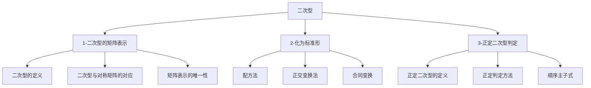

# 📑 二次型 - 知识索引

> [!info] 模块概述
> 本模块涵盖二次型的矩阵表示、标准化方法及正定二次型的判定，是线性代数的收尾章节，综合运用矩阵、特征值等知识。

## 📁 知识结构

## 📚 模块导航

| 模块 | 说明 | 重点程度 | 进度 |
|------|------|:--------:|------|
| [[1-二次型的矩阵表示]] | 二次型定义、对称矩阵表示 | ⭐⭐⭐⭐ | 🔴 0% |
| [[2-化为标准形]] | 配方法、正交变换、合同变换 | ⭐⭐⭐⭐⭐ | 🔴 0% |
| [[3-正定二次型判定]] | 正定定义、判定方法、顺序主子式 | ⭐⭐⭐⭐⭐ | 🔴 0% |

## 🎯 考试要点

> [!important] 重中之重
> 1. **化为标准形** - 配方法和正交变换法必须熟练掌握
> 2. **正定二次型的判定** - 全部特征值>0 等价于顺序主子式>0
> 3. **合同变换** - 与相似变换的区别与联系

## 📊 学习进度

参见：[[📊 学习进度]]

## 📝 笔记清单

### 1-二次型的矩阵表示
- 待学习

### 2-化为标准形
- 待学习

### 3-正定二次型判定
- 待学习

## 🔗 相关链接

- 前置章节：[[线代-特征值与特征向量/📑 索引]]
- 外部教材：`/Users/zhqznc/Documents/线性代数PDF/`
