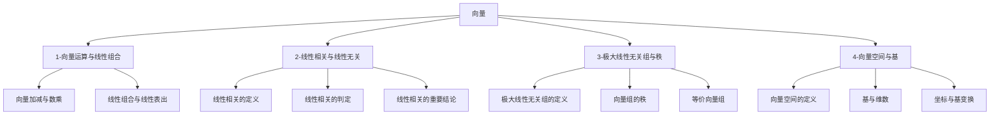

# 📑 向量 - 知识索引

> [!info] 模块概述
> 本模块涵盖向量的运算、线性相关与线性无关、极大无关组、向量空间与基等核心概念，是理解线性方程组解结构的理论基础。

## 📁 知识结构

## 📚 模块导航

| 模块 | 说明 | 重点程度 | 进度 |
|------|------|:--------:|------|
| [[1-向量运算与线性组合]] | 向量运算、线性组合与表出 | ⭐⭐⭐⭐ | 🔴 0% |
| [[2-线性相关与线性无关]] | 线性相关的定义、判定、重要结论 | ⭐⭐⭐⭐⭐ | 🔴 0% |
| [[3-极大线性无关组与秩]] | 极大无关组、向量组的秩 | ⭐⭐⭐⭐⭐ | 🔴 0% |
| [[4-向量空间与基]] | 向量空间、基与维数、坐标 | ⭐⭐⭐⭐ | 🔴 0% |

## 🎯 考试要点

> [!important] 重中之重
> 1. **线性相关与线性无关的判定** - 核心考点，需熟练掌握判定方法
> 2. **极大线性无关组的求法** - 初等行变换是关键工具
> 3. **向量组的秩** - 与矩阵的秩的关联常考

## 📊 学习进度

参见：[[📊 学习进度]]

## 📝 笔记清单

### 1-向量运算与线性组合
- 待学习

### 2-线性相关与线性无关
- 待学习

### 3-极大线性无关组与秩
- 待学习

### 4-向量空间与基
- 待学习

## 🔗 相关链接

- 前置章节：[[线代-矩阵/📑 索引]]
- 后续章节：[[线代-线性方程组/📑 索引]]
- 外部教材：`/Users/zhqznc/Documents/线性代数PDF/`
