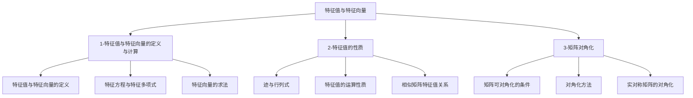

# 📑 特征值与特征向量 - 知识索引

> [!info] 模块概述
> 本模块涵盖特征值与特征向量的定义、计算、性质及矩阵对角化，是线性代数中最核心的章节之一，也是二次型的基础。

## 📁 知识结构

## 📚 模块导航

| 模块 | 说明 | 重点程度 | 进度 |
|------|------|:--------:|------|
| [[1-特征值与特征向量的定义与计算]] | 定义、特征方程、特征向量的求法 | ⭐⭐⭐⭐⭐ | 🔴 0% |
| [[2-特征值的性质]] | 迹与行列式、运算性质、相似关系 | ⭐⭐⭐⭐⭐ | 🔴 0% |
| [[3-矩阵对角化]] | 可对角化条件、对角化方法、实对称矩阵 | ⭐⭐⭐⭐⭐ | 🔴 0% |

## 🎯 考试要点

> [!important] 重中之重
> 1. **特征值与特征向量的计算** - $|A-\lambda E|=0$ 是核心方法
> 2. **矩阵对角化** - 可对角化的充要条件（n个线性无关特征向量）
> 3. **实对称矩阵对角化** - 不同特征值特征向量正交，必考
> 4. **特征值的性质** - $\sum \lambda_i = \operatorname{tr}(A)$，$\prod \lambda_i = |A|$

## 📊 学习进度

参见：[[📊 学习进度]]

## 📝 笔记清单

### 1-特征值与特征向量的定义与计算
- 待学习

### 2-特征值的性质
- 待学习

### 3-矩阵对角化
- 待学习

## 🔗 相关链接

- 前置章节：[[线代-矩阵/📑 索引]]、[[线代-向量/📑 索引]]
- 后续章节：[[线代-二次型/📑 索引]]
- 外部教材：`/Users/zhqznc/Documents/线性代数PDF/`
