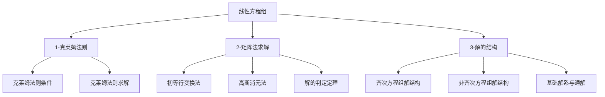

# 📑 线性方程组 - 知识索引

> [!info] 模块概述
> 本模块涵盖线性方程组的求解方法、解的结构与性质，是线性代数各章节知识的综合应用。

## 📁 知识结构

## 📚 模块导航

| 模块 | 说明 | 重点程度 | 进度 |
|------|------|:--------:|------|
| [[1-克莱姆法则]] | 克莱姆法则的适用条件与直接求解 | ⭐⭐⭐ | 🔴 0% |
| [[2-矩阵法求解]] | 初等行变换、高斯消元、解的判定 | ⭐⭐⭐⭐⭐ | 🔴 0% |
| [[3-解的结构]] | 齐次与非齐次方程组解结构、基础解系 | ⭐⭐⭐⭐⭐ | 🔴 0% |

## 🎯 考试要点

> [!important] 重中之重
> 1. **初等行变换求解** - 最通用的解法，必须熟练掌握
> 2. **解的结构** - 齐次解+特解=非齐次通解，必考
> 3. **解的判定定理** - 有解、唯一解、无穷多解的判定

## 📊 学习进度

参见：[[📊 学习进度]]

## 📝 笔记清单

### 1-克莱姆法则
- 待学习

### 2-矩阵法求解
- 待学习

### 3-解的结构
- 待学习

## 🔗 相关链接

- 前置章节：[[线代-向量/📑 索引]]、[[线代-行列式/📑 索引]]
- 后续章节：[[线代-特征值与特征向量/📑 索引]]
- 外部教材：`/Users/zhqznc/Documents/线性代数PDF/`
