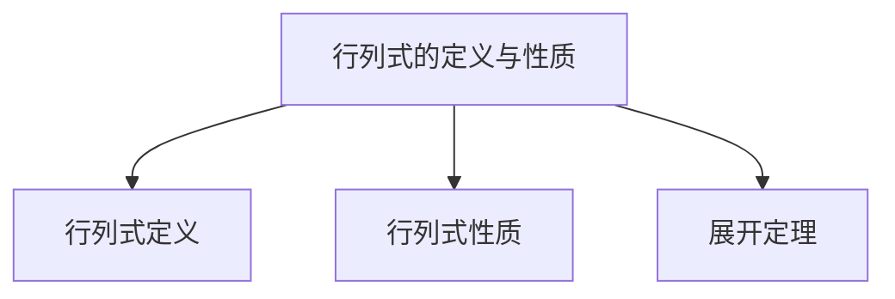

# 📑 行列式的定义与性质

> [!info] 模块概述
> n阶行列式的定义、基本性质和按行列展开定理。

## 📁 知识结构

```mermaid
graph TD
    A[行列式的定义与性质] --> B[行列式定义]
    A --> C[行列式性质]
    A --> D[展开定理]
```

## 📝 笔记清单
- 待学习

## 📊 学习进度
参见：[[📊 学习进度]]
