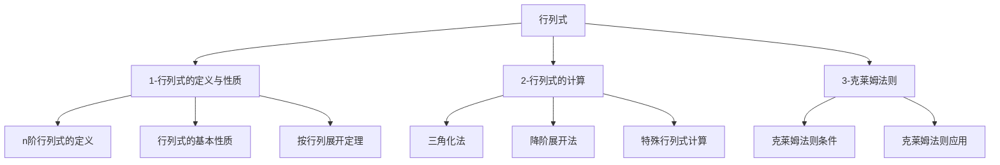

# 📑 行列式 - 知识索引

> [!info] 模块概述
> 本模块涵盖行列式的定义、性质、计算方法及克莱姆法则，是线性代数的第一章，也是后续矩阵和线性方程组的基础。

## 📁 知识结构

## 📚 模块导航

| 模块 | 说明 | 重点程度 | 进度 |
|------|------|:--------:|------|
| [[1-行列式的定义与性质]] | n阶行列式定义、基本性质、展开定理 | ⭐⭐⭐⭐ | 🔴 0% |
| [[2-行列式的计算]] | 三角化法、降阶展开法、特殊行列式 | ⭐⭐⭐⭐⭐ | 🔴 0% |
| [[3-克莱姆法则]] | 克莱姆法则条件与应用 | ⭐⭐⭐ | 🔴 0% |

## 🎯 考试要点

> [!important] 重中之重
> 1. **行列式的计算** - 三角化法和降阶法是核心方法
> 2. **按行列展开定理** - 拉普拉斯展开是计算的理论基础
> 3. **特殊行列式** - 范德蒙行列式、爪型行列式等常考

## 📊 学习进度

参见：[[📊 学习进度]]

## 📝 笔记清单

### 1-行列式的定义与性质
- 待学习

### 2-行列式的计算
- 待学习

### 3-克莱姆法则
- 待学习

## 🔗 相关链接

- 外部教材：`/Users/zhqznc/Documents/线性代数PDF/`
- 配套习题：待补充
