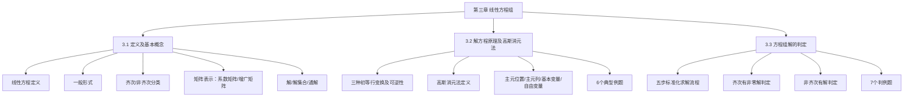

# 📑 线性方程组 - 知识索引

> [!info] 模块概述
> 本模块涵盖线性方程组的定义、矩阵表示、高斯消元法求解以及有解/无解/无穷多解的判定，是线性代数核心应用模块。

## 📁 知识结构

## 📚 模块导航

| 模块 | 说明 | 重点程度 | 进度 |
|------|------|:--------:|------|
| [[3.1-线性方程组的定义及基本概念]] | 线性方程定义、齐次/非齐次分类、矩阵表示、导出组 | ⭐⭐⭐⭐ | 📝 笔记已生成 |
| [[3.2-解方程原理及高斯消元法]] | 初等行变换、高斯消元法、主元/自由变量、6个例题 | ⭐⭐⭐⭐⭐ | 📝 笔记已生成 |
| [[3.3-方程组解的判定]] | 齐次/非齐次解的判定条件、7个判例题、判定流程图 | ⭐⭐⭐⭐⭐ | 📝 笔记已生成 |

## 🎯 考试要点

> [!important] 重中之重
> 1. **齐次有非零解**：$r(A) < n$（尤其注意 $m < n$ 时必有非零解）
> 2. **非齐次有解**：$r(A, \mathbf{b}) = r(A)$（核心判定条件）
> 3. **解的数量**：$r = n$ 唯一解，$r < n$ 无穷多解（自由变量 = $n - r$）
> 4. **高斯消元法**：必须熟练掌握消元法全过程

> [!warning] 易错点
> 1. $r(A) = n$ **不等于** $A\mathbf{x} = \mathbf{b}$ 有唯一解，还要满足 $r(A, \mathbf{b}) = r(A)$
> 2. 齐次方程组必有一个零解，讨论的是**是否有非零解**
> 3. 自由变量只能取**非主元列**对应的变量

## 📝 笔记清单

### 3.1 线性方程组的定义及基本概念 ✅ 已生成
- [[3.1-线性方程组的定义及基本概念]]

### 3.2 解方程原理及高斯消元法 ✅ 已生成
- [[3.2-解方程原理及高斯消元法]] ⭐⭐⭐⭐⭐

### 3.3 方程组解的判定 ✅ 已生成
- [[3.3-方程组解的判定]] ⭐⭐⭐⭐⭐

## 🔗 相关链接

- 来源教材：`/Users/zhqznc/Documents/线性资料/线性代数基础/第三章：线性方程/full.md`
- 前置模块：[[../行列式/📑 索引|第一章 行列式]] | [[../矩阵/📑 索引|第二章 矩阵]]
- 后续模块：第四章 向量与向量空间（待创建）
