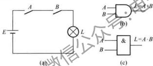
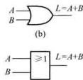
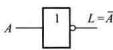
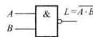
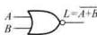
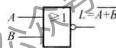
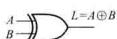
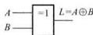
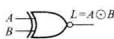
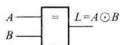

# 逻辑代数基础

> [!info] 概述
> 逻辑代数（Boolean Algebra）是分析和设计数字电路的**数学基础**，由英国数学家乔治·布尔于1849年提出。逻辑代数使用二值变量（0和1）表示逻辑状态，通过逻辑运算描述数字电路的功能。

> [!warning] 重要提示
> 本章是数字电路的核心，**逻辑函数化简是822考试的高频考点**，务必熟练掌握！

---

## 逻辑运算速记口诀 📝

> [!tip] 基本逻辑运算口诀
> | 运算 | 口诀 |
> |------|------|
> | **与运算** | 见零为零，全1为1 |
> | **或运算** | 见1为1，全零为零 |
> | **与非运算** | 见零为1，全1为零 |
> | **或非运算** | 见1为零，全零为1 |
> | **异或运算** | 相异为1，相同为零 |
> | **同或运算** | 相同为1，相异为零 |
> | **非运算** | 零变1，1变零 |

---

## 一、基本逻辑运算

### 1.1 逻辑与（AND）

> [!def] 与运算
> 当且仅当**所有输入都为1**时，输出才为1，否则输出为0。

**逻辑表达式**：
$$Y = A \cdot B = AB$$

**真值表**：

| $A$ | $B$ | $Y = A \cdot B$ |
|-----|-----|----------------|
| 0 | 0 | 0 |
| 0 | 1 | 0 |
| 1 | 0 | 0 |
| 1 | 1 | 1 |

**逻辑符号**：

国标符号：
![[考研专业课/数字电子技术/📎 附件/AND门.excalidraw]]

> [!note] 符号说明
> - 矩形框为国标符号（IEC标准）
> - `&` 符号表示与运算
> - 输出 Y = A · B



**运算规则**：
$$0 \cdot 0 = 0, \quad 0 \cdot 1 = 0, \quad 1 \cdot 0 = 0, \quad 1 \cdot 1 = 1$$

---

### 1.2 逻辑或（OR）

> [!def] 或运算
> 当**至少有一个输入为1**时，输出为1，否则输出为0。

**逻辑表达式**：
$$Y = A + B$$



**真值表**：

| $A$ | $B$ | $Y = A + B$ |
|-----|-----|------------|
| 0 | 0 | 0 |
| 0 | 1 | 1 |
| 1 | 0 | 1 |
| 1 | 1 | 1 |

**运算规则**：
$$0 + 0 = 0, \quad 0 + 1 = 1, \quad 1 + 0 = 1, \quad 1 + 1 = 1$$

---

### 1.3 逻辑非（NOT）

> [!def] 非运算
> 输出与输入状态**相反**。

**逻辑表达式**：
$$Y = \overline{A} = A'$$

  

  

图1.5.3 非逻辑运算 
**真值表**：

| $A$ | $Y = \overline{A}$ |
|-----|------------------|
| 0 | 1 |
| 1 | 0 |

**运算规则**：
$$\overline{0} = 1, \quad \overline{1} = 0$$

---

### 1.4 复合逻辑运算

#### 与非（NAND）

$$Y = \overline{A \cdot B}$$




| $A$ | $B$ | $Y$ |
|-----|-----|-----|
| 0 | 0 | 1 |
| 0 | 1 | 1 |
| 1 | 0 | 1 |
| 1 | 1 | 0 |

#### 或非（NOR）

$$Y = \overline{A + B}$$




| $A$ | $B$ | $Y$ |
|-----|-----|-----|
| 0 | 0 | 1 |
| 0 | 1 | 0 |
| 1 | 0 | 0 |
| 1 | 1 | 0 |

#### 异或（XOR）

$$Y = A \oplus B = A\overline{B} + \overline{A}B$$



| $A$ | $B$ | $Y$ |
|-----|-----|-----|
| 0 | 0 | 0 |
| 0 | 1 | 1 |
| 1 | 0 | 1 |
| 1 | 1 | 0 |

> [!tip] 异或特点
> - **相同为0，不同为1**
> - 常用于比较、加法器等电路

#### 同或（XNOR）

$$Y = A \odot B = \overline{A \oplus B} = AB + \overline{A}\,\overline{B}$$



| $A$ | $B$ | $Y$ |
|-----|-----|-----|
| 0 | 0 | 1 |
| 0 | 1 | 0 |
| 1 | 0 | 0 |
| 1 | 1 | 1 |

> [!tip] 异或与同或记忆方法 🧠
> - **名称联想**：**异**=不同→不同为1；**同**=相同→相同为1
> - **符号联想**：⊕ 加号→不同才"加1"；⊙ 圆点→相同才"圆满"
> - **关系记忆**：`XNOR = NOT(XOR)` — 同或是异或的反
> - **终极口诀**：**异找不同，同找相同**

---

## 二、逻辑代数的基本定律

### 2.1 常量运算规则

| 与运算 | 或运算 |
|--------|--------|
| $0 \cdot 0 = 0$ | $0 + 0 = 0$ |
| $0 \cdot 1 = 0$ | $0 + 1 = 1$ |
| $1 \cdot 0 = 0$ | $1 + 0 = 1$ |
| $1 \cdot 1 = 1$ | $1 + 1 = 1$ |

---

### 2.2 基本定律

> [!thm] 1-0律
> $$A + 0 = A, \quad A \cdot 0 = 0$$

> [!thm] 自等律
> $$A \cdot 1 = A, \quad A + 1 = 1$$

> [!thm] 重叠律（同一律）
> $$A + A = A, \quad A \cdot A = A$$

> [!thm] 互补律
> $$A + \overline{A} = 1, \quad A \cdot \overline{A} = 0$$

> [!thm] 还原律（双重否定律）
> $$\overline{\overline{A}} = A$$

> [!thm] 交换律
> $$A + B = B + A, \quad A \cdot B = B \cdot A$$

> [!thm] 结合律
> $$(A + B) + C = A + (B + C), \quad (A \cdot B) \cdot C = A \cdot (B \cdot C)$$

> [!thm] 分配律
> $$A(B + C) = AB + AC, \quad A + BC = (A + B)(A + C)$$

> [!example] 分配律证明：$A + BC = (A + B)(A + C)$
> **代数展开法**（从右边展开）：
> $$
> \begin{aligned}
> (A + B)(A + C) &= A \cdot A + A \cdot C + B \cdot A + B \cdot C \quad &\text{（分配律展开）} \\
> &= A + AC + AB + BC \quad &\text{（幂等律：}AA = A\text{）} \\
> &= A(1 + C) + AB + BC \quad &\text{（提取公因子）} \\
> &= A \cdot 1 + AB + BC \quad &\text{（}1 + C = 1\text{）} \\
> &= A + AB + BC \quad &\text{（}A \cdot 1 = A\text{）} \\
> &= A(1 + B) + BC \quad &\text{（再次提取公因子）} \\
> &= A \cdot 1 + BC \quad &\text{（}1 + B = 1\text{）} \\
> &= A + BC \quad &\text{证毕}
> \end{aligned}
> $$

> [!tip] 直观理解 💡
> 这个定理告诉我们：**"或运算可以分配到与运算中"** — 这与普通代数相反！
>
> | 普通代数 | 布尔代数 |
> |----------|----------|
> | $a(b + c) = ab + ac$ | $A + BC = (A + B)(A + C)$ |
> | 乘法对加法分配 | 或对与分配 |
>
> **口诀记忆**：**"或可以吃掉与"** — 把 $A$ "分配"进去，变成 $(A + B)(A + C)$

---

### 2.3 重要定律

> [!thm] 吸收律
> $$A + AB = A, \quad A(A + B) = A$$

> [!thm] 消去律
> $$A + \overline{A}B = A + B, \quad A(\overline{A} + B) = AB$$

> [!thm] 摩根定律（De Morgan's Laws）⭐⭐⭐
> $$\overline{A + B} = \overline{A} \cdot \overline{B}, \quad \overline{A \cdot B} = \overline{A} + \overline{B}$$

> [!tip] 摩根定律记忆技巧
> - **长非变短，与或互换**
> - "或"的非 = 非的"与"
> - "与"的非 = 非的"或"

> [!example] 例1：应用摩根定律
> **题目**：化简 $\overline{AB + C}$
>
> **解答**：
> $$\overline{AB + C} = \overline{AB} \cdot \overline{C} = (\overline{A} + \overline{B}) \cdot \overline{C}$$

> [!thm] 包含律
> $$AB + \overline{A}C + BC = AB + \overline{A}C$$
> $$(A + B)(\overline{A} + C)(B + C) = (A + B)(\overline{A} + C)$$

> [!tip] 结构记忆法 🏗️
> **识别特征**：
> ```
> AB + ĀC + BC = AB + ĀC
> ↑     ↑     ↑
> A    非A   多余项
> ```
> **口诀**：**"A与非A见面，第三项靠边"**
>
> 当两项分别含有 **A** 和 **非A** 时，第三项就是冗余的，可以删掉！

> [!note] 逻辑理解法 🧠
> 用**分类讨论**来理解：
>
> | A 的值 | $AB + \overline{A}C + BC$ 结果 | $AB + \overline{A}C$ 结果 |
> |--------|-------------------------------|--------------------------|
> | A = 1 | $1 \cdot B + 0 + BC = B$ | $1 \cdot B + 0 = B$ ✓ |
> | A = 0 | $0 + 1 \cdot C + BC = C$ | $0 + 1 \cdot C = C$ ✓ |
>
> **结论**：无论 A 取何值，BC 都不影响最终结果 → **BC 是多余的！**

---

## 三、逻辑代数的三个重要规则

### 3.1 代入规则

> [!def] 代入规则
> 在任何包含变量 $A$ 的逻辑等式中，若将所有出现 $A$ 的地方都代之以一个逻辑函数 $F$，则等式仍然成立。

> [!example] 例2：应用代入规则
> 已知 $\overline{A + B} = \overline{A} \cdot \overline{B}$，求 $\overline{A + B + C}$
>
> **解答**：
> 令 $D = B + C$，则：
> $$\overline{A + D} = \overline{A} \cdot \overline{D} = \overline{A} \cdot \overline{B + C} = \overline{A} \cdot \overline{B} \cdot \overline{C}$$

---

### 3.2 反演规则

> [!def] 反演规则
> 对于任意逻辑函数 $F$，若将其中：
> - 所有的 `·` 换成 `+`，`+` 换成 `·`
> - 所有的 `0` 换成 `1`，`1` 换成 `0`
> - 所有的**原变量**换成**反变量**，**反变量**换成**原变量**
>
> 则得到的新函数就是 $\overline{F}$。

> [!warning] 注意事项
> - 保持**运算顺序**不变（先括号内，后括号外；先与，后或）
> - **不属于单变量上的非号**应保持不变

> [!example] 例3：应用反演规则
> **题目**：求 $F = A\overline{B} + \overline{C}D$ 的反函数
>
> **解答**：
> 根据反演规则：
> $$\overline{F} = (\overline{A} + B)(C + \overline{D})$$

---

### 3.3 对偶规则

> [!def] 对偶规则
> 对于任意逻辑函数 $F$，若将其中：
> - 所有的 `·` 换成 `+`，`+` 换成 `·`
> - 所有的 `0` 换成 `1`，`1` 换成 `0`
>
> 则得到的新函数称为 $F$ 的对偶式 $F'$。

> [!tip] 对偶规则与反演规则的区别
> - 对偶规则：**不**对变量取反
> - 反演规则：**要**对变量取反

> [!example] 例4：求对偶式
> **题目**：求 $F = A + B\overline{C}$ 的对偶式
>
> **解答**：
> $$F' = A(B + \overline{C}) = AB + A\overline{C}$$

---

## 四、逻辑函数的表示方法

### 4.1 真值表

> [!def] 真值表
> 列出输入变量的所有可能组合及其对应输出值的表格。

> [!example] 例5：用真值表表示 $Y = AB + C$

| $A$ | $B$ | $C$ | $AB$ | $Y = AB + C$ |
|-----|-----|-----|-----|-------------|
| 0 | 0 | 0 | 0 | 0 |
| 0 | 0 | 1 | 0 | 1 |
| 0 | 1 | 0 | 0 | 0 |
| 0 | 1 | 1 | 0 | 1 |
| 1 | 0 | 0 | 0 | 0 |
| 1 | 0 | 1 | 0 | 1 |
| 1 | 1 | 0 | 1 | 1 |
| 1 | 1 | 1 | 1 | 1 |

---

### 4.2 逻辑表达式

**最小项（minterm）**：
- 定义：包含所有变量的乘积项，每个变量以原变量或反变量形式出现一次
- 表示：$m_i$，其中 $i$ 是对应二进制数的十进制值

**最大项（maxterm）**：
- 定义：包含所有变量的和项，每个变量以原变量或反变量形式出现一次
- 表示：$M_i$

> [!example] 最小项和最大项
> 对于3变量函数 $f(A,B,C)$：
> - $m_0 = \overline{A}\,\overline{B}\,\overline{C}$，对应 $M_0 = A + B + C$
> - $m_7 = ABC$，对应 $M_7 = \overline{A} + \overline{B} + \overline{C}$

**标准形式**：
- **最小项之和（SOP）**：$F = \sum m_i$
- **最大项之积（POS）**：$F = \prod M_i$

---

### 4.3 卡诺图（K-Map）

详见 [[考研专业课/数字电子技术/1-数字与码制/04-逻辑函数化简|逻辑函数化简]]

---

### 4.4 逻辑图

用逻辑符号连接而成的图形表示。

---

## 典型题型

> [!example] 题型1：证明逻辑等式
> **题目**：证明 $AB + \overline{A}C + BC = AB + \overline{A}C$
>
> **证明**：
> $$
> \begin{aligned}
> AB + \overline{A}C + BC &= AB + \overline{A}C + (A + \overline{A})BC \\
> &= AB + \overline{A}C + ABC + \overline{A}BC \\
> &= AB(1 + C) + \overline{A}C(1 + B) \\
> &= AB + \overline{A}C
> \end{aligned}
> $$

---

> [!example] 题型2：逻辑函数变换
> **题目**：将 $F = \overline{A + B} + \overline{C + D}$ 转换为与非-与非形式
>
> **解答**：
> $$
> \begin{aligned}
> F &= \overline{A + B} + \overline{C + D} \\
> &= \overline{A}\,\overline{B} + \overline{C}\,\overline{D} \quad \text{(摩根定律)} \\
> &= \overline{\overline{\overline{A}\,\overline{B} + \overline{C}\,\overline{D}}} \\
> &= \overline{\overline{\overline{A}\,\overline{B}} \cdot \overline{\overline{C}\,\overline{D}}} \quad \text{(二次取反)}
> \end{aligned}
> $$

---

## 易错点 ⚠️

| 易错点 | 错误表现 | 正确做法 |
|--------|----------|----------|
| 运算优先级 | 混淆与、或、非的优先级 | 非>与>或，括号改变优先级 |
| 摩根定律 | $\overline{A + B} \neq \overline{A} + \overline{B}$ | $\overline{A + B} = \overline{A} \cdot \overline{B}$ |
| 反演规则 | 忘记保持运算顺序 | 保持括号和优先级不变 |
| 代入规则 | 不完全代入 | 所有出现的地方都要代入 |

---

## 重要公式速查表

| 类别 | 公式 |
|------|------|
| 基本公式 | $A + 0 = A, A \cdot 1 = A$ |
| 互补律 | $A + \overline{A} = 1, A \cdot \overline{A} = 0$ |
| 重叠律 | $A + A = A, A \cdot A = A$ |
| 吸收律 | $A + AB = A, A + \overline{A}B = A + B$ |
| 摩根定律 | $\overline{AB} = \overline{A} + \overline{B}, \overline{A+B} = \overline{A}\,\overline{B}$ |
| 包含律 | $AB + \overline{A}C + BC = AB + \overline{A}C$ |

---

## 我的理解记录 🧠

---

## 相关知识点 📚

- [[考研专业课/数字电子技术/1-数字与码制/04-逻辑函数化简|逻辑函数化简]]
- [[考研专业课/数字电子技术/1-数字与码制/01-数制与转换|数制与转换]]

---

*创建日期: 2026-03-16*
