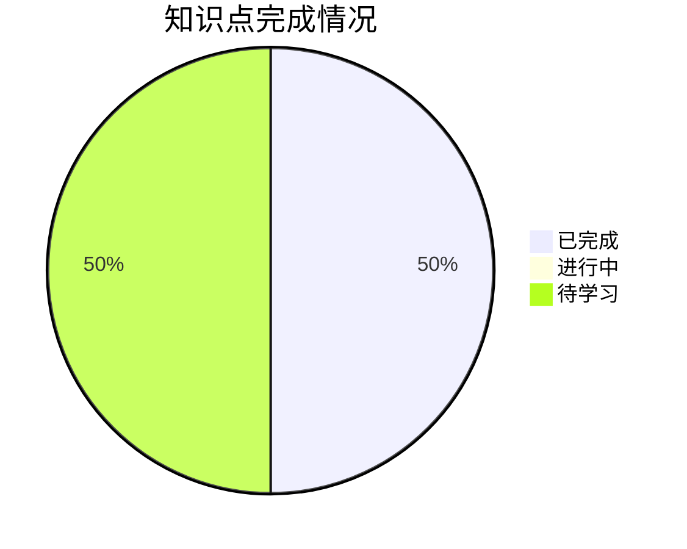

# 第一章：数字与码制 - 学习进度

## 📊 总体进度

| 统计项 | 数量 |
|--------|------|
| 总知识点 | 4 |
| 已完成 | 2 |
| 进行中 | 0 |
| 待学习 | 2 |
| **完成率** | **50%** |

---

## 📋 详细进度

### 1.1 数制与转换 (1/1) ✅ ⭐⭐⭐⭐

| 知识点 | 状态 | 开始日期 | 完成日期 | 备注 |
|--------|------|----------|----------|------|
| [[01-数制与转换]] | ✅ 已完成 | 2026-03-18 | 2026-03-18 | 二进制、八进制、十六进制转换 |

### 1.2 二进制代码 (1/1) ✅ ⭐⭐⭐

| 知识点 | 状态 | 开始日期 | 完成日期 | 备注 |
|--------|------|----------|----------|------|
| [[02-二进制代码]] | ✅ 已完成 | 2026-03-18 | 2026-03-18 | BCD码、格雷码、ASCII码 |

### 1.3 逻辑代数基础 (0/1) ⭐⭐⭐⭐⭐

| 知识点 | 状态 | 开始日期 | 完成日期 | 备注 |
|--------|------|----------|----------|------|
| [[03-逻辑代数基础]] | ⬜ 待学习 | - | - | ⭐ 考研必考：与或非、基本定律 |

### 1.4 逻辑函数化简 (0/1) ⭐⭐⭐⭐⭐

| 知识点 | 状态 | 开始日期 | 完成日期 | 备注 |
|--------|------|----------|----------|------|
| [[04-逻辑函数化简]] | ⬜ 待学习 | - | - | ⭐ 考研必考：卡诺图化简 |

---

## 📅 学习计划

### 本周目标
- [x] ✅ 完成 1.1 数制与转换 (2026-03-18)
- [x] ✅ 完成 1.2 二进制代码 (2026-03-18)
- [ ] 开始 1.3 逻辑代数基础

### 考试重点提醒

> [!warning] 五星重点
> 1. **逻辑代数基础**：与、或、非运算，基本定律
> 2. **卡诺图化简**：必考技能，需要熟练掌握

---

## 📝 错题记录

| 日期 | 题目类型 | 错误原因 | 相关知识点 | 复习状态 |
|------|----------|----------|------------|----------|
| - | - | - | - | - |

---

## 🧠 学习心得

> [!personal] 我的理解
> <!-- 记录学习过程中的感悟和理解 -->

> [!personal] 踩坑记录
> <!-- 记录容易犯的错误 -->

---

## 📚 知识关联

**前置知识**：无（入门章节）

**后续章节**：
- 第二章：逻辑门电路
- 第三章：组合逻辑电路
- 第四章：触发器

---

*创建日期: 2026-03-17*
*最后更新: 2026-03-18*

---

## 📅 学习记录

### 2026-03-18
- ✅ 完成 1.1 数制与转换
- ✅ 完成 1.2 二进制代码
- ⏱️ 学习用时：50分钟
