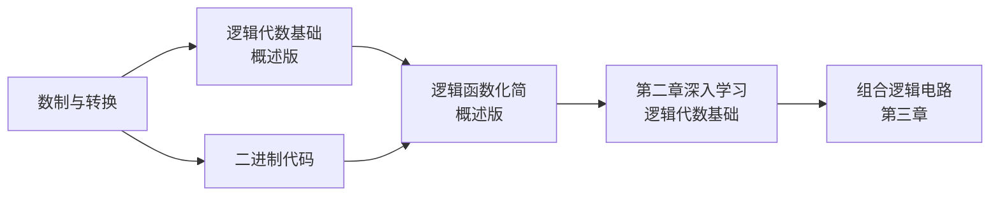

# 第一章：数字与码制

> [!info] 章节概述
> 本章是数字电子技术的**基础章节**，主要介绍数字电路中的数制、码制和逻辑代数基础。掌握本章内容是学习后续所有章节的前提。

> [!tip] 考试重要性
> 本章内容虽然基础，但**每年必考**，尤其逻辑函数化简是高频考点！

> [!warning] 822考纲对照
> **大纲要求**：
> 1. 数制和二进制代码的转换
> 2. 逻辑运算（代数法、卡诺图法）
>
> **已标注"⛔ 不考"的内容可跳过学习**

---

## 📚 知识点导航

### 1.1 数制与转换
[[考研专业课/数字电子技术/1-数字与码制/01-数制与转换|→ 数制与转换]]

**核心内容**：
- 十进制、二进制、八进制、十六进制 ✅
- 各种数制之间的转换方法 ✅
- 二进制算术运算 ✅
- ~~二进制波形表示~~ ⛔ 不考
- ~~串行/并行传输~~ ⛔ 不考
- ~~带符号数运算（原码/反码/补码）~~ ⛔ 不考

**考试频率**：⭐⭐⭐⭐

---

### 1.2 二进制代码
[[考研专业课/数字电子技术/1-数字与码制/02-二进制代码|→ 二进制代码]]

**核心内容**：
- BCD码-8421码 ✅
- ~~BCD码（2421码、余3码、5421码、余3循环码）~~ ⛔ 不考
- ~~ASCII码~~ ⛔ 不考
- 格雷码 ⚠️ 选学（了解基本概念即可）

**考试频率**：⭐⭐⭐

---

### 1.3 逻辑代数基础（概述版）
[[考研专业课/数字电子技术/1-数字与码制/03-逻辑代数基础|→ 逻辑代数基础]]

**核心内容**：
- 基本逻辑运算（与、或、非）
- 逻辑代数的基本定律和规则
- 逻辑函数的表示方法

> [!tip] 深度学习
> 详细内容请学习 [[考研专业课/数字电子技术/2-逻辑代数与硬件描述语言基础/|第二章：逻辑代数与硬件描述语言基础]]
> - 基本定律与规则详解：[[考研专业课/数字电子技术/2-逻辑代数与硬件描述语言基础/01-逻辑代数基本定律与规则|01-逻辑代数基本定律与规则]]
> - 表达式形式详解：[[考研专业课/数字电子技术/2-逻辑代数与硬件描述语言基础/02-逻辑函数表达式形式|02-逻辑函数表达式形式]]

**考试频率**：⭐⭐⭐⭐⭐

---

### 1.4 逻辑函数化简（概述版）
[[考研专业课/数字电子技术/1-数字与码制/04-逻辑函数化简|→ 逻辑函数化简]]

**核心内容**：
- 化简方法概述（代数法、卡诺图法）
- 基本化简技巧

> [!tip] 深度学习 ⭐必考
> 详细内容请学习 [[考研专业课/数字电子技术/2-逻辑代数与硬件描述语言基础/|第二章：逻辑代数与硬件描述语言基础]]
> - 代数化简法详解：[[考研专业课/数字电子技术/2-逻辑代数与硬件描述语言基础/03-代数化简法|03-代数化简法]]
> - 卡诺图化简法详解：[[考研专业课/数字电子技术/2-逻辑代数与硬件描述语言基础/04-卡诺图化简法|04-卡诺图化简法]] ⭐⭐⭐⭐⭐

**考试频率**：⭐⭐⭐⭐⭐

---

## 📝 章节总结
[[考研专业课/数字电子技术/1-数字与码制/📝 章节总结|→ 查看本章总结]]

---

## 🎯 学习路线

**学习建议**：
1. 先掌握**数制转换**，理解二进制是数字电路的基础
2. 理解**各种代码的用途**，了解BCD码用于十进制数表示
3. **第一章快速了解**逻辑代数和函数化简的基本概念
4. **第二章深度学习**逻辑代数基本定律、代数化简法、卡诺图化简法 ⭐必考
5. 第二章学习完毕后，进入第三章组合逻辑电路

---

## ⚠️ 常见错误

| 错误类型 | 表现 | 避免方法 |
|----------|------|----------|
| 数制转换 | 小数部分转换出错 | 分组时从低位到高位 |
| 卡诺图化简 | 卡诺圈画法错误 | 记住画圈规则，不遗漏 |
| 逻辑符号 | 混淆与、或、非 | 使用标准符号，明确优先级 |

---

## 🔗 知识关联

- **前置知识**：无（数字电路入门章节）
- **本章定位**：入门概述，建立基本概念
- **深度学习**：[[考研专业课/数字电子技术/2-逻辑代数与硬件描述语言基础/|第二章：逻辑代数与硬件描述语言基础]] ⭐核心章节
- **后续章节**：
  - [[考研专业课/数字电子技术/3-逻辑门电路/|第三章：逻辑门电路]]
  - [[考研专业课/数字电子技术/4-组合逻辑电路/|第四章：组合逻辑电路]]

---

*创建日期: 2026-03-16*
*最后更新: 2026-03-16*
