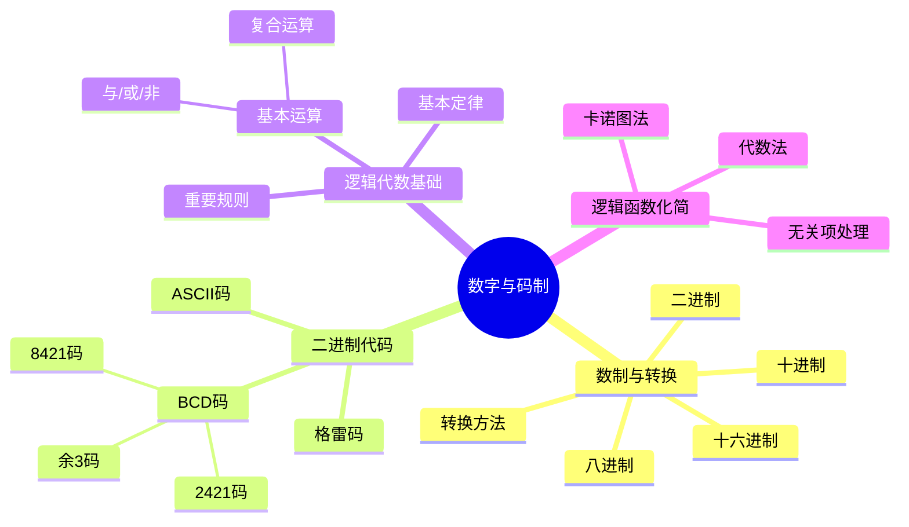

# 第一章：数字与码制 - 章节总结

> [!success] 章节学习目标
> - 掌握常用数制及其转换方法
> - 理解各种二进制编码的特点和应用
> - 熟练掌握逻辑代数的基本定律和规则
> - **重点掌握**逻辑函数的化简方法（代数法和卡诺图法）

---

## 📚 知识点结构图

---

## 🎯 核心考点总结

### 考点1：数制转换（⭐⭐⭐⭐）

| 转换类型 | 方法 | 要点 |
|----------|------|------|
| 二进制→十进制 | 按权展开 | 注意权值和位置 |
| 十进制→二进制 | 整数除2取余（逆序），小数乘2取整（顺序） | 分清整数和小数部分 |
| 二进制↔八进制 | 3位分组法 | 整数从右向左，小数从左向右 |
| 二进制↔十六进制 | 4位分组法 | 整数从右向左，小数从左向右 |

**常见错误**：
- ⚠️ 小数部分分组方向错误
- ⚠️ 除2取余时余数顺序错误
- ⚠️ 分组位数不足忘记补0

---

### 考点2：BCD码（⭐⭐⭐）

| 编码类型 | 特点 | 应用 |
|----------|------|------|
| **8421码** | 有权码，最常用 | 数字显示、BCD计数器 |
| 2421码 | 有权码，自补性 | 运算电路 |
| 余3码 | 无权码，自补性 | 十进制运算 |

**关键记忆**：
- 8421码禁止使用 $1010 \sim 1111$
- 每位十进制数**独立编码**

---

### 考点3：格雷码（⭐⭐⭐）

**特点**：
- 任意两个相邻码只有一位不同
- 具有循环性和反射性

**转换公式**：
- 二进制→格雷码：$G_i = B_i \oplus B_{i+1}$
- 格雷码→二进制：$B_i = G_i \oplus B_{i+1}$

---

### 考点4：逻辑代数基本定律（⭐⭐⭐⭐⭐）

**必须熟记的公式**：

| 类别 | 公式 |
|------|------|
| 基本公式 | $A + 0 = A, \quad A \cdot 1 = A$ |
| 互补律 | $A + \overline{A} = 1, \quad A \cdot \overline{A} = 0$ |
| 重叠律 | $A + A = A, \quad A \cdot A = A$ |
| 交换律 | $A + B = B + A$ |
| 结合律 | $(A + B) + C = A + (B + C)$ |
| 分配律 | $A(B + C) = AB + AC$ |
| 吸收律 | $A + AB = A$ |
| 消去律 | $A + \overline{A}B = A + B$ |
| **摩根定律** ⭐ | $\overline{AB} = \overline{A} + \overline{B}, \quad \overline{A+B} = \overline{A} \cdot \overline{B}$ |
| 包含律 | $AB + \overline{A}C + BC = AB + \overline{A}C$ |

---

### 考点5：卡诺图化简（⭐⭐⭐⭐⭐）

**圈画规则（6条）**：
1. 圈内方格数必须是 $2^n$ 个
2. 圈尽量大
3. 圈的个数尽量少
4. 每个圈至少包含一个独立的1
5. 不能遗漏任何一个为1的方格
6. 卡诺图具有循环邻接性

**化简技巧**：
- 先圈孤立的1
- 再圈只能按一种方式画的圈
- 最后画剩余的1

**变量消去规则**：
- 圈内某变量取值全为0 → 该变量取反
- 圈内某变量取值全为1 → 该变量保留
- 圈内某变量取值有0有1 → 该变量消去

---

## 🔗 知识关联

### 与后续章节的联系

| 本章知识点 | 后续章节 | 关联程度 |
|------------|----------|----------|
| 逻辑代数 | 第二章：逻辑门电路 | ⭐⭐⭐⭐⭐ |
| 逻辑函数化简 | 第三章：组合逻辑电路 | ⭐⭐⭐⭐⭐ |
| 二进制代码 | 存储器、A/D转换 | ⭐⭐⭐ |

### 前置知识检查

- [ ] 熟练掌握二进制算术运算
- [ ] 理解逻辑变量与逻辑运算
- [ ] 能够熟练进行数制转换

---

## 📝 典型题型与解题策略

### 题型1：数制转换综合题

**解题步骤**：
1. 明确转换类型
2. 选择正确的转换方法
3. 分整数和小数部分分别处理
4. 验证结果

---

### 题型2：逻辑函数化简（代数法）

**解题策略**：
1. 观察函数结构，选择合适的公式
2. 灵活运用吸收、消去、配项等方法
3. 化简到最简与或式（乘积项最少，变量最少）

---

### 题型3：逻辑函数化简（卡诺图法）⭐

**解题步骤**：
1. 将函数填入卡诺图
2. 按圈画规则画圈
3. 写出每个圈的乘积项
4. 相加得到最简与或式

**注意**：
- 有无关项时合理利用
- 循环邻接特性
- 变量消去规则

---

### 题型4：证明逻辑等式

**常用方法**：
- 从左到右化简
- 从右到左化简
- 两边同时化简到相同形式
- 真值表证明

---

## ⚠️ 本章易错点汇总

| 易错点 | 错误表现 | 避免方法 |
|--------|----------|----------|
| 数制转换 | 小数分组方向错误 | 记住：小数从左向右 |
| 8421码 | 使用非法码 | 记住：1010~1111禁用 |
| 摩根定律 | $\overline{A+B} \neq \overline{A}+\overline{B}$ | 记忆：与或互换 |
| 卡诺图 | 圈的大小不是 $2^n$ | 检查圈内方格数 |
| 卡诺图 | 忘记循环邻接 | 记住：首尾相邻 |
| 无关项 | 单独圈× | ×必须和1一起圈 |

---

## 📊 复习检查清单

### 基础概念
- [ ] 能熟练进行各种数制之间的转换
- [ ] 掌握8421码、余3码、格雷码的编码规则
- [ ] 理解ASCII码的基本概念

### 逻辑代数
- [ ] 熟记逻辑代数的基本定律
- [ ] 熟练应用摩根定律
- [ ] 掌握逻辑函数的表示方法（真值表、表达式、卡诺图）

### 逻辑函数化简
- [ ] 能用代数法化简简单逻辑函数
- [ ] **熟练掌握**卡诺图化简法（3变量、4变量）
- [ ] 掌握具有无关项的逻辑函数化简
- [ ] 能进行不同形式之间的转换（与或、或与、与非-与非）

---

## 🎓 模拟测试题

### 测试题1：数制转换
将 $(175.625)_{10}$ 转换为二进制、八进制和十六进制。

查看答案

- 二进制：$(10101111.101)_2$
- 八进制：$(257.5)_8$
- 十六进制：$(AF.A)_{16}$

---

### 测试题2：逻辑函数化简（卡诺图）
化简 $F(A,B,C,D) = \sum m(0, 2, 4, 5, 6, 8, 10, 12, 14)$

查看答案

$$F = \overline{D} + \overline{A}B$$

---

### 测试题3：逻辑函数化简（代数法）
化简 $F = AB + \overline{A}C + \overline{B}C$

查看答案

$$F = AB + C$$

解析：$F = AB + C(\overline{A} + \overline{B}) = AB + C\overline{AB} = AB + C$

---

## 📈 学习建议

1. **夯实基础**：数制转换和逻辑代数是后续所有内容的基础
2. **多做练习**：卡诺图化简需要大量练习才能熟练
3. **总结规律**：总结常见化简技巧和易错点
4. **联系实际**：思考这些知识在实际电路中的应用

---

## 🔗 相关文件

- [[考研专业课/数字电子技术/1-数字与码制/📑 索引|第一章索引]]
- [[考研专业课/数字电子技术/1-数字与码制/01-数制与转换|数制与转换]]
- [[考研专业课/数字电子技术/1-数字与码制/02-二进制代码|二进制代码]]
- [[考研专业课/数字电子技术/1-数字与码制/03-逻辑代数基础|逻辑代数基础]]
- [[考研专业课/数字电子技术/1-数字与码制/04-逻辑函数化简|逻辑函数化简]]

---

*创建日期: 2026-03-16*
*最后更新: 2026-03-16*
