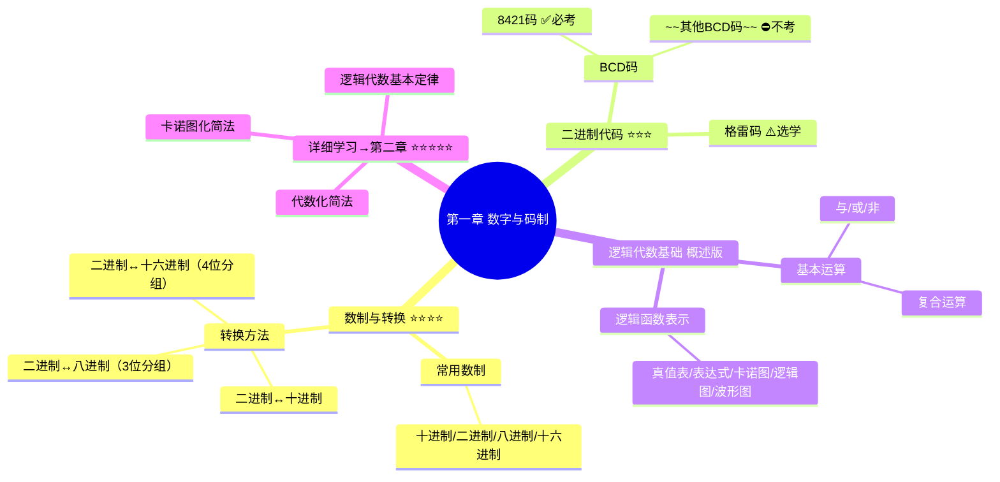

# 第一章：数字与码制 - 章节总结

> [!success] 章节定位
> 本章是数字电子技术的**入门概述章节**，建立基本概念。
> - **数制转换**：需要熟练掌握 ✅
> - **二进制代码**：掌握8421码，了解格雷码
> - **逻辑代数基础**：概述版，**详细内容在第二章** ⭐

---

## 📚 知识点结构图

---

## 🎯 核心考点速查

### 考点1：数制转换（⭐⭐⭐⭐）

| 转换类型 | 方法 | 口诀 |
|----------|------|------|
| 二进制→十进制 | 按权展开 | $\sum k_i \times 2^i$ |
| 十进制→二进制 | 整数除2取余（**逆序**），小数乘2取整（顺序） | 整逆小顺 |
| 二进制→八进制 | **3位分组**（整数右→左，小数左→右） | 三位一组 |
| 二进制→十六进制 | **4位分组**（整数右→左，小数左→右） | 四位一组 |

> [!example] 综合转换题
> 将 $(37.25)_{10}$ 转换为二进制、十六进制、8421BCD码
>
> **解答**：
> - **二进制**：
>   - 整数：$37 \div 2$ 逆序取余 → $100101$
>   - 小数：$0.25 \times 2$ 顺序取整 → $01$
>   - 结果：$(100101.01)_2$
> - **十六进制**：4位分组 $(0010\,0101.0100)_2 = (25.4)_{16}$
> - **8421BCD**：每位独立编码 $(0011\,0111.0010\,0101)_{8421}$

---

### 考点2：8421BCD码（⭐⭐⭐）

> [!def] 8421码
> 用**4位二进制**表示**1位十进制**，权值为 $8,4,2,1$

**关键记忆**：
- 禁止使用 $1010 \sim 1111$（非法码/伪码）
- **每位十进制数独立编码**，不是整体转换

| 十进制 | 8421码 | 十进制 | 8421码 |
|--------|--------|--------|--------|
| 0 | 0000 | 5 | 0101 |
| 1 | 0001 | 6 | 0110 |
| 2 | 0010 | 7 | 0111 |
| 3 | 0011 | 8 | 1000 |
| 4 | 0100 | 9 | 1001 |

---

### 考点3：格雷码（⚠️选学）

> [!info] 考纲说明
> 了解基本概念即可，不需要深入掌握转换公式。

**核心特点**：任意两个相邻码**只有一位不同**

**转换公式**（了解）：
- 二进制→格雷码：$G_i = B_i \oplus B_{i+1}$
- 格雷码→二进制：$B_i = G_i \oplus B_{i+1}$

---

### 考点4：基本逻辑运算（⭐⭐⭐⭐⭐）

> [!tip] 速记口诀
> | 运算 | 口诀 | 表达式 |
> |------|------|--------|
> | **与** | 见零为零，全1为1 | $Y = A \cdot B$ |
> | **或** | 见1为1，全零为零 | $Y = A + B$ |
> | **非** | 零变1，1变零 | $Y = \overline{A}$ |
> | **与非** | 见零为1，全1为零 | $Y = \overline{AB}$ |
> | **或非** | 见1为零，全零为1 | $Y = \overline{A+B}$ |
> | **异或** | **异**找不同 | $Y = A \oplus B$ |
> | **同或** | **同**找相同 | $Y = A \odot B$ |

---

### 考点5：逻辑函数表示方法

五种表示法可**相互转换**：

| 方法 | 特点 | 适用场景 |
|------|------|----------|
| 真值表 | 唯一、完整、直观 | 验证、分析 |
| 逻辑表达式 | 便于运算、化简 | 推导、化简 |
| 卡诺图 | **化简专用** ⭐ | 第二章重点 |
| 逻辑图 | 直观反映电路 | 工程设计 |
| 波形图 | 时序关系 | 动态分析 |

> [!tip] 重要提示
> 详细的**逻辑代数定律**、**代数化简法**、**卡诺图化简法**在**第二章**深入学习！

---

## ⚠️ 易错点汇总

| 易错点 | 错误表现 | 正确做法 |
|--------|----------|----------|
| 小数分组 | 方向错误 | 小数从**左向右**分组 |
| 除2取余 | 顺序错误 | **逆序**读取余数 |
| 补零位置 | 乱补零 | 整数高位、小数低位补零 |
| 8421码 | 整体转二进制 | **每位独立编码** |
| 8421非法码 | 使用1010~1111 | 这6种状态禁止 |
| 异或/同或 | 混淆 | **异**找不同，**同**找相同 |

---

## 📊 复习检查清单

### 数制转换
- [ ] 能熟练进行十进制↔二进制转换
- [ ] 掌握3位/4位分组法（二进制↔八/十六进制）
- [ ] 注意小数部分的分组方向

### 二进制代码
- [ ] 掌握8421BCD码的编码规则
- [ ] 记住8421码的非法码范围
- [ ] 了解格雷码的相邻性特点

### 逻辑代数基础
- [ ] 熟记与、或、非、异或、同或的真值表
- [ ] 理解五种逻辑函数表示法及其转换
- [ ] **准备进入第二章深入学习**

---

## 🔗 知识关联

### 本章 → 第二章

| 第一章（概述） | 第二章（详解） |
|---------------|---------------|
| 基本逻辑运算 | 逻辑代数基本定律与规则 ⭐ |
| 逻辑函数表示法 | 逻辑函数表达式形式 |
| 化简方法概述 | 代数化简法详解 |
| 卡诺图概念 | 卡诺图化简法 ⭐⭐⭐⭐⭐ |

> [!important] 学习路径
> 第一章建立概念 → **第二章深入学习** → 第三章组合逻辑电路

---

## 📖 相关文件

- [[考研专业课/数字电子技术/1-数字与码制/📑 索引|第一章索引]]
- [[考研专业课/数字电子技术/1-数字与码制/01-数制与转换|数制与转换]]
- [[考研专业课/数字电子技术/1-数字与码制/02-二进制代码|二进制代码]]
- [[考研专业课/数字电子技术/1-数字与码制/03-逻辑代数基础|逻辑代数基础]]
- → [[考研专业课/数字电子技术/2-逻辑代数与硬件描述语言基础/|第二章：逻辑代数与硬件描述语言基础]] ⭐核心章节

---

*创建日期: 2026-03-16*
*最后更新: 2026-03-24*
