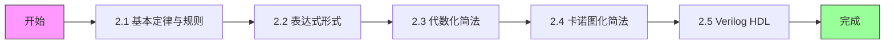

# 第二章：逻辑代数与硬件描述语言基础 - 学习进度

## 📈 总体进度

**章节完成度**：`[████████    ]` 80%

---

## 📋 知识点清单

| 序号  | 知识点                                  | 考试频率  | 学习状态  |    完成日期    | 备注               |
| :-: | ------------------------------------ | :---: | :---: | :--------: | ---------------- |
| 2.1 | [逻辑代数基本定律与规则](01-逻辑代数基本定律与规则.md)     | ⭐⭐⭐⭐  | ✅ 已完成 | 2026-03-25 | 摩根定理、反演规则是重点     |
| 2.2 | [逻辑函数表达式形式](02-逻辑函数表达式形式.md)         |  ⭐⭐⭐  | ✅ 已完成 | 2026-03-25 | 最小项概念是卡诺图基础      |
| 2.3 | [代数化简法](03-代数化简法.md)                 | ⭐⭐⭐⭐  | ✅ 已完成 | 2026-03-25 | 四种化简方法要熟练        |
| 2.4 | [卡诺图化简法](04-卡诺图化简法.md)               | ⭐⭐⭐⭐⭐ | ✅ 已完成 | 2026-03-26 | **必考！** 无关项化简要掌握 |
| 2.5 | [Verilog HDL基础](05-Verilog HDL基础.md) |  ⭐⭐   | ⬜ 跳过 |     -      | 不需要学习         |

---

## 📅 学习记录

| 日期 | 学习内容 | 学习时长 | 完成情况 | 备注 |
|:----:|----------|:--------:|:--------:|------|
| 2026-03-25 | 2.1 逻辑代数基本定律与规则 | 83分钟 | ✅ 完成 | 摩根定理、反演规则、对偶规则 |
| 2026-03-25 | 2.2 逻辑函数表达式形式 | - | ✅ 完成 | 最小项、最大项、标准形式 |
| 2026-03-25 | 2.3 代数化简法 | - | ✅ 完成 | 并项法、吸收法、消去法、配项法 |
| 2026-03-26 | 2.4 卡诺图化简法 | 47分钟 | ✅ 完成 | 2-4变量卡诺图、画包围圈原则、无关项化简 |
| 2026-04-17 | 第二章全面复习+习题练习 | 107分钟 | ✅ 复习巩固 | 全部知识点复习完成 |

---

## 🎯 重点突破清单

### 必须掌握（⭐⭐⭐⭐⭐）
- [x] **卡诺图化简法** ✅ 2026-03-26
  - [x] 2-4变量卡诺图的绘制
  - [x] 画包围圈的原则
  - [x] 具有无关项的化简
  - [x] 最简与-或式求解

### 重点掌握（⭐⭐⭐⭐）
- [ ] **摩根定理（反演律）**
  - [ ] $\overline{A \cdot B} = \overline{A} + \overline{B}$
  - [ ] $\overline{A + B} = \overline{A} \cdot \overline{B}$
- [ ] **反演规则与对偶规则**
- [ ] **代数化简四种方法**
  - [ ] 并项法
  - [ ] 吸收法
  - [ ] 消去法
  - [ ] 配项法

### 了解即可（⭐⭐）
- [ ] Verilog HDL基本语法
- [ ] wire和reg类型
- [ ] 三种描述方式

---

## ⚠️ 薄弱知识点

> [!warning] 需要重点复习
> 暂无记录

---

## 📝 错题记录

> [!danger] 错题本
> 暂无记录

---

## 🔗 相关链接

- [[考研专业课/数字电子技术/2-逻辑代数与硬件描述语言基础/📑 索引|章节索引]]
- [[考研专业课/数字电子技术/2-逻辑代数与硬件描述语言基础/📝 章节总结|章节总结]]
- [[考研专业课/数字电子技术/📊 学习进度|总学习进度]]

---

*创建日期: 2026-03-20*
*最后更新: 2026-04-17*
