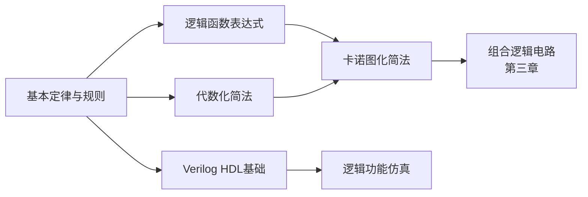
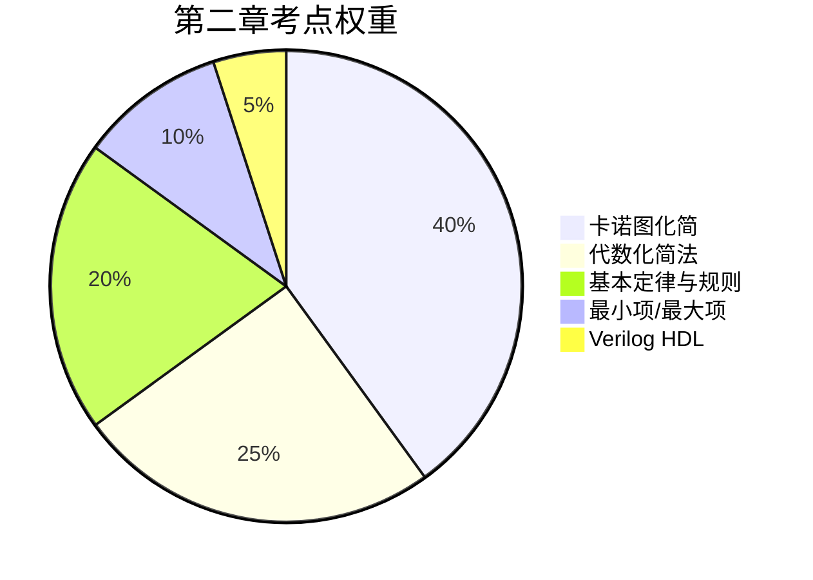

# 第二章：逻辑代数与硬件描述语言基础

> [!info] 章节概述
> 本章介绍分析和设计数字电路的数学工具——逻辑代数，以及硬件描述语言Verilog HDL的基础知识。逻辑代数是数字电路分析和设计的核心工具，**卡诺图化简是必考内容**。

> [!tip] 考试重要性
> **本章是数电的核心基础，每年必考！**
> - 逻辑代数基本定律：⭐⭐⭐⭐
> - 逻辑函数化简（卡诺图）：⭐⭐⭐⭐⭐ **必考**
> - Verilog HDL基础：⭐⭐

> [!warning] 822考纲对照
> **大纲要求**：
> 1. 逻辑代数的基本定律和规则
> 2. 逻辑函数的表示方法
> 3. 逻辑函数的化简方法（代数法、卡诺图法）
> 4. 硬件描述语言Verilog HDL基础（了解）

---

## 📚 知识点导航

### 2.1 逻辑代数基本定律与规则
[[考研专业课/数字电子技术/2-逻辑代数与硬件描述语言基础/01-逻辑代数基本定律与规则|→ 逻辑代数基本定律与规则]]

**核心内容**：
- 基本定律（或、与、非）
- 交换律、结合律、分配律 ✅
- 吸收律 ✅
- 反演律（摩根定理）⭐ 重要
- 代入规则、反演规则、对偶规则 ⭐ 重要
- **基本逻辑运算口诀**：
  - 与：见零为零，全1为1
  - 或：见1为1，全零为零
  - 与非：见零为1，全1为零
  - 或非：见1为零，全零为1
  - 异或：相异为1，相同为零
  - 同或：相同为1，相异为零

**考试频率**：⭐⭐⭐⭐

---

### 2.2 逻辑函数表达式形式
[[考研专业课/数字电子技术/2-逻辑代数与硬件描述语言基础/02-逻辑函数表达式形式|→ 逻辑函数表达式形式]]

**核心内容**：
- 与-或表达式（SOP）/ 或-与表达式（POS）
- 最小项的定义、性质、编号 ⭐
- 最大项的定义、性质、编号
- 最小项与最大项的关系：$m_i = \overline{M_i}$
- 最小项表达式、最大项表达式

**考试频率**：⭐⭐⭐

---

### 2.3 代数化简法
[[考研专业课/数字电子技术/2-逻辑代数与硬件描述语言基础/03-代数化简法|→ 代数化简法]]

**核心内容**：
- 最简与-或表达式的标准
- **并项法**：$A + \overline{A} = 1$ ✅
- **吸收法**：$A + AB = A$ ✅
- **消去法**：$A + \overline{A}B = A + B$ ✅
- **配项法**：$A = A(B + \overline{B})$ ✅
- 逻辑函数形式变换

**考试频率**：⭐⭐⭐⭐

---

### 2.4 卡诺图化简法 ⭐⭐⭐⭐⭐ **必考**
[[考研专业课/数字电子技术/2-逻辑代数与硬件描述语言基础/04-卡诺图化简法|→ 卡诺图化简法]]

**核心内容**：
- 卡诺图的引出（1-4变量）
- 卡诺图的特点（相邻性）
- 用卡诺图表示逻辑函数 ✅
- **化简依据和步骤** ⭐
- **画包围圈原则** ⭐⭐⭐
- **具有无关项的化简** ⭐⭐⭐

**考试频率**：⭐⭐⭐⭐⭐ **必考！**

---

### 2.5 Verilog HDL基础
[[考研专业课/数字电子技术/2-逻辑代数与硬件描述语言基础/05-Verilog HDL基础|→ Verilog HDL基础]]

**核心内容**：
- HDL的基本概念（仿真、综合）
- 4种逻辑值（0、1、x、z）
- 变量数据类型（wire、reg）
- 模块基本结构
- 三种描述方式（门级、数据流assign、行为always）

**考试频率**：⭐⭐（了解即可）

---

## 📝 章节总结
[[考研专业课/数字电子技术/2-逻辑代数与硬件描述语言基础/📝 章节总结|→ 查看本章总结]]

---

## 🎯 学习路线

**学习建议**：
1. 先掌握**基本定律**，特别是摩根定理和三个规则
2. 理解**最小项/最大项**概念，为卡诺图打基础
3. **重点突破**代数化简法，掌握四种常用方法
4. **熟练掌握**卡诺图化简法，这是必考技能！
5. Verilog HDL了解基本概念即可

---

## ⚠️ 常见错误

| 错误类型 | 表现 | 避免方法 |
|----------|------|----------|
| 反演规则 | 忘记保持原式运算优先级 | 加括号保持原式结构 |
| 对偶规则 | 变量也取反了 | 只换运算符和0/1，变量不变 |
| 卡诺图画圈 | 圈内方格数不是 $2^n$ | 必须是1、2、4、8个方格 |
| 卡诺图相邻 | 忘记四角相邻 | 记住上下底、左右边、四角都相邻 |
| 无关项 | 不知道×怎么处理 | ×可当0也可当1，使圈最大 |

---

## 🔗 知识关联

- **前置知识**：[[考研专业课/数字电子技术/1-数字与码制/|第一章：数字与码制]]
- **后续章节**：
  - [[考研专业课/数字电子技术/3-逻辑门电路/|第三章：逻辑门电路]]
  - [[考研专业课/数字电子技术/4-组合逻辑电路/|第四章：组合逻辑电路]]
- **跨学科关联**：
  - 数学：布尔代数、集合论
  - 离散数学：逻辑运算

---

## 📊 考点权重分布

---

*创建日期: 2026-03-20*
*最后更新: 2026-03-20*
