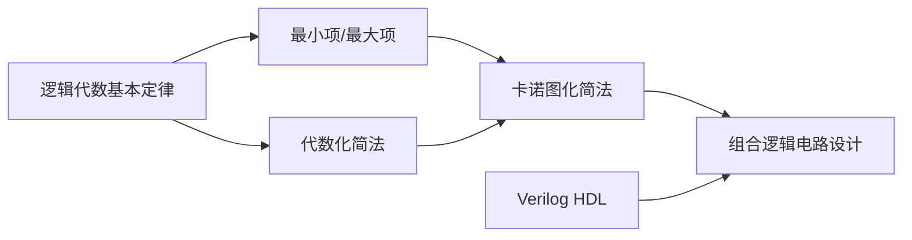

# 📝 第二章 逻辑代数与硬件描述语言基础 - 章节总结

> [!abstract] 章节概述
> 本章是数字电子技术的**数学基础**，涵盖逻辑代数的基本定律、逻辑函数的表示与化简、以及Verilog HDL基础。**卡诺图化简是必考内容**，必须熟练掌握。

---

## 📊 知识点结构

```
第二章 逻辑代数与硬件描述语言基础
├── 1. 逻辑代数基本定律与规则 ⭐⭐⭐⭐
│   ├── 基本定律（0-1律、重叠律、互补律、还原律）
│   ├── 交换律、结合律、分配律
│   ├── 吸收律（4种形���）⭐
│   ├── 摩根定理（反演律）⭐⭐⭐
│   ├── 异或与同或 ⭐
│   ├── 多余项定理
│   └── 三大规则：代入、反演、对偶
│
├── 2. 逻辑函数表达式形式 ⭐⭐⭐
│   ├── 基本形式：与-或（SOP）、或-与（POS）
│   ├── 最小项（定义、编号、三性质）⭐⭐⭐
│   ├── 最大项（定义、编号、三性质）
│   ├── 最小项与最大项的关系（互补��
│   └── 真值表与标准表达式转换
│
├── 3. 代数化简法 ⭐⭐⭐⭐
│   ├── 最简标准：项数最少、变量最少
│   ├── 四种方法：并项、吸收、消去、配项
│   ├── 逻辑函数形式变换（与非-与非、或非-或非）
│   └── 局限性：无固定步骤，需经验
│
├── 4. 卡诺图化简法 ⭐⭐⭐⭐⭐ 必考
│   ├── 卡诺图结构（1-4变量、格雷码排列）
│   ├── 相邻性（几何相邻 = 逻辑相邻）
│   ├── 合并规律（2格消1变量，4格消2变量...）
│   ├── 化简步骤与画圈原则
│   ├── 无关项处理 ⭐⭐⭐
│   └── 圈0求反函数
│
└── 5. Verilog HDL基础 ⭐⭐
    ├── HDL用途：仿真、综合
    ├── 四种逻辑值：0、1、x、z
    ├── 数据类型：wire、reg（区别对比）
    ├── 模块基本结构
    ├── 三种描述方式：门级、数据流、行为
    └── 常用运算符
```

---

## 🔢 核心公式汇总

### 一、基本定律

| 定律名称 | 或形式 | 与形式 |
|:--------:|:------:|:------:|
| 0-1律 | $A + 0 = A$，$A + 1 = 1$ | $A \cdot 1 = A$，$A \cdot 0 = 0$ |
| 重叠律 | $A + A = A$ | $A \cdot A = A$ |
| 互补律 | $A + \overline{A} = 1$ | $A \cdot \overline{A} = 0$ |
| 还原律 | - | $\overline{\overline{A}} = A$ |

### 二、重要定理 ⭐

| 定理名称 | 公式 | 记忆口诀 |
|:--------:|:----:|:--------:|
| **分配律（第二形式）** | $A + BC = (A+B)(A+C)$ | 分配律有两种形式 |
| **吸收律1** | $A + AB = A$ | 有A吸收AB |
| **吸收律2** | $A(A+B) = A$ | 有A吸收(A+B) |
| **吸收律3** ⭐ | $A + \overline{A}B = A + B$ | 消去$\overline{A}$ |
| **吸收律4** | $A(\overline{A}+B) = AB$ | 消去$\overline{A}$ |
| **摩根定理** ⭐⭐⭐ | $\overline{AB} = \overline{A} + \overline{B}$ | 断开连接，各自取反 |
| | $\overline{A+B} = \overline{A} \cdot \overline{B}$ | |
| **多余项定理** | $AB + \overline{A}C + BC = AB + \overline{A}C$ | BC冗余可消去 |

### 三、异或与同或 ⭐

| 运算 | 定义式 | 性质 |
|:----:|:------:|:----:|
| **异或** $\oplus$ | $A \oplus B = A\overline{B} + \overline{A}B$ | 相异为1，相同为0 |
| **同或** $\odot$ | $A \odot B = AB + \overline{A}\overline{B} = \overline{A \oplus B}$ | 相同为1，相异为0 |

**异或性质**：
- $A \oplus 0 = A$
- $A \oplus 1 = \overline{A}$
- $A \oplus A = 0$
- $A \oplus \overline{A} = 1$

### 四、化简方法公式

| 方法 | 核心公式 | 适用场景 |
|:----:|:--------:|:--------:|
| 并项法 | $A + \overline{A} = 1$ | 有互补因子 |
| 吸收法 | $A + AB = A$ | 有公共因子 |
| 消去法 | $A + \overline{A}B = A + B$ | 有互补变量 |
| 配项法 | $A = A(B + \overline{B})$ | 增项消其他项 |

### 五、最小项与最大项

| 项目 | 最小项 $m_i$ | 最大项 $M_i$ |
|:----:|:------------:|:------------:|
| 形式 | 乘积项（与） | 和项（或） |
| 编号规则 | 原变量=1，反变量=0 | 原变量=0，反变量=1 |
| 值为1的条件 | 对应输入组合 | - |
| 值为0的条件 | - | 对应输入组合 |
| 关系 | $m_i = \overline{M_i}$ | $M_i = \overline{m_i}$ |

**最小项三性质**：
1. **唯一性**：每个最小项只有一组变量取值使其为1
2. **互斥性**：$m_i \cdot m_j = 0$（$i \neq j$）
3. **完备性**：$\sum_{i=0}^{2^n-1} m_i = 1$

**最大项三性质**：
1. 每个最大项只有一组变量取值使其为0
2. $M_i + M_j = 1$（$i \neq j$）
3. $\prod_{i=0}^{2^n-1} M_i = 0$

---

## 🎯 基本逻辑运算口诀 ⭐

| 运算 | 口诀 | 说明 |
|:----:|:----:|:----:|
| **与** | 见零为零，全1为1 | 有0出0 |
| **或** | 见1为1，全零为零 | 有1出1 |
| **与非** | 见零为1，全1为零 | 先与后非 |
| **或非** | 见1为零，全零为1 | 先或后非 |
| **异或** | 相异为1，相同为零 | 不同出1 |
| **同或** | 相同为1，相异为零 | 相同出1 |
| **非** | 零变1，1变零 | 取反 |

---

## 🎯 重点考点提炼

### 考点1：摩根定理应用 ⭐⭐⭐

$$\overline{A \cdot B} = \overline{A} + \overline{B}$$
$$\overline{A + B} = \overline{A} \cdot \overline{B}$$

**推广形式**：
$$\overline{A \cdot B \cdot C \cdots} = \overline{A} + \overline{B} + \overline{C} + \cdots$$

> [!tip] 记忆
> 与变或，或变与，每个变量取反

### 考点2：反演规则 ⭐⭐

**变换规则**：
- "+" ↔ "·"
- 原变量 ↔ 反变量
- 0 ↔ 1
- **长非号（非单个变量上的非号）保持不变**

> [!warning] 关键区分
> | 类型 | 例子 | 处理方式 |
> |:----:|:----:|:--------:|
> | 单个变量上的非号 | $\bar{A}$、$\bar{B}$ | 变量取反 |
> | 长非号 | $\overline{A+B}$、$\overline{A \cdot B}$ | **保持不变** |

### 考点3：对偶规则 ⭐

**变换规则**：
- "+" ↔ "·"
- 0 ↔ 1
- **变量不变**
- 长非号保持不变

> [!tip] 反演 vs 对偶
> | 规则 | 变量处理 | 用途 |
> |:----:|:--------:|:----:|
> | 反演 | 变量取反 | 求反函数 |
> | 对偶 | 变量不变 | 证明等式、记忆公式 |

### 考点4：最小项表达式 ⭐⭐⭐

$$L = \sum m(1,3,5,7)$$

**转换方法**：配项补齐所有变量

**例**：$L = AB + \overline{A}C$
$$L = AB(C+\overline{C}) + \overline{A}C(B+\overline{B}) = \sum m(1,3,6,7)$$

### 考点5：最小项转最大项 ⭐⭐

**核心**：下标取补集！

若 $L = \sum m(1,3,5,7)$，则 $L = \prod M(0,2,4,6)$

> [!danger] 典型错误
> - ❌ 直接把最小项下标套进最大项
> - ✅ 取补集下标

**最大项写法规则**：变量为0写原变量，变量为1写反变量
- $M_0(000) \to (A+B+C)$
- $M_1(001) \to (A+B+\overline{C})$

### 考点6：卡诺图化简 ⭐⭐⭐⭐⭐ 必考

#### 合并最小项规律

| 相邻格数 | 消去变量数 | 结果 |
|:--------:|:----------:|:----:|
| 2格 | 1个变量 | 2个乘积项合并 |
| 4格 | 2个变量 | 4个乘积项合并 |
| 8格 | 3个变量 | 8个乘积项合并 |
| $2^n$格 | n个变量 | - |

#### 画圈四原则

1. **$2^n$原则**：圈内格数必须是 $2^n$ 个
2. **首尾相邻**：上下底、左右边、四角相邻
3. **重复覆盖**：每个圈必须有新方格
4. **大圈优先**：圈越大越好，圈数越少越好

> [!tip] 记忆口诀
> **"能大则大，能少则少，有新就行，$2^n$个"**

#### 卡诺图编码（格雷码）

| 变量数 | 行编码 | 列编码 |
|:------:|:------:|:------:|
| 2变量 | A=0,1 | B=0,1 |
| 3变量 | A=0,1 | BC=00,01,11,10 |
| 4变量 | AB=00,01,11,10 | CD=00,01,11,10 |

> [!warning] 易错
> 列编码是 **00, 01, 11, 10**（格雷码），不是 00, 01, 10, 11！

### 考点7：无关项化简 ⭐⭐⭐⭐

- 无关项用 **×** 或 **φ** 表示
- 可当1用，也可当0用
- 目标：使圈最大
- **用不上的×当0处理**

**常见情况**：
- BCD码只有0~9，10~15不会出现
- 约束条件（如 $BC=0$）

### 考点8：逻辑函数形式变换 ⭐⭐

**与非-与非式**：对与-或式取两次非
$$L = AB + \overline{A}C = \overline{\overline{AB} \cdot \overline{\overline{A}C}}$$

**或非-或非式**：对或-与式取两次非

---

## 📐 卡诺图结构速查

### 三变量卡诺图

|  | $BC=00$ | $BC=01$ | $BC=11$ | $BC=10$ |
|:---:|:---:|:---:|:---:|:---:|
| **$A=0$** | $m_0$ | $m_1$ | $m_3$ | $m_2$ |
| **$A=1$** | $m_4$ | $m_5$ | $m_7$ | $m_6$ |

### 四变量卡诺图

|  | $CD=00$ | $CD=01$ | $CD=11$ | $CD=10$ |
|:---:|:---:|:---:|:---:|:---:|
| **$AB=00$** | $m_0$ | $m_1$ | $m_3$ | $m_2$ |
| **$AB=01$** | $m_4$ | $m_5$ | $m_7$ | $m_6$ |
| **$AB=11$** | $m_{12}$ | $m_{13}$ | $m_{15}$ | $m_{14}$ |
| **$AB=10$** | $m_8$ | $m_9$ | $m_{11}$ | $m_{10}$ |

> [!tip] 相邻类型
> - **上下相邻**：相邻行对应位置
> - **左右相邻**：相邻列对应位置
> - **首尾相邻** ⭐：最上与最下、最左与最右
> - **四角相邻** ⭐：四个角的小方格两两相邻

---

## 📝 典型题型速查

### 题型1：反演规则求反函数

**题目**：求 $Y = A\overline{B} + C\overline{D}E$ 的反函数

**解答**：
$$\overline{Y} = (\overline{A} + B) \cdot (\overline{C} + D + \overline{E})$$

### 题型2：反演规则（含长非号）

**题目**：求 $Y = A + \overline{B + \overline{C} + \overline{D+E}}$ 的反函数

**解答**：
$$\overline{Y} = \overline{A} \cdot \overline{\overline{B} \cdot C \cdot \overline{\overline{D} \cdot \overline{E}}}$$
$$= \overline{A} \cdot \overline{\overline{B} \cdot C \cdot (D+E)}$$

### 题型3：转换为最小项表达式

**题目**：将 $L = (A + B)\overline{C} + \overline{A}BC$ 转换为最小项表达式

**解答**：
$$L = A\overline{C} + B\overline{C} + \overline{A}BC$$
$$= A\overline{C}(B + \overline{B}) + B\overline{C}(A + \overline{A}) + \overline{A}BC$$
$$= \sum m(2, 3, 4, 6)$$

### 题型4：最小项转最大项

**题目**：将 $Y = \bar{A}B + AC$ 化为最大项之积形式

**解答**：
1. 补齐最小项：$Y = \sum m(2,3,5,7)$
2. 取补集：$Y = \prod M(0,1,4,6)$
3. 写表达式：$Y = (A+B+C)(A+B+\bar{C})(\bar{A}+B+C)(\bar{A}+\bar{B}+C)$

> [!tip] 避坑口诀
> "最小项看1，最大项看0；下标要互补，变量写相反。"

### 题型5：代数化简（综合）

**题目**：化简 $L = AD + A\overline{D} + AB + \overline{A}C + BD + A\overline{B}EF + \overline{B}EF$

**解答**：
1. 并项：$AD + A\overline{D} = A$
2. 吸收：$A + AB = A$
3. 消去：$A + \overline{A}C = A + C$
4. 结果：$L = A + C + BD + \overline{B}EF$

### 题型6：卡诺图化简（含无关项）

**题目**：化简 $L = \sum m(0,2,3,7) + d(4,6)$

**解答**：
- 圈1：m₀, m₂, m₄(×), m₆(×) → $\overline{C}$
- 圈2：m₃, m₂, m₇, m₆(×) → $B$
- 结果：$L = \overline{C} + B$

### 题型7：约束条件化简

**题目**：化简 $Z = A\overline{B} + \overline{A}\overline{B}C + \overline{A}B\overline{C}$，约束条件 $BC = 0$

**解答**：
- 约束 $BC=0$ 意味着 $m_3, m_7$ 是无关项
- 利用无关项化简

### 题型8：圈0求反函数

**题目**：$L = \sum m(0 \sim 3, 5 \sim 11, 13 \sim 15)$

**分析**：1很多（13个），0很少（3个：m₄, m₁₂）

**解答**：
- 圈0：m₄, m₁₂ → $B\overline{C}\overline{D}$
- 反函数：$\overline{L} = B\overline{C}\overline{D}$
- 原函数：$L = \overline{B} + C + D$

---

## 💻 Verilog HDL 速查

### 四种逻辑值

| 逻辑值 | 含义 | 说明 |
|:------:|:----:|:----:|
| **0** | 逻辑0、低电平 | 假 |
| **1** | 逻辑1、高电平 | 真 |
| **x/X** | 不定态 | 仿真时出现 |
| **z/Z** | 高阻态 | 开路状态 |

### wire 与 reg 对比 ⭐

| 特性 | wire | reg |
|:----:|:----:|:---:|
| 物理意义 | 连线 | 存储 |
| 默认值 | z | x |
| 赋值方式 | assign | always/initial |
| 综合结果 | 组合逻辑 | 组合或时序逻辑 |

### 三种描述方式

| 描述方式 | 关键字 | 特点 | 适用场景 |
|:--------:|:------:|:----:|:--------:|
| 门级 | and/or/not | 最接近电路 | 简单门电路 |
| 数据流 | assign | 简洁直观 | 组合逻辑 |
| 行为 | always | 抽象灵活 | 复杂逻辑、时序电路 |

### 常用运算符

| 类型 | 运算符 | 含义 |
|:----:|:------:|:----:|
| **位运算** | `~` `&` `\|` `^` `~^` | 按位取反、与、或、异或、同或 |
| **逻辑运算** | `!` `&&` `\|\|` | 逻辑非、与、或 |
| **缩位运算** | `&A` `\|A` `^A` | 对所有位运算，结果1位 |
| **条件运算** | `? :` | 三目运算符 |

### 模块基本结构

```verilog
module 模块名(端口列表);
    input  [位宽] 端口名;
    output [位宽] 端口名;
    wire [位宽] 信号名;
    reg  [位宽] 信号名;
    // 功能描述
endmodule
```

---

## ⚠️ 易错点汇总

| 易错点 | 错误表现 | 正确做法 |
|:------:|:--------:|:--------:|
| 卡诺图编码 | 00,01,10,11 | **格雷码：00,01,11,10** |
| 四角相邻 | 忘记四角可圈 | 四个角是一个4格圈 |
| 首尾相邻 | 忘记上下/左右相邻 | 卡诺图是"环形" |
| 圈内格数 | 圈3个或5个格 | 必须是 $2^n$ 个 |
| 反演规则 | 变量没取反/长非号变了 | 变量取反，长非号不变 |
| 对偶规则 | 把变量也取反了 | **只换运算符，变量不变** |
| 最大项编号 | 与最小项编号相同 | **编号规则相反** |
| 最小项→最大项 | 直接套用相同下标 | **取补集下标** |
| 配项法 | 越配越繁 | 选择合适的项配项 |
| 无关项 | 全部用上或全不用 | 选择性使用，使圈最大 |
| 圈重复 | 没有新方格的圈 | 每个圈必须有新方格 |

---

## 🔗 知识点关联



---

## 📚 相关文件

- [[01-逻辑代数基本定律与规则]]
- [[02-逻辑函数表达式形式]]
- [[03-代数化简法]]
- [[04-卡诺图化简法]]
- [[05-Verilog HDL基础]]
- [[📑 索引]]
- [[📊 学习进度]]

---

## 🎯 学习建议

> [!tip] 复习优先级
> 1. **卡诺图化简**（必考，反复练习）
> 2. **摩根定理 + 反演规则**（常考）
> 3. **最小项表达式**（基础概念）
> 4. **代数化简法**（辅助方法）
> 5. **Verilog HDL**（了解即可）

> [!warning] 刷题建议
> - 卡诺图：至少练习20道题，包含无关项
> - 反演规则：注意长非号处理
> - 最小项转换：熟练配项法
> - 最大项转换：记住下标取补集

---

*总结日期: 2026-03-27*
