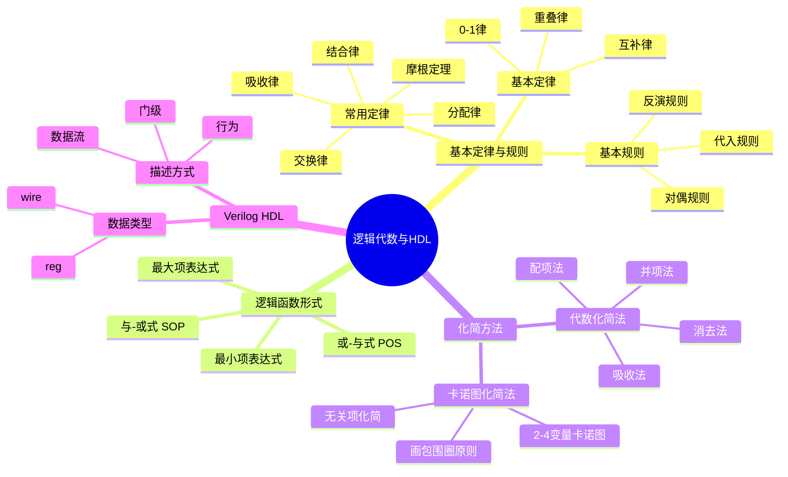
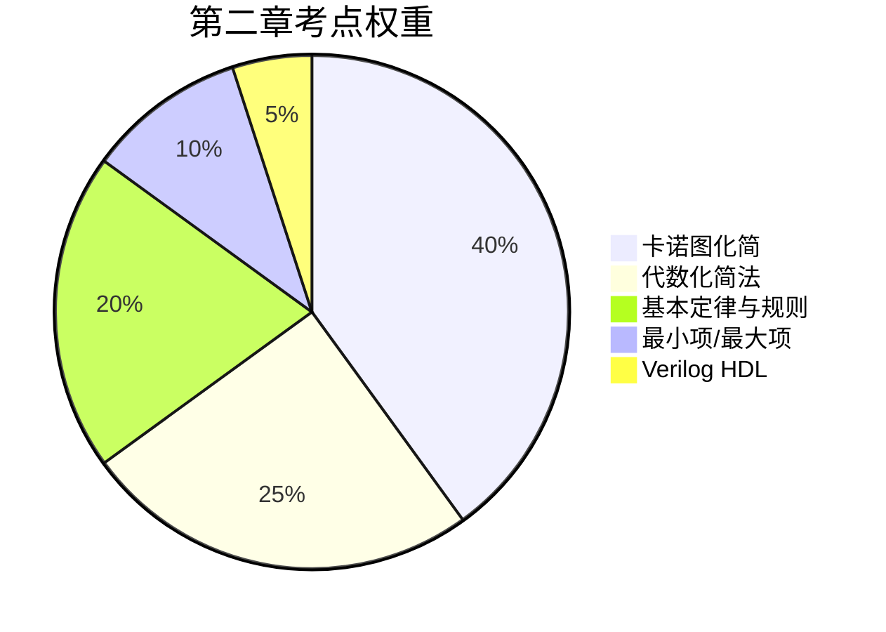

# 第二章：逻辑代数与硬件描述语言基础 - 章节总结

## 📋 知识框架



---

## 🎯 核心公式速查表

### 一、基本定律

| 定律 | 或形式 | 与形式 |
|:----:|:------:|:------:|
| 0-1律 | $A + 0 = A$, $A + 1 = 1$ | $A \cdot 1 = A$, $A \cdot 0 = 0$ |
| 重叠律 | $A + A = A$ | $A \cdot A = A$ |
| 互补律 | $A + \overline{A} = 1$ | $A \cdot \overline{A} = 0$ |
| 还原律 | - | $\overline{\overline{A}} = A$ |

### 二、常用定律

| 定律 | 公式 |
|:----:|:----:|
| 交换律 | $A + B = B + A$, $AB = BA$ |
| 结合律 | $(A+B)+C = A+(B+C)$ |
| 分配律 | $A(B+C) = AB + AC$ ⭐ |
| | $A + BC = (A+B)(A+C)$ ⭐ |
| 吸收律 | $A + AB = A$ |
| | $A + \overline{A}B = A + B$ ⭐ |

### 三、摩根定理 ⭐⭐⭐

$$\overline{A \cdot B} = \overline{A} + \overline{B}$$

$$\overline{A + B} = \overline{A} \cdot \overline{B}$$

**口诀**：断开连接，各自取反

### 四、最小项与最大项关系

$$m_i = \overline{M_i}$$

---

## 🔥 必考知识点

### 1. 反演规则 vs 对偶规则 ⭐⭐⭐⭐

| 规则 | 运算符变换 | 变量处理 | 0/1变换 |
|:----:|:----------:|:--------:|:-------:|
| 反演 | ·↔+ | **取反** | 0↔1 |
| 对偶 | ·↔+ | **不变** | 0↔1 |

### 2. 卡诺图画圈四原则 ⭐⭐⭐⭐⭐

1. **$2^n$原则**：圈内格数必须是1、2、4、8、16
2. **首尾相邻**：上下底、左右边、四角都相邻
3. **有新方格**：每个圈必须有新的方格
4. **大圈优先**：圈越大越好，圈数越少越好

**口诀**：能大则大，能少则少，有新就行，$2^n$个

### 3. 无关项处理 ⭐⭐⭐⭐

- × 可以当1用，也可以当0用
- 目标：使包围圈尽可能大
- 用不上的×就当0

---

## 📝 典型例题精炼

### 例1：反演规则

**题目**：求 $Y = A\overline{B} + C\overline{D}E$ 的反函数

**答案**：$\overline{Y} = (\overline{A} + B)(\overline{C} + D + \overline{E})$

### 例2：最小项表达式转换

**题目**：将 $L = AB + \overline{A}C$ 转换为最小项表达式

**答案**：
$$L = ABC + AB\overline{C} + \overline{A}BC + \overline{A}\overline{B}C = \sum m(1,3,6,7)$$

### 例3：卡诺图化简（含无关项）⭐⭐⭐⭐⭐

**题目**：化简 $Y(A,B,C) = \sum m(0,2,3,7) + \sum d(4,6)$

**解答**：
```
       BC
     00  01  11  10
   ┌───┬───┬───┬───┐
A=0│ 1 │ 0 │ 1 │ 1 │
   ├───┼───┼───┼───┤
A=1│ × │ 0 │ 1 │ × │
   └───┴───┴───┴───┘
```

画圈：
- 圈1：m₀, m₂, m₄(×), m₆(×) → $\overline{C}$
- 圈2：m₃, m₂, m₇, m₆(×) → $B$

**答案**：$Y = \overline{C} + B$

---

## ⚠️ 易错点汇总

| 易错点 | 正确做法 |
|--------|----------|
| 卡诺图列编码 | 用格雷码 **00,01,11,10** |
| 四角相邻 | 四个角是一个4格圈 |
| 反演规则 | 变量要取反，保持优先级 |
| 对偶规则 | 变量**不**取反 |
| 最小项编号 | 原变量取1，反变量取0 |
| 最大项编号 | 原变量取0，反变量取1 |
| wire默认值 | 高阻态 **z** |
| reg默认值 | 不定态 **x** |

---

## 📊 考点权重



---

## 🔗 知识关联

- **前置**：[[考研专业课/数字电子技术/1-数字与码制/|第一章：数字与码制]]
- **后续**：
  - [[考研专业课/数字电子技术/3-逻辑门电路/|第三章：逻辑门电路]]
  - [[考研专业课/数字电子技术/4-组合逻辑电路/|第四章：组合逻辑电路]]
- **跨学科**：离散数学（布尔代数）

---

## 📚 相关文件

- [[考研专业课/数字电子技术/2-逻辑代数与硬件描述语言基础/📑 索引|章节索引]]
- [[考研专业课/数字电子技术/2-逻辑代数与硬件描述语言基础/📊 学习进度|学习进度]]

---

*创建日期: 2026-03-20*
