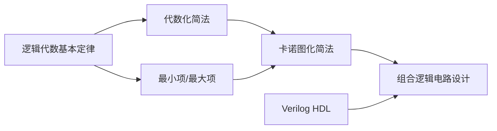

# 📝 第二章 逻辑代数与硬件描述语言基础 - 章节总结

> [!abstract] 章节概述
> 本章是数字电子技术的**数学基础**，涵盖逻辑代数的基本定律、逻辑函数的表示与化简、以及Verilog HDL基础。**卡诺图化简是必考内容**，必须熟练掌握。

---

## 📊 知识点结构

```
第二章 逻辑代数与硬件描述语言基础
├── 1. 逻辑代数基本定律与规则 ⭐⭐⭐⭐
│   ├── 基本定律（0-1律、重叠律、互补律、还原律）
│   ├── 交换律、结合律、分配律
│   ├── 吸收律（4种形式）⭐
│   ├── 摩根定理（反演律）⭐⭐⭐
│   ├── 多余项定理
│   └── 三大规则：代入、反演、对偶
│
├── 2. 逻辑函数表达式形式 ⭐⭐⭐
│   ├── 基本形式：与-或（SOP）、或-与（POS）
│   ├── 最小项（定义、编号、性质）⭐⭐⭐
│   ├── 最大项（定义、编号、性质）
│   ├── 最小项与最大项的关系（互补）
│   └── 真值表与标准表达式转换
│
├── 3. 代数化简法 ⭐⭐⭐⭐
│   ├── 最简标准：项数最少、变量最少
│   ├── 四种方法：并项、吸收、消去、配项
│   └── 局限性：无固定步骤，需经验
│
├── 4. 卡诺图化简法 ⭐⭐⭐⭐⭐ 必考
│   ├── 卡诺图结构（格雷码排列）
│   ├── 相邻性（几何相邻 = 逻辑相邻）
│   ├── 化简步骤与原则
│   ├── 无关项处理 ⭐⭐⭐
│   └── 圈0求反函数
│
└── 5. Verilog HDL基础 ⭐⭐
    ├── HDL用途：仿真、综合
    ├── 四种逻辑值：0、1、x、z
    ├── 数据类型：wire、reg
    └── 三种描述方式：门级、数据流、行为
```

---

## 🔢 核心公式汇总

### 一、基本定律

| 定律名称 | 或形式 | 与形式 |
|:--------:|:------:|:------:|
| 0-1律 | $A + 0 = A$，$A + 1 = 1$ | $A \cdot 1 = A$，$A \cdot 0 = 0$ |
| 重叠律 | $A + A = A$ | $A \cdot A = A$ |
| 互补律 | $A + \overline{A} = 1$ | $A \cdot \overline{A} = 0$ |
| 还原律 | - | $\overline{\overline{A}} = A$ |

### 二、重要定理 ⭐

| 定理名称 | 公式 | 记忆口诀 |
|:--------:|:----:|:--------:|
| **分配律（第二形式）** | $A + BC = (A+B)(A+C)$ | 分配律有两种形式 |
| **吸收律1** | $A + AB = A$ | 有A吸收AB |
| **吸收律2** | $A(A+B) = A$ | 有A吸收(A+B) |
| **吸收律3** ⭐ | $A + \overline{A}B = A + B$ | 消去$\overline{A}$ |
| **摩根定理** ⭐⭐⭐ | $\overline{AB} = \overline{A} + \overline{B}$ | 断开连接，各自取反 |
| | $\overline{A+B} = \overline{A} \cdot \overline{B}$ | |
| **多余项定理** | $AB + \overline{A}C + BC = AB + \overline{A}C$ | BC冗余可消去 |

### 三、化简方法公式

| 方法 | 核心公式 | 适用场景 |
|:----:|:--------:|:--------:|
| 并项法 | $A + \overline{A} = 1$ | 有互补因子 |
| 吸收法 | $A + AB = A$ | 有公共因子 |
| 消去法 | $A + \overline{A}B = A + B$ | 有互补变量 |
| 配项法 | $A = A(B + \overline{B})$ | 增项消其他项 |

### 四、最小项与最大项

| 项目 | 最小项 $m_i$ | 最大项 $M_i$ |
|:----:|:------------:|:------------:|
| 形式 | 乘积项（与） | 和项（或） |
| 编号规则 | 原变量=1，反变量=0 | 原变量=0，反变量=1 |
| 值为1的条件 | 对应输入组合 | - |
| 值为0的条件 | - | 对应输入组合 |
| 关系 | $m_i = \overline{M_i}$ | $M_i = \overline{m_i}$ |

---

## 🎯 重点考点提炼

### 考点1：摩根定理应用 ⭐⭐⭐

$$\overline{A \cdot B} = \overline{A} + \overline{B}$$
$$\overline{A + B} = \overline{A} \cdot \overline{B}$$

> [!tip] 记忆
> 与变或，或变与，每个变量取反

### 考点2：反演规则 ⭐⭐

**变换规则**：
- "+" ↔ "·"
- 原变量 ↔ 反变量
- 0 ↔ 1
- **长非号保持不变**

### 考点3：最小项表达式 ⭐⭐⭐

$$L = \sum m(1,3,5,7)$$

**转换方法**：配项补齐所有变量

### 考点4：卡诺图化简 ⭐⭐⭐⭐⭐ 必考

**画圈四原则**：
1. 圈内格数 = $2^n$
2. 首尾相邻、四角相邻
3. 每圈必须有新方格
4. 大圈优先，圈数最少

**记忆口诀**：能大则大，能少则少，有新就行，$2^n$个

### 考点5：无关项化简 ⭐⭐⭐⭐

- 无关项用 × 或 φ 表示
- 可当1用，也可当0用
- 目标：使圈最大
- **用不上的×当0处理**

---

## ⚠️ 易错点汇总

| 易错点 | 错误表现 | 正确做法 |
|:------:|:--------:|:--------:|
| 卡诺图编码 | 00,01,10,11 | **格雷码：00,01,11,10** |
| 四角相邻 | 忘记四角可圈 | 四个角是一个4格圈 |
| 首尾相邻 | 忘记上下/左右相邻 | 卡诺图是"环形" |
| 反演规则 | 变量没取反/长非号变了 | 变量取反，长非号不变 |
| 对偶规则 | 把变量也取反了 | **只换运算符，变量不变** |
| 最大项编号 | 与最小项编号相同 | **编号规则相反** |
| 最小项→最大项 | 直接套用相同下标 | **取补集下标** |
| 配项法 | 越配越繁 | 选择合适的项配项 |

---

## 📝 典型题型速查

### 题型1：反演规则求反函数

**题目**：求 $Y = A\overline{B} + C\overline{D}E$ 的反函数

**解答**：
$$\overline{Y} = (\overline{A} + B) \cdot (\overline{C} + D + \overline{E})$$

### 题型2：转换为最小项表达式

**题目**：将 $L = AB + \overline{A}C$ 转换为最小项表达式

**解答**：
$$L = AB(C+\overline{C}) + \overline{A}C(B+\overline{B}) = \sum m(1,3,6,7)$$

### 题型3：最小项转最大项

**题目**：$L = \sum m(1,3,5,7)$，求最大项表达式

**解答**：$L = \prod M(0,2,4,6)$（取补集）

### 题型4：卡诺图化简（含无关项）

**题目**：化简 $L = \sum m(0,2,3,7) + d(4,6)$

**解答**：
- 利用无关项扩大圈
- $L = \overline{C} + B$

---

## 🔗 知识点关联



---

## 📚 相关文件

- [[01-逻辑代数基本定律与规则]]
- [[02-逻辑函数表达式形式]]
- [[03-代数化简法]]
- [[04-卡诺图化简法]]
- [[05-Verilog HDL基础]]
- [[📑 索引]]
- [[📊 学习进度]]

---

## 🎯 学习建议

> [!tip] 复习优先级
> 1. **卡诺图化简**（必考，反复练习）
> 2. **摩根定理 + 反演规则**（常考）
> 3. **最小项表达式**（基础概念）
> 4. **代数化简法**（辅助方法）
> 5. **Verilog HDL**（了解即可）

> [!warning] 刷题建议
> - 卡诺图：至少练习20道题，包含无关项
> - 反演规则：注意长非号处理
> - 最小项转换：熟练配项法

---

*总结日期: 2026-03-27*
