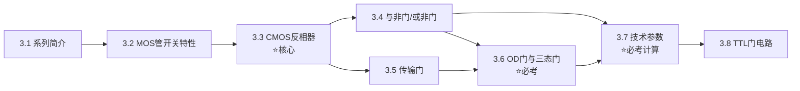

# 第三章：逻辑门电路

> [!info] 章节概述
> 本章是数字电子技术的**核心章节**，深入讲解CMOS和TTL逻辑门电路的内部结构、工作原理和外部特性。掌握本章内容对于理解数字电路的底层实现和正确使用门电路至关重要。

> [!tip] 考试重要性
> 本章是822考试**必考章节**，尤其参数计算（噪声容限、扇出系数、上拉电阻）是高频考点！

> [!warning] 822考纲对照
> **大纲要求**：
> 1. 掌握八种逻辑门电路的逻辑功能
> 2. 掌握OC门和OD门、三态门电路的逻辑功能
> 3. 能根据输入信号画出各种逻辑门电路的输出波形
>
> **已标注"⛔ 不考"的内容可跳过学习**

---

## 📚 知识点导航

### 3.1 逻辑门电路系列简介
[[考研专业课/数字电子技术/3-逻辑门电路/01-逻辑门电路系列简介|→ 逻辑门电路系列简介]]

**核心内容**：
- CMOS系列发展历程（4000 → HC/HCT → AHC/AHCT → LVC/ALVC） ✅
- TTL系列简介（74 → 74LS → 74AS/74ALS） ✅
- 开关电路基本原理 ✅

**考试频率**：⭐⭐⭐

---

### 3.2 MOS管及其开关特性
[[考研专业课/数字电子技术/3-逻辑门电路/02-MOS管及其开关特性|→ MOS管及其开关特性]]

**核心内容**：
- NMOS/PMOS结构和工作原理 ✅
- 输出特性曲线（截止区、饱和区、可变电阻区） ✅
- 开关等效电路 ✅
- 动态特性（传输延迟） ✅

**考试频率**：⭐⭐⭐⭐

---

### 3.3 CMOS反相器
[[考研专业课/数字电子技术/3-逻辑门电路/03-CMOS反相器|→ CMOS反相器]] ⭐核心

**核心内容**：
- 电路结构和工作原理 ✅
- 电压传输特性（五段分析） ✅
- 电流传输特性 ✅
- 输入/输出逻辑电平 ✅

**考试频率**：⭐⭐⭐⭐⭐

---

### 3.4 CMOS与非门和或非门
[[考研专业课/数字电子技术/3-逻辑门电路/04-CMOS与非门和或非门|→ CMOS与非门和或非门]]

**核心内容**：
- 与非门电路结构（NMOS串联 + PMOS并联） ✅
- 或非门电路结构（NMOS并联 + PMOS串联） ✅
- 真值表分析 ✅

**考试频率**：⭐⭐⭐⭐

---

### 3.5 CMOS传输门
[[考研专业课/数字电子技术/3-逻辑门电路/05-CMOS传输门|→ CMOS传输门]]

**核心内容**：
- 传输门结构原理 ✅
- 模拟开关应用 ✅
- 数字应用（异或门、数据选择器） ✅

**考试频率**：⭐⭐⭐

---

### 3.6 OD门与三态门 ⭐必考
[[考研专业课/数字电子技术/3-逻辑门电路/06-OD门与三态门|→ OD门与三态门]]

**核心内容**：
- 漏极开路门（OD）结构与原理 ✅
- 线与功能 ✅
- **上拉电阻计算** ⭐⭐⭐⭐⭐ **必考计算题**
- 三态输出门（高阻态） ✅
- 总线传输应用 ✅

**考试频率**：⭐⭐⭐⭐⭐

---

### 3.7 CMOS门电路技术参数 ⭐必考
[[考研专业课/数字电子技术/3-逻辑门电路/07-CMOS门电路技术参数|→ CMOS门电路技术参数]]

**核心内容**：
- 输入/输出高低电平 ✅
- **噪声容限计算** ⭐⭐⭐⭐⭐ **必考**
- 传输延迟时间 ✅
- 功耗（静态、动态） ✅
- **扇出系数计算** ⭐⭐⭐⭐ **常考**
- 延时-功耗积 ✅

**考试频率**：⭐⭐⭐⭐⭐

---

### 3.8 TTL逻辑门电路
[[考研专业课/数字电子技术/3-逻辑门电路/08-TTL逻辑门电路|→ TTL逻辑门电路]]

**核心内容**：
- BJT开关特性（截止/饱和条件） ✅
- TTL反相器基本电路 ✅
- 肖特基TTL（抗饱和） ✅
- 集电极开路门（OC门） ✅
- TTL与CMOS的接口 ✅

**考试频率**：⭐⭐⭐

---

## 📝 章节总结
[[考研专业课/数字电子技术/3-逻辑门电路/📝 章节总结|→ 查看本章总结]]

---

## 🎯 学习路线

**学习建议**：
1. 先了解**各种逻辑门系列**的发展历程和特点
2. 重点掌握**MOS管开关特性**，理解截止/导通条件
3. **CMOS反相器**是核心，要深入理解电压传输特性
4. 理解**与非门/或非门**的电路结构特点
5. **OD门/三态门**是必考点，必须掌握上拉电阻计算 ⭐
6. **技术参数**是必考点，必须掌握噪声容限、扇出系数计算 ⭐
7. TTL电路了解基本原理，与CMOS对比学习

---

## ⚠️ 常见错误

| 错误类型 | 表现 | 避免方法 |
|----------|------|----------|
| 上拉电阻计算 | 忘记考虑负载电流 | 分清拉电流/灌电流两种情况 |
| 扇出系数 | 混淆拉电流/灌电流 | 记住公式：$N_{OH}/N_{OL}$ |
| 噪声容限 | 高/低电平容限混淆 | $V_{NH} = V_{OH} - V_{IH}$，$V_{NL} = V_{IL} - V_{OL}$ |
| CMOS vs TTL | 输入端悬空处理错误 | CMOS不能悬空，TTL悬空为高电平 |
| 三态门 | 忘记高阻态 | 三态：高电平、低电平、高阻态 |

---

## 📊 重点公式速查

### 噪声容限
$$V_{NH} = V_{OH(min)} - V_{IH(min)}$$
$$V_{NL} = V_{IL(max)} - V_{OL(max)}$$

### 扇出系数
$$N_{OH} = \frac{I_{OH}(驱动门)}{I_{IH}(负载门)}$$
$$N_{OL} = \frac{I_{OL}(驱动门)}{I_{IL}(负载门)}$$

### OD门上拉电阻
$$R_{p(min)} = \frac{V_{DD} - V_{OL(max)}}{I_{OL(max)} - I_{IL(total)}}$$
$$R_{p(max)} = \frac{V_{DD} - V_{OH(min)}}{I_{OZ(total)} + I_{IH(total)}}$$

### 延时功耗积
$$DP = t_{pd} \times P_D$$

### CMOS动态功耗
$$P_D = (C_{PD} + C_L) V_{DD}^2 f$$

---

## 🔗 知识关联

- **前置知识**：[[考研专业课/数字电子技术/1-数字与码制/|第一章：数字与码制]]、[[考研专业课/数字电子技术/2-逻辑代数与硬件描述语言基础/|第二章：逻辑代数基础]]
- **本章定位**：理解门电路底层实现，为组合逻辑电路设计打基础
- **后续章节**：
  - [[考研专业课/数字电子技术/4-组合逻辑电路/|第四章：组合逻辑电路]]
  - [[考研专业课/数字电子技术/5-触发器/|第五章：触发器]]

---

*创建日期: 2026-03-21*
*最后更新: 2026-03-21*
