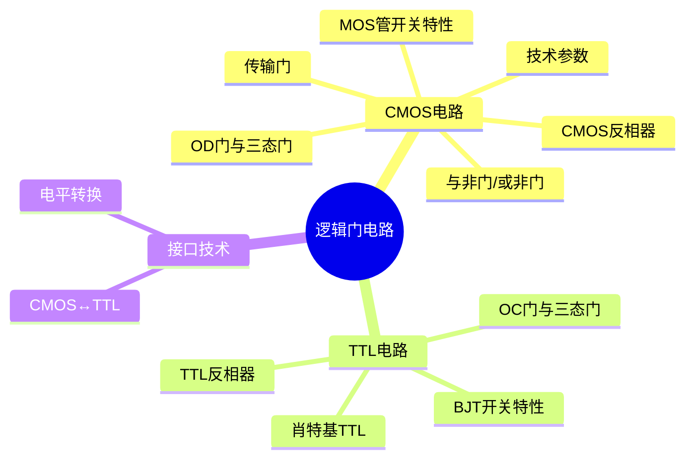

# 第三章：逻辑门电路 章节总结

> [!abstract] 本章核心
> 本章深入讲解CMOS和TTL逻辑门电路的内部结构、工作原理和外部特性。**掌握参数计算（噪声容限、扇出系数、上拉电阻）是考试重点**。

---

## 一、知识框架



---

## 二、核心概念速查

### 2.1 MOS管开关特性

| 状态 | 条件 | 等效 |
|------|------|------|
| 截止 | $v_{GS} < V_T$ | 开关断开 |
| 导通 | $v_{GS} > V_T$ 且 $v_{DS} < v_{GS} - V_T$ | 可变电阻 |

### 2.2 CMOS反相器

| 输入 | NMOS | PMOS | 输出 |
|------|------|------|------|
| 低电平 | 截止 | 导通 | 高电平 |
| 高电平 | 导通 | 截止 | 低电平 |

**特点**：静态功耗≈0，逻辑摆幅大，噪声容限大

### 2.3 CMOS门电路结构规则

| 逻辑门 | NMOS | PMOS |
|--------|------|------|
| 与非门 | **串联** | 并联 |
| 或非门 | 并联 | **串联** |

> [!tip] 记忆口诀
> **与非门NMOS串，或非门PMOS串**

### 2.4 OD门与三态门

| 类型 | 特点 | 应用 |
|------|------|------|
| OD门 | 漏极开路，需上拉电阻 | 线与、电平转换 |
| 三态门 | 高电平、低电平、高阻态 | 总线传输 |

---

## 三、必考公式汇总 ⭐⭐⭐⭐⭐

### 3.1 噪声容限

$$\boxed{V_{NH} = V_{OH(min)} - V_{IH(min)}}$$

$$\boxed{V_{NL} = V_{IL(max)} - V_{OL(max)}}$$

### 3.2 扇出系数

$$\boxed{N_{OH} = \frac{I_{OH}(驱动门)}{I_{IH}(负载门)}}$$

$$\boxed{N_{OL} = \frac{I_{OL}(驱动门)}{I_{IL}(负载门)}}$$

实际扇出：$N_O = \min(N_{OH}, N_{OL})$

### 3.3 OD门上拉电阻 ⭐⭐⭐⭐⭐

**最小值**：
$$\boxed{R_{p(min)} = \frac{V_{DD} - V_{OL(max)}}{I_{OL(max)} - I_{IL(total)}}}$$

**最大值**：
$$\boxed{R_{p(max)} = \frac{V_{DD} - V_{OH(min)}}{I_{OZ(total)} + I_{IH(total)}}}$$

选择范围：$R_{p(min)} \leq R_p \leq R_{p(max)}$

### 3.4 延时功耗积

$$\boxed{DP = t_{pd} \times P_D}$$

### 3.5 CMOS动态功耗

$$\boxed{P_D = (C_{PD} + C_L) \cdot V_{DD}^2 \cdot f}$$

---

## 四、典型参数值（74HC系列，5V）

| 参数 | 符号 | 典型值 |
|------|------|--------|
| 输入低电平上限 | $V_{IL(max)}$ | 1.5V |
| 输入高电平下限 | $V_{IH(min)}$ | 3.5V |
| 输出低电平上限 | $V_{OL(max)}$ | 0.1V |
| 输出高电平下限 | $V_{OH(min)}$ | 4.9V |
| 高电平噪声容限 | $V_{NH}$ | 1.4V |
| 低电平噪声容限 | $V_{NL}$ | 1.4V |
| 传输延迟 | $t_{pd}$ | 6ns |

---

## 五、CMOS vs TTL对比

| 特性 | CMOS | TTL |
|------|------|-----|
| 有源器件 | MOS管 | BJT |
| 输入电阻 | 极高 | 较低 |
| 静态功耗 | **极低** | 较高 |
| 噪声容限 | **大** | 较小 |
| 电源电压 | 范围宽 | 固定5V |
| 输入悬空 | **不允许** | 相当于高电平 |

---

## 六、常见题型

### 6.1 参数计算题 ⭐⭐⭐⭐⭐

**噪声容限计算**：
1. 识别 $V_{OH}, V_{OL}, V_{IH}, V_{IL}$
2. 代入公式计算

**扇出系数计算**：
1. 确定 $I_{OH}, I_{OL}, I_{IH}, I_{IL}$
2. 分别计算 $N_{OH}$ 和 $N_{OL}$
3. 取最小值

**上拉电阻计算** ⭐必考：
1. 确定OD门参数和负载门数量
2. 计算 $R_{p(min)}$ 和 $R_{p(max)}$
3. 选择标准电阻值

### 6.2 波形绘制题 ⭐⭐⭐⭐

根据输入波形画出：
- 与非门/或非门输出
- 三态门输出（注意高阻态）
- OD门线与输出

### 6.3 电路分析题 ⭐⭐⭐

- 分析CMOS门电路逻辑功能
- 判断MOS管工作状态

---

## 七、易错点汇总

| 错误类型 | 错误表现 | 正确做法 |
|----------|---------|---------|
| 噪声容限公式 | $V_{NH}=V_{IH}-V_{OH}$ | $V_{NH}=V_{OH}-V_{IH}$ |
| 上拉电阻 | 只算一个值 | 要算$R_{p(min)}$和$R_{p(max)}$ |
| 扇出系数 | 只算$N_{OH}$ | 要算两种，取最小 |
| 与非门结构 | NMOS并联 | NMOS**串联** |
| CMOS悬空 | 可以悬空 | **不能悬空** |
| TTL悬空 | 相当于低电平 | 相当于**高电平** |

---

## 八、学习建议

1. **理解CMOS反相器**是本章核心
2. **掌握与非门/或非门**结构规律（串并联关系）
3. **熟记公式**：噪声容限、扇出系数、上拉电阻
4. **多做计算题**：上拉电阻计算是必考题
5. **注意CMOS和TTL的区别**：特别是输入端处理

---

## 九、公式记忆卡片

```
┌─────────────────────────────────────────┐
│         逻辑门电路核心公式               │
├─────────────────────────────────────────┤
│  噪声容限：                              │
│    VNH = VOH - VIH  (高电平)            │
│    VNL = VIL - VOL  (低电平)            │
├─────────────────────────────────────────┤
│  扇出系数：                              │
│    NOH = IOH / IIH                      │
│    NOL = IOL / IIL                      │
├─────────────────────────────────────────┤
│  上拉电阻：                              │
│    Rp(min) = (VDD-VOL)/(IOL-IIL)        │
│    Rp(max) = (VDD-VOH)/(IOZ+IIH)        │
├─────────────────────────────────────────┤
│  延时功耗积：                            │
│    DP = tpd × PD                        │
└─────────────────────────────────────────┘
```

---

*创建日期: 2026-03-21*
*适用于：822电子技术基础 考研复习*
