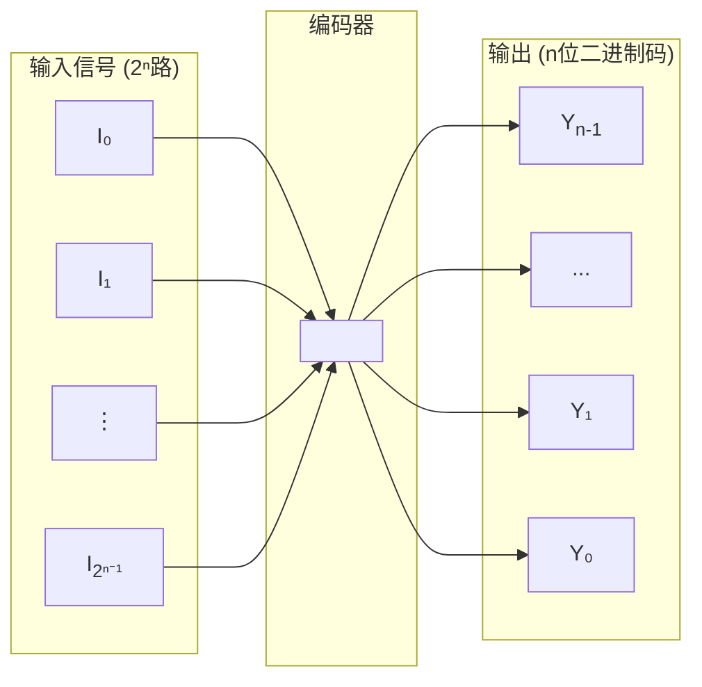
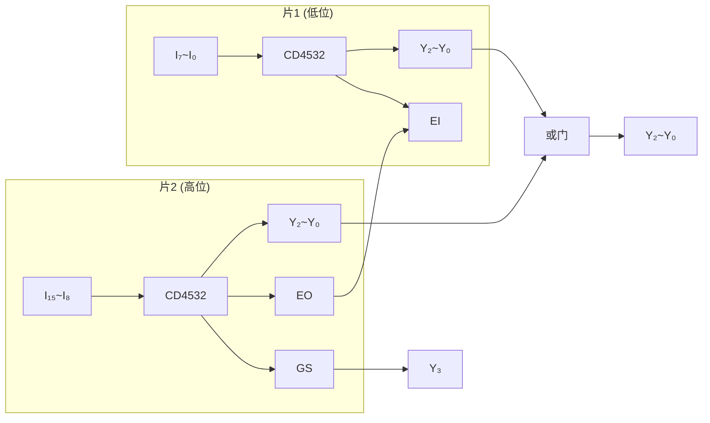

---
tags:
  - 编码器
  - 优先编码器
  - CD4532
  - 74LS148
  - 低电平有效
  - 74LS147
  - BCD编码器
created: 2026-03-27
last_updated: 2026-04-07
---

# 编码器

## 📋 目录

- [[#一、编码器概述]]
- [[#二、普通编码器]]
- [[#三、优先编码器 ⭐]]
- [[#四、优先编码器逻辑表达式推导方法]]
- [[#五、集成芯片对比速查]]
- [[#六、编码器的扩展]]
- [[#七、常见错误与考试要点]]

---

## 一、编码器概述

### 1.1 定义

| 概念 | 说明 |
|------|------|
| **编码** | 用二进制代码表示特定含义的信息 |
| **编码器** | 具有编码功能的逻辑电路 |

### 1.2 结构框图

> **核心规律**：$2^n$ 个输入端 → $n$ 位二进制码输出

### 1.3 分类

| 类型 | 特点 | 适用场景 |
|------|------|----------|
| **普通编码器** | 任何时刻只能有一个输入有效 | 简单场景（理论） |
| **优先编码器** | 允许多个输入同时有效，按优先级编码 | **实际应用** ⭐ |

---

## 二、普通编码器

### 2.1 4线-2线编码器

**功能**：4个输入对应2位二进制码输出

**真值表**：

| $I_0$ | $I_1$ | $I_2$ | $I_3$ | $Y_1$ | $Y_0$ |
|:-----:|:-----:|:-----:|:-----:|:-----:|:-----:|
| 1 | 0 | 0 | 0 | 0 | 0 |
| 0 | 1 | 0 | 0 | 0 | 1 |
| 0 | 0 | 1 | 0 | 1 | 0 |
| 0 | 0 | 0 | 1 | 1 | 1 |

**逻辑表达式**：

$$Y_1 = I_2 + I_3 \qquad Y_0 = I_1 + I_3$$

> [!warning] 普通编码器的致命缺陷
> 当 $I_1, I_2$ 同时为1时，输出错误编码 $Y_1Y_0 = 11$（正常应表示 $I_3$ 有效）！
>
> **解决方案** → 使用优先编码器

---

## 三、优先编码器 ⭐

### 3.1 核心概念

允许多个输入同时为有效电平，但只对**优先级别最高**的输入信号进行编码。

### 3.2 4线-2线优先编码器

**优先级**：$I_3 > I_2 > I_1 > I_0$（下标越大，优先级越高）

**真值表**：

| $I_0$ | $I_1$ | $I_2$ | $I_3$ | $Y_1$ | $Y_0$ |
|:-----:|:-----:|:-----:|:-----:|:-----:|:-----:|
| 1 | 0 | 0 | 0 | 0 | 0 |
| × | 1 | 0 | 0 | 0 | 1 |
| × | × | 1 | 0 | 1 | 0 |
| × | × | × | 1 | 1 | 1 |

> [!tip] × 的含义
> × 表示该输入可以是0或1，不影响输出（因为有更高优先级的输入有效）

**逻辑表达式**：

$$Y_1 = I_2 + I_3 \qquad Y_0 = I_1\bar{I_2} + I_3$$

---

## 五、集成芯片对比速查

### 5.1 芯片一览

|     芯片      |     类型     | 输入有效电平 | 输出有效电平 |              控制引脚              |
| :---------: | :--------: | :----: | :----: | :----------------------------: |
| **74LS148** |   8线-3线    | 低（0有效） | 低（反码）  | $\bar{EI}, \bar{GS}, \bar{EO}$ |
| **74LS147** | 10线-4线 BCD | 低（0有效） | 低（反码）  |             **无**              |

### 5.3 74LS148（TTL，低电平有效）⭐

> [!warning] 考研大坑：反逻辑
> **口诀："0 是大爷，1 是空气"**

**输入端**（$\bar{I_0}$ 到 $\bar{I_7}$）：输入 **0** 代表"按下了按键"

**输出端**（$\bar{Y_2}, \bar{Y_1}, \bar{Y_0}$）：输出 = 正常二进制 **按位取反**

| 正常数字 | 正常二进制 | 74LS148 输出 |
|:--------:|:----------:|:------------:|
| 7 | 1 1 1 | 0 0 0 |
| 5 | 1 0 1 | 0 1 0 |
| 3 | 0 1 1 | 1 0 0 |
| 0 | 0 0 0 | 1 1 1 |

**三个管理级引脚**：

| 引脚 | 功能 | 有效条件 |
|:----:|:----:|----------|
| $\bar{EI}$ | 总开关 | 必须 = 0 才工作 |
| $\bar{GS}$ | 工作状态 | $\bar{EI}=0$ 且有按键按下 → 输出 0 |
| $\bar{EO}$ | 级联传递 | $\bar{EI}=0$ 且无按键按下 → 输出 0 |

> [!personal] 74LS148 低电平有效的设计哲学
>
> 低电平有效的设计看似"反直觉"，但在实际电路中有重要意义：
>
> 1. **抗干扰能力强**：TTL 电路中，低电平（0V）比高电平（5V）更稳定
> 2. **线与功能**：多个开路集电极输出可以直接并联，实现"线与"逻辑
> 3. **默认安全**：如果线路断开，输入会上拉到高电平（1），此时被视为"无效"，不会误触发

### 5.4 74LS147（BCD优先编码器）⭐

**核心差异**：

| 特性 | 说明 |
|------|------|
| 隐身的 $\bar{I_0}$ | 只有 $\bar{I_1}$ ~ $\bar{I_9}$，无按键按下时默认输入数字 0 |
| 4位输出 | $\bar{Y_3}\bar{Y_2}\bar{Y_1}\bar{Y_0}$，BCD 码取反 |

**输出示例**：

| 最高有效输入 | 正常 BCD | 74LS147 输出 |
|:------------:|:--------:|:------------:|
| 9 | 1001 | 0110 |
| 5 | 0101 | 1010 |
| 1 | 0001 | 1110 |
| 0（无输入） | 0000 | 1111 |

> [!warning] 考研易错点
> 74LS147 **没有** $\bar{EI}$、$\bar{GS}$、$\bar{EO}$！不能级联扩展。

---

## 六、编码器的扩展

### 6.1 用两片 CD4532 组成 16线-4线 编码器

**连接方法**：
1. 高位片（片2）的 $EO$ 接低位片（片1）的 $EI$
2. 两片的 $Y_2 \sim Y_0$ 分别相或得到 $Y_2 \sim Y_0$
3. 高位片的 $GS$ 作为最高位输出 $Y_3$

---

## 七、常见错误与考试要点

### 7.1 常见错误

| 错误类型 | 表现 | 避免方法 |
|----------|------|----------|
| 混淆普通/优先编码器 | 不知道优先级概念 | 优先编码器允许多输入同时有效 |
| 忽略 GS 信号 | 无法区分全0和 $I_0$ 有效 | 使用 GS 判断是否有有效输入 |
| 级联错误 | 扩展时 EO/EI 接错 | **高位 EO 接低位 EI** |
| 忘记使能端 | EI=0 时不工作 | 确保使能端接正确电平 |

### 7.2 考试要点 ⭐

1. **理解编码器功能**：将特定信息转换为二进制码
2. **区分普通/优先编码器**：优先编码器允许多输入有效
3. **掌握 CD4532**：8线-3线优先编码器的功能表
4. **理解 GS/EO/EI**：使能和工作状态标志的作用
5. **会级联扩展**：用多片编码器扩展输入端数
6. **74LS148 反逻辑**：0 有效，输出取反

---

## 🔗 相关链接

- [[05-译码器与数据分配器]] - 编码的逆过程
- [[06-数据选择器]] - 另一种常用组合器件
- [[考研专业课/数字电子技术/1-数字与码制/02-二进制代码|前置知识：二进制代码]]

---

*创建日期: 2026-03-27*
*最后更新: 2026-04-07*
