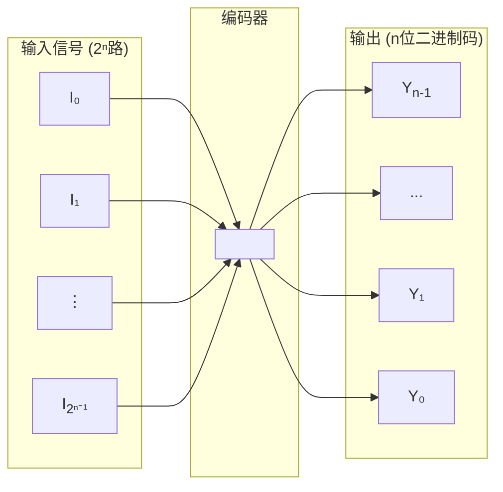

---
tags:
  - 编码器
  - 优先编码器
  - CD4532
  - 74LS148
  - 低电平有效
  - 74LS147
  - BCD编码器
created: 2026-03-27
last_updated: 2026-04-07
---

# 编码器

## 📋 目录

- [[#一、编码器概述]]
- [[#二、普通编码器]]
- [[#三、优先编码器 ⭐]]
- [[#四、优先编码器逻辑表达式推导方法]]
- [[#五、集成芯片对比速查]]
- [[#六、编码器的扩展]]
- [[#七、常见错误与考试要点]]

---

## 一、编码器概述

### 1.1 定义

| 概念 | 说明 |
|------|------|
| **编码** | 用二进制代码表示特定含义的信息 |
| **编码器** | 具有编码功能的逻辑电路 |

### 1.2 结构框图

> **核心规律**：$2^n$ 个输入端 → $n$ 位二进制码输出

### 1.3 分类

| 类型 | 特点 | 适用场景 |
|------|------|----------|
| **普通编码器** | 任何时刻只能有一个输入有效 | 简单场景（理论） |
| **优先编码器** | 允许多个输入同时有效，按优先级编码 | **实际应用** ⭐ |

---

## 二、普通编码器

### 2.1 4线-2线编码器

**功能**：4个输入对应2位二进制码输出

**真值表**：

| $I_0$ | $I_1$ | $I_2$ | $I_3$ | $Y_1$ | $Y_0$ |
|:-----:|:-----:|:-----:|:-----:|:-----:|:-----:|
| 1 | 0 | 0 | 0 | 0 | 0 |
| 0 | 1 | 0 | 0 | 0 | 1 |
| 0 | 0 | 1 | 0 | 1 | 0 |
| 0 | 0 | 0 | 1 | 1 | 1 |

**逻辑表达式**：

$$Y_1 = I_2 + I_3 \qquad Y_0 = I_1 + I_3$$

> [!warning] 普通编码器的致命缺陷
> 当 $I_1, I_2$ 同时为1时，输出错误编码 $Y_1Y_0 = 11$（正常应表示 $I_3$ 有效）！
>
> **解决方案** → 使用优先编码器

---

## 三、优先编码器 ⭐

### 3.1 核心概念

允许多个输入同时为有效电平，但只对**优先级别最高**的输入信号进行编码。

### 3.2 4线-2线优先编码器

**优先级**：$I_3 > I_2 > I_1 > I_0$（下标越大，优先级越高）

**真值表**：

| $I_0$ | $I_1$ | $I_2$ | $I_3$ | $Y_1$ | $Y_0$ |
|:-----:|:-----:|:-----:|:-----:|:-----:|:-----:|
| 1 | 0 | 0 | 0 | 0 | 0 |
| × | 1 | 0 | 0 | 0 | 1 |
| × | × | 1 | 0 | 1 | 0 |
| × | × | × | 1 | 1 | 1 |

> [!tip] × 的含义
> × 表示该输入可以是0或1，不影响输出（因为有更高优先级的输入有效）

**逻辑表达式**：

$$Y_1 = I_2 + I_3 \qquad Y_0 = I_1\bar{I_2} + I_3$$

---

## 🔗 相关链接

- [[05-译码器与数据分配器]] - 编码的逆过程
- [[06-数据选择器]] - 另一种常用组合器件
- [[考研专业课/数字电子技术/1-数字与码制/02-二进制代码|前置知识：二进制代码]]

---

*创建日期: 2026-03-27*
*最后更新: 2026-04-07*
