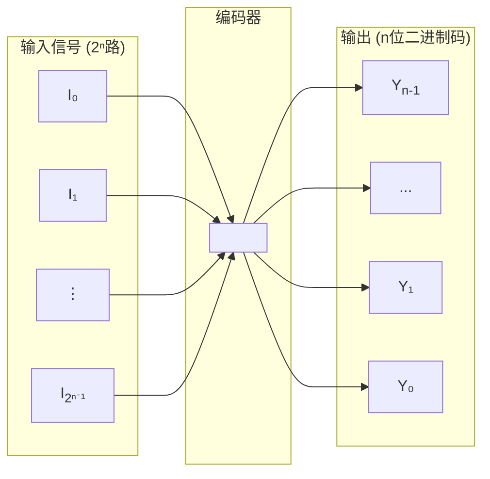
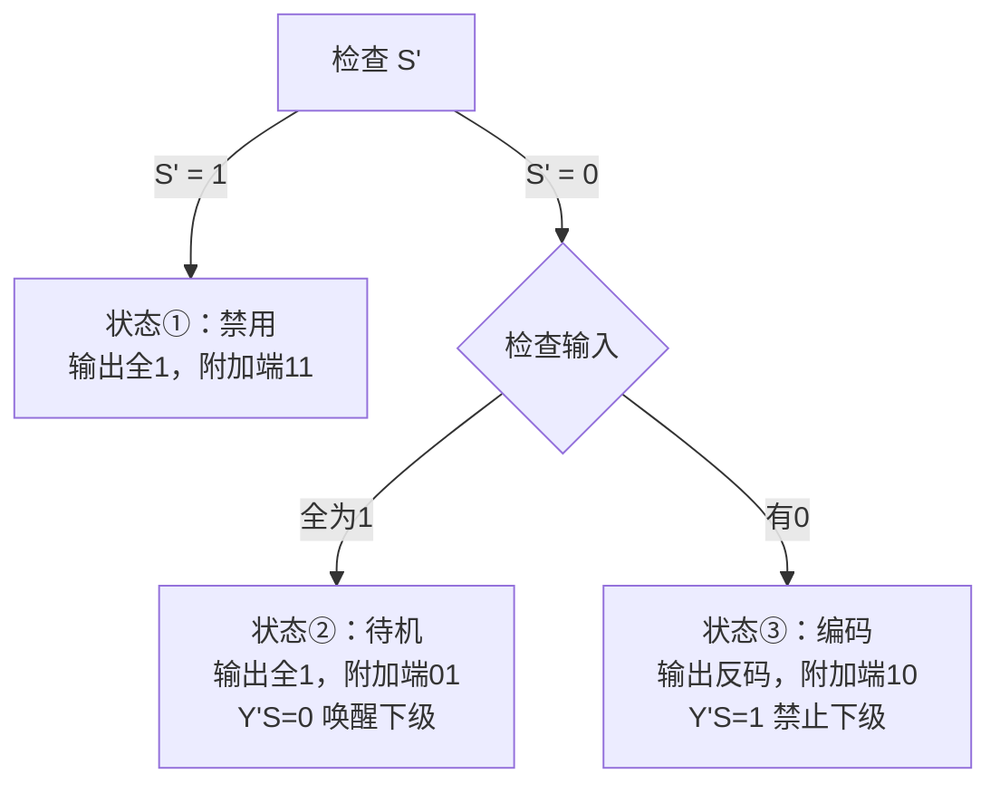
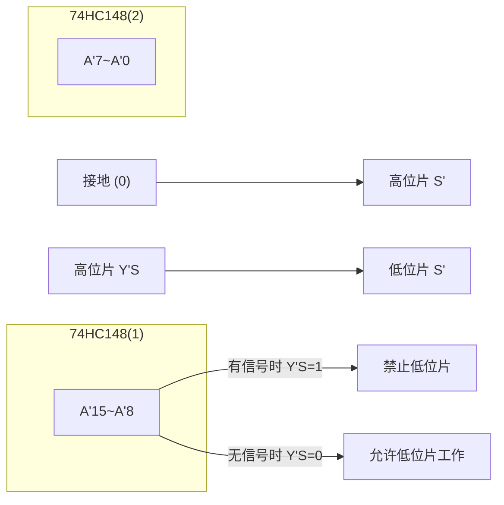
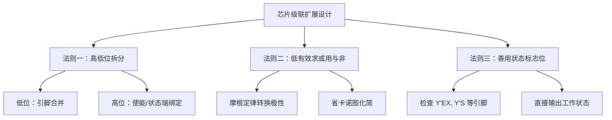

---
tags:
  - 编码器
  - 优先编码器
  - 74HC148
  - 74LS148
  - CD4532
  - 低电平有效
  - 74LS147
  - BCD编码器
  - 级联扩展
created: 2026-03-27
last_updated: 2026-04-08
---

# 编码器

## 📋 目录

- [[#一、编码器概述]]
- [[#二、普通编码器]]
- [[#三、优先编码器 ⭐]]
- [[#四、8线-3线优先编码器 74HC148 ⭐⭐⭐]]
  - [[#4.5 经典应用：16-4 线优先编码器设计 ⭐⭐⭐]]
    - [[#设计思路的逆向拆解 ⭐⭐]]
    - [[#三大通用法则 ⭐⭐⭐]]
- [[#五、常见错误与考试要点]]

---

## 一、编码器概述

### 1.1 定义

| 概念 | 说明 |
|------|------|
| **编码** | 用二进制代码表示特定含义的信息 |
| **编码器** | 具有编码功能的逻辑电路 |

### 1.2 结构框图

> **核心规律**：$2^n$ 个输入端 → $n$ 位二进制码输出

### 1.3 分类

| 类型 | 特点 | 适用场景 |
|------|------|----------|
| **普通编码器** | 任何时刻只能有一个输入有效 | 简单场景（理论） |
| **优先编码器** | 允许多个输入同时有效，按优先级编码 | **实际应用** ⭐ |

---

## 二、普通编码器

### 2.1 4线-2线编码器

**功能**：4个输入对应2位二进制码输出

**真值表**：

| $I_0$ | $I_1$ | $I_2$ | $I_3$ | $Y_1$ | $Y_0$ |
|:-----:|:-----:|:-----:|:-----:|:-----:|:-----:|
| 1 | 0 | 0 | 0 | 0 | 0 |
| 0 | 1 | 0 | 0 | 0 | 1 |
| 0 | 0 | 1 | 0 | 1 | 0 |
| 0 | 0 | 0 | 1 | 1 | 1 |

**逻辑表达式**：

$$Y_1 = I_2 + I_3 \qquad Y_0 = I_1 + I_3$$

> [!warning] 普通编码器的致命缺陷
> 当 $I_1, I_2$ 同时为1时，输出错误编码 $Y_1Y_0 = 11$（正常应表示 $I_3$ 有效）！
>
> **解决方案** → 使用优先编码器

---

## 三、优先编码器 ⭐

### 3.1 核心概念

允许多个输入同时为有效电平，但只对**优先级别最高**的输入信号进行编码。

### 3.2 4线-2线优先编码器

**优先级**：$I_3 > I_2 > I_1 > I_0$（下标越大，优先级越高）

**真值表**：

| $I_0$ | $I_1$ | $I_2$ | $I_3$ | $Y_1$ | $Y_0$ |
|:-----:|:-----:|:-----:|:-----:|:-----:|:-----:|
| 1 | 0 | 0 | 0 | 0 | 0 |
| × | 1 | 0 | 0 | 0 | 1 |
| × | × | 1 | 0 | 1 | 0 |
| × | × | × | 1 | 1 | 1 |

> [!tip] × 的含义
> × 表示该输入可以是0或1，不影响输出（因为有更高优先级的输入有效）

**逻辑表达式**：

$$Y_1 = I_2 + I_3 \qquad Y_0 = I_1\bar{I_2} + I_3$$

---

## 四、8线-3线优先编码器 74HC148 ⭐⭐⭐

### 4.1 芯片封装与引脚定义

> [!tip] 核心法则：带圈为低电平有效
> - 输入 0 才算真正输入信号
> - 内部计算结果按位取反后输出（反码输出）

**引脚分布**：

| 引脚类型 | 引脚名称 | 说明 |
|---------|---------|------|
| **输入端** | $I'_7 \sim I'_0$ | 8个输入，低电平有效 |
| **输出端** | $Y'_2, Y'_1, Y'_0$ | 3位输出，反码形式 |
| **使能输入** | $S'$ | 0=工作，1=禁用 |
| **使能输出** | $Y'_S$ | 用于级联（唤醒下一级） |
| **扩展输出** | $Y'_{EX}$ | 指示有无有效输入 |

**优先级机制**：下标越大，优先级越高（$I'_7$ 最高，$I'_0$ 最低）

### 4.2 完整功能表（真值表）

| 使能 $S'$ | $I'_0 \sim I'_7$ | $Y'_2 Y'_1 Y'_0$ | $Y'_S$ | $Y'_{EX}$ | 芯片状态 |
|:---------:|:----------------:|:----------------:|:------:|:---------:|:--------:|
| 1 | ×××××××× | 1 1 1 | 1 | 1 | ① **禁用** |
| 0 | 1 1 1 1 1 1 1 1 | 1 1 1 | 0 | 1 | ② **待机**（无有效输入） |
| 0 | ×××××××**0** | 0 0 0 | 1 | 0 | ③ 编码 $I'_7$ → 输出 000（反码） |
| 0 | ××××××**0**1 | 0 0 1 | 1 | 0 | ③ 编码 $I'_6$ → 输出 001（反码） |
| 0 | ×××××**0**11 | 0 1 0 | 1 | 0 | ③ 编码 $I'_5$ → 输出 010（反码） |
| 0 | ××××**0**111 | 0 1 1 | 1 | 0 | ③ 编码 $I'_4$ → 输出 011（反码） |
| 0 | ×××**0**1111 | 1 0 0 | 1 | 0 | ③ 编码 $I'_3$ → 输出 100（反码） |
| 0 | ××**0**11111 | 1 0 1 | 1 | 0 | ③ 编码 $I'_2$ → 输出 101（反码） |
| 0 | ×**0**111111 | 1 1 0 | 1 | 0 | ③ 编码 $I'_1$ → 输出 110（反码） |
| 0 | **0**1111111 | 1 1 1 | 1 | 0 | ③ 编码 $I'_0$ → 输出 111（反码） |

> [!note] × 的含义
> × 表示无关项，无论该位是0还是1都不影响结果（硬件优先级排队机制）

### 4.3 附加端状态速查表 ⭐

> [!important] 解题突破口
> 直接看 $S'$、$Y'_S$、$Y'_{EX}$ 的电平组合，瞬间判断芯片状态！

| 状态 | $S'$ | $Y'_S$ | $Y'_{EX}$ | 输出 $Y'$ | 说明 |
|:----:|:----:|:------:|:---------:|:---------:|:-----|
| **强行关闭** | 1 | 1 | 1 | 111 | 芯片禁用，无视所有输入 |
| **待机放行** | 0 | 0 | 1 | 111 | 无有效输入，$Y'_S=0$ 唤醒下一级 |
| **正在编码** | 0 | 1 | 0 | 反码 | 正在工作，$Y'_S=1$ 禁止下一级 |

### 4.4 级联扩展原理

利用 $Y'_S$ 和 $Y'_{EX}$ 实现多片级联：

- **高位片**（接高优先级输入）的 $Y'_S$ → **低位片**的 $S'$
- 当高位片无有效输入时，$Y'_S=0$，激活低位片
- 当高位片正在编码时，$Y'_S=1$，禁止低位片工作

### 4.5 经典应用：16-4 线优先编码器设计 ⭐⭐⭐

#### 设计要求

| 项目 | 规格 |
|------|------|
| **输入** | 16个低电平有效信号 $A'_{15} \sim A'_0$（$A'_{15}$ 最高优先级） |
| **输出** | 4位二进制代码 $Z_3Z_2Z_1Z_0$（1111~0000），**高电平有效** |
| **器件** | 两片 74HC148 + 必要门电路 |

#### 设计步骤

**Step 1：输入端分配（8+8=16）**

| 芯片 | 处理信号 | 接入方式 |
|------|----------|----------|
| **高位片** 74HC148(1) | $A'_{15} \sim A'_8$（高优先级） | 接 $I'_7 \sim I'_0$ |
| **低位片** 74HC148(2) | $A'_7 \sim A'_0$（低优先级） | 接 $I'_7 \sim I'_0$ |

**Step 2：使能控制与片级优先级排队**

- **高位片常开**：$S'_{(1)}$ 接地，时刻处于待命状态
- **级联控制**：高位片 $Y'_S$ → 低位片 $S'$
- **逻辑**：高位片有信号 → $Y'_S=1$ → 禁止低位片；高位片无信号 → $Y'_S=0$ → 激活低位片

**Step 3：输出端扩展与电平转换**

> [!important] 核心难点：正负逻辑转换
> 芯片输出是**低电平有效（反码）**，题目要求**高电平有效（原码）**，必须用门电路转换！

**低3位处理** ($Z_2, Z_1, Z_0$)：

$$Z_0 = \overline{Y'_{0(1)} \cdot Y'_{0(2)}} = Y_{0(1)} + Y_{0(2)}$$

- 两片对应输出（如 $Y'_{0(1)}$ 和 $Y'_{0(2)}$）接入**与非门**
- 利用摩根定律实现正逻辑"或"操作
- 无论哪片输出低电平，与非门后都变高电平

**最高位处理** ($Z_3$)：

$$Z_3 = \overline{Y'_{EX(1)}}$$

| 高位片状态 | $Y'_{EX(1)}$ | $Z_3$（非门后） | 对应输入范围 |
|------------|--------------|-----------------|--------------|
| 工作（有信号） | 0 | **1** | $A'_{15} \sim A'_8$ → 1111~1000 |
| 不工作 | 1 | **0** | $A'_7 \sim A'_0$ → 0111~0000 |

#### 电路连接总结

#### 考点总结

> [!success] 设计要点速记
> 1. **级联看引脚**：高位片 $Y'_S$ → 低位片 $S'$（死规矩）
> 2. **正负逻辑转换**：用**与非门**处理并行输出（摩根定律变"或"）
> 3. **最高位取法**：高位片 $Y'_{EX}$ 加非门

#### 设计思路的逆向拆解 ⭐⭐

> [!tip] 核心思路：目标导向
> 不要顺着芯片功能硬凑，而是从最终需求**反推**设计方案。

**1. 明确落差（起点与终点）**

| 维度 | 终点（需求） | 起点（现实） |
|------|-------------|-------------|
| **输出位数** | 4 位 $Z_3Z_2Z_1Z_0$ | 每片仅 3 位 $Y'_2Y'_1Y'_0$ |
| **有效电平** | 高电平（1）有效 | 低电平（0）有效 |

**2. 维度拆分：高位与低位分开处理**

面对 16 个输入，建立"分组"概念：

- **低 3 位** ($Z_2Z_1Z_0$)：决定"个体"——指明信号在这 8 个管脚中的哪一个
  - 例：$A'_0$ 和 $A'_8$ 的低三位二进制都是 000
- **最高位** ($Z_3$)：决定"组别"——信号在"高优先级组（第一片）"还是"低优先级组（第二片）"

**3. 解决低 3 位：寻找"逻辑或"的替代品**

| 分析维度 | 内容 |
|---------|------|
| **目标逻辑** | 高位片或低位片输出有效时，$Z_0$ 应为 1（正逻辑"或"） |
| **现实困境** | 芯片输出是低有效信号（反变量） |
| **破局点** | 摩根定律：$\overline{A' \cdot B'} = A + B$ |

> [!important] 摩根定律应用
> 把两个低有效信号接入**与非门 (NAND)**，就能实现正逻辑的"或"功能，同时完成电平极性翻转。

**4. 解决最高位：压榨"状态指示针"的价值**

| 分析维度 | 内容 |
|---------|------|
| **目标逻辑** | 前 8 个信号 → $Z_3=1$；后 8 个信号 → $Z_3=0$ |
| **寻找线索** | 哪个引脚能反映"当前是否在处理前 8 个信号"？ |
| **破局点** | 扩展输出端 $Y'_{EX}$：第一片工作时 $Y'_{EX}=0$，加非门后得 $Z_3=1$ |

#### 三大通用法则 ⭐⭐⭐

> [!quote] 考试与工程中的通用设计范式
> 适用于任何"多片级联扩容"或"正负逻辑适配"问题。

**法则一：地址/输出的"分时/分片"法则（高低位拆分）**

无论扩展译码器、数据选择器还是存储器，思路统一：

| 位段 | 处理方式 |
|------|---------|
| **低位地址/输出** | 各片对应引脚并联或通过逻辑门合并 |
| **高位地址/输出** | 与芯片的使能端或状态指示端绑定，决定"哪一片主事" |

**法则二："低有效求或，必用与非"法则**

> [!warning] 肌肉记忆
> 多个低有效输出合并，逻辑是"满足其一即可"时 → **直接挂一个与非门**
>
> 省去卡诺图化简，考试时间节省神器！

**法则三：状态标志位的高阶应用**

很多初学者认为附加端（$Y'_S, Y'_{EX}$、译码器的 $E_1, E_2, E_3$）仅用于级联连线。实际上：

- 这些引脚直接输出芯片的**宏观工作状态**
- 构建复杂组合逻辑时，**优先检查状态标志位**，往往能省去大量外部逻辑门
- 本题用 $Y'_{EX}$ 取反作为最高位，是最优雅的解法

---

## 五、常见错误与考试要点

### 5.1 易错点

1. **反码输出**：74HC148 输出是反码，$I'_7$ 有效时输出 000 而非 111
2. **附加端区分**：$Y'_S$（使能输出）和 $Y'_{EX}$（扩展输出）功能不同
3. **级联顺序**：高位片的 $Y'_S$ 连低位片的 $S'$，方向不能反

### 5.2 快速判断口诀

> **"附加端看状态：11禁用，01待机，10编码"**

---

## 🔗 相关链接

- [[05-译码器]] - 编码的逆过程
- [[06-数据选择器]] - 另一种常用组合器件
- [[考研专业课/数字电子技术/1-数字与码制/02-二进制代码|前置知识：二进制代码]]

---

*创建日期: 2026-03-27*
*最后更新: 2026-04-08*
