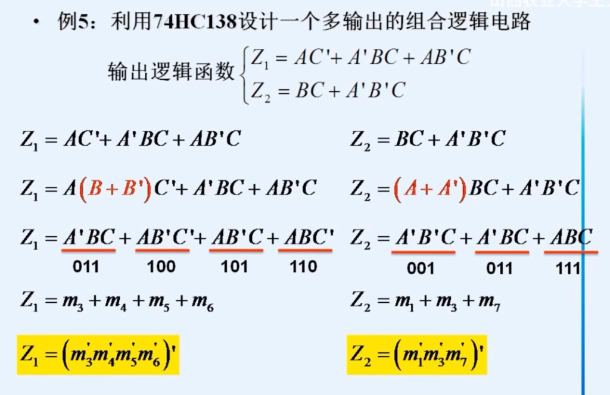
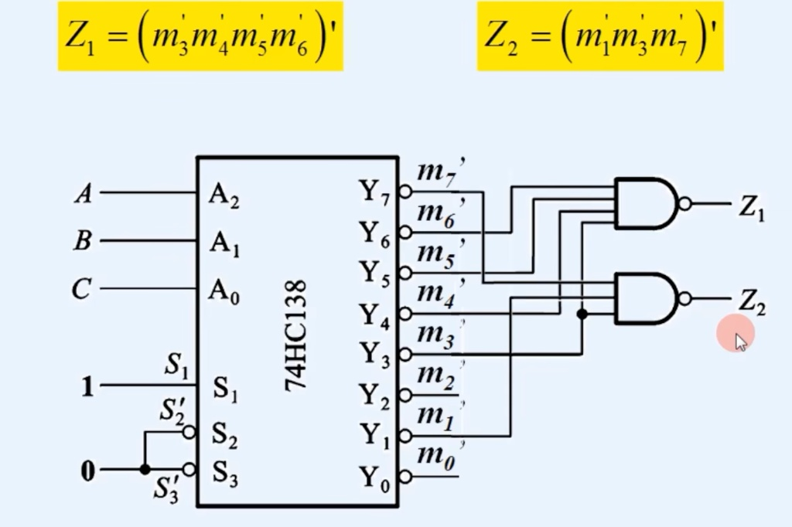

---
tags:
  - 译码器
  - 数据分配器
  - 74LS138
  - 显示译码器
  - 实现逻辑函数
created: 2026-03-27
last_updated: 2026-03-27
---

# 译码器与数据分配器

## 一、译码器概述

### 定义

**译码**：将二进制码转换为对应的输出信号（编码的逆过程）
**译码器**：具有译码功能的逻辑电路

### 结构框图

```
            译码器
  n位 ────>┌────────────┐──> 2^n 个输出
二进制码  │  译码器   │    (每次只有一个有效)
         └────────────┘
```

译码器有 $n$ 个输入端，$2^n$ 个输出端。

---

## 二、二进制译码器 ⭐

### 2线-4线译码器

**功能**：2位二进制码 → 4个输出

**真值表**：

| $A_1$ | $A_0$ | $\bar{Y}_3$ | $\bar{Y}_2$ | $\bar{Y}_1$ | $\bar{Y}_0$ |
|-------|-------|------------|------------|------------|------------|
| 0 | 0 | 1 | 1 | 1 | 0 |
| 0 | 1 | 1 | 1 | 0 | 1 |
| 1 | 0 | 1 | 0 | 1 | 1 |
| 1 | 1 | 0 | 1 | 1 | 1 |

> [!note] 低电平有效
> 输出为**低电平有效**，每次只有一个输出为0（被选中）

---

## 三、74LS138译码器 ⭐⭐⭐

### 功能概述

74LS138是**3线-8线二进制译码器**

### 引脚功能

| 引脚类型 | 引脚 | 功能 |
|----------|------|------|
| **数据输入** | $A_2, A_1, A_0$ | 3位二进制地址 |
| **数据输出** | $\bar{Y}_0 \sim \bar{Y}_7$ | 8个输出（低电平有效） |
| **使能端** | $G_1, \bar{G}_{2A}, \bar{G}_{2B}$ | 控制译码器工作 |

### 逻辑符号


### 功能表

| $G_1$ | $\bar{G}_{2A}$ | $\bar{G}_{2B}$ | $A_2$ | $A_1$ | $A_0$ | 输出 |
|-------|---------------|---------------|------|------|------|------|
| × | 1 | × | × | × | × | 全为1（不工作） |
| × | × | 1 | × | × | × | 全为1（不工作） |
| 0 | × | × | × | × | × | 全为1（不工作） |
| 1 | 0 | 0 | 0 | 0 | 0 | $\bar{Y}_0=0$，其余为1 |
| 1 | 0 | 0 | 0 | 0 | 1 | $\bar{Y}_1=0$，其余为1 |
| 1 | 0 | 0 | 0 | 1 | 0 | $\bar{Y}_2=0$，其余为1 |
| 1 | 0 | 0 | 0 | 1 | 1 | $\bar{Y}_3=0$，其余为1 |
| 1 | 0 | 0 | 1 | 0 | 0 | $\bar{Y}_4=0$，其余为1 |
| 1 | 0 | 0 | 1 | 0 | 1 | $\bar{Y}_5=0$，其余为1 |
| 1 | 0 | 0 | 1 | 1 | 0 | $\bar{Y}_6=0$，其余为1 |
| 1 | 0 | 0 | 1 | 1 | 1 | $\bar{Y}_7=0$，其余为1 |

> [!warning] 使能端使用
> **必须** $G_1=1$ 且 $\bar{G}_{2A}=\bar{G}_{2B}=0$ 时，译码器才能正常工作！


### 输出逻辑表达式

$$\bar{Y}_i = \overline{G_1 \cdot \bar{G}_{2A} \cdot \bar{G}_{2B} \cdot m_i}$$

其中 $m_i$ 是由 $A_2A_1A_0$ 组成的最小项。

例如：
- $\bar{Y}_0 = \overline{G_1 \cdot \bar{G}_{2A} \cdot \bar{G}_{2B} \cdot \bar{A}_2\bar{A}_1\bar{A}_0}$
- $\bar{Y}_5 = \overline{G_1 \cdot \bar{G}_{2A} \cdot \bar{G}_{2B} \cdot A_2\bar{A}_1A_0}$

---

## 四、用译码器实现逻辑函数 ⭐⭐⭐ 必考

### 原理

译码器的每个输出对应一个**最小项**，任何逻辑函数都可表示为**最小项之和**的形式。

### 方法步骤

1. 将逻辑函数展开为**最小项之和**形式
2. 将译码器输出（低电平有效）通过**与非门**组合

### 示例1：实现 $L = A \oplus B$

#### Step 1：展开为最小项

$$L = A \oplus B = \bar{A}B + A\bar{B} = m_1 + m_2$$

#### Step 2：连接译码器

使用2线-4线译码器：

$$L = \overline{\bar{Y}_1 \cdot \bar{Y}_2}$$

```
A_1(A) ──>┌─────────┐
A_0(B) ──>│ 2-4    │── \bar{Y}_1 ──┐
         │ 译码器  │── \bar{Y}_2 ──┼──┐
         └─────────┘              │  │
                                  └──┤NAND├──> L
                                     │  │
                            1 ───────┘  │
                                     └──
```

> [!tip] 低电平有效的处理
> 输出低电平有效，$\bar{Y}_i=0$ 表示最小项 $m_i$ 为1
> $L = m_1 + m_2 = \overline{\bar{m}_1 \cdot \bar{m}_2} = \overline{\bar{Y}_1 \cdot \bar{Y}_2}$

### 示例2：用74LS138实现 $L = \sum m(1,2,5,7)$

$$L = m_1 + m_2 + m_5 + m_7$$

$$L = \overline{\bar{Y}_1 \cdot \bar{Y}_2 \cdot \bar{Y}_5 \cdot \bar{Y}_7}$$

**连接方式**：
- $A_2, A_1, A_0$ 作为函数输入变量
- $\bar{Y}_1, \bar{Y}_2, \bar{Y}_5, \bar{Y}_7$ 接4输入与非门
- 与非门输出即为 $L$

> [!warning] 重要公式
> $$L = \sum m_i = \overline{\prod \bar{Y}_i}$$
> 即：最小项之和 = 对应输出的与非


### 示例3: 用74HC138实现多输出逻辑函数





#### 核心原理：译码器 = 最小项发生器

74HC138 有 3 个输入端 $A, B, C$，一共能组合出 $2^3 = 8$ 种状态（从 000 到 111）。

> [!key] 关键点
> - 每一个输出引脚 $Y_i$，对应一个最小项 $m_i$
> - 但是！74HC138 的输出是**低电平有效**（引脚上有个小圆圈）
> - 所以：$Y_0 = \overline{m_0}$，$Y_1 = \overline{m_1}$，...，$Y_n = \overline{m_n}$

**结论**：译码器的 8 个输出端，帮我们把 8 个最小项的"非"全部准备好了。

#### 步骤拆解（以 $Z_1$ 为例）

**第一步：写出逻辑函数的"最小项之和"形式**

原始公式：$Z_1 = AC' + A'BC + AB'C$

因为有 A, B, C 三个变量，我们要补全缺少的变量。例如 $AC'$ 缺少 B，就乘以 $(B + B')$。

展开后得到：
$$Z_1 = ABC' + AB'C' + A'BC + AB'C$$

转换成二进制码：$110, 100, 011, 101$

对应最小项：
$$Z_1 = m_6 + m_4 + m_3 + m_5$$

**第二步：利用摩根定律（反演律）变形**

由于译码器给我们的直接输出是 $\overline{m_n}$（带非号的），而我们需要的是 $m_n$ 相加。

利用公式：$A + B = \overline{\overline{A} \cdot \overline{B}}$

所以：
$$Z_1 = m_3 + m_4 + m_5 + m_6 = \overline{\overline{m_3} \cdot \overline{m_4} \cdot \overline{m_5} \cdot \overline{m_6}}$$

> [!tip] 这就是为什么公式最后会出现那个带长横杠的形式！

**第三步：图形连接逻辑**

既然 $Z_1 = \overline{\overline{m_3} \cdot \overline{m_4} \cdot \overline{m_5} \cdot \overline{m_6}}$，我们只需要：

1. 从译码器引出 $Y_3, Y_4, Y_5, Y_6$ 这四个引脚（它们本身就是 $\overline{m_3}, \overline{m_4}, \overline{m_5}, \overline{m_6}$）
2. 把它们丢进一个**与非门**（NAND gate）里

与非门的作用：先把输入全乘起来（与），再在外面加个长横杠（非）。这正好完美匹配了上面推导出来的公式！

> [!summary] 总结
> 用译码器设计电路，本质上就是：
> **找到函数包含哪些最小项 → 对应的引脚连进一个与非门**

#### 考研必记套路

**公式套路**：
$$\text{如果逻辑函数 } F = \sum m(i, j, k)$$
$$\text{则使用 138 译码器实现时：} F = \overline{Y_i \cdot Y_j \cdot Y_k}$$

（这里的 $Y$ 都是译码器的输出引脚）

**操作步骤**：
1. 将逻辑函数化为最小项之和形式
2. 找出对应的最小项编号
3. 将译码器对应的输出引脚接入一个与非门
4. 与非门的输出即为所求逻辑函数
---

## 五、译码器的扩展

### 用两片74LS138组成4线-16线译码器


**方法**：
1. 用 $A_3$ 控制两片的使能端
2. 片1处理 $A_3=0$ 的情况（$m_0 \sim m_7$）
3. 片2处理 $A_3=1$ 的情况（$m_8 \sim m_{15}$）

| $A_3$ | 工作的片 | 输出范围                          |
| ----- | ---- | ----------------------------- |
| 0     | 片1   | $\bar{Y}_0 \sim \bar{Y}_7$    |
| 1     | 片2   | $\bar{Y}_8 \sim \bar{Y}_{15}$ |

---

## 六、显示译码器

### 七段显示译码器

**功能**：将BCD码译码驱动七段数码管显示

**类型**：
- **共阴极**：输出高电平有效（1亮）
- **共阳极**：输出低电平有效（0亮）
 
### 74LS48（共阴极七段译码器）

**输入**：DCBA（8421BCD码）
**输出**：$a \sim g$（七段）

| DCBA | 显示 | a b c d e f g |
|------|------|---------------|
| 0000 | 0 | 1 1 1 1 1 1 0 |
| 0001 | 1 | 0 1 1 0 0 0 0 |
| 0010 | 2 | 1 1 0 1 1 0 1 |
| ... | ... | ... |
### BCD-七段显示译码器7448


#### 灯测试输入$\overline{LT}$


#### 灭零输入$\overline{RBI}$


#### 灭零输入$\overline{RBO}$


#### 灭灯输入$\overline{BI}$


---

## 七、数据分配器

### 定义

将一路输入数据**分配**到多路输出中的某一路

### 与译码器的关系

**译码器可用作数据分配器**！

将数据 $D$ 接到译码器的一个使能端，地址 $A_2A_1A_0$ 决定数据从哪个输出端输出。

### 示例：用74LS138作数据分配器

```
数据 D ────> \bar{G}_{2A}
地址 A_2A_1A_0 ──> A_2A_1A_0
G_1 = 1, \bar{G}_{2B} = 0
```

**工作原理**：
- 当 $D=0$ 时，译码器正常工作，选中的输出为0
- 当 $D=1$ 时，译码器不工作，所有输出为1

所以选中的输出端**与D反相**。

---

## 八、常见错误

| 错误类型 | 表现 | 避免方法 |
|----------|------|----------|
| 忘记使能端 | 译码器不工作 | $G_1=1, \bar{G}_{2A}=\bar{G}_{2B}=0$ |
| 高低电平混淆 | 输出反了 | 记住**低电平有效** |
| 实现函数时用与门 | 结果错误 | 低电平有效要用**与非门** |
| 忘记最小项形式 | 连接错误 | 先展开为 $\sum m_i$ 形式 |

---

## 九、考试要点 ⭐⭐⭐

1. **熟记74LS138功能**：3-8译码，低电平有效
2. **掌握使能端**：$G_1=1, \bar{G}_{2A}=\bar{G}_{2B}=0$ 才工作
3. **会用译码器实现逻辑函数**：
   - 展开为最小项之和
   - $L = \sum m_i = \overline{\prod \bar{Y}_i}$
4. **会扩展译码器**：级联增加输入端数
5. **理解数据分配器**：译码器的特殊应用

---

## 🔗 相关链接

- [[04-编码器]] - 编码的逆过程
- [[06-数据选择器]] - 另一种实现逻辑函数的方法
- [[考研专业课/数字电子技术/2-逻辑代数与硬件描述语言基础/04-卡诺图化简法|前置知识：最小项]]

---

*创建日期: 2026-03-27*
*最后更新: 2026-03-27*
