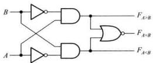
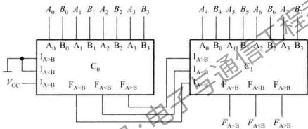

---
tags:
  - 数值比较器
  - 1位比较器
  - 多位比较器
  - 级联扩展
created: 2026-03-27
last_updated: 2026-03-27
---

# 数值比较器

## 一、比较器概述

### 定义

**数值比较器**：对两个二进制数进行比较，判断它们的大小关系的逻辑电路。

### 比较结果

| 比较关系 | 输出信号 |
|----------|----------|
| $A > B$ | $Y_{A>B} = 1$ |
| $A = B$ | $Y_{A=B} = 1$ |
| $A < B$ | $Y_{A<B} = 1$ |

> [!tip] 互斥关系
> 三个输出**同时只有一个为1**，任意时刻只有一种比较结果成立！

---

## 二、1位数值比较器

### 功能

比较两个1位二进制数 $A$ 和 $B$ 的大小

### 真值表

| $A$ | $B$ | $Y_{A>B}$ | $Y_{A=B}$ | $Y_{A<B}$ |
|-----|-----|-----------|-----------|-----------|
| 0 | 0 | 0 | 1 | 0 |
| 0 | 1 | 0 | 0 | 1 |
| 1 | 0 | 1 | 0 | 0 |
| 1 | 1 | 0 | 1 | 0 |

### 逻辑表达式

$$Y_{A>B} = A\bar{B}$$

$$Y_{A=B} = \bar{A}\bar{B} + AB = \overline{A \oplus B} = A \odot B$$

$$Y_{A<B} = \bar{A}B$$

### 逻辑图



---

## 三、多位数值比较器

### 比较原理

从**高位到低位**逐位比较：
1. 若高位已能判断大小，则直接得出结论
2. 若高位相等，则比较次高位
3. 依次类推，直到最低位

### 2位数值比较器

设 $A = A_1A_0$，$B = B_1B_0$

#### 比较逻辑

**$A > B$ 的条件**：
$$Y_{A>B} = A_1\bar{B_1} + \overline{A_1 \oplus B_1} \cdot A_0\bar{B_0}$$

即：
- 高位 $A_1 > B_1$，或
- 高位相等且低位 $A_0 > B_0$

**$A = B$ 的条件**：
$$Y_{A=B} = \overline{A_1 \oplus B_1} \cdot \overline{A_0 \oplus B_0}$$

即：每一位都相等

**$A < B$ 的条件**：
$$Y_{A<B} = \bar{A_1}B_1 + \overline{A_1 \oplus B_1} \cdot \bar{A_0}B_0$$

即：
- 高位 $A_1 < B_1$，或
- 高位相等且低位 $A_0 < B_0$

> [!tip] 简化记忆
> - 先比较高位的1位比较结果
> - 若高位相等（$Y_{A=B}=1$），则看低位比较结果
> - 若高位不等，则直接取高位比较结果

---

## 四、4位数值比较器：74LS85

### 功能概述

74LS85是**4位数值比较器**

### 引脚功能

| 引脚类型 | 引脚 | 功能 |
|----------|------|------|
| **数据输入** | $A_3A_2A_1A_0$ | 4位数A |
| | $B_3B_2B_1B_0$ | 4位数B |
| **级联输入** | $I_{A>B}$ | 来自低位片的 $A>B$ |
| | $I_{A=B}$ | 来自低位片的 $A=B$ |
| | $I_{A<B}$ | 来自低位片的 $A<B$ |
| **输出** | $Y_{A>B}$ | $A>B$ |
| | $Y_{A=B}$ | $A=B$ |
| | $Y_{A<B}$ | $A<B$ |

### 逻辑表达式

$$Y_{A>B} = (A>B) + (A=B) \cdot I_{A>B}$$

$$Y_{A=B} = (A=B) \cdot I_{A=B}$$

$$Y_{A<B} = (A<B) + (A=B) \cdot I_{A<B}$$

> [!warning] 级联输入的作用
> 当本片比较的4位相等时，结果取决于**级联输入**（低位片的比较结果）！

---

## 五、比较器的级联扩展 ⭐

### 用两片74LS85组成8位比较器

**方法**：串联扩展


### 级联规则

| 级联输入 | 单片使用时的接法 | 级联使用时的接法 |
|----------|------------------|------------------|
| $I_{A>B}$ | 接0 | 接低位片的 $Y_{A>B}$ |
| $I_{A=B}$ | 接1 | 接低位片的 $Y_{A=B}$ |
| $I_{A<B}$ | 接0 | 接低位片的 $Y_{A<B}$ |

> [!tip] 单片使用必记
> **最低位片**的级联输入必须接：$I_{A>B}=0, I_{A=B}=1, I_{A<B}=0$
> 这样当4位相等时，输出 $Y_{A=B}=1$

---

## 六、比较器的并联扩展

### 用5片74LS85组成16位比较器

**方法**：两级并联（速度快）

```
片1 (A_3~A_0) ──> Y ──┐
片2 (A_7~A_4) ──> Y ──┤
片3 (A_11~A_8) ──> Y ──┼──> 片5 (第二级比较) ──> 最终输出
片4 (A_15~A_12) ──> Y ──┘
```

**优点**：延迟时间短（只需两级）

---

## 七、比较器应用

### 1. 判断数值范围

判断 $A$ 是否在 $[L, H]$ 范围内：
- $A \geq L$：比较器1
- $A \leq H$：比较器2
- 两者相与

### 2. 地址译码

判断地址是否在某个范围内

### 3. 自动控制

温度、压力等物理量的上下限比较

---

## 八、常见错误

| 错误类型 | 表现 | 避免方法 |
|----------|------|----------|
| 级联输入接错 | 8位比较错误 | 低位片：$I_{A>B}=0, I_{A=B}=1, I_{A<B}=0$ |
| 忘记级联 | 只比较4位 | 多片使用时必须级联 |
| 高低位顺序错 | A_3是高位 | A_3是最高位，A_0是最低位 |

---

## 九、考试要点 ⭐

1. **理解比较原理**：从高位到低位逐位比较
2. **会设计1位比较器**：三个输出表达式
3. **会用74LS85**：4位比较、级联输入功能
4. **会级联扩展**：
   - 串联：低位输出接高位级联输入
   - 单片使用：$I_{A>B}=0, I_{A=B}=1, I_{A<B}=0$

---

## 🔗 相关链接

- [[08-算术运算单元]] - 算术运算
- [[05-译码器]] - 译码器

---

*创建日期: 2026-03-27*
*最后更新: 2026-03-27*
